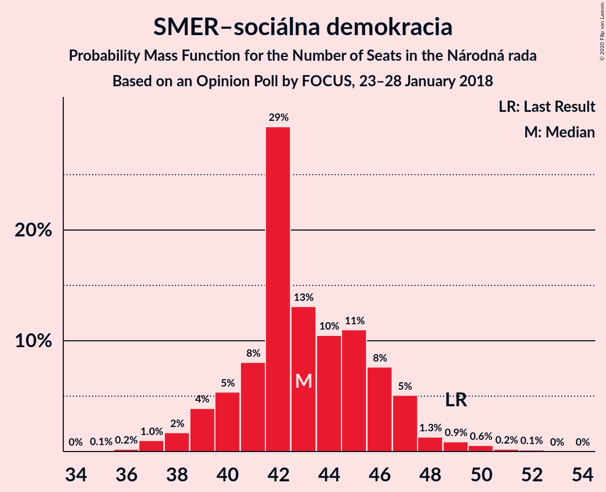
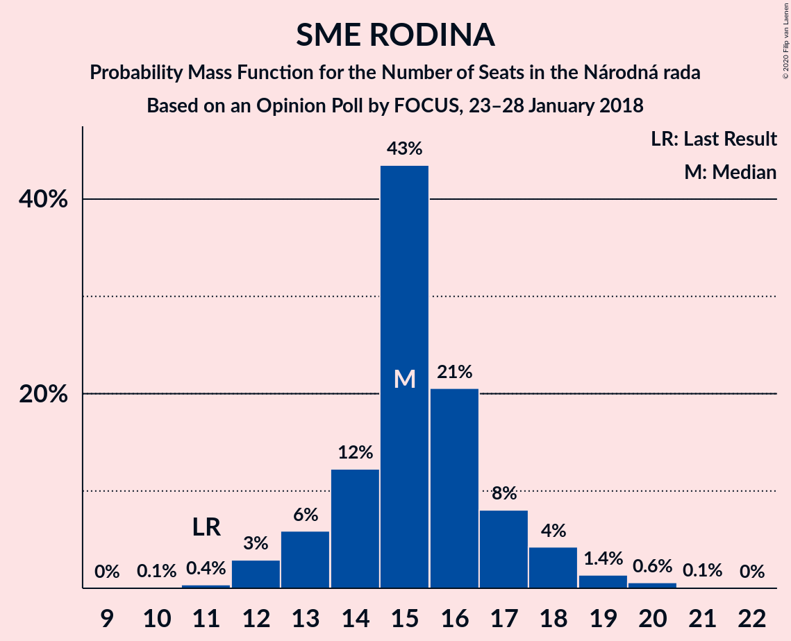
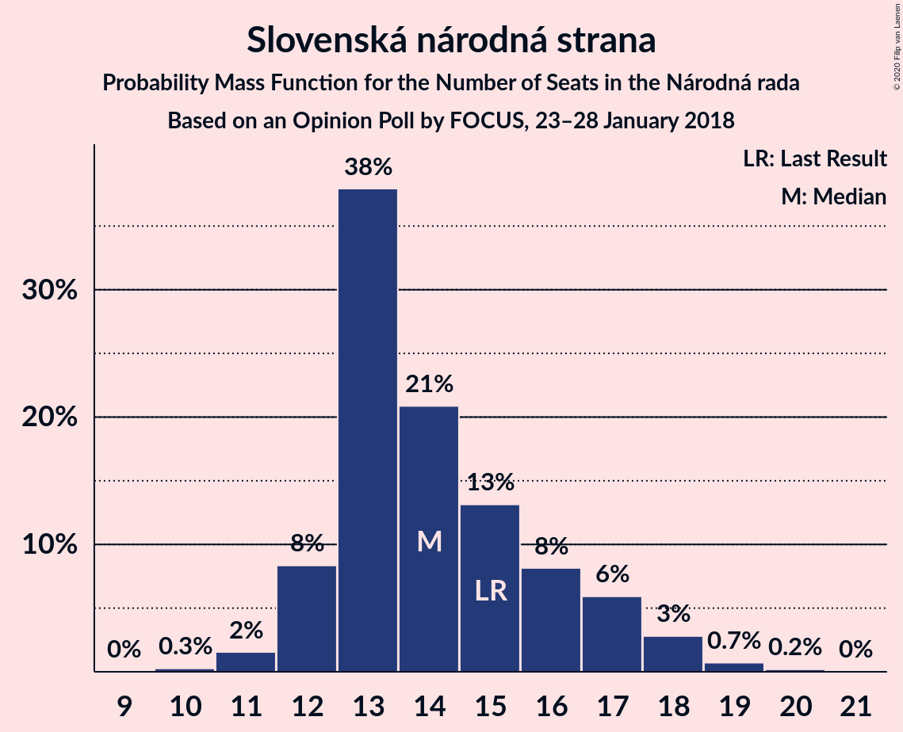
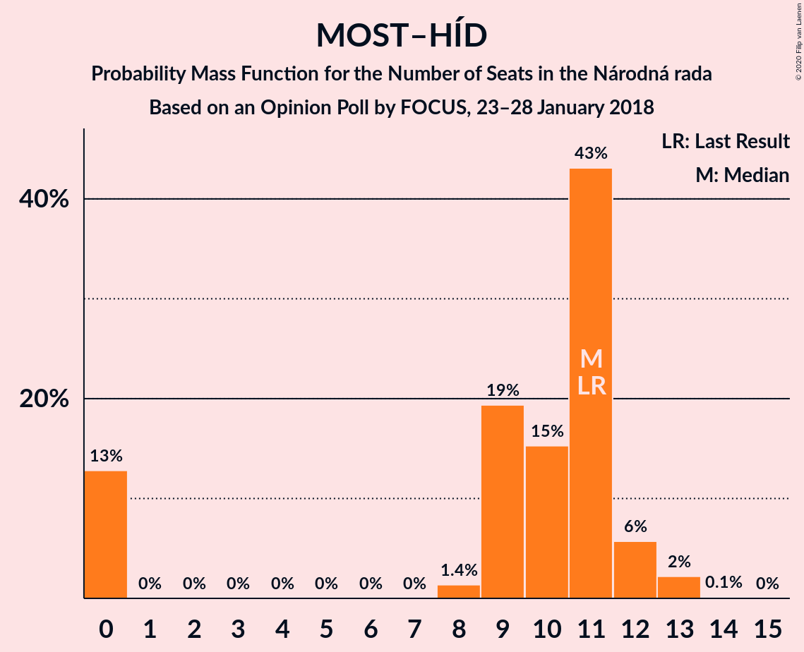

# Opinion Poll by FOCUS, 23–28 January 2018

<a href="#voting-intentions">Voting Intentions</a> | <a href="#seats">Seats</a> | <a href="#coalitions">Coalitions</a> | <a href="#technical-information">Technical Information</a>

## Voting Intentions

### Confidence Intervals

| Party | Last Result | Poll Result | 80% Confidence Interval | 90% Confidence Interval | 95% Confidence Interval | 99% Confidence Interval |
|:-----:|:-----------:|:-----------:|:-----------------------:|:-----------------------:|:-----------------------:|:-----------------------:|
| SMER–sociálna demokracia | 28.3% | 25.5% | 23.8–27.3% |23.3–27.8% |22.9–28.3% |22.1–29.2% |
| Sloboda a Solidarita | 12.1% | 13.1% | 11.9–14.6% |11.5–15.0% |11.2–15.4% |10.6–16.1% |
| OBYČAJNÍ ĽUDIA a nezávislé osobnosti | 11.0% | 11.4% | 10.2–12.7% |9.8–13.1% |9.5–13.5% |9.0–14.2% |
| SME RODINA | 6.6% | 9.0% | 7.9–10.3% |7.6–10.6% |7.4–10.9% |6.9–11.6% |
| Slovenská národná strana | 8.6% | 8.6% | 7.6–9.8% |7.3–10.2% |7.0–10.5% |6.6–11.1% |
| Kotleba–Ľudová strana Naše Slovensko | 8.0% | 8.1% | 7.1–9.3% |6.8–9.6% |6.6–10.0% |6.1–10.6% |
| Kresťanskodemokratické hnutie | 4.9% | 7.4% | 6.4–8.6% |6.2–8.9% |5.9–9.2% |5.5–9.8% |
| MOST–HÍD | 6.5% | 5.7% | 4.9–6.8% |4.6–7.1% |4.5–7.3% |4.1–7.9% |
| Strana maďarskej koalície–Magyar Koalíció Pártja | 4.0% | 3.9% | 3.2–4.8% |3.0–5.0% |2.8–5.2% |2.5–5.7% |
| Progresívne Slovensko | 0.0% | 1.9% | 1.4–2.6% |1.3–2.7% |1.2–2.9% |1.0–3.3% |

*Note:* The poll result column reflects the actual value used in the calculations. Published results may vary slightly, and in addition be rounded to fewer digits.

## Seats

### Confidence Intervals

| Party | Last Result | Median | 80% Confidence Interval | 90% Confidence Interval | 95% Confidence Interval | 99% Confidence Interval |
|:-----:|:-----------:|:------:|:-----------------------:|:-----------------------:|:-----------------------:|:-----------------------:|
| <a href="#smer–sociálna-demokracia">SMER–sociálna demokracia</a> | 49 | 44 | 40–46 |38–47 |38–48 |37–52 |
| <a href="#sloboda-a-solidarita">Sloboda a Solidarita</a> | 21 | 21 | 19–24 |19–26 |19–26 |17–28 |
| <a href="#obyčajní-ľudia-a-nezávislé-osobnosti">OBYČAJNÍ ĽUDIA a nezávislé osobnosti</a> | 17 | 20 | 16–22 |15–23 |15–24 |15–24 |
| <a href="#sme-rodina">SME RODINA</a> | 11 | 14 | 13–18 |12–19 |12–19 |11–19 |
| <a href="#slovenská-národná-strana">Slovenská národná strana</a> | 15 | 15 | 12–17 |12–17 |12–19 |11–19 |
| <a href="#kotleba–ľudová-strana-naše-slovensko">Kotleba–Ľudová strana Naše Slovensko</a> | 14 | 14 | 12–17 |12–17 |11–17 |10–18 |
| <a href="#kresťanskodemokratické-hnutie">Kresťanskodemokratické hnutie</a> | 0 | 13 | 11–15 |10–15 |10–16 |9–17 |
| <a href="#most–híd">MOST–HÍD</a> | 11 | 10 | 0–11 |0–12 |0–12 |0–13 |
| <a href="#strana-maďarskej-koalície–magyar-koalíció-pártja">Strana maďarskej koalície–Magyar Koalíció Pártja</a> | 0 | 0 | 0 |0–8 |0–8 |0–9 |
| <a href="#progresívne-slovensko">Progresívne Slovensko</a> | 0 | 0 | 0 |0 |0 |0 |

### SMER–sociálna demokracia

*For a full overview of the results for this party, see the [SMER–sociálna demokracia](party-smer–sociálnademokracia.html) page.*

| Number of Seats | Probability | Accumulated | Special Marks |
|:---------------:|:-----------:|:-----------:|:-------------:|
| 36 | 0.4% | 100% |  |
| 37 | 0.6% | 99.6% |  |
| 38 | 7% | 98.9% |  |
| 39 | 0.8% | 92% |  |
| 40 | 4% | 91% |  |
| 41 | 6% | 87% |  |
| 42 | 15% | 81% |  |
| 43 | 14% | 66% |  |
| 44 | 15% | 52% | Median |
| 45 | 19% | 37% |  |
| 46 | 12% | 18% |  |
| 47 | 3% | 5% |  |
| 48 | 1.1% | 3% |  |
| 49 | 0.1% | 2% | Last Result |
| 50 | 0.4% | 1.4% |  |
| 51 | 0.1% | 1.0% |  |
| 52 | 0.8% | 0.9% |  |
| 53 | 0.1% | 0.1% |  |
| 54 | 0% | 0% |  |

### Sloboda a Solidarita

*For a full overview of the results for this party, see the [Sloboda a Solidarita](party-slobodaasolidarita.html) page.*

| Number of Seats | Probability | Accumulated | Special Marks |
|:---------------:|:-----------:|:-----------:|:-------------:|
| 17 | 1.0% | 100% |  |
| 18 | 1.1% | 99.0% |  |
| 19 | 12% | 98% |  |
| 20 | 15% | 86% |  |
| 21 | 26% | 71% | Last Result, Median |
| 22 | 21% | 46% |  |
| 23 | 6% | 25% |  |
| 24 | 11% | 19% |  |
| 25 | 0.7% | 8% |  |
| 26 | 6% | 8% |  |
| 27 | 1.2% | 2% |  |
| 28 | 0.2% | 0.6% |  |
| 29 | 0.4% | 0.4% |  |
| 30 | 0% | 0% |  |

### OBYČAJNÍ ĽUDIA a nezávislé osobnosti

*For a full overview of the results for this party, see the [OBYČAJNÍ ĽUDIA a nezávislé osobnosti](party-obyčajníľudiaanezávisléosobnosti.html) page.*

| Number of Seats | Probability | Accumulated | Special Marks |
|:---------------:|:-----------:|:-----------:|:-------------:|
| 14 | 0.1% | 100% |  |
| 15 | 6% | 99.9% |  |
| 16 | 5% | 94% |  |
| 17 | 13% | 89% | Last Result |
| 18 | 17% | 76% |  |
| 19 | 5% | 59% |  |
| 20 | 13% | 54% | Median |
| 21 | 19% | 41% |  |
| 22 | 16% | 21% |  |
| 23 | 1.0% | 5% |  |
| 24 | 4% | 4% |  |
| 25 | 0.3% | 0.4% |  |
| 26 | 0% | 0% |  |

### SME RODINA

*For a full overview of the results for this party, see the [SME RODINA](party-smerodina.html) page.*

| Number of Seats | Probability | Accumulated | Special Marks |
|:---------------:|:-----------:|:-----------:|:-------------:|
| 10 | 0.1% | 100% |  |
| 11 | 0.7% | 99.9% | Last Result |
| 12 | 7% | 99.2% |  |
| 13 | 13% | 92% |  |
| 14 | 30% | 79% | Median |
| 15 | 13% | 50% |  |
| 16 | 20% | 36% |  |
| 17 | 6% | 17% |  |
| 18 | 6% | 11% |  |
| 19 | 5% | 5% |  |
| 20 | 0.1% | 0.1% |  |
| 21 | 0.1% | 0.1% |  |
| 22 | 0% | 0% |  |

### Slovenská národná strana

*For a full overview of the results for this party, see the [Slovenská národná strana](party-slovenskánárodnástrana.html) page.*

| Number of Seats | Probability | Accumulated | Special Marks |
|:---------------:|:-----------:|:-----------:|:-------------:|
| 10 | 0.2% | 100% |  |
| 11 | 2% | 99.8% |  |
| 12 | 13% | 98% |  |
| 13 | 8% | 85% |  |
| 14 | 13% | 77% |  |
| 15 | 33% | 64% | Last Result, Median |
| 16 | 14% | 31% |  |
| 17 | 14% | 17% |  |
| 18 | 0.3% | 3% |  |
| 19 | 2% | 3% |  |
| 20 | 0.3% | 0.4% |  |
| 21 | 0% | 0% |  |

### Kotleba–Ľudová strana Naše Slovensko

*For a full overview of the results for this party, see the [Kotleba–Ľudová strana Naše Slovensko](party-kotleba–ľudovástrananašeslovensko.html) page.*

| Number of Seats | Probability | Accumulated | Special Marks |
|:---------------:|:-----------:|:-----------:|:-------------:|
| 9 | 0.1% | 100% |  |
| 10 | 2% | 99.9% |  |
| 11 | 1.3% | 98% |  |
| 12 | 13% | 97% |  |
| 13 | 17% | 84% |  |
| 14 | 25% | 66% | Last Result, Median |
| 15 | 25% | 41% |  |
| 16 | 4% | 16% |  |
| 17 | 11% | 12% |  |
| 18 | 1.1% | 1.2% |  |
| 19 | 0.1% | 0.1% |  |
| 20 | 0% | 0% |  |

### Kresťanskodemokratické hnutie

*For a full overview of the results for this party, see the [Kresťanskodemokratické hnutie](party-kresťanskodemokratickéhnutie.html) page.*

| Number of Seats | Probability | Accumulated | Special Marks |
|:---------------:|:-----------:|:-----------:|:-------------:|
| 0 | 0% | 100% | Last Result |
| 1 | 0% | 100% |  |
| 2 | 0% | 100% |  |
| 3 | 0% | 100% |  |
| 4 | 0% | 100% |  |
| 5 | 0% | 100% |  |
| 6 | 0% | 100% |  |
| 7 | 0% | 100% |  |
| 8 | 0.2% | 100% |  |
| 9 | 0.3% | 99.8% |  |
| 10 | 9% | 99.5% |  |
| 11 | 6% | 91% |  |
| 12 | 29% | 85% |  |
| 13 | 27% | 56% | Median |
| 14 | 14% | 29% |  |
| 15 | 13% | 16% |  |
| 16 | 1.2% | 3% |  |
| 17 | 1.2% | 1.4% |  |
| 18 | 0.2% | 0.2% |  |
| 19 | 0% | 0% |  |

### MOST–HÍD

*For a full overview of the results for this party, see the [MOST–HÍD](party-most–híd.html) page.*

| Number of Seats | Probability | Accumulated | Special Marks |
|:---------------:|:-----------:|:-----------:|:-------------:|
| 0 | 19% | 100% |  |
| 1 | 0% | 81% |  |
| 2 | 0% | 81% |  |
| 3 | 0% | 81% |  |
| 4 | 0% | 81% |  |
| 5 | 0% | 81% |  |
| 6 | 0% | 81% |  |
| 7 | 0% | 81% |  |
| 8 | 4% | 81% |  |
| 9 | 17% | 77% |  |
| 10 | 23% | 60% | Median |
| 11 | 28% | 37% | Last Result |
| 12 | 6% | 9% |  |
| 13 | 2% | 2% |  |
| 14 | 0.1% | 0.1% |  |
| 15 | 0% | 0% |  |

### Strana maďarskej koalície–Magyar Koalíció Pártja

*For a full overview of the results for this party, see the [Strana maďarskej koalície–Magyar Koalíció Pártja](party-stranamaďarskejkoalície–magyarkoalíciópártja.html) page.*

| Number of Seats | Probability | Accumulated | Special Marks |
|:---------------:|:-----------:|:-----------:|:-------------:|
| 0 | 92% | 100% | Last Result, Median |
| 1 | 0% | 8% |  |
| 2 | 0% | 8% |  |
| 3 | 0% | 8% |  |
| 4 | 0% | 8% |  |
| 5 | 0% | 8% |  |
| 6 | 0% | 8% |  |
| 7 | 0% | 8% |  |
| 8 | 7% | 8% |  |
| 9 | 0.6% | 0.9% |  |
| 10 | 0.3% | 0.3% |  |
| 11 | 0% | 0% |  |

### Progresívne Slovensko

*For a full overview of the results for this party, see the [Progresívne Slovensko](party-progresívneslovensko.html) page.*

| Number of Seats | Probability | Accumulated | Special Marks |
|:---------------:|:-----------:|:-----------:|:-------------:|
| 0 | 100% | 100% | Last Result, Median |

## Coalitions

### Confidence Intervals

| Coalition | Last Result | Median | Majority? | 80% Confidence Interval | 90% Confidence Interval | 95% Confidence Interval | 99% Confidence Interval |
|:---------:|:-----------:|:------:|:---------:|:-----------------------:|:-----------------------:|:-----------------------:|:-----------------------:|
| SMER–sociálna demokracia – Slovenská národná strana – MOST–HÍD | 75 | 67 | 0.1% | 62–71 | 58–72 | 56–73 | 56–74 |
| SMER–sociálna demokracia | 49 | 44 | 0% | 40–46 | 38–47 | 38–48 | 37–52 |

### SMER–sociálna demokracia – Slovenská národná strana – MOST–HÍD

| Number of Seats | Probability | Accumulated | Special Marks |
|:---------------:|:-----------:|:-----------:|:-------------:|
| 54 | 0% | 100% |  |
| 55 | 0% | 99.9% |  |
| 56 | 4% | 99.9% |  |
| 57 | 0.1% | 96% |  |
| 58 | 1.1% | 96% |  |
| 59 | 0.5% | 95% |  |
| 60 | 0.7% | 94% |  |
| 61 | 0.4% | 93% |  |
| 62 | 18% | 93% |  |
| 63 | 3% | 75% |  |
| 64 | 3% | 71% |  |
| 65 | 5% | 69% |  |
| 66 | 2% | 63% |  |
| 67 | 11% | 61% |  |
| 68 | 11% | 50% |  |
| 69 | 14% | 38% | Median |
| 70 | 11% | 24% |  |
| 71 | 6% | 13% |  |
| 72 | 5% | 8% |  |
| 73 | 0.2% | 3% |  |
| 74 | 2% | 2% |  |
| 75 | 0.2% | 0.3% | Last Result |
| 76 | 0.1% | 0.1% | Majority |
| 77 | 0% | 0% |  |

### SMER–sociálna demokracia

| Number of Seats | Probability | Accumulated | Special Marks |
|:---------------:|:-----------:|:-----------:|:-------------:|
| 36 | 0.4% | 100% |  |
| 37 | 0.6% | 99.6% |  |
| 38 | 7% | 98.9% |  |
| 39 | 0.8% | 92% |  |
| 40 | 4% | 91% |  |
| 41 | 6% | 87% |  |
| 42 | 15% | 81% |  |
| 43 | 14% | 66% |  |
| 44 | 15% | 52% | Median |
| 45 | 19% | 37% |  |
| 46 | 12% | 18% |  |
| 47 | 3% | 5% |  |
| 48 | 1.1% | 3% |  |
| 49 | 0.1% | 2% | Last Result |
| 50 | 0.4% | 1.4% |  |
| 51 | 0.1% | 1.0% |  |
| 52 | 0.8% | 0.9% |  |
| 53 | 0.1% | 0.1% |  |
| 54 | 0% | 0% |  |

## Technical Information

### Opinion Poll

+ **Polling firm:** FOCUS
+ **Commissioner(s):** —
+ **Fieldwork period:** 23–28 January 2018

### Calculations

+ **Sample size:** 1012
+ **Simulations done:** 131,072
+ **Error estimate:** 2.00%

