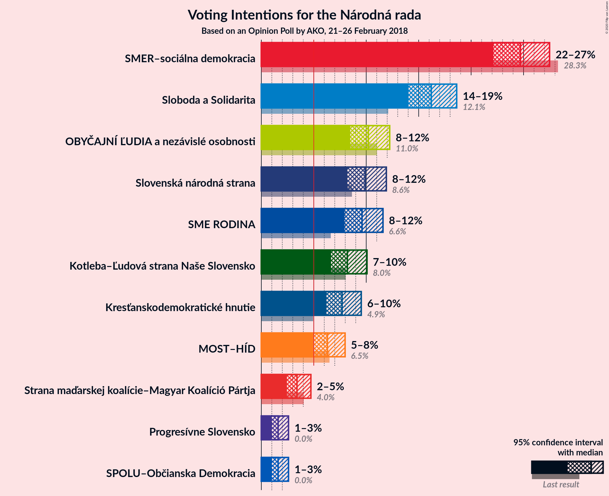
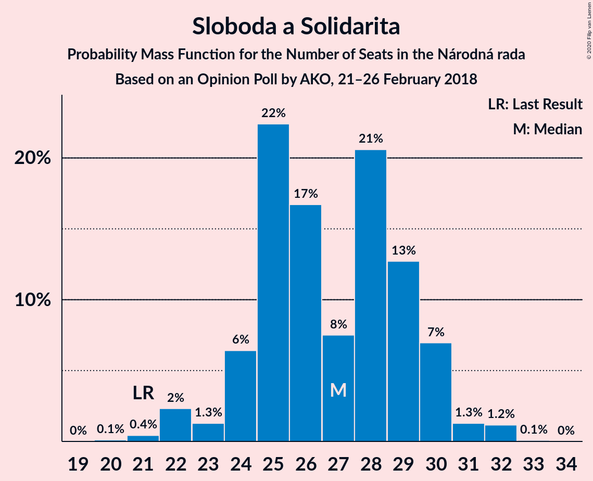
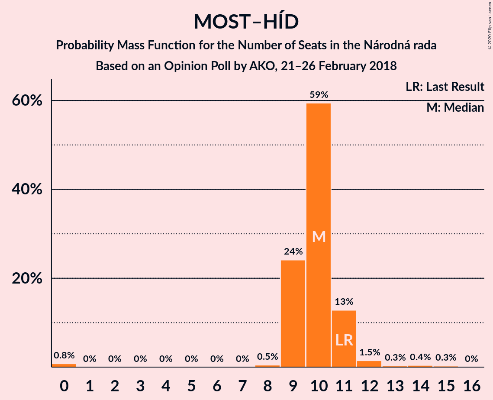
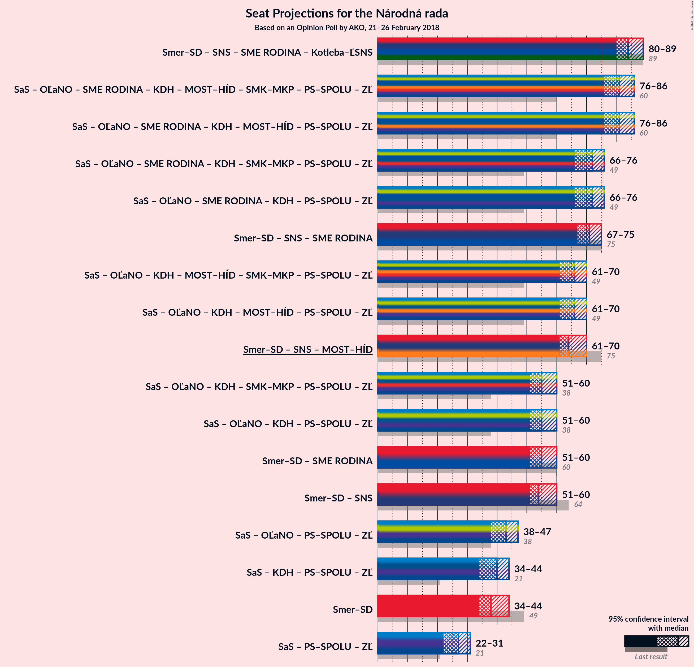
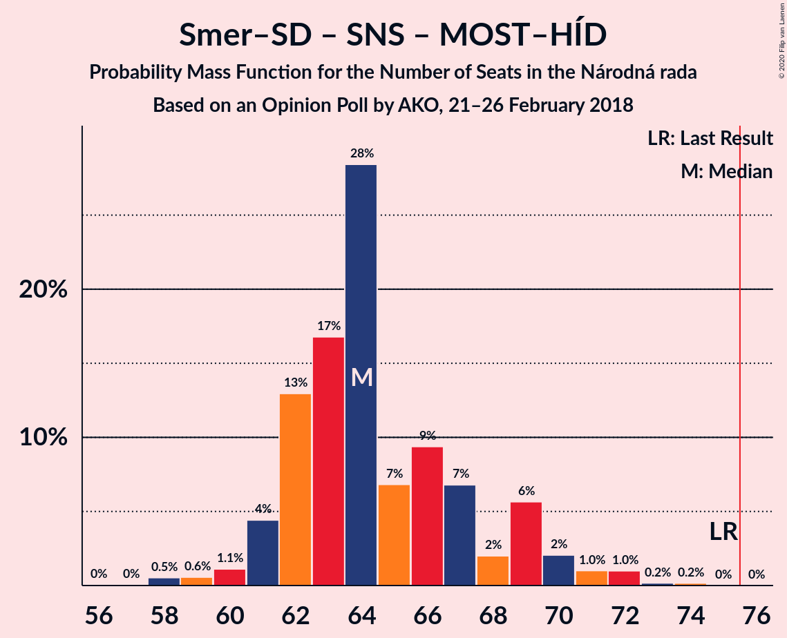

# Opinion Poll by AKO, 21–26 February 2018

<a href="#voting-intentions">Voting Intentions</a> | <a href="#seats">Seats</a> | <a href="#coalitions">Coalitions</a> | <a href="#technical-information">Technical Information</a>

## Voting Intentions

### Confidence Intervals

| Party | Last Result | Poll Result | 80% Confidence Interval | 90% Confidence Interval | 95% Confidence Interval | 99% Confidence Interval |
|:-----:|:-----------:|:-----------:|:-----------------------:|:-----------------------:|:-----------------------:|:-----------------------:|
| SMER–sociálna demokracia | 28.3% | 24.7% | 23.0–26.5% |22.5–27.0% |22.1–27.5% |21.3–28.4% |
| Sloboda a Solidarita | 12.1% | 16.2% | 14.8–17.8% |14.4–18.2% |14.0–18.6% |13.4–19.4% |
| OBYČAJNÍ ĽUDIA a nezávislé osobnosti | 11.0% | 10.2% | 9.1–11.5% |8.7–11.9% |8.5–12.2% |8.0–12.9% |
| Slovenská národná strana | 8.6% | 9.9% | 8.8–11.2% |8.5–11.6% |8.2–11.9% |7.7–12.6% |
| SME RODINA | 6.6% | 9.6% | 8.5–10.9% |8.2–11.3% |7.9–11.6% |7.4–12.2% |
| Kotleba–Ľudová strana Naše Slovensko | 8.0% | 8.2% | 7.2–9.4% |6.9–9.8% |6.6–10.1% |6.2–10.7% |
| Kresťanskodemokratické hnutie | 4.9% | 7.7% | 6.7–8.9% |6.4–9.2% |6.2–9.5% |5.8–10.1% |
| MOST–HÍD | 6.5% | 6.3% | 5.4–7.4% |5.2–7.7% |5.0–8.0% |4.6–8.6% |
| Strana maďarskej koalície–Magyar Koalíció Pártja | 4.0% | 3.4% | 2.8–4.3% |2.6–4.5% |2.4–4.7% |2.2–5.2% |
| Progresívne Slovensko | 0.0% | 1.6% | 1.2–2.2% |1.1–2.4% |1.0–2.6% |0.8–2.9% |
| SPOLU–Občianska Demokracia | 0.0% | 1.6% | 1.2–2.2% |1.1–2.4% |1.0–2.6% |0.8–2.9% |

*Note:* The poll result column reflects the actual value used in the calculations. Published results may vary slightly, and in addition be rounded to fewer digits.

## Seats

### Confidence Intervals

| Party | Last Result | Median | 80% Confidence Interval | 90% Confidence Interval | 95% Confidence Interval | 99% Confidence Interval |
|:-----:|:-----------:|:------:|:-----------------------:|:-----------------------:|:-----------------------:|:-----------------------:|
| <a href="#smer–sociálna-demokracia">SMER–sociálna demokracia</a> | 49 | 38 | 34–41 |34–43 |34–44 |34–49 |
| <a href="#sloboda-a-solidarita">Sloboda a Solidarita</a> | 21 | 26 | 23–28 |22–28 |22–30 |22–31 |
| <a href="#obyčajní-ľudia-a-nezávislé-osobnosti">OBYČAJNÍ ĽUDIA a nezávislé osobnosti</a> | 17 | 16 | 13–19 |13–20 |13–20 |13–20 |
| <a href="#slovenská-národná-strana">Slovenská národná strana</a> | 15 | 15 | 13–17 |13–18 |13–20 |12–20 |
| <a href="#sme-rodina">SME RODINA</a> | 11 | 17 | 15–19 |14–19 |14–19 |13–19 |
| <a href="#kotleba–ľudová-strana-naše-slovensko">Kotleba–Ľudová strana Naše Slovensko</a> | 14 | 15 | 12–15 |12–16 |11–16 |10–18 |
| <a href="#kresťanskodemokratické-hnutie">Kresťanskodemokratické hnutie</a> | 0 | 12 | 11–15 |10–15 |10–15 |10–16 |
| <a href="#most–híd">MOST–HÍD</a> | 11 | 10 | 10–12 |9–12 |8–12 |0–14 |
| <a href="#strana-maďarskej-koalície–magyar-koalíció-pártja">Strana maďarskej koalície–Magyar Koalíció Pártja</a> | 0 | 0 | 0 |0 |0 |0–8 |
| <a href="#progresívne-slovensko">Progresívne Slovensko</a> | 0 | 0 | 0 |0 |0 |0 |
| <a href="#spolu–občianska-demokracia">SPOLU–Občianska Demokracia</a> | 0 | 0 | 0 |0 |0 |0 |

### SMER–sociálna demokracia

*For a full overview of the results for this party, see the [SMER–sociálna demokracia](party-smer–sociálnademokracia.html) page.*

| Number of Seats | Probability | Accumulated | Special Marks |
|:---------------:|:-----------:|:-----------:|:-------------:|
| 33 | 0.4% | 100% |  |
| 34 | 20% | 99.6% |  |
| 35 | 0.6% | 80% |  |
| 36 | 2% | 79% |  |
| 37 | 17% | 78% |  |
| 38 | 20% | 60% | Median |
| 39 | 1.4% | 40% |  |
| 40 | 20% | 39% |  |
| 41 | 12% | 19% |  |
| 42 | 2% | 7% |  |
| 43 | 0.3% | 5% |  |
| 44 | 3% | 5% |  |
| 45 | 0.4% | 2% |  |
| 46 | 0.3% | 1.2% |  |
| 47 | 0.1% | 0.9% |  |
| 48 | 0% | 0.9% |  |
| 49 | 0.8% | 0.8% | Last Result |
| 50 | 0% | 0% |  |

### Sloboda a Solidarita

*For a full overview of the results for this party, see the [Sloboda a Solidarita](party-slobodaasolidarita.html) page.*

| Number of Seats | Probability | Accumulated | Special Marks |
|:---------------:|:-----------:|:-----------:|:-------------:|
| 20 | 0.1% | 100% |  |
| 21 | 0% | 99.9% | Last Result |
| 22 | 9% | 99.8% |  |
| 23 | 2% | 91% |  |
| 24 | 3% | 89% |  |
| 25 | 4% | 86% |  |
| 26 | 43% | 82% | Median |
| 27 | 11% | 39% |  |
| 28 | 24% | 28% |  |
| 29 | 1.0% | 4% |  |
| 30 | 2% | 3% |  |
| 31 | 0.6% | 0.9% |  |
| 32 | 0.3% | 0.3% |  |
| 33 | 0% | 0% |  |

### OBYČAJNÍ ĽUDIA a nezávislé osobnosti

*For a full overview of the results for this party, see the [OBYČAJNÍ ĽUDIA a nezávislé osobnosti](party-obyčajníľudiaanezávisléosobnosti.html) page.*

| Number of Seats | Probability | Accumulated | Special Marks |
|:---------------:|:-----------:|:-----------:|:-------------:|
| 12 | 0.4% | 100% |  |
| 13 | 12% | 99.6% |  |
| 14 | 4% | 88% |  |
| 15 | 3% | 84% |  |
| 16 | 32% | 81% | Median |
| 17 | 33% | 49% | Last Result |
| 18 | 3% | 16% |  |
| 19 | 6% | 13% |  |
| 20 | 7% | 8% |  |
| 21 | 0.3% | 0.3% |  |
| 22 | 0% | 0% |  |

### Slovenská národná strana

*For a full overview of the results for this party, see the [Slovenská národná strana](party-slovenskánárodnástrana.html) page.*

| Number of Seats | Probability | Accumulated | Special Marks |
|:---------------:|:-----------:|:-----------:|:-------------:|
| 11 | 0.1% | 100% |  |
| 12 | 1.1% | 99.9% |  |
| 13 | 12% | 98.8% |  |
| 14 | 9% | 87% |  |
| 15 | 37% | 77% | Last Result, Median |
| 16 | 10% | 40% |  |
| 17 | 22% | 31% |  |
| 18 | 5% | 9% |  |
| 19 | 1.1% | 4% |  |
| 20 | 2% | 3% |  |
| 21 | 0.1% | 0.2% |  |
| 22 | 0% | 0% |  |

### SME RODINA

*For a full overview of the results for this party, see the [SME RODINA](party-smerodina.html) page.*

| Number of Seats | Probability | Accumulated | Special Marks |
|:---------------:|:-----------:|:-----------:|:-------------:|
| 11 | 0% | 100% | Last Result |
| 12 | 0.1% | 99.9% |  |
| 13 | 1.0% | 99.8% |  |
| 14 | 5% | 98.8% |  |
| 15 | 12% | 94% |  |
| 16 | 19% | 82% |  |
| 17 | 28% | 63% | Median |
| 18 | 25% | 35% |  |
| 19 | 10% | 10% |  |
| 20 | 0% | 0.1% |  |
| 21 | 0% | 0% |  |

### Kotleba–Ľudová strana Naše Slovensko

*For a full overview of the results for this party, see the [Kotleba–Ľudová strana Naše Slovensko](party-kotleba–ľudovástrananašeslovensko.html) page.*

| Number of Seats | Probability | Accumulated | Special Marks |
|:---------------:|:-----------:|:-----------:|:-------------:|
| 8 | 0.1% | 100% |  |
| 9 | 0.1% | 99.9% |  |
| 10 | 0.7% | 99.8% |  |
| 11 | 2% | 99.1% |  |
| 12 | 15% | 97% |  |
| 13 | 7% | 82% |  |
| 14 | 13% | 75% | Last Result |
| 15 | 56% | 62% | Median |
| 16 | 4% | 7% |  |
| 17 | 2% | 2% |  |
| 18 | 0.7% | 0.7% |  |
| 19 | 0% | 0% |  |

### Kresťanskodemokratické hnutie

*For a full overview of the results for this party, see the [Kresťanskodemokratické hnutie](party-kresťanskodemokratickéhnutie.html) page.*

| Number of Seats | Probability | Accumulated | Special Marks |
|:---------------:|:-----------:|:-----------:|:-------------:|
| 0 | 0% | 100% | Last Result |
| 1 | 0% | 100% |  |
| 2 | 0% | 100% |  |
| 3 | 0% | 100% |  |
| 4 | 0% | 100% |  |
| 5 | 0% | 100% |  |
| 6 | 0% | 100% |  |
| 7 | 0% | 100% |  |
| 8 | 0% | 100% |  |
| 9 | 0.1% | 100% |  |
| 10 | 7% | 99.9% |  |
| 11 | 9% | 93% |  |
| 12 | 55% | 84% | Median |
| 13 | 7% | 29% |  |
| 14 | 1.1% | 22% |  |
| 15 | 20% | 21% |  |
| 16 | 1.0% | 1.1% |  |
| 17 | 0.1% | 0.1% |  |
| 18 | 0% | 0% |  |

### MOST–HÍD

*For a full overview of the results for this party, see the [MOST–HÍD](party-most–híd.html) page.*

| Number of Seats | Probability | Accumulated | Special Marks |
|:---------------:|:-----------:|:-----------:|:-------------:|
| 0 | 2% | 100% |  |
| 1 | 0% | 98% |  |
| 2 | 0% | 98% |  |
| 3 | 0% | 98% |  |
| 4 | 0% | 98% |  |
| 5 | 0% | 98% |  |
| 6 | 0% | 98% |  |
| 7 | 0% | 98% |  |
| 8 | 2% | 98% |  |
| 9 | 4% | 96% |  |
| 10 | 66% | 92% | Median |
| 11 | 14% | 26% | Last Result |
| 12 | 10% | 12% |  |
| 13 | 0.3% | 1.3% |  |
| 14 | 0.6% | 1.0% |  |
| 15 | 0.4% | 0.4% |  |
| 16 | 0% | 0% |  |

### Strana maďarskej koalície–Magyar Koalíció Pártja

*For a full overview of the results for this party, see the [Strana maďarskej koalície–Magyar Koalíció Pártja](party-stranamaďarskejkoalície–magyarkoalíciópártja.html) page.*

| Number of Seats | Probability | Accumulated | Special Marks |
|:---------------:|:-----------:|:-----------:|:-------------:|
| 0 | 99.5% | 100% | Last Result, Median |
| 1 | 0% | 0.5% |  |
| 2 | 0% | 0.5% |  |
| 3 | 0% | 0.5% |  |
| 4 | 0% | 0.5% |  |
| 5 | 0% | 0.5% |  |
| 6 | 0% | 0.5% |  |
| 7 | 0% | 0.5% |  |
| 8 | 0.4% | 0.5% |  |
| 9 | 0.1% | 0.1% |  |
| 10 | 0% | 0% |  |

### Progresívne Slovensko

*For a full overview of the results for this party, see the [Progresívne Slovensko](party-progresívneslovensko.html) page.*

| Number of Seats | Probability | Accumulated | Special Marks |
|:---------------:|:-----------:|:-----------:|:-------------:|
| 0 | 100% | 100% | Last Result, Median |

### SPOLU–Občianska Demokracia

*For a full overview of the results for this party, see the [SPOLU–Občianska Demokracia](party-spolu–občianskademokracia.html) page.*

| Number of Seats | Probability | Accumulated | Special Marks |
|:---------------:|:-----------:|:-----------:|:-------------:|
| 0 | 100% | 100% | Last Result, Median |

## Coalitions

### Confidence Intervals

| Coalition | Last Result | Median | Majority? | 80% Confidence Interval | 90% Confidence Interval | 95% Confidence Interval | 99% Confidence Interval |
|:---------:|:-----------:|:------:|:---------:|:-----------------------:|:-----------------------:|:-----------------------:|:-----------------------:|
| SMER–sociálna demokracia – Slovenská národná strana – MOST–HÍD | 75 | 63 | 0% | 61–66 | 61–67 | 61–69 | 61–71 |
| SMER–sociálna demokracia | 49 | 38 | 0% | 34–41 | 34–43 | 34–44 | 34–49 |

### SMER–sociálna demokracia – Slovenská národná strana – MOST–HÍD

| Number of Seats | Probability | Accumulated | Special Marks |
|:---------------:|:-----------:|:-----------:|:-------------:|
| 57 | 0% | 100% |  |
| 58 | 0.1% | 99.9% |  |
| 59 | 0.3% | 99.9% |  |
| 60 | 0.1% | 99.6% |  |
| 61 | 20% | 99.5% |  |
| 62 | 3% | 79% |  |
| 63 | 35% | 76% | Median |
| 64 | 7% | 41% |  |
| 65 | 9% | 34% |  |
| 66 | 17% | 26% |  |
| 67 | 4% | 9% |  |
| 68 | 0.9% | 5% |  |
| 69 | 2% | 4% |  |
| 70 | 0.8% | 1.4% |  |
| 71 | 0.4% | 0.6% |  |
| 72 | 0.2% | 0.2% |  |
| 73 | 0% | 0% |  |
| 74 | 0% | 0% |  |
| 75 | 0% | 0% | Last Result |

### SMER–sociálna demokracia

| Number of Seats | Probability | Accumulated | Special Marks |
|:---------------:|:-----------:|:-----------:|:-------------:|
| 33 | 0.4% | 100% |  |
| 34 | 20% | 99.6% |  |
| 35 | 0.6% | 80% |  |
| 36 | 2% | 79% |  |
| 37 | 17% | 78% |  |
| 38 | 20% | 60% | Median |
| 39 | 1.4% | 40% |  |
| 40 | 20% | 39% |  |
| 41 | 12% | 19% |  |
| 42 | 2% | 7% |  |
| 43 | 0.3% | 5% |  |
| 44 | 3% | 5% |  |
| 45 | 0.4% | 2% |  |
| 46 | 0.3% | 1.2% |  |
| 47 | 0.1% | 0.9% |  |
| 48 | 0% | 0.9% |  |
| 49 | 0.8% | 0.8% | Last Result |
| 50 | 0% | 0% |  |

## Technical Information

### Opinion Poll

+ **Polling firm:** AKO
+ **Commissioner(s):** —
+ **Fieldwork period:** 21–26 February 2018

### Calculations

+ **Sample size:** 1000
+ **Simulations done:** 131,072
+ **Error estimate:** 2.07%

