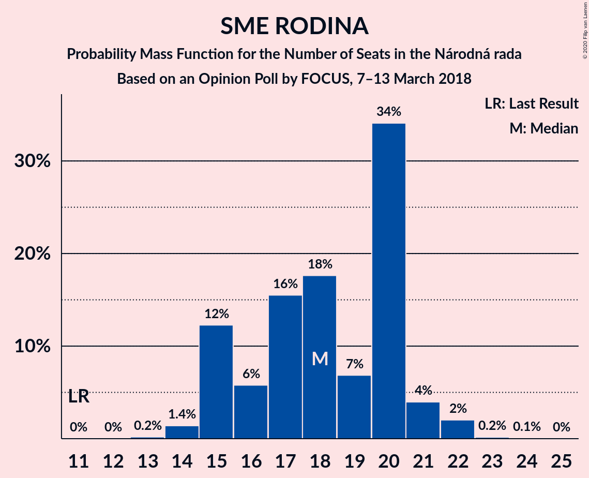
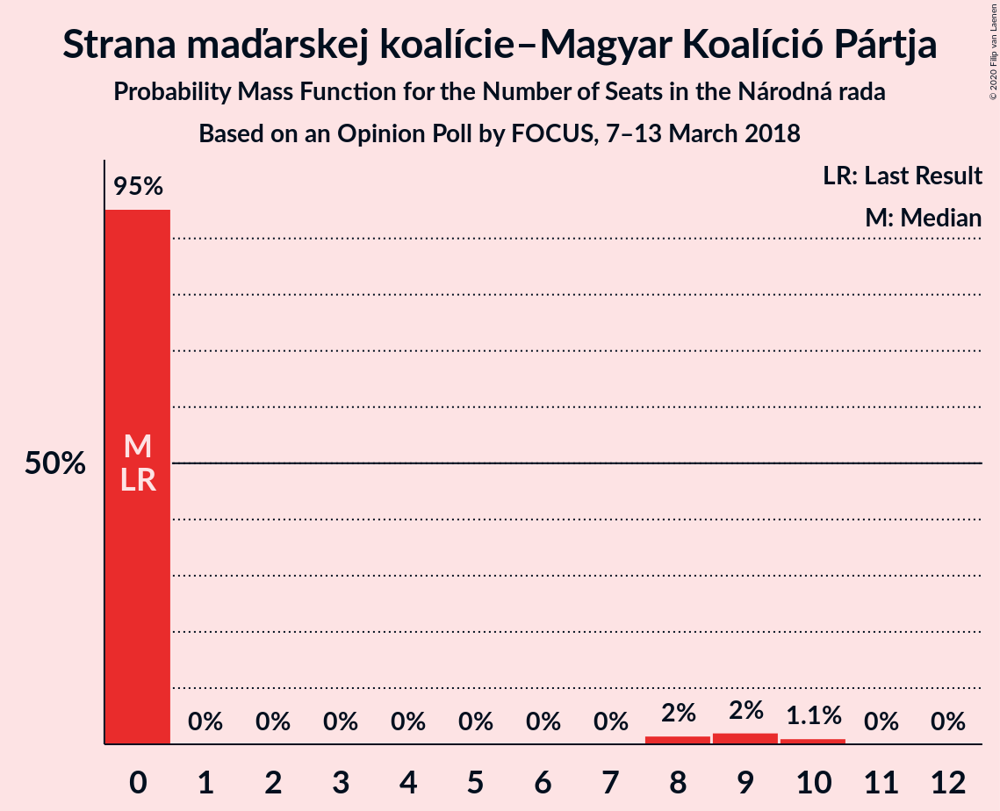

# Opinion Poll by FOCUS, 7–13 March 2018

<a href="#voting-intentions">Voting Intentions</a> | <a href="#seats">Seats</a> | <a href="#coalitions">Coalitions</a> | <a href="#technical-information">Technical Information</a>

## Voting Intentions

### Confidence Intervals

| Party | Last Result | Poll Result | 80% Confidence Interval | 90% Confidence Interval | 95% Confidence Interval | 99% Confidence Interval |
|:-----:|:-----------:|:-----------:|:-----------------------:|:-----------------------:|:-----------------------:|:-----------------------:|
| SMER–sociálna demokracia | 28.3% | 20.2% | 18.6–21.9% |18.2–22.3% |17.8–22.8% |17.1–23.6% |
| Sloboda a Solidarita | 12.1% | 14.0% | 12.7–15.5% |12.3–15.9% |12.0–16.3% |11.4–17.1% |
| OBYČAJNÍ ĽUDIA a nezávislé osobnosti | 11.0% | 10.4% | 9.2–11.7% |8.9–12.1% |8.6–12.4% |8.1–13.1% |
| SME RODINA | 6.6% | 10.4% | 9.2–11.7% |8.9–12.1% |8.6–12.4% |8.1–13.1% |
| Kotleba–Ľudová strana Naše Slovensko | 8.0% | 10.1% | 8.9–11.4% |8.6–11.8% |8.4–12.1% |7.9–12.8% |
| Slovenská národná strana | 8.6% | 10.0% | 8.9–11.3% |8.6–11.7% |8.3–12.0% |7.8–12.7% |
| Kresťanskodemokratické hnutie | 4.9% | 7.0% | 6.1–8.2% |5.8–8.5% |5.6–8.8% |5.2–9.3% |
| MOST–HÍD | 6.5% | 5.6% | 4.8–6.7% |4.6–7.0% |4.4–7.2% |4.0–7.8% |
| Strana maďarskej koalície–Magyar Koalíció Pártja | 4.0% | 4.1% | 3.4–5.0% |3.2–5.2% |3.0–5.5% |2.7–5.9% |
| Progresívne Slovensko | 0.0% | 1.4% | 1.0–2.0% |0.9–2.2% |0.8–2.3% |0.7–2.6% |
| SPOLU–Občianska Demokracia | 0.0% | 1.1% | 0.8–1.6% |0.7–1.8% |0.6–1.9% |0.5–2.2% |

*Note:* The poll result column reflects the actual value used in the calculations. Published results may vary slightly, and in addition be rounded to fewer digits.

## Seats

### Confidence Intervals

| Party | Last Result | Median | 80% Confidence Interval | 90% Confidence Interval | 95% Confidence Interval | 99% Confidence Interval |
|:-----:|:-----------:|:------:|:-----------------------:|:-----------------------:|:-----------------------:|:-----------------------:|
| <a href="#smer–sociálna-demokracia">SMER–sociálna demokracia</a> | 49 | 32 | 31–39 |31–40 |30–40 |29–40 |
| <a href="#sloboda-a-solidarita">Sloboda a Solidarita</a> | 21 | 25 | 23–26 |21–27 |21–30 |20–30 |
| <a href="#obyčajní-ľudia-a-nezávislé-osobnosti">OBYČAJNÍ ĽUDIA a nezávislé osobnosti</a> | 17 | 18 | 16–19 |15–20 |15–21 |14–23 |
| <a href="#sme-rodina">SME RODINA</a> | 11 | 19 | 14–20 |14–21 |14–21 |14–23 |
| <a href="#kotleba–ľudová-strana-naše-slovensko">Kotleba–Ľudová strana Naše Slovensko</a> | 14 | 19 | 15–20 |15–23 |15–23 |14–24 |
| <a href="#slovenská-národná-strana">Slovenská národná strana</a> | 15 | 15 | 14–18 |14–20 |14–21 |13–21 |
| <a href="#kresťanskodemokratické-hnutie">Kresťanskodemokratické hnutie</a> | 0 | 12 | 11–13 |10–14 |10–15 |9–16 |
| <a href="#most–híd">MOST–HÍD</a> | 11 | 9 | 9–11 |0–11 |0–14 |0–14 |
| <a href="#strana-maďarskej-koalície–magyar-koalíció-pártja">Strana maďarskej koalície–Magyar Koalíció Pártja</a> | 0 | 0 | 0 |0 |0–9 |0–10 |
| <a href="#progresívne-slovensko">Progresívne Slovensko</a> | 0 | 0 | 0 |0 |0 |0 |
| <a href="#spolu–občianska-demokracia">SPOLU–Občianska Demokracia</a> | 0 | 0 | 0 |0 |0 |0 |

### SMER–sociálna demokracia

*For a full overview of the results for this party, see the [SMER–sociálna demokracia](party-smer–sociálnademokracia.html) page.*

| Number of Seats | Probability | Accumulated | Special Marks |
|:---------------:|:-----------:|:-----------:|:-------------:|
| 28 | 0.5% | 100% |  |
| 29 | 2% | 99.5% |  |
| 30 | 3% | 98% |  |
| 31 | 40% | 95% |  |
| 32 | 8% | 55% | Median |
| 33 | 6% | 47% |  |
| 34 | 9% | 41% |  |
| 35 | 3% | 31% |  |
| 36 | 4% | 28% |  |
| 37 | 2% | 24% |  |
| 38 | 1.1% | 22% |  |
| 39 | 11% | 21% |  |
| 40 | 10% | 10% |  |
| 41 | 0.1% | 0.3% |  |
| 42 | 0.2% | 0.2% |  |
| 43 | 0% | 0% |  |
| 44 | 0% | 0% |  |
| 45 | 0% | 0% |  |
| 46 | 0% | 0% |  |
| 47 | 0% | 0% |  |
| 48 | 0% | 0% |  |
| 49 | 0% | 0% | Last Result |

### Sloboda a Solidarita

*For a full overview of the results for this party, see the [Sloboda a Solidarita](party-slobodaasolidarita.html) page.*

| Number of Seats | Probability | Accumulated | Special Marks |
|:---------------:|:-----------:|:-----------:|:-------------:|
| 18 | 0.1% | 100% |  |
| 19 | 0.3% | 99.9% |  |
| 20 | 1.2% | 99.6% |  |
| 21 | 4% | 98% | Last Result |
| 22 | 2% | 94% |  |
| 23 | 23% | 92% |  |
| 24 | 4% | 70% |  |
| 25 | 16% | 65% | Median |
| 26 | 42% | 49% |  |
| 27 | 2% | 7% |  |
| 28 | 0.6% | 5% |  |
| 29 | 0.4% | 4% |  |
| 30 | 4% | 4% |  |
| 31 | 0.2% | 0.2% |  |
| 32 | 0% | 0% |  |

### OBYČAJNÍ ĽUDIA a nezávislé osobnosti

*For a full overview of the results for this party, see the [OBYČAJNÍ ĽUDIA a nezávislé osobnosti](party-obyčajníľudiaanezávisléosobnosti.html) page.*

| Number of Seats | Probability | Accumulated | Special Marks |
|:---------------:|:-----------:|:-----------:|:-------------:|
| 13 | 0.2% | 100% |  |
| 14 | 0.9% | 99.7% |  |
| 15 | 7% | 98.8% |  |
| 16 | 10% | 92% |  |
| 17 | 13% | 82% | Last Result |
| 18 | 20% | 70% | Median |
| 19 | 42% | 50% |  |
| 20 | 6% | 8% |  |
| 21 | 1.0% | 3% |  |
| 22 | 1.0% | 2% |  |
| 23 | 0.7% | 0.8% |  |
| 24 | 0% | 0.1% |  |
| 25 | 0% | 0% |  |

### SME RODINA

*For a full overview of the results for this party, see the [SME RODINA](party-smerodina.html) page.*

| Number of Seats | Probability | Accumulated | Special Marks |
|:---------------:|:-----------:|:-----------:|:-------------:|
| 11 | 0% | 100% | Last Result |
| 12 | 0.1% | 100% |  |
| 13 | 0.4% | 99.9% |  |
| 14 | 11% | 99.5% |  |
| 15 | 9% | 89% |  |
| 16 | 5% | 80% |  |
| 17 | 5% | 74% |  |
| 18 | 13% | 70% |  |
| 19 | 8% | 57% | Median |
| 20 | 42% | 48% |  |
| 21 | 4% | 6% |  |
| 22 | 1.1% | 2% |  |
| 23 | 0.5% | 0.7% |  |
| 24 | 0.2% | 0.3% |  |
| 25 | 0% | 0% |  |

### Kotleba–Ľudová strana Naše Slovensko

*For a full overview of the results for this party, see the [Kotleba–Ľudová strana Naše Slovensko](party-kotleba–ľudovástrananašeslovensko.html) page.*

| Number of Seats | Probability | Accumulated | Special Marks |
|:---------------:|:-----------:|:-----------:|:-------------:|
| 12 | 0.1% | 100% |  |
| 13 | 0.3% | 99.9% |  |
| 14 | 0.6% | 99.6% | Last Result |
| 15 | 22% | 99.0% |  |
| 16 | 5% | 77% |  |
| 17 | 16% | 71% |  |
| 18 | 5% | 55% |  |
| 19 | 39% | 50% | Median |
| 20 | 2% | 11% |  |
| 21 | 2% | 9% |  |
| 22 | 0.4% | 7% |  |
| 23 | 6% | 7% |  |
| 24 | 1.0% | 1.0% |  |
| 25 | 0% | 0% |  |

### Slovenská národná strana

*For a full overview of the results for this party, see the [Slovenská národná strana](party-slovenskánárodnástrana.html) page.*

| Number of Seats | Probability | Accumulated | Special Marks |
|:---------------:|:-----------:|:-----------:|:-------------:|
| 11 | 0.1% | 100% |  |
| 12 | 0.1% | 99.9% |  |
| 13 | 0.5% | 99.8% |  |
| 14 | 45% | 99.4% |  |
| 15 | 11% | 55% | Last Result, Median |
| 16 | 8% | 43% |  |
| 17 | 13% | 36% |  |
| 18 | 13% | 22% |  |
| 19 | 4% | 9% |  |
| 20 | 2% | 5% |  |
| 21 | 3% | 4% |  |
| 22 | 0.1% | 0.3% |  |
| 23 | 0.2% | 0.2% |  |
| 24 | 0% | 0% |  |

### Kresťanskodemokratické hnutie

*For a full overview of the results for this party, see the [Kresťanskodemokratické hnutie](party-kresťanskodemokratickéhnutie.html) page.*

| Number of Seats | Probability | Accumulated | Special Marks |
|:---------------:|:-----------:|:-----------:|:-------------:|
| 0 | 0.2% | 100% | Last Result |
| 1 | 0% | 99.8% |  |
| 2 | 0% | 99.8% |  |
| 3 | 0% | 99.8% |  |
| 4 | 0% | 99.8% |  |
| 5 | 0% | 99.8% |  |
| 6 | 0% | 99.8% |  |
| 7 | 0% | 99.8% |  |
| 8 | 0% | 99.8% |  |
| 9 | 1.1% | 99.8% |  |
| 10 | 7% | 98.7% |  |
| 11 | 4% | 92% |  |
| 12 | 69% | 88% | Median |
| 13 | 9% | 18% |  |
| 14 | 7% | 10% |  |
| 15 | 2% | 3% |  |
| 16 | 0.3% | 0.7% |  |
| 17 | 0.4% | 0.4% |  |
| 18 | 0.1% | 0.1% |  |
| 19 | 0% | 0% |  |

### MOST–HÍD

*For a full overview of the results for this party, see the [MOST–HÍD](party-most–híd.html) page.*

| Number of Seats | Probability | Accumulated | Special Marks |
|:---------------:|:-----------:|:-----------:|:-------------:|
| 0 | 6% | 100% |  |
| 1 | 0% | 94% |  |
| 2 | 0% | 94% |  |
| 3 | 0% | 94% |  |
| 4 | 0% | 94% |  |
| 5 | 0% | 94% |  |
| 6 | 0% | 94% |  |
| 7 | 0% | 94% |  |
| 8 | 2% | 94% |  |
| 9 | 52% | 92% | Median |
| 10 | 27% | 40% |  |
| 11 | 8% | 12% | Last Result |
| 12 | 1.5% | 5% |  |
| 13 | 0.3% | 3% |  |
| 14 | 3% | 3% |  |
| 15 | 0% | 0% |  |

### Strana maďarskej koalície–Magyar Koalíció Pártja

*For a full overview of the results for this party, see the [Strana maďarskej koalície–Magyar Koalíció Pártja](party-stranamaďarskejkoalície–magyarkoalíciópártja.html) page.*

| Number of Seats | Probability | Accumulated | Special Marks |
|:---------------:|:-----------:|:-----------:|:-------------:|
| 0 | 96% | 100% | Last Result, Median |
| 1 | 0% | 4% |  |
| 2 | 0% | 4% |  |
| 3 | 0% | 4% |  |
| 4 | 0% | 4% |  |
| 5 | 0% | 4% |  |
| 6 | 0% | 4% |  |
| 7 | 0% | 4% |  |
| 8 | 0.3% | 4% |  |
| 9 | 1.1% | 3% |  |
| 10 | 2% | 2% |  |
| 11 | 0% | 0.1% |  |
| 12 | 0% | 0% |  |

### Progresívne Slovensko

*For a full overview of the results for this party, see the [Progresívne Slovensko](party-progresívneslovensko.html) page.*

| Number of Seats | Probability | Accumulated | Special Marks |
|:---------------:|:-----------:|:-----------:|:-------------:|
| 0 | 100% | 100% | Last Result, Median |

### SPOLU–Občianska Demokracia

*For a full overview of the results for this party, see the [SPOLU–Občianska Demokracia](party-spolu–občianskademokracia.html) page.*

| Number of Seats | Probability | Accumulated | Special Marks |
|:---------------:|:-----------:|:-----------:|:-------------:|
| 0 | 100% | 100% | Last Result, Median |

## Coalitions

### Confidence Intervals

| Coalition | Last Result | Median | Majority? | 80% Confidence Interval | 90% Confidence Interval | 95% Confidence Interval | 99% Confidence Interval |
|:---------:|:-----------:|:------:|:---------:|:-----------------------:|:-----------------------:|:-----------------------:|:-----------------------:|
| SMER–sociálna demokracia – Slovenská národná strana – MOST–HÍD | 75 | 57 | 0% | 54–67 | 54–67 | 54–67 | 51–67 |
| SMER–sociálna demokracia | 49 | 32 | 0% | 31–39 | 31–40 | 30–40 | 29–40 |

### SMER–sociálna demokracia – Slovenská národná strana – MOST–HÍD

| Number of Seats | Probability | Accumulated | Special Marks |
|:---------------:|:-----------:|:-----------:|:-------------:|
| 48 | 0% | 100% |  |
| 49 | 0.1% | 99.9% |  |
| 50 | 0% | 99.9% |  |
| 51 | 1.2% | 99.8% |  |
| 52 | 0.1% | 98.6% |  |
| 53 | 0.3% | 98% |  |
| 54 | 39% | 98% |  |
| 55 | 1.1% | 59% |  |
| 56 | 6% | 58% | Median |
| 57 | 4% | 52% |  |
| 58 | 0.6% | 48% |  |
| 59 | 4% | 47% |  |
| 60 | 7% | 43% |  |
| 61 | 5% | 35% |  |
| 62 | 3% | 30% |  |
| 63 | 7% | 27% |  |
| 64 | 7% | 20% |  |
| 65 | 1.0% | 13% |  |
| 66 | 2% | 12% |  |
| 67 | 10% | 10% |  |
| 68 | 0.2% | 0.5% |  |
| 69 | 0.1% | 0.3% |  |
| 70 | 0% | 0.2% |  |
| 71 | 0.2% | 0.2% |  |
| 72 | 0% | 0% |  |
| 73 | 0% | 0% |  |
| 74 | 0% | 0% |  |
| 75 | 0% | 0% | Last Result |

### SMER–sociálna demokracia

| Number of Seats | Probability | Accumulated | Special Marks |
|:---------------:|:-----------:|:-----------:|:-------------:|
| 28 | 0.5% | 100% |  |
| 29 | 2% | 99.5% |  |
| 30 | 3% | 98% |  |
| 31 | 40% | 95% |  |
| 32 | 8% | 55% | Median |
| 33 | 6% | 47% |  |
| 34 | 9% | 41% |  |
| 35 | 3% | 31% |  |
| 36 | 4% | 28% |  |
| 37 | 2% | 24% |  |
| 38 | 1.1% | 22% |  |
| 39 | 11% | 21% |  |
| 40 | 10% | 10% |  |
| 41 | 0.1% | 0.3% |  |
| 42 | 0.2% | 0.2% |  |
| 43 | 0% | 0% |  |
| 44 | 0% | 0% |  |
| 45 | 0% | 0% |  |
| 46 | 0% | 0% |  |
| 47 | 0% | 0% |  |
| 48 | 0% | 0% |  |
| 49 | 0% | 0% | Last Result |

## Technical Information

### Opinion Poll

+ **Polling firm:** FOCUS
+ **Commissioner(s):** —
+ **Fieldwork period:** 7–13 March 2018

### Calculations

+ **Sample size:** 1012
+ **Simulations done:** 131,072
+ **Error estimate:** 1.94%

