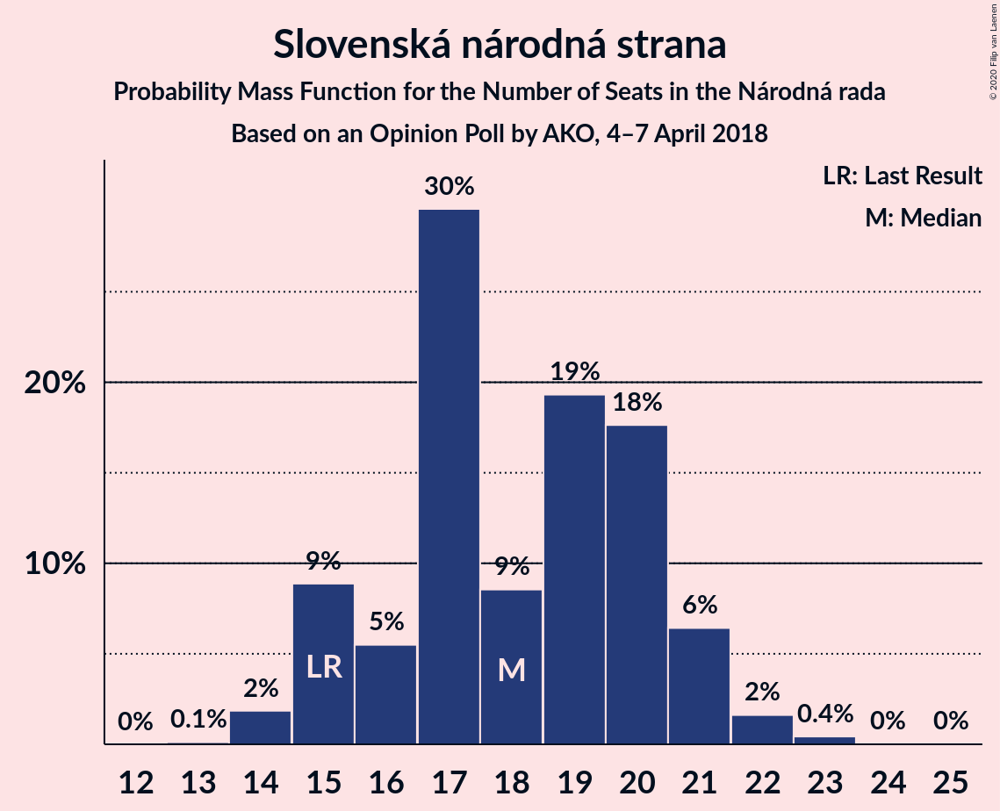
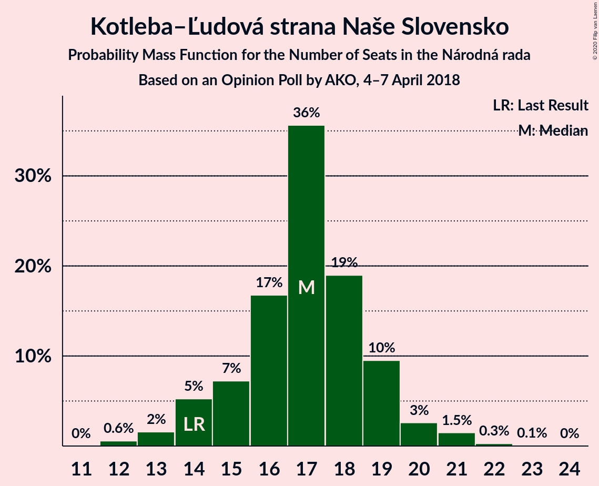
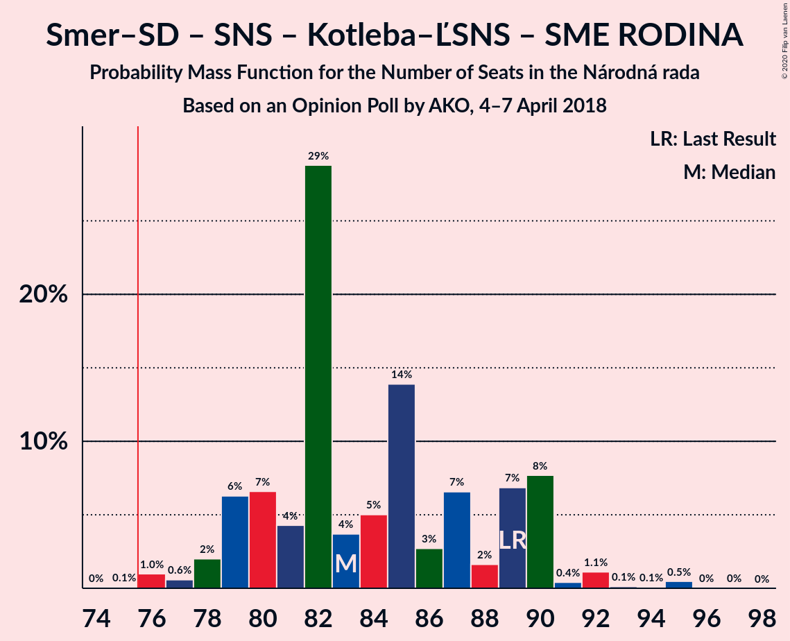
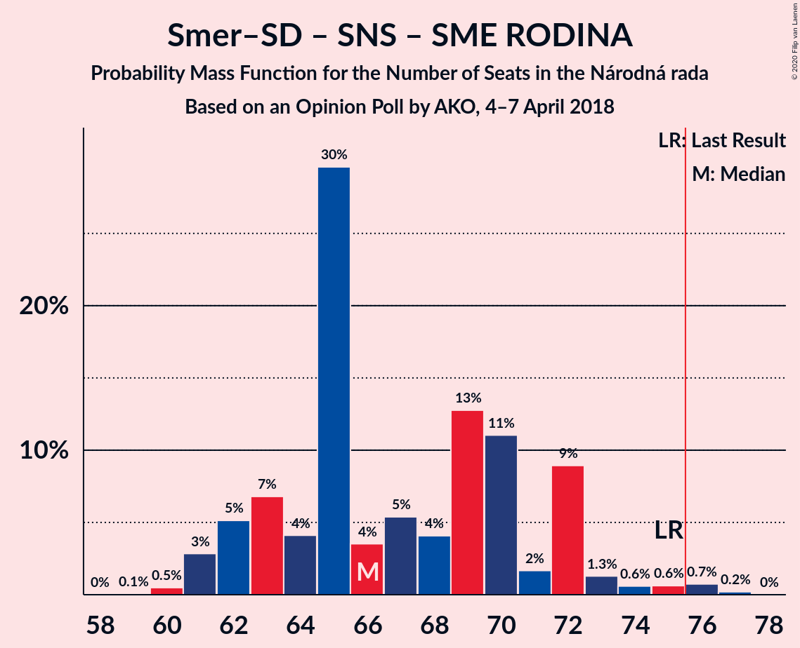
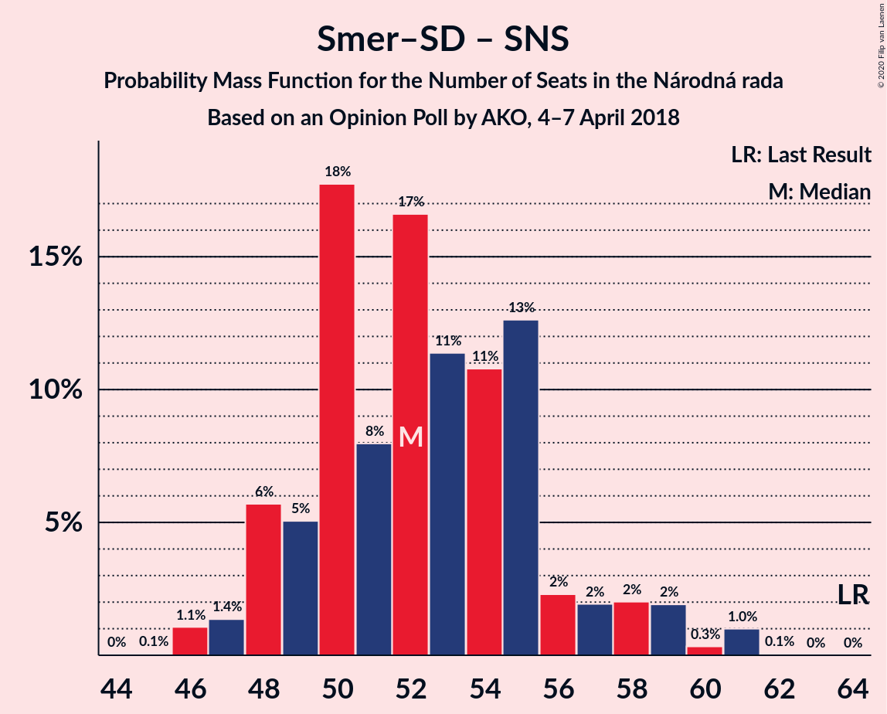
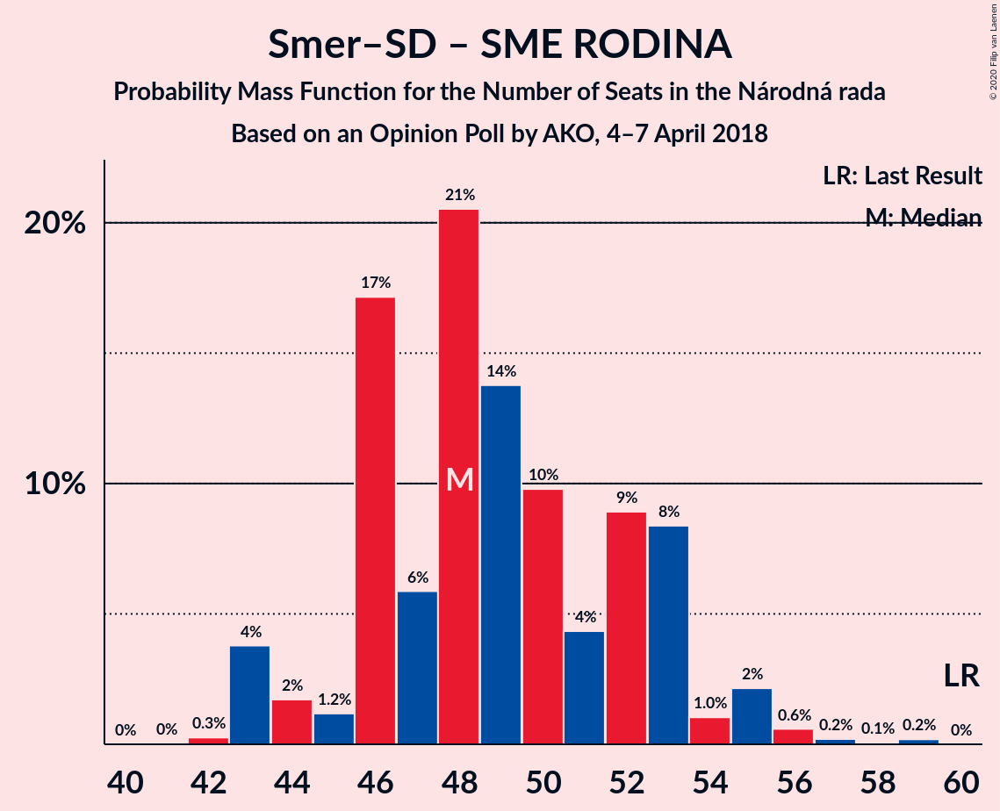

# Opinion Poll by AKO, 4–7 April 2018

<a href="#voting-intentions">Voting Intentions</a> | <a href="#seats">Seats</a> | <a href="#coalitions">Coalitions</a> | <a href="#technical-information">Technical Information</a>

## Voting Intentions

### Confidence Intervals

| Party | Last Result | Poll Result | 80% Confidence Interval | 90% Confidence Interval | 95% Confidence Interval | 99% Confidence Interval |
|:-----:|:-----------:|:-----------:|:-----------------------:|:-----------------------:|:-----------------------:|:-----------------------:|
| SMER–sociálna demokracia | 28.3% | 20.7% | 19.1–22.4% |18.7–22.9% |18.3–23.3% |17.6–24.2% |
| Sloboda a Solidarita | 12.1% | 17.1% | 15.7–18.7% |15.2–19.2% |14.9–19.6% |14.2–20.4% |
| Slovenská národná strana | 8.6% | 10.7% | 9.5–12.1% |9.2–12.4% |8.9–12.8% |8.4–13.5% |
| Kotleba–Ľudová strana Naše Slovensko | 8.0% | 10.0% | 8.9–11.3% |8.6–11.7% |8.3–12.0% |7.8–12.7% |
| OBYČAJNÍ ĽUDIA a nezávislé osobnosti | 11.0% | 9.1% | 8.0–10.4% |7.7–10.7% |7.5–11.1% |7.0–11.7% |
| SME RODINA | 6.6% | 8.6% | 7.6–9.8% |7.3–10.2% |7.0–10.5% |6.5–11.1% |
| Kresťanskodemokratické hnutie | 4.9% | 8.6% | 7.6–9.8% |7.3–10.2% |7.0–10.5% |6.5–11.1% |
| MOST–HÍD | 6.5% | 5.6% | 4.8–6.6% |4.5–7.0% |4.3–7.2% |4.0–7.7% |
| Progresívne Slovensko | 0.0% | 3.2% | 2.6–4.0% |2.4–4.3% |2.3–4.5% |2.0–4.9% |
| SPOLU–Občianska Demokracia | 0.0% | 2.8% | 2.2–3.6% |2.1–3.8% |1.9–4.0% |1.7–4.4% |
| Strana maďarskej koalície–Magyar Koalíció Pártja | 4.0% | 2.7% | 2.1–3.5% |2.0–3.7% |1.9–3.9% |1.6–4.3% |

*Note:* The poll result column reflects the actual value used in the calculations. Published results may vary slightly, and in addition be rounded to fewer digits.

## Seats

### Confidence Intervals

| Party | Last Result | Median | 80% Confidence Interval | 90% Confidence Interval | 95% Confidence Interval | 99% Confidence Interval |
|:-----:|:-----------:|:------:|:-----------------------:|:-----------------------:|:-----------------------:|:-----------------------:|
| <a href="#smer–sociálna-demokracia">SMER–sociálna demokracia</a> | 49 | 34 | 32–37 |31–38 |30–40 |28–41 |
| <a href="#sloboda-a-solidarita">Sloboda a Solidarita</a> | 21 | 29 | 25–32 |25–32 |24–33 |23–35 |
| <a href="#slovenská-národná-strana">Slovenská národná strana</a> | 15 | 18 | 15–20 |15–21 |15–21 |14–23 |
| <a href="#kotleba–ľudová-strana-naše-slovensko">Kotleba–Ľudová strana Naše Slovensko</a> | 14 | 17 | 15–19 |14–19 |14–20 |12–21 |
| <a href="#obyčajní-ľudia-a-nezávislé-osobnosti">OBYČAJNÍ ĽUDIA a nezávislé osobnosti</a> | 17 | 15 | 13–17 |13–18 |12–18 |11–20 |
| <a href="#sme-rodina">SME RODINA</a> | 11 | 15 | 13–17 |12–17 |11–17 |11–19 |
| <a href="#kresťanskodemokratické-hnutie">Kresťanskodemokratické hnutie</a> | 0 | 15 | 13–16 |12–17 |12–17 |10–19 |
| <a href="#most–híd">MOST–HÍD</a> | 11 | 9 | 0–11 |0–12 |0–12 |0–13 |
| <a href="#progresívne-slovensko">Progresívne Slovensko</a> | 0 | 0 | 0 |0 |0 |0 |
| <a href="#spolu–občianska-demokracia">SPOLU–Občianska Demokracia</a> | 0 | 0 | 0 |0 |0 |0 |
| <a href="#strana-maďarskej-koalície–magyar-koalíció-pártja">Strana maďarskej koalície–Magyar Koalíció Pártja</a> | 0 | 0 | 0 |0 |0 |0 |

### SMER–sociálna demokracia

*For a full overview of the results for this party, see the [SMER–sociálna demokracia](party-smer–sociálnademokracia.html) page.*

| Number of Seats | Probability | Accumulated | Special Marks |
|:---------------:|:-----------:|:-----------:|:-------------:|
| 28 | 0.8% | 100% |  |
| 29 | 0.3% | 99.2% |  |
| 30 | 3% | 98.9% |  |
| 31 | 4% | 96% |  |
| 32 | 7% | 92% |  |
| 33 | 35% | 86% |  |
| 34 | 6% | 50% | Median |
| 35 | 19% | 44% |  |
| 36 | 8% | 25% |  |
| 37 | 9% | 17% |  |
| 38 | 5% | 8% |  |
| 39 | 0.9% | 4% |  |
| 40 | 2% | 3% |  |
| 41 | 0.2% | 0.6% |  |
| 42 | 0.3% | 0.4% |  |
| 43 | 0% | 0.1% |  |
| 44 | 0% | 0% |  |
| 45 | 0% | 0% |  |
| 46 | 0% | 0% |  |
| 47 | 0% | 0% |  |
| 48 | 0% | 0% |  |
| 49 | 0% | 0% | Last Result |

### Sloboda a Solidarita

*For a full overview of the results for this party, see the [Sloboda a Solidarita](party-slobodaasolidarita.html) page.*

| Number of Seats | Probability | Accumulated | Special Marks |
|:---------------:|:-----------:|:-----------:|:-------------:|
| 21 | 0% | 100% | Last Result |
| 22 | 0.1% | 100% |  |
| 23 | 0.5% | 99.9% |  |
| 24 | 3% | 99.4% |  |
| 25 | 7% | 97% |  |
| 26 | 5% | 89% |  |
| 27 | 9% | 85% |  |
| 28 | 16% | 75% |  |
| 29 | 31% | 60% | Median |
| 30 | 8% | 29% |  |
| 31 | 6% | 21% |  |
| 32 | 11% | 15% |  |
| 33 | 2% | 4% |  |
| 34 | 0.9% | 2% |  |
| 35 | 0.4% | 0.7% |  |
| 36 | 0.3% | 0.4% |  |
| 37 | 0% | 0.1% |  |
| 38 | 0.1% | 0.1% |  |
| 39 | 0% | 0% |  |

### Slovenská národná strana

*For a full overview of the results for this party, see the [Slovenská národná strana](party-slovenskánárodnástrana.html) page.*

| Number of Seats | Probability | Accumulated | Special Marks |
|:---------------:|:-----------:|:-----------:|:-------------:|
| 13 | 0.1% | 100% |  |
| 14 | 2% | 99.9% |  |
| 15 | 9% | 98% | Last Result |
| 16 | 5% | 89% |  |
| 17 | 30% | 84% |  |
| 18 | 9% | 54% | Median |
| 19 | 19% | 46% |  |
| 20 | 18% | 26% |  |
| 21 | 6% | 9% |  |
| 22 | 2% | 2% |  |
| 23 | 0.4% | 0.5% |  |
| 24 | 0% | 0.1% |  |
| 25 | 0% | 0% |  |

### Kotleba–Ľudová strana Naše Slovensko

*For a full overview of the results for this party, see the [Kotleba–Ľudová strana Naše Slovensko](party-kotleba–ľudovástrananašeslovensko.html) page.*

| Number of Seats | Probability | Accumulated | Special Marks |
|:---------------:|:-----------:|:-----------:|:-------------:|
| 12 | 0.6% | 100% |  |
| 13 | 2% | 99.4% |  |
| 14 | 5% | 98% | Last Result |
| 15 | 7% | 93% |  |
| 16 | 17% | 85% |  |
| 17 | 36% | 69% | Median |
| 18 | 19% | 33% |  |
| 19 | 10% | 14% |  |
| 20 | 3% | 4% |  |
| 21 | 1.5% | 2% |  |
| 22 | 0.3% | 0.4% |  |
| 23 | 0.1% | 0.1% |  |
| 24 | 0% | 0% |  |

### OBYČAJNÍ ĽUDIA a nezávislé osobnosti

*For a full overview of the results for this party, see the [OBYČAJNÍ ĽUDIA a nezávislé osobnosti](party-obyčajníľudiaanezávisléosobnosti.html) page.*

| Number of Seats | Probability | Accumulated | Special Marks |
|:---------------:|:-----------:|:-----------:|:-------------:|
| 11 | 0.9% | 100% |  |
| 12 | 2% | 99.1% |  |
| 13 | 9% | 97% |  |
| 14 | 19% | 88% |  |
| 15 | 38% | 69% | Median |
| 16 | 15% | 32% |  |
| 17 | 11% | 17% | Last Result |
| 18 | 4% | 6% |  |
| 19 | 1.4% | 2% |  |
| 20 | 0.7% | 0.9% |  |
| 21 | 0.1% | 0.1% |  |
| 22 | 0% | 0% |  |

### SME RODINA

*For a full overview of the results for this party, see the [SME RODINA](party-smerodina.html) page.*

| Number of Seats | Probability | Accumulated | Special Marks |
|:---------------:|:-----------:|:-----------:|:-------------:|
| 10 | 0.2% | 100% |  |
| 11 | 4% | 99.8% | Last Result |
| 12 | 4% | 96% |  |
| 13 | 20% | 92% |  |
| 14 | 18% | 71% |  |
| 15 | 24% | 54% | Median |
| 16 | 16% | 30% |  |
| 17 | 11% | 13% |  |
| 18 | 2% | 2% |  |
| 19 | 0.5% | 0.7% |  |
| 20 | 0.1% | 0.1% |  |
| 21 | 0% | 0% |  |

### Kresťanskodemokratické hnutie

*For a full overview of the results for this party, see the [Kresťanskodemokratické hnutie](party-kresťanskodemokratickéhnutie.html) page.*

| Number of Seats | Probability | Accumulated | Special Marks |
|:---------------:|:-----------:|:-----------:|:-------------:|
| 0 | 0% | 100% | Last Result |
| 1 | 0% | 100% |  |
| 2 | 0% | 100% |  |
| 3 | 0% | 100% |  |
| 4 | 0% | 100% |  |
| 5 | 0% | 100% |  |
| 6 | 0% | 100% |  |
| 7 | 0% | 100% |  |
| 8 | 0% | 100% |  |
| 9 | 0% | 100% |  |
| 10 | 2% | 100% |  |
| 11 | 0.7% | 98% |  |
| 12 | 5% | 98% |  |
| 13 | 15% | 93% |  |
| 14 | 21% | 78% |  |
| 15 | 29% | 57% | Median |
| 16 | 19% | 28% |  |
| 17 | 7% | 9% |  |
| 18 | 0.7% | 2% |  |
| 19 | 0.9% | 1.0% |  |
| 20 | 0.1% | 0.1% |  |
| 21 | 0% | 0.1% |  |
| 22 | 0% | 0% |  |

### MOST–HÍD

*For a full overview of the results for this party, see the [MOST–HÍD](party-most–híd.html) page.*

| Number of Seats | Probability | Accumulated | Special Marks |
|:---------------:|:-----------:|:-----------:|:-------------:|
| 0 | 20% | 100% |  |
| 1 | 0% | 80% |  |
| 2 | 0% | 80% |  |
| 3 | 0% | 80% |  |
| 4 | 0% | 80% |  |
| 5 | 0% | 80% |  |
| 6 | 0% | 80% |  |
| 7 | 0% | 80% |  |
| 8 | 19% | 80% |  |
| 9 | 35% | 62% | Median |
| 10 | 11% | 27% |  |
| 11 | 8% | 15% | Last Result |
| 12 | 6% | 7% |  |
| 13 | 0.3% | 0.8% |  |
| 14 | 0.4% | 0.4% |  |
| 15 | 0% | 0% |  |

### Progresívne Slovensko

*For a full overview of the results for this party, see the [Progresívne Slovensko](party-progresívneslovensko.html) page.*

| Number of Seats | Probability | Accumulated | Special Marks |
|:---------------:|:-----------:|:-----------:|:-------------:|
| 0 | 99.7% | 100% | Last Result, Median |
| 1 | 0% | 0.3% |  |
| 2 | 0% | 0.3% |  |
| 3 | 0% | 0.3% |  |
| 4 | 0% | 0.3% |  |
| 5 | 0% | 0.3% |  |
| 6 | 0% | 0.3% |  |
| 7 | 0% | 0.3% |  |
| 8 | 0.2% | 0.3% |  |
| 9 | 0.2% | 0.2% |  |
| 10 | 0% | 0% |  |

### SPOLU–Občianska Demokracia

*For a full overview of the results for this party, see the [SPOLU–Občianska Demokracia](party-spolu–občianskademokracia.html) page.*

| Number of Seats | Probability | Accumulated | Special Marks |
|:---------------:|:-----------:|:-----------:|:-------------:|
| 0 | 100% | 100% | Last Result, Median |

### Strana maďarskej koalície–Magyar Koalíció Pártja

*For a full overview of the results for this party, see the [Strana maďarskej koalície–Magyar Koalíció Pártja](party-stranamaďarskejkoalície–magyarkoalíciópártja.html) page.*

| Number of Seats | Probability | Accumulated | Special Marks |
|:---------------:|:-----------:|:-----------:|:-------------:|
| 0 | 100% | 100% | Last Result, Median |

## Coalitions

### Confidence Intervals

| Coalition | Last Result | Median | Majority? | 80% Confidence Interval | 90% Confidence Interval | 95% Confidence Interval | 99% Confidence Interval |
|:---------:|:-----------:|:------:|:---------:|:-----------------------:|:-----------------------:|:-----------------------:|:-----------------------:|
| SMER–sociálna demokracia – Slovenská národná strana – Kotleba–Ľudová strana Naše Slovensko – SME RODINA | 89 | 83 | 99.9% | 80–89 | 79–90 | 78–90 | 76–95 |
| SMER–sociálna demokracia – Slovenská národná strana – SME RODINA | 75 | 66 | 1.0% | 63–72 | 62–72 | 61–73 | 60–76 |
| SMER–sociálna demokracia – Slovenská národná strana – MOST–HÍD | 75 | 60 | 0% | 55–63 | 55–66 | 53–66 | 51–67 |
| SMER–sociálna demokracia – Slovenská národná strana | 64 | 52 | 0% | 49–55 | 48–58 | 47–59 | 46–61 |
| SMER–sociálna demokracia – SME RODINA | 60 | 48 | 0% | 46–53 | 44–53 | 43–55 | 43–56 |
| SMER–sociálna demokracia | 49 | 34 | 0% | 32–37 | 31–38 | 30–40 | 28–41 |

### SMER–sociálna demokracia – Slovenská národná strana – Kotleba–Ľudová strana Naše Slovensko – SME RODINA

| Number of Seats | Probability | Accumulated | Special Marks |
|:---------------:|:-----------:|:-----------:|:-------------:|
| 75 | 0.1% | 100% |  |
| 76 | 1.0% | 99.9% | Majority |
| 77 | 0.6% | 98.9% |  |
| 78 | 2% | 98% |  |
| 79 | 6% | 96% |  |
| 80 | 7% | 90% |  |
| 81 | 4% | 83% |  |
| 82 | 29% | 79% |  |
| 83 | 4% | 50% |  |
| 84 | 5% | 47% | Median |
| 85 | 14% | 42% |  |
| 86 | 3% | 28% |  |
| 87 | 7% | 25% |  |
| 88 | 2% | 18% |  |
| 89 | 7% | 17% | Last Result |
| 90 | 8% | 10% |  |
| 91 | 0.4% | 2% |  |
| 92 | 1.1% | 2% |  |
| 93 | 0.1% | 0.7% |  |
| 94 | 0.1% | 0.6% |  |
| 95 | 0.5% | 0.5% |  |
| 96 | 0% | 0.1% |  |
| 97 | 0% | 0% |  |

### SMER–sociálna demokracia – Slovenská národná strana – SME RODINA

| Number of Seats | Probability | Accumulated | Special Marks |
|:---------------:|:-----------:|:-----------:|:-------------:|
| 59 | 0.1% | 100% |  |
| 60 | 0.5% | 99.9% |  |
| 61 | 3% | 99.4% |  |
| 62 | 5% | 97% |  |
| 63 | 7% | 91% |  |
| 64 | 4% | 85% |  |
| 65 | 30% | 81% |  |
| 66 | 4% | 51% |  |
| 67 | 5% | 47% | Median |
| 68 | 4% | 42% |  |
| 69 | 13% | 38% |  |
| 70 | 11% | 25% |  |
| 71 | 2% | 14% |  |
| 72 | 9% | 12% |  |
| 73 | 1.3% | 3% |  |
| 74 | 0.6% | 2% |  |
| 75 | 0.6% | 2% | Last Result |
| 76 | 0.7% | 1.0% | Majority |
| 77 | 0.2% | 0.2% |  |
| 78 | 0% | 0% |  |

### SMER–sociálna demokracia – Slovenská národná strana – MOST–HÍD

| Number of Seats | Probability | Accumulated | Special Marks |
|:---------------:|:-----------:|:-----------:|:-------------:|
| 48 | 0% | 100% |  |
| 49 | 0% | 99.9% |  |
| 50 | 0.3% | 99.9% |  |
| 51 | 0.6% | 99.6% |  |
| 52 | 1.1% | 99.0% |  |
| 53 | 2% | 98% |  |
| 54 | 0.5% | 96% |  |
| 55 | 9% | 96% |  |
| 56 | 2% | 87% |  |
| 57 | 3% | 85% |  |
| 58 | 4% | 82% |  |
| 59 | 21% | 77% |  |
| 60 | 15% | 57% |  |
| 61 | 16% | 41% | Median |
| 62 | 5% | 26% |  |
| 63 | 11% | 21% |  |
| 64 | 3% | 10% |  |
| 65 | 2% | 7% |  |
| 66 | 4% | 5% |  |
| 67 | 1.1% | 2% |  |
| 68 | 0.2% | 0.4% |  |
| 69 | 0.1% | 0.3% |  |
| 70 | 0.1% | 0.1% |  |
| 71 | 0% | 0% |  |
| 72 | 0% | 0% |  |
| 73 | 0% | 0% |  |
| 74 | 0% | 0% |  |
| 75 | 0% | 0% | Last Result |

### SMER–sociálna demokracia – Slovenská národná strana

| Number of Seats | Probability | Accumulated | Special Marks |
|:---------------:|:-----------:|:-----------:|:-------------:|
| 44 | 0% | 100% |  |
| 45 | 0.1% | 99.9% |  |
| 46 | 1.1% | 99.9% |  |
| 47 | 1.4% | 98.8% |  |
| 48 | 6% | 97% |  |
| 49 | 5% | 92% |  |
| 50 | 18% | 87% |  |
| 51 | 8% | 69% |  |
| 52 | 17% | 61% | Median |
| 53 | 11% | 44% |  |
| 54 | 11% | 33% |  |
| 55 | 13% | 22% |  |
| 56 | 2% | 10% |  |
| 57 | 2% | 7% |  |
| 58 | 2% | 5% |  |
| 59 | 2% | 3% |  |
| 60 | 0.3% | 1.4% |  |
| 61 | 1.0% | 1.1% |  |
| 62 | 0.1% | 0.1% |  |
| 63 | 0% | 0% |  |
| 64 | 0% | 0% | Last Result |

### SMER–sociálna demokracia – SME RODINA

| Number of Seats | Probability | Accumulated | Special Marks |
|:---------------:|:-----------:|:-----------:|:-------------:|
| 42 | 0.3% | 100% |  |
| 43 | 4% | 99.7% |  |
| 44 | 2% | 96% |  |
| 45 | 1.2% | 94% |  |
| 46 | 17% | 93% |  |
| 47 | 6% | 76% |  |
| 48 | 21% | 70% |  |
| 49 | 14% | 49% | Median |
| 50 | 10% | 36% |  |
| 51 | 4% | 26% |  |
| 52 | 9% | 22% |  |
| 53 | 8% | 13% |  |
| 54 | 1.0% | 4% |  |
| 55 | 2% | 3% |  |
| 56 | 0.6% | 1.1% |  |
| 57 | 0.2% | 0.5% |  |
| 58 | 0.1% | 0.3% |  |
| 59 | 0.2% | 0.2% |  |
| 60 | 0% | 0% | Last Result |

### SMER–sociálna demokracia

| Number of Seats | Probability | Accumulated | Special Marks |
|:---------------:|:-----------:|:-----------:|:-------------:|
| 28 | 0.8% | 100% |  |
| 29 | 0.3% | 99.2% |  |
| 30 | 3% | 98.9% |  |
| 31 | 4% | 96% |  |
| 32 | 7% | 92% |  |
| 33 | 35% | 86% |  |
| 34 | 6% | 50% | Median |
| 35 | 19% | 44% |  |
| 36 | 8% | 25% |  |
| 37 | 9% | 17% |  |
| 38 | 5% | 8% |  |
| 39 | 0.9% | 4% |  |
| 40 | 2% | 3% |  |
| 41 | 0.2% | 0.6% |  |
| 42 | 0.3% | 0.4% |  |
| 43 | 0% | 0.1% |  |
| 44 | 0% | 0% |  |
| 45 | 0% | 0% |  |
| 46 | 0% | 0% |  |
| 47 | 0% | 0% |  |
| 48 | 0% | 0% |  |
| 49 | 0% | 0% | Last Result |

## Technical Information

### Opinion Poll

+ **Polling firm:** AKO
+ **Commissioner(s):** —
+ **Fieldwork period:** 4–7 April 2018

### Calculations

+ **Sample size:** 1000
+ **Simulations done:** 1,048,576
+ **Error estimate:** 1.49%

