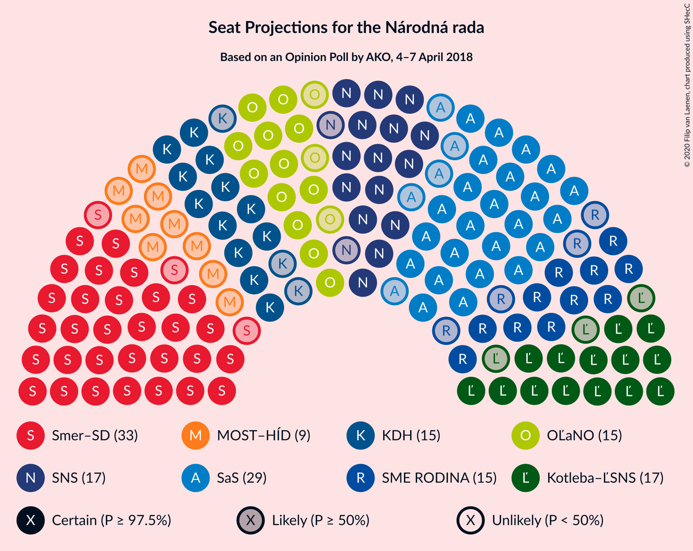
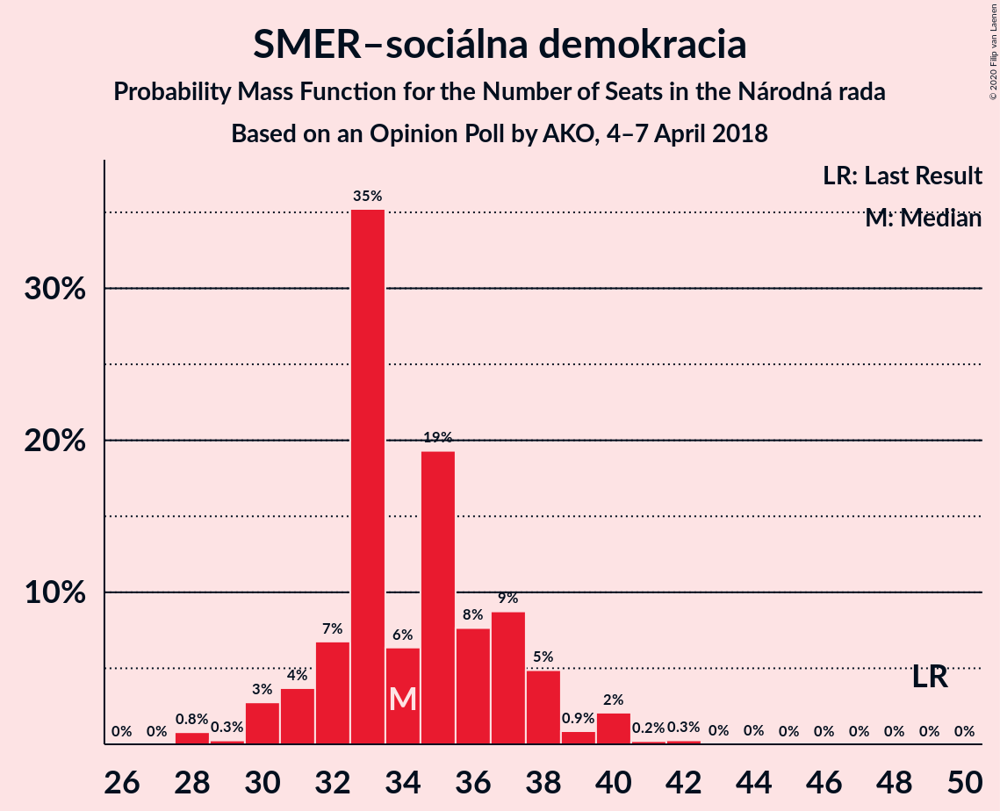
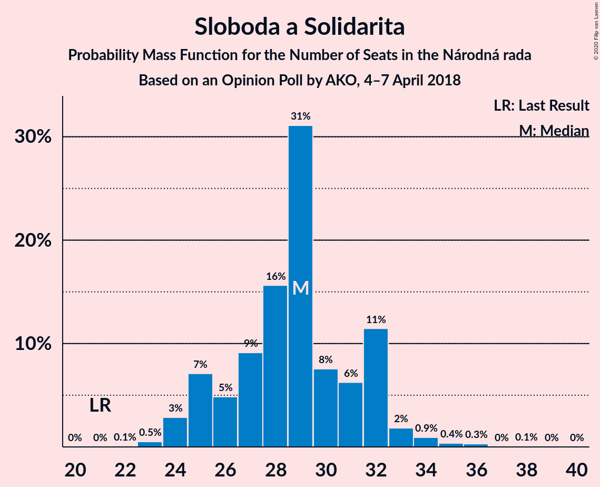
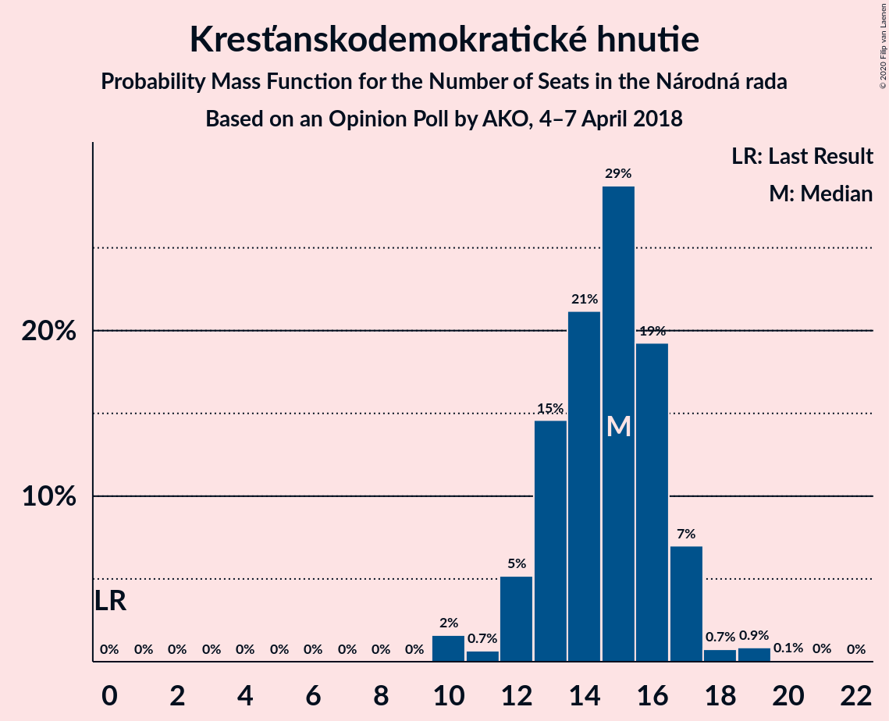
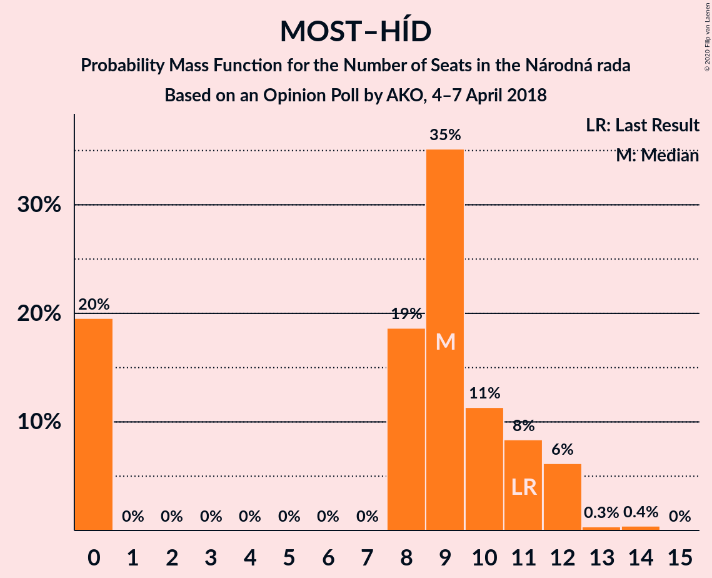
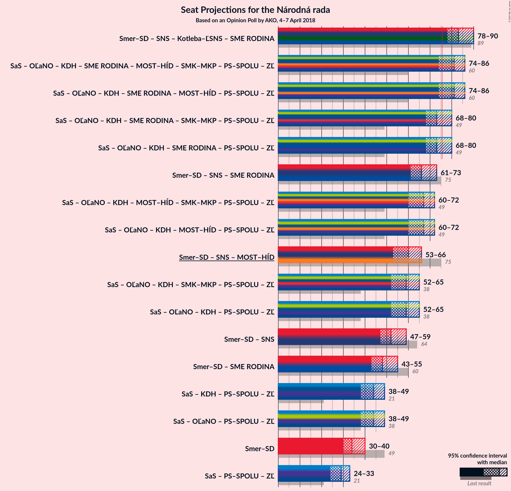

# Opinion Poll by AKO, 4–7 April 2018

<a href="#voting-intentions">Voting Intentions</a> | <a href="#seats">Seats</a> | <a href="#coalitions">Coalitions</a> | <a href="#technical-information">Technical Information</a>

## Voting Intentions

### Confidence Intervals

| Party | Last Result | Poll Result | 80% Confidence Interval | 90% Confidence Interval | 95% Confidence Interval | 99% Confidence Interval |
|:-----:|:-----------:|:-----------:|:-----------------------:|:-----------------------:|:-----------------------:|:-----------------------:|
| SMER–sociálna demokracia | 28.3% | 20.7% | 19.1–22.4% |18.7–22.9% |18.3–23.3% |17.6–24.2% |
| Sloboda a Solidarita | 12.1% | 17.1% | 15.7–18.7% |15.2–19.2% |14.9–19.6% |14.2–20.4% |
| Slovenská národná strana | 8.6% | 10.7% | 9.5–12.1% |9.2–12.4% |8.9–12.8% |8.4–13.5% |
| Kotleba–Ľudová strana Naše Slovensko | 8.0% | 10.0% | 8.9–11.3% |8.6–11.7% |8.3–12.0% |7.8–12.7% |
| OBYČAJNÍ ĽUDIA a nezávislé osobnosti | 11.0% | 9.1% | 8.0–10.4% |7.7–10.7% |7.5–11.1% |7.0–11.7% |
| SME RODINA | 6.6% | 8.6% | 7.6–9.8% |7.3–10.2% |7.0–10.5% |6.5–11.1% |
| Kresťanskodemokratické hnutie | 4.9% | 8.6% | 7.6–9.8% |7.3–10.2% |7.0–10.5% |6.5–11.1% |
| MOST–HÍD | 6.5% | 5.6% | 4.8–6.6% |4.5–7.0% |4.3–7.2% |4.0–7.7% |
| Progresívne Slovensko | 0.0% | 3.2% | 2.6–4.0% |2.4–4.3% |2.3–4.5% |2.0–4.9% |
| SPOLU–Občianska Demokracia | 0.0% | 2.8% | 2.2–3.6% |2.1–3.8% |1.9–4.0% |1.7–4.4% |
| Strana maďarskej koalície–Magyar Koalíció Pártja | 4.0% | 2.7% | 2.1–3.5% |2.0–3.7% |1.9–3.9% |1.6–4.3% |

*Note:* The poll result column reflects the actual value used in the calculations. Published results may vary slightly, and in addition be rounded to fewer digits.

## Seats

### Confidence Intervals

| Party | Last Result | Median | 80% Confidence Interval | 90% Confidence Interval | 95% Confidence Interval | 99% Confidence Interval |
|:-----:|:-----------:|:------:|:-----------------------:|:-----------------------:|:-----------------------:|:-----------------------:|
| <a href="#smer–sociálna-demokracia">SMER–sociálna demokracia</a> | 49 | 34 | 32–37 |32–39 |30–40 |30–40 |
| <a href="#sloboda-a-solidarita">Sloboda a Solidarita</a> | 21 | 28 | 27–32 |25–32 |24–32 |24–33 |
| <a href="#slovenská-národná-strana">Slovenská národná strana</a> | 15 | 17 | 15–20 |15–21 |14–22 |14–23 |
| <a href="#kotleba–ľudová-strana-naše-slovensko">Kotleba–Ľudová strana Naše Slovensko</a> | 14 | 17 | 15–18 |14–20 |14–20 |14–22 |
| <a href="#obyčajní-ľudia-a-nezávislé-osobnosti">OBYČAJNÍ ĽUDIA a nezávislé osobnosti</a> | 17 | 15 | 14–17 |13–18 |12–20 |12–21 |
| <a href="#sme-rodina">SME RODINA</a> | 11 | 14 | 11–16 |11–17 |11–17 |11–18 |
| <a href="#kresťanskodemokratické-hnutie">Kresťanskodemokratické hnutie</a> | 0 | 15 | 13–16 |12–17 |12–19 |10–20 |
| <a href="#most–híd">MOST–HÍD</a> | 11 | 10 | 0–12 |0–12 |0–12 |0–13 |
| <a href="#progresívne-slovensko">Progresívne Slovensko</a> | 0 | 0 | 0 |0 |0 |0 |
| <a href="#spolu–občianska-demokracia">SPOLU–Občianska Demokracia</a> | 0 | 0 | 0 |0 |0 |0 |
| <a href="#strana-maďarskej-koalície–magyar-koalíció-pártja">Strana maďarskej koalície–Magyar Koalíció Pártja</a> | 0 | 0 | 0 |0 |0 |0 |

### SMER–sociálna demokracia

*For a full overview of the results for this party, see the [SMER–sociálna demokracia](party-smer–sociálnademokracia.html) page.*

| Number of Seats | Probability | Accumulated | Special Marks |
|:---------------:|:-----------:|:-----------:|:-------------:|
| 29 | 0.1% | 100% |  |
| 30 | 3% | 99.9% |  |
| 31 | 1.2% | 97% |  |
| 32 | 42% | 96% |  |
| 33 | 2% | 54% |  |
| 34 | 7% | 52% | Median |
| 35 | 28% | 45% |  |
| 36 | 4% | 17% |  |
| 37 | 4% | 13% |  |
| 38 | 3% | 9% |  |
| 39 | 2% | 6% |  |
| 40 | 4% | 4% |  |
| 41 | 0.2% | 0.5% |  |
| 42 | 0.2% | 0.2% |  |
| 43 | 0% | 0% |  |
| 44 | 0% | 0% |  |
| 45 | 0% | 0% |  |
| 46 | 0% | 0% |  |
| 47 | 0% | 0% |  |
| 48 | 0% | 0% |  |
| 49 | 0% | 0% | Last Result |

### Sloboda a Solidarita

*For a full overview of the results for this party, see the [Sloboda a Solidarita](party-slobodaasolidarita.html) page.*

| Number of Seats | Probability | Accumulated | Special Marks |
|:---------------:|:-----------:|:-----------:|:-------------:|
| 21 | 0% | 100% | Last Result |
| 22 | 0% | 100% |  |
| 23 | 0.4% | 100% |  |
| 24 | 3% | 99.6% |  |
| 25 | 2% | 97% |  |
| 26 | 2% | 95% |  |
| 27 | 21% | 93% |  |
| 28 | 37% | 72% | Median |
| 29 | 7% | 35% |  |
| 30 | 8% | 28% |  |
| 31 | 3% | 20% |  |
| 32 | 16% | 17% |  |
| 33 | 1.3% | 2% |  |
| 34 | 0.4% | 0.5% |  |
| 35 | 0% | 0% |  |

### Slovenská národná strana

*For a full overview of the results for this party, see the [Slovenská národná strana](party-slovenskánárodnástrana.html) page.*

| Number of Seats | Probability | Accumulated | Special Marks |
|:---------------:|:-----------:|:-----------:|:-------------:|
| 13 | 0.1% | 100% |  |
| 14 | 3% | 99.9% |  |
| 15 | 14% | 97% | Last Result |
| 16 | 5% | 83% |  |
| 17 | 41% | 78% | Median |
| 18 | 5% | 37% |  |
| 19 | 20% | 32% |  |
| 20 | 5% | 12% |  |
| 21 | 2% | 7% |  |
| 22 | 4% | 5% |  |
| 23 | 0.3% | 0.5% |  |
| 24 | 0% | 0.2% |  |
| 25 | 0.2% | 0.2% |  |
| 26 | 0% | 0% |  |

### Kotleba–Ľudová strana Naše Slovensko

*For a full overview of the results for this party, see the [Kotleba–Ľudová strana Naše Slovensko](party-kotleba–ľudovástrananašeslovensko.html) page.*

| Number of Seats | Probability | Accumulated | Special Marks |
|:---------------:|:-----------:|:-----------:|:-------------:|
| 11 | 0.1% | 100% |  |
| 12 | 0.1% | 99.9% |  |
| 13 | 0.3% | 99.8% |  |
| 14 | 6% | 99.5% | Last Result |
| 15 | 23% | 94% |  |
| 16 | 5% | 71% |  |
| 17 | 52% | 66% | Median |
| 18 | 5% | 14% |  |
| 19 | 2% | 9% |  |
| 20 | 5% | 7% |  |
| 21 | 0.8% | 2% |  |
| 22 | 1.1% | 1.2% |  |
| 23 | 0% | 0.1% |  |
| 24 | 0% | 0.1% |  |
| 25 | 0% | 0% |  |

### OBYČAJNÍ ĽUDIA a nezávislé osobnosti

*For a full overview of the results for this party, see the [OBYČAJNÍ ĽUDIA a nezávislé osobnosti](party-obyčajníľudiaanezávisléosobnosti.html) page.*

| Number of Seats | Probability | Accumulated | Special Marks |
|:---------------:|:-----------:|:-----------:|:-------------:|
| 10 | 0.1% | 100% |  |
| 11 | 0.1% | 99.9% |  |
| 12 | 4% | 99.9% |  |
| 13 | 4% | 96% |  |
| 14 | 6% | 92% |  |
| 15 | 54% | 86% | Median |
| 16 | 7% | 32% |  |
| 17 | 18% | 25% | Last Result |
| 18 | 3% | 7% |  |
| 19 | 2% | 4% |  |
| 20 | 2% | 3% |  |
| 21 | 0.7% | 0.8% |  |
| 22 | 0.1% | 0.1% |  |
| 23 | 0% | 0% |  |

### SME RODINA

*For a full overview of the results for this party, see the [SME RODINA](party-smerodina.html) page.*

| Number of Seats | Probability | Accumulated | Special Marks |
|:---------------:|:-----------:|:-----------:|:-------------:|
| 10 | 0.1% | 100% |  |
| 11 | 12% | 99.9% | Last Result |
| 12 | 5% | 88% |  |
| 13 | 10% | 83% |  |
| 14 | 52% | 73% | Median |
| 15 | 4% | 21% |  |
| 16 | 11% | 17% |  |
| 17 | 3% | 6% |  |
| 18 | 2% | 2% |  |
| 19 | 0.2% | 0.3% |  |
| 20 | 0.1% | 0.1% |  |
| 21 | 0% | 0% |  |

### Kresťanskodemokratické hnutie

*For a full overview of the results for this party, see the [Kresťanskodemokratické hnutie](party-kresťanskodemokratickéhnutie.html) page.*

| Number of Seats | Probability | Accumulated | Special Marks |
|:---------------:|:-----------:|:-----------:|:-------------:|
| 0 | 0% | 100% | Last Result |
| 1 | 0% | 100% |  |
| 2 | 0% | 100% |  |
| 3 | 0% | 100% |  |
| 4 | 0% | 100% |  |
| 5 | 0% | 100% |  |
| 6 | 0% | 100% |  |
| 7 | 0% | 100% |  |
| 8 | 0% | 100% |  |
| 9 | 0% | 100% |  |
| 10 | 0.8% | 100% |  |
| 11 | 0.6% | 99.2% |  |
| 12 | 7% | 98.6% |  |
| 13 | 3% | 91% |  |
| 14 | 21% | 88% |  |
| 15 | 55% | 67% | Median |
| 16 | 4% | 12% |  |
| 17 | 4% | 8% |  |
| 18 | 0.4% | 4% |  |
| 19 | 3% | 4% |  |
| 20 | 0.6% | 0.7% |  |
| 21 | 0% | 0% |  |

### MOST–HÍD

*For a full overview of the results for this party, see the [MOST–HÍD](party-most–híd.html) page.*

| Number of Seats | Probability | Accumulated | Special Marks |
|:---------------:|:-----------:|:-----------:|:-------------:|
| 0 | 13% | 100% |  |
| 1 | 0% | 87% |  |
| 2 | 0% | 87% |  |
| 3 | 0% | 87% |  |
| 4 | 0% | 87% |  |
| 5 | 0% | 87% |  |
| 6 | 0% | 87% |  |
| 7 | 0% | 87% |  |
| 8 | 3% | 87% |  |
| 9 | 25% | 84% |  |
| 10 | 18% | 59% | Median |
| 11 | 4% | 42% | Last Result |
| 12 | 36% | 37% |  |
| 13 | 1.0% | 1.1% |  |
| 14 | 0% | 0.1% |  |
| 15 | 0% | 0% |  |

### Progresívne Slovensko

*For a full overview of the results for this party, see the [Progresívne Slovensko](party-progresívneslovensko.html) page.*

| Number of Seats | Probability | Accumulated | Special Marks |
|:---------------:|:-----------:|:-----------:|:-------------:|
| 0 | 99.8% | 100% | Last Result, Median |
| 1 | 0% | 0.2% |  |
| 2 | 0% | 0.2% |  |
| 3 | 0% | 0.2% |  |
| 4 | 0% | 0.2% |  |
| 5 | 0% | 0.2% |  |
| 6 | 0% | 0.2% |  |
| 7 | 0% | 0.2% |  |
| 8 | 0.1% | 0.2% |  |
| 9 | 0.2% | 0.2% |  |
| 10 | 0% | 0% |  |

### SPOLU–Občianska Demokracia

*For a full overview of the results for this party, see the [SPOLU–Občianska Demokracia](party-spolu–občianskademokracia.html) page.*

| Number of Seats | Probability | Accumulated | Special Marks |
|:---------------:|:-----------:|:-----------:|:-------------:|
| 0 | 100% | 100% | Last Result, Median |

### Strana maďarskej koalície–Magyar Koalíció Pártja

*For a full overview of the results for this party, see the [Strana maďarskej koalície–Magyar Koalíció Pártja](party-stranamaďarskejkoalície–magyarkoalíciópártja.html) page.*

| Number of Seats | Probability | Accumulated | Special Marks |
|:---------------:|:-----------:|:-----------:|:-------------:|
| 0 | 100% | 100% | Last Result, Median |

## Coalitions

### Confidence Intervals

| Coalition | Last Result | Median | Majority? | 80% Confidence Interval | 90% Confidence Interval | 95% Confidence Interval | 99% Confidence Interval |
|:---------:|:-----------:|:------:|:---------:|:-----------------------:|:-----------------------:|:-----------------------:|:-----------------------:|
| SMER–sociálna demokracia – Slovenská národná strana – MOST–HÍD | 75 | 61 | 0% | 58–64 | 56–64 | 54–65 | 50–67 |
| SMER–sociálna demokracia | 49 | 34 | 0% | 32–37 | 32–39 | 30–40 | 30–40 |

### SMER–sociálna demokracia – Slovenská národná strana – MOST–HÍD

| Number of Seats | Probability | Accumulated | Special Marks |
|:---------------:|:-----------:|:-----------:|:-------------:|
| 48 | 0% | 100% |  |
| 49 | 0% | 99.9% |  |
| 50 | 0.7% | 99.9% |  |
| 51 | 0.1% | 99.3% |  |
| 52 | 0.7% | 99.2% |  |
| 53 | 0.8% | 98.5% |  |
| 54 | 1.3% | 98% |  |
| 55 | 0.4% | 96% |  |
| 56 | 2% | 96% |  |
| 57 | 3% | 94% |  |
| 58 | 6% | 91% |  |
| 59 | 18% | 85% |  |
| 60 | 2% | 68% |  |
| 61 | 38% | 66% | Median |
| 62 | 4% | 28% |  |
| 63 | 6% | 24% |  |
| 64 | 13% | 18% |  |
| 65 | 3% | 5% |  |
| 66 | 0.8% | 1.4% |  |
| 67 | 0.3% | 0.6% |  |
| 68 | 0.1% | 0.3% |  |
| 69 | 0.1% | 0.2% |  |
| 70 | 0.1% | 0.1% |  |
| 71 | 0% | 0% |  |
| 72 | 0% | 0% |  |
| 73 | 0% | 0% |  |
| 74 | 0% | 0% |  |
| 75 | 0% | 0% | Last Result |

### SMER–sociálna demokracia

| Number of Seats | Probability | Accumulated | Special Marks |
|:---------------:|:-----------:|:-----------:|:-------------:|
| 29 | 0.1% | 100% |  |
| 30 | 3% | 99.9% |  |
| 31 | 1.2% | 97% |  |
| 32 | 42% | 96% |  |
| 33 | 2% | 54% |  |
| 34 | 7% | 52% | Median |
| 35 | 28% | 45% |  |
| 36 | 4% | 17% |  |
| 37 | 4% | 13% |  |
| 38 | 3% | 9% |  |
| 39 | 2% | 6% |  |
| 40 | 4% | 4% |  |
| 41 | 0.2% | 0.5% |  |
| 42 | 0.2% | 0.2% |  |
| 43 | 0% | 0% |  |
| 44 | 0% | 0% |  |
| 45 | 0% | 0% |  |
| 46 | 0% | 0% |  |
| 47 | 0% | 0% |  |
| 48 | 0% | 0% |  |
| 49 | 0% | 0% | Last Result |

## Technical Information

### Opinion Poll

+ **Polling firm:** AKO
+ **Commissioner(s):** —
+ **Fieldwork period:** 4–7 April 2018

### Calculations

+ **Sample size:** 1000
+ **Simulations done:** 131,072
+ **Error estimate:** 2.47%

