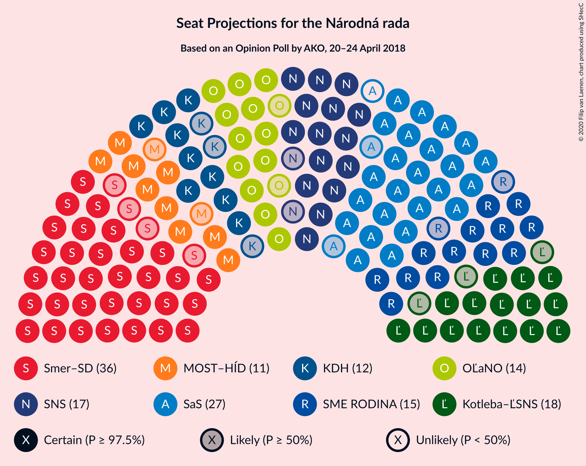
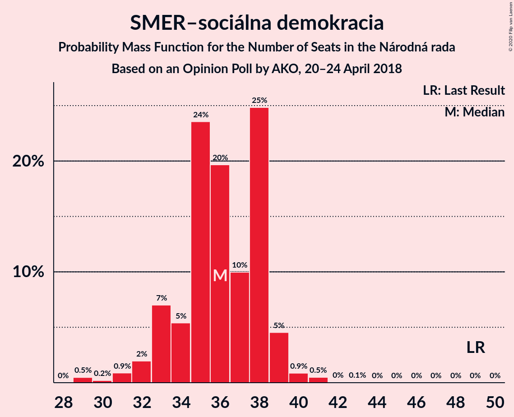
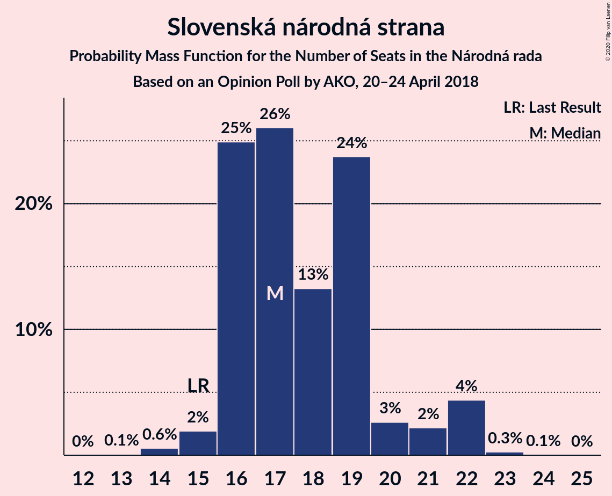
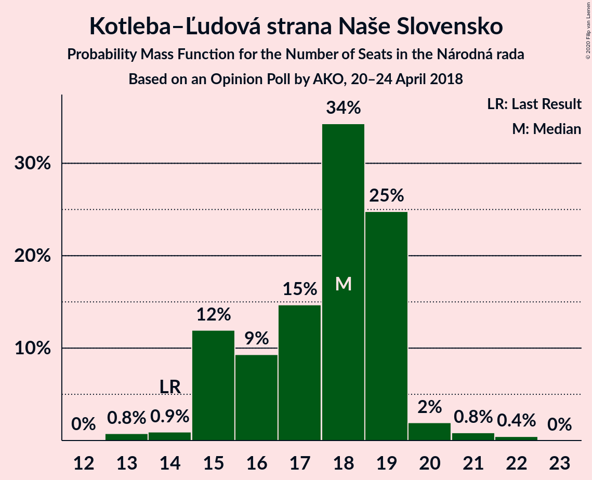
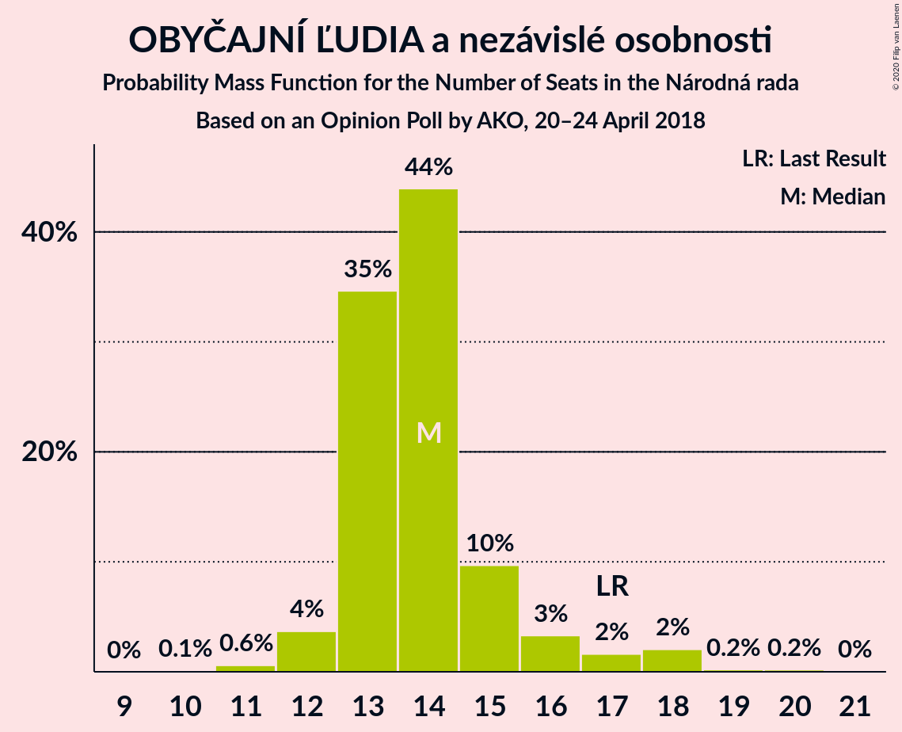
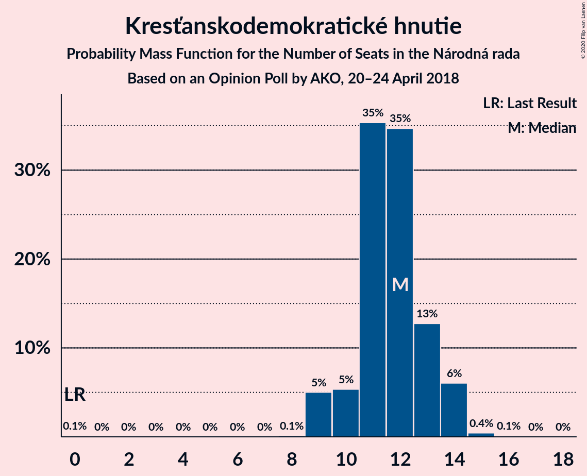

# Opinion Poll by AKO, 20–24 April 2018

<a href="#voting-intentions">Voting Intentions</a> | <a href="#seats">Seats</a> | <a href="#coalitions">Coalitions</a> | <a href="#technical-information">Technical Information</a>

## Voting Intentions

### Confidence Intervals

| Party | Last Result | Poll Result | 80% Confidence Interval | 90% Confidence Interval | 95% Confidence Interval | 99% Confidence Interval |
|:-----:|:-----------:|:-----------:|:-----------------------:|:-----------------------:|:-----------------------:|:-----------------------:|
| SMER–sociálna demokracia | 28.3% | 21.4% | 19.8–23.1% |19.4–23.6% |19.0–24.1% |18.2–24.9% |
| Sloboda a Solidarita | 12.1% | 16.1% | 14.7–17.7% |14.3–18.1% |13.9–18.5% |13.3–19.3% |
| Slovenská národná strana | 8.6% | 10.9% | 9.7–12.3% |9.4–12.7% |9.1–13.0% |8.6–13.7% |
| Kotleba–Ľudová strana Naše Slovensko | 8.0% | 10.3% | 9.2–11.6% |8.8–12.0% |8.6–12.3% |8.0–13.0% |
| SME RODINA | 6.6% | 9.0% | 7.9–10.3% |7.6–10.6% |7.4–10.9% |6.9–11.6% |
| OBYČAJNÍ ĽUDIA a nezávislé osobnosti | 11.0% | 8.7% | 7.7–10.0% |7.3–10.3% |7.1–10.6% |6.6–11.2% |
| Kresťanskodemokratické hnutie | 4.9% | 6.9% | 6.0–8.0% |5.7–8.4% |5.5–8.7% |5.1–9.2% |
| MOST–HÍD | 6.5% | 6.8% | 5.9–7.9% |5.6–8.3% |5.4–8.5% |5.0–9.1% |
| Progresívne Slovensko | 0.0% | 3.8% | 3.1–4.7% |2.9–5.0% |2.8–5.2% |2.5–5.6% |
| SPOLU–Občianska Demokracia | 0.0% | 3.7% | 3.0–4.6% |2.9–4.8% |2.7–5.1% |2.4–5.5% |
| Strana maďarskej koalície–Magyar Koalíció Pártja | 4.0% | 1.9% | 1.4–2.6% |1.3–2.8% |1.2–3.0% |1.0–3.3% |

*Note:* The poll result column reflects the actual value used in the calculations. Published results may vary slightly, and in addition be rounded to fewer digits.

## Seats

### Confidence Intervals

| Party | Last Result | Median | 80% Confidence Interval | 90% Confidence Interval | 95% Confidence Interval | 99% Confidence Interval |
|:-----:|:-----------:|:------:|:-----------------------:|:-----------------------:|:-----------------------:|:-----------------------:|
| <a href="#smer–sociálna-demokracia">SMER–sociálna demokracia</a> | 49 | 36 | 34–39 |34–39 |32–39 |29–42 |
| <a href="#sloboda-a-solidarita">Sloboda a Solidarita</a> | 21 | 26 | 24–28 |24–30 |24–30 |23–32 |
| <a href="#slovenská-národná-strana">Slovenská národná strana</a> | 15 | 19 | 18–19 |16–20 |16–22 |14–22 |
| <a href="#kotleba–ľudová-strana-naše-slovensko">Kotleba–Ľudová strana Naše Slovensko</a> | 14 | 17 | 16–18 |15–19 |15–20 |13–21 |
| <a href="#sme-rodina">SME RODINA</a> | 11 | 14 | 13–16 |13–17 |13–18 |12–18 |
| <a href="#obyčajní-ľudia-a-nezávislé-osobnosti">OBYČAJNÍ ĽUDIA a nezávislé osobnosti</a> | 17 | 14 | 13–18 |12–18 |11–18 |11–18 |
| <a href="#kresťanskodemokratické-hnutie">Kresťanskodemokratické hnutie</a> | 0 | 11 | 9–13 |9–13 |9–13 |9–14 |
| <a href="#most–híd">MOST–HÍD</a> | 11 | 11 | 11–14 |9–14 |9–14 |0–14 |
| <a href="#progresívne-slovensko">Progresívne Slovensko</a> | 0 | 0 | 0 |0 |0 |0–9 |
| <a href="#spolu–občianska-demokracia">SPOLU–Občianska Demokracia</a> | 0 | 0 | 0 |0 |0 |0–8 |
| <a href="#strana-maďarskej-koalície–magyar-koalíció-pártja">Strana maďarskej koalície–Magyar Koalíció Pártja</a> | 0 | 0 | 0 |0 |0 |0 |

### SMER–sociálna demokracia

*For a full overview of the results for this party, see the [SMER–sociálna demokracia](party-smer–sociálnademokracia.html) page.*

| Number of Seats | Probability | Accumulated | Special Marks |
|:---------------:|:-----------:|:-----------:|:-------------:|
| 29 | 0.6% | 100% |  |
| 30 | 0.3% | 99.4% |  |
| 31 | 0.5% | 99.1% |  |
| 32 | 1.3% | 98.7% |  |
| 33 | 2% | 97% |  |
| 34 | 7% | 95% |  |
| 35 | 33% | 88% |  |
| 36 | 20% | 55% | Median |
| 37 | 3% | 35% |  |
| 38 | 0.3% | 32% |  |
| 39 | 30% | 32% |  |
| 40 | 0.8% | 2% |  |
| 41 | 0.5% | 1.0% |  |
| 42 | 0% | 0.5% |  |
| 43 | 0.5% | 0.5% |  |
| 44 | 0% | 0% |  |
| 45 | 0% | 0% |  |
| 46 | 0% | 0% |  |
| 47 | 0% | 0% |  |
| 48 | 0% | 0% |  |
| 49 | 0% | 0% | Last Result |

### Sloboda a Solidarita

*For a full overview of the results for this party, see the [Sloboda a Solidarita](party-slobodaasolidarita.html) page.*

| Number of Seats | Probability | Accumulated | Special Marks |
|:---------------:|:-----------:|:-----------:|:-------------:|
| 21 | 0.1% | 100% | Last Result |
| 22 | 0.3% | 99.9% |  |
| 23 | 0.3% | 99.5% |  |
| 24 | 29% | 99.2% |  |
| 25 | 5% | 71% |  |
| 26 | 17% | 66% | Median |
| 27 | 31% | 49% |  |
| 28 | 11% | 18% |  |
| 29 | 1.3% | 7% |  |
| 30 | 4% | 6% |  |
| 31 | 0.8% | 2% |  |
| 32 | 0.5% | 1.0% |  |
| 33 | 0% | 0.5% |  |
| 34 | 0.4% | 0.4% |  |
| 35 | 0% | 0% |  |

### Slovenská národná strana

*For a full overview of the results for this party, see the [Slovenská národná strana](party-slovenskánárodnástrana.html) page.*

| Number of Seats | Probability | Accumulated | Special Marks |
|:---------------:|:-----------:|:-----------:|:-------------:|
| 13 | 0.3% | 100% |  |
| 14 | 1.1% | 99.7% |  |
| 15 | 0.4% | 98.6% | Last Result |
| 16 | 4% | 98% |  |
| 17 | 2% | 94% |  |
| 18 | 11% | 92% |  |
| 19 | 71% | 81% | Median |
| 20 | 5% | 10% |  |
| 21 | 1.0% | 4% |  |
| 22 | 3% | 4% |  |
| 23 | 0.1% | 0.1% |  |
| 24 | 0% | 0% |  |

### Kotleba–Ľudová strana Naše Slovensko

*For a full overview of the results for this party, see the [Kotleba–Ľudová strana Naše Slovensko](party-kotleba–ľudovástrananašeslovensko.html) page.*

| Number of Seats | Probability | Accumulated | Special Marks |
|:---------------:|:-----------:|:-----------:|:-------------:|
| 12 | 0.1% | 100% |  |
| 13 | 0.4% | 99.9% |  |
| 14 | 0.8% | 99.5% | Last Result |
| 15 | 7% | 98.7% |  |
| 16 | 30% | 92% |  |
| 17 | 41% | 62% | Median |
| 18 | 15% | 22% |  |
| 19 | 2% | 6% |  |
| 20 | 2% | 4% |  |
| 21 | 2% | 2% |  |
| 22 | 0% | 0% |  |

### SME RODINA

*For a full overview of the results for this party, see the [SME RODINA](party-smerodina.html) page.*

| Number of Seats | Probability | Accumulated | Special Marks |
|:---------------:|:-----------:|:-----------:|:-------------:|
| 11 | 0.4% | 100% | Last Result |
| 12 | 1.3% | 99.6% |  |
| 13 | 12% | 98% |  |
| 14 | 41% | 86% | Median |
| 15 | 33% | 45% |  |
| 16 | 7% | 12% |  |
| 17 | 2% | 5% |  |
| 18 | 3% | 3% |  |
| 19 | 0.2% | 0.4% |  |
| 20 | 0.1% | 0.2% |  |
| 21 | 0.1% | 0.2% |  |
| 22 | 0% | 0% |  |

### OBYČAJNÍ ĽUDIA a nezávislé osobnosti

*For a full overview of the results for this party, see the [OBYČAJNÍ ĽUDIA a nezávislé osobnosti](party-obyčajníľudiaanezávisléosobnosti.html) page.*

| Number of Seats | Probability | Accumulated | Special Marks |
|:---------------:|:-----------:|:-----------:|:-------------:|
| 11 | 3% | 100% |  |
| 12 | 4% | 97% |  |
| 13 | 34% | 93% |  |
| 14 | 41% | 59% | Median |
| 15 | 2% | 18% |  |
| 16 | 3% | 16% |  |
| 17 | 0.7% | 13% | Last Result |
| 18 | 12% | 12% |  |
| 19 | 0.1% | 0.1% |  |
| 20 | 0% | 0% |  |

### Kresťanskodemokratické hnutie

*For a full overview of the results for this party, see the [Kresťanskodemokratické hnutie](party-kresťanskodemokratickéhnutie.html) page.*

| Number of Seats | Probability | Accumulated | Special Marks |
|:---------------:|:-----------:|:-----------:|:-------------:|
| 0 | 0.3% | 100% | Last Result |
| 1 | 0% | 99.7% |  |
| 2 | 0% | 99.7% |  |
| 3 | 0% | 99.7% |  |
| 4 | 0% | 99.7% |  |
| 5 | 0% | 99.7% |  |
| 6 | 0% | 99.7% |  |
| 7 | 0% | 99.7% |  |
| 8 | 0% | 99.7% |  |
| 9 | 24% | 99.7% |  |
| 10 | 7% | 75% |  |
| 11 | 35% | 69% | Median |
| 12 | 5% | 34% |  |
| 13 | 28% | 29% |  |
| 14 | 0.8% | 0.9% |  |
| 15 | 0% | 0.1% |  |
| 16 | 0.1% | 0.1% |  |
| 17 | 0% | 0% |  |

### MOST–HÍD

*For a full overview of the results for this party, see the [MOST–HÍD](party-most–híd.html) page.*

| Number of Seats | Probability | Accumulated | Special Marks |
|:---------------:|:-----------:|:-----------:|:-------------:|
| 0 | 1.0% | 100% |  |
| 1 | 0% | 99.0% |  |
| 2 | 0% | 99.0% |  |
| 3 | 0% | 99.0% |  |
| 4 | 0% | 99.0% |  |
| 5 | 0% | 99.0% |  |
| 6 | 0% | 99.0% |  |
| 7 | 0% | 99.0% |  |
| 8 | 0.1% | 99.0% |  |
| 9 | 4% | 98.9% |  |
| 10 | 2% | 95% |  |
| 11 | 43% | 92% | Last Result, Median |
| 12 | 6% | 49% |  |
| 13 | 30% | 43% |  |
| 14 | 13% | 13% |  |
| 15 | 0% | 0.3% |  |
| 16 | 0.3% | 0.3% |  |
| 17 | 0% | 0% |  |

### Progresívne Slovensko

*For a full overview of the results for this party, see the [Progresívne Slovensko](party-progresívneslovensko.html) page.*

| Number of Seats | Probability | Accumulated | Special Marks |
|:---------------:|:-----------:|:-----------:|:-------------:|
| 0 | 98.9% | 100% | Last Result, Median |
| 1 | 0% | 1.1% |  |
| 2 | 0% | 1.1% |  |
| 3 | 0% | 1.1% |  |
| 4 | 0% | 1.1% |  |
| 5 | 0% | 1.1% |  |
| 6 | 0% | 1.1% |  |
| 7 | 0% | 1.1% |  |
| 8 | 0.4% | 1.1% |  |
| 9 | 0.7% | 0.7% |  |
| 10 | 0% | 0% |  |

### SPOLU–Občianska Demokracia

*For a full overview of the results for this party, see the [SPOLU–Občianska Demokracia](party-spolu–občianskademokracia.html) page.*

| Number of Seats | Probability | Accumulated | Special Marks |
|:---------------:|:-----------:|:-----------:|:-------------:|
| 0 | 98% | 100% | Last Result, Median |
| 1 | 0% | 2% |  |
| 2 | 0% | 2% |  |
| 3 | 0% | 2% |  |
| 4 | 0% | 2% |  |
| 5 | 0% | 2% |  |
| 6 | 0% | 2% |  |
| 7 | 0% | 2% |  |
| 8 | 2% | 2% |  |
| 9 | 0.2% | 0.2% |  |
| 10 | 0% | 0% |  |

### Strana maďarskej koalície–Magyar Koalíció Pártja

*For a full overview of the results for this party, see the [Strana maďarskej koalície–Magyar Koalíció Pártja](party-stranamaďarskejkoalície–magyarkoalíciópártja.html) page.*

| Number of Seats | Probability | Accumulated | Special Marks |
|:---------------:|:-----------:|:-----------:|:-------------:|
| 0 | 100% | 100% | Last Result, Median |

## Coalitions

### Confidence Intervals

| Coalition | Last Result | Median | Majority? | 80% Confidence Interval | 90% Confidence Interval | 95% Confidence Interval | 99% Confidence Interval |
|:---------:|:-----------:|:------:|:---------:|:-----------------------:|:-----------------------:|:-----------------------:|:-----------------------:|
| SMER–sociálna demokracia – Slovenská národná strana – MOST–HÍD | 75 | 66 | 0% | 65–71 | 62–71 | 60–71 | 58–72 |
| SMER–sociálna demokracia | 49 | 36 | 0% | 34–39 | 34–39 | 32–39 | 29–42 |

### SMER–sociálna demokracia – Slovenská národná strana – MOST–HÍD

| Number of Seats | Probability | Accumulated | Special Marks |
|:---------------:|:-----------:|:-----------:|:-------------:|
| 55 | 0% | 100% |  |
| 56 | 0.2% | 99.9% |  |
| 57 | 0.1% | 99.7% |  |
| 58 | 0.6% | 99.7% |  |
| 59 | 1.0% | 99.1% |  |
| 60 | 1.1% | 98% |  |
| 61 | 0.2% | 97% |  |
| 62 | 5% | 97% |  |
| 63 | 0.8% | 92% |  |
| 64 | 0.4% | 91% |  |
| 65 | 30% | 90% |  |
| 66 | 13% | 60% | Median |
| 67 | 7% | 48% |  |
| 68 | 11% | 41% |  |
| 69 | 0.6% | 30% |  |
| 70 | 0.5% | 30% |  |
| 71 | 28% | 29% |  |
| 72 | 0.8% | 0.9% |  |
| 73 | 0% | 0% |  |
| 74 | 0% | 0% |  |
| 75 | 0% | 0% | Last Result |

### SMER–sociálna demokracia

| Number of Seats | Probability | Accumulated | Special Marks |
|:---------------:|:-----------:|:-----------:|:-------------:|
| 29 | 0.6% | 100% |  |
| 30 | 0.3% | 99.4% |  |
| 31 | 0.5% | 99.1% |  |
| 32 | 1.3% | 98.7% |  |
| 33 | 2% | 97% |  |
| 34 | 7% | 95% |  |
| 35 | 33% | 88% |  |
| 36 | 20% | 55% | Median |
| 37 | 3% | 35% |  |
| 38 | 0.3% | 32% |  |
| 39 | 30% | 32% |  |
| 40 | 0.8% | 2% |  |
| 41 | 0.5% | 1.0% |  |
| 42 | 0% | 0.5% |  |
| 43 | 0.5% | 0.5% |  |
| 44 | 0% | 0% |  |
| 45 | 0% | 0% |  |
| 46 | 0% | 0% |  |
| 47 | 0% | 0% |  |
| 48 | 0% | 0% |  |
| 49 | 0% | 0% | Last Result |

## Technical Information

### Opinion Poll

+ **Polling firm:** AKO
+ **Commissioner(s):** —
+ **Fieldwork period:** 20–24 April 2018

### Calculations

+ **Sample size:** 1000
+ **Simulations done:** 131,072
+ **Error estimate:** 2.71%

