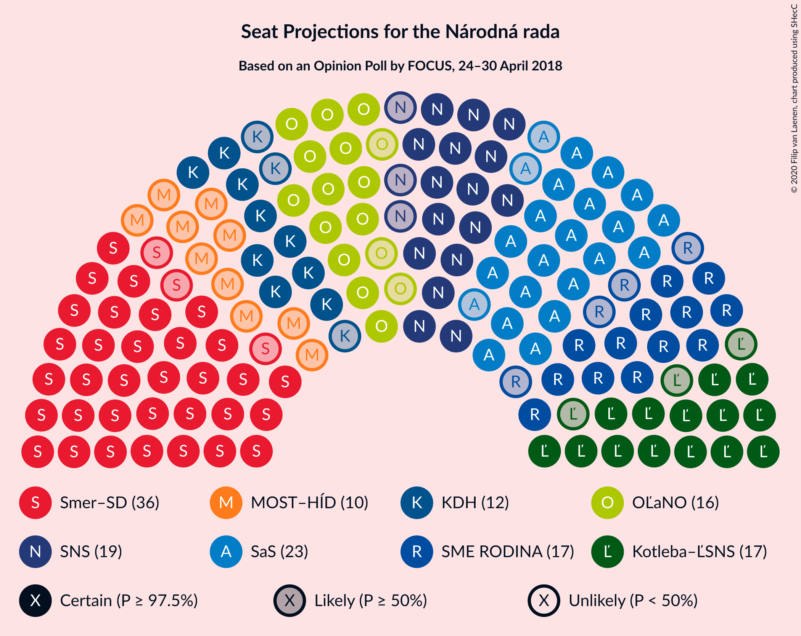
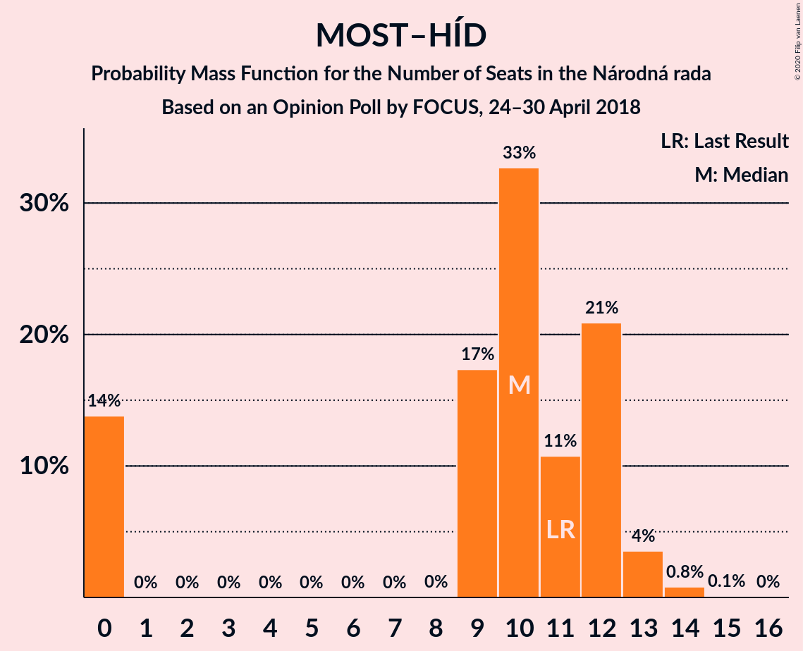

# Opinion Poll by FOCUS, 24–30 April 2018

<a href="#voting-intentions">Voting Intentions</a> | <a href="#seats">Seats</a> | <a href="#coalitions">Coalitions</a> | <a href="#technical-information">Technical Information</a>

## Voting Intentions

### Confidence Intervals

| Party | Last Result | Poll Result | 80% Confidence Interval | 90% Confidence Interval | 95% Confidence Interval | 99% Confidence Interval |
|:-----:|:-----------:|:-----------:|:-----------------------:|:-----------------------:|:-----------------------:|:-----------------------:|
| SMER–sociálna demokracia | 28.3% | 20.5% | 18.9–22.2% |18.5–22.7% |18.1–23.1% |17.4–23.9% |
| Sloboda a Solidarita | 12.1% | 13.2% | 11.9–14.7% |11.6–15.1% |11.3–15.5% |10.7–16.2% |
| Slovenská národná strana | 8.6% | 10.1% | 9.0–11.5% |8.7–11.8% |8.4–12.2% |7.9–12.8% |
| Kotleba–Ľudová strana Naše Slovensko | 8.0% | 9.3% | 8.2–10.5% |7.9–10.9% |7.6–11.2% |7.1–11.9% |
| OBYČAJNÍ ĽUDIA a nezávislé osobnosti | 11.0% | 9.1% | 8.0–10.3% |7.7–10.7% |7.4–11.0% |7.0–11.6% |
| SME RODINA | 6.6% | 9.1% | 8.0–10.3% |7.7–10.7% |7.4–11.0% |7.0–11.6% |
| Kresťanskodemokratické hnutie | 4.9% | 6.8% | 5.8–7.9% |5.6–8.2% |5.4–8.5% |5.0–9.1% |
| MOST–HÍD | 6.5% | 5.8% | 4.9–6.8% |4.7–7.1% |4.5–7.4% |4.1–7.9% |
| Progresívne Slovensko | 0.0% | 3.6% | 2.9–4.5% |2.7–4.7% |2.6–4.9% |2.3–5.4% |
| Strana maďarskej koalície–Magyar Koalíció Pártja | 4.0% | 3.3% | 2.7–4.1% |2.5–4.4% |2.3–4.6% |2.1–5.0% |
| SPOLU–Občianska Demokracia | 0.0% | 2.8% | 2.2–3.6% |2.1–3.8% |1.9–4.0% |1.7–4.4% |

*Note:* The poll result column reflects the actual value used in the calculations. Published results may vary slightly, and in addition be rounded to fewer digits.

## Seats

### Confidence Intervals

| Party | Last Result | Median | 80% Confidence Interval | 90% Confidence Interval | 95% Confidence Interval | 99% Confidence Interval |
|:-----:|:-----------:|:------:|:-----------------------:|:-----------------------:|:-----------------------:|:-----------------------:|
| <a href="#smer–sociálna-demokracia">SMER–sociálna demokracia</a> | 49 | 37 | 34–40 |34–42 |33–42 |32–44 |
| <a href="#sloboda-a-solidarita">Sloboda a Solidarita</a> | 21 | 24 | 20–25 |19–26 |19–26 |19–30 |
| <a href="#slovenská-národná-strana">Slovenská národná strana</a> | 15 | 18 | 16–20 |16–20 |16–21 |15–23 |
| <a href="#kotleba–ľudová-strana-naše-slovensko">Kotleba–Ľudová strana Naše Slovensko</a> | 14 | 19 | 15–20 |15–20 |13–21 |12–21 |
| <a href="#obyčajní-ľudia-a-nezávislé-osobnosti">OBYČAJNÍ ĽUDIA a nezávislé osobnosti</a> | 17 | 14 | 13–17 |13–19 |13–20 |13–21 |
| <a href="#sme-rodina">SME RODINA</a> | 11 | 16 | 14–18 |14–18 |13–19 |13–21 |
| <a href="#kresťanskodemokratické-hnutie">Kresťanskodemokratické hnutie</a> | 0 | 11 | 10–15 |9–16 |9–16 |0–16 |
| <a href="#most–híd">MOST–HÍD</a> | 11 | 11 | 9–12 |9–12 |0–14 |0–14 |
| <a href="#progresívne-slovensko">Progresívne Slovensko</a> | 0 | 0 | 0 |0 |0 |0 |
| <a href="#strana-maďarskej-koalície–magyar-koalíció-pártja">Strana maďarskej koalície–Magyar Koalíció Pártja</a> | 0 | 0 | 0 |0 |0 |0 |
| <a href="#spolu–občianska-demokracia">SPOLU–Občianska Demokracia</a> | 0 | 0 | 0 |0 |0 |0 |

### SMER–sociálna demokracia

*For a full overview of the results for this party, see the [SMER–sociálna demokracia](party-smer–sociálnademokracia.html) page.*

| Number of Seats | Probability | Accumulated | Special Marks |
|:---------------:|:-----------:|:-----------:|:-------------:|
| 29 | 0% | 100% |  |
| 30 | 0.2% | 99.9% |  |
| 31 | 0.2% | 99.7% |  |
| 32 | 1.3% | 99.5% |  |
| 33 | 0.8% | 98% |  |
| 34 | 9% | 97% |  |
| 35 | 2% | 89% |  |
| 36 | 4% | 87% |  |
| 37 | 35% | 83% | Median |
| 38 | 16% | 48% |  |
| 39 | 21% | 32% |  |
| 40 | 3% | 11% |  |
| 41 | 2% | 8% |  |
| 42 | 5% | 6% |  |
| 43 | 0% | 0.7% |  |
| 44 | 0.5% | 0.6% |  |
| 45 | 0% | 0.1% |  |
| 46 | 0.1% | 0.1% |  |
| 47 | 0% | 0% |  |
| 48 | 0% | 0% |  |
| 49 | 0% | 0% | Last Result |

### Sloboda a Solidarita

*For a full overview of the results for this party, see the [Sloboda a Solidarita](party-slobodaasolidarita.html) page.*

| Number of Seats | Probability | Accumulated | Special Marks |
|:---------------:|:-----------:|:-----------:|:-------------:|
| 18 | 0.2% | 100% |  |
| 19 | 8% | 99.7% |  |
| 20 | 4% | 92% |  |
| 21 | 4% | 88% | Last Result |
| 22 | 8% | 84% |  |
| 23 | 12% | 75% |  |
| 24 | 23% | 63% | Median |
| 25 | 32% | 40% |  |
| 26 | 5% | 8% |  |
| 27 | 0.6% | 2% |  |
| 28 | 0.9% | 2% |  |
| 29 | 0.4% | 1.0% |  |
| 30 | 0.4% | 0.5% |  |
| 31 | 0% | 0.1% |  |
| 32 | 0% | 0% |  |

### Slovenská národná strana

*For a full overview of the results for this party, see the [Slovenská národná strana](party-slovenskánárodnástrana.html) page.*

| Number of Seats | Probability | Accumulated | Special Marks |
|:---------------:|:-----------:|:-----------:|:-------------:|
| 14 | 0.4% | 100% |  |
| 15 | 2% | 99.6% | Last Result |
| 16 | 12% | 98% |  |
| 17 | 6% | 86% |  |
| 18 | 46% | 80% | Median |
| 19 | 4% | 35% |  |
| 20 | 28% | 30% |  |
| 21 | 0.2% | 3% |  |
| 22 | 2% | 2% |  |
| 23 | 0.5% | 0.8% |  |
| 24 | 0.2% | 0.4% |  |
| 25 | 0.1% | 0.1% |  |
| 26 | 0% | 0% |  |

### Kotleba–Ľudová strana Naše Slovensko

*For a full overview of the results for this party, see the [Kotleba–Ľudová strana Naše Slovensko](party-kotleba–ľudovástrananašeslovensko.html) page.*

| Number of Seats | Probability | Accumulated | Special Marks |
|:---------------:|:-----------:|:-----------:|:-------------:|
| 12 | 1.2% | 100% |  |
| 13 | 2% | 98.8% |  |
| 14 | 0.4% | 97% | Last Result |
| 15 | 15% | 96% |  |
| 16 | 10% | 82% |  |
| 17 | 10% | 72% |  |
| 18 | 2% | 62% |  |
| 19 | 32% | 60% | Median |
| 20 | 24% | 28% |  |
| 21 | 3% | 3% |  |
| 22 | 0.3% | 0.3% |  |
| 23 | 0% | 0% |  |

### OBYČAJNÍ ĽUDIA a nezávislé osobnosti

*For a full overview of the results for this party, see the [OBYČAJNÍ ĽUDIA a nezávislé osobnosti](party-obyčajníľudiaanezávisléosobnosti.html) page.*

| Number of Seats | Probability | Accumulated | Special Marks |
|:---------------:|:-----------:|:-----------:|:-------------:|
| 11 | 0.3% | 100% |  |
| 12 | 0.2% | 99.7% |  |
| 13 | 23% | 99.5% |  |
| 14 | 30% | 77% | Median |
| 15 | 9% | 46% |  |
| 16 | 13% | 37% |  |
| 17 | 14% | 24% | Last Result |
| 18 | 3% | 10% |  |
| 19 | 4% | 7% |  |
| 20 | 2% | 3% |  |
| 21 | 0.6% | 0.9% |  |
| 22 | 0.1% | 0.3% |  |
| 23 | 0.2% | 0.2% |  |
| 24 | 0% | 0% |  |

### SME RODINA

*For a full overview of the results for this party, see the [SME RODINA](party-smerodina.html) page.*

| Number of Seats | Probability | Accumulated | Special Marks |
|:---------------:|:-----------:|:-----------:|:-------------:|
| 11 | 0% | 100% | Last Result |
| 12 | 0.4% | 100% |  |
| 13 | 4% | 99.5% |  |
| 14 | 26% | 96% |  |
| 15 | 4% | 69% |  |
| 16 | 35% | 65% | Median |
| 17 | 18% | 30% |  |
| 18 | 9% | 12% |  |
| 19 | 1.1% | 3% |  |
| 20 | 0.9% | 2% |  |
| 21 | 0.3% | 0.6% |  |
| 22 | 0% | 0.3% |  |
| 23 | 0.3% | 0.3% |  |
| 24 | 0% | 0% |  |

### Kresťanskodemokratické hnutie

*For a full overview of the results for this party, see the [Kresťanskodemokratické hnutie](party-kresťanskodemokratickéhnutie.html) page.*

| Number of Seats | Probability | Accumulated | Special Marks |
|:---------------:|:-----------:|:-----------:|:-------------:|
| 0 | 0.6% | 100% | Last Result |
| 1 | 0% | 99.4% |  |
| 2 | 0% | 99.4% |  |
| 3 | 0% | 99.4% |  |
| 4 | 0% | 99.4% |  |
| 5 | 0% | 99.4% |  |
| 6 | 0% | 99.4% |  |
| 7 | 0% | 99.4% |  |
| 8 | 0% | 99.4% |  |
| 9 | 5% | 99.4% |  |
| 10 | 29% | 94% |  |
| 11 | 26% | 65% | Median |
| 12 | 16% | 39% |  |
| 13 | 12% | 23% |  |
| 14 | 2% | 12% |  |
| 15 | 5% | 10% |  |
| 16 | 5% | 5% |  |
| 17 | 0.3% | 0.4% |  |
| 18 | 0.1% | 0.1% |  |
| 19 | 0% | 0% |  |

### MOST–HÍD

*For a full overview of the results for this party, see the [MOST–HÍD](party-most–híd.html) page.*

| Number of Seats | Probability | Accumulated | Special Marks |
|:---------------:|:-----------:|:-----------:|:-------------:|
| 0 | 3% | 100% |  |
| 1 | 0% | 97% |  |
| 2 | 0% | 97% |  |
| 3 | 0% | 97% |  |
| 4 | 0% | 97% |  |
| 5 | 0% | 97% |  |
| 6 | 0% | 97% |  |
| 7 | 0% | 97% |  |
| 8 | 0% | 97% |  |
| 9 | 26% | 97% |  |
| 10 | 14% | 71% |  |
| 11 | 45% | 57% | Last Result, Median |
| 12 | 8% | 12% |  |
| 13 | 0.8% | 4% |  |
| 14 | 3% | 3% |  |
| 15 | 0.1% | 0.2% |  |
| 16 | 0% | 0% |  |

### Progresívne Slovensko

*For a full overview of the results for this party, see the [Progresívne Slovensko](party-progresívneslovensko.html) page.*

| Number of Seats | Probability | Accumulated | Special Marks |
|:---------------:|:-----------:|:-----------:|:-------------:|
| 0 | 99.7% | 100% | Last Result, Median |
| 1 | 0% | 0.3% |  |
| 2 | 0% | 0.3% |  |
| 3 | 0% | 0.3% |  |
| 4 | 0% | 0.3% |  |
| 5 | 0% | 0.3% |  |
| 6 | 0% | 0.3% |  |
| 7 | 0% | 0.3% |  |
| 8 | 0% | 0.3% |  |
| 9 | 0.3% | 0.3% |  |
| 10 | 0.1% | 0.1% |  |
| 11 | 0% | 0% |  |

### Strana maďarskej koalície–Magyar Koalíció Pártja

*For a full overview of the results for this party, see the [Strana maďarskej koalície–Magyar Koalíció Pártja](party-stranamaďarskejkoalície–magyarkoalíciópártja.html) page.*

| Number of Seats | Probability | Accumulated | Special Marks |
|:---------------:|:-----------:|:-----------:|:-------------:|
| 0 | 99.8% | 100% | Last Result, Median |
| 1 | 0% | 0.2% |  |
| 2 | 0% | 0.2% |  |
| 3 | 0% | 0.2% |  |
| 4 | 0% | 0.2% |  |
| 5 | 0% | 0.2% |  |
| 6 | 0% | 0.2% |  |
| 7 | 0% | 0.2% |  |
| 8 | 0% | 0.2% |  |
| 9 | 0.1% | 0.1% |  |
| 10 | 0% | 0% |  |

### SPOLU–Občianska Demokracia

*For a full overview of the results for this party, see the [SPOLU–Občianska Demokracia](party-spolu–občianskademokracia.html) page.*

| Number of Seats | Probability | Accumulated | Special Marks |
|:---------------:|:-----------:|:-----------:|:-------------:|
| 0 | 100% | 100% | Last Result, Median |

## Coalitions

### Confidence Intervals

| Coalition | Last Result | Median | Majority? | 80% Confidence Interval | 90% Confidence Interval | 95% Confidence Interval | 99% Confidence Interval |
|:---------:|:-----------:|:------:|:---------:|:-----------------------:|:-----------------------:|:-----------------------:|:-----------------------:|
| SMER–sociálna demokracia – Slovenská národná strana – MOST–HÍD | 75 | 66 | 0% | 63–68 | 61–68 | 60–69 | 56–73 |
| SMER–sociálna demokracia | 49 | 37 | 0% | 34–40 | 34–42 | 33–42 | 32–44 |

### SMER–sociálna demokracia – Slovenská národná strana – MOST–HÍD

| Number of Seats | Probability | Accumulated | Special Marks |
|:---------------:|:-----------:|:-----------:|:-------------:|
| 52 | 0.2% | 100% |  |
| 53 | 0.1% | 99.8% |  |
| 54 | 0.1% | 99.7% |  |
| 55 | 0.1% | 99.6% |  |
| 56 | 0.2% | 99.5% |  |
| 57 | 0.3% | 99.3% |  |
| 58 | 0.9% | 99.0% |  |
| 59 | 0.5% | 98% |  |
| 60 | 0.9% | 98% |  |
| 61 | 3% | 97% |  |
| 62 | 0.9% | 93% |  |
| 63 | 5% | 92% |  |
| 64 | 0.8% | 87% |  |
| 65 | 7% | 87% |  |
| 66 | 32% | 79% | Median |
| 67 | 15% | 47% |  |
| 68 | 28% | 32% |  |
| 69 | 3% | 4% |  |
| 70 | 0.2% | 2% |  |
| 71 | 0.9% | 2% |  |
| 72 | 0.2% | 0.7% |  |
| 73 | 0.5% | 0.6% |  |
| 74 | 0% | 0.1% |  |
| 75 | 0.1% | 0.1% | Last Result |
| 76 | 0% | 0% | Majority |

### SMER–sociálna demokracia

| Number of Seats | Probability | Accumulated | Special Marks |
|:---------------:|:-----------:|:-----------:|:-------------:|
| 29 | 0% | 100% |  |
| 30 | 0.2% | 99.9% |  |
| 31 | 0.2% | 99.7% |  |
| 32 | 1.3% | 99.5% |  |
| 33 | 0.8% | 98% |  |
| 34 | 9% | 97% |  |
| 35 | 2% | 89% |  |
| 36 | 4% | 87% |  |
| 37 | 35% | 83% | Median |
| 38 | 16% | 48% |  |
| 39 | 21% | 32% |  |
| 40 | 3% | 11% |  |
| 41 | 2% | 8% |  |
| 42 | 5% | 6% |  |
| 43 | 0% | 0.7% |  |
| 44 | 0.5% | 0.6% |  |
| 45 | 0% | 0.1% |  |
| 46 | 0.1% | 0.1% |  |
| 47 | 0% | 0% |  |
| 48 | 0% | 0% |  |
| 49 | 0% | 0% | Last Result |

## Technical Information

### Opinion Poll

+ **Polling firm:** FOCUS
+ **Commissioner(s):** —
+ **Fieldwork period:** 24–30 April 2018

### Calculations

+ **Sample size:** 1005
+ **Simulations done:** 131,072
+ **Error estimate:** 2.99%

