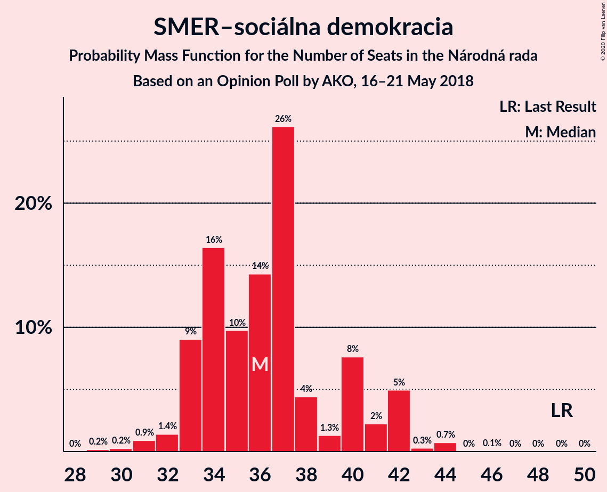
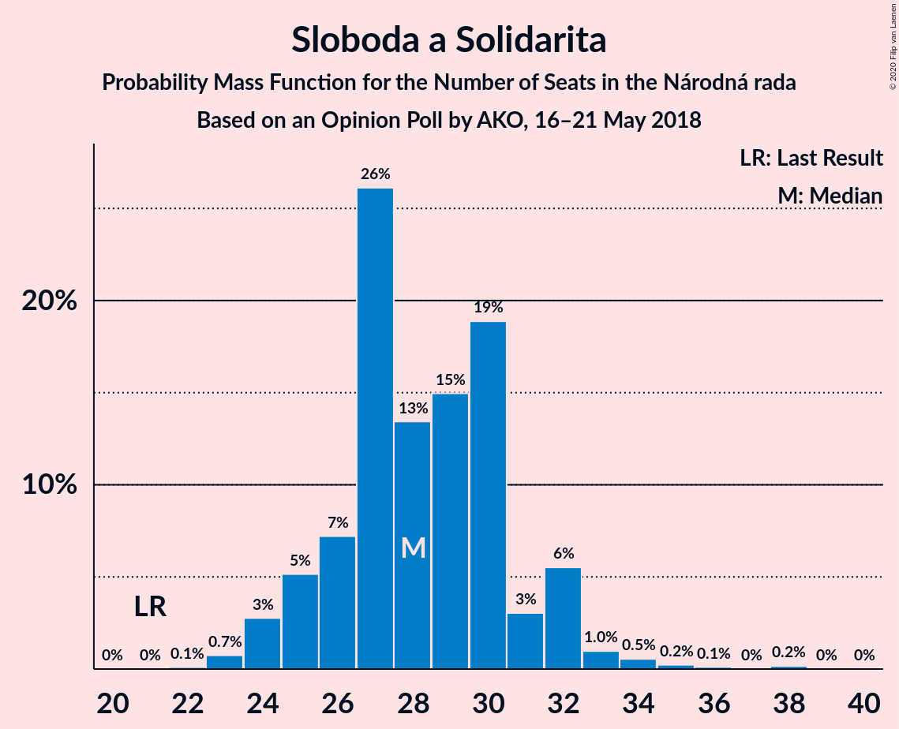
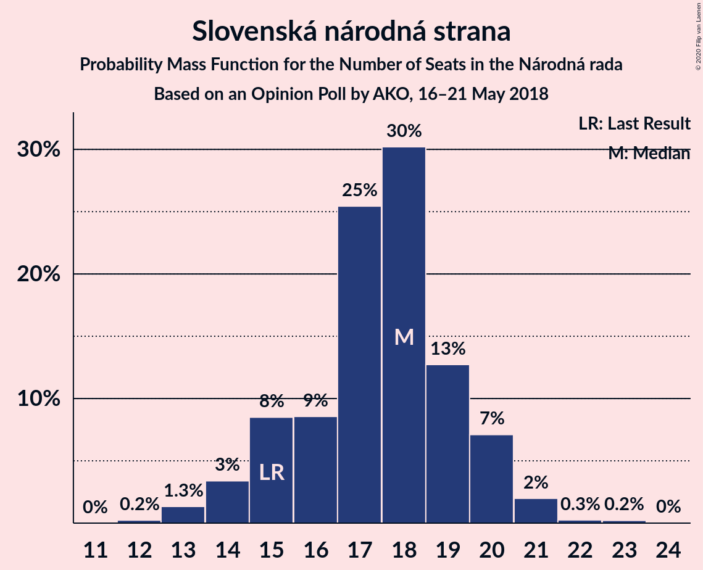
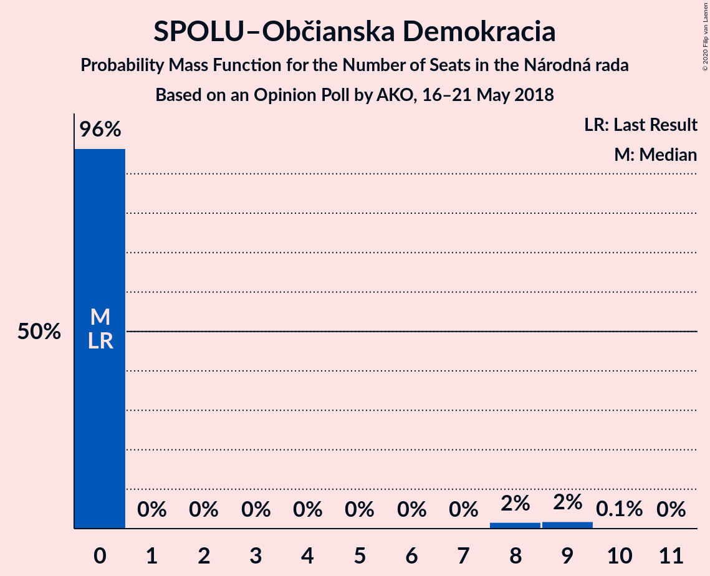
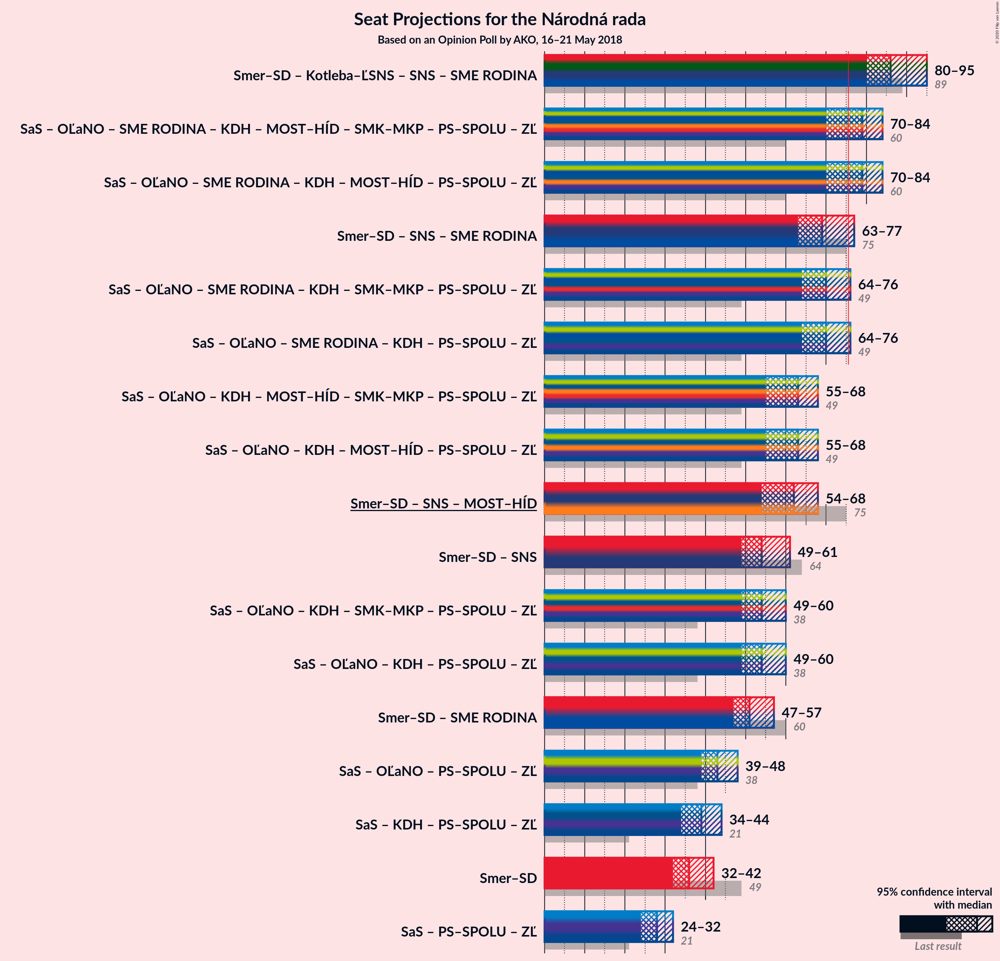

# Opinion Poll by AKO, 16–21 May 2018

<a href="#voting-intentions">Voting Intentions</a> | <a href="#seats">Seats</a> | <a href="#coalitions">Coalitions</a> | <a href="#technical-information">Technical Information</a>

## Voting Intentions

### Confidence Intervals

| Party | Last Result | Poll Result | 80% Confidence Interval | 90% Confidence Interval | 95% Confidence Interval | 99% Confidence Interval |
|:-----:|:-----------:|:-----------:|:-----------------------:|:-----------------------:|:-----------------------:|:-----------------------:|
| SMER–sociálna demokracia | 28.3% | 21.5% | 19.9–23.2% |19.4–23.7% |19.1–24.2% |18.3–25.0% |
| Sloboda a Solidarita | 12.1% | 16.7% | 15.3–18.3% |14.9–18.7% |14.5–19.1% |13.9–19.9% |
| Kotleba–Ľudová strana Naše Slovensko | 8.0% | 10.4% | 9.3–11.7% |8.9–12.1% |8.7–12.5% |8.1–13.1% |
| Slovenská národná strana | 8.6% | 10.1% | 9.0–11.4% |8.6–11.8% |8.4–12.1% |7.9–12.8% |
| OBYČAJNÍ ĽUDIA a nezávislé osobnosti | 11.0% | 9.1% | 8.0–10.4% |7.7–10.7% |7.5–11.1% |7.0–11.7% |
| SME RODINA | 6.6% | 9.1% | 8.0–10.4% |7.7–10.7% |7.5–11.1% |7.0–11.7% |
| Kresťanskodemokratické hnutie | 4.9% | 6.7% | 5.8–7.8% |5.5–8.2% |5.3–8.4% |4.9–9.0% |
| MOST–HÍD | 6.5% | 5.6% | 4.8–6.6% |4.5–7.0% |4.3–7.2% |4.0–7.7% |
| Progresívne Slovensko | 0.0% | 3.9% | 3.2–4.8% |3.0–5.1% |2.9–5.3% |2.6–5.8% |
| SPOLU–Občianska Demokracia | 0.0% | 3.6% | 2.9–4.5% |2.8–4.7% |2.6–5.0% |2.3–5.4% |
| Strana maďarskej koalície–Magyar Koalíció Pártja | 4.0% | 2.5% | 2.0–3.3% |1.8–3.5% |1.7–3.7% |1.5–4.1% |

*Note:* The poll result column reflects the actual value used in the calculations. Published results may vary slightly, and in addition be rounded to fewer digits.

## Seats

### Confidence Intervals

| Party | Last Result | Median | 80% Confidence Interval | 90% Confidence Interval | 95% Confidence Interval | 99% Confidence Interval |
|:-----:|:-----------:|:------:|:-----------------------:|:-----------------------:|:-----------------------:|:-----------------------:|
| <a href="#smer–sociálna-demokracia">SMER–sociálna demokracia</a> | 49 | 37 | 35–40 |35–40 |34–40 |33–41 |
| <a href="#sloboda-a-solidarita">Sloboda a Solidarita</a> | 21 | 27 | 25–29 |24–29 |24–31 |24–38 |
| <a href="#kotleba–ľudová-strana-naše-slovensko">Kotleba–Ľudová strana Naše Slovensko</a> | 14 | 19 | 15–19 |15–19 |15–19 |13–20 |
| <a href="#slovenská-národná-strana">Slovenská národná strana</a> | 15 | 17 | 17–20 |16–20 |14–20 |14–20 |
| <a href="#obyčajní-ľudia-a-nezávislé-osobnosti">OBYČAJNÍ ĽUDIA a nezávislé osobnosti</a> | 17 | 15 | 13–18 |13–18 |13–18 |12–18 |
| <a href="#sme-rodina">SME RODINA</a> | 11 | 14 | 14–16 |13–16 |13–16 |13–21 |
| <a href="#kresťanskodemokratické-hnutie">Kresťanskodemokratické hnutie</a> | 0 | 12 | 11–13 |11–13 |10–13 |9–13 |
| <a href="#most–híd">MOST–HÍD</a> | 11 | 9 | 0–11 |0–11 |0–11 |0–12 |
| <a href="#progresívne-slovensko">Progresívne Slovensko</a> | 0 | 0 | 0 |0 |0 |0–9 |
| <a href="#spolu–občianska-demokracia">SPOLU–Občianska Demokracia</a> | 0 | 0 | 0 |0 |0 |0–9 |
| <a href="#strana-maďarskej-koalície–magyar-koalíció-pártja">Strana maďarskej koalície–Magyar Koalíció Pártja</a> | 0 | 0 | 0 |0 |0 |0 |

### SMER–sociálna demokracia

*For a full overview of the results for this party, see the [SMER–sociálna demokracia](party-smer–sociálnademokracia.html) page.*

| Number of Seats | Probability | Accumulated | Special Marks |
|:---------------:|:-----------:|:-----------:|:-------------:|
| 30 | 0.2% | 100% |  |
| 31 | 0.1% | 99.8% |  |
| 32 | 0.1% | 99.7% |  |
| 33 | 0.3% | 99.6% |  |
| 34 | 3% | 99.2% |  |
| 35 | 16% | 97% |  |
| 36 | 1.5% | 81% |  |
| 37 | 53% | 79% | Median |
| 38 | 0.7% | 26% |  |
| 39 | 0.2% | 26% |  |
| 40 | 25% | 26% |  |
| 41 | 0.7% | 1.0% |  |
| 42 | 0% | 0.4% |  |
| 43 | 0.3% | 0.3% |  |
| 44 | 0.1% | 0.1% |  |
| 45 | 0% | 0% |  |
| 46 | 0% | 0% |  |
| 47 | 0% | 0% |  |
| 48 | 0% | 0% |  |
| 49 | 0% | 0% | Last Result |

### Sloboda a Solidarita

*For a full overview of the results for this party, see the [Sloboda a Solidarita](party-slobodaasolidarita.html) page.*

| Number of Seats | Probability | Accumulated | Special Marks |
|:---------------:|:-----------:|:-----------:|:-------------:|
| 21 | 0% | 100% | Last Result |
| 22 | 0% | 100% |  |
| 23 | 0.5% | 100% |  |
| 24 | 8% | 99.5% |  |
| 25 | 6% | 92% |  |
| 26 | 0.7% | 86% |  |
| 27 | 48% | 85% | Median |
| 28 | 18% | 38% |  |
| 29 | 16% | 19% |  |
| 30 | 0.3% | 3% |  |
| 31 | 0.6% | 3% |  |
| 32 | 1.2% | 2% |  |
| 33 | 0% | 0.9% |  |
| 34 | 0% | 0.9% |  |
| 35 | 0.1% | 0.9% |  |
| 36 | 0.1% | 0.8% |  |
| 37 | 0% | 0.6% |  |
| 38 | 0.6% | 0.6% |  |
| 39 | 0% | 0% |  |

### Kotleba–Ľudová strana Naše Slovensko

*For a full overview of the results for this party, see the [Kotleba–Ľudová strana Naše Slovensko](party-kotleba–ľudovástrananašeslovensko.html) page.*

| Number of Seats | Probability | Accumulated | Special Marks |
|:---------------:|:-----------:|:-----------:|:-------------:|
| 13 | 0.6% | 100% |  |
| 14 | 0.8% | 99.4% | Last Result |
| 15 | 17% | 98.6% |  |
| 16 | 2% | 82% |  |
| 17 | 9% | 80% |  |
| 18 | 2% | 71% |  |
| 19 | 68% | 69% | Median |
| 20 | 0.6% | 0.9% |  |
| 21 | 0.2% | 0.3% |  |
| 22 | 0% | 0.1% |  |
| 23 | 0% | 0% |  |

### Slovenská národná strana

*For a full overview of the results for this party, see the [Slovenská národná strana](party-slovenskánárodnástrana.html) page.*

| Number of Seats | Probability | Accumulated | Special Marks |
|:---------------:|:-----------:|:-----------:|:-------------:|
| 13 | 0.3% | 100% |  |
| 14 | 3% | 99.7% |  |
| 15 | 1.3% | 97% | Last Result |
| 16 | 0.8% | 96% |  |
| 17 | 59% | 95% | Median |
| 18 | 18% | 36% |  |
| 19 | 2% | 18% |  |
| 20 | 16% | 16% |  |
| 21 | 0.1% | 0.4% |  |
| 22 | 0.2% | 0.3% |  |
| 23 | 0.1% | 0.1% |  |
| 24 | 0% | 0% |  |

### OBYČAJNÍ ĽUDIA a nezávislé osobnosti

*For a full overview of the results for this party, see the [OBYČAJNÍ ĽUDIA a nezávislé osobnosti](party-obyčajníľudiaanezávisléosobnosti.html) page.*

| Number of Seats | Probability | Accumulated | Special Marks |
|:---------------:|:-----------:|:-----------:|:-------------:|
| 11 | 0.1% | 100% |  |
| 12 | 0.8% | 99.9% |  |
| 13 | 15% | 99.1% |  |
| 14 | 2% | 84% |  |
| 15 | 60% | 82% | Median |
| 16 | 1.4% | 22% |  |
| 17 | 2% | 21% | Last Result |
| 18 | 18% | 19% |  |
| 19 | 0.1% | 0.4% |  |
| 20 | 0.1% | 0.3% |  |
| 21 | 0.2% | 0.2% |  |
| 22 | 0% | 0% |  |

### SME RODINA

*For a full overview of the results for this party, see the [SME RODINA](party-smerodina.html) page.*

| Number of Seats | Probability | Accumulated | Special Marks |
|:---------------:|:-----------:|:-----------:|:-------------:|
| 11 | 0% | 100% | Last Result |
| 12 | 0.1% | 100% |  |
| 13 | 6% | 99.9% |  |
| 14 | 47% | 94% | Median |
| 15 | 28% | 46% |  |
| 16 | 16% | 18% |  |
| 17 | 0.7% | 2% |  |
| 18 | 0.1% | 1.1% |  |
| 19 | 0.3% | 1.0% |  |
| 20 | 0.1% | 0.7% |  |
| 21 | 0.6% | 0.6% |  |
| 22 | 0% | 0% |  |

### Kresťanskodemokratické hnutie

*For a full overview of the results for this party, see the [Kresťanskodemokratické hnutie](party-kresťanskodemokratickéhnutie.html) page.*

| Number of Seats | Probability | Accumulated | Special Marks |
|:---------------:|:-----------:|:-----------:|:-------------:|
| 0 | 0.1% | 100% | Last Result |
| 1 | 0% | 99.9% |  |
| 2 | 0% | 99.9% |  |
| 3 | 0% | 99.9% |  |
| 4 | 0% | 99.9% |  |
| 5 | 0% | 99.9% |  |
| 6 | 0% | 99.9% |  |
| 7 | 0% | 99.9% |  |
| 8 | 0.1% | 99.9% |  |
| 9 | 2% | 99.8% |  |
| 10 | 1.3% | 98% |  |
| 11 | 17% | 97% |  |
| 12 | 65% | 80% | Median |
| 13 | 15% | 15% |  |
| 14 | 0.3% | 0.4% |  |
| 15 | 0% | 0% |  |

### MOST–HÍD

*For a full overview of the results for this party, see the [MOST–HÍD](party-most–híd.html) page.*

| Number of Seats | Probability | Accumulated | Special Marks |
|:---------------:|:-----------:|:-----------:|:-------------:|
| 0 | 20% | 100% |  |
| 1 | 0% | 80% |  |
| 2 | 0% | 80% |  |
| 3 | 0% | 80% |  |
| 4 | 0% | 80% |  |
| 5 | 0% | 80% |  |
| 6 | 0% | 80% |  |
| 7 | 0% | 80% |  |
| 8 | 0.1% | 80% |  |
| 9 | 57% | 80% | Median |
| 10 | 2% | 23% |  |
| 11 | 20% | 21% | Last Result |
| 12 | 0.4% | 0.9% |  |
| 13 | 0.4% | 0.4% |  |
| 14 | 0% | 0% |  |

### Progresívne Slovensko

*For a full overview of the results for this party, see the [Progresívne Slovensko](party-progresívneslovensko.html) page.*

| Number of Seats | Probability | Accumulated | Special Marks |
|:---------------:|:-----------:|:-----------:|:-------------:|
| 0 | 98% | 100% | Last Result, Median |
| 1 | 0% | 2% |  |
| 2 | 0% | 2% |  |
| 3 | 0% | 2% |  |
| 4 | 0% | 2% |  |
| 5 | 0% | 2% |  |
| 6 | 0% | 2% |  |
| 7 | 0% | 2% |  |
| 8 | 0% | 2% |  |
| 9 | 2% | 2% |  |
| 10 | 0% | 0% |  |

### SPOLU–Občianska Demokracia

*For a full overview of the results for this party, see the [SPOLU–Občianska Demokracia](party-spolu–občianskademokracia.html) page.*

| Number of Seats | Probability | Accumulated | Special Marks |
|:---------------:|:-----------:|:-----------:|:-------------:|
| 0 | 98.9% | 100% | Last Result, Median |
| 1 | 0% | 1.1% |  |
| 2 | 0% | 1.1% |  |
| 3 | 0% | 1.1% |  |
| 4 | 0% | 1.1% |  |
| 5 | 0% | 1.1% |  |
| 6 | 0% | 1.1% |  |
| 7 | 0% | 1.1% |  |
| 8 | 0% | 1.1% |  |
| 9 | 0.9% | 1.1% |  |
| 10 | 0.2% | 0.2% |  |
| 11 | 0% | 0% |  |

### Strana maďarskej koalície–Magyar Koalíció Pártja

*For a full overview of the results for this party, see the [Strana maďarskej koalície–Magyar Koalíció Pártja](party-stranamaďarskejkoalície–magyarkoalíciópártja.html) page.*

| Number of Seats | Probability | Accumulated | Special Marks |
|:---------------:|:-----------:|:-----------:|:-------------:|
| 0 | 100% | 100% | Last Result, Median |

## Coalitions

### Confidence Intervals

| Coalition | Last Result | Median | Majority? | 80% Confidence Interval | 90% Confidence Interval | 95% Confidence Interval | 99% Confidence Interval |
|:---------:|:-----------:|:------:|:---------:|:-----------------------:|:-----------------------:|:-----------------------:|:-----------------------:|
| SMER–sociálna demokracia – Slovenská národná strana – MOST–HÍD | 75 | 63 | 0% | 58–66 | 58–66 | 57–66 | 51–69 |
| SMER–sociálna demokracia | 49 | 37 | 0% | 35–40 | 35–40 | 34–40 | 33–41 |

### SMER–sociálna demokracia – Slovenská národná strana – MOST–HÍD

| Number of Seats | Probability | Accumulated | Special Marks |
|:---------------:|:-----------:|:-----------:|:-------------:|
| 49 | 0% | 100% |  |
| 50 | 0% | 99.9% |  |
| 51 | 0.6% | 99.9% |  |
| 52 | 0.1% | 99.3% |  |
| 53 | 0.4% | 99.2% |  |
| 54 | 0.1% | 98.8% |  |
| 55 | 0.4% | 98.7% |  |
| 56 | 0.5% | 98% |  |
| 57 | 1.2% | 98% |  |
| 58 | 18% | 97% |  |
| 59 | 0.4% | 79% |  |
| 60 | 0.4% | 78% |  |
| 61 | 0.9% | 78% |  |
| 62 | 1.3% | 77% |  |
| 63 | 46% | 76% | Median |
| 64 | 0.4% | 30% |  |
| 65 | 6% | 29% |  |
| 66 | 23% | 24% |  |
| 67 | 0% | 0.7% |  |
| 68 | 0.1% | 0.7% |  |
| 69 | 0.4% | 0.5% |  |
| 70 | 0.1% | 0.1% |  |
| 71 | 0% | 0.1% |  |
| 72 | 0% | 0% |  |
| 73 | 0% | 0% |  |
| 74 | 0% | 0% |  |
| 75 | 0% | 0% | Last Result |

### SMER–sociálna demokracia

| Number of Seats | Probability | Accumulated | Special Marks |
|:---------------:|:-----------:|:-----------:|:-------------:|
| 30 | 0.2% | 100% |  |
| 31 | 0.1% | 99.8% |  |
| 32 | 0.1% | 99.7% |  |
| 33 | 0.3% | 99.6% |  |
| 34 | 3% | 99.2% |  |
| 35 | 16% | 97% |  |
| 36 | 1.5% | 81% |  |
| 37 | 53% | 79% | Median |
| 38 | 0.7% | 26% |  |
| 39 | 0.2% | 26% |  |
| 40 | 25% | 26% |  |
| 41 | 0.7% | 1.0% |  |
| 42 | 0% | 0.4% |  |
| 43 | 0.3% | 0.3% |  |
| 44 | 0.1% | 0.1% |  |
| 45 | 0% | 0% |  |
| 46 | 0% | 0% |  |
| 47 | 0% | 0% |  |
| 48 | 0% | 0% |  |
| 49 | 0% | 0% | Last Result |

## Technical Information

### Opinion Poll

+ **Polling firm:** AKO
+ **Commissioner(s):** —
+ **Fieldwork period:** 16–21 May 2018

### Calculations

+ **Sample size:** 1000
+ **Simulations done:** 131,072
+ **Error estimate:** 1.94%

