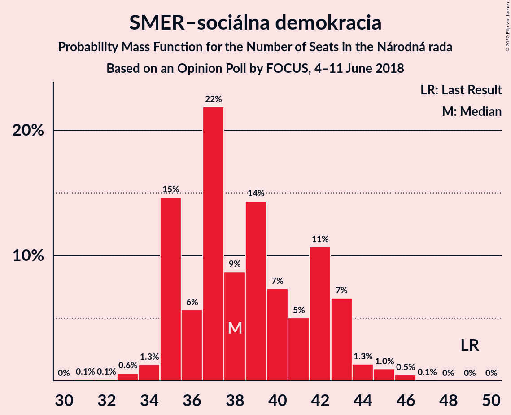
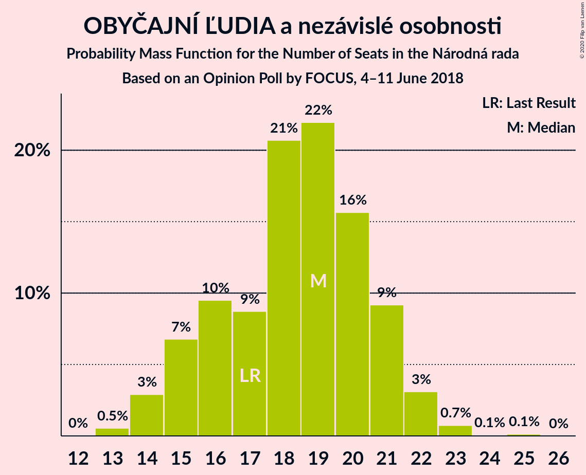
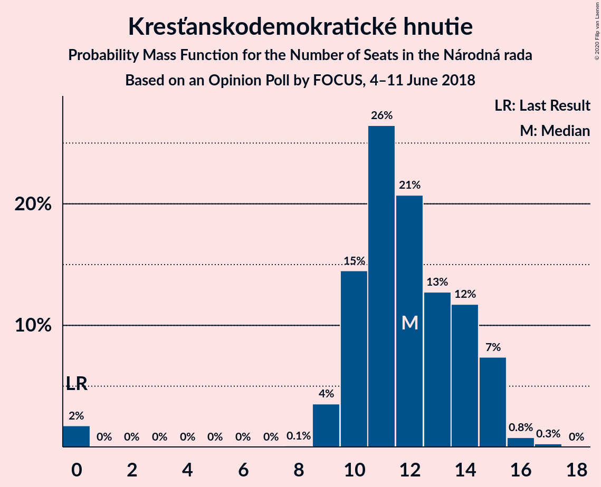
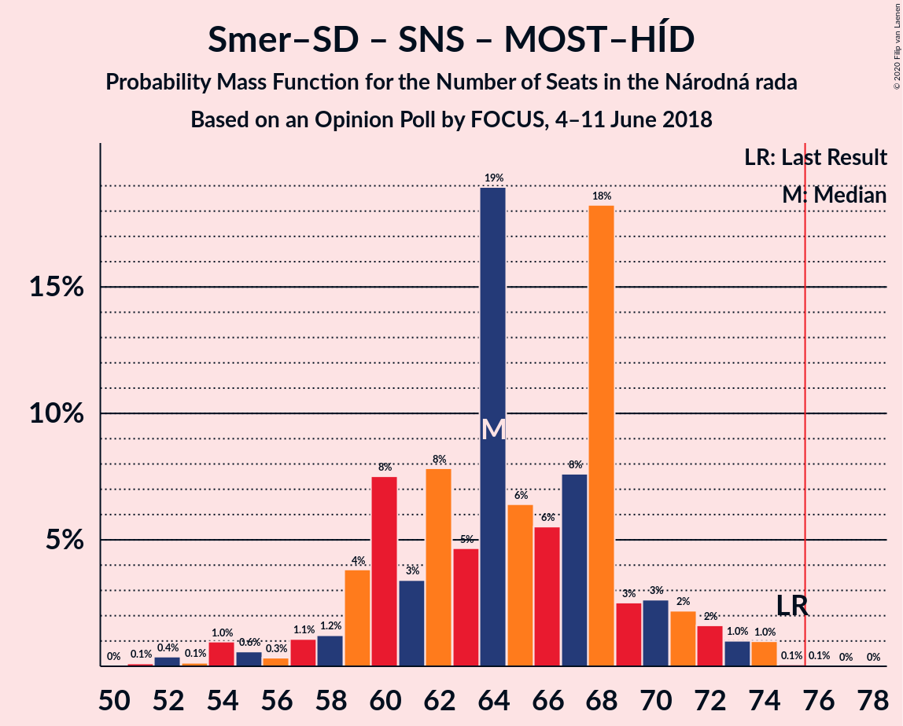

# Opinion Poll by FOCUS, 4–11 June 2018

<a href="#voting-intentions">Voting Intentions</a> | <a href="#seats">Seats</a> | <a href="#coalitions">Coalitions</a> | <a href="#technical-information">Technical Information</a>

## Voting Intentions

### Confidence Intervals

| Party | Last Result | Poll Result | 80% Confidence Interval | 90% Confidence Interval | 95% Confidence Interval | 99% Confidence Interval |
|:-----:|:-----------:|:-----------:|:-----------------------:|:-----------------------:|:-----------------------:|:-----------------------:|
| SMER–sociálna demokracia | 28.3% | 21.7% | 20.1–23.4% |19.6–23.9% |19.3–24.3% |18.5–25.2% |
| Sloboda a Solidarita | 12.1% | 12.4% | 11.2–13.8% |10.8–14.2% |10.5–14.6% |10.0–15.3% |
| OBYČAJNÍ ĽUDIA a nezávislé osobnosti | 11.0% | 10.0% | 8.9–11.4% |8.6–11.7% |8.3–12.1% |7.8–12.7% |
| Slovenská národná strana | 8.6% | 9.8% | 8.6–11.1% |8.3–11.4% |8.1–11.7% |7.6–12.4% |
| Kotleba–Ľudová strana Naše Slovensko | 8.0% | 9.7% | 8.6–10.9% |8.2–11.3% |8.0–11.6% |7.5–12.3% |
| SME RODINA | 6.6% | 8.1% | 7.1–9.3% |6.8–9.6% |6.6–9.9% |6.1–10.5% |
| Kresťanskodemokratické hnutie | 4.9% | 6.7% | 5.8–7.8% |5.5–8.1% |5.3–8.4% |4.9–9.0% |
| MOST–HÍD | 6.5% | 5.6% | 4.8–6.7% |4.6–7.0% |4.4–7.2% |4.0–7.7% |
| Strana maďarskej koalície–Magyar Koalíció Pártja | 4.0% | 4.0% | 3.3–5.0% |3.2–5.2% |3.0–5.4% |2.7–5.9% |
| Progresívne Slovensko | 0.0% | 3.9% | 3.3–4.8% |3.1–5.1% |2.9–5.3% |2.6–5.8% |
| SPOLU–Občianska Demokracia | 0.0% | 2.9% | 2.3–3.7% |2.1–3.9% |2.0–4.1% |1.8–4.5% |

*Note:* The poll result column reflects the actual value used in the calculations. Published results may vary slightly, and in addition be rounded to fewer digits.

## Seats

### Confidence Intervals

| Party | Last Result | Median | 80% Confidence Interval | 90% Confidence Interval | 95% Confidence Interval | 99% Confidence Interval |
|:-----:|:-----------:|:------:|:-----------------------:|:-----------------------:|:-----------------------:|:-----------------------:|
| <a href="#smer–sociálna-demokracia">SMER–sociálna demokracia</a> | 49 | 38 | 35–42 |35–43 |35–44 |33–46 |
| <a href="#sloboda-a-solidarita">Sloboda a Solidarita</a> | 21 | 22 | 19–24 |19–26 |18–27 |17–28 |
| <a href="#obyčajní-ľudia-a-nezávislé-osobnosti">OBYČAJNÍ ĽUDIA a nezávislé osobnosti</a> | 17 | 19 | 15–21 |15–21 |14–22 |13–23 |
| <a href="#slovenská-národná-strana">Slovenská národná strana</a> | 15 | 18 | 15–20 |15–21 |14–21 |13–23 |
| <a href="#kotleba–ľudová-strana-naše-slovensko">Kotleba–Ľudová strana Naše Slovensko</a> | 14 | 17 | 15–19 |15–20 |14–20 |13–22 |
| <a href="#sme-rodina">SME RODINA</a> | 11 | 15 | 13–17 |12–17 |11–18 |11–19 |
| <a href="#kresťanskodemokratické-hnutie">Kresťanskodemokratické hnutie</a> | 0 | 12 | 10–14 |9–15 |9–15 |0–16 |
| <a href="#most–híd">MOST–HÍD</a> | 11 | 10 | 0–11 |0–12 |0–13 |0–14 |
| <a href="#strana-maďarskej-koalície–magyar-koalíció-pártja">Strana maďarskej koalície–Magyar Koalíció Pártja</a> | 0 | 0 | 0 |0–9 |0–9 |0–10 |
| <a href="#progresívne-slovensko">Progresívne Slovensko</a> | 0 | 0 | 0 |0–9 |0–9 |0–10 |
| <a href="#spolu–občianska-demokracia">SPOLU–Občianska Demokracia</a> | 0 | 0 | 0 |0 |0 |0 |

### SMER–sociálna demokracia

*For a full overview of the results for this party, see the [SMER–sociálna demokracia](party-smer–sociálnademokracia.html) page.*

| Number of Seats | Probability | Accumulated | Special Marks |
|:---------------:|:-----------:|:-----------:|:-------------:|
| 31 | 0.1% | 100% |  |
| 32 | 0.1% | 99.8% |  |
| 33 | 0.6% | 99.7% |  |
| 34 | 1.3% | 99.1% |  |
| 35 | 15% | 98% |  |
| 36 | 6% | 83% |  |
| 37 | 22% | 77% |  |
| 38 | 9% | 56% | Median |
| 39 | 14% | 47% |  |
| 40 | 7% | 33% |  |
| 41 | 5% | 25% |  |
| 42 | 11% | 20% |  |
| 43 | 7% | 9% |  |
| 44 | 1.3% | 3% |  |
| 45 | 1.0% | 2% |  |
| 46 | 0.5% | 0.6% |  |
| 47 | 0.1% | 0.1% |  |
| 48 | 0% | 0.1% |  |
| 49 | 0% | 0% | Last Result |

### Sloboda a Solidarita

*For a full overview of the results for this party, see the [Sloboda a Solidarita](party-slobodaasolidarita.html) page.*

| Number of Seats | Probability | Accumulated | Special Marks |
|:---------------:|:-----------:|:-----------:|:-------------:|
| 16 | 0.1% | 100% |  |
| 17 | 2% | 99.9% |  |
| 18 | 3% | 98% |  |
| 19 | 6% | 95% |  |
| 20 | 8% | 89% |  |
| 21 | 16% | 81% | Last Result |
| 22 | 16% | 65% | Median |
| 23 | 13% | 49% |  |
| 24 | 27% | 36% |  |
| 25 | 3% | 9% |  |
| 26 | 2% | 6% |  |
| 27 | 3% | 4% |  |
| 28 | 0.8% | 1.0% |  |
| 29 | 0.1% | 0.2% |  |
| 30 | 0.1% | 0.1% |  |
| 31 | 0% | 0% |  |

### OBYČAJNÍ ĽUDIA a nezávislé osobnosti

*For a full overview of the results for this party, see the [OBYČAJNÍ ĽUDIA a nezávislé osobnosti](party-obyčajníľudiaanezávisléosobnosti.html) page.*

| Number of Seats | Probability | Accumulated | Special Marks |
|:---------------:|:-----------:|:-----------:|:-------------:|
| 13 | 0.5% | 100% |  |
| 14 | 3% | 99.4% |  |
| 15 | 7% | 97% |  |
| 16 | 10% | 90% |  |
| 17 | 9% | 80% | Last Result |
| 18 | 21% | 72% |  |
| 19 | 22% | 51% | Median |
| 20 | 16% | 29% |  |
| 21 | 9% | 13% |  |
| 22 | 3% | 4% |  |
| 23 | 0.7% | 0.9% |  |
| 24 | 0.1% | 0.2% |  |
| 25 | 0.1% | 0.1% |  |
| 26 | 0% | 0% |  |

### Slovenská národná strana

*For a full overview of the results for this party, see the [Slovenská národná strana](party-slovenskánárodnástrana.html) page.*

| Number of Seats | Probability | Accumulated | Special Marks |
|:---------------:|:-----------:|:-----------:|:-------------:|
| 12 | 0.2% | 100% |  |
| 13 | 0.6% | 99.8% |  |
| 14 | 4% | 99.2% |  |
| 15 | 7% | 95% | Last Result |
| 16 | 15% | 88% |  |
| 17 | 16% | 73% |  |
| 18 | 31% | 57% | Median |
| 19 | 12% | 26% |  |
| 20 | 6% | 14% |  |
| 21 | 6% | 8% |  |
| 22 | 1.2% | 2% |  |
| 23 | 0.4% | 0.5% |  |
| 24 | 0.1% | 0.1% |  |
| 25 | 0% | 0% |  |

### Kotleba–Ľudová strana Naše Slovensko

*For a full overview of the results for this party, see the [Kotleba–Ľudová strana Naše Slovensko](party-kotleba–ľudovástrananašeslovensko.html) page.*

| Number of Seats | Probability | Accumulated | Special Marks |
|:---------------:|:-----------:|:-----------:|:-------------:|
| 12 | 0.1% | 100% |  |
| 13 | 2% | 99.9% |  |
| 14 | 2% | 98% | Last Result |
| 15 | 14% | 96% |  |
| 16 | 22% | 81% |  |
| 17 | 25% | 60% | Median |
| 18 | 15% | 35% |  |
| 19 | 10% | 19% |  |
| 20 | 7% | 9% |  |
| 21 | 2% | 2% |  |
| 22 | 0.6% | 0.9% |  |
| 23 | 0.3% | 0.3% |  |
| 24 | 0% | 0% |  |

### SME RODINA

*For a full overview of the results for this party, see the [SME RODINA](party-smerodina.html) page.*

| Number of Seats | Probability | Accumulated | Special Marks |
|:---------------:|:-----------:|:-----------:|:-------------:|
| 10 | 0.3% | 100% |  |
| 11 | 3% | 99.6% | Last Result |
| 12 | 5% | 97% |  |
| 13 | 23% | 92% |  |
| 14 | 15% | 69% |  |
| 15 | 25% | 54% | Median |
| 16 | 13% | 29% |  |
| 17 | 14% | 17% |  |
| 18 | 2% | 3% |  |
| 19 | 0.5% | 0.7% |  |
| 20 | 0.2% | 0.2% |  |
| 21 | 0% | 0% |  |

### Kresťanskodemokratické hnutie

*For a full overview of the results for this party, see the [Kresťanskodemokratické hnutie](party-kresťanskodemokratickéhnutie.html) page.*

| Number of Seats | Probability | Accumulated | Special Marks |
|:---------------:|:-----------:|:-----------:|:-------------:|
| 0 | 2% | 100% | Last Result |
| 1 | 0% | 98% |  |
| 2 | 0% | 98% |  |
| 3 | 0% | 98% |  |
| 4 | 0% | 98% |  |
| 5 | 0% | 98% |  |
| 6 | 0% | 98% |  |
| 7 | 0% | 98% |  |
| 8 | 0.1% | 98% |  |
| 9 | 4% | 98% |  |
| 10 | 15% | 95% |  |
| 11 | 26% | 80% |  |
| 12 | 21% | 54% | Median |
| 13 | 13% | 33% |  |
| 14 | 12% | 20% |  |
| 15 | 7% | 8% |  |
| 16 | 0.8% | 1.1% |  |
| 17 | 0.3% | 0.3% |  |
| 18 | 0% | 0% |  |

### MOST–HÍD

*For a full overview of the results for this party, see the [MOST–HÍD](party-most–híd.html) page.*

| Number of Seats | Probability | Accumulated | Special Marks |
|:---------------:|:-----------:|:-----------:|:-------------:|
| 0 | 16% | 100% |  |
| 1 | 0% | 84% |  |
| 2 | 0% | 84% |  |
| 3 | 0% | 84% |  |
| 4 | 0% | 84% |  |
| 5 | 0% | 84% |  |
| 6 | 0% | 84% |  |
| 7 | 0% | 84% |  |
| 8 | 0.2% | 84% |  |
| 9 | 28% | 84% |  |
| 10 | 27% | 56% | Median |
| 11 | 21% | 29% | Last Result |
| 12 | 5% | 8% |  |
| 13 | 3% | 3% |  |
| 14 | 0.5% | 0.5% |  |
| 15 | 0.1% | 0.1% |  |
| 16 | 0% | 0% |  |

### Strana maďarskej koalície–Magyar Koalíció Pártja

*For a full overview of the results for this party, see the [Strana maďarskej koalície–Magyar Koalíció Pártja](party-stranamaďarskejkoalície–magyarkoalíciópártja.html) page.*

| Number of Seats | Probability | Accumulated | Special Marks |
|:---------------:|:-----------:|:-----------:|:-------------:|
| 0 | 93% | 100% | Last Result, Median |
| 1 | 0% | 7% |  |
| 2 | 0% | 7% |  |
| 3 | 0% | 7% |  |
| 4 | 0% | 7% |  |
| 5 | 0% | 7% |  |
| 6 | 0% | 7% |  |
| 7 | 0% | 7% |  |
| 8 | 0.2% | 7% |  |
| 9 | 5% | 7% |  |
| 10 | 2% | 2% |  |
| 11 | 0.1% | 0.2% |  |
| 12 | 0% | 0% |  |

### Progresívne Slovensko

*For a full overview of the results for this party, see the [Progresívne Slovensko](party-progresívneslovensko.html) page.*

| Number of Seats | Probability | Accumulated | Special Marks |
|:---------------:|:-----------:|:-----------:|:-------------:|
| 0 | 93% | 100% | Last Result, Median |
| 1 | 0% | 7% |  |
| 2 | 0% | 7% |  |
| 3 | 0% | 7% |  |
| 4 | 0% | 7% |  |
| 5 | 0% | 7% |  |
| 6 | 0% | 7% |  |
| 7 | 0% | 7% |  |
| 8 | 0.3% | 7% |  |
| 9 | 5% | 6% |  |
| 10 | 0.8% | 0.9% |  |
| 11 | 0.1% | 0.1% |  |
| 12 | 0% | 0% |  |

### SPOLU–Občianska Demokracia

*For a full overview of the results for this party, see the [SPOLU–Občianska Demokracia](party-spolu–občianskademokracia.html) page.*

| Number of Seats | Probability | Accumulated | Special Marks |
|:---------------:|:-----------:|:-----------:|:-------------:|
| 0 | 100% | 100% | Last Result, Median |

## Coalitions

### Confidence Intervals

| Coalition | Last Result | Median | Majority? | 80% Confidence Interval | 90% Confidence Interval | 95% Confidence Interval | 99% Confidence Interval |
|:---------:|:-----------:|:------:|:---------:|:-----------------------:|:-----------------------:|:-----------------------:|:-----------------------:|
| SMER–sociálna demokracia – Slovenská národná strana – MOST–HÍD | 75 | 64 | 0.1% | 60–69 | 59–71 | 56–72 | 52–74 |
| SMER–sociálna demokracia | 49 | 38 | 0% | 35–42 | 35–43 | 35–44 | 33–46 |

### SMER–sociálna demokracia – Slovenská národná strana – MOST–HÍD

| Number of Seats | Probability | Accumulated | Special Marks |
|:---------------:|:-----------:|:-----------:|:-------------:|
| 50 | 0% | 100% |  |
| 51 | 0.1% | 99.9% |  |
| 52 | 0.4% | 99.8% |  |
| 53 | 0.1% | 99.4% |  |
| 54 | 1.0% | 99.3% |  |
| 55 | 0.6% | 98% |  |
| 56 | 0.3% | 98% |  |
| 57 | 1.1% | 97% |  |
| 58 | 1.2% | 96% |  |
| 59 | 4% | 95% |  |
| 60 | 8% | 91% |  |
| 61 | 3% | 84% |  |
| 62 | 8% | 80% |  |
| 63 | 5% | 73% |  |
| 64 | 19% | 68% |  |
| 65 | 6% | 49% |  |
| 66 | 6% | 42% | Median |
| 67 | 8% | 37% |  |
| 68 | 18% | 29% |  |
| 69 | 3% | 11% |  |
| 70 | 3% | 9% |  |
| 71 | 2% | 6% |  |
| 72 | 2% | 4% |  |
| 73 | 1.0% | 2% |  |
| 74 | 1.0% | 1.1% |  |
| 75 | 0.1% | 0.1% | Last Result |
| 76 | 0.1% | 0.1% | Majority |
| 77 | 0% | 0% |  |

### SMER–sociálna demokracia

| Number of Seats | Probability | Accumulated | Special Marks |
|:---------------:|:-----------:|:-----------:|:-------------:|
| 31 | 0.1% | 100% |  |
| 32 | 0.1% | 99.8% |  |
| 33 | 0.6% | 99.7% |  |
| 34 | 1.3% | 99.1% |  |
| 35 | 15% | 98% |  |
| 36 | 6% | 83% |  |
| 37 | 22% | 77% |  |
| 38 | 9% | 56% | Median |
| 39 | 14% | 47% |  |
| 40 | 7% | 33% |  |
| 41 | 5% | 25% |  |
| 42 | 11% | 20% |  |
| 43 | 7% | 9% |  |
| 44 | 1.3% | 3% |  |
| 45 | 1.0% | 2% |  |
| 46 | 0.5% | 0.6% |  |
| 47 | 0.1% | 0.1% |  |
| 48 | 0% | 0.1% |  |
| 49 | 0% | 0% | Last Result |

## Technical Information

### Opinion Poll

+ **Polling firm:** FOCUS
+ **Commissioner(s):** —
+ **Fieldwork period:** 4–11 June 2018

### Calculations

+ **Sample size:** 1015
+ **Simulations done:** 1,048,576
+ **Error estimate:** 1.81%

