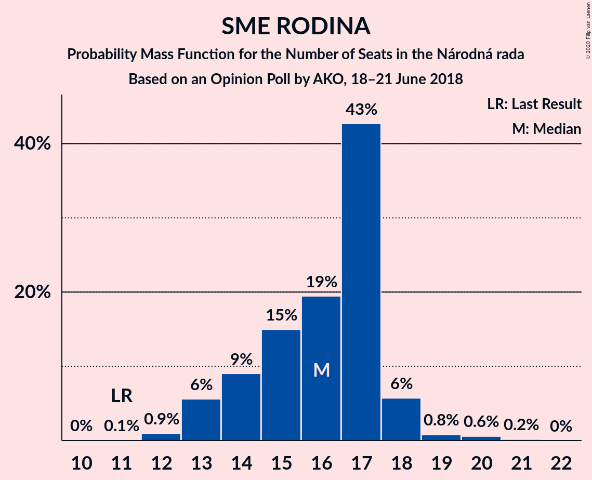
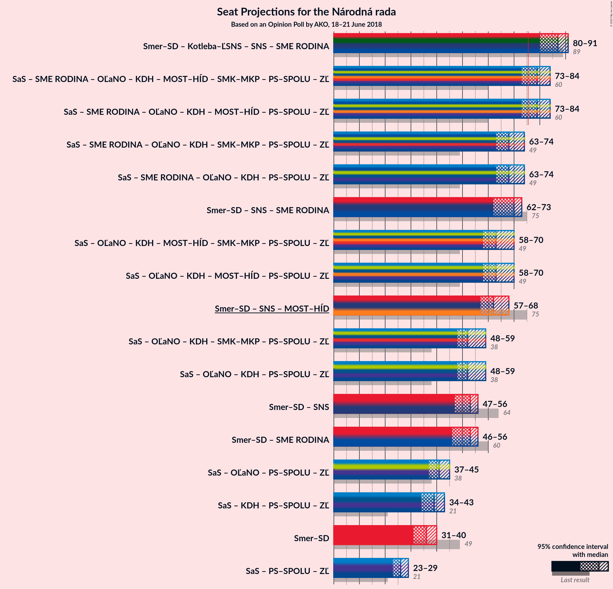
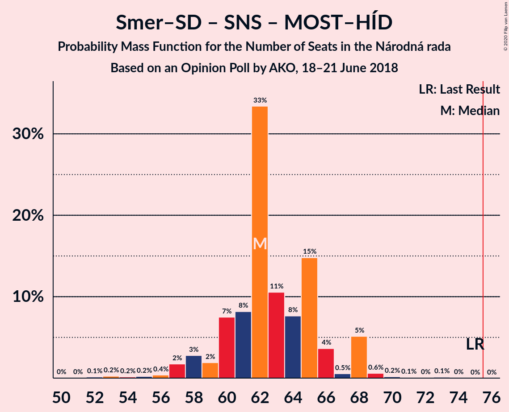

# Opinion Poll by AKO, 18–21 June 2018

<a href="#voting-intentions">Voting Intentions</a> | <a href="#seats">Seats</a> | <a href="#coalitions">Coalitions</a> | <a href="#technical-information">Technical Information</a>

## Voting Intentions

### Confidence Intervals

| Party | Last Result | Poll Result | 80% Confidence Interval | 90% Confidence Interval | 95% Confidence Interval | 99% Confidence Interval |
|:-----:|:-----------:|:-----------:|:-----------------------:|:-----------------------:|:-----------------------:|:-----------------------:|
| SMER–sociálna demokracia | 28.3% | 21.0% | 19.4–22.7% |19.0–23.2% |18.6–23.6% |17.8–24.5% |
| Sloboda a Solidarita | 12.1% | 15.5% | 14.1–17.1% |13.7–17.5% |13.4–17.9% |12.7–18.7% |
| Kotleba–Ľudová strana Naše Slovensko | 8.0% | 11.1% | 9.9–12.5% |9.6–12.9% |9.3–13.2% |8.7–13.9% |
| Slovenská národná strana | 8.6% | 10.2% | 9.1–11.5% |8.7–11.9% |8.5–12.2% |8.0–12.9% |
| SME RODINA | 6.6% | 9.3% | 8.2–10.6% |7.9–10.9% |7.7–11.3% |7.2–11.9% |
| OBYČAJNÍ ĽUDIA a nezávislé osobnosti | 11.0% | 8.6% | 7.6–9.8% |7.3–10.2% |7.0–10.5% |6.5–11.1% |
| Kresťanskodemokratické hnutie | 4.9% | 7.2% | 6.2–8.4% |6.0–8.7% |5.7–9.0% |5.3–9.6% |
| MOST–HÍD | 6.5% | 6.3% | 5.4–7.4% |5.2–7.7% |5.0–8.0% |4.6–8.6% |
| Progresívne Slovensko | 0.0% | 4.0% | 3.3–4.9% |3.1–5.2% |2.9–5.4% |2.7–5.9% |
| SPOLU–Občianska Demokracia | 0.0% | 3.8% | 3.1–4.7% |2.9–5.0% |2.8–5.2% |2.5–5.6% |
| Strana maďarskej koalície–Magyar Koalíció Pártja | 4.0% | 2.4% | 1.9–3.2% |1.7–3.4% |1.6–3.6% |1.4–3.9% |

*Note:* The poll result column reflects the actual value used in the calculations. Published results may vary slightly, and in addition be rounded to fewer digits.

## Seats

### Confidence Intervals

| Party | Last Result | Median | 80% Confidence Interval | 90% Confidence Interval | 95% Confidence Interval | 99% Confidence Interval |
|:-----:|:-----------:|:------:|:-----------------------:|:-----------------------:|:-----------------------:|:-----------------------:|
| <a href="#smer–sociálna-demokracia">SMER–sociálna demokracia</a> | 49 | 34 | 30–37 |30–39 |30–40 |29–43 |
| <a href="#sloboda-a-solidarita">Sloboda a Solidarita</a> | 21 | 27 | 22–28 |22–28 |22–29 |21–31 |
| <a href="#kotleba–ľudová-strana-naše-slovensko">Kotleba–Ľudová strana Naše Slovensko</a> | 14 | 18 | 16–21 |16–21 |16–21 |15–24 |
| <a href="#slovenská-národná-strana">Slovenská národná strana</a> | 15 | 16 | 14–19 |14–19 |14–20 |13–20 |
| <a href="#sme-rodina">SME RODINA</a> | 11 | 16 | 13–17 |13–19 |13–19 |12–20 |
| <a href="#obyčajní-ľudia-a-nezávislé-osobnosti">OBYČAJNÍ ĽUDIA a nezávislé osobnosti</a> | 17 | 15 | 12–18 |11–18 |11–18 |11–19 |
| <a href="#kresťanskodemokratické-hnutie">Kresťanskodemokratické hnutie</a> | 0 | 12 | 10–14 |10–15 |9–15 |9–17 |
| <a href="#most–híd">MOST–HÍD</a> | 11 | 10 | 9–13 |9–13 |0–13 |0–15 |
| <a href="#progresívne-slovensko">Progresívne Slovensko</a> | 0 | 0 | 0–9 |0–9 |0–9 |0–11 |
| <a href="#spolu–občianska-demokracia">SPOLU–Občianska Demokracia</a> | 0 | 0 | 0 |0 |0–8 |0–9 |
| <a href="#strana-maďarskej-koalície–magyar-koalíció-pártja">Strana maďarskej koalície–Magyar Koalíció Pártja</a> | 0 | 0 | 0 |0 |0 |0 |

### SMER–sociálna demokracia

*For a full overview of the results for this party, see the [SMER–sociálna demokracia](party-smer–sociálnademokracia.html) page.*

| Number of Seats | Probability | Accumulated | Special Marks |
|:---------------:|:-----------:|:-----------:|:-------------:|
| 27 | 0.2% | 100% |  |
| 28 | 0% | 99.8% |  |
| 29 | 0.3% | 99.8% |  |
| 30 | 12% | 99.4% |  |
| 31 | 1.4% | 88% |  |
| 32 | 7% | 86% |  |
| 33 | 3% | 79% |  |
| 34 | 30% | 76% | Median |
| 35 | 9% | 46% |  |
| 36 | 11% | 37% |  |
| 37 | 16% | 26% |  |
| 38 | 3% | 9% |  |
| 39 | 3% | 7% |  |
| 40 | 2% | 3% |  |
| 41 | 0.1% | 1.0% |  |
| 42 | 0% | 0.8% |  |
| 43 | 0.7% | 0.8% |  |
| 44 | 0% | 0.1% |  |
| 45 | 0% | 0% |  |
| 46 | 0% | 0% |  |
| 47 | 0% | 0% |  |
| 48 | 0% | 0% |  |
| 49 | 0% | 0% | Last Result |

### Sloboda a Solidarita

*For a full overview of the results for this party, see the [Sloboda a Solidarita](party-slobodaasolidarita.html) page.*

| Number of Seats | Probability | Accumulated | Special Marks |
|:---------------:|:-----------:|:-----------:|:-------------:|
| 19 | 0.1% | 100% |  |
| 20 | 0.2% | 99.9% |  |
| 21 | 0.4% | 99.7% | Last Result |
| 22 | 13% | 99.4% |  |
| 23 | 2% | 86% |  |
| 24 | 7% | 84% |  |
| 25 | 8% | 77% |  |
| 26 | 16% | 69% |  |
| 27 | 34% | 54% | Median |
| 28 | 16% | 19% |  |
| 29 | 0.6% | 3% |  |
| 30 | 0.6% | 2% |  |
| 31 | 2% | 2% |  |
| 32 | 0.2% | 0.2% |  |
| 33 | 0% | 0% |  |

### Kotleba–Ľudová strana Naše Slovensko

*For a full overview of the results for this party, see the [Kotleba–Ľudová strana Naše Slovensko](party-kotleba–ľudovástrananašeslovensko.html) page.*

| Number of Seats | Probability | Accumulated | Special Marks |
|:---------------:|:-----------:|:-----------:|:-------------:|
| 13 | 0.3% | 100% |  |
| 14 | 0.2% | 99.7% | Last Result |
| 15 | 2% | 99.5% |  |
| 16 | 21% | 98% |  |
| 17 | 15% | 76% |  |
| 18 | 27% | 61% | Median |
| 19 | 10% | 35% |  |
| 20 | 14% | 25% |  |
| 21 | 8% | 10% |  |
| 22 | 1.0% | 2% |  |
| 23 | 0.6% | 1.2% |  |
| 24 | 0.5% | 0.5% |  |
| 25 | 0% | 0% |  |

### Slovenská národná strana

*For a full overview of the results for this party, see the [Slovenská národná strana](party-slovenskánárodnástrana.html) page.*

| Number of Seats | Probability | Accumulated | Special Marks |
|:---------------:|:-----------:|:-----------:|:-------------:|
| 11 | 0.1% | 100% |  |
| 12 | 0.1% | 99.9% |  |
| 13 | 0.8% | 99.9% |  |
| 14 | 12% | 99.1% |  |
| 15 | 25% | 87% | Last Result |
| 16 | 22% | 63% | Median |
| 17 | 9% | 41% |  |
| 18 | 20% | 32% |  |
| 19 | 8% | 12% |  |
| 20 | 4% | 5% |  |
| 21 | 0.3% | 0.4% |  |
| 22 | 0.1% | 0.2% |  |
| 23 | 0% | 0% |  |

### SME RODINA

*For a full overview of the results for this party, see the [SME RODINA](party-smerodina.html) page.*

| Number of Seats | Probability | Accumulated | Special Marks |
|:---------------:|:-----------:|:-----------:|:-------------:|
| 11 | 0.1% | 100% | Last Result |
| 12 | 2% | 99.9% |  |
| 13 | 14% | 98% |  |
| 14 | 27% | 84% |  |
| 15 | 7% | 58% |  |
| 16 | 23% | 50% | Median |
| 17 | 18% | 27% |  |
| 18 | 1.3% | 10% |  |
| 19 | 8% | 8% |  |
| 20 | 0.7% | 0.7% |  |
| 21 | 0.1% | 0.1% |  |
| 22 | 0% | 0% |  |

### OBYČAJNÍ ĽUDIA a nezávislé osobnosti

*For a full overview of the results for this party, see the [OBYČAJNÍ ĽUDIA a nezávislé osobnosti](party-obyčajníľudiaanezávisléosobnosti.html) page.*

| Number of Seats | Probability | Accumulated | Special Marks |
|:---------------:|:-----------:|:-----------:|:-------------:|
| 10 | 0.1% | 100% |  |
| 11 | 6% | 99.9% |  |
| 12 | 6% | 94% |  |
| 13 | 10% | 87% |  |
| 14 | 12% | 77% |  |
| 15 | 16% | 65% | Median |
| 16 | 17% | 49% |  |
| 17 | 19% | 32% | Last Result |
| 18 | 11% | 12% |  |
| 19 | 0.5% | 0.9% |  |
| 20 | 0.1% | 0.3% |  |
| 21 | 0.2% | 0.2% |  |
| 22 | 0% | 0% |  |

### Kresťanskodemokratické hnutie

*For a full overview of the results for this party, see the [Kresťanskodemokratické hnutie](party-kresťanskodemokratickéhnutie.html) page.*

| Number of Seats | Probability | Accumulated | Special Marks |
|:---------------:|:-----------:|:-----------:|:-------------:|
| 0 | 0% | 100% | Last Result |
| 1 | 0% | 100% |  |
| 2 | 0% | 100% |  |
| 3 | 0% | 100% |  |
| 4 | 0% | 100% |  |
| 5 | 0% | 100% |  |
| 6 | 0% | 100% |  |
| 7 | 0% | 100% |  |
| 8 | 0% | 100% |  |
| 9 | 5% | 99.9% |  |
| 10 | 22% | 95% |  |
| 11 | 19% | 73% |  |
| 12 | 22% | 54% | Median |
| 13 | 21% | 32% |  |
| 14 | 0.8% | 10% |  |
| 15 | 7% | 9% |  |
| 16 | 0.1% | 2% |  |
| 17 | 2% | 2% |  |
| 18 | 0.1% | 0.1% |  |
| 19 | 0% | 0% |  |

### MOST–HÍD

*For a full overview of the results for this party, see the [MOST–HÍD](party-most–híd.html) page.*

| Number of Seats | Probability | Accumulated | Special Marks |
|:---------------:|:-----------:|:-----------:|:-------------:|
| 0 | 3% | 100% |  |
| 1 | 0% | 97% |  |
| 2 | 0% | 97% |  |
| 3 | 0% | 97% |  |
| 4 | 0% | 97% |  |
| 5 | 0% | 97% |  |
| 6 | 0% | 97% |  |
| 7 | 0% | 97% |  |
| 8 | 0.8% | 97% |  |
| 9 | 22% | 96% |  |
| 10 | 26% | 75% | Median |
| 11 | 10% | 49% | Last Result |
| 12 | 22% | 39% |  |
| 13 | 15% | 17% |  |
| 14 | 2% | 2% |  |
| 15 | 0.8% | 0.9% |  |
| 16 | 0% | 0% |  |

### Progresívne Slovensko

*For a full overview of the results for this party, see the [Progresívne Slovensko](party-progresívneslovensko.html) page.*

| Number of Seats | Probability | Accumulated | Special Marks |
|:---------------:|:-----------:|:-----------:|:-------------:|
| 0 | 80% | 100% | Last Result, Median |
| 1 | 0% | 20% |  |
| 2 | 0% | 20% |  |
| 3 | 0% | 20% |  |
| 4 | 0% | 20% |  |
| 5 | 0% | 20% |  |
| 6 | 0% | 20% |  |
| 7 | 0% | 20% |  |
| 8 | 5% | 20% |  |
| 9 | 13% | 15% |  |
| 10 | 2% | 2% |  |
| 11 | 0.5% | 0.5% |  |
| 12 | 0% | 0% |  |

### SPOLU–Občianska Demokracia

*For a full overview of the results for this party, see the [SPOLU–Občianska Demokracia](party-spolu–občianskademokracia.html) page.*

| Number of Seats | Probability | Accumulated | Special Marks |
|:---------------:|:-----------:|:-----------:|:-------------:|
| 0 | 97% | 100% | Last Result, Median |
| 1 | 0% | 3% |  |
| 2 | 0% | 3% |  |
| 3 | 0% | 3% |  |
| 4 | 0% | 3% |  |
| 5 | 0% | 3% |  |
| 6 | 0% | 3% |  |
| 7 | 0% | 3% |  |
| 8 | 1.1% | 3% |  |
| 9 | 2% | 2% |  |
| 10 | 0% | 0.1% |  |
| 11 | 0% | 0% |  |

### Strana maďarskej koalície–Magyar Koalíció Pártja

*For a full overview of the results for this party, see the [Strana maďarskej koalície–Magyar Koalíció Pártja](party-stranamaďarskejkoalície–magyarkoalíciópártja.html) page.*

| Number of Seats | Probability | Accumulated | Special Marks |
|:---------------:|:-----------:|:-----------:|:-------------:|
| 0 | 100% | 100% | Last Result, Median |

## Coalitions

### Confidence Intervals

| Coalition | Last Result | Median | Majority? | 80% Confidence Interval | 90% Confidence Interval | 95% Confidence Interval | 99% Confidence Interval |
|:---------:|:-----------:|:------:|:---------:|:-----------------------:|:-----------------------:|:-----------------------:|:-----------------------:|
| SMER–sociálna demokracia – Slovenská národná strana – MOST–HÍD | 75 | 61 | 0% | 58–65 | 58–66 | 57–67 | 54–68 |
| SMER–sociálna demokracia | 49 | 34 | 0% | 30–37 | 30–39 | 30–40 | 29–43 |

### SMER–sociálna demokracia – Slovenská národná strana – MOST–HÍD

| Number of Seats | Probability | Accumulated | Special Marks |
|:---------------:|:-----------:|:-----------:|:-------------:|
| 51 | 0% | 100% |  |
| 52 | 0.1% | 99.9% |  |
| 53 | 0% | 99.9% |  |
| 54 | 0.4% | 99.8% |  |
| 55 | 0.1% | 99.5% |  |
| 56 | 2% | 99.3% |  |
| 57 | 2% | 98% |  |
| 58 | 8% | 96% |  |
| 59 | 3% | 88% |  |
| 60 | 19% | 85% | Median |
| 61 | 19% | 66% |  |
| 62 | 17% | 47% |  |
| 63 | 12% | 30% |  |
| 64 | 2% | 18% |  |
| 65 | 8% | 15% |  |
| 66 | 4% | 7% |  |
| 67 | 1.4% | 4% |  |
| 68 | 2% | 2% |  |
| 69 | 0.3% | 0.4% |  |
| 70 | 0% | 0.2% |  |
| 71 | 0% | 0.1% |  |
| 72 | 0.1% | 0.1% |  |
| 73 | 0% | 0% |  |
| 74 | 0% | 0% |  |
| 75 | 0% | 0% | Last Result |

### SMER–sociálna demokracia

| Number of Seats | Probability | Accumulated | Special Marks |
|:---------------:|:-----------:|:-----------:|:-------------:|
| 27 | 0.2% | 100% |  |
| 28 | 0% | 99.8% |  |
| 29 | 0.3% | 99.8% |  |
| 30 | 12% | 99.4% |  |
| 31 | 1.4% | 88% |  |
| 32 | 7% | 86% |  |
| 33 | 3% | 79% |  |
| 34 | 30% | 76% | Median |
| 35 | 9% | 46% |  |
| 36 | 11% | 37% |  |
| 37 | 16% | 26% |  |
| 38 | 3% | 9% |  |
| 39 | 3% | 7% |  |
| 40 | 2% | 3% |  |
| 41 | 0.1% | 1.0% |  |
| 42 | 0% | 0.8% |  |
| 43 | 0.7% | 0.8% |  |
| 44 | 0% | 0.1% |  |
| 45 | 0% | 0% |  |
| 46 | 0% | 0% |  |
| 47 | 0% | 0% |  |
| 48 | 0% | 0% |  |
| 49 | 0% | 0% | Last Result |

## Technical Information

### Opinion Poll

+ **Polling firm:** AKO
+ **Commissioner(s):** —
+ **Fieldwork period:** 18–21 June 2018

### Calculations

+ **Sample size:** 1000
+ **Simulations done:** 131,072
+ **Error estimate:** 2.80%

