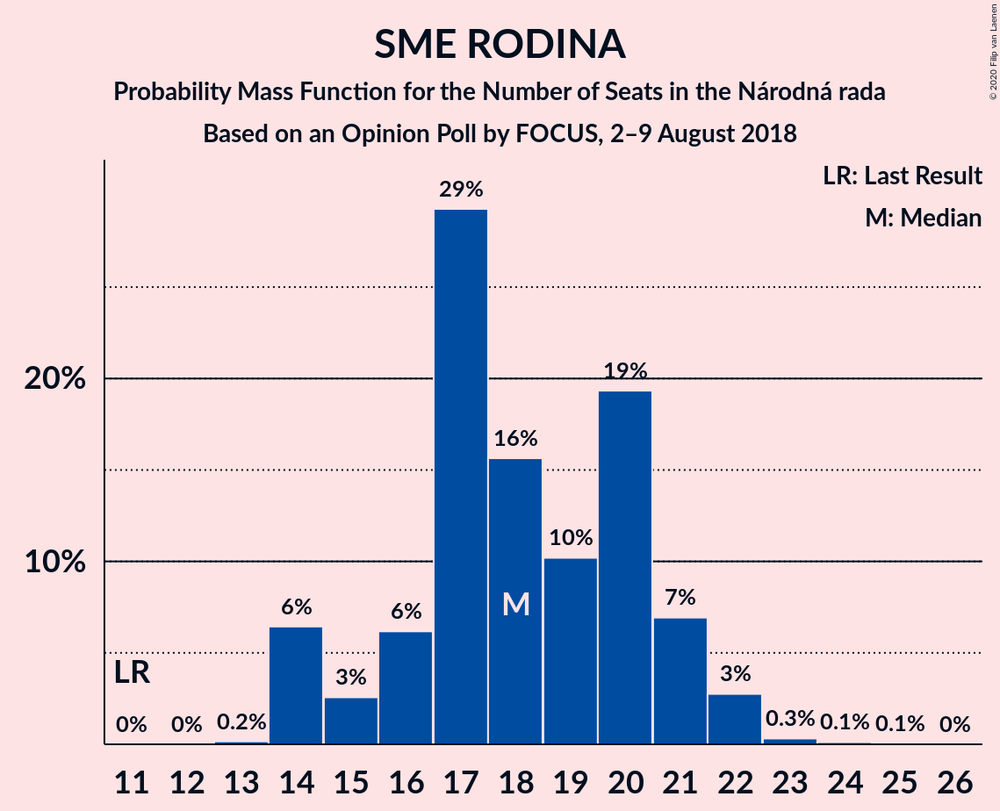

# Opinion Poll by FOCUS, 2–9 August 2018

<a href="#voting-intentions">Voting Intentions</a> | <a href="#seats">Seats</a> | <a href="#coalitions">Coalitions</a> | <a href="#technical-information">Technical Information</a>

## Voting Intentions

### Confidence Intervals

| Party | Last Result | Poll Result | 80% Confidence Interval | 90% Confidence Interval | 95% Confidence Interval | 99% Confidence Interval |
|:-----:|:-----------:|:-----------:|:-----------------------:|:-----------------------:|:-----------------------:|:-----------------------:|
| SMER–sociálna demokracia | 28.3% | 20.7% | 19.1–22.4% |18.6–22.8% |18.3–23.3% |17.5–24.1% |
| Sloboda a Solidarita | 12.1% | 12.2% | 11.0–13.6% |10.6–14.0% |10.3–14.4% |9.8–15.1% |
| Kotleba–Ľudová strana Naše Slovensko | 8.0% | 10.1% | 9.0–11.4% |8.7–11.8% |8.4–12.2% |7.9–12.8% |
| SME RODINA | 6.6% | 10.0% | 8.9–11.4% |8.6–11.7% |8.3–12.1% |7.8–12.7% |
| Slovenská národná strana | 8.6% | 9.4% | 8.3–10.7% |8.0–11.1% |7.8–11.4% |7.3–12.0% |
| OBYČAJNÍ ĽUDIA a nezávislé osobnosti | 11.0% | 8.7% | 7.7–10.0% |7.4–10.3% |7.1–10.7% |6.7–11.3% |
| Kresťanskodemokratické hnutie | 4.9% | 7.1% | 6.1–8.2% |5.9–8.5% |5.6–8.8% |5.2–9.4% |
| MOST–HÍD | 6.5% | 5.7% | 4.8–6.7% |4.6–7.0% |4.4–7.3% |4.0–7.8% |
| Progresívne Slovensko | 0.0% | 4.2% | 3.5–5.1% |3.3–5.4% |3.1–5.6% |2.8–6.1% |
| Strana maďarskej koalície–Magyar Koalíció Pártja | 4.0% | 4.1% | 3.4–5.0% |3.2–5.3% |3.0–5.5% |2.7–6.0% |
| SPOLU–Občianska Demokracia | 0.0% | 3.3% | 2.7–4.1% |2.5–4.4% |2.3–4.6% |2.1–5.0% |

*Note:* The poll result column reflects the actual value used in the calculations. Published results may vary slightly, and in addition be rounded to fewer digits.

## Seats

### Confidence Intervals

| Party | Last Result | Median | 80% Confidence Interval | 90% Confidence Interval | 95% Confidence Interval | 99% Confidence Interval |
|:-----:|:-----------:|:------:|:-----------------------:|:-----------------------:|:-----------------------:|:-----------------------:|
| <a href="#smer–sociálna-demokracia">SMER–sociálna demokracia</a> | 49 | 37 | 33–41 |32–43 |32–43 |31–43 |
| <a href="#sloboda-a-solidarita">Sloboda a Solidarita</a> | 21 | 24 | 20–24 |19–26 |19–26 |17–26 |
| <a href="#kotleba–ľudová-strana-naše-slovensko">Kotleba–Ľudová strana Naše Slovensko</a> | 14 | 18 | 16–20 |16–21 |14–22 |14–22 |
| <a href="#sme-rodina">SME RODINA</a> | 11 | 17 | 14–21 |14–22 |14–22 |14–23 |
| <a href="#slovenská-národná-strana">Slovenská národná strana</a> | 15 | 18 | 17–19 |16–21 |14–21 |13–22 |
| <a href="#obyčajní-ľudia-a-nezávislé-osobnosti">OBYČAJNÍ ĽUDIA a nezávislé osobnosti</a> | 17 | 16 | 14–17 |12–18 |12–19 |12–20 |
| <a href="#kresťanskodemokratické-hnutie">Kresťanskodemokratické hnutie</a> | 0 | 13 | 11–14 |10–14 |10–16 |10–16 |
| <a href="#most–híd">MOST–HÍD</a> | 11 | 10 | 0–11 |0–11 |0–11 |0–13 |
| <a href="#progresívne-slovensko">Progresívne Slovensko</a> | 0 | 0 | 0 |0 |0–9 |0–10 |
| <a href="#strana-maďarskej-koalície–magyar-koalíció-pártja">Strana maďarskej koalície–Magyar Koalíció Pártja</a> | 0 | 0 | 0 |0 |0–9 |0–10 |
| <a href="#spolu–občianska-demokracia">SPOLU–Občianska Demokracia</a> | 0 | 0 | 0 |0 |0 |0 |

### SMER–sociálna demokracia

*For a full overview of the results for this party, see the [SMER–sociálna demokracia](party-smer–sociálnademokracia.html) page.*

| Number of Seats | Probability | Accumulated | Special Marks |
|:---------------:|:-----------:|:-----------:|:-------------:|
| 29 | 0% | 100% |  |
| 30 | 0% | 99.9% |  |
| 31 | 1.1% | 99.9% |  |
| 32 | 8% | 98.8% |  |
| 33 | 4% | 91% |  |
| 34 | 4% | 86% |  |
| 35 | 12% | 82% |  |
| 36 | 6% | 71% |  |
| 37 | 48% | 65% | Median |
| 38 | 3% | 17% |  |
| 39 | 0.3% | 14% |  |
| 40 | 0.3% | 14% |  |
| 41 | 6% | 14% |  |
| 42 | 3% | 8% |  |
| 43 | 5% | 5% |  |
| 44 | 0% | 0.1% |  |
| 45 | 0% | 0.1% |  |
| 46 | 0% | 0% |  |
| 47 | 0% | 0% |  |
| 48 | 0% | 0% |  |
| 49 | 0% | 0% | Last Result |

### Sloboda a Solidarita

*For a full overview of the results for this party, see the [Sloboda a Solidarita](party-slobodaasolidarita.html) page.*

| Number of Seats | Probability | Accumulated | Special Marks |
|:---------------:|:-----------:|:-----------:|:-------------:|
| 15 | 0.1% | 100% |  |
| 16 | 0.1% | 99.9% |  |
| 17 | 0.4% | 99.9% |  |
| 18 | 0.6% | 99.5% |  |
| 19 | 7% | 98.9% |  |
| 20 | 4% | 92% |  |
| 21 | 9% | 88% | Last Result |
| 22 | 7% | 79% |  |
| 23 | 7% | 72% |  |
| 24 | 56% | 66% | Median |
| 25 | 0.8% | 10% |  |
| 26 | 9% | 9% |  |
| 27 | 0.1% | 0.1% |  |
| 28 | 0% | 0% |  |

### Kotleba–Ľudová strana Naše Slovensko

*For a full overview of the results for this party, see the [Kotleba–Ľudová strana Naše Slovensko](party-kotleba–ľudovástrananašeslovensko.html) page.*

| Number of Seats | Probability | Accumulated | Special Marks |
|:---------------:|:-----------:|:-----------:|:-------------:|
| 13 | 0.1% | 100% |  |
| 14 | 4% | 99.9% | Last Result |
| 15 | 0.7% | 96% |  |
| 16 | 10% | 95% |  |
| 17 | 13% | 85% |  |
| 18 | 50% | 72% | Median |
| 19 | 11% | 22% |  |
| 20 | 4% | 12% |  |
| 21 | 5% | 8% |  |
| 22 | 3% | 3% |  |
| 23 | 0% | 0.2% |  |
| 24 | 0% | 0.1% |  |
| 25 | 0.1% | 0.1% |  |
| 26 | 0% | 0% |  |

### SME RODINA

*For a full overview of the results for this party, see the [SME RODINA](party-smerodina.html) page.*

| Number of Seats | Probability | Accumulated | Special Marks |
|:---------------:|:-----------:|:-----------:|:-------------:|
| 11 | 0% | 100% | Last Result |
| 12 | 0% | 100% |  |
| 13 | 0.1% | 100% |  |
| 14 | 45% | 99.9% |  |
| 15 | 2% | 55% |  |
| 16 | 2% | 53% |  |
| 17 | 12% | 51% | Median |
| 18 | 20% | 38% |  |
| 19 | 4% | 18% |  |
| 20 | 0.5% | 14% |  |
| 21 | 4% | 14% |  |
| 22 | 9% | 10% |  |
| 23 | 0.7% | 1.1% |  |
| 24 | 0.3% | 0.4% |  |
| 25 | 0% | 0% |  |

### Slovenská národná strana

*For a full overview of the results for this party, see the [Slovenská národná strana](party-slovenskánárodnástrana.html) page.*

| Number of Seats | Probability | Accumulated | Special Marks |
|:---------------:|:-----------:|:-----------:|:-------------:|
| 12 | 0.1% | 100% |  |
| 13 | 0.9% | 99.9% |  |
| 14 | 2% | 99.0% |  |
| 15 | 0.7% | 97% | Last Result |
| 16 | 6% | 97% |  |
| 17 | 14% | 91% |  |
| 18 | 58% | 77% | Median |
| 19 | 12% | 19% |  |
| 20 | 0.5% | 7% |  |
| 21 | 5% | 6% |  |
| 22 | 1.2% | 1.2% |  |
| 23 | 0% | 0% |  |

### OBYČAJNÍ ĽUDIA a nezávislé osobnosti

*For a full overview of the results for this party, see the [OBYČAJNÍ ĽUDIA a nezávislé osobnosti](party-obyčajníľudiaanezávisléosobnosti.html) page.*

| Number of Seats | Probability | Accumulated | Special Marks |
|:---------------:|:-----------:|:-----------:|:-------------:|
| 11 | 0.2% | 100% |  |
| 12 | 5% | 99.8% |  |
| 13 | 1.4% | 94% |  |
| 14 | 6% | 93% |  |
| 15 | 19% | 87% |  |
| 16 | 48% | 69% | Median |
| 17 | 15% | 21% | Last Result |
| 18 | 2% | 5% |  |
| 19 | 3% | 3% |  |
| 20 | 0.5% | 0.7% |  |
| 21 | 0.2% | 0.2% |  |
| 22 | 0% | 0% |  |

### Kresťanskodemokratické hnutie

*For a full overview of the results for this party, see the [Kresťanskodemokratické hnutie](party-kresťanskodemokratickéhnutie.html) page.*

| Number of Seats | Probability | Accumulated | Special Marks |
|:---------------:|:-----------:|:-----------:|:-------------:|
| 0 | 0.2% | 100% | Last Result |
| 1 | 0% | 99.8% |  |
| 2 | 0% | 99.8% |  |
| 3 | 0% | 99.8% |  |
| 4 | 0% | 99.8% |  |
| 5 | 0% | 99.8% |  |
| 6 | 0% | 99.8% |  |
| 7 | 0% | 99.8% |  |
| 8 | 0% | 99.8% |  |
| 9 | 0.1% | 99.8% |  |
| 10 | 5% | 99.7% |  |
| 11 | 15% | 94% |  |
| 12 | 7% | 79% |  |
| 13 | 52% | 72% | Median |
| 14 | 15% | 19% |  |
| 15 | 2% | 5% |  |
| 16 | 3% | 3% |  |
| 17 | 0.2% | 0.3% |  |
| 18 | 0.1% | 0.1% |  |
| 19 | 0% | 0% |  |

### MOST–HÍD

*For a full overview of the results for this party, see the [MOST–HÍD](party-most–híd.html) page.*

| Number of Seats | Probability | Accumulated | Special Marks |
|:---------------:|:-----------:|:-----------:|:-------------:|
| 0 | 15% | 100% |  |
| 1 | 0% | 85% |  |
| 2 | 0% | 85% |  |
| 3 | 0% | 85% |  |
| 4 | 0% | 85% |  |
| 5 | 0% | 85% |  |
| 6 | 0% | 85% |  |
| 7 | 0% | 85% |  |
| 8 | 0% | 85% |  |
| 9 | 4% | 85% |  |
| 10 | 67% | 81% | Median |
| 11 | 12% | 15% | Last Result |
| 12 | 1.4% | 2% |  |
| 13 | 0.6% | 0.9% |  |
| 14 | 0.2% | 0.3% |  |
| 15 | 0.2% | 0.2% |  |
| 16 | 0% | 0% |  |

### Progresívne Slovensko

*For a full overview of the results for this party, see the [Progresívne Slovensko](party-progresívneslovensko.html) page.*

| Number of Seats | Probability | Accumulated | Special Marks |
|:---------------:|:-----------:|:-----------:|:-------------:|
| 0 | 97% | 100% | Last Result, Median |
| 1 | 0% | 3% |  |
| 2 | 0% | 3% |  |
| 3 | 0% | 3% |  |
| 4 | 0% | 3% |  |
| 5 | 0% | 3% |  |
| 6 | 0% | 3% |  |
| 7 | 0% | 3% |  |
| 8 | 0% | 3% |  |
| 9 | 2% | 3% |  |
| 10 | 0.3% | 0.6% |  |
| 11 | 0.3% | 0.3% |  |
| 12 | 0% | 0% |  |

### Strana maďarskej koalície–Magyar Koalíció Pártja

*For a full overview of the results for this party, see the [Strana maďarskej koalície–Magyar Koalíció Pártja](party-stranamaďarskejkoalície–magyarkoalíciópártja.html) page.*

| Number of Seats | Probability | Accumulated | Special Marks |
|:---------------:|:-----------:|:-----------:|:-------------:|
| 0 | 95% | 100% | Last Result, Median |
| 1 | 0% | 5% |  |
| 2 | 0% | 5% |  |
| 3 | 0% | 5% |  |
| 4 | 0% | 5% |  |
| 5 | 0% | 5% |  |
| 6 | 0% | 5% |  |
| 7 | 0% | 5% |  |
| 8 | 0% | 5% |  |
| 9 | 4% | 5% |  |
| 10 | 0.4% | 0.8% |  |
| 11 | 0.4% | 0.4% |  |
| 12 | 0% | 0% |  |

### SPOLU–Občianska Demokracia

*For a full overview of the results for this party, see the [SPOLU–Občianska Demokracia](party-spolu–občianskademokracia.html) page.*

| Number of Seats | Probability | Accumulated | Special Marks |
|:---------------:|:-----------:|:-----------:|:-------------:|
| 0 | 100% | 100% | Last Result, Median |

## Coalitions

### Confidence Intervals

| Coalition | Last Result | Median | Majority? | 80% Confidence Interval | 90% Confidence Interval | 95% Confidence Interval | 99% Confidence Interval |
|:---------:|:-----------:|:------:|:---------:|:-----------------------:|:-----------------------:|:-----------------------:|:-----------------------:|
| SMER–sociálna demokracia – Slovenská národná strana – MOST–HÍD | 75 | 64 | 0% | 59–65 | 59–65 | 55–66 | 53–67 |
| SMER–sociálna demokracia | 49 | 37 | 0% | 33–41 | 32–43 | 32–43 | 31–43 |

### SMER–sociálna demokracia – Slovenská národná strana – MOST–HÍD

| Number of Seats | Probability | Accumulated | Special Marks |
|:---------------:|:-----------:|:-----------:|:-------------:|
| 49 | 0% | 100% |  |
| 50 | 0.1% | 99.9% |  |
| 51 | 0.2% | 99.8% |  |
| 52 | 0% | 99.6% |  |
| 53 | 0.6% | 99.6% |  |
| 54 | 0.8% | 99.0% |  |
| 55 | 0.8% | 98% |  |
| 56 | 0.2% | 97% |  |
| 57 | 0.2% | 97% |  |
| 58 | 0.7% | 97% |  |
| 59 | 8% | 96% |  |
| 60 | 3% | 88% |  |
| 61 | 10% | 85% |  |
| 62 | 0.9% | 75% |  |
| 63 | 6% | 74% |  |
| 64 | 19% | 67% |  |
| 65 | 45% | 48% | Median |
| 66 | 2% | 3% |  |
| 67 | 1.2% | 2% |  |
| 68 | 0.1% | 0.3% |  |
| 69 | 0.2% | 0.2% |  |
| 70 | 0% | 0% |  |
| 71 | 0% | 0% |  |
| 72 | 0% | 0% |  |
| 73 | 0% | 0% |  |
| 74 | 0% | 0% |  |
| 75 | 0% | 0% | Last Result |

### SMER–sociálna demokracia

| Number of Seats | Probability | Accumulated | Special Marks |
|:---------------:|:-----------:|:-----------:|:-------------:|
| 29 | 0% | 100% |  |
| 30 | 0% | 99.9% |  |
| 31 | 1.1% | 99.9% |  |
| 32 | 8% | 98.8% |  |
| 33 | 4% | 91% |  |
| 34 | 4% | 86% |  |
| 35 | 12% | 82% |  |
| 36 | 6% | 71% |  |
| 37 | 48% | 65% | Median |
| 38 | 3% | 17% |  |
| 39 | 0.3% | 14% |  |
| 40 | 0.3% | 14% |  |
| 41 | 6% | 14% |  |
| 42 | 3% | 8% |  |
| 43 | 5% | 5% |  |
| 44 | 0% | 0.1% |  |
| 45 | 0% | 0.1% |  |
| 46 | 0% | 0% |  |
| 47 | 0% | 0% |  |
| 48 | 0% | 0% |  |
| 49 | 0% | 0% | Last Result |

## Technical Information

### Opinion Poll

+ **Polling firm:** FOCUS
+ **Commissioner(s):** —
+ **Fieldwork period:** 2–9 August 2018

### Calculations

+ **Sample size:** 1007
+ **Simulations done:** 131,072
+ **Error estimate:** 1.71%

