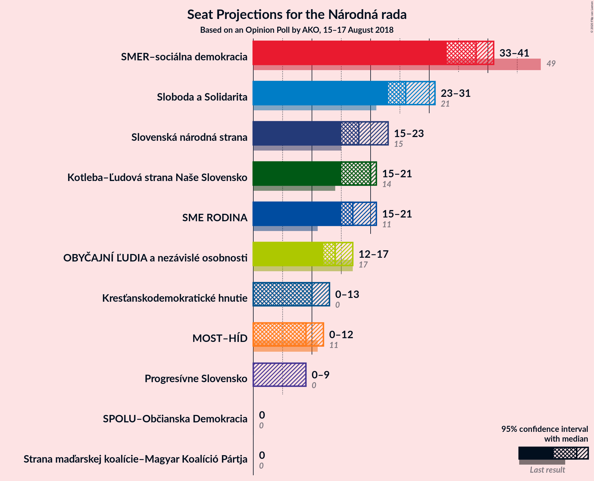
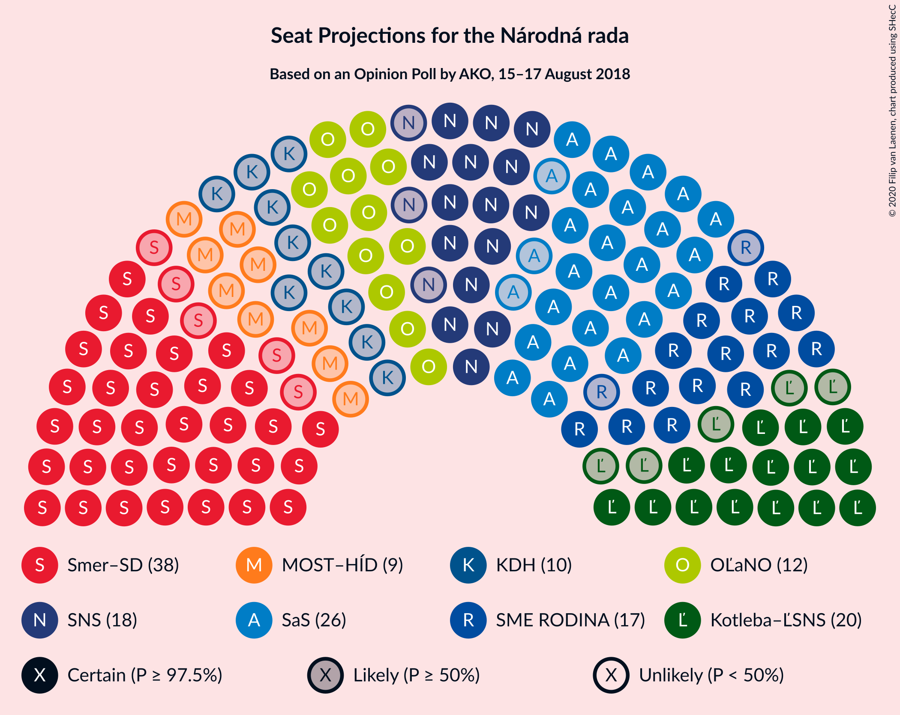
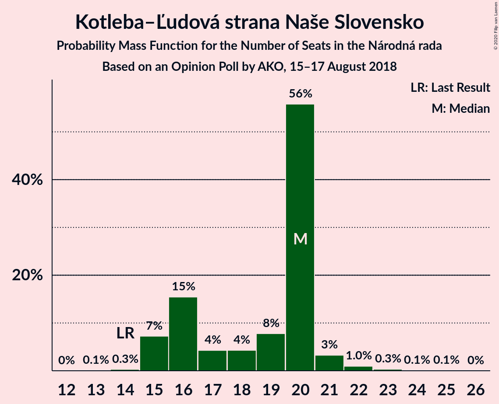

# Opinion Poll by AKO, 15–17 August 2018

<a href="#voting-intentions">Voting Intentions</a> | <a href="#seats">Seats</a> | <a href="#coalitions">Coalitions</a> | <a href="#technical-information">Technical Information</a>

## Voting Intentions

### Confidence Intervals

| Party | Last Result | Poll Result | 80% Confidence Interval | 90% Confidence Interval | 95% Confidence Interval | 99% Confidence Interval |
|:-----:|:-----------:|:-----------:|:-----------------------:|:-----------------------:|:-----------------------:|:-----------------------:|
| SMER–sociálna demokracia | 28.3% | 21.4% | 19.8–23.1% |19.4–23.6% |19.0–24.1% |18.2–24.9% |
| Sloboda a Solidarita | 12.1% | 15.7% | 14.3–17.3% |13.9–17.7% |13.6–18.1% |12.9–18.9% |
| Slovenská národná strana | 8.6% | 11.0% | 9.8–12.4% |9.5–12.8% |9.2–13.1% |8.7–13.8% |
| Kotleba–Ľudová strana Naše Slovensko | 8.0% | 10.9% | 9.7–12.3% |9.4–12.7% |9.1–13.0% |8.6–13.7% |
| SME RODINA | 6.6% | 10.8% | 9.6–12.2% |9.3–12.5% |9.0–12.9% |8.5–13.6% |
| OBYČAJNÍ ĽUDIA a nezávislé osobnosti | 11.0% | 8.4% | 7.4–9.6% |7.1–10.0% |6.8–10.3% |6.4–10.9% |
| Kresťanskodemokratické hnutie | 4.9% | 6.1% | 5.2–7.2% |5.0–7.5% |4.8–7.8% |4.4–8.3% |
| MOST–HÍD | 6.5% | 5.3% | 4.5–6.3% |4.3–6.6% |4.1–6.9% |3.7–7.4% |
| Progresívne Slovensko | 0.0% | 4.1% | 3.4–5.0% |3.2–5.3% |3.0–5.5% |2.7–6.0% |
| SPOLU–Občianska Demokracia | 0.0% | 3.3% | 2.7–4.1% |2.5–4.4% |2.4–4.6% |2.1–5.0% |
| Strana maďarskej koalície–Magyar Koalíció Pártja | 4.0% | 3.0% | 2.4–3.8% |2.2–4.1% |2.1–4.3% |1.9–4.7% |

*Note:* The poll result column reflects the actual value used in the calculations. Published results may vary slightly, and in addition be rounded to fewer digits.

## Seats

### Confidence Intervals

| Party | Last Result | Median | 80% Confidence Interval | 90% Confidence Interval | 95% Confidence Interval | 99% Confidence Interval |
|:-----:|:-----------:|:------:|:-----------------------:|:-----------------------:|:-----------------------:|:-----------------------:|
| <a href="#smer–sociálna-demokracia">SMER–sociálna demokracia</a> | 49 | 38 | 33–38 |33–39 |33–41 |30–43 |
| <a href="#sloboda-a-solidarita">Sloboda a Solidarita</a> | 21 | 26 | 24–30 |23–30 |23–31 |22–35 |
| <a href="#slovenská-národná-strana">Slovenská národná strana</a> | 15 | 18 | 15–21 |15–22 |15–23 |15–23 |
| <a href="#kotleba–ľudová-strana-naše-slovensko">Kotleba–Ľudová strana Naše Slovensko</a> | 14 | 20 | 16–20 |15–20 |15–21 |15–23 |
| <a href="#sme-rodina">SME RODINA</a> | 11 | 17 | 15–20 |15–20 |15–21 |15–23 |
| <a href="#obyčajní-ľudia-a-nezávislé-osobnosti">OBYČAJNÍ ĽUDIA a nezávislé osobnosti</a> | 17 | 14 | 12–16 |12–16 |12–17 |11–19 |
| <a href="#kresťanskodemokratické-hnutie">Kresťanskodemokratické hnutie</a> | 0 | 10 | 9–12 |0–12 |0–13 |0–14 |
| <a href="#most–híd">MOST–HÍD</a> | 11 | 9 | 0–10 |0–11 |0–12 |0–12 |
| <a href="#progresívne-slovensko">Progresívne Slovensko</a> | 0 | 0 | 0 |0 |0–9 |0–11 |
| <a href="#spolu–občianska-demokracia">SPOLU–Občianska Demokracia</a> | 0 | 0 | 0 |0 |0 |0–9 |
| <a href="#strana-maďarskej-koalície–magyar-koalíció-pártja">Strana maďarskej koalície–Magyar Koalíció Pártja</a> | 0 | 0 | 0 |0 |0 |0 |

### SMER–sociálna demokracia

*For a full overview of the results for this party, see the [SMER–sociálna demokracia](party-smer–sociálnademokracia.html) page.*

| Number of Seats | Probability | Accumulated | Special Marks |
|:---------------:|:-----------:|:-----------:|:-------------:|
| 28 | 0.1% | 100% |  |
| 29 | 0.1% | 99.9% |  |
| 30 | 0.5% | 99.8% |  |
| 31 | 0.6% | 99.4% |  |
| 32 | 0.8% | 98.8% |  |
| 33 | 9% | 98% |  |
| 34 | 9% | 89% |  |
| 35 | 11% | 80% |  |
| 36 | 3% | 69% |  |
| 37 | 4% | 66% |  |
| 38 | 54% | 62% | Median |
| 39 | 3% | 8% |  |
| 40 | 2% | 5% |  |
| 41 | 2% | 3% |  |
| 42 | 0.2% | 1.3% |  |
| 43 | 0.9% | 1.1% |  |
| 44 | 0.1% | 0.2% |  |
| 45 | 0% | 0.1% |  |
| 46 | 0.1% | 0.1% |  |
| 47 | 0% | 0% |  |
| 48 | 0% | 0% |  |
| 49 | 0% | 0% | Last Result |

### Sloboda a Solidarita

*For a full overview of the results for this party, see the [Sloboda a Solidarita](party-slobodaasolidarita.html) page.*

| Number of Seats | Probability | Accumulated | Special Marks |
|:---------------:|:-----------:|:-----------:|:-------------:|
| 20 | 0.1% | 100% |  |
| 21 | 0.4% | 99.9% | Last Result |
| 22 | 0.2% | 99.5% |  |
| 23 | 9% | 99.4% |  |
| 24 | 1.1% | 90% |  |
| 25 | 5% | 89% |  |
| 26 | 46% | 84% | Median |
| 27 | 3% | 38% |  |
| 28 | 19% | 35% |  |
| 29 | 4% | 16% |  |
| 30 | 8% | 12% |  |
| 31 | 2% | 4% |  |
| 32 | 0.5% | 2% |  |
| 33 | 0.5% | 1.2% |  |
| 34 | 0.2% | 0.8% |  |
| 35 | 0.6% | 0.6% |  |
| 36 | 0% | 0% |  |

### Slovenská národná strana

*For a full overview of the results for this party, see the [Slovenská národná strana](party-slovenskánárodnástrana.html) page.*

| Number of Seats | Probability | Accumulated | Special Marks |
|:---------------:|:-----------:|:-----------:|:-------------:|
| 13 | 0.1% | 100% |  |
| 14 | 0.2% | 99.9% |  |
| 15 | 17% | 99.7% | Last Result |
| 16 | 4% | 83% |  |
| 17 | 3% | 78% |  |
| 18 | 34% | 75% | Median |
| 19 | 15% | 41% |  |
| 20 | 8% | 26% |  |
| 21 | 11% | 18% |  |
| 22 | 5% | 7% |  |
| 23 | 2% | 3% |  |
| 24 | 0.1% | 0.2% |  |
| 25 | 0.1% | 0.1% |  |
| 26 | 0% | 0% |  |

### Kotleba–Ľudová strana Naše Slovensko

*For a full overview of the results for this party, see the [Kotleba–Ľudová strana Naše Slovensko](party-kotleba–ľudovástrananašeslovensko.html) page.*

| Number of Seats | Probability | Accumulated | Special Marks |
|:---------------:|:-----------:|:-----------:|:-------------:|
| 13 | 0.1% | 100% |  |
| 14 | 0.3% | 99.9% | Last Result |
| 15 | 7% | 99.6% |  |
| 16 | 15% | 92% |  |
| 17 | 4% | 77% |  |
| 18 | 4% | 73% |  |
| 19 | 8% | 68% |  |
| 20 | 56% | 61% | Median |
| 21 | 3% | 5% |  |
| 22 | 1.0% | 1.5% |  |
| 23 | 0.3% | 0.5% |  |
| 24 | 0.1% | 0.2% |  |
| 25 | 0.1% | 0.1% |  |
| 26 | 0% | 0% |  |

### SME RODINA

*For a full overview of the results for this party, see the [SME RODINA](party-smerodina.html) page.*

| Number of Seats | Probability | Accumulated | Special Marks |
|:---------------:|:-----------:|:-----------:|:-------------:|
| 11 | 0% | 100% | Last Result |
| 12 | 0% | 100% |  |
| 13 | 0% | 100% |  |
| 14 | 0.3% | 100% |  |
| 15 | 19% | 99.6% |  |
| 16 | 8% | 81% |  |
| 17 | 54% | 73% | Median |
| 18 | 4% | 19% |  |
| 19 | 5% | 15% |  |
| 20 | 6% | 10% |  |
| 21 | 2% | 4% |  |
| 22 | 0.6% | 2% |  |
| 23 | 1.0% | 1.3% |  |
| 24 | 0.3% | 0.4% |  |
| 25 | 0.1% | 0.1% |  |
| 26 | 0% | 0% |  |

### OBYČAJNÍ ĽUDIA a nezávislé osobnosti

*For a full overview of the results for this party, see the [OBYČAJNÍ ĽUDIA a nezávislé osobnosti](party-obyčajníľudiaanezávisléosobnosti.html) page.*

| Number of Seats | Probability | Accumulated | Special Marks |
|:---------------:|:-----------:|:-----------:|:-------------:|
| 10 | 0.2% | 100% |  |
| 11 | 2% | 99.7% |  |
| 12 | 34% | 98% |  |
| 13 | 12% | 64% |  |
| 14 | 26% | 51% | Median |
| 15 | 13% | 25% |  |
| 16 | 9% | 12% |  |
| 17 | 2% | 3% | Last Result |
| 18 | 0.7% | 1.4% |  |
| 19 | 0.4% | 0.6% |  |
| 20 | 0.2% | 0.2% |  |
| 21 | 0% | 0% |  |

### Kresťanskodemokratické hnutie

*For a full overview of the results for this party, see the [Kresťanskodemokratické hnutie](party-kresťanskodemokratickéhnutie.html) page.*

| Number of Seats | Probability | Accumulated | Special Marks |
|:---------------:|:-----------:|:-----------:|:-------------:|
| 0 | 6% | 100% | Last Result |
| 1 | 0% | 94% |  |
| 2 | 0% | 94% |  |
| 3 | 0% | 94% |  |
| 4 | 0% | 94% |  |
| 5 | 0% | 94% |  |
| 6 | 0% | 94% |  |
| 7 | 0% | 94% |  |
| 8 | 0.3% | 94% |  |
| 9 | 9% | 94% |  |
| 10 | 61% | 85% | Median |
| 11 | 9% | 24% |  |
| 12 | 12% | 14% |  |
| 13 | 2% | 3% |  |
| 14 | 0.3% | 0.5% |  |
| 15 | 0.2% | 0.2% |  |
| 16 | 0% | 0% |  |

### MOST–HÍD

*For a full overview of the results for this party, see the [MOST–HÍD](party-most–híd.html) page.*

| Number of Seats | Probability | Accumulated | Special Marks |
|:---------------:|:-----------:|:-----------:|:-------------:|
| 0 | 10% | 100% |  |
| 1 | 0% | 90% |  |
| 2 | 0% | 90% |  |
| 3 | 0% | 90% |  |
| 4 | 0% | 90% |  |
| 5 | 0% | 90% |  |
| 6 | 0% | 90% |  |
| 7 | 0% | 90% |  |
| 8 | 0.6% | 90% |  |
| 9 | 44% | 89% | Median |
| 10 | 39% | 45% |  |
| 11 | 3% | 6% | Last Result |
| 12 | 3% | 3% |  |
| 13 | 0.2% | 0.3% |  |
| 14 | 0% | 0% |  |

### Progresívne Slovensko

*For a full overview of the results for this party, see the [Progresívne Slovensko](party-progresívneslovensko.html) page.*

| Number of Seats | Probability | Accumulated | Special Marks |
|:---------------:|:-----------:|:-----------:|:-------------:|
| 0 | 97% | 100% | Last Result, Median |
| 1 | 0% | 3% |  |
| 2 | 0% | 3% |  |
| 3 | 0% | 3% |  |
| 4 | 0% | 3% |  |
| 5 | 0% | 3% |  |
| 6 | 0% | 3% |  |
| 7 | 0% | 3% |  |
| 8 | 0.6% | 3% |  |
| 9 | 2% | 3% |  |
| 10 | 0.4% | 1.0% |  |
| 11 | 0.6% | 0.6% |  |
| 12 | 0% | 0% |  |

### SPOLU–Občianska Demokracia

*For a full overview of the results for this party, see the [SPOLU–Občianska Demokracia](party-spolu–občianskademokracia.html) page.*

| Number of Seats | Probability | Accumulated | Special Marks |
|:---------------:|:-----------:|:-----------:|:-------------:|
| 0 | 99.0% | 100% | Last Result, Median |
| 1 | 0% | 1.0% |  |
| 2 | 0% | 1.0% |  |
| 3 | 0% | 1.0% |  |
| 4 | 0% | 1.0% |  |
| 5 | 0% | 1.0% |  |
| 6 | 0% | 1.0% |  |
| 7 | 0% | 1.0% |  |
| 8 | 0.2% | 1.0% |  |
| 9 | 0.7% | 0.7% |  |
| 10 | 0% | 0% |  |

### Strana maďarskej koalície–Magyar Koalíció Pártja

*For a full overview of the results for this party, see the [Strana maďarskej koalície–Magyar Koalíció Pártja](party-stranamaďarskejkoalície–magyarkoalíciópártja.html) page.*

| Number of Seats | Probability | Accumulated | Special Marks |
|:---------------:|:-----------:|:-----------:|:-------------:|
| 0 | 99.9% | 100% | Last Result, Median |
| 1 | 0% | 0.1% |  |
| 2 | 0% | 0.1% |  |
| 3 | 0% | 0.1% |  |
| 4 | 0% | 0.1% |  |
| 5 | 0% | 0.1% |  |
| 6 | 0% | 0.1% |  |
| 7 | 0% | 0.1% |  |
| 8 | 0% | 0.1% |  |
| 9 | 0% | 0% |  |

## Coalitions

### Confidence Intervals

| Coalition | Last Result | Median | Majority? | 80% Confidence Interval | 90% Confidence Interval | 95% Confidence Interval | 99% Confidence Interval |
|:---------:|:-----------:|:------:|:---------:|:-----------------------:|:-----------------------:|:-----------------------:|:-----------------------:|
| SMER–sociálna demokracia – Slovenská národná strana – MOST–HÍD | 75 | 65 | 0% | 60–67 | 56–68 | 53–69 | 51–72 |
| SMER–sociálna demokracia | 49 | 38 | 0% | 33–38 | 33–39 | 33–41 | 30–43 |

### SMER–sociálna demokracia – Slovenská národná strana – MOST–HÍD

| Number of Seats | Probability | Accumulated | Special Marks |
|:---------------:|:-----------:|:-----------:|:-------------:|
| 49 | 0.2% | 100% |  |
| 50 | 0.1% | 99.8% |  |
| 51 | 0.2% | 99.7% |  |
| 52 | 0.4% | 99.5% |  |
| 53 | 2% | 99.0% |  |
| 54 | 0.7% | 97% |  |
| 55 | 1.1% | 97% |  |
| 56 | 1.1% | 96% |  |
| 57 | 0.6% | 94% |  |
| 58 | 2% | 94% |  |
| 59 | 0.7% | 91% |  |
| 60 | 1.4% | 91% |  |
| 61 | 4% | 89% |  |
| 62 | 9% | 85% |  |
| 63 | 16% | 76% |  |
| 64 | 2% | 60% |  |
| 65 | 42% | 58% | Median |
| 66 | 5% | 16% |  |
| 67 | 1.2% | 11% |  |
| 68 | 7% | 10% |  |
| 69 | 1.1% | 3% |  |
| 70 | 0.1% | 2% |  |
| 71 | 0% | 2% |  |
| 72 | 2% | 2% |  |
| 73 | 0.1% | 0.1% |  |
| 74 | 0% | 0.1% |  |
| 75 | 0% | 0% | Last Result |

### SMER–sociálna demokracia

| Number of Seats | Probability | Accumulated | Special Marks |
|:---------------:|:-----------:|:-----------:|:-------------:|
| 28 | 0.1% | 100% |  |
| 29 | 0.1% | 99.9% |  |
| 30 | 0.5% | 99.8% |  |
| 31 | 0.6% | 99.4% |  |
| 32 | 0.8% | 98.8% |  |
| 33 | 9% | 98% |  |
| 34 | 9% | 89% |  |
| 35 | 11% | 80% |  |
| 36 | 3% | 69% |  |
| 37 | 4% | 66% |  |
| 38 | 54% | 62% | Median |
| 39 | 3% | 8% |  |
| 40 | 2% | 5% |  |
| 41 | 2% | 3% |  |
| 42 | 0.2% | 1.3% |  |
| 43 | 0.9% | 1.1% |  |
| 44 | 0.1% | 0.2% |  |
| 45 | 0% | 0.1% |  |
| 46 | 0.1% | 0.1% |  |
| 47 | 0% | 0% |  |
| 48 | 0% | 0% |  |
| 49 | 0% | 0% | Last Result |

## Technical Information

### Opinion Poll

+ **Polling firm:** AKO
+ **Commissioner(s):** —
+ **Fieldwork period:** 15–17 August 2018

### Calculations

+ **Sample size:** 1000
+ **Simulations done:** 1,048,575
+ **Error estimate:** 1.34%

