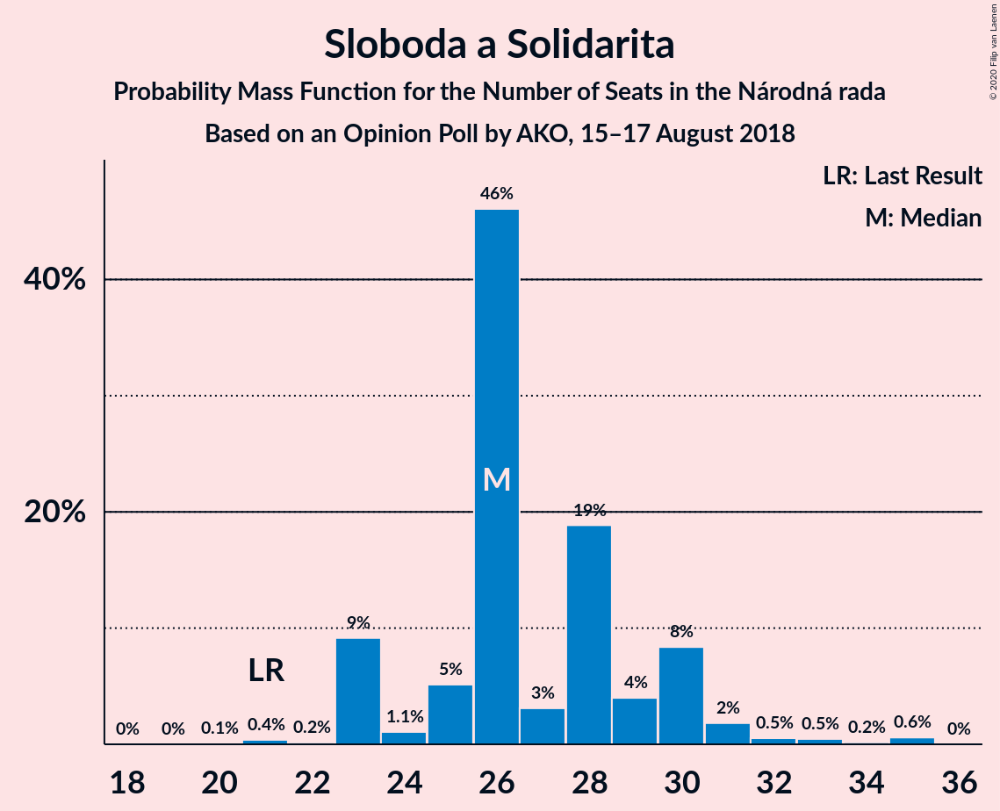
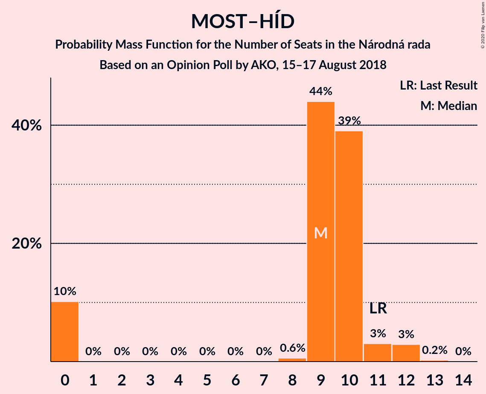
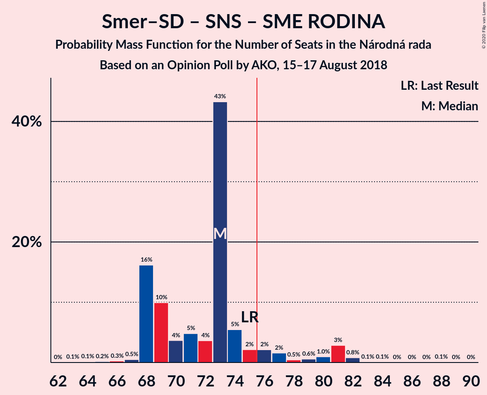
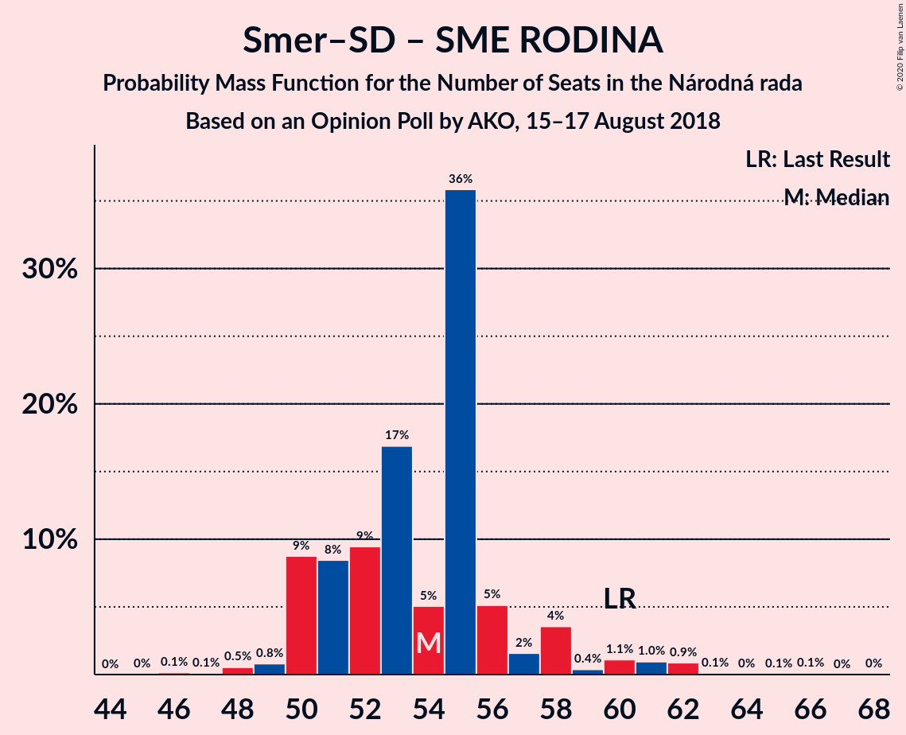
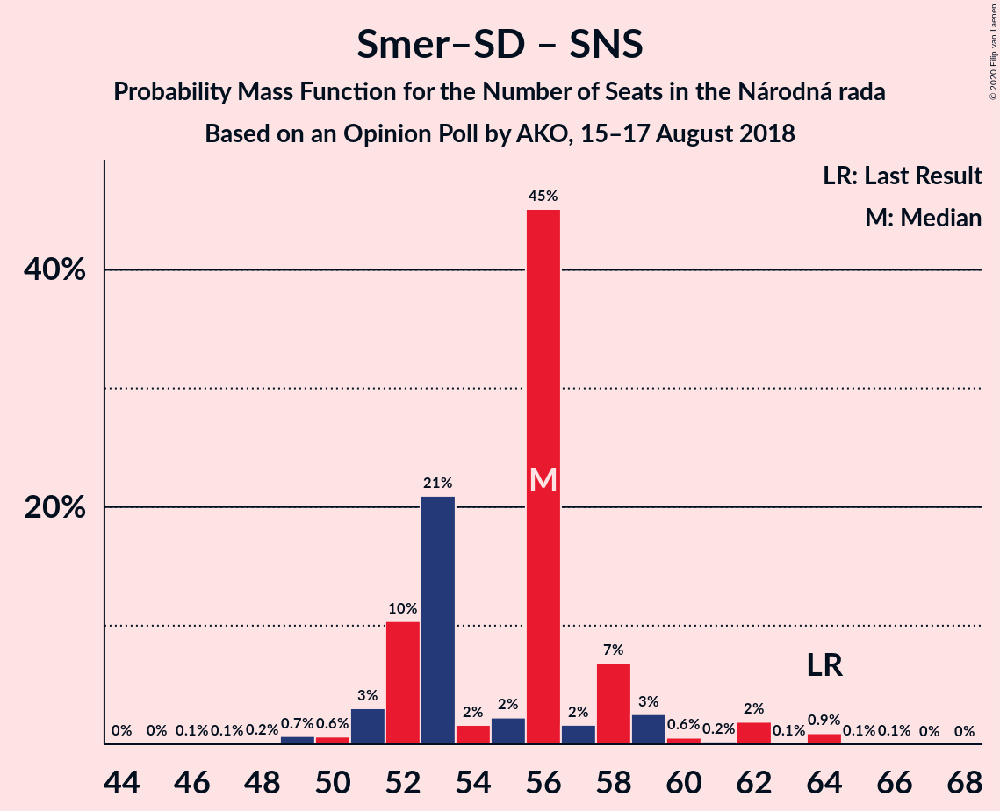

# Opinion Poll by AKO, 15–17 August 2018

<a href="#voting-intentions">Voting Intentions</a> | <a href="#seats">Seats</a> | <a href="#coalitions">Coalitions</a> | <a href="#technical-information">Technical Information</a>

## Voting Intentions

### Confidence Intervals

| Party | Last Result | Poll Result | 80% Confidence Interval | 90% Confidence Interval | 95% Confidence Interval | 99% Confidence Interval |
|:-----:|:-----------:|:-----------:|:-----------------------:|:-----------------------:|:-----------------------:|:-----------------------:|
| SMER–sociálna demokracia | 28.3% | 21.4% | 19.8–23.1% |19.4–23.6% |19.0–24.1% |18.2–24.9% |
| Sloboda a Solidarita | 12.1% | 15.7% | 14.3–17.3% |13.9–17.7% |13.6–18.1% |12.9–18.9% |
| Slovenská národná strana | 8.6% | 11.0% | 9.8–12.4% |9.5–12.8% |9.2–13.1% |8.7–13.8% |
| Kotleba–Ľudová strana Naše Slovensko | 8.0% | 10.9% | 9.7–12.3% |9.4–12.7% |9.1–13.0% |8.6–13.7% |
| SME RODINA | 6.6% | 10.8% | 9.6–12.2% |9.3–12.5% |9.0–12.9% |8.5–13.6% |
| OBYČAJNÍ ĽUDIA a nezávislé osobnosti | 11.0% | 8.4% | 7.4–9.6% |7.1–10.0% |6.8–10.3% |6.4–10.9% |
| Kresťanskodemokratické hnutie | 4.9% | 6.1% | 5.2–7.2% |5.0–7.5% |4.8–7.8% |4.4–8.3% |
| MOST–HÍD | 6.5% | 5.3% | 4.5–6.3% |4.3–6.6% |4.1–6.9% |3.7–7.4% |
| Progresívne Slovensko | 0.0% | 4.1% | 3.4–5.0% |3.2–5.3% |3.0–5.5% |2.7–6.0% |
| SPOLU–Občianska Demokracia | 0.0% | 3.3% | 2.7–4.1% |2.5–4.4% |2.4–4.6% |2.1–5.0% |
| Strana maďarskej koalície–Magyar Koalíció Pártja | 4.0% | 3.0% | 2.4–3.8% |2.2–4.1% |2.1–4.3% |1.9–4.7% |

*Note:* The poll result column reflects the actual value used in the calculations. Published results may vary slightly, and in addition be rounded to fewer digits.

## Seats

### Confidence Intervals

| Party | Last Result | Median | 80% Confidence Interval | 90% Confidence Interval | 95% Confidence Interval | 99% Confidence Interval |
|:-----:|:-----------:|:------:|:-----------------------:|:-----------------------:|:-----------------------:|:-----------------------:|
| <a href="#smer–sociálna-demokracia">SMER–sociálna demokracia</a> | 49 | 36 | 33–40 |32–40 |32–40 |30–44 |
| <a href="#sloboda-a-solidarita">Sloboda a Solidarita</a> | 21 | 26 | 23–31 |23–35 |23–35 |22–35 |
| <a href="#slovenská-národná-strana">Slovenská národná strana</a> | 15 | 19 | 16–21 |16–22 |15–23 |14–24 |
| <a href="#kotleba–ľudová-strana-naše-slovensko">Kotleba–Ľudová strana Naše Slovensko</a> | 14 | 18 | 16–21 |16–21 |15–22 |14–24 |
| <a href="#sme-rodina">SME RODINA</a> | 11 | 18 | 15–21 |15–21 |15–22 |14–23 |
| <a href="#obyčajní-ľudia-a-nezávislé-osobnosti">OBYČAJNÍ ĽUDIA a nezávislé osobnosti</a> | 17 | 14 | 12–16 |11–17 |11–18 |10–19 |
| <a href="#kresťanskodemokratické-hnutie">Kresťanskodemokratické hnutie</a> | 0 | 11 | 0–13 |0–13 |0–13 |0–15 |
| <a href="#most–híd">MOST–HÍD</a> | 11 | 9 | 0–11 |0–12 |0–12 |0–13 |
| <a href="#progresívne-slovensko">Progresívne Slovensko</a> | 0 | 0 | 0–9 |0–11 |0–11 |0–11 |
| <a href="#spolu–občianska-demokracia">SPOLU–Občianska Demokracia</a> | 0 | 0 | 0 |0 |0 |0–9 |
| <a href="#strana-maďarskej-koalície–magyar-koalíció-pártja">Strana maďarskej koalície–Magyar Koalíció Pártja</a> | 0 | 0 | 0 |0 |0 |0 |

### SMER–sociálna demokracia

*For a full overview of the results for this party, see the [SMER–sociálna demokracia](party-smer–sociálnademokracia.html) page.*

| Number of Seats | Probability | Accumulated | Special Marks |
|:---------------:|:-----------:|:-----------:|:-------------:|
| 28 | 0.1% | 100% |  |
| 29 | 0.3% | 99.9% |  |
| 30 | 0.2% | 99.6% |  |
| 31 | 2% | 99.5% |  |
| 32 | 3% | 98% |  |
| 33 | 5% | 94% |  |
| 34 | 24% | 89% |  |
| 35 | 7% | 65% |  |
| 36 | 20% | 58% | Median |
| 37 | 8% | 38% |  |
| 38 | 14% | 29% |  |
| 39 | 0.8% | 15% |  |
| 40 | 13% | 14% |  |
| 41 | 0.3% | 1.2% |  |
| 42 | 0.1% | 0.8% |  |
| 43 | 0.1% | 0.8% |  |
| 44 | 0.4% | 0.7% |  |
| 45 | 0.3% | 0.3% |  |
| 46 | 0% | 0.1% |  |
| 47 | 0.1% | 0.1% |  |
| 48 | 0% | 0% |  |
| 49 | 0% | 0% | Last Result |

### Sloboda a Solidarita

*For a full overview of the results for this party, see the [Sloboda a Solidarita](party-slobodaasolidarita.html) page.*

| Number of Seats | Probability | Accumulated | Special Marks |
|:---------------:|:-----------:|:-----------:|:-------------:|
| 20 | 0.2% | 100% |  |
| 21 | 0.1% | 99.8% | Last Result |
| 22 | 0.4% | 99.7% |  |
| 23 | 12% | 99.2% |  |
| 24 | 8% | 87% |  |
| 25 | 23% | 79% |  |
| 26 | 12% | 56% | Median |
| 27 | 14% | 44% |  |
| 28 | 4% | 31% |  |
| 29 | 3% | 27% |  |
| 30 | 1.2% | 24% |  |
| 31 | 15% | 23% |  |
| 32 | 1.1% | 8% |  |
| 33 | 0.2% | 6% |  |
| 34 | 0% | 6% |  |
| 35 | 6% | 6% |  |
| 36 | 0% | 0% |  |

### Slovenská národná strana

*For a full overview of the results for this party, see the [Slovenská národná strana](party-slovenskánárodnástrana.html) page.*

| Number of Seats | Probability | Accumulated | Special Marks |
|:---------------:|:-----------:|:-----------:|:-------------:|
| 12 | 0.1% | 100% |  |
| 13 | 0.4% | 99.9% |  |
| 14 | 0.2% | 99.6% |  |
| 15 | 2% | 99.4% | Last Result |
| 16 | 16% | 97% |  |
| 17 | 14% | 82% |  |
| 18 | 8% | 68% |  |
| 19 | 31% | 59% | Median |
| 20 | 18% | 29% |  |
| 21 | 4% | 10% |  |
| 22 | 3% | 6% |  |
| 23 | 3% | 4% |  |
| 24 | 0.4% | 0.6% |  |
| 25 | 0.1% | 0.2% |  |
| 26 | 0% | 0.1% |  |
| 27 | 0% | 0.1% |  |
| 28 | 0% | 0% |  |

### Kotleba–Ľudová strana Naše Slovensko

*For a full overview of the results for this party, see the [Kotleba–Ľudová strana Naše Slovensko](party-kotleba–ľudovástrananašeslovensko.html) page.*

| Number of Seats | Probability | Accumulated | Special Marks |
|:---------------:|:-----------:|:-----------:|:-------------:|
| 13 | 0.1% | 100% |  |
| 14 | 0.8% | 99.9% | Last Result |
| 15 | 2% | 99.0% |  |
| 16 | 20% | 97% |  |
| 17 | 16% | 77% |  |
| 18 | 17% | 61% | Median |
| 19 | 22% | 44% |  |
| 20 | 12% | 22% |  |
| 21 | 7% | 11% |  |
| 22 | 1.2% | 4% |  |
| 23 | 2% | 2% |  |
| 24 | 0% | 0.5% |  |
| 25 | 0.2% | 0.5% |  |
| 26 | 0% | 0.2% |  |
| 27 | 0.2% | 0.2% |  |
| 28 | 0% | 0% |  |

### SME RODINA

*For a full overview of the results for this party, see the [SME RODINA](party-smerodina.html) page.*

| Number of Seats | Probability | Accumulated | Special Marks |
|:---------------:|:-----------:|:-----------:|:-------------:|
| 11 | 0% | 100% | Last Result |
| 12 | 0% | 100% |  |
| 13 | 0.2% | 100% |  |
| 14 | 0.6% | 99.8% |  |
| 15 | 12% | 99.2% |  |
| 16 | 18% | 87% |  |
| 17 | 3% | 69% |  |
| 18 | 20% | 66% | Median |
| 19 | 12% | 45% |  |
| 20 | 20% | 33% |  |
| 21 | 10% | 13% |  |
| 22 | 2% | 3% |  |
| 23 | 0.3% | 0.6% |  |
| 24 | 0.2% | 0.3% |  |
| 25 | 0.1% | 0.1% |  |
| 26 | 0% | 0% |  |

### OBYČAJNÍ ĽUDIA a nezávislé osobnosti

*For a full overview of the results for this party, see the [OBYČAJNÍ ĽUDIA a nezávislé osobnosti](party-obyčajníľudiaanezávisléosobnosti.html) page.*

| Number of Seats | Probability | Accumulated | Special Marks |
|:---------------:|:-----------:|:-----------:|:-------------:|
| 10 | 2% | 100% |  |
| 11 | 3% | 98% |  |
| 12 | 19% | 95% |  |
| 13 | 4% | 76% |  |
| 14 | 26% | 72% | Median |
| 15 | 31% | 46% |  |
| 16 | 7% | 14% |  |
| 17 | 3% | 7% | Last Result |
| 18 | 2% | 5% |  |
| 19 | 2% | 2% |  |
| 20 | 0.2% | 0.2% |  |
| 21 | 0% | 0% |  |

### Kresťanskodemokratické hnutie

*For a full overview of the results for this party, see the [Kresťanskodemokratické hnutie](party-kresťanskodemokratickéhnutie.html) page.*

| Number of Seats | Probability | Accumulated | Special Marks |
|:---------------:|:-----------:|:-----------:|:-------------:|
| 0 | 11% | 100% | Last Result |
| 1 | 0% | 89% |  |
| 2 | 0% | 89% |  |
| 3 | 0% | 89% |  |
| 4 | 0% | 89% |  |
| 5 | 0% | 89% |  |
| 6 | 0% | 89% |  |
| 7 | 0% | 89% |  |
| 8 | 0.6% | 89% |  |
| 9 | 10% | 89% |  |
| 10 | 27% | 79% |  |
| 11 | 22% | 52% | Median |
| 12 | 17% | 29% |  |
| 13 | 11% | 12% |  |
| 14 | 1.3% | 2% |  |
| 15 | 0.7% | 0.7% |  |
| 16 | 0% | 0% |  |

### MOST–HÍD

*For a full overview of the results for this party, see the [MOST–HÍD](party-most–híd.html) page.*

| Number of Seats | Probability | Accumulated | Special Marks |
|:---------------:|:-----------:|:-----------:|:-------------:|
| 0 | 36% | 100% |  |
| 1 | 0% | 64% |  |
| 2 | 0% | 64% |  |
| 3 | 0% | 64% |  |
| 4 | 0% | 64% |  |
| 5 | 0% | 64% |  |
| 6 | 0% | 64% |  |
| 7 | 0% | 64% |  |
| 8 | 4% | 64% |  |
| 9 | 25% | 60% | Median |
| 10 | 24% | 35% |  |
| 11 | 3% | 11% | Last Result |
| 12 | 6% | 8% |  |
| 13 | 2% | 2% |  |
| 14 | 0% | 0% |  |

### Progresívne Slovensko

*For a full overview of the results for this party, see the [Progresívne Slovensko](party-progresívneslovensko.html) page.*

| Number of Seats | Probability | Accumulated | Special Marks |
|:---------------:|:-----------:|:-----------:|:-------------:|
| 0 | 82% | 100% | Last Result, Median |
| 1 | 0% | 18% |  |
| 2 | 0% | 18% |  |
| 3 | 0% | 18% |  |
| 4 | 0% | 18% |  |
| 5 | 0% | 18% |  |
| 6 | 0% | 18% |  |
| 7 | 0% | 18% |  |
| 8 | 0.6% | 18% |  |
| 9 | 11% | 17% |  |
| 10 | 0.6% | 6% |  |
| 11 | 6% | 6% |  |
| 12 | 0% | 0% |  |

### SPOLU–Občianska Demokracia

*For a full overview of the results for this party, see the [SPOLU–Občianska Demokracia](party-spolu–občianskademokracia.html) page.*

| Number of Seats | Probability | Accumulated | Special Marks |
|:---------------:|:-----------:|:-----------:|:-------------:|
| 0 | 98.6% | 100% | Last Result, Median |
| 1 | 0% | 1.4% |  |
| 2 | 0% | 1.4% |  |
| 3 | 0% | 1.4% |  |
| 4 | 0% | 1.4% |  |
| 5 | 0% | 1.4% |  |
| 6 | 0% | 1.4% |  |
| 7 | 0% | 1.4% |  |
| 8 | 0% | 1.4% |  |
| 9 | 1.4% | 1.4% |  |
| 10 | 0% | 0% |  |

### Strana maďarskej koalície–Magyar Koalíció Pártja

*For a full overview of the results for this party, see the [Strana maďarskej koalície–Magyar Koalíció Pártja](party-stranamaďarskejkoalície–magyarkoalíciópártja.html) page.*

| Number of Seats | Probability | Accumulated | Special Marks |
|:---------------:|:-----------:|:-----------:|:-------------:|
| 0 | 99.9% | 100% | Last Result, Median |
| 1 | 0% | 0.1% |  |
| 2 | 0% | 0.1% |  |
| 3 | 0% | 0.1% |  |
| 4 | 0% | 0.1% |  |
| 5 | 0% | 0.1% |  |
| 6 | 0% | 0.1% |  |
| 7 | 0% | 0.1% |  |
| 8 | 0% | 0.1% |  |
| 9 | 0.1% | 0.1% |  |
| 10 | 0.1% | 0.1% |  |
| 11 | 0% | 0% |  |

## Coalitions

### Confidence Intervals

| Coalition | Last Result | Median | Majority? | 80% Confidence Interval | 90% Confidence Interval | 95% Confidence Interval | 99% Confidence Interval |
|:---------:|:-----------:|:------:|:---------:|:-----------------------:|:-----------------------:|:-----------------------:|:-----------------------:|
| SMER–sociálna demokracia – Slovenská národná strana – Kotleba–Ľudová strana Naše Slovensko – SME RODINA | 89 | 91 | 100% | 87–94 | 87–97 | 85–99 | 82–106 |
| SMER–sociálna demokracia – Slovenská národná strana – SME RODINA | 75 | 72 | 18% | 69–77 | 68–78 | 68–79 | 65–82 |
| SMER–sociálna demokracia – Slovenská národná strana – MOST–HÍD | 75 | 61 | 0% | 53–69 | 53–69 | 53–69 | 49–71 |
| SMER–sociálna demokracia – SME RODINA | 60 | 55 | 0% | 50–57 | 49–58 | 49–60 | 48–63 |
| SMER–sociálna demokracia – Slovenská národná strana | 64 | 54 | 0% | 51–59 | 50–59 | 49–59 | 47–63 |
| SMER–sociálna demokracia | 49 | 36 | 0% | 33–40 | 32–40 | 32–40 | 30–44 |

### SMER–sociálna demokracia – Slovenská národná strana – Kotleba–Ľudová strana Naše Slovensko – SME RODINA

| Number of Seats | Probability | Accumulated | Special Marks |
|:---------------:|:-----------:|:-----------:|:-------------:|
| 78 | 0.1% | 100% |  |
| 79 | 0.1% | 99.9% |  |
| 80 | 0% | 99.8% |  |
| 81 | 0.1% | 99.8% |  |
| 82 | 0.6% | 99.7% |  |
| 83 | 0.3% | 99.1% |  |
| 84 | 0.3% | 98.8% |  |
| 85 | 1.4% | 98% |  |
| 86 | 1.4% | 97% |  |
| 87 | 13% | 96% |  |
| 88 | 0.4% | 83% |  |
| 89 | 21% | 83% | Last Result |
| 90 | 7% | 61% |  |
| 91 | 19% | 54% | Median |
| 92 | 2% | 35% |  |
| 93 | 14% | 33% |  |
| 94 | 11% | 19% |  |
| 95 | 2% | 8% |  |
| 96 | 1.0% | 6% |  |
| 97 | 0.6% | 5% |  |
| 98 | 0.5% | 5% |  |
| 99 | 2% | 4% |  |
| 100 | 0.2% | 2% |  |
| 101 | 0.1% | 2% |  |
| 102 | 0.7% | 1.5% |  |
| 103 | 0% | 0.8% |  |
| 104 | 0.2% | 0.8% |  |
| 105 | 0% | 0.6% |  |
| 106 | 0.3% | 0.6% |  |
| 107 | 0.2% | 0.2% |  |
| 108 | 0% | 0% |  |

### SMER–sociálna demokracia – Slovenská národná strana – SME RODINA

| Number of Seats | Probability | Accumulated | Special Marks |
|:---------------:|:-----------:|:-----------:|:-------------:|
| 62 | 0.1% | 100% |  |
| 63 | 0.2% | 99.9% |  |
| 64 | 0% | 99.7% |  |
| 65 | 0.3% | 99.7% |  |
| 66 | 1.0% | 99.3% |  |
| 67 | 0.4% | 98% |  |
| 68 | 5% | 98% |  |
| 69 | 12% | 93% |  |
| 70 | 1.4% | 81% |  |
| 71 | 15% | 80% |  |
| 72 | 22% | 65% |  |
| 73 | 8% | 43% | Median |
| 74 | 5% | 35% |  |
| 75 | 12% | 30% | Last Result |
| 76 | 0.7% | 18% | Majority |
| 77 | 11% | 18% |  |
| 78 | 3% | 6% |  |
| 79 | 1.3% | 3% |  |
| 80 | 0.6% | 2% |  |
| 81 | 0.7% | 2% |  |
| 82 | 0.4% | 0.9% |  |
| 83 | 0% | 0.4% |  |
| 84 | 0.3% | 0.4% |  |
| 85 | 0.1% | 0.2% |  |
| 86 | 0% | 0.1% |  |
| 87 | 0% | 0% |  |

### SMER–sociálna demokracia – Slovenská národná strana – MOST–HÍD

| Number of Seats | Probability | Accumulated | Special Marks |
|:---------------:|:-----------:|:-----------:|:-------------:|
| 49 | 2% | 100% |  |
| 50 | 0% | 98% |  |
| 51 | 0% | 98% |  |
| 52 | 0% | 98% |  |
| 53 | 11% | 98% |  |
| 54 | 0.1% | 87% |  |
| 55 | 6% | 87% |  |
| 56 | 0.3% | 81% |  |
| 57 | 2% | 81% |  |
| 58 | 13% | 78% |  |
| 59 | 2% | 65% |  |
| 60 | 7% | 63% |  |
| 61 | 18% | 56% |  |
| 62 | 4% | 38% |  |
| 63 | 0.7% | 34% |  |
| 64 | 5% | 33% | Median |
| 65 | 9% | 28% |  |
| 66 | 4% | 19% |  |
| 67 | 3% | 15% |  |
| 68 | 0.6% | 12% |  |
| 69 | 11% | 12% |  |
| 70 | 0.1% | 0.8% |  |
| 71 | 0.3% | 0.7% |  |
| 72 | 0% | 0.5% |  |
| 73 | 0.4% | 0.5% |  |
| 74 | 0% | 0% |  |
| 75 | 0% | 0% | Last Result |

### SMER–sociálna demokracia – SME RODINA

| Number of Seats | Probability | Accumulated | Special Marks |
|:---------------:|:-----------:|:-----------:|:-------------:|
| 45 | 0.1% | 100% |  |
| 46 | 0.1% | 99.9% |  |
| 47 | 0.1% | 99.8% |  |
| 48 | 1.2% | 99.7% |  |
| 49 | 4% | 98% |  |
| 50 | 6% | 95% |  |
| 51 | 8% | 89% |  |
| 52 | 17% | 81% |  |
| 53 | 4% | 64% |  |
| 54 | 4% | 60% | Median |
| 55 | 13% | 56% |  |
| 56 | 25% | 43% |  |
| 57 | 12% | 18% |  |
| 58 | 3% | 6% |  |
| 59 | 0.7% | 4% |  |
| 60 | 0.7% | 3% | Last Result |
| 61 | 0.6% | 2% |  |
| 62 | 1.1% | 2% |  |
| 63 | 0.1% | 0.5% |  |
| 64 | 0.1% | 0.5% |  |
| 65 | 0.3% | 0.4% |  |
| 66 | 0.1% | 0.1% |  |
| 67 | 0% | 0% |  |

### SMER–sociálna demokracia – Slovenská národná strana

| Number of Seats | Probability | Accumulated | Special Marks |
|:---------------:|:-----------:|:-----------:|:-------------:|
| 45 | 0.2% | 100% |  |
| 46 | 0% | 99.8% |  |
| 47 | 0.3% | 99.8% |  |
| 48 | 0.3% | 99.5% |  |
| 49 | 4% | 99.2% |  |
| 50 | 2% | 96% |  |
| 51 | 7% | 94% |  |
| 52 | 14% | 86% |  |
| 53 | 21% | 72% |  |
| 54 | 7% | 52% |  |
| 55 | 8% | 44% | Median |
| 56 | 6% | 36% |  |
| 57 | 3% | 31% |  |
| 58 | 13% | 27% |  |
| 59 | 12% | 14% |  |
| 60 | 0.5% | 2% |  |
| 61 | 0.8% | 2% |  |
| 62 | 0% | 0.9% |  |
| 63 | 0.5% | 0.9% |  |
| 64 | 0.3% | 0.4% | Last Result |
| 65 | 0% | 0.1% |  |
| 66 | 0.1% | 0.1% |  |
| 67 | 0% | 0% |  |

### SMER–sociálna demokracia

| Number of Seats | Probability | Accumulated | Special Marks |
|:---------------:|:-----------:|:-----------:|:-------------:|
| 28 | 0.1% | 100% |  |
| 29 | 0.3% | 99.9% |  |
| 30 | 0.2% | 99.6% |  |
| 31 | 2% | 99.5% |  |
| 32 | 3% | 98% |  |
| 33 | 5% | 94% |  |
| 34 | 24% | 89% |  |
| 35 | 7% | 65% |  |
| 36 | 20% | 58% | Median |
| 37 | 8% | 38% |  |
| 38 | 14% | 29% |  |
| 39 | 0.8% | 15% |  |
| 40 | 13% | 14% |  |
| 41 | 0.3% | 1.2% |  |
| 42 | 0.1% | 0.8% |  |
| 43 | 0.1% | 0.8% |  |
| 44 | 0.4% | 0.7% |  |
| 45 | 0.3% | 0.3% |  |
| 46 | 0% | 0.1% |  |
| 47 | 0.1% | 0.1% |  |
| 48 | 0% | 0% |  |
| 49 | 0% | 0% | Last Result |

## Technical Information

### Opinion Poll

+ **Polling firm:** AKO
+ **Commissioner(s):** —
+ **Fieldwork period:** 15–17 August 2018

### Calculations

+ **Sample size:** 1000
+ **Simulations done:** 262,144
+ **Error estimate:** 3.48%

