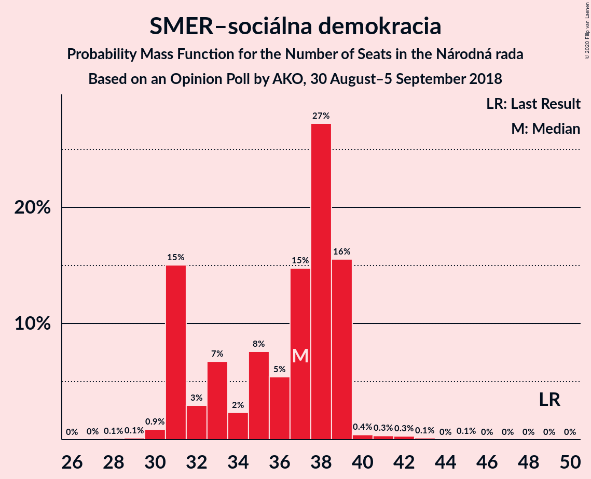
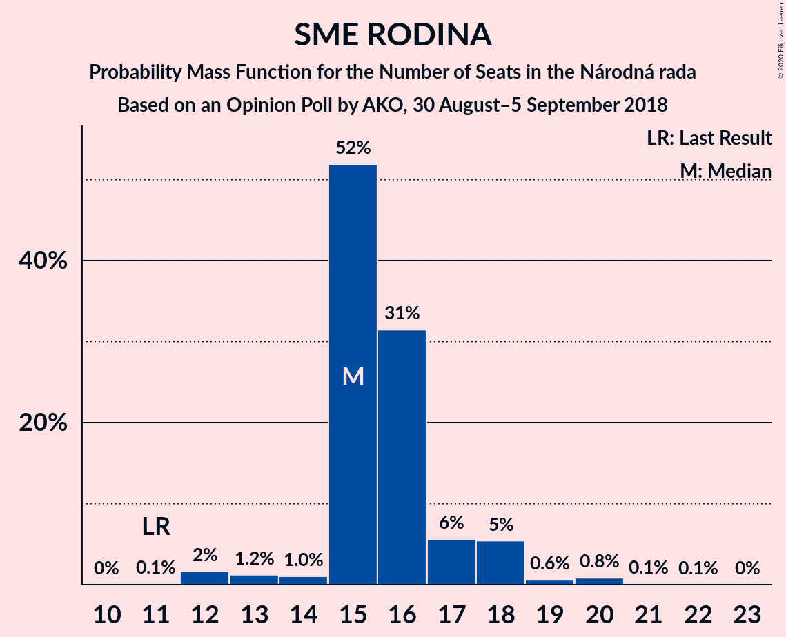
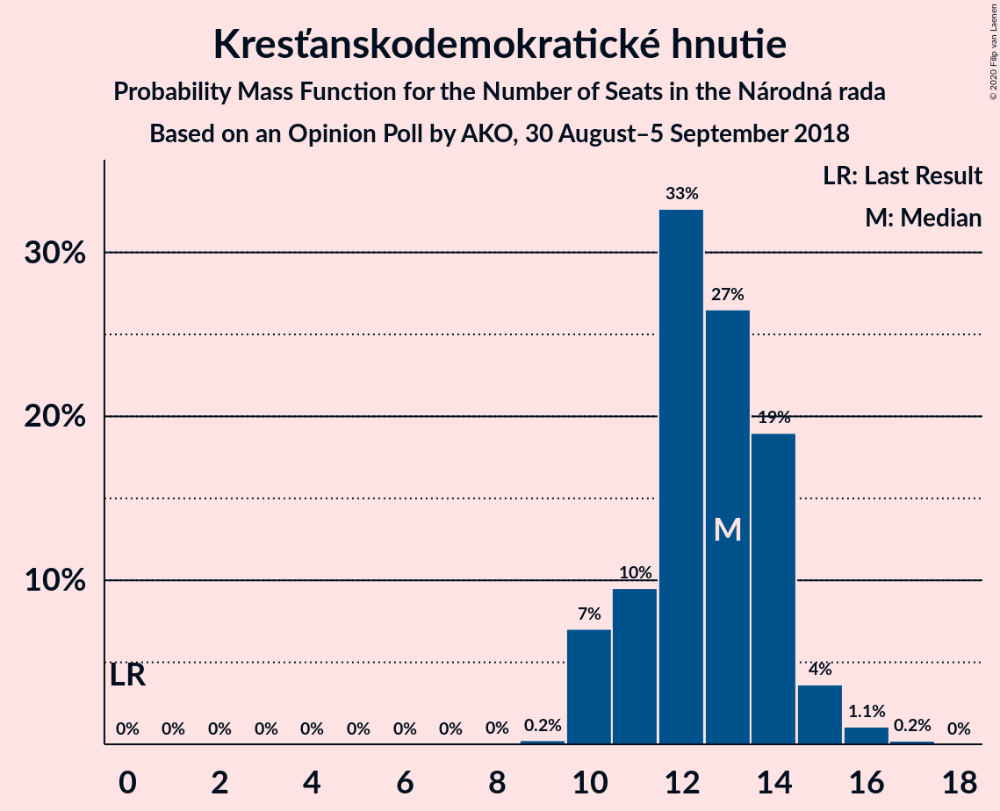
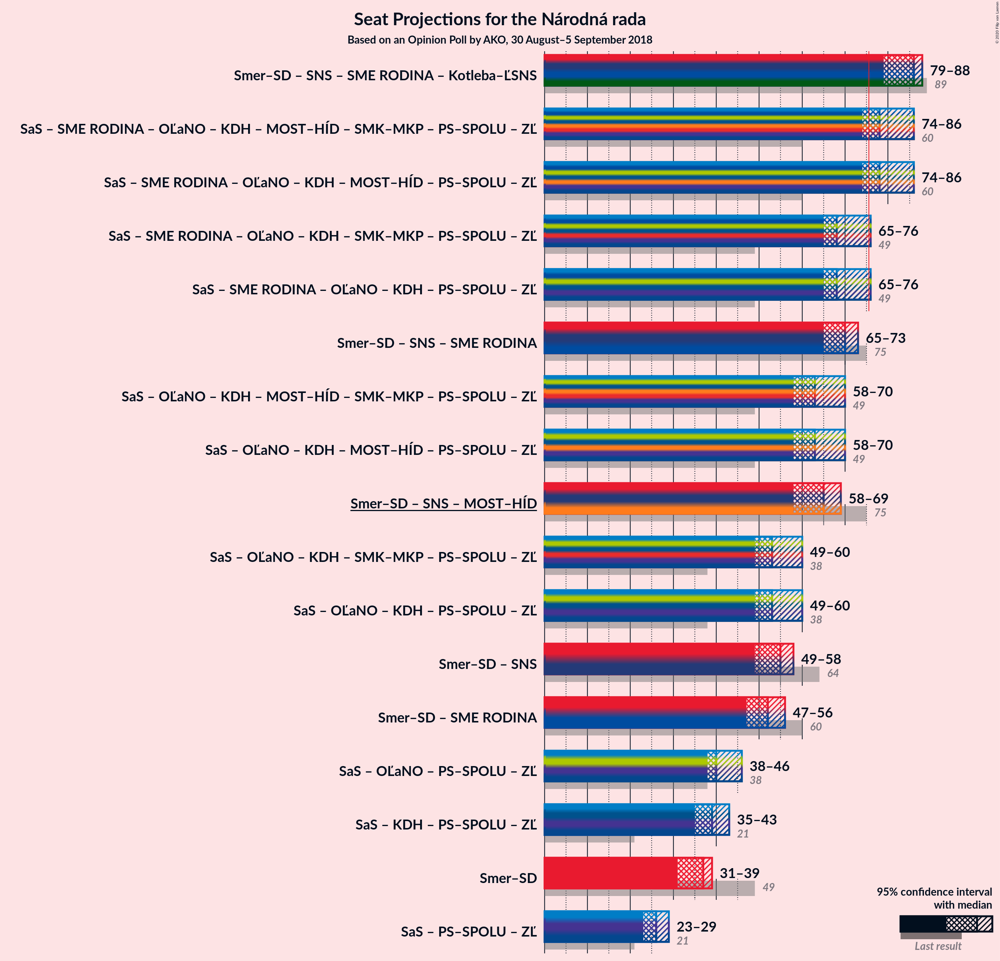

# Opinion Poll by AKO, 30 August–5 September 2018

<a href="#voting-intentions">Voting Intentions</a> | <a href="#seats">Seats</a> | <a href="#coalitions">Coalitions</a> | <a href="#technical-information">Technical Information</a>

## Voting Intentions

### Confidence Intervals

| Party | Last Result | Poll Result | 80% Confidence Interval | 90% Confidence Interval | 95% Confidence Interval | 99% Confidence Interval |
|:-----:|:-----------:|:-----------:|:-----------------------:|:-----------------------:|:-----------------------:|:-----------------------:|
| SMER–sociálna demokracia | 28.3% | 21.2% | 19.6–22.9% |19.2–23.4% |18.8–23.9% |18.0–24.7% |
| Sloboda a Solidarita | 12.1% | 16.0% | 14.6–17.6% |14.2–18.0% |13.9–18.4% |13.2–19.2% |
| Slovenská národná strana | 8.6% | 10.9% | 9.7–12.3% |9.4–12.7% |9.1–13.0% |8.6–13.7% |
| SME RODINA | 6.6% | 9.5% | 8.4–10.8% |8.1–11.2% |7.8–11.5% |7.3–12.1% |
| OBYČAJNÍ ĽUDIA a nezávislé osobnosti | 11.0% | 9.4% | 8.3–10.7% |8.0–11.1% |7.7–11.4% |7.2–12.0% |
| Kotleba–Ľudová strana Naše Slovensko | 8.0% | 8.6% | 7.6–9.8% |7.3–10.2% |7.0–10.5% |6.5–11.1% |
| Kresťanskodemokratické hnutie | 4.9% | 7.6% | 6.6–8.8% |6.3–9.1% |6.1–9.4% |5.7–10.0% |
| MOST–HÍD | 6.5% | 6.3% | 5.4–7.4% |5.2–7.7% |5.0–8.0% |4.6–8.6% |
| Progresívne Slovensko | 0.0% | 4.6% | 3.9–5.6% |3.6–5.9% |3.5–6.1% |3.1–6.6% |
| Strana maďarskej koalície–Magyar Koalíció Pártja | 4.0% | 3.0% | 2.4–3.8% |2.2–4.1% |2.1–4.3% |1.9–4.7% |
| SPOLU–Občianska Demokracia | 0.0% | 2.3% | 1.8–3.0% |1.6–3.2% |1.5–3.4% |1.3–3.8% |

*Note:* The poll result column reflects the actual value used in the calculations. Published results may vary slightly, and in addition be rounded to fewer digits.

## Seats

### Confidence Intervals

| Party | Last Result | Median | 80% Confidence Interval | 90% Confidence Interval | 95% Confidence Interval | 99% Confidence Interval |
|:-----:|:-----------:|:------:|:-----------------------:|:-----------------------:|:-----------------------:|:-----------------------:|
| <a href="#smer–sociálna-demokracia">SMER–sociálna demokracia</a> | 49 | 31 | 31–38 |31–39 |31–40 |30–43 |
| <a href="#sloboda-a-solidarita">Sloboda a Solidarita</a> | 21 | 29 | 23–29 |23–29 |22–29 |21–30 |
| <a href="#slovenská-národná-strana">Slovenská národná strana</a> | 15 | 19 | 17–19 |17–19 |16–21 |16–22 |
| <a href="#sme-rodina">SME RODINA</a> | 11 | 16 | 15–16 |13–16 |12–16 |12–19 |
| <a href="#obyčajní-ľudia-a-nezávislé-osobnosti">OBYČAJNÍ ĽUDIA a nezávislé osobnosti</a> | 17 | 17 | 16–17 |15–18 |14–19 |12–19 |
| <a href="#kotleba–ľudová-strana-naše-slovensko">Kotleba–Ľudová strana Naše Slovensko</a> | 14 | 14 | 14–15 |13–16 |12–17 |11–17 |
| <a href="#kresťanskodemokratické-hnutie">Kresťanskodemokratické hnutie</a> | 0 | 14 | 12–14 |11–14 |11–14 |10–15 |
| <a href="#most–híd">MOST–HÍD</a> | 11 | 10 | 10–12 |9–12 |8–12 |0–12 |
| <a href="#progresívne-slovensko">Progresívne Slovensko</a> | 0 | 0 | 0–8 |0–9 |0–10 |0–10 |
| <a href="#strana-maďarskej-koalície–magyar-koalíció-pártja">Strana maďarskej koalície–Magyar Koalíció Pártja</a> | 0 | 0 | 0 |0 |0 |0 |
| <a href="#spolu–občianska-demokracia">SPOLU–Občianska Demokracia</a> | 0 | 0 | 0 |0 |0 |0 |

### SMER–sociálna demokracia

*For a full overview of the results for this party, see the [SMER–sociálna demokracia](party-smer–sociálnademokracia.html) page.*

| Number of Seats | Probability | Accumulated | Special Marks |
|:---------------:|:-----------:|:-----------:|:-------------:|
| 28 | 0% | 100% |  |
| 29 | 0.1% | 99.9% |  |
| 30 | 2% | 99.9% |  |
| 31 | 52% | 98% | Median |
| 32 | 4% | 46% |  |
| 33 | 3% | 42% |  |
| 34 | 0.8% | 39% |  |
| 35 | 3% | 38% |  |
| 36 | 1.1% | 35% |  |
| 37 | 0.3% | 34% |  |
| 38 | 29% | 34% |  |
| 39 | 2% | 5% |  |
| 40 | 1.4% | 3% |  |
| 41 | 0% | 1.3% |  |
| 42 | 0.7% | 1.3% |  |
| 43 | 0.1% | 0.6% |  |
| 44 | 0% | 0.5% |  |
| 45 | 0.5% | 0.5% |  |
| 46 | 0% | 0% |  |
| 47 | 0% | 0% |  |
| 48 | 0% | 0% |  |
| 49 | 0% | 0% | Last Result |

### Sloboda a Solidarita

*For a full overview of the results for this party, see the [Sloboda a Solidarita](party-slobodaasolidarita.html) page.*

| Number of Seats | Probability | Accumulated | Special Marks |
|:---------------:|:-----------:|:-----------:|:-------------:|
| 21 | 2% | 100% | Last Result |
| 22 | 2% | 98% |  |
| 23 | 28% | 97% |  |
| 24 | 9% | 69% |  |
| 25 | 2% | 60% |  |
| 26 | 0.3% | 58% |  |
| 27 | 3% | 58% |  |
| 28 | 3% | 55% |  |
| 29 | 51% | 52% | Median |
| 30 | 0.3% | 0.6% |  |
| 31 | 0% | 0.3% |  |
| 32 | 0.3% | 0.3% |  |
| 33 | 0% | 0% |  |

### Slovenská národná strana

*For a full overview of the results for this party, see the [Slovenská národná strana](party-slovenskánárodnástrana.html) page.*

| Number of Seats | Probability | Accumulated | Special Marks |
|:---------------:|:-----------:|:-----------:|:-------------:|
| 14 | 0.2% | 100% |  |
| 15 | 0.1% | 99.8% | Last Result |
| 16 | 3% | 99.7% |  |
| 17 | 30% | 97% |  |
| 18 | 7% | 67% |  |
| 19 | 55% | 60% | Median |
| 20 | 1.1% | 5% |  |
| 21 | 3% | 4% |  |
| 22 | 0.4% | 0.7% |  |
| 23 | 0.3% | 0.3% |  |
| 24 | 0% | 0% |  |

### SME RODINA

*For a full overview of the results for this party, see the [SME RODINA](party-smerodina.html) page.*

| Number of Seats | Probability | Accumulated | Special Marks |
|:---------------:|:-----------:|:-----------:|:-------------:|
| 11 | 0% | 100% | Last Result |
| 12 | 3% | 100% |  |
| 13 | 2% | 97% |  |
| 14 | 0.5% | 95% |  |
| 15 | 5% | 94% |  |
| 16 | 88% | 90% | Median |
| 17 | 0.7% | 1.4% |  |
| 18 | 0.1% | 0.7% |  |
| 19 | 0.1% | 0.5% |  |
| 20 | 0.4% | 0.5% |  |
| 21 | 0% | 0% |  |

### OBYČAJNÍ ĽUDIA a nezávislé osobnosti

*For a full overview of the results for this party, see the [OBYČAJNÍ ĽUDIA a nezávislé osobnosti](party-obyčajníľudiaanezávisléosobnosti.html) page.*

| Number of Seats | Probability | Accumulated | Special Marks |
|:---------------:|:-----------:|:-----------:|:-------------:|
| 11 | 0.4% | 100% |  |
| 12 | 0.2% | 99.6% |  |
| 13 | 1.3% | 99.3% |  |
| 14 | 2% | 98% |  |
| 15 | 5% | 96% |  |
| 16 | 6% | 91% |  |
| 17 | 80% | 85% | Last Result, Median |
| 18 | 0.9% | 6% |  |
| 19 | 5% | 5% |  |
| 20 | 0.1% | 0.1% |  |
| 21 | 0% | 0% |  |

### Kotleba–Ľudová strana Naše Slovensko

*For a full overview of the results for this party, see the [Kotleba–Ľudová strana Naše Slovensko](party-kotleba–ľudovástrananašeslovensko.html) page.*

| Number of Seats | Probability | Accumulated | Special Marks |
|:---------------:|:-----------:|:-----------:|:-------------:|
| 11 | 1.3% | 100% |  |
| 12 | 2% | 98.6% |  |
| 13 | 5% | 97% |  |
| 14 | 56% | 92% | Last Result, Median |
| 15 | 29% | 36% |  |
| 16 | 2% | 7% |  |
| 17 | 4% | 5% |  |
| 18 | 0.3% | 0.3% |  |
| 19 | 0% | 0% |  |

### Kresťanskodemokratické hnutie

*For a full overview of the results for this party, see the [Kresťanskodemokratické hnutie](party-kresťanskodemokratickéhnutie.html) page.*

| Number of Seats | Probability | Accumulated | Special Marks |
|:---------------:|:-----------:|:-----------:|:-------------:|
| 0 | 0% | 100% | Last Result |
| 1 | 0% | 100% |  |
| 2 | 0% | 100% |  |
| 3 | 0% | 100% |  |
| 4 | 0% | 100% |  |
| 5 | 0% | 100% |  |
| 6 | 0% | 100% |  |
| 7 | 0% | 100% |  |
| 8 | 0% | 100% |  |
| 9 | 0.2% | 100% |  |
| 10 | 2% | 99.8% |  |
| 11 | 4% | 98% |  |
| 12 | 29% | 94% |  |
| 13 | 8% | 64% |  |
| 14 | 55% | 56% | Median |
| 15 | 0.9% | 1.1% |  |
| 16 | 0.2% | 0.2% |  |
| 17 | 0% | 0.1% |  |
| 18 | 0% | 0% |  |

### MOST–HÍD

*For a full overview of the results for this party, see the [MOST–HÍD](party-most–híd.html) page.*

| Number of Seats | Probability | Accumulated | Special Marks |
|:---------------:|:-----------:|:-----------:|:-------------:|
| 0 | 2% | 100% |  |
| 1 | 0% | 98% |  |
| 2 | 0% | 98% |  |
| 3 | 0% | 98% |  |
| 4 | 0% | 98% |  |
| 5 | 0% | 98% |  |
| 6 | 0% | 98% |  |
| 7 | 0% | 98% |  |
| 8 | 1.0% | 98% |  |
| 9 | 5% | 97% |  |
| 10 | 59% | 92% | Median |
| 11 | 2% | 33% | Last Result |
| 12 | 31% | 31% |  |
| 13 | 0.2% | 0.3% |  |
| 14 | 0.1% | 0.1% |  |
| 15 | 0% | 0% |  |

### Progresívne Slovensko

*For a full overview of the results for this party, see the [Progresívne Slovensko](party-progresívneslovensko.html) page.*

| Number of Seats | Probability | Accumulated | Special Marks |
|:---------------:|:-----------:|:-----------:|:-------------:|
| 0 | 89% | 100% | Last Result, Median |
| 1 | 0% | 11% |  |
| 2 | 0% | 11% |  |
| 3 | 0% | 11% |  |
| 4 | 0% | 11% |  |
| 5 | 0% | 11% |  |
| 6 | 0% | 11% |  |
| 7 | 0% | 11% |  |
| 8 | 1.1% | 11% |  |
| 9 | 7% | 10% |  |
| 10 | 2% | 3% |  |
| 11 | 0% | 0% |  |

### Strana maďarskej koalície–Magyar Koalíció Pártja

*For a full overview of the results for this party, see the [Strana maďarskej koalície–Magyar Koalíció Pártja](party-stranamaďarskejkoalície–magyarkoalíciópártja.html) page.*

| Number of Seats | Probability | Accumulated | Special Marks |
|:---------------:|:-----------:|:-----------:|:-------------:|
| 0 | 100% | 100% | Last Result, Median |

### SPOLU–Občianska Demokracia

*For a full overview of the results for this party, see the [SPOLU–Občianska Demokracia](party-spolu–občianskademokracia.html) page.*

| Number of Seats | Probability | Accumulated | Special Marks |
|:---------------:|:-----------:|:-----------:|:-------------:|
| 0 | 100% | 100% | Last Result, Median |

## Coalitions

### Confidence Intervals

| Coalition | Last Result | Median | Majority? | 80% Confidence Interval | 90% Confidence Interval | 95% Confidence Interval | 99% Confidence Interval |
|:---------:|:-----------:|:------:|:---------:|:-----------------------:|:-----------------------:|:-----------------------:|:-----------------------:|
| SMER–sociálna demokracia – Slovenská národná strana – MOST–HÍD | 75 | 60 | 0% | 60–67 | 60–67 | 58–67 | 56–71 |
| SMER–sociálna demokracia | 49 | 31 | 0% | 31–38 | 31–39 | 31–40 | 30–43 |

### SMER–sociálna demokracia – Slovenská národná strana – MOST–HÍD

| Number of Seats | Probability | Accumulated | Special Marks |
|:---------------:|:-----------:|:-----------:|:-------------:|
| 53 | 0% | 100% |  |
| 54 | 0% | 99.9% |  |
| 55 | 0.1% | 99.9% |  |
| 56 | 0.4% | 99.8% |  |
| 57 | 2% | 99.4% |  |
| 58 | 2% | 98% |  |
| 59 | 0.2% | 96% |  |
| 60 | 50% | 96% | Median |
| 61 | 6% | 46% |  |
| 62 | 3% | 40% |  |
| 63 | 2% | 37% |  |
| 64 | 0.6% | 35% |  |
| 65 | 1.4% | 34% |  |
| 66 | 4% | 33% |  |
| 67 | 27% | 29% |  |
| 68 | 0.3% | 1.4% |  |
| 69 | 0% | 1.1% |  |
| 70 | 0.1% | 1.1% |  |
| 71 | 0.9% | 1.0% |  |
| 72 | 0.1% | 0.1% |  |
| 73 | 0% | 0% |  |
| 74 | 0% | 0% |  |
| 75 | 0% | 0% | Last Result |

### SMER–sociálna demokracia

| Number of Seats | Probability | Accumulated | Special Marks |
|:---------------:|:-----------:|:-----------:|:-------------:|
| 28 | 0% | 100% |  |
| 29 | 0.1% | 99.9% |  |
| 30 | 2% | 99.9% |  |
| 31 | 52% | 98% | Median |
| 32 | 4% | 46% |  |
| 33 | 3% | 42% |  |
| 34 | 0.8% | 39% |  |
| 35 | 3% | 38% |  |
| 36 | 1.1% | 35% |  |
| 37 | 0.3% | 34% |  |
| 38 | 29% | 34% |  |
| 39 | 2% | 5% |  |
| 40 | 1.4% | 3% |  |
| 41 | 0% | 1.3% |  |
| 42 | 0.7% | 1.3% |  |
| 43 | 0.1% | 0.6% |  |
| 44 | 0% | 0.5% |  |
| 45 | 0.5% | 0.5% |  |
| 46 | 0% | 0% |  |
| 47 | 0% | 0% |  |
| 48 | 0% | 0% |  |
| 49 | 0% | 0% | Last Result |

## Technical Information

### Opinion Poll

+ **Polling firm:** AKO
+ **Commissioner(s):** —
+ **Fieldwork period:** 30 August–5 September 2018

### Calculations

+ **Sample size:** 1000
+ **Simulations done:** 131,072
+ **Error estimate:** 2.79%

