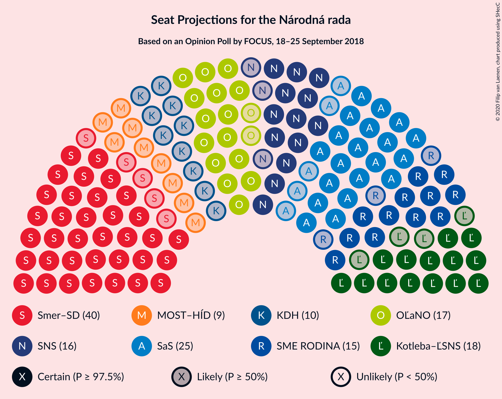
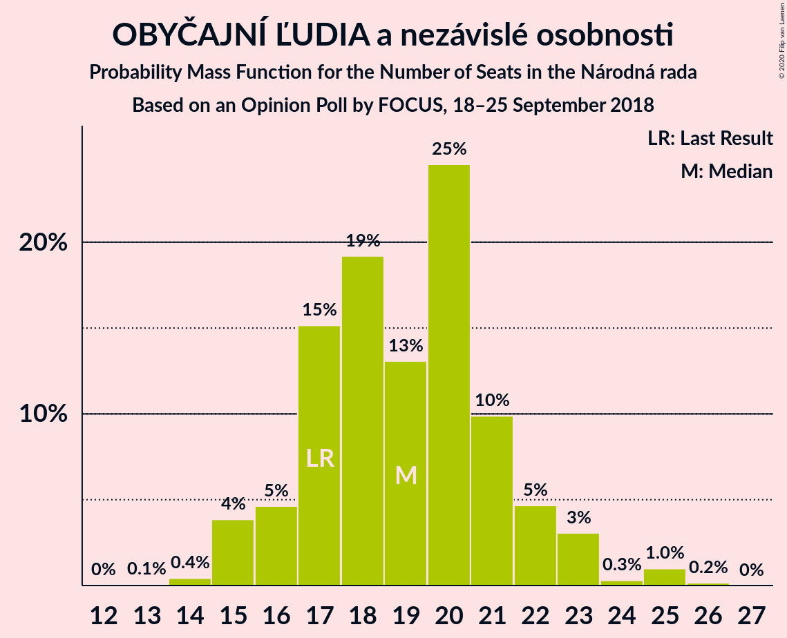
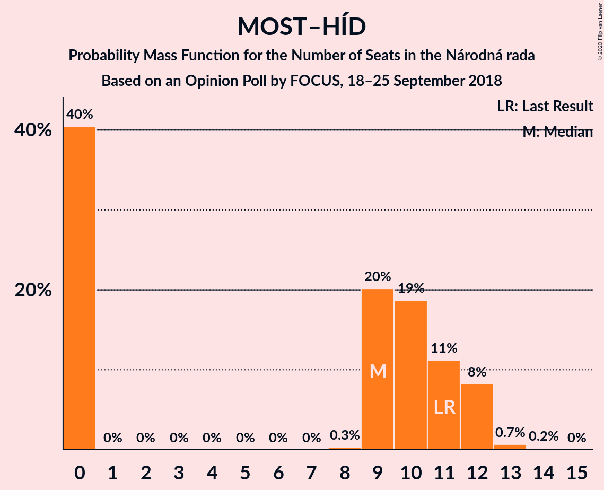
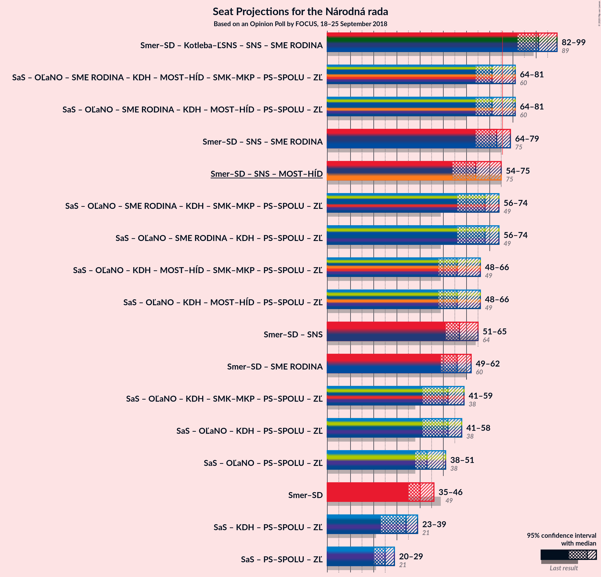
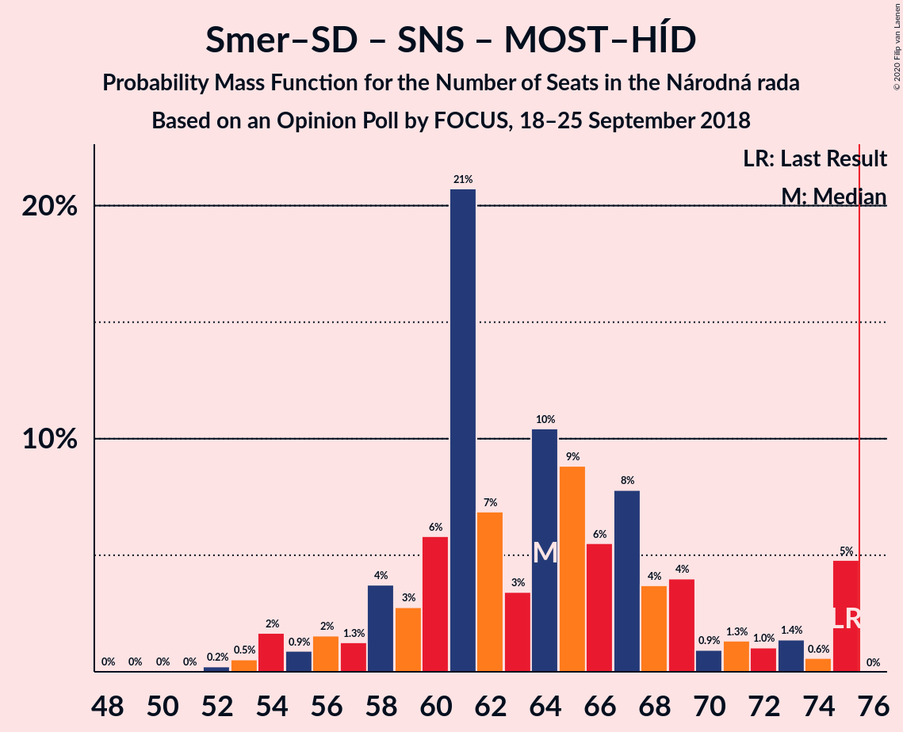

# Opinion Poll by FOCUS, 18–25 September 2018

<a href="#voting-intentions">Voting Intentions</a> | <a href="#seats">Seats</a> | <a href="#coalitions">Coalitions</a> | <a href="#technical-information">Technical Information</a>

## Voting Intentions

### Confidence Intervals

| Party | Last Result | Poll Result | 80% Confidence Interval | 90% Confidence Interval | 95% Confidence Interval | 99% Confidence Interval |
|:-----:|:-----------:|:-----------:|:-----------------------:|:-----------------------:|:-----------------------:|:-----------------------:|
| SMER–sociálna demokracia | 28.3% | 22.4% | 20.7–24.1% |20.3–24.6% |19.9–25.0% |19.1–25.9% |
| Sloboda a Solidarita | 12.1% | 13.5% | 12.2–15.0% |11.8–15.4% |11.5–15.7% |10.9–16.5% |
| OBYČAJNÍ ĽUDIA a nezávislé osobnosti | 11.0% | 10.3% | 9.2–11.7% |8.9–12.0% |8.6–12.4% |8.1–13.0% |
| Kotleba–Ľudová strana Naše Slovensko | 8.0% | 10.0% | 8.9–11.4% |8.6–11.7% |8.3–12.1% |7.8–12.7% |
| Slovenská národná strana | 8.6% | 9.2% | 8.1–10.4% |7.8–10.8% |7.5–11.1% |7.1–11.7% |
| SME RODINA | 6.6% | 8.2% | 7.2–9.4% |6.9–9.7% |6.6–10.0% |6.2–10.6% |
| Kresťanskodemokratické hnutie | 4.9% | 5.5% | 4.7–6.6% |4.5–6.8% |4.3–7.1% |3.9–7.6% |
| MOST–HÍD | 6.5% | 5.1% | 4.3–6.1% |4.1–6.4% |3.9–6.7% |3.6–7.2% |
| Progresívne Slovensko | 0.0% | 4.4% | 3.7–5.4% |3.5–5.7% |3.3–5.9% |3.0–6.4% |
| Strana maďarskej koalície–Magyar Koalíció Pártja | 4.0% | 3.1% | 2.5–3.9% |2.3–4.1% |2.2–4.3% |1.9–4.7% |
| SPOLU–Občianska Demokracia | 0.0% | 3.1% | 2.5–3.9% |2.3–4.1% |2.2–4.3% |1.9–4.7% |

*Note:* The poll result column reflects the actual value used in the calculations. Published results may vary slightly, and in addition be rounded to fewer digits.

## Seats

### Confidence Intervals

| Party | Last Result | Median | 80% Confidence Interval | 90% Confidence Interval | 95% Confidence Interval | 99% Confidence Interval |
|:-----:|:-----------:|:------:|:-----------------------:|:-----------------------:|:-----------------------:|:-----------------------:|
| <a href="#smer–sociálna-demokracia">SMER–sociálna demokracia</a> | 49 | 40 | 37–44 |35–45 |35–46 |33–48 |
| <a href="#sloboda-a-solidarita">Sloboda a Solidarita</a> | 21 | 24 | 21–27 |21–28 |20–30 |19–31 |
| <a href="#obyčajní-ľudia-a-nezávislé-osobnosti">OBYČAJNÍ ĽUDIA a nezávislé osobnosti</a> | 17 | 19 | 16–21 |16–22 |15–23 |14–25 |
| <a href="#kotleba–ľudová-strana-naše-slovensko">Kotleba–Ľudová strana Naše Slovensko</a> | 14 | 18 | 15–21 |15–21 |15–23 |14–24 |
| <a href="#slovenská-národná-strana">Slovenská národná strana</a> | 15 | 16 | 14–19 |14–19 |13–20 |13–22 |
| <a href="#sme-rodina">SME RODINA</a> | 11 | 15 | 13–18 |12–18 |12–18 |11–19 |
| <a href="#kresťanskodemokratické-hnutie">Kresťanskodemokratické hnutie</a> | 0 | 10 | 0–12 |0–13 |0–13 |0–14 |
| <a href="#most–híd">MOST–HÍD</a> | 11 | 9 | 0–11 |0–12 |0–12 |0–13 |
| <a href="#progresívne-slovensko">Progresívne Slovensko</a> | 0 | 0 | 0–10 |0–10 |0–11 |0–11 |
| <a href="#strana-maďarskej-koalície–magyar-koalíció-pártja">Strana maďarskej koalície–Magyar Koalíció Pártja</a> | 0 | 0 | 0 |0 |0 |0 |
| <a href="#spolu–občianska-demokracia">SPOLU–Občianska Demokracia</a> | 0 | 0 | 0 |0 |0 |0 |

### SMER–sociálna demokracia

*For a full overview of the results for this party, see the [SMER–sociálna demokracia](party-smer–sociálnademokracia.html) page.*

| Number of Seats | Probability | Accumulated | Special Marks |
|:---------------:|:-----------:|:-----------:|:-------------:|
| 32 | 0.1% | 100% |  |
| 33 | 0.5% | 99.9% |  |
| 34 | 0.8% | 99.4% |  |
| 35 | 5% | 98.7% |  |
| 36 | 4% | 94% |  |
| 37 | 10% | 90% |  |
| 38 | 3% | 80% |  |
| 39 | 26% | 77% |  |
| 40 | 25% | 51% | Median |
| 41 | 9% | 25% |  |
| 42 | 3% | 17% |  |
| 43 | 2% | 14% |  |
| 44 | 6% | 12% |  |
| 45 | 3% | 6% |  |
| 46 | 2% | 3% |  |
| 47 | 0.1% | 0.7% |  |
| 48 | 0.2% | 0.6% |  |
| 49 | 0.1% | 0.4% | Last Result |
| 50 | 0% | 0.2% |  |
| 51 | 0.2% | 0.2% |  |
| 52 | 0% | 0% |  |

### Sloboda a Solidarita

*For a full overview of the results for this party, see the [Sloboda a Solidarita](party-slobodaasolidarita.html) page.*

| Number of Seats | Probability | Accumulated | Special Marks |
|:---------------:|:-----------:|:-----------:|:-------------:|
| 18 | 0.1% | 100% |  |
| 19 | 2% | 99.9% |  |
| 20 | 3% | 98% |  |
| 21 | 9% | 95% | Last Result |
| 22 | 22% | 86% |  |
| 23 | 13% | 64% |  |
| 24 | 7% | 51% | Median |
| 25 | 23% | 44% |  |
| 26 | 10% | 21% |  |
| 27 | 4% | 12% |  |
| 28 | 4% | 8% |  |
| 29 | 1.5% | 4% |  |
| 30 | 2% | 3% |  |
| 31 | 0.4% | 0.5% |  |
| 32 | 0% | 0.1% |  |
| 33 | 0.1% | 0.1% |  |
| 34 | 0% | 0% |  |

### OBYČAJNÍ ĽUDIA a nezávislé osobnosti

*For a full overview of the results for this party, see the [OBYČAJNÍ ĽUDIA a nezávislé osobnosti](party-obyčajníľudiaanezávisléosobnosti.html) page.*

| Number of Seats | Probability | Accumulated | Special Marks |
|:---------------:|:-----------:|:-----------:|:-------------:|
| 13 | 0.1% | 100% |  |
| 14 | 0.7% | 99.9% |  |
| 15 | 3% | 99.2% |  |
| 16 | 7% | 96% |  |
| 17 | 10% | 89% | Last Result |
| 18 | 25% | 78% |  |
| 19 | 23% | 54% | Median |
| 20 | 11% | 30% |  |
| 21 | 12% | 20% |  |
| 22 | 4% | 8% |  |
| 23 | 1.2% | 3% |  |
| 24 | 0.2% | 2% |  |
| 25 | 2% | 2% |  |
| 26 | 0.2% | 0.2% |  |
| 27 | 0% | 0% |  |

### Kotleba–Ľudová strana Naše Slovensko

*For a full overview of the results for this party, see the [Kotleba–Ľudová strana Naše Slovensko](party-kotleba–ľudovástrananašeslovensko.html) page.*

| Number of Seats | Probability | Accumulated | Special Marks |
|:---------------:|:-----------:|:-----------:|:-------------:|
| 13 | 0.1% | 100% |  |
| 14 | 2% | 99.9% | Last Result |
| 15 | 15% | 98% |  |
| 16 | 7% | 83% |  |
| 17 | 14% | 76% |  |
| 18 | 38% | 62% | Median |
| 19 | 9% | 24% |  |
| 20 | 5% | 15% |  |
| 21 | 6% | 11% |  |
| 22 | 2% | 5% |  |
| 23 | 2% | 3% |  |
| 24 | 0.2% | 0.6% |  |
| 25 | 0.1% | 0.4% |  |
| 26 | 0.3% | 0.3% |  |
| 27 | 0% | 0% |  |

### Slovenská národná strana

*For a full overview of the results for this party, see the [Slovenská národná strana](party-slovenskánárodnástrana.html) page.*

| Number of Seats | Probability | Accumulated | Special Marks |
|:---------------:|:-----------:|:-----------:|:-------------:|
| 11 | 0.1% | 100% |  |
| 12 | 0.3% | 99.9% |  |
| 13 | 4% | 99.6% |  |
| 14 | 11% | 96% |  |
| 15 | 10% | 85% | Last Result |
| 16 | 40% | 75% | Median |
| 17 | 10% | 34% |  |
| 18 | 11% | 24% |  |
| 19 | 10% | 13% |  |
| 20 | 0.8% | 3% |  |
| 21 | 0.3% | 2% |  |
| 22 | 2% | 2% |  |
| 23 | 0% | 0.1% |  |
| 24 | 0% | 0% |  |

### SME RODINA

*For a full overview of the results for this party, see the [SME RODINA](party-smerodina.html) page.*

| Number of Seats | Probability | Accumulated | Special Marks |
|:---------------:|:-----------:|:-----------:|:-------------:|
| 10 | 0.2% | 100% |  |
| 11 | 0.6% | 99.8% | Last Result |
| 12 | 6% | 99.2% |  |
| 13 | 17% | 93% |  |
| 14 | 19% | 76% |  |
| 15 | 23% | 58% | Median |
| 16 | 8% | 35% |  |
| 17 | 8% | 27% |  |
| 18 | 17% | 19% |  |
| 19 | 1.2% | 2% |  |
| 20 | 0.1% | 0.4% |  |
| 21 | 0.2% | 0.2% |  |
| 22 | 0% | 0% |  |

### Kresťanskodemokratické hnutie

*For a full overview of the results for this party, see the [Kresťanskodemokratické hnutie](party-kresťanskodemokratickéhnutie.html) page.*

| Number of Seats | Probability | Accumulated | Special Marks |
|:---------------:|:-----------:|:-----------:|:-------------:|
| 0 | 24% | 100% | Last Result |
| 1 | 0% | 76% |  |
| 2 | 0% | 76% |  |
| 3 | 0% | 76% |  |
| 4 | 0% | 76% |  |
| 5 | 0% | 76% |  |
| 6 | 0% | 76% |  |
| 7 | 0% | 76% |  |
| 8 | 2% | 76% |  |
| 9 | 12% | 74% |  |
| 10 | 26% | 62% | Median |
| 11 | 20% | 36% |  |
| 12 | 9% | 16% |  |
| 13 | 6% | 7% |  |
| 14 | 1.0% | 1.2% |  |
| 15 | 0.2% | 0.2% |  |
| 16 | 0% | 0% |  |

### MOST–HÍD

*For a full overview of the results for this party, see the [MOST–HÍD](party-most–híd.html) page.*

| Number of Seats | Probability | Accumulated | Special Marks |
|:---------------:|:-----------:|:-----------:|:-------------:|
| 0 | 21% | 100% |  |
| 1 | 0% | 79% |  |
| 2 | 0% | 79% |  |
| 3 | 0% | 79% |  |
| 4 | 0% | 79% |  |
| 5 | 0% | 79% |  |
| 6 | 0% | 79% |  |
| 7 | 0% | 79% |  |
| 8 | 0.1% | 79% |  |
| 9 | 34% | 79% | Median |
| 10 | 22% | 44% |  |
| 11 | 16% | 22% | Last Result |
| 12 | 6% | 7% |  |
| 13 | 0.7% | 0.9% |  |
| 14 | 0.2% | 0.2% |  |
| 15 | 0% | 0% |  |

### Progresívne Slovensko

*For a full overview of the results for this party, see the [Progresívne Slovensko](party-progresívneslovensko.html) page.*

| Number of Seats | Probability | Accumulated | Special Marks |
|:---------------:|:-----------:|:-----------:|:-------------:|
| 0 | 72% | 100% | Last Result, Median |
| 1 | 0% | 28% |  |
| 2 | 0% | 28% |  |
| 3 | 0% | 28% |  |
| 4 | 0% | 28% |  |
| 5 | 0% | 28% |  |
| 6 | 0% | 28% |  |
| 7 | 0% | 28% |  |
| 8 | 5% | 28% |  |
| 9 | 12% | 22% |  |
| 10 | 6% | 10% |  |
| 11 | 4% | 4% |  |
| 12 | 0.1% | 0.1% |  |
| 13 | 0% | 0% |  |

### Strana maďarskej koalície–Magyar Koalíció Pártja

*For a full overview of the results for this party, see the [Strana maďarskej koalície–Magyar Koalíció Pártja](party-stranamaďarskejkoalície–magyarkoalíciópártja.html) page.*

| Number of Seats | Probability | Accumulated | Special Marks |
|:---------------:|:-----------:|:-----------:|:-------------:|
| 0 | 99.8% | 100% | Last Result, Median |
| 1 | 0% | 0.2% |  |
| 2 | 0% | 0.2% |  |
| 3 | 0% | 0.2% |  |
| 4 | 0% | 0.2% |  |
| 5 | 0% | 0.2% |  |
| 6 | 0% | 0.2% |  |
| 7 | 0% | 0.2% |  |
| 8 | 0% | 0.2% |  |
| 9 | 0.1% | 0.1% |  |
| 10 | 0% | 0% |  |

### SPOLU–Občianska Demokracia

*For a full overview of the results for this party, see the [SPOLU–Občianska Demokracia](party-spolu–občianskademokracia.html) page.*

| Number of Seats | Probability | Accumulated | Special Marks |
|:---------------:|:-----------:|:-----------:|:-------------:|
| 0 | 99.8% | 100% | Last Result, Median |
| 1 | 0% | 0.2% |  |
| 2 | 0% | 0.2% |  |
| 3 | 0% | 0.2% |  |
| 4 | 0% | 0.2% |  |
| 5 | 0% | 0.2% |  |
| 6 | 0% | 0.2% |  |
| 7 | 0% | 0.2% |  |
| 8 | 0% | 0.2% |  |
| 9 | 0.1% | 0.2% |  |
| 10 | 0% | 0% |  |

## Coalitions

### Confidence Intervals

| Coalition | Last Result | Median | Majority? | 80% Confidence Interval | 90% Confidence Interval | 95% Confidence Interval | 99% Confidence Interval |
|:---------:|:-----------:|:------:|:---------:|:-----------------------:|:-----------------------:|:-----------------------:|:-----------------------:|
| SMER–sociálna demokracia – Slovenská národná strana – MOST–HÍD | 75 | 64 | 0% | 58–69 | 56–70 | 54–72 | 53–74 |
| SMER–sociálna demokracia | 49 | 40 | 0% | 37–44 | 35–45 | 35–46 | 33–48 |

### SMER–sociálna demokracia – Slovenská národná strana – MOST–HÍD

| Number of Seats | Probability | Accumulated | Special Marks |
|:---------------:|:-----------:|:-----------:|:-------------:|
| 49 | 0.1% | 100% |  |
| 50 | 0% | 99.9% |  |
| 51 | 0% | 99.9% |  |
| 52 | 0.3% | 99.9% |  |
| 53 | 0.8% | 99.5% |  |
| 54 | 2% | 98.7% |  |
| 55 | 1.0% | 97% |  |
| 56 | 3% | 96% |  |
| 57 | 1.1% | 93% |  |
| 58 | 3% | 92% |  |
| 59 | 3% | 89% |  |
| 60 | 7% | 86% |  |
| 61 | 5% | 79% |  |
| 62 | 6% | 73% |  |
| 63 | 6% | 67% |  |
| 64 | 19% | 62% |  |
| 65 | 4% | 42% | Median |
| 66 | 8% | 38% |  |
| 67 | 12% | 30% |  |
| 68 | 6% | 17% |  |
| 69 | 6% | 11% |  |
| 70 | 1.2% | 5% |  |
| 71 | 1.0% | 4% |  |
| 72 | 2% | 3% |  |
| 73 | 0.2% | 1.3% |  |
| 74 | 1.1% | 1.2% |  |
| 75 | 0.1% | 0.1% | Last Result |
| 76 | 0% | 0% | Majority |

### SMER–sociálna demokracia

| Number of Seats | Probability | Accumulated | Special Marks |
|:---------------:|:-----------:|:-----------:|:-------------:|
| 32 | 0.1% | 100% |  |
| 33 | 0.5% | 99.9% |  |
| 34 | 0.8% | 99.4% |  |
| 35 | 5% | 98.7% |  |
| 36 | 4% | 94% |  |
| 37 | 10% | 90% |  |
| 38 | 3% | 80% |  |
| 39 | 26% | 77% |  |
| 40 | 25% | 51% | Median |
| 41 | 9% | 25% |  |
| 42 | 3% | 17% |  |
| 43 | 2% | 14% |  |
| 44 | 6% | 12% |  |
| 45 | 3% | 6% |  |
| 46 | 2% | 3% |  |
| 47 | 0.1% | 0.7% |  |
| 48 | 0.2% | 0.6% |  |
| 49 | 0.1% | 0.4% | Last Result |
| 50 | 0% | 0.2% |  |
| 51 | 0.2% | 0.2% |  |
| 52 | 0% | 0% |  |

## Technical Information

### Opinion Poll

+ **Polling firm:** FOCUS
+ **Commissioner(s):** —
+ **Fieldwork period:** 18–25 September 2018

### Calculations

+ **Sample size:** 1015
+ **Simulations done:** 524,288
+ **Error estimate:** 3.12%

