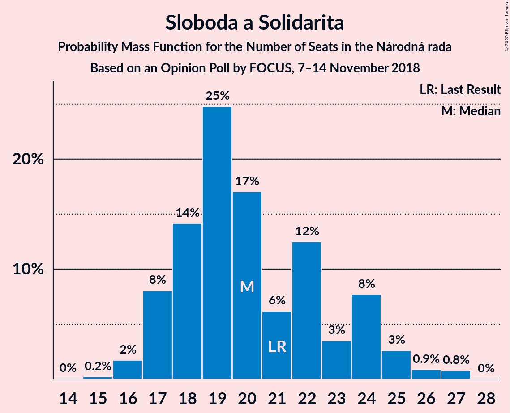
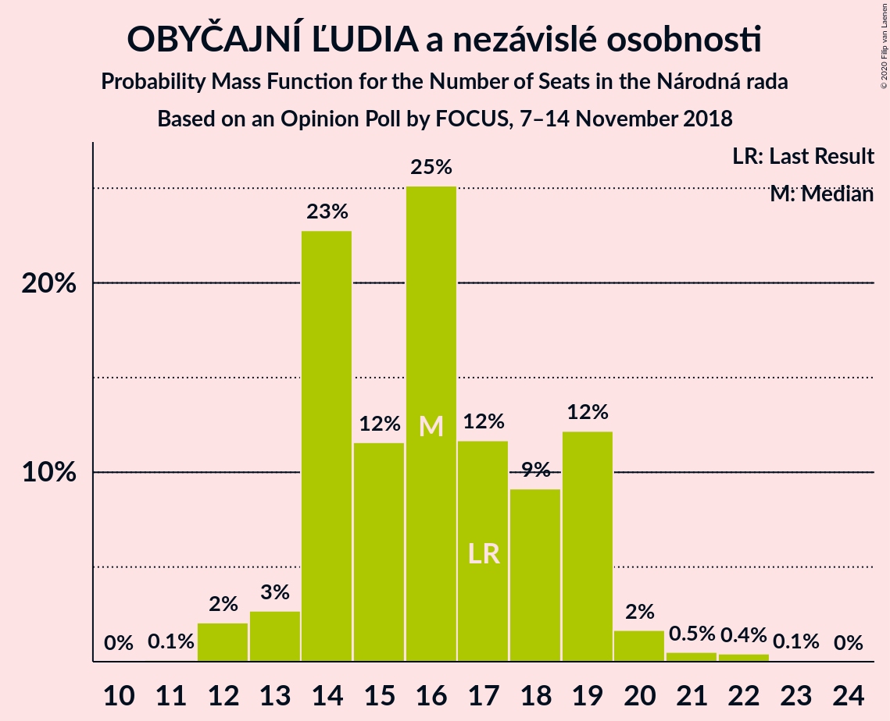
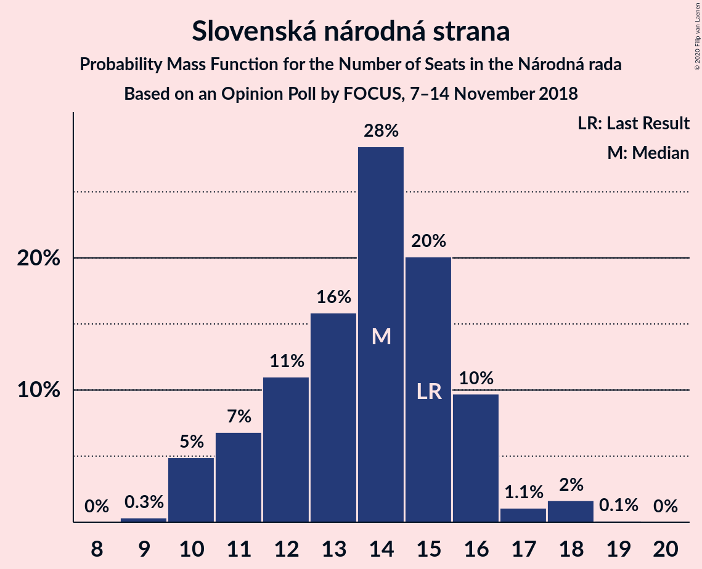
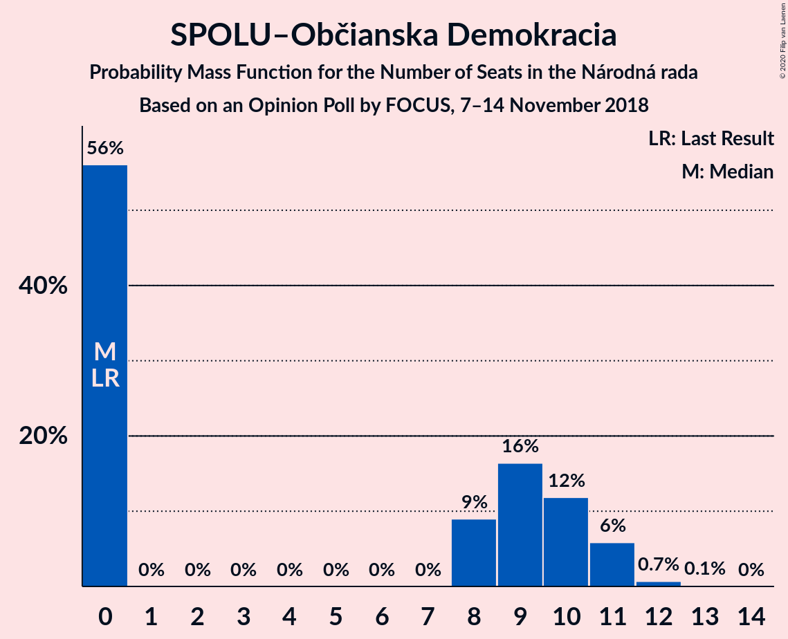
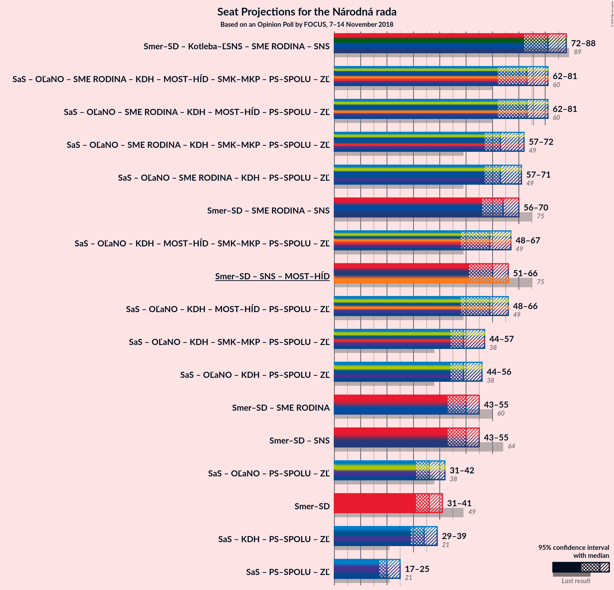

# Opinion Poll by FOCUS, 7–14 November 2018

<a href="#voting-intentions">Voting Intentions</a> | <a href="#seats">Seats</a> | <a href="#coalitions">Coalitions</a> | <a href="#technical-information">Technical Information</a>

## Voting Intentions

### Confidence Intervals

| Party | Last Result | Poll Result | 80% Confidence Interval | 90% Confidence Interval | 95% Confidence Interval | 99% Confidence Interval |
|:-----:|:-----------:|:-----------:|:-----------------------:|:-----------------------:|:-----------------------:|:-----------------------:|
| SMER–sociálna demokracia | 28.3% | 20.9% | 19.4–22.7% |18.9–23.2% |18.5–23.6% |17.8–24.4% |
| Sloboda a Solidarita | 12.1% | 12.0% | 10.7–13.4% |10.4–13.8% |10.1–14.1% |9.5–14.8% |
| Kotleba–Ľudová strana Naše Slovensko | 8.0% | 9.8% | 8.7–11.1% |8.4–11.4% |8.1–11.8% |7.6–12.4% |
| OBYČAJNÍ ĽUDIA a nezávislé osobnosti | 11.0% | 9.5% | 8.4–10.8% |8.1–11.1% |7.8–11.5% |7.3–12.1% |
| SME RODINA | 6.6% | 8.1% | 7.1–9.3% |6.8–9.6% |6.6–10.0% |6.1–10.6% |
| Slovenská národná strana | 8.6% | 8.0% | 7.0–9.2% |6.7–9.5% |6.5–9.8% |6.0–10.5% |
| Kresťanskodemokratické hnutie | 4.9% | 7.7% | 6.7–8.9% |6.4–9.2% |6.2–9.5% |5.8–10.1% |
| MOST–HÍD | 6.5% | 5.9% | 5.1–7.0% |4.8–7.3% |4.6–7.6% |4.3–8.1% |
| Progresívne Slovensko | 0.0% | 5.3% | 4.5–6.4% |4.3–6.6% |4.1–6.9% |3.7–7.4% |
| SPOLU–Občianska Demokracia | 0.0% | 5.0% | 4.3–6.0% |4.0–6.3% |3.9–6.6% |3.5–7.1% |
| Strana maďarskej koalície–Magyar Koalíció Pártja | 4.0% | 3.6% | 2.9–4.4% |2.7–4.7% |2.6–4.9% |2.3–5.3% |

*Note:* The poll result column reflects the actual value used in the calculations. Published results may vary slightly, and in addition be rounded to fewer digits.

## Seats

### Confidence Intervals

| Party | Last Result | Median | 80% Confidence Interval | 90% Confidence Interval | 95% Confidence Interval | 99% Confidence Interval |
|:-----:|:-----------:|:------:|:-----------------------:|:-----------------------:|:-----------------------:|:-----------------------:|
| <a href="#smer–sociálna-demokracia">SMER–sociálna demokracia</a> | 49 | 36 | 33–39 |31–39 |31–41 |29–44 |
| <a href="#sloboda-a-solidarita">Sloboda a Solidarita</a> | 21 | 20 | 18–24 |17–24 |17–25 |16–27 |
| <a href="#kotleba–ľudová-strana-naše-slovensko">Kotleba–Ľudová strana Naše Slovensko</a> | 14 | 17 | 14–19 |14–20 |13–21 |13–22 |
| <a href="#obyčajní-ľudia-a-nezávislé-osobnosti">OBYČAJNÍ ĽUDIA a nezávislé osobnosti</a> | 17 | 16 | 14–19 |14–19 |13–20 |12–21 |
| <a href="#sme-rodina">SME RODINA</a> | 11 | 14 | 12–16 |12–16 |11–17 |10–18 |
| <a href="#slovenská-národná-strana">Slovenská národná strana</a> | 15 | 14 | 11–16 |10–16 |10–17 |10–18 |
| <a href="#kresťanskodemokratické-hnutie">Kresťanskodemokratické hnutie</a> | 0 | 13 | 12–16 |11–16 |10–16 |10–17 |
| <a href="#most–híd">MOST–HÍD</a> | 11 | 10 | 0–12 |0–12 |0–13 |0–14 |
| <a href="#progresívne-slovensko">Progresívne Slovensko</a> | 0 | 9 | 0–11 |0–11 |0–11 |0–12 |
| <a href="#spolu–občianska-demokracia">SPOLU–Občianska Demokracia</a> | 0 | 0 | 0–10 |0–11 |0–11 |0–12 |
| <a href="#strana-maďarskej-koalície–magyar-koalíció-pártja">Strana maďarskej koalície–Magyar Koalíció Pártja</a> | 0 | 0 | 0 |0 |0–8 |0–9 |

### SMER–sociálna demokracia

*For a full overview of the results for this party, see the [SMER–sociálna demokracia](party-smer–sociálnademokracia.html) page.*

| Number of Seats | Probability | Accumulated | Special Marks |
|:---------------:|:-----------:|:-----------:|:-------------:|
| 28 | 0.1% | 100% |  |
| 29 | 0.5% | 99.9% |  |
| 30 | 1.0% | 99.3% |  |
| 31 | 5% | 98% |  |
| 32 | 3% | 93% |  |
| 33 | 6% | 90% |  |
| 34 | 14% | 84% |  |
| 35 | 14% | 70% |  |
| 36 | 9% | 56% | Median |
| 37 | 31% | 47% |  |
| 38 | 4% | 16% |  |
| 39 | 7% | 12% |  |
| 40 | 1.3% | 4% |  |
| 41 | 2% | 3% |  |
| 42 | 0.5% | 1.3% |  |
| 43 | 0.2% | 0.7% |  |
| 44 | 0.5% | 0.5% |  |
| 45 | 0.1% | 0.1% |  |
| 46 | 0% | 0% |  |
| 47 | 0% | 0% |  |
| 48 | 0% | 0% |  |
| 49 | 0% | 0% | Last Result |

### Sloboda a Solidarita

*For a full overview of the results for this party, see the [Sloboda a Solidarita](party-slobodaasolidarita.html) page.*

| Number of Seats | Probability | Accumulated | Special Marks |
|:---------------:|:-----------:|:-----------:|:-------------:|
| 15 | 0.2% | 100% |  |
| 16 | 2% | 99.7% |  |
| 17 | 8% | 98% |  |
| 18 | 14% | 90% |  |
| 19 | 25% | 76% |  |
| 20 | 17% | 51% | Median |
| 21 | 6% | 34% | Last Result |
| 22 | 12% | 28% |  |
| 23 | 3% | 15% |  |
| 24 | 8% | 12% |  |
| 25 | 3% | 4% |  |
| 26 | 0.9% | 2% |  |
| 27 | 0.8% | 0.8% |  |
| 28 | 0% | 0% |  |

### Kotleba–Ľudová strana Naše Slovensko

*For a full overview of the results for this party, see the [Kotleba–Ľudová strana Naše Slovensko](party-kotleba–ľudovástrananašeslovensko.html) page.*

| Number of Seats | Probability | Accumulated | Special Marks |
|:---------------:|:-----------:|:-----------:|:-------------:|
| 12 | 0.3% | 100% |  |
| 13 | 3% | 99.6% |  |
| 14 | 8% | 97% | Last Result |
| 15 | 20% | 89% |  |
| 16 | 8% | 68% |  |
| 17 | 30% | 61% | Median |
| 18 | 11% | 30% |  |
| 19 | 9% | 19% |  |
| 20 | 5% | 10% |  |
| 21 | 4% | 4% |  |
| 22 | 0.4% | 0.6% |  |
| 23 | 0.2% | 0.2% |  |
| 24 | 0% | 0% |  |

### OBYČAJNÍ ĽUDIA a nezávislé osobnosti

*For a full overview of the results for this party, see the [OBYČAJNÍ ĽUDIA a nezávislé osobnosti](party-obyčajníľudiaanezávisléosobnosti.html) page.*

| Number of Seats | Probability | Accumulated | Special Marks |
|:---------------:|:-----------:|:-----------:|:-------------:|
| 11 | 0.1% | 100% |  |
| 12 | 2% | 99.9% |  |
| 13 | 3% | 98% |  |
| 14 | 23% | 95% |  |
| 15 | 12% | 72% |  |
| 16 | 25% | 61% | Median |
| 17 | 12% | 36% | Last Result |
| 18 | 9% | 24% |  |
| 19 | 12% | 15% |  |
| 20 | 2% | 3% |  |
| 21 | 0.5% | 1.0% |  |
| 22 | 0.4% | 0.5% |  |
| 23 | 0.1% | 0.1% |  |
| 24 | 0% | 0% |  |

### SME RODINA

*For a full overview of the results for this party, see the [SME RODINA](party-smerodina.html) page.*

| Number of Seats | Probability | Accumulated | Special Marks |
|:---------------:|:-----------:|:-----------:|:-------------:|
| 9 | 0.1% | 100% |  |
| 10 | 0.6% | 99.9% |  |
| 11 | 3% | 99.3% | Last Result |
| 12 | 17% | 96% |  |
| 13 | 16% | 79% |  |
| 14 | 35% | 63% | Median |
| 15 | 14% | 29% |  |
| 16 | 10% | 15% |  |
| 17 | 2% | 4% |  |
| 18 | 2% | 2% |  |
| 19 | 0.3% | 0.3% |  |
| 20 | 0% | 0% |  |

### Slovenská národná strana

*For a full overview of the results for this party, see the [Slovenská národná strana](party-slovenskánárodnástrana.html) page.*

| Number of Seats | Probability | Accumulated | Special Marks |
|:---------------:|:-----------:|:-----------:|:-------------:|
| 9 | 0.3% | 100% |  |
| 10 | 5% | 99.7% |  |
| 11 | 7% | 95% |  |
| 12 | 11% | 88% |  |
| 13 | 16% | 77% |  |
| 14 | 28% | 61% | Median |
| 15 | 20% | 33% | Last Result |
| 16 | 10% | 13% |  |
| 17 | 1.1% | 3% |  |
| 18 | 2% | 2% |  |
| 19 | 0.1% | 0.1% |  |
| 20 | 0% | 0% |  |

### Kresťanskodemokratické hnutie

*For a full overview of the results for this party, see the [Kresťanskodemokratické hnutie](party-kresťanskodemokratickéhnutie.html) page.*

| Number of Seats | Probability | Accumulated | Special Marks |
|:---------------:|:-----------:|:-----------:|:-------------:|
| 0 | 0% | 100% | Last Result |
| 1 | 0% | 100% |  |
| 2 | 0% | 100% |  |
| 3 | 0% | 100% |  |
| 4 | 0% | 100% |  |
| 5 | 0% | 100% |  |
| 6 | 0% | 100% |  |
| 7 | 0% | 100% |  |
| 8 | 0% | 100% |  |
| 9 | 0.3% | 99.9% |  |
| 10 | 4% | 99.7% |  |
| 11 | 5% | 96% |  |
| 12 | 20% | 92% |  |
| 13 | 24% | 71% | Median |
| 14 | 18% | 47% |  |
| 15 | 9% | 29% |  |
| 16 | 19% | 20% |  |
| 17 | 0.7% | 1.1% |  |
| 18 | 0.3% | 0.4% |  |
| 19 | 0.1% | 0.1% |  |
| 20 | 0% | 0% |  |

### MOST–HÍD

*For a full overview of the results for this party, see the [MOST–HÍD](party-most–híd.html) page.*

| Number of Seats | Probability | Accumulated | Special Marks |
|:---------------:|:-----------:|:-----------:|:-------------:|
| 0 | 13% | 100% |  |
| 1 | 0% | 87% |  |
| 2 | 0% | 87% |  |
| 3 | 0% | 87% |  |
| 4 | 0% | 87% |  |
| 5 | 0% | 87% |  |
| 6 | 0% | 87% |  |
| 7 | 0% | 87% |  |
| 8 | 3% | 87% |  |
| 9 | 23% | 84% |  |
| 10 | 40% | 62% | Median |
| 11 | 12% | 22% | Last Result |
| 12 | 6% | 10% |  |
| 13 | 3% | 4% |  |
| 14 | 0.4% | 0.6% |  |
| 15 | 0.1% | 0.1% |  |
| 16 | 0% | 0% |  |

### Progresívne Slovensko

*For a full overview of the results for this party, see the [Progresívne Slovensko](party-progresívneslovensko.html) page.*

| Number of Seats | Probability | Accumulated | Special Marks |
|:---------------:|:-----------:|:-----------:|:-------------:|
| 0 | 28% | 100% | Last Result |
| 1 | 0% | 72% |  |
| 2 | 0% | 72% |  |
| 3 | 0% | 72% |  |
| 4 | 0% | 72% |  |
| 5 | 0% | 72% |  |
| 6 | 0% | 72% |  |
| 7 | 0% | 72% |  |
| 8 | 6% | 72% |  |
| 9 | 31% | 66% | Median |
| 10 | 18% | 35% |  |
| 11 | 15% | 17% |  |
| 12 | 2% | 2% |  |
| 13 | 0.2% | 0.3% |  |
| 14 | 0% | 0% |  |

### SPOLU–Občianska Demokracia

*For a full overview of the results for this party, see the [SPOLU–Občianska Demokracia](party-spolu–občianskademokracia.html) page.*

| Number of Seats | Probability | Accumulated | Special Marks |
|:---------------:|:-----------:|:-----------:|:-------------:|
| 0 | 56% | 100% | Last Result, Median |
| 1 | 0% | 44% |  |
| 2 | 0% | 44% |  |
| 3 | 0% | 44% |  |
| 4 | 0% | 44% |  |
| 5 | 0% | 44% |  |
| 6 | 0% | 44% |  |
| 7 | 0% | 44% |  |
| 8 | 9% | 44% |  |
| 9 | 16% | 35% |  |
| 10 | 12% | 19% |  |
| 11 | 6% | 7% |  |
| 12 | 0.7% | 0.8% |  |
| 13 | 0.1% | 0.2% |  |
| 14 | 0% | 0% |  |

### Strana maďarskej koalície–Magyar Koalíció Pártja

*For a full overview of the results for this party, see the [Strana maďarskej koalície–Magyar Koalíció Pártja](party-stranamaďarskejkoalície–magyarkoalíciópártja.html) page.*

| Number of Seats | Probability | Accumulated | Special Marks |
|:---------------:|:-----------:|:-----------:|:-------------:|
| 0 | 97% | 100% | Last Result, Median |
| 1 | 0% | 3% |  |
| 2 | 0% | 3% |  |
| 3 | 0% | 3% |  |
| 4 | 0% | 3% |  |
| 5 | 0% | 3% |  |
| 6 | 0% | 3% |  |
| 7 | 0% | 3% |  |
| 8 | 2% | 3% |  |
| 9 | 0.6% | 1.1% |  |
| 10 | 0.4% | 0.4% |  |
| 11 | 0% | 0% |  |

## Coalitions

### Confidence Intervals

| Coalition | Last Result | Median | Majority? | 80% Confidence Interval | 90% Confidence Interval | 95% Confidence Interval | 99% Confidence Interval |
|:---------:|:-----------:|:------:|:---------:|:-----------------------:|:-----------------------:|:-----------------------:|:-----------------------:|
| SMER–sociálna demokracia – Slovenská národná strana – MOST–HÍD | 75 | 60 | 0% | 52–63 | 51–65 | 51–66 | 46–69 |
| SMER–sociálna demokracia | 49 | 36 | 0% | 33–39 | 31–39 | 31–41 | 29–44 |

### SMER–sociálna demokracia – Slovenská národná strana – MOST–HÍD

| Number of Seats | Probability | Accumulated | Special Marks |
|:---------------:|:-----------:|:-----------:|:-------------:|
| 44 | 0.1% | 100% |  |
| 45 | 0% | 99.9% |  |
| 46 | 0.6% | 99.9% |  |
| 47 | 0% | 99.2% |  |
| 48 | 0.7% | 99.2% |  |
| 49 | 0.3% | 98% |  |
| 50 | 0.5% | 98% |  |
| 51 | 4% | 98% |  |
| 52 | 7% | 94% |  |
| 53 | 1.0% | 87% |  |
| 54 | 9% | 86% |  |
| 55 | 9% | 77% |  |
| 56 | 3% | 67% |  |
| 57 | 8% | 64% |  |
| 58 | 2% | 56% |  |
| 59 | 4% | 54% |  |
| 60 | 6% | 50% | Median |
| 61 | 22% | 44% |  |
| 62 | 10% | 22% |  |
| 63 | 3% | 11% |  |
| 64 | 3% | 8% |  |
| 65 | 3% | 5% |  |
| 66 | 2% | 3% |  |
| 67 | 0.3% | 1.1% |  |
| 68 | 0.1% | 0.8% |  |
| 69 | 0.3% | 0.7% |  |
| 70 | 0.3% | 0.4% |  |
| 71 | 0% | 0.1% |  |
| 72 | 0.1% | 0.1% |  |
| 73 | 0% | 0% |  |
| 74 | 0% | 0% |  |
| 75 | 0% | 0% | Last Result |

### SMER–sociálna demokracia

| Number of Seats | Probability | Accumulated | Special Marks |
|:---------------:|:-----------:|:-----------:|:-------------:|
| 28 | 0.1% | 100% |  |
| 29 | 0.5% | 99.9% |  |
| 30 | 1.0% | 99.3% |  |
| 31 | 5% | 98% |  |
| 32 | 3% | 93% |  |
| 33 | 6% | 90% |  |
| 34 | 14% | 84% |  |
| 35 | 14% | 70% |  |
| 36 | 9% | 56% | Median |
| 37 | 31% | 47% |  |
| 38 | 4% | 16% |  |
| 39 | 7% | 12% |  |
| 40 | 1.3% | 4% |  |
| 41 | 2% | 3% |  |
| 42 | 0.5% | 1.3% |  |
| 43 | 0.2% | 0.7% |  |
| 44 | 0.5% | 0.5% |  |
| 45 | 0.1% | 0.1% |  |
| 46 | 0% | 0% |  |
| 47 | 0% | 0% |  |
| 48 | 0% | 0% |  |
| 49 | 0% | 0% | Last Result |

## Technical Information

### Opinion Poll

+ **Polling firm:** FOCUS
+ **Commissioner(s):** —
+ **Fieldwork period:** 7–14 November 2018

### Calculations

+ **Sample size:** 1012
+ **Simulations done:** 1,048,575
+ **Error estimate:** 2.65%

