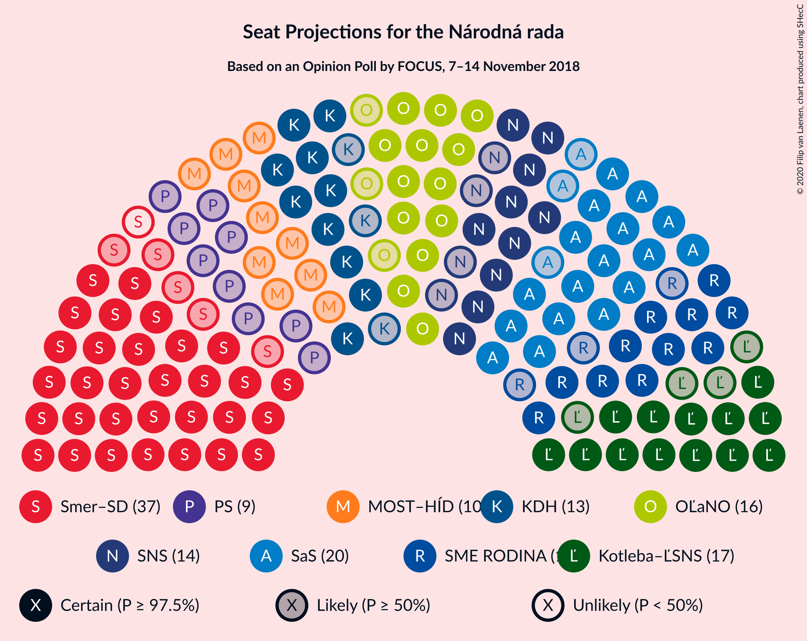
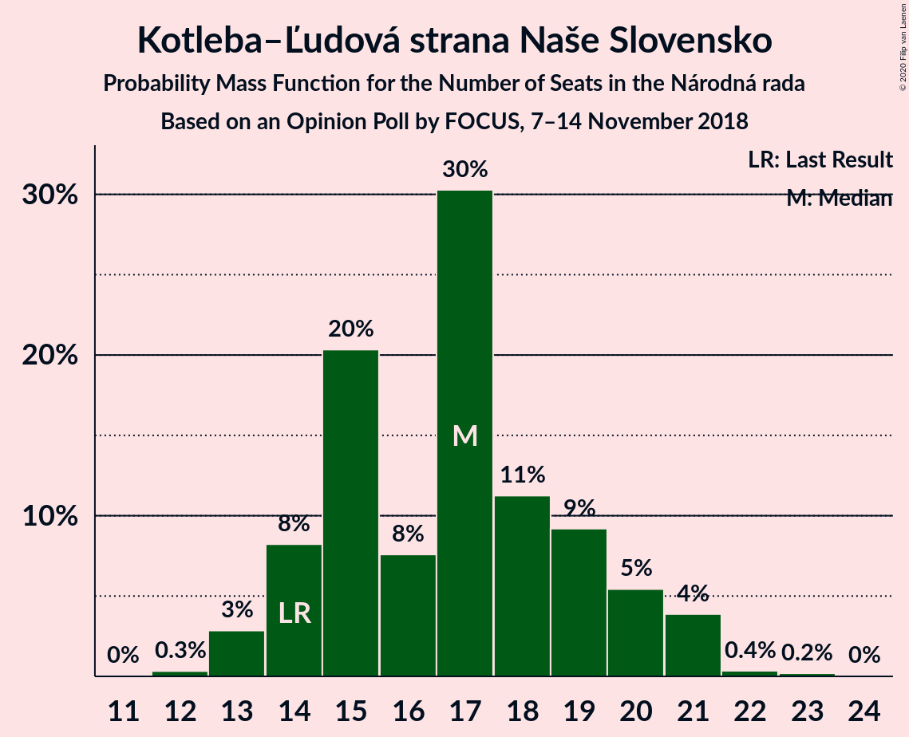
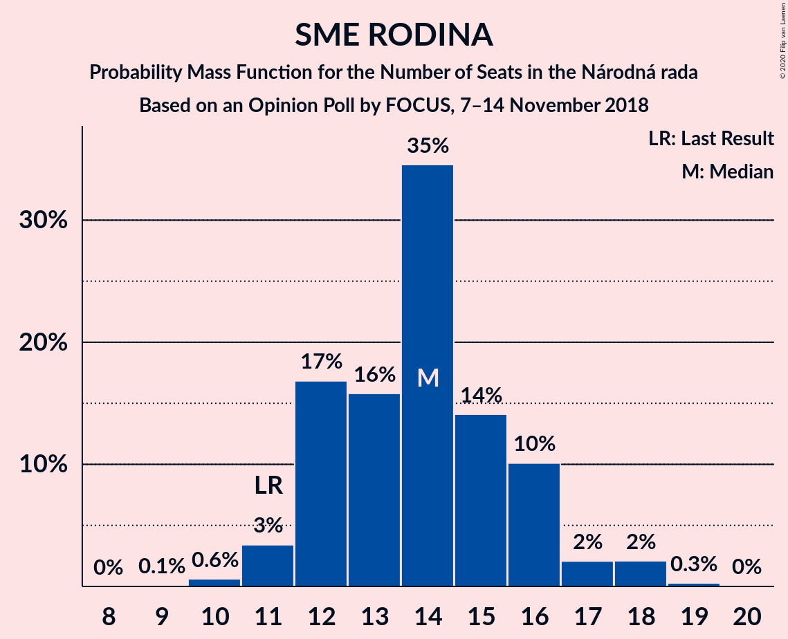
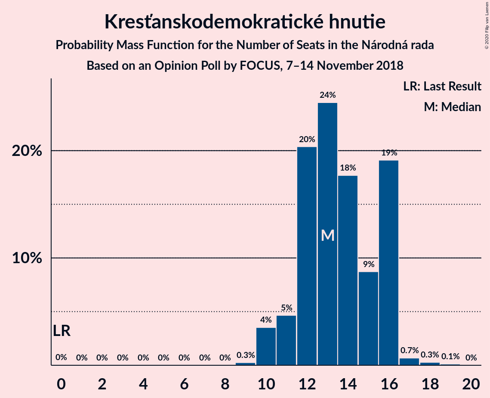

# Opinion Poll by FOCUS, 7–14 November 2018

<a href="#voting-intentions">Voting Intentions</a> | <a href="#seats">Seats</a> | <a href="#coalitions">Coalitions</a> | <a href="#technical-information">Technical Information</a>

## Voting Intentions

### Confidence Intervals

| Party | Last Result | Poll Result | 80% Confidence Interval | 90% Confidence Interval | 95% Confidence Interval | 99% Confidence Interval |
|:-----:|:-----------:|:-----------:|:-----------------------:|:-----------------------:|:-----------------------:|:-----------------------:|
| SMER–sociálna demokracia | 28.3% | 20.9% | 19.4–22.7% |18.9–23.2% |18.5–23.6% |17.8–24.4% |
| Sloboda a Solidarita | 12.1% | 12.0% | 10.7–13.4% |10.4–13.8% |10.1–14.1% |9.5–14.8% |
| Kotleba–Ľudová strana Naše Slovensko | 8.0% | 9.8% | 8.7–11.1% |8.4–11.4% |8.1–11.8% |7.6–12.4% |
| OBYČAJNÍ ĽUDIA a nezávislé osobnosti | 11.0% | 9.5% | 8.4–10.8% |8.1–11.1% |7.8–11.5% |7.3–12.1% |
| SME RODINA | 6.6% | 8.1% | 7.1–9.3% |6.8–9.6% |6.6–10.0% |6.1–10.6% |
| Slovenská národná strana | 8.6% | 8.0% | 7.0–9.2% |6.7–9.5% |6.5–9.8% |6.0–10.5% |
| Kresťanskodemokratické hnutie | 4.9% | 7.7% | 6.7–8.9% |6.4–9.2% |6.2–9.5% |5.8–10.1% |
| MOST–HÍD | 6.5% | 5.9% | 5.1–7.0% |4.8–7.3% |4.6–7.6% |4.3–8.1% |
| Progresívne Slovensko | 0.0% | 5.3% | 4.5–6.4% |4.3–6.6% |4.1–6.9% |3.7–7.4% |
| SPOLU–Občianska Demokracia | 0.0% | 5.0% | 4.3–6.0% |4.0–6.3% |3.9–6.6% |3.5–7.1% |
| Strana maďarskej koalície–Magyar Koalíció Pártja | 4.0% | 3.6% | 2.9–4.4% |2.7–4.7% |2.6–4.9% |2.3–5.3% |

*Note:* The poll result column reflects the actual value used in the calculations. Published results may vary slightly, and in addition be rounded to fewer digits.

## Seats

### Confidence Intervals

| Party | Last Result | Median | 80% Confidence Interval | 90% Confidence Interval | 95% Confidence Interval | 99% Confidence Interval |
|:-----:|:-----------:|:------:|:-----------------------:|:-----------------------:|:-----------------------:|:-----------------------:|
| <a href="#smer–sociálna-demokracia">SMER–sociálna demokracia</a> | 49 | 36 | 33–39 |32–39 |31–39 |29–42 |
| <a href="#sloboda-a-solidarita">Sloboda a Solidarita</a> | 21 | 19 | 18–23 |17–27 |17–27 |16–27 |
| <a href="#kotleba–ľudová-strana-naše-slovensko">Kotleba–Ľudová strana Naše Slovensko</a> | 14 | 17 | 14–21 |14–21 |13–21 |13–22 |
| <a href="#obyčajní-ľudia-a-nezávislé-osobnosti">OBYČAJNÍ ĽUDIA a nezávislé osobnosti</a> | 17 | 16 | 14–19 |14–20 |13–20 |12–20 |
| <a href="#sme-rodina">SME RODINA</a> | 11 | 14 | 12–16 |12–17 |11–18 |10–18 |
| <a href="#slovenská-národná-strana">Slovenská národná strana</a> | 15 | 13 | 10–14 |10–15 |10–16 |10–17 |
| <a href="#kresťanskodemokratické-hnutie">Kresťanskodemokratické hnutie</a> | 0 | 14 | 12–15 |11–15 |11–16 |10–17 |
| <a href="#most–híd">MOST–HÍD</a> | 11 | 10 | 8–11 |0–12 |0–12 |0–14 |
| <a href="#progresívne-slovensko">Progresívne Slovensko</a> | 0 | 0 | 0–11 |0–12 |0–12 |0–12 |
| <a href="#spolu–občianska-demokracia">SPOLU–Občianska Demokracia</a> | 0 | 0 | 0–10 |0–11 |0–11 |0–11 |
| <a href="#strana-maďarskej-koalície–magyar-koalíció-pártja">Strana maďarskej koalície–Magyar Koalíció Pártja</a> | 0 | 0 | 0 |0 |0 |0–9 |

### SMER–sociálna demokracia

*For a full overview of the results for this party, see the [SMER–sociálna demokracia](party-smer–sociálnademokracia.html) page.*

| Number of Seats | Probability | Accumulated | Special Marks |
|:---------------:|:-----------:|:-----------:|:-------------:|
| 28 | 0% | 100% |  |
| 29 | 0.8% | 99.9% |  |
| 30 | 1.2% | 99.1% |  |
| 31 | 0.8% | 98% |  |
| 32 | 2% | 97% |  |
| 33 | 5% | 95% |  |
| 34 | 9% | 90% |  |
| 35 | 24% | 80% |  |
| 36 | 7% | 56% | Median |
| 37 | 5% | 48% |  |
| 38 | 15% | 44% |  |
| 39 | 27% | 29% |  |
| 40 | 0.4% | 1.4% |  |
| 41 | 0.3% | 0.9% |  |
| 42 | 0.3% | 0.7% |  |
| 43 | 0.1% | 0.4% |  |
| 44 | 0.1% | 0.3% |  |
| 45 | 0.2% | 0.2% |  |
| 46 | 0% | 0% |  |
| 47 | 0% | 0% |  |
| 48 | 0% | 0% |  |
| 49 | 0% | 0% | Last Result |

### Sloboda a Solidarita

*For a full overview of the results for this party, see the [Sloboda a Solidarita](party-slobodaasolidarita.html) page.*

| Number of Seats | Probability | Accumulated | Special Marks |
|:---------------:|:-----------:|:-----------:|:-------------:|
| 15 | 0.1% | 100% |  |
| 16 | 1.0% | 99.9% |  |
| 17 | 5% | 98.8% |  |
| 18 | 19% | 94% |  |
| 19 | 29% | 75% | Median |
| 20 | 4% | 46% |  |
| 21 | 10% | 41% | Last Result |
| 22 | 20% | 31% |  |
| 23 | 4% | 11% |  |
| 24 | 1.4% | 7% |  |
| 25 | 0.4% | 6% |  |
| 26 | 0.2% | 6% |  |
| 27 | 5% | 5% |  |
| 28 | 0% | 0% |  |

### Kotleba–Ľudová strana Naše Slovensko

*For a full overview of the results for this party, see the [Kotleba–Ľudová strana Naše Slovensko](party-kotleba–ľudovástrananašeslovensko.html) page.*

| Number of Seats | Probability | Accumulated | Special Marks |
|:---------------:|:-----------:|:-----------:|:-------------:|
| 12 | 0.4% | 100% |  |
| 13 | 4% | 99.6% |  |
| 14 | 6% | 96% | Last Result |
| 15 | 7% | 90% |  |
| 16 | 9% | 83% |  |
| 17 | 27% | 74% | Median |
| 18 | 2% | 47% |  |
| 19 | 3% | 45% |  |
| 20 | 15% | 42% |  |
| 21 | 25% | 27% |  |
| 22 | 2% | 2% |  |
| 23 | 0.1% | 0.2% |  |
| 24 | 0% | 0% |  |

### OBYČAJNÍ ĽUDIA a nezávislé osobnosti

*For a full overview of the results for this party, see the [OBYČAJNÍ ĽUDIA a nezávislé osobnosti](party-obyčajníľudiaanezávisléosobnosti.html) page.*

| Number of Seats | Probability | Accumulated | Special Marks |
|:---------------:|:-----------:|:-----------:|:-------------:|
| 11 | 0.2% | 100% |  |
| 12 | 0.3% | 99.8% |  |
| 13 | 4% | 99.5% |  |
| 14 | 13% | 95% |  |
| 15 | 16% | 82% |  |
| 16 | 26% | 66% | Median |
| 17 | 6% | 40% | Last Result |
| 18 | 2% | 34% |  |
| 19 | 25% | 32% |  |
| 20 | 6% | 7% |  |
| 21 | 0.4% | 0.5% |  |
| 22 | 0% | 0.1% |  |
| 23 | 0.1% | 0.1% |  |
| 24 | 0% | 0% |  |

### SME RODINA

*For a full overview of the results for this party, see the [SME RODINA](party-smerodina.html) page.*

| Number of Seats | Probability | Accumulated | Special Marks |
|:---------------:|:-----------:|:-----------:|:-------------:|
| 9 | 0.3% | 100% |  |
| 10 | 1.3% | 99.7% |  |
| 11 | 2% | 98% | Last Result |
| 12 | 11% | 96% |  |
| 13 | 19% | 86% |  |
| 14 | 34% | 67% | Median |
| 15 | 4% | 33% |  |
| 16 | 22% | 29% |  |
| 17 | 3% | 7% |  |
| 18 | 4% | 4% |  |
| 19 | 0.1% | 0.2% |  |
| 20 | 0% | 0% |  |

### Slovenská národná strana

*For a full overview of the results for this party, see the [Slovenská národná strana](party-slovenskánárodnástrana.html) page.*

| Number of Seats | Probability | Accumulated | Special Marks |
|:---------------:|:-----------:|:-----------:|:-------------:|
| 10 | 18% | 100% |  |
| 11 | 3% | 82% |  |
| 12 | 8% | 79% |  |
| 13 | 37% | 71% | Median |
| 14 | 26% | 34% |  |
| 15 | 5% | 8% | Last Result |
| 16 | 2% | 3% |  |
| 17 | 0.6% | 0.9% |  |
| 18 | 0.3% | 0.3% |  |
| 19 | 0% | 0.1% |  |
| 20 | 0.1% | 0.1% |  |
| 21 | 0% | 0% |  |

### Kresťanskodemokratické hnutie

*For a full overview of the results for this party, see the [Kresťanskodemokratické hnutie](party-kresťanskodemokratickéhnutie.html) page.*

| Number of Seats | Probability | Accumulated | Special Marks |
|:---------------:|:-----------:|:-----------:|:-------------:|
| 0 | 0% | 100% | Last Result |
| 1 | 0% | 100% |  |
| 2 | 0% | 100% |  |
| 3 | 0% | 100% |  |
| 4 | 0% | 100% |  |
| 5 | 0% | 100% |  |
| 6 | 0% | 100% |  |
| 7 | 0% | 100% |  |
| 8 | 0.1% | 100% |  |
| 9 | 0% | 99.9% |  |
| 10 | 2% | 99.9% |  |
| 11 | 4% | 98% |  |
| 12 | 23% | 94% |  |
| 13 | 17% | 71% |  |
| 14 | 9% | 54% | Median |
| 15 | 41% | 45% |  |
| 16 | 3% | 4% |  |
| 17 | 1.3% | 1.4% |  |
| 18 | 0% | 0.1% |  |
| 19 | 0% | 0% |  |

### MOST–HÍD

*For a full overview of the results for this party, see the [MOST–HÍD](party-most–híd.html) page.*

| Number of Seats | Probability | Accumulated | Special Marks |
|:---------------:|:-----------:|:-----------:|:-------------:|
| 0 | 6% | 100% |  |
| 1 | 0% | 94% |  |
| 2 | 0% | 94% |  |
| 3 | 0% | 94% |  |
| 4 | 0% | 94% |  |
| 5 | 0% | 94% |  |
| 6 | 0% | 94% |  |
| 7 | 0% | 94% |  |
| 8 | 7% | 94% |  |
| 9 | 8% | 87% |  |
| 10 | 64% | 79% | Median |
| 11 | 9% | 15% | Last Result |
| 12 | 4% | 6% |  |
| 13 | 0.7% | 2% |  |
| 14 | 2% | 2% |  |
| 15 | 0% | 0% |  |

### Progresívne Slovensko

*For a full overview of the results for this party, see the [Progresívne Slovensko](party-progresívneslovensko.html) page.*

| Number of Seats | Probability | Accumulated | Special Marks |
|:---------------:|:-----------:|:-----------:|:-------------:|
| 0 | 51% | 100% | Last Result, Median |
| 1 | 0% | 49% |  |
| 2 | 0% | 49% |  |
| 3 | 0% | 49% |  |
| 4 | 0% | 49% |  |
| 5 | 0% | 49% |  |
| 6 | 0% | 49% |  |
| 7 | 0% | 49% |  |
| 8 | 6% | 49% |  |
| 9 | 14% | 43% |  |
| 10 | 5% | 29% |  |
| 11 | 17% | 25% |  |
| 12 | 7% | 8% |  |
| 13 | 0.1% | 0.2% |  |
| 14 | 0% | 0% |  |

### SPOLU–Občianska Demokracia

*For a full overview of the results for this party, see the [SPOLU–Občianska Demokracia](party-spolu–občianskademokracia.html) page.*

| Number of Seats | Probability | Accumulated | Special Marks |
|:---------------:|:-----------:|:-----------:|:-------------:|
| 0 | 61% | 100% | Last Result, Median |
| 1 | 0% | 39% |  |
| 2 | 0% | 39% |  |
| 3 | 0% | 39% |  |
| 4 | 0% | 39% |  |
| 5 | 0% | 39% |  |
| 6 | 0% | 39% |  |
| 7 | 0% | 39% |  |
| 8 | 18% | 39% |  |
| 9 | 6% | 21% |  |
| 10 | 6% | 16% |  |
| 11 | 9% | 10% |  |
| 12 | 0.1% | 0.2% |  |
| 13 | 0.1% | 0.1% |  |
| 14 | 0% | 0% |  |

### Strana maďarskej koalície–Magyar Koalíció Pártja

*For a full overview of the results for this party, see the [Strana maďarskej koalície–Magyar Koalíció Pártja](party-stranamaďarskejkoalície–magyarkoalíciópártja.html) page.*

| Number of Seats | Probability | Accumulated | Special Marks |
|:---------------:|:-----------:|:-----------:|:-------------:|
| 0 | 98% | 100% | Last Result, Median |
| 1 | 0% | 2% |  |
| 2 | 0% | 2% |  |
| 3 | 0% | 2% |  |
| 4 | 0% | 2% |  |
| 5 | 0% | 2% |  |
| 6 | 0% | 2% |  |
| 7 | 0% | 2% |  |
| 8 | 0.6% | 2% |  |
| 9 | 1.2% | 1.2% |  |
| 10 | 0% | 0% |  |

## Coalitions

### Confidence Intervals

| Coalition | Last Result | Median | Majority? | 80% Confidence Interval | 90% Confidence Interval | 95% Confidence Interval | 99% Confidence Interval |
|:---------:|:-----------:|:------:|:---------:|:-----------------------:|:-----------------------:|:-----------------------:|:-----------------------:|
| SMER–sociálna demokracia – Slovenská národná strana – MOST–HÍD | 75 | 59 | 0% | 55–62 | 48–62 | 46–63 | 46–65 |
| SMER–sociálna demokracia | 49 | 36 | 0% | 33–39 | 32–39 | 31–39 | 29–42 |

### SMER–sociálna demokracia – Slovenská národná strana – MOST–HÍD

| Number of Seats | Probability | Accumulated | Special Marks |
|:---------------:|:-----------:|:-----------:|:-------------:|
| 43 | 0.1% | 100% |  |
| 44 | 0% | 99.9% |  |
| 45 | 0% | 99.9% |  |
| 46 | 3% | 99.9% |  |
| 47 | 0.1% | 97% |  |
| 48 | 2% | 96% |  |
| 49 | 0.1% | 95% |  |
| 50 | 0% | 95% |  |
| 51 | 0.3% | 95% |  |
| 52 | 2% | 94% |  |
| 53 | 0.2% | 92% |  |
| 54 | 0.9% | 92% |  |
| 55 | 16% | 91% |  |
| 56 | 2% | 75% |  |
| 57 | 12% | 73% |  |
| 58 | 1.2% | 61% |  |
| 59 | 10% | 60% | Median |
| 60 | 6% | 50% |  |
| 61 | 2% | 44% |  |
| 62 | 38% | 42% |  |
| 63 | 1.3% | 4% |  |
| 64 | 0.4% | 2% |  |
| 65 | 1.5% | 2% |  |
| 66 | 0.1% | 0.4% |  |
| 67 | 0.3% | 0.4% |  |
| 68 | 0% | 0.1% |  |
| 69 | 0% | 0% |  |
| 70 | 0% | 0% |  |
| 71 | 0% | 0% |  |
| 72 | 0% | 0% |  |
| 73 | 0% | 0% |  |
| 74 | 0% | 0% |  |
| 75 | 0% | 0% | Last Result |

### SMER–sociálna demokracia

| Number of Seats | Probability | Accumulated | Special Marks |
|:---------------:|:-----------:|:-----------:|:-------------:|
| 28 | 0% | 100% |  |
| 29 | 0.8% | 99.9% |  |
| 30 | 1.2% | 99.1% |  |
| 31 | 0.8% | 98% |  |
| 32 | 2% | 97% |  |
| 33 | 5% | 95% |  |
| 34 | 9% | 90% |  |
| 35 | 24% | 80% |  |
| 36 | 7% | 56% | Median |
| 37 | 5% | 48% |  |
| 38 | 15% | 44% |  |
| 39 | 27% | 29% |  |
| 40 | 0.4% | 1.4% |  |
| 41 | 0.3% | 0.9% |  |
| 42 | 0.3% | 0.7% |  |
| 43 | 0.1% | 0.4% |  |
| 44 | 0.1% | 0.3% |  |
| 45 | 0.2% | 0.2% |  |
| 46 | 0% | 0% |  |
| 47 | 0% | 0% |  |
| 48 | 0% | 0% |  |
| 49 | 0% | 0% | Last Result |

## Technical Information

### Opinion Poll

+ **Polling firm:** FOCUS
+ **Commissioner(s):** —
+ **Fieldwork period:** 7–14 November 2018

### Calculations

+ **Sample size:** 1012
+ **Simulations done:** 131,072
+ **Error estimate:** 2.15%

