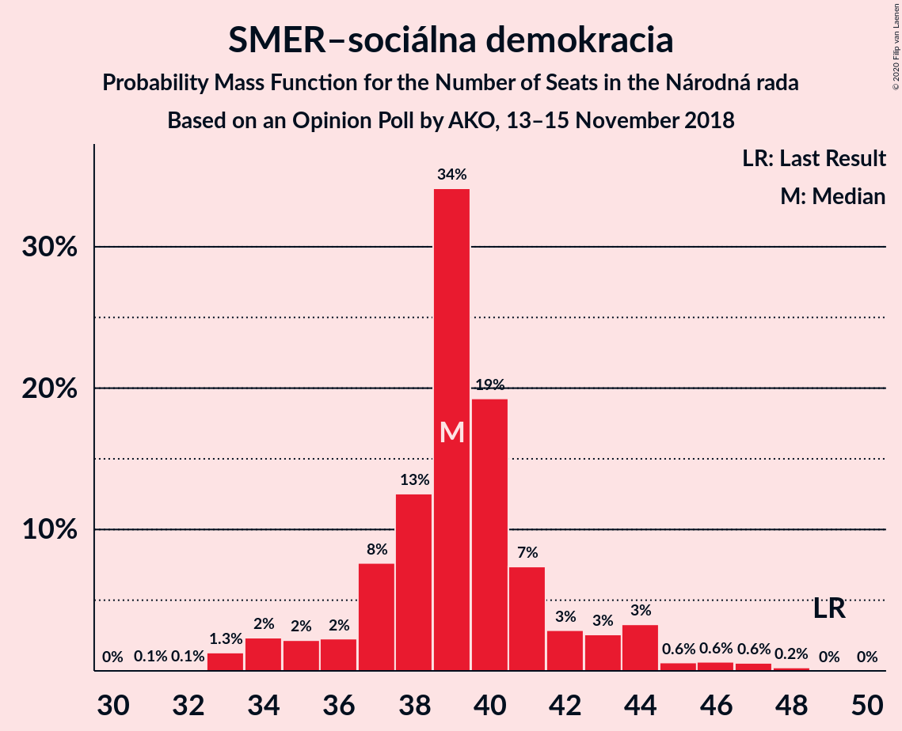
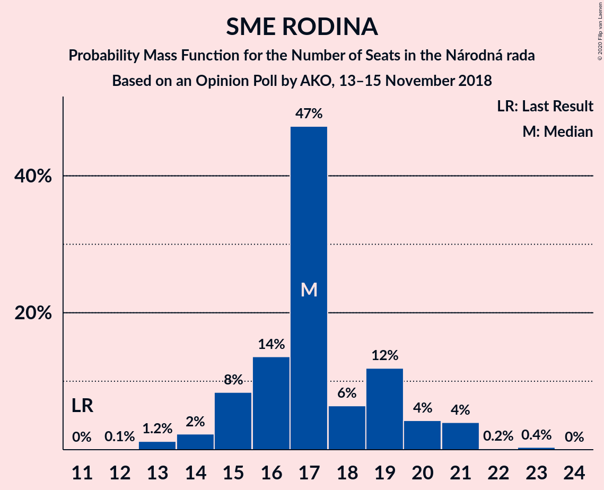
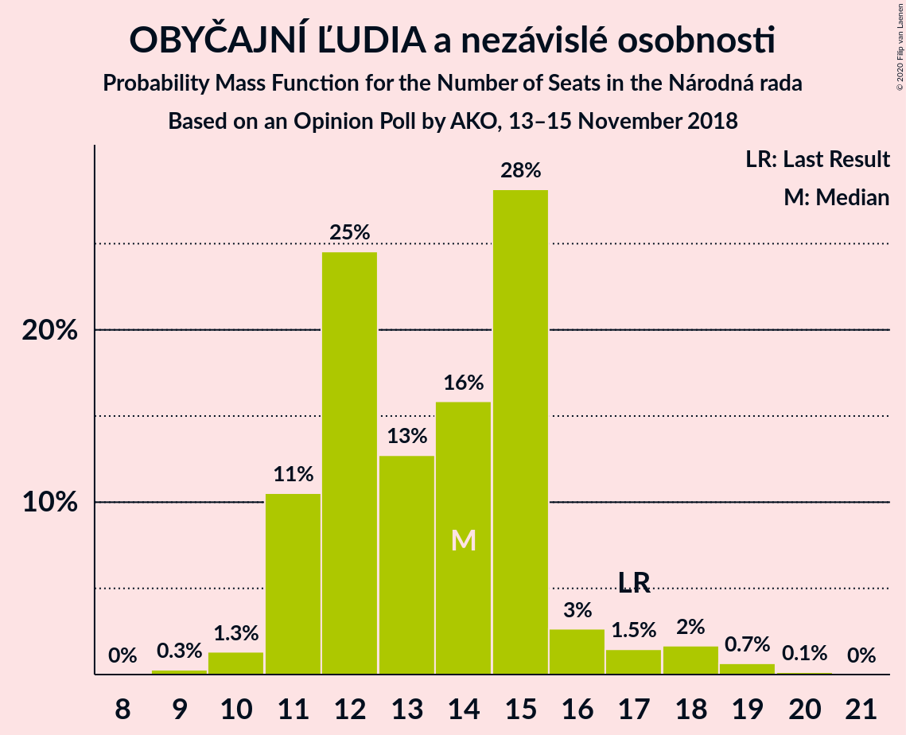
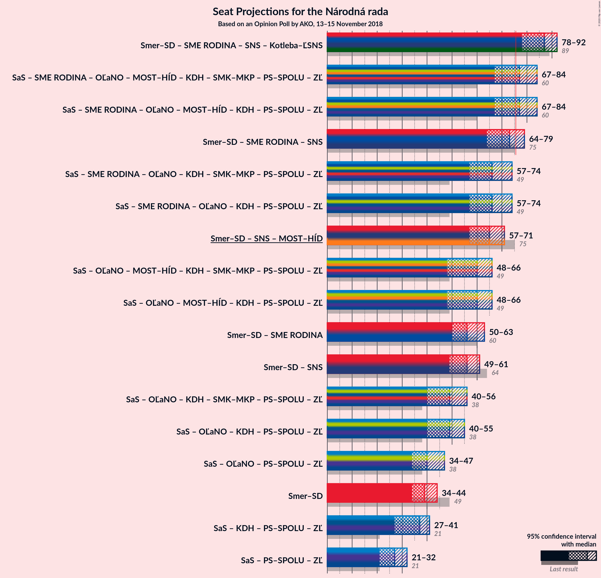

# Opinion Poll by AKO, 13–15 November 2018

<a href="#voting-intentions">Voting Intentions</a> | <a href="#seats">Seats</a> | <a href="#coalitions">Coalitions</a> | <a href="#technical-information">Technical Information</a>

## Voting Intentions

### Confidence Intervals

| Party | Last Result | Poll Result | 80% Confidence Interval | 90% Confidence Interval | 95% Confidence Interval | 99% Confidence Interval |
|:-----:|:-----------:|:-----------:|:-----------------------:|:-----------------------:|:-----------------------:|:-----------------------:|
| SMER–sociálna demokracia | 28.3% | 23.9% | 22.2–25.7% |21.8–26.2% |21.4–26.6% |20.6–27.5% |
| Sloboda a Solidarita | 12.1% | 16.1% | 14.7–17.7% |14.3–18.1% |13.9–18.5% |13.3–19.3% |
| SME RODINA | 6.6% | 10.4% | 9.3–11.7% |8.9–12.1% |8.7–12.5% |8.1–13.1% |
| Slovenská národná strana | 8.6% | 9.2% | 8.1–10.5% |7.8–10.8% |7.6–11.2% |7.1–11.8% |
| OBYČAJNÍ ĽUDIA a nezávislé osobnosti | 11.0% | 8.1% | 7.1–9.3% |6.8–9.7% |6.6–10.0% |6.1–10.6% |
| Kotleba–Ľudová strana Naše Slovensko | 8.0% | 7.8% | 6.8–9.0% |6.5–9.3% |6.3–9.6% |5.8–10.2% |
| MOST–HÍD | 6.5% | 6.1% | 5.2–7.2% |5.0–7.5% |4.8–7.8% |4.4–8.3% |
| Kresťanskodemokratické hnutie | 4.9% | 5.9% | 5.0–7.0% |4.8–7.3% |4.6–7.5% |4.2–8.1% |
| Progresívne Slovensko | 0.0% | 5.0% | 4.2–6.0% |4.0–6.3% |3.8–6.5% |3.5–7.1% |
| SPOLU–Občianska Demokracia | 0.0% | 4.2% | 3.5–5.1% |3.3–5.4% |3.1–5.6% |2.8–6.1% |
| Strana maďarskej koalície–Magyar Koalíció Pártja | 4.0% | 3.2% | 2.6–4.0% |2.4–4.3% |2.3–4.5% |2.0–4.9% |

*Note:* The poll result column reflects the actual value used in the calculations. Published results may vary slightly, and in addition be rounded to fewer digits.

## Seats

### Confidence Intervals

| Party | Last Result | Median | 80% Confidence Interval | 90% Confidence Interval | 95% Confidence Interval | 99% Confidence Interval |
|:-----:|:-----------:|:------:|:-----------------------:|:-----------------------:|:-----------------------:|:-----------------------:|
| <a href="#smer–sociálna-demokracia">SMER–sociálna demokracia</a> | 49 | 39 | 36–44 |35–44 |35–44 |33–45 |
| <a href="#sloboda-a-solidarita">Sloboda a Solidarita</a> | 21 | 22 | 22–28 |22–32 |22–32 |22–33 |
| <a href="#sme-rodina">SME RODINA</a> | 11 | 19 | 14–19 |13–19 |13–21 |13–23 |
| <a href="#slovenská-národná-strana">Slovenská národná strana</a> | 15 | 13 | 13–15 |12–18 |12–19 |12–21 |
| <a href="#obyčajní-ľudia-a-nezávislé-osobnosti">OBYČAJNÍ ĽUDIA a nezávislé osobnosti</a> | 17 | 14 | 11–14 |11–15 |11–16 |11–17 |
| <a href="#kotleba–ľudová-strana-naše-slovensko">Kotleba–Ľudová strana Naše Slovensko</a> | 14 | 13 | 13–14 |12–15 |11–15 |10–16 |
| <a href="#most–híd">MOST–HÍD</a> | 11 | 10 | 9–10 |9–12 |9–12 |0–13 |
| <a href="#kresťanskodemokratické-hnutie">Kresťanskodemokratické hnutie</a> | 0 | 10 | 9–10 |8–11 |0–11 |0–12 |
| <a href="#progresívne-slovensko">Progresívne Slovensko</a> | 0 | 10 | 0–10 |0–10 |0–10 |0–12 |
| <a href="#spolu–občianska-demokracia">SPOLU–Občianska Demokracia</a> | 0 | 0 | 0 |0–9 |0–9 |0–10 |
| <a href="#strana-maďarskej-koalície–magyar-koalíció-pártja">Strana maďarskej koalície–Magyar Koalíció Pártja</a> | 0 | 0 | 0 |0 |0 |0–8 |

### SMER–sociálna demokracia

*For a full overview of the results for this party, see the [SMER–sociálna demokracia](party-smer–sociálnademokracia.html) page.*

| Number of Seats | Probability | Accumulated | Special Marks |
|:---------------:|:-----------:|:-----------:|:-------------:|
| 31 | 0% | 100% |  |
| 32 | 0.1% | 99.9% |  |
| 33 | 0.9% | 99.9% |  |
| 34 | 0.1% | 99.0% |  |
| 35 | 5% | 98.9% |  |
| 36 | 6% | 93% |  |
| 37 | 1.2% | 87% |  |
| 38 | 0.4% | 86% |  |
| 39 | 61% | 85% | Median |
| 40 | 2% | 25% |  |
| 41 | 0.3% | 23% |  |
| 42 | 8% | 22% |  |
| 43 | 0.9% | 14% |  |
| 44 | 12% | 13% |  |
| 45 | 1.4% | 2% |  |
| 46 | 0.1% | 0.3% |  |
| 47 | 0% | 0.2% |  |
| 48 | 0% | 0.2% |  |
| 49 | 0.1% | 0.2% | Last Result |
| 50 | 0% | 0% |  |

### Sloboda a Solidarita

*For a full overview of the results for this party, see the [Sloboda a Solidarita](party-slobodaasolidarita.html) page.*

| Number of Seats | Probability | Accumulated | Special Marks |
|:---------------:|:-----------:|:-----------:|:-------------:|
| 21 | 0.1% | 100% | Last Result |
| 22 | 71% | 99.8% | Median |
| 23 | 0.6% | 29% |  |
| 24 | 0.6% | 29% |  |
| 25 | 2% | 28% |  |
| 26 | 14% | 26% |  |
| 27 | 1.0% | 12% |  |
| 28 | 2% | 11% |  |
| 29 | 2% | 9% |  |
| 30 | 2% | 7% |  |
| 31 | 0.3% | 6% |  |
| 32 | 5% | 5% |  |
| 33 | 0.4% | 0.5% |  |
| 34 | 0% | 0.1% |  |
| 35 | 0% | 0% |  |

### SME RODINA

*For a full overview of the results for this party, see the [SME RODINA](party-smerodina.html) page.*

| Number of Seats | Probability | Accumulated | Special Marks |
|:---------------:|:-----------:|:-----------:|:-------------:|
| 11 | 0% | 100% | Last Result |
| 12 | 0.1% | 100% |  |
| 13 | 7% | 99.9% |  |
| 14 | 4% | 93% |  |
| 15 | 5% | 88% |  |
| 16 | 5% | 83% |  |
| 17 | 4% | 78% |  |
| 18 | 1.4% | 75% |  |
| 19 | 69% | 74% | Median |
| 20 | 2% | 5% |  |
| 21 | 1.5% | 3% |  |
| 22 | 0.1% | 1.2% |  |
| 23 | 1.1% | 1.1% |  |
| 24 | 0% | 0% |  |

### Slovenská národná strana

*For a full overview of the results for this party, see the [Slovenská národná strana](party-slovenskánárodnástrana.html) page.*

| Number of Seats | Probability | Accumulated | Special Marks |
|:---------------:|:-----------:|:-----------:|:-------------:|
| 11 | 0.2% | 100% |  |
| 12 | 5% | 99.7% |  |
| 13 | 63% | 95% | Median |
| 14 | 18% | 32% |  |
| 15 | 5% | 14% | Last Result |
| 16 | 2% | 9% |  |
| 17 | 0.8% | 8% |  |
| 18 | 3% | 7% |  |
| 19 | 2% | 4% |  |
| 20 | 0.2% | 1.4% |  |
| 21 | 1.2% | 1.2% |  |
| 22 | 0% | 0% |  |

### OBYČAJNÍ ĽUDIA a nezávislé osobnosti

*For a full overview of the results for this party, see the [OBYČAJNÍ ĽUDIA a nezávislé osobnosti](party-obyčajníľudiaanezávisléosobnosti.html) page.*

| Number of Seats | Probability | Accumulated | Special Marks |
|:---------------:|:-----------:|:-----------:|:-------------:|
| 9 | 0.1% | 100% |  |
| 10 | 0.4% | 99.9% |  |
| 11 | 13% | 99.6% |  |
| 12 | 5% | 87% |  |
| 13 | 3% | 81% |  |
| 14 | 71% | 79% | Median |
| 15 | 5% | 8% |  |
| 16 | 2% | 3% |  |
| 17 | 2% | 2% | Last Result |
| 18 | 0.1% | 0.2% |  |
| 19 | 0% | 0% |  |

### Kotleba–Ľudová strana Naše Slovensko

*For a full overview of the results for this party, see the [Kotleba–Ľudová strana Naše Slovensko](party-kotleba–ľudovástrananašeslovensko.html) page.*

| Number of Seats | Probability | Accumulated | Special Marks |
|:---------------:|:-----------:|:-----------:|:-------------:|
| 9 | 0.1% | 100% |  |
| 10 | 0.6% | 99.8% |  |
| 11 | 4% | 99.3% |  |
| 12 | 2% | 95% |  |
| 13 | 69% | 93% | Median |
| 14 | 18% | 24% | Last Result |
| 15 | 6% | 6% |  |
| 16 | 0.6% | 0.7% |  |
| 17 | 0.1% | 0.1% |  |
| 18 | 0% | 0% |  |

### MOST–HÍD

*For a full overview of the results for this party, see the [MOST–HÍD](party-most–híd.html) page.*

| Number of Seats | Probability | Accumulated | Special Marks |
|:---------------:|:-----------:|:-----------:|:-------------:|
| 0 | 1.0% | 100% |  |
| 1 | 0% | 99.0% |  |
| 2 | 0% | 99.0% |  |
| 3 | 0% | 99.0% |  |
| 4 | 0% | 99.0% |  |
| 5 | 0% | 99.0% |  |
| 6 | 0% | 99.0% |  |
| 7 | 0% | 99.0% |  |
| 8 | 0.4% | 99.0% |  |
| 9 | 29% | 98.6% |  |
| 10 | 63% | 69% | Median |
| 11 | 0.4% | 6% | Last Result |
| 12 | 4% | 6% |  |
| 13 | 1.5% | 2% |  |
| 14 | 0.1% | 0.2% |  |
| 15 | 0.1% | 0.1% |  |
| 16 | 0% | 0% |  |

### Kresťanskodemokratické hnutie

*For a full overview of the results for this party, see the [Kresťanskodemokratické hnutie](party-kresťanskodemokratickéhnutie.html) page.*

| Number of Seats | Probability | Accumulated | Special Marks |
|:---------------:|:-----------:|:-----------:|:-------------:|
| 0 | 5% | 100% | Last Result |
| 1 | 0% | 95% |  |
| 2 | 0% | 95% |  |
| 3 | 0% | 95% |  |
| 4 | 0% | 95% |  |
| 5 | 0% | 95% |  |
| 6 | 0% | 95% |  |
| 7 | 0% | 95% |  |
| 8 | 2% | 95% |  |
| 9 | 17% | 93% |  |
| 10 | 70% | 76% | Median |
| 11 | 4% | 6% |  |
| 12 | 1.4% | 2% |  |
| 13 | 0.1% | 0.2% |  |
| 14 | 0.1% | 0.1% |  |
| 15 | 0% | 0% |  |

### Progresívne Slovensko

*For a full overview of the results for this party, see the [Progresívne Slovensko](party-progresívneslovensko.html) page.*

| Number of Seats | Probability | Accumulated | Special Marks |
|:---------------:|:-----------:|:-----------:|:-------------:|
| 0 | 12% | 100% | Last Result |
| 1 | 0% | 88% |  |
| 2 | 0% | 88% |  |
| 3 | 0% | 88% |  |
| 4 | 0% | 88% |  |
| 5 | 0% | 88% |  |
| 6 | 0% | 88% |  |
| 7 | 0% | 88% |  |
| 8 | 12% | 88% |  |
| 9 | 13% | 76% |  |
| 10 | 62% | 63% | Median |
| 11 | 0.2% | 0.7% |  |
| 12 | 0.5% | 0.5% |  |
| 13 | 0% | 0% |  |

### SPOLU–Občianska Demokracia

*For a full overview of the results for this party, see the [SPOLU–Občianska Demokracia](party-spolu–občianskademokracia.html) page.*

| Number of Seats | Probability | Accumulated | Special Marks |
|:---------------:|:-----------:|:-----------:|:-------------:|
| 0 | 92% | 100% | Last Result, Median |
| 1 | 0% | 8% |  |
| 2 | 0% | 8% |  |
| 3 | 0% | 8% |  |
| 4 | 0% | 8% |  |
| 5 | 0% | 8% |  |
| 6 | 0% | 8% |  |
| 7 | 0% | 8% |  |
| 8 | 0.4% | 8% |  |
| 9 | 7% | 8% |  |
| 10 | 0.9% | 1.0% |  |
| 11 | 0% | 0% |  |

### Strana maďarskej koalície–Magyar Koalíció Pártja

*For a full overview of the results for this party, see the [Strana maďarskej koalície–Magyar Koalíció Pártja](party-stranamaďarskejkoalície–magyarkoalíciópártja.html) page.*

| Number of Seats | Probability | Accumulated | Special Marks |
|:---------------:|:-----------:|:-----------:|:-------------:|
| 0 | 99.3% | 100% | Last Result, Median |
| 1 | 0% | 0.7% |  |
| 2 | 0% | 0.7% |  |
| 3 | 0% | 0.7% |  |
| 4 | 0% | 0.7% |  |
| 5 | 0% | 0.7% |  |
| 6 | 0% | 0.7% |  |
| 7 | 0% | 0.7% |  |
| 8 | 0.6% | 0.7% |  |
| 9 | 0.1% | 0.1% |  |
| 10 | 0% | 0% |  |

## Coalitions

### Confidence Intervals

| Coalition | Last Result | Median | Majority? | 80% Confidence Interval | 90% Confidence Interval | 95% Confidence Interval | 99% Confidence Interval |
|:---------:|:-----------:|:------:|:---------:|:-----------------------:|:-----------------------:|:-----------------------:|:-----------------------:|
| SMER–sociálna demokracia – Slovenská národná strana – MOST–HÍD | 75 | 62 | 1.2% | 62–67 | 58–68 | 58–70 | 57–76 |
| SMER–sociálna demokracia | 49 | 39 | 0% | 36–44 | 35–44 | 35–44 | 33–45 |

### SMER–sociálna demokracia – Slovenská národná strana – MOST–HÍD

| Number of Seats | Probability | Accumulated | Special Marks |
|:---------------:|:-----------:|:-----------:|:-------------:|
| 53 | 0% | 100% |  |
| 54 | 0% | 99.9% |  |
| 55 | 0.1% | 99.9% |  |
| 56 | 0.2% | 99.8% |  |
| 57 | 0.4% | 99.5% |  |
| 58 | 5% | 99.1% |  |
| 59 | 0.3% | 94% |  |
| 60 | 0.4% | 94% |  |
| 61 | 2% | 93% |  |
| 62 | 62% | 92% | Median |
| 63 | 9% | 30% |  |
| 64 | 4% | 21% |  |
| 65 | 0.4% | 17% |  |
| 66 | 0.4% | 17% |  |
| 67 | 10% | 16% |  |
| 68 | 2% | 6% |  |
| 69 | 2% | 4% |  |
| 70 | 0.3% | 3% |  |
| 71 | 0.6% | 2% |  |
| 72 | 0.1% | 2% |  |
| 73 | 0.3% | 2% |  |
| 74 | 0% | 1.2% |  |
| 75 | 0% | 1.2% | Last Result |
| 76 | 1.2% | 1.2% | Majority |
| 77 | 0% | 0% |  |

### SMER–sociálna demokracia

| Number of Seats | Probability | Accumulated | Special Marks |
|:---------------:|:-----------:|:-----------:|:-------------:|
| 31 | 0% | 100% |  |
| 32 | 0.1% | 99.9% |  |
| 33 | 0.9% | 99.9% |  |
| 34 | 0.1% | 99.0% |  |
| 35 | 5% | 98.9% |  |
| 36 | 6% | 93% |  |
| 37 | 1.2% | 87% |  |
| 38 | 0.4% | 86% |  |
| 39 | 61% | 85% | Median |
| 40 | 2% | 25% |  |
| 41 | 0.3% | 23% |  |
| 42 | 8% | 22% |  |
| 43 | 0.9% | 14% |  |
| 44 | 12% | 13% |  |
| 45 | 1.4% | 2% |  |
| 46 | 0.1% | 0.3% |  |
| 47 | 0% | 0.2% |  |
| 48 | 0% | 0.2% |  |
| 49 | 0.1% | 0.2% | Last Result |
| 50 | 0% | 0% |  |

## Technical Information

### Opinion Poll

+ **Polling firm:** AKO
+ **Commissioner(s):** —
+ **Fieldwork period:** 13–15 November 2018

### Calculations

+ **Sample size:** 1000
+ **Simulations done:** 131,072
+ **Error estimate:** 2.67%

