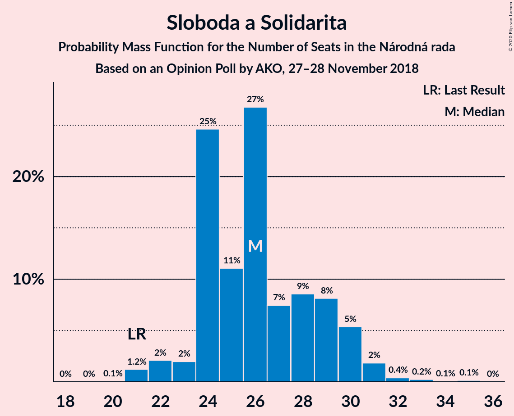
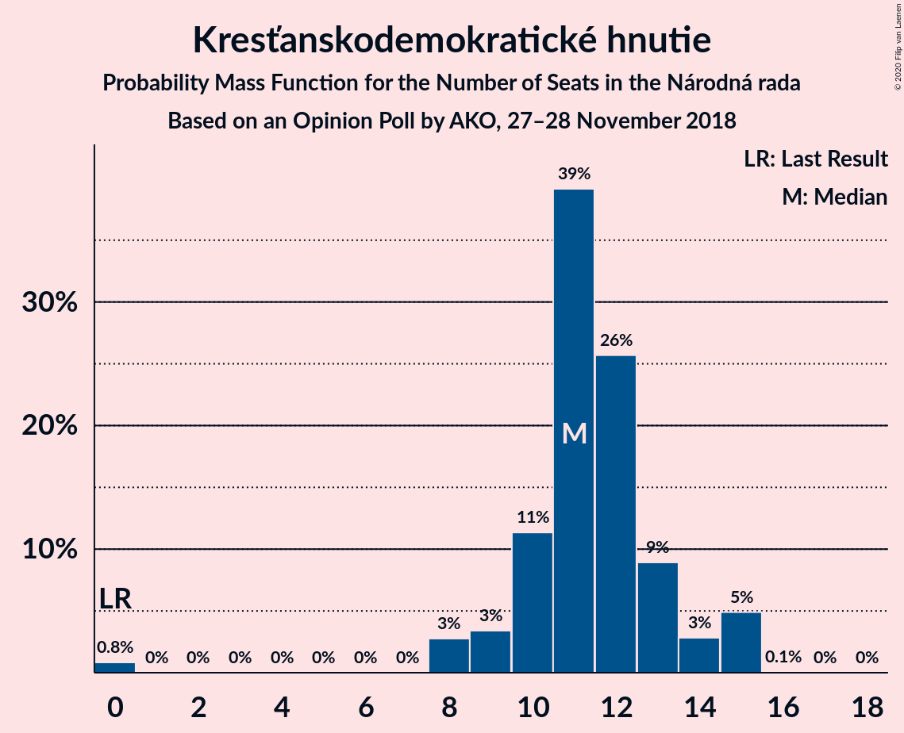
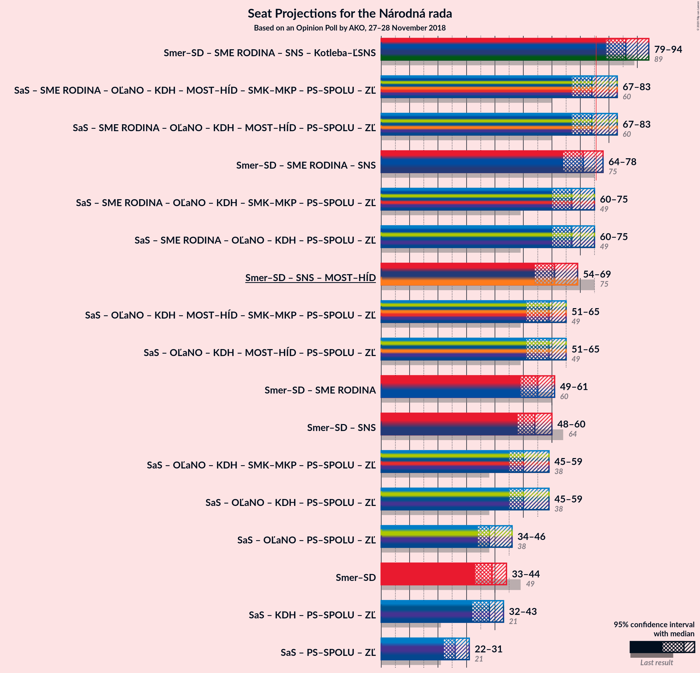

# Opinion Poll by AKO, 27–28 November 2018

<a href="#voting-intentions">Voting Intentions</a> | <a href="#seats">Seats</a> | <a href="#coalitions">Coalitions</a> | <a href="#technical-information">Technical Information</a>

## Voting Intentions

### Confidence Intervals

| Party | Last Result | Poll Result | 80% Confidence Interval | 90% Confidence Interval | 95% Confidence Interval | 99% Confidence Interval |
|:-----:|:-----------:|:-----------:|:-----------------------:|:-----------------------:|:-----------------------:|:-----------------------:|
| SMER–sociálna demokracia | 28.3% | 23.4% | 21.7–25.2% |21.3–25.7% |20.9–26.1% |20.1–27.0% |
| Sloboda a Solidarita | 12.1% | 15.9% | 14.5–17.5% |14.1–17.9% |13.8–18.3% |13.1–19.1% |
| SME RODINA | 6.6% | 10.0% | 8.9–11.3% |8.6–11.7% |8.3–12.0% |7.8–12.7% |
| Slovenská národná strana | 8.6% | 9.3% | 8.2–10.6% |7.9–10.9% |7.7–11.3% |7.2–11.9% |
| Kotleba–Ľudová strana Naše Slovensko | 8.0% | 9.2% | 8.1–10.5% |7.8–10.8% |7.6–11.2% |7.1–11.8% |
| OBYČAJNÍ ĽUDIA a nezávislé osobnosti | 11.0% | 7.7% | 6.7–8.9% |6.4–9.2% |6.2–9.5% |5.8–10.1% |
| Kresťanskodemokratické hnutie | 4.9% | 6.7% | 5.8–7.8% |5.5–8.2% |5.3–8.4% |4.9–9.0% |
| MOST–HÍD | 6.5% | 5.7% | 4.9–6.8% |4.6–7.1% |4.4–7.3% |4.1–7.9% |
| Progresívne Slovensko | 0.0% | 5.3% | 4.5–6.3% |4.3–6.6% |4.1–6.9% |3.7–7.4% |
| SPOLU–Občianska Demokracia | 0.0% | 3.2% | 2.6–4.0% |2.4–4.3% |2.3–4.5% |2.0–4.9% |
| Strana maďarskej koalície–Magyar Koalíció Pártja | 4.0% | 2.4% | 1.9–3.2% |1.7–3.4% |1.6–3.6% |1.4–3.9% |

*Note:* The poll result column reflects the actual value used in the calculations. Published results may vary slightly, and in addition be rounded to fewer digits.

## Seats

### Confidence Intervals

| Party | Last Result | Median | 80% Confidence Interval | 90% Confidence Interval | 95% Confidence Interval | 99% Confidence Interval |
|:-----:|:-----------:|:------:|:-----------------------:|:-----------------------:|:-----------------------:|:-----------------------:|
| <a href="#smer–sociálna-demokracia">SMER–sociálna demokracia</a> | 49 | 39 | 35–43 |35–43 |33–44 |32–47 |
| <a href="#sloboda-a-solidarita">Sloboda a Solidarita</a> | 21 | 26 | 24–29 |23–30 |22–31 |21–32 |
| <a href="#sme-rodina">SME RODINA</a> | 11 | 17 | 15–19 |14–20 |13–20 |12–21 |
| <a href="#slovenská-národná-strana">Slovenská národná strana</a> | 15 | 15 | 13–17 |13–18 |13–19 |12–19 |
| <a href="#kotleba–ľudová-strana-naše-slovensko">Kotleba–Ľudová strana Naše Slovensko</a> | 14 | 15 | 13–18 |13–18 |12–19 |11–20 |
| <a href="#obyčajní-ľudia-a-nezávislé-osobnosti">OBYČAJNÍ ĽUDIA a nezávislé osobnosti</a> | 17 | 12 | 10–15 |10–15 |10–16 |9–18 |
| <a href="#kresťanskodemokratické-hnutie">Kresťanskodemokratické hnutie</a> | 0 | 11 | 10–13 |9–15 |8–15 |0–15 |
| <a href="#most–híd">MOST–HÍD</a> | 11 | 9 | 0–11 |0–12 |0–13 |0–13 |
| <a href="#progresívne-slovensko">Progresívne Slovensko</a> | 0 | 8 | 0–10 |0–11 |0–11 |0–12 |
| <a href="#spolu–občianska-demokracia">SPOLU–Občianska Demokracia</a> | 0 | 0 | 0 |0 |0 |0 |
| <a href="#strana-maďarskej-koalície–magyar-koalíció-pártja">Strana maďarskej koalície–Magyar Koalíció Pártja</a> | 0 | 0 | 0 |0 |0 |0 |

### SMER–sociálna demokracia

*For a full overview of the results for this party, see the [SMER–sociálna demokracia](party-smer–sociálnademokracia.html) page.*

| Number of Seats | Probability | Accumulated | Special Marks |
|:---------------:|:-----------:|:-----------:|:-------------:|
| 31 | 0.1% | 100% |  |
| 32 | 2% | 99.9% |  |
| 33 | 0.9% | 98% |  |
| 34 | 1.2% | 97% |  |
| 35 | 9% | 96% |  |
| 36 | 16% | 87% |  |
| 37 | 4% | 71% |  |
| 38 | 15% | 68% |  |
| 39 | 19% | 52% | Median |
| 40 | 9% | 34% |  |
| 41 | 5% | 24% |  |
| 42 | 2% | 19% |  |
| 43 | 13% | 17% |  |
| 44 | 2% | 4% |  |
| 45 | 0.8% | 2% |  |
| 46 | 0.2% | 0.9% |  |
| 47 | 0.7% | 0.7% |  |
| 48 | 0% | 0.1% |  |
| 49 | 0% | 0% | Last Result |

### Sloboda a Solidarita

*For a full overview of the results for this party, see the [Sloboda a Solidarita](party-slobodaasolidarita.html) page.*

| Number of Seats | Probability | Accumulated | Special Marks |
|:---------------:|:-----------:|:-----------:|:-------------:|
| 20 | 0.1% | 100% |  |
| 21 | 1.2% | 99.9% | Last Result |
| 22 | 2% | 98.7% |  |
| 23 | 2% | 97% |  |
| 24 | 25% | 95% |  |
| 25 | 11% | 70% |  |
| 26 | 27% | 59% | Median |
| 27 | 7% | 32% |  |
| 28 | 9% | 25% |  |
| 29 | 8% | 16% |  |
| 30 | 5% | 8% |  |
| 31 | 2% | 3% |  |
| 32 | 0.4% | 0.8% |  |
| 33 | 0.2% | 0.4% |  |
| 34 | 0.1% | 0.2% |  |
| 35 | 0.1% | 0.1% |  |
| 36 | 0% | 0% |  |

### SME RODINA

*For a full overview of the results for this party, see the [SME RODINA](party-smerodina.html) page.*

| Number of Seats | Probability | Accumulated | Special Marks |
|:---------------:|:-----------:|:-----------:|:-------------:|
| 11 | 0.1% | 100% | Last Result |
| 12 | 0.5% | 99.9% |  |
| 13 | 4% | 99.4% |  |
| 14 | 5% | 96% |  |
| 15 | 17% | 91% |  |
| 16 | 18% | 74% |  |
| 17 | 33% | 56% | Median |
| 18 | 7% | 23% |  |
| 19 | 11% | 16% |  |
| 20 | 5% | 6% |  |
| 21 | 0.7% | 1.0% |  |
| 22 | 0.1% | 0.3% |  |
| 23 | 0.1% | 0.1% |  |
| 24 | 0% | 0% |  |

### Slovenská národná strana

*For a full overview of the results for this party, see the [Slovenská národná strana](party-slovenskánárodnástrana.html) page.*

| Number of Seats | Probability | Accumulated | Special Marks |
|:---------------:|:-----------:|:-----------:|:-------------:|
| 11 | 0.3% | 100% |  |
| 12 | 1.5% | 99.7% |  |
| 13 | 18% | 98% |  |
| 14 | 12% | 80% |  |
| 15 | 24% | 68% | Last Result, Median |
| 16 | 28% | 44% |  |
| 17 | 9% | 16% |  |
| 18 | 3% | 7% |  |
| 19 | 3% | 4% |  |
| 20 | 0.3% | 0.5% |  |
| 21 | 0.2% | 0.2% |  |
| 22 | 0% | 0.1% |  |
| 23 | 0% | 0% |  |

### Kotleba–Ľudová strana Naše Slovensko

*For a full overview of the results for this party, see the [Kotleba–Ľudová strana Naše Slovensko](party-kotleba–ľudovástrananašeslovensko.html) page.*

| Number of Seats | Probability | Accumulated | Special Marks |
|:---------------:|:-----------:|:-----------:|:-------------:|
| 10 | 0.1% | 100% |  |
| 11 | 0.5% | 99.9% |  |
| 12 | 3% | 99.5% |  |
| 13 | 9% | 97% |  |
| 14 | 16% | 88% | Last Result |
| 15 | 27% | 72% | Median |
| 16 | 9% | 45% |  |
| 17 | 24% | 36% |  |
| 18 | 8% | 12% |  |
| 19 | 2% | 4% |  |
| 20 | 2% | 2% |  |
| 21 | 0.1% | 0.1% |  |
| 22 | 0% | 0% |  |

### OBYČAJNÍ ĽUDIA a nezávislé osobnosti

*For a full overview of the results for this party, see the [OBYČAJNÍ ĽUDIA a nezávislé osobnosti](party-obyčajníľudiaanezávisléosobnosti.html) page.*

| Number of Seats | Probability | Accumulated | Special Marks |
|:---------------:|:-----------:|:-----------:|:-------------:|
| 0 | 0.1% | 100% |  |
| 1 | 0% | 99.9% |  |
| 2 | 0% | 99.9% |  |
| 3 | 0% | 99.9% |  |
| 4 | 0% | 99.9% |  |
| 5 | 0% | 99.9% |  |
| 6 | 0% | 99.9% |  |
| 7 | 0% | 99.9% |  |
| 8 | 0% | 99.9% |  |
| 9 | 1.0% | 99.9% |  |
| 10 | 9% | 98.9% |  |
| 11 | 9% | 89% |  |
| 12 | 36% | 80% | Median |
| 13 | 19% | 44% |  |
| 14 | 14% | 25% |  |
| 15 | 8% | 11% |  |
| 16 | 1.3% | 3% |  |
| 17 | 0.4% | 2% | Last Result |
| 18 | 1.3% | 1.3% |  |
| 19 | 0% | 0% |  |

### Kresťanskodemokratické hnutie

*For a full overview of the results for this party, see the [Kresťanskodemokratické hnutie](party-kresťanskodemokratickéhnutie.html) page.*

| Number of Seats | Probability | Accumulated | Special Marks |
|:---------------:|:-----------:|:-----------:|:-------------:|
| 0 | 0.8% | 100% | Last Result |
| 1 | 0% | 99.2% |  |
| 2 | 0% | 99.2% |  |
| 3 | 0% | 99.2% |  |
| 4 | 0% | 99.2% |  |
| 5 | 0% | 99.2% |  |
| 6 | 0% | 99.2% |  |
| 7 | 0% | 99.2% |  |
| 8 | 3% | 99.2% |  |
| 9 | 3% | 96% |  |
| 10 | 11% | 93% |  |
| 11 | 39% | 82% | Median |
| 12 | 26% | 42% |  |
| 13 | 9% | 17% |  |
| 14 | 3% | 8% |  |
| 15 | 5% | 5% |  |
| 16 | 0.1% | 0.1% |  |
| 17 | 0% | 0% |  |

### MOST–HÍD

*For a full overview of the results for this party, see the [MOST–HÍD](party-most–híd.html) page.*

| Number of Seats | Probability | Accumulated | Special Marks |
|:---------------:|:-----------:|:-----------:|:-------------:|
| 0 | 13% | 100% |  |
| 1 | 0% | 87% |  |
| 2 | 0% | 87% |  |
| 3 | 0% | 87% |  |
| 4 | 0% | 87% |  |
| 5 | 0% | 87% |  |
| 6 | 0% | 87% |  |
| 7 | 0% | 87% |  |
| 8 | 9% | 87% |  |
| 9 | 30% | 78% | Median |
| 10 | 29% | 48% |  |
| 11 | 14% | 19% | Last Result |
| 12 | 2% | 6% |  |
| 13 | 3% | 4% |  |
| 14 | 0.1% | 0.1% |  |
| 15 | 0% | 0% |  |

### Progresívne Slovensko

*For a full overview of the results for this party, see the [Progresívne Slovensko](party-progresívneslovensko.html) page.*

| Number of Seats | Probability | Accumulated | Special Marks |
|:---------------:|:-----------:|:-----------:|:-------------:|
| 0 | 41% | 100% | Last Result |
| 1 | 0% | 59% |  |
| 2 | 0% | 59% |  |
| 3 | 0% | 59% |  |
| 4 | 0% | 59% |  |
| 5 | 0% | 59% |  |
| 6 | 0% | 59% |  |
| 7 | 0% | 59% |  |
| 8 | 12% | 59% | Median |
| 9 | 29% | 47% |  |
| 10 | 10% | 18% |  |
| 11 | 7% | 8% |  |
| 12 | 0.5% | 0.6% |  |
| 13 | 0.1% | 0.1% |  |
| 14 | 0% | 0% |  |

### SPOLU–Občianska Demokracia

*For a full overview of the results for this party, see the [SPOLU–Občianska Demokracia](party-spolu–občianskademokracia.html) page.*

| Number of Seats | Probability | Accumulated | Special Marks |
|:---------------:|:-----------:|:-----------:|:-------------:|
| 0 | 99.8% | 100% | Last Result, Median |
| 1 | 0% | 0.2% |  |
| 2 | 0% | 0.2% |  |
| 3 | 0% | 0.2% |  |
| 4 | 0% | 0.2% |  |
| 5 | 0% | 0.2% |  |
| 6 | 0% | 0.2% |  |
| 7 | 0% | 0.2% |  |
| 8 | 0.2% | 0.2% |  |
| 9 | 0% | 0.1% |  |
| 10 | 0% | 0% |  |

### Strana maďarskej koalície–Magyar Koalíció Pártja

*For a full overview of the results for this party, see the [Strana maďarskej koalície–Magyar Koalíció Pártja](party-stranamaďarskejkoalície–magyarkoalíciópártja.html) page.*

| Number of Seats | Probability | Accumulated | Special Marks |
|:---------------:|:-----------:|:-----------:|:-------------:|
| 0 | 100% | 100% | Last Result, Median |

## Coalitions

### Confidence Intervals

| Coalition | Last Result | Median | Majority? | 80% Confidence Interval | 90% Confidence Interval | 95% Confidence Interval | 99% Confidence Interval |
|:---------:|:-----------:|:------:|:---------:|:-----------------------:|:-----------------------:|:-----------------------:|:-----------------------:|
| SMER–sociálna demokracia – Slovenská národná strana – MOST–HÍD | 75 | 61 | 0% | 58–69 | 56–69 | 54–69 | 52–70 |
| SMER–sociálna demokracia | 49 | 39 | 0% | 35–43 | 35–43 | 33–44 | 32–47 |

### SMER–sociálna demokracia – Slovenská národná strana – MOST–HÍD

| Number of Seats | Probability | Accumulated | Special Marks |
|:---------------:|:-----------:|:-----------:|:-------------:|
| 50 | 0% | 100% |  |
| 51 | 0.4% | 99.9% |  |
| 52 | 0.2% | 99.5% |  |
| 53 | 0.5% | 99.3% |  |
| 54 | 2% | 98.9% |  |
| 55 | 0.4% | 97% |  |
| 56 | 3% | 97% |  |
| 57 | 2% | 94% |  |
| 58 | 6% | 91% |  |
| 59 | 13% | 85% |  |
| 60 | 4% | 72% |  |
| 61 | 18% | 68% |  |
| 62 | 4% | 49% |  |
| 63 | 14% | 45% | Median |
| 64 | 1.3% | 31% |  |
| 65 | 3% | 30% |  |
| 66 | 2% | 27% |  |
| 67 | 11% | 25% |  |
| 68 | 1.5% | 14% |  |
| 69 | 12% | 13% |  |
| 70 | 0.2% | 0.6% |  |
| 71 | 0.2% | 0.4% |  |
| 72 | 0.2% | 0.3% |  |
| 73 | 0% | 0.1% |  |
| 74 | 0% | 0% |  |
| 75 | 0% | 0% | Last Result |

### SMER–sociálna demokracia

| Number of Seats | Probability | Accumulated | Special Marks |
|:---------------:|:-----------:|:-----------:|:-------------:|
| 31 | 0.1% | 100% |  |
| 32 | 2% | 99.9% |  |
| 33 | 0.9% | 98% |  |
| 34 | 1.2% | 97% |  |
| 35 | 9% | 96% |  |
| 36 | 16% | 87% |  |
| 37 | 4% | 71% |  |
| 38 | 15% | 68% |  |
| 39 | 19% | 52% | Median |
| 40 | 9% | 34% |  |
| 41 | 5% | 24% |  |
| 42 | 2% | 19% |  |
| 43 | 13% | 17% |  |
| 44 | 2% | 4% |  |
| 45 | 0.8% | 2% |  |
| 46 | 0.2% | 0.9% |  |
| 47 | 0.7% | 0.7% |  |
| 48 | 0% | 0.1% |  |
| 49 | 0% | 0% | Last Result |

## Technical Information

### Opinion Poll

+ **Polling firm:** AKO
+ **Commissioner(s):** —
+ **Fieldwork period:** 27–28 November 2018

### Calculations

+ **Sample size:** 1000
+ **Simulations done:** 1,048,576
+ **Error estimate:** 1.25%

