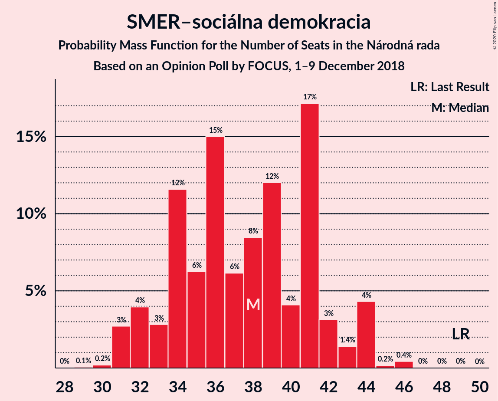
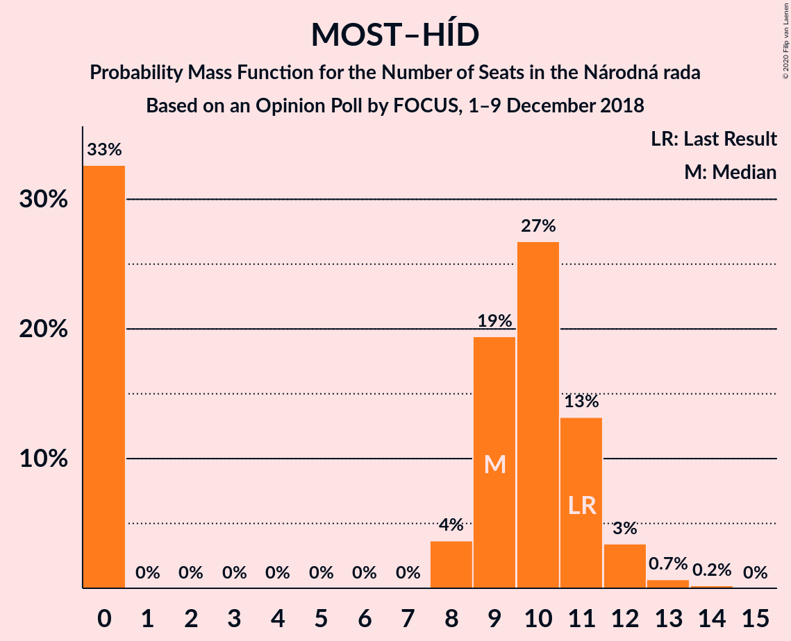
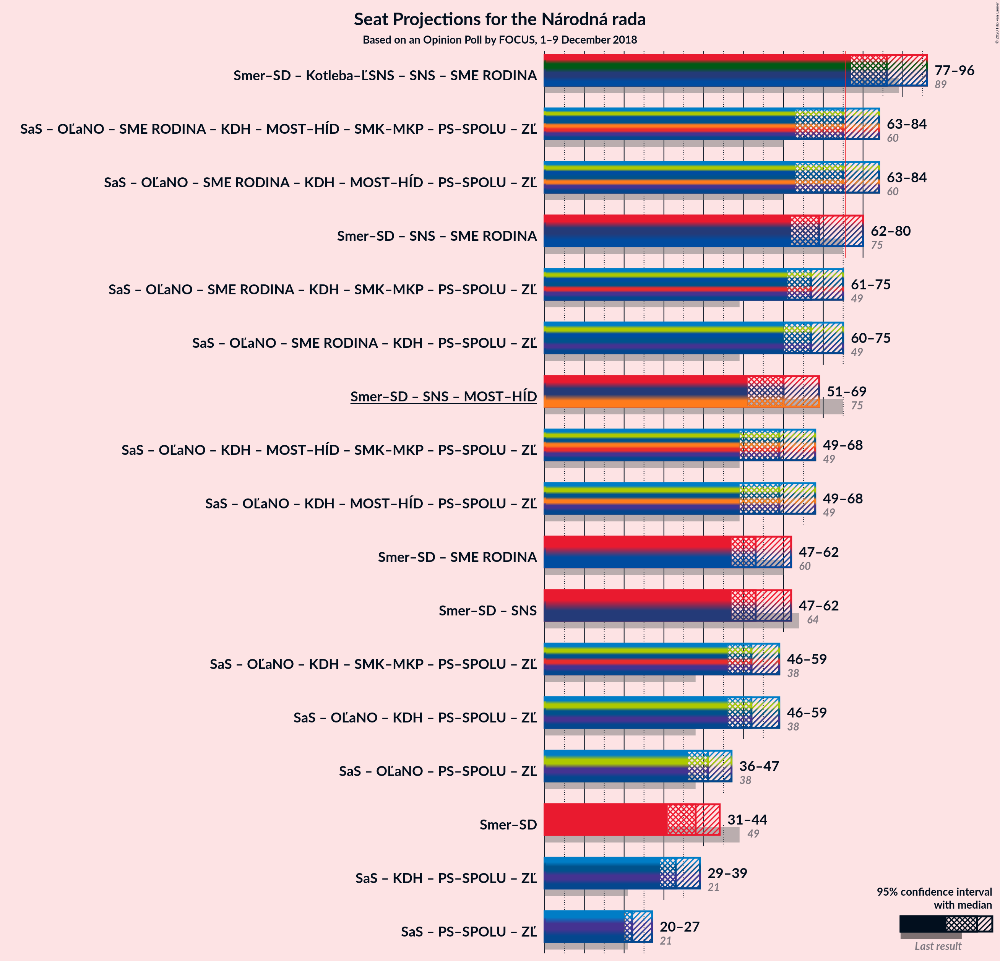

# Opinion Poll by FOCUS, 1–9 December 2018

<a href="#voting-intentions">Voting Intentions</a> | <a href="#seats">Seats</a> | <a href="#coalitions">Coalitions</a> | <a href="#technical-information">Technical Information</a>

## Voting Intentions

### Confidence Intervals

| Party | Last Result | Poll Result | 80% Confidence Interval | 90% Confidence Interval | 95% Confidence Interval | 99% Confidence Interval |
|:-----:|:-----------:|:-----------:|:-----------------------:|:-----------------------:|:-----------------------:|:-----------------------:|
| SMER–sociálna demokracia | 28.3% | 21.7% | 20.1–23.4% |19.6–23.9% |19.3–24.3% |18.5–25.2% |
| Sloboda a Solidarita | 12.1% | 13.3% | 12.1–14.8% |11.7–15.2% |11.4–15.6% |10.8–16.3% |
| OBYČAJNÍ ĽUDIA a nezávislé osobnosti | 11.0% | 10.5% | 9.4–11.8% |9.0–12.2% |8.8–12.5% |8.2–13.2% |
| Slovenská národná strana | 8.6% | 9.2% | 8.2–10.5% |7.8–10.9% |7.6–11.2% |7.1–11.8% |
| Kotleba–Ľudová strana Naše Slovensko | 8.0% | 9.2% | 8.2–10.5% |7.8–10.9% |7.6–11.2% |7.1–11.8% |
| SME RODINA | 6.6% | 9.0% | 8.0–10.3% |7.7–10.6% |7.4–11.0% |6.9–11.6% |
| Kresťanskodemokratické hnutie | 4.9% | 6.5% | 5.6–7.6% |5.3–7.9% |5.1–8.2% |4.7–8.7% |
| MOST–HÍD | 6.5% | 5.2% | 4.4–6.2% |4.2–6.5% |4.0–6.8% |3.6–7.3% |
| Progresívne Slovensko | 0.0% | 5.1% | 4.3–6.1% |4.1–6.4% |3.9–6.6% |3.6–7.1% |
| SPOLU–Občianska Demokracia | 0.0% | 4.1% | 3.4–5.0% |3.2–5.3% |3.1–5.5% |2.8–6.0% |
| Strana maďarskej koalície–Magyar Koalíció Pártja | 4.0% | 3.3% | 2.7–4.2% |2.5–4.4% |2.4–4.6% |2.1–5.1% |

*Note:* The poll result column reflects the actual value used in the calculations. Published results may vary slightly, and in addition be rounded to fewer digits.

## Seats

### Confidence Intervals

| Party | Last Result | Median | 80% Confidence Interval | 90% Confidence Interval | 95% Confidence Interval | 99% Confidence Interval |
|:-----:|:-----------:|:------:|:-----------------------:|:-----------------------:|:-----------------------:|:-----------------------:|
| <a href="#smer–sociálna-demokracia">SMER–sociálna demokracia</a> | 49 | 38 | 34–41 |32–44 |31–44 |31–46 |
| <a href="#sloboda-a-solidarita">Sloboda a Solidarita</a> | 21 | 22 | 21–26 |20–27 |20–27 |18–29 |
| <a href="#obyčajní-ľudia-a-nezávislé-osobnosti">OBYČAJNÍ ĽUDIA a nezávislé osobnosti</a> | 17 | 18 | 16–20 |15–21 |14–22 |14–24 |
| <a href="#slovenská-národná-strana">Slovenská národná strana</a> | 15 | 16 | 13–18 |13–19 |13–20 |12–21 |
| <a href="#kotleba–ľudová-strana-naše-slovensko">Kotleba–Ľudová strana Naše Slovensko</a> | 14 | 16 | 14–18 |14–19 |13–19 |12–21 |
| <a href="#sme-rodina">SME RODINA</a> | 11 | 16 | 13–18 |13–19 |12–19 |11–21 |
| <a href="#kresťanskodemokratické-hnutie">Kresťanskodemokratické hnutie</a> | 0 | 11 | 9–13 |9–14 |9–14 |0–15 |
| <a href="#most–híd">MOST–HÍD</a> | 11 | 9 | 0–11 |0–11 |0–12 |0–13 |
| <a href="#progresívne-slovensko">Progresívne Slovensko</a> | 0 | 8 | 0–10 |0–11 |0–11 |0–12 |
| <a href="#spolu–občianska-demokracia">SPOLU–Občianska Demokracia</a> | 0 | 0 | 0 |0–9 |0–9 |0–10 |
| <a href="#strana-maďarskej-koalície–magyar-koalíció-pártja">Strana maďarskej koalície–Magyar Koalíció Pártja</a> | 0 | 0 | 0 |0 |0 |0–8 |

### SMER–sociálna demokracia

*For a full overview of the results for this party, see the [SMER–sociálna demokracia](party-smer–sociálnademokracia.html) page.*

| Number of Seats | Probability | Accumulated | Special Marks |
|:---------------:|:-----------:|:-----------:|:-------------:|
| 29 | 0.1% | 100% |  |
| 30 | 0.2% | 99.9% |  |
| 31 | 3% | 99.7% |  |
| 32 | 4% | 97% |  |
| 33 | 3% | 93% |  |
| 34 | 12% | 90% |  |
| 35 | 6% | 79% |  |
| 36 | 15% | 72% |  |
| 37 | 6% | 57% |  |
| 38 | 8% | 51% | Median |
| 39 | 12% | 43% |  |
| 40 | 4% | 31% |  |
| 41 | 17% | 27% |  |
| 42 | 3% | 10% |  |
| 43 | 1.4% | 6% |  |
| 44 | 4% | 5% |  |
| 45 | 0.2% | 0.7% |  |
| 46 | 0.4% | 0.5% |  |
| 47 | 0% | 0.1% |  |
| 48 | 0% | 0.1% |  |
| 49 | 0% | 0% | Last Result |

### Sloboda a Solidarita

*For a full overview of the results for this party, see the [Sloboda a Solidarita](party-slobodaasolidarita.html) page.*

| Number of Seats | Probability | Accumulated | Special Marks |
|:---------------:|:-----------:|:-----------:|:-------------:|
| 17 | 0.3% | 100% |  |
| 18 | 0.4% | 99.7% |  |
| 19 | 2% | 99.3% |  |
| 20 | 6% | 98% |  |
| 21 | 28% | 91% | Last Result |
| 22 | 17% | 64% | Median |
| 23 | 14% | 47% |  |
| 24 | 14% | 33% |  |
| 25 | 6% | 19% |  |
| 26 | 6% | 13% |  |
| 27 | 5% | 7% |  |
| 28 | 0.7% | 2% |  |
| 29 | 0.7% | 1.2% |  |
| 30 | 0.4% | 0.5% |  |
| 31 | 0% | 0.1% |  |
| 32 | 0% | 0% |  |

### OBYČAJNÍ ĽUDIA a nezávislé osobnosti

*For a full overview of the results for this party, see the [OBYČAJNÍ ĽUDIA a nezávislé osobnosti](party-obyčajníľudiaanezávisléosobnosti.html) page.*

| Number of Seats | Probability | Accumulated | Special Marks |
|:---------------:|:-----------:|:-----------:|:-------------:|
| 13 | 0.3% | 100% |  |
| 14 | 3% | 99.7% |  |
| 15 | 5% | 97% |  |
| 16 | 7% | 92% |  |
| 17 | 24% | 85% | Last Result |
| 18 | 15% | 61% | Median |
| 19 | 19% | 46% |  |
| 20 | 20% | 27% |  |
| 21 | 4% | 8% |  |
| 22 | 2% | 4% |  |
| 23 | 0.7% | 2% |  |
| 24 | 0.9% | 1.0% |  |
| 25 | 0.1% | 0.1% |  |
| 26 | 0% | 0% |  |

### Slovenská národná strana

*For a full overview of the results for this party, see the [Slovenská národná strana](party-slovenskánárodnástrana.html) page.*

| Number of Seats | Probability | Accumulated | Special Marks |
|:---------------:|:-----------:|:-----------:|:-------------:|
| 11 | 0.2% | 100% |  |
| 12 | 1.4% | 99.8% |  |
| 13 | 9% | 98% |  |
| 14 | 11% | 90% |  |
| 15 | 18% | 79% | Last Result |
| 16 | 15% | 61% | Median |
| 17 | 15% | 45% |  |
| 18 | 22% | 30% |  |
| 19 | 4% | 8% |  |
| 20 | 4% | 5% |  |
| 21 | 0.7% | 0.9% |  |
| 22 | 0.2% | 0.2% |  |
| 23 | 0% | 0% |  |

### Kotleba–Ľudová strana Naše Slovensko

*For a full overview of the results for this party, see the [Kotleba–Ľudová strana Naše Slovensko](party-kotleba–ľudovástrananašeslovensko.html) page.*

| Number of Seats | Probability | Accumulated | Special Marks |
|:---------------:|:-----------:|:-----------:|:-------------:|
| 11 | 0.1% | 100% |  |
| 12 | 1.1% | 99.9% |  |
| 13 | 4% | 98.8% |  |
| 14 | 12% | 95% | Last Result |
| 15 | 17% | 83% |  |
| 16 | 33% | 66% | Median |
| 17 | 12% | 33% |  |
| 18 | 12% | 20% |  |
| 19 | 6% | 8% |  |
| 20 | 0.9% | 2% |  |
| 21 | 1.1% | 1.5% |  |
| 22 | 0.4% | 0.4% |  |
| 23 | 0% | 0% |  |

### SME RODINA

*For a full overview of the results for this party, see the [SME RODINA](party-smerodina.html) page.*

| Number of Seats | Probability | Accumulated | Special Marks |
|:---------------:|:-----------:|:-----------:|:-------------:|
| 11 | 0.9% | 100% | Last Result |
| 12 | 2% | 99.1% |  |
| 13 | 9% | 97% |  |
| 14 | 10% | 88% |  |
| 15 | 22% | 78% |  |
| 16 | 30% | 56% | Median |
| 17 | 6% | 26% |  |
| 18 | 14% | 21% |  |
| 19 | 5% | 7% |  |
| 20 | 2% | 2% |  |
| 21 | 0.2% | 0.5% |  |
| 22 | 0.2% | 0.3% |  |
| 23 | 0% | 0% |  |

### Kresťanskodemokratické hnutie

*For a full overview of the results for this party, see the [Kresťanskodemokratické hnutie](party-kresťanskodemokratickéhnutie.html) page.*

| Number of Seats | Probability | Accumulated | Special Marks |
|:---------------:|:-----------:|:-----------:|:-------------:|
| 0 | 2% | 100% | Last Result |
| 1 | 0% | 98% |  |
| 2 | 0% | 98% |  |
| 3 | 0% | 98% |  |
| 4 | 0% | 98% |  |
| 5 | 0% | 98% |  |
| 6 | 0% | 98% |  |
| 7 | 0% | 98% |  |
| 8 | 0.3% | 98% |  |
| 9 | 13% | 98% |  |
| 10 | 13% | 84% |  |
| 11 | 34% | 71% | Median |
| 12 | 21% | 37% |  |
| 13 | 10% | 17% |  |
| 14 | 6% | 7% |  |
| 15 | 0.7% | 1.2% |  |
| 16 | 0.3% | 0.4% |  |
| 17 | 0.2% | 0.2% |  |
| 18 | 0% | 0% |  |

### MOST–HÍD

*For a full overview of the results for this party, see the [MOST–HÍD](party-most–híd.html) page.*

| Number of Seats | Probability | Accumulated | Special Marks |
|:---------------:|:-----------:|:-----------:|:-------------:|
| 0 | 33% | 100% |  |
| 1 | 0% | 67% |  |
| 2 | 0% | 67% |  |
| 3 | 0% | 67% |  |
| 4 | 0% | 67% |  |
| 5 | 0% | 67% |  |
| 6 | 0% | 67% |  |
| 7 | 0% | 67% |  |
| 8 | 4% | 67% |  |
| 9 | 19% | 64% | Median |
| 10 | 27% | 44% |  |
| 11 | 13% | 18% | Last Result |
| 12 | 3% | 4% |  |
| 13 | 0.7% | 0.9% |  |
| 14 | 0.2% | 0.2% |  |
| 15 | 0% | 0% |  |

### Progresívne Slovensko

*For a full overview of the results for this party, see the [Progresívne Slovensko](party-progresívneslovensko.html) page.*

| Number of Seats | Probability | Accumulated | Special Marks |
|:---------------:|:-----------:|:-----------:|:-------------:|
| 0 | 50% | 100% | Last Result |
| 1 | 0% | 50% |  |
| 2 | 0% | 50% |  |
| 3 | 0% | 50% |  |
| 4 | 0% | 50% |  |
| 5 | 0% | 50% |  |
| 6 | 0% | 50% |  |
| 7 | 0% | 50% |  |
| 8 | 1.2% | 50% | Median |
| 9 | 19% | 49% |  |
| 10 | 23% | 30% |  |
| 11 | 5% | 7% |  |
| 12 | 2% | 2% |  |
| 13 | 0.1% | 0.2% |  |
| 14 | 0% | 0% |  |

### SPOLU–Občianska Demokracia

*For a full overview of the results for this party, see the [SPOLU–Občianska Demokracia](party-spolu–občianskademokracia.html) page.*

| Number of Seats | Probability | Accumulated | Special Marks |
|:---------------:|:-----------:|:-----------:|:-------------:|
| 0 | 91% | 100% | Last Result, Median |
| 1 | 0% | 9% |  |
| 2 | 0% | 9% |  |
| 3 | 0% | 9% |  |
| 4 | 0% | 9% |  |
| 5 | 0% | 9% |  |
| 6 | 0% | 9% |  |
| 7 | 0% | 9% |  |
| 8 | 1.4% | 9% |  |
| 9 | 6% | 7% |  |
| 10 | 0.9% | 1.1% |  |
| 11 | 0.2% | 0.2% |  |
| 12 | 0% | 0% |  |

### Strana maďarskej koalície–Magyar Koalíció Pártja

*For a full overview of the results for this party, see the [Strana maďarskej koalície–Magyar Koalíció Pártja](party-stranamaďarskejkoalície–magyarkoalíciópártja.html) page.*

| Number of Seats | Probability | Accumulated | Special Marks |
|:---------------:|:-----------:|:-----------:|:-------------:|
| 0 | 99.4% | 100% | Last Result, Median |
| 1 | 0% | 0.6% |  |
| 2 | 0% | 0.6% |  |
| 3 | 0% | 0.6% |  |
| 4 | 0% | 0.6% |  |
| 5 | 0% | 0.6% |  |
| 6 | 0% | 0.6% |  |
| 7 | 0% | 0.6% |  |
| 8 | 0.2% | 0.6% |  |
| 9 | 0.4% | 0.5% |  |
| 10 | 0.1% | 0.1% |  |
| 11 | 0% | 0% |  |

## Coalitions

### Confidence Intervals

| Coalition | Last Result | Median | Majority? | 80% Confidence Interval | 90% Confidence Interval | 95% Confidence Interval | 99% Confidence Interval |
|:---------:|:-----------:|:------:|:---------:|:-----------------------:|:-----------------------:|:-----------------------:|:-----------------------:|
| SMER–sociálna demokracia – Slovenská národná strana – MOST–HÍD | 75 | 60 | 0% | 53–69 | 51–69 | 51–69 | 49–70 |
| SMER–sociálna demokracia | 49 | 38 | 0% | 34–41 | 32–44 | 31–44 | 31–46 |

### SMER–sociálna demokracia – Slovenská národná strana – MOST–HÍD

| Number of Seats | Probability | Accumulated | Special Marks |
|:---------------:|:-----------:|:-----------:|:-------------:|
| 47 | 0.1% | 100% |  |
| 48 | 0.4% | 99.9% |  |
| 49 | 1.3% | 99.5% |  |
| 50 | 0.6% | 98% |  |
| 51 | 4% | 98% |  |
| 52 | 3% | 93% |  |
| 53 | 1.2% | 90% |  |
| 54 | 2% | 89% |  |
| 55 | 1.5% | 87% |  |
| 56 | 7% | 85% |  |
| 57 | 4% | 78% |  |
| 58 | 11% | 74% |  |
| 59 | 6% | 63% |  |
| 60 | 14% | 57% |  |
| 61 | 2% | 43% |  |
| 62 | 9% | 40% |  |
| 63 | 3% | 32% | Median |
| 64 | 5% | 28% |  |
| 65 | 1.0% | 23% |  |
| 66 | 5% | 22% |  |
| 67 | 1.0% | 17% |  |
| 68 | 2% | 16% |  |
| 69 | 13% | 14% |  |
| 70 | 1.0% | 1.1% |  |
| 71 | 0% | 0.1% |  |
| 72 | 0% | 0.1% |  |
| 73 | 0% | 0.1% |  |
| 74 | 0% | 0% |  |
| 75 | 0% | 0% | Last Result |

### SMER–sociálna demokracia

| Number of Seats | Probability | Accumulated | Special Marks |
|:---------------:|:-----------:|:-----------:|:-------------:|
| 29 | 0.1% | 100% |  |
| 30 | 0.2% | 99.9% |  |
| 31 | 3% | 99.7% |  |
| 32 | 4% | 97% |  |
| 33 | 3% | 93% |  |
| 34 | 12% | 90% |  |
| 35 | 6% | 79% |  |
| 36 | 15% | 72% |  |
| 37 | 6% | 57% |  |
| 38 | 8% | 51% | Median |
| 39 | 12% | 43% |  |
| 40 | 4% | 31% |  |
| 41 | 17% | 27% |  |
| 42 | 3% | 10% |  |
| 43 | 1.4% | 6% |  |
| 44 | 4% | 5% |  |
| 45 | 0.2% | 0.7% |  |
| 46 | 0.4% | 0.5% |  |
| 47 | 0% | 0.1% |  |
| 48 | 0% | 0.1% |  |
| 49 | 0% | 0% | Last Result |

## Technical Information

### Opinion Poll

+ **Polling firm:** FOCUS
+ **Commissioner(s):** —
+ **Fieldwork period:** 1–9 December 2018

### Calculations

+ **Sample size:** 1019
+ **Simulations done:** 1,048,576
+ **Error estimate:** 3.40%

