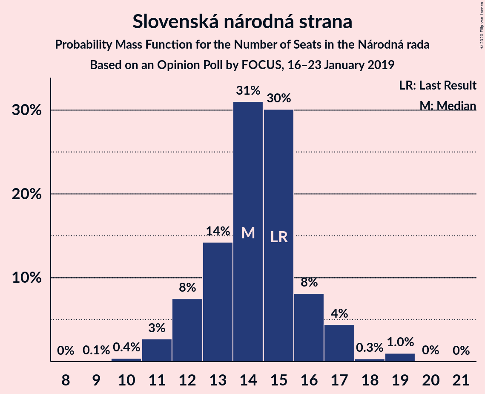
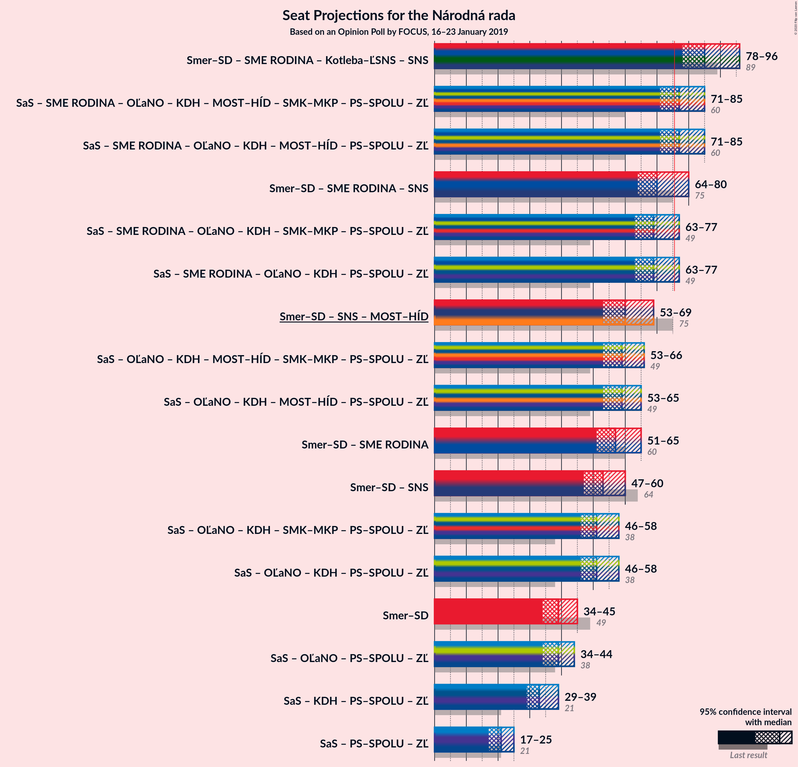
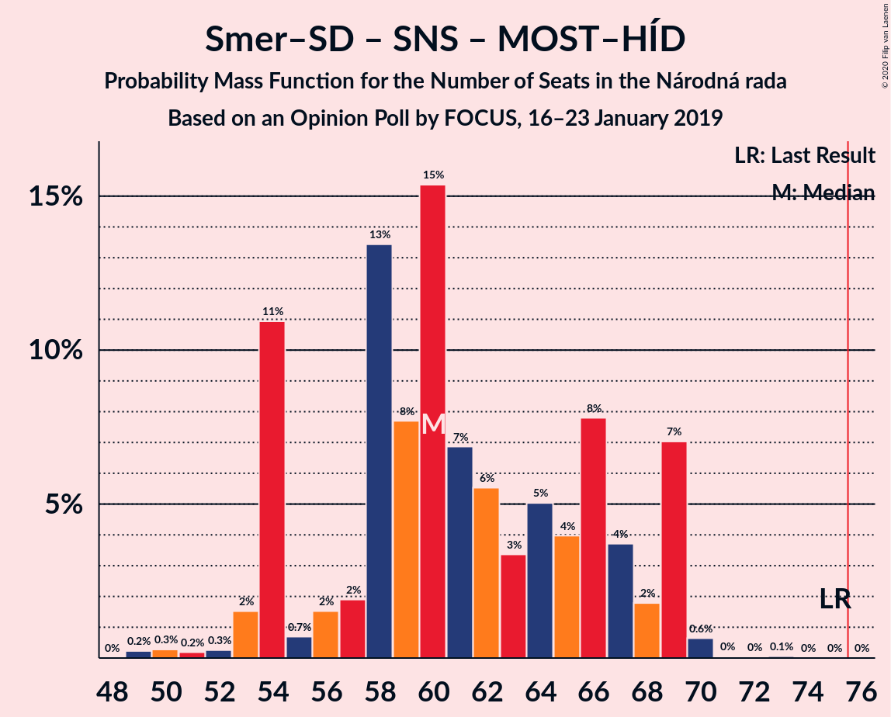

# Opinion Poll by FOCUS, 16–23 January 2019

<a href="#voting-intentions">Voting Intentions</a> | <a href="#seats">Seats</a> | <a href="#coalitions">Coalitions</a> | <a href="#technical-information">Technical Information</a>

## Voting Intentions

### Confidence Intervals

| Party | Last Result | Poll Result | 80% Confidence Interval | 90% Confidence Interval | 95% Confidence Interval | 99% Confidence Interval |
|:-----:|:-----------:|:-----------:|:-----------------------:|:-----------------------:|:-----------------------:|:-----------------------:|
| SMER–sociálna demokracia | 28.3% | 22.5% | 20.9–24.3% |20.4–24.8% |20.0–25.2% |19.3–26.0% |
| Sloboda a Solidarita | 12.1% | 12.3% | 11.1–13.8% |10.7–14.2% |10.5–14.5% |9.9–15.2% |
| SME RODINA | 6.6% | 10.4% | 9.2–11.7% |8.9–12.1% |8.6–12.4% |8.1–13.1% |
| OBYČAJNÍ ĽUDIA a nezávislé osobnosti | 11.0% | 10.0% | 8.9–11.3% |8.5–11.6% |8.3–12.0% |7.8–12.6% |
| Kotleba–Ľudová strana Naše Slovensko | 8.0% | 8.4% | 7.4–9.6% |7.1–10.0% |6.8–10.3% |6.4–10.9% |
| Slovenská národná strana | 8.6% | 8.0% | 7.0–9.2% |6.7–9.5% |6.5–9.8% |6.0–10.4% |
| Kresťanskodemokratické hnutie | 4.9% | 7.0% | 6.1–8.2% |5.8–8.5% |5.6–8.8% |5.2–9.3% |
| MOST–HÍD | 6.5% | 5.8% | 5.0–6.9% |4.7–7.2% |4.5–7.5% |4.2–8.0% |
| Progresívne Slovensko | 0.0% | 4.9% | 4.2–5.9% |3.9–6.2% |3.8–6.5% |3.4–7.0% |
| SPOLU–Občianska Demokracia | 0.0% | 3.5% | 2.8–4.3% |2.6–4.6% |2.5–4.8% |2.2–5.2% |
| Strana maďarskej koalície–Magyar Koalíció Pártja | 4.0% | 3.4% | 2.7–4.2% |2.6–4.5% |2.4–4.7% |2.1–5.1% |

*Note:* The poll result column reflects the actual value used in the calculations. Published results may vary slightly, and in addition be rounded to fewer digits.

## Seats

### Confidence Intervals

| Party | Last Result | Median | 80% Confidence Interval | 90% Confidence Interval | 95% Confidence Interval | 99% Confidence Interval |
|:-----:|:-----------:|:------:|:-----------------------:|:-----------------------:|:-----------------------:|:-----------------------:|
| <a href="#smer–sociálna-demokracia">SMER–sociálna demokracia</a> | 49 | 40 | 36–45 |34–45 |34–45 |33–45 |
| <a href="#sloboda-a-solidarita">Sloboda a Solidarita</a> | 21 | 23 | 19–23 |19–24 |18–25 |17–28 |
| <a href="#sme-rodina">SME RODINA</a> | 11 | 20 | 16–22 |16–23 |16–24 |14–24 |
| <a href="#obyčajní-ľudia-a-nezávislé-osobnosti">OBYČAJNÍ ĽUDIA a nezávislé osobnosti</a> | 17 | 17 | 14–19 |14–20 |13–21 |13–22 |
| <a href="#kotleba–ľudová-strana-naše-slovensko">Kotleba–Ľudová strana Naše Slovensko</a> | 14 | 15 | 12–17 |12–17 |12–18 |11–19 |
| <a href="#slovenská-národná-strana">Slovenská národná strana</a> | 15 | 15 | 12–17 |11–17 |11–17 |10–18 |
| <a href="#kresťanskodemokratické-hnutie">Kresťanskodemokratické hnutie</a> | 0 | 13 | 10–13 |10–14 |9–15 |0–16 |
| <a href="#most–híd">MOST–HÍD</a> | 11 | 10 | 0–11 |0–12 |0–12 |0–14 |
| <a href="#progresívne-slovensko">Progresívne Slovensko</a> | 0 | 0 | 0–11 |0–11 |0–11 |0–11 |
| <a href="#spolu–občianska-demokracia">SPOLU–Občianska Demokracia</a> | 0 | 0 | 0 |0 |0 |0–9 |
| <a href="#strana-maďarskej-koalície–magyar-koalíció-pártja">Strana maďarskej koalície–Magyar Koalíció Pártja</a> | 0 | 0 | 0 |0 |0 |0–9 |

### SMER–sociálna demokracia

*For a full overview of the results for this party, see the [SMER–sociálna demokracia](party-smer–sociálnademokracia.html) page.*

| Number of Seats | Probability | Accumulated | Special Marks |
|:---------------:|:-----------:|:-----------:|:-------------:|
| 31 | 0% | 100% |  |
| 32 | 0.2% | 99.9% |  |
| 33 | 0.5% | 99.7% |  |
| 34 | 6% | 99.2% |  |
| 35 | 0.7% | 93% |  |
| 36 | 5% | 93% |  |
| 37 | 8% | 88% |  |
| 38 | 7% | 80% |  |
| 39 | 5% | 73% |  |
| 40 | 33% | 68% | Median |
| 41 | 6% | 35% |  |
| 42 | 1.2% | 29% |  |
| 43 | 6% | 28% |  |
| 44 | 2% | 22% |  |
| 45 | 20% | 20% |  |
| 46 | 0.1% | 0.4% |  |
| 47 | 0.2% | 0.3% |  |
| 48 | 0.1% | 0.1% |  |
| 49 | 0.1% | 0.1% | Last Result |
| 50 | 0% | 0% |  |

### Sloboda a Solidarita

*For a full overview of the results for this party, see the [Sloboda a Solidarita](party-slobodaasolidarita.html) page.*

| Number of Seats | Probability | Accumulated | Special Marks |
|:---------------:|:-----------:|:-----------:|:-------------:|
| 16 | 0.1% | 100% |  |
| 17 | 2% | 99.8% |  |
| 18 | 0.9% | 98% |  |
| 19 | 21% | 97% |  |
| 20 | 8% | 75% |  |
| 21 | 5% | 68% | Last Result |
| 22 | 8% | 63% |  |
| 23 | 46% | 55% | Median |
| 24 | 6% | 9% |  |
| 25 | 0.7% | 3% |  |
| 26 | 1.0% | 2% |  |
| 27 | 0.3% | 1.2% |  |
| 28 | 0.9% | 0.9% |  |
| 29 | 0% | 0% |  |

### SME RODINA

*For a full overview of the results for this party, see the [SME RODINA](party-smerodina.html) page.*

| Number of Seats | Probability | Accumulated | Special Marks |
|:---------------:|:-----------:|:-----------:|:-------------:|
| 11 | 0% | 100% | Last Result |
| 12 | 0% | 100% |  |
| 13 | 0.2% | 100% |  |
| 14 | 0.3% | 99.8% |  |
| 15 | 0.6% | 99.4% |  |
| 16 | 20% | 98.9% |  |
| 17 | 2% | 78% |  |
| 18 | 2% | 77% |  |
| 19 | 9% | 74% |  |
| 20 | 33% | 65% | Median |
| 21 | 9% | 32% |  |
| 22 | 15% | 24% |  |
| 23 | 4% | 9% |  |
| 24 | 5% | 5% |  |
| 25 | 0.2% | 0.2% |  |
| 26 | 0% | 0% |  |

### OBYČAJNÍ ĽUDIA a nezávislé osobnosti

*For a full overview of the results for this party, see the [OBYČAJNÍ ĽUDIA a nezávislé osobnosti](party-obyčajníľudiaanezávisléosobnosti.html) page.*

| Number of Seats | Probability | Accumulated | Special Marks |
|:---------------:|:-----------:|:-----------:|:-------------:|
| 12 | 0.1% | 100% |  |
| 13 | 4% | 99.9% |  |
| 14 | 7% | 96% |  |
| 15 | 10% | 90% |  |
| 16 | 28% | 80% |  |
| 17 | 14% | 52% | Last Result, Median |
| 18 | 25% | 38% |  |
| 19 | 5% | 13% |  |
| 20 | 5% | 8% |  |
| 21 | 0.5% | 3% |  |
| 22 | 2% | 2% |  |
| 23 | 0% | 0% |  |

### Kotleba–Ľudová strana Naše Slovensko

*For a full overview of the results for this party, see the [Kotleba–Ľudová strana Naše Slovensko](party-kotleba–ľudovástrananašeslovensko.html) page.*

| Number of Seats | Probability | Accumulated | Special Marks |
|:---------------:|:-----------:|:-----------:|:-------------:|
| 10 | 0.2% | 100% |  |
| 11 | 1.1% | 99.8% |  |
| 12 | 15% | 98.7% |  |
| 13 | 3% | 84% |  |
| 14 | 30% | 81% | Last Result |
| 15 | 24% | 51% | Median |
| 16 | 10% | 27% |  |
| 17 | 13% | 17% |  |
| 18 | 3% | 4% |  |
| 19 | 0.5% | 0.5% |  |
| 20 | 0% | 0% |  |

### Slovenská národná strana

*For a full overview of the results for this party, see the [Slovenská národná strana](party-slovenskánárodnástrana.html) page.*

| Number of Seats | Probability | Accumulated | Special Marks |
|:---------------:|:-----------:|:-----------:|:-------------:|
| 9 | 0.3% | 100% |  |
| 10 | 0.6% | 99.7% |  |
| 11 | 7% | 99.1% |  |
| 12 | 3% | 92% |  |
| 13 | 22% | 89% |  |
| 14 | 8% | 67% |  |
| 15 | 17% | 59% | Last Result, Median |
| 16 | 2% | 42% |  |
| 17 | 40% | 41% |  |
| 18 | 0.6% | 0.7% |  |
| 19 | 0% | 0.1% |  |
| 20 | 0% | 0% |  |

### Kresťanskodemokratické hnutie

*For a full overview of the results for this party, see the [Kresťanskodemokratické hnutie](party-kresťanskodemokratickéhnutie.html) page.*

| Number of Seats | Probability | Accumulated | Special Marks |
|:---------------:|:-----------:|:-----------:|:-------------:|
| 0 | 1.2% | 100% | Last Result |
| 1 | 0% | 98.8% |  |
| 2 | 0% | 98.8% |  |
| 3 | 0% | 98.8% |  |
| 4 | 0% | 98.8% |  |
| 5 | 0% | 98.8% |  |
| 6 | 0% | 98.8% |  |
| 7 | 0% | 98.8% |  |
| 8 | 0% | 98.8% |  |
| 9 | 2% | 98.8% |  |
| 10 | 8% | 96% |  |
| 11 | 8% | 89% |  |
| 12 | 18% | 80% |  |
| 13 | 56% | 63% | Median |
| 14 | 4% | 6% |  |
| 15 | 1.0% | 3% |  |
| 16 | 1.3% | 2% |  |
| 17 | 0.4% | 0.4% |  |
| 18 | 0% | 0% |  |

### MOST–HÍD

*For a full overview of the results for this party, see the [MOST–HÍD](party-most–híd.html) page.*

| Number of Seats | Probability | Accumulated | Special Marks |
|:---------------:|:-----------:|:-----------:|:-------------:|
| 0 | 37% | 100% |  |
| 1 | 0% | 63% |  |
| 2 | 0% | 63% |  |
| 3 | 0% | 63% |  |
| 4 | 0% | 63% |  |
| 5 | 0% | 63% |  |
| 6 | 0% | 63% |  |
| 7 | 0% | 63% |  |
| 8 | 0.1% | 63% |  |
| 9 | 9% | 63% |  |
| 10 | 37% | 54% | Median |
| 11 | 8% | 17% | Last Result |
| 12 | 8% | 9% |  |
| 13 | 0.9% | 2% |  |
| 14 | 0.5% | 0.7% |  |
| 15 | 0.2% | 0.2% |  |
| 16 | 0% | 0% |  |

### Progresívne Slovensko

*For a full overview of the results for this party, see the [Progresívne Slovensko](party-progresívneslovensko.html) page.*

| Number of Seats | Probability | Accumulated | Special Marks |
|:---------------:|:-----------:|:-----------:|:-------------:|
| 0 | 69% | 100% | Last Result, Median |
| 1 | 0% | 31% |  |
| 2 | 0% | 31% |  |
| 3 | 0% | 31% |  |
| 4 | 0% | 31% |  |
| 5 | 0% | 31% |  |
| 6 | 0% | 31% |  |
| 7 | 0% | 31% |  |
| 8 | 1.2% | 31% |  |
| 9 | 11% | 29% |  |
| 10 | 8% | 19% |  |
| 11 | 10% | 11% |  |
| 12 | 0.1% | 0.1% |  |
| 13 | 0% | 0% |  |

### SPOLU–Občianska Demokracia

*For a full overview of the results for this party, see the [SPOLU–Občianska Demokracia](party-spolu–občianskademokracia.html) page.*

| Number of Seats | Probability | Accumulated | Special Marks |
|:---------------:|:-----------:|:-----------:|:-------------:|
| 0 | 99.3% | 100% | Last Result, Median |
| 1 | 0% | 0.7% |  |
| 2 | 0% | 0.7% |  |
| 3 | 0% | 0.7% |  |
| 4 | 0% | 0.7% |  |
| 5 | 0% | 0.7% |  |
| 6 | 0% | 0.7% |  |
| 7 | 0% | 0.7% |  |
| 8 | 0.2% | 0.7% |  |
| 9 | 0.2% | 0.6% |  |
| 10 | 0.4% | 0.4% |  |
| 11 | 0% | 0% |  |

### Strana maďarskej koalície–Magyar Koalíció Pártja

*For a full overview of the results for this party, see the [Strana maďarskej koalície–Magyar Koalíció Pártja](party-stranamaďarskejkoalície–magyarkoalíciópártja.html) page.*

| Number of Seats | Probability | Accumulated | Special Marks |
|:---------------:|:-----------:|:-----------:|:-------------:|
| 0 | 99.0% | 100% | Last Result, Median |
| 1 | 0% | 1.0% |  |
| 2 | 0% | 1.0% |  |
| 3 | 0% | 1.0% |  |
| 4 | 0% | 1.0% |  |
| 5 | 0% | 1.0% |  |
| 6 | 0% | 1.0% |  |
| 7 | 0% | 1.0% |  |
| 8 | 0.1% | 1.0% |  |
| 9 | 0.9% | 1.0% |  |
| 10 | 0.1% | 0.1% |  |
| 11 | 0% | 0% |  |

## Coalitions

### Confidence Intervals

| Coalition | Last Result | Median | Majority? | 80% Confidence Interval | 90% Confidence Interval | 95% Confidence Interval | 99% Confidence Interval |
|:---------:|:-----------:|:------:|:---------:|:-----------------------:|:-----------------------:|:-----------------------:|:-----------------------:|
| SMER–sociálna demokracia – Slovenská národná strana – MOST–HÍD | 75 | 63 | 0% | 55–67 | 53–67 | 50–67 | 49–70 |
| SMER–sociálna demokracia | 49 | 40 | 0% | 36–45 | 34–45 | 34–45 | 33–45 |

### SMER–sociálna demokracia – Slovenská národná strana – MOST–HÍD

| Number of Seats | Probability | Accumulated | Special Marks |
|:---------------:|:-----------:|:-----------:|:-------------:|
| 48 | 0% | 100% |  |
| 49 | 0.5% | 99.9% |  |
| 50 | 3% | 99.5% |  |
| 51 | 0.5% | 97% |  |
| 52 | 1.1% | 96% |  |
| 53 | 4% | 95% |  |
| 54 | 0.7% | 91% |  |
| 55 | 1.0% | 91% |  |
| 56 | 5% | 90% |  |
| 57 | 6% | 85% |  |
| 58 | 2% | 79% |  |
| 59 | 2% | 77% |  |
| 60 | 1.1% | 75% |  |
| 61 | 2% | 74% |  |
| 62 | 20% | 72% |  |
| 63 | 20% | 52% |  |
| 64 | 9% | 32% |  |
| 65 | 0.3% | 23% | Median |
| 66 | 2% | 22% |  |
| 67 | 19% | 20% |  |
| 68 | 0.5% | 2% |  |
| 69 | 0.2% | 1.0% |  |
| 70 | 0.3% | 0.8% |  |
| 71 | 0% | 0.5% |  |
| 72 | 0% | 0.5% |  |
| 73 | 0.4% | 0.4% |  |
| 74 | 0% | 0% |  |
| 75 | 0% | 0% | Last Result |

### SMER–sociálna demokracia

| Number of Seats | Probability | Accumulated | Special Marks |
|:---------------:|:-----------:|:-----------:|:-------------:|
| 31 | 0% | 100% |  |
| 32 | 0.2% | 99.9% |  |
| 33 | 0.5% | 99.7% |  |
| 34 | 6% | 99.2% |  |
| 35 | 0.7% | 93% |  |
| 36 | 5% | 93% |  |
| 37 | 8% | 88% |  |
| 38 | 7% | 80% |  |
| 39 | 5% | 73% |  |
| 40 | 33% | 68% | Median |
| 41 | 6% | 35% |  |
| 42 | 1.2% | 29% |  |
| 43 | 6% | 28% |  |
| 44 | 2% | 22% |  |
| 45 | 20% | 20% |  |
| 46 | 0.1% | 0.4% |  |
| 47 | 0.2% | 0.3% |  |
| 48 | 0.1% | 0.1% |  |
| 49 | 0.1% | 0.1% | Last Result |
| 50 | 0% | 0% |  |

## Technical Information

### Opinion Poll

+ **Polling firm:** FOCUS
+ **Commissioner(s):** —
+ **Fieldwork period:** 16–23 January 2019

### Calculations

+ **Sample size:** 1013
+ **Simulations done:** 131,072
+ **Error estimate:** 1.77%

