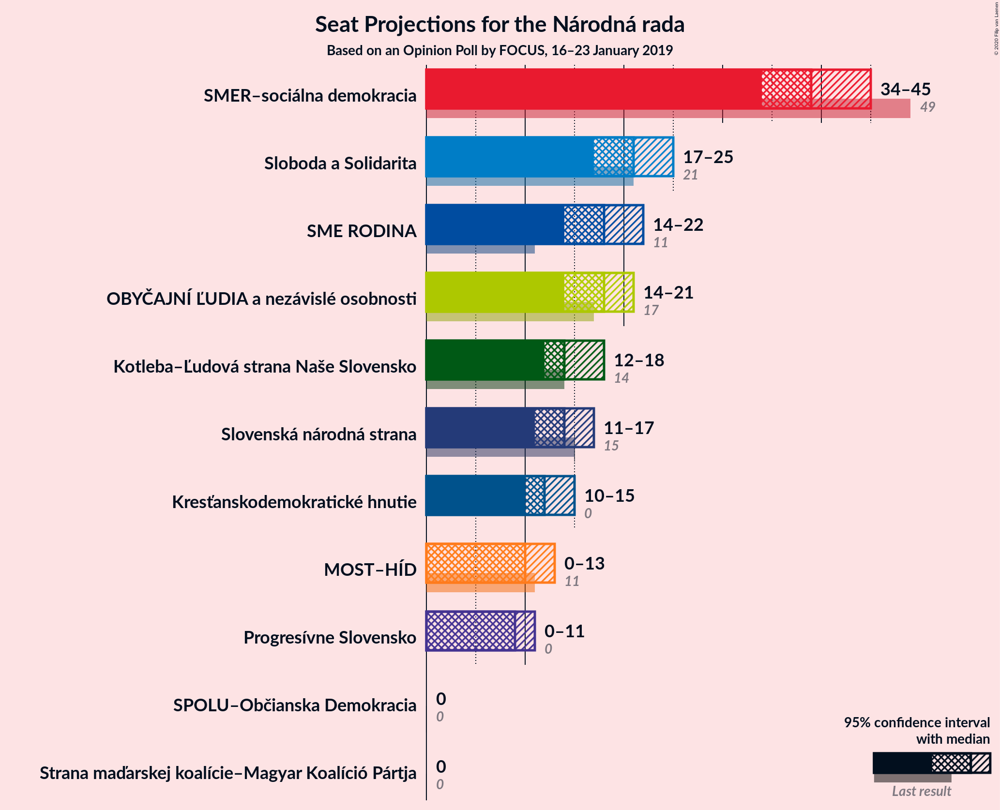
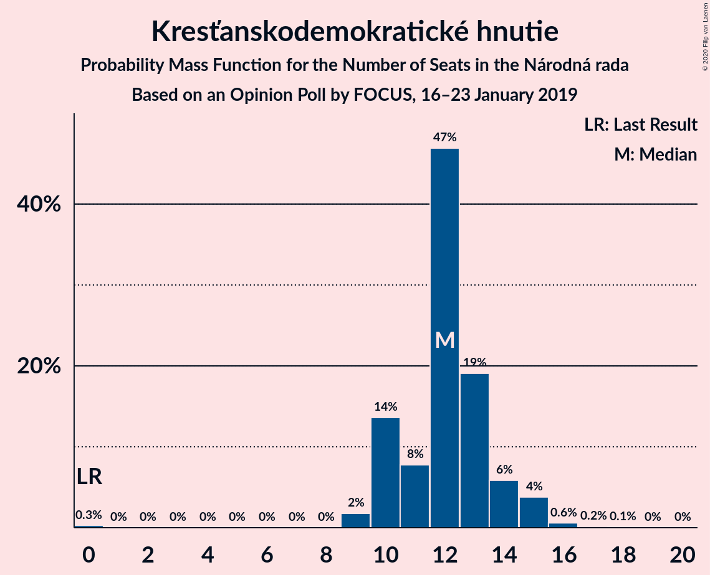

# Opinion Poll by FOCUS, 16–23 January 2019

<a href="#voting-intentions">Voting Intentions</a> | <a href="#seats">Seats</a> | <a href="#coalitions">Coalitions</a> | <a href="#technical-information">Technical Information</a>

## Voting Intentions

### Confidence Intervals

| Party | Last Result | Poll Result | 80% Confidence Interval | 90% Confidence Interval | 95% Confidence Interval | 99% Confidence Interval |
|:-----:|:-----------:|:-----------:|:-----------------------:|:-----------------------:|:-----------------------:|:-----------------------:|
| SMER–sociálna demokracia | 28.3% | 22.5% | 20.9–24.3% |20.4–24.8% |20.0–25.2% |19.3–26.0% |
| Sloboda a Solidarita | 12.1% | 12.3% | 11.1–13.8% |10.7–14.2% |10.5–14.5% |9.9–15.2% |
| SME RODINA | 6.6% | 10.4% | 9.2–11.7% |8.9–12.1% |8.6–12.4% |8.1–13.1% |
| OBYČAJNÍ ĽUDIA a nezávislé osobnosti | 11.0% | 10.0% | 8.9–11.3% |8.5–11.6% |8.3–12.0% |7.8–12.6% |
| Kotleba–Ľudová strana Naše Slovensko | 8.0% | 8.4% | 7.4–9.6% |7.1–10.0% |6.8–10.3% |6.4–10.9% |
| Slovenská národná strana | 8.6% | 8.0% | 7.0–9.2% |6.7–9.5% |6.5–9.8% |6.0–10.4% |
| Kresťanskodemokratické hnutie | 4.9% | 7.0% | 6.1–8.2% |5.8–8.5% |5.6–8.8% |5.2–9.3% |
| MOST–HÍD | 6.5% | 5.8% | 5.0–6.9% |4.7–7.2% |4.5–7.5% |4.2–8.0% |
| Progresívne Slovensko | 0.0% | 4.9% | 4.2–5.9% |3.9–6.2% |3.8–6.5% |3.4–7.0% |
| SPOLU–Občianska Demokracia | 0.0% | 3.5% | 2.8–4.3% |2.6–4.6% |2.5–4.8% |2.2–5.2% |
| Strana maďarskej koalície–Magyar Koalíció Pártja | 4.0% | 3.4% | 2.7–4.2% |2.6–4.5% |2.4–4.7% |2.1–5.1% |

*Note:* The poll result column reflects the actual value used in the calculations. Published results may vary slightly, and in addition be rounded to fewer digits.

## Seats

### Confidence Intervals

| Party | Last Result | Median | 80% Confidence Interval | 90% Confidence Interval | 95% Confidence Interval | 99% Confidence Interval |
|:-----:|:-----------:|:------:|:-----------------------:|:-----------------------:|:-----------------------:|:-----------------------:|
| <a href="#smer–sociálna-demokracia">SMER–sociálna demokracia</a> | 49 | 39 | 35–43 |35–44 |34–45 |33–46 |
| <a href="#sloboda-a-solidarita">Sloboda a Solidarita</a> | 21 | 21 | 19–23 |19–25 |17–25 |17–27 |
| <a href="#sme-rodina">SME RODINA</a> | 11 | 18 | 16–20 |15–21 |14–22 |14–24 |
| <a href="#obyčajní-ľudia-a-nezávislé-osobnosti">OBYČAJNÍ ĽUDIA a nezávislé osobnosti</a> | 17 | 18 | 16–20 |15–21 |14–21 |13–22 |
| <a href="#kotleba–ľudová-strana-naše-slovensko">Kotleba–Ľudová strana Naše Slovensko</a> | 14 | 14 | 13–16 |12–17 |12–18 |11–19 |
| <a href="#slovenská-národná-strana">Slovenská národná strana</a> | 15 | 14 | 12–16 |12–17 |11–17 |11–19 |
| <a href="#kresťanskodemokratické-hnutie">Kresťanskodemokratické hnutie</a> | 0 | 12 | 10–14 |10–14 |10–15 |9–16 |
| <a href="#most–híd">MOST–HÍD</a> | 11 | 10 | 0–11 |0–12 |0–13 |0–14 |
| <a href="#progresívne-slovensko">Progresívne Slovensko</a> | 0 | 9 | 0–9 |0–10 |0–11 |0–12 |
| <a href="#spolu–občianska-demokracia">SPOLU–Občianska Demokracia</a> | 0 | 0 | 0 |0 |0 |0–9 |
| <a href="#strana-maďarskej-koalície–magyar-koalíció-pártja">Strana maďarskej koalície–Magyar Koalíció Pártja</a> | 0 | 0 | 0 |0 |0 |0–8 |

### SMER–sociálna demokracia

*For a full overview of the results for this party, see the [SMER–sociálna demokracia](party-smer–sociálnademokracia.html) page.*

| Number of Seats | Probability | Accumulated | Special Marks |
|:---------------:|:-----------:|:-----------:|:-------------:|
| 31 | 0.1% | 100% |  |
| 32 | 0.2% | 99.9% |  |
| 33 | 1.0% | 99.7% |  |
| 34 | 2% | 98.7% |  |
| 35 | 11% | 97% |  |
| 36 | 22% | 86% |  |
| 37 | 2% | 64% |  |
| 38 | 9% | 61% |  |
| 39 | 15% | 53% | Median |
| 40 | 9% | 38% |  |
| 41 | 13% | 29% |  |
| 42 | 2% | 16% |  |
| 43 | 8% | 14% |  |
| 44 | 3% | 6% |  |
| 45 | 2% | 3% |  |
| 46 | 0.3% | 0.6% |  |
| 47 | 0.1% | 0.3% |  |
| 48 | 0.1% | 0.1% |  |
| 49 | 0.1% | 0.1% | Last Result |
| 50 | 0% | 0% |  |

### Sloboda a Solidarita

*For a full overview of the results for this party, see the [Sloboda a Solidarita](party-slobodaasolidarita.html) page.*

| Number of Seats | Probability | Accumulated | Special Marks |
|:---------------:|:-----------:|:-----------:|:-------------:|
| 15 | 0.1% | 100% |  |
| 16 | 0.1% | 99.9% |  |
| 17 | 2% | 99.8% |  |
| 18 | 2% | 97% |  |
| 19 | 13% | 96% |  |
| 20 | 25% | 83% |  |
| 21 | 16% | 58% | Last Result, Median |
| 22 | 24% | 42% |  |
| 23 | 9% | 18% |  |
| 24 | 4% | 9% |  |
| 25 | 4% | 6% |  |
| 26 | 1.3% | 2% |  |
| 27 | 0.6% | 0.8% |  |
| 28 | 0.1% | 0.2% |  |
| 29 | 0.1% | 0.1% |  |
| 30 | 0% | 0% |  |

### SME RODINA

*For a full overview of the results for this party, see the [SME RODINA](party-smerodina.html) page.*

| Number of Seats | Probability | Accumulated | Special Marks |
|:---------------:|:-----------:|:-----------:|:-------------:|
| 11 | 0% | 100% | Last Result |
| 12 | 0% | 100% |  |
| 13 | 0.2% | 100% |  |
| 14 | 3% | 99.8% |  |
| 15 | 5% | 97% |  |
| 16 | 18% | 92% |  |
| 17 | 16% | 74% |  |
| 18 | 30% | 58% | Median |
| 19 | 14% | 27% |  |
| 20 | 6% | 13% |  |
| 21 | 3% | 7% |  |
| 22 | 2% | 4% |  |
| 23 | 0.4% | 2% |  |
| 24 | 1.2% | 1.3% |  |
| 25 | 0.1% | 0.1% |  |
| 26 | 0% | 0% |  |

### OBYČAJNÍ ĽUDIA a nezávislé osobnosti

*For a full overview of the results for this party, see the [OBYČAJNÍ ĽUDIA a nezávislé osobnosti](party-obyčajníľudiaanezávisléosobnosti.html) page.*

| Number of Seats | Probability | Accumulated | Special Marks |
|:---------------:|:-----------:|:-----------:|:-------------:|
| 12 | 0.1% | 100% |  |
| 13 | 1.2% | 99.9% |  |
| 14 | 3% | 98.8% |  |
| 15 | 4% | 96% |  |
| 16 | 7% | 92% |  |
| 17 | 28% | 85% | Last Result |
| 18 | 11% | 57% | Median |
| 19 | 17% | 46% |  |
| 20 | 24% | 29% |  |
| 21 | 4% | 5% |  |
| 22 | 1.2% | 1.3% |  |
| 23 | 0.1% | 0.1% |  |
| 24 | 0% | 0% |  |

### Kotleba–Ľudová strana Naše Slovensko

*For a full overview of the results for this party, see the [Kotleba–Ľudová strana Naše Slovensko](party-kotleba–ľudovástrananašeslovensko.html) page.*

| Number of Seats | Probability | Accumulated | Special Marks |
|:---------------:|:-----------:|:-----------:|:-------------:|
| 10 | 0.3% | 100% |  |
| 11 | 2% | 99.7% |  |
| 12 | 5% | 98% |  |
| 13 | 11% | 92% |  |
| 14 | 38% | 82% | Last Result, Median |
| 15 | 25% | 44% |  |
| 16 | 10% | 19% |  |
| 17 | 5% | 10% |  |
| 18 | 3% | 4% |  |
| 19 | 0.8% | 1.1% |  |
| 20 | 0.2% | 0.3% |  |
| 21 | 0% | 0.1% |  |
| 22 | 0% | 0% |  |

### Slovenská národná strana

*For a full overview of the results for this party, see the [Slovenská národná strana](party-slovenskánárodnástrana.html) page.*

| Number of Seats | Probability | Accumulated | Special Marks |
|:---------------:|:-----------:|:-----------:|:-------------:|
| 9 | 0.1% | 100% |  |
| 10 | 0.4% | 99.9% |  |
| 11 | 3% | 99.5% |  |
| 12 | 8% | 97% |  |
| 13 | 14% | 89% |  |
| 14 | 31% | 75% | Median |
| 15 | 30% | 44% | Last Result |
| 16 | 8% | 14% |  |
| 17 | 4% | 6% |  |
| 18 | 0.3% | 1.4% |  |
| 19 | 1.0% | 1.1% |  |
| 20 | 0% | 0.1% |  |
| 21 | 0% | 0% |  |

### Kresťanskodemokratické hnutie

*For a full overview of the results for this party, see the [Kresťanskodemokratické hnutie](party-kresťanskodemokratickéhnutie.html) page.*

| Number of Seats | Probability | Accumulated | Special Marks |
|:---------------:|:-----------:|:-----------:|:-------------:|
| 0 | 0.3% | 100% | Last Result |
| 1 | 0% | 99.7% |  |
| 2 | 0% | 99.7% |  |
| 3 | 0% | 99.7% |  |
| 4 | 0% | 99.7% |  |
| 5 | 0% | 99.7% |  |
| 6 | 0% | 99.7% |  |
| 7 | 0% | 99.7% |  |
| 8 | 0% | 99.7% |  |
| 9 | 2% | 99.7% |  |
| 10 | 14% | 98% |  |
| 11 | 8% | 84% |  |
| 12 | 47% | 77% | Median |
| 13 | 19% | 30% |  |
| 14 | 6% | 11% |  |
| 15 | 4% | 5% |  |
| 16 | 0.6% | 0.9% |  |
| 17 | 0.2% | 0.3% |  |
| 18 | 0.1% | 0.1% |  |
| 19 | 0% | 0% |  |

### MOST–HÍD

*For a full overview of the results for this party, see the [MOST–HÍD](party-most–híd.html) page.*

| Number of Seats | Probability | Accumulated | Special Marks |
|:---------------:|:-----------:|:-----------:|:-------------:|
| 0 | 20% | 100% |  |
| 1 | 0% | 80% |  |
| 2 | 0% | 80% |  |
| 3 | 0% | 80% |  |
| 4 | 0% | 80% |  |
| 5 | 0% | 80% |  |
| 6 | 0% | 80% |  |
| 7 | 0% | 80% |  |
| 8 | 14% | 80% |  |
| 9 | 15% | 66% |  |
| 10 | 27% | 51% | Median |
| 11 | 15% | 25% | Last Result |
| 12 | 6% | 10% |  |
| 13 | 3% | 3% |  |
| 14 | 0.6% | 0.7% |  |
| 15 | 0.1% | 0.1% |  |
| 16 | 0% | 0% |  |

### Progresívne Slovensko

*For a full overview of the results for this party, see the [Progresívne Slovensko](party-progresívneslovensko.html) page.*

| Number of Seats | Probability | Accumulated | Special Marks |
|:---------------:|:-----------:|:-----------:|:-------------:|
| 0 | 41% | 100% | Last Result |
| 1 | 0% | 59% |  |
| 2 | 0% | 59% |  |
| 3 | 0% | 59% |  |
| 4 | 0% | 59% |  |
| 5 | 0% | 59% |  |
| 6 | 0% | 59% |  |
| 7 | 0% | 59% |  |
| 8 | 1.3% | 59% |  |
| 9 | 50% | 58% | Median |
| 10 | 5% | 8% |  |
| 11 | 2% | 3% |  |
| 12 | 0.6% | 0.6% |  |
| 13 | 0.1% | 0.1% |  |
| 14 | 0% | 0% |  |

### SPOLU–Občianska Demokracia

*For a full overview of the results for this party, see the [SPOLU–Občianska Demokracia](party-spolu–občianskademokracia.html) page.*

| Number of Seats | Probability | Accumulated | Special Marks |
|:---------------:|:-----------:|:-----------:|:-------------:|
| 0 | 98.8% | 100% | Last Result, Median |
| 1 | 0% | 1.2% |  |
| 2 | 0% | 1.2% |  |
| 3 | 0% | 1.2% |  |
| 4 | 0% | 1.2% |  |
| 5 | 0% | 1.2% |  |
| 6 | 0% | 1.2% |  |
| 7 | 0% | 1.2% |  |
| 8 | 0.1% | 1.2% |  |
| 9 | 1.0% | 1.1% |  |
| 10 | 0% | 0.1% |  |
| 11 | 0% | 0% |  |

### Strana maďarskej koalície–Magyar Koalíció Pártja

*For a full overview of the results for this party, see the [Strana maďarskej koalície–Magyar Koalíció Pártja](party-stranamaďarskejkoalície–magyarkoalíciópártja.html) page.*

| Number of Seats | Probability | Accumulated | Special Marks |
|:---------------:|:-----------:|:-----------:|:-------------:|
| 0 | 99.3% | 100% | Last Result, Median |
| 1 | 0% | 0.7% |  |
| 2 | 0% | 0.7% |  |
| 3 | 0% | 0.7% |  |
| 4 | 0% | 0.7% |  |
| 5 | 0% | 0.7% |  |
| 6 | 0% | 0.7% |  |
| 7 | 0% | 0.7% |  |
| 8 | 0.3% | 0.7% |  |
| 9 | 0.4% | 0.4% |  |
| 10 | 0% | 0% |  |

## Coalitions

### Confidence Intervals

| Coalition | Last Result | Median | Majority? | 80% Confidence Interval | 90% Confidence Interval | 95% Confidence Interval | 99% Confidence Interval |
|:---------:|:-----------:|:------:|:---------:|:-----------------------:|:-----------------------:|:-----------------------:|:-----------------------:|
| SMER–sociálna demokracia – Slovenská národná strana – MOST–HÍD | 75 | 60 | 0% | 54–67 | 54–69 | 53–69 | 50–70 |
| SMER–sociálna demokracia | 49 | 39 | 0% | 35–43 | 35–44 | 34–45 | 33–46 |

### SMER–sociálna demokracia – Slovenská národná strana – MOST–HÍD

| Number of Seats | Probability | Accumulated | Special Marks |
|:---------------:|:-----------:|:-----------:|:-------------:|
| 49 | 0.2% | 100% |  |
| 50 | 0.3% | 99.7% |  |
| 51 | 0.2% | 99.5% |  |
| 52 | 0.3% | 99.3% |  |
| 53 | 2% | 99.0% |  |
| 54 | 11% | 97% |  |
| 55 | 0.7% | 87% |  |
| 56 | 2% | 86% |  |
| 57 | 2% | 84% |  |
| 58 | 13% | 82% |  |
| 59 | 8% | 69% |  |
| 60 | 15% | 61% |  |
| 61 | 7% | 46% |  |
| 62 | 6% | 39% |  |
| 63 | 3% | 34% | Median |
| 64 | 5% | 30% |  |
| 65 | 4% | 25% |  |
| 66 | 8% | 21% |  |
| 67 | 4% | 13% |  |
| 68 | 2% | 10% |  |
| 69 | 7% | 8% |  |
| 70 | 0.6% | 0.8% |  |
| 71 | 0% | 0.2% |  |
| 72 | 0% | 0.1% |  |
| 73 | 0.1% | 0.1% |  |
| 74 | 0% | 0% |  |
| 75 | 0% | 0% | Last Result |

### SMER–sociálna demokracia

| Number of Seats | Probability | Accumulated | Special Marks |
|:---------------:|:-----------:|:-----------:|:-------------:|
| 31 | 0.1% | 100% |  |
| 32 | 0.2% | 99.9% |  |
| 33 | 1.0% | 99.7% |  |
| 34 | 2% | 98.7% |  |
| 35 | 11% | 97% |  |
| 36 | 22% | 86% |  |
| 37 | 2% | 64% |  |
| 38 | 9% | 61% |  |
| 39 | 15% | 53% | Median |
| 40 | 9% | 38% |  |
| 41 | 13% | 29% |  |
| 42 | 2% | 16% |  |
| 43 | 8% | 14% |  |
| 44 | 3% | 6% |  |
| 45 | 2% | 3% |  |
| 46 | 0.3% | 0.6% |  |
| 47 | 0.1% | 0.3% |  |
| 48 | 0.1% | 0.1% |  |
| 49 | 0.1% | 0.1% | Last Result |
| 50 | 0% | 0% |  |

## Technical Information

### Opinion Poll

+ **Polling firm:** FOCUS
+ **Commissioner(s):** —
+ **Fieldwork period:** 16–23 January 2019

### Calculations

+ **Sample size:** 1013
+ **Simulations done:** 1,048,575
+ **Error estimate:** 1.57%

