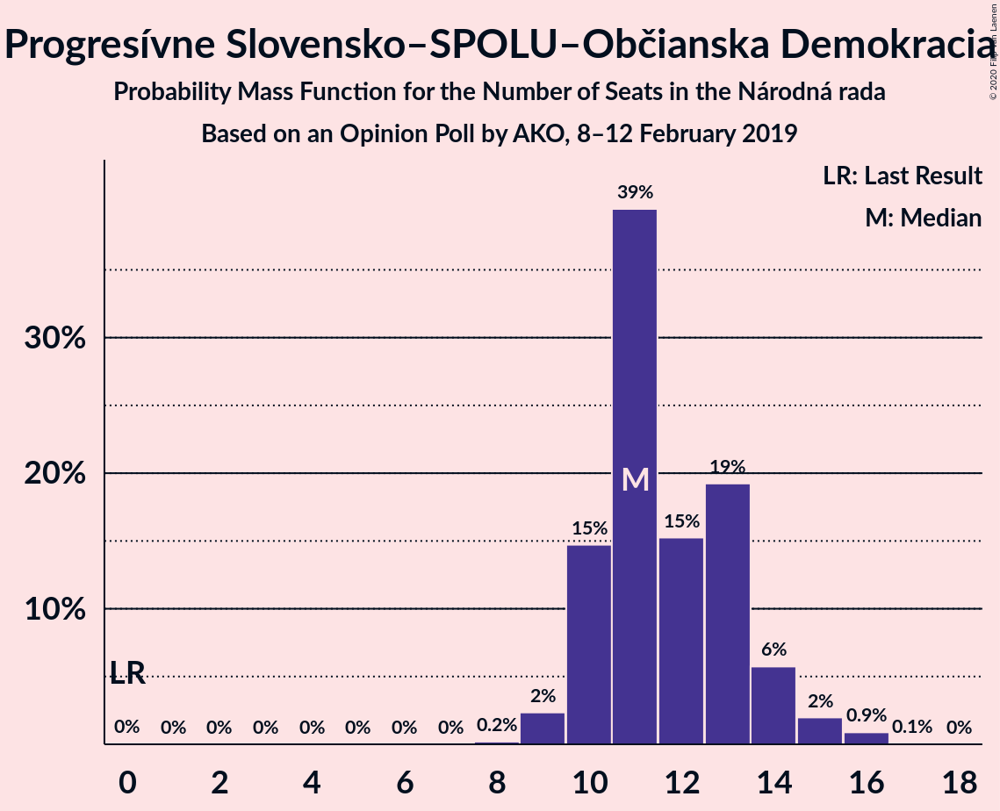
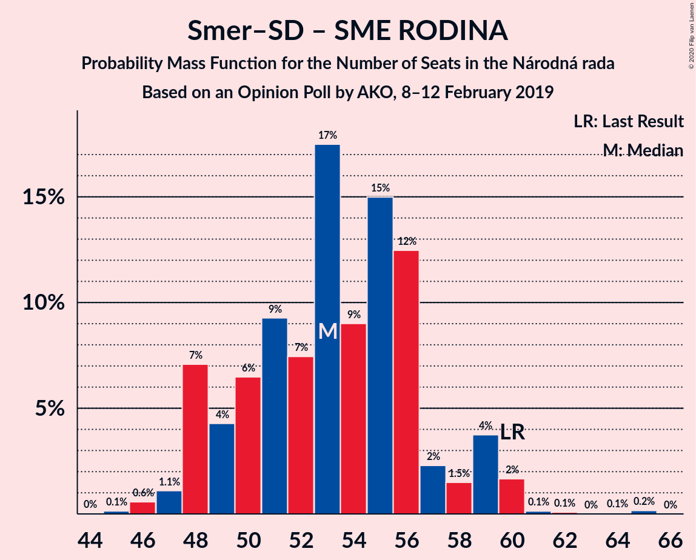
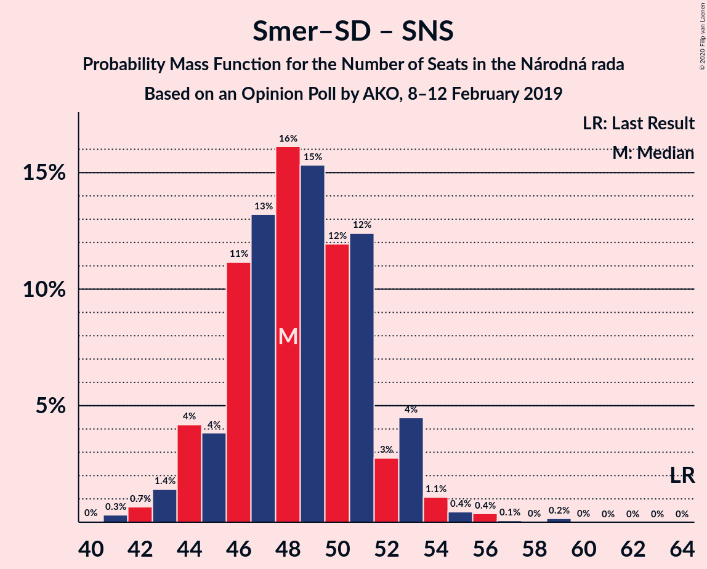

# Opinion Poll by AKO, 8–12 February 2019

<a href="#voting-intentions">Voting Intentions</a> | <a href="#seats">Seats</a> | <a href="#coalitions">Coalitions</a> | <a href="#technical-information">Technical Information</a>

## Voting Intentions

### Confidence Intervals

| Party | Last Result | Poll Result | 80% Confidence Interval | 90% Confidence Interval | 95% Confidence Interval | 99% Confidence Interval |
|:-----:|:-----------:|:-----------:|:-----------------------:|:-----------------------:|:-----------------------:|:-----------------------:|
| SMER–sociálna demokracia | 28.3% | 22.4% | 20.8–24.2% |20.3–24.7% |19.9–25.1% |19.2–26.0% |
| Sloboda a Solidarita | 12.1% | 14.8% | 13.4–16.3% |13.1–16.8% |12.7–17.1% |12.1–17.9% |
| SME RODINA | 6.6% | 10.9% | 9.7–12.3% |9.4–12.7% |9.1–13.0% |8.6–13.7% |
| OBYČAJNÍ ĽUDIA a nezávislé osobnosti | 11.0% | 10.1% | 9.0–11.4% |8.6–11.8% |8.4–12.1% |7.9–12.8% |
| Kotleba–Ľudová strana Naše Slovensko | 8.0% | 9.5% | 8.4–10.8% |8.1–11.2% |7.8–11.5% |7.3–12.1% |
| Slovenská národná strana | 8.6% | 8.0% | 7.0–9.2% |6.7–9.6% |6.5–9.9% |6.0–10.5% |
| Progresívne Slovensko–SPOLU–Občianska Demokracia | 0.0% | 7.5% | 6.5–8.7% |6.2–9.0% |6.0–9.3% |5.6–9.9% |
| MOST–HÍD | 6.5% | 6.3% | 5.4–7.4% |5.2–7.7% |5.0–8.0% |4.6–8.6% |
| Kresťanskodemokratické hnutie | 4.9% | 6.1% | 5.2–7.2% |5.0–7.5% |4.8–7.8% |4.4–8.3% |
| Strana maďarskej koalície–Magyar Koalíció Pártja | 4.0% | 3.3% | 2.7–4.1% |2.5–4.4% |2.4–4.6% |2.1–5.0% |

*Note:* The poll result column reflects the actual value used in the calculations. Published results may vary slightly, and in addition be rounded to fewer digits.

## Seats

### Confidence Intervals

| Party | Last Result | Median | 80% Confidence Interval | 90% Confidence Interval | 95% Confidence Interval | 99% Confidence Interval |
|:-----:|:-----------:|:------:|:-----------------------:|:-----------------------:|:-----------------------:|:-----------------------:|
| <a href="#smer–sociálna-demokracia">SMER–sociálna demokracia</a> | 49 | 36 | 33–39 |32–39 |31–39 |30–42 |
| <a href="#sloboda-a-solidarita">Sloboda a Solidarita</a> | 21 | 24 | 22–25 |21–27 |20–27 |19–28 |
| <a href="#sme-rodina">SME RODINA</a> | 11 | 18 | 15–20 |14–20 |14–20 |13–22 |
| <a href="#obyčajní-ľudia-a-nezávislé-osobnosti">OBYČAJNÍ ĽUDIA a nezávislé osobnosti</a> | 17 | 16 | 14–18 |14–19 |14–19 |12–21 |
| <a href="#kotleba–ľudová-strana-naše-slovensko">Kotleba–Ľudová strana Naše Slovensko</a> | 14 | 15 | 13–17 |13–18 |12–18 |12–19 |
| <a href="#slovenská-národná-strana">Slovenská národná strana</a> | 15 | 13 | 11–14 |11–15 |10–15 |9–17 |
| <a href="#progresívne-slovensko–spolu–občianska-demokracia">Progresívne Slovensko–SPOLU–Občianska Demokracia</a> | 0 | 11 | 11–13 |10–14 |10–15 |9–16 |
| <a href="#most–híd">MOST–HÍD</a> | 11 | 10 | 0–12 |0–12 |0–13 |0–14 |
| <a href="#kresťanskodemokratické-hnutie">Kresťanskodemokratické hnutie</a> | 0 | 10 | 8–11 |0–11 |0–12 |0–13 |
| <a href="#strana-maďarskej-koalície–magyar-koalíció-pártja">Strana maďarskej koalície–Magyar Koalíció Pártja</a> | 0 | 0 | 0 |0 |0 |0 |

### SMER–sociálna demokracia

*For a full overview of the results for this party, see the [SMER–sociálna demokracia](party-smer–sociálnademokracia.html) page.*

| Number of Seats | Probability | Accumulated | Special Marks |
|:---------------:|:-----------:|:-----------:|:-------------:|
| 29 | 0.2% | 100% |  |
| 30 | 1.1% | 99.8% |  |
| 31 | 2% | 98.7% |  |
| 32 | 6% | 97% |  |
| 33 | 5% | 90% |  |
| 34 | 13% | 85% |  |
| 35 | 5% | 72% |  |
| 36 | 35% | 67% | Median |
| 37 | 3% | 31% |  |
| 38 | 6% | 28% |  |
| 39 | 20% | 22% |  |
| 40 | 1.0% | 2% |  |
| 41 | 0.8% | 1.3% |  |
| 42 | 0.3% | 0.5% |  |
| 43 | 0.2% | 0.2% |  |
| 44 | 0% | 0% |  |
| 45 | 0% | 0% |  |
| 46 | 0% | 0% |  |
| 47 | 0% | 0% |  |
| 48 | 0% | 0% |  |
| 49 | 0% | 0% | Last Result |

### Sloboda a Solidarita

*For a full overview of the results for this party, see the [Sloboda a Solidarita](party-slobodaasolidarita.html) page.*

| Number of Seats | Probability | Accumulated | Special Marks |
|:---------------:|:-----------:|:-----------:|:-------------:|
| 18 | 0.4% | 100% |  |
| 19 | 0.8% | 99.6% |  |
| 20 | 3% | 98.8% |  |
| 21 | 6% | 96% | Last Result |
| 22 | 8% | 90% |  |
| 23 | 27% | 82% |  |
| 24 | 37% | 55% | Median |
| 25 | 8% | 18% |  |
| 26 | 3% | 10% |  |
| 27 | 4% | 6% |  |
| 28 | 2% | 2% |  |
| 29 | 0.1% | 0.4% |  |
| 30 | 0.3% | 0.3% |  |
| 31 | 0% | 0% |  |

### SME RODINA

*For a full overview of the results for this party, see the [SME RODINA](party-smerodina.html) page.*

| Number of Seats | Probability | Accumulated | Special Marks |
|:---------------:|:-----------:|:-----------:|:-------------:|
| 11 | 0% | 100% | Last Result |
| 12 | 0.2% | 100% |  |
| 13 | 2% | 99.8% |  |
| 14 | 3% | 98% |  |
| 15 | 8% | 94% |  |
| 16 | 5% | 86% |  |
| 17 | 30% | 81% |  |
| 18 | 29% | 51% | Median |
| 19 | 3% | 22% |  |
| 20 | 16% | 19% |  |
| 21 | 1.1% | 2% |  |
| 22 | 0.9% | 1.2% |  |
| 23 | 0.3% | 0.3% |  |
| 24 | 0% | 0% |  |

### OBYČAJNÍ ĽUDIA a nezávislé osobnosti

*For a full overview of the results for this party, see the [OBYČAJNÍ ĽUDIA a nezávislé osobnosti](party-obyčajníľudiaanezávisléosobnosti.html) page.*

| Number of Seats | Probability | Accumulated | Special Marks |
|:---------------:|:-----------:|:-----------:|:-------------:|
| 11 | 0.1% | 100% |  |
| 12 | 0.6% | 99.9% |  |
| 13 | 1.5% | 99.3% |  |
| 14 | 10% | 98% |  |
| 15 | 8% | 88% |  |
| 16 | 38% | 80% | Median |
| 17 | 28% | 41% | Last Result |
| 18 | 7% | 13% |  |
| 19 | 5% | 6% |  |
| 20 | 0.8% | 1.5% |  |
| 21 | 0.6% | 0.7% |  |
| 22 | 0% | 0% |  |

### Kotleba–Ľudová strana Naše Slovensko

*For a full overview of the results for this party, see the [Kotleba–Ľudová strana Naše Slovensko](party-kotleba–ľudovástrananašeslovensko.html) page.*

| Number of Seats | Probability | Accumulated | Special Marks |
|:---------------:|:-----------:|:-----------:|:-------------:|
| 11 | 0.3% | 100% |  |
| 12 | 4% | 99.7% |  |
| 13 | 36% | 96% |  |
| 14 | 7% | 60% | Last Result |
| 15 | 12% | 53% | Median |
| 16 | 27% | 40% |  |
| 17 | 7% | 13% |  |
| 18 | 4% | 6% |  |
| 19 | 1.2% | 2% |  |
| 20 | 0.3% | 0.4% |  |
| 21 | 0% | 0% |  |

### Slovenská národná strana

*For a full overview of the results for this party, see the [Slovenská národná strana](party-slovenskánárodnástrana.html) page.*

| Number of Seats | Probability | Accumulated | Special Marks |
|:---------------:|:-----------:|:-----------:|:-------------:|
| 8 | 0.1% | 100% |  |
| 9 | 0.5% | 99.9% |  |
| 10 | 3% | 99.4% |  |
| 11 | 7% | 96% |  |
| 12 | 31% | 89% |  |
| 13 | 24% | 58% | Median |
| 14 | 28% | 34% |  |
| 15 | 4% | 6% | Last Result |
| 16 | 0.8% | 2% |  |
| 17 | 1.2% | 1.4% |  |
| 18 | 0.2% | 0.2% |  |
| 19 | 0% | 0% |  |

### Progresívne Slovensko–SPOLU–Občianska Demokracia

*For a full overview of the results for this party, see the [Progresívne Slovensko–SPOLU–Občianska Demokracia](party-progresívneslovensko–spolu–občianskademokracia.html) page.*

| Number of Seats | Probability | Accumulated | Special Marks |
|:---------------:|:-----------:|:-----------:|:-------------:|
| 0 | 0% | 100% | Last Result |
| 1 | 0% | 100% |  |
| 2 | 0% | 100% |  |
| 3 | 0% | 100% |  |
| 4 | 0% | 100% |  |
| 5 | 0% | 100% |  |
| 6 | 0% | 100% |  |
| 7 | 0% | 100% |  |
| 8 | 0.3% | 100% |  |
| 9 | 2% | 99.7% |  |
| 10 | 8% | 98% |  |
| 11 | 59% | 90% | Median |
| 12 | 13% | 31% |  |
| 13 | 11% | 19% |  |
| 14 | 4% | 7% |  |
| 15 | 2% | 3% |  |
| 16 | 0.4% | 0.5% |  |
| 17 | 0.1% | 0.1% |  |
| 18 | 0% | 0% |  |

### MOST–HÍD

*For a full overview of the results for this party, see the [MOST–HÍD](party-most–híd.html) page.*

| Number of Seats | Probability | Accumulated | Special Marks |
|:---------------:|:-----------:|:-----------:|:-------------:|
| 0 | 18% | 100% |  |
| 1 | 0% | 82% |  |
| 2 | 0% | 82% |  |
| 3 | 0% | 82% |  |
| 4 | 0% | 82% |  |
| 5 | 0% | 82% |  |
| 6 | 0% | 82% |  |
| 7 | 0% | 82% |  |
| 8 | 2% | 82% |  |
| 9 | 24% | 80% |  |
| 10 | 16% | 55% | Median |
| 11 | 24% | 39% | Last Result |
| 12 | 12% | 15% |  |
| 13 | 2% | 3% |  |
| 14 | 1.1% | 1.2% |  |
| 15 | 0.1% | 0.1% |  |
| 16 | 0% | 0% |  |

### Kresťanskodemokratické hnutie

*For a full overview of the results for this party, see the [Kresťanskodemokratické hnutie](party-kresťanskodemokratickéhnutie.html) page.*

| Number of Seats | Probability | Accumulated | Special Marks |
|:---------------:|:-----------:|:-----------:|:-------------:|
| 0 | 7% | 100% | Last Result |
| 1 | 0% | 93% |  |
| 2 | 0% | 93% |  |
| 3 | 0% | 93% |  |
| 4 | 0% | 93% |  |
| 5 | 0% | 93% |  |
| 6 | 0% | 93% |  |
| 7 | 0% | 93% |  |
| 8 | 16% | 93% |  |
| 9 | 24% | 77% |  |
| 10 | 25% | 53% | Median |
| 11 | 24% | 29% |  |
| 12 | 3% | 4% |  |
| 13 | 0.8% | 0.9% |  |
| 14 | 0.1% | 0.1% |  |
| 15 | 0% | 0% |  |

### Strana maďarskej koalície–Magyar Koalíció Pártja

*For a full overview of the results for this party, see the [Strana maďarskej koalície–Magyar Koalíció Pártja](party-stranamaďarskejkoalície–magyarkoalíciópártja.html) page.*

| Number of Seats | Probability | Accumulated | Special Marks |
|:---------------:|:-----------:|:-----------:|:-------------:|
| 0 | 99.6% | 100% | Last Result, Median |
| 1 | 0% | 0.4% |  |
| 2 | 0% | 0.4% |  |
| 3 | 0% | 0.4% |  |
| 4 | 0% | 0.4% |  |
| 5 | 0% | 0.4% |  |
| 6 | 0% | 0.4% |  |
| 7 | 0% | 0.4% |  |
| 8 | 0.4% | 0.4% |  |
| 9 | 0.1% | 0.1% |  |
| 10 | 0% | 0% |  |

## Coalitions

### Confidence Intervals

| Coalition | Last Result | Median | Majority? | 80% Confidence Interval | 90% Confidence Interval | 95% Confidence Interval | 99% Confidence Interval |
|:---------:|:-----------:|:------:|:---------:|:-----------------------:|:-----------------------:|:-----------------------:|:-----------------------:|
| SMER–sociálna demokracia – SME RODINA – Kotleba–Ľudová strana Naše Slovensko – Slovenská národná strana | 89 | 80 | 93% | 77–89 | 75–89 | 75–89 | 74–90 |
| SMER–sociálna demokracia – SME RODINA – Slovenská národná strana | 75 | 66 | 0.4% | 63–73 | 61–73 | 60–73 | 58–74 |
| SMER–sociálna demokracia – Slovenská národná strana – MOST–HÍD | 75 | 58 | 0% | 53–61 | 53–62 | 52–63 | 48–65 |
| SMER–sociálna demokracia – SME RODINA | 60 | 53 | 0% | 50–59 | 49–59 | 47–59 | 46–61 |
| SMER–sociálna demokracia – Slovenská národná strana | 64 | 48 | 0% | 46–53 | 44–53 | 43–54 | 41–55 |
| SMER–sociálna demokracia | 49 | 36 | 0% | 33–39 | 32–39 | 31–39 | 30–42 |

### SMER–sociálna demokracia – SME RODINA – Kotleba–Ľudová strana Naše Slovensko – Slovenská národná strana

| Number of Seats | Probability | Accumulated | Special Marks |
|:---------------:|:-----------:|:-----------:|:-------------:|
| 71 | 0% | 100% |  |
| 72 | 0.1% | 99.9% |  |
| 73 | 0.2% | 99.8% |  |
| 74 | 2% | 99.7% |  |
| 75 | 5% | 98% |  |
| 76 | 3% | 93% | Majority |
| 77 | 2% | 90% |  |
| 78 | 18% | 89% |  |
| 79 | 10% | 71% |  |
| 80 | 20% | 61% |  |
| 81 | 7% | 40% |  |
| 82 | 10% | 34% | Median |
| 83 | 5% | 24% |  |
| 84 | 1.5% | 20% |  |
| 85 | 0.9% | 18% |  |
| 86 | 0.6% | 17% |  |
| 87 | 0.5% | 17% |  |
| 88 | 0.9% | 16% |  |
| 89 | 15% | 15% | Last Result |
| 90 | 0.2% | 0.6% |  |
| 91 | 0.1% | 0.4% |  |
| 92 | 0.3% | 0.3% |  |
| 93 | 0% | 0% |  |

### SMER–sociálna demokracia – SME RODINA – Slovenská národná strana

| Number of Seats | Probability | Accumulated | Special Marks |
|:---------------:|:-----------:|:-----------:|:-------------:|
| 57 | 0.1% | 100% |  |
| 58 | 2% | 99.8% |  |
| 59 | 0.3% | 98% |  |
| 60 | 2% | 98% |  |
| 61 | 3% | 96% |  |
| 62 | 2% | 93% |  |
| 63 | 10% | 91% |  |
| 64 | 10% | 81% |  |
| 65 | 20% | 71% |  |
| 66 | 8% | 51% |  |
| 67 | 20% | 43% | Median |
| 68 | 3% | 23% |  |
| 69 | 2% | 20% |  |
| 70 | 0.7% | 18% |  |
| 71 | 2% | 18% |  |
| 72 | 0.1% | 16% |  |
| 73 | 15% | 16% |  |
| 74 | 0.2% | 0.7% |  |
| 75 | 0.1% | 0.5% | Last Result |
| 76 | 0.2% | 0.4% | Majority |
| 77 | 0.2% | 0.2% |  |
| 78 | 0% | 0% |  |

### SMER–sociálna demokracia – Slovenská národná strana – MOST–HÍD

| Number of Seats | Probability | Accumulated | Special Marks |
|:---------------:|:-----------:|:-----------:|:-------------:|
| 46 | 0.1% | 100% |  |
| 47 | 0.4% | 99.9% |  |
| 48 | 0.6% | 99.6% |  |
| 49 | 0.1% | 98.9% |  |
| 50 | 0.2% | 98.8% |  |
| 51 | 0.7% | 98.6% |  |
| 52 | 1.3% | 98% |  |
| 53 | 15% | 97% |  |
| 54 | 3% | 82% |  |
| 55 | 5% | 79% |  |
| 56 | 3% | 74% |  |
| 57 | 9% | 71% |  |
| 58 | 28% | 62% |  |
| 59 | 20% | 34% | Median |
| 60 | 2% | 14% |  |
| 61 | 6% | 11% |  |
| 62 | 2% | 5% |  |
| 63 | 1.1% | 3% |  |
| 64 | 1.0% | 2% |  |
| 65 | 0.8% | 1.0% |  |
| 66 | 0.1% | 0.3% |  |
| 67 | 0.1% | 0.2% |  |
| 68 | 0.1% | 0.1% |  |
| 69 | 0% | 0% |  |
| 70 | 0% | 0% |  |
| 71 | 0% | 0% |  |
| 72 | 0% | 0% |  |
| 73 | 0% | 0% |  |
| 74 | 0% | 0% |  |
| 75 | 0% | 0% | Last Result |

### SMER–sociálna demokracia – SME RODINA

| Number of Seats | Probability | Accumulated | Special Marks |
|:---------------:|:-----------:|:-----------:|:-------------:|
| 45 | 0.2% | 100% |  |
| 46 | 1.0% | 99.8% |  |
| 47 | 2% | 98.8% |  |
| 48 | 1.1% | 97% |  |
| 49 | 2% | 96% |  |
| 50 | 10% | 93% |  |
| 51 | 13% | 83% |  |
| 52 | 4% | 70% |  |
| 53 | 18% | 66% |  |
| 54 | 24% | 48% | Median |
| 55 | 2% | 24% |  |
| 56 | 4% | 22% |  |
| 57 | 2% | 18% |  |
| 58 | 0.8% | 16% |  |
| 59 | 15% | 15% |  |
| 60 | 0.1% | 0.7% | Last Result |
| 61 | 0.2% | 0.6% |  |
| 62 | 0.2% | 0.4% |  |
| 63 | 0% | 0.2% |  |
| 64 | 0.2% | 0.2% |  |
| 65 | 0% | 0% |  |

### SMER–sociálna demokracia – Slovenská národná strana

| Number of Seats | Probability | Accumulated | Special Marks |
|:---------------:|:-----------:|:-----------:|:-------------:|
| 41 | 0.6% | 100% |  |
| 42 | 0.9% | 99.4% |  |
| 43 | 1.2% | 98% |  |
| 44 | 3% | 97% |  |
| 45 | 2% | 95% |  |
| 46 | 14% | 92% |  |
| 47 | 4% | 79% |  |
| 48 | 25% | 75% |  |
| 49 | 22% | 50% | Median |
| 50 | 3% | 28% |  |
| 51 | 5% | 25% |  |
| 52 | 1.5% | 19% |  |
| 53 | 15% | 18% |  |
| 54 | 0.9% | 3% |  |
| 55 | 1.3% | 2% |  |
| 56 | 0.1% | 0.3% |  |
| 57 | 0.2% | 0.2% |  |
| 58 | 0% | 0% |  |
| 59 | 0% | 0% |  |
| 60 | 0% | 0% |  |
| 61 | 0% | 0% |  |
| 62 | 0% | 0% |  |
| 63 | 0% | 0% |  |
| 64 | 0% | 0% | Last Result |

### SMER–sociálna demokracia

| Number of Seats | Probability | Accumulated | Special Marks |
|:---------------:|:-----------:|:-----------:|:-------------:|
| 29 | 0.2% | 100% |  |
| 30 | 1.1% | 99.8% |  |
| 31 | 2% | 98.7% |  |
| 32 | 6% | 97% |  |
| 33 | 5% | 90% |  |
| 34 | 13% | 85% |  |
| 35 | 5% | 72% |  |
| 36 | 35% | 67% | Median |
| 37 | 3% | 31% |  |
| 38 | 6% | 28% |  |
| 39 | 20% | 22% |  |
| 40 | 1.0% | 2% |  |
| 41 | 0.8% | 1.3% |  |
| 42 | 0.3% | 0.5% |  |
| 43 | 0.2% | 0.2% |  |
| 44 | 0% | 0% |  |
| 45 | 0% | 0% |  |
| 46 | 0% | 0% |  |
| 47 | 0% | 0% |  |
| 48 | 0% | 0% |  |
| 49 | 0% | 0% | Last Result |

## Technical Information

### Opinion Poll

+ **Polling firm:** AKO
+ **Commissioner(s):** —
+ **Fieldwork period:** 8–12 February 2019

### Calculations

+ **Sample size:** 1000
+ **Simulations done:** 262,144
+ **Error estimate:** 1.74%

