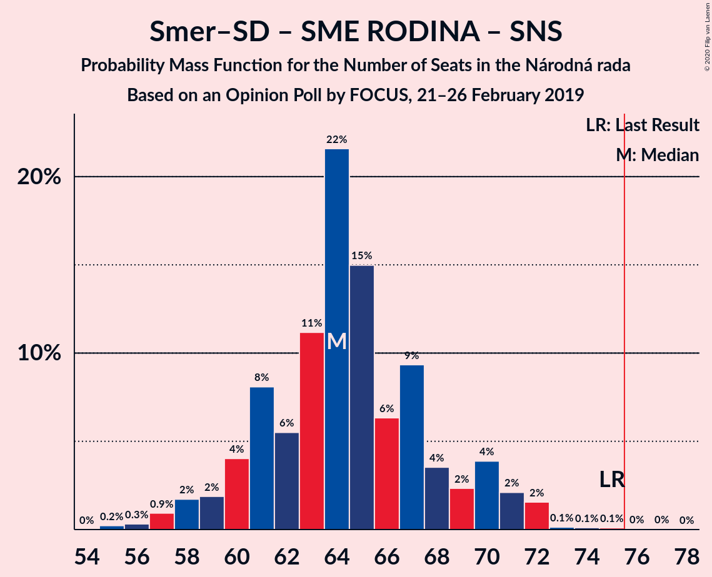
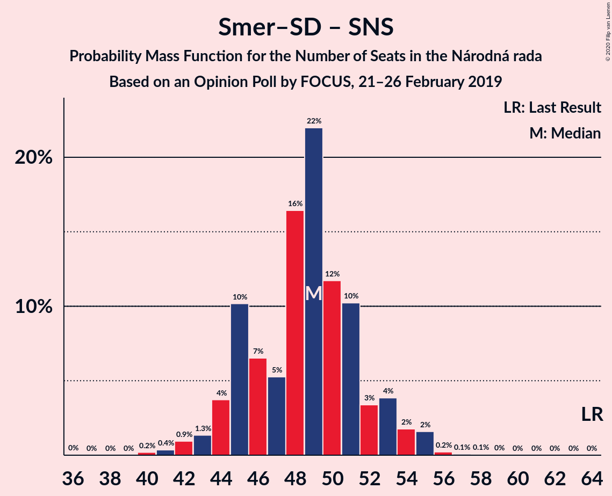

# Opinion Poll by FOCUS, 21–26 February 2019

<a href="#voting-intentions">Voting Intentions</a> | <a href="#seats">Seats</a> | <a href="#coalitions">Coalitions</a> | <a href="#technical-information">Technical Information</a>

## Voting Intentions

### Confidence Intervals

| Party | Last Result | Poll Result | 80% Confidence Interval | 90% Confidence Interval | 95% Confidence Interval | 99% Confidence Interval |
|:-----:|:-----------:|:-----------:|:-----------------------:|:-----------------------:|:-----------------------:|:-----------------------:|
| SMER–sociálna demokracia | 28.3% | 21.2% | 19.7–23.0% |19.2–23.4% |18.8–23.9% |18.1–24.7% |
| Kotleba–Ľudová strana Naše Slovensko | 8.0% | 11.7% | 10.5–13.1% |10.2–13.5% |9.9–13.9% |9.4–14.6% |
| Sloboda a Solidarita | 12.1% | 11.2% | 10.0–12.5% |9.6–12.9% |9.4–13.2% |8.8–13.9% |
| SME RODINA | 6.6% | 9.5% | 8.4–10.8% |8.1–11.1% |7.8–11.4% |7.3–12.1% |
| Progresívne Slovensko–SPOLU–Občianska Demokracia | 0.0% | 9.5% | 8.4–10.8% |8.1–11.1% |7.8–11.4% |7.3–12.1% |
| OBYČAJNÍ ĽUDIA a nezávislé osobnosti | 11.0% | 8.4% | 7.4–9.6% |7.1–10.0% |6.9–10.3% |6.4–10.9% |
| Slovenská národná strana | 8.6% | 7.5% | 6.6–8.7% |6.3–9.0% |6.1–9.3% |5.6–9.9% |
| Kresťanskodemokratické hnutie | 4.9% | 6.5% | 5.6–7.6% |5.3–7.9% |5.1–8.1% |4.7–8.7% |
| MOST–HÍD | 6.5% | 5.4% | 4.6–6.4% |4.3–6.7% |4.2–7.0% |3.8–7.5% |
| Strana maďarskej koalície–Magyar Koalíció Pártja | 4.0% | 3.1% | 2.5–3.9% |2.4–4.2% |2.2–4.4% |2.0–4.8% |

*Note:* The poll result column reflects the actual value used in the calculations. Published results may vary slightly, and in addition be rounded to fewer digits.

## Seats

### Confidence Intervals

| Party | Last Result | Median | 80% Confidence Interval | 90% Confidence Interval | 95% Confidence Interval | 99% Confidence Interval |
|:-----:|:-----------:|:------:|:-----------------------:|:-----------------------:|:-----------------------:|:-----------------------:|
| <a href="#smer–sociálna-demokracia">SMER–sociálna demokracia</a> | 49 | 36 | 33–39 |32–40 |31–40 |30–42 |
| <a href="#kotleba–ľudová-strana-naše-slovensko">Kotleba–Ľudová strana Naše Slovensko</a> | 14 | 21 | 18–22 |16–22 |16–23 |15–24 |
| <a href="#sloboda-a-solidarita">Sloboda a Solidarita</a> | 21 | 19 | 17–20 |16–21 |15–22 |15–24 |
| <a href="#sme-rodina">SME RODINA</a> | 11 | 16 | 15–18 |14–18 |13–20 |12–20 |
| <a href="#progresívne-slovensko–spolu–občianska-demokracia">Progresívne Slovensko–SPOLU–Občianska Demokracia</a> | 0 | 16 | 14–19 |14–19 |13–19 |12–20 |
| <a href="#obyčajní-ľudia-a-nezávislé-osobnosti">OBYČAJNÍ ĽUDIA a nezávislé osobnosti</a> | 17 | 15 | 12–17 |12–17 |11–17 |11–18 |
| <a href="#slovenská-národná-strana">Slovenská národná strana</a> | 15 | 13 | 11–14 |10–15 |10–16 |10–17 |
| <a href="#kresťanskodemokratické-hnutie">Kresťanskodemokratické hnutie</a> | 0 | 11 | 9–12 |0–13 |0–13 |0–14 |
| <a href="#most–híd">MOST–HÍD</a> | 11 | 9 | 0–11 |0–11 |0–11 |0–13 |
| <a href="#strana-maďarskej-koalície–magyar-koalíció-pártja">Strana maďarskej koalície–Magyar Koalíció Pártja</a> | 0 | 0 | 0 |0 |0 |0 |

### SMER–sociálna demokracia

*For a full overview of the results for this party, see the [SMER–sociálna demokracia](party-smer–sociálnademokracia.html) page.*

| Number of Seats | Probability | Accumulated | Special Marks |
|:---------------:|:-----------:|:-----------:|:-------------:|
| 29 | 0.1% | 100% |  |
| 30 | 0.9% | 99.9% |  |
| 31 | 3% | 99.0% |  |
| 32 | 6% | 96% |  |
| 33 | 5% | 90% |  |
| 34 | 14% | 86% |  |
| 35 | 14% | 72% |  |
| 36 | 29% | 58% | Median |
| 37 | 10% | 30% |  |
| 38 | 4% | 20% |  |
| 39 | 10% | 16% |  |
| 40 | 5% | 6% |  |
| 41 | 0.4% | 1.3% |  |
| 42 | 0.6% | 0.8% |  |
| 43 | 0.2% | 0.2% |  |
| 44 | 0% | 0.1% |  |
| 45 | 0% | 0% |  |
| 46 | 0% | 0% |  |
| 47 | 0% | 0% |  |
| 48 | 0% | 0% |  |
| 49 | 0% | 0% | Last Result |

### Kotleba–Ľudová strana Naše Slovensko

*For a full overview of the results for this party, see the [Kotleba–Ľudová strana Naše Slovensko](party-kotleba–ľudovástrananašeslovensko.html) page.*

| Number of Seats | Probability | Accumulated | Special Marks |
|:---------------:|:-----------:|:-----------:|:-------------:|
| 14 | 0% | 100% | Last Result |
| 15 | 1.3% | 100% |  |
| 16 | 4% | 98.7% |  |
| 17 | 4% | 95% |  |
| 18 | 13% | 90% |  |
| 19 | 13% | 77% |  |
| 20 | 12% | 64% |  |
| 21 | 39% | 52% | Median |
| 22 | 9% | 13% |  |
| 23 | 2% | 4% |  |
| 24 | 1.3% | 2% |  |
| 25 | 0.2% | 0.5% |  |
| 26 | 0.1% | 0.3% |  |
| 27 | 0.2% | 0.2% |  |
| 28 | 0% | 0% |  |

### Sloboda a Solidarita

*For a full overview of the results for this party, see the [Sloboda a Solidarita](party-slobodaasolidarita.html) page.*

| Number of Seats | Probability | Accumulated | Special Marks |
|:---------------:|:-----------:|:-----------:|:-------------:|
| 14 | 0.2% | 100% |  |
| 15 | 3% | 99.7% |  |
| 16 | 5% | 96% |  |
| 17 | 15% | 91% |  |
| 18 | 20% | 76% |  |
| 19 | 27% | 56% | Median |
| 20 | 20% | 29% |  |
| 21 | 6% | 9% | Last Result |
| 22 | 2% | 3% |  |
| 23 | 0.9% | 1.4% |  |
| 24 | 0.1% | 0.5% |  |
| 25 | 0.4% | 0.4% |  |
| 26 | 0% | 0% |  |

### SME RODINA

*For a full overview of the results for this party, see the [SME RODINA](party-smerodina.html) page.*

| Number of Seats | Probability | Accumulated | Special Marks |
|:---------------:|:-----------:|:-----------:|:-------------:|
| 11 | 0.2% | 100% | Last Result |
| 12 | 1.1% | 99.8% |  |
| 13 | 3% | 98.8% |  |
| 14 | 4% | 96% |  |
| 15 | 27% | 92% |  |
| 16 | 34% | 65% | Median |
| 17 | 16% | 31% |  |
| 18 | 10% | 15% |  |
| 19 | 1.3% | 5% |  |
| 20 | 3% | 4% |  |
| 21 | 0.2% | 0.4% |  |
| 22 | 0.2% | 0.2% |  |
| 23 | 0% | 0% |  |

### Progresívne Slovensko–SPOLU–Občianska Demokracia

*For a full overview of the results for this party, see the [Progresívne Slovensko–SPOLU–Občianska Demokracia](party-progresívneslovensko–spolu–občianskademokracia.html) page.*

| Number of Seats | Probability | Accumulated | Special Marks |
|:---------------:|:-----------:|:-----------:|:-------------:|
| 0 | 0% | 100% | Last Result |
| 1 | 0% | 100% |  |
| 2 | 0% | 100% |  |
| 3 | 0% | 100% |  |
| 4 | 0% | 100% |  |
| 5 | 0% | 100% |  |
| 6 | 0% | 100% |  |
| 7 | 0% | 100% |  |
| 8 | 0% | 100% |  |
| 9 | 0% | 100% |  |
| 10 | 0% | 100% |  |
| 11 | 0.1% | 100% |  |
| 12 | 1.3% | 99.9% |  |
| 13 | 2% | 98.6% |  |
| 14 | 10% | 97% |  |
| 15 | 21% | 87% |  |
| 16 | 31% | 66% | Median |
| 17 | 15% | 35% |  |
| 18 | 6% | 20% |  |
| 19 | 12% | 13% |  |
| 20 | 0.6% | 1.0% |  |
| 21 | 0.3% | 0.4% |  |
| 22 | 0.1% | 0.1% |  |
| 23 | 0% | 0% |  |

### OBYČAJNÍ ĽUDIA a nezávislé osobnosti

*For a full overview of the results for this party, see the [OBYČAJNÍ ĽUDIA a nezávislé osobnosti](party-obyčajníľudiaanezávisléosobnosti.html) page.*

| Number of Seats | Probability | Accumulated | Special Marks |
|:---------------:|:-----------:|:-----------:|:-------------:|
| 10 | 0.4% | 100% |  |
| 11 | 2% | 99.6% |  |
| 12 | 12% | 97% |  |
| 13 | 13% | 85% |  |
| 14 | 20% | 72% |  |
| 15 | 11% | 52% | Median |
| 16 | 22% | 41% |  |
| 17 | 18% | 19% | Last Result |
| 18 | 1.1% | 1.2% |  |
| 19 | 0.1% | 0.2% |  |
| 20 | 0.1% | 0.1% |  |
| 21 | 0% | 0% |  |

### Slovenská národná strana

*For a full overview of the results for this party, see the [Slovenská národná strana](party-slovenskánárodnástrana.html) page.*

| Number of Seats | Probability | Accumulated | Special Marks |
|:---------------:|:-----------:|:-----------:|:-------------:|
| 0 | 0.1% | 100% |  |
| 1 | 0% | 99.9% |  |
| 2 | 0% | 99.9% |  |
| 3 | 0% | 99.9% |  |
| 4 | 0% | 99.9% |  |
| 5 | 0% | 99.9% |  |
| 6 | 0% | 99.9% |  |
| 7 | 0% | 99.9% |  |
| 8 | 0% | 99.9% |  |
| 9 | 0.3% | 99.9% |  |
| 10 | 9% | 99.6% |  |
| 11 | 13% | 90% |  |
| 12 | 16% | 77% |  |
| 13 | 38% | 61% | Median |
| 14 | 14% | 23% |  |
| 15 | 6% | 9% | Last Result |
| 16 | 2% | 3% |  |
| 17 | 0.7% | 0.8% |  |
| 18 | 0.1% | 0.1% |  |
| 19 | 0% | 0% |  |

### Kresťanskodemokratické hnutie

*For a full overview of the results for this party, see the [Kresťanskodemokratické hnutie](party-kresťanskodemokratickéhnutie.html) page.*

| Number of Seats | Probability | Accumulated | Special Marks |
|:---------------:|:-----------:|:-----------:|:-------------:|
| 0 | 6% | 100% | Last Result |
| 1 | 0% | 94% |  |
| 2 | 0% | 94% |  |
| 3 | 0% | 94% |  |
| 4 | 0% | 94% |  |
| 5 | 0% | 94% |  |
| 6 | 0% | 94% |  |
| 7 | 0% | 94% |  |
| 8 | 0.5% | 94% |  |
| 9 | 15% | 94% |  |
| 10 | 21% | 79% |  |
| 11 | 27% | 58% | Median |
| 12 | 22% | 31% |  |
| 13 | 7% | 9% |  |
| 14 | 2% | 2% |  |
| 15 | 0.2% | 0.3% |  |
| 16 | 0% | 0% |  |

### MOST–HÍD

*For a full overview of the results for this party, see the [MOST–HÍD](party-most–híd.html) page.*

| Number of Seats | Probability | Accumulated | Special Marks |
|:---------------:|:-----------:|:-----------:|:-------------:|
| 0 | 40% | 100% |  |
| 1 | 0% | 60% |  |
| 2 | 0% | 60% |  |
| 3 | 0% | 60% |  |
| 4 | 0% | 60% |  |
| 5 | 0% | 60% |  |
| 6 | 0% | 60% |  |
| 7 | 0% | 60% |  |
| 8 | 9% | 60% |  |
| 9 | 23% | 52% | Median |
| 10 | 19% | 29% |  |
| 11 | 8% | 11% | Last Result |
| 12 | 2% | 2% |  |
| 13 | 0.7% | 0.7% |  |
| 14 | 0% | 0% |  |

### Strana maďarskej koalície–Magyar Koalíció Pártja

*For a full overview of the results for this party, see the [Strana maďarskej koalície–Magyar Koalíció Pártja](party-stranamaďarskejkoalície–magyarkoalíciópártja.html) page.*

| Number of Seats | Probability | Accumulated | Special Marks |
|:---------------:|:-----------:|:-----------:|:-------------:|
| 0 | 99.9% | 100% | Last Result, Median |
| 1 | 0% | 0.1% |  |
| 2 | 0% | 0.1% |  |
| 3 | 0% | 0.1% |  |
| 4 | 0% | 0.1% |  |
| 5 | 0% | 0.1% |  |
| 6 | 0% | 0.1% |  |
| 7 | 0% | 0.1% |  |
| 8 | 0.1% | 0.1% |  |
| 9 | 0.1% | 0.1% |  |
| 10 | 0% | 0% |  |

## Coalitions

### Confidence Intervals

| Coalition | Last Result | Median | Majority? | 80% Confidence Interval | 90% Confidence Interval | 95% Confidence Interval | 99% Confidence Interval |
|:---------:|:-----------:|:------:|:---------:|:-----------------------:|:-----------------------:|:-----------------------:|:-----------------------:|
| SMER–sociálna demokracia – Kotleba–Ľudová strana Naše Slovensko – SME RODINA – Slovenská národná strana | 89 | 85 | 99.7% | 79–89 | 79–92 | 78–93 | 76–94 |
| SMER–sociálna demokracia – SME RODINA – Slovenská národná strana | 75 | 64 | 0.1% | 61–69 | 60–71 | 59–72 | 56–72 |
| SMER–sociálna demokracia – Slovenská národná strana – MOST–HÍD | 75 | 54 | 0% | 49–59 | 49–60 | 49–62 | 45–63 |
| SMER–sociálna demokracia – SME RODINA | 60 | 51 | 0% | 48–56 | 47–57 | 47–57 | 45–59 |
| SMER–sociálna demokracia – Slovenská národná strana | 64 | 49 | 0% | 45–52 | 44–53 | 44–54 | 41–55 |
| SMER–sociálna demokracia | 49 | 36 | 0% | 33–39 | 32–40 | 31–40 | 30–42 |

### SMER–sociálna demokracia – Kotleba–Ľudová strana Naše Slovensko – SME RODINA – Slovenská národná strana

| Number of Seats | Probability | Accumulated | Special Marks |
|:---------------:|:-----------:|:-----------:|:-------------:|
| 74 | 0% | 100% |  |
| 75 | 0.3% | 99.9% |  |
| 76 | 0.4% | 99.7% | Majority |
| 77 | 1.5% | 99.3% |  |
| 78 | 0.9% | 98% |  |
| 79 | 8% | 97% |  |
| 80 | 9% | 89% |  |
| 81 | 5% | 80% |  |
| 82 | 3% | 75% |  |
| 83 | 13% | 72% |  |
| 84 | 5% | 59% |  |
| 85 | 16% | 54% |  |
| 86 | 15% | 39% | Median |
| 87 | 6% | 24% |  |
| 88 | 5% | 18% |  |
| 89 | 4% | 13% | Last Result |
| 90 | 2% | 9% |  |
| 91 | 2% | 7% |  |
| 92 | 2% | 5% |  |
| 93 | 2% | 3% |  |
| 94 | 0.2% | 0.6% |  |
| 95 | 0.1% | 0.5% |  |
| 96 | 0.1% | 0.3% |  |
| 97 | 0.2% | 0.3% |  |
| 98 | 0% | 0.1% |  |
| 99 | 0.1% | 0.1% |  |
| 100 | 0% | 0% |  |

### SMER–sociálna demokracia – SME RODINA – Slovenská národná strana

| Number of Seats | Probability | Accumulated | Special Marks |
|:---------------:|:-----------:|:-----------:|:-------------:|
| 55 | 0.3% | 100% |  |
| 56 | 0.2% | 99.7% |  |
| 57 | 0.6% | 99.5% |  |
| 58 | 0.8% | 98.8% |  |
| 59 | 2% | 98% |  |
| 60 | 5% | 96% |  |
| 61 | 12% | 91% |  |
| 62 | 5% | 79% |  |
| 63 | 9% | 75% |  |
| 64 | 20% | 66% |  |
| 65 | 17% | 46% | Median |
| 66 | 4% | 29% |  |
| 67 | 12% | 25% |  |
| 68 | 2% | 13% |  |
| 69 | 2% | 11% |  |
| 70 | 3% | 9% |  |
| 71 | 3% | 6% |  |
| 72 | 2% | 3% |  |
| 73 | 0.2% | 0.4% |  |
| 74 | 0.1% | 0.2% |  |
| 75 | 0.1% | 0.1% | Last Result |
| 76 | 0% | 0.1% | Majority |
| 77 | 0% | 0% |  |

### SMER–sociálna demokracia – Slovenská národná strana – MOST–HÍD

| Number of Seats | Probability | Accumulated | Special Marks |
|:---------------:|:-----------:|:-----------:|:-------------:|
| 44 | 0.4% | 100% |  |
| 45 | 0.4% | 99.6% |  |
| 46 | 0.3% | 99.2% |  |
| 47 | 0.4% | 98.9% |  |
| 48 | 0.7% | 98% |  |
| 49 | 21% | 98% |  |
| 50 | 6% | 77% |  |
| 51 | 2% | 71% |  |
| 52 | 4% | 69% |  |
| 53 | 8% | 65% |  |
| 54 | 9% | 56% |  |
| 55 | 7% | 47% |  |
| 56 | 3% | 40% |  |
| 57 | 11% | 37% |  |
| 58 | 9% | 26% | Median |
| 59 | 8% | 17% |  |
| 60 | 6% | 9% |  |
| 61 | 0.5% | 3% |  |
| 62 | 0.8% | 3% |  |
| 63 | 2% | 2% |  |
| 64 | 0.1% | 0.2% |  |
| 65 | 0% | 0.1% |  |
| 66 | 0% | 0% |  |
| 67 | 0% | 0% |  |
| 68 | 0% | 0% |  |
| 69 | 0% | 0% |  |
| 70 | 0% | 0% |  |
| 71 | 0% | 0% |  |
| 72 | 0% | 0% |  |
| 73 | 0% | 0% |  |
| 74 | 0% | 0% |  |
| 75 | 0% | 0% | Last Result |

### SMER–sociálna demokracia – SME RODINA

| Number of Seats | Probability | Accumulated | Special Marks |
|:---------------:|:-----------:|:-----------:|:-------------:|
| 43 | 0% | 100% |  |
| 44 | 0.2% | 99.9% |  |
| 45 | 0.6% | 99.8% |  |
| 46 | 0.6% | 99.1% |  |
| 47 | 5% | 98% |  |
| 48 | 4% | 93% |  |
| 49 | 8% | 89% |  |
| 50 | 8% | 81% |  |
| 51 | 22% | 72% |  |
| 52 | 19% | 50% | Median |
| 53 | 6% | 31% |  |
| 54 | 7% | 25% |  |
| 55 | 5% | 18% |  |
| 56 | 4% | 13% |  |
| 57 | 6% | 8% |  |
| 58 | 2% | 2% |  |
| 59 | 0.5% | 0.8% |  |
| 60 | 0.2% | 0.4% | Last Result |
| 61 | 0% | 0.1% |  |
| 62 | 0% | 0.1% |  |
| 63 | 0% | 0% |  |

### SMER–sociálna demokracia – Slovenská národná strana

| Number of Seats | Probability | Accumulated | Special Marks |
|:---------------:|:-----------:|:-----------:|:-------------:|
| 36 | 0.1% | 100% |  |
| 37 | 0% | 99.9% |  |
| 38 | 0% | 99.9% |  |
| 39 | 0% | 99.9% |  |
| 40 | 0.3% | 99.9% |  |
| 41 | 0.5% | 99.6% |  |
| 42 | 0.3% | 99.1% |  |
| 43 | 1.1% | 98.8% |  |
| 44 | 3% | 98% |  |
| 45 | 14% | 94% |  |
| 46 | 6% | 80% |  |
| 47 | 4% | 74% |  |
| 48 | 16% | 70% |  |
| 49 | 26% | 55% | Median |
| 50 | 11% | 28% |  |
| 51 | 5% | 17% |  |
| 52 | 5% | 12% |  |
| 53 | 4% | 7% |  |
| 54 | 2% | 4% |  |
| 55 | 2% | 2% |  |
| 56 | 0.1% | 0.3% |  |
| 57 | 0% | 0.2% |  |
| 58 | 0.1% | 0.1% |  |
| 59 | 0.1% | 0.1% |  |
| 60 | 0% | 0% |  |
| 61 | 0% | 0% |  |
| 62 | 0% | 0% |  |
| 63 | 0% | 0% |  |
| 64 | 0% | 0% | Last Result |

### SMER–sociálna demokracia

| Number of Seats | Probability | Accumulated | Special Marks |
|:---------------:|:-----------:|:-----------:|:-------------:|
| 29 | 0.1% | 100% |  |
| 30 | 0.9% | 99.9% |  |
| 31 | 3% | 99.0% |  |
| 32 | 6% | 96% |  |
| 33 | 5% | 90% |  |
| 34 | 14% | 86% |  |
| 35 | 14% | 72% |  |
| 36 | 29% | 58% | Median |
| 37 | 10% | 30% |  |
| 38 | 4% | 20% |  |
| 39 | 10% | 16% |  |
| 40 | 5% | 6% |  |
| 41 | 0.4% | 1.3% |  |
| 42 | 0.6% | 0.8% |  |
| 43 | 0.2% | 0.2% |  |
| 44 | 0% | 0.1% |  |
| 45 | 0% | 0% |  |
| 46 | 0% | 0% |  |
| 47 | 0% | 0% |  |
| 48 | 0% | 0% |  |
| 49 | 0% | 0% | Last Result |

## Technical Information

### Opinion Poll

+ **Polling firm:** FOCUS
+ **Commissioner(s):** —
+ **Fieldwork period:** 21–26 February 2019

### Calculations

+ **Sample size:** 1022
+ **Simulations done:** 524,288
+ **Error estimate:** 0.94%

