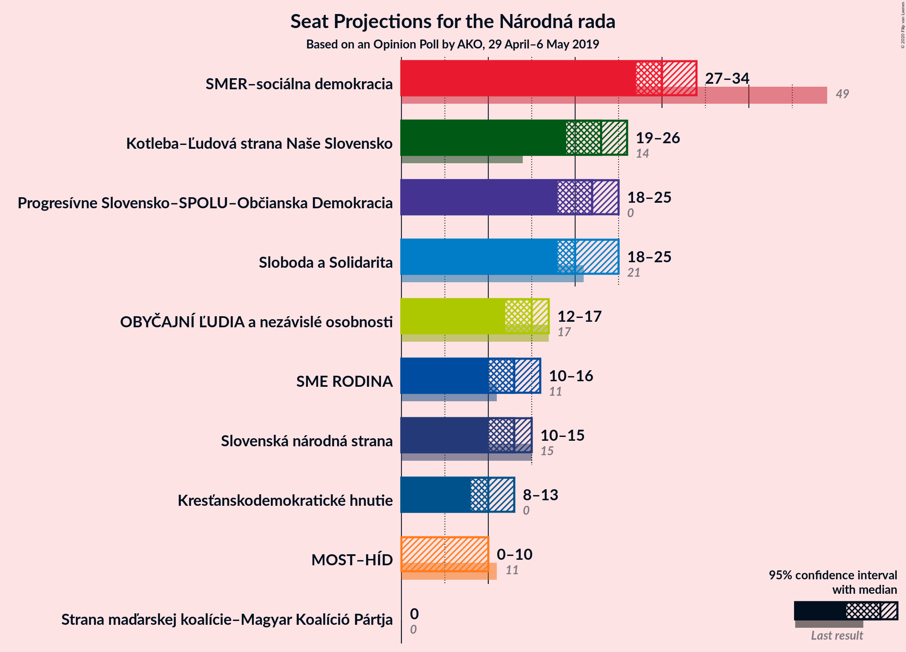
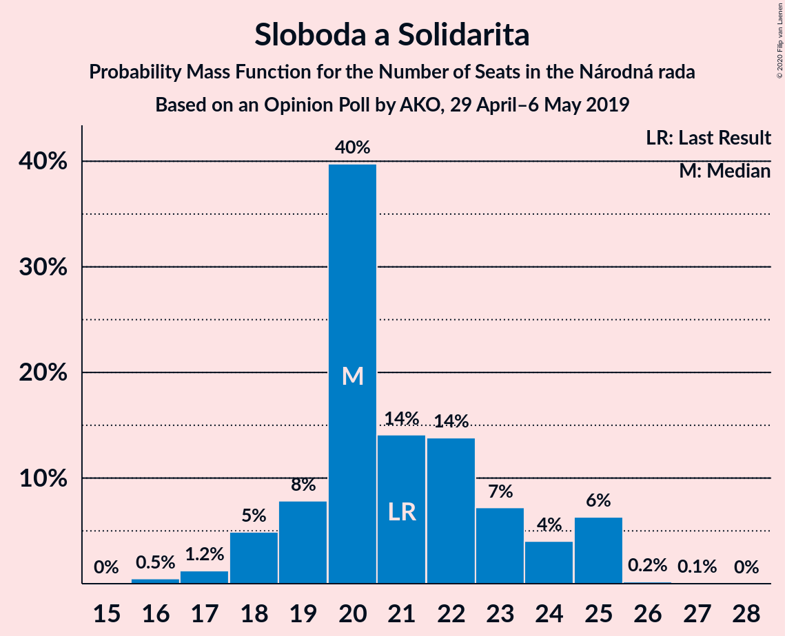
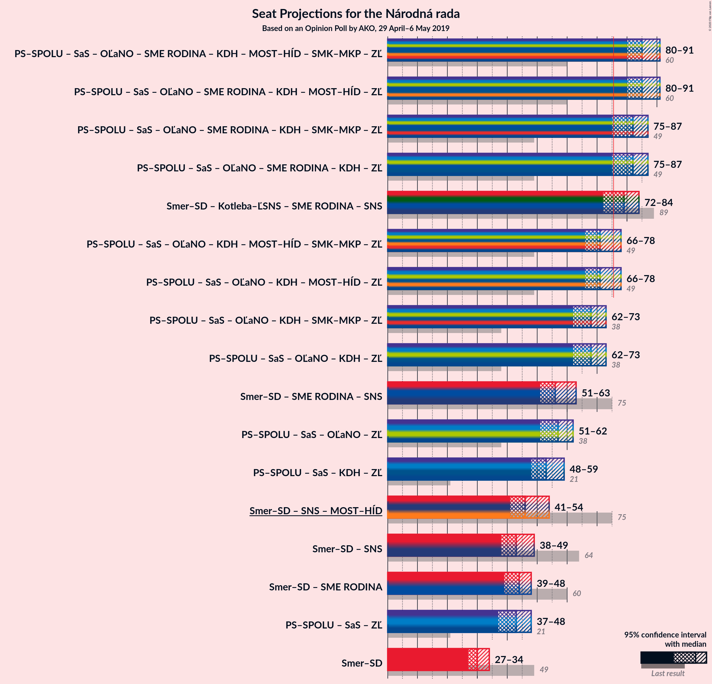
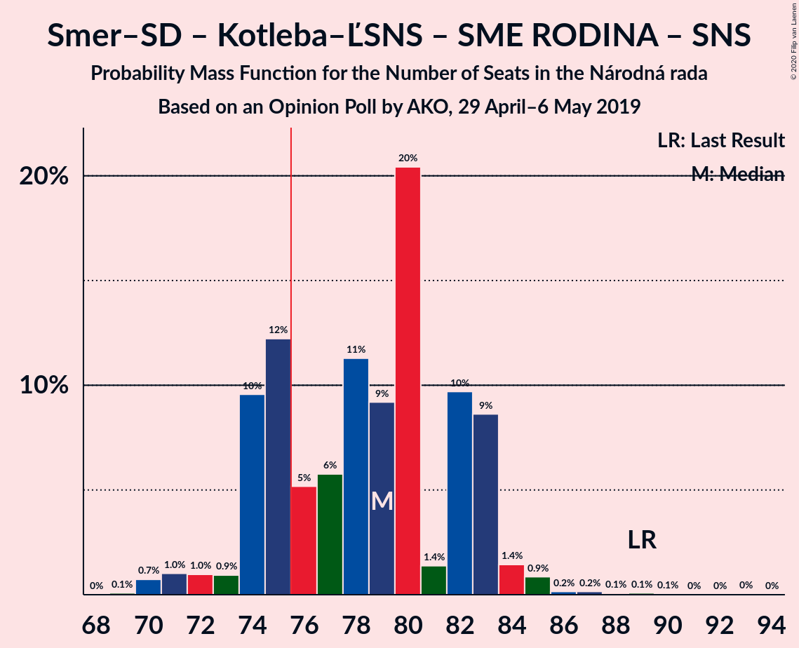
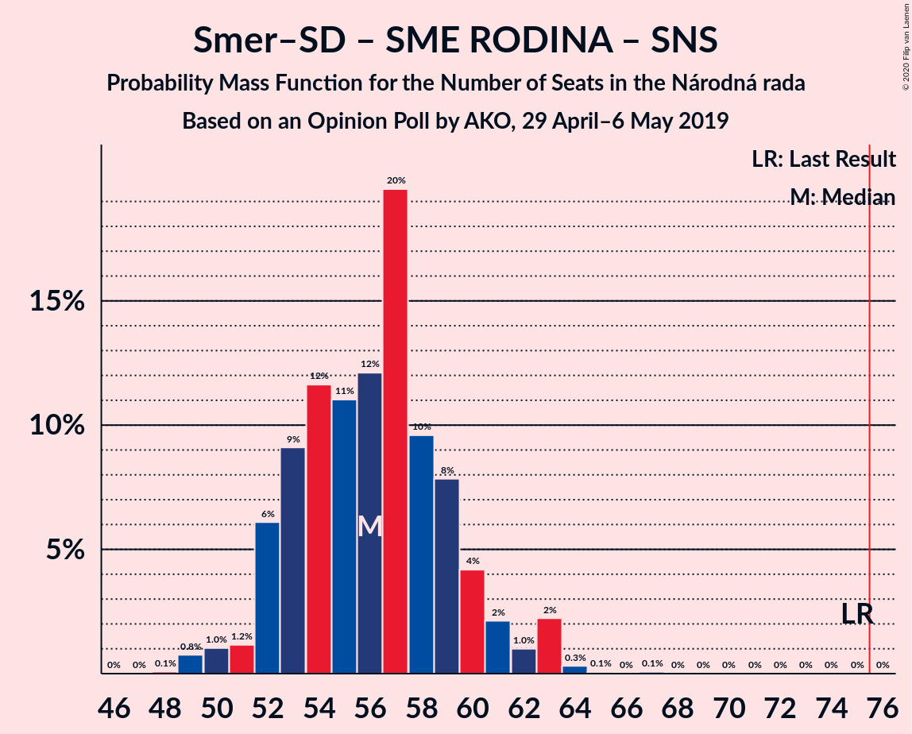
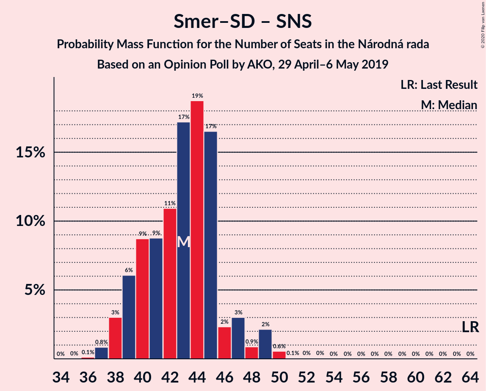
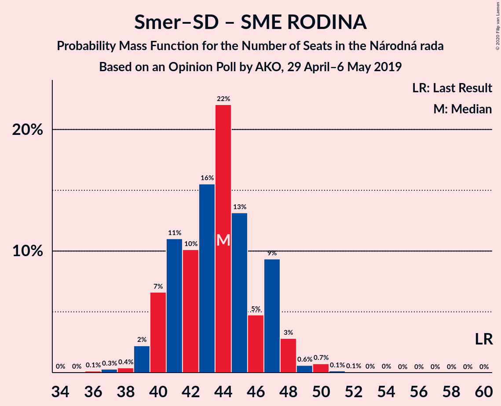

# Opinion Poll by AKO, 29 April–6 May 2019

<a href="#voting-intentions">Voting Intentions</a> | <a href="#seats">Seats</a> | <a href="#coalitions">Coalitions</a> | <a href="#technical-information">Technical Information</a>

## Voting Intentions

### Confidence Intervals

| Party | Last Result | Poll Result | 80% Confidence Interval | 90% Confidence Interval | 95% Confidence Interval | 99% Confidence Interval |
|:-----:|:-----------:|:-----------:|:-----------------------:|:-----------------------:|:-----------------------:|:-----------------------:|
| SMER–sociálna demokracia | 28.3% | 19.1% | 17.6–20.8% |17.1–21.2% |16.8–21.7% |16.1–22.5% |
| Kotleba–Ľudová strana Naše Slovensko | 8.0% | 13.9% | 12.6–15.4% |12.2–15.8% |11.9–16.2% |11.3–16.9% |
| Progresívne Slovensko–SPOLU–Občianska Demokracia | 0.0% | 13.7% | 12.4–15.2% |12.0–15.6% |11.7–16.0% |11.1–16.7% |
| Sloboda a Solidarita | 12.1% | 13.1% | 11.8–14.6% |11.4–15.0% |11.1–15.3% |10.6–16.1% |
| OBYČAJNÍ ĽUDIA a nezávislé osobnosti | 11.0% | 9.2% | 8.1–10.5% |7.8–10.8% |7.6–11.2% |7.1–11.8% |
| SME RODINA | 6.6% | 8.3% | 7.3–9.5% |7.0–9.9% |6.7–10.2% |6.3–10.8% |
| Slovenská národná strana | 8.6% | 8.0% | 7.0–9.2% |6.7–9.6% |6.5–9.9% |6.0–10.5% |
| Kresťanskodemokratické hnutie | 4.9% | 6.6% | 5.7–7.7% |5.4–8.0% |5.2–8.3% |4.8–8.9% |
| MOST–HÍD | 6.5% | 5.0% | 4.2–6.0% |4.0–6.3% |3.8–6.5% |3.5–7.1% |
| Strana maďarskej koalície–Magyar Koalíció Pártja | 4.0% | 2.6% | 2.1–3.4% |1.9–3.6% |1.8–3.8% |1.6–4.2% |

*Note:* The poll result column reflects the actual value used in the calculations. Published results may vary slightly, and in addition be rounded to fewer digits.

## Seats

### Confidence Intervals

| Party | Last Result | Median | 80% Confidence Interval | 90% Confidence Interval | 95% Confidence Interval | 99% Confidence Interval |
|:-----:|:-----------:|:------:|:-----------------------:|:-----------------------:|:-----------------------:|:-----------------------:|
| <a href="#smer–sociálna-demokracia">SMER–sociálna demokracia</a> | 49 | 30 | 28–33 |27–34 |27–34 |25–35 |
| <a href="#kotleba–ľudová-strana-naše-slovensko">Kotleba–Ľudová strana Naše Slovensko</a> | 14 | 22 | 20–25 |19–25 |19–27 |17–27 |
| <a href="#progresívne-slovensko–spolu–občianska-demokracia">Progresívne Slovensko–SPOLU–Občianska Demokracia</a> | 0 | 22 | 19–24 |19–24 |17–26 |17–26 |
| <a href="#sloboda-a-solidarita">Sloboda a Solidarita</a> | 21 | 20 | 19–24 |18–25 |18–25 |17–25 |
| <a href="#obyčajní-ľudia-a-nezávislé-osobnosti">OBYČAJNÍ ĽUDIA a nezávislé osobnosti</a> | 17 | 15 | 13–16 |12–16 |12–17 |11–19 |
| <a href="#sme-rodina">SME RODINA</a> | 11 | 13 | 11–15 |10–15 |10–16 |10–17 |
| <a href="#slovenská-národná-strana">Slovenská národná strana</a> | 15 | 12 | 10–15 |10–15 |10–15 |10–16 |
| <a href="#kresťanskodemokratické-hnutie">Kresťanskodemokratické hnutie</a> | 0 | 10 | 9–12 |9–12 |8–13 |0–14 |
| <a href="#most–híd">MOST–HÍD</a> | 11 | 0 | 0–10 |0–10 |0–10 |0–10 |
| <a href="#strana-maďarskej-koalície–magyar-koalíció-pártja">Strana maďarskej koalície–Magyar Koalíció Pártja</a> | 0 | 0 | 0 |0 |0 |0 |

### SMER–sociálna demokracia

*For a full overview of the results for this party, see the [SMER–sociálna demokracia](party-smer–sociálnademokracia.html) page.*

| Number of Seats | Probability | Accumulated | Special Marks |
|:---------------:|:-----------:|:-----------:|:-------------:|
| 24 | 0.1% | 100% |  |
| 25 | 0.4% | 99.9% |  |
| 26 | 1.2% | 99.5% |  |
| 27 | 5% | 98% |  |
| 28 | 9% | 94% |  |
| 29 | 10% | 84% |  |
| 30 | 34% | 74% | Median |
| 31 | 12% | 40% |  |
| 32 | 18% | 29% |  |
| 33 | 4% | 11% |  |
| 34 | 6% | 7% |  |
| 35 | 0.5% | 0.9% |  |
| 36 | 0.1% | 0.4% |  |
| 37 | 0.3% | 0.3% |  |
| 38 | 0% | 0% |  |
| 39 | 0% | 0% |  |
| 40 | 0% | 0% |  |
| 41 | 0% | 0% |  |
| 42 | 0% | 0% |  |
| 43 | 0% | 0% |  |
| 44 | 0% | 0% |  |
| 45 | 0% | 0% |  |
| 46 | 0% | 0% |  |
| 47 | 0% | 0% |  |
| 48 | 0% | 0% |  |
| 49 | 0% | 0% | Last Result |

### Kotleba–Ľudová strana Naše Slovensko

*For a full overview of the results for this party, see the [Kotleba–Ľudová strana Naše Slovensko](party-kotleba–ľudovástrananašeslovensko.html) page.*

| Number of Seats | Probability | Accumulated | Special Marks |
|:---------------:|:-----------:|:-----------:|:-------------:|
| 14 | 0% | 100% | Last Result |
| 15 | 0% | 100% |  |
| 16 | 0% | 100% |  |
| 17 | 0.5% | 100% |  |
| 18 | 1.2% | 99.4% |  |
| 19 | 7% | 98% |  |
| 20 | 17% | 91% |  |
| 21 | 15% | 75% |  |
| 22 | 18% | 60% | Median |
| 23 | 13% | 43% |  |
| 24 | 12% | 30% |  |
| 25 | 13% | 17% |  |
| 26 | 1.4% | 4% |  |
| 27 | 3% | 3% |  |
| 28 | 0.2% | 0.2% |  |
| 29 | 0% | 0.1% |  |
| 30 | 0% | 0% |  |

### Progresívne Slovensko–SPOLU–Občianska Demokracia

*For a full overview of the results for this party, see the [Progresívne Slovensko–SPOLU–Občianska Demokracia](party-progresívneslovensko–spolu–občianskademokracia.html) page.*

| Number of Seats | Probability | Accumulated | Special Marks |
|:---------------:|:-----------:|:-----------:|:-------------:|
| 0 | 0% | 100% | Last Result |
| 1 | 0% | 100% |  |
| 2 | 0% | 100% |  |
| 3 | 0% | 100% |  |
| 4 | 0% | 100% |  |
| 5 | 0% | 100% |  |
| 6 | 0% | 100% |  |
| 7 | 0% | 100% |  |
| 8 | 0% | 100% |  |
| 9 | 0% | 100% |  |
| 10 | 0% | 100% |  |
| 11 | 0% | 100% |  |
| 12 | 0% | 100% |  |
| 13 | 0% | 100% |  |
| 14 | 0% | 100% |  |
| 15 | 0% | 100% |  |
| 16 | 0.1% | 100% |  |
| 17 | 2% | 99.9% |  |
| 18 | 2% | 97% |  |
| 19 | 11% | 95% |  |
| 20 | 8% | 84% |  |
| 21 | 13% | 76% |  |
| 22 | 26% | 63% | Median |
| 23 | 23% | 37% |  |
| 24 | 10% | 13% |  |
| 25 | 1.2% | 4% |  |
| 26 | 2% | 3% |  |
| 27 | 0.1% | 0.2% |  |
| 28 | 0% | 0.1% |  |
| 29 | 0% | 0% |  |

### Sloboda a Solidarita

*For a full overview of the results for this party, see the [Sloboda a Solidarita](party-slobodaasolidarita.html) page.*

| Number of Seats | Probability | Accumulated | Special Marks |
|:---------------:|:-----------:|:-----------:|:-------------:|
| 16 | 0.4% | 100% |  |
| 17 | 2% | 99.5% |  |
| 18 | 5% | 98% |  |
| 19 | 13% | 93% |  |
| 20 | 33% | 80% | Median |
| 21 | 11% | 47% | Last Result |
| 22 | 18% | 36% |  |
| 23 | 5% | 18% |  |
| 24 | 3% | 12% |  |
| 25 | 9% | 10% |  |
| 26 | 0.3% | 0.3% |  |
| 27 | 0.1% | 0.1% |  |
| 28 | 0% | 0% |  |

### OBYČAJNÍ ĽUDIA a nezávislé osobnosti

*For a full overview of the results for this party, see the [OBYČAJNÍ ĽUDIA a nezávislé osobnosti](party-obyčajníľudiaanezávisléosobnosti.html) page.*

| Number of Seats | Probability | Accumulated | Special Marks |
|:---------------:|:-----------:|:-----------:|:-------------:|
| 10 | 0.2% | 100% |  |
| 11 | 0.5% | 99.8% |  |
| 12 | 7% | 99.4% |  |
| 13 | 23% | 92% |  |
| 14 | 16% | 69% |  |
| 15 | 19% | 53% | Median |
| 16 | 30% | 34% |  |
| 17 | 2% | 4% | Last Result |
| 18 | 2% | 2% |  |
| 19 | 0.5% | 0.6% |  |
| 20 | 0% | 0.1% |  |
| 21 | 0% | 0% |  |

### SME RODINA

*For a full overview of the results for this party, see the [SME RODINA](party-smerodina.html) page.*

| Number of Seats | Probability | Accumulated | Special Marks |
|:---------------:|:-----------:|:-----------:|:-------------:|
| 9 | 0.2% | 100% |  |
| 10 | 5% | 99.8% |  |
| 11 | 11% | 95% | Last Result |
| 12 | 5% | 83% |  |
| 13 | 40% | 78% | Median |
| 14 | 19% | 38% |  |
| 15 | 15% | 19% |  |
| 16 | 3% | 4% |  |
| 17 | 0.9% | 1.0% |  |
| 18 | 0.1% | 0.1% |  |
| 19 | 0% | 0% |  |

### Slovenská národná strana

*For a full overview of the results for this party, see the [Slovenská národná strana](party-slovenskánárodnástrana.html) page.*

| Number of Seats | Probability | Accumulated | Special Marks |
|:---------------:|:-----------:|:-----------:|:-------------:|
| 9 | 0.2% | 100% |  |
| 10 | 14% | 99.7% |  |
| 11 | 16% | 86% |  |
| 12 | 25% | 70% | Median |
| 13 | 21% | 46% |  |
| 14 | 11% | 25% |  |
| 15 | 13% | 14% | Last Result |
| 16 | 0.9% | 1.3% |  |
| 17 | 0.3% | 0.3% |  |
| 18 | 0.1% | 0.1% |  |
| 19 | 0% | 0% |  |

### Kresťanskodemokratické hnutie

*For a full overview of the results for this party, see the [Kresťanskodemokratické hnutie](party-kresťanskodemokratickéhnutie.html) page.*

| Number of Seats | Probability | Accumulated | Special Marks |
|:---------------:|:-----------:|:-----------:|:-------------:|
| 0 | 0.9% | 100% | Last Result |
| 1 | 0% | 99.1% |  |
| 2 | 0% | 99.1% |  |
| 3 | 0% | 99.1% |  |
| 4 | 0% | 99.1% |  |
| 5 | 0% | 99.1% |  |
| 6 | 0% | 99.1% |  |
| 7 | 0% | 99.1% |  |
| 8 | 4% | 99.1% |  |
| 9 | 29% | 95% |  |
| 10 | 23% | 66% | Median |
| 11 | 25% | 43% |  |
| 12 | 15% | 19% |  |
| 13 | 2% | 3% |  |
| 14 | 1.3% | 2% |  |
| 15 | 0.3% | 0.3% |  |
| 16 | 0% | 0% |  |

### MOST–HÍD

*For a full overview of the results for this party, see the [MOST–HÍD](party-most–híd.html) page.*

| Number of Seats | Probability | Accumulated | Special Marks |
|:---------------:|:-----------:|:-----------:|:-------------:|
| 0 | 50% | 100% | Median |
| 1 | 0% | 50% |  |
| 2 | 0% | 50% |  |
| 3 | 0% | 50% |  |
| 4 | 0% | 50% |  |
| 5 | 0% | 50% |  |
| 6 | 0% | 50% |  |
| 7 | 0% | 50% |  |
| 8 | 22% | 50% |  |
| 9 | 16% | 28% |  |
| 10 | 12% | 12% |  |
| 11 | 0.4% | 0.5% | Last Result |
| 12 | 0.1% | 0.1% |  |
| 13 | 0% | 0% |  |

### Strana maďarskej koalície–Magyar Koalíció Pártja

*For a full overview of the results for this party, see the [Strana maďarskej koalície–Magyar Koalíció Pártja](party-stranamaďarskejkoalície–magyarkoalíciópártja.html) page.*

| Number of Seats | Probability | Accumulated | Special Marks |
|:---------------:|:-----------:|:-----------:|:-------------:|
| 0 | 100% | 100% | Last Result, Median |

## Coalitions

### Confidence Intervals

| Coalition | Last Result | Median | Majority? | 80% Confidence Interval | 90% Confidence Interval | 95% Confidence Interval | 99% Confidence Interval |
|:---------:|:-----------:|:------:|:---------:|:-----------------------:|:-----------------------:|:-----------------------:|:-----------------------:|
| SMER–sociálna demokracia – Kotleba–Ľudová strana Naše Slovensko – SME RODINA – Slovenská národná strana | 89 | 79 | 69% | 74–83 | 74–83 | 73–83 | 70–86 |
| SMER–sociálna demokracia – SME RODINA – Slovenská národná strana | 75 | 55 | 0% | 53–60 | 52–62 | 52–63 | 50–64 |
| SMER–sociálna demokracia – Slovenská národná strana – MOST–HÍD | 75 | 48 | 0% | 42–52 | 42–53 | 40–54 | 39–56 |
| SMER–sociálna demokracia – Slovenská národná strana | 64 | 42 | 0% | 40–46 | 39–48 | 38–49 | 37–49 |
| SMER–sociálna demokracia – SME RODINA | 60 | 43 | 0% | 41–47 | 40–48 | 39–48 | 38–50 |
| SMER–sociálna demokracia | 49 | 30 | 0% | 28–33 | 27–34 | 27–34 | 25–35 |

### SMER–sociálna demokracia – Kotleba–Ľudová strana Naše Slovensko – SME RODINA – Slovenská národná strana

| Number of Seats | Probability | Accumulated | Special Marks |
|:---------------:|:-----------:|:-----------:|:-------------:|
| 69 | 0.1% | 100% |  |
| 70 | 0.4% | 99.9% |  |
| 71 | 0.2% | 99.5% |  |
| 72 | 2% | 99.3% |  |
| 73 | 1.1% | 98% |  |
| 74 | 18% | 97% |  |
| 75 | 9% | 79% |  |
| 76 | 8% | 69% | Majority |
| 77 | 4% | 61% | Median |
| 78 | 6% | 57% |  |
| 79 | 15% | 51% |  |
| 80 | 8% | 35% |  |
| 81 | 2% | 28% |  |
| 82 | 8% | 26% |  |
| 83 | 16% | 18% |  |
| 84 | 0.4% | 2% |  |
| 85 | 1.2% | 2% |  |
| 86 | 0.2% | 0.6% |  |
| 87 | 0.1% | 0.4% |  |
| 88 | 0.1% | 0.3% |  |
| 89 | 0.1% | 0.2% | Last Result |
| 90 | 0.1% | 0.1% |  |
| 91 | 0% | 0% |  |

### SMER–sociálna demokracia – SME RODINA – Slovenská národná strana

| Number of Seats | Probability | Accumulated | Special Marks |
|:---------------:|:-----------:|:-----------:|:-------------:|
| 48 | 0.1% | 100% |  |
| 49 | 0.2% | 99.9% |  |
| 50 | 0.8% | 99.7% |  |
| 51 | 0.8% | 98.9% |  |
| 52 | 6% | 98% |  |
| 53 | 12% | 92% |  |
| 54 | 19% | 81% |  |
| 55 | 15% | 62% | Median |
| 56 | 7% | 46% |  |
| 57 | 5% | 39% |  |
| 58 | 17% | 34% |  |
| 59 | 4% | 18% |  |
| 60 | 7% | 14% |  |
| 61 | 1.4% | 7% |  |
| 62 | 0.4% | 5% |  |
| 63 | 4% | 5% |  |
| 64 | 0.5% | 0.6% |  |
| 65 | 0.1% | 0.1% |  |
| 66 | 0% | 0.1% |  |
| 67 | 0% | 0.1% |  |
| 68 | 0% | 0% |  |
| 69 | 0% | 0% |  |
| 70 | 0% | 0% |  |
| 71 | 0% | 0% |  |
| 72 | 0% | 0% |  |
| 73 | 0% | 0% |  |
| 74 | 0% | 0% |  |
| 75 | 0% | 0% | Last Result |

### SMER–sociálna demokracia – Slovenská národná strana – MOST–HÍD

| Number of Seats | Probability | Accumulated | Special Marks |
|:---------------:|:-----------:|:-----------:|:-------------:|
| 37 | 0% | 100% |  |
| 38 | 0.2% | 99.9% |  |
| 39 | 0.4% | 99.7% |  |
| 40 | 3% | 99.3% |  |
| 41 | 0.4% | 96% |  |
| 42 | 14% | 96% | Median |
| 43 | 2% | 82% |  |
| 44 | 4% | 80% |  |
| 45 | 16% | 76% |  |
| 46 | 3% | 60% |  |
| 47 | 3% | 57% |  |
| 48 | 14% | 54% |  |
| 49 | 6% | 39% |  |
| 50 | 10% | 34% |  |
| 51 | 13% | 23% |  |
| 52 | 5% | 11% |  |
| 53 | 0.8% | 5% |  |
| 54 | 4% | 5% |  |
| 55 | 0.2% | 0.9% |  |
| 56 | 0.5% | 0.6% |  |
| 57 | 0% | 0.1% |  |
| 58 | 0% | 0% |  |
| 59 | 0% | 0% |  |
| 60 | 0% | 0% |  |
| 61 | 0% | 0% |  |
| 62 | 0% | 0% |  |
| 63 | 0% | 0% |  |
| 64 | 0% | 0% |  |
| 65 | 0% | 0% |  |
| 66 | 0% | 0% |  |
| 67 | 0% | 0% |  |
| 68 | 0% | 0% |  |
| 69 | 0% | 0% |  |
| 70 | 0% | 0% |  |
| 71 | 0% | 0% |  |
| 72 | 0% | 0% |  |
| 73 | 0% | 0% |  |
| 74 | 0% | 0% |  |
| 75 | 0% | 0% | Last Result |

### SMER–sociálna demokracia – Slovenská národná strana

| Number of Seats | Probability | Accumulated | Special Marks |
|:---------------:|:-----------:|:-----------:|:-------------:|
| 35 | 0% | 100% |  |
| 36 | 0.1% | 99.9% |  |
| 37 | 0.3% | 99.8% |  |
| 38 | 4% | 99.5% |  |
| 39 | 2% | 95% |  |
| 40 | 13% | 93% |  |
| 41 | 13% | 80% |  |
| 42 | 17% | 67% | Median |
| 43 | 13% | 49% |  |
| 44 | 6% | 36% |  |
| 45 | 19% | 31% |  |
| 46 | 3% | 11% |  |
| 47 | 3% | 8% |  |
| 48 | 0.9% | 5% |  |
| 49 | 4% | 5% |  |
| 50 | 0.3% | 0.4% |  |
| 51 | 0.1% | 0.1% |  |
| 52 | 0% | 0% |  |
| 53 | 0% | 0% |  |
| 54 | 0% | 0% |  |
| 55 | 0% | 0% |  |
| 56 | 0% | 0% |  |
| 57 | 0% | 0% |  |
| 58 | 0% | 0% |  |
| 59 | 0% | 0% |  |
| 60 | 0% | 0% |  |
| 61 | 0% | 0% |  |
| 62 | 0% | 0% |  |
| 63 | 0% | 0% |  |
| 64 | 0% | 0% | Last Result |

### SMER–sociálna demokracia – SME RODINA

| Number of Seats | Probability | Accumulated | Special Marks |
|:---------------:|:-----------:|:-----------:|:-------------:|
| 36 | 0.1% | 100% |  |
| 37 | 0.3% | 99.8% |  |
| 38 | 0.4% | 99.6% |  |
| 39 | 2% | 99.2% |  |
| 40 | 6% | 97% |  |
| 41 | 11% | 91% |  |
| 42 | 12% | 81% |  |
| 43 | 19% | 68% | Median |
| 44 | 14% | 49% |  |
| 45 | 18% | 35% |  |
| 46 | 6% | 17% |  |
| 47 | 6% | 12% |  |
| 48 | 4% | 5% |  |
| 49 | 0.5% | 1.1% |  |
| 50 | 0.4% | 0.6% |  |
| 51 | 0.1% | 0.2% |  |
| 52 | 0% | 0.1% |  |
| 53 | 0% | 0.1% |  |
| 54 | 0% | 0% |  |
| 55 | 0% | 0% |  |
| 56 | 0% | 0% |  |
| 57 | 0% | 0% |  |
| 58 | 0% | 0% |  |
| 59 | 0% | 0% |  |
| 60 | 0% | 0% | Last Result |

### SMER–sociálna demokracia

| Number of Seats | Probability | Accumulated | Special Marks |
|:---------------:|:-----------:|:-----------:|:-------------:|
| 24 | 0.1% | 100% |  |
| 25 | 0.4% | 99.9% |  |
| 26 | 1.2% | 99.5% |  |
| 27 | 5% | 98% |  |
| 28 | 9% | 94% |  |
| 29 | 10% | 84% |  |
| 30 | 34% | 74% | Median |
| 31 | 12% | 40% |  |
| 32 | 18% | 29% |  |
| 33 | 4% | 11% |  |
| 34 | 6% | 7% |  |
| 35 | 0.5% | 0.9% |  |
| 36 | 0.1% | 0.4% |  |
| 37 | 0.3% | 0.3% |  |
| 38 | 0% | 0% |  |
| 39 | 0% | 0% |  |
| 40 | 0% | 0% |  |
| 41 | 0% | 0% |  |
| 42 | 0% | 0% |  |
| 43 | 0% | 0% |  |
| 44 | 0% | 0% |  |
| 45 | 0% | 0% |  |
| 46 | 0% | 0% |  |
| 47 | 0% | 0% |  |
| 48 | 0% | 0% |  |
| 49 | 0% | 0% | Last Result |

## Technical Information

### Opinion Poll

+ **Polling firm:** AKO
+ **Commissioner(s):** —
+ **Fieldwork period:** 29 April–6 May 2019

### Calculations

+ **Sample size:** 1000
+ **Simulations done:** 524,288
+ **Error estimate:** 2.10%

