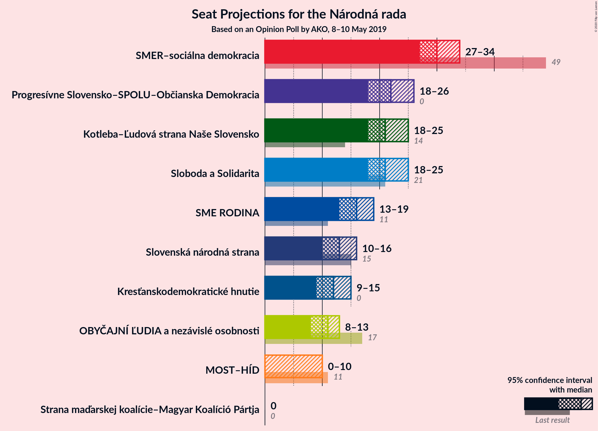
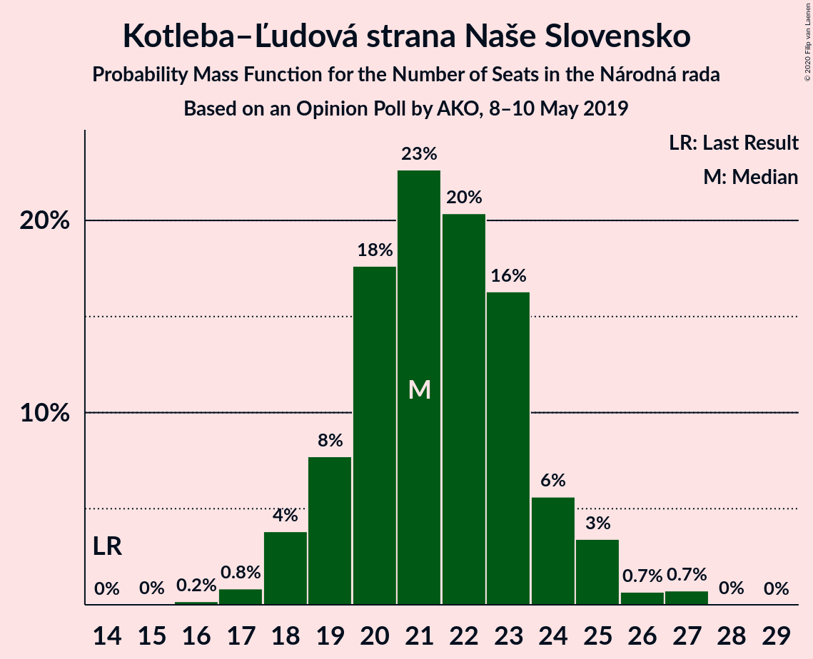
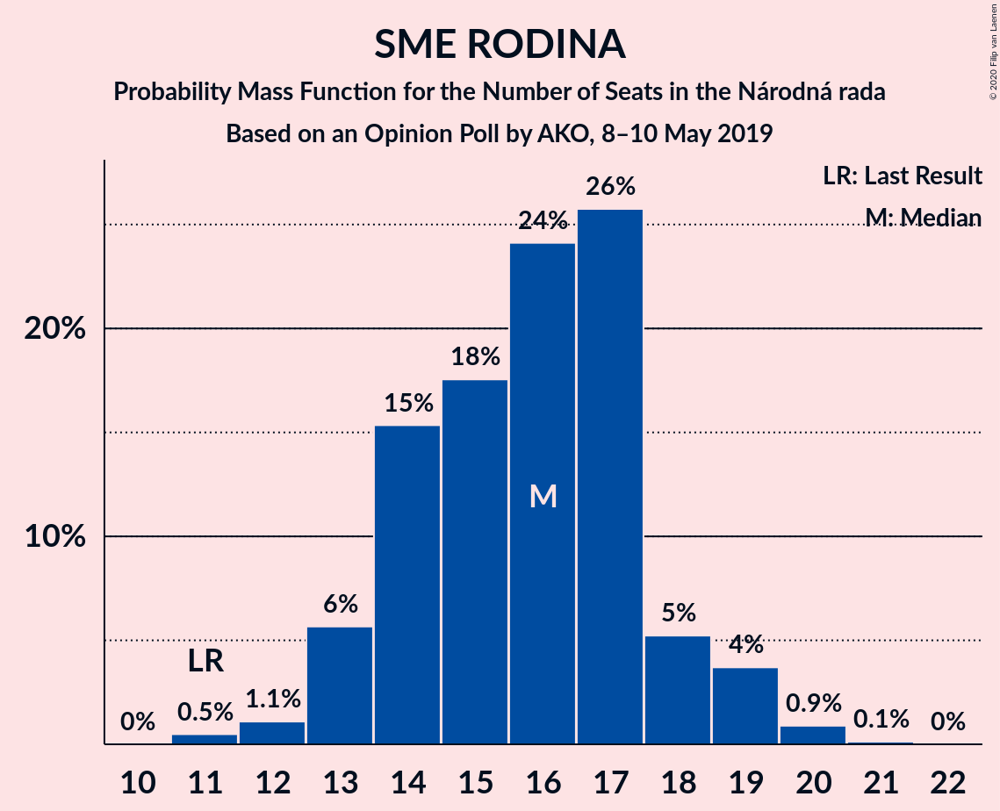
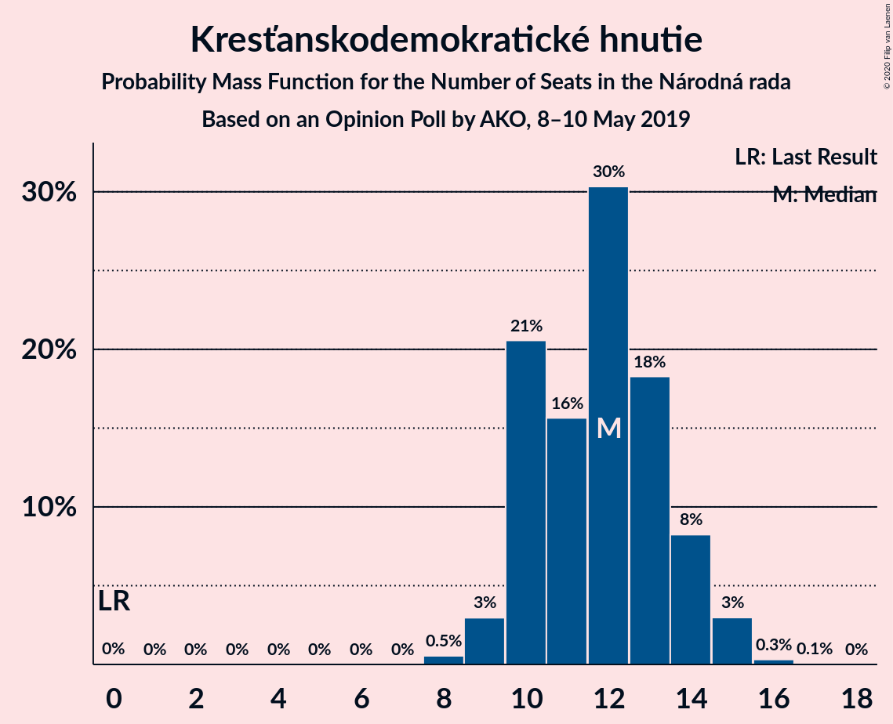
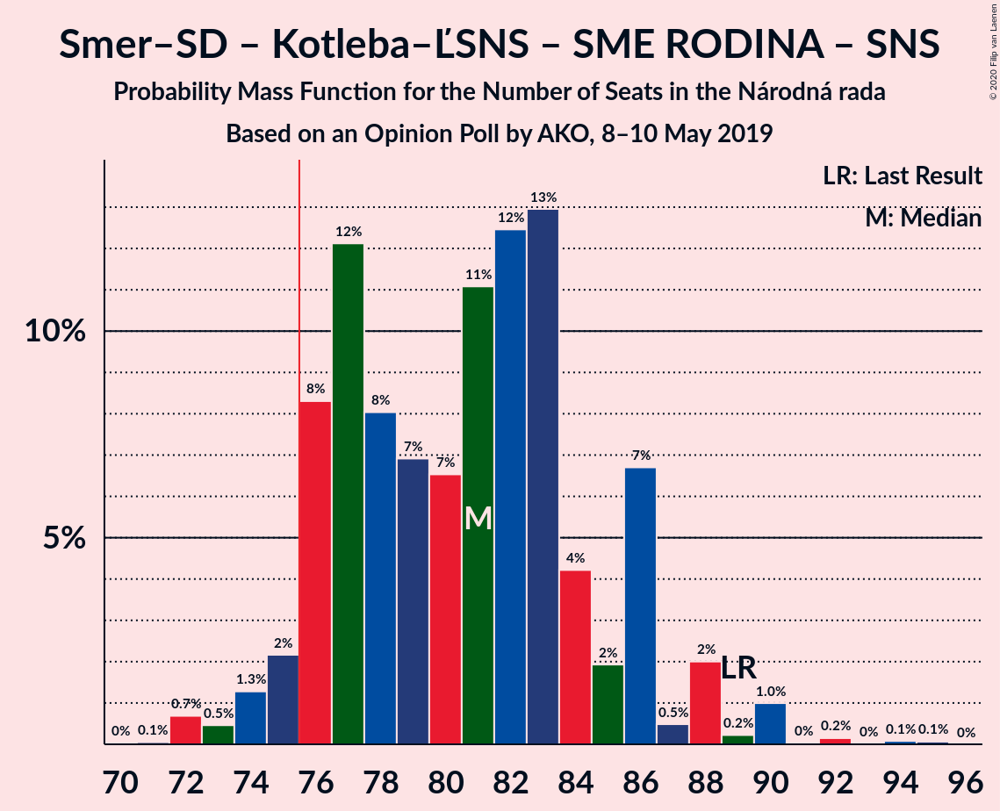
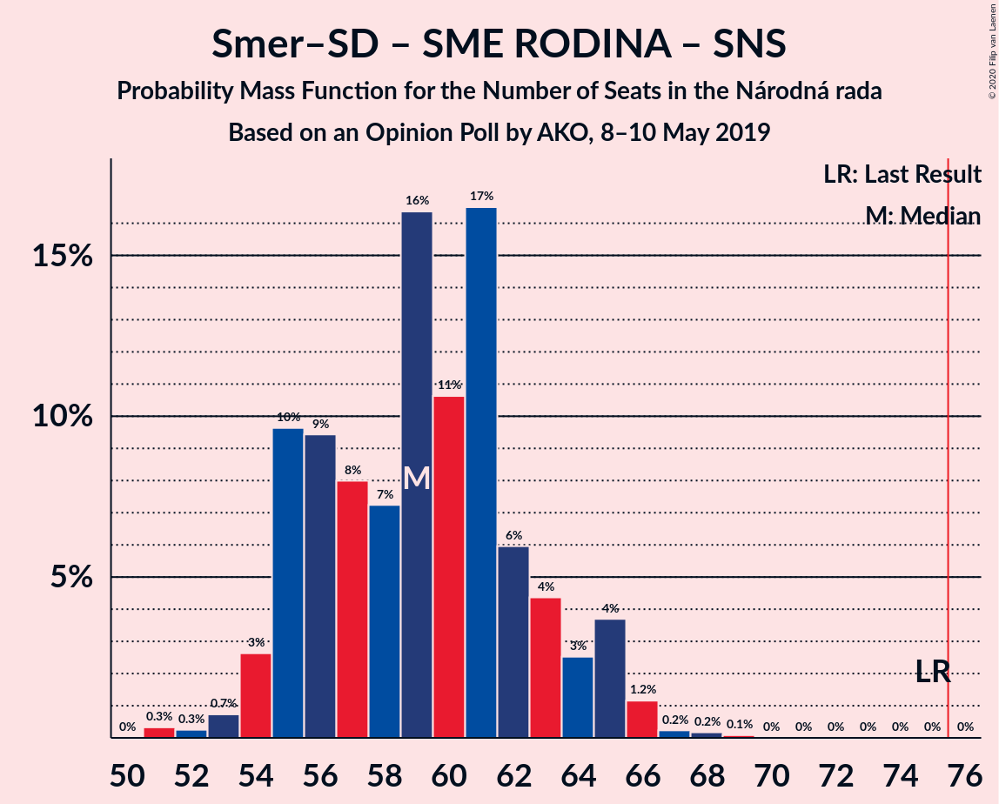
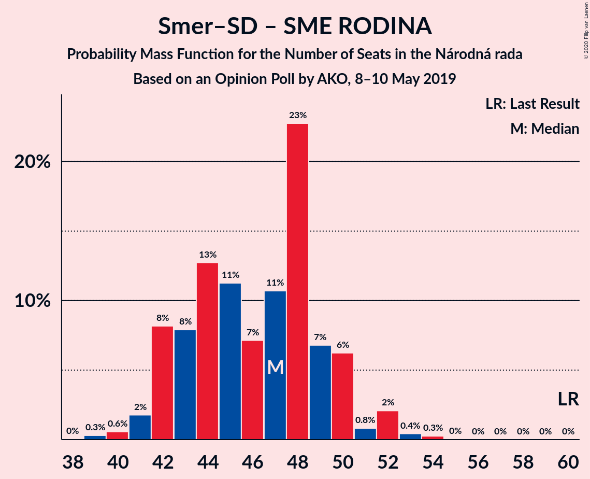
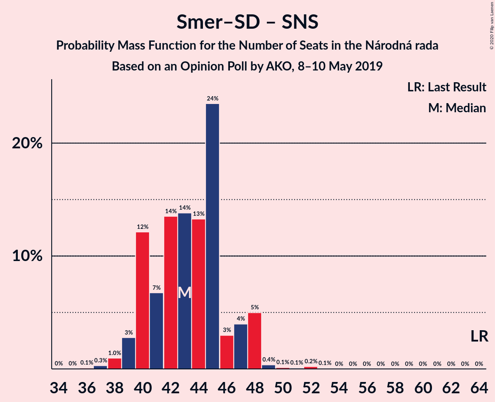

# Opinion Poll by AKO, 8–10 May 2019

<a href="#voting-intentions">Voting Intentions</a> | <a href="#seats">Seats</a> | <a href="#coalitions">Coalitions</a> | <a href="#technical-information">Technical Information</a>

## Voting Intentions

### Confidence Intervals

| Party | Last Result | Poll Result | 80% Confidence Interval | 90% Confidence Interval | 95% Confidence Interval | 99% Confidence Interval |
|:-----:|:-----------:|:-----------:|:-----------------------:|:-----------------------:|:-----------------------:|:-----------------------:|
| SMER–sociálna demokracia | 28.3% | 19.2% | 17.7–20.9% |17.2–21.4% |16.9–21.8% |16.2–22.6% |
| Kotleba–Ľudová strana Naše Slovensko | 8.0% | 13.6% | 12.3–15.1% |11.9–15.5% |11.6–15.9% |11.0–16.6% |
| Progresívne Slovensko–SPOLU–Občianska Demokracia | 0.0% | 13.6% | 12.3–15.1% |11.9–15.5% |11.6–15.9% |11.0–16.6% |
| Sloboda a Solidarita | 12.1% | 13.5% | 12.2–15.0% |11.8–15.4% |11.5–15.8% |10.9–16.5% |
| SME RODINA | 6.6% | 9.9% | 8.8–11.2% |8.5–11.6% |8.2–11.9% |7.7–12.6% |
| Slovenská národná strana | 8.6% | 8.2% | 7.2–9.4% |6.9–9.8% |6.6–10.1% |6.2–10.7% |
| Kresťanskodemokratické hnutie | 4.9% | 7.4% | 6.4–8.6% |6.2–8.9% |5.9–9.2% |5.5–9.8% |
| OBYČAJNÍ ĽUDIA a nezávislé osobnosti | 11.0% | 6.7% | 5.8–7.8% |5.5–8.2% |5.3–8.4% |4.9–9.0% |
| MOST–HÍD | 6.5% | 5.1% | 4.3–6.1% |4.1–6.4% |3.9–6.6% |3.6–7.2% |
| Strana maďarskej koalície–Magyar Koalíció Pártja | 4.0% | 2.2% | 1.7–2.9% |1.6–3.1% |1.4–3.3% |1.2–3.7% |

*Note:* The poll result column reflects the actual value used in the calculations. Published results may vary slightly, and in addition be rounded to fewer digits.

## Seats

### Confidence Intervals

| Party | Last Result | Median | 80% Confidence Interval | 90% Confidence Interval | 95% Confidence Interval | 99% Confidence Interval |
|:-----:|:-----------:|:------:|:-----------------------:|:-----------------------:|:-----------------------:|:-----------------------:|
| <a href="#smer–sociálna-demokracia">SMER–sociálna demokracia</a> | 49 | 32 | 27–32 |26–32 |24–34 |24–36 |
| <a href="#kotleba–ľudová-strana-naše-slovensko">Kotleba–Ľudová strana Naše Slovensko</a> | 14 | 25 | 19–25 |19–25 |19–25 |17–26 |
| <a href="#progresívne-slovensko–spolu–občianska-demokracia">Progresívne Slovensko–SPOLU–Občianska Demokracia</a> | 0 | 23 | 20–24 |19–24 |18–26 |16–26 |
| <a href="#sloboda-a-solidarita">Sloboda a Solidarita</a> | 21 | 19 | 18–23 |18–24 |18–24 |17–25 |
| <a href="#sme-rodina">SME RODINA</a> | 11 | 17 | 14–18 |13–19 |13–20 |11–21 |
| <a href="#slovenská-národná-strana">Slovenská národná strana</a> | 15 | 12 | 11–15 |11–16 |10–16 |10–17 |
| <a href="#kresťanskodemokratické-hnutie">Kresťanskodemokratické hnutie</a> | 0 | 10 | 10–13 |10–14 |9–15 |9–15 |
| <a href="#obyčajní-ľudia-a-nezávislé-osobnosti">OBYČAJNÍ ĽUDIA a nezávislé osobnosti</a> | 17 | 12 | 9–12 |0–12 |0–12 |0–13 |
| <a href="#most–híd">MOST–HÍD</a> | 11 | 0 | 0–10 |0–10 |0–10 |0–11 |
| <a href="#strana-maďarskej-koalície–magyar-koalíció-pártja">Strana maďarskej koalície–Magyar Koalíció Pártja</a> | 0 | 0 | 0 |0 |0 |0 |

### SMER–sociálna demokracia

*For a full overview of the results for this party, see the [SMER–sociálna demokracia](party-smer–sociálnademokracia.html) page.*

| Number of Seats | Probability | Accumulated | Special Marks |
|:---------------:|:-----------:|:-----------:|:-------------:|
| 23 | 0.1% | 100% |  |
| 24 | 4% | 99.9% |  |
| 25 | 0.2% | 95% |  |
| 26 | 1.4% | 95% |  |
| 27 | 14% | 94% |  |
| 28 | 2% | 80% |  |
| 29 | 7% | 78% |  |
| 30 | 4% | 71% |  |
| 31 | 9% | 67% |  |
| 32 | 53% | 58% | Median |
| 33 | 2% | 5% |  |
| 34 | 0.5% | 3% |  |
| 35 | 0.2% | 2% |  |
| 36 | 2% | 2% |  |
| 37 | 0.4% | 0.4% |  |
| 38 | 0% | 0% |  |
| 39 | 0% | 0% |  |
| 40 | 0% | 0% |  |
| 41 | 0% | 0% |  |
| 42 | 0% | 0% |  |
| 43 | 0% | 0% |  |
| 44 | 0% | 0% |  |
| 45 | 0% | 0% |  |
| 46 | 0% | 0% |  |
| 47 | 0% | 0% |  |
| 48 | 0% | 0% |  |
| 49 | 0% | 0% | Last Result |

### Kotleba–Ľudová strana Naše Slovensko

*For a full overview of the results for this party, see the [Kotleba–Ľudová strana Naše Slovensko](party-kotleba–ľudovástrananašeslovensko.html) page.*

| Number of Seats | Probability | Accumulated | Special Marks |
|:---------------:|:-----------:|:-----------:|:-------------:|
| 14 | 0% | 100% | Last Result |
| 15 | 0% | 100% |  |
| 16 | 0.1% | 100% |  |
| 17 | 1.1% | 99.9% |  |
| 18 | 1.3% | 98.9% |  |
| 19 | 15% | 98% |  |
| 20 | 4% | 83% |  |
| 21 | 4% | 79% |  |
| 22 | 8% | 75% |  |
| 23 | 4% | 68% |  |
| 24 | 6% | 64% |  |
| 25 | 57% | 58% | Median |
| 26 | 1.2% | 1.4% |  |
| 27 | 0% | 0.1% |  |
| 28 | 0.1% | 0.1% |  |
| 29 | 0% | 0% |  |

### Progresívne Slovensko–SPOLU–Občianska Demokracia

*For a full overview of the results for this party, see the [Progresívne Slovensko–SPOLU–Občianska Demokracia](party-progresívneslovensko–spolu–občianskademokracia.html) page.*

| Number of Seats | Probability | Accumulated | Special Marks |
|:---------------:|:-----------:|:-----------:|:-------------:|
| 0 | 0% | 100% | Last Result |
| 1 | 0% | 100% |  |
| 2 | 0% | 100% |  |
| 3 | 0% | 100% |  |
| 4 | 0% | 100% |  |
| 5 | 0% | 100% |  |
| 6 | 0% | 100% |  |
| 7 | 0% | 100% |  |
| 8 | 0% | 100% |  |
| 9 | 0% | 100% |  |
| 10 | 0% | 100% |  |
| 11 | 0% | 100% |  |
| 12 | 0% | 100% |  |
| 13 | 0% | 100% |  |
| 14 | 0% | 100% |  |
| 15 | 0% | 100% |  |
| 16 | 2% | 100% |  |
| 17 | 0.1% | 98% |  |
| 18 | 3% | 98% |  |
| 19 | 5% | 96% |  |
| 20 | 7% | 91% |  |
| 21 | 10% | 84% |  |
| 22 | 6% | 74% |  |
| 23 | 50% | 68% | Median |
| 24 | 15% | 17% |  |
| 25 | 0.3% | 3% |  |
| 26 | 2% | 3% |  |
| 27 | 0.1% | 0.3% |  |
| 28 | 0% | 0.2% |  |
| 29 | 0.2% | 0.2% |  |
| 30 | 0% | 0% |  |

### Sloboda a Solidarita

*For a full overview of the results for this party, see the [Sloboda a Solidarita](party-slobodaasolidarita.html) page.*

| Number of Seats | Probability | Accumulated | Special Marks |
|:---------------:|:-----------:|:-----------:|:-------------:|
| 16 | 0.2% | 100% |  |
| 17 | 0.7% | 99.8% |  |
| 18 | 12% | 99.1% |  |
| 19 | 53% | 87% | Median |
| 20 | 9% | 33% |  |
| 21 | 7% | 25% | Last Result |
| 22 | 0.9% | 18% |  |
| 23 | 11% | 17% |  |
| 24 | 5% | 6% |  |
| 25 | 0.9% | 1.4% |  |
| 26 | 0.5% | 0.5% |  |
| 27 | 0% | 0% |  |

### SME RODINA

*For a full overview of the results for this party, see the [SME RODINA](party-smerodina.html) page.*

| Number of Seats | Probability | Accumulated | Special Marks |
|:---------------:|:-----------:|:-----------:|:-------------:|
| 11 | 2% | 100% | Last Result |
| 12 | 0.2% | 98% |  |
| 13 | 5% | 98% |  |
| 14 | 5% | 93% |  |
| 15 | 6% | 87% |  |
| 16 | 4% | 81% |  |
| 17 | 64% | 77% | Median |
| 18 | 7% | 13% |  |
| 19 | 3% | 6% |  |
| 20 | 1.3% | 3% |  |
| 21 | 1.0% | 1.3% |  |
| 22 | 0.3% | 0.3% |  |
| 23 | 0% | 0% |  |

### Slovenská národná strana

*For a full overview of the results for this party, see the [Slovenská národná strana](party-slovenskánárodnástrana.html) page.*

| Number of Seats | Probability | Accumulated | Special Marks |
|:---------------:|:-----------:|:-----------:|:-------------:|
| 9 | 0.2% | 100% |  |
| 10 | 3% | 99.8% |  |
| 11 | 7% | 97% |  |
| 12 | 53% | 90% | Median |
| 13 | 17% | 37% |  |
| 14 | 6% | 20% |  |
| 15 | 7% | 14% | Last Result |
| 16 | 6% | 7% |  |
| 17 | 1.3% | 1.4% |  |
| 18 | 0% | 0.1% |  |
| 19 | 0.1% | 0.1% |  |
| 20 | 0% | 0% |  |

### Kresťanskodemokratické hnutie

*For a full overview of the results for this party, see the [Kresťanskodemokratické hnutie](party-kresťanskodemokratickéhnutie.html) page.*

| Number of Seats | Probability | Accumulated | Special Marks |
|:---------------:|:-----------:|:-----------:|:-------------:|
| 0 | 0.1% | 100% | Last Result |
| 1 | 0% | 99.9% |  |
| 2 | 0% | 99.9% |  |
| 3 | 0% | 99.9% |  |
| 4 | 0% | 99.9% |  |
| 5 | 0% | 99.9% |  |
| 6 | 0% | 99.9% |  |
| 7 | 0% | 99.9% |  |
| 8 | 0% | 99.9% |  |
| 9 | 4% | 99.9% |  |
| 10 | 56% | 96% | Median |
| 11 | 17% | 40% |  |
| 12 | 8% | 23% |  |
| 13 | 7% | 16% |  |
| 14 | 5% | 9% |  |
| 15 | 4% | 4% |  |
| 16 | 0.2% | 0.4% |  |
| 17 | 0.1% | 0.2% |  |
| 18 | 0% | 0% |  |

### OBYČAJNÍ ĽUDIA a nezávislé osobnosti

*For a full overview of the results for this party, see the [OBYČAJNÍ ĽUDIA a nezávislé osobnosti](party-obyčajníľudiaanezávisléosobnosti.html) page.*

| Number of Seats | Probability | Accumulated | Special Marks |
|:---------------:|:-----------:|:-----------:|:-------------:|
| 0 | 6% | 100% |  |
| 1 | 0% | 94% |  |
| 2 | 0% | 94% |  |
| 3 | 0% | 94% |  |
| 4 | 0% | 94% |  |
| 5 | 0% | 94% |  |
| 6 | 0% | 94% |  |
| 7 | 0% | 94% |  |
| 8 | 3% | 94% |  |
| 9 | 4% | 91% |  |
| 10 | 9% | 87% |  |
| 11 | 19% | 78% |  |
| 12 | 56% | 59% | Median |
| 13 | 2% | 2% |  |
| 14 | 0.1% | 0.3% |  |
| 15 | 0.2% | 0.2% |  |
| 16 | 0% | 0% |  |
| 17 | 0% | 0% | Last Result |

### MOST–HÍD

*For a full overview of the results for this party, see the [MOST–HÍD](party-most–híd.html) page.*

| Number of Seats | Probability | Accumulated | Special Marks |
|:---------------:|:-----------:|:-----------:|:-------------:|
| 0 | 65% | 100% | Median |
| 1 | 0% | 35% |  |
| 2 | 0% | 35% |  |
| 3 | 0% | 35% |  |
| 4 | 0% | 35% |  |
| 5 | 0% | 35% |  |
| 6 | 0% | 35% |  |
| 7 | 0% | 35% |  |
| 8 | 13% | 35% |  |
| 9 | 4% | 22% |  |
| 10 | 16% | 18% |  |
| 11 | 2% | 2% | Last Result |
| 12 | 0% | 0% |  |

### Strana maďarskej koalície–Magyar Koalíció Pártja

*For a full overview of the results for this party, see the [Strana maďarskej koalície–Magyar Koalíció Pártja](party-stranamaďarskejkoalície–magyarkoalíciópártja.html) page.*

| Number of Seats | Probability | Accumulated | Special Marks |
|:---------------:|:-----------:|:-----------:|:-------------:|
| 0 | 100% | 100% | Last Result, Median |

## Coalitions

### Confidence Intervals

| Coalition | Last Result | Median | Majority? | 80% Confidence Interval | 90% Confidence Interval | 95% Confidence Interval | 99% Confidence Interval |
|:---------:|:-----------:|:------:|:---------:|:-----------------------:|:-----------------------:|:-----------------------:|:-----------------------:|
| SMER–sociálna demokracia – Kotleba–Ľudová strana Naše Slovensko – SME RODINA – Slovenská národná strana | 89 | 86 | 97% | 76–86 | 76–86 | 75–89 | 72–89 |
| SMER–sociálna demokracia – SME RODINA – Slovenská národná strana | 75 | 61 | 0% | 57–62 | 53–63 | 53–67 | 53–67 |
| SMER–sociálna demokracia – Slovenská národná strana – MOST–HÍD | 75 | 44 | 0% | 44–53 | 42–56 | 42–57 | 42–58 |
| SMER–sociálna demokracia – SME RODINA | 60 | 49 | 0% | 43–49 | 40–49 | 39–51 | 39–54 |
| SMER–sociálna demokracia – Slovenská národná strana | 64 | 44 | 0% | 40–46 | 38–48 | 38–48 | 38–49 |
| SMER–sociálna demokracia | 49 | 32 | 0% | 27–32 | 26–32 | 24–34 | 24–36 |

### SMER–sociálna demokracia – Kotleba–Ľudová strana Naše Slovensko – SME RODINA – Slovenská národná strana

| Number of Seats | Probability | Accumulated | Special Marks |
|:---------------:|:-----------:|:-----------:|:-------------:|
| 71 | 0.1% | 100% |  |
| 72 | 1.1% | 99.9% |  |
| 73 | 0.1% | 98.9% |  |
| 74 | 0.2% | 98.7% |  |
| 75 | 1.2% | 98.6% |  |
| 76 | 12% | 97% | Majority |
| 77 | 1.2% | 85% |  |
| 78 | 6% | 84% |  |
| 79 | 5% | 78% |  |
| 80 | 2% | 73% |  |
| 81 | 4% | 71% |  |
| 82 | 3% | 67% |  |
| 83 | 0.3% | 65% |  |
| 84 | 7% | 64% |  |
| 85 | 4% | 58% |  |
| 86 | 50% | 54% | Median |
| 87 | 0% | 3% |  |
| 88 | 0.4% | 3% |  |
| 89 | 3% | 3% | Last Result |
| 90 | 0.1% | 0.1% |  |
| 91 | 0% | 0% |  |

### SMER–sociálna demokracia – SME RODINA – Slovenská národná strana

| Number of Seats | Probability | Accumulated | Special Marks |
|:---------------:|:-----------:|:-----------:|:-------------:|
| 50 | 0.1% | 100% |  |
| 51 | 0% | 99.9% |  |
| 52 | 0.1% | 99.9% |  |
| 53 | 6% | 99.8% |  |
| 54 | 2% | 94% |  |
| 55 | 2% | 93% |  |
| 56 | 0.2% | 91% |  |
| 57 | 14% | 90% |  |
| 58 | 3% | 76% |  |
| 59 | 8% | 73% |  |
| 60 | 4% | 65% |  |
| 61 | 50% | 62% | Median |
| 62 | 3% | 11% |  |
| 63 | 5% | 8% |  |
| 64 | 0.2% | 3% |  |
| 65 | 0.1% | 3% |  |
| 66 | 0.4% | 3% |  |
| 67 | 3% | 3% |  |
| 68 | 0% | 0% |  |
| 69 | 0% | 0% |  |
| 70 | 0% | 0% |  |
| 71 | 0% | 0% |  |
| 72 | 0% | 0% |  |
| 73 | 0% | 0% |  |
| 74 | 0% | 0% |  |
| 75 | 0% | 0% | Last Result |

### SMER–sociálna demokracia – Slovenská národná strana – MOST–HÍD

| Number of Seats | Probability | Accumulated | Special Marks |
|:---------------:|:-----------:|:-----------:|:-------------:|
| 39 | 0.1% | 100% |  |
| 40 | 0.2% | 99.9% |  |
| 41 | 0% | 99.7% |  |
| 42 | 7% | 99.7% |  |
| 43 | 0.2% | 93% |  |
| 44 | 53% | 93% | Median |
| 45 | 0.8% | 39% |  |
| 46 | 6% | 39% |  |
| 47 | 2% | 32% |  |
| 48 | 1.1% | 30% |  |
| 49 | 4% | 29% |  |
| 50 | 14% | 25% |  |
| 51 | 0.2% | 11% |  |
| 52 | 0.2% | 10% |  |
| 53 | 0.2% | 10% |  |
| 54 | 2% | 10% |  |
| 55 | 3% | 8% |  |
| 56 | 3% | 5% |  |
| 57 | 0.1% | 3% |  |
| 58 | 2% | 2% |  |
| 59 | 0.1% | 0.1% |  |
| 60 | 0% | 0% |  |
| 61 | 0% | 0% |  |
| 62 | 0% | 0% |  |
| 63 | 0% | 0% |  |
| 64 | 0% | 0% |  |
| 65 | 0% | 0% |  |
| 66 | 0% | 0% |  |
| 67 | 0% | 0% |  |
| 68 | 0% | 0% |  |
| 69 | 0% | 0% |  |
| 70 | 0% | 0% |  |
| 71 | 0% | 0% |  |
| 72 | 0% | 0% |  |
| 73 | 0% | 0% |  |
| 74 | 0% | 0% |  |
| 75 | 0% | 0% | Last Result |

### SMER–sociálna demokracia – SME RODINA

| Number of Seats | Probability | Accumulated | Special Marks |
|:---------------:|:-----------:|:-----------:|:-------------:|
| 37 | 0.1% | 100% |  |
| 38 | 0% | 99.9% |  |
| 39 | 5% | 99.8% |  |
| 40 | 1.1% | 95% |  |
| 41 | 0.2% | 94% |  |
| 42 | 1.2% | 94% |  |
| 43 | 4% | 93% |  |
| 44 | 16% | 89% |  |
| 45 | 2% | 73% |  |
| 46 | 3% | 70% |  |
| 47 | 5% | 68% |  |
| 48 | 5% | 63% |  |
| 49 | 54% | 58% | Median |
| 50 | 2% | 4% |  |
| 51 | 0.7% | 3% |  |
| 52 | 0.1% | 2% |  |
| 53 | 0.1% | 2% |  |
| 54 | 1.5% | 2% |  |
| 55 | 0.3% | 0.3% |  |
| 56 | 0% | 0% |  |
| 57 | 0% | 0% |  |
| 58 | 0% | 0% |  |
| 59 | 0% | 0% |  |
| 60 | 0% | 0% | Last Result |

### SMER–sociálna demokracia – Slovenská národná strana

| Number of Seats | Probability | Accumulated | Special Marks |
|:---------------:|:-----------:|:-----------:|:-------------:|
| 36 | 0.1% | 100% |  |
| 37 | 0.1% | 99.9% |  |
| 38 | 7% | 99.8% |  |
| 39 | 1.3% | 93% |  |
| 40 | 13% | 92% |  |
| 41 | 2% | 79% |  |
| 42 | 8% | 76% |  |
| 43 | 0.8% | 68% |  |
| 44 | 53% | 67% | Median |
| 45 | 0.9% | 14% |  |
| 46 | 5% | 13% |  |
| 47 | 1.4% | 8% |  |
| 48 | 4% | 6% |  |
| 49 | 2% | 2% |  |
| 50 | 0.1% | 0.2% |  |
| 51 | 0.1% | 0.1% |  |
| 52 | 0% | 0% |  |
| 53 | 0% | 0% |  |
| 54 | 0% | 0% |  |
| 55 | 0% | 0% |  |
| 56 | 0% | 0% |  |
| 57 | 0% | 0% |  |
| 58 | 0% | 0% |  |
| 59 | 0% | 0% |  |
| 60 | 0% | 0% |  |
| 61 | 0% | 0% |  |
| 62 | 0% | 0% |  |
| 63 | 0% | 0% |  |
| 64 | 0% | 0% | Last Result |

### SMER–sociálna demokracia

| Number of Seats | Probability | Accumulated | Special Marks |
|:---------------:|:-----------:|:-----------:|:-------------:|
| 23 | 0.1% | 100% |  |
| 24 | 4% | 99.9% |  |
| 25 | 0.2% | 95% |  |
| 26 | 1.4% | 95% |  |
| 27 | 14% | 94% |  |
| 28 | 2% | 80% |  |
| 29 | 7% | 78% |  |
| 30 | 4% | 71% |  |
| 31 | 9% | 67% |  |
| 32 | 53% | 58% | Median |
| 33 | 2% | 5% |  |
| 34 | 0.5% | 3% |  |
| 35 | 0.2% | 2% |  |
| 36 | 2% | 2% |  |
| 37 | 0.4% | 0.4% |  |
| 38 | 0% | 0% |  |
| 39 | 0% | 0% |  |
| 40 | 0% | 0% |  |
| 41 | 0% | 0% |  |
| 42 | 0% | 0% |  |
| 43 | 0% | 0% |  |
| 44 | 0% | 0% |  |
| 45 | 0% | 0% |  |
| 46 | 0% | 0% |  |
| 47 | 0% | 0% |  |
| 48 | 0% | 0% |  |
| 49 | 0% | 0% | Last Result |

## Technical Information

### Opinion Poll

+ **Polling firm:** AKO
+ **Commissioner(s):** —
+ **Fieldwork period:** 8–10 May 2019

### Calculations

+ **Sample size:** 1000
+ **Simulations done:** 32,768
+ **Error estimate:** 2.67%

