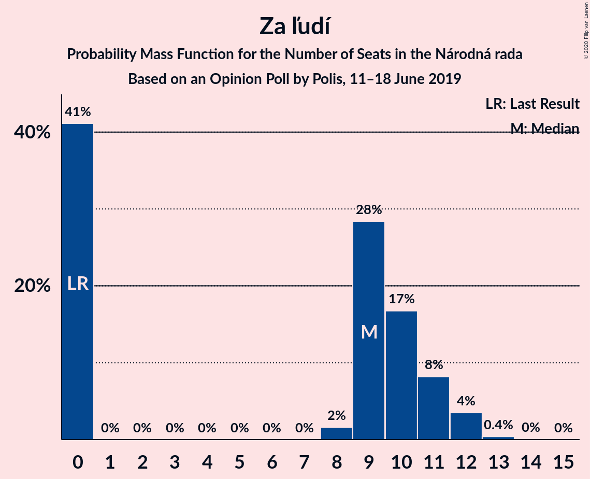
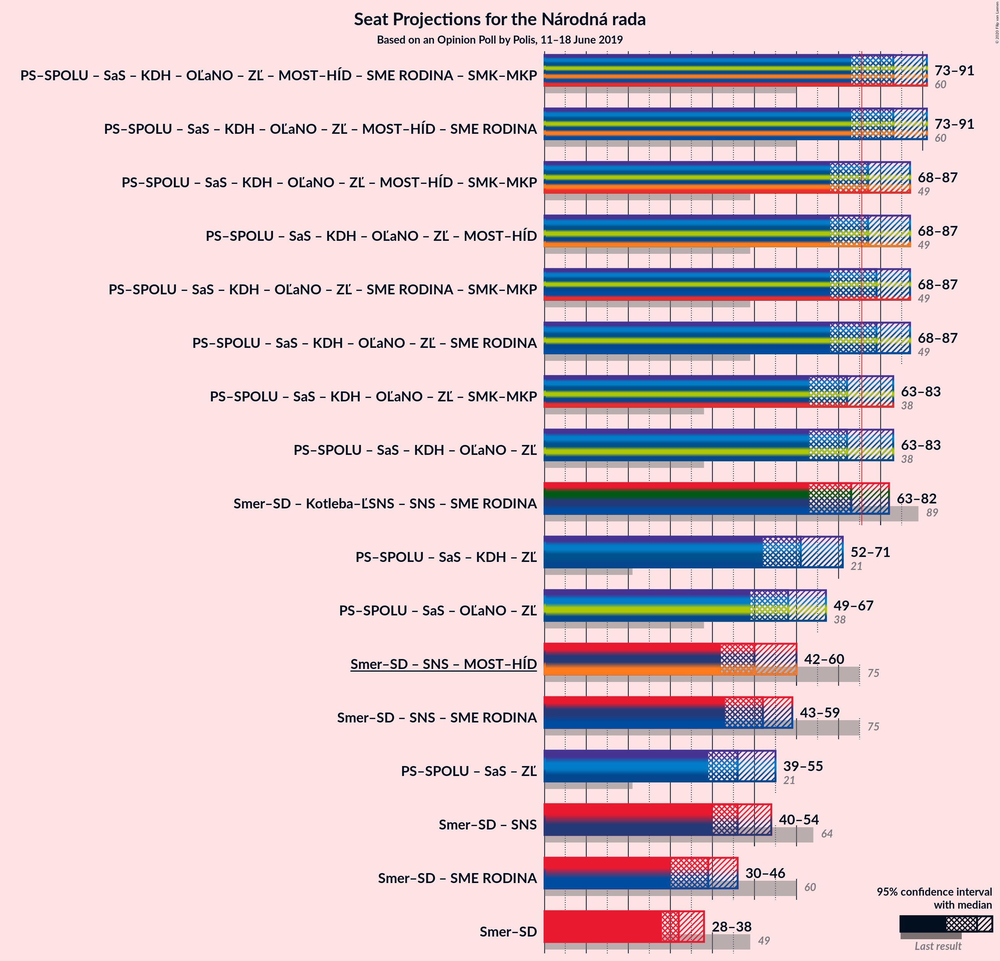

# Opinion Poll by Polis, 11–18 June 2019

<a href="#voting-intentions">Voting Intentions</a> | <a href="#seats">Seats</a> | <a href="#coalitions">Coalitions</a> | <a href="#technical-information">Technical Information</a>

## Voting Intentions

### Confidence Intervals

| Party | Last Result | Poll Result | 80% Confidence Interval | 90% Confidence Interval | 95% Confidence Interval | 99% Confidence Interval |
|:-----:|:-----------:|:-----------:|:-----------------------:|:-----------------------:|:-----------------------:|:-----------------------:|
| SMER–sociálna demokracia | 28.3% | 18.3% | 16.9–19.8% |16.5–20.2% |16.2–20.6% |15.5–21.4% |
| Progresívne Slovensko–SPOLU–Občianska Demokracia | 0.0% | 15.0% | 13.7–16.4% |13.4–16.8% |13.1–17.2% |12.5–17.9% |
| Kotleba–Ľudová strana Naše Slovensko | 8.0% | 11.4% | 10.3–12.7% |10.0–13.1% |9.7–13.4% |9.2–14.0% |
| Sloboda a Solidarita | 12.1% | 8.5% | 7.5–9.6% |7.3–10.0% |7.0–10.2% |6.6–10.8% |
| Kresťanskodemokratické hnutie | 4.9% | 8.2% | 7.3–9.4% |7.0–9.7% |6.8–10.0% |6.4–10.5% |
| Slovenská národná strana | 8.6% | 7.6% | 6.7–8.7% |6.5–9.0% |6.2–9.3% |5.8–9.9% |
| OBYČAJNÍ ĽUDIA a nezávislé osobnosti | 11.0% | 6.3% | 5.4–7.3% |5.2–7.6% |5.0–7.8% |4.6–8.3% |
| Za ľudí | 0.0% | 5.2% | 4.5–6.2% |4.3–6.4% |4.1–6.7% |3.8–7.1% |
| MOST–HÍD | 6.5% | 5.1% | 4.3–6.0% |4.1–6.2% |3.9–6.5% |3.6–7.0% |
| SME RODINA | 6.6% | 5.0% | 4.2–5.9% |4.0–6.2% |3.9–6.4% |3.5–6.9% |

*Note:* The poll result column reflects the actual value used in the calculations. Published results may vary slightly, and in addition be rounded to fewer digits.

## Seats

### Confidence Intervals

| Party | Last Result | Median | 80% Confidence Interval | 90% Confidence Interval | 95% Confidence Interval | 99% Confidence Interval |
|:-----:|:-----------:|:------:|:-----------------------:|:-----------------------:|:-----------------------:|:-----------------------:|
| <a href="#smer–sociálna-demokracia">SMER–sociálna demokracia</a> | 49 | 31 | 29–34 |28–34 |27–35 |27–37 |
| <a href="#progresívne-slovensko–spolu–občianska-demokracia">Progresívne Slovensko–SPOLU–Občianska Demokracia</a> | 0 | 26 | 23–27 |23–28 |22–30 |21–31 |
| <a href="#kotleba–ľudová-strana-naše-slovensko">Kotleba–Ľudová strana Naše Slovensko</a> | 14 | 22 | 20–23 |19–23 |18–24 |17–25 |
| <a href="#sloboda-a-solidarita">Sloboda a Solidarita</a> | 21 | 13 | 13–16 |13–17 |12–17 |11–20 |
| <a href="#kresťanskodemokratické-hnutie">Kresťanskodemokratické hnutie</a> | 0 | 15 | 13–17 |13–18 |12–18 |12–20 |
| <a href="#slovenská-národná-strana">Slovenská národná strana</a> | 15 | 14 | 12–15 |12–16 |11–17 |11–17 |
| <a href="#obyčajní-ľudia-a-nezávislé-osobnosti">OBYČAJNÍ ĽUDIA a nezávislé osobnosti</a> | 17 | 11 | 11–12 |9–13 |9–13 |0–15 |
| <a href="#za-ľudí">Za ľudí</a> | 0 | 9 | 0–10 |0–10 |0–11 |0–12 |
| <a href="#most–híd">MOST–HÍD</a> | 11 | 0 | 0–9 |0–10 |0–10 |0–11 |
| <a href="#sme-rodina">SME RODINA</a> | 11 | 9 | 0–11 |0–11 |0–11 |0–11 |

### SMER–sociálna demokracia

*For a full overview of the results for this party, see the [SMER–sociálna demokracia](party-smer–sociálnademokracia.html) page.*

| Number of Seats | Probability | Accumulated | Special Marks |
|:---------------:|:-----------:|:-----------:|:-------------:|
| 25 | 0.1% | 100% |  |
| 26 | 0.1% | 99.9% |  |
| 27 | 2% | 99.8% |  |
| 28 | 3% | 97% |  |
| 29 | 8% | 94% |  |
| 30 | 6% | 86% |  |
| 31 | 31% | 80% | Median |
| 32 | 3% | 50% |  |
| 33 | 4% | 46% |  |
| 34 | 38% | 42% |  |
| 35 | 3% | 4% |  |
| 36 | 1.0% | 2% |  |
| 37 | 0.6% | 0.9% |  |
| 38 | 0.1% | 0.4% |  |
| 39 | 0.2% | 0.2% |  |
| 40 | 0% | 0% |  |
| 41 | 0% | 0% |  |
| 42 | 0% | 0% |  |
| 43 | 0% | 0% |  |
| 44 | 0% | 0% |  |
| 45 | 0% | 0% |  |
| 46 | 0% | 0% |  |
| 47 | 0% | 0% |  |
| 48 | 0% | 0% |  |
| 49 | 0% | 0% | Last Result |

### Progresívne Slovensko–SPOLU–Občianska Demokracia

*For a full overview of the results for this party, see the [Progresívne Slovensko–SPOLU–Občianska Demokracia](party-progresívneslovensko–spolu–občianskademokracia.html) page.*

| Number of Seats | Probability | Accumulated | Special Marks |
|:---------------:|:-----------:|:-----------:|:-------------:|
| 0 | 0% | 100% | Last Result |
| 1 | 0% | 100% |  |
| 2 | 0% | 100% |  |
| 3 | 0% | 100% |  |
| 4 | 0% | 100% |  |
| 5 | 0% | 100% |  |
| 6 | 0% | 100% |  |
| 7 | 0% | 100% |  |
| 8 | 0% | 100% |  |
| 9 | 0% | 100% |  |
| 10 | 0% | 100% |  |
| 11 | 0% | 100% |  |
| 12 | 0% | 100% |  |
| 13 | 0% | 100% |  |
| 14 | 0% | 100% |  |
| 15 | 0% | 100% |  |
| 16 | 0% | 100% |  |
| 17 | 0% | 100% |  |
| 18 | 0% | 100% |  |
| 19 | 0% | 100% |  |
| 20 | 0% | 100% |  |
| 21 | 1.0% | 99.9% |  |
| 22 | 2% | 98.9% |  |
| 23 | 16% | 97% |  |
| 24 | 7% | 81% |  |
| 25 | 4% | 74% |  |
| 26 | 55% | 70% | Median |
| 27 | 8% | 15% |  |
| 28 | 3% | 7% |  |
| 29 | 2% | 4% |  |
| 30 | 2% | 3% |  |
| 31 | 0.7% | 1.1% |  |
| 32 | 0.3% | 0.4% |  |
| 33 | 0.1% | 0.1% |  |
| 34 | 0% | 0% |  |

### Kotleba–Ľudová strana Naše Slovensko

*For a full overview of the results for this party, see the [Kotleba–Ľudová strana Naše Slovensko](party-kotleba–ľudovástrananašeslovensko.html) page.*

| Number of Seats | Probability | Accumulated | Special Marks |
|:---------------:|:-----------:|:-----------:|:-------------:|
| 14 | 0% | 100% | Last Result |
| 15 | 0.1% | 100% |  |
| 16 | 0.3% | 99.9% |  |
| 17 | 1.2% | 99.6% |  |
| 18 | 2% | 98% |  |
| 19 | 4% | 97% |  |
| 20 | 35% | 92% |  |
| 21 | 7% | 57% |  |
| 22 | 16% | 50% | Median |
| 23 | 31% | 34% |  |
| 24 | 2% | 4% |  |
| 25 | 0.7% | 1.0% |  |
| 26 | 0.2% | 0.3% |  |
| 27 | 0.1% | 0.1% |  |
| 28 | 0% | 0% |  |

### Sloboda a Solidarita

*For a full overview of the results for this party, see the [Sloboda a Solidarita](party-slobodaasolidarita.html) page.*

| Number of Seats | Probability | Accumulated | Special Marks |
|:---------------:|:-----------:|:-----------:|:-------------:|
| 10 | 0.1% | 100% |  |
| 11 | 1.0% | 99.9% |  |
| 12 | 3% | 98.9% |  |
| 13 | 48% | 96% | Median |
| 14 | 6% | 48% |  |
| 15 | 10% | 42% |  |
| 16 | 26% | 32% |  |
| 17 | 4% | 5% |  |
| 18 | 0.2% | 0.8% |  |
| 19 | 0.1% | 0.6% |  |
| 20 | 0.5% | 0.5% |  |
| 21 | 0% | 0% | Last Result |

### Kresťanskodemokratické hnutie

*For a full overview of the results for this party, see the [Kresťanskodemokratické hnutie](party-kresťanskodemokratickéhnutie.html) page.*

| Number of Seats | Probability | Accumulated | Special Marks |
|:---------------:|:-----------:|:-----------:|:-------------:|
| 0 | 0% | 100% | Last Result |
| 1 | 0% | 100% |  |
| 2 | 0% | 100% |  |
| 3 | 0% | 100% |  |
| 4 | 0% | 100% |  |
| 5 | 0% | 100% |  |
| 6 | 0% | 100% |  |
| 7 | 0% | 100% |  |
| 8 | 0% | 100% |  |
| 9 | 0% | 100% |  |
| 10 | 0% | 100% |  |
| 11 | 0.1% | 100% |  |
| 12 | 5% | 99.8% |  |
| 13 | 23% | 95% |  |
| 14 | 6% | 72% |  |
| 15 | 24% | 66% | Median |
| 16 | 2% | 42% |  |
| 17 | 34% | 40% |  |
| 18 | 5% | 6% |  |
| 19 | 0.2% | 1.0% |  |
| 20 | 0.5% | 0.8% |  |
| 21 | 0.3% | 0.3% |  |
| 22 | 0% | 0% |  |

### Slovenská národná strana

*For a full overview of the results for this party, see the [Slovenská národná strana](party-slovenskánárodnástrana.html) page.*

| Number of Seats | Probability | Accumulated | Special Marks |
|:---------------:|:-----------:|:-----------:|:-------------:|
| 10 | 0.3% | 100% |  |
| 11 | 4% | 99.7% |  |
| 12 | 8% | 96% |  |
| 13 | 14% | 88% |  |
| 14 | 62% | 75% | Median |
| 15 | 5% | 13% | Last Result |
| 16 | 3% | 8% |  |
| 17 | 4% | 5% |  |
| 18 | 0.1% | 0.4% |  |
| 19 | 0.4% | 0.4% |  |
| 20 | 0% | 0% |  |

### OBYČAJNÍ ĽUDIA a nezávislé osobnosti

*For a full overview of the results for this party, see the [OBYČAJNÍ ĽUDIA a nezávislé osobnosti](party-obyčajníľudiaanezávisléosobnosti.html) page.*

| Number of Seats | Probability | Accumulated | Special Marks |
|:---------------:|:-----------:|:-----------:|:-------------:|
| 0 | 2% | 100% |  |
| 1 | 0% | 98% |  |
| 2 | 0% | 98% |  |
| 3 | 0% | 98% |  |
| 4 | 0% | 98% |  |
| 5 | 0% | 98% |  |
| 6 | 0% | 98% |  |
| 7 | 0% | 98% |  |
| 8 | 0.1% | 98% |  |
| 9 | 4% | 98% |  |
| 10 | 4% | 94% |  |
| 11 | 50% | 91% | Median |
| 12 | 32% | 41% |  |
| 13 | 7% | 9% |  |
| 14 | 2% | 2% |  |
| 15 | 0.6% | 0.7% |  |
| 16 | 0.1% | 0.1% |  |
| 17 | 0% | 0% | Last Result |

### Za ľudí

*For a full overview of the results for this party, see the [Za ľudí](party-zaľudí.html) page.*

| Number of Seats | Probability | Accumulated | Special Marks |
|:---------------:|:-----------:|:-----------:|:-------------:|
| 0 | 28% | 100% | Last Result |
| 1 | 0% | 72% |  |
| 2 | 0% | 72% |  |
| 3 | 0% | 72% |  |
| 4 | 0% | 72% |  |
| 5 | 0% | 72% |  |
| 6 | 0% | 72% |  |
| 7 | 0% | 72% |  |
| 8 | 5% | 72% |  |
| 9 | 45% | 67% | Median |
| 10 | 19% | 23% |  |
| 11 | 3% | 4% |  |
| 12 | 0.6% | 0.8% |  |
| 13 | 0.2% | 0.3% |  |
| 14 | 0% | 0% |  |

### MOST–HÍD

*For a full overview of the results for this party, see the [MOST–HÍD](party-most–híd.html) page.*

| Number of Seats | Probability | Accumulated | Special Marks |
|:---------------:|:-----------:|:-----------:|:-------------:|
| 0 | 82% | 100% | Median |
| 1 | 0% | 18% |  |
| 2 | 0% | 18% |  |
| 3 | 0% | 18% |  |
| 4 | 0% | 18% |  |
| 5 | 0% | 18% |  |
| 6 | 0% | 18% |  |
| 7 | 0% | 18% |  |
| 8 | 2% | 18% |  |
| 9 | 9% | 16% |  |
| 10 | 5% | 7% |  |
| 11 | 2% | 2% | Last Result |
| 12 | 0.1% | 0.1% |  |
| 13 | 0% | 0.1% |  |
| 14 | 0% | 0.1% |  |
| 15 | 0% | 0% |  |

### SME RODINA

*For a full overview of the results for this party, see the [SME RODINA](party-smerodina.html) page.*

| Number of Seats | Probability | Accumulated | Special Marks |
|:---------------:|:-----------:|:-----------:|:-------------:|
| 0 | 15% | 100% |  |
| 1 | 0% | 85% |  |
| 2 | 0% | 85% |  |
| 3 | 0% | 85% |  |
| 4 | 0% | 85% |  |
| 5 | 0% | 85% |  |
| 6 | 0% | 85% |  |
| 7 | 0% | 85% |  |
| 8 | 5% | 85% |  |
| 9 | 45% | 80% | Median |
| 10 | 12% | 35% |  |
| 11 | 22% | 22% | Last Result |
| 12 | 0.4% | 0.5% |  |
| 13 | 0.1% | 0.1% |  |
| 14 | 0% | 0% |  |

## Coalitions

### Confidence Intervals

| Coalition | Last Result | Median | Majority? | 80% Confidence Interval | 90% Confidence Interval | 95% Confidence Interval | 99% Confidence Interval |
|:---------:|:-----------:|:------:|:---------:|:-----------------------:|:-----------------------:|:-----------------------:|:-----------------------:|
| SMER–sociálna demokracia – Slovenská národná strana – MOST–HÍD | 75 | 48 | 0% | 43–53 | 42–55 | 42–57 | 42–59 |
| SMER–sociálna demokracia | 49 | 31 | 0% | 29–34 | 28–34 | 27–35 | 27–37 |

### SMER–sociálna demokracia – Slovenská národná strana – MOST–HÍD

| Number of Seats | Probability | Accumulated | Special Marks |
|:---------------:|:-----------:|:-----------:|:-------------:|
| 41 | 0% | 100% |  |
| 42 | 8% | 99.9% |  |
| 43 | 2% | 92% |  |
| 44 | 2% | 89% |  |
| 45 | 28% | 88% | Median |
| 46 | 1.4% | 60% |  |
| 47 | 3% | 59% |  |
| 48 | 35% | 56% |  |
| 49 | 0.3% | 20% |  |
| 50 | 0.4% | 20% |  |
| 51 | 5% | 20% |  |
| 52 | 4% | 15% |  |
| 53 | 1.4% | 11% |  |
| 54 | 3% | 10% |  |
| 55 | 3% | 7% |  |
| 56 | 0.3% | 4% |  |
| 57 | 2% | 4% |  |
| 58 | 1.0% | 2% |  |
| 59 | 0.5% | 0.9% |  |
| 60 | 0.3% | 0.4% |  |
| 61 | 0% | 0.1% |  |
| 62 | 0% | 0.1% |  |
| 63 | 0% | 0.1% |  |
| 64 | 0% | 0.1% |  |
| 65 | 0.1% | 0.1% |  |
| 66 | 0% | 0% |  |
| 67 | 0% | 0% |  |
| 68 | 0% | 0% |  |
| 69 | 0% | 0% |  |
| 70 | 0% | 0% |  |
| 71 | 0% | 0% |  |
| 72 | 0% | 0% |  |
| 73 | 0% | 0% |  |
| 74 | 0% | 0% |  |
| 75 | 0% | 0% | Last Result |

### SMER–sociálna demokracia

| Number of Seats | Probability | Accumulated | Special Marks |
|:---------------:|:-----------:|:-----------:|:-------------:|
| 25 | 0.1% | 100% |  |
| 26 | 0.1% | 99.9% |  |
| 27 | 2% | 99.8% |  |
| 28 | 3% | 97% |  |
| 29 | 8% | 94% |  |
| 30 | 6% | 86% |  |
| 31 | 31% | 80% | Median |
| 32 | 3% | 50% |  |
| 33 | 4% | 46% |  |
| 34 | 38% | 42% |  |
| 35 | 3% | 4% |  |
| 36 | 1.0% | 2% |  |
| 37 | 0.6% | 0.9% |  |
| 38 | 0.1% | 0.4% |  |
| 39 | 0.2% | 0.2% |  |
| 40 | 0% | 0% |  |
| 41 | 0% | 0% |  |
| 42 | 0% | 0% |  |
| 43 | 0% | 0% |  |
| 44 | 0% | 0% |  |
| 45 | 0% | 0% |  |
| 46 | 0% | 0% |  |
| 47 | 0% | 0% |  |
| 48 | 0% | 0% |  |
| 49 | 0% | 0% | Last Result |

## Technical Information

### Opinion Poll

+ **Polling firm:** Polis
+ **Commissioner(s):** —
+ **Fieldwork period:** 11–18 June 2019

### Calculations

+ **Sample size:** 1165
+ **Simulations done:** 131,072
+ **Error estimate:** 2.12%

