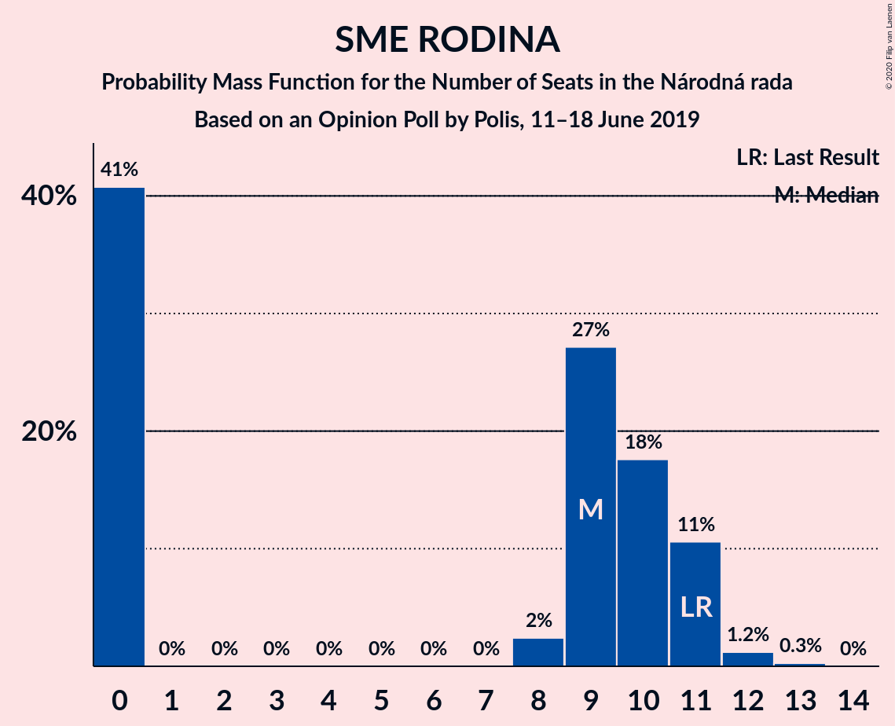
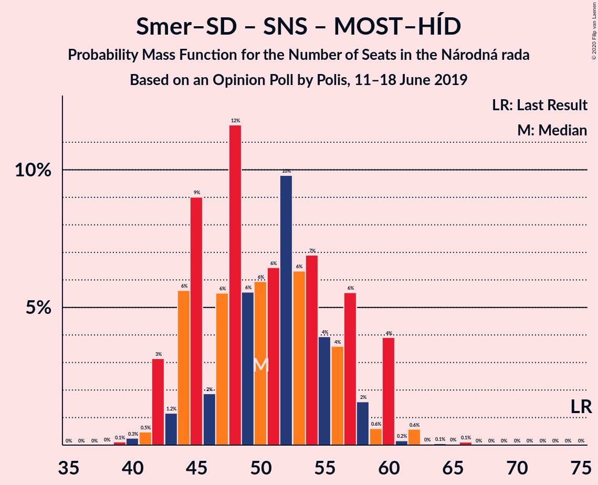

# Opinion Poll by Polis, 11–18 June 2019

<a href="#voting-intentions">Voting Intentions</a> | <a href="#seats">Seats</a> | <a href="#coalitions">Coalitions</a> | <a href="#technical-information">Technical Information</a>

## Voting Intentions

### Confidence Intervals

| Party | Last Result | Poll Result | 80% Confidence Interval | 90% Confidence Interval | 95% Confidence Interval | 99% Confidence Interval |
|:-----:|:-----------:|:-----------:|:-----------------------:|:-----------------------:|:-----------------------:|:-----------------------:|
| SMER–sociálna demokracia | 28.3% | 18.3% | 16.9–19.8% |16.5–20.2% |16.2–20.6% |15.5–21.4% |
| Progresívne Slovensko–SPOLU–Občianska Demokracia | 0.0% | 15.0% | 13.7–16.4% |13.4–16.8% |13.1–17.2% |12.5–17.9% |
| Kotleba–Ľudová strana Naše Slovensko | 8.0% | 11.4% | 10.3–12.7% |10.0–13.1% |9.7–13.4% |9.2–14.0% |
| Sloboda a Solidarita | 12.1% | 8.5% | 7.5–9.6% |7.3–10.0% |7.0–10.2% |6.6–10.8% |
| Kresťanskodemokratické hnutie | 4.9% | 8.2% | 7.3–9.4% |7.0–9.7% |6.8–10.0% |6.4–10.5% |
| Slovenská národná strana | 8.6% | 7.6% | 6.7–8.7% |6.5–9.0% |6.2–9.3% |5.8–9.9% |
| OBYČAJNÍ ĽUDIA a nezávislé osobnosti | 11.0% | 6.3% | 5.4–7.3% |5.2–7.6% |5.0–7.8% |4.6–8.3% |
| Za ľudí | 0.0% | 5.2% | 4.5–6.2% |4.3–6.4% |4.1–6.7% |3.8–7.1% |
| MOST–HÍD | 6.5% | 5.1% | 4.3–6.0% |4.1–6.2% |3.9–6.5% |3.6–7.0% |
| SME RODINA | 6.6% | 5.0% | 4.2–5.9% |4.0–6.2% |3.9–6.4% |3.5–6.9% |

*Note:* The poll result column reflects the actual value used in the calculations. Published results may vary slightly, and in addition be rounded to fewer digits.

## Seats

### Confidence Intervals

| Party | Last Result | Median | 80% Confidence Interval | 90% Confidence Interval | 95% Confidence Interval | 99% Confidence Interval |
|:-----:|:-----------:|:------:|:-----------------------:|:-----------------------:|:-----------------------:|:-----------------------:|
| <a href="#smer–sociálna-demokracia">SMER–sociálna demokracia</a> | 49 | 32 | 29–36 |28–38 |28–38 |26–41 |
| <a href="#progresívne-slovensko–spolu–občianska-demokracia">Progresívne Slovensko–SPOLU–Občianska Demokracia</a> | 0 | 26 | 22–29 |22–31 |22–32 |21–34 |
| <a href="#kotleba–ľudová-strana-naše-slovensko">Kotleba–Ľudová strana Naše Slovensko</a> | 14 | 21 | 19–24 |18–24 |17–26 |16–26 |
| <a href="#sloboda-a-solidarita">Sloboda a Solidarita</a> | 21 | 15 | 13–17 |12–18 |12–19 |11–20 |
| <a href="#kresťanskodemokratické-hnutie">Kresťanskodemokratické hnutie</a> | 0 | 15 | 13–17 |12–18 |12–18 |11–20 |
| <a href="#slovenská-národná-strana">Slovenská národná strana</a> | 15 | 14 | 12–16 |11–17 |11–17 |10–18 |
| <a href="#obyčajní-ľudia-a-nezávislé-osobnosti">OBYČAJNÍ ĽUDIA a nezávislé osobnosti</a> | 17 | 12 | 9–13 |9–14 |9–15 |0–16 |
| <a href="#za-ľudí">Za ľudí</a> | 0 | 9 | 0–11 |0–11 |0–12 |0–12 |
| <a href="#most–híd">MOST–HÍD</a> | 11 | 0 | 0–10 |0–11 |0–11 |0–12 |
| <a href="#sme-rodina">SME RODINA</a> | 11 | 9 | 0–11 |0–11 |0–11 |0–12 |

### SMER–sociálna demokracia

*For a full overview of the results for this party, see the [SMER–sociálna demokracia](party-smer–sociálnademokracia.html) page.*

| Number of Seats | Probability | Accumulated | Special Marks |
|:---------------:|:-----------:|:-----------:|:-------------:|
| 25 | 0.3% | 100% |  |
| 26 | 0.4% | 99.7% |  |
| 27 | 1.4% | 99.3% |  |
| 28 | 3% | 98% |  |
| 29 | 7% | 95% |  |
| 30 | 10% | 88% |  |
| 31 | 20% | 78% |  |
| 32 | 10% | 58% | Median |
| 33 | 9% | 48% |  |
| 34 | 11% | 39% |  |
| 35 | 9% | 27% |  |
| 36 | 11% | 18% |  |
| 37 | 2% | 7% |  |
| 38 | 3% | 5% |  |
| 39 | 0.6% | 2% |  |
| 40 | 1.1% | 2% |  |
| 41 | 0.4% | 0.6% |  |
| 42 | 0.1% | 0.1% |  |
| 43 | 0% | 0.1% |  |
| 44 | 0% | 0% |  |
| 45 | 0% | 0% |  |
| 46 | 0% | 0% |  |
| 47 | 0% | 0% |  |
| 48 | 0% | 0% |  |
| 49 | 0% | 0% | Last Result |

### Progresívne Slovensko–SPOLU–Občianska Demokracia

*For a full overview of the results for this party, see the [Progresívne Slovensko–SPOLU–Občianska Demokracia](party-progresívneslovensko–spolu–občianskademokracia.html) page.*

| Number of Seats | Probability | Accumulated | Special Marks |
|:---------------:|:-----------:|:-----------:|:-------------:|
| 0 | 0% | 100% | Last Result |
| 1 | 0% | 100% |  |
| 2 | 0% | 100% |  |
| 3 | 0% | 100% |  |
| 4 | 0% | 100% |  |
| 5 | 0% | 100% |  |
| 6 | 0% | 100% |  |
| 7 | 0% | 100% |  |
| 8 | 0% | 100% |  |
| 9 | 0% | 100% |  |
| 10 | 0% | 100% |  |
| 11 | 0% | 100% |  |
| 12 | 0% | 100% |  |
| 13 | 0% | 100% |  |
| 14 | 0% | 100% |  |
| 15 | 0% | 100% |  |
| 16 | 0% | 100% |  |
| 17 | 0% | 100% |  |
| 18 | 0% | 100% |  |
| 19 | 0% | 100% |  |
| 20 | 0.3% | 100% |  |
| 21 | 0.7% | 99.6% |  |
| 22 | 10% | 98.9% |  |
| 23 | 10% | 88% |  |
| 24 | 8% | 79% |  |
| 25 | 13% | 71% |  |
| 26 | 21% | 58% | Median |
| 27 | 13% | 37% |  |
| 28 | 8% | 24% |  |
| 29 | 8% | 16% |  |
| 30 | 2% | 7% |  |
| 31 | 2% | 5% |  |
| 32 | 3% | 4% |  |
| 33 | 0.2% | 0.9% |  |
| 34 | 0.7% | 0.7% |  |
| 35 | 0% | 0.1% |  |
| 36 | 0% | 0% |  |

### Kotleba–Ľudová strana Naše Slovensko

*For a full overview of the results for this party, see the [Kotleba–Ľudová strana Naše Slovensko](party-kotleba–ľudovástrananašeslovensko.html) page.*

| Number of Seats | Probability | Accumulated | Special Marks |
|:---------------:|:-----------:|:-----------:|:-------------:|
| 14 | 0.1% | 100% | Last Result |
| 15 | 0.4% | 99.9% |  |
| 16 | 1.1% | 99.5% |  |
| 17 | 2% | 98% |  |
| 18 | 5% | 96% |  |
| 19 | 9% | 91% |  |
| 20 | 22% | 83% |  |
| 21 | 16% | 61% | Median |
| 22 | 19% | 45% |  |
| 23 | 16% | 26% |  |
| 24 | 5% | 10% |  |
| 25 | 2% | 5% |  |
| 26 | 3% | 3% |  |
| 27 | 0.2% | 0.3% |  |
| 28 | 0% | 0% |  |

### Sloboda a Solidarita

*For a full overview of the results for this party, see the [Sloboda a Solidarita](party-slobodaasolidarita.html) page.*

| Number of Seats | Probability | Accumulated | Special Marks |
|:---------------:|:-----------:|:-----------:|:-------------:|
| 10 | 0.2% | 100% |  |
| 11 | 1.0% | 99.8% |  |
| 12 | 5% | 98.9% |  |
| 13 | 19% | 94% |  |
| 14 | 25% | 75% |  |
| 15 | 16% | 50% | Median |
| 16 | 19% | 35% |  |
| 17 | 9% | 15% |  |
| 18 | 3% | 6% |  |
| 19 | 0.7% | 3% |  |
| 20 | 2% | 2% |  |
| 21 | 0.2% | 0.2% | Last Result |
| 22 | 0% | 0% |  |

### Kresťanskodemokratické hnutie

*For a full overview of the results for this party, see the [Kresťanskodemokratické hnutie](party-kresťanskodemokratickéhnutie.html) page.*

| Number of Seats | Probability | Accumulated | Special Marks |
|:---------------:|:-----------:|:-----------:|:-------------:|
| 0 | 0% | 100% | Last Result |
| 1 | 0% | 100% |  |
| 2 | 0% | 100% |  |
| 3 | 0% | 100% |  |
| 4 | 0% | 100% |  |
| 5 | 0% | 100% |  |
| 6 | 0% | 100% |  |
| 7 | 0% | 100% |  |
| 8 | 0% | 100% |  |
| 9 | 0% | 100% |  |
| 10 | 0.2% | 100% |  |
| 11 | 0.9% | 99.8% |  |
| 12 | 5% | 98.9% |  |
| 13 | 16% | 94% |  |
| 14 | 20% | 78% |  |
| 15 | 28% | 58% | Median |
| 16 | 13% | 31% |  |
| 17 | 12% | 18% |  |
| 18 | 5% | 6% |  |
| 19 | 0.6% | 1.4% |  |
| 20 | 0.7% | 0.8% |  |
| 21 | 0.1% | 0.1% |  |
| 22 | 0% | 0% |  |

### Slovenská národná strana

*For a full overview of the results for this party, see the [Slovenská národná strana](party-slovenskánárodnástrana.html) page.*

| Number of Seats | Probability | Accumulated | Special Marks |
|:---------------:|:-----------:|:-----------:|:-------------:|
| 9 | 0.1% | 100% |  |
| 10 | 2% | 99.9% |  |
| 11 | 6% | 98% |  |
| 12 | 18% | 92% |  |
| 13 | 19% | 74% |  |
| 14 | 29% | 55% | Median |
| 15 | 13% | 26% | Last Result |
| 16 | 7% | 13% |  |
| 17 | 5% | 6% |  |
| 18 | 0.6% | 1.0% |  |
| 19 | 0.4% | 0.4% |  |
| 20 | 0% | 0.1% |  |
| 21 | 0% | 0% |  |

### OBYČAJNÍ ĽUDIA a nezávislé osobnosti

*For a full overview of the results for this party, see the [OBYČAJNÍ ĽUDIA a nezávislé osobnosti](party-obyčajníľudiaanezávisléosobnosti.html) page.*

| Number of Seats | Probability | Accumulated | Special Marks |
|:---------------:|:-----------:|:-----------:|:-------------:|
| 0 | 2% | 100% |  |
| 1 | 0% | 98% |  |
| 2 | 0% | 98% |  |
| 3 | 0% | 98% |  |
| 4 | 0% | 98% |  |
| 5 | 0% | 98% |  |
| 6 | 0% | 98% |  |
| 7 | 0% | 98% |  |
| 8 | 0.2% | 98% |  |
| 9 | 11% | 98% |  |
| 10 | 12% | 87% |  |
| 11 | 24% | 75% |  |
| 12 | 28% | 51% | Median |
| 13 | 14% | 22% |  |
| 14 | 5% | 8% |  |
| 15 | 2% | 3% |  |
| 16 | 0.5% | 0.5% |  |
| 17 | 0% | 0% | Last Result |

### Za ľudí

*For a full overview of the results for this party, see the [Za ľudí](party-zaľudí.html) page.*

| Number of Seats | Probability | Accumulated | Special Marks |
|:---------------:|:-----------:|:-----------:|:-------------:|
| 0 | 41% | 100% | Last Result |
| 1 | 0% | 59% |  |
| 2 | 0% | 59% |  |
| 3 | 0% | 59% |  |
| 4 | 0% | 59% |  |
| 5 | 0% | 59% |  |
| 6 | 0% | 59% |  |
| 7 | 0% | 59% |  |
| 8 | 2% | 59% |  |
| 9 | 28% | 57% | Median |
| 10 | 17% | 29% |  |
| 11 | 8% | 12% |  |
| 12 | 4% | 4% |  |
| 13 | 0.4% | 0.4% |  |
| 14 | 0% | 0.1% |  |
| 15 | 0% | 0% |  |

### MOST–HÍD

*For a full overview of the results for this party, see the [MOST–HÍD](party-most–híd.html) page.*

| Number of Seats | Probability | Accumulated | Special Marks |
|:---------------:|:-----------:|:-----------:|:-------------:|
| 0 | 56% | 100% | Median |
| 1 | 0% | 44% |  |
| 2 | 0% | 44% |  |
| 3 | 0% | 44% |  |
| 4 | 0% | 44% |  |
| 5 | 0% | 44% |  |
| 6 | 0% | 44% |  |
| 7 | 0% | 44% |  |
| 8 | 2% | 44% |  |
| 9 | 22% | 42% |  |
| 10 | 12% | 20% |  |
| 11 | 7% | 8% | Last Result |
| 12 | 1.3% | 2% |  |
| 13 | 0.2% | 0.3% |  |
| 14 | 0.1% | 0.1% |  |
| 15 | 0% | 0% |  |

### SME RODINA

*For a full overview of the results for this party, see the [SME RODINA](party-smerodina.html) page.*

| Number of Seats | Probability | Accumulated | Special Marks |
|:---------------:|:-----------:|:-----------:|:-------------:|
| 0 | 41% | 100% |  |
| 1 | 0% | 59% |  |
| 2 | 0% | 59% |  |
| 3 | 0% | 59% |  |
| 4 | 0% | 59% |  |
| 5 | 0% | 59% |  |
| 6 | 0% | 59% |  |
| 7 | 0% | 59% |  |
| 8 | 2% | 59% |  |
| 9 | 27% | 57% | Median |
| 10 | 18% | 30% |  |
| 11 | 11% | 12% | Last Result |
| 12 | 1.2% | 1.5% |  |
| 13 | 0.3% | 0.3% |  |
| 14 | 0% | 0% |  |

## Coalitions

### Confidence Intervals

| Coalition | Last Result | Median | Majority? | 80% Confidence Interval | 90% Confidence Interval | 95% Confidence Interval | 99% Confidence Interval |
|:---------:|:-----------:|:------:|:---------:|:-----------------------:|:-----------------------:|:-----------------------:|:-----------------------:|
| SMER–sociálna demokracia – Slovenská národná strana – MOST–HÍD | 75 | 50 | 0% | 44–57 | 43–59 | 42–60 | 41–62 |
| SMER–sociálna demokracia | 49 | 32 | 0% | 29–36 | 28–38 | 28–38 | 26–41 |

### SMER–sociálna demokracia – Slovenská národná strana – MOST–HÍD

| Number of Seats | Probability | Accumulated | Special Marks |
|:---------------:|:-----------:|:-----------:|:-------------:|
| 39 | 0.1% | 100% |  |
| 40 | 0.3% | 99.8% |  |
| 41 | 0.5% | 99.6% |  |
| 42 | 3% | 99.1% |  |
| 43 | 1.2% | 96% |  |
| 44 | 6% | 95% |  |
| 45 | 9% | 89% |  |
| 46 | 2% | 80% | Median |
| 47 | 6% | 78% |  |
| 48 | 12% | 73% |  |
| 49 | 6% | 61% |  |
| 50 | 6% | 56% |  |
| 51 | 6% | 50% |  |
| 52 | 10% | 43% |  |
| 53 | 6% | 33% |  |
| 54 | 7% | 27% |  |
| 55 | 4% | 20% |  |
| 56 | 4% | 16% |  |
| 57 | 6% | 13% |  |
| 58 | 2% | 7% |  |
| 59 | 0.6% | 6% |  |
| 60 | 4% | 5% |  |
| 61 | 0.2% | 1.0% |  |
| 62 | 0.6% | 0.8% |  |
| 63 | 0% | 0.3% |  |
| 64 | 0.1% | 0.2% |  |
| 65 | 0% | 0.2% |  |
| 66 | 0.1% | 0.1% |  |
| 67 | 0% | 0% |  |
| 68 | 0% | 0% |  |
| 69 | 0% | 0% |  |
| 70 | 0% | 0% |  |
| 71 | 0% | 0% |  |
| 72 | 0% | 0% |  |
| 73 | 0% | 0% |  |
| 74 | 0% | 0% |  |
| 75 | 0% | 0% | Last Result |

### SMER–sociálna demokracia

| Number of Seats | Probability | Accumulated | Special Marks |
|:---------------:|:-----------:|:-----------:|:-------------:|
| 25 | 0.3% | 100% |  |
| 26 | 0.4% | 99.7% |  |
| 27 | 1.4% | 99.3% |  |
| 28 | 3% | 98% |  |
| 29 | 7% | 95% |  |
| 30 | 10% | 88% |  |
| 31 | 20% | 78% |  |
| 32 | 10% | 58% | Median |
| 33 | 9% | 48% |  |
| 34 | 11% | 39% |  |
| 35 | 9% | 27% |  |
| 36 | 11% | 18% |  |
| 37 | 2% | 7% |  |
| 38 | 3% | 5% |  |
| 39 | 0.6% | 2% |  |
| 40 | 1.1% | 2% |  |
| 41 | 0.4% | 0.6% |  |
| 42 | 0.1% | 0.1% |  |
| 43 | 0% | 0.1% |  |
| 44 | 0% | 0% |  |
| 45 | 0% | 0% |  |
| 46 | 0% | 0% |  |
| 47 | 0% | 0% |  |
| 48 | 0% | 0% |  |
| 49 | 0% | 0% | Last Result |

## Technical Information

### Opinion Poll

+ **Polling firm:** Polis
+ **Commissioner(s):** —
+ **Fieldwork period:** 11–18 June 2019

### Calculations

+ **Sample size:** 1165
+ **Simulations done:** 1,048,575
+ **Error estimate:** 1.34%

