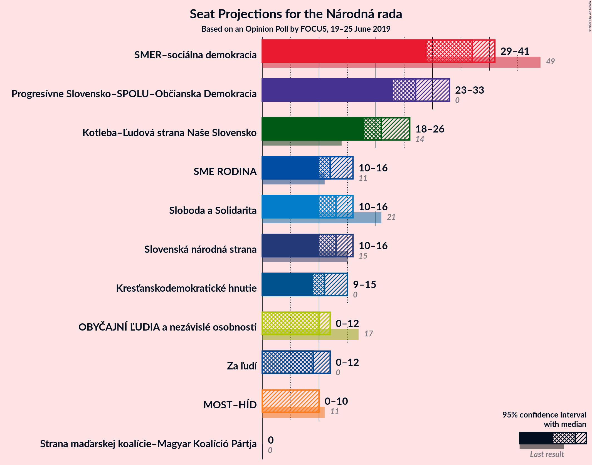
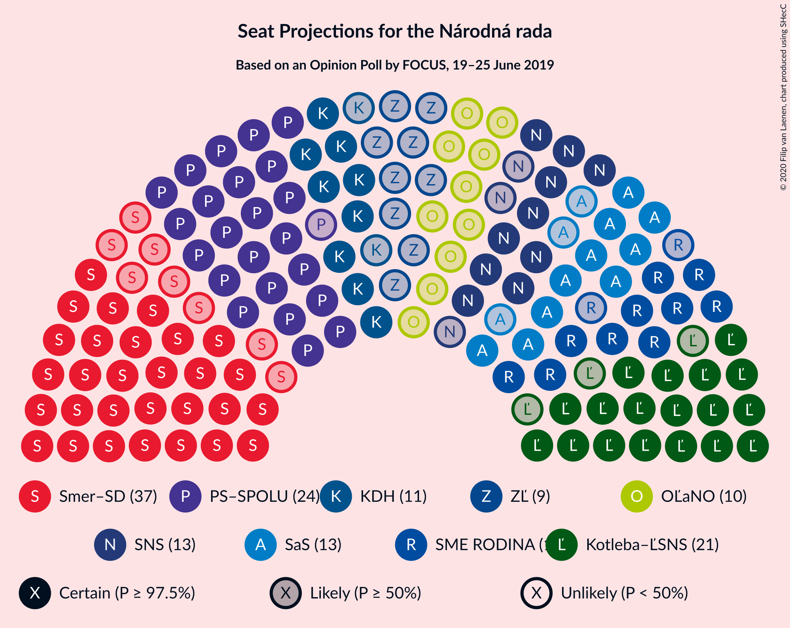
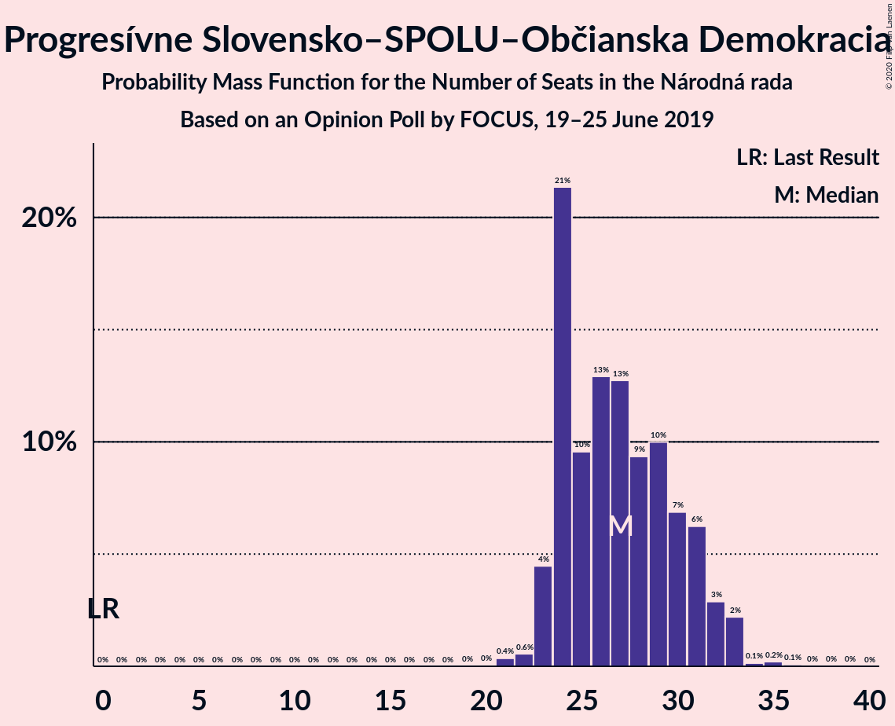
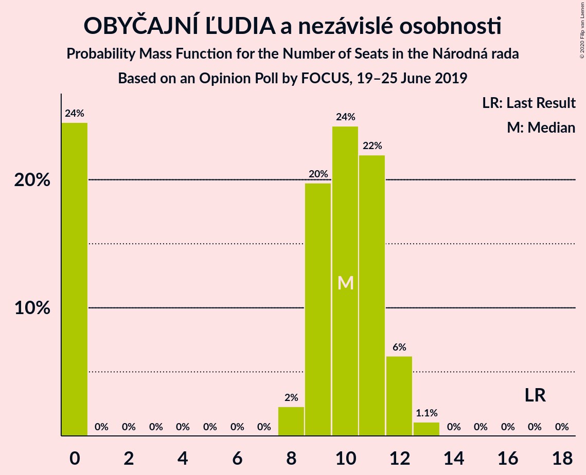
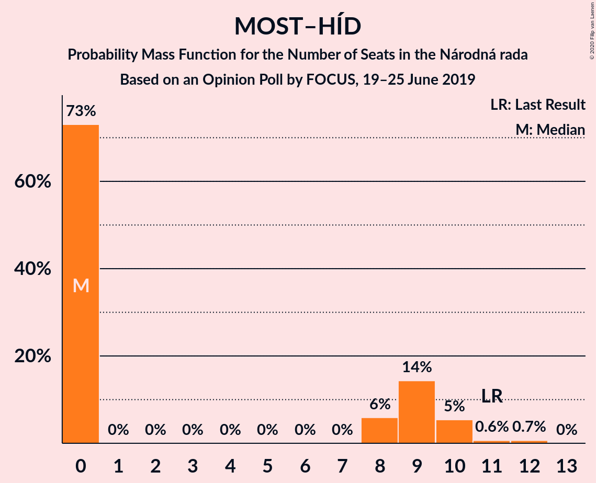

# Opinion Poll by FOCUS, 19–25 June 2019

<a href="#voting-intentions">Voting Intentions</a> | <a href="#seats">Seats</a> | <a href="#coalitions">Coalitions</a> | <a href="#technical-information">Technical Information</a>

## Voting Intentions

### Confidence Intervals

| Party | Last Result | Poll Result | 80% Confidence Interval | 90% Confidence Interval | 95% Confidence Interval | 99% Confidence Interval |
|:-----:|:-----------:|:-----------:|:-----------------------:|:-----------------------:|:-----------------------:|:-----------------------:|
| SMER–sociálna demokracia | 28.3% | 20.3% | 18.8–22.0% |18.4–22.5% |18.0–22.9% |17.3–23.7% |
| Progresívne Slovensko–SPOLU–Občianska Demokracia | 0.0% | 15.7% | 14.4–17.3% |14.0–17.7% |13.6–18.1% |13.0–18.9% |
| Kotleba–Ľudová strana Naše Slovensko | 8.0% | 12.6% | 11.4–14.0% |11.0–14.4% |10.7–14.8% |10.1–15.5% |
| Slovenská národná strana | 8.6% | 7.3% | 6.4–8.5% |6.1–8.8% |5.9–9.1% |5.5–9.7% |
| Sloboda a Solidarita | 12.1% | 7.1% | 6.2–8.3% |5.9–8.6% |5.7–8.9% |5.3–9.5% |
| SME RODINA | 6.6% | 7.0% | 6.1–8.2% |5.8–8.5% |5.6–8.8% |5.2–9.4% |
| Kresťanskodemokratické hnutie | 4.9% | 7.0% | 6.1–8.2% |5.8–8.5% |5.6–8.8% |5.2–9.4% |
| Za ľudí | 0.0% | 5.2% | 4.4–6.2% |4.2–6.5% |4.0–6.7% |3.6–7.2% |
| OBYČAJNÍ ĽUDIA a nezávislé osobnosti | 11.0% | 5.1% | 4.3–6.1% |4.1–6.4% |3.9–6.6% |3.6–7.1% |
| MOST–HÍD | 6.5% | 4.5% | 3.8–5.4% |3.6–5.7% |3.4–6.0% |3.1–6.4% |
| Strana maďarskej koalície–Magyar Koalíció Pártja | 4.0% | 3.3% | 2.7–4.2% |2.5–4.4% |2.4–4.6% |2.1–5.0% |

*Note:* The poll result column reflects the actual value used in the calculations. Published results may vary slightly, and in addition be rounded to fewer digits.

## Seats

### Confidence Intervals

| Party | Last Result | Median | 80% Confidence Interval | 90% Confidence Interval | 95% Confidence Interval | 99% Confidence Interval |
|:-----:|:-----------:|:------:|:-----------------------:|:-----------------------:|:-----------------------:|:-----------------------:|
| <a href="#smer–sociálna-demokracia">SMER–sociálna demokracia</a> | 49 | 38 | 33–38 |33–39 |32–41 |30–45 |
| <a href="#progresívne-slovensko–spolu–občianska-demokracia">Progresívne Slovensko–SPOLU–Občianska Demokracia</a> | 0 | 26 | 24–30 |24–30 |24–31 |23–33 |
| <a href="#kotleba–ľudová-strana-naše-slovensko">Kotleba–Ľudová strana Naše Slovensko</a> | 14 | 25 | 21–25 |20–26 |20–26 |18–29 |
| <a href="#slovenská-národná-strana">Slovenská národná strana</a> | 15 | 13 | 11–14 |11–15 |11–15 |10–17 |
| <a href="#sloboda-a-solidarita">Sloboda a Solidarita</a> | 21 | 13 | 12–15 |11–15 |10–16 |9–17 |
| <a href="#sme-rodina">SME RODINA</a> | 11 | 12 | 10–15 |10–15 |10–15 |9–17 |
| <a href="#kresťanskodemokratické-hnutie">Kresťanskodemokratické hnutie</a> | 0 | 12 | 11–14 |11–15 |11–16 |9–18 |
| <a href="#za-ľudí">Za ľudí</a> | 0 | 9 | 0–11 |0–11 |0–12 |0–13 |
| <a href="#obyčajní-ľudia-a-nezávislé-osobnosti">OBYČAJNÍ ĽUDIA a nezávislé osobnosti</a> | 17 | 9 | 0–12 |0–12 |0–12 |0–12 |
| <a href="#most–híd">MOST–HÍD</a> | 11 | 0 | 0 |0 |0–9 |0–10 |
| <a href="#strana-maďarskej-koalície–magyar-koalíció-pártja">Strana maďarskej koalície–Magyar Koalíció Pártja</a> | 0 | 0 | 0 |0 |0 |0 |

### SMER–sociálna demokracia

*For a full overview of the results for this party, see the [SMER–sociálna demokracia](party-smer–sociálnademokracia.html) page.*

| Number of Seats | Probability | Accumulated | Special Marks |
|:---------------:|:-----------:|:-----------:|:-------------:|
| 29 | 0.3% | 100% |  |
| 30 | 0.5% | 99.6% |  |
| 31 | 0.4% | 99.1% |  |
| 32 | 1.2% | 98.7% |  |
| 33 | 16% | 97% |  |
| 34 | 10% | 81% |  |
| 35 | 5% | 71% |  |
| 36 | 9% | 66% |  |
| 37 | 5% | 57% |  |
| 38 | 46% | 51% | Median |
| 39 | 2% | 6% |  |
| 40 | 0.9% | 3% |  |
| 41 | 0.3% | 3% |  |
| 42 | 0% | 2% |  |
| 43 | 0.5% | 2% |  |
| 44 | 0.1% | 2% |  |
| 45 | 2% | 2% |  |
| 46 | 0% | 0% |  |
| 47 | 0% | 0% |  |
| 48 | 0% | 0% |  |
| 49 | 0% | 0% | Last Result |

### Progresívne Slovensko–SPOLU–Občianska Demokracia

*For a full overview of the results for this party, see the [Progresívne Slovensko–SPOLU–Občianska Demokracia](party-progresívneslovensko–spolu–občianskademokracia.html) page.*

| Number of Seats | Probability | Accumulated | Special Marks |
|:---------------:|:-----------:|:-----------:|:-------------:|
| 0 | 0% | 100% | Last Result |
| 1 | 0% | 100% |  |
| 2 | 0% | 100% |  |
| 3 | 0% | 100% |  |
| 4 | 0% | 100% |  |
| 5 | 0% | 100% |  |
| 6 | 0% | 100% |  |
| 7 | 0% | 100% |  |
| 8 | 0% | 100% |  |
| 9 | 0% | 100% |  |
| 10 | 0% | 100% |  |
| 11 | 0% | 100% |  |
| 12 | 0% | 100% |  |
| 13 | 0% | 100% |  |
| 14 | 0% | 100% |  |
| 15 | 0% | 100% |  |
| 16 | 0% | 100% |  |
| 17 | 0% | 100% |  |
| 18 | 0% | 100% |  |
| 19 | 0% | 100% |  |
| 20 | 0% | 100% |  |
| 21 | 0.2% | 100% |  |
| 22 | 0.2% | 99.8% |  |
| 23 | 0.7% | 99.6% |  |
| 24 | 17% | 98.9% |  |
| 25 | 5% | 82% |  |
| 26 | 46% | 78% | Median |
| 27 | 5% | 31% |  |
| 28 | 12% | 26% |  |
| 29 | 2% | 14% |  |
| 30 | 8% | 12% |  |
| 31 | 2% | 4% |  |
| 32 | 1.2% | 2% |  |
| 33 | 0.2% | 0.5% |  |
| 34 | 0.1% | 0.4% |  |
| 35 | 0% | 0.3% |  |
| 36 | 0.2% | 0.3% |  |
| 37 | 0% | 0% |  |

### Kotleba–Ľudová strana Naše Slovensko

*For a full overview of the results for this party, see the [Kotleba–Ľudová strana Naše Slovensko](party-kotleba–ľudovástrananašeslovensko.html) page.*

| Number of Seats | Probability | Accumulated | Special Marks |
|:---------------:|:-----------:|:-----------:|:-------------:|
| 14 | 0% | 100% | Last Result |
| 15 | 0% | 100% |  |
| 16 | 0% | 100% |  |
| 17 | 0.1% | 100% |  |
| 18 | 1.0% | 99.8% |  |
| 19 | 0.9% | 98.8% |  |
| 20 | 4% | 98% |  |
| 21 | 17% | 94% |  |
| 22 | 1.2% | 78% |  |
| 23 | 6% | 77% |  |
| 24 | 8% | 70% |  |
| 25 | 55% | 62% | Median |
| 26 | 5% | 7% |  |
| 27 | 0.7% | 2% |  |
| 28 | 0.8% | 2% |  |
| 29 | 0.8% | 0.8% |  |
| 30 | 0% | 0% |  |

### Slovenská národná strana

*For a full overview of the results for this party, see the [Slovenská národná strana](party-slovenskánárodnástrana.html) page.*

| Number of Seats | Probability | Accumulated | Special Marks |
|:---------------:|:-----------:|:-----------:|:-------------:|
| 9 | 0.3% | 100% |  |
| 10 | 2% | 99.7% |  |
| 11 | 9% | 98% |  |
| 12 | 7% | 89% |  |
| 13 | 56% | 82% | Median |
| 14 | 21% | 26% |  |
| 15 | 4% | 5% | Last Result |
| 16 | 0.8% | 1.4% |  |
| 17 | 0.4% | 0.6% |  |
| 18 | 0.1% | 0.2% |  |
| 19 | 0% | 0.1% |  |
| 20 | 0% | 0% |  |

### Sloboda a Solidarita

*For a full overview of the results for this party, see the [Sloboda a Solidarita](party-slobodaasolidarita.html) page.*

| Number of Seats | Probability | Accumulated | Special Marks |
|:---------------:|:-----------:|:-----------:|:-------------:|
| 0 | 0.3% | 100% |  |
| 1 | 0% | 99.7% |  |
| 2 | 0% | 99.7% |  |
| 3 | 0% | 99.7% |  |
| 4 | 0% | 99.7% |  |
| 5 | 0% | 99.7% |  |
| 6 | 0% | 99.7% |  |
| 7 | 0% | 99.7% |  |
| 8 | 0% | 99.7% |  |
| 9 | 0.2% | 99.7% |  |
| 10 | 4% | 99.5% |  |
| 11 | 3% | 96% |  |
| 12 | 32% | 92% |  |
| 13 | 46% | 60% | Median |
| 14 | 3% | 15% |  |
| 15 | 9% | 12% |  |
| 16 | 2% | 3% |  |
| 17 | 0.2% | 0.6% |  |
| 18 | 0.4% | 0.4% |  |
| 19 | 0% | 0% |  |
| 20 | 0% | 0% |  |
| 21 | 0% | 0% | Last Result |

### SME RODINA

*For a full overview of the results for this party, see the [SME RODINA](party-smerodina.html) page.*

| Number of Seats | Probability | Accumulated | Special Marks |
|:---------------:|:-----------:|:-----------:|:-------------:|
| 0 | 0.4% | 100% |  |
| 1 | 0% | 99.6% |  |
| 2 | 0% | 99.6% |  |
| 3 | 0% | 99.6% |  |
| 4 | 0% | 99.6% |  |
| 5 | 0% | 99.6% |  |
| 6 | 0% | 99.6% |  |
| 7 | 0% | 99.6% |  |
| 8 | 0% | 99.6% |  |
| 9 | 0.9% | 99.6% |  |
| 10 | 10% | 98.7% |  |
| 11 | 4% | 88% | Last Result |
| 12 | 45% | 85% | Median |
| 13 | 20% | 40% |  |
| 14 | 3% | 19% |  |
| 15 | 15% | 16% |  |
| 16 | 0.6% | 1.3% |  |
| 17 | 0.6% | 0.7% |  |
| 18 | 0.1% | 0.1% |  |
| 19 | 0% | 0% |  |

### Kresťanskodemokratické hnutie

*For a full overview of the results for this party, see the [Kresťanskodemokratické hnutie](party-kresťanskodemokratickéhnutie.html) page.*

| Number of Seats | Probability | Accumulated | Special Marks |
|:---------------:|:-----------:|:-----------:|:-------------:|
| 0 | 0.1% | 100% | Last Result |
| 1 | 0% | 99.9% |  |
| 2 | 0% | 99.9% |  |
| 3 | 0% | 99.9% |  |
| 4 | 0% | 99.9% |  |
| 5 | 0% | 99.9% |  |
| 6 | 0% | 99.9% |  |
| 7 | 0% | 99.9% |  |
| 8 | 0% | 99.9% |  |
| 9 | 1.0% | 99.9% |  |
| 10 | 1.2% | 99.0% |  |
| 11 | 41% | 98% |  |
| 12 | 13% | 57% | Median |
| 13 | 14% | 44% |  |
| 14 | 21% | 30% |  |
| 15 | 5% | 9% |  |
| 16 | 3% | 4% |  |
| 17 | 0.9% | 2% |  |
| 18 | 0.6% | 0.9% |  |
| 19 | 0.3% | 0.4% |  |
| 20 | 0% | 0% |  |

### Za ľudí

*For a full overview of the results for this party, see the [Za ľudí](party-zaľudí.html) page.*

| Number of Seats | Probability | Accumulated | Special Marks |
|:---------------:|:-----------:|:-----------:|:-------------:|
| 0 | 49% | 100% | Last Result |
| 1 | 0% | 51% |  |
| 2 | 0% | 51% |  |
| 3 | 0% | 51% |  |
| 4 | 0% | 51% |  |
| 5 | 0% | 51% |  |
| 6 | 0% | 51% |  |
| 7 | 0% | 51% |  |
| 8 | 0% | 51% |  |
| 9 | 9% | 51% | Median |
| 10 | 29% | 41% |  |
| 11 | 9% | 13% |  |
| 12 | 3% | 4% |  |
| 13 | 0.9% | 1.1% |  |
| 14 | 0.2% | 0.2% |  |
| 15 | 0% | 0% |  |

### OBYČAJNÍ ĽUDIA a nezávislé osobnosti

*For a full overview of the results for this party, see the [OBYČAJNÍ ĽUDIA a nezávislé osobnosti](party-obyčajníľudiaanezávisléosobnosti.html) page.*

| Number of Seats | Probability | Accumulated | Special Marks |
|:---------------:|:-----------:|:-----------:|:-------------:|
| 0 | 37% | 100% |  |
| 1 | 0% | 63% |  |
| 2 | 0% | 63% |  |
| 3 | 0% | 63% |  |
| 4 | 0% | 63% |  |
| 5 | 0% | 63% |  |
| 6 | 0% | 63% |  |
| 7 | 0% | 63% |  |
| 8 | 0.1% | 63% |  |
| 9 | 17% | 63% | Median |
| 10 | 1.0% | 46% |  |
| 11 | 1.5% | 45% |  |
| 12 | 43% | 43% |  |
| 13 | 0.1% | 0.1% |  |
| 14 | 0% | 0% |  |
| 15 | 0% | 0% |  |
| 16 | 0% | 0% |  |
| 17 | 0% | 0% | Last Result |

### MOST–HÍD

*For a full overview of the results for this party, see the [MOST–HÍD](party-most–híd.html) page.*

| Number of Seats | Probability | Accumulated | Special Marks |
|:---------------:|:-----------:|:-----------:|:-------------:|
| 0 | 96% | 100% | Median |
| 1 | 0% | 4% |  |
| 2 | 0% | 4% |  |
| 3 | 0% | 4% |  |
| 4 | 0% | 4% |  |
| 5 | 0% | 4% |  |
| 6 | 0% | 4% |  |
| 7 | 0% | 4% |  |
| 8 | 0.1% | 4% |  |
| 9 | 2% | 4% |  |
| 10 | 1.5% | 2% |  |
| 11 | 0.2% | 0.2% | Last Result |
| 12 | 0% | 0% |  |

### Strana maďarskej koalície–Magyar Koalíció Pártja

*For a full overview of the results for this party, see the [Strana maďarskej koalície–Magyar Koalíció Pártja](party-stranamaďarskejkoalície–magyarkoalíciópártja.html) page.*

| Number of Seats | Probability | Accumulated | Special Marks |
|:---------------:|:-----------:|:-----------:|:-------------:|
| 0 | 99.6% | 100% | Last Result, Median |
| 1 | 0% | 0.4% |  |
| 2 | 0% | 0.4% |  |
| 3 | 0% | 0.4% |  |
| 4 | 0% | 0.4% |  |
| 5 | 0% | 0.4% |  |
| 6 | 0% | 0.4% |  |
| 7 | 0% | 0.4% |  |
| 8 | 0.2% | 0.4% |  |
| 9 | 0.2% | 0.2% |  |
| 10 | 0.1% | 0.1% |  |
| 11 | 0% | 0% |  |

## Coalitions

### Confidence Intervals

| Coalition | Last Result | Median | Majority? | 80% Confidence Interval | 90% Confidence Interval | 95% Confidence Interval | 99% Confidence Interval |
|:---------:|:-----------:|:------:|:---------:|:-----------------------:|:-----------------------:|:-----------------------:|:-----------------------:|
| SMER–sociálna demokracia – Slovenská národná strana – MOST–HÍD | 75 | 51 | 0% | 46–51 | 45–54 | 45–58 | 43–61 |
| SMER–sociálna demokracia | 49 | 38 | 0% | 33–38 | 33–39 | 32–41 | 30–45 |

### SMER–sociálna demokracia – Slovenská národná strana – MOST–HÍD

| Number of Seats | Probability | Accumulated | Special Marks |
|:---------------:|:-----------:|:-----------:|:-------------:|
| 42 | 0.1% | 100% |  |
| 43 | 0.3% | 99.8% |  |
| 44 | 0.7% | 99.5% |  |
| 45 | 8% | 98.8% |  |
| 46 | 1.4% | 91% |  |
| 47 | 16% | 90% |  |
| 48 | 1.5% | 74% |  |
| 49 | 15% | 73% |  |
| 50 | 2% | 57% |  |
| 51 | 46% | 55% | Median |
| 52 | 0.5% | 9% |  |
| 53 | 1.0% | 8% |  |
| 54 | 3% | 7% |  |
| 55 | 0.4% | 5% |  |
| 56 | 1.0% | 4% |  |
| 57 | 0.4% | 3% |  |
| 58 | 2% | 3% |  |
| 59 | 0.3% | 1.1% |  |
| 60 | 0.2% | 0.8% |  |
| 61 | 0.2% | 0.5% |  |
| 62 | 0.2% | 0.3% |  |
| 63 | 0% | 0.1% |  |
| 64 | 0% | 0% |  |
| 65 | 0% | 0% |  |
| 66 | 0% | 0% |  |
| 67 | 0% | 0% |  |
| 68 | 0% | 0% |  |
| 69 | 0% | 0% |  |
| 70 | 0% | 0% |  |
| 71 | 0% | 0% |  |
| 72 | 0% | 0% |  |
| 73 | 0% | 0% |  |
| 74 | 0% | 0% |  |
| 75 | 0% | 0% | Last Result |

### SMER–sociálna demokracia

| Number of Seats | Probability | Accumulated | Special Marks |
|:---------------:|:-----------:|:-----------:|:-------------:|
| 29 | 0.3% | 100% |  |
| 30 | 0.5% | 99.6% |  |
| 31 | 0.4% | 99.1% |  |
| 32 | 1.2% | 98.7% |  |
| 33 | 16% | 97% |  |
| 34 | 10% | 81% |  |
| 35 | 5% | 71% |  |
| 36 | 9% | 66% |  |
| 37 | 5% | 57% |  |
| 38 | 46% | 51% | Median |
| 39 | 2% | 6% |  |
| 40 | 0.9% | 3% |  |
| 41 | 0.3% | 3% |  |
| 42 | 0% | 2% |  |
| 43 | 0.5% | 2% |  |
| 44 | 0.1% | 2% |  |
| 45 | 2% | 2% |  |
| 46 | 0% | 0% |  |
| 47 | 0% | 0% |  |
| 48 | 0% | 0% |  |
| 49 | 0% | 0% | Last Result |

## Technical Information

### Opinion Poll

+ **Polling firm:** FOCUS
+ **Commissioner(s):** —
+ **Fieldwork period:** 19–25 June 2019

### Calculations

+ **Sample size:** 1023
+ **Simulations done:** 131,072
+ **Error estimate:** 2.36%

