# Opinion Poll by MVK, 12 August 2019

<a href="#voting-intentions">Voting Intentions</a> | <a href="#seats">Seats</a> | <a href="#coalitions">Coalitions</a> | <a href="#technical-information">Technical Information</a>

## Voting Intentions

### Confidence Intervals

| Party | Last Result | Poll Result | 80% Confidence Interval | 90% Confidence Interval | 95% Confidence Interval | 99% Confidence Interval |
|:-----:|:-----------:|:-----------:|:-----------------------:|:-----------------------:|:-----------------------:|:-----------------------:|
| SMER–sociálna demokracia | 28.3% | 20.7% | 19.1–22.4% |18.7–22.9% |18.3–23.3% |17.6–24.2% |
| Progresívne Slovensko–SPOLU–Občianska Demokracia | 0.0% | 13.3% | 12.0–14.8% |11.6–15.2% |11.3–15.6% |10.7–16.3% |
| Kresťanskodemokratické hnutie | 4.9% | 9.4% | 8.3–10.7% |8.0–11.1% |7.7–11.4% |7.2–12.0% |
| Slovenská národná strana | 8.6% | 8.5% | 7.5–9.7% |7.2–10.1% |6.9–10.4% |6.4–11.0% |
| Kotleba–Ľudová strana Naše Slovensko | 8.0% | 8.1% | 7.1–9.3% |6.8–9.7% |6.6–10.0% |6.1–10.6% |
| Za ľudí | 0.0% | 7.9% | 6.9–9.1% |6.6–9.4% |6.4–9.7% |5.9–10.3% |
| OBYČAJNÍ ĽUDIA a nezávislé osobnosti | 11.0% | 6.9% | 6.0–8.0% |5.7–8.4% |5.5–8.7% |5.1–9.2% |
| Sloboda a Solidarita | 12.1% | 5.5% | 4.7–6.5% |4.4–6.8% |4.3–7.1% |3.9–7.6% |
| SME RODINA | 6.6% | 5.5% | 4.7–6.5% |4.4–6.8% |4.3–7.1% |3.9–7.6% |
| MOST–HÍD | 6.5% | 3.8% | 3.1–4.7% |2.9–5.0% |2.8–5.2% |2.5–5.6% |
| Strana maďarskej koalície–Magyar Koalíció Pártja | 4.0% | 3.4% | 2.8–4.3% |2.6–4.5% |2.4–4.7% |2.2–5.2% |

*Note:* The poll result column reflects the actual value used in the calculations. Published results may vary slightly, and in addition be rounded to fewer digits.

## Seats

### Confidence Intervals

| Party | Last Result | Median | 80% Confidence Interval | 90% Confidence Interval | 95% Confidence Interval | 99% Confidence Interval |
|:-----:|:-----------:|:------:|:-----------------------:|:-----------------------:|:-----------------------:|:-----------------------:|
| <a href="#smer–sociálna-demokracia">SMER–sociálna demokracia</a> | 49 | 36 | 33–40 |33–41 |32–42 |31–44 |
| <a href="#progresívne-slovensko–spolu–občianska-demokracia">Progresívne Slovensko–SPOLU–Občianska Demokracia</a> | 0 | 24 | 22–26 |21–27 |20–28 |19–29 |
| <a href="#kresťanskodemokratické-hnutie">Kresťanskodemokratické hnutie</a> | 0 | 17 | 14–20 |14–20 |14–21 |13–22 |
| <a href="#slovenská-národná-strana">Slovenská národná strana</a> | 15 | 15 | 13–17 |13–18 |12–19 |11–20 |
| <a href="#kotleba–ľudová-strana-naše-slovensko">Kotleba–Ľudová strana Naše Slovensko</a> | 14 | 15 | 13–16 |12–17 |12–18 |11–19 |
| <a href="#za-ľudí">Za ľudí</a> | 0 | 14 | 12–16 |12–17 |11–18 |11–19 |
| <a href="#obyčajní-ľudia-a-nezávislé-osobnosti">OBYČAJNÍ ĽUDIA a nezávislé osobnosti</a> | 17 | 12 | 10–14 |10–15 |10–15 |9–17 |
| <a href="#sloboda-a-solidarita">Sloboda a Solidarita</a> | 21 | 10 | 0–12 |0–12 |0–12 |0–14 |
| <a href="#sme-rodina">SME RODINA</a> | 11 | 10 | 0–11 |0–12 |0–12 |0–13 |
| <a href="#most–híd">MOST–HÍD</a> | 11 | 0 | 0 |0 |0–8 |0–10 |
| <a href="#strana-maďarskej-koalície–magyar-koalíció-pártja">Strana maďarskej koalície–Magyar Koalíció Pártja</a> | 0 | 0 | 0 |0 |0 |0–8 |

### SMER–sociálna demokracia

*For a full overview of the results for this party, see the [SMER–sociálna demokracia](party-smer–sociálnademokracia.html) page.*

| Number of Seats | Probability | Accumulated | Special Marks |
|:---------------:|:-----------:|:-----------:|:-------------:|
| 30 | 0.4% | 100% |  |
| 31 | 1.4% | 99.6% |  |
| 32 | 2% | 98% |  |
| 33 | 25% | 97% |  |
| 34 | 8% | 72% |  |
| 35 | 8% | 64% |  |
| 36 | 16% | 56% | Median |
| 37 | 8% | 40% |  |
| 38 | 7% | 32% |  |
| 39 | 15% | 25% |  |
| 40 | 3% | 10% |  |
| 41 | 3% | 8% |  |
| 42 | 2% | 4% |  |
| 43 | 1.5% | 2% |  |
| 44 | 0.3% | 0.6% |  |
| 45 | 0.1% | 0.3% |  |
| 46 | 0.1% | 0.2% |  |
| 47 | 0.1% | 0.1% |  |
| 48 | 0% | 0% |  |
| 49 | 0% | 0% | Last Result |

### Progresívne Slovensko–SPOLU–Občianska Demokracia

*For a full overview of the results for this party, see the [Progresívne Slovensko–SPOLU–Občianska Demokracia](party-progresívneslovensko–spolu–občianskademokracia.html) page.*

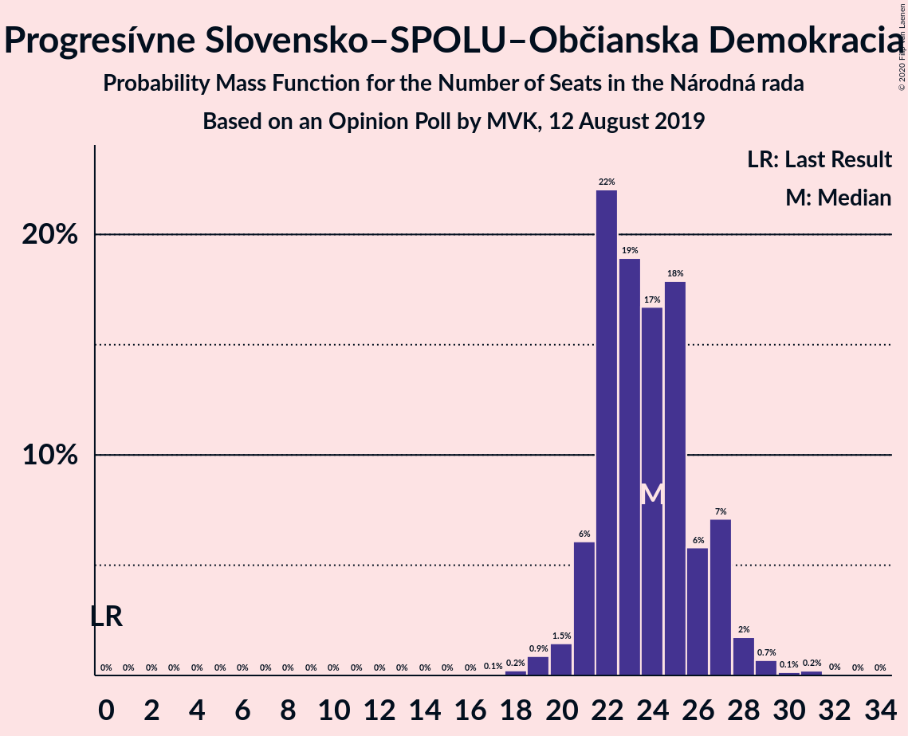

| Number of Seats | Probability | Accumulated | Special Marks |
|:---------------:|:-----------:|:-----------:|:-------------:|
| 0 | 0% | 100% | Last Result |
| 1 | 0% | 100% |  |
| 2 | 0% | 100% |  |
| 3 | 0% | 100% |  |
| 4 | 0% | 100% |  |
| 5 | 0% | 100% |  |
| 6 | 0% | 100% |  |
| 7 | 0% | 100% |  |
| 8 | 0% | 100% |  |
| 9 | 0% | 100% |  |
| 10 | 0% | 100% |  |
| 11 | 0% | 100% |  |
| 12 | 0% | 100% |  |
| 13 | 0% | 100% |  |
| 14 | 0% | 100% |  |
| 15 | 0% | 100% |  |
| 16 | 0% | 100% |  |
| 17 | 0.1% | 100% |  |
| 18 | 0.2% | 99.9% |  |
| 19 | 0.9% | 99.7% |  |
| 20 | 1.5% | 98.8% |  |
| 21 | 6% | 97% |  |
| 22 | 22% | 91% |  |
| 23 | 19% | 69% |  |
| 24 | 17% | 50% | Median |
| 25 | 18% | 34% |  |
| 26 | 6% | 16% |  |
| 27 | 7% | 10% |  |
| 28 | 2% | 3% |  |
| 29 | 0.7% | 1.1% |  |
| 30 | 0.1% | 0.4% |  |
| 31 | 0.2% | 0.3% |  |
| 32 | 0% | 0.1% |  |
| 33 | 0% | 0% |  |

### Kresťanskodemokratické hnutie

*For a full overview of the results for this party, see the [Kresťanskodemokratické hnutie](party-kresťanskodemokratickéhnutie.html) page.*

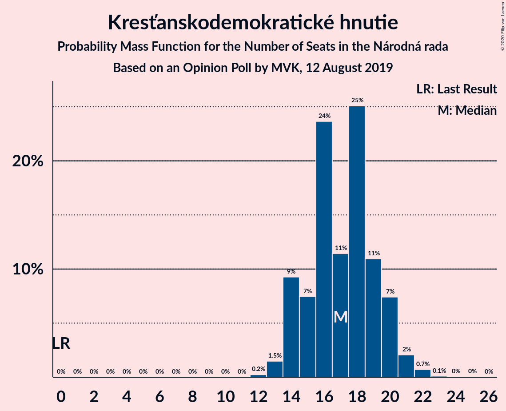

| Number of Seats | Probability | Accumulated | Special Marks |
|:---------------:|:-----------:|:-----------:|:-------------:|
| 0 | 0% | 100% | Last Result |
| 1 | 0% | 100% |  |
| 2 | 0% | 100% |  |
| 3 | 0% | 100% |  |
| 4 | 0% | 100% |  |
| 5 | 0% | 100% |  |
| 6 | 0% | 100% |  |
| 7 | 0% | 100% |  |
| 8 | 0% | 100% |  |
| 9 | 0% | 100% |  |
| 10 | 0% | 100% |  |
| 11 | 0% | 100% |  |
| 12 | 0.2% | 100% |  |
| 13 | 1.5% | 99.7% |  |
| 14 | 9% | 98% |  |
| 15 | 7% | 89% |  |
| 16 | 24% | 82% |  |
| 17 | 11% | 58% | Median |
| 18 | 25% | 46% |  |
| 19 | 11% | 21% |  |
| 20 | 7% | 10% |  |
| 21 | 2% | 3% |  |
| 22 | 0.7% | 0.9% |  |
| 23 | 0.1% | 0.2% |  |
| 24 | 0% | 0.1% |  |
| 25 | 0% | 0% |  |

### Slovenská národná strana

*For a full overview of the results for this party, see the [Slovenská národná strana](party-slovenskánárodnástrana.html) page.*

| Number of Seats | Probability | Accumulated | Special Marks |
|:---------------:|:-----------:|:-----------:|:-------------:|
| 10 | 0% | 100% |  |
| 11 | 1.2% | 99.9% |  |
| 12 | 2% | 98.8% |  |
| 13 | 14% | 97% |  |
| 14 | 11% | 83% |  |
| 15 | 31% | 72% | Last Result, Median |
| 16 | 21% | 41% |  |
| 17 | 14% | 20% |  |
| 18 | 3% | 6% |  |
| 19 | 1.0% | 3% |  |
| 20 | 2% | 2% |  |
| 21 | 0.4% | 0.4% |  |
| 22 | 0% | 0% |  |

### Kotleba–Ľudová strana Naše Slovensko

*For a full overview of the results for this party, see the [Kotleba–Ľudová strana Naše Slovensko](party-kotleba–ľudovástrananašeslovensko.html) page.*

| Number of Seats | Probability | Accumulated | Special Marks |
|:---------------:|:-----------:|:-----------:|:-------------:|
| 10 | 0.1% | 100% |  |
| 11 | 2% | 99.8% |  |
| 12 | 4% | 98% |  |
| 13 | 21% | 94% |  |
| 14 | 20% | 73% | Last Result |
| 15 | 20% | 53% | Median |
| 16 | 24% | 33% |  |
| 17 | 7% | 10% |  |
| 18 | 2% | 3% |  |
| 19 | 1.2% | 1.3% |  |
| 20 | 0.1% | 0.2% |  |
| 21 | 0.1% | 0.1% |  |
| 22 | 0% | 0% |  |

### Za ľudí

*For a full overview of the results for this party, see the [Za ľudí](party-zaľudí.html) page.*

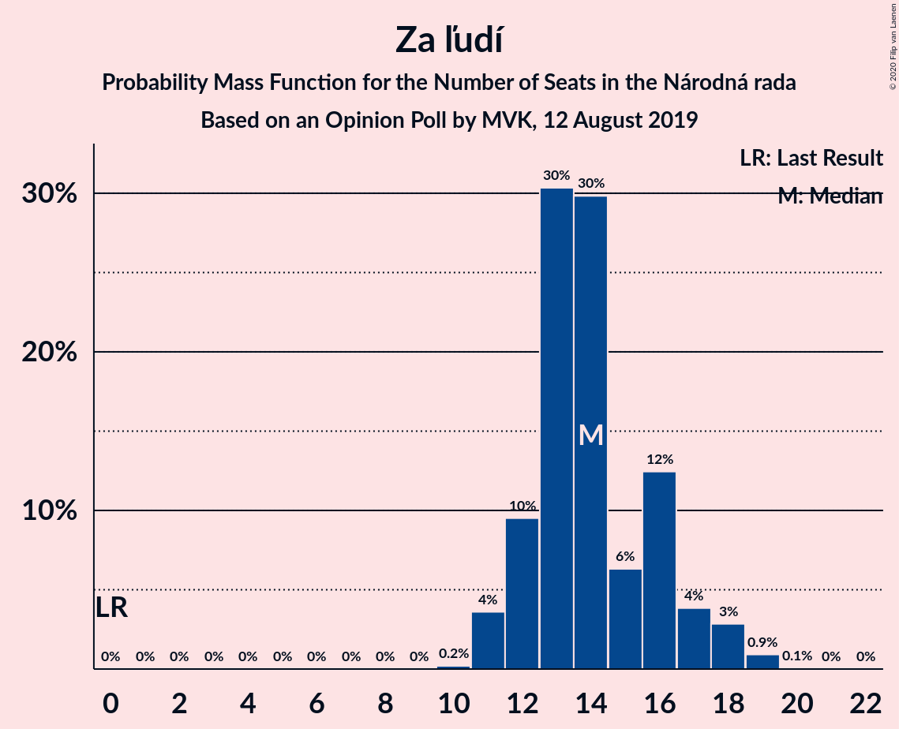

| Number of Seats | Probability | Accumulated | Special Marks |
|:---------------:|:-----------:|:-----------:|:-------------:|
| 0 | 0% | 100% | Last Result |
| 1 | 0% | 100% |  |
| 2 | 0% | 100% |  |
| 3 | 0% | 100% |  |
| 4 | 0% | 100% |  |
| 5 | 0% | 100% |  |
| 6 | 0% | 100% |  |
| 7 | 0% | 100% |  |
| 8 | 0% | 100% |  |
| 9 | 0% | 100% |  |
| 10 | 0.2% | 100% |  |
| 11 | 4% | 99.8% |  |
| 12 | 10% | 96% |  |
| 13 | 30% | 87% |  |
| 14 | 30% | 56% | Median |
| 15 | 6% | 26% |  |
| 16 | 12% | 20% |  |
| 17 | 4% | 8% |  |
| 18 | 3% | 4% |  |
| 19 | 0.9% | 1.0% |  |
| 20 | 0.1% | 0.1% |  |
| 21 | 0% | 0% |  |

### OBYČAJNÍ ĽUDIA a nezávislé osobnosti

*For a full overview of the results for this party, see the [OBYČAJNÍ ĽUDIA a nezávislé osobnosti](party-obyčajníľudiaanezávisléosobnosti.html) page.*

| Number of Seats | Probability | Accumulated | Special Marks |
|:---------------:|:-----------:|:-----------:|:-------------:|
| 0 | 0.2% | 100% |  |
| 1 | 0% | 99.8% |  |
| 2 | 0% | 99.8% |  |
| 3 | 0% | 99.8% |  |
| 4 | 0% | 99.8% |  |
| 5 | 0% | 99.8% |  |
| 6 | 0% | 99.8% |  |
| 7 | 0% | 99.8% |  |
| 8 | 0% | 99.8% |  |
| 9 | 2% | 99.8% |  |
| 10 | 9% | 98% |  |
| 11 | 15% | 89% |  |
| 12 | 28% | 74% | Median |
| 13 | 26% | 46% |  |
| 14 | 11% | 20% |  |
| 15 | 7% | 9% |  |
| 16 | 1.1% | 2% |  |
| 17 | 0.5% | 0.6% | Last Result |
| 18 | 0.1% | 0.1% |  |
| 19 | 0% | 0% |  |

### Sloboda a Solidarita

*For a full overview of the results for this party, see the [Sloboda a Solidarita](party-slobodaasolidarita.html) page.*

| Number of Seats | Probability | Accumulated | Special Marks |
|:---------------:|:-----------:|:-----------:|:-------------:|
| 0 | 15% | 100% |  |
| 1 | 0% | 85% |  |
| 2 | 0% | 85% |  |
| 3 | 0% | 85% |  |
| 4 | 0% | 85% |  |
| 5 | 0% | 85% |  |
| 6 | 0% | 85% |  |
| 7 | 0% | 85% |  |
| 8 | 0% | 85% |  |
| 9 | 28% | 85% |  |
| 10 | 22% | 57% | Median |
| 11 | 18% | 34% |  |
| 12 | 15% | 17% |  |
| 13 | 0.7% | 1.3% |  |
| 14 | 0.6% | 0.7% |  |
| 15 | 0.1% | 0.1% |  |
| 16 | 0% | 0% |  |
| 17 | 0% | 0% |  |
| 18 | 0% | 0% |  |
| 19 | 0% | 0% |  |
| 20 | 0% | 0% |  |
| 21 | 0% | 0% | Last Result |

### SME RODINA

*For a full overview of the results for this party, see the [SME RODINA](party-smerodina.html) page.*

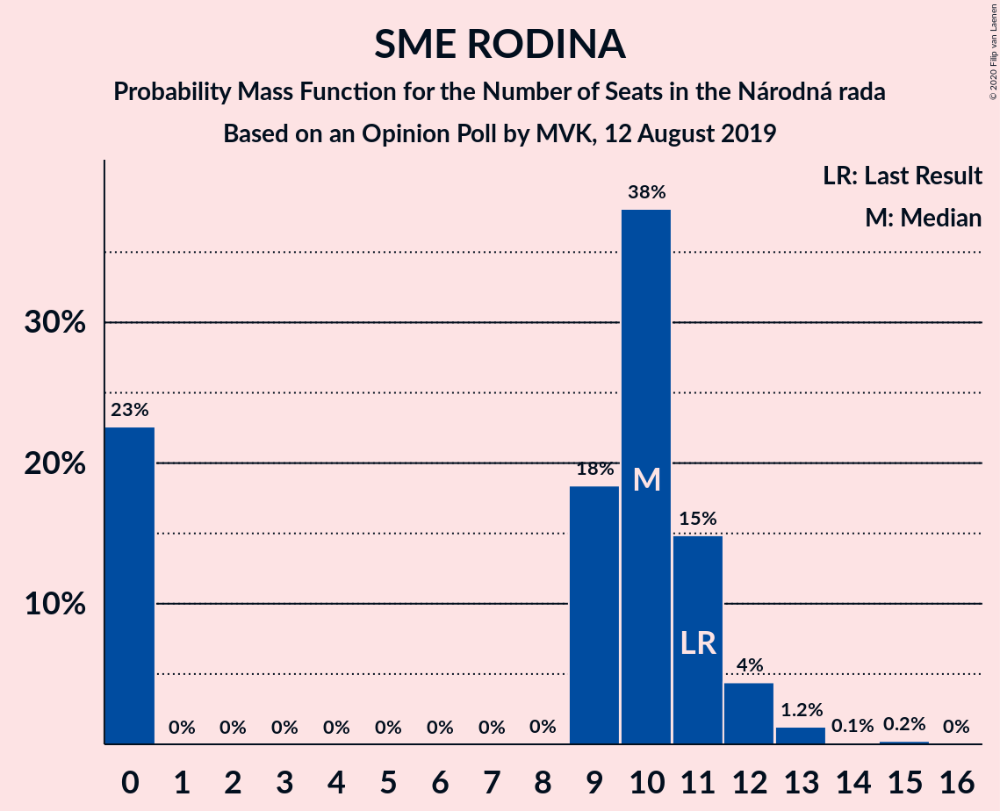

| Number of Seats | Probability | Accumulated | Special Marks |
|:---------------:|:-----------:|:-----------:|:-------------:|
| 0 | 23% | 100% |  |
| 1 | 0% | 77% |  |
| 2 | 0% | 77% |  |
| 3 | 0% | 77% |  |
| 4 | 0% | 77% |  |
| 5 | 0% | 77% |  |
| 6 | 0% | 77% |  |
| 7 | 0% | 77% |  |
| 8 | 0% | 77% |  |
| 9 | 18% | 77% |  |
| 10 | 38% | 59% | Median |
| 11 | 15% | 21% | Last Result |
| 12 | 4% | 6% |  |
| 13 | 1.2% | 2% |  |
| 14 | 0.1% | 0.4% |  |
| 15 | 0.2% | 0.3% |  |
| 16 | 0% | 0% |  |

### MOST–HÍD

*For a full overview of the results for this party, see the [MOST–HÍD](party-most–híd.html) page.*

| Number of Seats | Probability | Accumulated | Special Marks |
|:---------------:|:-----------:|:-----------:|:-------------:|
| 0 | 97% | 100% | Median |
| 1 | 0% | 3% |  |
| 2 | 0% | 3% |  |
| 3 | 0% | 3% |  |
| 4 | 0% | 3% |  |
| 5 | 0% | 3% |  |
| 6 | 0% | 3% |  |
| 7 | 0% | 3% |  |
| 8 | 1.1% | 3% |  |
| 9 | 1.0% | 2% |  |
| 10 | 0.3% | 0.6% |  |
| 11 | 0.2% | 0.2% | Last Result |
| 12 | 0% | 0% |  |

### Strana maďarskej koalície–Magyar Koalíció Pártja

*For a full overview of the results for this party, see the [Strana maďarskej koalície–Magyar Koalíció Pártja](party-stranamaďarskejkoalície–magyarkoalíciópártja.html) page.*

| Number of Seats | Probability | Accumulated | Special Marks |
|:---------------:|:-----------:|:-----------:|:-------------:|
| 0 | 99.1% | 100% | Last Result, Median |
| 1 | 0% | 0.9% |  |
| 2 | 0% | 0.9% |  |
| 3 | 0% | 0.9% |  |
| 4 | 0% | 0.9% |  |
| 5 | 0% | 0.9% |  |
| 6 | 0% | 0.9% |  |
| 7 | 0% | 0.9% |  |
| 8 | 0.4% | 0.9% |  |
| 9 | 0.4% | 0.4% |  |
| 10 | 0% | 0% |  |

## Coalitions

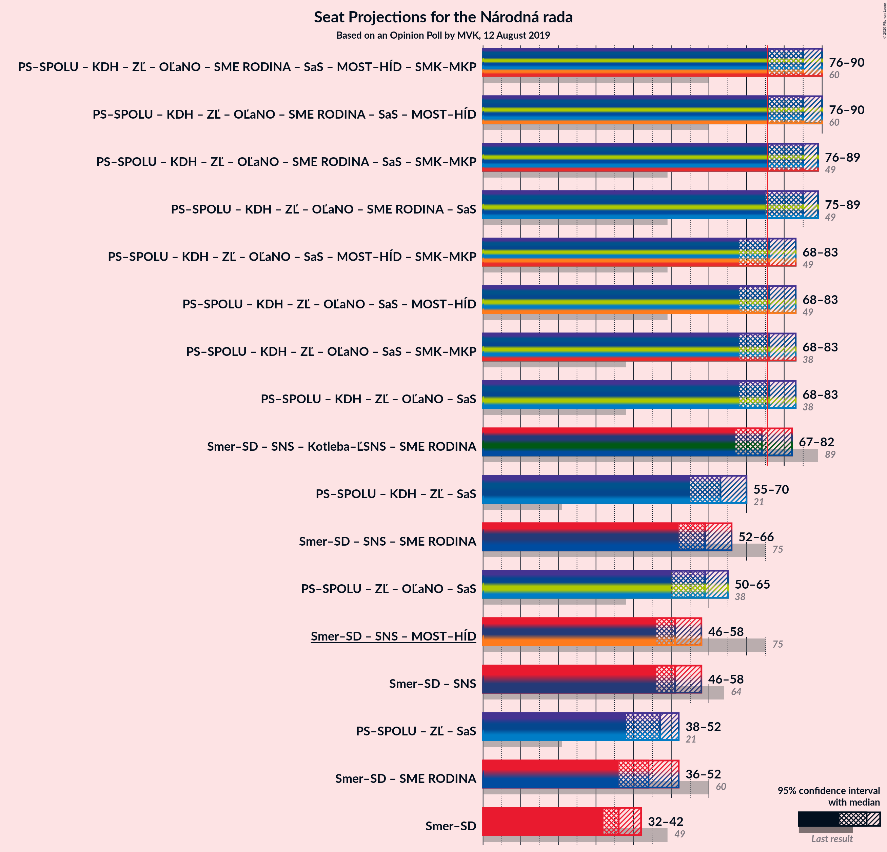

### Confidence Intervals

| Coalition | Last Result | Median | Majority? | 80% Confidence Interval | 90% Confidence Interval | 95% Confidence Interval | 99% Confidence Interval |
|:---------:|:-----------:|:------:|:---------:|:-----------------------:|:-----------------------:|:-----------------------:|:-----------------------:|
| Progresívne Slovensko–SPOLU–Občianska Demokracia – Kresťanskodemokratické hnutie – Za ľudí – OBYČAJNÍ ĽUDIA a nezávislé osobnosti – SME RODINA – Sloboda a Solidarita – MOST–HÍD – Strana maďarskej koalície–Magyar Koalíció Pártja | 60 | 85 | 98.7% | 79–88 | 78–88 | 76–90 | 73–92 |
| Progresívne Slovensko–SPOLU–Občianska Demokracia – Kresťanskodemokratické hnutie – Za ľudí – OBYČAJNÍ ĽUDIA a nezávislé osobnosti – SME RODINA – Sloboda a Solidarita – MOST–HÍD | 60 | 85 | 98% | 79–88 | 78–88 | 76–90 | 72–92 |
| Progresívne Slovensko–SPOLU–Občianska Demokracia – Kresťanskodemokratické hnutie – Za ľudí – OBYČAJNÍ ĽUDIA a nezávislé osobnosti – SME RODINA – Sloboda a Solidarita – Strana maďarskej koalície–Magyar Koalíció Pártja | 49 | 85 | 98% | 79–88 | 77–88 | 76–89 | 71–91 |
| Progresívne Slovensko–SPOLU–Občianska Demokracia – Kresťanskodemokratické hnutie – Za ľudí – OBYČAJNÍ ĽUDIA a nezávislé osobnosti – SME RODINA – Sloboda a Solidarita | 49 | 85 | 97% | 79–88 | 77–88 | 75–89 | 70–91 |
| Progresívne Slovensko–SPOLU–Občianska Demokracia – Kresťanskodemokratické hnutie – Za ľudí – OBYČAJNÍ ĽUDIA a nezávislé osobnosti – Sloboda a Solidarita – MOST–HÍD – Strana maďarskej koalície–Magyar Koalíció Pártja | 49 | 76 | 58% | 71–82 | 69–83 | 68–83 | 66–86 |
| Progresívne Slovensko–SPOLU–Občianska Demokracia – Kresťanskodemokratické hnutie – Za ľudí – OBYČAJNÍ ĽUDIA a nezávislé osobnosti – Sloboda a Solidarita – MOST–HÍD | 49 | 76 | 57% | 71–82 | 69–83 | 68–83 | 66–85 |
| Progresívne Slovensko–SPOLU–Občianska Demokracia – Kresťanskodemokratické hnutie – Za ľudí – OBYČAJNÍ ĽUDIA a nezávislé osobnosti – Sloboda a Solidarita – Strana maďarskej koalície–Magyar Koalíció Pártja | 38 | 76 | 56% | 71–81 | 69–83 | 68–83 | 65–84 |
| Progresívne Slovensko–SPOLU–Občianska Demokracia – Kresťanskodemokratické hnutie – Za ľudí – OBYČAJNÍ ĽUDIA a nezávislé osobnosti – Sloboda a Solidarita | 38 | 76 | 56% | 71–81 | 69–83 | 68–83 | 65–84 |
| SMER–sociálna demokracia – Slovenská národná strana – Kotleba–Ľudová strana Naše Slovensko – SME RODINA | 89 | 74 | 27% | 68–79 | 67–81 | 67–82 | 64–84 |
| Progresívne Slovensko–SPOLU–Občianska Demokracia – Kresťanskodemokratické hnutie – Za ľudí – Sloboda a Solidarita | 21 | 63 | 0% | 58–69 | 57–69 | 55–70 | 53–71 |
| SMER–sociálna demokracia – Slovenská národná strana – SME RODINA | 75 | 59 | 0% | 54–64 | 52–65 | 52–66 | 49–69 |
| Progresívne Slovensko–SPOLU–Občianska Demokracia – Za ľudí – OBYČAJNÍ ĽUDIA a nezávislé osobnosti – Sloboda a Solidarita | 38 | 59 | 0% | 53–63 | 52–64 | 50–65 | 48–68 |
| SMER–sociálna demokracia – Slovenská národná strana – MOST–HÍD | 75 | 51 | 0% | 48–56 | 48–58 | 46–58 | 44–62 |
| SMER–sociálna demokracia – Slovenská národná strana | 64 | 51 | 0% | 48–55 | 47–57 | 46–58 | 44–61 |
| Progresívne Slovensko–SPOLU–Občianska Demokracia – Za ľudí – Sloboda a Solidarita | 21 | 47 | 0% | 40–51 | 39–51 | 38–52 | 35–55 |
| SMER–sociálna demokracia – SME RODINA | 60 | 44 | 0% | 39–49 | 38–50 | 36–52 | 35–53 |
| SMER–sociálna demokracia | 49 | 36 | 0% | 33–40 | 33–41 | 32–42 | 31–44 |

### Progresívne Slovensko–SPOLU–Občianska Demokracia – Kresťanskodemokratické hnutie – Za ľudí – OBYČAJNÍ ĽUDIA a nezávislé osobnosti – SME RODINA – Sloboda a Solidarita – MOST–HÍD – Strana maďarskej koalície–Magyar Koalíció Pártja

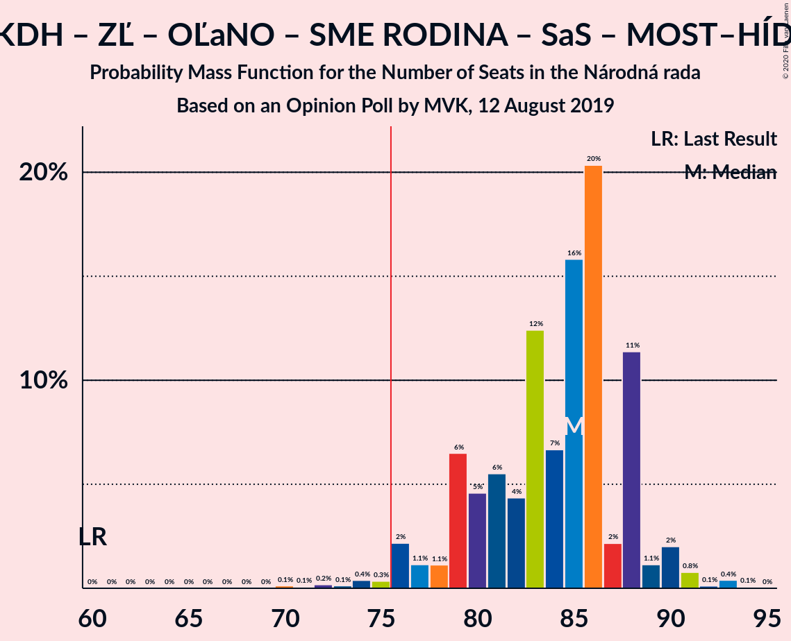

| Number of Seats | Probability | Accumulated | Special Marks |
|:---------------:|:-----------:|:-----------:|:-------------:|
| 60 | 0% | 100% | Last Result |
| 61 | 0% | 100% |  |
| 62 | 0% | 100% |  |
| 63 | 0% | 100% |  |
| 64 | 0% | 100% |  |
| 65 | 0% | 100% |  |
| 66 | 0% | 100% |  |
| 67 | 0% | 100% |  |
| 68 | 0% | 100% |  |
| 69 | 0% | 100% |  |
| 70 | 0.1% | 99.9% |  |
| 71 | 0.1% | 99.8% |  |
| 72 | 0.2% | 99.8% |  |
| 73 | 0.1% | 99.6% |  |
| 74 | 0.4% | 99.4% |  |
| 75 | 0.3% | 99.1% |  |
| 76 | 2% | 98.7% | Majority |
| 77 | 1.1% | 97% |  |
| 78 | 1.1% | 95% |  |
| 79 | 6% | 94% |  |
| 80 | 5% | 88% |  |
| 81 | 6% | 83% |  |
| 82 | 4% | 78% |  |
| 83 | 12% | 73% |  |
| 84 | 7% | 61% |  |
| 85 | 16% | 54% |  |
| 86 | 20% | 38% |  |
| 87 | 2% | 18% | Median |
| 88 | 11% | 16% |  |
| 89 | 1.1% | 5% |  |
| 90 | 2% | 3% |  |
| 91 | 0.8% | 1.4% |  |
| 92 | 0.1% | 0.6% |  |
| 93 | 0.4% | 0.5% |  |
| 94 | 0.1% | 0.1% |  |
| 95 | 0% | 0% |  |

### Progresívne Slovensko–SPOLU–Občianska Demokracia – Kresťanskodemokratické hnutie – Za ľudí – OBYČAJNÍ ĽUDIA a nezávislé osobnosti – SME RODINA – Sloboda a Solidarita – MOST–HÍD

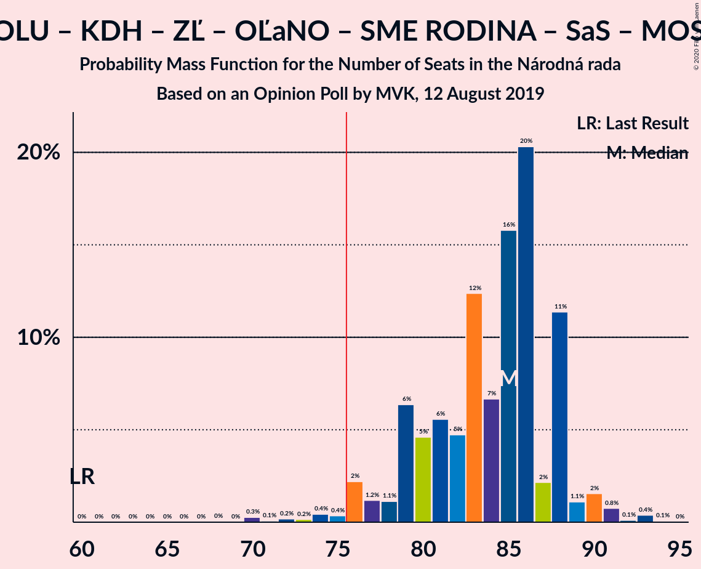

| Number of Seats | Probability | Accumulated | Special Marks |
|:---------------:|:-----------:|:-----------:|:-------------:|
| 60 | 0% | 100% | Last Result |
| 61 | 0% | 100% |  |
| 62 | 0% | 100% |  |
| 63 | 0% | 100% |  |
| 64 | 0% | 100% |  |
| 65 | 0% | 100% |  |
| 66 | 0% | 100% |  |
| 67 | 0% | 100% |  |
| 68 | 0% | 100% |  |
| 69 | 0% | 100% |  |
| 70 | 0.3% | 99.9% |  |
| 71 | 0.1% | 99.7% |  |
| 72 | 0.2% | 99.6% |  |
| 73 | 0.2% | 99.4% |  |
| 74 | 0.4% | 99.3% |  |
| 75 | 0.4% | 98.8% |  |
| 76 | 2% | 98% | Majority |
| 77 | 1.2% | 96% |  |
| 78 | 1.1% | 95% |  |
| 79 | 6% | 94% |  |
| 80 | 5% | 88% |  |
| 81 | 6% | 83% |  |
| 82 | 5% | 77% |  |
| 83 | 12% | 73% |  |
| 84 | 7% | 60% |  |
| 85 | 16% | 54% |  |
| 86 | 20% | 38% |  |
| 87 | 2% | 18% | Median |
| 88 | 11% | 15% |  |
| 89 | 1.1% | 4% |  |
| 90 | 2% | 3% |  |
| 91 | 0.8% | 1.3% |  |
| 92 | 0.1% | 0.6% |  |
| 93 | 0.4% | 0.5% |  |
| 94 | 0.1% | 0.1% |  |
| 95 | 0% | 0% |  |

### Progresívne Slovensko–SPOLU–Občianska Demokracia – Kresťanskodemokratické hnutie – Za ľudí – OBYČAJNÍ ĽUDIA a nezávislé osobnosti – SME RODINA – Sloboda a Solidarita – Strana maďarskej koalície–Magyar Koalíció Pártja

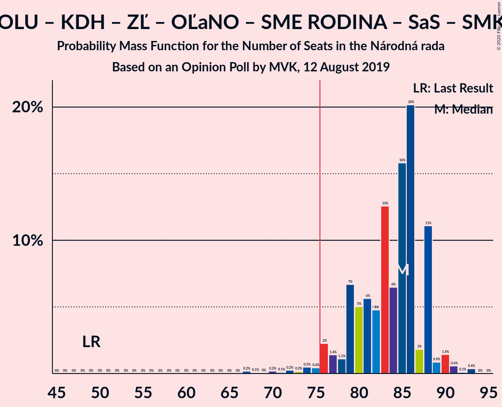

| Number of Seats | Probability | Accumulated | Special Marks |
|:---------------:|:-----------:|:-----------:|:-------------:|
| 49 | 0% | 100% | Last Result |
| 50 | 0% | 100% |  |
| 51 | 0% | 100% |  |
| 52 | 0% | 100% |  |
| 53 | 0% | 100% |  |
| 54 | 0% | 100% |  |
| 55 | 0% | 100% |  |
| 56 | 0% | 100% |  |
| 57 | 0% | 100% |  |
| 58 | 0% | 100% |  |
| 59 | 0% | 100% |  |
| 60 | 0% | 100% |  |
| 61 | 0% | 100% |  |
| 62 | 0% | 100% |  |
| 63 | 0% | 100% |  |
| 64 | 0% | 100% |  |
| 65 | 0% | 100% |  |
| 66 | 0% | 100% |  |
| 67 | 0.2% | 100% |  |
| 68 | 0.1% | 99.8% |  |
| 69 | 0% | 99.7% |  |
| 70 | 0.2% | 99.7% |  |
| 71 | 0.1% | 99.5% |  |
| 72 | 0.2% | 99.4% |  |
| 73 | 0.2% | 99.2% |  |
| 74 | 0.5% | 99.0% |  |
| 75 | 0.4% | 98.6% |  |
| 76 | 2% | 98% | Majority |
| 77 | 1.4% | 96% |  |
| 78 | 1.1% | 94% |  |
| 79 | 7% | 93% |  |
| 80 | 5% | 87% |  |
| 81 | 6% | 82% |  |
| 82 | 5% | 76% |  |
| 83 | 13% | 71% |  |
| 84 | 6% | 59% |  |
| 85 | 16% | 52% |  |
| 86 | 20% | 36% |  |
| 87 | 2% | 16% | Median |
| 88 | 11% | 14% |  |
| 89 | 0.9% | 3% |  |
| 90 | 1.4% | 2% |  |
| 91 | 0.6% | 1.0% |  |
| 92 | 0.1% | 0.5% |  |
| 93 | 0.4% | 0.4% |  |
| 94 | 0% | 0% |  |

### Progresívne Slovensko–SPOLU–Občianska Demokracia – Kresťanskodemokratické hnutie – Za ľudí – OBYČAJNÍ ĽUDIA a nezávislé osobnosti – SME RODINA – Sloboda a Solidarita

| Number of Seats | Probability | Accumulated | Special Marks |
|:---------------:|:-----------:|:-----------:|:-------------:|
| 49 | 0% | 100% | Last Result |
| 50 | 0% | 100% |  |
| 51 | 0% | 100% |  |
| 52 | 0% | 100% |  |
| 53 | 0% | 100% |  |
| 54 | 0% | 100% |  |
| 55 | 0% | 100% |  |
| 56 | 0% | 100% |  |
| 57 | 0% | 100% |  |
| 58 | 0% | 100% |  |
| 59 | 0% | 100% |  |
| 60 | 0% | 100% |  |
| 61 | 0% | 100% |  |
| 62 | 0% | 100% |  |
| 63 | 0% | 100% |  |
| 64 | 0% | 100% |  |
| 65 | 0% | 100% |  |
| 66 | 0% | 100% |  |
| 67 | 0.2% | 100% |  |
| 68 | 0.1% | 99.8% |  |
| 69 | 0% | 99.7% |  |
| 70 | 0.3% | 99.7% |  |
| 71 | 0.1% | 99.4% |  |
| 72 | 0.3% | 99.3% |  |
| 73 | 0.2% | 99.0% |  |
| 74 | 0.9% | 98.8% |  |
| 75 | 0.4% | 98% |  |
| 76 | 2% | 97% | Majority |
| 77 | 1.5% | 95% |  |
| 78 | 1.1% | 94% |  |
| 79 | 7% | 93% |  |
| 80 | 5% | 86% |  |
| 81 | 6% | 81% |  |
| 82 | 4% | 75% |  |
| 83 | 13% | 71% |  |
| 84 | 6% | 59% |  |
| 85 | 16% | 52% |  |
| 86 | 20% | 36% |  |
| 87 | 2% | 16% | Median |
| 88 | 11% | 14% |  |
| 89 | 0.8% | 3% |  |
| 90 | 1.4% | 2% |  |
| 91 | 0.6% | 1.0% |  |
| 92 | 0.1% | 0.5% |  |
| 93 | 0.4% | 0.4% |  |
| 94 | 0% | 0% |  |

### Progresívne Slovensko–SPOLU–Občianska Demokracia – Kresťanskodemokratické hnutie – Za ľudí – OBYČAJNÍ ĽUDIA a nezávislé osobnosti – Sloboda a Solidarita – MOST–HÍD – Strana maďarskej koalície–Magyar Koalíció Pártja

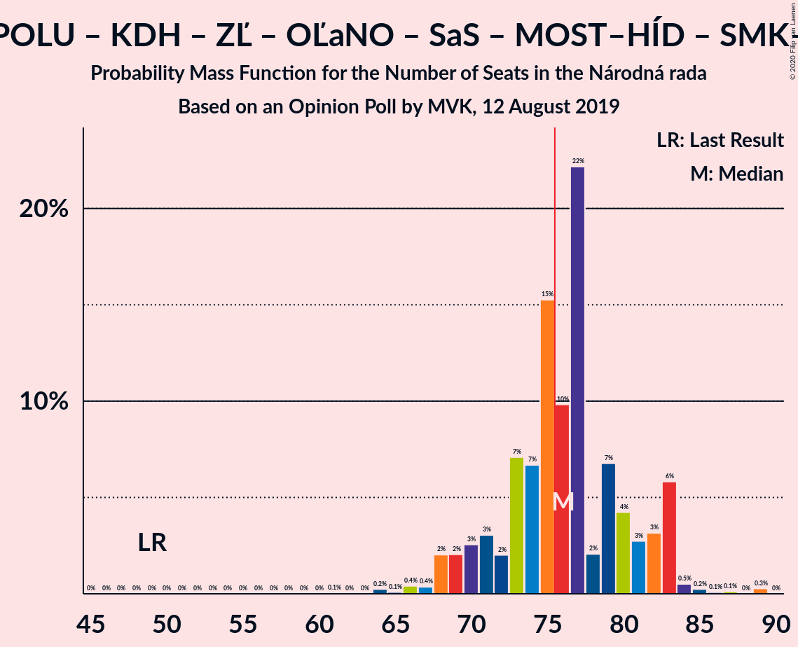

| Number of Seats | Probability | Accumulated | Special Marks |
|:---------------:|:-----------:|:-----------:|:-------------:|
| 49 | 0% | 100% | Last Result |
| 50 | 0% | 100% |  |
| 51 | 0% | 100% |  |
| 52 | 0% | 100% |  |
| 53 | 0% | 100% |  |
| 54 | 0% | 100% |  |
| 55 | 0% | 100% |  |
| 56 | 0% | 100% |  |
| 57 | 0% | 100% |  |
| 58 | 0% | 100% |  |
| 59 | 0% | 100% |  |
| 60 | 0% | 100% |  |
| 61 | 0.1% | 100% |  |
| 62 | 0% | 99.9% |  |
| 63 | 0% | 99.9% |  |
| 64 | 0.2% | 99.9% |  |
| 65 | 0.1% | 99.7% |  |
| 66 | 0.4% | 99.6% |  |
| 67 | 0.4% | 99.2% |  |
| 68 | 2% | 98.8% |  |
| 69 | 2% | 97% |  |
| 70 | 3% | 95% |  |
| 71 | 3% | 92% |  |
| 72 | 2% | 89% |  |
| 73 | 7% | 87% |  |
| 74 | 7% | 80% |  |
| 75 | 15% | 73% |  |
| 76 | 10% | 58% | Majority |
| 77 | 22% | 48% | Median |
| 78 | 2% | 26% |  |
| 79 | 7% | 24% |  |
| 80 | 4% | 17% |  |
| 81 | 3% | 13% |  |
| 82 | 3% | 10% |  |
| 83 | 6% | 7% |  |
| 84 | 0.5% | 1.3% |  |
| 85 | 0.2% | 0.8% |  |
| 86 | 0.1% | 0.5% |  |
| 87 | 0.1% | 0.4% |  |
| 88 | 0% | 0.3% |  |
| 89 | 0.3% | 0.3% |  |
| 90 | 0% | 0% |  |

### Progresívne Slovensko–SPOLU–Občianska Demokracia – Kresťanskodemokratické hnutie – Za ľudí – OBYČAJNÍ ĽUDIA a nezávislé osobnosti – Sloboda a Solidarita – MOST–HÍD

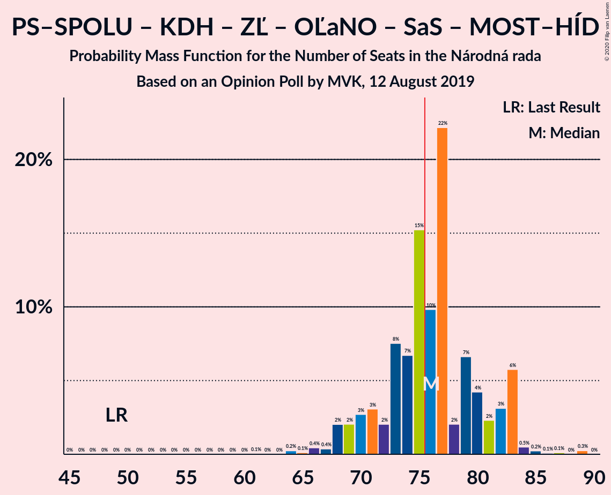

| Number of Seats | Probability | Accumulated | Special Marks |
|:---------------:|:-----------:|:-----------:|:-------------:|
| 49 | 0% | 100% | Last Result |
| 50 | 0% | 100% |  |
| 51 | 0% | 100% |  |
| 52 | 0% | 100% |  |
| 53 | 0% | 100% |  |
| 54 | 0% | 100% |  |
| 55 | 0% | 100% |  |
| 56 | 0% | 100% |  |
| 57 | 0% | 100% |  |
| 58 | 0% | 100% |  |
| 59 | 0% | 100% |  |
| 60 | 0% | 100% |  |
| 61 | 0.1% | 100% |  |
| 62 | 0% | 99.9% |  |
| 63 | 0% | 99.9% |  |
| 64 | 0.2% | 99.9% |  |
| 65 | 0.1% | 99.6% |  |
| 66 | 0.4% | 99.5% |  |
| 67 | 0.4% | 99.1% |  |
| 68 | 2% | 98.7% |  |
| 69 | 2% | 97% |  |
| 70 | 3% | 95% |  |
| 71 | 3% | 92% |  |
| 72 | 2% | 89% |  |
| 73 | 8% | 87% |  |
| 74 | 7% | 79% |  |
| 75 | 15% | 73% |  |
| 76 | 10% | 57% | Majority |
| 77 | 22% | 47% | Median |
| 78 | 2% | 25% |  |
| 79 | 7% | 23% |  |
| 80 | 4% | 17% |  |
| 81 | 2% | 12% |  |
| 82 | 3% | 10% |  |
| 83 | 6% | 7% |  |
| 84 | 0.5% | 1.2% |  |
| 85 | 0.2% | 0.7% |  |
| 86 | 0.1% | 0.5% |  |
| 87 | 0.1% | 0.4% |  |
| 88 | 0% | 0.3% |  |
| 89 | 0.3% | 0.3% |  |
| 90 | 0% | 0% |  |

### Progresívne Slovensko–SPOLU–Občianska Demokracia – Kresťanskodemokratické hnutie – Za ľudí – OBYČAJNÍ ĽUDIA a nezávislé osobnosti – Sloboda a Solidarita – Strana maďarskej koalície–Magyar Koalíció Pártja

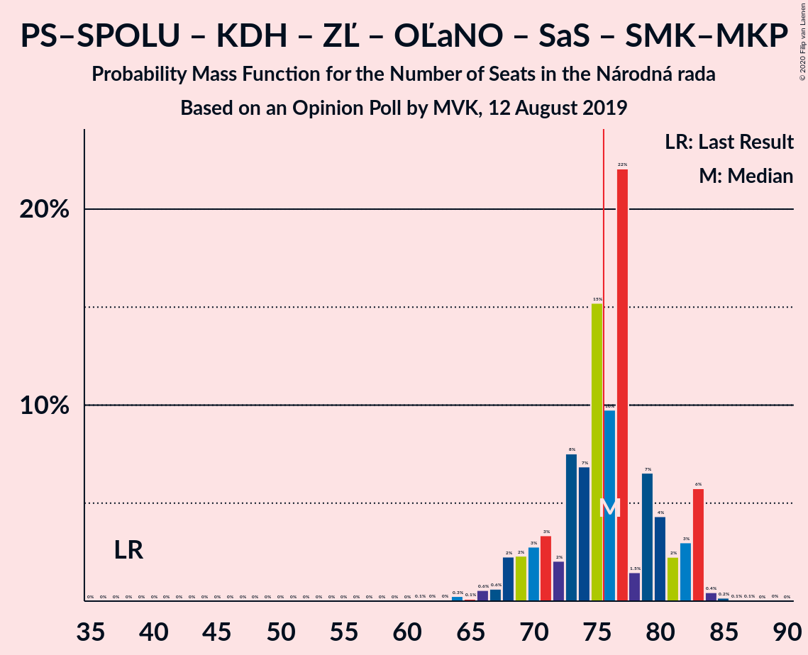

| Number of Seats | Probability | Accumulated | Special Marks |
|:---------------:|:-----------:|:-----------:|:-------------:|
| 38 | 0% | 100% | Last Result |
| 39 | 0% | 100% |  |
| 40 | 0% | 100% |  |
| 41 | 0% | 100% |  |
| 42 | 0% | 100% |  |
| 43 | 0% | 100% |  |
| 44 | 0% | 100% |  |
| 45 | 0% | 100% |  |
| 46 | 0% | 100% |  |
| 47 | 0% | 100% |  |
| 48 | 0% | 100% |  |
| 49 | 0% | 100% |  |
| 50 | 0% | 100% |  |
| 51 | 0% | 100% |  |
| 52 | 0% | 100% |  |
| 53 | 0% | 100% |  |
| 54 | 0% | 100% |  |
| 55 | 0% | 100% |  |
| 56 | 0% | 100% |  |
| 57 | 0% | 100% |  |
| 58 | 0% | 100% |  |
| 59 | 0% | 100% |  |
| 60 | 0% | 100% |  |
| 61 | 0.1% | 100% |  |
| 62 | 0% | 99.9% |  |
| 63 | 0% | 99.9% |  |
| 64 | 0.3% | 99.8% |  |
| 65 | 0.1% | 99.6% |  |
| 66 | 0.6% | 99.5% |  |
| 67 | 0.6% | 98.9% |  |
| 68 | 2% | 98% |  |
| 69 | 2% | 96% |  |
| 70 | 3% | 94% |  |
| 71 | 3% | 91% |  |
| 72 | 2% | 88% |  |
| 73 | 8% | 86% |  |
| 74 | 7% | 78% |  |
| 75 | 15% | 71% |  |
| 76 | 10% | 56% | Majority |
| 77 | 22% | 46% | Median |
| 78 | 1.5% | 24% |  |
| 79 | 7% | 23% |  |
| 80 | 4% | 16% |  |
| 81 | 2% | 12% |  |
| 82 | 3% | 10% |  |
| 83 | 6% | 7% |  |
| 84 | 0.4% | 0.8% |  |
| 85 | 0.2% | 0.4% |  |
| 86 | 0.1% | 0.2% |  |
| 87 | 0.1% | 0.1% |  |
| 88 | 0% | 0.1% |  |
| 89 | 0% | 0.1% |  |
| 90 | 0% | 0% |  |

### Progresívne Slovensko–SPOLU–Občianska Demokracia – Kresťanskodemokratické hnutie – Za ľudí – OBYČAJNÍ ĽUDIA a nezávislé osobnosti – Sloboda a Solidarita

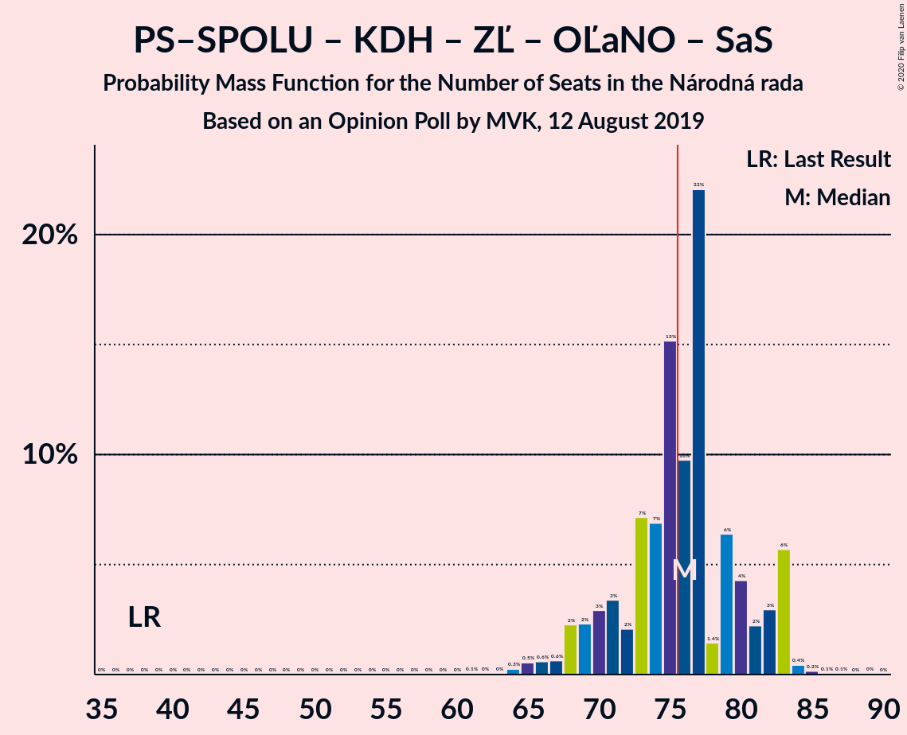

| Number of Seats | Probability | Accumulated | Special Marks |
|:---------------:|:-----------:|:-----------:|:-------------:|
| 38 | 0% | 100% | Last Result |
| 39 | 0% | 100% |  |
| 40 | 0% | 100% |  |
| 41 | 0% | 100% |  |
| 42 | 0% | 100% |  |
| 43 | 0% | 100% |  |
| 44 | 0% | 100% |  |
| 45 | 0% | 100% |  |
| 46 | 0% | 100% |  |
| 47 | 0% | 100% |  |
| 48 | 0% | 100% |  |
| 49 | 0% | 100% |  |
| 50 | 0% | 100% |  |
| 51 | 0% | 100% |  |
| 52 | 0% | 100% |  |
| 53 | 0% | 100% |  |
| 54 | 0% | 100% |  |
| 55 | 0% | 100% |  |
| 56 | 0% | 100% |  |
| 57 | 0% | 100% |  |
| 58 | 0% | 100% |  |
| 59 | 0% | 100% |  |
| 60 | 0% | 100% |  |
| 61 | 0.1% | 100% |  |
| 62 | 0% | 99.9% |  |
| 63 | 0% | 99.9% |  |
| 64 | 0.3% | 99.8% |  |
| 65 | 0.5% | 99.6% |  |
| 66 | 0.6% | 99.0% |  |
| 67 | 0.6% | 98% |  |
| 68 | 2% | 98% |  |
| 69 | 2% | 96% |  |
| 70 | 3% | 93% |  |
| 71 | 3% | 90% |  |
| 72 | 2% | 87% |  |
| 73 | 7% | 85% |  |
| 74 | 7% | 78% |  |
| 75 | 15% | 71% |  |
| 76 | 10% | 56% | Majority |
| 77 | 22% | 46% | Median |
| 78 | 1.4% | 24% |  |
| 79 | 6% | 22% |  |
| 80 | 4% | 16% |  |
| 81 | 2% | 12% |  |
| 82 | 3% | 9% |  |
| 83 | 6% | 6% |  |
| 84 | 0.4% | 0.8% |  |
| 85 | 0.2% | 0.4% |  |
| 86 | 0.1% | 0.2% |  |
| 87 | 0.1% | 0.1% |  |
| 88 | 0% | 0.1% |  |
| 89 | 0% | 0.1% |  |
| 90 | 0% | 0% |  |

### SMER–sociálna demokracia – Slovenská národná strana – Kotleba–Ľudová strana Naše Slovensko – SME RODINA

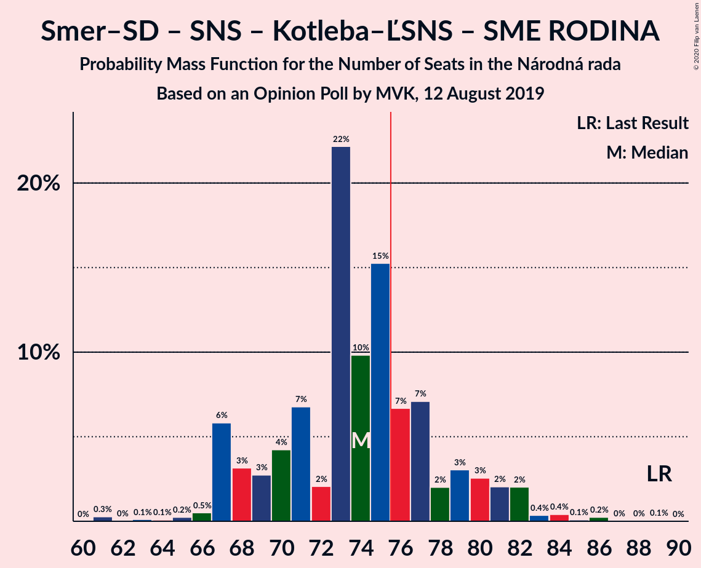

| Number of Seats | Probability | Accumulated | Special Marks |
|:---------------:|:-----------:|:-----------:|:-------------:|
| 61 | 0.3% | 100% |  |
| 62 | 0% | 99.7% |  |
| 63 | 0.1% | 99.7% |  |
| 64 | 0.1% | 99.6% |  |
| 65 | 0.2% | 99.5% |  |
| 66 | 0.5% | 99.2% |  |
| 67 | 6% | 98.7% |  |
| 68 | 3% | 93% |  |
| 69 | 3% | 90% |  |
| 70 | 4% | 87% |  |
| 71 | 7% | 83% |  |
| 72 | 2% | 76% |  |
| 73 | 22% | 74% |  |
| 74 | 10% | 52% |  |
| 75 | 15% | 42% |  |
| 76 | 7% | 27% | Median, Majority |
| 77 | 7% | 20% |  |
| 78 | 2% | 13% |  |
| 79 | 3% | 11% |  |
| 80 | 3% | 8% |  |
| 81 | 2% | 5% |  |
| 82 | 2% | 3% |  |
| 83 | 0.4% | 1.2% |  |
| 84 | 0.4% | 0.8% |  |
| 85 | 0.1% | 0.4% |  |
| 86 | 0.2% | 0.3% |  |
| 87 | 0% | 0.1% |  |
| 88 | 0% | 0.1% |  |
| 89 | 0.1% | 0.1% | Last Result |
| 90 | 0% | 0% |  |

### Progresívne Slovensko–SPOLU–Občianska Demokracia – Kresťanskodemokratické hnutie – Za ľudí – Sloboda a Solidarita

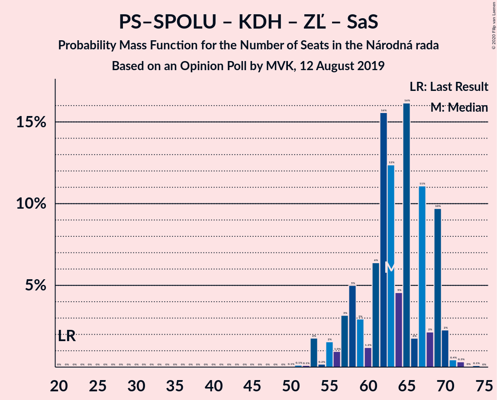

| Number of Seats | Probability | Accumulated | Special Marks |
|:---------------:|:-----------:|:-----------:|:-------------:|
| 21 | 0% | 100% | Last Result |
| 22 | 0% | 100% |  |
| 23 | 0% | 100% |  |
| 24 | 0% | 100% |  |
| 25 | 0% | 100% |  |
| 26 | 0% | 100% |  |
| 27 | 0% | 100% |  |
| 28 | 0% | 100% |  |
| 29 | 0% | 100% |  |
| 30 | 0% | 100% |  |
| 31 | 0% | 100% |  |
| 32 | 0% | 100% |  |
| 33 | 0% | 100% |  |
| 34 | 0% | 100% |  |
| 35 | 0% | 100% |  |
| 36 | 0% | 100% |  |
| 37 | 0% | 100% |  |
| 38 | 0% | 100% |  |
| 39 | 0% | 100% |  |
| 40 | 0% | 100% |  |
| 41 | 0% | 100% |  |
| 42 | 0% | 100% |  |
| 43 | 0% | 100% |  |
| 44 | 0% | 100% |  |
| 45 | 0% | 100% |  |
| 46 | 0% | 100% |  |
| 47 | 0% | 100% |  |
| 48 | 0% | 100% |  |
| 49 | 0% | 100% |  |
| 50 | 0.1% | 100% |  |
| 51 | 0.1% | 99.9% |  |
| 52 | 0.1% | 99.8% |  |
| 53 | 2% | 99.7% |  |
| 54 | 0.2% | 98% |  |
| 55 | 2% | 98% |  |
| 56 | 1.0% | 96% |  |
| 57 | 3% | 95% |  |
| 58 | 5% | 92% |  |
| 59 | 3% | 87% |  |
| 60 | 1.2% | 84% |  |
| 61 | 6% | 83% |  |
| 62 | 16% | 77% |  |
| 63 | 12% | 61% |  |
| 64 | 5% | 49% |  |
| 65 | 16% | 44% | Median |
| 66 | 2% | 28% |  |
| 67 | 11% | 26% |  |
| 68 | 2% | 15% |  |
| 69 | 10% | 13% |  |
| 70 | 2% | 3% |  |
| 71 | 0.4% | 0.9% |  |
| 72 | 0.3% | 0.5% |  |
| 73 | 0% | 0.2% |  |
| 74 | 0.1% | 0.1% |  |
| 75 | 0% | 0% |  |

### SMER–sociálna demokracia – Slovenská národná strana – SME RODINA

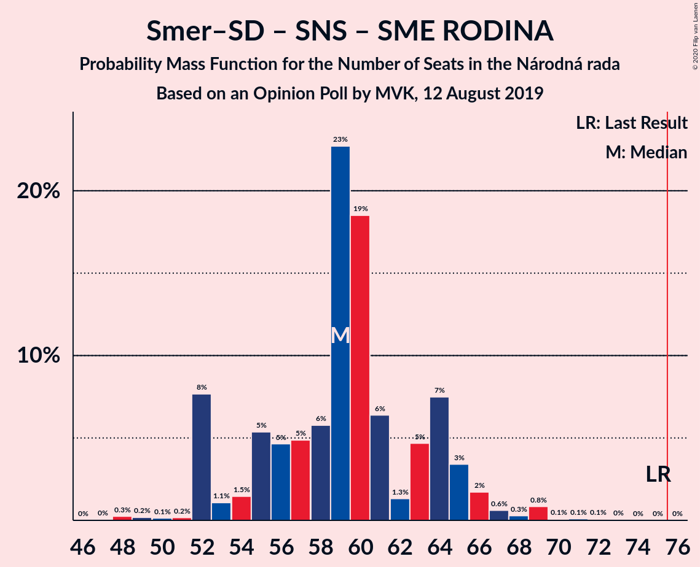

| Number of Seats | Probability | Accumulated | Special Marks |
|:---------------:|:-----------:|:-----------:|:-------------:|
| 46 | 0% | 100% |  |
| 47 | 0% | 99.9% |  |
| 48 | 0.3% | 99.9% |  |
| 49 | 0.2% | 99.7% |  |
| 50 | 0.1% | 99.5% |  |
| 51 | 0.2% | 99.3% |  |
| 52 | 8% | 99.2% |  |
| 53 | 1.1% | 91% |  |
| 54 | 1.5% | 90% |  |
| 55 | 5% | 89% |  |
| 56 | 5% | 84% |  |
| 57 | 5% | 79% |  |
| 58 | 6% | 74% |  |
| 59 | 23% | 68% |  |
| 60 | 19% | 46% |  |
| 61 | 6% | 27% | Median |
| 62 | 1.3% | 21% |  |
| 63 | 5% | 19% |  |
| 64 | 7% | 15% |  |
| 65 | 3% | 7% |  |
| 66 | 2% | 4% |  |
| 67 | 0.6% | 2% |  |
| 68 | 0.3% | 1.4% |  |
| 69 | 0.8% | 1.1% |  |
| 70 | 0.1% | 0.3% |  |
| 71 | 0.1% | 0.2% |  |
| 72 | 0.1% | 0.1% |  |
| 73 | 0% | 0.1% |  |
| 74 | 0% | 0% |  |
| 75 | 0% | 0% | Last Result |

### Progresívne Slovensko–SPOLU–Občianska Demokracia – Za ľudí – OBYČAJNÍ ĽUDIA a nezávislé osobnosti – Sloboda a Solidarita

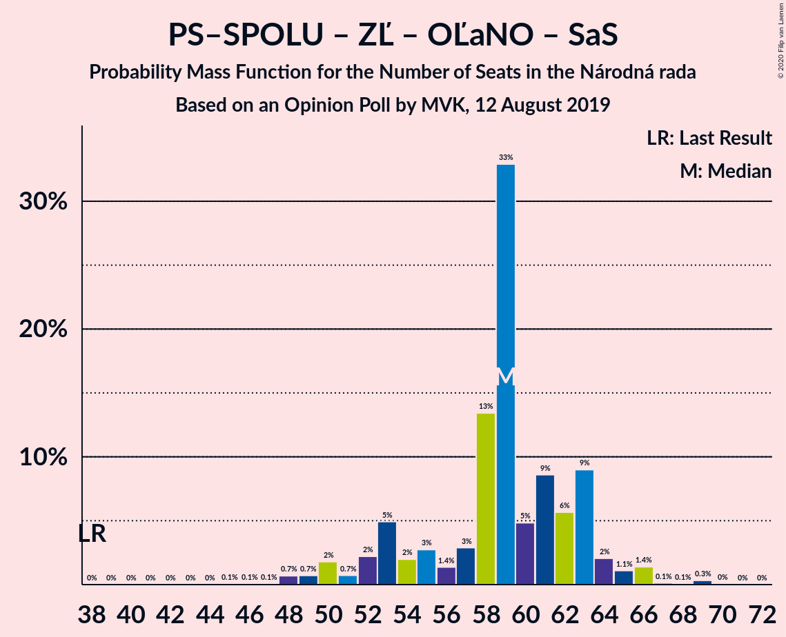

| Number of Seats | Probability | Accumulated | Special Marks |
|:---------------:|:-----------:|:-----------:|:-------------:|
| 38 | 0% | 100% | Last Result |
| 39 | 0% | 100% |  |
| 40 | 0% | 100% |  |
| 41 | 0% | 100% |  |
| 42 | 0% | 100% |  |
| 43 | 0% | 99.9% |  |
| 44 | 0% | 99.9% |  |
| 45 | 0.1% | 99.9% |  |
| 46 | 0.1% | 99.8% |  |
| 47 | 0.1% | 99.8% |  |
| 48 | 0.7% | 99.7% |  |
| 49 | 0.7% | 99.0% |  |
| 50 | 2% | 98% |  |
| 51 | 0.7% | 96% |  |
| 52 | 2% | 96% |  |
| 53 | 5% | 94% |  |
| 54 | 2% | 89% |  |
| 55 | 3% | 87% |  |
| 56 | 1.4% | 84% |  |
| 57 | 3% | 83% |  |
| 58 | 13% | 80% |  |
| 59 | 33% | 66% |  |
| 60 | 5% | 33% | Median |
| 61 | 9% | 28% |  |
| 62 | 6% | 20% |  |
| 63 | 9% | 14% |  |
| 64 | 2% | 5% |  |
| 65 | 1.1% | 3% |  |
| 66 | 1.4% | 2% |  |
| 67 | 0.1% | 0.6% |  |
| 68 | 0.1% | 0.5% |  |
| 69 | 0.3% | 0.4% |  |
| 70 | 0% | 0.1% |  |
| 71 | 0% | 0% |  |

### SMER–sociálna demokracia – Slovenská národná strana – MOST–HÍD

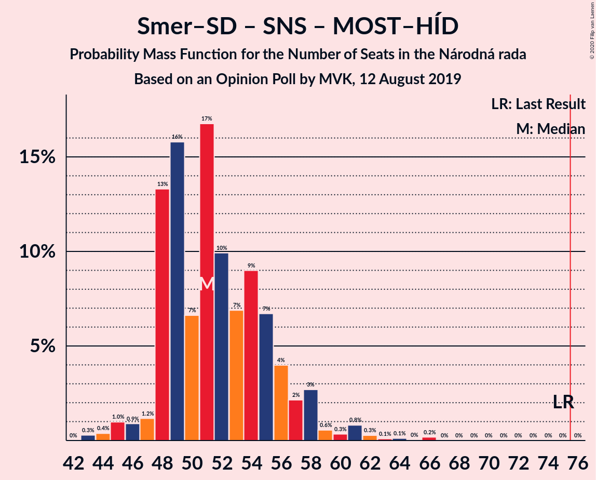

| Number of Seats | Probability | Accumulated | Special Marks |
|:---------------:|:-----------:|:-----------:|:-------------:|
| 43 | 0.3% | 100% |  |
| 44 | 0.4% | 99.7% |  |
| 45 | 1.0% | 99.3% |  |
| 46 | 0.9% | 98% |  |
| 47 | 1.2% | 97% |  |
| 48 | 13% | 96% |  |
| 49 | 16% | 83% |  |
| 50 | 7% | 67% |  |
| 51 | 17% | 61% | Median |
| 52 | 10% | 44% |  |
| 53 | 7% | 34% |  |
| 54 | 9% | 27% |  |
| 55 | 7% | 18% |  |
| 56 | 4% | 11% |  |
| 57 | 2% | 7% |  |
| 58 | 3% | 5% |  |
| 59 | 0.6% | 2% |  |
| 60 | 0.3% | 2% |  |
| 61 | 0.8% | 2% |  |
| 62 | 0.3% | 0.7% |  |
| 63 | 0.1% | 0.5% |  |
| 64 | 0.1% | 0.4% |  |
| 65 | 0% | 0.2% |  |
| 66 | 0.2% | 0.2% |  |
| 67 | 0% | 0% |  |
| 68 | 0% | 0% |  |
| 69 | 0% | 0% |  |
| 70 | 0% | 0% |  |
| 71 | 0% | 0% |  |
| 72 | 0% | 0% |  |
| 73 | 0% | 0% |  |
| 74 | 0% | 0% |  |
| 75 | 0% | 0% | Last Result |

### SMER–sociálna demokracia – Slovenská národná strana

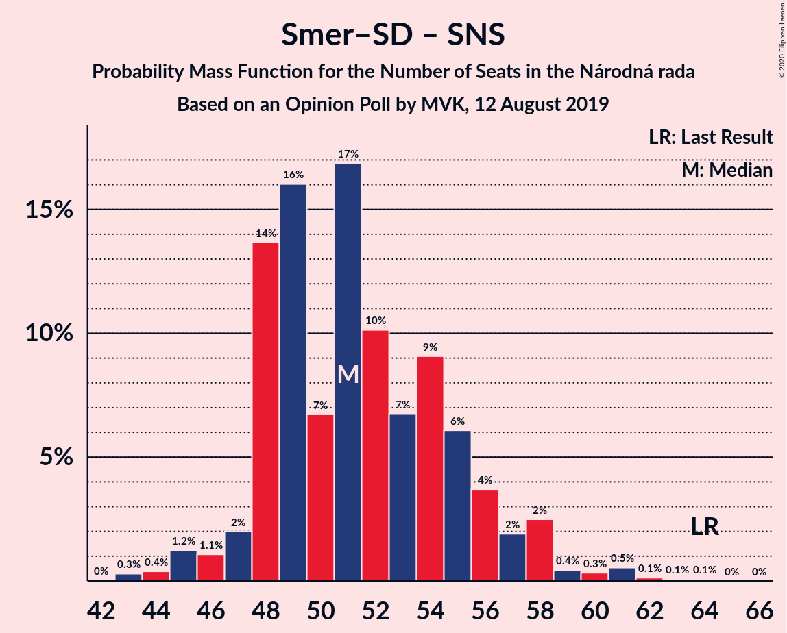

| Number of Seats | Probability | Accumulated | Special Marks |
|:---------------:|:-----------:|:-----------:|:-------------:|
| 43 | 0.3% | 100% |  |
| 44 | 0.4% | 99.7% |  |
| 45 | 1.2% | 99.3% |  |
| 46 | 1.1% | 98% |  |
| 47 | 2% | 97% |  |
| 48 | 14% | 95% |  |
| 49 | 16% | 81% |  |
| 50 | 7% | 65% |  |
| 51 | 17% | 59% | Median |
| 52 | 10% | 42% |  |
| 53 | 7% | 32% |  |
| 54 | 9% | 25% |  |
| 55 | 6% | 16% |  |
| 56 | 4% | 10% |  |
| 57 | 2% | 6% |  |
| 58 | 2% | 4% |  |
| 59 | 0.4% | 2% |  |
| 60 | 0.3% | 1.1% |  |
| 61 | 0.5% | 0.8% |  |
| 62 | 0.1% | 0.3% |  |
| 63 | 0.1% | 0.2% |  |
| 64 | 0.1% | 0.1% | Last Result |
| 65 | 0% | 0% |  |

### Progresívne Slovensko–SPOLU–Občianska Demokracia – Za ľudí – Sloboda a Solidarita

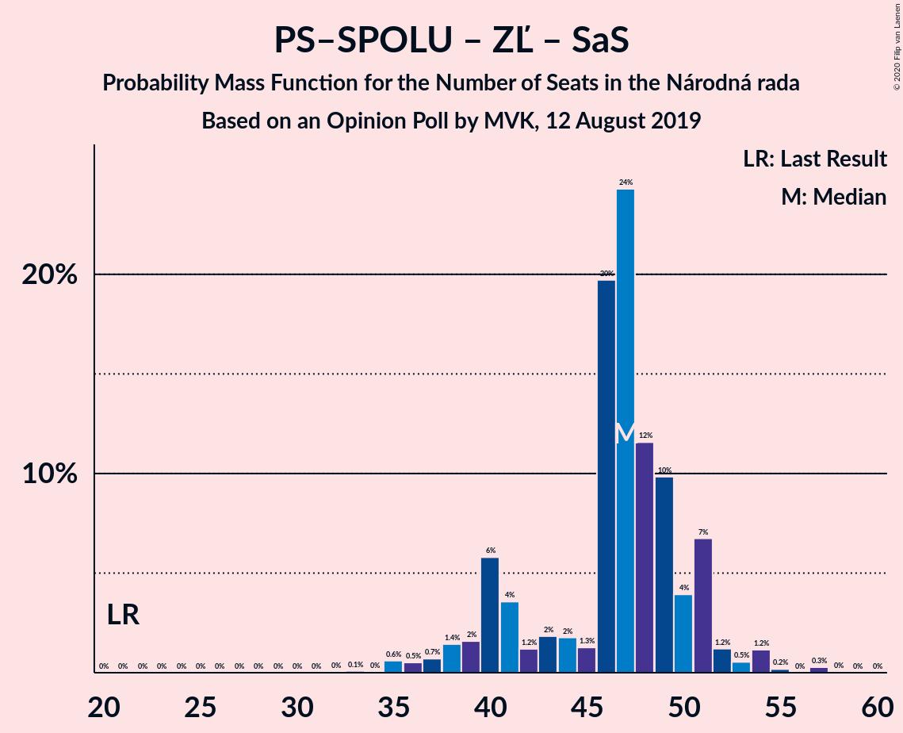

| Number of Seats | Probability | Accumulated | Special Marks |
|:---------------:|:-----------:|:-----------:|:-------------:|
| 21 | 0% | 100% | Last Result |
| 22 | 0% | 100% |  |
| 23 | 0% | 100% |  |
| 24 | 0% | 100% |  |
| 25 | 0% | 100% |  |
| 26 | 0% | 100% |  |
| 27 | 0% | 100% |  |
| 28 | 0% | 100% |  |
| 29 | 0% | 100% |  |
| 30 | 0% | 100% |  |
| 31 | 0% | 100% |  |
| 32 | 0% | 100% |  |
| 33 | 0.1% | 99.9% |  |
| 34 | 0% | 99.9% |  |
| 35 | 0.6% | 99.8% |  |
| 36 | 0.5% | 99.2% |  |
| 37 | 0.7% | 98.7% |  |
| 38 | 1.4% | 98% |  |
| 39 | 2% | 97% |  |
| 40 | 6% | 95% |  |
| 41 | 4% | 89% |  |
| 42 | 1.2% | 86% |  |
| 43 | 2% | 84% |  |
| 44 | 2% | 83% |  |
| 45 | 1.3% | 81% |  |
| 46 | 20% | 80% |  |
| 47 | 24% | 60% |  |
| 48 | 12% | 36% | Median |
| 49 | 10% | 24% |  |
| 50 | 4% | 14% |  |
| 51 | 7% | 10% |  |
| 52 | 1.2% | 3% |  |
| 53 | 0.5% | 2% |  |
| 54 | 1.2% | 2% |  |
| 55 | 0.2% | 0.5% |  |
| 56 | 0% | 0.3% |  |
| 57 | 0.3% | 0.3% |  |
| 58 | 0% | 0% |  |

### SMER–sociálna demokracia – SME RODINA

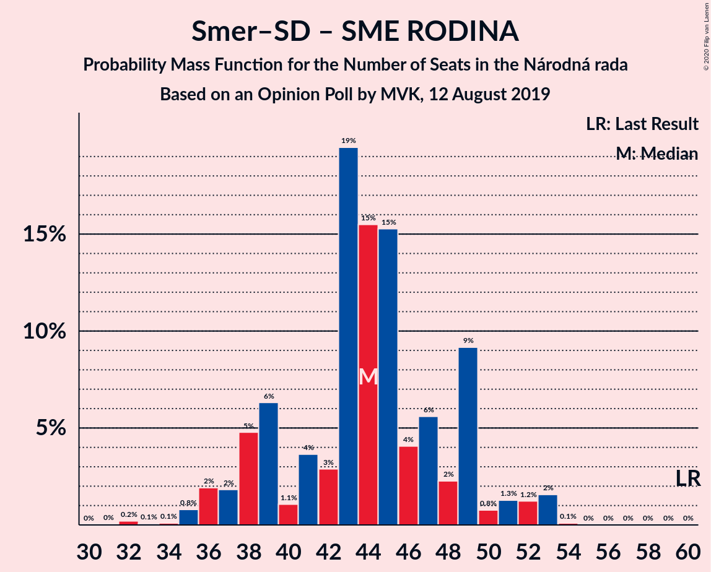

| Number of Seats | Probability | Accumulated | Special Marks |
|:---------------:|:-----------:|:-----------:|:-------------:|
| 32 | 0.2% | 100% |  |
| 33 | 0.1% | 99.8% |  |
| 34 | 0.1% | 99.7% |  |
| 35 | 0.8% | 99.6% |  |
| 36 | 2% | 98.8% |  |
| 37 | 2% | 97% |  |
| 38 | 5% | 95% |  |
| 39 | 6% | 90% |  |
| 40 | 1.1% | 84% |  |
| 41 | 4% | 83% |  |
| 42 | 3% | 79% |  |
| 43 | 19% | 76% |  |
| 44 | 15% | 57% |  |
| 45 | 15% | 41% |  |
| 46 | 4% | 26% | Median |
| 47 | 6% | 22% |  |
| 48 | 2% | 16% |  |
| 49 | 9% | 14% |  |
| 50 | 0.8% | 5% |  |
| 51 | 1.3% | 4% |  |
| 52 | 1.2% | 3% |  |
| 53 | 2% | 2% |  |
| 54 | 0.1% | 0.2% |  |
| 55 | 0% | 0.1% |  |
| 56 | 0% | 0% |  |
| 57 | 0% | 0% |  |
| 58 | 0% | 0% |  |
| 59 | 0% | 0% |  |
| 60 | 0% | 0% | Last Result |

### SMER–sociálna demokracia

| Number of Seats | Probability | Accumulated | Special Marks |
|:---------------:|:-----------:|:-----------:|:-------------:|
| 30 | 0.4% | 100% |  |
| 31 | 1.4% | 99.6% |  |
| 32 | 2% | 98% |  |
| 33 | 25% | 97% |  |
| 34 | 8% | 72% |  |
| 35 | 8% | 64% |  |
| 36 | 16% | 56% | Median |
| 37 | 8% | 40% |  |
| 38 | 7% | 32% |  |
| 39 | 15% | 25% |  |
| 40 | 3% | 10% |  |
| 41 | 3% | 8% |  |
| 42 | 2% | 4% |  |
| 43 | 1.5% | 2% |  |
| 44 | 0.3% | 0.6% |  |
| 45 | 0.1% | 0.3% |  |
| 46 | 0.1% | 0.2% |  |
| 47 | 0.1% | 0.1% |  |
| 48 | 0% | 0% |  |
| 49 | 0% | 0% | Last Result |

## Technical Information

### Opinion Poll

+ **Polling firm:** MVK
+ **Commissioner(s):** —
+ **Fieldwork period:** 12 August 2019

### Calculations

+ **Sample size:** 1000
+ **Simulations done:** 1,048,576
+ **Error estimate:** 2.00%

