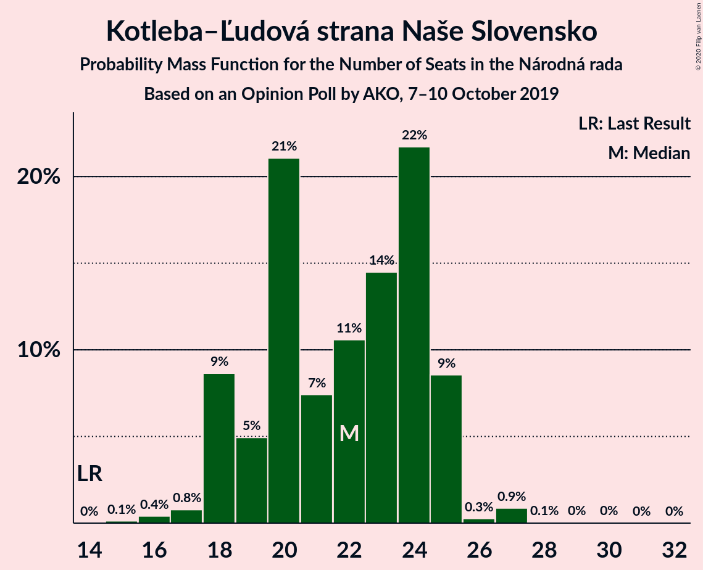
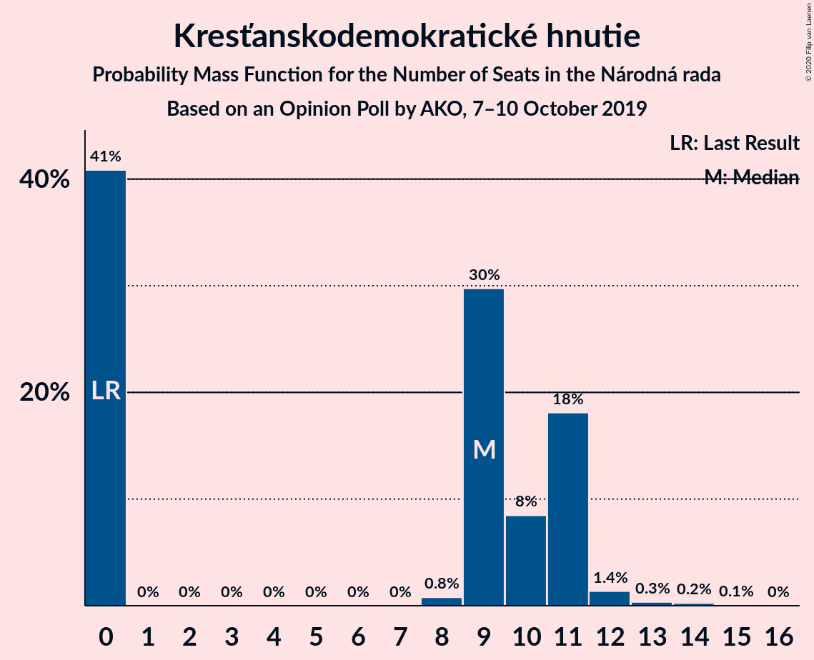

# Opinion Poll by AKO, 7–10 October 2019

<a href="#voting-intentions">Voting Intentions</a> | <a href="#seats">Seats</a> | <a href="#coalitions">Coalitions</a> | <a href="#technical-information">Technical Information</a>

## Voting Intentions

### Confidence Intervals

| Party | Last Result | Poll Result | 80% Confidence Interval | 90% Confidence Interval | 95% Confidence Interval | 99% Confidence Interval |
|:-----:|:-----------:|:-----------:|:-----------------------:|:-----------------------:|:-----------------------:|:-----------------------:|
| SMER–sociálna demokracia | 28.3% | 20.1% | 18.5–21.8% |18.1–22.3% |17.7–22.7% |17.0–23.5% |
| Progresívne Slovensko–SPOLU–Občianska Demokracia | 0.0% | 12.7% | 11.4–14.1% |11.1–14.6% |10.8–14.9% |10.2–15.6% |
| Kotleba–Ľudová strana Naše Slovensko | 8.0% | 12.3% | 11.1–13.7% |10.7–14.1% |10.4–14.5% |9.8–15.2% |
| Za ľudí | 0.0% | 12.0% | 10.8–13.4% |10.4–13.8% |10.1–14.2% |9.6–14.9% |
| Sloboda a Solidarita | 12.1% | 6.7% | 5.8–7.8% |5.5–8.2% |5.3–8.4% |4.9–9.0% |
| Slovenská národná strana | 8.6% | 6.4% | 5.5–7.5% |5.3–7.8% |5.0–8.1% |4.6–8.7% |
| SME RODINA | 6.6% | 5.9% | 5.0–7.0% |4.8–7.3% |4.6–7.5% |4.2–8.1% |
| OBYČAJNÍ ĽUDIA a nezávislé osobnosti | 11.0% | 5.8% | 5.0–6.9% |4.7–7.2% |4.5–7.4% |4.1–8.0% |
| Kresťanskodemokratické hnutie | 4.9% | 5.6% | 4.8–6.6% |4.5–7.0% |4.3–7.2% |4.0–7.7% |
| MOST–HÍD | 6.5% | 3.9% | 3.2–4.8% |3.0–5.1% |2.9–5.3% |2.6–5.8% |
| Strana maďarskej koalície–Magyar Koalíció Pártja | 4.0% | 3.1% | 2.5–3.9% |2.3–4.2% |2.2–4.4% |1.9–4.8% |
| Dobrá voľba | 0.0% | 1.7% | 1.3–2.4% |1.2–2.5% |1.1–2.7% |0.9–3.1% |
| VLASŤ | 0.0% | 1.3% | 0.9–1.9% |0.8–2.1% |0.8–2.2% |0.6–2.5% |

*Note:* The poll result column reflects the actual value used in the calculations. Published results may vary slightly, and in addition be rounded to fewer digits.

## Seats

### Confidence Intervals

| Party | Last Result | Median | 80% Confidence Interval | 90% Confidence Interval | 95% Confidence Interval | 99% Confidence Interval |
|:-----:|:-----------:|:------:|:-----------------------:|:-----------------------:|:-----------------------:|:-----------------------:|
| <a href="#smer–sociálna-demokracia">SMER–sociálna demokracia</a> | 49 | 35 | 31–40 |31–40 |31–40 |31–41 |
| <a href="#progresívne-slovensko–spolu–občianska-demokracia">Progresívne Slovensko–SPOLU–Občianska Demokracia</a> | 0 | 23 | 21–27 |19–27 |19–27 |18–27 |
| <a href="#kotleba–ľudová-strana-naše-slovensko">Kotleba–Ľudová strana Naše Slovensko</a> | 14 | 22 | 19–24 |18–25 |18–25 |16–27 |
| <a href="#za-ľudí">Za ľudí</a> | 0 | 21 | 18–24 |18–25 |18–26 |17–27 |
| <a href="#sloboda-a-solidarita">Sloboda a Solidarita</a> | 21 | 12 | 10–16 |9–16 |9–16 |0–16 |
| <a href="#slovenská-národná-strana">Slovenská národná strana</a> | 15 | 13 | 10–14 |10–14 |9–14 |0–15 |
| <a href="#sme-rodina">SME RODINA</a> | 11 | 10 | 9–12 |0–12 |0–13 |0–14 |
| <a href="#obyčajní-ľudia-a-nezávislé-osobnosti">OBYČAJNÍ ĽUDIA a nezávislé osobnosti</a> | 17 | 9 | 0–11 |0–12 |0–12 |0–13 |
| <a href="#kresťanskodemokratické-hnutie">Kresťanskodemokratické hnutie</a> | 0 | 9 | 0–11 |0–11 |0–11 |0–13 |
| <a href="#most–híd">MOST–HÍD</a> | 11 | 0 | 0 |0 |0–9 |0–10 |
| <a href="#strana-maďarskej-koalície–magyar-koalíció-pártja">Strana maďarskej koalície–Magyar Koalíció Pártja</a> | 0 | 0 | 0 |0 |0 |0 |
| <a href="#dobrá-voľba">Dobrá voľba</a> | 0 | 0 | 0 |0 |0 |0 |
| <a href="#vlasť">VLASŤ</a> | 0 | 0 | 0 |0 |0 |0 |

### SMER–sociálna demokracia

*For a full overview of the results for this party, see the [SMER–sociálna demokracia](party-smer–sociálnademokracia.html) page.*

| Number of Seats | Probability | Accumulated | Special Marks |
|:---------------:|:-----------:|:-----------:|:-------------:|
| 28 | 0.1% | 100% |  |
| 29 | 0.1% | 99.9% |  |
| 30 | 0.3% | 99.8% |  |
| 31 | 19% | 99.5% |  |
| 32 | 7% | 81% |  |
| 33 | 3% | 74% |  |
| 34 | 11% | 71% |  |
| 35 | 15% | 60% | Median |
| 36 | 11% | 45% |  |
| 37 | 1.3% | 34% |  |
| 38 | 13% | 33% |  |
| 39 | 2% | 20% |  |
| 40 | 16% | 17% |  |
| 41 | 0.6% | 1.1% |  |
| 42 | 0.3% | 0.5% |  |
| 43 | 0% | 0.2% |  |
| 44 | 0.1% | 0.2% |  |
| 45 | 0% | 0.1% |  |
| 46 | 0% | 0% |  |
| 47 | 0% | 0% |  |
| 48 | 0% | 0% |  |
| 49 | 0% | 0% | Last Result |

### Progresívne Slovensko–SPOLU–Občianska Demokracia

*For a full overview of the results for this party, see the [Progresívne Slovensko–SPOLU–Občianska Demokracia](party-progresívneslovensko–spolu–občianskademokracia.html) page.*

| Number of Seats | Probability | Accumulated | Special Marks |
|:---------------:|:-----------:|:-----------:|:-------------:|
| 0 | 0% | 100% | Last Result |
| 1 | 0% | 100% |  |
| 2 | 0% | 100% |  |
| 3 | 0% | 100% |  |
| 4 | 0% | 100% |  |
| 5 | 0% | 100% |  |
| 6 | 0% | 100% |  |
| 7 | 0% | 100% |  |
| 8 | 0% | 100% |  |
| 9 | 0% | 100% |  |
| 10 | 0% | 100% |  |
| 11 | 0% | 100% |  |
| 12 | 0% | 100% |  |
| 13 | 0% | 100% |  |
| 14 | 0% | 100% |  |
| 15 | 0% | 100% |  |
| 16 | 0% | 100% |  |
| 17 | 0.1% | 100% |  |
| 18 | 2% | 99.9% |  |
| 19 | 3% | 98% |  |
| 20 | 2% | 95% |  |
| 21 | 4% | 93% |  |
| 22 | 26% | 88% |  |
| 23 | 23% | 63% | Median |
| 24 | 18% | 40% |  |
| 25 | 1.2% | 21% |  |
| 26 | 4% | 20% |  |
| 27 | 16% | 17% |  |
| 28 | 0.2% | 0.3% |  |
| 29 | 0% | 0.1% |  |
| 30 | 0% | 0% |  |

### Kotleba–Ľudová strana Naše Slovensko

*For a full overview of the results for this party, see the [Kotleba–Ľudová strana Naše Slovensko](party-kotleba–ľudovástrananašeslovensko.html) page.*

| Number of Seats | Probability | Accumulated | Special Marks |
|:---------------:|:-----------:|:-----------:|:-------------:|
| 14 | 0% | 100% | Last Result |
| 15 | 0.1% | 100% |  |
| 16 | 0.4% | 99.9% |  |
| 17 | 0.8% | 99.5% |  |
| 18 | 9% | 98.7% |  |
| 19 | 5% | 90% |  |
| 20 | 21% | 85% |  |
| 21 | 7% | 64% |  |
| 22 | 11% | 57% | Median |
| 23 | 14% | 46% |  |
| 24 | 22% | 32% |  |
| 25 | 9% | 10% |  |
| 26 | 0.3% | 1.3% |  |
| 27 | 0.9% | 1.0% |  |
| 28 | 0.1% | 0.1% |  |
| 29 | 0% | 0.1% |  |
| 30 | 0% | 0.1% |  |
| 31 | 0% | 0% |  |

### Za ľudí

*For a full overview of the results for this party, see the [Za ľudí](party-zaľudí.html) page.*

| Number of Seats | Probability | Accumulated | Special Marks |
|:---------------:|:-----------:|:-----------:|:-------------:|
| 0 | 0% | 100% | Last Result |
| 1 | 0% | 100% |  |
| 2 | 0% | 100% |  |
| 3 | 0% | 100% |  |
| 4 | 0% | 100% |  |
| 5 | 0% | 100% |  |
| 6 | 0% | 100% |  |
| 7 | 0% | 100% |  |
| 8 | 0% | 100% |  |
| 9 | 0% | 100% |  |
| 10 | 0% | 100% |  |
| 11 | 0% | 100% |  |
| 12 | 0% | 100% |  |
| 13 | 0% | 100% |  |
| 14 | 0% | 100% |  |
| 15 | 0% | 100% |  |
| 16 | 0.3% | 100% |  |
| 17 | 0.9% | 99.7% |  |
| 18 | 9% | 98.7% |  |
| 19 | 12% | 90% |  |
| 20 | 13% | 78% |  |
| 21 | 29% | 65% | Median |
| 22 | 2% | 36% |  |
| 23 | 8% | 35% |  |
| 24 | 21% | 27% |  |
| 25 | 2% | 6% |  |
| 26 | 3% | 3% |  |
| 27 | 0.4% | 0.5% |  |
| 28 | 0.1% | 0.1% |  |
| 29 | 0.1% | 0.1% |  |
| 30 | 0% | 0% |  |

### Sloboda a Solidarita

*For a full overview of the results for this party, see the [Sloboda a Solidarita](party-slobodaasolidarita.html) page.*

| Number of Seats | Probability | Accumulated | Special Marks |
|:---------------:|:-----------:|:-----------:|:-------------:|
| 0 | 0.5% | 100% |  |
| 1 | 0% | 99.5% |  |
| 2 | 0% | 99.5% |  |
| 3 | 0% | 99.5% |  |
| 4 | 0% | 99.5% |  |
| 5 | 0% | 99.5% |  |
| 6 | 0% | 99.5% |  |
| 7 | 0% | 99.5% |  |
| 8 | 0.1% | 99.5% |  |
| 9 | 5% | 99.4% |  |
| 10 | 19% | 94% |  |
| 11 | 6% | 76% |  |
| 12 | 25% | 69% | Median |
| 13 | 25% | 44% |  |
| 14 | 5% | 20% |  |
| 15 | 5% | 15% |  |
| 16 | 10% | 10% |  |
| 17 | 0.2% | 0.2% |  |
| 18 | 0% | 0% |  |
| 19 | 0% | 0% |  |
| 20 | 0% | 0% |  |
| 21 | 0% | 0% | Last Result |

### Slovenská národná strana

*For a full overview of the results for this party, see the [Slovenská národná strana](party-slovenskánárodnástrana.html) page.*

| Number of Seats | Probability | Accumulated | Special Marks |
|:---------------:|:-----------:|:-----------:|:-------------:|
| 0 | 1.4% | 100% |  |
| 1 | 0% | 98.6% |  |
| 2 | 0% | 98.6% |  |
| 3 | 0% | 98.6% |  |
| 4 | 0% | 98.6% |  |
| 5 | 0% | 98.6% |  |
| 6 | 0% | 98.6% |  |
| 7 | 0% | 98.6% |  |
| 8 | 0% | 98.6% |  |
| 9 | 2% | 98.5% |  |
| 10 | 13% | 97% |  |
| 11 | 11% | 83% |  |
| 12 | 15% | 72% |  |
| 13 | 29% | 57% | Median |
| 14 | 27% | 28% |  |
| 15 | 0.4% | 0.8% | Last Result |
| 16 | 0.4% | 0.4% |  |
| 17 | 0% | 0% |  |

### SME RODINA

*For a full overview of the results for this party, see the [SME RODINA](party-smerodina.html) page.*

| Number of Seats | Probability | Accumulated | Special Marks |
|:---------------:|:-----------:|:-----------:|:-------------:|
| 0 | 7% | 100% |  |
| 1 | 0% | 93% |  |
| 2 | 0% | 93% |  |
| 3 | 0% | 93% |  |
| 4 | 0% | 93% |  |
| 5 | 0% | 93% |  |
| 6 | 0% | 93% |  |
| 7 | 0% | 93% |  |
| 8 | 3% | 93% |  |
| 9 | 31% | 90% |  |
| 10 | 30% | 60% | Median |
| 11 | 5% | 30% | Last Result |
| 12 | 22% | 25% |  |
| 13 | 2% | 3% |  |
| 14 | 1.1% | 1.1% |  |
| 15 | 0% | 0.1% |  |
| 16 | 0% | 0% |  |

### OBYČAJNÍ ĽUDIA a nezávislé osobnosti

*For a full overview of the results for this party, see the [OBYČAJNÍ ĽUDIA a nezávislé osobnosti](party-obyčajníľudiaanezávisléosobnosti.html) page.*

| Number of Seats | Probability | Accumulated | Special Marks |
|:---------------:|:-----------:|:-----------:|:-------------:|
| 0 | 21% | 100% |  |
| 1 | 0% | 79% |  |
| 2 | 0% | 79% |  |
| 3 | 0% | 79% |  |
| 4 | 0% | 79% |  |
| 5 | 0% | 79% |  |
| 6 | 0% | 79% |  |
| 7 | 0% | 79% |  |
| 8 | 0.2% | 79% |  |
| 9 | 37% | 79% | Median |
| 10 | 26% | 42% |  |
| 11 | 6% | 15% |  |
| 12 | 8% | 10% |  |
| 13 | 2% | 2% |  |
| 14 | 0.1% | 0.4% |  |
| 15 | 0.2% | 0.3% |  |
| 16 | 0% | 0% |  |
| 17 | 0% | 0% | Last Result |

### Kresťanskodemokratické hnutie

*For a full overview of the results for this party, see the [Kresťanskodemokratické hnutie](party-kresťanskodemokratickéhnutie.html) page.*

| Number of Seats | Probability | Accumulated | Special Marks |
|:---------------:|:-----------:|:-----------:|:-------------:|
| 0 | 41% | 100% | Last Result |
| 1 | 0% | 59% |  |
| 2 | 0% | 59% |  |
| 3 | 0% | 59% |  |
| 4 | 0% | 59% |  |
| 5 | 0% | 59% |  |
| 6 | 0% | 59% |  |
| 7 | 0% | 59% |  |
| 8 | 0.8% | 59% |  |
| 9 | 30% | 58% | Median |
| 10 | 8% | 29% |  |
| 11 | 18% | 20% |  |
| 12 | 1.4% | 2% |  |
| 13 | 0.3% | 0.7% |  |
| 14 | 0.2% | 0.3% |  |
| 15 | 0.1% | 0.1% |  |
| 16 | 0% | 0% |  |

### MOST–HÍD

*For a full overview of the results for this party, see the [MOST–HÍD](party-most–híd.html) page.*

| Number of Seats | Probability | Accumulated | Special Marks |
|:---------------:|:-----------:|:-----------:|:-------------:|
| 0 | 96% | 100% | Median |
| 1 | 0% | 4% |  |
| 2 | 0% | 4% |  |
| 3 | 0% | 4% |  |
| 4 | 0% | 4% |  |
| 5 | 0% | 4% |  |
| 6 | 0% | 4% |  |
| 7 | 0% | 4% |  |
| 8 | 0.1% | 4% |  |
| 9 | 3% | 4% |  |
| 10 | 0.9% | 0.9% |  |
| 11 | 0% | 0% | Last Result |

### Strana maďarskej koalície–Magyar Koalíció Pártja

*For a full overview of the results for this party, see the [Strana maďarskej koalície–Magyar Koalíció Pártja](party-stranamaďarskejkoalície–magyarkoalíciópártja.html) page.*

| Number of Seats | Probability | Accumulated | Special Marks |
|:---------------:|:-----------:|:-----------:|:-------------:|
| 0 | 99.9% | 100% | Last Result, Median |
| 1 | 0% | 0.1% |  |
| 2 | 0% | 0.1% |  |
| 3 | 0% | 0.1% |  |
| 4 | 0% | 0.1% |  |
| 5 | 0% | 0.1% |  |
| 6 | 0% | 0.1% |  |
| 7 | 0% | 0.1% |  |
| 8 | 0% | 0.1% |  |
| 9 | 0% | 0% |  |

### Dobrá voľba

*For a full overview of the results for this party, see the [Dobrá voľba](party-dobrávoľba.html) page.*

| Number of Seats | Probability | Accumulated | Special Marks |
|:---------------:|:-----------:|:-----------:|:-------------:|
| 0 | 100% | 100% | Last Result, Median |

### VLASŤ

*For a full overview of the results for this party, see the [VLASŤ](party-vlasť.html) page.*

| Number of Seats | Probability | Accumulated | Special Marks |
|:---------------:|:-----------:|:-----------:|:-------------:|
| 0 | 100% | 100% | Last Result, Median |

## Coalitions

### Confidence Intervals

| Coalition | Last Result | Median | Majority? | 80% Confidence Interval | 90% Confidence Interval | 95% Confidence Interval | 99% Confidence Interval |
|:---------:|:-----------:|:------:|:---------:|:-----------------------:|:-----------------------:|:-----------------------:|:-----------------------:|
| SMER–sociálna demokracia – Kotleba–Ľudová strana Naše Slovensko – Slovenská národná strana – SME RODINA | 89 | 79 | 65% | 72–90 | 71–90 | 71–90 | 66–90 |
| Progresívne Slovensko–SPOLU–Občianska Demokracia – Za ľudí – Sloboda a Solidarita – SME RODINA – OBYČAJNÍ ĽUDIA a nezávislé osobnosti – Kresťanskodemokratické hnutie – MOST–HÍD – Strana maďarskej koalície–Magyar Koalíció Pártja | 60 | 81 | 74% | 72–86 | 72–87 | 72–88 | 72–91 |
| Progresívne Slovensko–SPOLU–Občianska Demokracia – Za ľudí – Sloboda a Solidarita – SME RODINA – OBYČAJNÍ ĽUDIA a nezávislé osobnosti – Kresťanskodemokratické hnutie – MOST–HÍD | 60 | 81 | 74% | 72–86 | 72–87 | 72–88 | 72–91 |
| Progresívne Slovensko–SPOLU–Občianska Demokracia – Za ľudí – Sloboda a Solidarita – SME RODINA – OBYČAJNÍ ĽUDIA a nezávislé osobnosti – Kresťanskodemokratické hnutie – Strana maďarskej koalície–Magyar Koalíció Pártja | 49 | 81 | 74% | 72–86 | 72–86 | 72–88 | 71–91 |
| Progresívne Slovensko–SPOLU–Občianska Demokracia – Za ľudí – Sloboda a Solidarita – SME RODINA – OBYČAJNÍ ĽUDIA a nezávislé osobnosti – Kresťanskodemokratické hnutie | 49 | 81 | 74% | 72–86 | 72–86 | 72–88 | 71–91 |
| Progresívne Slovensko–SPOLU–Občianska Demokracia – Za ľudí – Sloboda a Solidarita – OBYČAJNÍ ĽUDIA a nezávislé osobnosti – Kresťanskodemokratické hnutie – MOST–HÍD – Strana maďarskej koalície–Magyar Koalíció Pártja | 49 | 71 | 31% | 60–78 | 60–79 | 60–79 | 60–84 |
| Progresívne Slovensko–SPOLU–Občianska Demokracia – Za ľudí – Sloboda a Solidarita – OBYČAJNÍ ĽUDIA a nezávislé osobnosti – Kresťanskodemokratické hnutie – MOST–HÍD | 49 | 71 | 31% | 60–78 | 60–79 | 60–79 | 60–84 |
| Progresívne Slovensko–SPOLU–Občianska Demokracia – Za ľudí – Sloboda a Solidarita – OBYČAJNÍ ĽUDIA a nezávislé osobnosti – Kresťanskodemokratické hnutie – Strana maďarskej koalície–Magyar Koalíció Pártja | 38 | 71 | 27% | 60–77 | 60–79 | 60–79 | 60–80 |
| Progresívne Slovensko–SPOLU–Občianska Demokracia – Za ľudí – Sloboda a Solidarita – OBYČAJNÍ ĽUDIA a nezávislé osobnosti – Kresťanskodemokratické hnutie | 38 | 71 | 27% | 60–77 | 60–78 | 60–79 | 60–80 |
| Progresívne Slovensko–SPOLU–Občianska Demokracia – Za ľudí – Sloboda a Solidarita – OBYČAJNÍ ĽUDIA a nezávislé osobnosti | 38 | 64 | 0.8% | 60–71 | 60–71 | 58–71 | 55–79 |
| Progresívne Slovensko–SPOLU–Občianska Demokracia – Za ľudí – Sloboda a Solidarita – Kresťanskodemokratické hnutie | 21 | 62 | 0.1% | 58–68 | 56–69 | 56–69 | 52–71 |
| Progresívne Slovensko–SPOLU–Občianska Demokracia – Za ľudí – Sloboda a Solidarita | 21 | 59 | 0% | 52–61 | 50–61 | 50–66 | 47–66 |
| SMER–sociálna demokracia – Slovenská národná strana – SME RODINA | 75 | 57 | 0% | 51–66 | 49–66 | 47–66 | 46–66 |
| SMER–sociálna demokracia – Slovenská národná strana – MOST–HÍD | 75 | 48 | 0% | 44–54 | 44–54 | 42–54 | 37–55 |
| SMER–sociálna demokracia – Slovenská národná strana | 64 | 48 | 0% | 44–54 | 42–54 | 42–54 | 37–54 |
| SMER–sociálna demokracia – SME RODINA | 60 | 45 | 0% | 40–52 | 38–52 | 35–52 | 33–53 |
| SMER–sociálna demokracia | 49 | 35 | 0% | 31–40 | 31–40 | 31–40 | 31–41 |

### SMER–sociálna demokracia – Kotleba–Ľudová strana Naše Slovensko – Slovenská národná strana – SME RODINA

| Number of Seats | Probability | Accumulated | Special Marks |
|:---------------:|:-----------:|:-----------:|:-------------:|
| 63 | 0% | 100% |  |
| 64 | 0% | 99.9% |  |
| 65 | 0.1% | 99.9% |  |
| 66 | 0.3% | 99.8% |  |
| 67 | 0.1% | 99.5% |  |
| 68 | 0.1% | 99.4% |  |
| 69 | 0.2% | 99.3% |  |
| 70 | 1.4% | 99.1% |  |
| 71 | 6% | 98% |  |
| 72 | 2% | 91% |  |
| 73 | 19% | 90% |  |
| 74 | 0.9% | 70% |  |
| 75 | 4% | 69% |  |
| 76 | 13% | 65% | Majority |
| 77 | 1.1% | 53% |  |
| 78 | 0.6% | 51% |  |
| 79 | 12% | 51% |  |
| 80 | 7% | 39% | Median |
| 81 | 2% | 32% |  |
| 82 | 3% | 30% |  |
| 83 | 0.7% | 28% |  |
| 84 | 3% | 27% |  |
| 85 | 6% | 24% |  |
| 86 | 0.7% | 18% |  |
| 87 | 0.2% | 17% |  |
| 88 | 0.8% | 17% |  |
| 89 | 0.1% | 16% | Last Result |
| 90 | 15% | 16% |  |
| 91 | 0% | 0.4% |  |
| 92 | 0% | 0.3% |  |
| 93 | 0.3% | 0.3% |  |
| 94 | 0% | 0% |  |

### Progresívne Slovensko–SPOLU–Občianska Demokracia – Za ľudí – Sloboda a Solidarita – SME RODINA – OBYČAJNÍ ĽUDIA a nezávislé osobnosti – Kresťanskodemokratické hnutie – MOST–HÍD – Strana maďarskej koalície–Magyar Koalíció Pártja

| Number of Seats | Probability | Accumulated | Special Marks |
|:---------------:|:-----------:|:-----------:|:-------------:|
| 60 | 0% | 100% | Last Result |
| 61 | 0% | 100% |  |
| 62 | 0% | 100% |  |
| 63 | 0% | 100% |  |
| 64 | 0% | 100% |  |
| 65 | 0% | 100% |  |
| 66 | 0% | 100% |  |
| 67 | 0% | 100% |  |
| 68 | 0% | 99.9% |  |
| 69 | 0.4% | 99.9% |  |
| 70 | 0% | 99.6% |  |
| 71 | 0% | 99.5% |  |
| 72 | 16% | 99.5% |  |
| 73 | 0.2% | 84% |  |
| 74 | 0.5% | 84% |  |
| 75 | 9% | 83% |  |
| 76 | 0.4% | 74% | Majority |
| 77 | 5% | 74% |  |
| 78 | 1.4% | 69% |  |
| 79 | 4% | 67% |  |
| 80 | 8% | 63% |  |
| 81 | 10% | 55% |  |
| 82 | 1.4% | 45% |  |
| 83 | 10% | 44% |  |
| 84 | 3% | 34% | Median |
| 85 | 0.5% | 31% |  |
| 86 | 23% | 30% |  |
| 87 | 4% | 8% |  |
| 88 | 2% | 4% |  |
| 89 | 0.4% | 2% |  |
| 90 | 0.7% | 1.5% |  |
| 91 | 0.3% | 0.7% |  |
| 92 | 0.1% | 0.4% |  |
| 93 | 0% | 0.3% |  |
| 94 | 0.1% | 0.3% |  |
| 95 | 0.1% | 0.2% |  |
| 96 | 0% | 0% |  |

### Progresívne Slovensko–SPOLU–Občianska Demokracia – Za ľudí – Sloboda a Solidarita – SME RODINA – OBYČAJNÍ ĽUDIA a nezávislé osobnosti – Kresťanskodemokratické hnutie – MOST–HÍD

| Number of Seats | Probability | Accumulated | Special Marks |
|:---------------:|:-----------:|:-----------:|:-------------:|
| 60 | 0% | 100% | Last Result |
| 61 | 0% | 100% |  |
| 62 | 0% | 100% |  |
| 63 | 0% | 100% |  |
| 64 | 0% | 100% |  |
| 65 | 0% | 100% |  |
| 66 | 0% | 100% |  |
| 67 | 0% | 100% |  |
| 68 | 0% | 99.9% |  |
| 69 | 0.4% | 99.9% |  |
| 70 | 0% | 99.6% |  |
| 71 | 0% | 99.5% |  |
| 72 | 16% | 99.5% |  |
| 73 | 0.2% | 84% |  |
| 74 | 0.5% | 84% |  |
| 75 | 9% | 83% |  |
| 76 | 0.4% | 74% | Majority |
| 77 | 5% | 74% |  |
| 78 | 1.4% | 69% |  |
| 79 | 4% | 67% |  |
| 80 | 8% | 63% |  |
| 81 | 10% | 55% |  |
| 82 | 1.4% | 45% |  |
| 83 | 10% | 44% |  |
| 84 | 3% | 34% | Median |
| 85 | 0.5% | 31% |  |
| 86 | 23% | 30% |  |
| 87 | 4% | 8% |  |
| 88 | 2% | 4% |  |
| 89 | 0.4% | 2% |  |
| 90 | 0.7% | 1.4% |  |
| 91 | 0.3% | 0.7% |  |
| 92 | 0.1% | 0.4% |  |
| 93 | 0% | 0.3% |  |
| 94 | 0.1% | 0.3% |  |
| 95 | 0.1% | 0.2% |  |
| 96 | 0% | 0% |  |

### Progresívne Slovensko–SPOLU–Občianska Demokracia – Za ľudí – Sloboda a Solidarita – SME RODINA – OBYČAJNÍ ĽUDIA a nezávislé osobnosti – Kresťanskodemokratické hnutie – Strana maďarskej koalície–Magyar Koalíció Pártja

| Number of Seats | Probability | Accumulated | Special Marks |
|:---------------:|:-----------:|:-----------:|:-------------:|
| 49 | 0% | 100% | Last Result |
| 50 | 0% | 100% |  |
| 51 | 0% | 100% |  |
| 52 | 0% | 100% |  |
| 53 | 0% | 100% |  |
| 54 | 0% | 100% |  |
| 55 | 0% | 100% |  |
| 56 | 0% | 100% |  |
| 57 | 0% | 100% |  |
| 58 | 0% | 100% |  |
| 59 | 0% | 100% |  |
| 60 | 0% | 100% |  |
| 61 | 0% | 100% |  |
| 62 | 0% | 100% |  |
| 63 | 0% | 100% |  |
| 64 | 0% | 100% |  |
| 65 | 0% | 100% |  |
| 66 | 0% | 100% |  |
| 67 | 0% | 99.9% |  |
| 68 | 0% | 99.9% |  |
| 69 | 0.4% | 99.9% |  |
| 70 | 0% | 99.5% |  |
| 71 | 0.1% | 99.5% |  |
| 72 | 16% | 99.4% |  |
| 73 | 0.3% | 84% |  |
| 74 | 0.6% | 84% |  |
| 75 | 9% | 83% |  |
| 76 | 0.5% | 74% | Majority |
| 77 | 5% | 73% |  |
| 78 | 5% | 68% |  |
| 79 | 4% | 64% |  |
| 80 | 8% | 59% |  |
| 81 | 10% | 51% |  |
| 82 | 1.4% | 41% |  |
| 83 | 10% | 40% |  |
| 84 | 3% | 30% | Median |
| 85 | 0.5% | 27% |  |
| 86 | 23% | 26% |  |
| 87 | 0.6% | 4% |  |
| 88 | 2% | 3% |  |
| 89 | 0.4% | 2% |  |
| 90 | 0.7% | 1.3% |  |
| 91 | 0.3% | 0.6% |  |
| 92 | 0.1% | 0.2% |  |
| 93 | 0% | 0.2% |  |
| 94 | 0.1% | 0.1% |  |
| 95 | 0% | 0% |  |

### Progresívne Slovensko–SPOLU–Občianska Demokracia – Za ľudí – Sloboda a Solidarita – SME RODINA – OBYČAJNÍ ĽUDIA a nezávislé osobnosti – Kresťanskodemokratické hnutie

| Number of Seats | Probability | Accumulated | Special Marks |
|:---------------:|:-----------:|:-----------:|:-------------:|
| 49 | 0% | 100% | Last Result |
| 50 | 0% | 100% |  |
| 51 | 0% | 100% |  |
| 52 | 0% | 100% |  |
| 53 | 0% | 100% |  |
| 54 | 0% | 100% |  |
| 55 | 0% | 100% |  |
| 56 | 0% | 100% |  |
| 57 | 0% | 100% |  |
| 58 | 0% | 100% |  |
| 59 | 0% | 100% |  |
| 60 | 0% | 100% |  |
| 61 | 0% | 100% |  |
| 62 | 0% | 100% |  |
| 63 | 0% | 100% |  |
| 64 | 0% | 100% |  |
| 65 | 0% | 100% |  |
| 66 | 0% | 100% |  |
| 67 | 0% | 99.9% |  |
| 68 | 0% | 99.9% |  |
| 69 | 0.4% | 99.9% |  |
| 70 | 0% | 99.5% |  |
| 71 | 0.1% | 99.5% |  |
| 72 | 16% | 99.4% |  |
| 73 | 0.3% | 84% |  |
| 74 | 0.6% | 84% |  |
| 75 | 9% | 83% |  |
| 76 | 0.5% | 74% | Majority |
| 77 | 5% | 73% |  |
| 78 | 5% | 68% |  |
| 79 | 4% | 64% |  |
| 80 | 8% | 59% |  |
| 81 | 10% | 51% |  |
| 82 | 1.4% | 41% |  |
| 83 | 10% | 40% |  |
| 84 | 3% | 30% | Median |
| 85 | 0.5% | 27% |  |
| 86 | 23% | 26% |  |
| 87 | 0.6% | 4% |  |
| 88 | 2% | 3% |  |
| 89 | 0.4% | 2% |  |
| 90 | 0.7% | 1.3% |  |
| 91 | 0.3% | 0.5% |  |
| 92 | 0.1% | 0.2% |  |
| 93 | 0% | 0.1% |  |
| 94 | 0.1% | 0.1% |  |
| 95 | 0% | 0% |  |

### Progresívne Slovensko–SPOLU–Občianska Demokracia – Za ľudí – Sloboda a Solidarita – OBYČAJNÍ ĽUDIA a nezávislé osobnosti – Kresťanskodemokratické hnutie – MOST–HÍD – Strana maďarskej koalície–Magyar Koalíció Pártja

| Number of Seats | Probability | Accumulated | Special Marks |
|:---------------:|:-----------:|:-----------:|:-------------:|
| 49 | 0% | 100% | Last Result |
| 50 | 0% | 100% |  |
| 51 | 0% | 100% |  |
| 52 | 0% | 100% |  |
| 53 | 0% | 100% |  |
| 54 | 0% | 100% |  |
| 55 | 0% | 100% |  |
| 56 | 0% | 100% |  |
| 57 | 0.3% | 100% |  |
| 58 | 0% | 99.7% |  |
| 59 | 0% | 99.7% |  |
| 60 | 15% | 99.6% |  |
| 61 | 0.1% | 84% |  |
| 62 | 0.8% | 84% |  |
| 63 | 0.2% | 83% |  |
| 64 | 0.7% | 83% |  |
| 65 | 6% | 82% |  |
| 66 | 3% | 76% |  |
| 67 | 0.7% | 73% |  |
| 68 | 3% | 72% |  |
| 69 | 2% | 70% |  |
| 70 | 7% | 68% |  |
| 71 | 12% | 61% |  |
| 72 | 0.6% | 49% |  |
| 73 | 1.1% | 49% |  |
| 74 | 13% | 47% | Median |
| 75 | 4% | 35% |  |
| 76 | 0.9% | 31% | Majority |
| 77 | 19% | 30% |  |
| 78 | 2% | 10% |  |
| 79 | 6% | 9% |  |
| 80 | 1.4% | 2% |  |
| 81 | 0.2% | 0.9% |  |
| 82 | 0.1% | 0.7% |  |
| 83 | 0.1% | 0.6% |  |
| 84 | 0.3% | 0.5% |  |
| 85 | 0.1% | 0.2% |  |
| 86 | 0% | 0.1% |  |
| 87 | 0% | 0.1% |  |
| 88 | 0% | 0% |  |

### Progresívne Slovensko–SPOLU–Občianska Demokracia – Za ľudí – Sloboda a Solidarita – OBYČAJNÍ ĽUDIA a nezávislé osobnosti – Kresťanskodemokratické hnutie – MOST–HÍD

| Number of Seats | Probability | Accumulated | Special Marks |
|:---------------:|:-----------:|:-----------:|:-------------:|
| 49 | 0% | 100% | Last Result |
| 50 | 0% | 100% |  |
| 51 | 0% | 100% |  |
| 52 | 0% | 100% |  |
| 53 | 0% | 100% |  |
| 54 | 0% | 100% |  |
| 55 | 0% | 100% |  |
| 56 | 0% | 100% |  |
| 57 | 0.3% | 100% |  |
| 58 | 0% | 99.7% |  |
| 59 | 0% | 99.7% |  |
| 60 | 15% | 99.6% |  |
| 61 | 0.1% | 84% |  |
| 62 | 0.8% | 84% |  |
| 63 | 0.2% | 83% |  |
| 64 | 0.7% | 83% |  |
| 65 | 6% | 82% |  |
| 66 | 3% | 76% |  |
| 67 | 0.7% | 73% |  |
| 68 | 3% | 72% |  |
| 69 | 2% | 70% |  |
| 70 | 7% | 68% |  |
| 71 | 12% | 61% |  |
| 72 | 0.5% | 49% |  |
| 73 | 1.1% | 48% |  |
| 74 | 13% | 47% | Median |
| 75 | 4% | 35% |  |
| 76 | 0.9% | 31% | Majority |
| 77 | 19% | 30% |  |
| 78 | 2% | 10% |  |
| 79 | 6% | 9% |  |
| 80 | 1.4% | 2% |  |
| 81 | 0.2% | 0.9% |  |
| 82 | 0.1% | 0.7% |  |
| 83 | 0.1% | 0.6% |  |
| 84 | 0.3% | 0.5% |  |
| 85 | 0.1% | 0.2% |  |
| 86 | 0% | 0.1% |  |
| 87 | 0% | 0.1% |  |
| 88 | 0% | 0% |  |

### Progresívne Slovensko–SPOLU–Občianska Demokracia – Za ľudí – Sloboda a Solidarita – OBYČAJNÍ ĽUDIA a nezávislé osobnosti – Kresťanskodemokratické hnutie – Strana maďarskej koalície–Magyar Koalíció Pártja

| Number of Seats | Probability | Accumulated | Special Marks |
|:---------------:|:-----------:|:-----------:|:-------------:|
| 38 | 0% | 100% | Last Result |
| 39 | 0% | 100% |  |
| 40 | 0% | 100% |  |
| 41 | 0% | 100% |  |
| 42 | 0% | 100% |  |
| 43 | 0% | 100% |  |
| 44 | 0% | 100% |  |
| 45 | 0% | 100% |  |
| 46 | 0% | 100% |  |
| 47 | 0% | 100% |  |
| 48 | 0% | 100% |  |
| 49 | 0% | 100% |  |
| 50 | 0% | 100% |  |
| 51 | 0% | 100% |  |
| 52 | 0% | 100% |  |
| 53 | 0% | 100% |  |
| 54 | 0% | 100% |  |
| 55 | 0% | 100% |  |
| 56 | 0% | 100% |  |
| 57 | 0.4% | 100% |  |
| 58 | 0% | 99.6% |  |
| 59 | 0% | 99.6% |  |
| 60 | 15% | 99.6% |  |
| 61 | 0.1% | 84% |  |
| 62 | 0.8% | 84% |  |
| 63 | 0.2% | 83% |  |
| 64 | 0.7% | 83% |  |
| 65 | 6% | 82% |  |
| 66 | 3% | 76% |  |
| 67 | 1.2% | 73% |  |
| 68 | 3% | 72% |  |
| 69 | 2% | 69% |  |
| 70 | 10% | 67% |  |
| 71 | 12% | 57% |  |
| 72 | 0.5% | 45% |  |
| 73 | 1.1% | 45% |  |
| 74 | 13% | 44% | Median |
| 75 | 4% | 31% |  |
| 76 | 1.1% | 27% | Majority |
| 77 | 19% | 26% |  |
| 78 | 2% | 7% |  |
| 79 | 3% | 5% |  |
| 80 | 1.4% | 2% |  |
| 81 | 0.1% | 0.5% |  |
| 82 | 0.1% | 0.4% |  |
| 83 | 0.1% | 0.3% |  |
| 84 | 0.1% | 0.2% |  |
| 85 | 0% | 0% |  |

### Progresívne Slovensko–SPOLU–Občianska Demokracia – Za ľudí – Sloboda a Solidarita – OBYČAJNÍ ĽUDIA a nezávislé osobnosti – Kresťanskodemokratické hnutie

| Number of Seats | Probability | Accumulated | Special Marks |
|:---------------:|:-----------:|:-----------:|:-------------:|
| 38 | 0% | 100% | Last Result |
| 39 | 0% | 100% |  |
| 40 | 0% | 100% |  |
| 41 | 0% | 100% |  |
| 42 | 0% | 100% |  |
| 43 | 0% | 100% |  |
| 44 | 0% | 100% |  |
| 45 | 0% | 100% |  |
| 46 | 0% | 100% |  |
| 47 | 0% | 100% |  |
| 48 | 0% | 100% |  |
| 49 | 0% | 100% |  |
| 50 | 0% | 100% |  |
| 51 | 0% | 100% |  |
| 52 | 0% | 100% |  |
| 53 | 0% | 100% |  |
| 54 | 0% | 100% |  |
| 55 | 0% | 100% |  |
| 56 | 0% | 100% |  |
| 57 | 0.4% | 100% |  |
| 58 | 0% | 99.6% |  |
| 59 | 0% | 99.6% |  |
| 60 | 15% | 99.6% |  |
| 61 | 0.1% | 84% |  |
| 62 | 0.9% | 84% |  |
| 63 | 0.2% | 83% |  |
| 64 | 0.7% | 83% |  |
| 65 | 6% | 82% |  |
| 66 | 3% | 76% |  |
| 67 | 1.2% | 73% |  |
| 68 | 3% | 72% |  |
| 69 | 2% | 69% |  |
| 70 | 10% | 67% |  |
| 71 | 12% | 57% |  |
| 72 | 0.5% | 45% |  |
| 73 | 1.1% | 45% |  |
| 74 | 13% | 44% | Median |
| 75 | 4% | 31% |  |
| 76 | 1.1% | 27% | Majority |
| 77 | 19% | 26% |  |
| 78 | 2% | 7% |  |
| 79 | 3% | 5% |  |
| 80 | 1.4% | 2% |  |
| 81 | 0.1% | 0.4% |  |
| 82 | 0.1% | 0.4% |  |
| 83 | 0.1% | 0.3% |  |
| 84 | 0.1% | 0.2% |  |
| 85 | 0% | 0% |  |

### Progresívne Slovensko–SPOLU–Občianska Demokracia – Za ľudí – Sloboda a Solidarita – OBYČAJNÍ ĽUDIA a nezávislé osobnosti

| Number of Seats | Probability | Accumulated | Special Marks |
|:---------------:|:-----------:|:-----------:|:-------------:|
| 38 | 0% | 100% | Last Result |
| 39 | 0% | 100% |  |
| 40 | 0% | 100% |  |
| 41 | 0% | 100% |  |
| 42 | 0% | 100% |  |
| 43 | 0% | 100% |  |
| 44 | 0% | 100% |  |
| 45 | 0% | 100% |  |
| 46 | 0% | 100% |  |
| 47 | 0% | 100% |  |
| 48 | 0% | 100% |  |
| 49 | 0% | 100% |  |
| 50 | 0% | 100% |  |
| 51 | 0% | 100% |  |
| 52 | 0.2% | 99.9% |  |
| 53 | 0.1% | 99.8% |  |
| 54 | 0% | 99.7% |  |
| 55 | 0.2% | 99.6% |  |
| 56 | 0.2% | 99.5% |  |
| 57 | 1.4% | 99.3% |  |
| 58 | 0.6% | 98% |  |
| 59 | 1.1% | 97% |  |
| 60 | 17% | 96% |  |
| 61 | 10% | 79% |  |
| 62 | 1.2% | 69% |  |
| 63 | 10% | 68% |  |
| 64 | 8% | 57% |  |
| 65 | 7% | 49% | Median |
| 66 | 3% | 42% |  |
| 67 | 2% | 39% |  |
| 68 | 20% | 37% |  |
| 69 | 4% | 16% |  |
| 70 | 0.8% | 13% |  |
| 71 | 10% | 12% |  |
| 72 | 0.2% | 1.4% |  |
| 73 | 0% | 1.2% |  |
| 74 | 0.2% | 1.2% |  |
| 75 | 0.2% | 1.0% |  |
| 76 | 0.1% | 0.8% | Majority |
| 77 | 0% | 0.7% |  |
| 78 | 0% | 0.7% |  |
| 79 | 0.7% | 0.7% |  |
| 80 | 0% | 0% |  |

### Progresívne Slovensko–SPOLU–Občianska Demokracia – Za ľudí – Sloboda a Solidarita – Kresťanskodemokratické hnutie

| Number of Seats | Probability | Accumulated | Special Marks |
|:---------------:|:-----------:|:-----------:|:-------------:|
| 21 | 0% | 100% | Last Result |
| 22 | 0% | 100% |  |
| 23 | 0% | 100% |  |
| 24 | 0% | 100% |  |
| 25 | 0% | 100% |  |
| 26 | 0% | 100% |  |
| 27 | 0% | 100% |  |
| 28 | 0% | 100% |  |
| 29 | 0% | 100% |  |
| 30 | 0% | 100% |  |
| 31 | 0% | 100% |  |
| 32 | 0% | 100% |  |
| 33 | 0% | 100% |  |
| 34 | 0% | 100% |  |
| 35 | 0% | 100% |  |
| 36 | 0% | 100% |  |
| 37 | 0% | 100% |  |
| 38 | 0% | 100% |  |
| 39 | 0% | 100% |  |
| 40 | 0% | 100% |  |
| 41 | 0% | 100% |  |
| 42 | 0% | 100% |  |
| 43 | 0% | 100% |  |
| 44 | 0% | 100% |  |
| 45 | 0% | 100% |  |
| 46 | 0.4% | 100% |  |
| 47 | 0% | 99.6% |  |
| 48 | 0% | 99.6% |  |
| 49 | 0% | 99.6% |  |
| 50 | 0% | 99.6% |  |
| 51 | 0.1% | 99.6% |  |
| 52 | 0.2% | 99.5% |  |
| 53 | 0.7% | 99.4% |  |
| 54 | 0.3% | 98.7% |  |
| 55 | 0.7% | 98% |  |
| 56 | 6% | 98% |  |
| 57 | 1.3% | 92% |  |
| 58 | 2% | 90% |  |
| 59 | 4% | 88% |  |
| 60 | 16% | 85% |  |
| 61 | 17% | 68% |  |
| 62 | 5% | 51% |  |
| 63 | 1.1% | 46% |  |
| 64 | 11% | 45% |  |
| 65 | 3% | 33% | Median |
| 66 | 4% | 30% |  |
| 67 | 1.3% | 27% |  |
| 68 | 20% | 25% |  |
| 69 | 5% | 6% |  |
| 70 | 0.2% | 1.1% |  |
| 71 | 0.4% | 0.8% |  |
| 72 | 0.2% | 0.5% |  |
| 73 | 0.1% | 0.3% |  |
| 74 | 0.1% | 0.2% |  |
| 75 | 0% | 0.1% |  |
| 76 | 0% | 0.1% | Majority |
| 77 | 0% | 0% |  |

### Progresívne Slovensko–SPOLU–Občianska Demokracia – Za ľudí – Sloboda a Solidarita

| Number of Seats | Probability | Accumulated | Special Marks |
|:---------------:|:-----------:|:-----------:|:-------------:|
| 21 | 0% | 100% | Last Result |
| 22 | 0% | 100% |  |
| 23 | 0% | 100% |  |
| 24 | 0% | 100% |  |
| 25 | 0% | 100% |  |
| 26 | 0% | 100% |  |
| 27 | 0% | 100% |  |
| 28 | 0% | 100% |  |
| 29 | 0% | 100% |  |
| 30 | 0% | 100% |  |
| 31 | 0% | 100% |  |
| 32 | 0% | 100% |  |
| 33 | 0% | 100% |  |
| 34 | 0% | 100% |  |
| 35 | 0% | 100% |  |
| 36 | 0% | 100% |  |
| 37 | 0% | 100% |  |
| 38 | 0% | 100% |  |
| 39 | 0% | 100% |  |
| 40 | 0% | 100% |  |
| 41 | 0% | 100% |  |
| 42 | 0% | 100% |  |
| 43 | 0% | 100% |  |
| 44 | 0% | 100% |  |
| 45 | 0.1% | 100% |  |
| 46 | 0.4% | 99.9% |  |
| 47 | 0.1% | 99.5% |  |
| 48 | 0.1% | 99.4% |  |
| 49 | 1.2% | 99.3% |  |
| 50 | 3% | 98% |  |
| 51 | 3% | 95% |  |
| 52 | 10% | 91% |  |
| 53 | 10% | 81% |  |
| 54 | 4% | 71% |  |
| 55 | 2% | 67% |  |
| 56 | 7% | 65% | Median |
| 57 | 2% | 58% |  |
| 58 | 4% | 56% |  |
| 59 | 22% | 52% |  |
| 60 | 16% | 30% |  |
| 61 | 10% | 15% |  |
| 62 | 0.4% | 4% |  |
| 63 | 0.2% | 4% |  |
| 64 | 0.1% | 4% |  |
| 65 | 0.1% | 4% |  |
| 66 | 3% | 4% |  |
| 67 | 0.1% | 0.1% |  |
| 68 | 0% | 0% |  |

### SMER–sociálna demokracia – Slovenská národná strana – SME RODINA

| Number of Seats | Probability | Accumulated | Special Marks |
|:---------------:|:-----------:|:-----------:|:-------------:|
| 39 | 0% | 100% |  |
| 40 | 0% | 99.9% |  |
| 41 | 0% | 99.9% |  |
| 42 | 0% | 99.9% |  |
| 43 | 0.1% | 99.9% |  |
| 44 | 0.1% | 99.7% |  |
| 45 | 0.1% | 99.6% |  |
| 46 | 0.2% | 99.5% |  |
| 47 | 3% | 99.4% |  |
| 48 | 1.3% | 97% |  |
| 49 | 0.5% | 95% |  |
| 50 | 3% | 95% |  |
| 51 | 2% | 91% |  |
| 52 | 2% | 89% |  |
| 53 | 19% | 87% |  |
| 54 | 2% | 68% |  |
| 55 | 2% | 66% |  |
| 56 | 10% | 64% |  |
| 57 | 6% | 54% |  |
| 58 | 17% | 48% | Median |
| 59 | 2% | 31% |  |
| 60 | 7% | 28% |  |
| 61 | 4% | 21% |  |
| 62 | 0.2% | 17% |  |
| 63 | 0.4% | 17% |  |
| 64 | 0.9% | 17% |  |
| 65 | 0.2% | 16% |  |
| 66 | 16% | 16% |  |
| 67 | 0% | 0.1% |  |
| 68 | 0% | 0% |  |
| 69 | 0% | 0% |  |
| 70 | 0% | 0% |  |
| 71 | 0% | 0% |  |
| 72 | 0% | 0% |  |
| 73 | 0% | 0% |  |
| 74 | 0% | 0% |  |
| 75 | 0% | 0% | Last Result |

### SMER–sociálna demokracia – Slovenská národná strana – MOST–HÍD

| Number of Seats | Probability | Accumulated | Special Marks |
|:---------------:|:-----------:|:-----------:|:-------------:|
| 33 | 0.1% | 100% |  |
| 34 | 0.1% | 99.9% |  |
| 35 | 0% | 99.8% |  |
| 36 | 0% | 99.8% |  |
| 37 | 0.4% | 99.8% |  |
| 38 | 0.7% | 99.3% |  |
| 39 | 0.1% | 98.7% |  |
| 40 | 0.1% | 98.6% |  |
| 41 | 0.1% | 98.6% |  |
| 42 | 2% | 98% |  |
| 43 | 0.4% | 96% |  |
| 44 | 19% | 96% |  |
| 45 | 7% | 77% |  |
| 46 | 12% | 70% |  |
| 47 | 3% | 58% |  |
| 48 | 10% | 55% | Median |
| 49 | 10% | 44% |  |
| 50 | 10% | 35% |  |
| 51 | 7% | 25% |  |
| 52 | 0.4% | 18% |  |
| 53 | 1.3% | 18% |  |
| 54 | 16% | 17% |  |
| 55 | 0.3% | 0.7% |  |
| 56 | 0.2% | 0.4% |  |
| 57 | 0% | 0.2% |  |
| 58 | 0.1% | 0.2% |  |
| 59 | 0% | 0.1% |  |
| 60 | 0% | 0.1% |  |
| 61 | 0% | 0% |  |
| 62 | 0% | 0% |  |
| 63 | 0% | 0% |  |
| 64 | 0% | 0% |  |
| 65 | 0% | 0% |  |
| 66 | 0% | 0% |  |
| 67 | 0% | 0% |  |
| 68 | 0% | 0% |  |
| 69 | 0% | 0% |  |
| 70 | 0% | 0% |  |
| 71 | 0% | 0% |  |
| 72 | 0% | 0% |  |
| 73 | 0% | 0% |  |
| 74 | 0% | 0% |  |
| 75 | 0% | 0% | Last Result |

### SMER–sociálna demokracia – Slovenská národná strana

| Number of Seats | Probability | Accumulated | Special Marks |
|:---------------:|:-----------:|:-----------:|:-------------:|
| 33 | 0.1% | 100% |  |
| 34 | 0.1% | 99.9% |  |
| 35 | 0% | 99.8% |  |
| 36 | 0% | 99.7% |  |
| 37 | 0.4% | 99.7% |  |
| 38 | 0.7% | 99.3% |  |
| 39 | 0.1% | 98.6% |  |
| 40 | 0.1% | 98% |  |
| 41 | 0.3% | 98% |  |
| 42 | 5% | 98% |  |
| 43 | 1.0% | 93% |  |
| 44 | 19% | 92% |  |
| 45 | 7% | 73% |  |
| 46 | 12% | 66% |  |
| 47 | 3% | 54% |  |
| 48 | 10% | 50% | Median |
| 49 | 9% | 40% |  |
| 50 | 10% | 31% |  |
| 51 | 4% | 21% |  |
| 52 | 0.3% | 17% |  |
| 53 | 0.7% | 17% |  |
| 54 | 16% | 16% |  |
| 55 | 0.2% | 0.4% |  |
| 56 | 0.2% | 0.2% |  |
| 57 | 0% | 0% |  |
| 58 | 0% | 0% |  |
| 59 | 0% | 0% |  |
| 60 | 0% | 0% |  |
| 61 | 0% | 0% |  |
| 62 | 0% | 0% |  |
| 63 | 0% | 0% |  |
| 64 | 0% | 0% | Last Result |

### SMER–sociálna demokracia – SME RODINA

| Number of Seats | Probability | Accumulated | Special Marks |
|:---------------:|:-----------:|:-----------:|:-------------:|
| 31 | 0% | 100% |  |
| 32 | 0% | 99.9% |  |
| 33 | 0.8% | 99.9% |  |
| 34 | 0.6% | 99.1% |  |
| 35 | 2% | 98.5% |  |
| 36 | 0.2% | 96% |  |
| 37 | 0.6% | 96% |  |
| 38 | 2% | 96% |  |
| 39 | 0.3% | 94% |  |
| 40 | 21% | 93% |  |
| 41 | 0.7% | 72% |  |
| 42 | 2% | 71% |  |
| 43 | 1.1% | 69% |  |
| 44 | 13% | 68% |  |
| 45 | 8% | 54% | Median |
| 46 | 7% | 47% |  |
| 47 | 16% | 39% |  |
| 48 | 3% | 23% |  |
| 49 | 2% | 20% |  |
| 50 | 0.4% | 17% |  |
| 51 | 0.2% | 17% |  |
| 52 | 16% | 17% |  |
| 53 | 1.1% | 1.2% |  |
| 54 | 0.1% | 0.1% |  |
| 55 | 0% | 0.1% |  |
| 56 | 0% | 0% |  |
| 57 | 0% | 0% |  |
| 58 | 0% | 0% |  |
| 59 | 0% | 0% |  |
| 60 | 0% | 0% | Last Result |

### SMER–sociálna demokracia

| Number of Seats | Probability | Accumulated | Special Marks |
|:---------------:|:-----------:|:-----------:|:-------------:|
| 28 | 0.1% | 100% |  |
| 29 | 0.1% | 99.9% |  |
| 30 | 0.3% | 99.8% |  |
| 31 | 19% | 99.5% |  |
| 32 | 7% | 81% |  |
| 33 | 3% | 74% |  |
| 34 | 11% | 71% |  |
| 35 | 15% | 60% | Median |
| 36 | 11% | 45% |  |
| 37 | 1.3% | 34% |  |
| 38 | 13% | 33% |  |
| 39 | 2% | 20% |  |
| 40 | 16% | 17% |  |
| 41 | 0.6% | 1.1% |  |
| 42 | 0.3% | 0.5% |  |
| 43 | 0% | 0.2% |  |
| 44 | 0.1% | 0.2% |  |
| 45 | 0% | 0.1% |  |
| 46 | 0% | 0% |  |
| 47 | 0% | 0% |  |
| 48 | 0% | 0% |  |
| 49 | 0% | 0% | Last Result |

## Technical Information

### Opinion Poll

+ **Polling firm:** AKO
+ **Commissioner(s):** —
+ **Fieldwork period:** 7–10 October 2019

### Calculations

+ **Sample size:** 1000
+ **Simulations done:** 1,048,576
+ **Error estimate:** 2.74%

