# Opinion Poll by FOCUS, 30 October–6 November 2019

<a href="#voting-intentions">Voting Intentions</a> | <a href="#seats">Seats</a> | <a href="#coalitions">Coalitions</a> | <a href="#technical-information">Technical Information</a>

## Voting Intentions

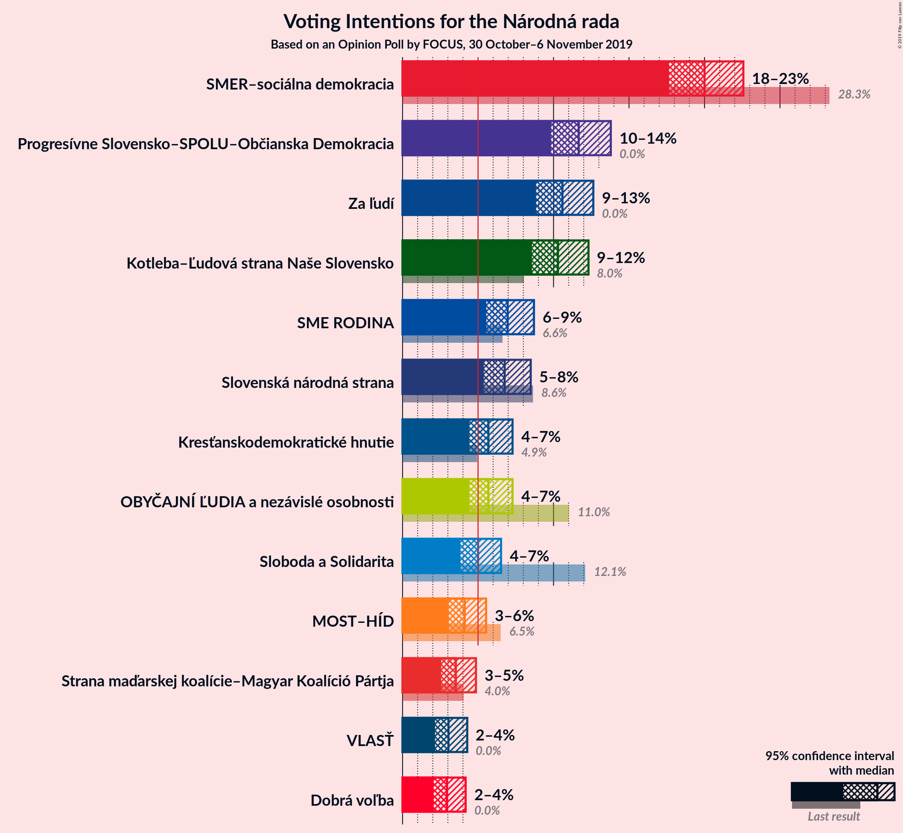

### Confidence Intervals

| Party | Last Result | Poll Result | 80% Confidence Interval | 90% Confidence Interval | 95% Confidence Interval | 99% Confidence Interval |
|:-----:|:-----------:|:-----------:|:-----------------------:|:-----------------------:|:-----------------------:|:-----------------------:|
| SMER–sociálna demokracia | 28.3% | 20.0% | 18.5–21.7% |18.0–22.2% |17.6–22.6% |16.9–23.4% |
| Progresívne Slovensko–SPOLU–Občianska Demokracia | 0.0% | 11.7% | 10.5–13.0% |10.1–13.4% |9.8–13.8% |9.3–14.5% |
| Za ľudí | 0.0% | 10.6% | 9.4–11.9% |9.1–12.3% |8.8–12.6% |8.3–13.3% |
| Kotleba–Ľudová strana Naše Slovensko | 8.0% | 10.3% | 9.2–11.6% |8.8–12.0% |8.6–12.3% |8.1–13.0% |
| SME RODINA | 6.6% | 7.0% | 6.0–8.1% |5.8–8.4% |5.5–8.7% |5.1–9.3% |
| Slovenská národná strana | 8.6% | 6.8% | 5.9–7.9% |5.6–8.2% |5.4–8.5% |5.0–9.1% |
| OBYČAJNÍ ĽUDIA a nezávislé osobnosti | 11.0% | 5.7% | 4.8–6.7% |4.6–7.0% |4.4–7.3% |4.1–7.8% |
| Kresťanskodemokratické hnutie | 4.9% | 5.7% | 4.8–6.7% |4.6–7.0% |4.4–7.3% |4.1–7.8% |
| Sloboda a Solidarita | 12.1% | 5.0% | 4.2–6.0% |4.0–6.3% |3.8–6.5% |3.5–7.0% |
| MOST–HÍD | 6.5% | 4.1% | 3.4–5.0% |3.2–5.3% |3.1–5.5% |2.8–6.0% |
| Strana maďarskej koalície–Magyar Koalíció Pártja | 4.0% | 3.5% | 2.9–4.4% |2.7–4.6% |2.6–4.9% |2.3–5.3% |
| VLASŤ | 0.0% | 3.0% | 2.5–3.9% |2.3–4.1% |2.1–4.3% |1.9–4.7% |
| Dobrá voľba | 0.0% | 2.9% | 2.4–3.7% |2.2–4.0% |2.1–4.2% |1.8–4.6% |

*Note:* The poll result column reflects the actual value used in the calculations. Published results may vary slightly, and in addition be rounded to fewer digits.

## Seats

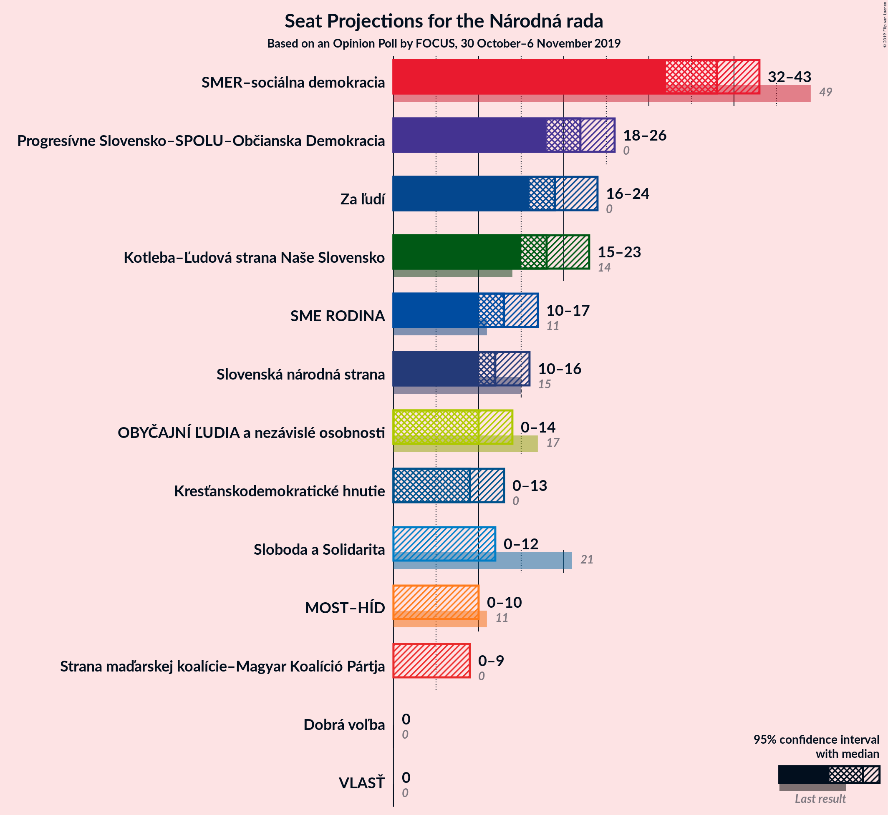

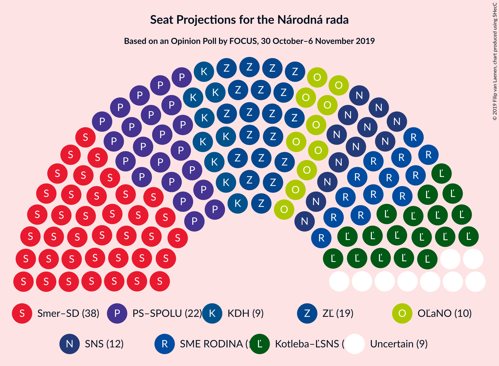

### Confidence Intervals

| Party | Last Result | Median | 80% Confidence Interval | 90% Confidence Interval | 95% Confidence Interval | 99% Confidence Interval |
|:-----:|:-----------:|:------:|:-----------------------:|:-----------------------:|:-----------------------:|:-----------------------:|
| <a href="#smer–sociálna-demokracia">SMER–sociálna demokracia</a> | 49 | 38 | 34–40 |33–42 |32–43 |31–45 |
| <a href="#progresívne-slovensko–spolu–občianska-demokracia">Progresívne Slovensko–SPOLU–Občianska Demokracia</a> | 0 | 22 | 20–24 |20–25 |18–26 |17–30 |
| <a href="#za-ľudí">Za ľudí</a> | 0 | 19 | 18–23 |16–24 |16–24 |15–28 |
| <a href="#kotleba–ľudová-strana-naše-slovensko">Kotleba–Ľudová strana Naše Slovensko</a> | 14 | 18 | 17–21 |16–22 |15–23 |14–24 |
| <a href="#sme-rodina">SME RODINA</a> | 11 | 13 | 10–14 |10–15 |10–17 |0–20 |
| <a href="#slovenská-národná-strana">Slovenská národná strana</a> | 15 | 12 | 11–16 |10–16 |10–16 |0–16 |
| <a href="#obyčajní-ľudia-a-nezávislé-osobnosti">OBYČAJNÍ ĽUDIA a nezávislé osobnosti</a> | 17 | 10 | 9–12 |0–13 |0–14 |0–14 |
| <a href="#kresťanskodemokratické-hnutie">Kresťanskodemokratické hnutie</a> | 0 | 9 | 0–12 |0–13 |0–13 |0–16 |
| <a href="#sloboda-a-solidarita">Sloboda a Solidarita</a> | 21 | 0 | 0–11 |0–11 |0–12 |0–13 |
| <a href="#most–híd">MOST–HÍD</a> | 11 | 0 | 0–9 |0–10 |0–10 |0–11 |
| <a href="#strana-maďarskej-koalície–magyar-koalíció-pártja">Strana maďarskej koalície–Magyar Koalíció Pártja</a> | 0 | 0 | 0 |0 |0–9 |0–10 |
| <a href="#vlasť">VLASŤ</a> | 0 | 0 | 0 |0 |0 |0 |
| <a href="#dobrá-voľba">Dobrá voľba</a> | 0 | 0 | 0 |0 |0 |0 |

### SMER–sociálna demokracia

*For a full overview of the results for this party, see the [SMER–sociálna demokracia](party-smer–sociálnademokracia.html) page.*

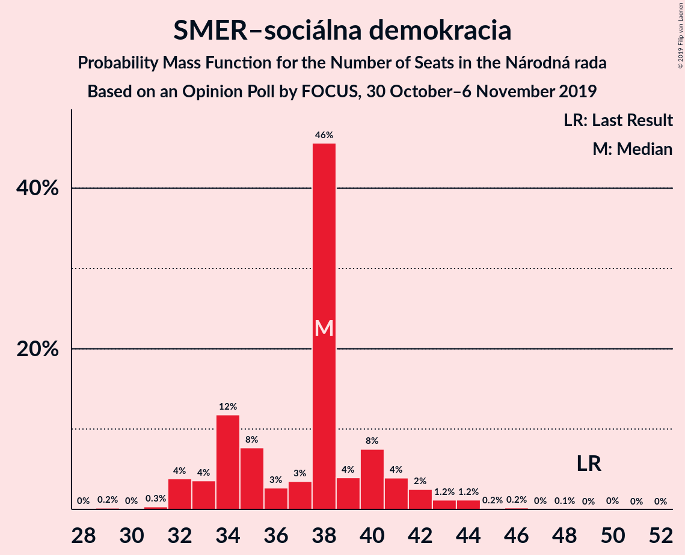

| Number of Seats | Probability | Accumulated | Special Marks |
|:---------------:|:-----------:|:-----------:|:-------------:|
| 29 | 0.2% | 100% |  |
| 30 | 0% | 99.8% |  |
| 31 | 0.3% | 99.7% |  |
| 32 | 4% | 99.4% |  |
| 33 | 4% | 96% |  |
| 34 | 12% | 92% |  |
| 35 | 8% | 80% |  |
| 36 | 3% | 73% |  |
| 37 | 3% | 70% |  |
| 38 | 46% | 66% | Median |
| 39 | 4% | 21% |  |
| 40 | 8% | 17% |  |
| 41 | 4% | 9% |  |
| 42 | 2% | 5% |  |
| 43 | 1.2% | 3% |  |
| 44 | 1.2% | 2% |  |
| 45 | 0.2% | 0.5% |  |
| 46 | 0.2% | 0.4% |  |
| 47 | 0% | 0.2% |  |
| 48 | 0.1% | 0.1% |  |
| 49 | 0% | 0.1% | Last Result |
| 50 | 0% | 0.1% |  |
| 51 | 0% | 0% |  |

### Progresívne Slovensko–SPOLU–Občianska Demokracia

*For a full overview of the results for this party, see the [Progresívne Slovensko–SPOLU–Občianska Demokracia](party-progresívneslovensko–spolu–občianskademokracia.html) page.*

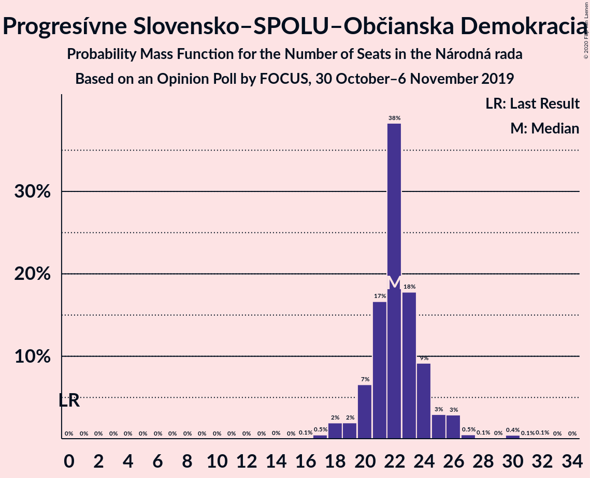

| Number of Seats | Probability | Accumulated | Special Marks |
|:---------------:|:-----------:|:-----------:|:-------------:|
| 0 | 0% | 100% | Last Result |
| 1 | 0% | 100% |  |
| 2 | 0% | 100% |  |
| 3 | 0% | 100% |  |
| 4 | 0% | 100% |  |
| 5 | 0% | 100% |  |
| 6 | 0% | 100% |  |
| 7 | 0% | 100% |  |
| 8 | 0% | 100% |  |
| 9 | 0% | 100% |  |
| 10 | 0% | 100% |  |
| 11 | 0% | 100% |  |
| 12 | 0% | 100% |  |
| 13 | 0% | 100% |  |
| 14 | 0% | 100% |  |
| 15 | 0% | 100% |  |
| 16 | 0.1% | 100% |  |
| 17 | 0.5% | 99.9% |  |
| 18 | 2% | 99.4% |  |
| 19 | 2% | 97% |  |
| 20 | 7% | 96% |  |
| 21 | 17% | 89% |  |
| 22 | 38% | 72% | Median |
| 23 | 18% | 34% |  |
| 24 | 9% | 16% |  |
| 25 | 3% | 7% |  |
| 26 | 3% | 4% |  |
| 27 | 0.5% | 1.3% |  |
| 28 | 0.1% | 0.8% |  |
| 29 | 0% | 0.6% |  |
| 30 | 0.4% | 0.6% |  |
| 31 | 0.1% | 0.2% |  |
| 32 | 0.1% | 0.1% |  |
| 33 | 0% | 0% |  |

### Za ľudí

*For a full overview of the results for this party, see the [Za ľudí](party-zaľudí.html) page.*

| Number of Seats | Probability | Accumulated | Special Marks |
|:---------------:|:-----------:|:-----------:|:-------------:|
| 0 | 0% | 100% | Last Result |
| 1 | 0% | 100% |  |
| 2 | 0% | 100% |  |
| 3 | 0% | 100% |  |
| 4 | 0% | 100% |  |
| 5 | 0% | 100% |  |
| 6 | 0% | 100% |  |
| 7 | 0% | 100% |  |
| 8 | 0% | 100% |  |
| 9 | 0% | 100% |  |
| 10 | 0% | 100% |  |
| 11 | 0% | 100% |  |
| 12 | 0% | 100% |  |
| 13 | 0% | 100% |  |
| 14 | 0.4% | 100% |  |
| 15 | 1.0% | 99.6% |  |
| 16 | 6% | 98.7% |  |
| 17 | 1.1% | 92% |  |
| 18 | 7% | 91% |  |
| 19 | 42% | 84% | Median |
| 20 | 23% | 42% |  |
| 21 | 4% | 19% |  |
| 22 | 4% | 15% |  |
| 23 | 4% | 12% |  |
| 24 | 5% | 7% |  |
| 25 | 0.6% | 2% |  |
| 26 | 0.7% | 2% |  |
| 27 | 0.4% | 1.1% |  |
| 28 | 0.7% | 0.8% |  |
| 29 | 0% | 0% |  |

### Kotleba–Ľudová strana Naše Slovensko

*For a full overview of the results for this party, see the [Kotleba–Ľudová strana Naše Slovensko](party-kotleba–ľudovástrananašeslovensko.html) page.*

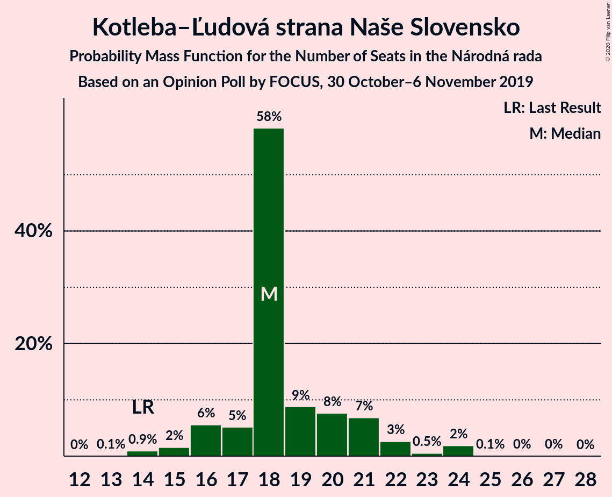

| Number of Seats | Probability | Accumulated | Special Marks |
|:---------------:|:-----------:|:-----------:|:-------------:|
| 13 | 0.1% | 100% |  |
| 14 | 0.9% | 99.9% | Last Result |
| 15 | 2% | 99.0% |  |
| 16 | 6% | 97% |  |
| 17 | 5% | 92% |  |
| 18 | 58% | 87% | Median |
| 19 | 9% | 28% |  |
| 20 | 8% | 20% |  |
| 21 | 7% | 12% |  |
| 22 | 3% | 5% |  |
| 23 | 0.5% | 3% |  |
| 24 | 2% | 2% |  |
| 25 | 0.1% | 0.2% |  |
| 26 | 0% | 0.1% |  |
| 27 | 0% | 0.1% |  |
| 28 | 0% | 0% |  |

### SME RODINA

*For a full overview of the results for this party, see the [SME RODINA](party-smerodina.html) page.*

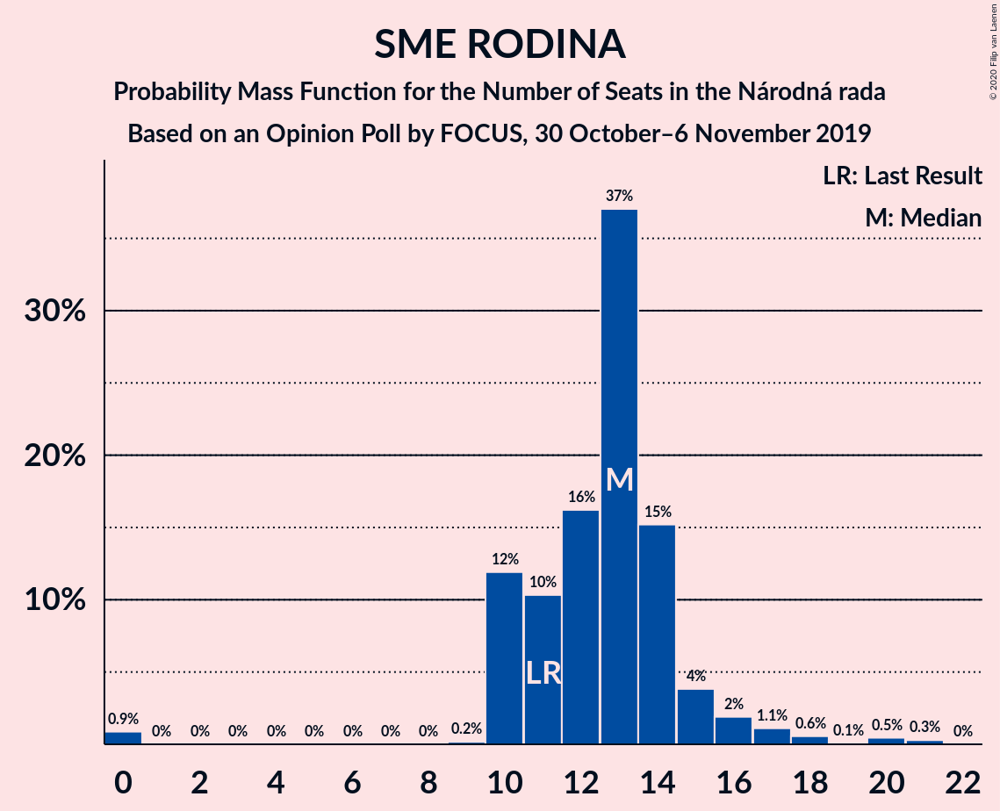

| Number of Seats | Probability | Accumulated | Special Marks |
|:---------------:|:-----------:|:-----------:|:-------------:|
| 0 | 0.9% | 100% |  |
| 1 | 0% | 99.1% |  |
| 2 | 0% | 99.1% |  |
| 3 | 0% | 99.1% |  |
| 4 | 0% | 99.1% |  |
| 5 | 0% | 99.1% |  |
| 6 | 0% | 99.1% |  |
| 7 | 0% | 99.1% |  |
| 8 | 0% | 99.1% |  |
| 9 | 0.2% | 99.1% |  |
| 10 | 12% | 99.0% |  |
| 11 | 10% | 87% | Last Result |
| 12 | 16% | 77% |  |
| 13 | 37% | 60% | Median |
| 14 | 15% | 23% |  |
| 15 | 4% | 8% |  |
| 16 | 2% | 4% |  |
| 17 | 1.1% | 3% |  |
| 18 | 0.6% | 1.4% |  |
| 19 | 0.1% | 0.8% |  |
| 20 | 0.5% | 0.7% |  |
| 21 | 0.3% | 0.3% |  |
| 22 | 0% | 0% |  |

### Slovenská národná strana

*For a full overview of the results for this party, see the [Slovenská národná strana](party-slovenskánárodnástrana.html) page.*

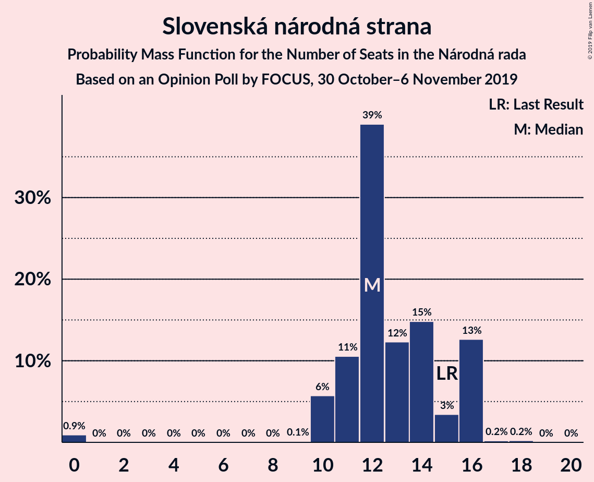

| Number of Seats | Probability | Accumulated | Special Marks |
|:---------------:|:-----------:|:-----------:|:-------------:|
| 0 | 0.9% | 100% |  |
| 1 | 0% | 99.1% |  |
| 2 | 0% | 99.1% |  |
| 3 | 0% | 99.1% |  |
| 4 | 0% | 99.1% |  |
| 5 | 0% | 99.1% |  |
| 6 | 0% | 99.1% |  |
| 7 | 0% | 99.1% |  |
| 8 | 0% | 99.1% |  |
| 9 | 0.1% | 99.1% |  |
| 10 | 6% | 99.0% |  |
| 11 | 11% | 93% |  |
| 12 | 39% | 83% | Median |
| 13 | 12% | 44% |  |
| 14 | 15% | 31% |  |
| 15 | 3% | 17% | Last Result |
| 16 | 13% | 13% |  |
| 17 | 0.2% | 0.5% |  |
| 18 | 0.2% | 0.3% |  |
| 19 | 0% | 0.1% |  |
| 20 | 0% | 0% |  |

### OBYČAJNÍ ĽUDIA a nezávislé osobnosti

*For a full overview of the results for this party, see the [OBYČAJNÍ ĽUDIA a nezávislé osobnosti](party-obyčajníľudiaanezávisléosobnosti.html) page.*

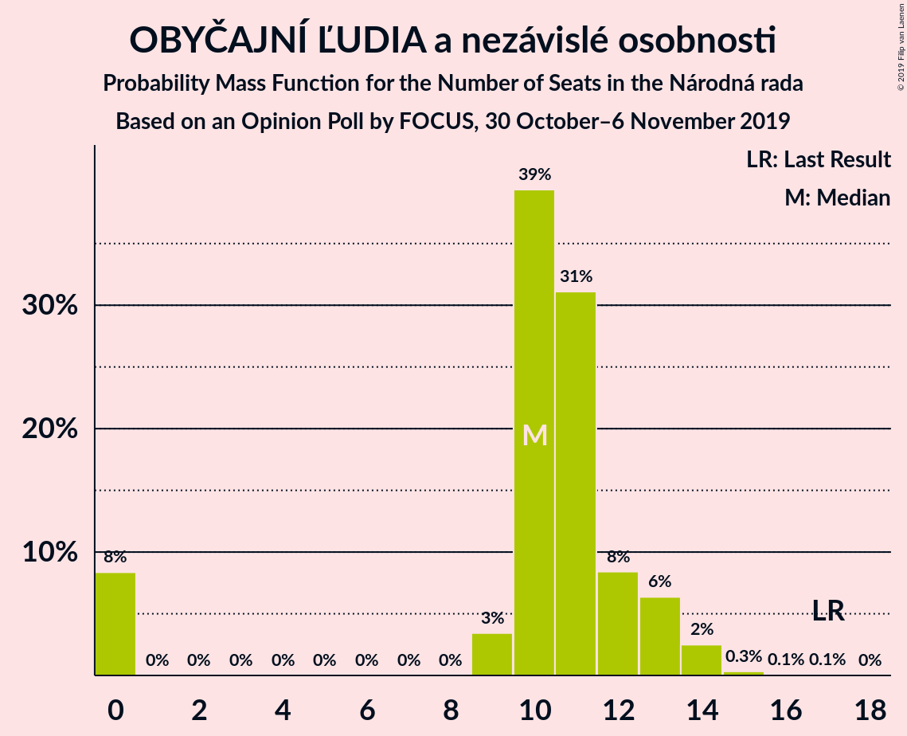

| Number of Seats | Probability | Accumulated | Special Marks |
|:---------------:|:-----------:|:-----------:|:-------------:|
| 0 | 8% | 100% |  |
| 1 | 0% | 92% |  |
| 2 | 0% | 92% |  |
| 3 | 0% | 92% |  |
| 4 | 0% | 92% |  |
| 5 | 0% | 92% |  |
| 6 | 0% | 92% |  |
| 7 | 0% | 92% |  |
| 8 | 0% | 92% |  |
| 9 | 3% | 92% |  |
| 10 | 39% | 88% | Median |
| 11 | 31% | 49% |  |
| 12 | 8% | 18% |  |
| 13 | 6% | 9% |  |
| 14 | 2% | 3% |  |
| 15 | 0.3% | 0.4% |  |
| 16 | 0.1% | 0.1% |  |
| 17 | 0.1% | 0.1% | Last Result |
| 18 | 0% | 0% |  |

### Kresťanskodemokratické hnutie

*For a full overview of the results for this party, see the [Kresťanskodemokratické hnutie](party-kresťanskodemokratickéhnutie.html) page.*

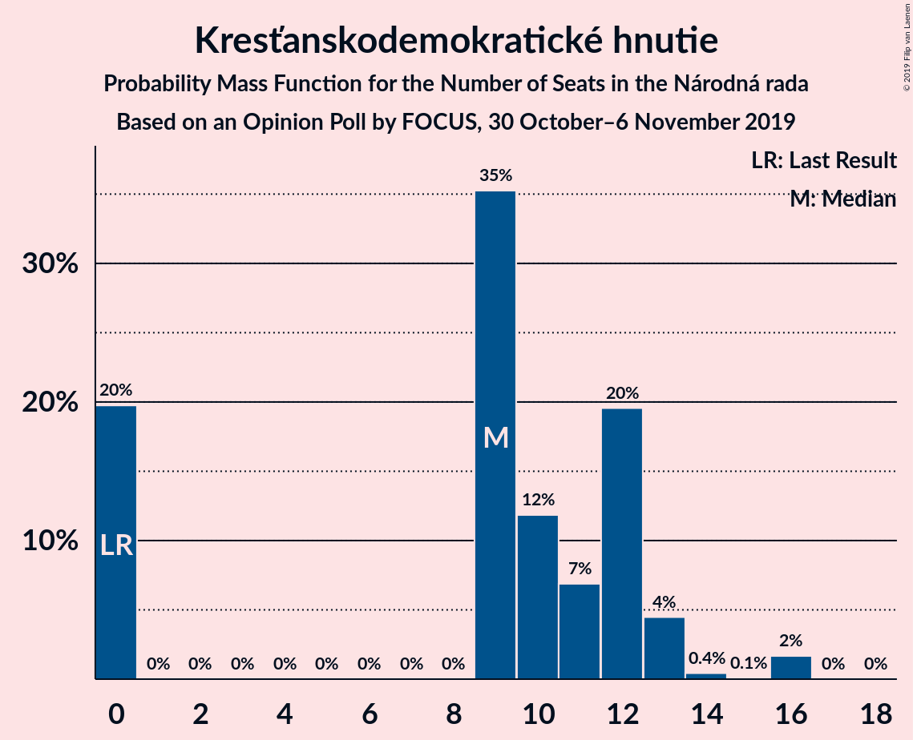

| Number of Seats | Probability | Accumulated | Special Marks |
|:---------------:|:-----------:|:-----------:|:-------------:|
| 0 | 20% | 100% | Last Result |
| 1 | 0% | 80% |  |
| 2 | 0% | 80% |  |
| 3 | 0% | 80% |  |
| 4 | 0% | 80% |  |
| 5 | 0% | 80% |  |
| 6 | 0% | 80% |  |
| 7 | 0% | 80% |  |
| 8 | 0% | 80% |  |
| 9 | 35% | 80% | Median |
| 10 | 12% | 45% |  |
| 11 | 7% | 33% |  |
| 12 | 20% | 26% |  |
| 13 | 4% | 7% |  |
| 14 | 0.4% | 2% |  |
| 15 | 0.1% | 2% |  |
| 16 | 2% | 2% |  |
| 17 | 0% | 0% |  |

### Sloboda a Solidarita

*For a full overview of the results for this party, see the [Sloboda a Solidarita](party-slobodaasolidarita.html) page.*

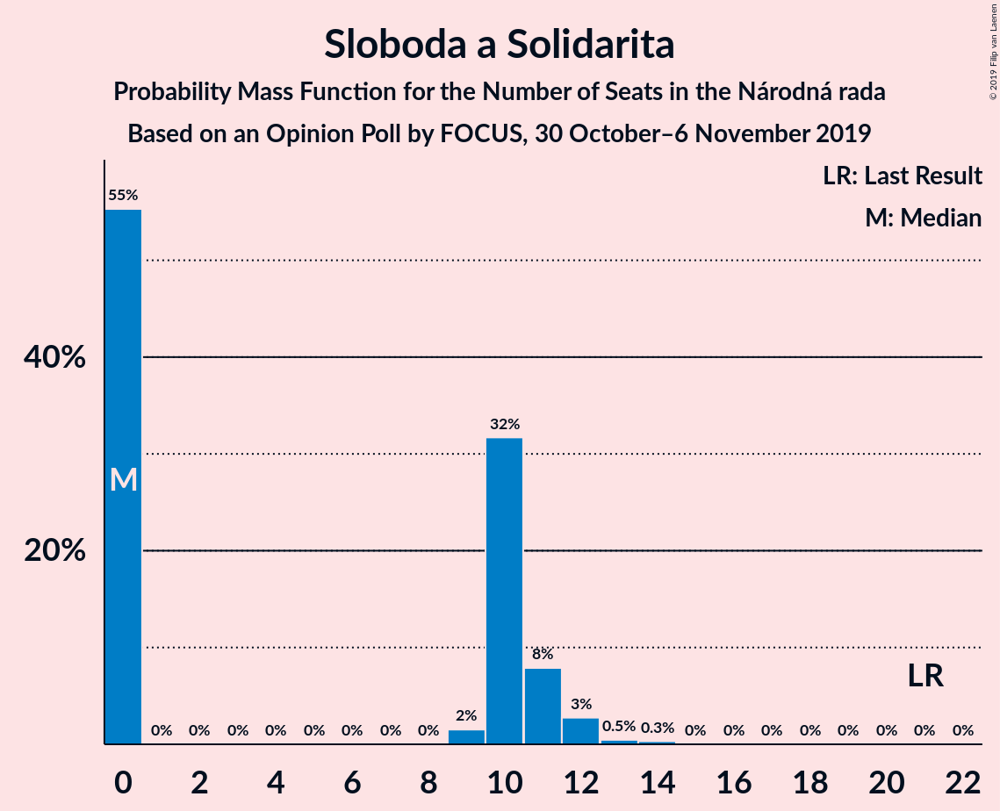

| Number of Seats | Probability | Accumulated | Special Marks |
|:---------------:|:-----------:|:-----------:|:-------------:|
| 0 | 55% | 100% | Median |
| 1 | 0% | 45% |  |
| 2 | 0% | 45% |  |
| 3 | 0% | 45% |  |
| 4 | 0% | 45% |  |
| 5 | 0% | 45% |  |
| 6 | 0% | 45% |  |
| 7 | 0% | 45% |  |
| 8 | 0% | 45% |  |
| 9 | 2% | 45% |  |
| 10 | 32% | 43% |  |
| 11 | 8% | 11% |  |
| 12 | 3% | 4% |  |
| 13 | 0.5% | 0.8% |  |
| 14 | 0.3% | 0.3% |  |
| 15 | 0% | 0% |  |
| 16 | 0% | 0% |  |
| 17 | 0% | 0% |  |
| 18 | 0% | 0% |  |
| 19 | 0% | 0% |  |
| 20 | 0% | 0% |  |
| 21 | 0% | 0% | Last Result |

### MOST–HÍD

*For a full overview of the results for this party, see the [MOST–HÍD](party-most–híd.html) page.*

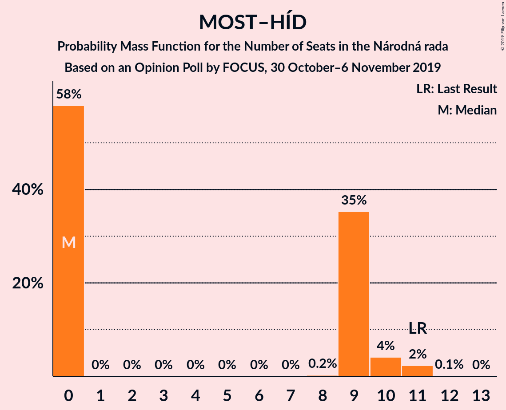

| Number of Seats | Probability | Accumulated | Special Marks |
|:---------------:|:-----------:|:-----------:|:-------------:|
| 0 | 58% | 100% | Median |
| 1 | 0% | 42% |  |
| 2 | 0% | 42% |  |
| 3 | 0% | 42% |  |
| 4 | 0% | 42% |  |
| 5 | 0% | 42% |  |
| 6 | 0% | 42% |  |
| 7 | 0% | 42% |  |
| 8 | 0.2% | 42% |  |
| 9 | 35% | 42% |  |
| 10 | 4% | 7% |  |
| 11 | 2% | 2% | Last Result |
| 12 | 0.1% | 0.1% |  |
| 13 | 0% | 0% |  |

### Strana maďarskej koalície–Magyar Koalíció Pártja

*For a full overview of the results for this party, see the [Strana maďarskej koalície–Magyar Koalíció Pártja](party-stranamaďarskejkoalície–magyarkoalíciópártja.html) page.*

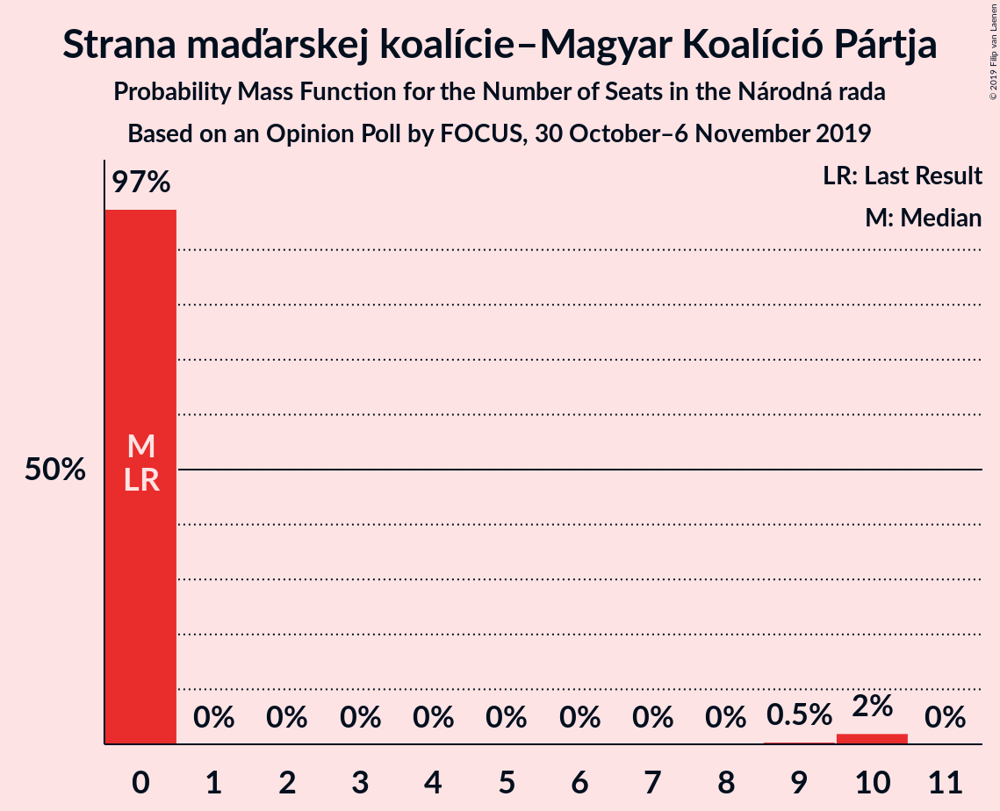

| Number of Seats | Probability | Accumulated | Special Marks |
|:---------------:|:-----------:|:-----------:|:-------------:|
| 0 | 97% | 100% | Last Result, Median |
| 1 | 0% | 3% |  |
| 2 | 0% | 3% |  |
| 3 | 0% | 3% |  |
| 4 | 0% | 3% |  |
| 5 | 0% | 3% |  |
| 6 | 0% | 3% |  |
| 7 | 0% | 3% |  |
| 8 | 0% | 3% |  |
| 9 | 0.5% | 3% |  |
| 10 | 2% | 2% |  |
| 11 | 0% | 0% |  |

### VLASŤ

*For a full overview of the results for this party, see the [VLASŤ](party-vlasť.html) page.*

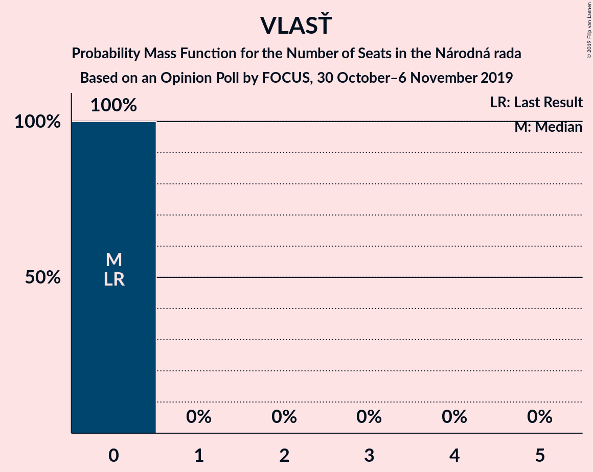

| Number of Seats | Probability | Accumulated | Special Marks |
|:---------------:|:-----------:|:-----------:|:-------------:|
| 0 | 100% | 100% | Last Result, Median |

### Dobrá voľba

*For a full overview of the results for this party, see the [Dobrá voľba](party-dobrávoľba.html) page.*

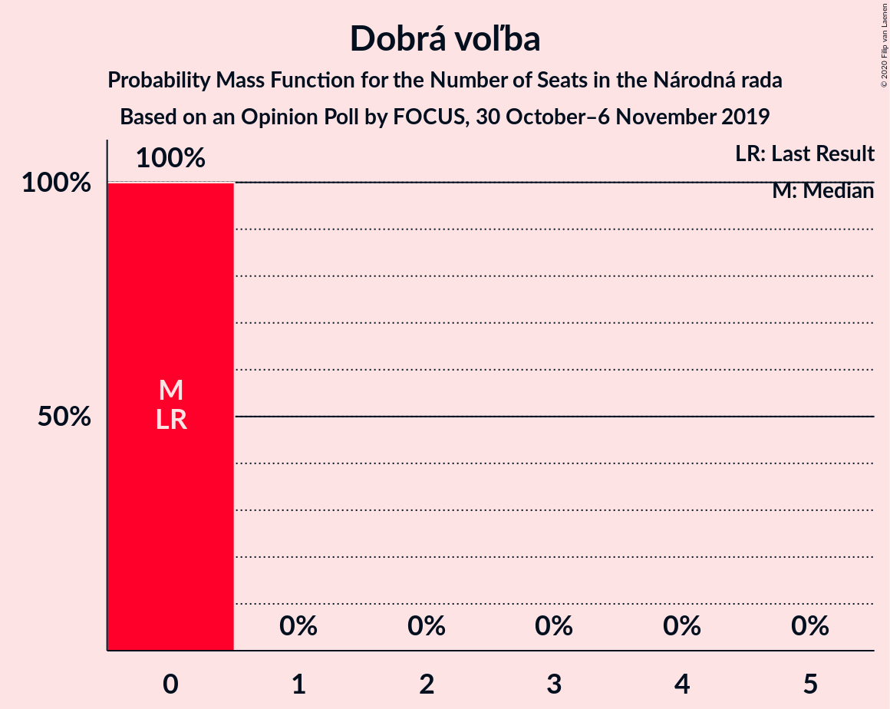

| Number of Seats | Probability | Accumulated | Special Marks |
|:---------------:|:-----------:|:-----------:|:-------------:|
| 0 | 100% | 100% | Last Result, Median |

## Coalitions

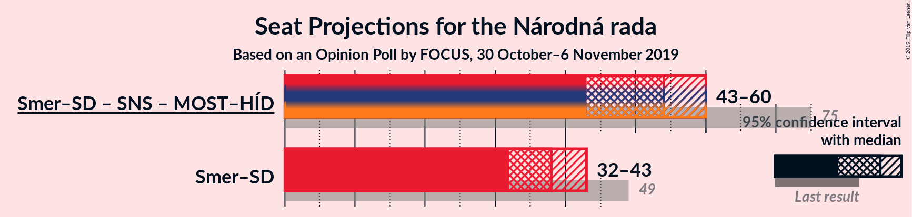

### Confidence Intervals

| Coalition | Last Result | Median | Majority? | 80% Confidence Interval | 90% Confidence Interval | 95% Confidence Interval | 99% Confidence Interval |
|:---------:|:-----------:|:------:|:---------:|:-----------------------:|:-----------------------:|:-----------------------:|:-----------------------:|
| SMER–sociálna demokracia – Slovenská národná strana – MOST–HÍD | 75 | 54 | 0% | 47–59 | 45–59 | 43–60 | 42–63 |
| SMER–sociálna demokracia | 49 | 38 | 0% | 34–40 | 33–42 | 32–43 | 31–45 |

### SMER–sociálna demokracia – Slovenská národná strana – MOST–HÍD

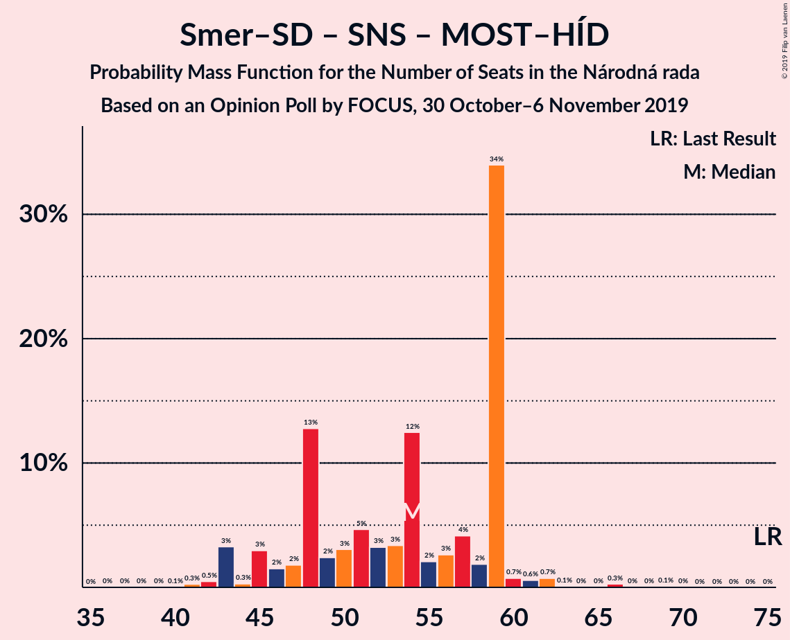

| Number of Seats | Probability | Accumulated | Special Marks |
|:---------------:|:-----------:|:-----------:|:-------------:|
| 40 | 0.1% | 100% |  |
| 41 | 0.3% | 99.9% |  |
| 42 | 0.5% | 99.6% |  |
| 43 | 3% | 99.2% |  |
| 44 | 0.3% | 96% |  |
| 45 | 3% | 96% |  |
| 46 | 2% | 93% |  |
| 47 | 2% | 91% |  |
| 48 | 13% | 89% |  |
| 49 | 2% | 77% |  |
| 50 | 3% | 74% | Median |
| 51 | 5% | 71% |  |
| 52 | 3% | 66% |  |
| 53 | 3% | 63% |  |
| 54 | 12% | 60% |  |
| 55 | 2% | 47% |  |
| 56 | 3% | 45% |  |
| 57 | 4% | 43% |  |
| 58 | 2% | 38% |  |
| 59 | 34% | 37% |  |
| 60 | 0.7% | 3% |  |
| 61 | 0.6% | 2% |  |
| 62 | 0.7% | 1.3% |  |
| 63 | 0.1% | 0.6% |  |
| 64 | 0% | 0.5% |  |
| 65 | 0% | 0.5% |  |
| 66 | 0.3% | 0.4% |  |
| 67 | 0% | 0.1% |  |
| 68 | 0% | 0.1% |  |
| 69 | 0.1% | 0.1% |  |
| 70 | 0% | 0% |  |
| 71 | 0% | 0% |  |
| 72 | 0% | 0% |  |
| 73 | 0% | 0% |  |
| 74 | 0% | 0% |  |
| 75 | 0% | 0% | Last Result |

### SMER–sociálna demokracia

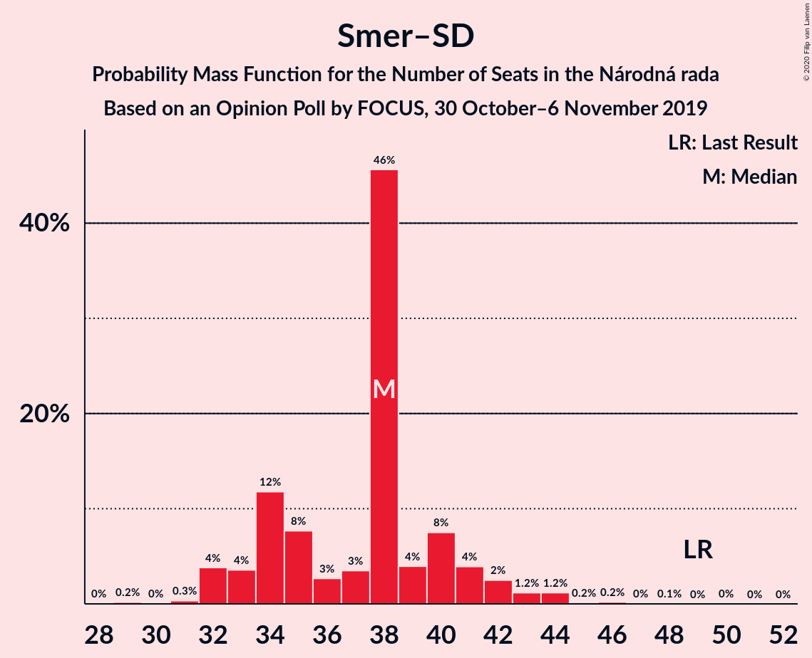

| Number of Seats | Probability | Accumulated | Special Marks |
|:---------------:|:-----------:|:-----------:|:-------------:|
| 29 | 0.2% | 100% |  |
| 30 | 0% | 99.8% |  |
| 31 | 0.3% | 99.7% |  |
| 32 | 4% | 99.4% |  |
| 33 | 4% | 96% |  |
| 34 | 12% | 92% |  |
| 35 | 8% | 80% |  |
| 36 | 3% | 73% |  |
| 37 | 3% | 70% |  |
| 38 | 46% | 66% | Median |
| 39 | 4% | 21% |  |
| 40 | 8% | 17% |  |
| 41 | 4% | 9% |  |
| 42 | 2% | 5% |  |
| 43 | 1.2% | 3% |  |
| 44 | 1.2% | 2% |  |
| 45 | 0.2% | 0.5% |  |
| 46 | 0.2% | 0.4% |  |
| 47 | 0% | 0.2% |  |
| 48 | 0.1% | 0.1% |  |
| 49 | 0% | 0.1% | Last Result |
| 50 | 0% | 0.1% |  |
| 51 | 0% | 0% |  |

## Technical Information

### Opinion Poll

+ **Polling firm:** FOCUS
+ **Commissioner(s):** —
+ **Fieldwork period:** 30 October–6 November 2019

### Calculations

+ **Sample size:** 1020
+ **Simulations done:** 1,048,576
+ **Error estimate:** 2.18%

