# Opinion Poll by FOCUS, 30 October–6 November 2019

<a href="#voting-intentions">Voting Intentions</a> | <a href="#seats">Seats</a> | <a href="#coalitions">Coalitions</a> | <a href="#technical-information">Technical Information</a>

## Voting Intentions

### Confidence Intervals

| Party | Last Result | Poll Result | 80% Confidence Interval | 90% Confidence Interval | 95% Confidence Interval | 99% Confidence Interval |
|:-----:|:-----------:|:-----------:|:-----------------------:|:-----------------------:|:-----------------------:|:-----------------------:|
| SMER–sociálna demokracia | 28.3% | 20.0% | 18.5–21.7% |18.0–22.2% |17.6–22.6% |16.9–23.4% |
| Progresívne Slovensko–SPOLU–Občianska Demokracia | 0.0% | 11.7% | 10.5–13.0% |10.1–13.4% |9.8–13.8% |9.3–14.5% |
| Za ľudí | 0.0% | 10.6% | 9.4–11.9% |9.1–12.3% |8.8–12.6% |8.3–13.3% |
| Kotleba–Ľudová strana Naše Slovensko | 8.0% | 10.3% | 9.2–11.6% |8.8–12.0% |8.6–12.3% |8.1–13.0% |
| SME RODINA | 6.6% | 7.0% | 6.0–8.1% |5.8–8.4% |5.5–8.7% |5.1–9.3% |
| Slovenská národná strana | 8.6% | 6.8% | 5.9–7.9% |5.6–8.2% |5.4–8.5% |5.0–9.1% |
| OBYČAJNÍ ĽUDIA a nezávislé osobnosti | 11.0% | 5.7% | 4.8–6.7% |4.6–7.0% |4.4–7.3% |4.1–7.8% |
| Kresťanskodemokratické hnutie | 4.9% | 5.7% | 4.8–6.7% |4.6–7.0% |4.4–7.3% |4.1–7.8% |
| Sloboda a Solidarita | 12.1% | 5.0% | 4.2–6.0% |4.0–6.3% |3.8–6.5% |3.5–7.0% |
| MOST–HÍD | 6.5% | 4.1% | 3.4–5.0% |3.2–5.3% |3.1–5.5% |2.8–6.0% |
| Strana maďarskej koalície–Magyar Koalíció Pártja | 4.0% | 3.5% | 2.9–4.4% |2.7–4.6% |2.6–4.9% |2.3–5.3% |
| VLASŤ | 0.0% | 3.0% | 2.5–3.9% |2.3–4.1% |2.1–4.3% |1.9–4.7% |
| Dobrá voľba | 0.0% | 2.9% | 2.4–3.7% |2.2–4.0% |2.1–4.2% |1.8–4.6% |

*Note:* The poll result column reflects the actual value used in the calculations. Published results may vary slightly, and in addition be rounded to fewer digits.

## Seats

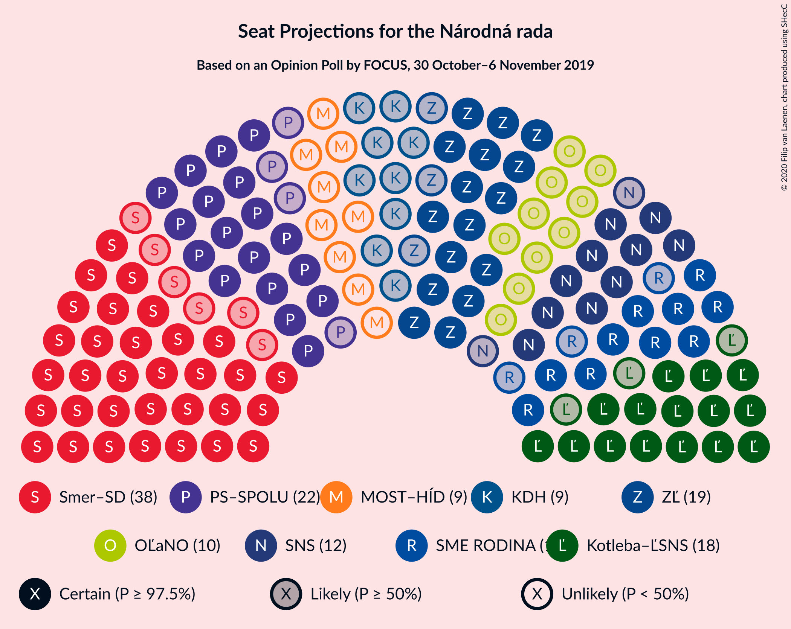

### Confidence Intervals

| Party | Last Result | Median | 80% Confidence Interval | 90% Confidence Interval | 95% Confidence Interval | 99% Confidence Interval |
|:-----:|:-----------:|:------:|:-----------------------:|:-----------------------:|:-----------------------:|:-----------------------:|
| <a href="#smer–sociálna-demokracia">SMER–sociálna demokracia</a> | 49 | 38 | 34–40 |33–42 |32–43 |31–45 |
| <a href="#progresívne-slovensko–spolu–občianska-demokracia">Progresívne Slovensko–SPOLU–Občianska Demokracia</a> | 0 | 22 | 20–24 |20–25 |18–26 |17–30 |
| <a href="#za-ľudí">Za ľudí</a> | 0 | 19 | 18–23 |16–24 |16–24 |15–28 |
| <a href="#kotleba–ľudová-strana-naše-slovensko">Kotleba–Ľudová strana Naše Slovensko</a> | 14 | 18 | 17–21 |16–22 |15–23 |14–24 |
| <a href="#sme-rodina">SME RODINA</a> | 11 | 13 | 10–14 |10–15 |10–17 |0–20 |
| <a href="#slovenská-národná-strana">Slovenská národná strana</a> | 15 | 12 | 11–16 |10–16 |10–16 |0–16 |
| <a href="#obyčajní-ľudia-a-nezávislé-osobnosti">OBYČAJNÍ ĽUDIA a nezávislé osobnosti</a> | 17 | 10 | 9–12 |0–13 |0–14 |0–14 |
| <a href="#kresťanskodemokratické-hnutie">Kresťanskodemokratické hnutie</a> | 0 | 9 | 0–12 |0–13 |0–13 |0–16 |
| <a href="#sloboda-a-solidarita">Sloboda a Solidarita</a> | 21 | 0 | 0–11 |0–11 |0–12 |0–13 |
| <a href="#most–híd">MOST–HÍD</a> | 11 | 0 | 0–9 |0–10 |0–10 |0–11 |
| <a href="#strana-maďarskej-koalície–magyar-koalíció-pártja">Strana maďarskej koalície–Magyar Koalíció Pártja</a> | 0 | 0 | 0 |0 |0–9 |0–10 |
| <a href="#vlasť">VLASŤ</a> | 0 | 0 | 0 |0 |0 |0 |
| <a href="#dobrá-voľba">Dobrá voľba</a> | 0 | 0 | 0 |0 |0 |0 |

### SMER–sociálna demokracia

*For a full overview of the results for this party, see the [SMER–sociálna demokracia](party-smer–sociálnademokracia.html) page.*

| Number of Seats | Probability | Accumulated | Special Marks |
|:---------------:|:-----------:|:-----------:|:-------------:|
| 29 | 0.2% | 100% |  |
| 30 | 0% | 99.8% |  |
| 31 | 0.3% | 99.7% |  |
| 32 | 4% | 99.4% |  |
| 33 | 4% | 96% |  |
| 34 | 12% | 92% |  |
| 35 | 8% | 80% |  |
| 36 | 3% | 73% |  |
| 37 | 3% | 70% |  |
| 38 | 46% | 66% | Median |
| 39 | 4% | 21% |  |
| 40 | 8% | 17% |  |
| 41 | 4% | 9% |  |
| 42 | 2% | 5% |  |
| 43 | 1.2% | 3% |  |
| 44 | 1.2% | 2% |  |
| 45 | 0.2% | 0.5% |  |
| 46 | 0.2% | 0.4% |  |
| 47 | 0% | 0.2% |  |
| 48 | 0.1% | 0.1% |  |
| 49 | 0% | 0.1% | Last Result |
| 50 | 0% | 0.1% |  |
| 51 | 0% | 0% |  |

### Progresívne Slovensko–SPOLU–Občianska Demokracia

*For a full overview of the results for this party, see the [Progresívne Slovensko–SPOLU–Občianska Demokracia](party-progresívneslovensko–spolu–občianskademokracia.html) page.*

| Number of Seats | Probability | Accumulated | Special Marks |
|:---------------:|:-----------:|:-----------:|:-------------:|
| 0 | 0% | 100% | Last Result |
| 1 | 0% | 100% |  |
| 2 | 0% | 100% |  |
| 3 | 0% | 100% |  |
| 4 | 0% | 100% |  |
| 5 | 0% | 100% |  |
| 6 | 0% | 100% |  |
| 7 | 0% | 100% |  |
| 8 | 0% | 100% |  |
| 9 | 0% | 100% |  |
| 10 | 0% | 100% |  |
| 11 | 0% | 100% |  |
| 12 | 0% | 100% |  |
| 13 | 0% | 100% |  |
| 14 | 0% | 100% |  |
| 15 | 0% | 100% |  |
| 16 | 0.1% | 100% |  |
| 17 | 0.5% | 99.9% |  |
| 18 | 2% | 99.4% |  |
| 19 | 2% | 97% |  |
| 20 | 7% | 96% |  |
| 21 | 17% | 89% |  |
| 22 | 38% | 72% | Median |
| 23 | 18% | 34% |  |
| 24 | 9% | 16% |  |
| 25 | 3% | 7% |  |
| 26 | 3% | 4% |  |
| 27 | 0.5% | 1.3% |  |
| 28 | 0.1% | 0.8% |  |
| 29 | 0% | 0.6% |  |
| 30 | 0.4% | 0.6% |  |
| 31 | 0.1% | 0.2% |  |
| 32 | 0.1% | 0.1% |  |
| 33 | 0% | 0% |  |

### Za ľudí

*For a full overview of the results for this party, see the [Za ľudí](party-zaľudí.html) page.*

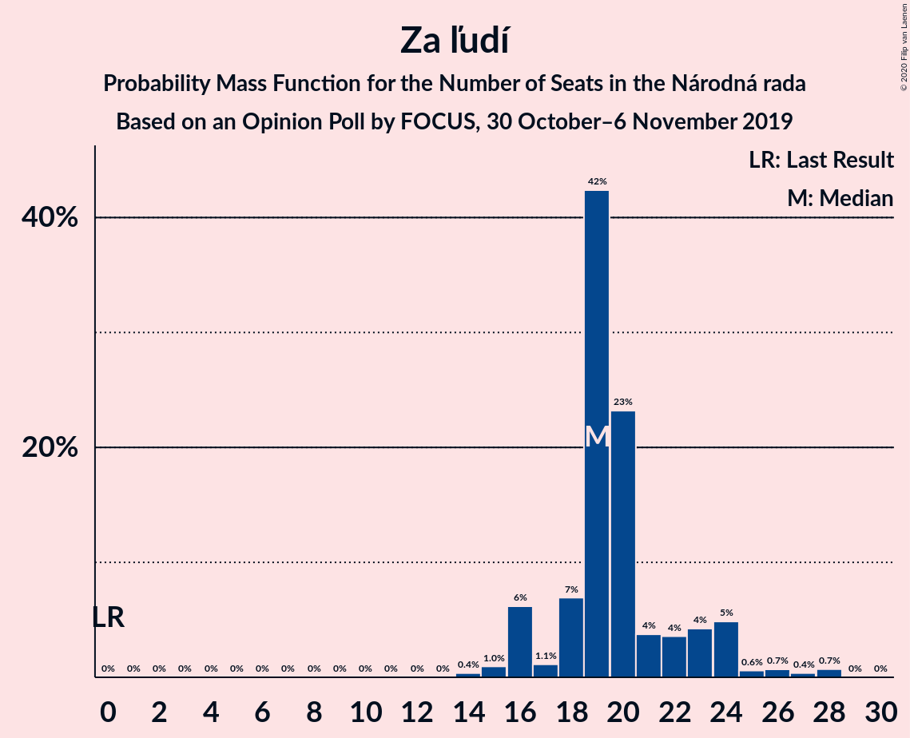

| Number of Seats | Probability | Accumulated | Special Marks |
|:---------------:|:-----------:|:-----------:|:-------------:|
| 0 | 0% | 100% | Last Result |
| 1 | 0% | 100% |  |
| 2 | 0% | 100% |  |
| 3 | 0% | 100% |  |
| 4 | 0% | 100% |  |
| 5 | 0% | 100% |  |
| 6 | 0% | 100% |  |
| 7 | 0% | 100% |  |
| 8 | 0% | 100% |  |
| 9 | 0% | 100% |  |
| 10 | 0% | 100% |  |
| 11 | 0% | 100% |  |
| 12 | 0% | 100% |  |
| 13 | 0% | 100% |  |
| 14 | 0.4% | 100% |  |
| 15 | 1.0% | 99.6% |  |
| 16 | 6% | 98.7% |  |
| 17 | 1.1% | 92% |  |
| 18 | 7% | 91% |  |
| 19 | 42% | 84% | Median |
| 20 | 23% | 42% |  |
| 21 | 4% | 19% |  |
| 22 | 4% | 15% |  |
| 23 | 4% | 12% |  |
| 24 | 5% | 7% |  |
| 25 | 0.6% | 2% |  |
| 26 | 0.7% | 2% |  |
| 27 | 0.4% | 1.1% |  |
| 28 | 0.7% | 0.8% |  |
| 29 | 0% | 0% |  |

### Kotleba–Ľudová strana Naše Slovensko

*For a full overview of the results for this party, see the [Kotleba–Ľudová strana Naše Slovensko](party-kotleba–ľudovástrananašeslovensko.html) page.*

| Number of Seats | Probability | Accumulated | Special Marks |
|:---------------:|:-----------:|:-----------:|:-------------:|
| 13 | 0.1% | 100% |  |
| 14 | 0.9% | 99.9% | Last Result |
| 15 | 2% | 99.0% |  |
| 16 | 6% | 97% |  |
| 17 | 5% | 92% |  |
| 18 | 58% | 87% | Median |
| 19 | 9% | 28% |  |
| 20 | 8% | 20% |  |
| 21 | 7% | 12% |  |
| 22 | 3% | 5% |  |
| 23 | 0.5% | 3% |  |
| 24 | 2% | 2% |  |
| 25 | 0.1% | 0.2% |  |
| 26 | 0% | 0.1% |  |
| 27 | 0% | 0.1% |  |
| 28 | 0% | 0% |  |

### SME RODINA

*For a full overview of the results for this party, see the [SME RODINA](party-smerodina.html) page.*

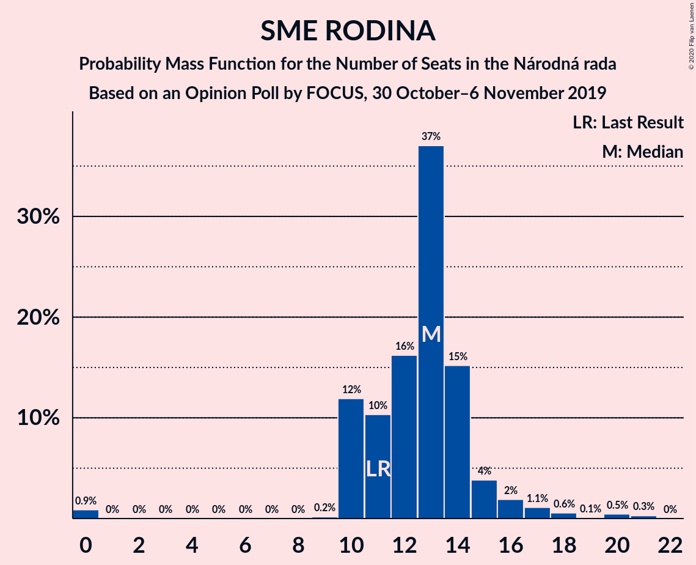

| Number of Seats | Probability | Accumulated | Special Marks |
|:---------------:|:-----------:|:-----------:|:-------------:|
| 0 | 0.9% | 100% |  |
| 1 | 0% | 99.1% |  |
| 2 | 0% | 99.1% |  |
| 3 | 0% | 99.1% |  |
| 4 | 0% | 99.1% |  |
| 5 | 0% | 99.1% |  |
| 6 | 0% | 99.1% |  |
| 7 | 0% | 99.1% |  |
| 8 | 0% | 99.1% |  |
| 9 | 0.2% | 99.1% |  |
| 10 | 12% | 99.0% |  |
| 11 | 10% | 87% | Last Result |
| 12 | 16% | 77% |  |
| 13 | 37% | 60% | Median |
| 14 | 15% | 23% |  |
| 15 | 4% | 8% |  |
| 16 | 2% | 4% |  |
| 17 | 1.1% | 3% |  |
| 18 | 0.6% | 1.4% |  |
| 19 | 0.1% | 0.8% |  |
| 20 | 0.5% | 0.7% |  |
| 21 | 0.3% | 0.3% |  |
| 22 | 0% | 0% |  |

### Slovenská národná strana

*For a full overview of the results for this party, see the [Slovenská národná strana](party-slovenskánárodnástrana.html) page.*

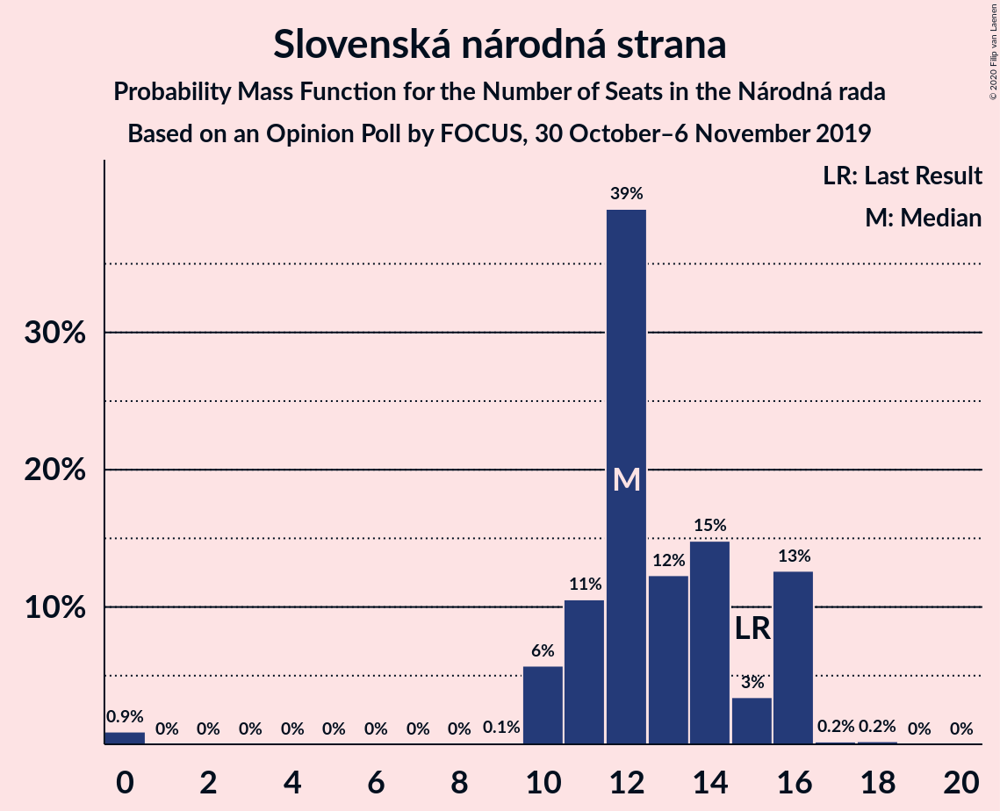

| Number of Seats | Probability | Accumulated | Special Marks |
|:---------------:|:-----------:|:-----------:|:-------------:|
| 0 | 0.9% | 100% |  |
| 1 | 0% | 99.1% |  |
| 2 | 0% | 99.1% |  |
| 3 | 0% | 99.1% |  |
| 4 | 0% | 99.1% |  |
| 5 | 0% | 99.1% |  |
| 6 | 0% | 99.1% |  |
| 7 | 0% | 99.1% |  |
| 8 | 0% | 99.1% |  |
| 9 | 0.1% | 99.1% |  |
| 10 | 6% | 99.0% |  |
| 11 | 11% | 93% |  |
| 12 | 39% | 83% | Median |
| 13 | 12% | 44% |  |
| 14 | 15% | 31% |  |
| 15 | 3% | 17% | Last Result |
| 16 | 13% | 13% |  |
| 17 | 0.2% | 0.5% |  |
| 18 | 0.2% | 0.3% |  |
| 19 | 0% | 0.1% |  |
| 20 | 0% | 0% |  |

### OBYČAJNÍ ĽUDIA a nezávislé osobnosti

*For a full overview of the results for this party, see the [OBYČAJNÍ ĽUDIA a nezávislé osobnosti](party-obyčajníľudiaanezávisléosobnosti.html) page.*

| Number of Seats | Probability | Accumulated | Special Marks |
|:---------------:|:-----------:|:-----------:|:-------------:|
| 0 | 8% | 100% |  |
| 1 | 0% | 92% |  |
| 2 | 0% | 92% |  |
| 3 | 0% | 92% |  |
| 4 | 0% | 92% |  |
| 5 | 0% | 92% |  |
| 6 | 0% | 92% |  |
| 7 | 0% | 92% |  |
| 8 | 0% | 92% |  |
| 9 | 3% | 92% |  |
| 10 | 39% | 88% | Median |
| 11 | 31% | 49% |  |
| 12 | 8% | 18% |  |
| 13 | 6% | 9% |  |
| 14 | 2% | 3% |  |
| 15 | 0.3% | 0.4% |  |
| 16 | 0.1% | 0.1% |  |
| 17 | 0.1% | 0.1% | Last Result |
| 18 | 0% | 0% |  |

### Kresťanskodemokratické hnutie

*For a full overview of the results for this party, see the [Kresťanskodemokratické hnutie](party-kresťanskodemokratickéhnutie.html) page.*

| Number of Seats | Probability | Accumulated | Special Marks |
|:---------------:|:-----------:|:-----------:|:-------------:|
| 0 | 20% | 100% | Last Result |
| 1 | 0% | 80% |  |
| 2 | 0% | 80% |  |
| 3 | 0% | 80% |  |
| 4 | 0% | 80% |  |
| 5 | 0% | 80% |  |
| 6 | 0% | 80% |  |
| 7 | 0% | 80% |  |
| 8 | 0% | 80% |  |
| 9 | 35% | 80% | Median |
| 10 | 12% | 45% |  |
| 11 | 7% | 33% |  |
| 12 | 20% | 26% |  |
| 13 | 4% | 7% |  |
| 14 | 0.4% | 2% |  |
| 15 | 0.1% | 2% |  |
| 16 | 2% | 2% |  |
| 17 | 0% | 0% |  |

### Sloboda a Solidarita

*For a full overview of the results for this party, see the [Sloboda a Solidarita](party-slobodaasolidarita.html) page.*

| Number of Seats | Probability | Accumulated | Special Marks |
|:---------------:|:-----------:|:-----------:|:-------------:|
| 0 | 55% | 100% | Median |
| 1 | 0% | 45% |  |
| 2 | 0% | 45% |  |
| 3 | 0% | 45% |  |
| 4 | 0% | 45% |  |
| 5 | 0% | 45% |  |
| 6 | 0% | 45% |  |
| 7 | 0% | 45% |  |
| 8 | 0% | 45% |  |
| 9 | 2% | 45% |  |
| 10 | 32% | 43% |  |
| 11 | 8% | 11% |  |
| 12 | 3% | 4% |  |
| 13 | 0.5% | 0.8% |  |
| 14 | 0.3% | 0.3% |  |
| 15 | 0% | 0% |  |
| 16 | 0% | 0% |  |
| 17 | 0% | 0% |  |
| 18 | 0% | 0% |  |
| 19 | 0% | 0% |  |
| 20 | 0% | 0% |  |
| 21 | 0% | 0% | Last Result |

### MOST–HÍD

*For a full overview of the results for this party, see the [MOST–HÍD](party-most–híd.html) page.*

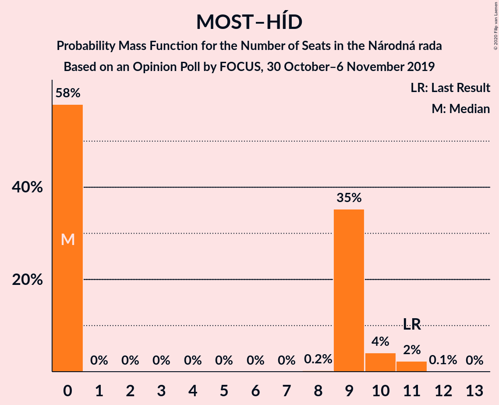

| Number of Seats | Probability | Accumulated | Special Marks |
|:---------------:|:-----------:|:-----------:|:-------------:|
| 0 | 58% | 100% | Median |
| 1 | 0% | 42% |  |
| 2 | 0% | 42% |  |
| 3 | 0% | 42% |  |
| 4 | 0% | 42% |  |
| 5 | 0% | 42% |  |
| 6 | 0% | 42% |  |
| 7 | 0% | 42% |  |
| 8 | 0.2% | 42% |  |
| 9 | 35% | 42% |  |
| 10 | 4% | 7% |  |
| 11 | 2% | 2% | Last Result |
| 12 | 0.1% | 0.1% |  |
| 13 | 0% | 0% |  |

### Strana maďarskej koalície–Magyar Koalíció Pártja

*For a full overview of the results for this party, see the [Strana maďarskej koalície–Magyar Koalíció Pártja](party-stranamaďarskejkoalície–magyarkoalíciópártja.html) page.*

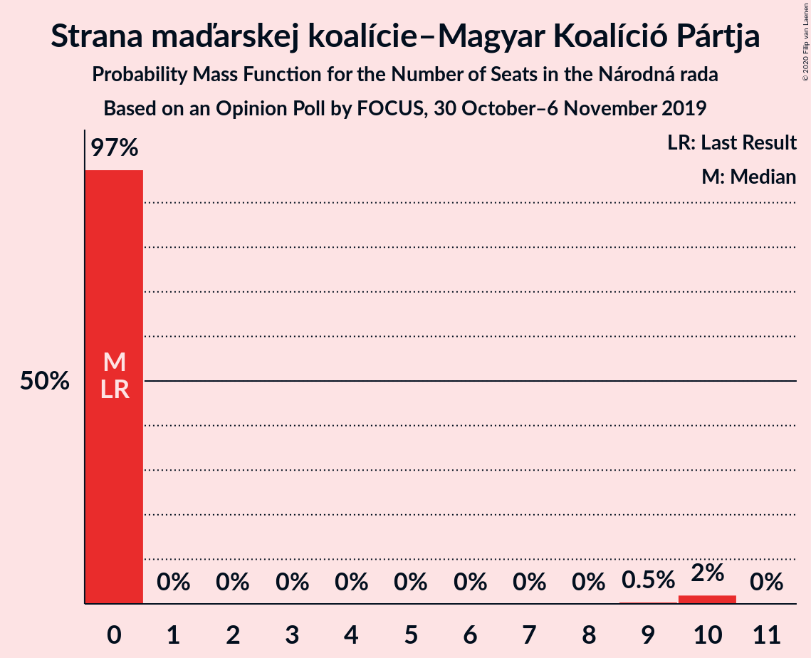

| Number of Seats | Probability | Accumulated | Special Marks |
|:---------------:|:-----------:|:-----------:|:-------------:|
| 0 | 97% | 100% | Last Result, Median |
| 1 | 0% | 3% |  |
| 2 | 0% | 3% |  |
| 3 | 0% | 3% |  |
| 4 | 0% | 3% |  |
| 5 | 0% | 3% |  |
| 6 | 0% | 3% |  |
| 7 | 0% | 3% |  |
| 8 | 0% | 3% |  |
| 9 | 0.5% | 3% |  |
| 10 | 2% | 2% |  |
| 11 | 0% | 0% |  |

### VLASŤ

*For a full overview of the results for this party, see the [VLASŤ](party-vlasť.html) page.*

| Number of Seats | Probability | Accumulated | Special Marks |
|:---------------:|:-----------:|:-----------:|:-------------:|
| 0 | 100% | 100% | Last Result, Median |

### Dobrá voľba

*For a full overview of the results for this party, see the [Dobrá voľba](party-dobrávoľba.html) page.*

| Number of Seats | Probability | Accumulated | Special Marks |
|:---------------:|:-----------:|:-----------:|:-------------:|
| 0 | 100% | 100% | Last Result, Median |

## Coalitions

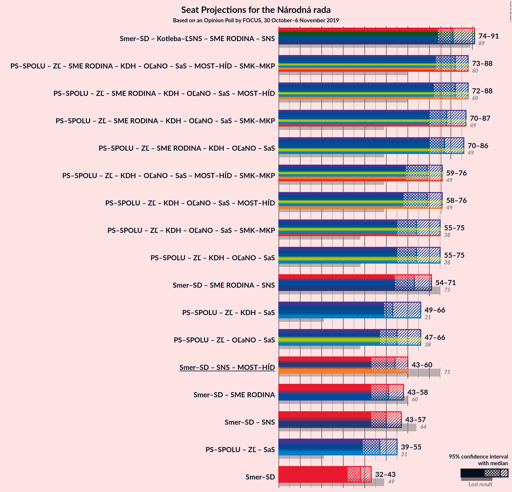

### Confidence Intervals

| Coalition | Last Result | Median | Majority? | 80% Confidence Interval | 90% Confidence Interval | 95% Confidence Interval | 99% Confidence Interval |
|:---------:|:-----------:|:------:|:---------:|:-----------------------:|:-----------------------:|:-----------------------:|:-----------------------:|
| SMER–sociálna demokracia – Kotleba–Ľudová strana Naše Slovensko – SME RODINA – Slovenská národná strana | 89 | 81 | 92% | 76–86 | 75–89 | 74–91 | 71–96 |
| Progresívne Slovensko–SPOLU–Občianska Demokracia – Za ľudí – SME RODINA – Kresťanskodemokratické hnutie – OBYČAJNÍ ĽUDIA a nezávislé osobnosti – Sloboda a Solidarita – MOST–HÍD – Strana maďarskej koalície–Magyar Koalíció Pártja | 60 | 82 | 92% | 77–86 | 74–87 | 73–88 | 69–90 |
| Progresívne Slovensko–SPOLU–Občianska Demokracia – Za ľudí – SME RODINA – Kresťanskodemokratické hnutie – OBYČAJNÍ ĽUDIA a nezávislé osobnosti – Sloboda a Solidarita – MOST–HÍD | 60 | 82 | 92% | 76–85 | 73–86 | 72–88 | 69–90 |
| Progresívne Slovensko–SPOLU–Občianska Demokracia – Za ľudí – SME RODINA – Kresťanskodemokratické hnutie – OBYČAJNÍ ĽUDIA a nezávislé osobnosti – Sloboda a Solidarita – Strana maďarskej koalície–Magyar Koalíció Pártja | 49 | 78 | 55% | 73–84 | 73–86 | 70–87 | 66–89 |
| Progresívne Slovensko–SPOLU–Občianska Demokracia – Za ľudí – SME RODINA – Kresťanskodemokratické hnutie – OBYČAJNÍ ĽUDIA a nezávislé osobnosti – Sloboda a Solidarita | 49 | 77 | 55% | 73–84 | 73–85 | 70–86 | 66–88 |
| Progresívne Slovensko–SPOLU–Občianska Demokracia – Za ľudí – Kresťanskodemokratické hnutie – OBYČAJNÍ ĽUDIA a nezávislé osobnosti – Sloboda a Solidarita – MOST–HÍD – Strana maďarskej koalície–Magyar Koalíció Pártja | 49 | 69 | 3% | 64–74 | 61–75 | 59–76 | 54–79 |
| Progresívne Slovensko–SPOLU–Občianska Demokracia – Za ľudí – Kresťanskodemokratické hnutie – OBYČAJNÍ ĽUDIA a nezávislé osobnosti – Sloboda a Solidarita – MOST–HÍD | 49 | 69 | 3% | 64–74 | 60–75 | 58–76 | 54–79 |
| Progresívne Slovensko–SPOLU–Občianska Demokracia – Za ľudí – Kresťanskodemokratické hnutie – OBYČAJNÍ ĽUDIA a nezávislé osobnosti – Sloboda a Solidarita – Strana maďarskej koalície–Magyar Koalíció Pártja | 38 | 64 | 1.3% | 60–74 | 59–75 | 55–75 | 49–78 |
| Progresívne Slovensko–SPOLU–Občianska Demokracia – Za ľudí – Kresťanskodemokratické hnutie – OBYČAJNÍ ĽUDIA a nezávislé osobnosti – Sloboda a Solidarita | 38 | 64 | 1.2% | 60–74 | 59–75 | 55–75 | 49–77 |
| SMER–sociálna demokracia – SME RODINA – Slovenská národná strana | 75 | 63 | 0.6% | 58–68 | 55–69 | 54–71 | 53–76 |
| Progresívne Slovensko–SPOLU–Občianska Demokracia – Za ľudí – Kresťanskodemokratické hnutie – Sloboda a Solidarita | 21 | 53 | 0.1% | 50–63 | 49–64 | 49–66 | 44–67 |
| Progresívne Slovensko–SPOLU–Občianska Demokracia – Za ľudí – OBYČAJNÍ ĽUDIA a nezávislé osobnosti – Sloboda a Solidarita | 38 | 55 | 0% | 51–64 | 50–65 | 47–66 | 42–68 |
| SMER–sociálna demokracia – Slovenská národná strana – MOST–HÍD | 75 | 54 | 0% | 47–59 | 45–59 | 43–60 | 42–63 |
| SMER–sociálna demokracia – SME RODINA | 60 | 51 | 0% | 44–53 | 44–55 | 43–58 | 39–62 |
| SMER–sociálna demokracia – Slovenská národná strana | 64 | 50 | 0% | 46–54 | 43–56 | 43–57 | 42–60 |
| Progresívne Slovensko–SPOLU–Občianska Demokracia – Za ľudí – Sloboda a Solidarita | 21 | 47 | 0% | 41–53 | 41–54 | 39–55 | 36–59 |
| SMER–sociálna demokracia | 49 | 38 | 0% | 34–40 | 33–42 | 32–43 | 31–45 |

### SMER–sociálna demokracia – Kotleba–Ľudová strana Naše Slovensko – SME RODINA – Slovenská národná strana

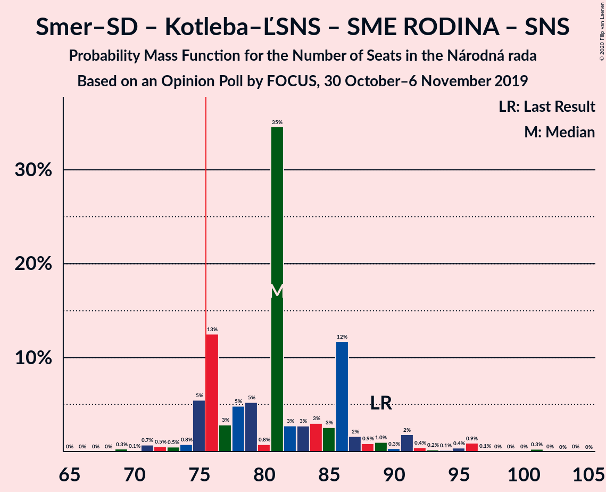

| Number of Seats | Probability | Accumulated | Special Marks |
|:---------------:|:-----------:|:-----------:|:-------------:|
| 69 | 0.3% | 100% |  |
| 70 | 0.1% | 99.7% |  |
| 71 | 0.7% | 99.6% |  |
| 72 | 0.5% | 98.9% |  |
| 73 | 0.5% | 98% |  |
| 74 | 0.8% | 98% |  |
| 75 | 5% | 97% |  |
| 76 | 13% | 92% | Majority |
| 77 | 3% | 79% |  |
| 78 | 5% | 76% |  |
| 79 | 5% | 71% |  |
| 80 | 0.8% | 66% |  |
| 81 | 35% | 65% | Median |
| 82 | 3% | 31% |  |
| 83 | 3% | 28% |  |
| 84 | 3% | 25% |  |
| 85 | 3% | 22% |  |
| 86 | 12% | 20% |  |
| 87 | 2% | 8% |  |
| 88 | 0.9% | 6% |  |
| 89 | 1.0% | 6% | Last Result |
| 90 | 0.3% | 5% |  |
| 91 | 2% | 4% |  |
| 92 | 0.4% | 2% |  |
| 93 | 0.2% | 2% |  |
| 94 | 0.1% | 2% |  |
| 95 | 0.4% | 2% |  |
| 96 | 0.9% | 1.3% |  |
| 97 | 0.1% | 0.4% |  |
| 98 | 0% | 0.4% |  |
| 99 | 0% | 0.3% |  |
| 100 | 0% | 0.3% |  |
| 101 | 0.3% | 0.3% |  |
| 102 | 0% | 0% |  |

### Progresívne Slovensko–SPOLU–Občianska Demokracia – Za ľudí – SME RODINA – Kresťanskodemokratické hnutie – OBYČAJNÍ ĽUDIA a nezávislé osobnosti – Sloboda a Solidarita – MOST–HÍD – Strana maďarskej koalície–Magyar Koalíció Pártja

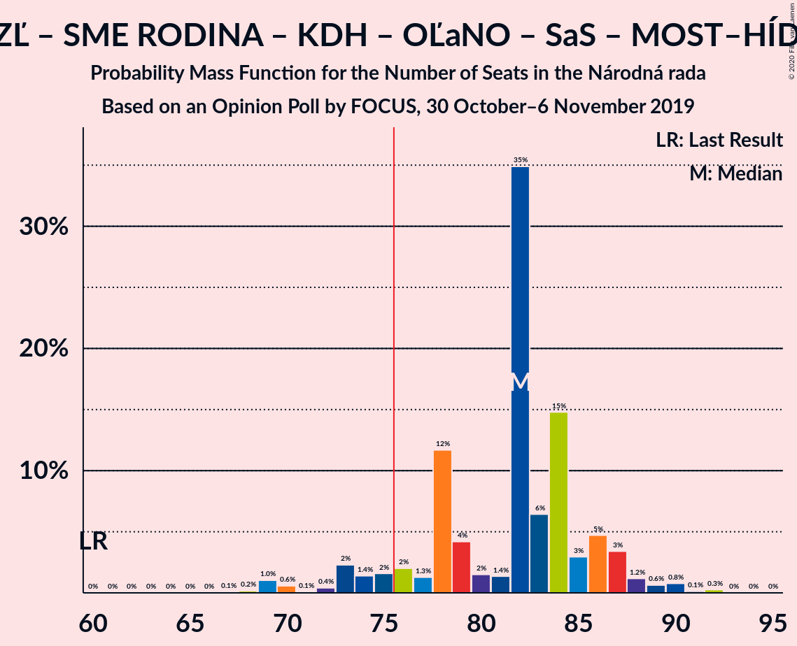

| Number of Seats | Probability | Accumulated | Special Marks |
|:---------------:|:-----------:|:-----------:|:-------------:|
| 60 | 0% | 100% | Last Result |
| 61 | 0% | 100% |  |
| 62 | 0% | 100% |  |
| 63 | 0% | 100% |  |
| 64 | 0% | 100% |  |
| 65 | 0% | 99.9% |  |
| 66 | 0% | 99.9% |  |
| 67 | 0.1% | 99.9% |  |
| 68 | 0.2% | 99.9% |  |
| 69 | 1.0% | 99.7% |  |
| 70 | 0.6% | 98.7% |  |
| 71 | 0.1% | 98% |  |
| 72 | 0.4% | 98% |  |
| 73 | 2% | 98% | Median |
| 74 | 1.4% | 95% |  |
| 75 | 2% | 94% |  |
| 76 | 2% | 92% | Majority |
| 77 | 1.3% | 90% |  |
| 78 | 12% | 89% |  |
| 79 | 4% | 77% |  |
| 80 | 2% | 73% |  |
| 81 | 1.4% | 72% |  |
| 82 | 35% | 70% |  |
| 83 | 6% | 35% |  |
| 84 | 15% | 29% |  |
| 85 | 3% | 14% |  |
| 86 | 5% | 11% |  |
| 87 | 3% | 6% |  |
| 88 | 1.2% | 3% |  |
| 89 | 0.6% | 2% |  |
| 90 | 0.8% | 1.2% |  |
| 91 | 0.1% | 0.5% |  |
| 92 | 0.3% | 0.3% |  |
| 93 | 0% | 0.1% |  |
| 94 | 0% | 0% |  |

### Progresívne Slovensko–SPOLU–Občianska Demokracia – Za ľudí – SME RODINA – Kresťanskodemokratické hnutie – OBYČAJNÍ ĽUDIA a nezávislé osobnosti – Sloboda a Solidarita – MOST–HÍD

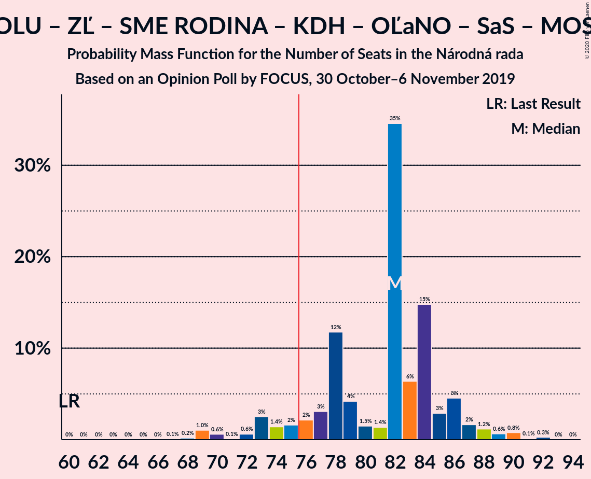

| Number of Seats | Probability | Accumulated | Special Marks |
|:---------------:|:-----------:|:-----------:|:-------------:|
| 60 | 0% | 100% | Last Result |
| 61 | 0% | 100% |  |
| 62 | 0% | 100% |  |
| 63 | 0% | 100% |  |
| 64 | 0% | 100% |  |
| 65 | 0% | 99.9% |  |
| 66 | 0% | 99.9% |  |
| 67 | 0.1% | 99.9% |  |
| 68 | 0.2% | 99.9% |  |
| 69 | 1.0% | 99.7% |  |
| 70 | 0.6% | 98.6% |  |
| 71 | 0.1% | 98% |  |
| 72 | 0.6% | 98% |  |
| 73 | 3% | 97% | Median |
| 74 | 1.4% | 95% |  |
| 75 | 2% | 93% |  |
| 76 | 2% | 92% | Majority |
| 77 | 3% | 90% |  |
| 78 | 12% | 87% |  |
| 79 | 4% | 75% |  |
| 80 | 1.5% | 71% |  |
| 81 | 1.4% | 69% |  |
| 82 | 35% | 68% |  |
| 83 | 6% | 33% |  |
| 84 | 15% | 27% |  |
| 85 | 3% | 12% |  |
| 86 | 5% | 9% |  |
| 87 | 2% | 5% |  |
| 88 | 1.2% | 3% |  |
| 89 | 0.6% | 2% |  |
| 90 | 0.8% | 1.2% |  |
| 91 | 0.1% | 0.4% |  |
| 92 | 0.3% | 0.3% |  |
| 93 | 0% | 0% |  |

### Progresívne Slovensko–SPOLU–Občianska Demokracia – Za ľudí – SME RODINA – Kresťanskodemokratické hnutie – OBYČAJNÍ ĽUDIA a nezávislé osobnosti – Sloboda a Solidarita – Strana maďarskej koalície–Magyar Koalíció Pártja

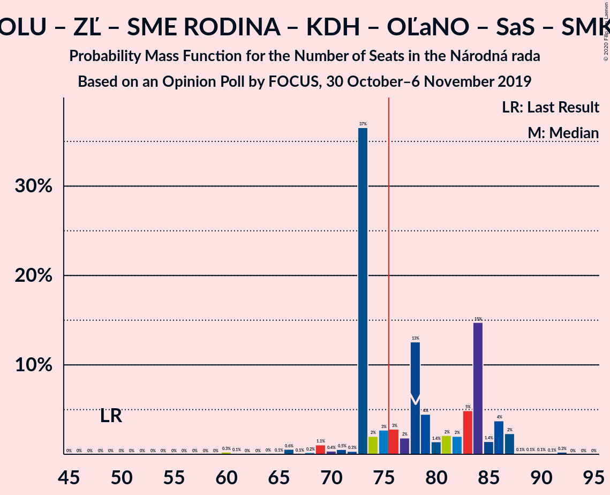

| Number of Seats | Probability | Accumulated | Special Marks |
|:---------------:|:-----------:|:-----------:|:-------------:|
| 49 | 0% | 100% | Last Result |
| 50 | 0% | 100% |  |
| 51 | 0% | 100% |  |
| 52 | 0% | 100% |  |
| 53 | 0% | 100% |  |
| 54 | 0% | 100% |  |
| 55 | 0% | 100% |  |
| 56 | 0% | 100% |  |
| 57 | 0% | 100% |  |
| 58 | 0% | 100% |  |
| 59 | 0% | 100% |  |
| 60 | 0.3% | 100% |  |
| 61 | 0.1% | 99.7% |  |
| 62 | 0% | 99.6% |  |
| 63 | 0% | 99.6% |  |
| 64 | 0% | 99.6% |  |
| 65 | 0.1% | 99.6% |  |
| 66 | 0.6% | 99.5% |  |
| 67 | 0.1% | 98.9% |  |
| 68 | 0.2% | 98.9% |  |
| 69 | 1.1% | 98.7% |  |
| 70 | 0.4% | 98% |  |
| 71 | 0.5% | 97% |  |
| 72 | 0.3% | 97% |  |
| 73 | 37% | 96% | Median |
| 74 | 2% | 60% |  |
| 75 | 3% | 58% |  |
| 76 | 3% | 55% | Majority |
| 77 | 2% | 52% |  |
| 78 | 13% | 50% |  |
| 79 | 4% | 38% |  |
| 80 | 1.4% | 33% |  |
| 81 | 2% | 32% |  |
| 82 | 2% | 30% |  |
| 83 | 5% | 28% |  |
| 84 | 15% | 23% |  |
| 85 | 1.4% | 8% |  |
| 86 | 4% | 7% |  |
| 87 | 2% | 3% |  |
| 88 | 0.1% | 0.7% |  |
| 89 | 0.1% | 0.5% |  |
| 90 | 0.1% | 0.4% |  |
| 91 | 0.1% | 0.3% |  |
| 92 | 0.3% | 0.3% |  |
| 93 | 0% | 0% |  |

### Progresívne Slovensko–SPOLU–Občianska Demokracia – Za ľudí – SME RODINA – Kresťanskodemokratické hnutie – OBYČAJNÍ ĽUDIA a nezávislé osobnosti – Sloboda a Solidarita

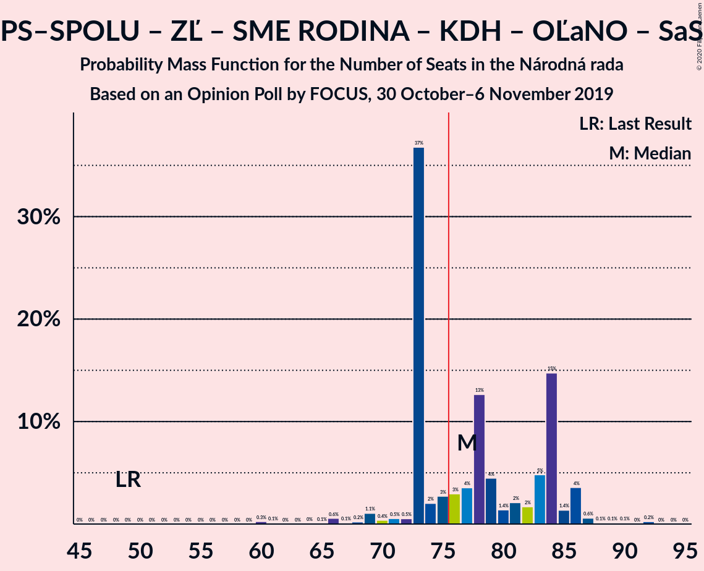

| Number of Seats | Probability | Accumulated | Special Marks |
|:---------------:|:-----------:|:-----------:|:-------------:|
| 49 | 0% | 100% | Last Result |
| 50 | 0% | 100% |  |
| 51 | 0% | 100% |  |
| 52 | 0% | 100% |  |
| 53 | 0% | 100% |  |
| 54 | 0% | 100% |  |
| 55 | 0% | 100% |  |
| 56 | 0% | 100% |  |
| 57 | 0% | 100% |  |
| 58 | 0% | 100% |  |
| 59 | 0% | 100% |  |
| 60 | 0.3% | 100% |  |
| 61 | 0.1% | 99.7% |  |
| 62 | 0% | 99.6% |  |
| 63 | 0% | 99.6% |  |
| 64 | 0% | 99.6% |  |
| 65 | 0.1% | 99.6% |  |
| 66 | 0.6% | 99.5% |  |
| 67 | 0.1% | 98.9% |  |
| 68 | 0.2% | 98.8% |  |
| 69 | 1.1% | 98.6% |  |
| 70 | 0.4% | 98% |  |
| 71 | 0.5% | 97% |  |
| 72 | 0.5% | 97% |  |
| 73 | 37% | 96% | Median |
| 74 | 2% | 59% |  |
| 75 | 3% | 57% |  |
| 76 | 3% | 55% | Majority |
| 77 | 4% | 52% |  |
| 78 | 13% | 48% |  |
| 79 | 4% | 35% |  |
| 80 | 1.4% | 31% |  |
| 81 | 2% | 30% |  |
| 82 | 2% | 27% |  |
| 83 | 5% | 26% |  |
| 84 | 15% | 21% |  |
| 85 | 1.4% | 6% |  |
| 86 | 4% | 5% |  |
| 87 | 0.6% | 1.2% |  |
| 88 | 0.1% | 0.6% |  |
| 89 | 0.1% | 0.5% |  |
| 90 | 0.1% | 0.4% |  |
| 91 | 0% | 0.3% |  |
| 92 | 0.2% | 0.3% |  |
| 93 | 0% | 0% |  |

### Progresívne Slovensko–SPOLU–Občianska Demokracia – Za ľudí – Kresťanskodemokratické hnutie – OBYČAJNÍ ĽUDIA a nezávislé osobnosti – Sloboda a Solidarita – MOST–HÍD – Strana maďarskej koalície–Magyar Koalíció Pártja

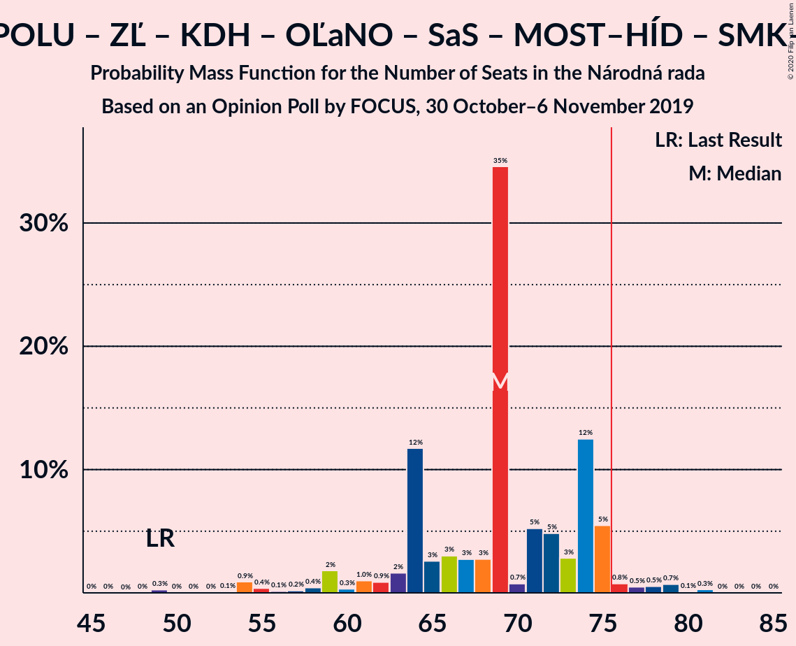

| Number of Seats | Probability | Accumulated | Special Marks |
|:---------------:|:-----------:|:-----------:|:-------------:|
| 49 | 0.3% | 100% | Last Result |
| 50 | 0% | 99.7% |  |
| 51 | 0% | 99.7% |  |
| 52 | 0% | 99.7% |  |
| 53 | 0.1% | 99.6% |  |
| 54 | 0.9% | 99.6% |  |
| 55 | 0.4% | 98.7% |  |
| 56 | 0.1% | 98% |  |
| 57 | 0.2% | 98% |  |
| 58 | 0.4% | 98% |  |
| 59 | 2% | 98% |  |
| 60 | 0.3% | 96% | Median |
| 61 | 1.0% | 95% |  |
| 62 | 0.9% | 94% |  |
| 63 | 2% | 94% |  |
| 64 | 12% | 92% |  |
| 65 | 3% | 80% |  |
| 66 | 3% | 78% |  |
| 67 | 3% | 75% |  |
| 68 | 3% | 72% |  |
| 69 | 35% | 69% |  |
| 70 | 0.7% | 34% |  |
| 71 | 5% | 34% |  |
| 72 | 5% | 29% |  |
| 73 | 3% | 24% |  |
| 74 | 12% | 21% |  |
| 75 | 5% | 8% |  |
| 76 | 0.8% | 3% | Majority |
| 77 | 0.5% | 2% |  |
| 78 | 0.5% | 2% |  |
| 79 | 0.7% | 1.1% |  |
| 80 | 0.1% | 0.4% |  |
| 81 | 0.3% | 0.3% |  |
| 82 | 0% | 0% |  |

### Progresívne Slovensko–SPOLU–Občianska Demokracia – Za ľudí – Kresťanskodemokratické hnutie – OBYČAJNÍ ĽUDIA a nezávislé osobnosti – Sloboda a Solidarita – MOST–HÍD

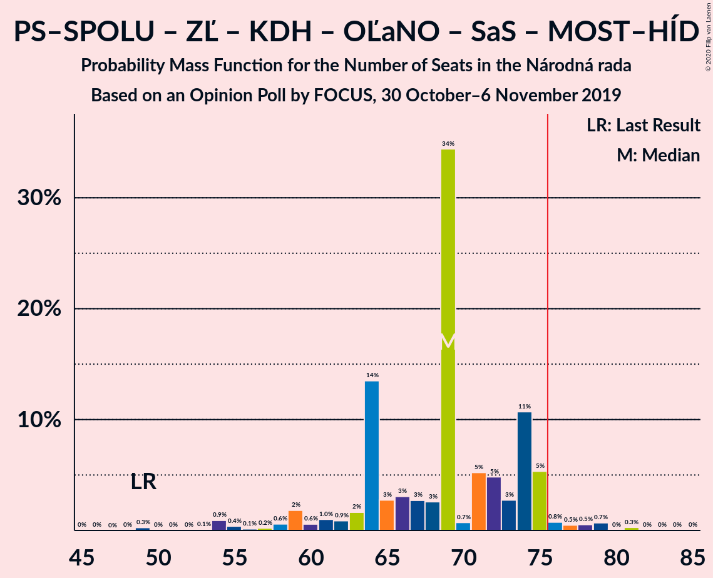

| Number of Seats | Probability | Accumulated | Special Marks |
|:---------------:|:-----------:|:-----------:|:-------------:|
| 49 | 0.3% | 100% | Last Result |
| 50 | 0% | 99.7% |  |
| 51 | 0% | 99.7% |  |
| 52 | 0% | 99.7% |  |
| 53 | 0.1% | 99.6% |  |
| 54 | 0.9% | 99.6% |  |
| 55 | 0.4% | 98.6% |  |
| 56 | 0.1% | 98% |  |
| 57 | 0.2% | 98% |  |
| 58 | 0.6% | 98% |  |
| 59 | 2% | 97% |  |
| 60 | 0.6% | 95% | Median |
| 61 | 1.0% | 95% |  |
| 62 | 0.9% | 94% |  |
| 63 | 2% | 93% |  |
| 64 | 14% | 91% |  |
| 65 | 3% | 78% |  |
| 66 | 3% | 75% |  |
| 67 | 3% | 72% |  |
| 68 | 3% | 69% |  |
| 69 | 34% | 67% |  |
| 70 | 0.7% | 32% |  |
| 71 | 5% | 32% |  |
| 72 | 5% | 26% |  |
| 73 | 3% | 22% |  |
| 74 | 11% | 19% |  |
| 75 | 5% | 8% |  |
| 76 | 0.8% | 3% | Majority |
| 77 | 0.5% | 2% |  |
| 78 | 0.5% | 2% |  |
| 79 | 0.7% | 1.1% |  |
| 80 | 0% | 0.4% |  |
| 81 | 0.3% | 0.3% |  |
| 82 | 0% | 0% |  |

### Progresívne Slovensko–SPOLU–Občianska Demokracia – Za ľudí – Kresťanskodemokratické hnutie – OBYČAJNÍ ĽUDIA a nezávislé osobnosti – Sloboda a Solidarita – Strana maďarskej koalície–Magyar Koalíció Pártja

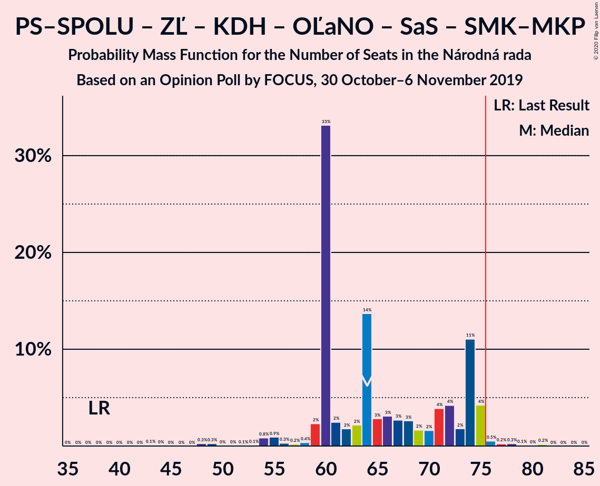

| Number of Seats | Probability | Accumulated | Special Marks |
|:---------------:|:-----------:|:-----------:|:-------------:|
| 38 | 0% | 100% | Last Result |
| 39 | 0% | 100% |  |
| 40 | 0% | 100% |  |
| 41 | 0% | 100% |  |
| 42 | 0% | 100% |  |
| 43 | 0.1% | 100% |  |
| 44 | 0% | 99.9% |  |
| 45 | 0% | 99.9% |  |
| 46 | 0% | 99.9% |  |
| 47 | 0% | 99.9% |  |
| 48 | 0.3% | 99.9% |  |
| 49 | 0.3% | 99.6% |  |
| 50 | 0% | 99.4% |  |
| 51 | 0% | 99.3% |  |
| 52 | 0.1% | 99.3% |  |
| 53 | 0.1% | 99.2% |  |
| 54 | 0.8% | 99.2% |  |
| 55 | 0.9% | 98% |  |
| 56 | 0.3% | 97% |  |
| 57 | 0.2% | 97% |  |
| 58 | 0.4% | 97% |  |
| 59 | 2% | 97% |  |
| 60 | 33% | 94% | Median |
| 61 | 2% | 61% |  |
| 62 | 2% | 59% |  |
| 63 | 2% | 57% |  |
| 64 | 14% | 55% |  |
| 65 | 3% | 41% |  |
| 66 | 3% | 38% |  |
| 67 | 3% | 35% |  |
| 68 | 3% | 32% |  |
| 69 | 2% | 30% |  |
| 70 | 2% | 28% |  |
| 71 | 4% | 26% |  |
| 72 | 4% | 23% |  |
| 73 | 2% | 18% |  |
| 74 | 11% | 17% |  |
| 75 | 4% | 6% |  |
| 76 | 0.5% | 1.3% | Majority |
| 77 | 0.2% | 0.8% |  |
| 78 | 0.3% | 0.5% |  |
| 79 | 0.1% | 0.3% |  |
| 80 | 0% | 0.2% |  |
| 81 | 0.2% | 0.2% |  |
| 82 | 0% | 0% |  |

### Progresívne Slovensko–SPOLU–Občianska Demokracia – Za ľudí – Kresťanskodemokratické hnutie – OBYČAJNÍ ĽUDIA a nezávislé osobnosti – Sloboda a Solidarita

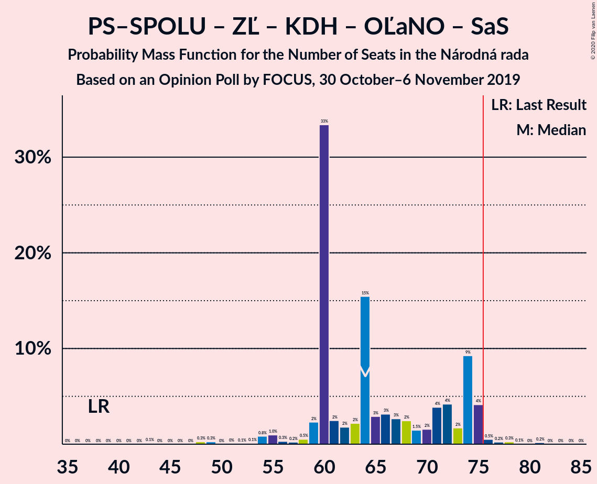

| Number of Seats | Probability | Accumulated | Special Marks |
|:---------------:|:-----------:|:-----------:|:-------------:|
| 38 | 0% | 100% | Last Result |
| 39 | 0% | 100% |  |
| 40 | 0% | 100% |  |
| 41 | 0% | 100% |  |
| 42 | 0% | 100% |  |
| 43 | 0.1% | 100% |  |
| 44 | 0% | 99.9% |  |
| 45 | 0% | 99.9% |  |
| 46 | 0% | 99.9% |  |
| 47 | 0% | 99.9% |  |
| 48 | 0.3% | 99.9% |  |
| 49 | 0.3% | 99.6% |  |
| 50 | 0% | 99.4% |  |
| 51 | 0% | 99.3% |  |
| 52 | 0.1% | 99.3% |  |
| 53 | 0.1% | 99.2% |  |
| 54 | 0.8% | 99.2% |  |
| 55 | 1.0% | 98% |  |
| 56 | 0.3% | 97% |  |
| 57 | 0.2% | 97% |  |
| 58 | 0.5% | 97% |  |
| 59 | 2% | 96% |  |
| 60 | 33% | 94% | Median |
| 61 | 2% | 61% |  |
| 62 | 2% | 58% |  |
| 63 | 2% | 56% |  |
| 64 | 15% | 54% |  |
| 65 | 3% | 39% |  |
| 66 | 3% | 36% |  |
| 67 | 3% | 33% |  |
| 68 | 2% | 30% |  |
| 69 | 1.5% | 27% |  |
| 70 | 2% | 26% |  |
| 71 | 4% | 24% |  |
| 72 | 4% | 21% |  |
| 73 | 2% | 16% |  |
| 74 | 9% | 15% |  |
| 75 | 4% | 5% |  |
| 76 | 0.5% | 1.2% | Majority |
| 77 | 0.2% | 0.7% |  |
| 78 | 0.3% | 0.5% |  |
| 79 | 0.1% | 0.2% |  |
| 80 | 0% | 0.2% |  |
| 81 | 0.2% | 0.2% |  |
| 82 | 0% | 0% |  |

### SMER–sociálna demokracia – SME RODINA – Slovenská národná strana

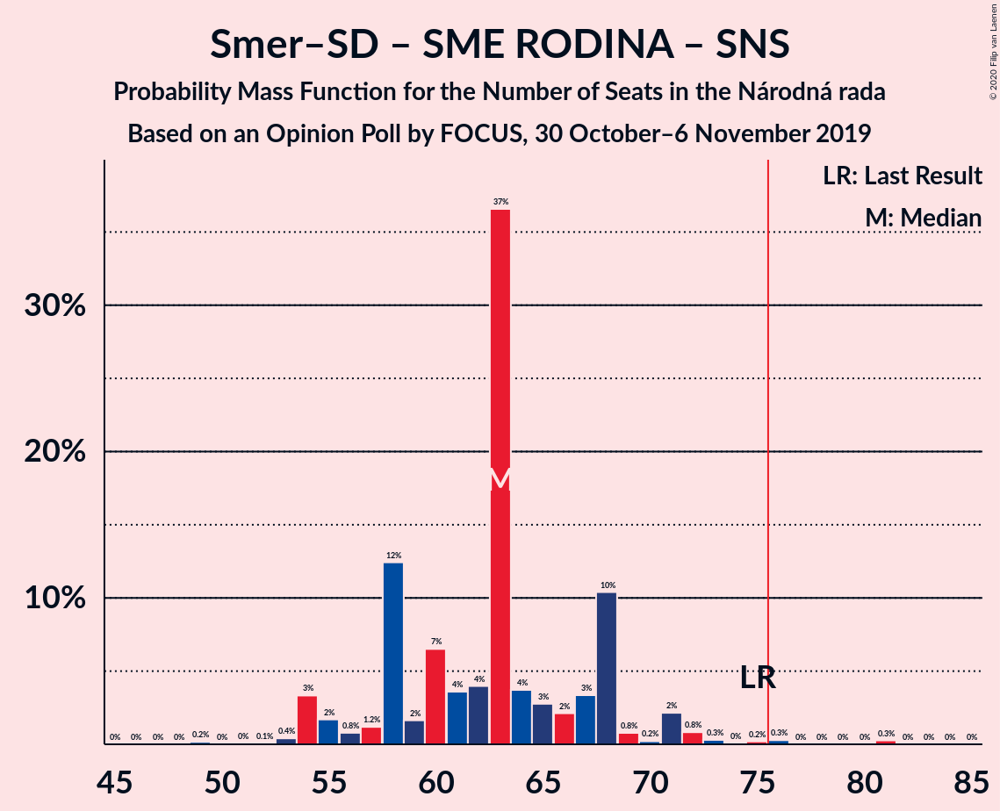

| Number of Seats | Probability | Accumulated | Special Marks |
|:---------------:|:-----------:|:-----------:|:-------------:|
| 49 | 0.2% | 100% |  |
| 50 | 0% | 99.8% |  |
| 51 | 0% | 99.8% |  |
| 52 | 0.1% | 99.7% |  |
| 53 | 0.4% | 99.7% |  |
| 54 | 3% | 99.3% |  |
| 55 | 2% | 96% |  |
| 56 | 0.8% | 94% |  |
| 57 | 1.2% | 93% |  |
| 58 | 12% | 92% |  |
| 59 | 2% | 80% |  |
| 60 | 7% | 78% |  |
| 61 | 4% | 72% |  |
| 62 | 4% | 68% |  |
| 63 | 37% | 64% | Median |
| 64 | 4% | 27% |  |
| 65 | 3% | 24% |  |
| 66 | 2% | 21% |  |
| 67 | 3% | 19% |  |
| 68 | 10% | 16% |  |
| 69 | 0.8% | 5% |  |
| 70 | 0.2% | 4% |  |
| 71 | 2% | 4% |  |
| 72 | 0.8% | 2% |  |
| 73 | 0.3% | 1.2% |  |
| 74 | 0% | 0.8% |  |
| 75 | 0.2% | 0.8% | Last Result |
| 76 | 0.3% | 0.6% | Majority |
| 77 | 0% | 0.3% |  |
| 78 | 0% | 0.3% |  |
| 79 | 0% | 0.3% |  |
| 80 | 0% | 0.3% |  |
| 81 | 0.3% | 0.3% |  |
| 82 | 0% | 0% |  |

### Progresívne Slovensko–SPOLU–Občianska Demokracia – Za ľudí – Kresťanskodemokratické hnutie – Sloboda a Solidarita

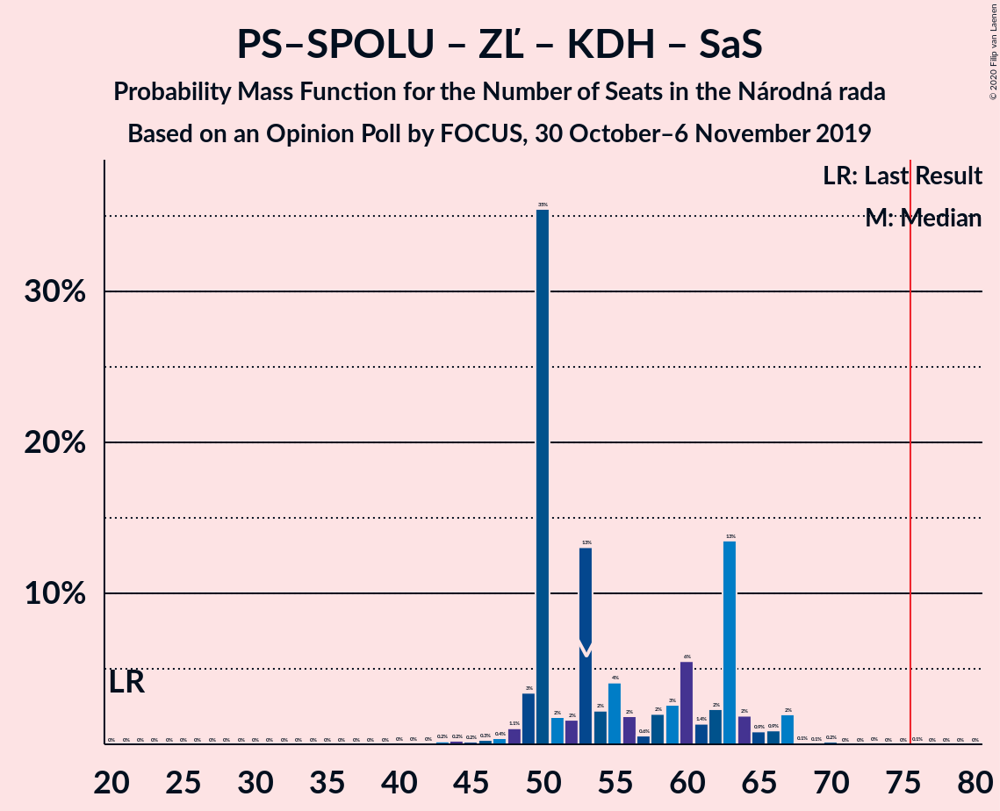

| Number of Seats | Probability | Accumulated | Special Marks |
|:---------------:|:-----------:|:-----------:|:-------------:|
| 21 | 0% | 100% | Last Result |
| 22 | 0% | 100% |  |
| 23 | 0% | 100% |  |
| 24 | 0% | 100% |  |
| 25 | 0% | 100% |  |
| 26 | 0% | 100% |  |
| 27 | 0% | 100% |  |
| 28 | 0% | 100% |  |
| 29 | 0% | 100% |  |
| 30 | 0% | 100% |  |
| 31 | 0% | 100% |  |
| 32 | 0% | 100% |  |
| 33 | 0% | 100% |  |
| 34 | 0% | 100% |  |
| 35 | 0% | 100% |  |
| 36 | 0% | 100% |  |
| 37 | 0% | 100% |  |
| 38 | 0% | 100% |  |
| 39 | 0% | 100% |  |
| 40 | 0% | 100% |  |
| 41 | 0% | 100% |  |
| 42 | 0% | 99.9% |  |
| 43 | 0.2% | 99.9% |  |
| 44 | 0.2% | 99.7% |  |
| 45 | 0.2% | 99.5% |  |
| 46 | 0.3% | 99.3% |  |
| 47 | 0.4% | 99.0% |  |
| 48 | 1.1% | 98.6% |  |
| 49 | 3% | 98% |  |
| 50 | 35% | 94% | Median |
| 51 | 2% | 59% |  |
| 52 | 2% | 57% |  |
| 53 | 13% | 55% |  |
| 54 | 2% | 42% |  |
| 55 | 4% | 40% |  |
| 56 | 2% | 36% |  |
| 57 | 0.6% | 34% |  |
| 58 | 2% | 33% |  |
| 59 | 3% | 31% |  |
| 60 | 6% | 29% |  |
| 61 | 1.4% | 23% |  |
| 62 | 2% | 22% |  |
| 63 | 13% | 20% |  |
| 64 | 2% | 6% |  |
| 65 | 0.9% | 4% |  |
| 66 | 0.9% | 3% |  |
| 67 | 2% | 2% |  |
| 68 | 0.1% | 0.5% |  |
| 69 | 0.1% | 0.4% |  |
| 70 | 0.2% | 0.3% |  |
| 71 | 0% | 0.1% |  |
| 72 | 0% | 0.1% |  |
| 73 | 0% | 0.1% |  |
| 74 | 0% | 0.1% |  |
| 75 | 0% | 0.1% |  |
| 76 | 0.1% | 0.1% | Majority |
| 77 | 0% | 0% |  |

### Progresívne Slovensko–SPOLU–Občianska Demokracia – Za ľudí – OBYČAJNÍ ĽUDIA a nezávislé osobnosti – Sloboda a Solidarita

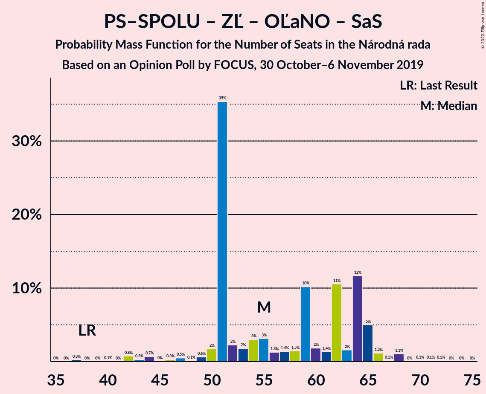

| Number of Seats | Probability | Accumulated | Special Marks |
|:---------------:|:-----------:|:-----------:|:-------------:|
| 37 | 0.3% | 100% |  |
| 38 | 0% | 99.7% | Last Result |
| 39 | 0% | 99.7% |  |
| 40 | 0.1% | 99.7% |  |
| 41 | 0% | 99.6% |  |
| 42 | 0.8% | 99.6% |  |
| 43 | 0.3% | 98.9% |  |
| 44 | 0.7% | 98.6% |  |
| 45 | 0% | 98% |  |
| 46 | 0.3% | 98% |  |
| 47 | 0.5% | 98% |  |
| 48 | 0.1% | 97% |  |
| 49 | 0.6% | 97% |  |
| 50 | 2% | 96% |  |
| 51 | 35% | 95% | Median |
| 52 | 2% | 59% |  |
| 53 | 2% | 57% |  |
| 54 | 3% | 55% |  |
| 55 | 3% | 52% |  |
| 56 | 1.3% | 49% |  |
| 57 | 1.4% | 48% |  |
| 58 | 1.5% | 46% |  |
| 59 | 10% | 45% |  |
| 60 | 2% | 35% |  |
| 61 | 1.4% | 33% |  |
| 62 | 11% | 32% |  |
| 63 | 2% | 21% |  |
| 64 | 12% | 19% |  |
| 65 | 5% | 8% |  |
| 66 | 1.2% | 3% |  |
| 67 | 0.1% | 2% |  |
| 68 | 1.1% | 1.5% |  |
| 69 | 0% | 0.4% |  |
| 70 | 0.1% | 0.4% |  |
| 71 | 0.1% | 0.2% |  |
| 72 | 0.1% | 0.1% |  |
| 73 | 0% | 0% |  |

### SMER–sociálna demokracia – Slovenská národná strana – MOST–HÍD

| Number of Seats | Probability | Accumulated | Special Marks |
|:---------------:|:-----------:|:-----------:|:-------------:|
| 40 | 0.1% | 100% |  |
| 41 | 0.3% | 99.9% |  |
| 42 | 0.5% | 99.6% |  |
| 43 | 3% | 99.2% |  |
| 44 | 0.3% | 96% |  |
| 45 | 3% | 96% |  |
| 46 | 2% | 93% |  |
| 47 | 2% | 91% |  |
| 48 | 13% | 89% |  |
| 49 | 2% | 77% |  |
| 50 | 3% | 74% | Median |
| 51 | 5% | 71% |  |
| 52 | 3% | 66% |  |
| 53 | 3% | 63% |  |
| 54 | 12% | 60% |  |
| 55 | 2% | 47% |  |
| 56 | 3% | 45% |  |
| 57 | 4% | 43% |  |
| 58 | 2% | 38% |  |
| 59 | 34% | 37% |  |
| 60 | 0.7% | 3% |  |
| 61 | 0.6% | 2% |  |
| 62 | 0.7% | 1.3% |  |
| 63 | 0.1% | 0.6% |  |
| 64 | 0% | 0.5% |  |
| 65 | 0% | 0.5% |  |
| 66 | 0.3% | 0.4% |  |
| 67 | 0% | 0.1% |  |
| 68 | 0% | 0.1% |  |
| 69 | 0.1% | 0.1% |  |
| 70 | 0% | 0% |  |
| 71 | 0% | 0% |  |
| 72 | 0% | 0% |  |
| 73 | 0% | 0% |  |
| 74 | 0% | 0% |  |
| 75 | 0% | 0% | Last Result |

### SMER–sociálna demokracia – SME RODINA

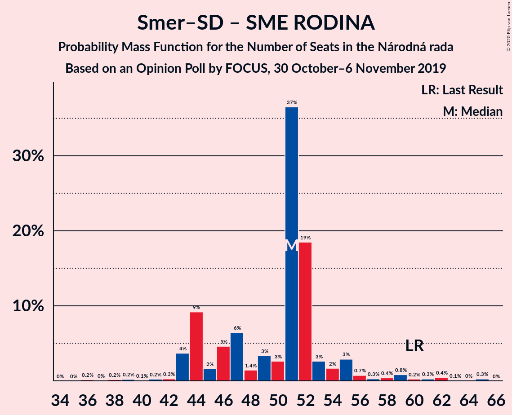

| Number of Seats | Probability | Accumulated | Special Marks |
|:---------------:|:-----------:|:-----------:|:-------------:|
| 36 | 0.2% | 100% |  |
| 37 | 0% | 99.8% |  |
| 38 | 0.2% | 99.8% |  |
| 39 | 0.2% | 99.6% |  |
| 40 | 0.1% | 99.4% |  |
| 41 | 0.2% | 99.4% |  |
| 42 | 0.3% | 99.1% |  |
| 43 | 4% | 98.9% |  |
| 44 | 9% | 95% |  |
| 45 | 2% | 86% |  |
| 46 | 5% | 84% |  |
| 47 | 6% | 80% |  |
| 48 | 1.4% | 73% |  |
| 49 | 3% | 72% |  |
| 50 | 3% | 68% |  |
| 51 | 37% | 66% | Median |
| 52 | 19% | 29% |  |
| 53 | 3% | 11% |  |
| 54 | 2% | 8% |  |
| 55 | 3% | 6% |  |
| 56 | 0.7% | 4% |  |
| 57 | 0.3% | 3% |  |
| 58 | 0.4% | 3% |  |
| 59 | 0.8% | 2% |  |
| 60 | 0.2% | 1.3% | Last Result |
| 61 | 0.3% | 1.1% |  |
| 62 | 0.4% | 0.8% |  |
| 63 | 0.1% | 0.4% |  |
| 64 | 0% | 0.3% |  |
| 65 | 0.3% | 0.3% |  |
| 66 | 0% | 0% |  |

### SMER–sociálna demokracia – Slovenská národná strana

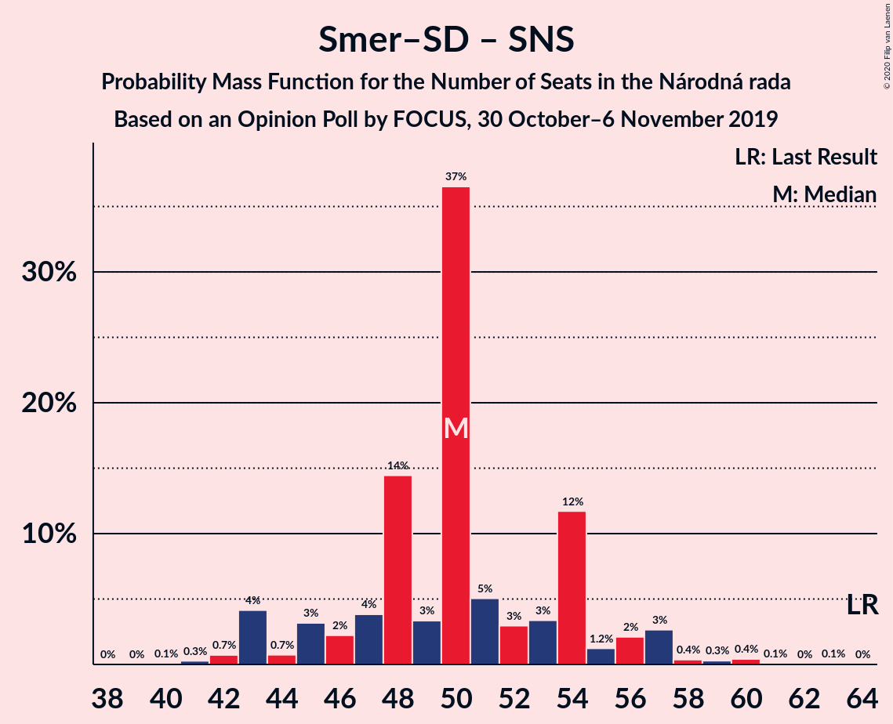

| Number of Seats | Probability | Accumulated | Special Marks |
|:---------------:|:-----------:|:-----------:|:-------------:|
| 38 | 0% | 100% |  |
| 39 | 0% | 99.9% |  |
| 40 | 0.1% | 99.9% |  |
| 41 | 0.3% | 99.9% |  |
| 42 | 0.7% | 99.6% |  |
| 43 | 4% | 98.9% |  |
| 44 | 0.7% | 95% |  |
| 45 | 3% | 94% |  |
| 46 | 2% | 91% |  |
| 47 | 4% | 89% |  |
| 48 | 14% | 85% |  |
| 49 | 3% | 70% |  |
| 50 | 37% | 67% | Median |
| 51 | 5% | 30% |  |
| 52 | 3% | 25% |  |
| 53 | 3% | 22% |  |
| 54 | 12% | 19% |  |
| 55 | 1.2% | 7% |  |
| 56 | 2% | 6% |  |
| 57 | 3% | 4% |  |
| 58 | 0.4% | 1.3% |  |
| 59 | 0.3% | 0.9% |  |
| 60 | 0.4% | 0.6% |  |
| 61 | 0.1% | 0.2% |  |
| 62 | 0% | 0.1% |  |
| 63 | 0.1% | 0.1% |  |
| 64 | 0% | 0% | Last Result |

### Progresívne Slovensko–SPOLU–Občianska Demokracia – Za ľudí – Sloboda a Solidarita

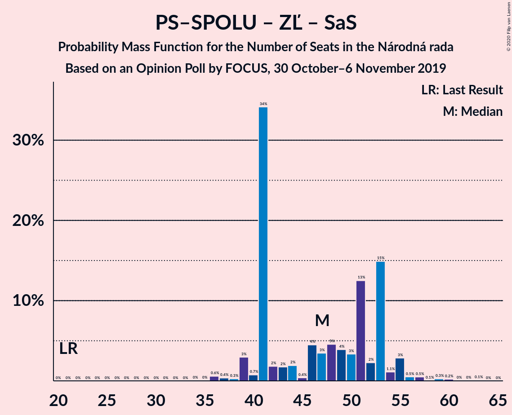

| Number of Seats | Probability | Accumulated | Special Marks |
|:---------------:|:-----------:|:-----------:|:-------------:|
| 21 | 0% | 100% | Last Result |
| 22 | 0% | 100% |  |
| 23 | 0% | 100% |  |
| 24 | 0% | 100% |  |
| 25 | 0% | 100% |  |
| 26 | 0% | 100% |  |
| 27 | 0% | 100% |  |
| 28 | 0% | 100% |  |
| 29 | 0% | 100% |  |
| 30 | 0% | 100% |  |
| 31 | 0% | 100% |  |
| 32 | 0% | 100% |  |
| 33 | 0% | 100% |  |
| 34 | 0% | 100% |  |
| 35 | 0% | 100% |  |
| 36 | 0.6% | 100% |  |
| 37 | 0.4% | 99.4% |  |
| 38 | 0.3% | 99.0% |  |
| 39 | 3% | 98.8% |  |
| 40 | 0.7% | 96% |  |
| 41 | 34% | 95% | Median |
| 42 | 2% | 61% |  |
| 43 | 2% | 59% |  |
| 44 | 2% | 57% |  |
| 45 | 0.4% | 55% |  |
| 46 | 4% | 55% |  |
| 47 | 3% | 51% |  |
| 48 | 5% | 47% |  |
| 49 | 4% | 43% |  |
| 50 | 3% | 39% |  |
| 51 | 13% | 35% |  |
| 52 | 2% | 23% |  |
| 53 | 15% | 20% |  |
| 54 | 1.1% | 6% |  |
| 55 | 3% | 4% |  |
| 56 | 0.5% | 2% |  |
| 57 | 0.5% | 1.1% |  |
| 58 | 0.1% | 0.6% |  |
| 59 | 0.3% | 0.6% |  |
| 60 | 0.2% | 0.3% |  |
| 61 | 0% | 0.1% |  |
| 62 | 0% | 0.1% |  |
| 63 | 0.1% | 0.1% |  |
| 64 | 0% | 0% |  |

### SMER–sociálna demokracia

| Number of Seats | Probability | Accumulated | Special Marks |
|:---------------:|:-----------:|:-----------:|:-------------:|
| 29 | 0.2% | 100% |  |
| 30 | 0% | 99.8% |  |
| 31 | 0.3% | 99.7% |  |
| 32 | 4% | 99.4% |  |
| 33 | 4% | 96% |  |
| 34 | 12% | 92% |  |
| 35 | 8% | 80% |  |
| 36 | 3% | 73% |  |
| 37 | 3% | 70% |  |
| 38 | 46% | 66% | Median |
| 39 | 4% | 21% |  |
| 40 | 8% | 17% |  |
| 41 | 4% | 9% |  |
| 42 | 2% | 5% |  |
| 43 | 1.2% | 3% |  |
| 44 | 1.2% | 2% |  |
| 45 | 0.2% | 0.5% |  |
| 46 | 0.2% | 0.4% |  |
| 47 | 0% | 0.2% |  |
| 48 | 0.1% | 0.1% |  |
| 49 | 0% | 0.1% | Last Result |
| 50 | 0% | 0.1% |  |
| 51 | 0% | 0% |  |

## Technical Information

### Opinion Poll

+ **Polling firm:** FOCUS
+ **Commissioner(s):** —
+ **Fieldwork period:** 30 October–6 November 2019

### Calculations

+ **Sample size:** 1020
+ **Simulations done:** 1,048,576
+ **Error estimate:** 2.18%

