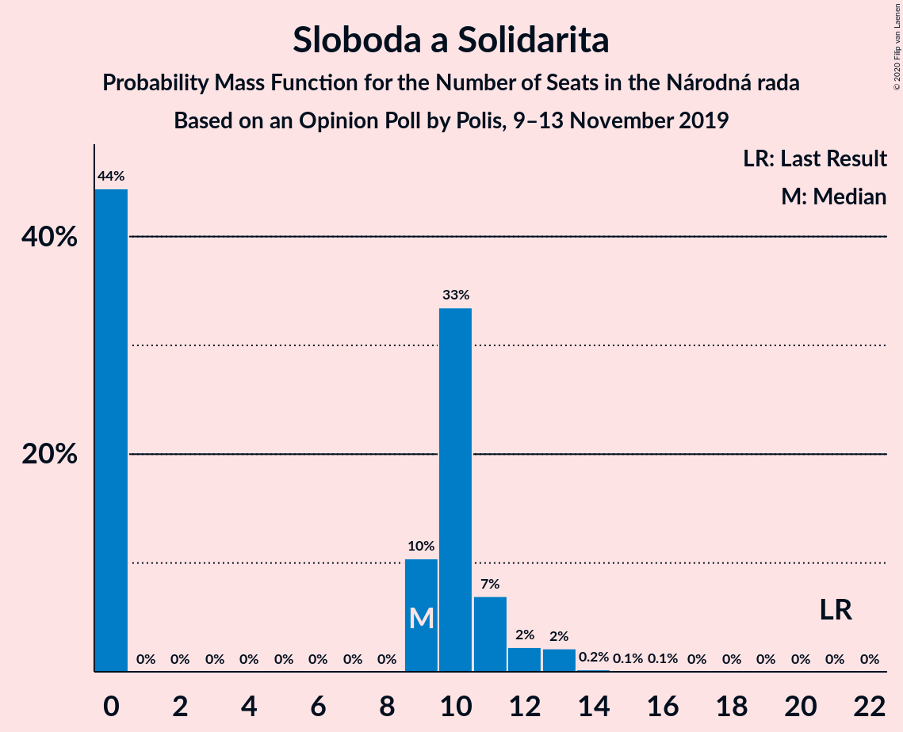
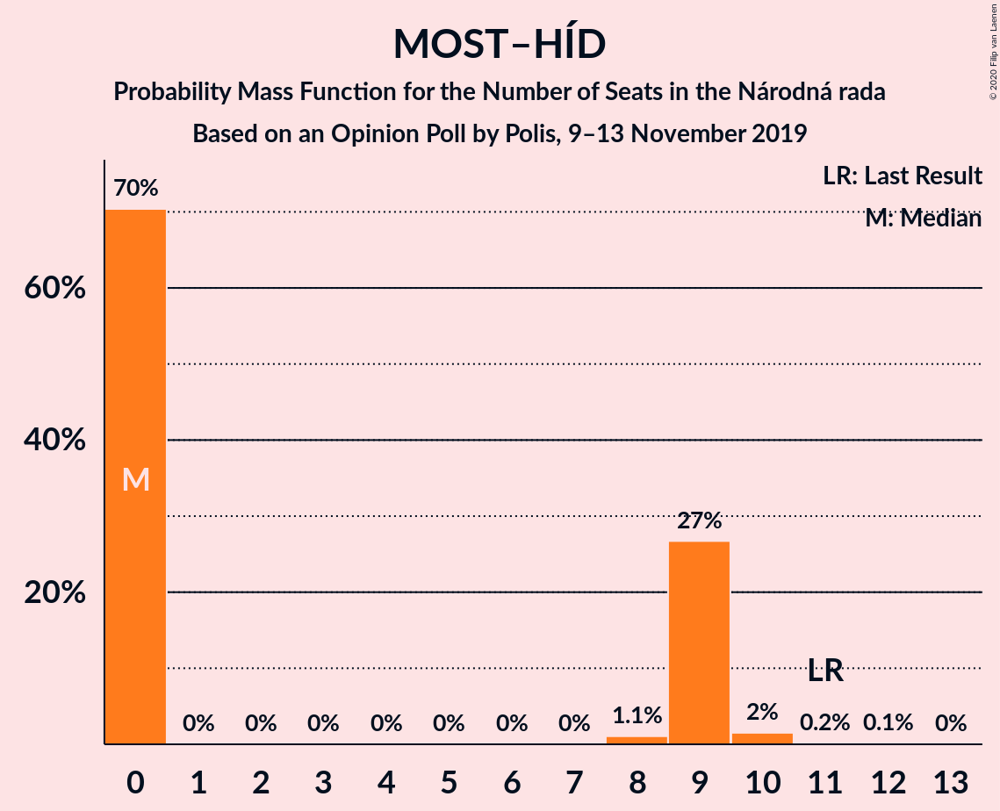

# Opinion Poll by Polis, 9–13 November 2019

<a href="#voting-intentions">Voting Intentions</a> | <a href="#seats">Seats</a> | <a href="#coalitions">Coalitions</a> | <a href="#technical-information">Technical Information</a>

## Voting Intentions

### Confidence Intervals

| Party | Last Result | Poll Result | 80% Confidence Interval | 90% Confidence Interval | 95% Confidence Interval | 99% Confidence Interval |
|:-----:|:-----------:|:-----------:|:-----------------------:|:-----------------------:|:-----------------------:|:-----------------------:|
| SMER–sociálna demokracia | 28.3% | 20.2% | 18.6–21.9% |18.2–22.3% |17.8–22.8% |17.1–23.6% |
| Za ľudí | 0.0% | 11.2% | 10.0–12.5% |9.6–12.9% |9.4–13.3% |8.8–13.9% |
| Kotleba–Ľudová strana Naše Slovensko | 8.0% | 11.1% | 9.9–12.4% |9.6–12.8% |9.3–13.2% |8.7–13.8% |
| Progresívne Slovensko–SPOLU–Občianska Demokracia | 0.0% | 11.1% | 9.9–12.4% |9.6–12.8% |9.3–13.2% |8.7–13.8% |
| OBYČAJNÍ ĽUDIA a nezávislé osobnosti | 11.0% | 7.0% | 6.0–8.1% |5.8–8.4% |5.5–8.7% |5.1–9.3% |
| Slovenská národná strana | 8.6% | 6.1% | 5.2–7.1% |5.0–7.5% |4.8–7.7% |4.4–8.3% |
| Kresťanskodemokratické hnutie | 4.9% | 6.0% | 5.1–7.0% |4.9–7.3% |4.7–7.6% |4.3–8.2% |
| SME RODINA | 6.6% | 5.2% | 4.4–6.2% |4.2–6.5% |4.0–6.7% |3.6–7.3% |
| Sloboda a Solidarita | 12.1% | 5.1% | 4.3–6.1% |4.1–6.4% |3.9–6.6% |3.6–7.1% |
| MOST–HÍD | 6.5% | 4.1% | 3.4–5.0% |3.2–5.3% |3.0–5.5% |2.7–6.0% |
| Strana maďarskej koalície–Magyar Koalíció Pártja | 4.0% | 3.6% | 3.0–4.5% |2.8–4.7% |2.6–5.0% |2.4–5.4% |
| VLASŤ | 0.0% | 3.3% | 2.7–4.2% |2.5–4.4% |2.4–4.6% |2.1–5.1% |
| Dobrá voľba | 0.0% | 2.4% | 1.9–3.2% |1.8–3.4% |1.7–3.6% |1.4–4.0% |

*Note:* The poll result column reflects the actual value used in the calculations. Published results may vary slightly, and in addition be rounded to fewer digits.

## Seats

### Confidence Intervals

| Party | Last Result | Median | 80% Confidence Interval | 90% Confidence Interval | 95% Confidence Interval | 99% Confidence Interval |
|:-----:|:-----------:|:------:|:-----------------------:|:-----------------------:|:-----------------------:|:-----------------------:|
| <a href="#smer–sociálna-demokracia">SMER–sociálna demokracia</a> | 49 | 36 | 34–45 |34–45 |33–46 |32–52 |
| <a href="#za-ľudí">Za ľudí</a> | 0 | 22 | 18–24 |17–26 |17–27 |15–28 |
| <a href="#kotleba–ľudová-strana-naše-slovensko">Kotleba–Ľudová strana Naše Slovensko</a> | 14 | 20 | 19–26 |17–26 |17–26 |16–27 |
| <a href="#progresívne-slovensko–spolu–občianska-demokracia">Progresívne Slovensko–SPOLU–Občianska Demokracia</a> | 0 | 19 | 17–25 |17–25 |17–26 |17–28 |
| <a href="#obyčajní-ľudia-a-nezávislé-osobnosti">OBYČAJNÍ ĽUDIA a nezávislé osobnosti</a> | 17 | 13 | 11–15 |11–16 |11–17 |9–17 |
| <a href="#slovenská-národná-strana">Slovenská národná strana</a> | 15 | 11 | 10–15 |0–15 |0–15 |0–15 |
| <a href="#kresťanskodemokratické-hnutie">Kresťanskodemokratické hnutie</a> | 0 | 11 | 10–13 |9–14 |0–14 |0–15 |
| <a href="#sme-rodina">SME RODINA</a> | 11 | 10 | 0–12 |0–12 |0–12 |0–13 |
| <a href="#sloboda-a-solidarita">Sloboda a Solidarita</a> | 21 | 9 | 0–11 |0–11 |0–12 |0–13 |
| <a href="#most–híd">MOST–HÍD</a> | 11 | 0 | 0–9 |0–9 |0–9 |0–10 |
| <a href="#strana-maďarskej-koalície–magyar-koalíció-pártja">Strana maďarskej koalície–Magyar Koalíció Pártja</a> | 0 | 0 | 0 |0 |0 |0 |
| <a href="#vlasť">VLASŤ</a> | 0 | 0 | 0 |0 |0 |0 |
| <a href="#dobrá-voľba">Dobrá voľba</a> | 0 | 0 | 0 |0 |0 |0 |

### SMER–sociálna demokracia

*For a full overview of the results for this party, see the [SMER–sociálna demokracia](party-smer–sociálnademokracia.html) page.*

| Number of Seats | Probability | Accumulated | Special Marks |
|:---------------:|:-----------:|:-----------:|:-------------:|
| 29 | 0.1% | 100% |  |
| 30 | 0% | 99.9% |  |
| 31 | 0.1% | 99.8% |  |
| 32 | 0.7% | 99.7% |  |
| 33 | 2% | 99.0% |  |
| 34 | 29% | 97% |  |
| 35 | 9% | 68% |  |
| 36 | 18% | 59% | Median |
| 37 | 5% | 41% |  |
| 38 | 6% | 37% |  |
| 39 | 6% | 31% |  |
| 40 | 3% | 25% |  |
| 41 | 2% | 22% |  |
| 42 | 3% | 20% |  |
| 43 | 0.2% | 17% |  |
| 44 | 6% | 17% |  |
| 45 | 8% | 11% |  |
| 46 | 0.4% | 3% |  |
| 47 | 0.1% | 2% |  |
| 48 | 0.6% | 2% |  |
| 49 | 0% | 2% | Last Result |
| 50 | 0% | 1.5% |  |
| 51 | 0% | 1.5% |  |
| 52 | 1.5% | 1.5% |  |
| 53 | 0% | 0% |  |

### Za ľudí

*For a full overview of the results for this party, see the [Za ľudí](party-zaľudí.html) page.*

| Number of Seats | Probability | Accumulated | Special Marks |
|:---------------:|:-----------:|:-----------:|:-------------:|
| 0 | 0% | 100% | Last Result |
| 1 | 0% | 100% |  |
| 2 | 0% | 100% |  |
| 3 | 0% | 100% |  |
| 4 | 0% | 100% |  |
| 5 | 0% | 100% |  |
| 6 | 0% | 100% |  |
| 7 | 0% | 100% |  |
| 8 | 0% | 100% |  |
| 9 | 0% | 100% |  |
| 10 | 0% | 100% |  |
| 11 | 0% | 100% |  |
| 12 | 0% | 100% |  |
| 13 | 0% | 100% |  |
| 14 | 0% | 100% |  |
| 15 | 0.7% | 100% |  |
| 16 | 0.5% | 99.3% |  |
| 17 | 8% | 98.8% |  |
| 18 | 3% | 91% |  |
| 19 | 4% | 87% |  |
| 20 | 29% | 84% |  |
| 21 | 4% | 55% |  |
| 22 | 10% | 50% | Median |
| 23 | 11% | 40% |  |
| 24 | 22% | 29% |  |
| 25 | 1.1% | 7% |  |
| 26 | 2% | 6% |  |
| 27 | 2% | 4% |  |
| 28 | 2% | 2% |  |
| 29 | 0% | 0.1% |  |
| 30 | 0% | 0% |  |

### Kotleba–Ľudová strana Naše Slovensko

*For a full overview of the results for this party, see the [Kotleba–Ľudová strana Naše Slovensko](party-kotleba–ľudovástrananašeslovensko.html) page.*

| Number of Seats | Probability | Accumulated | Special Marks |
|:---------------:|:-----------:|:-----------:|:-------------:|
| 14 | 0% | 100% | Last Result |
| 15 | 0% | 100% |  |
| 16 | 0.8% | 99.9% |  |
| 17 | 4% | 99.1% |  |
| 18 | 4% | 95% |  |
| 19 | 29% | 91% |  |
| 20 | 15% | 62% | Median |
| 21 | 23% | 47% |  |
| 22 | 4% | 24% |  |
| 23 | 4% | 21% |  |
| 24 | 5% | 17% |  |
| 25 | 0.8% | 12% |  |
| 26 | 9% | 11% |  |
| 27 | 1.5% | 2% |  |
| 28 | 0% | 0.1% |  |
| 29 | 0% | 0.1% |  |
| 30 | 0% | 0% |  |

### Progresívne Slovensko–SPOLU–Občianska Demokracia

*For a full overview of the results for this party, see the [Progresívne Slovensko–SPOLU–Občianska Demokracia](party-progresívneslovensko–spolu–občianskademokracia.html) page.*

| Number of Seats | Probability | Accumulated | Special Marks |
|:---------------:|:-----------:|:-----------:|:-------------:|
| 0 | 0% | 100% | Last Result |
| 1 | 0% | 100% |  |
| 2 | 0% | 100% |  |
| 3 | 0% | 100% |  |
| 4 | 0% | 100% |  |
| 5 | 0% | 100% |  |
| 6 | 0% | 100% |  |
| 7 | 0% | 100% |  |
| 8 | 0% | 100% |  |
| 9 | 0% | 100% |  |
| 10 | 0% | 100% |  |
| 11 | 0% | 100% |  |
| 12 | 0% | 100% |  |
| 13 | 0% | 100% |  |
| 14 | 0% | 100% |  |
| 15 | 0.1% | 100% |  |
| 16 | 0.2% | 99.9% |  |
| 17 | 27% | 99.6% |  |
| 18 | 17% | 73% |  |
| 19 | 8% | 56% | Median |
| 20 | 6% | 48% |  |
| 21 | 15% | 43% |  |
| 22 | 3% | 28% |  |
| 23 | 10% | 25% |  |
| 24 | 2% | 15% |  |
| 25 | 10% | 13% |  |
| 26 | 1.1% | 3% |  |
| 27 | 1.5% | 2% |  |
| 28 | 0.5% | 0.5% |  |
| 29 | 0% | 0.1% |  |
| 30 | 0% | 0% |  |

### OBYČAJNÍ ĽUDIA a nezávislé osobnosti

*For a full overview of the results for this party, see the [OBYČAJNÍ ĽUDIA a nezávislé osobnosti](party-obyčajníľudiaanezávisléosobnosti.html) page.*

| Number of Seats | Probability | Accumulated | Special Marks |
|:---------------:|:-----------:|:-----------:|:-------------:|
| 0 | 0.1% | 100% |  |
| 1 | 0% | 99.9% |  |
| 2 | 0% | 99.9% |  |
| 3 | 0% | 99.9% |  |
| 4 | 0% | 99.9% |  |
| 5 | 0% | 99.9% |  |
| 6 | 0% | 99.9% |  |
| 7 | 0% | 99.9% |  |
| 8 | 0% | 99.9% |  |
| 9 | 1.1% | 99.9% |  |
| 10 | 1.0% | 98.7% |  |
| 11 | 36% | 98% |  |
| 12 | 8% | 61% |  |
| 13 | 25% | 54% | Median |
| 14 | 11% | 28% |  |
| 15 | 10% | 17% |  |
| 16 | 3% | 7% |  |
| 17 | 3% | 4% | Last Result |
| 18 | 0.2% | 0.4% |  |
| 19 | 0.2% | 0.2% |  |
| 20 | 0% | 0% |  |

### Slovenská národná strana

*For a full overview of the results for this party, see the [Slovenská národná strana](party-slovenskánárodnástrana.html) page.*

| Number of Seats | Probability | Accumulated | Special Marks |
|:---------------:|:-----------:|:-----------:|:-------------:|
| 0 | 5% | 100% |  |
| 1 | 0% | 95% |  |
| 2 | 0% | 95% |  |
| 3 | 0% | 95% |  |
| 4 | 0% | 95% |  |
| 5 | 0% | 95% |  |
| 6 | 0% | 95% |  |
| 7 | 0% | 95% |  |
| 8 | 0% | 95% |  |
| 9 | 3% | 95% |  |
| 10 | 39% | 92% |  |
| 11 | 10% | 53% | Median |
| 12 | 13% | 43% |  |
| 13 | 11% | 30% |  |
| 14 | 2% | 18% |  |
| 15 | 16% | 17% | Last Result |
| 16 | 0.4% | 0.4% |  |
| 17 | 0% | 0.1% |  |
| 18 | 0% | 0.1% |  |
| 19 | 0% | 0% |  |

### Kresťanskodemokratické hnutie

*For a full overview of the results for this party, see the [Kresťanskodemokratické hnutie](party-kresťanskodemokratickéhnutie.html) page.*

| Number of Seats | Probability | Accumulated | Special Marks |
|:---------------:|:-----------:|:-----------:|:-------------:|
| 0 | 4% | 100% | Last Result |
| 1 | 0% | 96% |  |
| 2 | 0% | 96% |  |
| 3 | 0% | 96% |  |
| 4 | 0% | 96% |  |
| 5 | 0% | 96% |  |
| 6 | 0% | 96% |  |
| 7 | 0% | 96% |  |
| 8 | 0% | 96% |  |
| 9 | 1.5% | 96% |  |
| 10 | 40% | 94% |  |
| 11 | 29% | 54% | Median |
| 12 | 7% | 26% |  |
| 13 | 11% | 19% |  |
| 14 | 7% | 8% |  |
| 15 | 0.7% | 1.0% |  |
| 16 | 0.2% | 0.3% |  |
| 17 | 0% | 0.1% |  |
| 18 | 0.1% | 0.1% |  |
| 19 | 0% | 0% |  |

### SME RODINA

*For a full overview of the results for this party, see the [SME RODINA](party-smerodina.html) page.*

| Number of Seats | Probability | Accumulated | Special Marks |
|:---------------:|:-----------:|:-----------:|:-------------:|
| 0 | 32% | 100% |  |
| 1 | 0% | 68% |  |
| 2 | 0% | 68% |  |
| 3 | 0% | 68% |  |
| 4 | 0% | 68% |  |
| 5 | 0% | 68% |  |
| 6 | 0% | 68% |  |
| 7 | 0% | 68% |  |
| 8 | 0% | 68% |  |
| 9 | 1.0% | 68% |  |
| 10 | 42% | 67% | Median |
| 11 | 4% | 25% | Last Result |
| 12 | 19% | 21% |  |
| 13 | 2% | 2% |  |
| 14 | 0.3% | 0.4% |  |
| 15 | 0.1% | 0.1% |  |
| 16 | 0% | 0% |  |

### Sloboda a Solidarita

*For a full overview of the results for this party, see the [Sloboda a Solidarita](party-slobodaasolidarita.html) page.*

| Number of Seats | Probability | Accumulated | Special Marks |
|:---------------:|:-----------:|:-----------:|:-------------:|
| 0 | 44% | 100% |  |
| 1 | 0% | 56% |  |
| 2 | 0% | 56% |  |
| 3 | 0% | 56% |  |
| 4 | 0% | 56% |  |
| 5 | 0% | 56% |  |
| 6 | 0% | 56% |  |
| 7 | 0% | 56% |  |
| 8 | 0% | 56% |  |
| 9 | 10% | 56% | Median |
| 10 | 33% | 45% |  |
| 11 | 7% | 12% |  |
| 12 | 2% | 5% |  |
| 13 | 2% | 2% |  |
| 14 | 0.2% | 0.4% |  |
| 15 | 0.1% | 0.1% |  |
| 16 | 0.1% | 0.1% |  |
| 17 | 0% | 0% |  |
| 18 | 0% | 0% |  |
| 19 | 0% | 0% |  |
| 20 | 0% | 0% |  |
| 21 | 0% | 0% | Last Result |

### MOST–HÍD

*For a full overview of the results for this party, see the [MOST–HÍD](party-most–híd.html) page.*

| Number of Seats | Probability | Accumulated | Special Marks |
|:---------------:|:-----------:|:-----------:|:-------------:|
| 0 | 70% | 100% | Median |
| 1 | 0% | 30% |  |
| 2 | 0% | 30% |  |
| 3 | 0% | 30% |  |
| 4 | 0% | 30% |  |
| 5 | 0% | 30% |  |
| 6 | 0% | 30% |  |
| 7 | 0% | 30% |  |
| 8 | 1.1% | 30% |  |
| 9 | 27% | 29% |  |
| 10 | 2% | 2% |  |
| 11 | 0.2% | 0.3% | Last Result |
| 12 | 0.1% | 0.1% |  |
| 13 | 0% | 0% |  |

### Strana maďarskej koalície–Magyar Koalíció Pártja

*For a full overview of the results for this party, see the [Strana maďarskej koalície–Magyar Koalíció Pártja](party-stranamaďarskejkoalície–magyarkoalíciópártja.html) page.*

| Number of Seats | Probability | Accumulated | Special Marks |
|:---------------:|:-----------:|:-----------:|:-------------:|
| 0 | 99.8% | 100% | Last Result, Median |
| 1 | 0% | 0.2% |  |
| 2 | 0% | 0.2% |  |
| 3 | 0% | 0.2% |  |
| 4 | 0% | 0.2% |  |
| 5 | 0% | 0.2% |  |
| 6 | 0% | 0.2% |  |
| 7 | 0% | 0.2% |  |
| 8 | 0% | 0.2% |  |
| 9 | 0.1% | 0.2% |  |
| 10 | 0.1% | 0.2% |  |
| 11 | 0% | 0% |  |

### VLASŤ

*For a full overview of the results for this party, see the [VLASŤ](party-vlasť.html) page.*

| Number of Seats | Probability | Accumulated | Special Marks |
|:---------------:|:-----------:|:-----------:|:-------------:|
| 0 | 99.7% | 100% | Last Result, Median |
| 1 | 0% | 0.3% |  |
| 2 | 0% | 0.3% |  |
| 3 | 0% | 0.3% |  |
| 4 | 0% | 0.3% |  |
| 5 | 0% | 0.3% |  |
| 6 | 0% | 0.3% |  |
| 7 | 0% | 0.3% |  |
| 8 | 0% | 0.3% |  |
| 9 | 0.1% | 0.3% |  |
| 10 | 0.1% | 0.1% |  |
| 11 | 0% | 0% |  |

### Dobrá voľba

*For a full overview of the results for this party, see the [Dobrá voľba](party-dobrávoľba.html) page.*

| Number of Seats | Probability | Accumulated | Special Marks |
|:---------------:|:-----------:|:-----------:|:-------------:|
| 0 | 100% | 100% | Last Result, Median |

## Coalitions

### Confidence Intervals

| Coalition | Last Result | Median | Majority? | 80% Confidence Interval | 90% Confidence Interval | 95% Confidence Interval | 99% Confidence Interval |
|:---------:|:-----------:|:------:|:---------:|:-----------------------:|:-----------------------:|:-----------------------:|:-----------------------:|
| SMER–sociálna demokracia – Slovenská národná strana – MOST–HÍD | 75 | 52 | 0% | 46–55 | 45–57 | 42–57 | 36–60 |
| SMER–sociálna demokracia | 49 | 36 | 0% | 34–45 | 34–45 | 33–46 | 32–52 |

### SMER–sociálna demokracia – Slovenská národná strana – MOST–HÍD

| Number of Seats | Probability | Accumulated | Special Marks |
|:---------------:|:-----------:|:-----------:|:-------------:|
| 35 | 0.1% | 100% |  |
| 36 | 0.8% | 99.9% |  |
| 37 | 0% | 99.0% |  |
| 38 | 0.1% | 99.0% |  |
| 39 | 0.3% | 98.9% |  |
| 40 | 1.0% | 98.7% |  |
| 41 | 0.1% | 98% |  |
| 42 | 1.3% | 98% |  |
| 43 | 0.6% | 96% |  |
| 44 | 0.2% | 96% |  |
| 45 | 1.0% | 96% |  |
| 46 | 9% | 95% |  |
| 47 | 6% | 86% | Median |
| 48 | 0.6% | 79% |  |
| 49 | 1.0% | 79% |  |
| 50 | 5% | 78% |  |
| 51 | 20% | 72% |  |
| 52 | 5% | 53% |  |
| 53 | 27% | 48% |  |
| 54 | 3% | 20% |  |
| 55 | 8% | 18% |  |
| 56 | 0.4% | 9% |  |
| 57 | 7% | 9% |  |
| 58 | 0.3% | 2% |  |
| 59 | 0.5% | 2% |  |
| 60 | 0.7% | 1.2% |  |
| 61 | 0.1% | 0.4% |  |
| 62 | 0.1% | 0.4% |  |
| 63 | 0% | 0.3% |  |
| 64 | 0% | 0.3% |  |
| 65 | 0% | 0.2% |  |
| 66 | 0% | 0.2% |  |
| 67 | 0.2% | 0.2% |  |
| 68 | 0% | 0% |  |
| 69 | 0% | 0% |  |
| 70 | 0% | 0% |  |
| 71 | 0% | 0% |  |
| 72 | 0% | 0% |  |
| 73 | 0% | 0% |  |
| 74 | 0% | 0% |  |
| 75 | 0% | 0% | Last Result |

### SMER–sociálna demokracia

| Number of Seats | Probability | Accumulated | Special Marks |
|:---------------:|:-----------:|:-----------:|:-------------:|
| 29 | 0.1% | 100% |  |
| 30 | 0% | 99.9% |  |
| 31 | 0.1% | 99.8% |  |
| 32 | 0.7% | 99.7% |  |
| 33 | 2% | 99.0% |  |
| 34 | 29% | 97% |  |
| 35 | 9% | 68% |  |
| 36 | 18% | 59% | Median |
| 37 | 5% | 41% |  |
| 38 | 6% | 37% |  |
| 39 | 6% | 31% |  |
| 40 | 3% | 25% |  |
| 41 | 2% | 22% |  |
| 42 | 3% | 20% |  |
| 43 | 0.2% | 17% |  |
| 44 | 6% | 17% |  |
| 45 | 8% | 11% |  |
| 46 | 0.4% | 3% |  |
| 47 | 0.1% | 2% |  |
| 48 | 0.6% | 2% |  |
| 49 | 0% | 2% | Last Result |
| 50 | 0% | 1.5% |  |
| 51 | 0% | 1.5% |  |
| 52 | 1.5% | 1.5% |  |
| 53 | 0% | 0% |  |

## Technical Information

### Opinion Poll

+ **Polling firm:** Polis
+ **Commissioner(s):** —
+ **Fieldwork period:** 9–13 November 2019

### Calculations

+ **Sample size:** 1021
+ **Simulations done:** 1,048,576
+ **Error estimate:** 1.77%

