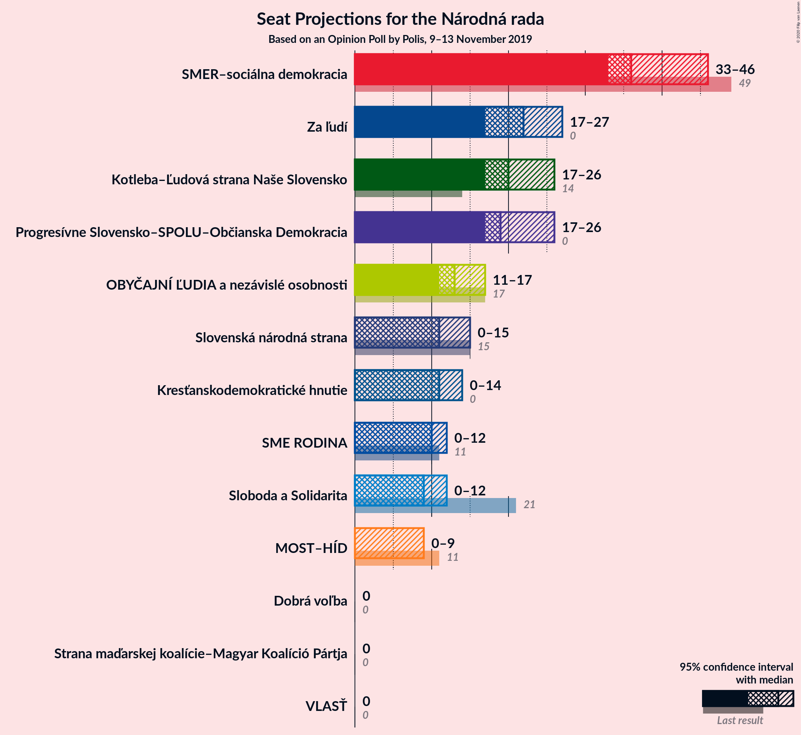
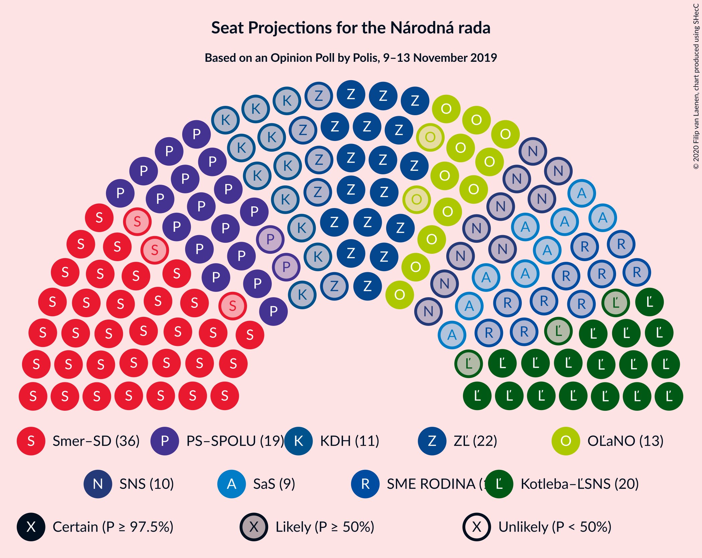
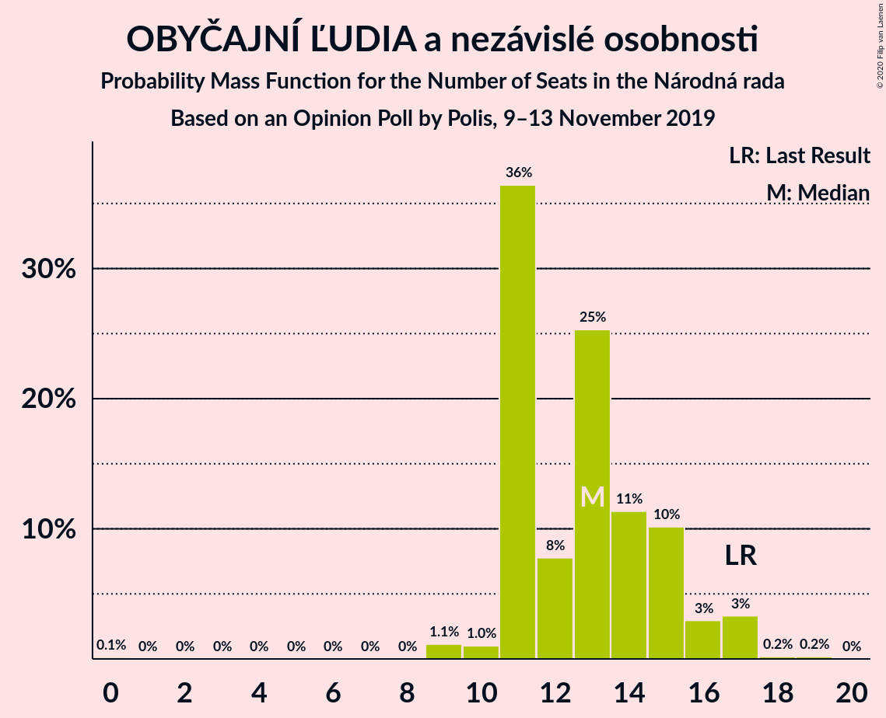
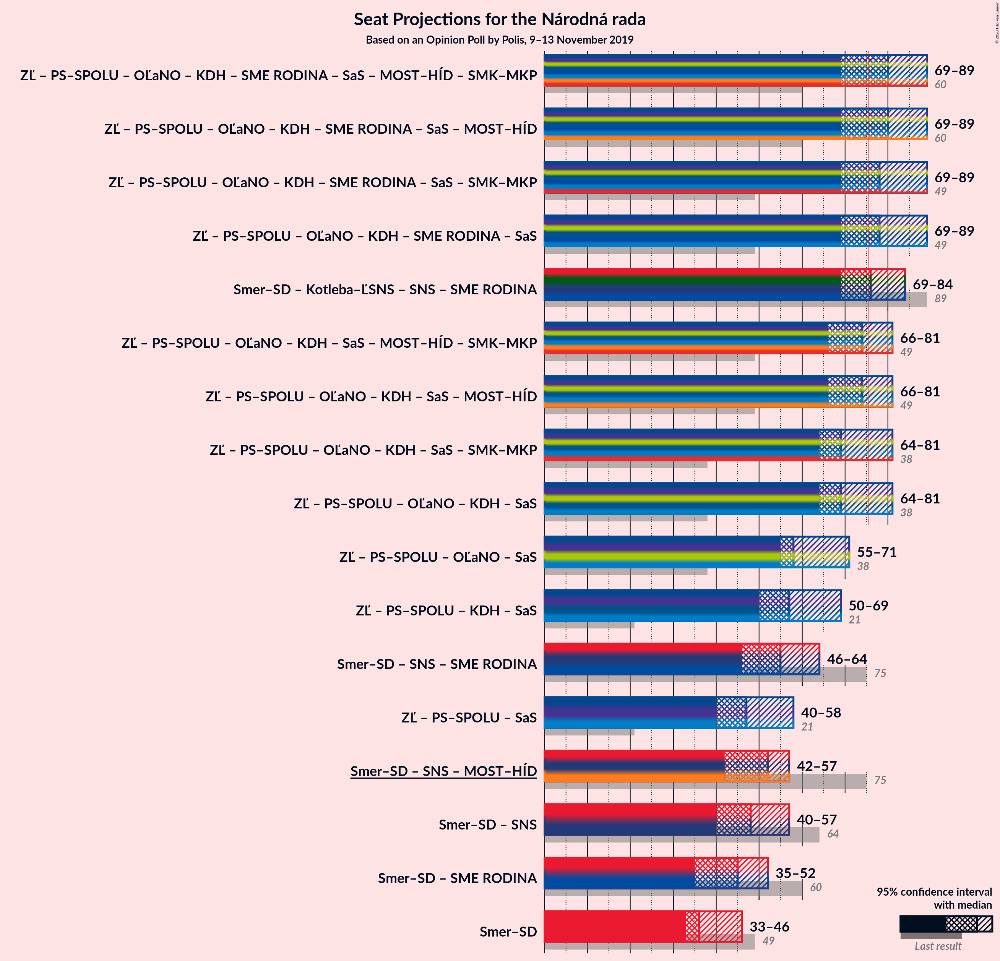
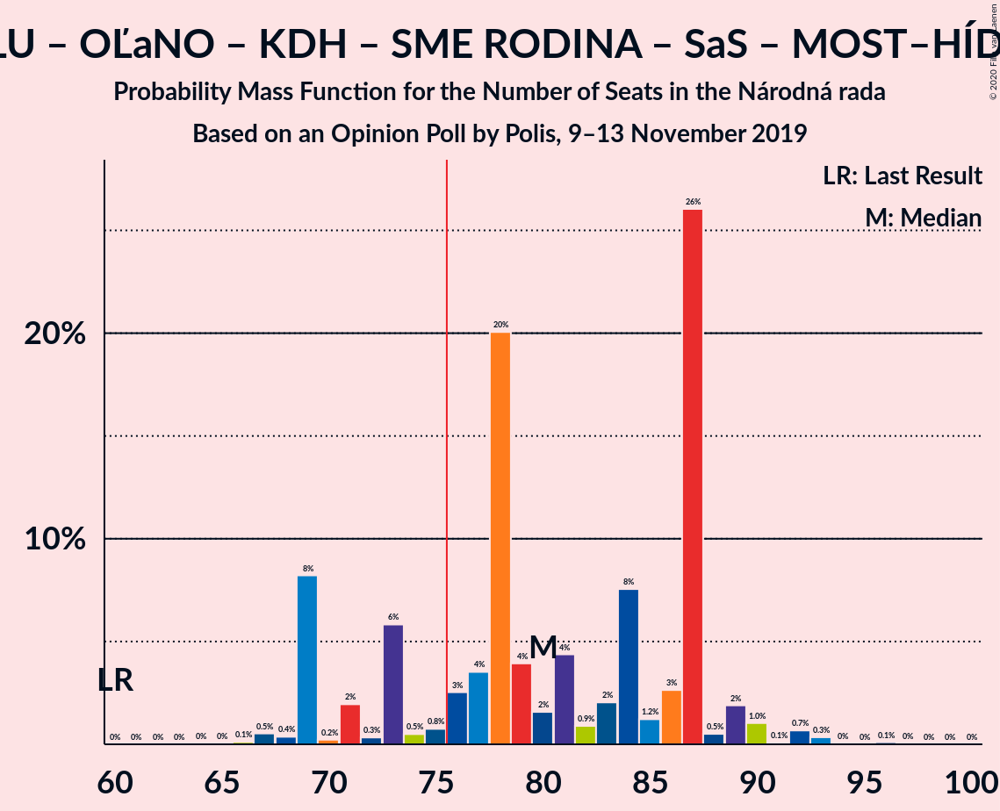
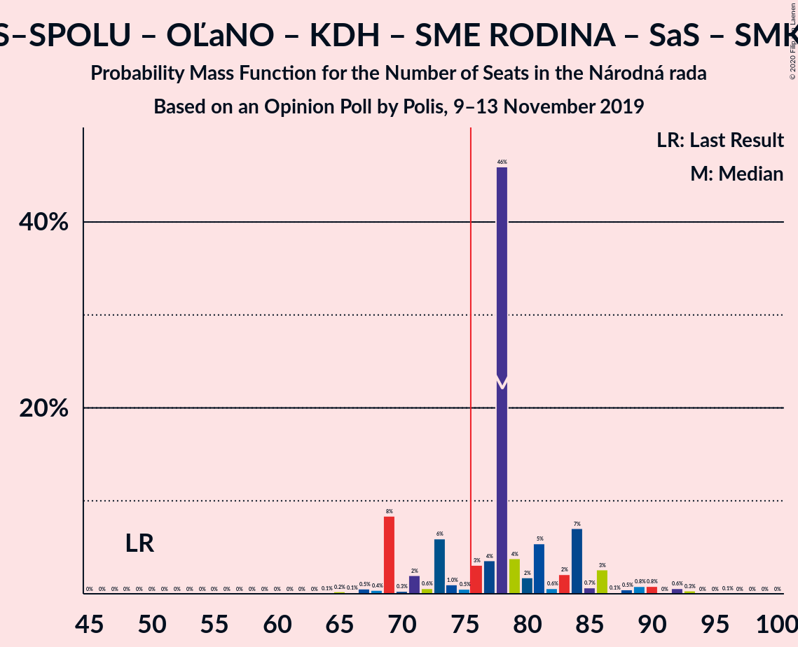
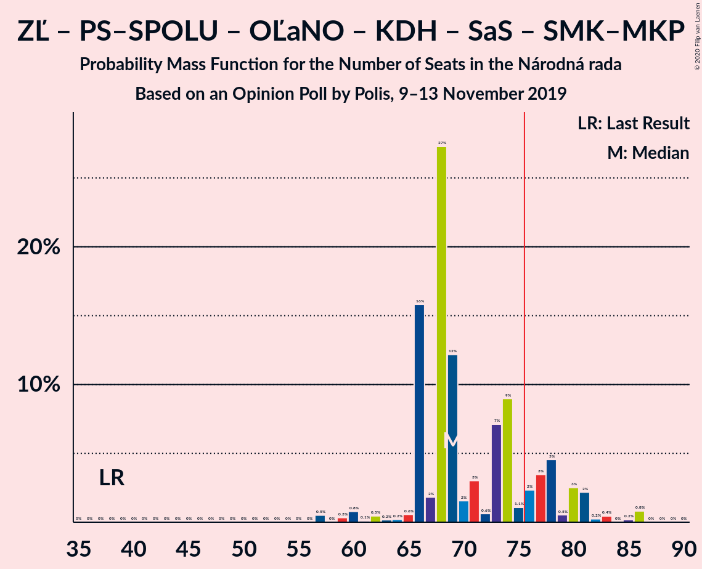
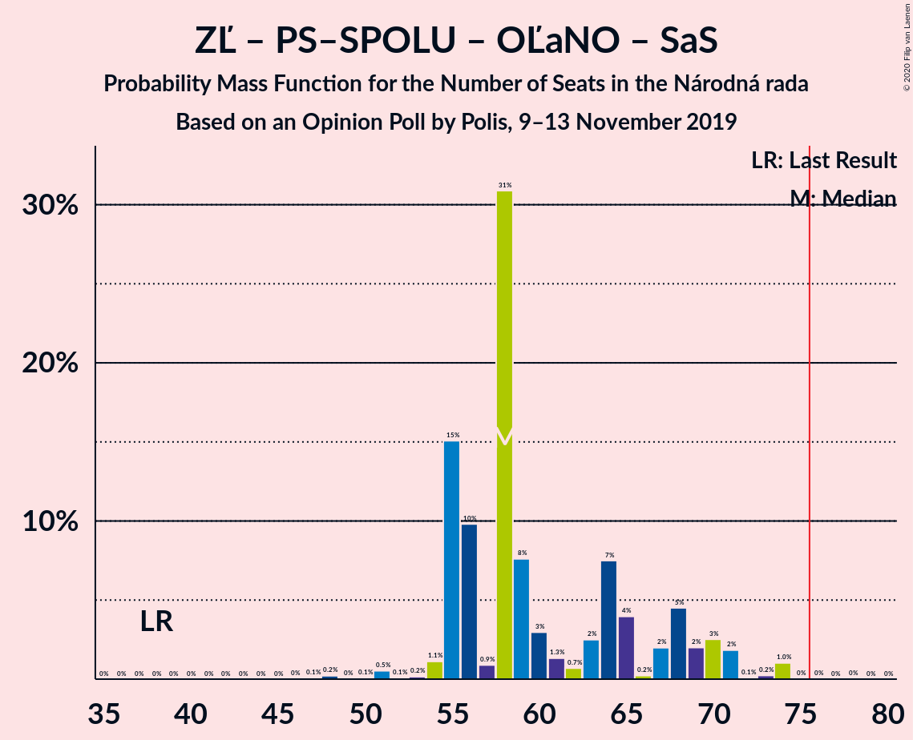
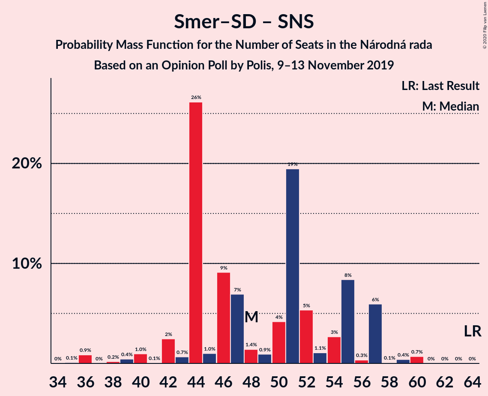
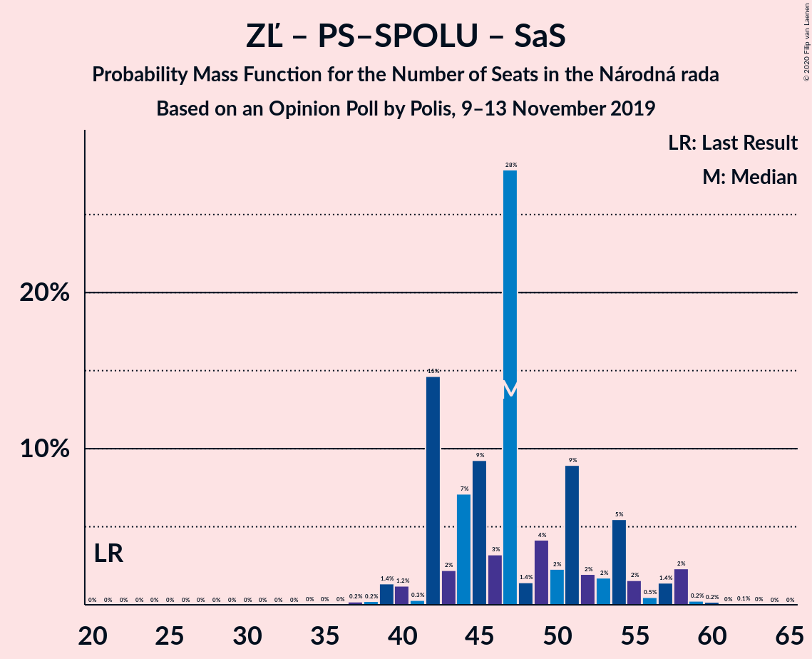

# Opinion Poll by Polis, 9–13 November 2019

<a href="#voting-intentions">Voting Intentions</a> | <a href="#seats">Seats</a> | <a href="#coalitions">Coalitions</a> | <a href="#technical-information">Technical Information</a>

## Voting Intentions

### Confidence Intervals

| Party | Last Result | Poll Result | 80% Confidence Interval | 90% Confidence Interval | 95% Confidence Interval | 99% Confidence Interval |
|:-----:|:-----------:|:-----------:|:-----------------------:|:-----------------------:|:-----------------------:|:-----------------------:|
| SMER–sociálna demokracia | 28.3% | 20.2% | 18.6–21.9% |18.2–22.3% |17.8–22.8% |17.1–23.6% |
| Za ľudí | 0.0% | 11.2% | 10.0–12.5% |9.6–12.9% |9.4–13.3% |8.8–13.9% |
| Kotleba–Ľudová strana Naše Slovensko | 8.0% | 11.1% | 9.9–12.4% |9.6–12.8% |9.3–13.2% |8.7–13.8% |
| Progresívne Slovensko–SPOLU–Občianska Demokracia | 0.0% | 11.1% | 9.9–12.4% |9.6–12.8% |9.3–13.2% |8.7–13.8% |
| OBYČAJNÍ ĽUDIA a nezávislé osobnosti | 11.0% | 7.0% | 6.0–8.1% |5.8–8.4% |5.5–8.7% |5.1–9.3% |
| Slovenská národná strana | 8.6% | 6.1% | 5.2–7.1% |5.0–7.5% |4.8–7.7% |4.4–8.3% |
| Kresťanskodemokratické hnutie | 4.9% | 6.0% | 5.1–7.0% |4.9–7.3% |4.7–7.6% |4.3–8.2% |
| SME RODINA | 6.6% | 5.2% | 4.4–6.2% |4.2–6.5% |4.0–6.7% |3.6–7.3% |
| Sloboda a Solidarita | 12.1% | 5.1% | 4.3–6.1% |4.1–6.4% |3.9–6.6% |3.6–7.1% |
| MOST–HÍD | 6.5% | 4.1% | 3.4–5.0% |3.2–5.3% |3.0–5.5% |2.7–6.0% |
| Strana maďarskej koalície–Magyar Koalíció Pártja | 4.0% | 3.6% | 3.0–4.5% |2.8–4.7% |2.6–5.0% |2.4–5.4% |
| VLASŤ | 0.0% | 3.3% | 2.7–4.2% |2.5–4.4% |2.4–4.6% |2.1–5.1% |
| Dobrá voľba | 0.0% | 2.4% | 1.9–3.2% |1.8–3.4% |1.7–3.6% |1.4–4.0% |

*Note:* The poll result column reflects the actual value used in the calculations. Published results may vary slightly, and in addition be rounded to fewer digits.

## Seats

### Confidence Intervals

| Party | Last Result | Median | 80% Confidence Interval | 90% Confidence Interval | 95% Confidence Interval | 99% Confidence Interval |
|:-----:|:-----------:|:------:|:-----------------------:|:-----------------------:|:-----------------------:|:-----------------------:|
| <a href="#smer–sociálna-demokracia">SMER–sociálna demokracia</a> | 49 | 36 | 36–42 |33–45 |32–45 |29–47 |
| <a href="#za-ľudí">Za ľudí</a> | 0 | 22 | 19–25 |18–25 |16–28 |15–29 |
| <a href="#kotleba–ľudová-strana-naše-slovensko">Kotleba–Ľudová strana Naše Slovensko</a> | 14 | 24 | 19–24 |19–24 |18–25 |16–26 |
| <a href="#progresívne-slovensko–spolu–občianska-demokracia">Progresívne Slovensko–SPOLU–Občianska Demokracia</a> | 0 | 25 | 17–26 |17–26 |17–28 |15–28 |
| <a href="#obyčajní-ľudia-a-nezávislé-osobnosti">OBYČAJNÍ ĽUDIA a nezávislé osobnosti</a> | 17 | 12 | 11–16 |11–16 |10–16 |9–18 |
| <a href="#slovenská-národná-strana">Slovenská národná strana</a> | 15 | 9 | 0–15 |0–15 |0–15 |0–15 |
| <a href="#kresťanskodemokratické-hnutie">Kresťanskodemokratické hnutie</a> | 0 | 11 | 9–14 |9–14 |9–15 |0–16 |
| <a href="#sme-rodina">SME RODINA</a> | 11 | 10 | 0–10 |0–11 |0–12 |0–13 |
| <a href="#sloboda-a-solidarita">Sloboda a Solidarita</a> | 21 | 10 | 0–11 |0–13 |0–13 |0–16 |
| <a href="#most–híd">MOST–HÍD</a> | 11 | 0 | 0 |0–9 |0–10 |0–12 |
| <a href="#strana-maďarskej-koalície–magyar-koalíció-pártja">Strana maďarskej koalície–Magyar Koalíció Pártja</a> | 0 | 0 | 0 |0 |0–9 |0–9 |
| <a href="#vlasť">VLASŤ</a> | 0 | 0 | 0 |0 |0 |0 |
| <a href="#dobrá-voľba">Dobrá voľba</a> | 0 | 0 | 0 |0 |0 |0 |

### SMER–sociálna demokracia

*For a full overview of the results for this party, see the [SMER–sociálna demokracia](party-smer–sociálnademokracia.html) page.*

| Number of Seats | Probability | Accumulated | Special Marks |
|:---------------:|:-----------:|:-----------:|:-------------:|
| 29 | 0.9% | 100% |  |
| 30 | 0.3% | 99.1% |  |
| 31 | 0.4% | 98.9% |  |
| 32 | 2% | 98% |  |
| 33 | 3% | 96% |  |
| 34 | 0.1% | 94% |  |
| 35 | 3% | 93% |  |
| 36 | 49% | 91% | Median |
| 37 | 4% | 42% |  |
| 38 | 2% | 38% |  |
| 39 | 1.2% | 36% |  |
| 40 | 2% | 35% |  |
| 41 | 22% | 32% |  |
| 42 | 1.0% | 11% |  |
| 43 | 3% | 10% |  |
| 44 | 0.2% | 7% |  |
| 45 | 6% | 7% |  |
| 46 | 0.1% | 0.7% |  |
| 47 | 0.5% | 0.6% |  |
| 48 | 0% | 0.1% |  |
| 49 | 0% | 0.1% | Last Result |
| 50 | 0% | 0% |  |

### Za ľudí

*For a full overview of the results for this party, see the [Za ľudí](party-zaľudí.html) page.*

| Number of Seats | Probability | Accumulated | Special Marks |
|:---------------:|:-----------:|:-----------:|:-------------:|
| 0 | 0% | 100% | Last Result |
| 1 | 0% | 100% |  |
| 2 | 0% | 100% |  |
| 3 | 0% | 100% |  |
| 4 | 0% | 100% |  |
| 5 | 0% | 100% |  |
| 6 | 0% | 100% |  |
| 7 | 0% | 100% |  |
| 8 | 0% | 100% |  |
| 9 | 0% | 100% |  |
| 10 | 0% | 100% |  |
| 11 | 0% | 100% |  |
| 12 | 0% | 100% |  |
| 13 | 0% | 100% |  |
| 14 | 0.1% | 100% |  |
| 15 | 2% | 99.9% |  |
| 16 | 3% | 98% |  |
| 17 | 0.3% | 95% |  |
| 18 | 0.2% | 95% |  |
| 19 | 5% | 95% |  |
| 20 | 7% | 89% |  |
| 21 | 1.3% | 83% |  |
| 22 | 50% | 81% | Median |
| 23 | 3% | 32% |  |
| 24 | 18% | 29% |  |
| 25 | 6% | 10% |  |
| 26 | 0.4% | 4% |  |
| 27 | 0.9% | 4% |  |
| 28 | 2% | 3% |  |
| 29 | 0.7% | 0.7% |  |
| 30 | 0% | 0% |  |

### Kotleba–Ľudová strana Naše Slovensko

*For a full overview of the results for this party, see the [Kotleba–Ľudová strana Naše Slovensko](party-kotleba–ľudovástrananašeslovensko.html) page.*

| Number of Seats | Probability | Accumulated | Special Marks |
|:---------------:|:-----------:|:-----------:|:-------------:|
| 14 | 0% | 100% | Last Result |
| 15 | 0.1% | 100% |  |
| 16 | 1.0% | 99.9% |  |
| 17 | 0.5% | 98.9% |  |
| 18 | 3% | 98% |  |
| 19 | 20% | 96% |  |
| 20 | 10% | 76% |  |
| 21 | 9% | 66% |  |
| 22 | 2% | 57% |  |
| 23 | 1.1% | 55% |  |
| 24 | 49% | 53% | Median |
| 25 | 3% | 4% |  |
| 26 | 1.3% | 2% |  |
| 27 | 0.1% | 0.3% |  |
| 28 | 0.2% | 0.2% |  |
| 29 | 0% | 0% |  |

### Progresívne Slovensko–SPOLU–Občianska Demokracia

*For a full overview of the results for this party, see the [Progresívne Slovensko–SPOLU–Občianska Demokracia](party-progresívneslovensko–spolu–občianskademokracia.html) page.*

| Number of Seats | Probability | Accumulated | Special Marks |
|:---------------:|:-----------:|:-----------:|:-------------:|
| 0 | 0% | 100% | Last Result |
| 1 | 0% | 100% |  |
| 2 | 0% | 100% |  |
| 3 | 0% | 100% |  |
| 4 | 0% | 100% |  |
| 5 | 0% | 100% |  |
| 6 | 0% | 100% |  |
| 7 | 0% | 100% |  |
| 8 | 0% | 100% |  |
| 9 | 0% | 100% |  |
| 10 | 0% | 100% |  |
| 11 | 0% | 100% |  |
| 12 | 0% | 100% |  |
| 13 | 0% | 100% |  |
| 14 | 0% | 100% |  |
| 15 | 1.3% | 100% |  |
| 16 | 0.4% | 98.7% |  |
| 17 | 9% | 98% |  |
| 18 | 4% | 89% |  |
| 19 | 6% | 85% |  |
| 20 | 5% | 79% |  |
| 21 | 0.9% | 74% |  |
| 22 | 2% | 73% |  |
| 23 | 3% | 71% |  |
| 24 | 0.7% | 68% |  |
| 25 | 46% | 68% | Median |
| 26 | 17% | 21% |  |
| 27 | 0.1% | 4% |  |
| 28 | 4% | 4% |  |
| 29 | 0.2% | 0.2% |  |
| 30 | 0% | 0% |  |

### OBYČAJNÍ ĽUDIA a nezávislé osobnosti

*For a full overview of the results for this party, see the [OBYČAJNÍ ĽUDIA a nezávislé osobnosti](party-obyčajníľudiaanezávisléosobnosti.html) page.*

| Number of Seats | Probability | Accumulated | Special Marks |
|:---------------:|:-----------:|:-----------:|:-------------:|
| 0 | 0.3% | 100% |  |
| 1 | 0% | 99.7% |  |
| 2 | 0% | 99.7% |  |
| 3 | 0% | 99.7% |  |
| 4 | 0% | 99.7% |  |
| 5 | 0% | 99.7% |  |
| 6 | 0% | 99.7% |  |
| 7 | 0% | 99.7% |  |
| 8 | 0% | 99.7% |  |
| 9 | 0.2% | 99.7% |  |
| 10 | 3% | 99.5% |  |
| 11 | 25% | 96% |  |
| 12 | 49% | 72% | Median |
| 13 | 2% | 23% |  |
| 14 | 1.2% | 20% |  |
| 15 | 6% | 19% |  |
| 16 | 12% | 13% |  |
| 17 | 0.3% | 2% | Last Result |
| 18 | 1.0% | 1.3% |  |
| 19 | 0.3% | 0.3% |  |
| 20 | 0% | 0% |  |

### Slovenská národná strana

*For a full overview of the results for this party, see the [Slovenská národná strana](party-slovenskánárodnástrana.html) page.*

| Number of Seats | Probability | Accumulated | Special Marks |
|:---------------:|:-----------:|:-----------:|:-------------:|
| 0 | 49% | 100% |  |
| 1 | 0% | 51% |  |
| 2 | 0% | 51% |  |
| 3 | 0% | 51% |  |
| 4 | 0% | 51% |  |
| 5 | 0% | 51% |  |
| 6 | 0% | 51% |  |
| 7 | 0% | 51% |  |
| 8 | 0% | 51% |  |
| 9 | 2% | 51% | Median |
| 10 | 6% | 49% |  |
| 11 | 7% | 43% |  |
| 12 | 2% | 36% |  |
| 13 | 4% | 34% |  |
| 14 | 4% | 30% |  |
| 15 | 25% | 25% | Last Result |
| 16 | 0.4% | 0.4% |  |
| 17 | 0% | 0% |  |

### Kresťanskodemokratické hnutie

*For a full overview of the results for this party, see the [Kresťanskodemokratické hnutie](party-kresťanskodemokratickéhnutie.html) page.*

| Number of Seats | Probability | Accumulated | Special Marks |
|:---------------:|:-----------:|:-----------:|:-------------:|
| 0 | 2% | 100% | Last Result |
| 1 | 0% | 98% |  |
| 2 | 0% | 98% |  |
| 3 | 0% | 98% |  |
| 4 | 0% | 98% |  |
| 5 | 0% | 98% |  |
| 6 | 0% | 98% |  |
| 7 | 0% | 98% |  |
| 8 | 0% | 98% |  |
| 9 | 9% | 98% |  |
| 10 | 6% | 88% |  |
| 11 | 57% | 82% | Median |
| 12 | 1.2% | 25% |  |
| 13 | 3% | 24% |  |
| 14 | 18% | 21% |  |
| 15 | 2% | 3% |  |
| 16 | 1.4% | 2% |  |
| 17 | 0.1% | 0.2% |  |
| 18 | 0.1% | 0.1% |  |
| 19 | 0% | 0% |  |

### SME RODINA

*For a full overview of the results for this party, see the [SME RODINA](party-smerodina.html) page.*

| Number of Seats | Probability | Accumulated | Special Marks |
|:---------------:|:-----------:|:-----------:|:-------------:|
| 0 | 37% | 100% |  |
| 1 | 0% | 63% |  |
| 2 | 0% | 63% |  |
| 3 | 0% | 63% |  |
| 4 | 0% | 63% |  |
| 5 | 0% | 63% |  |
| 6 | 0% | 63% |  |
| 7 | 0% | 63% |  |
| 8 | 0% | 63% |  |
| 9 | 3% | 63% |  |
| 10 | 53% | 60% | Median |
| 11 | 3% | 7% | Last Result |
| 12 | 4% | 5% |  |
| 13 | 0.8% | 0.9% |  |
| 14 | 0% | 0.1% |  |
| 15 | 0% | 0% |  |

### Sloboda a Solidarita

*For a full overview of the results for this party, see the [Sloboda a Solidarita](party-slobodaasolidarita.html) page.*

| Number of Seats | Probability | Accumulated | Special Marks |
|:---------------:|:-----------:|:-----------:|:-------------:|
| 0 | 36% | 100% |  |
| 1 | 0% | 64% |  |
| 2 | 0% | 64% |  |
| 3 | 0% | 64% |  |
| 4 | 0% | 64% |  |
| 5 | 0% | 64% |  |
| 6 | 0% | 64% |  |
| 7 | 0% | 64% |  |
| 8 | 0% | 64% |  |
| 9 | 2% | 64% |  |
| 10 | 51% | 62% | Median |
| 11 | 4% | 10% |  |
| 12 | 0.6% | 6% |  |
| 13 | 3% | 5% |  |
| 14 | 0.7% | 2% |  |
| 15 | 0% | 2% |  |
| 16 | 2% | 2% |  |
| 17 | 0% | 0% |  |
| 18 | 0% | 0% |  |
| 19 | 0% | 0% |  |
| 20 | 0% | 0% |  |
| 21 | 0% | 0% | Last Result |

### MOST–HÍD

*For a full overview of the results for this party, see the [MOST–HÍD](party-most–híd.html) page.*

| Number of Seats | Probability | Accumulated | Special Marks |
|:---------------:|:-----------:|:-----------:|:-------------:|
| 0 | 92% | 100% | Median |
| 1 | 0% | 8% |  |
| 2 | 0% | 8% |  |
| 3 | 0% | 8% |  |
| 4 | 0% | 8% |  |
| 5 | 0% | 8% |  |
| 6 | 0% | 8% |  |
| 7 | 0% | 8% |  |
| 8 | 0% | 8% |  |
| 9 | 5% | 8% |  |
| 10 | 2% | 3% |  |
| 11 | 0.2% | 1.2% | Last Result |
| 12 | 1.0% | 1.0% |  |
| 13 | 0% | 0% |  |

### Strana maďarskej koalície–Magyar Koalíció Pártja

*For a full overview of the results for this party, see the [Strana maďarskej koalície–Magyar Koalíció Pártja](party-stranamaďarskejkoalície–magyarkoalíciópártja.html) page.*

| Number of Seats | Probability | Accumulated | Special Marks |
|:---------------:|:-----------:|:-----------:|:-------------:|
| 0 | 97% | 100% | Last Result, Median |
| 1 | 0% | 3% |  |
| 2 | 0% | 3% |  |
| 3 | 0% | 3% |  |
| 4 | 0% | 3% |  |
| 5 | 0% | 3% |  |
| 6 | 0% | 3% |  |
| 7 | 0% | 3% |  |
| 8 | 0% | 3% |  |
| 9 | 2% | 3% |  |
| 10 | 0.2% | 0.2% |  |
| 11 | 0.1% | 0.1% |  |
| 12 | 0% | 0% |  |

### VLASŤ

*For a full overview of the results for this party, see the [VLASŤ](party-vlasť.html) page.*

| Number of Seats | Probability | Accumulated | Special Marks |
|:---------------:|:-----------:|:-----------:|:-------------:|
| 0 | 99.8% | 100% | Last Result, Median |
| 1 | 0% | 0.2% |  |
| 2 | 0% | 0.2% |  |
| 3 | 0% | 0.2% |  |
| 4 | 0% | 0.2% |  |
| 5 | 0% | 0.2% |  |
| 6 | 0% | 0.2% |  |
| 7 | 0% | 0.2% |  |
| 8 | 0% | 0.2% |  |
| 9 | 0.1% | 0.2% |  |
| 10 | 0% | 0.1% |  |
| 11 | 0% | 0% |  |

### Dobrá voľba

*For a full overview of the results for this party, see the [Dobrá voľba](party-dobrávoľba.html) page.*

| Number of Seats | Probability | Accumulated | Special Marks |
|:---------------:|:-----------:|:-----------:|:-------------:|
| 0 | 100% | 100% | Last Result, Median |

## Coalitions

### Confidence Intervals

| Coalition | Last Result | Median | Majority? | 80% Confidence Interval | 90% Confidence Interval | 95% Confidence Interval | 99% Confidence Interval |
|:---------:|:-----------:|:------:|:---------:|:-----------------------:|:-----------------------:|:-----------------------:|:-----------------------:|
| Za ľudí – Progresívne Slovensko–SPOLU–Občianska Demokracia – OBYČAJNÍ ĽUDIA a nezávislé osobnosti – Kresťanskodemokratické hnutie – SME RODINA – Sloboda a Solidarita – MOST–HÍD – Strana maďarskej koalície–Magyar Koalíció Pártja | 60 | 88 | 70% | 73–90 | 69–90 | 69–90 | 69–91 |
| Za ľudí – Progresívne Slovensko–SPOLU–Občianska Demokracia – OBYČAJNÍ ĽUDIA a nezávislé osobnosti – Kresťanskodemokratické hnutie – SME RODINA – Sloboda a Solidarita – MOST–HÍD | 60 | 85 | 70% | 73–90 | 69–90 | 69–90 | 69–91 |
| Za ľudí – Progresívne Slovensko–SPOLU–Občianska Demokracia – OBYČAJNÍ ĽUDIA a nezávislé osobnosti – Kresťanskodemokratické hnutie – SME RODINA – Sloboda a Solidarita – Strana maďarskej koalície–Magyar Koalíció Pártja | 49 | 85 | 66% | 72–90 | 69–90 | 69–90 | 69–90 |
| Za ľudí – Progresívne Slovensko–SPOLU–Občianska Demokracia – OBYČAJNÍ ĽUDIA a nezávislé osobnosti – Kresťanskodemokratické hnutie – SME RODINA – Sloboda a Solidarita | 49 | 85 | 63% | 72–90 | 69–90 | 69–90 | 69–90 |
| SMER–sociálna demokracia – Kotleba–Ľudová strana Naše Slovensko – Slovenská národná strana – SME RODINA | 89 | 70 | 22% | 70–81 | 70–81 | 68–83 | 61–86 |
| Za ľudí – Progresívne Slovensko–SPOLU–Občianska Demokracia – OBYČAJNÍ ĽUDIA a nezávislé osobnosti – Kresťanskodemokratické hnutie – Sloboda a Solidarita – MOST–HÍD – Strana maďarskej koalície–Magyar Koalíció Pártja | 49 | 80 | 58% | 69–80 | 69–80 | 67–82 | 64–89 |
| Za ľudí – Progresívne Slovensko–SPOLU–Občianska Demokracia – OBYČAJNÍ ĽUDIA a nezávislé osobnosti – Kresťanskodemokratické hnutie – Sloboda a Solidarita – MOST–HÍD | 49 | 80 | 56% | 69–80 | 68–80 | 67–82 | 64–89 |
| Za ľudí – Progresívne Slovensko–SPOLU–Občianska Demokracia – OBYČAJNÍ ĽUDIA a nezávislé osobnosti – Kresťanskodemokratické hnutie – Sloboda a Solidarita – Strana maďarskej koalície–Magyar Koalíció Pártja | 38 | 78 | 54% | 69–80 | 67–80 | 63–80 | 62–89 |
| Za ľudí – Progresívne Slovensko–SPOLU–Občianska Demokracia – OBYČAJNÍ ĽUDIA a nezávislé osobnosti – Kresťanskodemokratické hnutie – Sloboda a Solidarita | 38 | 77 | 53% | 69–80 | 63–80 | 61–80 | 59–89 |
| Za ľudí – Progresívne Slovensko–SPOLU–Občianska Demokracia – OBYČAJNÍ ĽUDIA a nezávislé osobnosti – Sloboda a Solidarita | 38 | 67 | 0.2% | 58–69 | 54–69 | 51–73 | 50–73 |
| Za ľudí – Progresívne Slovensko–SPOLU–Občianska Demokracia – Kresťanskodemokratické hnutie – Sloboda a Solidarita | 21 | 64 | 0% | 53–68 | 52–68 | 48–68 | 48–71 |
| SMER–sociálna demokracia – Slovenská národná strana – SME RODINA | 75 | 48 | 0% | 46–60 | 46–60 | 46–64 | 40–64 |
| SMER–sociálna demokracia – Slovenská národná strana – MOST–HÍD | 75 | 47 | 0% | 36–56 | 36–60 | 36–60 | 36–60 |
| SMER–sociálna demokracia – Slovenská národná strana | 64 | 42 | 0% | 36–56 | 36–60 | 36–60 | 36–60 |
| Za ľudí – Progresívne Slovensko–SPOLU–Občianska Demokracia – Sloboda a Solidarita | 21 | 53 | 0% | 42–57 | 42–57 | 39–57 | 38–58 |
| SMER–sociálna demokracia – SME RODINA | 60 | 46 | 0% | 41–46 | 38–49 | 35–53 | 35–55 |
| SMER–sociálna demokracia | 49 | 36 | 0% | 36–42 | 33–45 | 32–45 | 29–47 |

### Za ľudí – Progresívne Slovensko–SPOLU–Občianska Demokracia – OBYČAJNÍ ĽUDIA a nezávislé osobnosti – Kresťanskodemokratické hnutie – SME RODINA – Sloboda a Solidarita – MOST–HÍD – Strana maďarskej koalície–Magyar Koalíció Pártja

| Number of Seats | Probability | Accumulated | Special Marks |
|:---------------:|:-----------:|:-----------:|:-------------:|
| 60 | 0% | 100% | Last Result |
| 61 | 0% | 100% |  |
| 62 | 0% | 100% |  |
| 63 | 0% | 100% |  |
| 64 | 0% | 100% |  |
| 65 | 0% | 100% |  |
| 66 | 0% | 100% |  |
| 67 | 0% | 99.9% |  |
| 68 | 0.1% | 99.9% |  |
| 69 | 6% | 99.8% |  |
| 70 | 0% | 94% |  |
| 71 | 0.1% | 94% |  |
| 72 | 3% | 94% |  |
| 73 | 2% | 91% |  |
| 74 | 1.3% | 89% |  |
| 75 | 17% | 88% |  |
| 76 | 0.3% | 70% | Majority |
| 77 | 3% | 70% |  |
| 78 | 0.1% | 67% |  |
| 79 | 3% | 67% |  |
| 80 | 2% | 64% |  |
| 81 | 0.3% | 62% |  |
| 82 | 5% | 62% |  |
| 83 | 2% | 56% |  |
| 84 | 0.2% | 55% |  |
| 85 | 3% | 54% |  |
| 86 | 0.2% | 52% |  |
| 87 | 0.7% | 52% |  |
| 88 | 2% | 51% |  |
| 89 | 1.0% | 49% |  |
| 90 | 46% | 48% | Median |
| 91 | 1.0% | 1.3% |  |
| 92 | 0.2% | 0.3% |  |
| 93 | 0% | 0.1% |  |
| 94 | 0% | 0.1% |  |
| 95 | 0% | 0.1% |  |
| 96 | 0% | 0.1% |  |
| 97 | 0% | 0% |  |

### Za ľudí – Progresívne Slovensko–SPOLU–Občianska Demokracia – OBYČAJNÍ ĽUDIA a nezávislé osobnosti – Kresťanskodemokratické hnutie – SME RODINA – Sloboda a Solidarita – MOST–HÍD

| Number of Seats | Probability | Accumulated | Special Marks |
|:---------------:|:-----------:|:-----------:|:-------------:|
| 60 | 0% | 100% | Last Result |
| 61 | 0% | 100% |  |
| 62 | 0% | 100% |  |
| 63 | 0% | 100% |  |
| 64 | 0% | 100% |  |
| 65 | 0% | 100% |  |
| 66 | 0.1% | 100% |  |
| 67 | 0% | 99.9% |  |
| 68 | 0.1% | 99.9% |  |
| 69 | 6% | 99.8% |  |
| 70 | 0% | 94% |  |
| 71 | 0.1% | 94% |  |
| 72 | 3% | 94% |  |
| 73 | 2% | 91% |  |
| 74 | 1.3% | 89% |  |
| 75 | 17% | 88% |  |
| 76 | 0.3% | 70% | Majority |
| 77 | 3% | 70% |  |
| 78 | 0.1% | 67% |  |
| 79 | 5% | 67% |  |
| 80 | 2% | 61% |  |
| 81 | 0.4% | 60% |  |
| 82 | 5% | 59% |  |
| 83 | 2% | 54% |  |
| 84 | 0.2% | 52% |  |
| 85 | 3% | 52% |  |
| 86 | 0.2% | 49% |  |
| 87 | 0.7% | 49% |  |
| 88 | 0.1% | 48% |  |
| 89 | 1.0% | 48% |  |
| 90 | 46% | 47% | Median |
| 91 | 1.0% | 1.1% |  |
| 92 | 0% | 0.1% |  |
| 93 | 0% | 0.1% |  |
| 94 | 0% | 0.1% |  |
| 95 | 0% | 0.1% |  |
| 96 | 0% | 0% |  |

### Za ľudí – Progresívne Slovensko–SPOLU–Občianska Demokracia – OBYČAJNÍ ĽUDIA a nezávislé osobnosti – Kresťanskodemokratické hnutie – SME RODINA – Sloboda a Solidarita – Strana maďarskej koalície–Magyar Koalíció Pártja

| Number of Seats | Probability | Accumulated | Special Marks |
|:---------------:|:-----------:|:-----------:|:-------------:|
| 49 | 0% | 100% | Last Result |
| 50 | 0% | 100% |  |
| 51 | 0% | 100% |  |
| 52 | 0% | 100% |  |
| 53 | 0% | 100% |  |
| 54 | 0% | 100% |  |
| 55 | 0% | 100% |  |
| 56 | 0% | 100% |  |
| 57 | 0.1% | 100% |  |
| 58 | 0% | 99.9% |  |
| 59 | 0% | 99.9% |  |
| 60 | 0% | 99.9% |  |
| 61 | 0% | 99.9% |  |
| 62 | 0% | 99.9% |  |
| 63 | 0% | 99.9% |  |
| 64 | 0% | 99.9% |  |
| 65 | 0.1% | 99.9% |  |
| 66 | 0.1% | 99.8% |  |
| 67 | 0% | 99.8% |  |
| 68 | 0% | 99.8% |  |
| 69 | 6% | 99.7% |  |
| 70 | 0.1% | 94% |  |
| 71 | 0.4% | 94% |  |
| 72 | 4% | 93% |  |
| 73 | 4% | 89% |  |
| 74 | 3% | 86% |  |
| 75 | 17% | 83% |  |
| 76 | 0.3% | 66% | Majority |
| 77 | 3% | 65% |  |
| 78 | 0.1% | 62% |  |
| 79 | 6% | 62% |  |
| 80 | 2% | 56% |  |
| 81 | 0.1% | 54% |  |
| 82 | 3% | 54% |  |
| 83 | 0.3% | 52% |  |
| 84 | 0.1% | 51% |  |
| 85 | 3% | 51% |  |
| 86 | 0.2% | 49% |  |
| 87 | 0.7% | 48% |  |
| 88 | 0.1% | 48% |  |
| 89 | 1.0% | 48% |  |
| 90 | 46% | 47% | Median |
| 91 | 0.1% | 0.3% |  |
| 92 | 0.2% | 0.2% |  |
| 93 | 0% | 0.1% |  |
| 94 | 0% | 0.1% |  |
| 95 | 0% | 0.1% |  |
| 96 | 0% | 0% |  |

### Za ľudí – Progresívne Slovensko–SPOLU–Občianska Demokracia – OBYČAJNÍ ĽUDIA a nezávislé osobnosti – Kresťanskodemokratické hnutie – SME RODINA – Sloboda a Solidarita

| Number of Seats | Probability | Accumulated | Special Marks |
|:---------------:|:-----------:|:-----------:|:-------------:|
| 49 | 0% | 100% | Last Result |
| 50 | 0% | 100% |  |
| 51 | 0% | 100% |  |
| 52 | 0% | 100% |  |
| 53 | 0% | 100% |  |
| 54 | 0% | 100% |  |
| 55 | 0% | 100% |  |
| 56 | 0% | 100% |  |
| 57 | 0.1% | 100% |  |
| 58 | 0% | 99.9% |  |
| 59 | 0% | 99.9% |  |
| 60 | 0% | 99.9% |  |
| 61 | 0% | 99.9% |  |
| 62 | 0% | 99.9% |  |
| 63 | 0% | 99.9% |  |
| 64 | 0% | 99.9% |  |
| 65 | 0.1% | 99.9% |  |
| 66 | 0.1% | 99.8% |  |
| 67 | 0% | 99.7% |  |
| 68 | 0% | 99.7% |  |
| 69 | 6% | 99.7% |  |
| 70 | 2% | 94% |  |
| 71 | 0.4% | 91% |  |
| 72 | 4% | 91% |  |
| 73 | 4% | 87% |  |
| 74 | 3% | 83% |  |
| 75 | 17% | 81% |  |
| 76 | 0.3% | 63% | Majority |
| 77 | 3% | 63% |  |
| 78 | 0.1% | 60% |  |
| 79 | 4% | 60% |  |
| 80 | 2% | 56% |  |
| 81 | 0.1% | 54% |  |
| 82 | 3% | 54% |  |
| 83 | 0.4% | 51% |  |
| 84 | 0.1% | 51% |  |
| 85 | 3% | 51% |  |
| 86 | 0.1% | 48% |  |
| 87 | 0.7% | 48% |  |
| 88 | 0.1% | 47% |  |
| 89 | 1.0% | 47% |  |
| 90 | 46% | 46% | Median |
| 91 | 0% | 0% |  |

### SMER–sociálna demokracia – Kotleba–Ľudová strana Naše Slovensko – Slovenská národná strana – SME RODINA

| Number of Seats | Probability | Accumulated | Special Marks |
|:---------------:|:-----------:|:-----------:|:-------------:|
| 61 | 0.9% | 100% |  |
| 62 | 0% | 99.1% |  |
| 63 | 0% | 99.1% |  |
| 64 | 0% | 99.1% |  |
| 65 | 0% | 99.0% |  |
| 66 | 0.1% | 99.0% |  |
| 67 | 1.1% | 98.9% |  |
| 68 | 1.3% | 98% |  |
| 69 | 0.3% | 97% |  |
| 70 | 48% | 96% |  |
| 71 | 0.9% | 48% |  |
| 72 | 0.1% | 48% |  |
| 73 | 5% | 47% |  |
| 74 | 0.4% | 42% |  |
| 75 | 20% | 42% |  |
| 76 | 0.6% | 22% | Majority |
| 77 | 4% | 21% |  |
| 78 | 6% | 17% |  |
| 79 | 0.6% | 11% | Median |
| 80 | 0% | 10% |  |
| 81 | 6% | 10% |  |
| 82 | 0.4% | 4% |  |
| 83 | 2% | 4% |  |
| 84 | 0% | 1.3% |  |
| 85 | 0.2% | 1.3% |  |
| 86 | 0.9% | 1.1% |  |
| 87 | 0.1% | 0.2% |  |
| 88 | 0% | 0.1% |  |
| 89 | 0.1% | 0.1% | Last Result |
| 90 | 0% | 0% |  |

### Za ľudí – Progresívne Slovensko–SPOLU–Občianska Demokracia – OBYČAJNÍ ĽUDIA a nezávislé osobnosti – Kresťanskodemokratické hnutie – Sloboda a Solidarita – MOST–HÍD – Strana maďarskej koalície–Magyar Koalíció Pártja

| Number of Seats | Probability | Accumulated | Special Marks |
|:---------------:|:-----------:|:-----------:|:-------------:|
| 49 | 0% | 100% | Last Result |
| 50 | 0% | 100% |  |
| 51 | 0% | 100% |  |
| 52 | 0% | 100% |  |
| 53 | 0% | 100% |  |
| 54 | 0% | 100% |  |
| 55 | 0% | 100% |  |
| 56 | 0% | 100% |  |
| 57 | 0% | 100% |  |
| 58 | 0% | 99.9% |  |
| 59 | 0% | 99.9% |  |
| 60 | 0% | 99.9% |  |
| 61 | 0.1% | 99.9% |  |
| 62 | 0% | 99.9% |  |
| 63 | 0.1% | 99.9% |  |
| 64 | 0.9% | 99.8% |  |
| 65 | 0.2% | 98.9% |  |
| 66 | 0% | 98.7% |  |
| 67 | 2% | 98.6% |  |
| 68 | 0.4% | 96% |  |
| 69 | 6% | 96% |  |
| 70 | 0% | 90% |  |
| 71 | 0.6% | 90% |  |
| 72 | 6% | 89% |  |
| 73 | 4% | 83% |  |
| 74 | 0.7% | 79% |  |
| 75 | 20% | 78% |  |
| 76 | 0.4% | 58% | Majority |
| 77 | 5% | 58% |  |
| 78 | 0.1% | 52% |  |
| 79 | 0.9% | 52% |  |
| 80 | 48% | 51% | Median |
| 81 | 0.3% | 4% |  |
| 82 | 1.3% | 3% |  |
| 83 | 1.0% | 2% |  |
| 84 | 0.1% | 1.0% |  |
| 85 | 0% | 1.0% |  |
| 86 | 0% | 0.9% |  |
| 87 | 0% | 0.9% |  |
| 88 | 0% | 0.9% |  |
| 89 | 0.9% | 0.9% |  |
| 90 | 0% | 0% |  |

### Za ľudí – Progresívne Slovensko–SPOLU–Občianska Demokracia – OBYČAJNÍ ĽUDIA a nezávislé osobnosti – Kresťanskodemokratické hnutie – Sloboda a Solidarita – MOST–HÍD

| Number of Seats | Probability | Accumulated | Special Marks |
|:---------------:|:-----------:|:-----------:|:-------------:|
| 49 | 0% | 100% | Last Result |
| 50 | 0% | 100% |  |
| 51 | 0% | 100% |  |
| 52 | 0% | 100% |  |
| 53 | 0% | 100% |  |
| 54 | 0% | 100% |  |
| 55 | 0% | 100% |  |
| 56 | 0% | 100% |  |
| 57 | 0% | 100% |  |
| 58 | 0% | 99.9% |  |
| 59 | 0% | 99.9% |  |
| 60 | 0% | 99.9% |  |
| 61 | 0.1% | 99.9% |  |
| 62 | 0% | 99.8% |  |
| 63 | 0.1% | 99.8% |  |
| 64 | 0.9% | 99.7% |  |
| 65 | 0.3% | 98.9% |  |
| 66 | 0% | 98.6% |  |
| 67 | 2% | 98.6% |  |
| 68 | 3% | 96% |  |
| 69 | 6% | 94% |  |
| 70 | 0% | 88% |  |
| 71 | 0.6% | 88% |  |
| 72 | 6% | 87% |  |
| 73 | 5% | 81% |  |
| 74 | 0.7% | 76% |  |
| 75 | 20% | 75% |  |
| 76 | 0.3% | 56% | Majority |
| 77 | 3% | 55% |  |
| 78 | 0.1% | 52% |  |
| 79 | 0.9% | 52% |  |
| 80 | 48% | 51% | Median |
| 81 | 0.3% | 3% |  |
| 82 | 1.1% | 3% |  |
| 83 | 0.9% | 2% |  |
| 84 | 0.1% | 1.0% |  |
| 85 | 0% | 1.0% |  |
| 86 | 0% | 0.9% |  |
| 87 | 0% | 0.9% |  |
| 88 | 0% | 0.9% |  |
| 89 | 0.9% | 0.9% |  |
| 90 | 0% | 0% |  |

### Za ľudí – Progresívne Slovensko–SPOLU–Občianska Demokracia – OBYČAJNÍ ĽUDIA a nezávislé osobnosti – Kresťanskodemokratické hnutie – Sloboda a Solidarita – Strana maďarskej koalície–Magyar Koalíció Pártja

| Number of Seats | Probability | Accumulated | Special Marks |
|:---------------:|:-----------:|:-----------:|:-------------:|
| 38 | 0% | 100% | Last Result |
| 39 | 0% | 100% |  |
| 40 | 0% | 100% |  |
| 41 | 0% | 100% |  |
| 42 | 0% | 100% |  |
| 43 | 0% | 100% |  |
| 44 | 0% | 100% |  |
| 45 | 0% | 100% |  |
| 46 | 0% | 100% |  |
| 47 | 0% | 100% |  |
| 48 | 0% | 100% |  |
| 49 | 0% | 100% |  |
| 50 | 0% | 100% |  |
| 51 | 0% | 100% |  |
| 52 | 0% | 100% |  |
| 53 | 0% | 100% |  |
| 54 | 0.1% | 100% |  |
| 55 | 0% | 99.9% |  |
| 56 | 0% | 99.9% |  |
| 57 | 0.1% | 99.9% |  |
| 58 | 0% | 99.8% |  |
| 59 | 0% | 99.8% |  |
| 60 | 0% | 99.8% |  |
| 61 | 0.1% | 99.8% |  |
| 62 | 2% | 99.7% |  |
| 63 | 2% | 98% |  |
| 64 | 1.0% | 96% |  |
| 65 | 0.2% | 95% |  |
| 66 | 0.1% | 95% |  |
| 67 | 2% | 95% |  |
| 68 | 3% | 93% |  |
| 69 | 6% | 90% |  |
| 70 | 1.1% | 84% |  |
| 71 | 0.4% | 83% |  |
| 72 | 4% | 83% |  |
| 73 | 5% | 79% |  |
| 74 | 1.1% | 75% |  |
| 75 | 20% | 73% |  |
| 76 | 0.4% | 54% | Majority |
| 77 | 3% | 53% |  |
| 78 | 0.1% | 50% |  |
| 79 | 0.9% | 50% |  |
| 80 | 48% | 49% | Median |
| 81 | 0% | 1.5% |  |
| 82 | 0.4% | 1.5% |  |
| 83 | 0.1% | 1.1% |  |
| 84 | 0% | 0.9% |  |
| 85 | 0% | 0.9% |  |
| 86 | 0% | 0.9% |  |
| 87 | 0% | 0.9% |  |
| 88 | 0% | 0.9% |  |
| 89 | 0.9% | 0.9% |  |
| 90 | 0% | 0% |  |

### Za ľudí – Progresívne Slovensko–SPOLU–Občianska Demokracia – OBYČAJNÍ ĽUDIA a nezávislé osobnosti – Kresťanskodemokratické hnutie – Sloboda a Solidarita

| Number of Seats | Probability | Accumulated | Special Marks |
|:---------------:|:-----------:|:-----------:|:-------------:|
| 38 | 0% | 100% | Last Result |
| 39 | 0% | 100% |  |
| 40 | 0% | 100% |  |
| 41 | 0% | 100% |  |
| 42 | 0% | 100% |  |
| 43 | 0% | 100% |  |
| 44 | 0% | 100% |  |
| 45 | 0% | 100% |  |
| 46 | 0% | 100% |  |
| 47 | 0% | 100% |  |
| 48 | 0% | 100% |  |
| 49 | 0% | 100% |  |
| 50 | 0% | 100% |  |
| 51 | 0% | 100% |  |
| 52 | 0% | 100% |  |
| 53 | 0% | 100% |  |
| 54 | 0.1% | 100% |  |
| 55 | 0% | 99.9% |  |
| 56 | 0% | 99.9% |  |
| 57 | 0.1% | 99.9% |  |
| 58 | 0% | 99.8% |  |
| 59 | 2% | 99.8% |  |
| 60 | 0% | 98% |  |
| 61 | 0.1% | 98% |  |
| 62 | 2% | 97% |  |
| 63 | 2% | 96% |  |
| 64 | 1.0% | 94% |  |
| 65 | 0.3% | 93% |  |
| 66 | 0.1% | 93% |  |
| 67 | 2% | 93% |  |
| 68 | 0.4% | 91% |  |
| 69 | 6% | 90% |  |
| 70 | 1.1% | 84% |  |
| 71 | 0.4% | 83% |  |
| 72 | 4% | 83% |  |
| 73 | 5% | 79% |  |
| 74 | 1.1% | 74% |  |
| 75 | 20% | 73% |  |
| 76 | 0.3% | 53% | Majority |
| 77 | 3% | 53% |  |
| 78 | 0.1% | 50% |  |
| 79 | 0.9% | 50% |  |
| 80 | 48% | 49% | Median |
| 81 | 0% | 1.2% |  |
| 82 | 0.2% | 1.2% |  |
| 83 | 0% | 0.9% |  |
| 84 | 0% | 0.9% |  |
| 85 | 0% | 0.9% |  |
| 86 | 0% | 0.9% |  |
| 87 | 0% | 0.9% |  |
| 88 | 0% | 0.9% |  |
| 89 | 0.9% | 0.9% |  |
| 90 | 0% | 0% |  |

### Za ľudí – Progresívne Slovensko–SPOLU–Občianska Demokracia – OBYČAJNÍ ĽUDIA a nezávislé osobnosti – Sloboda a Solidarita

| Number of Seats | Probability | Accumulated | Special Marks |
|:---------------:|:-----------:|:-----------:|:-------------:|
| 38 | 0% | 100% | Last Result |
| 39 | 0% | 100% |  |
| 40 | 0% | 100% |  |
| 41 | 0% | 100% |  |
| 42 | 0% | 100% |  |
| 43 | 0% | 100% |  |
| 44 | 0% | 100% |  |
| 45 | 0% | 100% |  |
| 46 | 0% | 100% |  |
| 47 | 0.1% | 100% |  |
| 48 | 0% | 99.9% |  |
| 49 | 0% | 99.8% |  |
| 50 | 2% | 99.8% |  |
| 51 | 2% | 98% |  |
| 52 | 0.6% | 96% |  |
| 53 | 0% | 95% |  |
| 54 | 2% | 95% |  |
| 55 | 0.1% | 93% |  |
| 56 | 0.1% | 93% |  |
| 57 | 0.2% | 93% |  |
| 58 | 9% | 93% |  |
| 59 | 0.8% | 84% |  |
| 60 | 0.3% | 83% |  |
| 61 | 21% | 83% |  |
| 62 | 2% | 62% |  |
| 63 | 0.6% | 60% |  |
| 64 | 4% | 60% |  |
| 65 | 3% | 56% |  |
| 66 | 0% | 53% |  |
| 67 | 3% | 53% |  |
| 68 | 0.1% | 50% |  |
| 69 | 46% | 50% | Median |
| 70 | 0% | 3% |  |
| 71 | 0% | 3% |  |
| 72 | 0% | 3% |  |
| 73 | 3% | 3% |  |
| 74 | 0% | 0.3% |  |
| 75 | 0% | 0.2% |  |
| 76 | 0.2% | 0.2% | Majority |
| 77 | 0% | 0% |  |

### Za ľudí – Progresívne Slovensko–SPOLU–Občianska Demokracia – Kresťanskodemokratické hnutie – Sloboda a Solidarita

| Number of Seats | Probability | Accumulated | Special Marks |
|:---------------:|:-----------:|:-----------:|:-------------:|
| 21 | 0% | 100% | Last Result |
| 22 | 0% | 100% |  |
| 23 | 0% | 100% |  |
| 24 | 0% | 100% |  |
| 25 | 0% | 100% |  |
| 26 | 0% | 100% |  |
| 27 | 0% | 100% |  |
| 28 | 0% | 100% |  |
| 29 | 0% | 100% |  |
| 30 | 0% | 100% |  |
| 31 | 0% | 100% |  |
| 32 | 0% | 100% |  |
| 33 | 0% | 100% |  |
| 34 | 0% | 100% |  |
| 35 | 0% | 100% |  |
| 36 | 0% | 100% |  |
| 37 | 0% | 100% |  |
| 38 | 0% | 100% |  |
| 39 | 0% | 100% |  |
| 40 | 0% | 100% |  |
| 41 | 0% | 100% |  |
| 42 | 0.1% | 100% |  |
| 43 | 0.1% | 99.9% |  |
| 44 | 0% | 99.8% |  |
| 45 | 0% | 99.8% |  |
| 46 | 0.1% | 99.8% |  |
| 47 | 0% | 99.8% |  |
| 48 | 3% | 99.8% |  |
| 49 | 0.1% | 97% |  |
| 50 | 0% | 97% |  |
| 51 | 0.9% | 97% |  |
| 52 | 0.9% | 96% |  |
| 53 | 8% | 95% |  |
| 54 | 0.3% | 87% |  |
| 55 | 3% | 87% |  |
| 56 | 0.3% | 84% |  |
| 57 | 1.2% | 84% |  |
| 58 | 4% | 83% |  |
| 59 | 2% | 79% |  |
| 60 | 0.8% | 76% |  |
| 61 | 6% | 76% |  |
| 62 | 1.0% | 70% |  |
| 63 | 0.8% | 69% |  |
| 64 | 19% | 68% |  |
| 65 | 0% | 49% |  |
| 66 | 1.2% | 49% |  |
| 67 | 0% | 47% |  |
| 68 | 46% | 47% | Median |
| 69 | 0% | 1.0% |  |
| 70 | 0% | 0.9% |  |
| 71 | 0.9% | 0.9% |  |
| 72 | 0% | 0.1% |  |
| 73 | 0% | 0% |  |

### SMER–sociálna demokracia – Slovenská národná strana – SME RODINA

| Number of Seats | Probability | Accumulated | Special Marks |
|:---------------:|:-----------:|:-----------:|:-------------:|
| 40 | 0.9% | 100% |  |
| 41 | 0% | 99.1% |  |
| 42 | 0% | 99.1% |  |
| 43 | 0.1% | 99.1% |  |
| 44 | 0% | 99.0% |  |
| 45 | 0% | 99.0% |  |
| 46 | 46% | 98.9% |  |
| 47 | 2% | 53% |  |
| 48 | 1.1% | 50% |  |
| 49 | 2% | 49% |  |
| 50 | 0.1% | 48% |  |
| 51 | 1.2% | 48% |  |
| 52 | 2% | 47% |  |
| 53 | 5% | 44% |  |
| 54 | 3% | 40% |  |
| 55 | 1.4% | 37% | Median |
| 56 | 19% | 35% |  |
| 57 | 4% | 16% |  |
| 58 | 0.1% | 12% |  |
| 59 | 1.0% | 12% |  |
| 60 | 6% | 11% |  |
| 61 | 2% | 4% |  |
| 62 | 0.1% | 3% |  |
| 63 | 0.1% | 3% |  |
| 64 | 2% | 3% |  |
| 65 | 0% | 0.2% |  |
| 66 | 0.1% | 0.2% |  |
| 67 | 0.1% | 0.1% |  |
| 68 | 0% | 0.1% |  |
| 69 | 0% | 0% |  |
| 70 | 0% | 0% |  |
| 71 | 0% | 0% |  |
| 72 | 0% | 0% |  |
| 73 | 0% | 0% |  |
| 74 | 0% | 0% |  |
| 75 | 0% | 0% | Last Result |

### SMER–sociálna demokracia – Slovenská národná strana – MOST–HÍD

| Number of Seats | Probability | Accumulated | Special Marks |
|:---------------:|:-----------:|:-----------:|:-------------:|
| 33 | 0.1% | 100% |  |
| 34 | 0% | 99.9% |  |
| 35 | 0% | 99.9% |  |
| 36 | 46% | 99.9% |  |
| 37 | 0% | 54% |  |
| 38 | 0% | 54% |  |
| 39 | 0% | 54% |  |
| 40 | 0.9% | 54% |  |
| 41 | 0.1% | 53% |  |
| 42 | 1.0% | 53% |  |
| 43 | 0.9% | 52% |  |
| 44 | 0.1% | 51% |  |
| 45 | 0% | 51% | Median |
| 46 | 0.1% | 51% |  |
| 47 | 3% | 50% |  |
| 48 | 3% | 47% |  |
| 49 | 2% | 45% |  |
| 50 | 0.1% | 43% |  |
| 51 | 5% | 43% |  |
| 52 | 4% | 38% |  |
| 53 | 2% | 34% |  |
| 54 | 3% | 32% |  |
| 55 | 2% | 28% |  |
| 56 | 17% | 27% |  |
| 57 | 0.5% | 9% |  |
| 58 | 0.7% | 9% |  |
| 59 | 1.3% | 8% |  |
| 60 | 6% | 7% |  |
| 61 | 0% | 0.3% |  |
| 62 | 0% | 0.3% |  |
| 63 | 0.1% | 0.2% |  |
| 64 | 0% | 0.2% |  |
| 65 | 0% | 0.1% |  |
| 66 | 0% | 0.1% |  |
| 67 | 0% | 0.1% |  |
| 68 | 0.1% | 0.1% |  |
| 69 | 0% | 0% |  |
| 70 | 0% | 0% |  |
| 71 | 0% | 0% |  |
| 72 | 0% | 0% |  |
| 73 | 0% | 0% |  |
| 74 | 0% | 0% |  |
| 75 | 0% | 0% | Last Result |

### SMER–sociálna demokracia – Slovenská národná strana

| Number of Seats | Probability | Accumulated | Special Marks |
|:---------------:|:-----------:|:-----------:|:-------------:|
| 33 | 0.1% | 100% |  |
| 34 | 0% | 99.9% |  |
| 35 | 0% | 99.9% |  |
| 36 | 46% | 99.9% |  |
| 37 | 0% | 54% |  |
| 38 | 0% | 54% |  |
| 39 | 0.9% | 54% |  |
| 40 | 0.9% | 53% |  |
| 41 | 0.3% | 52% |  |
| 42 | 3% | 52% |  |
| 43 | 0.9% | 48% |  |
| 44 | 0.2% | 47% |  |
| 45 | 0.1% | 47% | Median |
| 46 | 2% | 47% |  |
| 47 | 4% | 45% |  |
| 48 | 3% | 41% |  |
| 49 | 3% | 39% |  |
| 50 | 0.1% | 35% |  |
| 51 | 2% | 35% |  |
| 52 | 4% | 33% |  |
| 53 | 2% | 29% |  |
| 54 | 3% | 27% |  |
| 55 | 0.1% | 24% |  |
| 56 | 17% | 24% |  |
| 57 | 0.2% | 7% |  |
| 58 | 0.1% | 7% |  |
| 59 | 0.1% | 6% |  |
| 60 | 6% | 6% |  |
| 61 | 0% | 0% |  |
| 62 | 0% | 0% |  |
| 63 | 0% | 0% |  |
| 64 | 0% | 0% | Last Result |

### Za ľudí – Progresívne Slovensko–SPOLU–Občianska Demokracia – Sloboda a Solidarita

| Number of Seats | Probability | Accumulated | Special Marks |
|:---------------:|:-----------:|:-----------:|:-------------:|
| 21 | 0% | 100% | Last Result |
| 22 | 0% | 100% |  |
| 23 | 0% | 100% |  |
| 24 | 0% | 100% |  |
| 25 | 0% | 100% |  |
| 26 | 0% | 100% |  |
| 27 | 0% | 100% |  |
| 28 | 0% | 100% |  |
| 29 | 0% | 100% |  |
| 30 | 0% | 100% |  |
| 31 | 0% | 100% |  |
| 32 | 0% | 100% |  |
| 33 | 0% | 100% |  |
| 34 | 0.1% | 100% |  |
| 35 | 0% | 99.9% |  |
| 36 | 0.1% | 99.9% |  |
| 37 | 0% | 99.8% |  |
| 38 | 1.5% | 99.8% |  |
| 39 | 2% | 98% |  |
| 40 | 0% | 96% |  |
| 41 | 1.0% | 96% |  |
| 42 | 6% | 95% |  |
| 43 | 0.7% | 89% |  |
| 44 | 2% | 88% |  |
| 45 | 0.3% | 86% |  |
| 46 | 3% | 86% |  |
| 47 | 1.3% | 84% |  |
| 48 | 1.1% | 82% |  |
| 49 | 6% | 81% |  |
| 50 | 20% | 75% |  |
| 51 | 3% | 55% |  |
| 52 | 1.4% | 52% |  |
| 53 | 1.3% | 51% |  |
| 54 | 0.1% | 50% |  |
| 55 | 1.0% | 50% |  |
| 56 | 0% | 49% |  |
| 57 | 46% | 49% | Median |
| 58 | 2% | 2% |  |
| 59 | 0% | 0.3% |  |
| 60 | 0% | 0.3% |  |
| 61 | 0.2% | 0.2% |  |
| 62 | 0.1% | 0.1% |  |
| 63 | 0% | 0% |  |

### SMER–sociálna demokracia – SME RODINA

| Number of Seats | Probability | Accumulated | Special Marks |
|:---------------:|:-----------:|:-----------:|:-------------:|
| 31 | 0.1% | 100% |  |
| 32 | 0% | 99.9% |  |
| 33 | 0.3% | 99.9% |  |
| 34 | 0% | 99.6% |  |
| 35 | 3% | 99.6% |  |
| 36 | 0.9% | 97% |  |
| 37 | 0.1% | 96% |  |
| 38 | 3% | 96% |  |
| 39 | 0.2% | 93% |  |
| 40 | 2% | 93% |  |
| 41 | 20% | 91% |  |
| 42 | 2% | 71% |  |
| 43 | 2% | 69% |  |
| 44 | 2% | 67% |  |
| 45 | 6% | 64% |  |
| 46 | 50% | 58% | Median |
| 47 | 1.4% | 8% |  |
| 48 | 0.2% | 6% |  |
| 49 | 2% | 6% |  |
| 50 | 0.3% | 4% |  |
| 51 | 0.2% | 4% |  |
| 52 | 0.1% | 4% |  |
| 53 | 2% | 4% |  |
| 54 | 0% | 2% |  |
| 55 | 1.4% | 2% |  |
| 56 | 0.1% | 0.1% |  |
| 57 | 0% | 0.1% |  |
| 58 | 0% | 0% |  |
| 59 | 0% | 0% |  |
| 60 | 0% | 0% | Last Result |

### SMER–sociálna demokracia

| Number of Seats | Probability | Accumulated | Special Marks |
|:---------------:|:-----------:|:-----------:|:-------------:|
| 29 | 0.9% | 100% |  |
| 30 | 0.3% | 99.1% |  |
| 31 | 0.4% | 98.9% |  |
| 32 | 2% | 98% |  |
| 33 | 3% | 96% |  |
| 34 | 0.1% | 94% |  |
| 35 | 3% | 93% |  |
| 36 | 49% | 91% | Median |
| 37 | 4% | 42% |  |
| 38 | 2% | 38% |  |
| 39 | 1.2% | 36% |  |
| 40 | 2% | 35% |  |
| 41 | 22% | 32% |  |
| 42 | 1.0% | 11% |  |
| 43 | 3% | 10% |  |
| 44 | 0.2% | 7% |  |
| 45 | 6% | 7% |  |
| 46 | 0.1% | 0.7% |  |
| 47 | 0.5% | 0.6% |  |
| 48 | 0% | 0.1% |  |
| 49 | 0% | 0.1% | Last Result |
| 50 | 0% | 0% |  |

## Technical Information

### Opinion Poll

+ **Polling firm:** Polis
+ **Commissioner(s):** —
+ **Fieldwork period:** 9–13 November 2019

### Calculations

+ **Sample size:** 1021
+ **Simulations done:** 65,536
+ **Error estimate:** 3.00%

