# Opinion Poll by Polis, 7–11 December 2019

<a href="#voting-intentions">Voting Intentions</a> | <a href="#seats">Seats</a> | <a href="#coalitions">Coalitions</a> | <a href="#technical-information">Technical Information</a>

## Voting Intentions

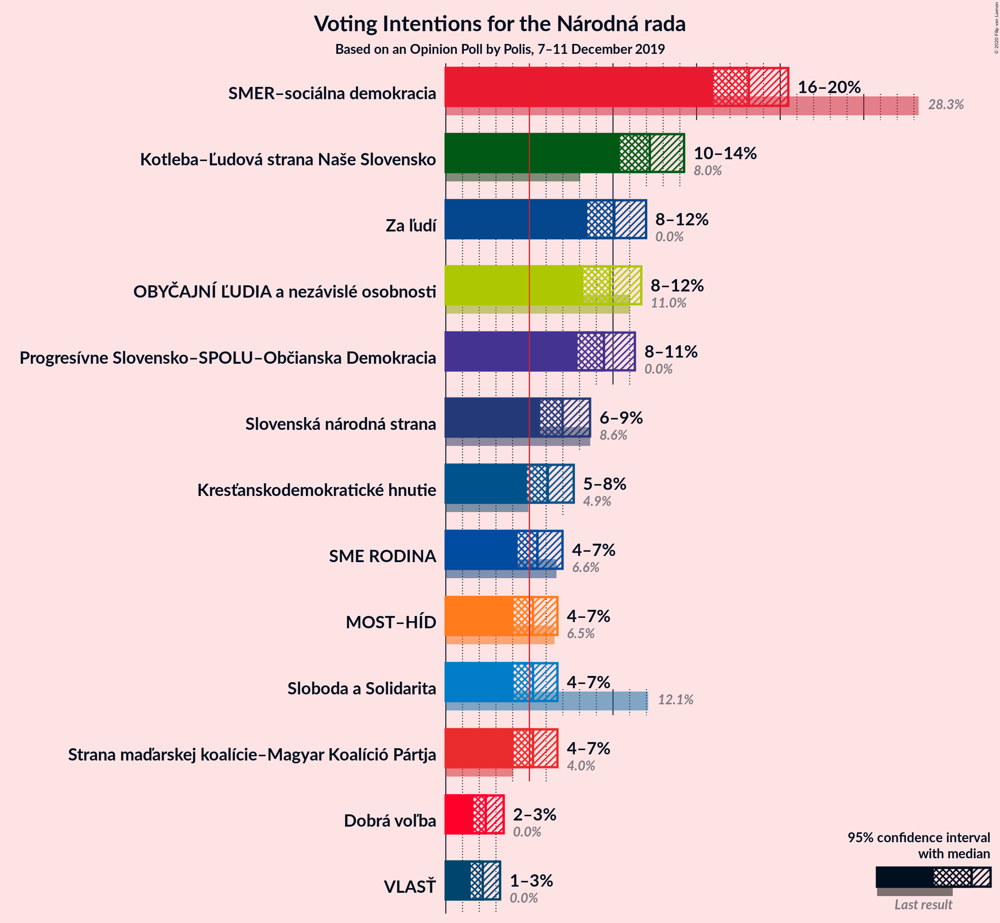

### Confidence Intervals

| Party | Last Result | Poll Result | 80% Confidence Interval | 90% Confidence Interval | 95% Confidence Interval | 99% Confidence Interval |
|:-----:|:-----------:|:-----------:|:-----------------------:|:-----------------------:|:-----------------------:|:-----------------------:|
| SMER–sociálna demokracia | 28.3% | 18.1% | 16.7–19.7% |16.3–20.1% |16.0–20.5% |15.3–21.2% |
| Kotleba–Ľudová strana Naše Slovensko | 8.0% | 12.2% | 11.0–13.5% |10.7–13.9% |10.4–14.3% |9.9–14.9% |
| Za ľudí | 0.0% | 10.1% | 9.0–11.3% |8.7–11.7% |8.5–12.0% |8.0–12.6% |
| OBYČAJNÍ ĽUDIA a nezávislé osobnosti | 11.0% | 9.8% | 8.8–11.1% |8.5–11.4% |8.2–11.7% |7.7–12.3% |
| Progresívne Slovensko–SPOLU–Občianska Demokracia | 0.0% | 9.5% | 8.4–10.7% |8.1–11.0% |7.9–11.3% |7.4–11.9% |
| Slovenská národná strana | 8.6% | 7.0% | 6.1–8.1% |5.9–8.4% |5.6–8.6% |5.2–9.2% |
| Kresťanskodemokratické hnutie | 4.9% | 6.1% | 5.3–7.1% |5.0–7.4% |4.8–7.7% |4.5–8.2% |
| SME RODINA | 6.6% | 5.5% | 4.7–6.5% |4.5–6.7% |4.3–7.0% |3.9–7.5% |
| Sloboda a Solidarita | 12.1% | 5.2% | 4.5–6.2% |4.2–6.4% |4.1–6.7% |3.7–7.2% |
| MOST–HÍD | 6.5% | 5.2% | 4.5–6.2% |4.2–6.4% |4.1–6.7% |3.7–7.2% |
| Strana maďarskej koalície–Magyar Koalíció Pártja | 4.0% | 5.2% | 4.5–6.2% |4.2–6.4% |4.1–6.7% |3.7–7.2% |
| Dobrá voľba | 0.0% | 2.4% | 1.9–3.1% |1.8–3.3% |1.6–3.5% |1.4–3.8% |
| VLASŤ | 0.0% | 2.2% | 1.7–2.9% |1.6–3.1% |1.5–3.2% |1.3–3.6% |

*Note:* The poll result column reflects the actual value used in the calculations. Published results may vary slightly, and in addition be rounded to fewer digits.

## Seats

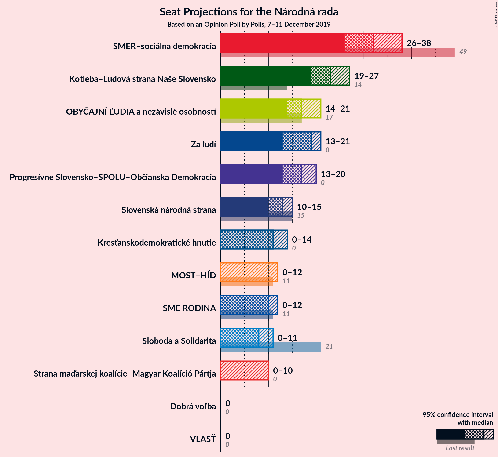

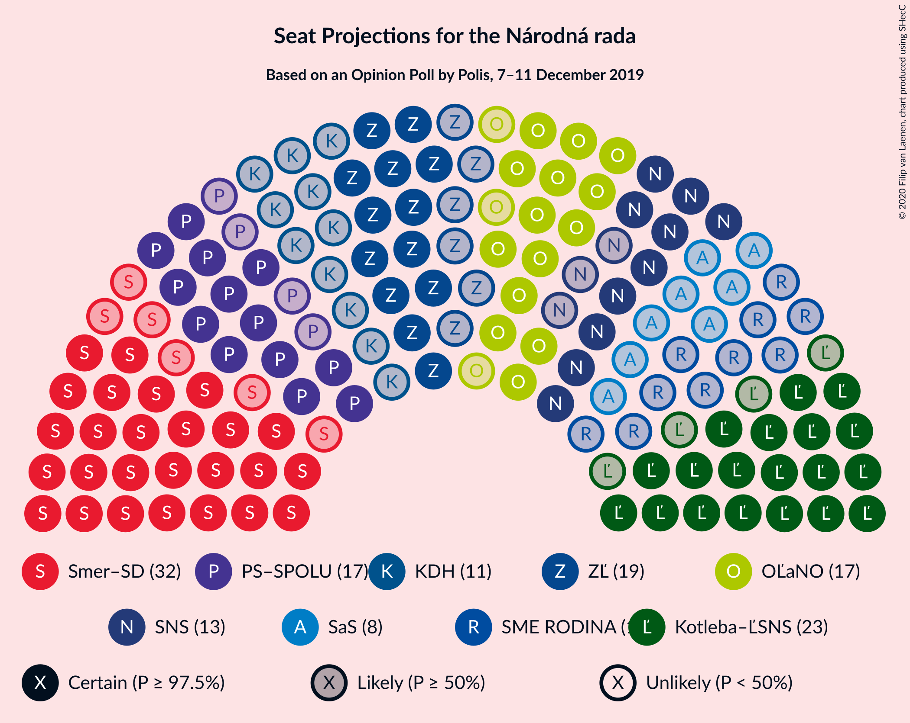

### Confidence Intervals

| Party | Last Result | Median | 80% Confidence Interval | 90% Confidence Interval | 95% Confidence Interval | 99% Confidence Interval |
|:-----:|:-----------:|:------:|:-----------------------:|:-----------------------:|:-----------------------:|:-----------------------:|
| <a href="#smer–sociálna-demokracia">SMER–sociálna demokracia</a> | 49 | 32 | 28–34 |26–38 |26–38 |25–38 |
| <a href="#kotleba–ľudová-strana-naše-slovensko">Kotleba–Ľudová strana Naše Slovensko</a> | 14 | 23 | 21–24 |20–25 |19–27 |16–28 |
| <a href="#za-ľudí">Za ľudí</a> | 0 | 19 | 14–21 |14–21 |13–21 |13–23 |
| <a href="#obyčajní-ľudia-a-nezávislé-osobnosti">OBYČAJNÍ ĽUDIA a nezávislé osobnosti</a> | 17 | 17 | 16–20 |14–20 |14–21 |13–22 |
| <a href="#progresívne-slovensko–spolu–občianska-demokracia">Progresívne Slovensko–SPOLU–Občianska Demokracia</a> | 0 | 17 | 14–19 |13–19 |13–20 |12–21 |
| <a href="#slovenská-národná-strana">Slovenská národná strana</a> | 15 | 13 | 11–14 |10–14 |10–15 |9–16 |
| <a href="#kresťanskodemokratické-hnutie">Kresťanskodemokratické hnutie</a> | 0 | 11 | 9–12 |9–13 |0–14 |0–16 |
| <a href="#sme-rodina">SME RODINA</a> | 11 | 10 | 0–11 |0–11 |0–12 |0–12 |
| <a href="#sloboda-a-solidarita">Sloboda a Solidarita</a> | 21 | 8 | 0–10 |0–10 |0–11 |0–11 |
| <a href="#most–híd">MOST–HÍD</a> | 11 | 0 | 0–9 |0–10 |0–12 |0–13 |
| <a href="#strana-maďarskej-koalície–magyar-koalíció-pártja">Strana maďarskej koalície–Magyar Koalíció Pártja</a> | 0 | 0 | 0–10 |0–10 |0–10 |0–12 |
| <a href="#dobrá-voľba">Dobrá voľba</a> | 0 | 0 | 0 |0 |0 |0 |
| <a href="#vlasť">VLASŤ</a> | 0 | 0 | 0 |0 |0 |0 |

### SMER–sociálna demokracia

*For a full overview of the results for this party, see the [SMER–sociálna demokracia](party-smer–sociálnademokracia.html) page.*

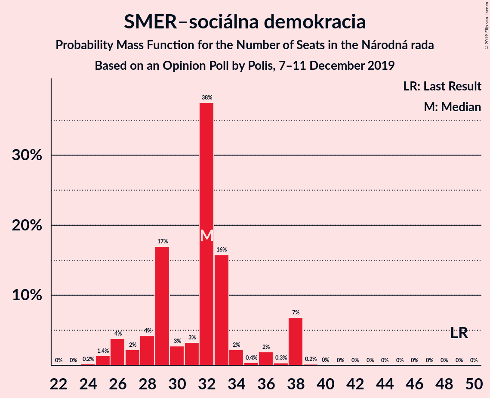

| Number of Seats | Probability | Accumulated | Special Marks |
|:---------------:|:-----------:|:-----------:|:-------------:|
| 24 | 0.2% | 100% |  |
| 25 | 1.4% | 99.8% |  |
| 26 | 4% | 98% |  |
| 27 | 2% | 95% |  |
| 28 | 4% | 92% |  |
| 29 | 17% | 88% |  |
| 30 | 3% | 71% |  |
| 31 | 3% | 68% |  |
| 32 | 38% | 65% | Median |
| 33 | 16% | 28% |  |
| 34 | 2% | 12% |  |
| 35 | 0.4% | 10% |  |
| 36 | 2% | 9% |  |
| 37 | 0.3% | 7% |  |
| 38 | 7% | 7% |  |
| 39 | 0.2% | 0.2% |  |
| 40 | 0% | 0.1% |  |
| 41 | 0% | 0% |  |
| 42 | 0% | 0% |  |
| 43 | 0% | 0% |  |
| 44 | 0% | 0% |  |
| 45 | 0% | 0% |  |
| 46 | 0% | 0% |  |
| 47 | 0% | 0% |  |
| 48 | 0% | 0% |  |
| 49 | 0% | 0% | Last Result |

### Kotleba–Ľudová strana Naše Slovensko

*For a full overview of the results for this party, see the [Kotleba–Ľudová strana Naše Slovensko](party-kotleba–ľudovástrananašeslovensko.html) page.*

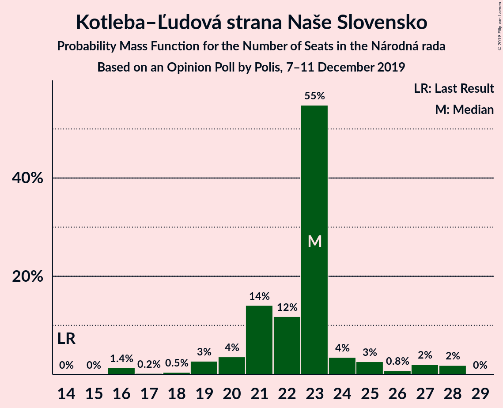

| Number of Seats | Probability | Accumulated | Special Marks |
|:---------------:|:-----------:|:-----------:|:-------------:|
| 14 | 0% | 100% | Last Result |
| 15 | 0% | 100% |  |
| 16 | 1.4% | 100% |  |
| 17 | 0.2% | 98.6% |  |
| 18 | 0.5% | 98% |  |
| 19 | 3% | 98% |  |
| 20 | 4% | 95% |  |
| 21 | 14% | 92% |  |
| 22 | 12% | 77% |  |
| 23 | 55% | 66% | Median |
| 24 | 4% | 11% |  |
| 25 | 3% | 7% |  |
| 26 | 0.8% | 5% |  |
| 27 | 2% | 4% |  |
| 28 | 2% | 2% |  |
| 29 | 0% | 0% |  |

### Za ľudí

*For a full overview of the results for this party, see the [Za ľudí](party-zaľudí.html) page.*

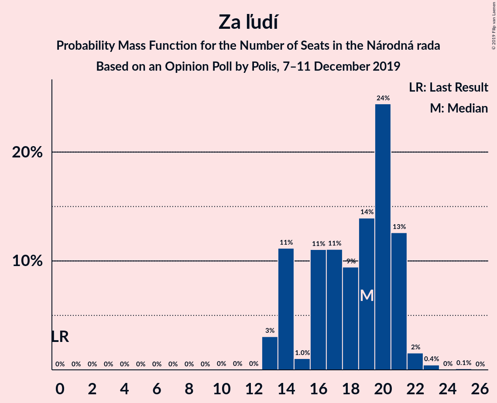

| Number of Seats | Probability | Accumulated | Special Marks |
|:---------------:|:-----------:|:-----------:|:-------------:|
| 0 | 0% | 100% | Last Result |
| 1 | 0% | 100% |  |
| 2 | 0% | 100% |  |
| 3 | 0% | 100% |  |
| 4 | 0% | 100% |  |
| 5 | 0% | 100% |  |
| 6 | 0% | 100% |  |
| 7 | 0% | 100% |  |
| 8 | 0% | 100% |  |
| 9 | 0% | 100% |  |
| 10 | 0% | 100% |  |
| 11 | 0% | 100% |  |
| 12 | 0% | 100% |  |
| 13 | 3% | 100% |  |
| 14 | 11% | 97% |  |
| 15 | 1.0% | 86% |  |
| 16 | 11% | 85% |  |
| 17 | 11% | 74% |  |
| 18 | 9% | 63% |  |
| 19 | 14% | 53% | Median |
| 20 | 24% | 39% |  |
| 21 | 13% | 15% |  |
| 22 | 2% | 2% |  |
| 23 | 0.4% | 0.6% |  |
| 24 | 0% | 0.2% |  |
| 25 | 0.1% | 0.1% |  |
| 26 | 0% | 0% |  |

### OBYČAJNÍ ĽUDIA a nezávislé osobnosti

*For a full overview of the results for this party, see the [OBYČAJNÍ ĽUDIA a nezávislé osobnosti](party-obyčajníľudiaanezávisléosobnosti.html) page.*

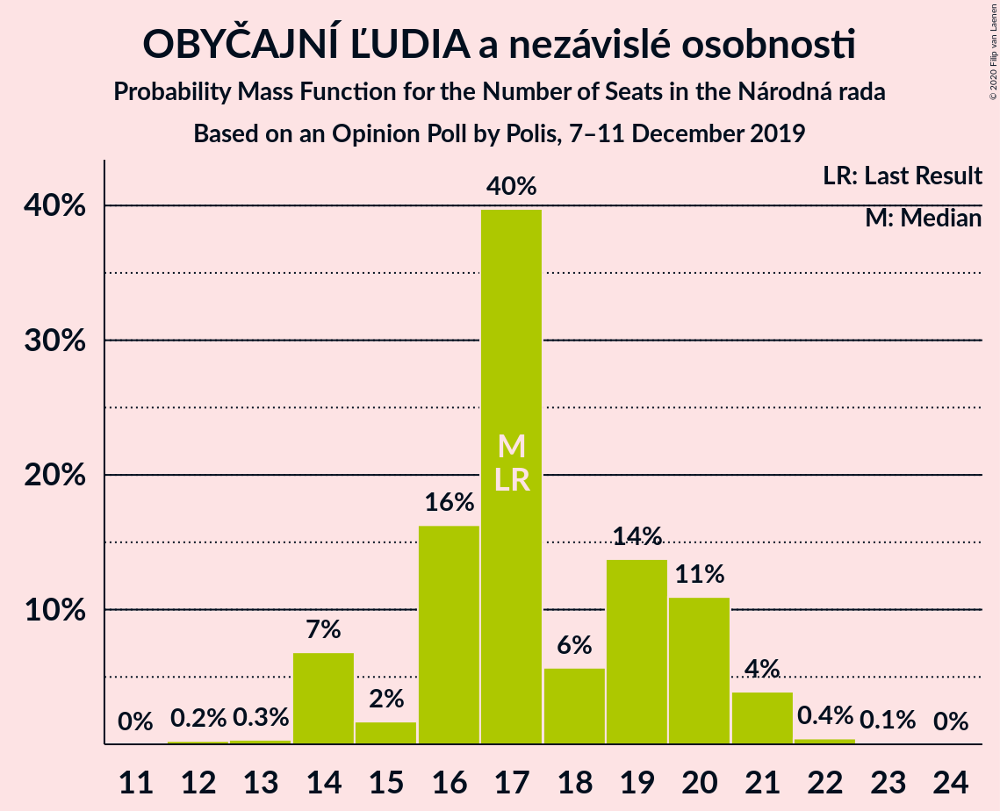

| Number of Seats | Probability | Accumulated | Special Marks |
|:---------------:|:-----------:|:-----------:|:-------------:|
| 12 | 0.2% | 100% |  |
| 13 | 0.3% | 99.8% |  |
| 14 | 7% | 99.4% |  |
| 15 | 2% | 93% |  |
| 16 | 16% | 91% |  |
| 17 | 40% | 75% | Last Result, Median |
| 18 | 6% | 35% |  |
| 19 | 14% | 29% |  |
| 20 | 11% | 15% |  |
| 21 | 4% | 4% |  |
| 22 | 0.4% | 0.6% |  |
| 23 | 0.1% | 0.2% |  |
| 24 | 0% | 0% |  |

### Progresívne Slovensko–SPOLU–Občianska Demokracia

*For a full overview of the results for this party, see the [Progresívne Slovensko–SPOLU–Občianska Demokracia](party-progresívneslovensko–spolu–občianskademokracia.html) page.*

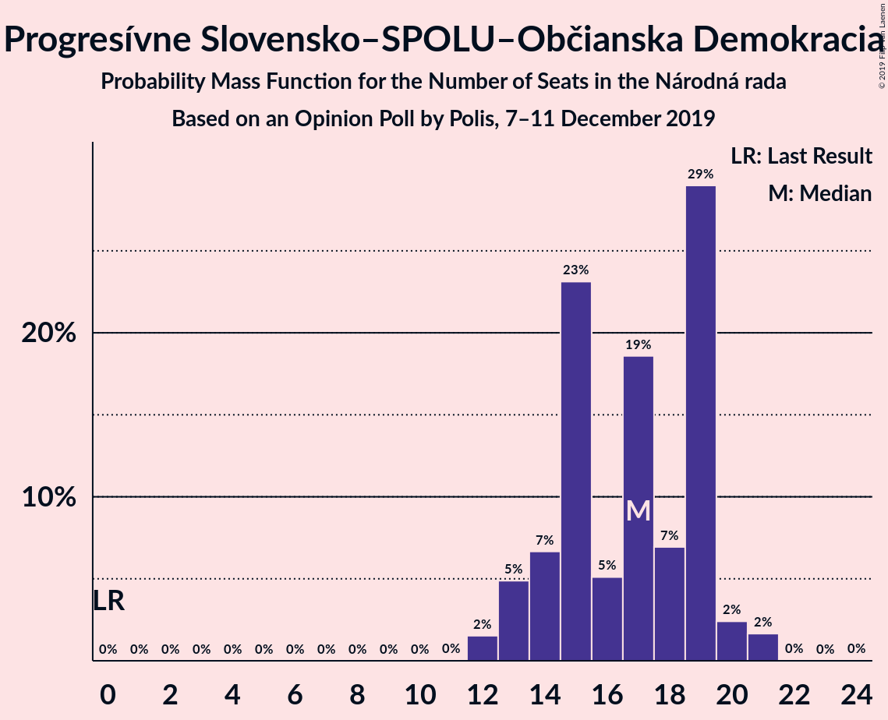

| Number of Seats | Probability | Accumulated | Special Marks |
|:---------------:|:-----------:|:-----------:|:-------------:|
| 0 | 0% | 100% | Last Result |
| 1 | 0% | 100% |  |
| 2 | 0% | 100% |  |
| 3 | 0% | 100% |  |
| 4 | 0% | 100% |  |
| 5 | 0% | 100% |  |
| 6 | 0% | 100% |  |
| 7 | 0% | 100% |  |
| 8 | 0% | 100% |  |
| 9 | 0% | 100% |  |
| 10 | 0% | 100% |  |
| 11 | 0% | 100% |  |
| 12 | 2% | 100% |  |
| 13 | 5% | 98% |  |
| 14 | 7% | 94% |  |
| 15 | 23% | 87% |  |
| 16 | 5% | 64% |  |
| 17 | 19% | 59% | Median |
| 18 | 7% | 40% |  |
| 19 | 29% | 33% |  |
| 20 | 2% | 4% |  |
| 21 | 2% | 2% |  |
| 22 | 0% | 0.1% |  |
| 23 | 0% | 0.1% |  |
| 24 | 0% | 0% |  |

### Slovenská národná strana

*For a full overview of the results for this party, see the [Slovenská národná strana](party-slovenskánárodnástrana.html) page.*

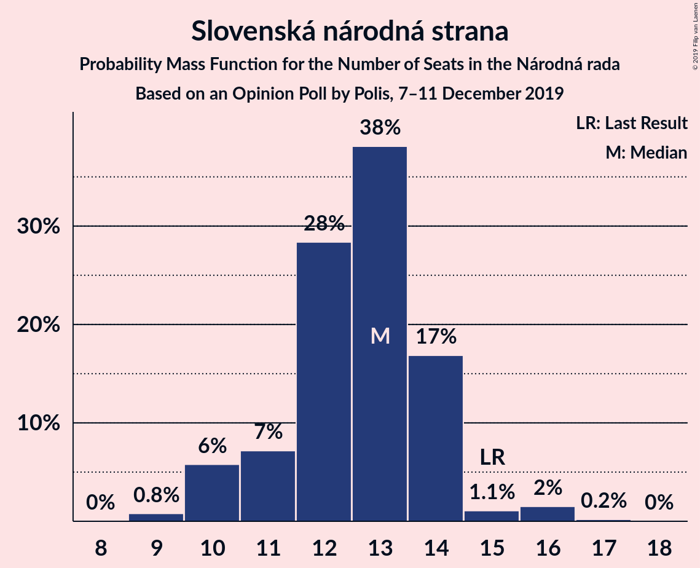

| Number of Seats | Probability | Accumulated | Special Marks |
|:---------------:|:-----------:|:-----------:|:-------------:|
| 8 | 0% | 100% |  |
| 9 | 0.8% | 99.9% |  |
| 10 | 6% | 99.1% |  |
| 11 | 7% | 93% |  |
| 12 | 28% | 86% |  |
| 13 | 38% | 58% | Median |
| 14 | 17% | 20% |  |
| 15 | 1.1% | 3% | Last Result |
| 16 | 2% | 2% |  |
| 17 | 0.2% | 0.2% |  |
| 18 | 0% | 0% |  |

### Kresťanskodemokratické hnutie

*For a full overview of the results for this party, see the [Kresťanskodemokratické hnutie](party-kresťanskodemokratickéhnutie.html) page.*

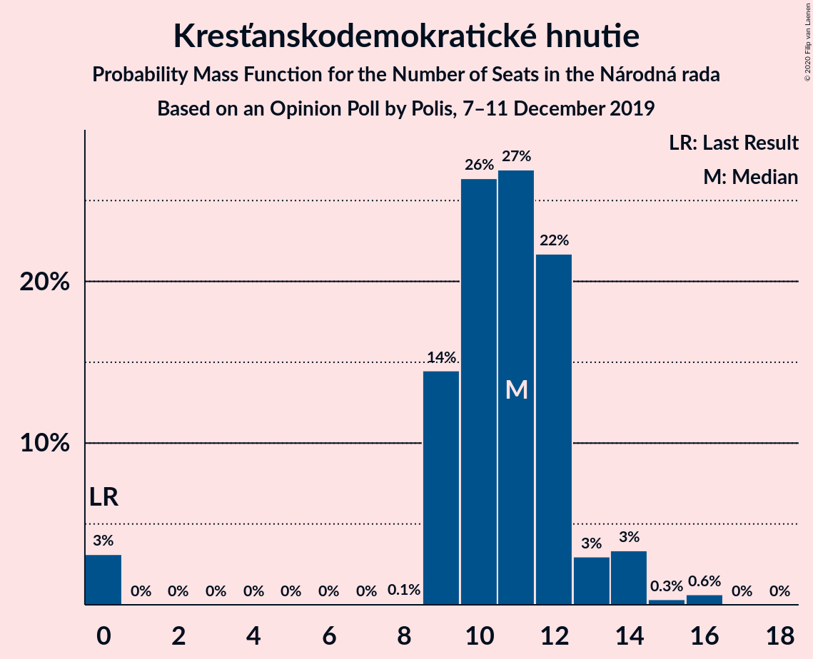

| Number of Seats | Probability | Accumulated | Special Marks |
|:---------------:|:-----------:|:-----------:|:-------------:|
| 0 | 3% | 100% | Last Result |
| 1 | 0% | 97% |  |
| 2 | 0% | 97% |  |
| 3 | 0% | 97% |  |
| 4 | 0% | 97% |  |
| 5 | 0% | 97% |  |
| 6 | 0% | 97% |  |
| 7 | 0% | 97% |  |
| 8 | 0.1% | 97% |  |
| 9 | 14% | 97% |  |
| 10 | 26% | 82% |  |
| 11 | 27% | 56% | Median |
| 12 | 22% | 29% |  |
| 13 | 3% | 7% |  |
| 14 | 3% | 4% |  |
| 15 | 0.3% | 1.0% |  |
| 16 | 0.6% | 0.7% |  |
| 17 | 0% | 0% |  |

### SME RODINA

*For a full overview of the results for this party, see the [SME RODINA](party-smerodina.html) page.*

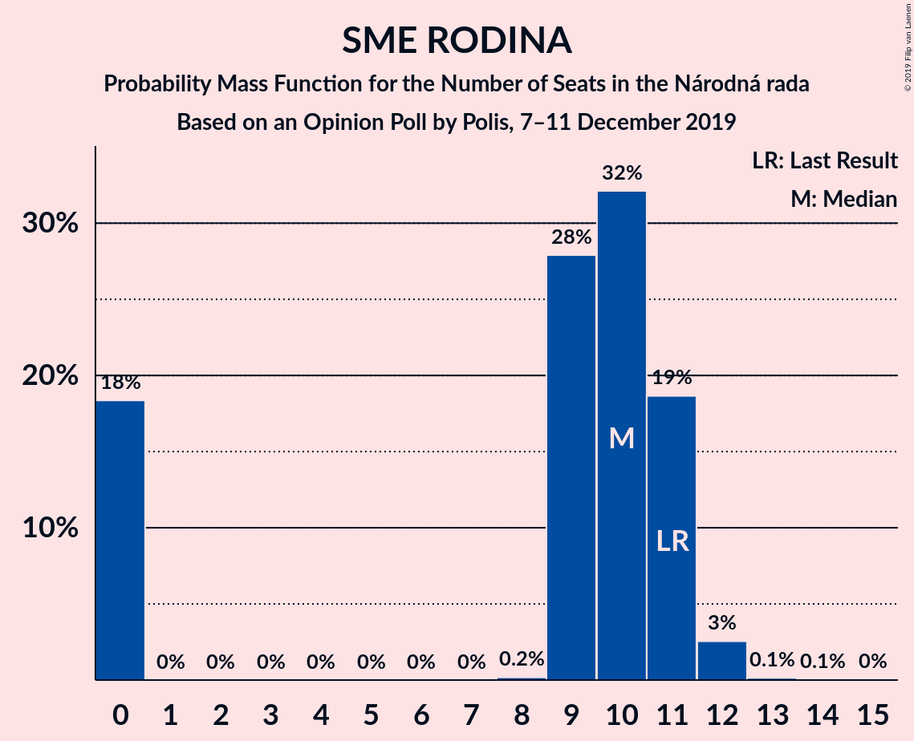

| Number of Seats | Probability | Accumulated | Special Marks |
|:---------------:|:-----------:|:-----------:|:-------------:|
| 0 | 18% | 100% |  |
| 1 | 0% | 82% |  |
| 2 | 0% | 82% |  |
| 3 | 0% | 82% |  |
| 4 | 0% | 82% |  |
| 5 | 0% | 82% |  |
| 6 | 0% | 82% |  |
| 7 | 0% | 82% |  |
| 8 | 0.2% | 82% |  |
| 9 | 28% | 81% |  |
| 10 | 32% | 54% | Median |
| 11 | 19% | 21% | Last Result |
| 12 | 3% | 3% |  |
| 13 | 0.1% | 0.2% |  |
| 14 | 0.1% | 0.1% |  |
| 15 | 0% | 0% |  |

### Sloboda a Solidarita

*For a full overview of the results for this party, see the [Sloboda a Solidarita](party-slobodaasolidarita.html) page.*

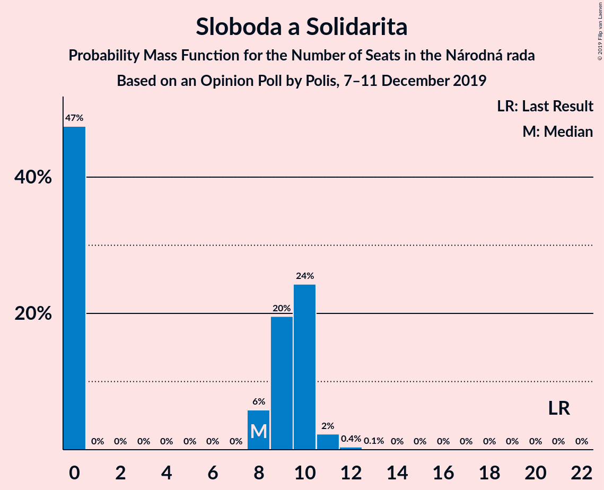

| Number of Seats | Probability | Accumulated | Special Marks |
|:---------------:|:-----------:|:-----------:|:-------------:|
| 0 | 47% | 100% |  |
| 1 | 0% | 53% |  |
| 2 | 0% | 53% |  |
| 3 | 0% | 53% |  |
| 4 | 0% | 53% |  |
| 5 | 0% | 53% |  |
| 6 | 0% | 53% |  |
| 7 | 0% | 53% |  |
| 8 | 6% | 53% | Median |
| 9 | 20% | 47% |  |
| 10 | 24% | 27% |  |
| 11 | 2% | 3% |  |
| 12 | 0.4% | 0.5% |  |
| 13 | 0.1% | 0.1% |  |
| 14 | 0% | 0% |  |
| 15 | 0% | 0% |  |
| 16 | 0% | 0% |  |
| 17 | 0% | 0% |  |
| 18 | 0% | 0% |  |
| 19 | 0% | 0% |  |
| 20 | 0% | 0% |  |
| 21 | 0% | 0% | Last Result |

### MOST–HÍD

*For a full overview of the results for this party, see the [MOST–HÍD](party-most–híd.html) page.*

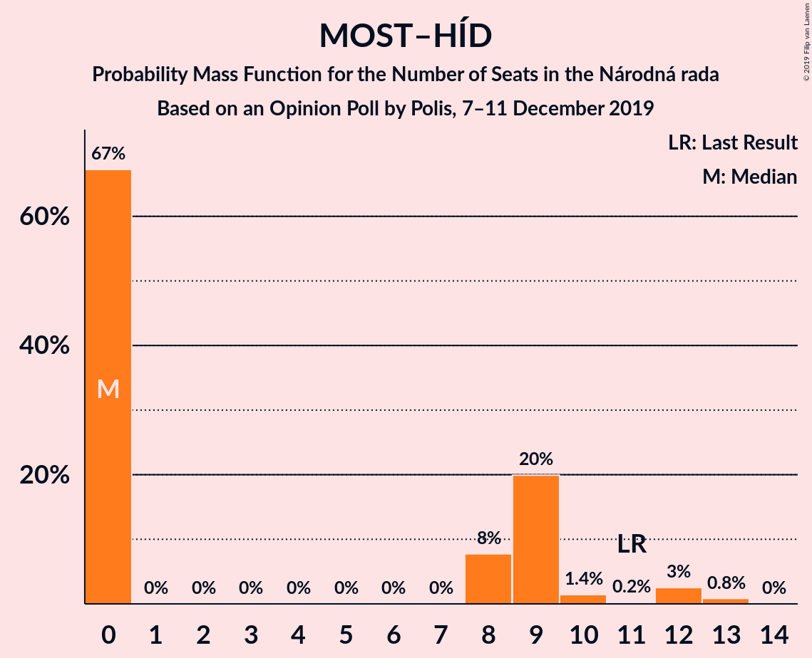

| Number of Seats | Probability | Accumulated | Special Marks |
|:---------------:|:-----------:|:-----------:|:-------------:|
| 0 | 67% | 100% | Median |
| 1 | 0% | 33% |  |
| 2 | 0% | 33% |  |
| 3 | 0% | 33% |  |
| 4 | 0% | 33% |  |
| 5 | 0% | 33% |  |
| 6 | 0% | 33% |  |
| 7 | 0% | 33% |  |
| 8 | 8% | 33% |  |
| 9 | 20% | 25% |  |
| 10 | 1.4% | 5% |  |
| 11 | 0.2% | 4% | Last Result |
| 12 | 3% | 3% |  |
| 13 | 0.8% | 0.9% |  |
| 14 | 0% | 0% |  |

### Strana maďarskej koalície–Magyar Koalíció Pártja

*For a full overview of the results for this party, see the [Strana maďarskej koalície–Magyar Koalíció Pártja](party-stranamaďarskejkoalície–magyarkoalíciópártja.html) page.*

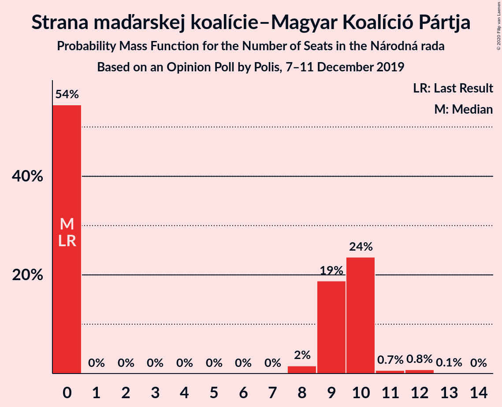

| Number of Seats | Probability | Accumulated | Special Marks |
|:---------------:|:-----------:|:-----------:|:-------------:|
| 0 | 54% | 100% | Last Result, Median |
| 1 | 0% | 46% |  |
| 2 | 0% | 46% |  |
| 3 | 0% | 46% |  |
| 4 | 0% | 46% |  |
| 5 | 0% | 46% |  |
| 6 | 0% | 46% |  |
| 7 | 0% | 46% |  |
| 8 | 2% | 46% |  |
| 9 | 19% | 44% |  |
| 10 | 24% | 25% |  |
| 11 | 0.7% | 2% |  |
| 12 | 0.8% | 0.9% |  |
| 13 | 0.1% | 0.1% |  |
| 14 | 0% | 0% |  |

### Dobrá voľba

*For a full overview of the results for this party, see the [Dobrá voľba](party-dobrávoľba.html) page.*

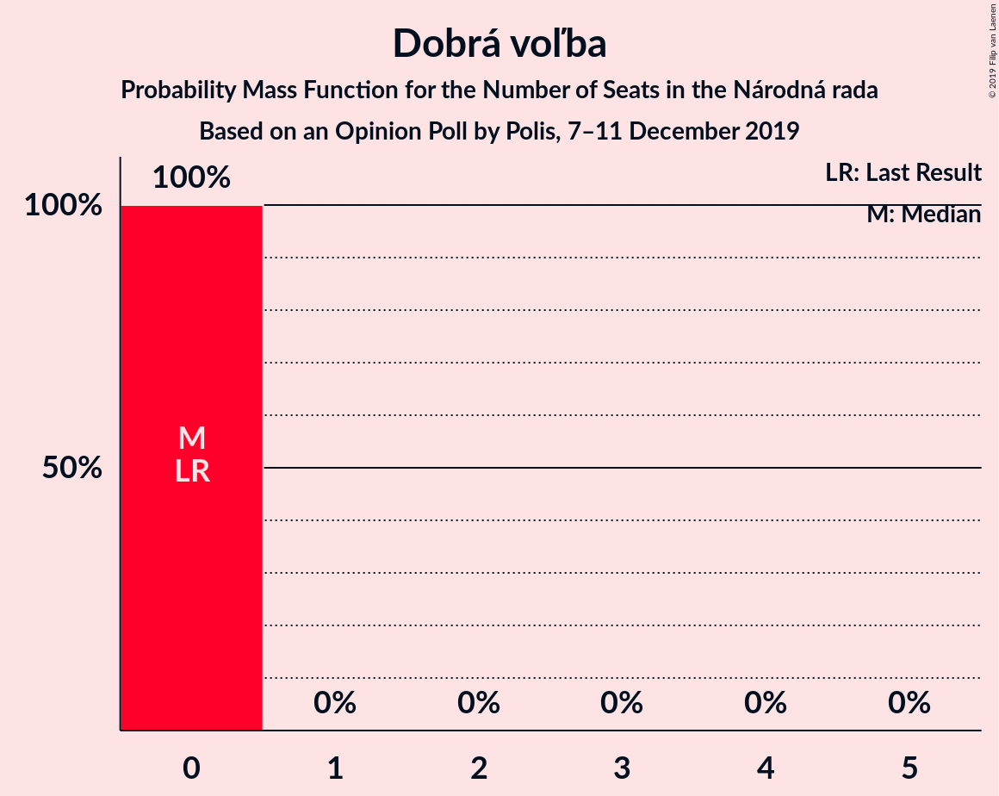

| Number of Seats | Probability | Accumulated | Special Marks |
|:---------------:|:-----------:|:-----------:|:-------------:|
| 0 | 100% | 100% | Last Result, Median |

### VLASŤ

*For a full overview of the results for this party, see the [VLASŤ](party-vlasť.html) page.*

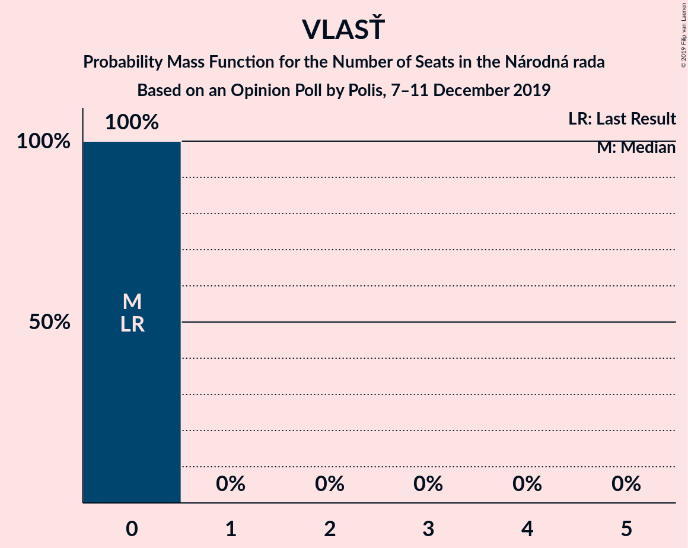

| Number of Seats | Probability | Accumulated | Special Marks |
|:---------------:|:-----------:|:-----------:|:-------------:|
| 0 | 100% | 100% | Last Result, Median |

## Coalitions

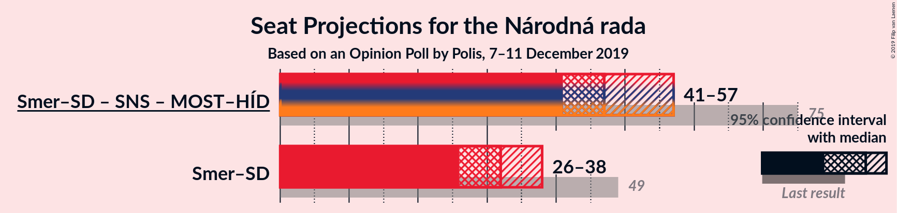

### Confidence Intervals

| Coalition | Last Result | Median | Majority? | 80% Confidence Interval | 90% Confidence Interval | 95% Confidence Interval | 99% Confidence Interval |
|:---------:|:-----------:|:------:|:---------:|:-----------------------:|:-----------------------:|:-----------------------:|:-----------------------:|
| SMER–sociálna demokracia – Slovenská národná strana – MOST–HÍD | 75 | 47 | 0% | 41–53 | 41–54 | 41–57 | 39–58 |
| SMER–sociálna demokracia | 49 | 32 | 0% | 28–34 | 26–38 | 26–38 | 25–38 |

### SMER–sociálna demokracia – Slovenská národná strana – MOST–HÍD

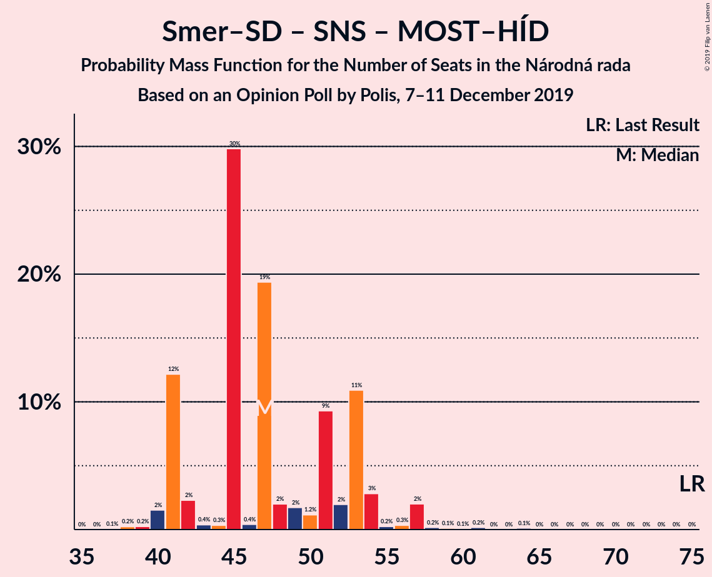

| Number of Seats | Probability | Accumulated | Special Marks |
|:---------------:|:-----------:|:-----------:|:-------------:|
| 37 | 0.1% | 100% |  |
| 38 | 0.2% | 99.9% |  |
| 39 | 0.2% | 99.7% |  |
| 40 | 2% | 99.4% |  |
| 41 | 12% | 98% |  |
| 42 | 2% | 86% |  |
| 43 | 0.4% | 83% |  |
| 44 | 0.3% | 83% |  |
| 45 | 30% | 83% | Median |
| 46 | 0.4% | 53% |  |
| 47 | 19% | 52% |  |
| 48 | 2% | 33% |  |
| 49 | 2% | 31% |  |
| 50 | 1.2% | 29% |  |
| 51 | 9% | 28% |  |
| 52 | 2% | 19% |  |
| 53 | 11% | 17% |  |
| 54 | 3% | 6% |  |
| 55 | 0.2% | 3% |  |
| 56 | 0.3% | 3% |  |
| 57 | 2% | 3% |  |
| 58 | 0.2% | 0.6% |  |
| 59 | 0.1% | 0.5% |  |
| 60 | 0.1% | 0.4% |  |
| 61 | 0.2% | 0.3% |  |
| 62 | 0% | 0.1% |  |
| 63 | 0% | 0.1% |  |
| 64 | 0.1% | 0.1% |  |
| 65 | 0% | 0% |  |
| 66 | 0% | 0% |  |
| 67 | 0% | 0% |  |
| 68 | 0% | 0% |  |
| 69 | 0% | 0% |  |
| 70 | 0% | 0% |  |
| 71 | 0% | 0% |  |
| 72 | 0% | 0% |  |
| 73 | 0% | 0% |  |
| 74 | 0% | 0% |  |
| 75 | 0% | 0% | Last Result |

### SMER–sociálna demokracia

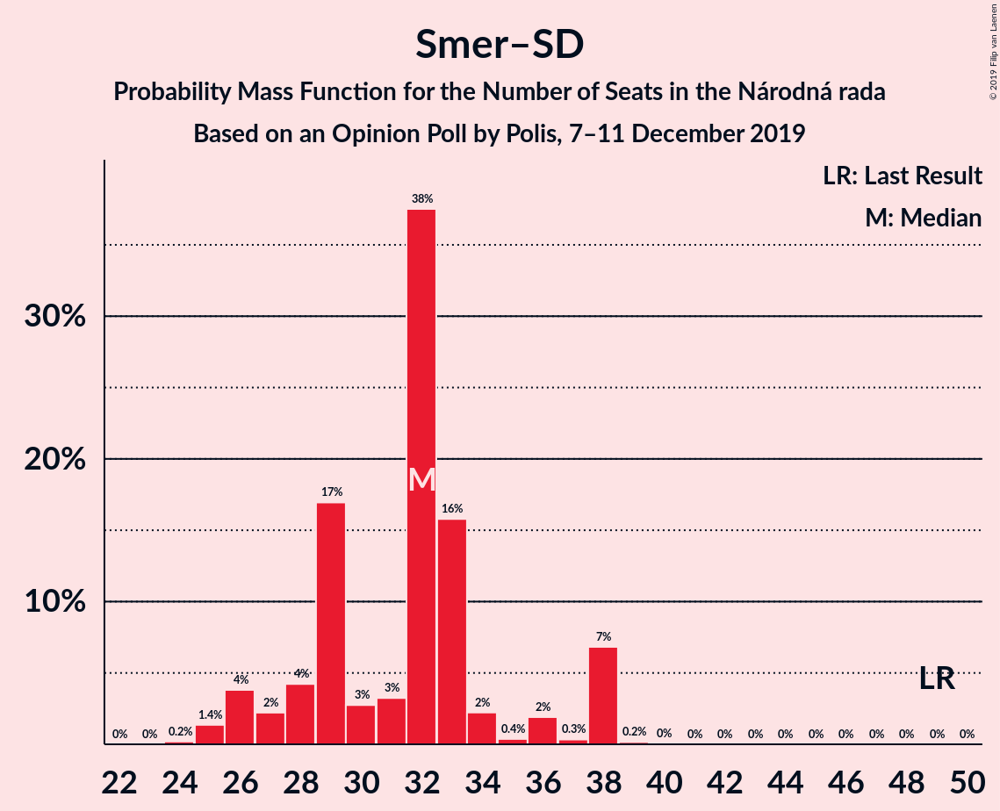

| Number of Seats | Probability | Accumulated | Special Marks |
|:---------------:|:-----------:|:-----------:|:-------------:|
| 24 | 0.2% | 100% |  |
| 25 | 1.4% | 99.8% |  |
| 26 | 4% | 98% |  |
| 27 | 2% | 95% |  |
| 28 | 4% | 92% |  |
| 29 | 17% | 88% |  |
| 30 | 3% | 71% |  |
| 31 | 3% | 68% |  |
| 32 | 38% | 65% | Median |
| 33 | 16% | 28% |  |
| 34 | 2% | 12% |  |
| 35 | 0.4% | 10% |  |
| 36 | 2% | 9% |  |
| 37 | 0.3% | 7% |  |
| 38 | 7% | 7% |  |
| 39 | 0.2% | 0.2% |  |
| 40 | 0% | 0.1% |  |
| 41 | 0% | 0% |  |
| 42 | 0% | 0% |  |
| 43 | 0% | 0% |  |
| 44 | 0% | 0% |  |
| 45 | 0% | 0% |  |
| 46 | 0% | 0% |  |
| 47 | 0% | 0% |  |
| 48 | 0% | 0% |  |
| 49 | 0% | 0% | Last Result |

## Technical Information

### Opinion Poll

+ **Polling firm:** Polis
+ **Commissioner(s):** —
+ **Fieldwork period:** 7–11 December 2019

### Calculations

+ **Sample size:** 1131
+ **Simulations done:** 1,048,576
+ **Error estimate:** 2.00%

