# Opinion Poll by AKO for TA3, 7–9 January 2020

<a href="#voting-intentions">Voting Intentions</a> | <a href="#seats">Seats</a> | <a href="#coalitions">Coalitions</a> | <a href="#technical-information">Technical Information</a>

## Voting Intentions

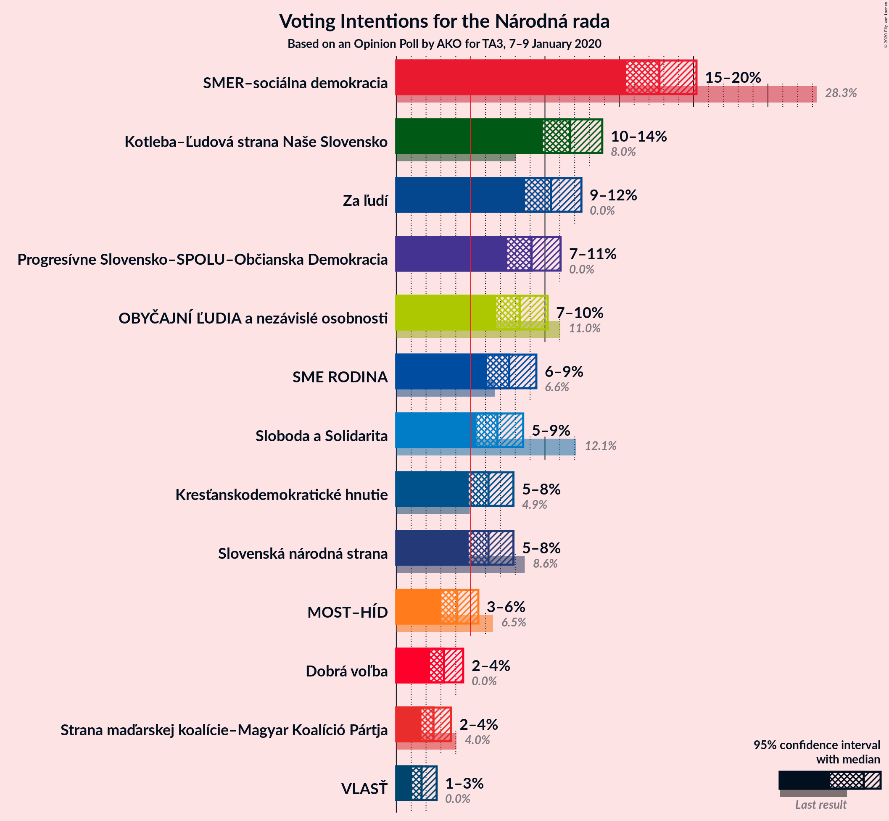

### Confidence Intervals

| Party | Last Result | Poll Result | 80% Confidence Interval | 90% Confidence Interval | 95% Confidence Interval | 99% Confidence Interval |
|:-----:|:-----------:|:-----------:|:-----------------------:|:-----------------------:|:-----------------------:|:-----------------------:|
| SMER–sociálna demokracia | 28.3% | 17.7% | 16.2–19.3% |15.8–19.8% |15.5–20.2% |14.8–21.0% |
| Kotleba–Ľudová strana Naše Slovensko | 8.0% | 11.7% | 10.5–13.1% |10.1–13.5% |9.8–13.9% |9.3–14.5% |
| Za ľudí | 0.0% | 10.4% | 9.3–11.7% |8.9–12.1% |8.7–12.5% |8.1–13.1% |
| Progresívne Slovensko–SPOLU–Občianska Demokracia | 0.0% | 9.1% | 8.0–10.4% |7.7–10.7% |7.5–11.1% |7.0–11.7% |
| OBYČAJNÍ ĽUDIA a nezávislé osobnosti | 11.0% | 8.3% | 7.3–9.5% |7.0–9.9% |6.7–10.2% |6.3–10.8% |
| SME RODINA | 6.6% | 7.6% | 6.6–8.8% |6.3–9.1% |6.1–9.4% |5.7–10.0% |
| Sloboda a Solidarita | 12.1% | 6.8% | 5.9–7.9% |5.6–8.3% |5.4–8.5% |5.0–9.1% |
| Slovenská národná strana | 8.6% | 6.2% | 5.3–7.3% |5.1–7.6% |4.9–7.9% |4.5–8.4% |
| Kresťanskodemokratické hnutie | 4.9% | 6.2% | 5.3–7.3% |5.1–7.6% |4.9–7.9% |4.5–8.4% |
| MOST–HÍD | 6.5% | 4.1% | 3.4–5.0% |3.2–5.3% |3.0–5.5% |2.7–6.0% |
| Dobrá voľba | 0.0% | 3.2% | 2.6–4.0% |2.4–4.3% |2.3–4.5% |2.0–4.9% |
| Strana maďarskej koalície–Magyar Koalíció Pártja | 4.0% | 2.5% | 2.0–3.3% |1.8–3.5% |1.7–3.7% |1.5–4.1% |
| VLASŤ | 0.0% | 1.7% | 1.3–2.4% |1.2–2.5% |1.1–2.7% |0.9–3.1% |

*Note:* The poll result column reflects the actual value used in the calculations. Published results may vary slightly, and in addition be rounded to fewer digits.

## Seats

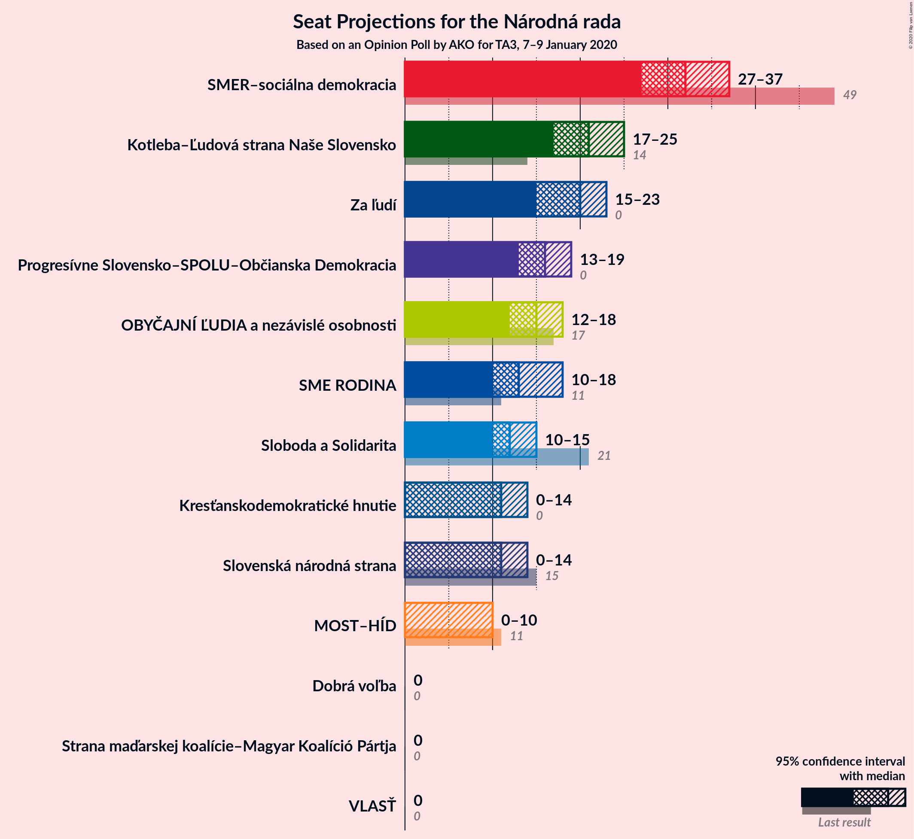

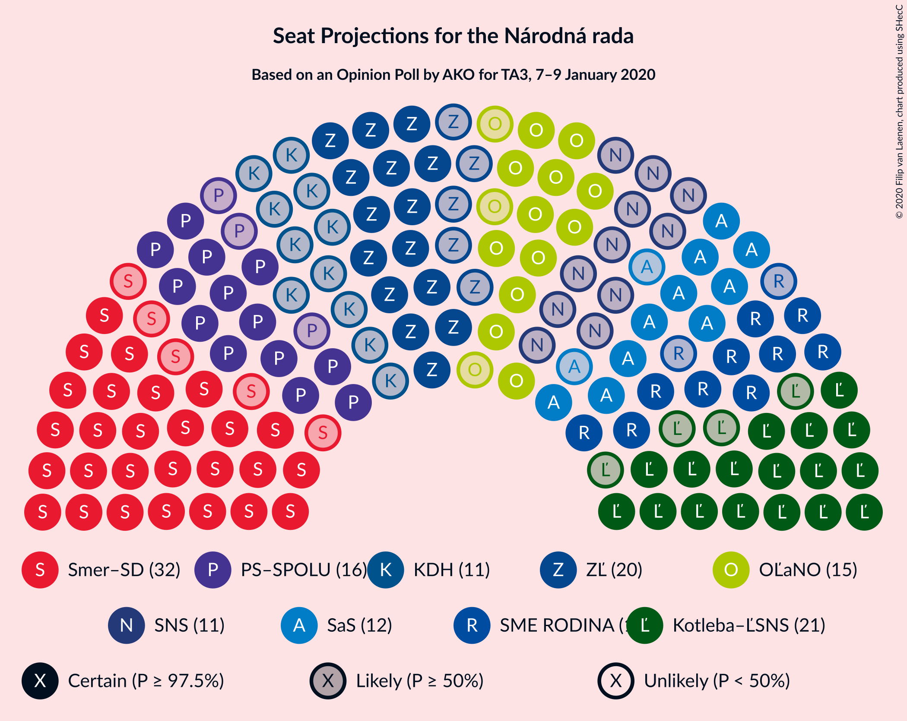

### Confidence Intervals

| Party | Last Result | Median | 80% Confidence Interval | 90% Confidence Interval | 95% Confidence Interval | 99% Confidence Interval |
|:-----:|:-----------:|:------:|:-----------------------:|:-----------------------:|:-----------------------:|:-----------------------:|
| <a href="#smer–sociálna-demokracia">SMER–sociálna demokracia</a> | 49 | 32 | 29–35 |28–36 |27–37 |26–39 |
| <a href="#kotleba–ľudová-strana-naše-slovensko">Kotleba–Ľudová strana Naše Slovensko</a> | 14 | 21 | 19–24 |18–25 |17–25 |16–27 |
| <a href="#za-ľudí">Za ľudí</a> | 0 | 20 | 16–21 |16–22 |15–23 |14–23 |
| <a href="#progresívne-slovensko–spolu–občianska-demokracia">Progresívne Slovensko–SPOLU–Občianska Demokracia</a> | 0 | 16 | 13–19 |13–19 |13–19 |12–22 |
| <a href="#obyčajní-ľudia-a-nezávislé-osobnosti">OBYČAJNÍ ĽUDIA a nezávislé osobnosti</a> | 17 | 15 | 13–17 |12–18 |12–18 |11–20 |
| <a href="#sme-rodina">SME RODINA</a> | 11 | 13 | 11–15 |10–17 |10–18 |10–19 |
| <a href="#sloboda-a-solidarita">Sloboda a Solidarita</a> | 21 | 12 | 10–15 |10–15 |10–15 |0–17 |
| <a href="#slovenská-národná-strana">Slovenská národná strana</a> | 15 | 11 | 0–13 |0–13 |0–14 |0–15 |
| <a href="#kresťanskodemokratické-hnutie">Kresťanskodemokratické hnutie</a> | 0 | 11 | 9–13 |0–14 |0–14 |0–15 |
| <a href="#most–híd">MOST–HÍD</a> | 11 | 0 | 0–9 |0–9 |0–10 |0–12 |
| <a href="#dobrá-voľba">Dobrá voľba</a> | 0 | 0 | 0 |0 |0 |0–9 |
| <a href="#strana-maďarskej-koalície–magyar-koalíció-pártja">Strana maďarskej koalície–Magyar Koalíció Pártja</a> | 0 | 0 | 0 |0 |0 |0 |
| <a href="#vlasť">VLASŤ</a> | 0 | 0 | 0 |0 |0 |0 |

### SMER–sociálna demokracia

*For a full overview of the results for this party, see the [SMER–sociálna demokracia](party-smer–sociálnademokracia.html) page.*

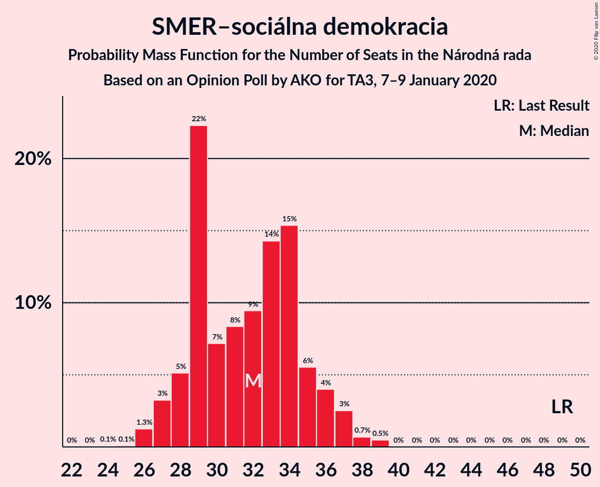

| Number of Seats | Probability | Accumulated | Special Marks |
|:---------------:|:-----------:|:-----------:|:-------------:|
| 24 | 0.1% | 100% |  |
| 25 | 0.1% | 99.9% |  |
| 26 | 1.3% | 99.8% |  |
| 27 | 3% | 98.6% |  |
| 28 | 5% | 95% |  |
| 29 | 22% | 90% |  |
| 30 | 7% | 68% |  |
| 31 | 8% | 61% |  |
| 32 | 9% | 52% | Median |
| 33 | 14% | 43% |  |
| 34 | 15% | 29% |  |
| 35 | 6% | 13% |  |
| 36 | 4% | 8% |  |
| 37 | 3% | 4% |  |
| 38 | 0.7% | 1.2% |  |
| 39 | 0.5% | 0.5% |  |
| 40 | 0% | 0.1% |  |
| 41 | 0% | 0% |  |
| 42 | 0% | 0% |  |
| 43 | 0% | 0% |  |
| 44 | 0% | 0% |  |
| 45 | 0% | 0% |  |
| 46 | 0% | 0% |  |
| 47 | 0% | 0% |  |
| 48 | 0% | 0% |  |
| 49 | 0% | 0% | Last Result |

### Kotleba–Ľudová strana Naše Slovensko

*For a full overview of the results for this party, see the [Kotleba–Ľudová strana Naše Slovensko](party-kotleba–ľudovástrananašeslovensko.html) page.*

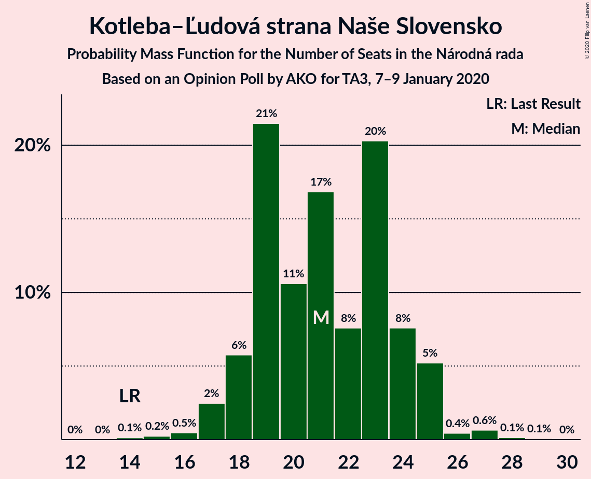

| Number of Seats | Probability | Accumulated | Special Marks |
|:---------------:|:-----------:|:-----------:|:-------------:|
| 14 | 0.1% | 100% | Last Result |
| 15 | 0.2% | 99.9% |  |
| 16 | 0.5% | 99.6% |  |
| 17 | 2% | 99.2% |  |
| 18 | 6% | 97% |  |
| 19 | 21% | 91% |  |
| 20 | 11% | 69% |  |
| 21 | 17% | 59% | Median |
| 22 | 8% | 42% |  |
| 23 | 20% | 34% |  |
| 24 | 8% | 14% |  |
| 25 | 5% | 7% |  |
| 26 | 0.4% | 1.3% |  |
| 27 | 0.6% | 0.9% |  |
| 28 | 0.1% | 0.2% |  |
| 29 | 0.1% | 0.1% |  |
| 30 | 0% | 0% |  |

### Za ľudí

*For a full overview of the results for this party, see the [Za ľudí](party-zaľudí.html) page.*

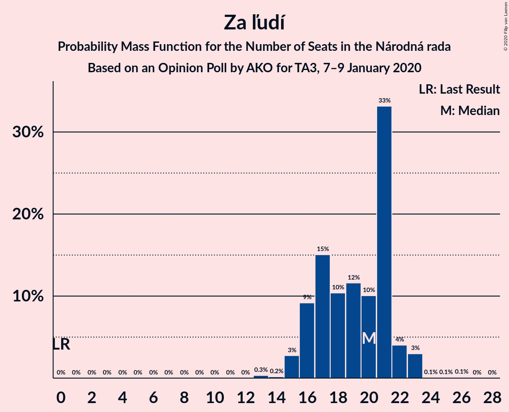

| Number of Seats | Probability | Accumulated | Special Marks |
|:---------------:|:-----------:|:-----------:|:-------------:|
| 0 | 0% | 100% | Last Result |
| 1 | 0% | 100% |  |
| 2 | 0% | 100% |  |
| 3 | 0% | 100% |  |
| 4 | 0% | 100% |  |
| 5 | 0% | 100% |  |
| 6 | 0% | 100% |  |
| 7 | 0% | 100% |  |
| 8 | 0% | 100% |  |
| 9 | 0% | 100% |  |
| 10 | 0% | 100% |  |
| 11 | 0% | 100% |  |
| 12 | 0% | 100% |  |
| 13 | 0.3% | 100% |  |
| 14 | 0.2% | 99.6% |  |
| 15 | 3% | 99.5% |  |
| 16 | 9% | 97% |  |
| 17 | 15% | 88% |  |
| 18 | 10% | 72% |  |
| 19 | 12% | 62% |  |
| 20 | 10% | 50% | Median |
| 21 | 33% | 40% |  |
| 22 | 4% | 7% |  |
| 23 | 3% | 3% |  |
| 24 | 0.1% | 0.3% |  |
| 25 | 0.1% | 0.2% |  |
| 26 | 0.1% | 0.1% |  |
| 27 | 0% | 0% |  |

### Progresívne Slovensko–SPOLU–Občianska Demokracia

*For a full overview of the results for this party, see the [Progresívne Slovensko–SPOLU–Občianska Demokracia](party-progresívneslovensko–spolu–občianskademokracia.html) page.*

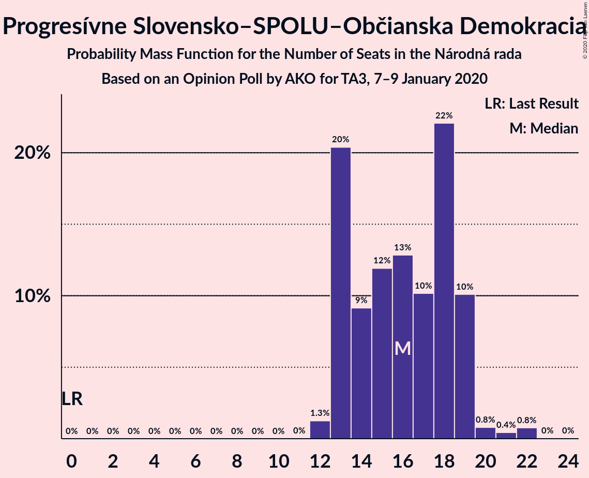

| Number of Seats | Probability | Accumulated | Special Marks |
|:---------------:|:-----------:|:-----------:|:-------------:|
| 0 | 0% | 100% | Last Result |
| 1 | 0% | 100% |  |
| 2 | 0% | 100% |  |
| 3 | 0% | 100% |  |
| 4 | 0% | 100% |  |
| 5 | 0% | 100% |  |
| 6 | 0% | 100% |  |
| 7 | 0% | 100% |  |
| 8 | 0% | 100% |  |
| 9 | 0% | 100% |  |
| 10 | 0% | 100% |  |
| 11 | 0% | 100% |  |
| 12 | 1.3% | 99.9% |  |
| 13 | 20% | 98.7% |  |
| 14 | 9% | 78% |  |
| 15 | 12% | 69% |  |
| 16 | 13% | 57% | Median |
| 17 | 10% | 44% |  |
| 18 | 22% | 34% |  |
| 19 | 10% | 12% |  |
| 20 | 0.8% | 2% |  |
| 21 | 0.4% | 1.3% |  |
| 22 | 0.8% | 0.8% |  |
| 23 | 0% | 0.1% |  |
| 24 | 0% | 0% |  |

### OBYČAJNÍ ĽUDIA a nezávislé osobnosti

*For a full overview of the results for this party, see the [OBYČAJNÍ ĽUDIA a nezávislé osobnosti](party-obyčajníľudiaanezávisléosobnosti.html) page.*

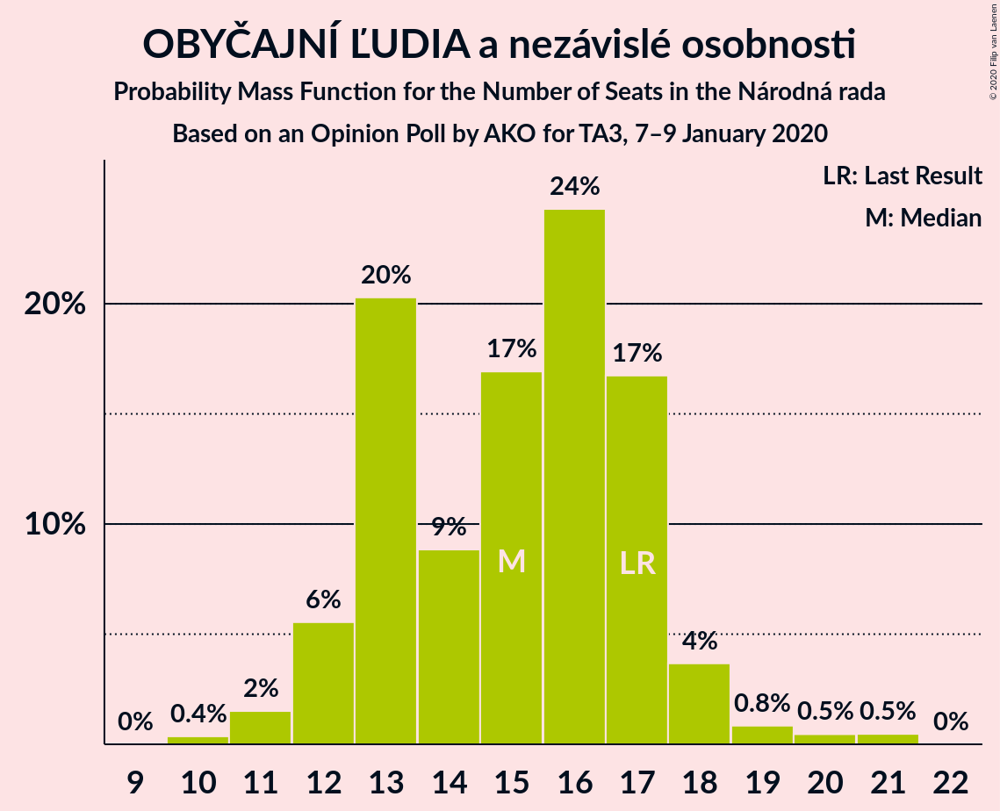

| Number of Seats | Probability | Accumulated | Special Marks |
|:---------------:|:-----------:|:-----------:|:-------------:|
| 10 | 0.4% | 100% |  |
| 11 | 2% | 99.6% |  |
| 12 | 6% | 98% |  |
| 13 | 20% | 93% |  |
| 14 | 9% | 72% |  |
| 15 | 17% | 63% | Median |
| 16 | 24% | 47% |  |
| 17 | 17% | 22% | Last Result |
| 18 | 4% | 5% |  |
| 19 | 0.8% | 2% |  |
| 20 | 0.5% | 0.9% |  |
| 21 | 0.5% | 0.5% |  |
| 22 | 0% | 0% |  |

### SME RODINA

*For a full overview of the results for this party, see the [SME RODINA](party-smerodina.html) page.*

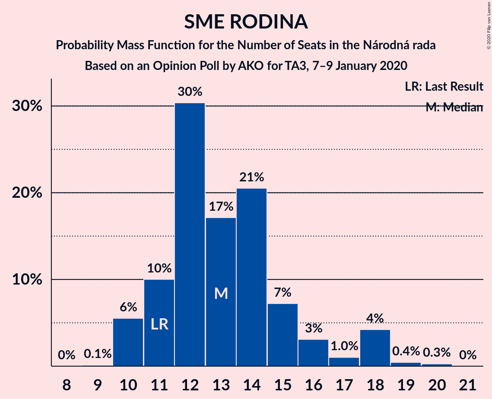

| Number of Seats | Probability | Accumulated | Special Marks |
|:---------------:|:-----------:|:-----------:|:-------------:|
| 9 | 0.1% | 100% |  |
| 10 | 6% | 99.9% |  |
| 11 | 10% | 94% | Last Result |
| 12 | 30% | 84% |  |
| 13 | 17% | 54% | Median |
| 14 | 21% | 37% |  |
| 15 | 7% | 16% |  |
| 16 | 3% | 9% |  |
| 17 | 1.0% | 6% |  |
| 18 | 4% | 5% |  |
| 19 | 0.4% | 0.7% |  |
| 20 | 0.3% | 0.3% |  |
| 21 | 0% | 0% |  |

### Sloboda a Solidarita

*For a full overview of the results for this party, see the [Sloboda a Solidarita](party-slobodaasolidarita.html) page.*

| Number of Seats | Probability | Accumulated | Special Marks |
|:---------------:|:-----------:|:-----------:|:-------------:|
| 0 | 0.7% | 100% |  |
| 1 | 0% | 99.3% |  |
| 2 | 0% | 99.3% |  |
| 3 | 0% | 99.3% |  |
| 4 | 0% | 99.3% |  |
| 5 | 0% | 99.3% |  |
| 6 | 0% | 99.3% |  |
| 7 | 0% | 99.3% |  |
| 8 | 0.1% | 99.3% |  |
| 9 | 1.1% | 99.2% |  |
| 10 | 12% | 98% |  |
| 11 | 22% | 87% |  |
| 12 | 27% | 64% | Median |
| 13 | 17% | 37% |  |
| 14 | 8% | 20% |  |
| 15 | 9% | 11% |  |
| 16 | 1.2% | 2% |  |
| 17 | 0.7% | 0.8% |  |
| 18 | 0.1% | 0.1% |  |
| 19 | 0% | 0% |  |
| 20 | 0% | 0% |  |
| 21 | 0% | 0% | Last Result |

### Slovenská národná strana

*For a full overview of the results for this party, see the [Slovenská národná strana](party-slovenskánárodnástrana.html) page.*

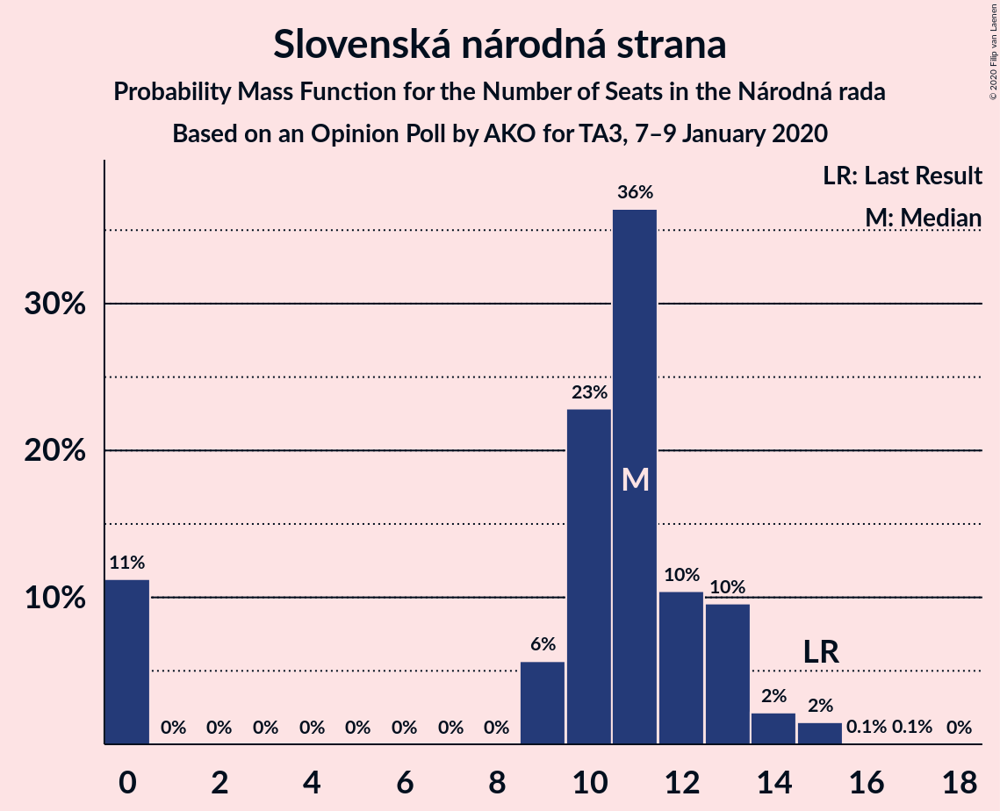

| Number of Seats | Probability | Accumulated | Special Marks |
|:---------------:|:-----------:|:-----------:|:-------------:|
| 0 | 11% | 100% |  |
| 1 | 0% | 89% |  |
| 2 | 0% | 89% |  |
| 3 | 0% | 89% |  |
| 4 | 0% | 89% |  |
| 5 | 0% | 89% |  |
| 6 | 0% | 89% |  |
| 7 | 0% | 89% |  |
| 8 | 0% | 89% |  |
| 9 | 6% | 89% |  |
| 10 | 23% | 83% |  |
| 11 | 36% | 60% | Median |
| 12 | 10% | 24% |  |
| 13 | 10% | 13% |  |
| 14 | 2% | 4% |  |
| 15 | 2% | 2% | Last Result |
| 16 | 0.1% | 0.1% |  |
| 17 | 0.1% | 0.1% |  |
| 18 | 0% | 0% |  |

### Kresťanskodemokratické hnutie

*For a full overview of the results for this party, see the [Kresťanskodemokratické hnutie](party-kresťanskodemokratickéhnutie.html) page.*

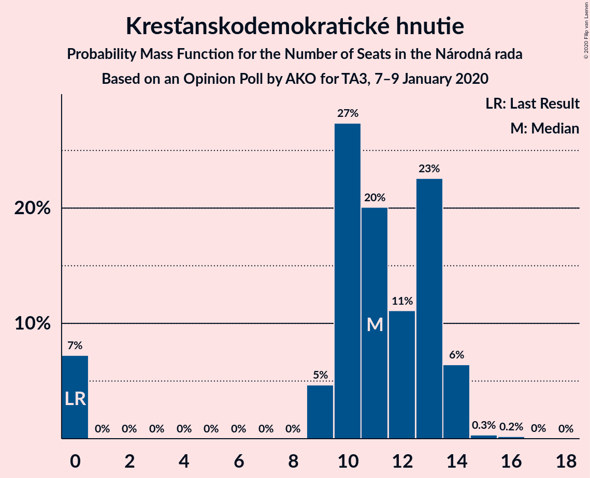

| Number of Seats | Probability | Accumulated | Special Marks |
|:---------------:|:-----------:|:-----------:|:-------------:|
| 0 | 7% | 100% | Last Result |
| 1 | 0% | 93% |  |
| 2 | 0% | 93% |  |
| 3 | 0% | 93% |  |
| 4 | 0% | 93% |  |
| 5 | 0% | 93% |  |
| 6 | 0% | 93% |  |
| 7 | 0% | 93% |  |
| 8 | 0% | 93% |  |
| 9 | 5% | 93% |  |
| 10 | 27% | 88% |  |
| 11 | 20% | 61% | Median |
| 12 | 11% | 41% |  |
| 13 | 23% | 30% |  |
| 14 | 6% | 7% |  |
| 15 | 0.3% | 0.5% |  |
| 16 | 0.2% | 0.2% |  |
| 17 | 0% | 0% |  |

### MOST–HÍD

*For a full overview of the results for this party, see the [MOST–HÍD](party-most–híd.html) page.*

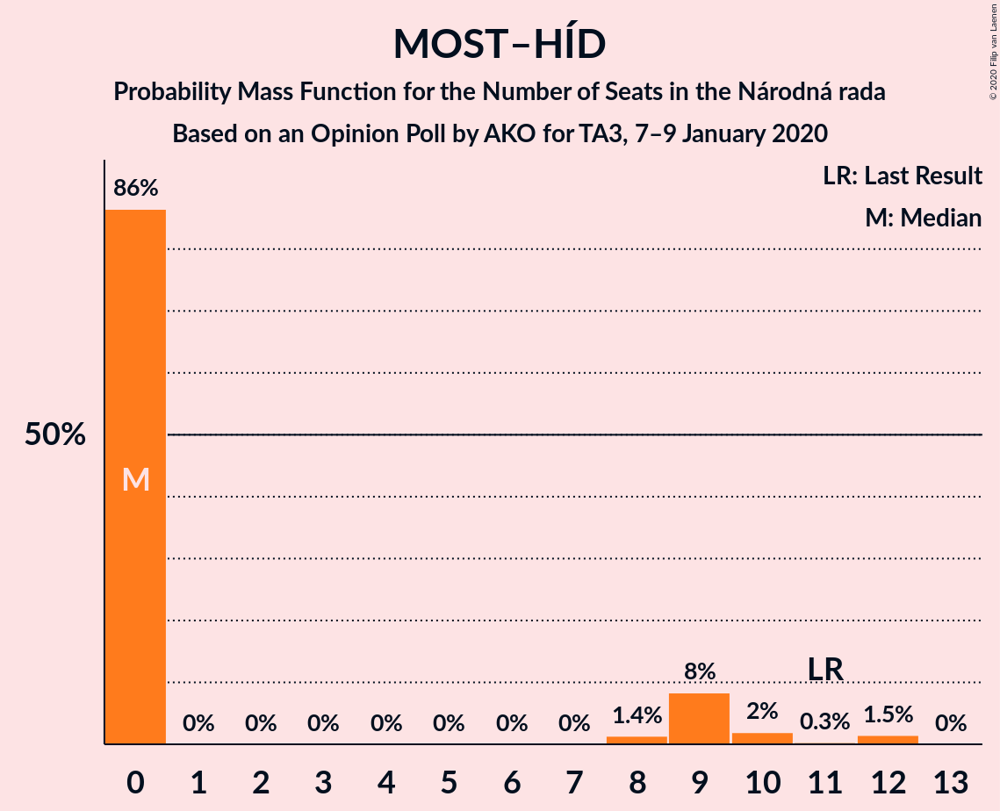

| Number of Seats | Probability | Accumulated | Special Marks |
|:---------------:|:-----------:|:-----------:|:-------------:|
| 0 | 86% | 100% | Median |
| 1 | 0% | 14% |  |
| 2 | 0% | 14% |  |
| 3 | 0% | 14% |  |
| 4 | 0% | 14% |  |
| 5 | 0% | 14% |  |
| 6 | 0% | 14% |  |
| 7 | 0% | 14% |  |
| 8 | 1.4% | 14% |  |
| 9 | 8% | 12% |  |
| 10 | 2% | 4% |  |
| 11 | 0.3% | 2% | Last Result |
| 12 | 1.5% | 1.5% |  |
| 13 | 0% | 0% |  |

### Dobrá voľba

*For a full overview of the results for this party, see the [Dobrá voľba](party-dobrávoľba.html) page.*

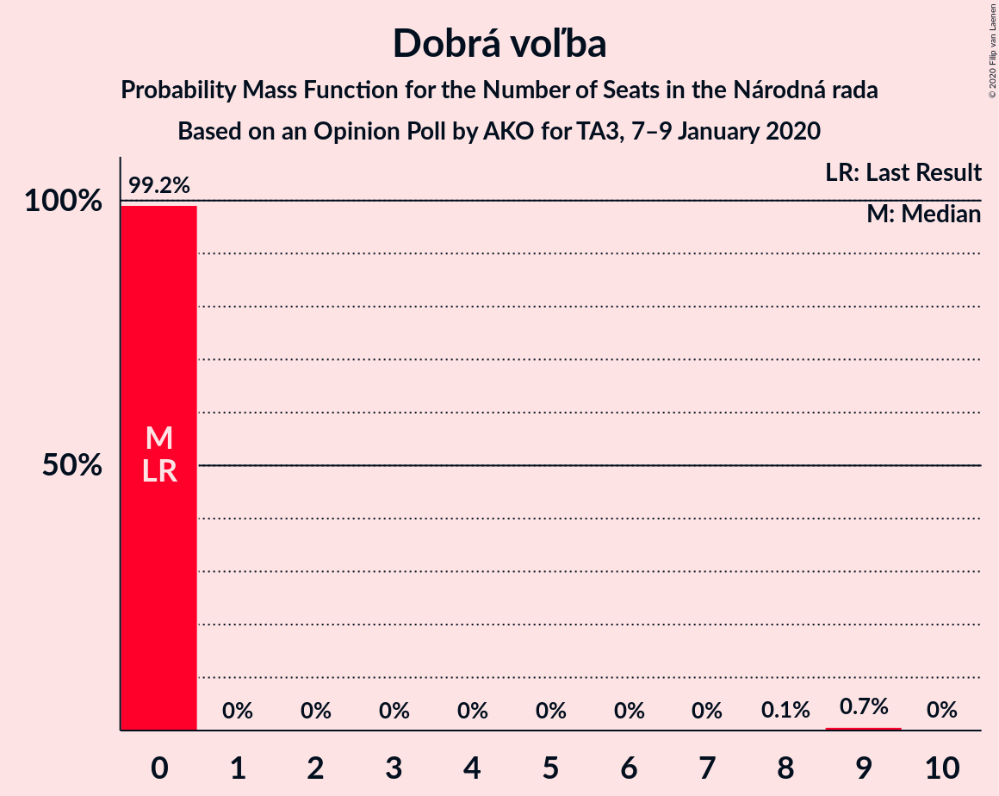

| Number of Seats | Probability | Accumulated | Special Marks |
|:---------------:|:-----------:|:-----------:|:-------------:|
| 0 | 99.2% | 100% | Last Result, Median |
| 1 | 0% | 0.8% |  |
| 2 | 0% | 0.8% |  |
| 3 | 0% | 0.8% |  |
| 4 | 0% | 0.8% |  |
| 5 | 0% | 0.8% |  |
| 6 | 0% | 0.8% |  |
| 7 | 0% | 0.8% |  |
| 8 | 0.1% | 0.8% |  |
| 9 | 0.7% | 0.7% |  |
| 10 | 0% | 0% |  |

### Strana maďarskej koalície–Magyar Koalíció Pártja

*For a full overview of the results for this party, see the [Strana maďarskej koalície–Magyar Koalíció Pártja](party-stranamaďarskejkoalície–magyarkoalíciópártja.html) page.*

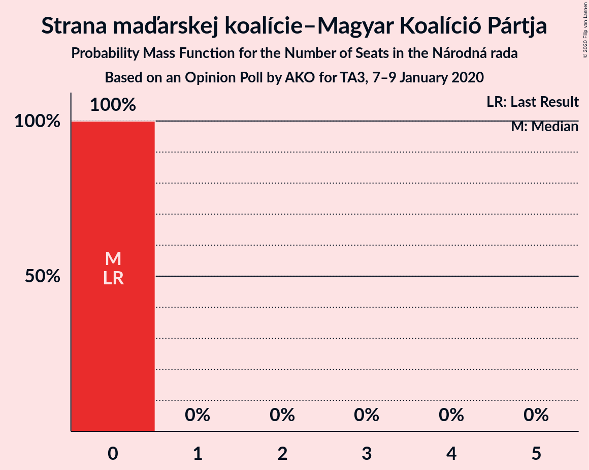

| Number of Seats | Probability | Accumulated | Special Marks |
|:---------------:|:-----------:|:-----------:|:-------------:|
| 0 | 100% | 100% | Last Result, Median |

### VLASŤ

*For a full overview of the results for this party, see the [VLASŤ](party-vlasť.html) page.*

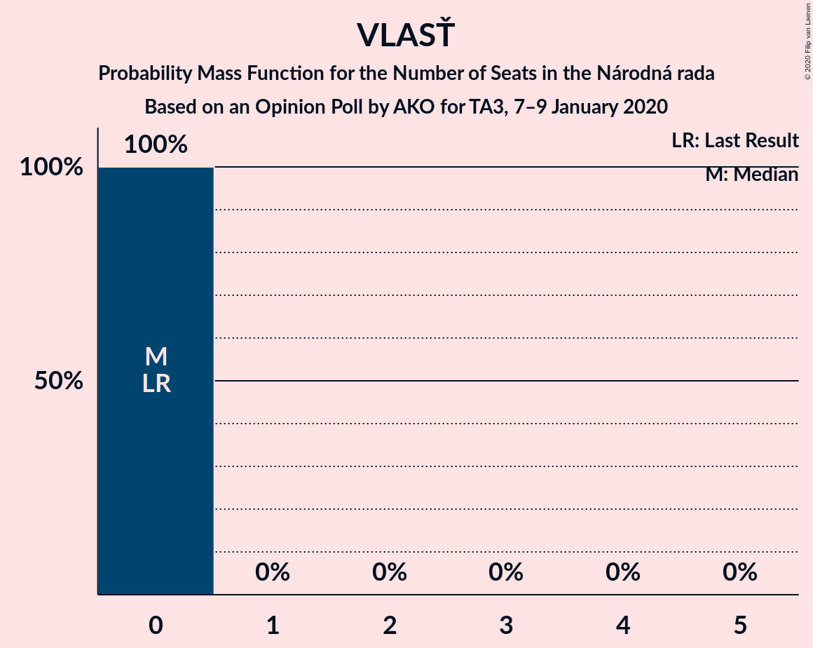

| Number of Seats | Probability | Accumulated | Special Marks |
|:---------------:|:-----------:|:-----------:|:-------------:|
| 0 | 100% | 100% | Last Result, Median |

## Coalitions

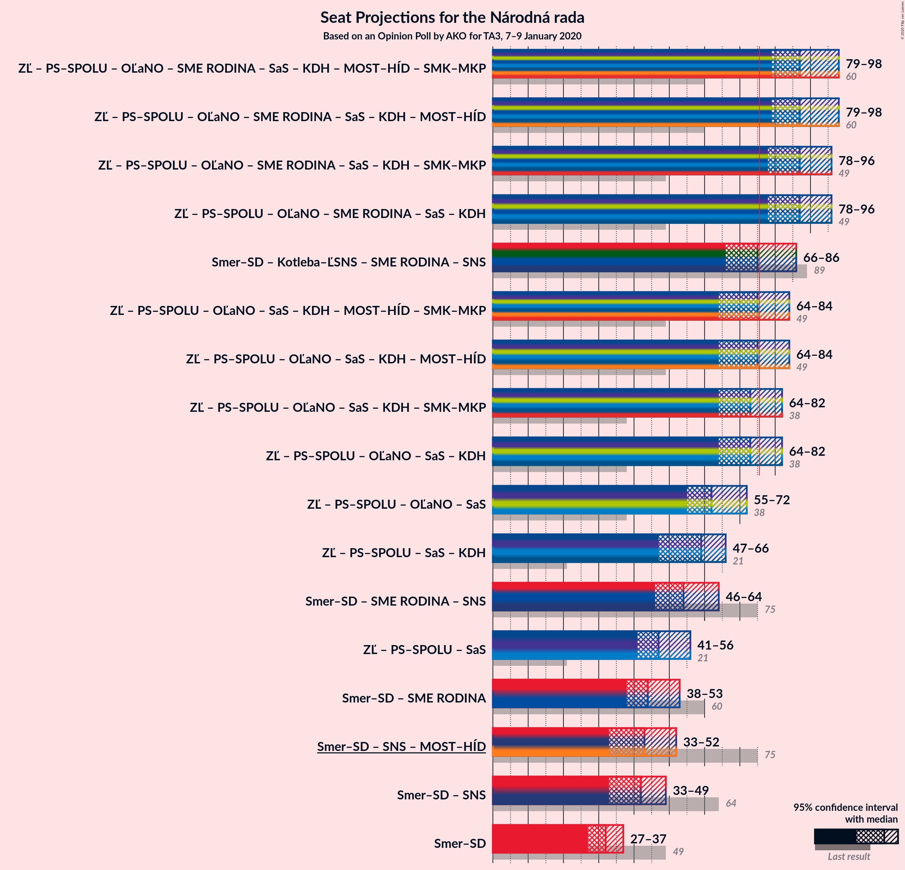

### Confidence Intervals

| Coalition | Last Result | Median | Majority? | 80% Confidence Interval | 90% Confidence Interval | 95% Confidence Interval | 99% Confidence Interval |
|:---------:|:-----------:|:------:|:---------:|:-----------------------:|:-----------------------:|:-----------------------:|:-----------------------:|
| SMER–sociálna demokracia – Slovenská národná strana – MOST–HÍD | 75 | 43 | 0% | 36–49 | 33–51 | 33–52 | 30–54 |
| SMER–sociálna demokracia | 49 | 32 | 0% | 29–35 | 28–36 | 27–37 | 26–39 |

### SMER–sociálna demokracia – Slovenská národná strana – MOST–HÍD

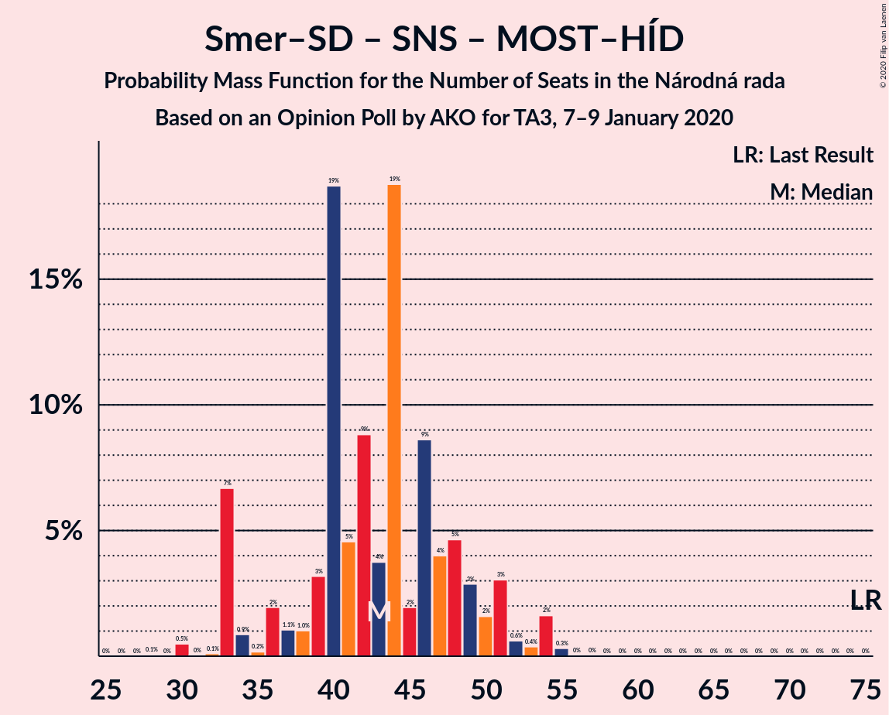

| Number of Seats | Probability | Accumulated | Special Marks |
|:---------------:|:-----------:|:-----------:|:-------------:|
| 28 | 0.1% | 100% |  |
| 29 | 0% | 99.9% |  |
| 30 | 0.5% | 99.9% |  |
| 31 | 0% | 99.4% |  |
| 32 | 0.1% | 99.4% |  |
| 33 | 7% | 99.3% |  |
| 34 | 0.9% | 93% |  |
| 35 | 0.2% | 92% |  |
| 36 | 2% | 92% |  |
| 37 | 1.1% | 90% |  |
| 38 | 1.0% | 89% |  |
| 39 | 3% | 88% |  |
| 40 | 19% | 84% |  |
| 41 | 5% | 66% |  |
| 42 | 9% | 61% |  |
| 43 | 4% | 52% | Median |
| 44 | 19% | 49% |  |
| 45 | 2% | 30% |  |
| 46 | 9% | 28% |  |
| 47 | 4% | 19% |  |
| 48 | 5% | 15% |  |
| 49 | 3% | 11% |  |
| 50 | 2% | 8% |  |
| 51 | 3% | 6% |  |
| 52 | 0.6% | 3% |  |
| 53 | 0.4% | 2% |  |
| 54 | 2% | 2% |  |
| 55 | 0.3% | 0.4% |  |
| 56 | 0% | 0.1% |  |
| 57 | 0% | 0.1% |  |
| 58 | 0% | 0% |  |
| 59 | 0% | 0% |  |
| 60 | 0% | 0% |  |
| 61 | 0% | 0% |  |
| 62 | 0% | 0% |  |
| 63 | 0% | 0% |  |
| 64 | 0% | 0% |  |
| 65 | 0% | 0% |  |
| 66 | 0% | 0% |  |
| 67 | 0% | 0% |  |
| 68 | 0% | 0% |  |
| 69 | 0% | 0% |  |
| 70 | 0% | 0% |  |
| 71 | 0% | 0% |  |
| 72 | 0% | 0% |  |
| 73 | 0% | 0% |  |
| 74 | 0% | 0% |  |
| 75 | 0% | 0% | Last Result |

### SMER–sociálna demokracia

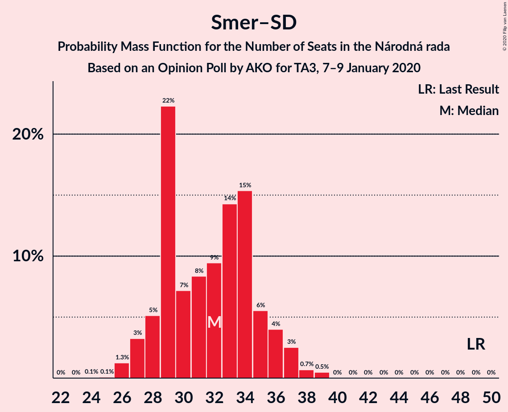

| Number of Seats | Probability | Accumulated | Special Marks |
|:---------------:|:-----------:|:-----------:|:-------------:|
| 24 | 0.1% | 100% |  |
| 25 | 0.1% | 99.9% |  |
| 26 | 1.3% | 99.8% |  |
| 27 | 3% | 98.6% |  |
| 28 | 5% | 95% |  |
| 29 | 22% | 90% |  |
| 30 | 7% | 68% |  |
| 31 | 8% | 61% |  |
| 32 | 9% | 52% | Median |
| 33 | 14% | 43% |  |
| 34 | 15% | 29% |  |
| 35 | 6% | 13% |  |
| 36 | 4% | 8% |  |
| 37 | 3% | 4% |  |
| 38 | 0.7% | 1.2% |  |
| 39 | 0.5% | 0.5% |  |
| 40 | 0% | 0.1% |  |
| 41 | 0% | 0% |  |
| 42 | 0% | 0% |  |
| 43 | 0% | 0% |  |
| 44 | 0% | 0% |  |
| 45 | 0% | 0% |  |
| 46 | 0% | 0% |  |
| 47 | 0% | 0% |  |
| 48 | 0% | 0% |  |
| 49 | 0% | 0% | Last Result |

## Technical Information

### Opinion Poll

+ **Polling firm:** AKO
+ **Commissioner(s):** TA3
+ **Fieldwork period:** 7–9 January 2020

### Calculations

+ **Sample size:** 1000
+ **Simulations done:** 1,048,576
+ **Error estimate:** 1.72%

