# Opinion Poll by FOCUS, 10–14 January 2020

<a href="#voting-intentions">Voting Intentions</a> | <a href="#seats">Seats</a> | <a href="#coalitions">Coalitions</a> | <a href="#technical-information">Technical Information</a>

## Voting Intentions

### Confidence Intervals

| Party | Last Result | Poll Result | 80% Confidence Interval | 90% Confidence Interval | 95% Confidence Interval | 99% Confidence Interval |
|:-----:|:-----------:|:-----------:|:-----------------------:|:-----------------------:|:-----------------------:|:-----------------------:|
| SMER–sociálna demokracia | 28.3% | 18.7% | 17.2–20.4% |16.8–20.8% |16.4–21.2% |15.7–22.1% |
| Kotleba–Ľudová strana Naše Slovensko | 8.0% | 13.6% | 12.3–15.0% |11.9–15.5% |11.6–15.8% |11.0–16.6% |
| Progresívne Slovensko–SPOLU–Občianska Demokracia | 0.0% | 10.5% | 9.3–11.8% |9.0–12.2% |8.7–12.5% |8.2–13.2% |
| Za ľudí | 0.0% | 10.3% | 9.2–11.6% |8.8–12.0% |8.6–12.3% |8.0–13.0% |
| OBYČAJNÍ ĽUDIA a nezávislé osobnosti | 11.0% | 7.7% | 6.7–8.9% |6.5–9.3% |6.2–9.5% |5.8–10.1% |
| SME RODINA | 6.6% | 7.1% | 6.2–8.3% |5.9–8.6% |5.7–8.9% |5.3–9.5% |
| Kresťanskodemokratické hnutie | 4.9% | 6.0% | 5.2–7.1% |4.9–7.4% |4.7–7.7% |4.3–8.2% |
| Sloboda a Solidarita | 12.1% | 5.4% | 4.6–6.5% |4.4–6.8% |4.2–7.0% |3.8–7.6% |
| Slovenská národná strana | 8.6% | 5.1% | 4.4–6.2% |4.1–6.4% |3.9–6.7% |3.6–7.2% |
| MOST–HÍD | 6.5% | 4.0% | 3.3–4.9% |3.1–5.1% |2.9–5.3% |2.6–5.8% |
| Strana maďarskej koalície–Magyar Koalíció Pártja | 4.0% | 3.7% | 3.0–4.5% |2.8–4.8% |2.7–5.0% |2.4–5.5% |
| Dobrá voľba | 0.0% | 3.3% | 2.7–4.1% |2.5–4.3% |2.3–4.6% |2.1–5.0% |
| VLASŤ | 0.0% | 2.3% | 1.8–3.0% |1.6–3.2% |1.5–3.4% |1.3–3.8% |

*Note:* The poll result column reflects the actual value used in the calculations. Published results may vary slightly, and in addition be rounded to fewer digits.

## Seats

### Confidence Intervals

| Party | Last Result | Median | 80% Confidence Interval | 90% Confidence Interval | 95% Confidence Interval | 99% Confidence Interval |
|:-----:|:-----------:|:------:|:-----------------------:|:-----------------------:|:-----------------------:|:-----------------------:|
| <a href="#smer–sociálna-demokracia">SMER–sociálna demokracia</a> | 49 | 34 | 31–39 |30–39 |30–39 |28–42 |
| <a href="#kotleba–ľudová-strana-naše-slovensko">Kotleba–Ľudová strana Naše Slovensko</a> | 14 | 25 | 22–28 |22–29 |21–30 |20–32 |
| <a href="#progresívne-slovensko–spolu–občianska-demokracia">Progresívne Slovensko–SPOLU–Občianska Demokracia</a> | 0 | 18 | 17–22 |17–23 |16–24 |15–25 |
| <a href="#za-ľudí">Za ľudí</a> | 0 | 18 | 17–22 |16–22 |15–23 |14–26 |
| <a href="#obyčajní-ľudia-a-nezávislé-osobnosti">OBYČAJNÍ ĽUDIA a nezávislé osobnosti</a> | 17 | 15 | 13–18 |12–18 |12–18 |10–19 |
| <a href="#sme-rodina">SME RODINA</a> | 11 | 13 | 12–15 |10–15 |9–16 |9–18 |
| <a href="#kresťanskodemokratické-hnutie">Kresťanskodemokratické hnutie</a> | 0 | 10 | 10–13 |0–14 |0–14 |0–15 |
| <a href="#sloboda-a-solidarita">Sloboda a Solidarita</a> | 21 | 11 | 0–13 |0–13 |0–13 |0–15 |
| <a href="#slovenská-národná-strana">Slovenská národná strana</a> | 15 | 0 | 0–11 |0–11 |0–12 |0–13 |
| <a href="#most–híd">MOST–HÍD</a> | 11 | 0 | 0–11 |0–11 |0–11 |0–11 |
| <a href="#strana-maďarskej-koalície–magyar-koalíció-pártja">Strana maďarskej koalície–Magyar Koalíció Pártja</a> | 0 | 0 | 0 |0 |0–9 |0–9 |
| <a href="#dobrá-voľba">Dobrá voľba</a> | 0 | 0 | 0 |0 |0 |0 |
| <a href="#vlasť">VLASŤ</a> | 0 | 0 | 0 |0 |0 |0 |

### SMER–sociálna demokracia

*For a full overview of the results for this party, see the [SMER–sociálna demokracia](party-smer–sociálnademokracia.html) page.*

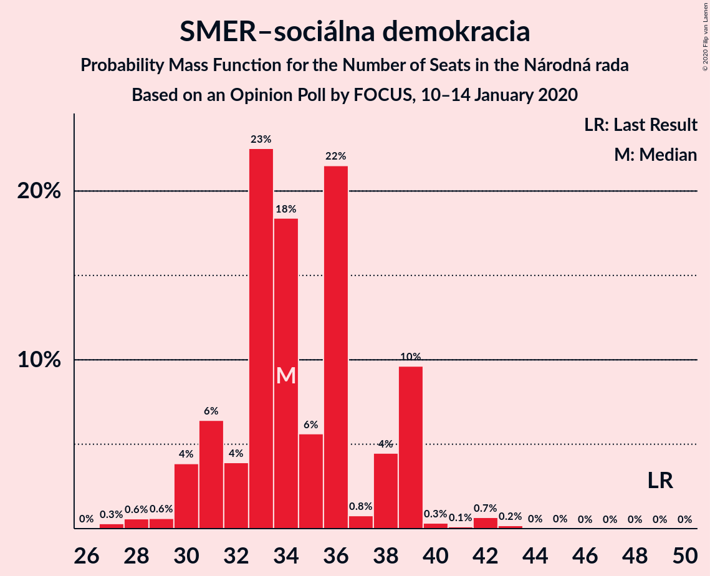

| Number of Seats | Probability | Accumulated | Special Marks |
|:---------------:|:-----------:|:-----------:|:-------------:|
| 27 | 0.3% | 100% |  |
| 28 | 0.6% | 99.7% |  |
| 29 | 0.6% | 99.1% |  |
| 30 | 4% | 98% |  |
| 31 | 6% | 95% |  |
| 32 | 4% | 88% |  |
| 33 | 23% | 84% |  |
| 34 | 18% | 62% | Median |
| 35 | 6% | 43% |  |
| 36 | 22% | 38% |  |
| 37 | 0.8% | 16% |  |
| 38 | 4% | 15% |  |
| 39 | 10% | 11% |  |
| 40 | 0.3% | 1.4% |  |
| 41 | 0.1% | 1.0% |  |
| 42 | 0.7% | 0.9% |  |
| 43 | 0.2% | 0.2% |  |
| 44 | 0% | 0.1% |  |
| 45 | 0% | 0% |  |
| 46 | 0% | 0% |  |
| 47 | 0% | 0% |  |
| 48 | 0% | 0% |  |
| 49 | 0% | 0% | Last Result |

### Kotleba–Ľudová strana Naše Slovensko

*For a full overview of the results for this party, see the [Kotleba–Ľudová strana Naše Slovensko](party-kotleba–ľudovástrananašeslovensko.html) page.*

| Number of Seats | Probability | Accumulated | Special Marks |
|:---------------:|:-----------:|:-----------:|:-------------:|
| 14 | 0% | 100% | Last Result |
| 15 | 0% | 100% |  |
| 16 | 0% | 100% |  |
| 17 | 0% | 100% |  |
| 18 | 0% | 100% |  |
| 19 | 0.3% | 100% |  |
| 20 | 2% | 99.7% |  |
| 21 | 2% | 98% |  |
| 22 | 9% | 96% |  |
| 23 | 3% | 87% |  |
| 24 | 27% | 84% |  |
| 25 | 25% | 57% | Median |
| 26 | 7% | 32% |  |
| 27 | 2% | 25% |  |
| 28 | 17% | 23% |  |
| 29 | 3% | 6% |  |
| 30 | 0.7% | 3% |  |
| 31 | 1.1% | 2% |  |
| 32 | 1.0% | 1.0% |  |
| 33 | 0% | 0% |  |

### Progresívne Slovensko–SPOLU–Občianska Demokracia

*For a full overview of the results for this party, see the [Progresívne Slovensko–SPOLU–Občianska Demokracia](party-progresívneslovensko–spolu–občianskademokracia.html) page.*

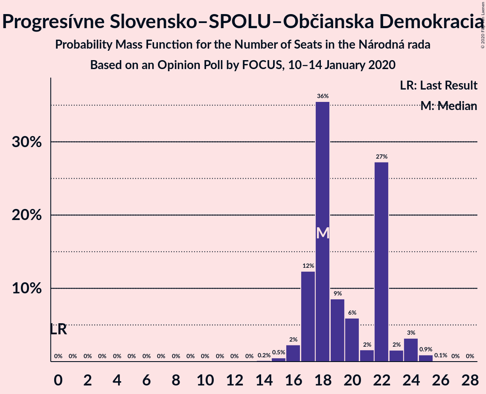

| Number of Seats | Probability | Accumulated | Special Marks |
|:---------------:|:-----------:|:-----------:|:-------------:|
| 0 | 0% | 100% | Last Result |
| 1 | 0% | 100% |  |
| 2 | 0% | 100% |  |
| 3 | 0% | 100% |  |
| 4 | 0% | 100% |  |
| 5 | 0% | 100% |  |
| 6 | 0% | 100% |  |
| 7 | 0% | 100% |  |
| 8 | 0% | 100% |  |
| 9 | 0% | 100% |  |
| 10 | 0% | 100% |  |
| 11 | 0% | 100% |  |
| 12 | 0% | 100% |  |
| 13 | 0% | 100% |  |
| 14 | 0.2% | 100% |  |
| 15 | 0.5% | 99.8% |  |
| 16 | 2% | 99.3% |  |
| 17 | 12% | 97% |  |
| 18 | 36% | 85% | Median |
| 19 | 9% | 49% |  |
| 20 | 6% | 41% |  |
| 21 | 2% | 35% |  |
| 22 | 27% | 33% |  |
| 23 | 2% | 6% |  |
| 24 | 3% | 4% |  |
| 25 | 0.9% | 1.1% |  |
| 26 | 0.1% | 0.1% |  |
| 27 | 0% | 0% |  |

### Za ľudí

*For a full overview of the results for this party, see the [Za ľudí](party-zaľudí.html) page.*

| Number of Seats | Probability | Accumulated | Special Marks |
|:---------------:|:-----------:|:-----------:|:-------------:|
| 0 | 0% | 100% | Last Result |
| 1 | 0% | 100% |  |
| 2 | 0% | 100% |  |
| 3 | 0% | 100% |  |
| 4 | 0% | 100% |  |
| 5 | 0% | 100% |  |
| 6 | 0% | 100% |  |
| 7 | 0% | 100% |  |
| 8 | 0% | 100% |  |
| 9 | 0% | 100% |  |
| 10 | 0% | 100% |  |
| 11 | 0% | 100% |  |
| 12 | 0% | 100% |  |
| 13 | 0% | 100% |  |
| 14 | 1.0% | 100% |  |
| 15 | 2% | 98.9% |  |
| 16 | 4% | 97% |  |
| 17 | 5% | 93% |  |
| 18 | 45% | 89% | Median |
| 19 | 6% | 44% |  |
| 20 | 10% | 37% |  |
| 21 | 9% | 28% |  |
| 22 | 16% | 18% |  |
| 23 | 0.6% | 3% |  |
| 24 | 0.5% | 2% |  |
| 25 | 0.8% | 1.5% |  |
| 26 | 0.5% | 0.6% |  |
| 27 | 0.1% | 0.2% |  |
| 28 | 0% | 0% |  |

### OBYČAJNÍ ĽUDIA a nezávislé osobnosti

*For a full overview of the results for this party, see the [OBYČAJNÍ ĽUDIA a nezávislé osobnosti](party-obyčajníľudiaanezávisléosobnosti.html) page.*

| Number of Seats | Probability | Accumulated | Special Marks |
|:---------------:|:-----------:|:-----------:|:-------------:|
| 10 | 0.6% | 100% |  |
| 11 | 1.0% | 99.4% |  |
| 12 | 6% | 98% |  |
| 13 | 18% | 92% |  |
| 14 | 20% | 75% |  |
| 15 | 24% | 54% | Median |
| 16 | 11% | 30% |  |
| 17 | 4% | 20% | Last Result |
| 18 | 14% | 16% |  |
| 19 | 1.3% | 2% |  |
| 20 | 0.2% | 0.3% |  |
| 21 | 0% | 0% |  |

### SME RODINA

*For a full overview of the results for this party, see the [SME RODINA](party-smerodina.html) page.*

| Number of Seats | Probability | Accumulated | Special Marks |
|:---------------:|:-----------:|:-----------:|:-------------:|
| 9 | 3% | 100% |  |
| 10 | 4% | 97% |  |
| 11 | 2% | 94% | Last Result |
| 12 | 9% | 91% |  |
| 13 | 37% | 82% | Median |
| 14 | 18% | 45% |  |
| 15 | 24% | 28% |  |
| 16 | 2% | 4% |  |
| 17 | 0.4% | 1.4% |  |
| 18 | 0.9% | 1.0% |  |
| 19 | 0% | 0% |  |

### Kresťanskodemokratické hnutie

*For a full overview of the results for this party, see the [Kresťanskodemokratické hnutie](party-kresťanskodemokratickéhnutie.html) page.*

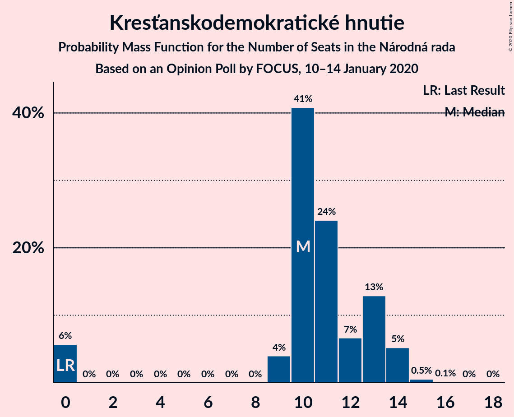

| Number of Seats | Probability | Accumulated | Special Marks |
|:---------------:|:-----------:|:-----------:|:-------------:|
| 0 | 6% | 100% | Last Result |
| 1 | 0% | 94% |  |
| 2 | 0% | 94% |  |
| 3 | 0% | 94% |  |
| 4 | 0% | 94% |  |
| 5 | 0% | 94% |  |
| 6 | 0% | 94% |  |
| 7 | 0% | 94% |  |
| 8 | 0% | 94% |  |
| 9 | 4% | 94% |  |
| 10 | 41% | 90% | Median |
| 11 | 24% | 50% |  |
| 12 | 7% | 25% |  |
| 13 | 13% | 19% |  |
| 14 | 5% | 6% |  |
| 15 | 0.5% | 0.7% |  |
| 16 | 0.1% | 0.2% |  |
| 17 | 0% | 0% |  |

### Sloboda a Solidarita

*For a full overview of the results for this party, see the [Sloboda a Solidarita](party-slobodaasolidarita.html) page.*

| Number of Seats | Probability | Accumulated | Special Marks |
|:---------------:|:-----------:|:-----------:|:-------------:|
| 0 | 25% | 100% |  |
| 1 | 0% | 75% |  |
| 2 | 0% | 75% |  |
| 3 | 0% | 75% |  |
| 4 | 0% | 75% |  |
| 5 | 0% | 75% |  |
| 6 | 0% | 75% |  |
| 7 | 0% | 75% |  |
| 8 | 0% | 75% |  |
| 9 | 5% | 75% |  |
| 10 | 11% | 70% |  |
| 11 | 24% | 59% | Median |
| 12 | 8% | 35% |  |
| 13 | 25% | 27% |  |
| 14 | 1.1% | 2% |  |
| 15 | 0.5% | 0.5% |  |
| 16 | 0% | 0% |  |
| 17 | 0% | 0% |  |
| 18 | 0% | 0% |  |
| 19 | 0% | 0% |  |
| 20 | 0% | 0% |  |
| 21 | 0% | 0% | Last Result |

### Slovenská národná strana

*For a full overview of the results for this party, see the [Slovenská národná strana](party-slovenskánárodnástrana.html) page.*

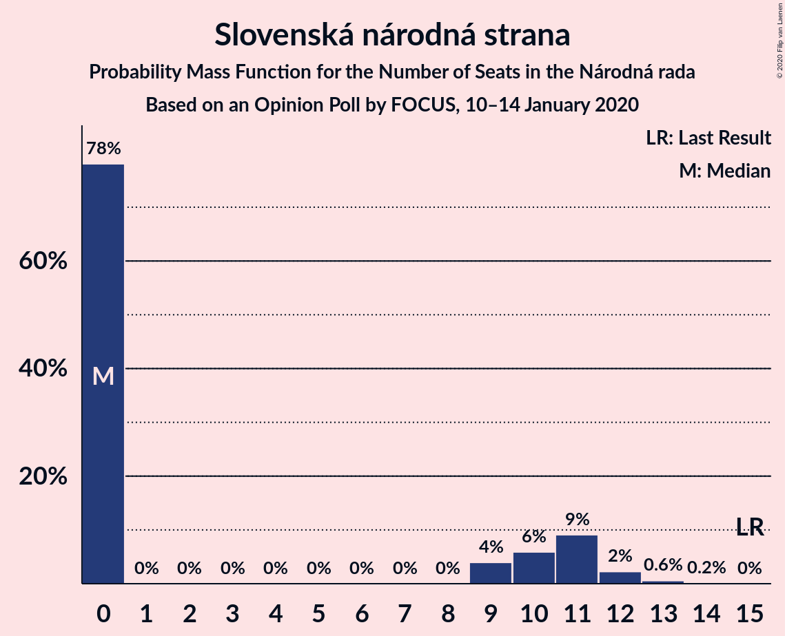

| Number of Seats | Probability | Accumulated | Special Marks |
|:---------------:|:-----------:|:-----------:|:-------------:|
| 0 | 78% | 100% | Median |
| 1 | 0% | 22% |  |
| 2 | 0% | 22% |  |
| 3 | 0% | 22% |  |
| 4 | 0% | 22% |  |
| 5 | 0% | 22% |  |
| 6 | 0% | 22% |  |
| 7 | 0% | 22% |  |
| 8 | 0% | 22% |  |
| 9 | 4% | 22% |  |
| 10 | 6% | 18% |  |
| 11 | 9% | 12% |  |
| 12 | 2% | 3% |  |
| 13 | 0.6% | 0.7% |  |
| 14 | 0.2% | 0.2% |  |
| 15 | 0% | 0% | Last Result |

### MOST–HÍD

*For a full overview of the results for this party, see the [MOST–HÍD](party-most–híd.html) page.*

| Number of Seats | Probability | Accumulated | Special Marks |
|:---------------:|:-----------:|:-----------:|:-------------:|
| 0 | 85% | 100% | Median |
| 1 | 0% | 15% |  |
| 2 | 0% | 15% |  |
| 3 | 0% | 15% |  |
| 4 | 0% | 15% |  |
| 5 | 0% | 15% |  |
| 6 | 0% | 15% |  |
| 7 | 0% | 15% |  |
| 8 | 0% | 15% |  |
| 9 | 0.8% | 15% |  |
| 10 | 0.5% | 15% |  |
| 11 | 14% | 14% | Last Result |
| 12 | 0% | 0% |  |

### Strana maďarskej koalície–Magyar Koalíció Pártja

*For a full overview of the results for this party, see the [Strana maďarskej koalície–Magyar Koalíció Pártja](party-stranamaďarskejkoalície–magyarkoalíciópártja.html) page.*

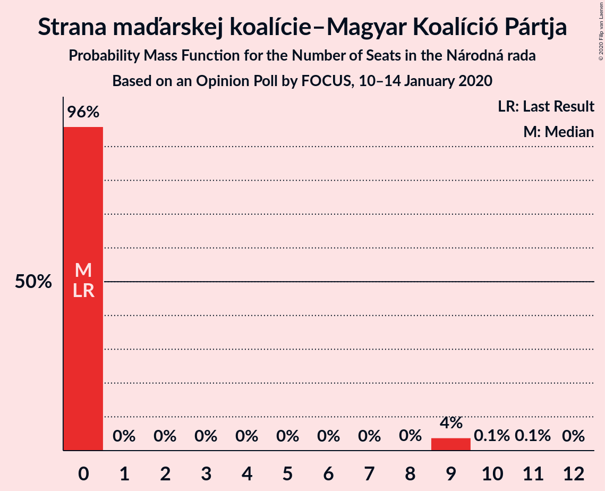

| Number of Seats | Probability | Accumulated | Special Marks |
|:---------------:|:-----------:|:-----------:|:-------------:|
| 0 | 96% | 100% | Last Result, Median |
| 1 | 0% | 4% |  |
| 2 | 0% | 4% |  |
| 3 | 0% | 4% |  |
| 4 | 0% | 4% |  |
| 5 | 0% | 4% |  |
| 6 | 0% | 4% |  |
| 7 | 0% | 4% |  |
| 8 | 0% | 4% |  |
| 9 | 4% | 4% |  |
| 10 | 0.1% | 0.2% |  |
| 11 | 0.1% | 0.1% |  |
| 12 | 0% | 0% |  |

### Dobrá voľba

*For a full overview of the results for this party, see the [Dobrá voľba](party-dobrávoľba.html) page.*

| Number of Seats | Probability | Accumulated | Special Marks |
|:---------------:|:-----------:|:-----------:|:-------------:|
| 0 | 99.9% | 100% | Last Result, Median |
| 1 | 0% | 0.1% |  |
| 2 | 0% | 0.1% |  |
| 3 | 0% | 0.1% |  |
| 4 | 0% | 0.1% |  |
| 5 | 0% | 0.1% |  |
| 6 | 0% | 0.1% |  |
| 7 | 0% | 0.1% |  |
| 8 | 0% | 0.1% |  |
| 9 | 0.1% | 0.1% |  |
| 10 | 0% | 0% |  |

### VLASŤ

*For a full overview of the results for this party, see the [VLASŤ](party-vlasť.html) page.*

| Number of Seats | Probability | Accumulated | Special Marks |
|:---------------:|:-----------:|:-----------:|:-------------:|
| 0 | 100% | 100% | Last Result, Median |

## Coalitions

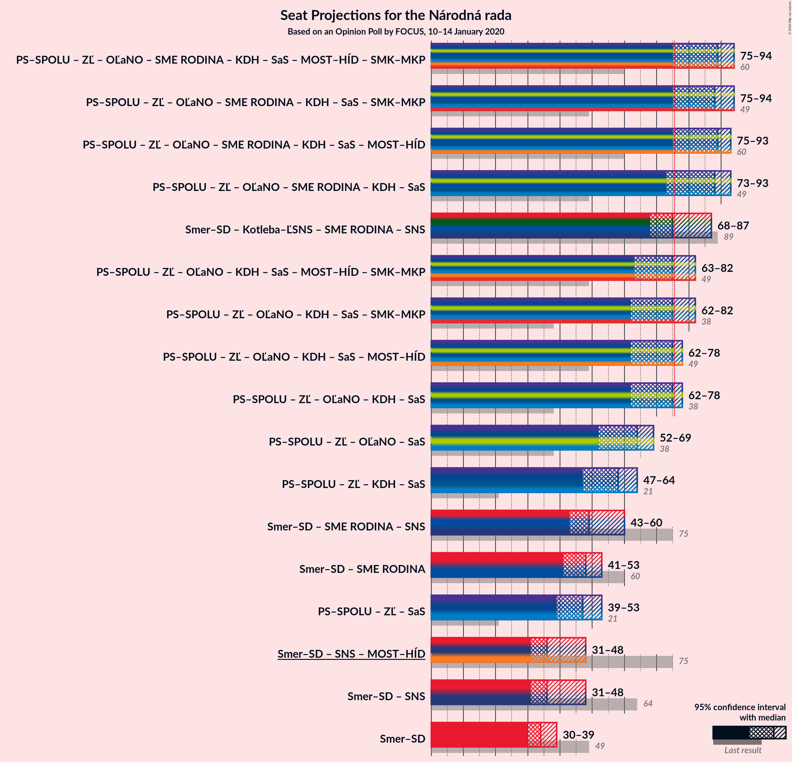

### Confidence Intervals

| Coalition | Last Result | Median | Majority? | 80% Confidence Interval | 90% Confidence Interval | 95% Confidence Interval | 99% Confidence Interval |
|:---------:|:-----------:|:------:|:---------:|:-----------------------:|:-----------------------:|:-----------------------:|:-----------------------:|
| Progresívne Slovensko–SPOLU–Občianska Demokracia – Za ľudí – OBYČAJNÍ ĽUDIA a nezávislé osobnosti – SME RODINA – Kresťanskodemokratické hnutie – Sloboda a Solidarita – MOST–HÍD – Strana maďarskej koalície–Magyar Koalíció Pártja | 60 | 89 | 97% | 81–93 | 78–93 | 75–94 | 73–94 |
| Progresívne Slovensko–SPOLU–Občianska Demokracia – Za ľudí – OBYČAJNÍ ĽUDIA a nezávislé osobnosti – SME RODINA – Kresťanskodemokratické hnutie – Sloboda a Solidarita – Strana maďarskej koalície–Magyar Koalíció Pártja | 49 | 88 | 96% | 78–93 | 77–93 | 75–94 | 73–94 |
| Progresívne Slovensko–SPOLU–Občianska Demokracia – Za ľudí – OBYČAJNÍ ĽUDIA a nezávislé osobnosti – SME RODINA – Kresťanskodemokratické hnutie – Sloboda a Solidarita – MOST–HÍD | 60 | 89 | 96% | 81–93 | 78–93 | 75–93 | 73–94 |
| Progresívne Slovensko–SPOLU–Občianska Demokracia – Za ľudí – OBYČAJNÍ ĽUDIA a nezávislé osobnosti – SME RODINA – Kresťanskodemokratické hnutie – Sloboda a Solidarita | 49 | 88 | 95% | 78–93 | 77–93 | 73–93 | 72–94 |
| SMER–sociálna demokracia – Kotleba–Ľudová strana Naše Slovensko – SME RODINA – Slovenská národná strana | 89 | 75 | 30% | 72–81 | 70–85 | 68–87 | 68–89 |
| Progresívne Slovensko–SPOLU–Občianska Demokracia – Za ľudí – OBYČAJNÍ ĽUDIA a nezávislé osobnosti – Kresťanskodemokratické hnutie – Sloboda a Solidarita – MOST–HÍD – Strana maďarskej koalície–Magyar Koalíció Pártja | 49 | 75 | 49% | 69–78 | 65–80 | 63–82 | 61–82 |
| Progresívne Slovensko–SPOLU–Občianska Demokracia – Za ľudí – OBYČAJNÍ ĽUDIA a nezávislé osobnosti – Kresťanskodemokratické hnutie – Sloboda a Solidarita – Strana maďarskej koalície–Magyar Koalíció Pártja | 38 | 75 | 34% | 65–78 | 64–79 | 62–82 | 60–82 |
| Progresívne Slovensko–SPOLU–Občianska Demokracia – Za ľudí – OBYČAJNÍ ĽUDIA a nezávislé osobnosti – Kresťanskodemokratické hnutie – Sloboda a Solidarita – MOST–HÍD | 49 | 75 | 45% | 69–78 | 63–78 | 62–78 | 60–81 |
| Progresívne Slovensko–SPOLU–Občianska Demokracia – Za ľudí – OBYČAJNÍ ĽUDIA a nezávislé osobnosti – Kresťanskodemokratické hnutie – Sloboda a Solidarita | 38 | 75 | 31% | 65–78 | 63–78 | 62–78 | 59–81 |
| Progresívne Slovensko–SPOLU–Občianska Demokracia – Za ľudí – OBYČAJNÍ ĽUDIA a nezávislé osobnosti – Sloboda a Solidarita | 38 | 64 | 0% | 54–68 | 54–68 | 52–69 | 49–69 |
| Progresívne Slovensko–SPOLU–Občianska Demokracia – Za ľudí – Kresťanskodemokratické hnutie – Sloboda a Solidarita | 21 | 58 | 0% | 51–63 | 50–64 | 47–64 | 44–67 |
| SMER–sociálna demokracia – SME RODINA – Slovenská národná strana | 75 | 49 | 0% | 47–56 | 46–58 | 43–60 | 43–64 |
| SMER–sociálna demokracia – SME RODINA | 60 | 48 | 0% | 44–53 | 43–53 | 41–53 | 40–56 |
| Progresívne Slovensko–SPOLU–Občianska Demokracia – Za ľudí – Sloboda a Solidarita | 21 | 47 | 0% | 40–53 | 40–53 | 39–53 | 36–55 |
| SMER–sociálna demokracia – Slovenská národná strana – MOST–HÍD | 75 | 36 | 0% | 33–47 | 32–47 | 31–48 | 31–53 |
| SMER–sociálna demokracia – Slovenská národná strana | 64 | 36 | 0% | 33–44 | 32–47 | 31–48 | 31–50 |
| SMER–sociálna demokracia | 49 | 34 | 0% | 31–39 | 30–39 | 30–39 | 28–42 |

### Progresívne Slovensko–SPOLU–Občianska Demokracia – Za ľudí – OBYČAJNÍ ĽUDIA a nezávislé osobnosti – SME RODINA – Kresťanskodemokratické hnutie – Sloboda a Solidarita – MOST–HÍD – Strana maďarskej koalície–Magyar Koalíció Pártja

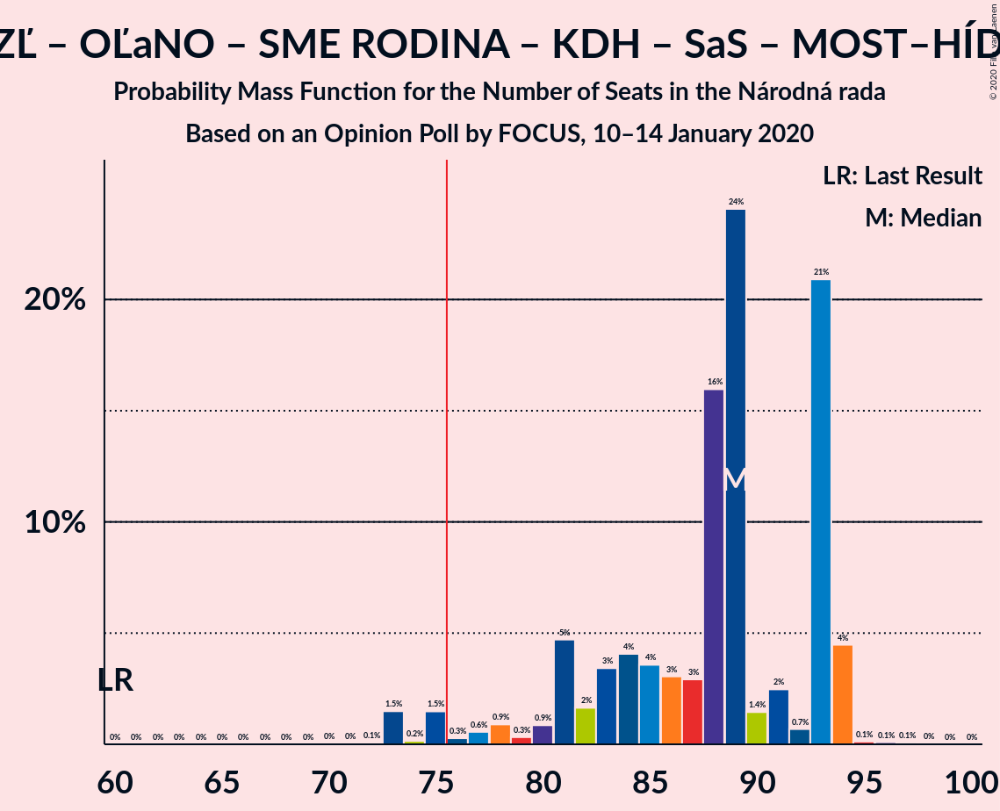

| Number of Seats | Probability | Accumulated | Special Marks |
|:---------------:|:-----------:|:-----------:|:-------------:|
| 60 | 0% | 100% | Last Result |
| 61 | 0% | 100% |  |
| 62 | 0% | 100% |  |
| 63 | 0% | 100% |  |
| 64 | 0% | 100% |  |
| 65 | 0% | 100% |  |
| 66 | 0% | 100% |  |
| 67 | 0% | 100% |  |
| 68 | 0% | 100% |  |
| 69 | 0% | 100% |  |
| 70 | 0% | 100% |  |
| 71 | 0% | 99.9% |  |
| 72 | 0.1% | 99.9% |  |
| 73 | 1.5% | 99.8% |  |
| 74 | 0.2% | 98% |  |
| 75 | 1.5% | 98% |  |
| 76 | 0.3% | 97% | Majority |
| 77 | 0.6% | 96% |  |
| 78 | 0.9% | 96% |  |
| 79 | 0.3% | 95% |  |
| 80 | 0.9% | 95% |  |
| 81 | 5% | 94% |  |
| 82 | 2% | 89% |  |
| 83 | 3% | 87% |  |
| 84 | 4% | 84% |  |
| 85 | 4% | 80% | Median |
| 86 | 3% | 76% |  |
| 87 | 3% | 73% |  |
| 88 | 16% | 70% |  |
| 89 | 24% | 54% |  |
| 90 | 1.4% | 30% |  |
| 91 | 2% | 29% |  |
| 92 | 0.7% | 26% |  |
| 93 | 21% | 26% |  |
| 94 | 4% | 5% |  |
| 95 | 0.1% | 0.4% |  |
| 96 | 0.1% | 0.3% |  |
| 97 | 0.1% | 0.2% |  |
| 98 | 0% | 0.1% |  |
| 99 | 0% | 0% |  |

### Progresívne Slovensko–SPOLU–Občianska Demokracia – Za ľudí – OBYČAJNÍ ĽUDIA a nezávislé osobnosti – SME RODINA – Kresťanskodemokratické hnutie – Sloboda a Solidarita – Strana maďarskej koalície–Magyar Koalíció Pártja

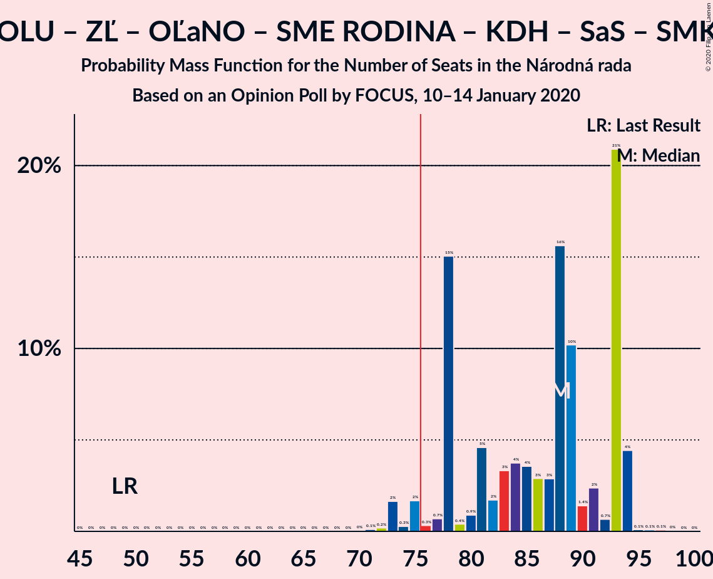

| Number of Seats | Probability | Accumulated | Special Marks |
|:---------------:|:-----------:|:-----------:|:-------------:|
| 49 | 0% | 100% | Last Result |
| 50 | 0% | 100% |  |
| 51 | 0% | 100% |  |
| 52 | 0% | 100% |  |
| 53 | 0% | 100% |  |
| 54 | 0% | 100% |  |
| 55 | 0% | 100% |  |
| 56 | 0% | 100% |  |
| 57 | 0% | 100% |  |
| 58 | 0% | 100% |  |
| 59 | 0% | 100% |  |
| 60 | 0% | 100% |  |
| 61 | 0% | 100% |  |
| 62 | 0% | 100% |  |
| 63 | 0% | 100% |  |
| 64 | 0% | 100% |  |
| 65 | 0% | 100% |  |
| 66 | 0% | 100% |  |
| 67 | 0% | 100% |  |
| 68 | 0% | 100% |  |
| 69 | 0% | 100% |  |
| 70 | 0% | 100% |  |
| 71 | 0.1% | 99.9% |  |
| 72 | 0.2% | 99.8% |  |
| 73 | 2% | 99.6% |  |
| 74 | 0.3% | 98% |  |
| 75 | 2% | 98% |  |
| 76 | 0.3% | 96% | Majority |
| 77 | 0.7% | 96% |  |
| 78 | 15% | 95% |  |
| 79 | 0.4% | 80% |  |
| 80 | 0.9% | 80% |  |
| 81 | 5% | 79% |  |
| 82 | 2% | 74% |  |
| 83 | 3% | 72% |  |
| 84 | 4% | 69% |  |
| 85 | 4% | 65% | Median |
| 86 | 3% | 62% |  |
| 87 | 3% | 59% |  |
| 88 | 16% | 56% |  |
| 89 | 10% | 40% |  |
| 90 | 1.4% | 30% |  |
| 91 | 2% | 29% |  |
| 92 | 0.7% | 26% |  |
| 93 | 21% | 26% |  |
| 94 | 4% | 5% |  |
| 95 | 0.1% | 0.3% |  |
| 96 | 0.1% | 0.2% |  |
| 97 | 0.1% | 0.1% |  |
| 98 | 0% | 0.1% |  |
| 99 | 0% | 0% |  |

### Progresívne Slovensko–SPOLU–Občianska Demokracia – Za ľudí – OBYČAJNÍ ĽUDIA a nezávislé osobnosti – SME RODINA – Kresťanskodemokratické hnutie – Sloboda a Solidarita – MOST–HÍD

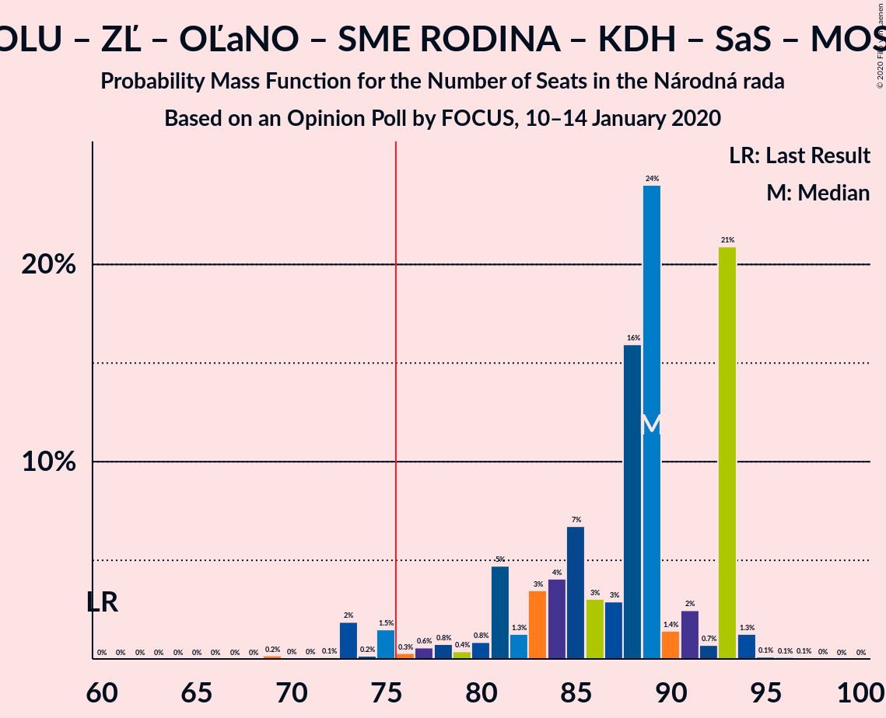

| Number of Seats | Probability | Accumulated | Special Marks |
|:---------------:|:-----------:|:-----------:|:-------------:|
| 60 | 0% | 100% | Last Result |
| 61 | 0% | 100% |  |
| 62 | 0% | 100% |  |
| 63 | 0% | 100% |  |
| 64 | 0% | 100% |  |
| 65 | 0% | 100% |  |
| 66 | 0% | 100% |  |
| 67 | 0% | 100% |  |
| 68 | 0% | 100% |  |
| 69 | 0.2% | 100% |  |
| 70 | 0% | 99.8% |  |
| 71 | 0% | 99.8% |  |
| 72 | 0.1% | 99.7% |  |
| 73 | 2% | 99.6% |  |
| 74 | 0.2% | 98% |  |
| 75 | 1.5% | 98% |  |
| 76 | 0.3% | 96% | Majority |
| 77 | 0.6% | 96% |  |
| 78 | 0.8% | 95% |  |
| 79 | 0.4% | 94% |  |
| 80 | 0.8% | 94% |  |
| 81 | 5% | 93% |  |
| 82 | 1.3% | 89% |  |
| 83 | 3% | 87% |  |
| 84 | 4% | 84% |  |
| 85 | 7% | 80% | Median |
| 86 | 3% | 73% |  |
| 87 | 3% | 70% |  |
| 88 | 16% | 67% |  |
| 89 | 24% | 51% |  |
| 90 | 1.4% | 27% |  |
| 91 | 2% | 26% |  |
| 92 | 0.7% | 23% |  |
| 93 | 21% | 22% |  |
| 94 | 1.3% | 2% |  |
| 95 | 0.1% | 0.3% |  |
| 96 | 0.1% | 0.2% |  |
| 97 | 0.1% | 0.1% |  |
| 98 | 0% | 0.1% |  |
| 99 | 0% | 0% |  |

### Progresívne Slovensko–SPOLU–Občianska Demokracia – Za ľudí – OBYČAJNÍ ĽUDIA a nezávislé osobnosti – SME RODINA – Kresťanskodemokratické hnutie – Sloboda a Solidarita

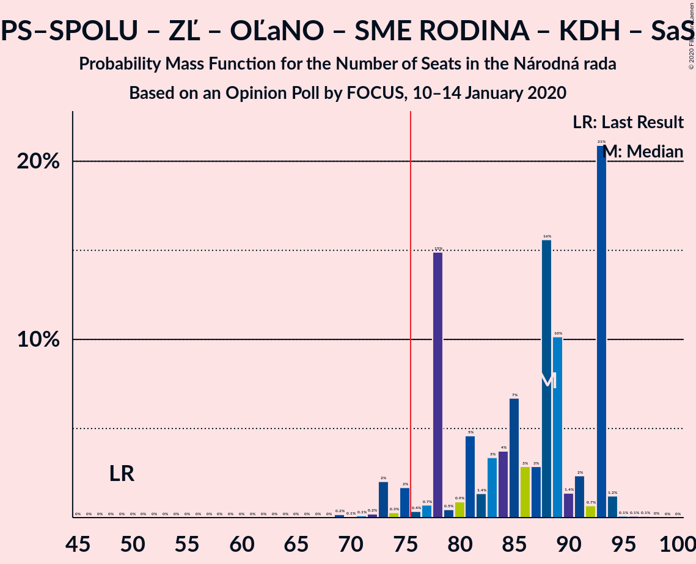

| Number of Seats | Probability | Accumulated | Special Marks |
|:---------------:|:-----------:|:-----------:|:-------------:|
| 49 | 0% | 100% | Last Result |
| 50 | 0% | 100% |  |
| 51 | 0% | 100% |  |
| 52 | 0% | 100% |  |
| 53 | 0% | 100% |  |
| 54 | 0% | 100% |  |
| 55 | 0% | 100% |  |
| 56 | 0% | 100% |  |
| 57 | 0% | 100% |  |
| 58 | 0% | 100% |  |
| 59 | 0% | 100% |  |
| 60 | 0% | 100% |  |
| 61 | 0% | 100% |  |
| 62 | 0% | 100% |  |
| 63 | 0% | 100% |  |
| 64 | 0% | 100% |  |
| 65 | 0% | 100% |  |
| 66 | 0% | 100% |  |
| 67 | 0% | 100% |  |
| 68 | 0% | 100% |  |
| 69 | 0.2% | 100% |  |
| 70 | 0.1% | 99.8% |  |
| 71 | 0.1% | 99.7% |  |
| 72 | 0.2% | 99.6% |  |
| 73 | 2% | 99.4% |  |
| 74 | 0.3% | 97% |  |
| 75 | 2% | 97% |  |
| 76 | 0.4% | 95% | Majority |
| 77 | 0.7% | 95% |  |
| 78 | 15% | 94% |  |
| 79 | 0.5% | 79% |  |
| 80 | 0.9% | 79% |  |
| 81 | 5% | 78% |  |
| 82 | 1.4% | 73% |  |
| 83 | 3% | 72% |  |
| 84 | 4% | 69% |  |
| 85 | 7% | 65% | Median |
| 86 | 3% | 58% |  |
| 87 | 3% | 55% |  |
| 88 | 16% | 53% |  |
| 89 | 10% | 37% |  |
| 90 | 1.4% | 27% |  |
| 91 | 2% | 25% |  |
| 92 | 0.7% | 23% |  |
| 93 | 21% | 22% |  |
| 94 | 1.2% | 2% |  |
| 95 | 0.1% | 0.3% |  |
| 96 | 0.1% | 0.2% |  |
| 97 | 0.1% | 0.1% |  |
| 98 | 0% | 0% |  |

### SMER–sociálna demokracia – Kotleba–Ľudová strana Naše Slovensko – SME RODINA – Slovenská národná strana

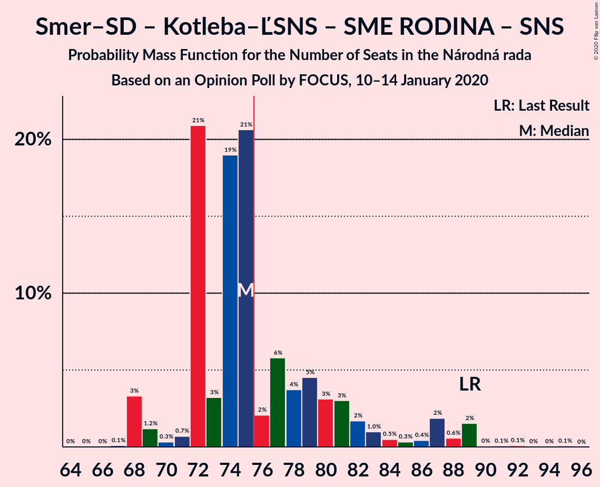

| Number of Seats | Probability | Accumulated | Special Marks |
|:---------------:|:-----------:|:-----------:|:-------------:|
| 64 | 0% | 100% |  |
| 65 | 0% | 99.9% |  |
| 66 | 0% | 99.9% |  |
| 67 | 0.1% | 99.9% |  |
| 68 | 3% | 99.8% |  |
| 69 | 1.2% | 96% |  |
| 70 | 0.3% | 95% |  |
| 71 | 0.7% | 95% |  |
| 72 | 21% | 94% | Median |
| 73 | 3% | 73% |  |
| 74 | 19% | 70% |  |
| 75 | 21% | 51% |  |
| 76 | 2% | 30% | Majority |
| 77 | 6% | 28% |  |
| 78 | 4% | 23% |  |
| 79 | 5% | 19% |  |
| 80 | 3% | 14% |  |
| 81 | 3% | 11% |  |
| 82 | 2% | 8% |  |
| 83 | 1.0% | 7% |  |
| 84 | 0.5% | 6% |  |
| 85 | 0.3% | 5% |  |
| 86 | 0.4% | 5% |  |
| 87 | 2% | 4% |  |
| 88 | 0.6% | 2% |  |
| 89 | 2% | 2% | Last Result |
| 90 | 0% | 0.3% |  |
| 91 | 0.1% | 0.3% |  |
| 92 | 0.1% | 0.2% |  |
| 93 | 0% | 0.1% |  |
| 94 | 0% | 0.1% |  |
| 95 | 0.1% | 0.1% |  |
| 96 | 0% | 0% |  |

### Progresívne Slovensko–SPOLU–Občianska Demokracia – Za ľudí – OBYČAJNÍ ĽUDIA a nezávislé osobnosti – Kresťanskodemokratické hnutie – Sloboda a Solidarita – MOST–HÍD – Strana maďarskej koalície–Magyar Koalíció Pártja

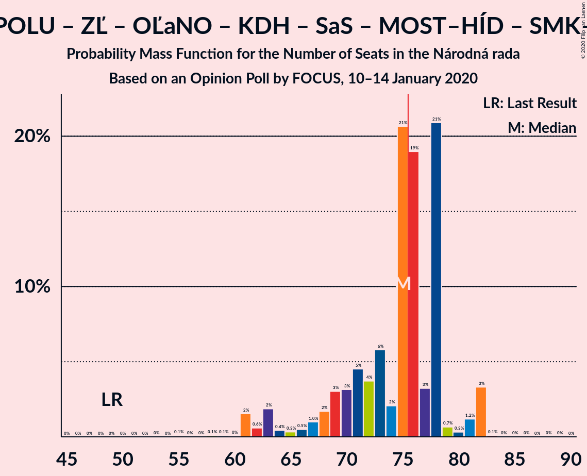

| Number of Seats | Probability | Accumulated | Special Marks |
|:---------------:|:-----------:|:-----------:|:-------------:|
| 49 | 0% | 100% | Last Result |
| 50 | 0% | 100% |  |
| 51 | 0% | 100% |  |
| 52 | 0% | 100% |  |
| 53 | 0% | 100% |  |
| 54 | 0% | 100% |  |
| 55 | 0.1% | 100% |  |
| 56 | 0% | 99.9% |  |
| 57 | 0% | 99.9% |  |
| 58 | 0.1% | 99.9% |  |
| 59 | 0.1% | 99.8% |  |
| 60 | 0% | 99.7% |  |
| 61 | 2% | 99.7% |  |
| 62 | 0.6% | 98% |  |
| 63 | 2% | 98% |  |
| 64 | 0.4% | 96% |  |
| 65 | 0.3% | 95% |  |
| 66 | 0.5% | 95% |  |
| 67 | 1.0% | 94% |  |
| 68 | 2% | 93% |  |
| 69 | 3% | 92% |  |
| 70 | 3% | 89% |  |
| 71 | 5% | 86% |  |
| 72 | 4% | 81% | Median |
| 73 | 6% | 77% |  |
| 74 | 2% | 72% |  |
| 75 | 21% | 69% |  |
| 76 | 19% | 49% | Majority |
| 77 | 3% | 30% |  |
| 78 | 21% | 27% |  |
| 79 | 0.7% | 6% |  |
| 80 | 0.3% | 5% |  |
| 81 | 1.2% | 5% |  |
| 82 | 3% | 4% |  |
| 83 | 0.1% | 0.2% |  |
| 84 | 0% | 0.1% |  |
| 85 | 0% | 0.1% |  |
| 86 | 0% | 0.1% |  |
| 87 | 0% | 0% |  |

### Progresívne Slovensko–SPOLU–Občianska Demokracia – Za ľudí – OBYČAJNÍ ĽUDIA a nezávislé osobnosti – Kresťanskodemokratické hnutie – Sloboda a Solidarita – Strana maďarskej koalície–Magyar Koalíció Pártja

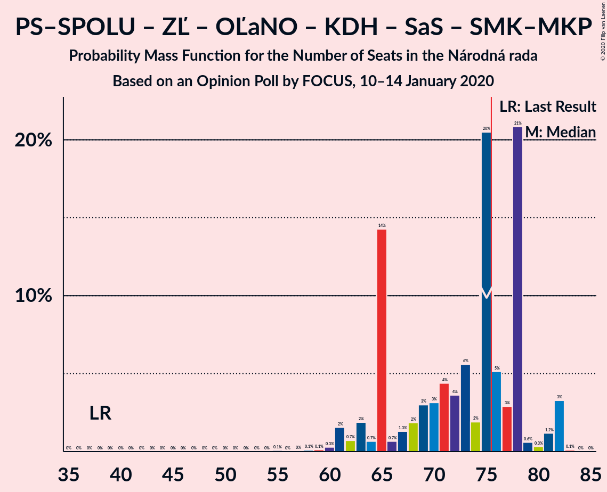

| Number of Seats | Probability | Accumulated | Special Marks |
|:---------------:|:-----------:|:-----------:|:-------------:|
| 38 | 0% | 100% | Last Result |
| 39 | 0% | 100% |  |
| 40 | 0% | 100% |  |
| 41 | 0% | 100% |  |
| 42 | 0% | 100% |  |
| 43 | 0% | 100% |  |
| 44 | 0% | 100% |  |
| 45 | 0% | 100% |  |
| 46 | 0% | 100% |  |
| 47 | 0% | 100% |  |
| 48 | 0% | 100% |  |
| 49 | 0% | 100% |  |
| 50 | 0% | 100% |  |
| 51 | 0% | 100% |  |
| 52 | 0% | 100% |  |
| 53 | 0% | 100% |  |
| 54 | 0% | 100% |  |
| 55 | 0.1% | 100% |  |
| 56 | 0% | 99.9% |  |
| 57 | 0% | 99.9% |  |
| 58 | 0.1% | 99.8% |  |
| 59 | 0.1% | 99.8% |  |
| 60 | 0.3% | 99.6% |  |
| 61 | 2% | 99.4% |  |
| 62 | 0.7% | 98% |  |
| 63 | 2% | 97% |  |
| 64 | 0.7% | 95% |  |
| 65 | 14% | 95% |  |
| 66 | 0.7% | 80% |  |
| 67 | 1.3% | 80% |  |
| 68 | 2% | 78% |  |
| 69 | 3% | 76% |  |
| 70 | 3% | 73% |  |
| 71 | 4% | 70% |  |
| 72 | 4% | 66% | Median |
| 73 | 6% | 62% |  |
| 74 | 2% | 57% |  |
| 75 | 20% | 55% |  |
| 76 | 5% | 34% | Majority |
| 77 | 3% | 29% |  |
| 78 | 21% | 26% |  |
| 79 | 0.6% | 5% |  |
| 80 | 0.3% | 5% |  |
| 81 | 1.2% | 5% |  |
| 82 | 3% | 3% |  |
| 83 | 0.1% | 0.1% |  |
| 84 | 0% | 0% |  |

### Progresívne Slovensko–SPOLU–Občianska Demokracia – Za ľudí – OBYČAJNÍ ĽUDIA a nezávislé osobnosti – Kresťanskodemokratické hnutie – Sloboda a Solidarita – MOST–HÍD

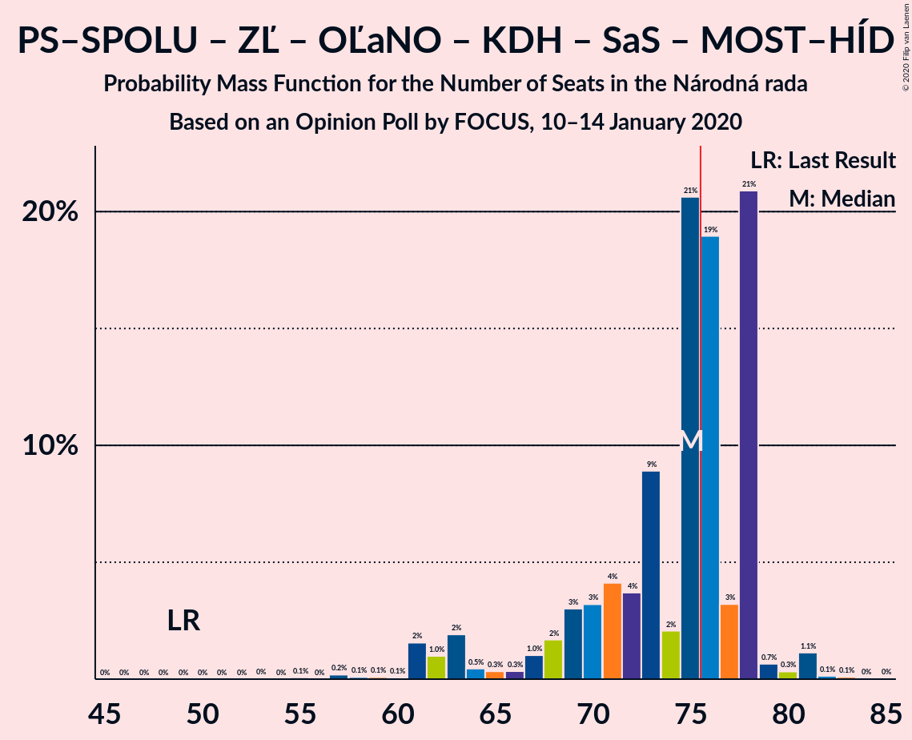

| Number of Seats | Probability | Accumulated | Special Marks |
|:---------------:|:-----------:|:-----------:|:-------------:|
| 49 | 0% | 100% | Last Result |
| 50 | 0% | 100% |  |
| 51 | 0% | 100% |  |
| 52 | 0% | 100% |  |
| 53 | 0% | 100% |  |
| 54 | 0% | 100% |  |
| 55 | 0.1% | 100% |  |
| 56 | 0% | 99.9% |  |
| 57 | 0.2% | 99.9% |  |
| 58 | 0.1% | 99.7% |  |
| 59 | 0.1% | 99.6% |  |
| 60 | 0.1% | 99.5% |  |
| 61 | 2% | 99.5% |  |
| 62 | 1.0% | 98% |  |
| 63 | 2% | 97% |  |
| 64 | 0.5% | 95% |  |
| 65 | 0.3% | 95% |  |
| 66 | 0.3% | 94% |  |
| 67 | 1.0% | 94% |  |
| 68 | 2% | 93% |  |
| 69 | 3% | 91% |  |
| 70 | 3% | 88% |  |
| 71 | 4% | 85% |  |
| 72 | 4% | 81% | Median |
| 73 | 9% | 77% |  |
| 74 | 2% | 68% |  |
| 75 | 21% | 66% |  |
| 76 | 19% | 45% | Majority |
| 77 | 3% | 27% |  |
| 78 | 21% | 23% |  |
| 79 | 0.7% | 2% |  |
| 80 | 0.3% | 2% |  |
| 81 | 1.1% | 1.4% |  |
| 82 | 0.1% | 0.3% |  |
| 83 | 0.1% | 0.2% |  |
| 84 | 0% | 0.1% |  |
| 85 | 0% | 0% |  |

### Progresívne Slovensko–SPOLU–Občianska Demokracia – Za ľudí – OBYČAJNÍ ĽUDIA a nezávislé osobnosti – Kresťanskodemokratické hnutie – Sloboda a Solidarita

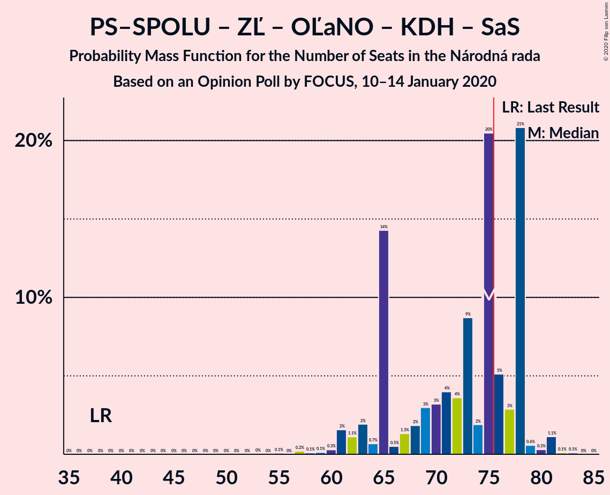

| Number of Seats | Probability | Accumulated | Special Marks |
|:---------------:|:-----------:|:-----------:|:-------------:|
| 38 | 0% | 100% | Last Result |
| 39 | 0% | 100% |  |
| 40 | 0% | 100% |  |
| 41 | 0% | 100% |  |
| 42 | 0% | 100% |  |
| 43 | 0% | 100% |  |
| 44 | 0% | 100% |  |
| 45 | 0% | 100% |  |
| 46 | 0% | 100% |  |
| 47 | 0% | 100% |  |
| 48 | 0% | 100% |  |
| 49 | 0% | 100% |  |
| 50 | 0% | 100% |  |
| 51 | 0% | 100% |  |
| 52 | 0% | 100% |  |
| 53 | 0% | 100% |  |
| 54 | 0% | 100% |  |
| 55 | 0.1% | 100% |  |
| 56 | 0% | 99.9% |  |
| 57 | 0.2% | 99.9% |  |
| 58 | 0.1% | 99.7% |  |
| 59 | 0.1% | 99.6% |  |
| 60 | 0.3% | 99.4% |  |
| 61 | 2% | 99.2% |  |
| 62 | 1.1% | 98% |  |
| 63 | 2% | 96% |  |
| 64 | 0.7% | 95% |  |
| 65 | 14% | 94% |  |
| 66 | 0.5% | 80% |  |
| 67 | 1.3% | 79% |  |
| 68 | 2% | 78% |  |
| 69 | 3% | 76% |  |
| 70 | 3% | 73% |  |
| 71 | 4% | 70% |  |
| 72 | 4% | 66% | Median |
| 73 | 9% | 62% |  |
| 74 | 2% | 53% |  |
| 75 | 20% | 52% |  |
| 76 | 5% | 31% | Majority |
| 77 | 3% | 26% |  |
| 78 | 21% | 23% |  |
| 79 | 0.6% | 2% |  |
| 80 | 0.3% | 2% |  |
| 81 | 1.1% | 1.4% |  |
| 82 | 0.1% | 0.2% |  |
| 83 | 0.1% | 0.1% |  |
| 84 | 0% | 0% |  |

### Progresívne Slovensko–SPOLU–Občianska Demokracia – Za ľudí – OBYČAJNÍ ĽUDIA a nezávislé osobnosti – Sloboda a Solidarita

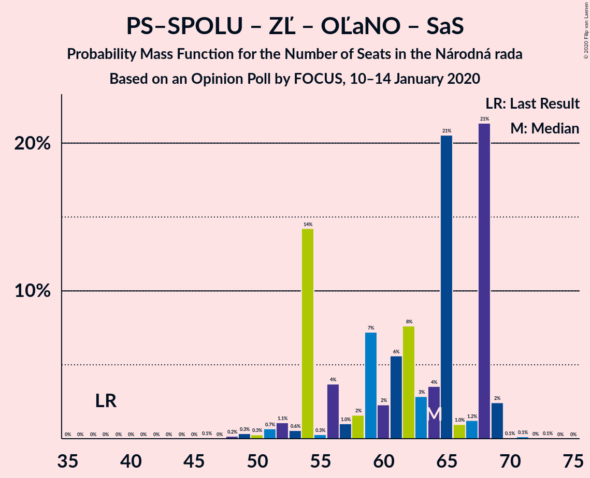

| Number of Seats | Probability | Accumulated | Special Marks |
|:---------------:|:-----------:|:-----------:|:-------------:|
| 38 | 0% | 100% | Last Result |
| 39 | 0% | 100% |  |
| 40 | 0% | 100% |  |
| 41 | 0% | 100% |  |
| 42 | 0% | 100% |  |
| 43 | 0% | 100% |  |
| 44 | 0% | 100% |  |
| 45 | 0% | 100% |  |
| 46 | 0.1% | 100% |  |
| 47 | 0% | 99.9% |  |
| 48 | 0.2% | 99.9% |  |
| 49 | 0.3% | 99.7% |  |
| 50 | 0.3% | 99.4% |  |
| 51 | 0.7% | 99.1% |  |
| 52 | 1.1% | 98% |  |
| 53 | 0.6% | 97% |  |
| 54 | 14% | 97% |  |
| 55 | 0.3% | 83% |  |
| 56 | 4% | 82% |  |
| 57 | 1.0% | 79% |  |
| 58 | 2% | 78% |  |
| 59 | 7% | 76% |  |
| 60 | 2% | 69% |  |
| 61 | 6% | 66% |  |
| 62 | 8% | 61% | Median |
| 63 | 3% | 53% |  |
| 64 | 4% | 50% |  |
| 65 | 21% | 47% |  |
| 66 | 1.0% | 26% |  |
| 67 | 1.2% | 25% |  |
| 68 | 21% | 24% |  |
| 69 | 2% | 3% |  |
| 70 | 0.1% | 0.3% |  |
| 71 | 0.1% | 0.2% |  |
| 72 | 0% | 0.1% |  |
| 73 | 0.1% | 0.1% |  |
| 74 | 0% | 0% |  |

### Progresívne Slovensko–SPOLU–Občianska Demokracia – Za ľudí – Kresťanskodemokratické hnutie – Sloboda a Solidarita

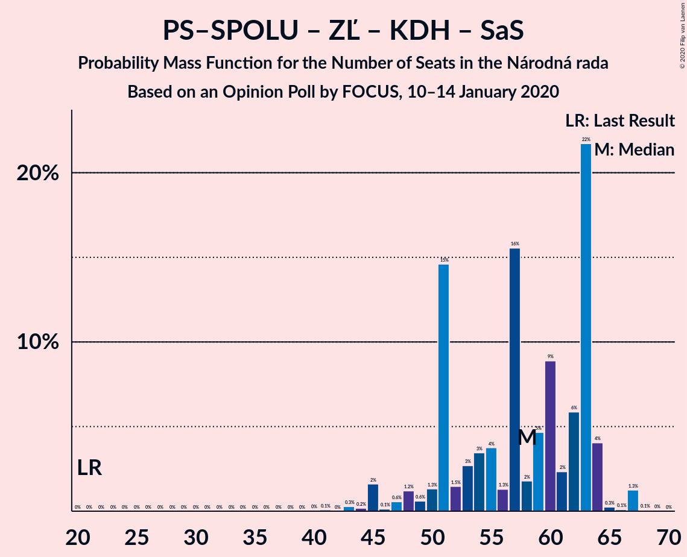

| Number of Seats | Probability | Accumulated | Special Marks |
|:---------------:|:-----------:|:-----------:|:-------------:|
| 21 | 0% | 100% | Last Result |
| 22 | 0% | 100% |  |
| 23 | 0% | 100% |  |
| 24 | 0% | 100% |  |
| 25 | 0% | 100% |  |
| 26 | 0% | 100% |  |
| 27 | 0% | 100% |  |
| 28 | 0% | 100% |  |
| 29 | 0% | 100% |  |
| 30 | 0% | 100% |  |
| 31 | 0% | 100% |  |
| 32 | 0% | 100% |  |
| 33 | 0% | 100% |  |
| 34 | 0% | 100% |  |
| 35 | 0% | 100% |  |
| 36 | 0% | 100% |  |
| 37 | 0% | 100% |  |
| 38 | 0% | 100% |  |
| 39 | 0% | 100% |  |
| 40 | 0% | 100% |  |
| 41 | 0.1% | 99.9% |  |
| 42 | 0% | 99.8% |  |
| 43 | 0.3% | 99.8% |  |
| 44 | 0.2% | 99.6% |  |
| 45 | 2% | 99.4% |  |
| 46 | 0.1% | 98% |  |
| 47 | 0.6% | 98% |  |
| 48 | 1.2% | 97% |  |
| 49 | 0.6% | 96% |  |
| 50 | 1.3% | 95% |  |
| 51 | 15% | 94% |  |
| 52 | 1.5% | 79% |  |
| 53 | 3% | 78% |  |
| 54 | 3% | 75% |  |
| 55 | 4% | 72% |  |
| 56 | 1.3% | 68% |  |
| 57 | 16% | 67% | Median |
| 58 | 2% | 51% |  |
| 59 | 5% | 49% |  |
| 60 | 9% | 45% |  |
| 61 | 2% | 36% |  |
| 62 | 6% | 33% |  |
| 63 | 22% | 28% |  |
| 64 | 4% | 6% |  |
| 65 | 0.3% | 2% |  |
| 66 | 0.1% | 1.5% |  |
| 67 | 1.3% | 1.4% |  |
| 68 | 0.1% | 0.1% |  |
| 69 | 0% | 0.1% |  |
| 70 | 0% | 0% |  |

### SMER–sociálna demokracia – SME RODINA – Slovenská národná strana

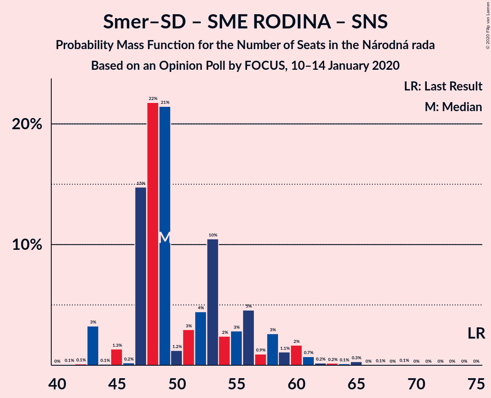

| Number of Seats | Probability | Accumulated | Special Marks |
|:---------------:|:-----------:|:-----------:|:-------------:|
| 40 | 0% | 100% |  |
| 41 | 0.1% | 99.9% |  |
| 42 | 0.1% | 99.9% |  |
| 43 | 3% | 99.8% |  |
| 44 | 0.1% | 97% |  |
| 45 | 1.3% | 96% |  |
| 46 | 0.2% | 95% |  |
| 47 | 15% | 95% | Median |
| 48 | 22% | 80% |  |
| 49 | 21% | 58% |  |
| 50 | 1.2% | 37% |  |
| 51 | 3% | 36% |  |
| 52 | 4% | 33% |  |
| 53 | 10% | 28% |  |
| 54 | 2% | 18% |  |
| 55 | 3% | 15% |  |
| 56 | 5% | 13% |  |
| 57 | 0.9% | 8% |  |
| 58 | 3% | 7% |  |
| 59 | 1.1% | 4% |  |
| 60 | 2% | 3% |  |
| 61 | 0.7% | 2% |  |
| 62 | 0.2% | 1.0% |  |
| 63 | 0.2% | 0.8% |  |
| 64 | 0.1% | 0.6% |  |
| 65 | 0.3% | 0.5% |  |
| 66 | 0% | 0.2% |  |
| 67 | 0.1% | 0.2% |  |
| 68 | 0% | 0.1% |  |
| 69 | 0.1% | 0.1% |  |
| 70 | 0% | 0% |  |
| 71 | 0% | 0% |  |
| 72 | 0% | 0% |  |
| 73 | 0% | 0% |  |
| 74 | 0% | 0% |  |
| 75 | 0% | 0% | Last Result |

### SMER–sociálna demokracia – SME RODINA

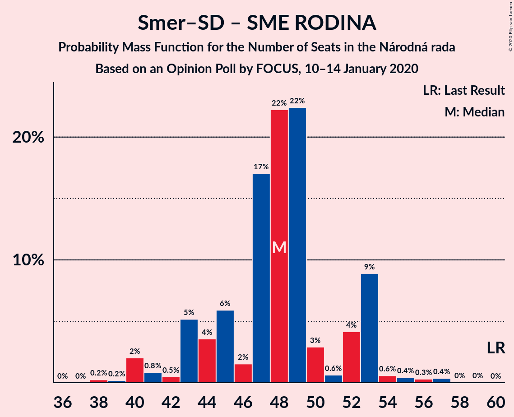

| Number of Seats | Probability | Accumulated | Special Marks |
|:---------------:|:-----------:|:-----------:|:-------------:|
| 38 | 0.2% | 100% |  |
| 39 | 0.2% | 99.7% |  |
| 40 | 2% | 99.5% |  |
| 41 | 0.8% | 98% |  |
| 42 | 0.5% | 97% |  |
| 43 | 5% | 96% |  |
| 44 | 4% | 91% |  |
| 45 | 6% | 87% |  |
| 46 | 2% | 82% |  |
| 47 | 17% | 80% | Median |
| 48 | 22% | 63% |  |
| 49 | 22% | 41% |  |
| 50 | 3% | 18% |  |
| 51 | 0.6% | 15% |  |
| 52 | 4% | 15% |  |
| 53 | 9% | 11% |  |
| 54 | 0.6% | 2% |  |
| 55 | 0.4% | 1.2% |  |
| 56 | 0.3% | 0.7% |  |
| 57 | 0.4% | 0.4% |  |
| 58 | 0% | 0.1% |  |
| 59 | 0% | 0.1% |  |
| 60 | 0% | 0% | Last Result |

### Progresívne Slovensko–SPOLU–Občianska Demokracia – Za ľudí – Sloboda a Solidarita

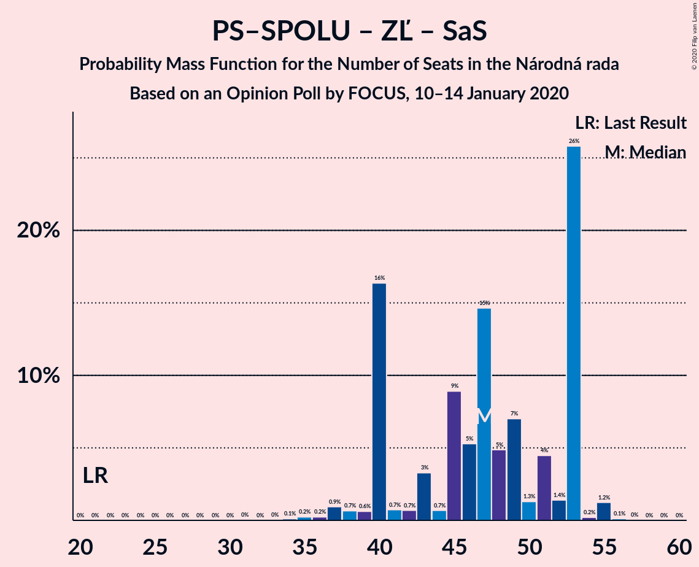

| Number of Seats | Probability | Accumulated | Special Marks |
|:---------------:|:-----------:|:-----------:|:-------------:|
| 21 | 0% | 100% | Last Result |
| 22 | 0% | 100% |  |
| 23 | 0% | 100% |  |
| 24 | 0% | 100% |  |
| 25 | 0% | 100% |  |
| 26 | 0% | 100% |  |
| 27 | 0% | 100% |  |
| 28 | 0% | 100% |  |
| 29 | 0% | 100% |  |
| 30 | 0% | 100% |  |
| 31 | 0% | 100% |  |
| 32 | 0% | 100% |  |
| 33 | 0% | 100% |  |
| 34 | 0.1% | 99.9% |  |
| 35 | 0.2% | 99.8% |  |
| 36 | 0.2% | 99.6% |  |
| 37 | 0.9% | 99.4% |  |
| 38 | 0.7% | 98% |  |
| 39 | 0.6% | 98% |  |
| 40 | 16% | 97% |  |
| 41 | 0.7% | 81% |  |
| 42 | 0.7% | 80% |  |
| 43 | 3% | 79% |  |
| 44 | 0.7% | 76% |  |
| 45 | 9% | 75% |  |
| 46 | 5% | 66% |  |
| 47 | 15% | 61% | Median |
| 48 | 5% | 47% |  |
| 49 | 7% | 42% |  |
| 50 | 1.3% | 35% |  |
| 51 | 4% | 33% |  |
| 52 | 1.4% | 29% |  |
| 53 | 26% | 27% |  |
| 54 | 0.2% | 2% |  |
| 55 | 1.2% | 1.4% |  |
| 56 | 0.1% | 0.2% |  |
| 57 | 0% | 0.1% |  |
| 58 | 0% | 0% |  |

### SMER–sociálna demokracia – Slovenská národná strana – MOST–HÍD

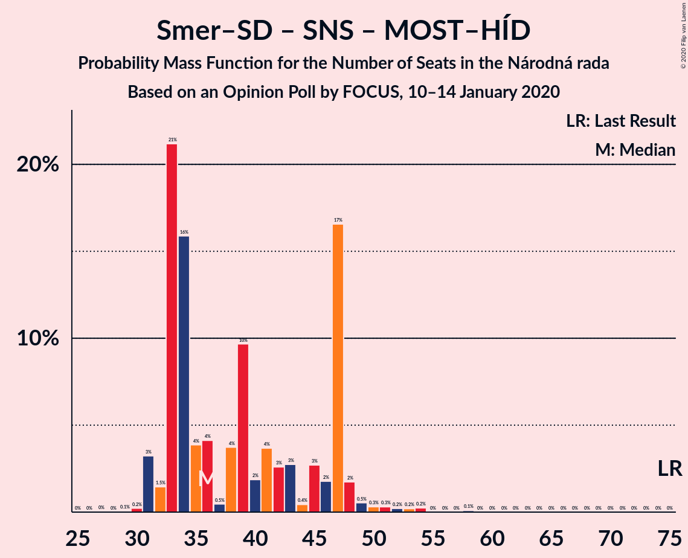

| Number of Seats | Probability | Accumulated | Special Marks |
|:---------------:|:-----------:|:-----------:|:-------------:|
| 29 | 0.1% | 100% |  |
| 30 | 0.2% | 99.9% |  |
| 31 | 3% | 99.7% |  |
| 32 | 1.5% | 96% |  |
| 33 | 21% | 95% |  |
| 34 | 16% | 74% | Median |
| 35 | 4% | 58% |  |
| 36 | 4% | 54% |  |
| 37 | 0.5% | 50% |  |
| 38 | 4% | 49% |  |
| 39 | 10% | 46% |  |
| 40 | 2% | 36% |  |
| 41 | 4% | 34% |  |
| 42 | 3% | 30% |  |
| 43 | 3% | 28% |  |
| 44 | 0.4% | 25% |  |
| 45 | 3% | 25% |  |
| 46 | 2% | 22% |  |
| 47 | 17% | 20% |  |
| 48 | 2% | 4% |  |
| 49 | 0.5% | 2% |  |
| 50 | 0.3% | 1.4% |  |
| 51 | 0.3% | 1.1% |  |
| 52 | 0.2% | 0.8% |  |
| 53 | 0.2% | 0.6% |  |
| 54 | 0.2% | 0.4% |  |
| 55 | 0% | 0.1% |  |
| 56 | 0% | 0.1% |  |
| 57 | 0% | 0.1% |  |
| 58 | 0.1% | 0.1% |  |
| 59 | 0% | 0% |  |
| 60 | 0% | 0% |  |
| 61 | 0% | 0% |  |
| 62 | 0% | 0% |  |
| 63 | 0% | 0% |  |
| 64 | 0% | 0% |  |
| 65 | 0% | 0% |  |
| 66 | 0% | 0% |  |
| 67 | 0% | 0% |  |
| 68 | 0% | 0% |  |
| 69 | 0% | 0% |  |
| 70 | 0% | 0% |  |
| 71 | 0% | 0% |  |
| 72 | 0% | 0% |  |
| 73 | 0% | 0% |  |
| 74 | 0% | 0% |  |
| 75 | 0% | 0% | Last Result |

### SMER–sociálna demokracia – Slovenská národná strana

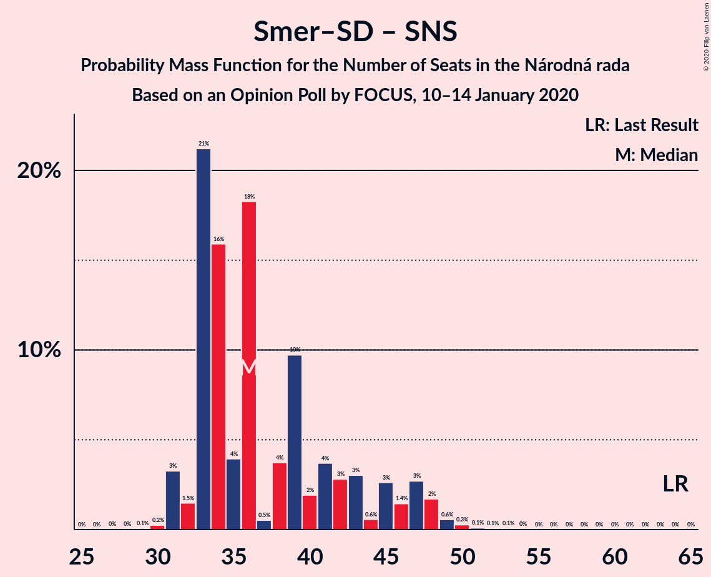

| Number of Seats | Probability | Accumulated | Special Marks |
|:---------------:|:-----------:|:-----------:|:-------------:|
| 27 | 0% | 100% |  |
| 28 | 0% | 99.9% |  |
| 29 | 0.1% | 99.9% |  |
| 30 | 0.2% | 99.9% |  |
| 31 | 3% | 99.6% |  |
| 32 | 1.5% | 96% |  |
| 33 | 21% | 95% |  |
| 34 | 16% | 74% | Median |
| 35 | 4% | 58% |  |
| 36 | 18% | 54% |  |
| 37 | 0.5% | 36% |  |
| 38 | 4% | 35% |  |
| 39 | 10% | 31% |  |
| 40 | 2% | 22% |  |
| 41 | 4% | 20% |  |
| 42 | 3% | 16% |  |
| 43 | 3% | 13% |  |
| 44 | 0.6% | 10% |  |
| 45 | 3% | 10% |  |
| 46 | 1.4% | 7% |  |
| 47 | 3% | 5% |  |
| 48 | 2% | 3% |  |
| 49 | 0.6% | 1.1% |  |
| 50 | 0.3% | 0.5% |  |
| 51 | 0.1% | 0.2% |  |
| 52 | 0.1% | 0.2% |  |
| 53 | 0.1% | 0.1% |  |
| 54 | 0% | 0% |  |
| 55 | 0% | 0% |  |
| 56 | 0% | 0% |  |
| 57 | 0% | 0% |  |
| 58 | 0% | 0% |  |
| 59 | 0% | 0% |  |
| 60 | 0% | 0% |  |
| 61 | 0% | 0% |  |
| 62 | 0% | 0% |  |
| 63 | 0% | 0% |  |
| 64 | 0% | 0% | Last Result |

### SMER–sociálna demokracia

| Number of Seats | Probability | Accumulated | Special Marks |
|:---------------:|:-----------:|:-----------:|:-------------:|
| 27 | 0.3% | 100% |  |
| 28 | 0.6% | 99.7% |  |
| 29 | 0.6% | 99.1% |  |
| 30 | 4% | 98% |  |
| 31 | 6% | 95% |  |
| 32 | 4% | 88% |  |
| 33 | 23% | 84% |  |
| 34 | 18% | 62% | Median |
| 35 | 6% | 43% |  |
| 36 | 22% | 38% |  |
| 37 | 0.8% | 16% |  |
| 38 | 4% | 15% |  |
| 39 | 10% | 11% |  |
| 40 | 0.3% | 1.4% |  |
| 41 | 0.1% | 1.0% |  |
| 42 | 0.7% | 0.9% |  |
| 43 | 0.2% | 0.2% |  |
| 44 | 0% | 0.1% |  |
| 45 | 0% | 0% |  |
| 46 | 0% | 0% |  |
| 47 | 0% | 0% |  |
| 48 | 0% | 0% |  |
| 49 | 0% | 0% | Last Result |

## Technical Information

### Opinion Poll

+ **Polling firm:** FOCUS
+ **Commissioner(s):** —
+ **Fieldwork period:** 10–14 January 2020

### Calculations

+ **Sample size:** 1010
+ **Simulations done:** 1,048,576
+ **Error estimate:** 2.62%

