# Opinion Poll by Polis, 15–22 January 2020

<a href="#voting-intentions">Voting Intentions</a> | <a href="#seats">Seats</a> | <a href="#coalitions">Coalitions</a> | <a href="#technical-information">Technical Information</a>

## Voting Intentions

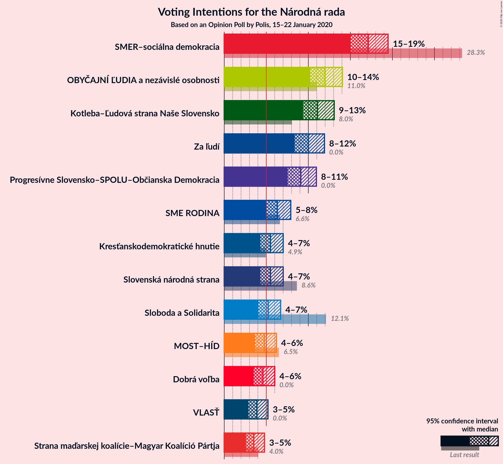

### Confidence Intervals

| Party | Last Result | Poll Result | 80% Confidence Interval | 90% Confidence Interval | 95% Confidence Interval | 99% Confidence Interval |
|:-----:|:-----------:|:-----------:|:-----------------------:|:-----------------------:|:-----------------------:|:-----------------------:|
| SMER–sociálna demokracia | 28.3% | 17.1% | 15.7–18.7% |15.4–19.1% |15.0–19.5% |14.4–20.2% |
| OBYČAJNÍ ĽUDIA a nezávislé osobnosti | 11.0% | 12.0% | 10.8–13.3% |10.5–13.7% |10.2–14.1% |9.7–14.7% |
| Kotleba–Ľudová strana Naše Slovensko | 8.0% | 11.1% | 10.0–12.4% |9.6–12.8% |9.4–13.1% |8.9–13.7% |
| Za ľudí | 0.0% | 10.0% | 8.9–11.3% |8.6–11.6% |8.4–11.9% |7.9–12.5% |
| Progresívne Slovensko–SPOLU–Občianska Demokracia | 0.0% | 9.1% | 8.1–10.3% |7.8–10.7% |7.5–11.0% |7.1–11.6% |
| SME RODINA | 6.6% | 6.3% | 5.5–7.3% |5.2–7.7% |5.0–7.9% |4.6–8.4% |
| Slovenská národná strana | 8.6% | 5.5% | 4.7–6.5% |4.5–6.8% |4.3–7.0% |3.9–7.5% |
| Kresťanskodemokratické hnutie | 4.9% | 5.5% | 4.7–6.5% |4.5–6.8% |4.3–7.0% |3.9–7.5% |
| Sloboda a Solidarita | 12.1% | 5.2% | 4.5–6.2% |4.2–6.5% |4.1–6.7% |3.7–7.2% |
| MOST–HÍD | 6.5% | 4.8% | 4.0–5.7% |3.8–6.0% |3.7–6.2% |3.4–6.7% |
| Dobrá voľba | 0.0% | 4.6% | 3.9–5.5% |3.7–5.8% |3.5–6.0% |3.2–6.5% |
| VLASŤ | 0.0% | 3.9% | 3.2–4.7% |3.0–5.0% |2.9–5.2% |2.6–5.6% |
| Strana maďarskej koalície–Magyar Koalíció Pártja | 4.0% | 3.5% | 2.9–4.3% |2.7–4.6% |2.6–4.8% |2.3–5.2% |

*Note:* The poll result column reflects the actual value used in the calculations. Published results may vary slightly, and in addition be rounded to fewer digits.

## Seats

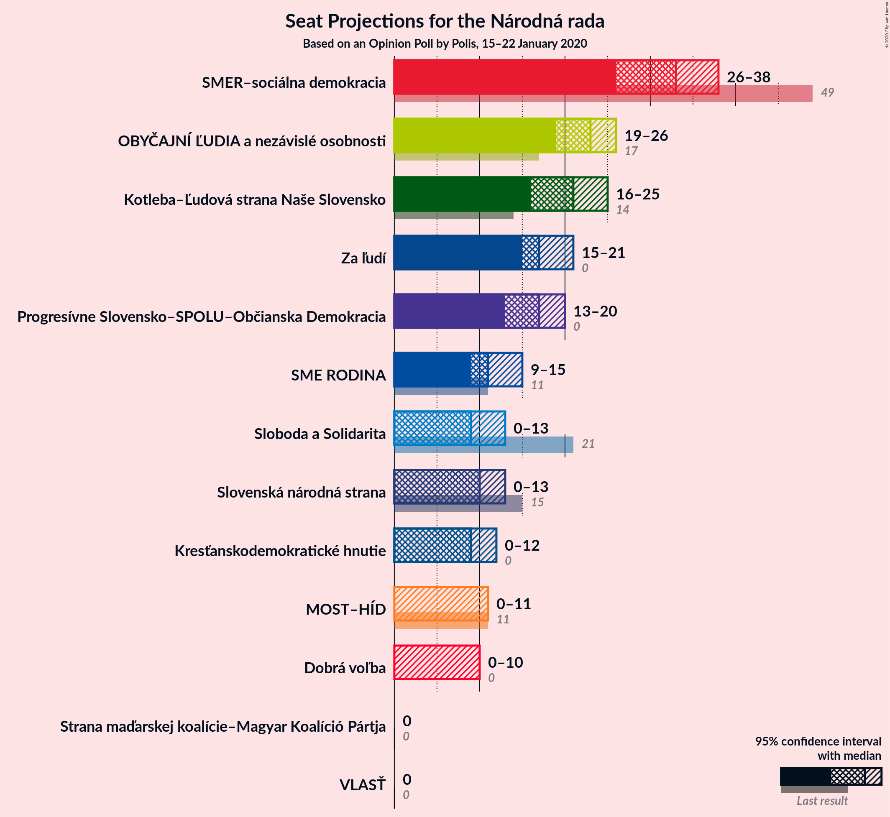

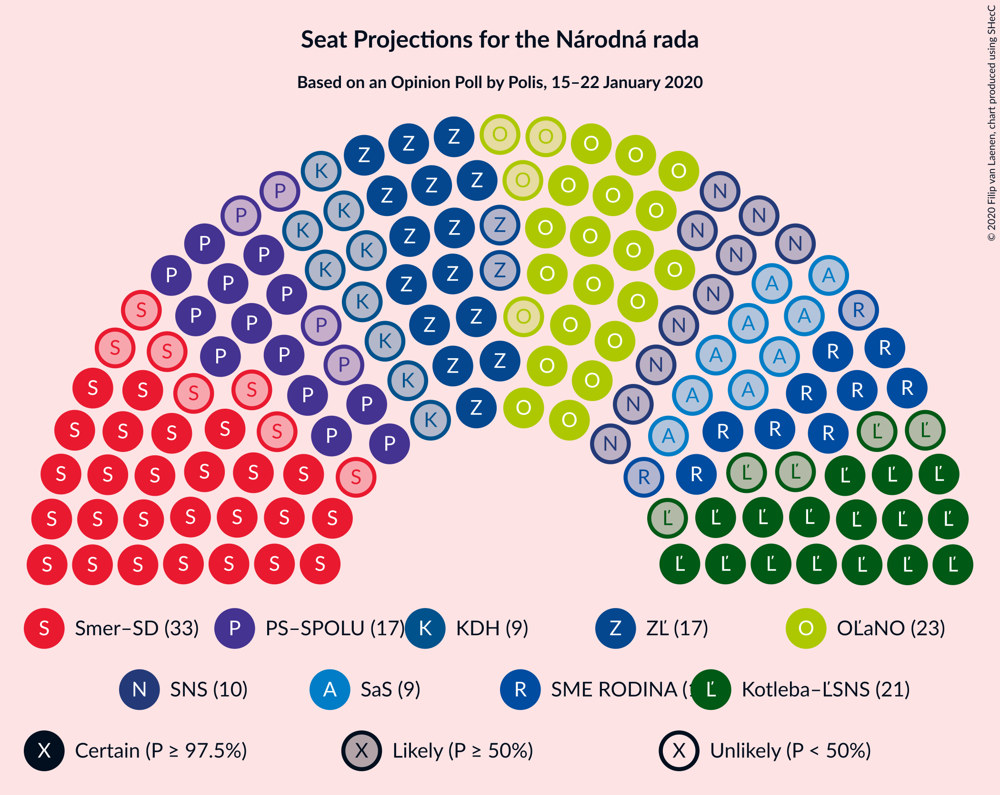

### Confidence Intervals

| Party | Last Result | Median | 80% Confidence Interval | 90% Confidence Interval | 95% Confidence Interval | 99% Confidence Interval |
|:-----:|:-----------:|:------:|:-----------------------:|:-----------------------:|:-----------------------:|:-----------------------:|
| <a href="#smer–sociálna-demokracia">SMER–sociálna demokracia</a> | 49 | 33 | 28–34 |28–36 |26–38 |25–38 |
| <a href="#obyčajní-ľudia-a-nezávislé-osobnosti">OBYČAJNÍ ĽUDIA a nezávislé osobnosti</a> | 17 | 23 | 20–24 |19–25 |19–26 |17–29 |
| <a href="#kotleba–ľudová-strana-naše-slovensko">Kotleba–Ľudová strana Naše Slovensko</a> | 14 | 21 | 18–22 |17–23 |16–25 |16–26 |
| <a href="#za-ľudí">Za ľudí</a> | 0 | 17 | 17–19 |16–20 |15–21 |14–24 |
| <a href="#progresívne-slovensko–spolu–občianska-demokracia">Progresívne Slovensko–SPOLU–Občianska Demokracia</a> | 0 | 17 | 15–18 |14–19 |13–20 |12–21 |
| <a href="#sme-rodina">SME RODINA</a> | 11 | 11 | 11–14 |10–15 |9–15 |0–15 |
| <a href="#slovenská-národná-strana">Slovenská národná strana</a> | 15 | 10 | 0–11 |0–12 |0–13 |0–13 |
| <a href="#kresťanskodemokratické-hnutie">Kresťanskodemokratické hnutie</a> | 0 | 9 | 0–11 |0–11 |0–12 |0–13 |
| <a href="#sloboda-a-solidarita">Sloboda a Solidarita</a> | 21 | 9 | 9–11 |0–12 |0–13 |0–13 |
| <a href="#most–híd">MOST–HÍD</a> | 11 | 0 | 0–9 |0–10 |0–11 |0–12 |
| <a href="#dobrá-voľba">Dobrá voľba</a> | 0 | 0 | 0–9 |0–9 |0–10 |0–11 |
| <a href="#vlasť">VLASŤ</a> | 0 | 0 | 0 |0 |0 |0–9 |
| <a href="#strana-maďarskej-koalície–magyar-koalíció-pártja">Strana maďarskej koalície–Magyar Koalíció Pártja</a> | 0 | 0 | 0 |0 |0 |0–9 |

### SMER–sociálna demokracia

*For a full overview of the results for this party, see the [SMER–sociálna demokracia](party-smer–sociálnademokracia.html) page.*

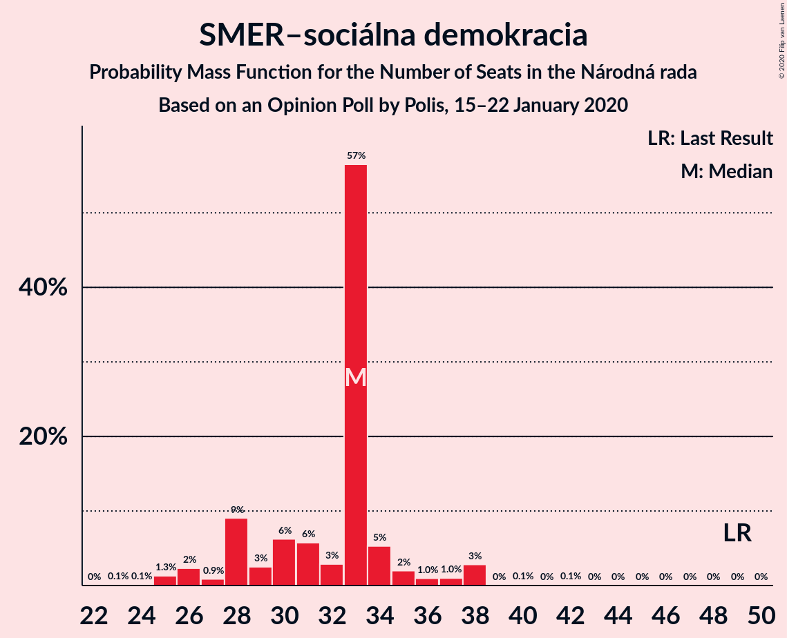

| Number of Seats | Probability | Accumulated | Special Marks |
|:---------------:|:-----------:|:-----------:|:-------------:|
| 23 | 0.1% | 100% |  |
| 24 | 0.1% | 99.9% |  |
| 25 | 1.3% | 99.8% |  |
| 26 | 2% | 98.5% |  |
| 27 | 0.9% | 96% |  |
| 28 | 9% | 95% |  |
| 29 | 3% | 86% |  |
| 30 | 6% | 84% |  |
| 31 | 6% | 78% |  |
| 32 | 3% | 72% |  |
| 33 | 57% | 69% | Median |
| 34 | 5% | 12% |  |
| 35 | 2% | 7% |  |
| 36 | 1.0% | 5% |  |
| 37 | 1.0% | 4% |  |
| 38 | 3% | 3% |  |
| 39 | 0% | 0.3% |  |
| 40 | 0.1% | 0.3% |  |
| 41 | 0% | 0.2% |  |
| 42 | 0.1% | 0.1% |  |
| 43 | 0% | 0% |  |
| 44 | 0% | 0% |  |
| 45 | 0% | 0% |  |
| 46 | 0% | 0% |  |
| 47 | 0% | 0% |  |
| 48 | 0% | 0% |  |
| 49 | 0% | 0% | Last Result |

### OBYČAJNÍ ĽUDIA a nezávislé osobnosti

*For a full overview of the results for this party, see the [OBYČAJNÍ ĽUDIA a nezávislé osobnosti](party-obyčajníľudiaanezávisléosobnosti.html) page.*

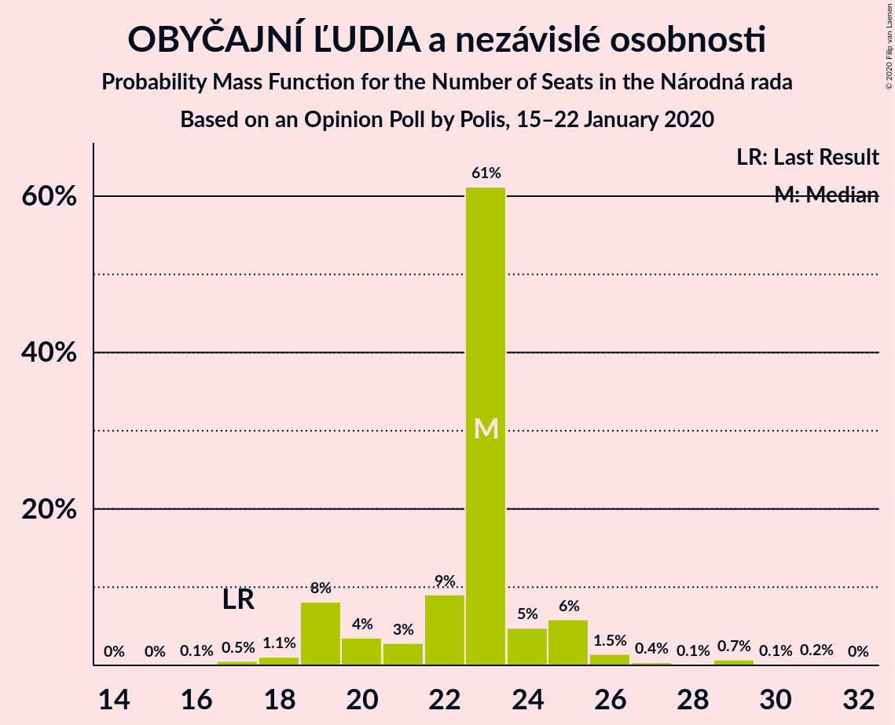

| Number of Seats | Probability | Accumulated | Special Marks |
|:---------------:|:-----------:|:-----------:|:-------------:|
| 16 | 0.1% | 100% |  |
| 17 | 0.5% | 99.9% | Last Result |
| 18 | 1.1% | 99.4% |  |
| 19 | 8% | 98% |  |
| 20 | 4% | 90% |  |
| 21 | 3% | 87% |  |
| 22 | 9% | 84% |  |
| 23 | 61% | 75% | Median |
| 24 | 5% | 14% |  |
| 25 | 6% | 9% |  |
| 26 | 1.5% | 3% |  |
| 27 | 0.4% | 1.5% |  |
| 28 | 0.1% | 1.1% |  |
| 29 | 0.7% | 1.0% |  |
| 30 | 0.1% | 0.3% |  |
| 31 | 0.2% | 0.2% |  |
| 32 | 0% | 0% |  |

### Kotleba–Ľudová strana Naše Slovensko

*For a full overview of the results for this party, see the [Kotleba–Ľudová strana Naše Slovensko](party-kotleba–ľudovástrananašeslovensko.html) page.*

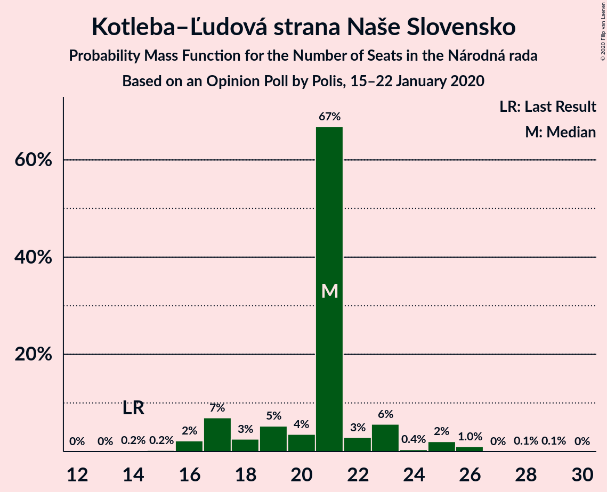

| Number of Seats | Probability | Accumulated | Special Marks |
|:---------------:|:-----------:|:-----------:|:-------------:|
| 14 | 0.2% | 100% | Last Result |
| 15 | 0.2% | 99.8% |  |
| 16 | 2% | 99.5% |  |
| 17 | 7% | 97% |  |
| 18 | 3% | 90% |  |
| 19 | 5% | 88% |  |
| 20 | 4% | 83% |  |
| 21 | 67% | 79% | Median |
| 22 | 3% | 12% |  |
| 23 | 6% | 9% |  |
| 24 | 0.4% | 4% |  |
| 25 | 2% | 3% |  |
| 26 | 1.0% | 1.2% |  |
| 27 | 0% | 0.2% |  |
| 28 | 0.1% | 0.2% |  |
| 29 | 0.1% | 0.1% |  |
| 30 | 0% | 0% |  |

### Za ľudí

*For a full overview of the results for this party, see the [Za ľudí](party-zaľudí.html) page.*

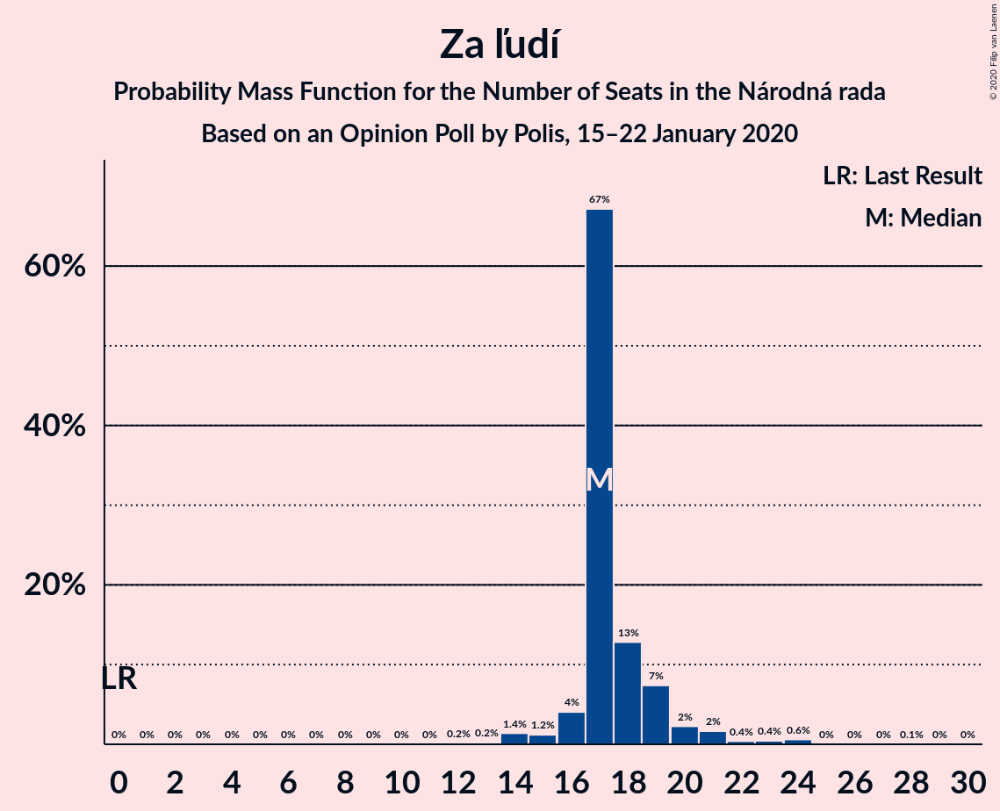

| Number of Seats | Probability | Accumulated | Special Marks |
|:---------------:|:-----------:|:-----------:|:-------------:|
| 0 | 0% | 100% | Last Result |
| 1 | 0% | 100% |  |
| 2 | 0% | 100% |  |
| 3 | 0% | 100% |  |
| 4 | 0% | 100% |  |
| 5 | 0% | 100% |  |
| 6 | 0% | 100% |  |
| 7 | 0% | 100% |  |
| 8 | 0% | 100% |  |
| 9 | 0% | 100% |  |
| 10 | 0% | 100% |  |
| 11 | 0% | 100% |  |
| 12 | 0.2% | 100% |  |
| 13 | 0.2% | 99.8% |  |
| 14 | 1.4% | 99.6% |  |
| 15 | 1.2% | 98% |  |
| 16 | 4% | 97% |  |
| 17 | 67% | 93% | Median |
| 18 | 13% | 26% |  |
| 19 | 7% | 13% |  |
| 20 | 2% | 6% |  |
| 21 | 2% | 3% |  |
| 22 | 0.4% | 2% |  |
| 23 | 0.4% | 1.2% |  |
| 24 | 0.6% | 0.8% |  |
| 25 | 0% | 0.2% |  |
| 26 | 0% | 0.1% |  |
| 27 | 0% | 0.1% |  |
| 28 | 0.1% | 0.1% |  |
| 29 | 0% | 0% |  |

### Progresívne Slovensko–SPOLU–Občianska Demokracia

*For a full overview of the results for this party, see the [Progresívne Slovensko–SPOLU–Občianska Demokracia](party-progresívneslovensko–spolu–občianskademokracia.html) page.*

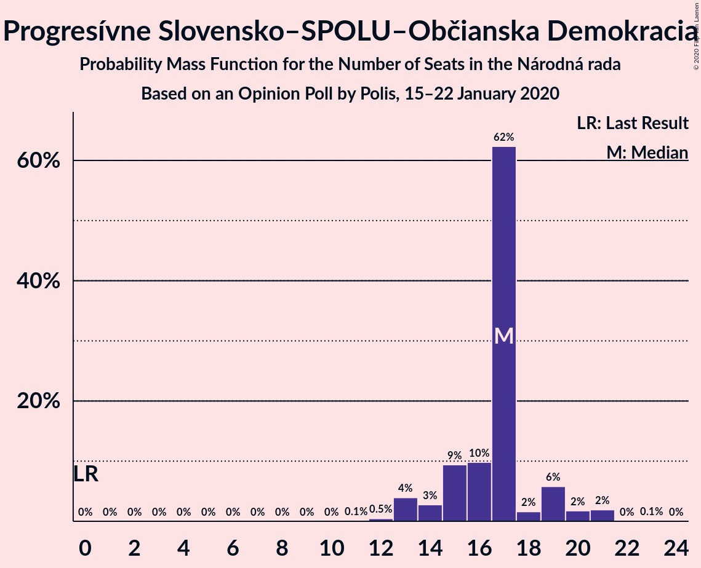

| Number of Seats | Probability | Accumulated | Special Marks |
|:---------------:|:-----------:|:-----------:|:-------------:|
| 0 | 0% | 100% | Last Result |
| 1 | 0% | 100% |  |
| 2 | 0% | 100% |  |
| 3 | 0% | 100% |  |
| 4 | 0% | 100% |  |
| 5 | 0% | 100% |  |
| 6 | 0% | 100% |  |
| 7 | 0% | 100% |  |
| 8 | 0% | 100% |  |
| 9 | 0% | 100% |  |
| 10 | 0% | 100% |  |
| 11 | 0.1% | 100% |  |
| 12 | 0.5% | 99.9% |  |
| 13 | 4% | 99.5% |  |
| 14 | 3% | 96% |  |
| 15 | 9% | 93% |  |
| 16 | 10% | 83% |  |
| 17 | 62% | 74% | Median |
| 18 | 2% | 11% |  |
| 19 | 6% | 10% |  |
| 20 | 2% | 4% |  |
| 21 | 2% | 2% |  |
| 22 | 0% | 0.1% |  |
| 23 | 0.1% | 0.1% |  |
| 24 | 0% | 0% |  |

### SME RODINA

*For a full overview of the results for this party, see the [SME RODINA](party-smerodina.html) page.*

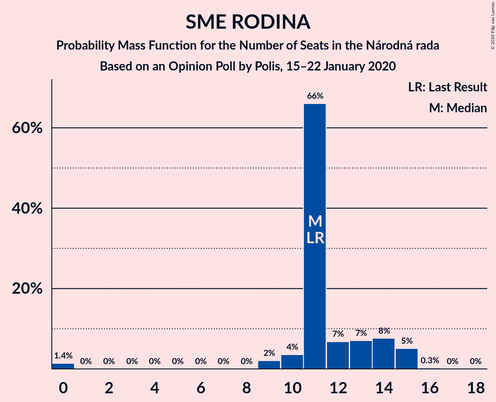

| Number of Seats | Probability | Accumulated | Special Marks |
|:---------------:|:-----------:|:-----------:|:-------------:|
| 0 | 1.4% | 100% |  |
| 1 | 0% | 98.6% |  |
| 2 | 0% | 98.6% |  |
| 3 | 0% | 98.6% |  |
| 4 | 0% | 98.6% |  |
| 5 | 0% | 98.6% |  |
| 6 | 0% | 98.6% |  |
| 7 | 0% | 98.6% |  |
| 8 | 0% | 98.6% |  |
| 9 | 2% | 98.6% |  |
| 10 | 4% | 97% |  |
| 11 | 66% | 93% | Last Result, Median |
| 12 | 7% | 27% |  |
| 13 | 7% | 20% |  |
| 14 | 8% | 13% |  |
| 15 | 5% | 5% |  |
| 16 | 0.3% | 0.3% |  |
| 17 | 0% | 0.1% |  |
| 18 | 0% | 0% |  |

### Slovenská národná strana

*For a full overview of the results for this party, see the [Slovenská národná strana](party-slovenskánárodnástrana.html) page.*

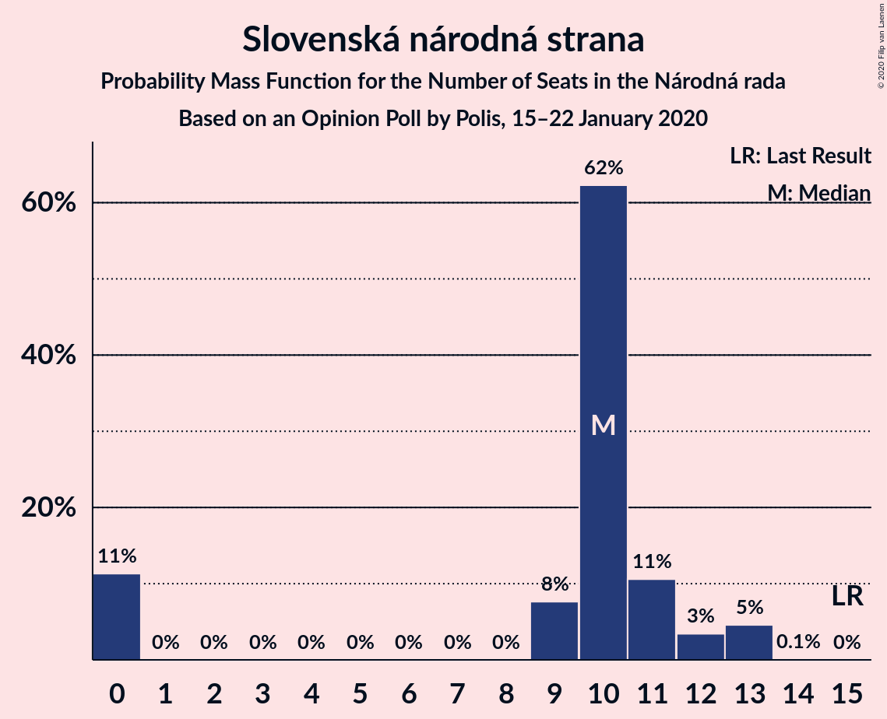

| Number of Seats | Probability | Accumulated | Special Marks |
|:---------------:|:-----------:|:-----------:|:-------------:|
| 0 | 11% | 100% |  |
| 1 | 0% | 89% |  |
| 2 | 0% | 89% |  |
| 3 | 0% | 89% |  |
| 4 | 0% | 89% |  |
| 5 | 0% | 89% |  |
| 6 | 0% | 89% |  |
| 7 | 0% | 89% |  |
| 8 | 0% | 89% |  |
| 9 | 8% | 89% |  |
| 10 | 62% | 81% | Median |
| 11 | 11% | 19% |  |
| 12 | 3% | 8% |  |
| 13 | 5% | 5% |  |
| 14 | 0.1% | 0.1% |  |
| 15 | 0% | 0% | Last Result |

### Kresťanskodemokratické hnutie

*For a full overview of the results for this party, see the [Kresťanskodemokratické hnutie](party-kresťanskodemokratickéhnutie.html) page.*

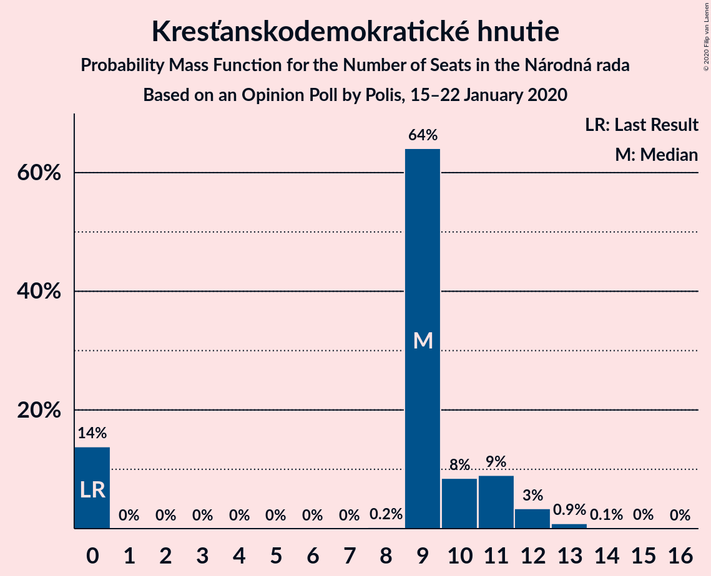

| Number of Seats | Probability | Accumulated | Special Marks |
|:---------------:|:-----------:|:-----------:|:-------------:|
| 0 | 14% | 100% | Last Result |
| 1 | 0% | 86% |  |
| 2 | 0% | 86% |  |
| 3 | 0% | 86% |  |
| 4 | 0% | 86% |  |
| 5 | 0% | 86% |  |
| 6 | 0% | 86% |  |
| 7 | 0% | 86% |  |
| 8 | 0.2% | 86% |  |
| 9 | 64% | 86% | Median |
| 10 | 8% | 22% |  |
| 11 | 9% | 13% |  |
| 12 | 3% | 4% |  |
| 13 | 0.9% | 1.0% |  |
| 14 | 0.1% | 0.1% |  |
| 15 | 0% | 0.1% |  |
| 16 | 0% | 0% |  |

### Sloboda a Solidarita

*For a full overview of the results for this party, see the [Sloboda a Solidarita](party-slobodaasolidarita.html) page.*

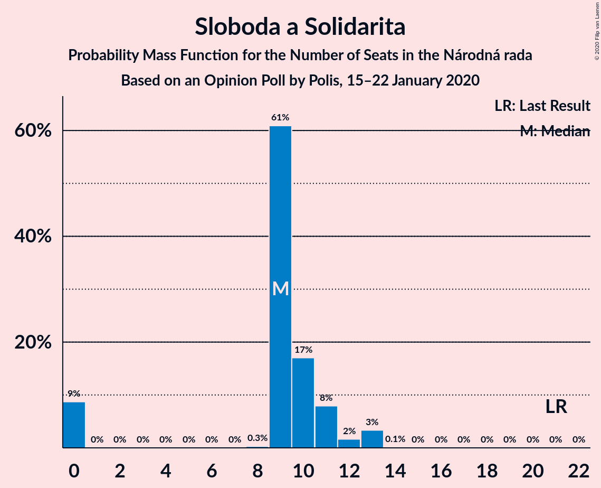

| Number of Seats | Probability | Accumulated | Special Marks |
|:---------------:|:-----------:|:-----------:|:-------------:|
| 0 | 9% | 100% |  |
| 1 | 0% | 91% |  |
| 2 | 0% | 91% |  |
| 3 | 0% | 91% |  |
| 4 | 0% | 91% |  |
| 5 | 0% | 91% |  |
| 6 | 0% | 91% |  |
| 7 | 0% | 91% |  |
| 8 | 0.3% | 91% |  |
| 9 | 61% | 91% | Median |
| 10 | 17% | 30% |  |
| 11 | 8% | 13% |  |
| 12 | 2% | 5% |  |
| 13 | 3% | 3% |  |
| 14 | 0.1% | 0.1% |  |
| 15 | 0% | 0% |  |
| 16 | 0% | 0% |  |
| 17 | 0% | 0% |  |
| 18 | 0% | 0% |  |
| 19 | 0% | 0% |  |
| 20 | 0% | 0% |  |
| 21 | 0% | 0% | Last Result |

### MOST–HÍD

*For a full overview of the results for this party, see the [MOST–HÍD](party-most–híd.html) page.*

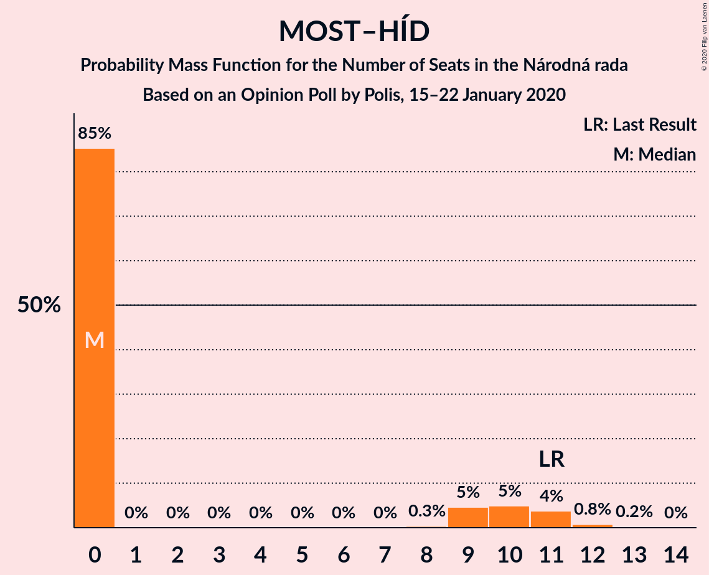

| Number of Seats | Probability | Accumulated | Special Marks |
|:---------------:|:-----------:|:-----------:|:-------------:|
| 0 | 85% | 100% | Median |
| 1 | 0% | 15% |  |
| 2 | 0% | 15% |  |
| 3 | 0% | 15% |  |
| 4 | 0% | 15% |  |
| 5 | 0% | 15% |  |
| 6 | 0% | 15% |  |
| 7 | 0% | 15% |  |
| 8 | 0.3% | 15% |  |
| 9 | 5% | 14% |  |
| 10 | 5% | 10% |  |
| 11 | 4% | 5% | Last Result |
| 12 | 0.8% | 1.0% |  |
| 13 | 0.2% | 0.3% |  |
| 14 | 0% | 0% |  |

### Dobrá voľba

*For a full overview of the results for this party, see the [Dobrá voľba](party-dobrávoľba.html) page.*

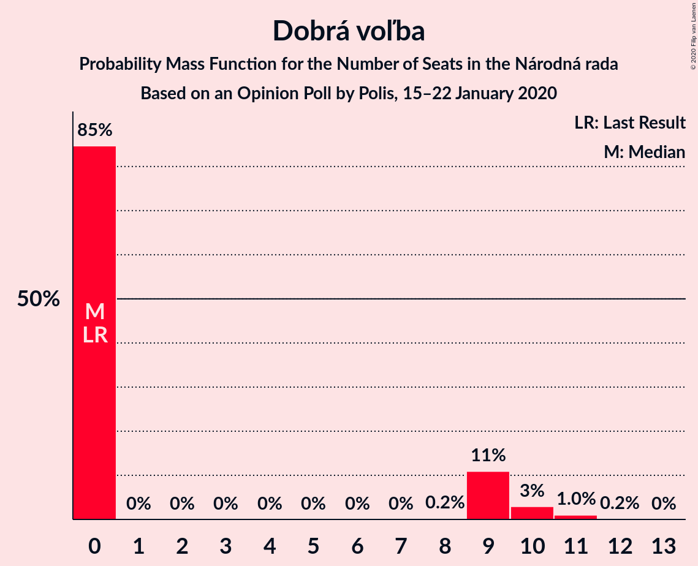

| Number of Seats | Probability | Accumulated | Special Marks |
|:---------------:|:-----------:|:-----------:|:-------------:|
| 0 | 85% | 100% | Last Result, Median |
| 1 | 0% | 15% |  |
| 2 | 0% | 15% |  |
| 3 | 0% | 15% |  |
| 4 | 0% | 15% |  |
| 5 | 0% | 15% |  |
| 6 | 0% | 15% |  |
| 7 | 0% | 15% |  |
| 8 | 0.2% | 15% |  |
| 9 | 11% | 15% |  |
| 10 | 3% | 4% |  |
| 11 | 1.0% | 1.2% |  |
| 12 | 0.2% | 0.2% |  |
| 13 | 0% | 0% |  |

### VLASŤ

*For a full overview of the results for this party, see the [VLASŤ](party-vlasť.html) page.*

| Number of Seats | Probability | Accumulated | Special Marks |
|:---------------:|:-----------:|:-----------:|:-------------:|
| 0 | 99.1% | 100% | Last Result, Median |
| 1 | 0% | 0.9% |  |
| 2 | 0% | 0.9% |  |
| 3 | 0% | 0.9% |  |
| 4 | 0% | 0.9% |  |
| 5 | 0% | 0.9% |  |
| 6 | 0% | 0.9% |  |
| 7 | 0% | 0.9% |  |
| 8 | 0.1% | 0.9% |  |
| 9 | 0.5% | 0.8% |  |
| 10 | 0.3% | 0.3% |  |
| 11 | 0.1% | 0.1% |  |
| 12 | 0% | 0% |  |

### Strana maďarskej koalície–Magyar Koalíció Pártja

*For a full overview of the results for this party, see the [Strana maďarskej koalície–Magyar Koalíció Pártja](party-stranamaďarskejkoalície–magyarkoalíciópártja.html) page.*

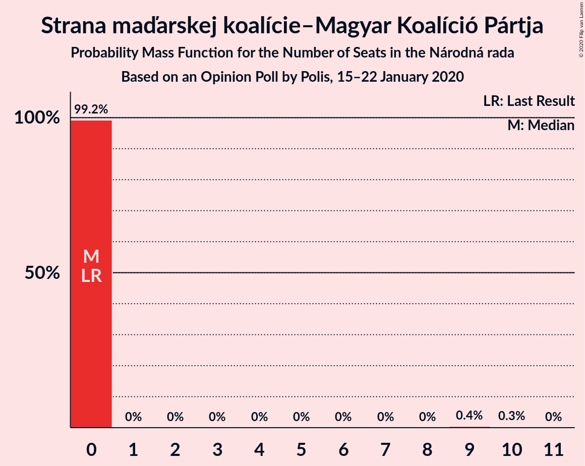

| Number of Seats | Probability | Accumulated | Special Marks |
|:---------------:|:-----------:|:-----------:|:-------------:|
| 0 | 99.2% | 100% | Last Result, Median |
| 1 | 0% | 0.8% |  |
| 2 | 0% | 0.8% |  |
| 3 | 0% | 0.8% |  |
| 4 | 0% | 0.8% |  |
| 5 | 0% | 0.8% |  |
| 6 | 0% | 0.8% |  |
| 7 | 0% | 0.8% |  |
| 8 | 0% | 0.8% |  |
| 9 | 0.4% | 0.7% |  |
| 10 | 0.3% | 0.3% |  |
| 11 | 0% | 0% |  |

## Coalitions

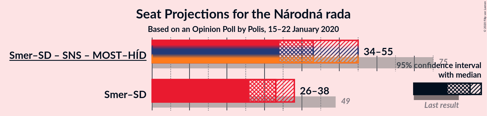

### Confidence Intervals

| Coalition | Last Result | Median | Majority? | 80% Confidence Interval | 90% Confidence Interval | 95% Confidence Interval | 99% Confidence Interval |
|:---------:|:-----------:|:------:|:---------:|:-----------------------:|:-----------------------:|:-----------------------:|:-----------------------:|
| SMER–sociálna demokracia – Slovenská národná strana – MOST–HÍD | 75 | 43 | 0% | 37–48 | 34–51 | 34–55 | 31–57 |
| SMER–sociálna demokracia | 49 | 33 | 0% | 28–34 | 28–36 | 26–38 | 25–38 |

### SMER–sociálna demokracia – Slovenská národná strana – MOST–HÍD

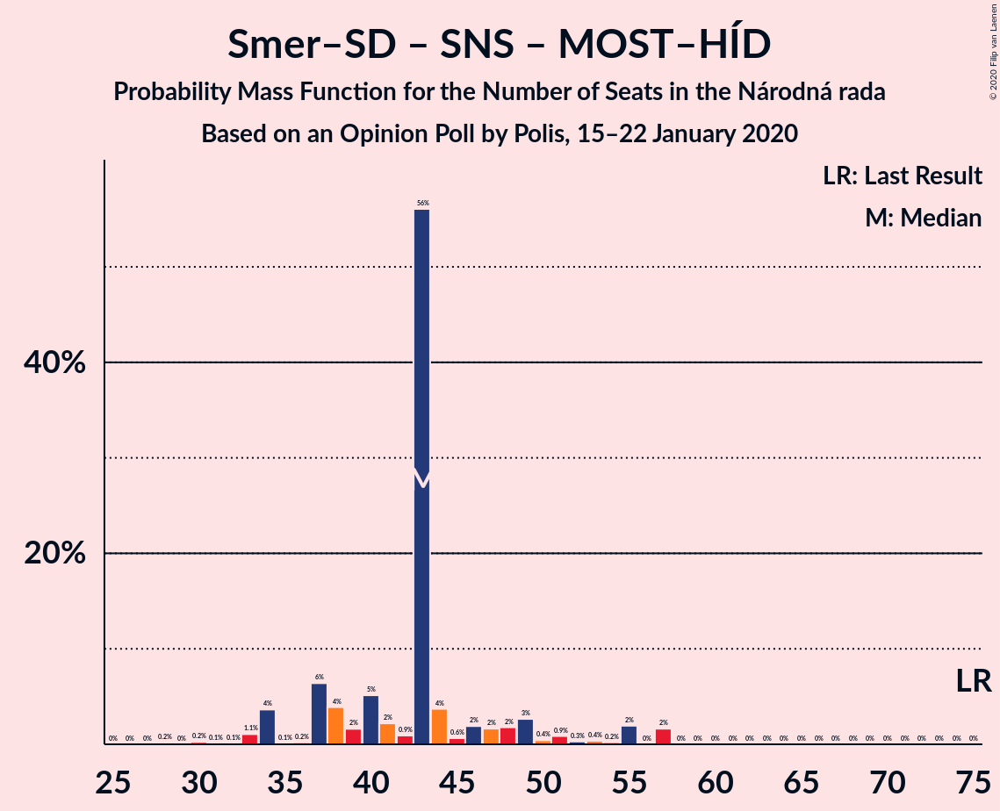

| Number of Seats | Probability | Accumulated | Special Marks |
|:---------------:|:-----------:|:-----------:|:-------------:|
| 28 | 0.2% | 100% |  |
| 29 | 0% | 99.8% |  |
| 30 | 0.2% | 99.8% |  |
| 31 | 0.1% | 99.6% |  |
| 32 | 0.1% | 99.5% |  |
| 33 | 1.1% | 99.4% |  |
| 34 | 4% | 98% |  |
| 35 | 0.1% | 95% |  |
| 36 | 0.2% | 95% |  |
| 37 | 6% | 94% |  |
| 38 | 4% | 88% |  |
| 39 | 2% | 84% |  |
| 40 | 5% | 82% |  |
| 41 | 2% | 77% |  |
| 42 | 0.9% | 75% |  |
| 43 | 56% | 74% | Median |
| 44 | 4% | 18% |  |
| 45 | 0.6% | 14% |  |
| 46 | 2% | 14% |  |
| 47 | 2% | 12% |  |
| 48 | 2% | 10% |  |
| 49 | 3% | 8% |  |
| 50 | 0.4% | 6% |  |
| 51 | 0.9% | 5% |  |
| 52 | 0.3% | 5% |  |
| 53 | 0.4% | 4% |  |
| 54 | 0.2% | 4% |  |
| 55 | 2% | 4% |  |
| 56 | 0% | 2% |  |
| 57 | 2% | 2% |  |
| 58 | 0% | 0.1% |  |
| 59 | 0% | 0% |  |
| 60 | 0% | 0% |  |
| 61 | 0% | 0% |  |
| 62 | 0% | 0% |  |
| 63 | 0% | 0% |  |
| 64 | 0% | 0% |  |
| 65 | 0% | 0% |  |
| 66 | 0% | 0% |  |
| 67 | 0% | 0% |  |
| 68 | 0% | 0% |  |
| 69 | 0% | 0% |  |
| 70 | 0% | 0% |  |
| 71 | 0% | 0% |  |
| 72 | 0% | 0% |  |
| 73 | 0% | 0% |  |
| 74 | 0% | 0% |  |
| 75 | 0% | 0% | Last Result |

### SMER–sociálna demokracia

| Number of Seats | Probability | Accumulated | Special Marks |
|:---------------:|:-----------:|:-----------:|:-------------:|
| 23 | 0.1% | 100% |  |
| 24 | 0.1% | 99.9% |  |
| 25 | 1.3% | 99.8% |  |
| 26 | 2% | 98.5% |  |
| 27 | 0.9% | 96% |  |
| 28 | 9% | 95% |  |
| 29 | 3% | 86% |  |
| 30 | 6% | 84% |  |
| 31 | 6% | 78% |  |
| 32 | 3% | 72% |  |
| 33 | 57% | 69% | Median |
| 34 | 5% | 12% |  |
| 35 | 2% | 7% |  |
| 36 | 1.0% | 5% |  |
| 37 | 1.0% | 4% |  |
| 38 | 3% | 3% |  |
| 39 | 0% | 0.3% |  |
| 40 | 0.1% | 0.3% |  |
| 41 | 0% | 0.2% |  |
| 42 | 0.1% | 0.1% |  |
| 43 | 0% | 0% |  |
| 44 | 0% | 0% |  |
| 45 | 0% | 0% |  |
| 46 | 0% | 0% |  |
| 47 | 0% | 0% |  |
| 48 | 0% | 0% |  |
| 49 | 0% | 0% | Last Result |

## Technical Information

### Opinion Poll

+ **Polling firm:** Polis
+ **Commissioner(s):** —
+ **Fieldwork period:** 15–22 January 2020

### Calculations

+ **Sample size:** 1109
+ **Simulations done:** 1,048,576
+ **Error estimate:** 2.42%

