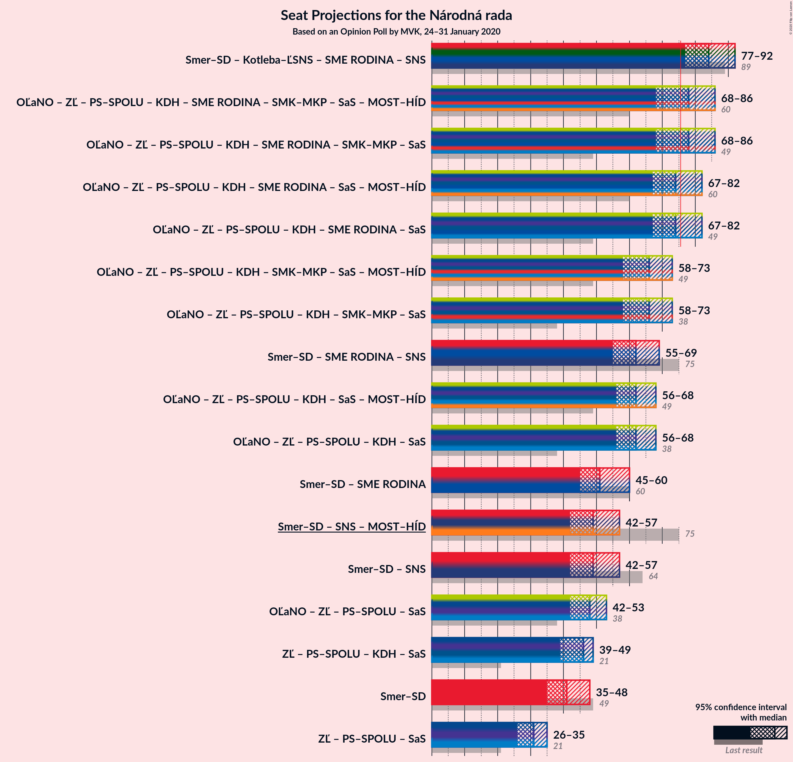

# Opinion Poll by MVK, 24–31 January 2020

<a href="#voting-intentions">Voting Intentions</a> | <a href="#seats">Seats</a> | <a href="#coalitions">Coalitions</a> | <a href="#technical-information">Technical Information</a>

## Voting Intentions

### Confidence Intervals

| Party | Last Result | Poll Result | 80% Confidence Interval | 90% Confidence Interval | 95% Confidence Interval | 99% Confidence Interval |
|:-----:|:-----------:|:-----------:|:-----------------------:|:-----------------------:|:-----------------------:|:-----------------------:|
| SMER–sociálna demokracia | 28.3% | 21.9% | 20.4–23.5% |20.0–24.0% |19.6–24.4% |18.9–25.2% |
| Kotleba–Ľudová strana Naše Slovensko | 8.0% | 12.7% | 11.5–14.1% |11.2–14.5% |10.9–14.8% |10.3–15.5% |
| OBYČAJNÍ ĽUDIA a nezávislé osobnosti | 11.0% | 8.9% | 7.9–10.1% |7.6–10.4% |7.4–10.7% |6.9–11.3% |
| Za ľudí | 0.0% | 8.5% | 7.5–9.6% |7.2–10.0% |7.0–10.2% |6.5–10.8% |
| Progresívne Slovensko–SPOLU–Občianska Demokracia | 0.0% | 8.1% | 7.1–9.3% |6.9–9.6% |6.6–9.9% |6.2–10.4% |
| Kresťanskodemokratické hnutie | 4.9% | 7.5% | 6.6–8.6% |6.3–8.9% |6.1–9.2% |5.7–9.7% |
| SME RODINA | 6.6% | 6.5% | 5.6–7.5% |5.4–7.8% |5.2–8.1% |4.8–8.6% |
| Slovenská národná strana | 8.6% | 6.0% | 5.2–7.0% |4.9–7.3% |4.7–7.5% |4.4–8.0% |
| Strana maďarskej koalície–Magyar Koalíció Pártja | 4.0% | 4.6% | 3.9–5.5% |3.7–5.8% |3.6–6.0% |3.2–6.5% |
| Sloboda a Solidarita | 12.1% | 3.8% | 3.2–4.7% |3.0–4.9% |2.9–5.1% |2.6–5.6% |
| MOST–HÍD | 6.5% | 2.9% | 2.4–3.7% |2.2–3.9% |2.1–4.1% |1.9–4.5% |
| Dobrá voľba | 0.0% | 2.9% | 2.4–3.7% |2.2–3.9% |2.1–4.1% |1.9–4.5% |
| VLASŤ | 0.0% | 2.4% | 1.9–3.1% |1.8–3.3% |1.7–3.5% |1.4–3.9% |

*Note:* The poll result column reflects the actual value used in the calculations. Published results may vary slightly, and in addition be rounded to fewer digits.

## Seats

### Confidence Intervals

| Party | Last Result | Median | 80% Confidence Interval | 90% Confidence Interval | 95% Confidence Interval | 99% Confidence Interval |
|:-----:|:-----------:|:------:|:-----------------------:|:-----------------------:|:-----------------------:|:-----------------------:|
| <a href="#smer–sociálna-demokracia">SMER–sociálna demokracia</a> | 49 | 41 | 37–46 |37–46 |35–48 |34–48 |
| <a href="#kotleba–ľudová-strana-naše-slovensko">Kotleba–Ľudová strana Naše Slovensko</a> | 14 | 23 | 21–26 |20–28 |19–28 |18–29 |
| <a href="#obyčajní-ľudia-a-nezávislé-osobnosti">OBYČAJNÍ ĽUDIA a nezávislé osobnosti</a> | 17 | 17 | 15–20 |14–20 |14–21 |13–23 |
| <a href="#za-ľudí">Za ľudí</a> | 0 | 16 | 13–18 |13–18 |12–19 |11–20 |
| <a href="#progresívne-slovensko–spolu–občianska-demokracia">Progresívne Slovensko–SPOLU–Občianska Demokracia</a> | 0 | 15 | 13–17 |13–17 |12–18 |12–19 |
| <a href="#kresťanskodemokratické-hnutie">Kresťanskodemokratické hnutie</a> | 0 | 15 | 12–17 |11–17 |11–17 |10–18 |
| <a href="#sme-rodina">SME RODINA</a> | 11 | 13 | 10–14 |10–15 |9–16 |0–16 |
| <a href="#slovenská-národná-strana">Slovenská národná strana</a> | 15 | 11 | 0–12 |0–13 |0–14 |0–15 |
| <a href="#strana-maďarskej-koalície–magyar-koalíció-pártja">Strana maďarskej koalície–Magyar Koalíció Pártja</a> | 0 | 0 | 0–10 |0–10 |0–10 |0–12 |
| <a href="#sloboda-a-solidarita">Sloboda a Solidarita</a> | 21 | 0 | 0 |0 |0 |0–10 |
| <a href="#most–híd">MOST–HÍD</a> | 11 | 0 | 0 |0 |0 |0 |
| <a href="#dobrá-voľba">Dobrá voľba</a> | 0 | 0 | 0 |0 |0 |0 |
| <a href="#vlasť">VLASŤ</a> | 0 | 0 | 0 |0 |0 |0 |

### SMER–sociálna demokracia

*For a full overview of the results for this party, see the [SMER–sociálna demokracia](party-smer–sociálnademokracia.html) page.*

| Number of Seats | Probability | Accumulated | Special Marks |
|:---------------:|:-----------:|:-----------:|:-------------:|
| 33 | 0.2% | 100% |  |
| 34 | 2% | 99.8% |  |
| 35 | 1.4% | 98% |  |
| 36 | 0.8% | 97% |  |
| 37 | 11% | 96% |  |
| 38 | 27% | 85% |  |
| 39 | 4% | 58% |  |
| 40 | 3% | 55% |  |
| 41 | 18% | 52% | Median |
| 42 | 10% | 34% |  |
| 43 | 6% | 24% |  |
| 44 | 2% | 17% |  |
| 45 | 3% | 16% |  |
| 46 | 9% | 12% |  |
| 47 | 0.7% | 3% |  |
| 48 | 2% | 3% |  |
| 49 | 0.2% | 0.2% | Last Result |
| 50 | 0.1% | 0.1% |  |
| 51 | 0% | 0% |  |

### Kotleba–Ľudová strana Naše Slovensko

*For a full overview of the results for this party, see the [Kotleba–Ľudová strana Naše Slovensko](party-kotleba–ľudovástrananašeslovensko.html) page.*

| Number of Seats | Probability | Accumulated | Special Marks |
|:---------------:|:-----------:|:-----------:|:-------------:|
| 14 | 0% | 100% | Last Result |
| 15 | 0% | 100% |  |
| 16 | 0% | 100% |  |
| 17 | 0.1% | 100% |  |
| 18 | 1.4% | 99.9% |  |
| 19 | 1.0% | 98.5% |  |
| 20 | 5% | 97% |  |
| 21 | 23% | 93% |  |
| 22 | 19% | 70% |  |
| 23 | 23% | 51% | Median |
| 24 | 13% | 28% |  |
| 25 | 3% | 15% |  |
| 26 | 3% | 12% |  |
| 27 | 2% | 8% |  |
| 28 | 5% | 6% |  |
| 29 | 0.6% | 0.8% |  |
| 30 | 0.1% | 0.2% |  |
| 31 | 0% | 0% |  |

### OBYČAJNÍ ĽUDIA a nezávislé osobnosti

*For a full overview of the results for this party, see the [OBYČAJNÍ ĽUDIA a nezávislé osobnosti](party-obyčajníľudiaanezávisléosobnosti.html) page.*

| Number of Seats | Probability | Accumulated | Special Marks |
|:---------------:|:-----------:|:-----------:|:-------------:|
| 12 | 0.4% | 100% |  |
| 13 | 1.3% | 99.6% |  |
| 14 | 8% | 98% |  |
| 15 | 7% | 90% |  |
| 16 | 22% | 83% |  |
| 17 | 18% | 62% | Last Result, Median |
| 18 | 13% | 44% |  |
| 19 | 18% | 30% |  |
| 20 | 9% | 12% |  |
| 21 | 2% | 3% |  |
| 22 | 0.3% | 1.2% |  |
| 23 | 0.9% | 0.9% |  |
| 24 | 0% | 0% |  |

### Za ľudí

*For a full overview of the results for this party, see the [Za ľudí](party-zaľudí.html) page.*

| Number of Seats | Probability | Accumulated | Special Marks |
|:---------------:|:-----------:|:-----------:|:-------------:|
| 0 | 0% | 100% | Last Result |
| 1 | 0% | 100% |  |
| 2 | 0% | 100% |  |
| 3 | 0% | 100% |  |
| 4 | 0% | 100% |  |
| 5 | 0% | 100% |  |
| 6 | 0% | 100% |  |
| 7 | 0% | 100% |  |
| 8 | 0% | 100% |  |
| 9 | 0% | 100% |  |
| 10 | 0% | 100% |  |
| 11 | 1.1% | 100% |  |
| 12 | 3% | 98.9% |  |
| 13 | 12% | 96% |  |
| 14 | 4% | 85% |  |
| 15 | 27% | 81% |  |
| 16 | 7% | 54% | Median |
| 17 | 33% | 48% |  |
| 18 | 11% | 15% |  |
| 19 | 3% | 4% |  |
| 20 | 0.3% | 0.6% |  |
| 21 | 0.3% | 0.3% |  |
| 22 | 0% | 0% |  |

### Progresívne Slovensko–SPOLU–Občianska Demokracia

*For a full overview of the results for this party, see the [Progresívne Slovensko–SPOLU–Občianska Demokracia](party-progresívneslovensko–spolu–občianskademokracia.html) page.*

| Number of Seats | Probability | Accumulated | Special Marks |
|:---------------:|:-----------:|:-----------:|:-------------:|
| 0 | 0% | 100% | Last Result |
| 1 | 0% | 100% |  |
| 2 | 0% | 100% |  |
| 3 | 0% | 100% |  |
| 4 | 0% | 100% |  |
| 5 | 0% | 100% |  |
| 6 | 0% | 100% |  |
| 7 | 0% | 100% |  |
| 8 | 0% | 100% |  |
| 9 | 0% | 100% |  |
| 10 | 0% | 100% |  |
| 11 | 0.3% | 100% |  |
| 12 | 3% | 99.6% |  |
| 13 | 20% | 97% |  |
| 14 | 14% | 77% |  |
| 15 | 33% | 62% | Median |
| 16 | 18% | 29% |  |
| 17 | 7% | 11% |  |
| 18 | 2% | 4% |  |
| 19 | 2% | 2% |  |
| 20 | 0.3% | 0.4% |  |
| 21 | 0.1% | 0.1% |  |
| 22 | 0% | 0% |  |

### Kresťanskodemokratické hnutie

*For a full overview of the results for this party, see the [Kresťanskodemokratické hnutie](party-kresťanskodemokratickéhnutie.html) page.*

| Number of Seats | Probability | Accumulated | Special Marks |
|:---------------:|:-----------:|:-----------:|:-------------:|
| 0 | 0% | 100% | Last Result |
| 1 | 0% | 100% |  |
| 2 | 0% | 100% |  |
| 3 | 0% | 100% |  |
| 4 | 0% | 100% |  |
| 5 | 0% | 100% |  |
| 6 | 0% | 100% |  |
| 7 | 0% | 100% |  |
| 8 | 0% | 100% |  |
| 9 | 0.1% | 100% |  |
| 10 | 0.7% | 99.9% |  |
| 11 | 6% | 99.2% |  |
| 12 | 12% | 93% |  |
| 13 | 7% | 82% |  |
| 14 | 17% | 74% |  |
| 15 | 34% | 57% | Median |
| 16 | 12% | 23% |  |
| 17 | 9% | 11% |  |
| 18 | 1.2% | 1.4% |  |
| 19 | 0.2% | 0.2% |  |
| 20 | 0% | 0% |  |

### SME RODINA

*For a full overview of the results for this party, see the [SME RODINA](party-smerodina.html) page.*

| Number of Seats | Probability | Accumulated | Special Marks |
|:---------------:|:-----------:|:-----------:|:-------------:|
| 0 | 1.2% | 100% |  |
| 1 | 0% | 98.8% |  |
| 2 | 0% | 98.8% |  |
| 3 | 0% | 98.8% |  |
| 4 | 0% | 98.8% |  |
| 5 | 0% | 98.8% |  |
| 6 | 0% | 98.8% |  |
| 7 | 0% | 98.8% |  |
| 8 | 0% | 98.8% |  |
| 9 | 1.3% | 98.8% |  |
| 10 | 18% | 97% |  |
| 11 | 13% | 80% | Last Result |
| 12 | 8% | 67% |  |
| 13 | 25% | 59% | Median |
| 14 | 28% | 34% |  |
| 15 | 2% | 6% |  |
| 16 | 4% | 4% |  |
| 17 | 0.1% | 0.1% |  |
| 18 | 0% | 0% |  |

### Slovenská národná strana

*For a full overview of the results for this party, see the [Slovenská národná strana](party-slovenskánárodnástrana.html) page.*

| Number of Seats | Probability | Accumulated | Special Marks |
|:---------------:|:-----------:|:-----------:|:-------------:|
| 0 | 19% | 100% |  |
| 1 | 0% | 81% |  |
| 2 | 0% | 81% |  |
| 3 | 0% | 81% |  |
| 4 | 0% | 81% |  |
| 5 | 0% | 81% |  |
| 6 | 0% | 81% |  |
| 7 | 0% | 81% |  |
| 8 | 0% | 81% |  |
| 9 | 7% | 81% |  |
| 10 | 18% | 74% |  |
| 11 | 25% | 56% | Median |
| 12 | 22% | 31% |  |
| 13 | 4% | 8% |  |
| 14 | 4% | 5% |  |
| 15 | 0.6% | 0.7% | Last Result |
| 16 | 0.1% | 0.1% |  |
| 17 | 0% | 0% |  |

### Strana maďarskej koalície–Magyar Koalíció Pártja

*For a full overview of the results for this party, see the [Strana maďarskej koalície–Magyar Koalíció Pártja](party-stranamaďarskejkoalície–magyarkoalíciópártja.html) page.*

| Number of Seats | Probability | Accumulated | Special Marks |
|:---------------:|:-----------:|:-----------:|:-------------:|
| 0 | 70% | 100% | Last Result, Median |
| 1 | 0% | 30% |  |
| 2 | 0% | 30% |  |
| 3 | 0% | 30% |  |
| 4 | 0% | 30% |  |
| 5 | 0% | 30% |  |
| 6 | 0% | 30% |  |
| 7 | 0% | 30% |  |
| 8 | 0% | 30% |  |
| 9 | 19% | 30% |  |
| 10 | 9% | 11% |  |
| 11 | 1.4% | 2% |  |
| 12 | 0.7% | 0.7% |  |
| 13 | 0% | 0% |  |

### Sloboda a Solidarita

*For a full overview of the results for this party, see the [Sloboda a Solidarita](party-slobodaasolidarita.html) page.*

| Number of Seats | Probability | Accumulated | Special Marks |
|:---------------:|:-----------:|:-----------:|:-------------:|
| 0 | 99.0% | 100% | Median |
| 1 | 0% | 1.0% |  |
| 2 | 0% | 1.0% |  |
| 3 | 0% | 1.0% |  |
| 4 | 0% | 1.0% |  |
| 5 | 0% | 1.0% |  |
| 6 | 0% | 1.0% |  |
| 7 | 0% | 1.0% |  |
| 8 | 0% | 1.0% |  |
| 9 | 0.4% | 1.0% |  |
| 10 | 0.5% | 0.6% |  |
| 11 | 0.1% | 0.1% |  |
| 12 | 0% | 0% |  |
| 13 | 0% | 0% |  |
| 14 | 0% | 0% |  |
| 15 | 0% | 0% |  |
| 16 | 0% | 0% |  |
| 17 | 0% | 0% |  |
| 18 | 0% | 0% |  |
| 19 | 0% | 0% |  |
| 20 | 0% | 0% |  |
| 21 | 0% | 0% | Last Result |

### MOST–HÍD

*For a full overview of the results for this party, see the [MOST–HÍD](party-most–híd.html) page.*

| Number of Seats | Probability | Accumulated | Special Marks |
|:---------------:|:-----------:|:-----------:|:-------------:|
| 0 | 99.9% | 100% | Median |
| 1 | 0% | 0.1% |  |
| 2 | 0% | 0.1% |  |
| 3 | 0% | 0.1% |  |
| 4 | 0% | 0.1% |  |
| 5 | 0% | 0.1% |  |
| 6 | 0% | 0.1% |  |
| 7 | 0% | 0.1% |  |
| 8 | 0% | 0.1% |  |
| 9 | 0% | 0.1% |  |
| 10 | 0% | 0% |  |
| 11 | 0% | 0% | Last Result |

### Dobrá voľba

*For a full overview of the results for this party, see the [Dobrá voľba](party-dobrávoľba.html) page.*

| Number of Seats | Probability | Accumulated | Special Marks |
|:---------------:|:-----------:|:-----------:|:-------------:|
| 0 | 99.9% | 100% | Last Result, Median |
| 1 | 0% | 0.1% |  |
| 2 | 0% | 0.1% |  |
| 3 | 0% | 0.1% |  |
| 4 | 0% | 0.1% |  |
| 5 | 0% | 0.1% |  |
| 6 | 0% | 0.1% |  |
| 7 | 0% | 0.1% |  |
| 8 | 0% | 0.1% |  |
| 9 | 0.1% | 0.1% |  |
| 10 | 0% | 0% |  |

### VLASŤ

*For a full overview of the results for this party, see the [VLASŤ](party-vlasť.html) page.*

| Number of Seats | Probability | Accumulated | Special Marks |
|:---------------:|:-----------:|:-----------:|:-------------:|
| 0 | 100% | 100% | Last Result, Median |

## Coalitions

### Confidence Intervals

| Coalition | Last Result | Median | Majority? | 80% Confidence Interval | 90% Confidence Interval | 95% Confidence Interval | 99% Confidence Interval |
|:---------:|:-----------:|:------:|:---------:|:-----------------------:|:-----------------------:|:-----------------------:|:-----------------------:|
| SMER–sociálna demokracia – Slovenská národná strana – MOST–HÍD | 75 | 49 | 0% | 45–55 | 42–57 | 42–57 | 38–60 |
| SMER–sociálna demokracia | 49 | 41 | 0% | 37–46 | 37–46 | 35–48 | 34–48 |

### SMER–sociálna demokracia – Slovenská národná strana – MOST–HÍD

| Number of Seats | Probability | Accumulated | Special Marks |
|:---------------:|:-----------:|:-----------:|:-------------:|
| 38 | 0.7% | 100% |  |
| 39 | 0.5% | 99.3% |  |
| 40 | 0.1% | 98.8% |  |
| 41 | 1.1% | 98.7% |  |
| 42 | 6% | 98% |  |
| 43 | 0.2% | 92% |  |
| 44 | 1.2% | 92% |  |
| 45 | 3% | 90% |  |
| 46 | 8% | 88% |  |
| 47 | 10% | 80% |  |
| 48 | 0.9% | 69% |  |
| 49 | 24% | 68% |  |
| 50 | 5% | 44% |  |
| 51 | 10% | 39% |  |
| 52 | 4% | 30% | Median |
| 53 | 12% | 26% |  |
| 54 | 0.8% | 14% |  |
| 55 | 5% | 13% |  |
| 56 | 2% | 8% |  |
| 57 | 4% | 6% |  |
| 58 | 1.1% | 2% |  |
| 59 | 0.2% | 0.8% |  |
| 60 | 0.6% | 0.6% |  |
| 61 | 0% | 0% |  |
| 62 | 0% | 0% |  |
| 63 | 0% | 0% |  |
| 64 | 0% | 0% |  |
| 65 | 0% | 0% |  |
| 66 | 0% | 0% |  |
| 67 | 0% | 0% |  |
| 68 | 0% | 0% |  |
| 69 | 0% | 0% |  |
| 70 | 0% | 0% |  |
| 71 | 0% | 0% |  |
| 72 | 0% | 0% |  |
| 73 | 0% | 0% |  |
| 74 | 0% | 0% |  |
| 75 | 0% | 0% | Last Result |

### SMER–sociálna demokracia

| Number of Seats | Probability | Accumulated | Special Marks |
|:---------------:|:-----------:|:-----------:|:-------------:|
| 33 | 0.2% | 100% |  |
| 34 | 2% | 99.8% |  |
| 35 | 1.4% | 98% |  |
| 36 | 0.8% | 97% |  |
| 37 | 11% | 96% |  |
| 38 | 27% | 85% |  |
| 39 | 4% | 58% |  |
| 40 | 3% | 55% |  |
| 41 | 18% | 52% | Median |
| 42 | 10% | 34% |  |
| 43 | 6% | 24% |  |
| 44 | 2% | 17% |  |
| 45 | 3% | 16% |  |
| 46 | 9% | 12% |  |
| 47 | 0.7% | 3% |  |
| 48 | 2% | 3% |  |
| 49 | 0.2% | 0.2% | Last Result |
| 50 | 0.1% | 0.1% |  |
| 51 | 0% | 0% |  |

## Technical Information

### Opinion Poll

+ **Polling firm:** MVK
+ **Commissioner(s):** —
+ **Fieldwork period:** 24–31 January 2020

### Calculations

+ **Sample size:** 1123
+ **Simulations done:** 1,048,576
+ **Error estimate:** 2.16%

