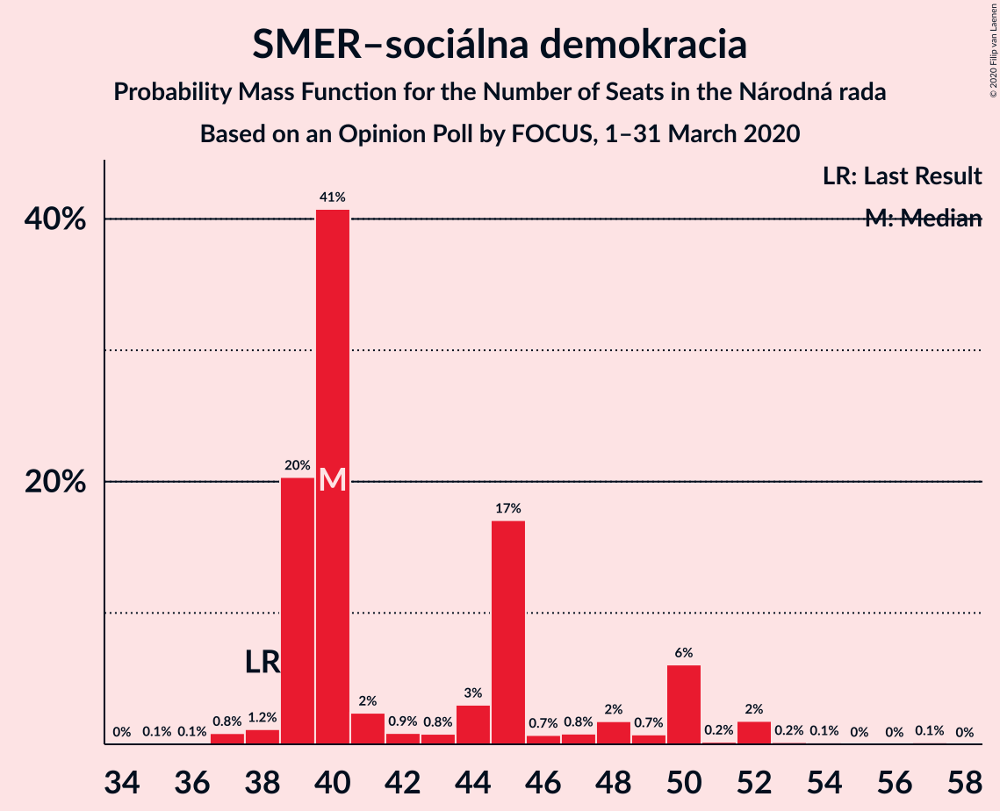
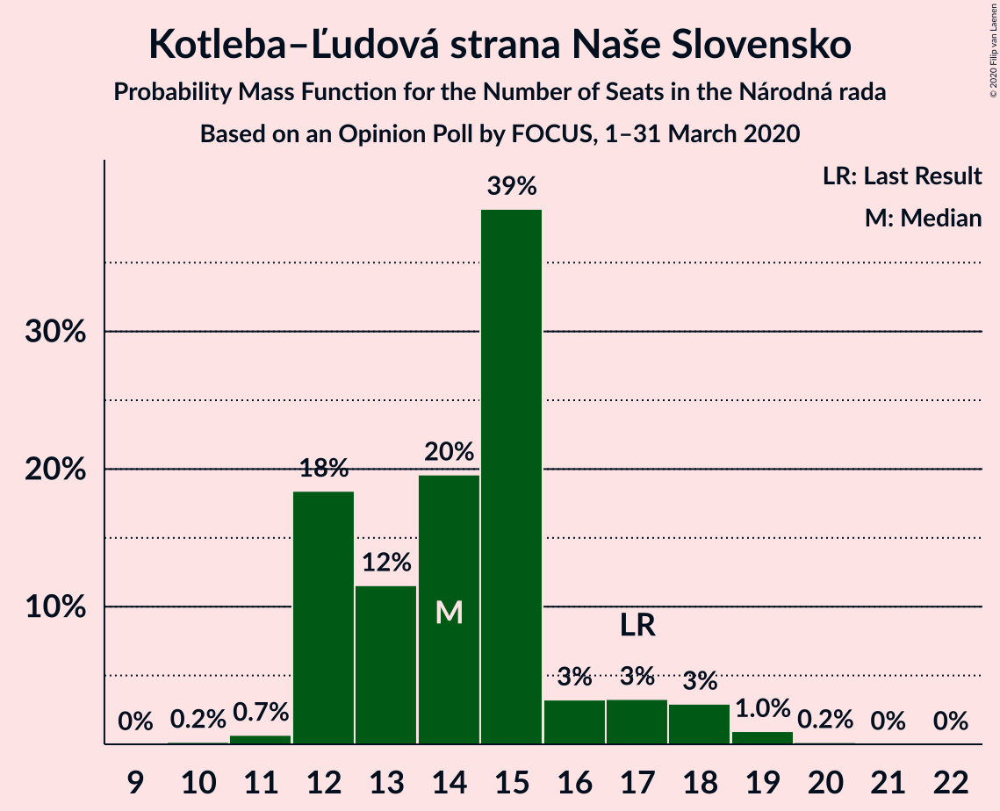
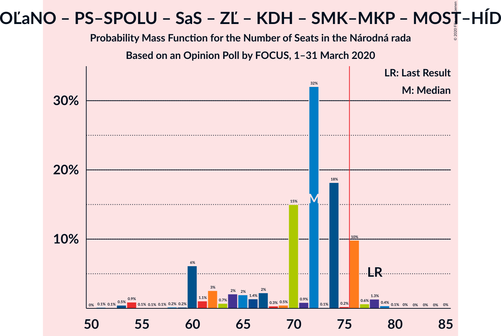
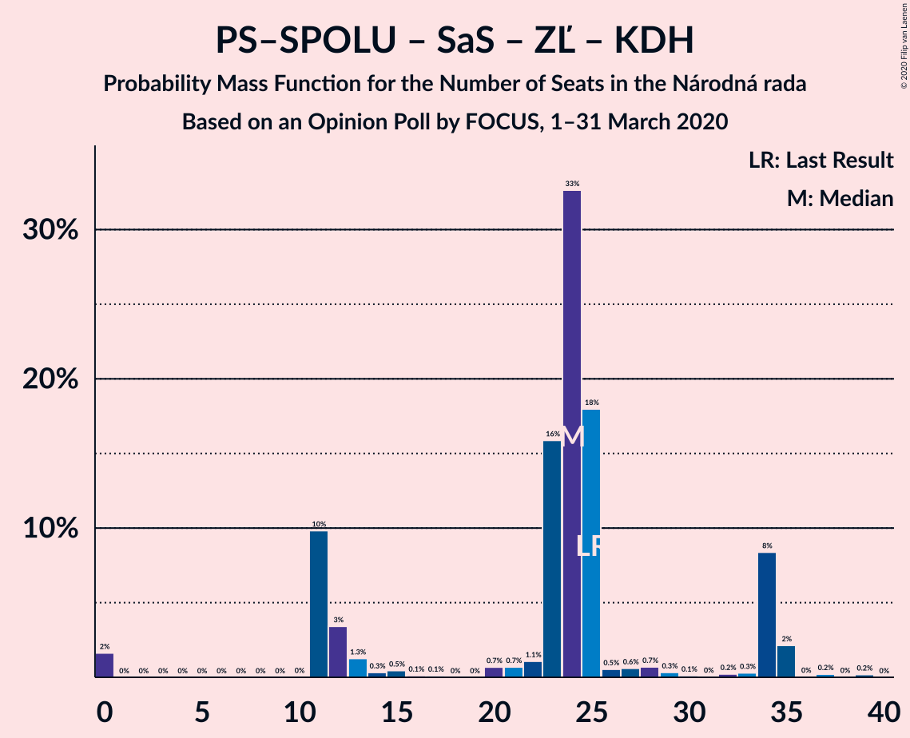

# Opinion Poll by FOCUS, 1–31 March 2020

<a href="#voting-intentions">Voting Intentions</a> | <a href="#seats">Seats</a> | <a href="#coalitions">Coalitions</a> | <a href="#technical-information">Technical Information</a>

## Voting Intentions

### Confidence Intervals

| Party | Last Result | Poll Result | 80% Confidence Interval | 90% Confidence Interval | 95% Confidence Interval | 99% Confidence Interval |
|:-----:|:-----------:|:-----------:|:-----------------------:|:-----------------------:|:-----------------------:|:-----------------------:|
| OBYČAJNÍ ĽUDIA a nezávislé osobnosti | 25.0% | 23.3% | 21.6–25.1% |21.2–25.6% |20.8–26.0% |20.0–26.9% |
| SMER–sociálna demokracia | 18.3% | 21.6% | 20.0–23.3% |19.5–23.8% |19.2–24.2% |18.4–25.1% |
| SME RODINA | 8.2% | 11.5% | 10.3–12.9% |10.0–13.3% |9.7–13.7% |9.2–14.4% |
| Kotleba–Ľudová strana Naše Slovensko | 8.0% | 7.3% | 6.3–8.4% |6.0–8.7% |5.8–9.0% |5.4–9.6% |
| Progresívne Slovensko–SPOLU–Občianska Demokracia | 7.0% | 5.9% | 5.0–6.9% |4.8–7.2% |4.6–7.5% |4.2–8.0% |
| Sloboda a Solidarita | 6.2% | 5.8% | 4.9–6.8% |4.7–7.1% |4.5–7.4% |4.1–7.9% |
| Za ľudí | 5.8% | 5.2% | 4.4–6.2% |4.1–6.5% |4.0–6.7% |3.6–7.2% |
| Kresťanskodemokratické hnutie | 4.6% | 4.1% | 3.4–5.0% |3.2–5.3% |3.0–5.5% |2.7–6.0% |
| Strana maďarskej koalície–Magyar Koalíció Pártja | 3.9% | 3.5% | 2.8–4.3% |2.7–4.6% |2.5–4.8% |2.2–5.3% |
| Slovenská národná strana | 3.2% | 3.4% | 2.8–4.2% |2.6–4.5% |2.4–4.7% |2.2–5.1% |
| VLASŤ | 2.9% | 3.1% | 2.5–3.9% |2.3–4.1% |2.2–4.4% |1.9–4.8% |
| Dobrá voľba | 3.1% | 2.4% | 1.9–3.1% |1.7–3.4% |1.6–3.5% |1.4–3.9% |
| MOST–HÍD | 2.0% | 1.3% | 0.9–1.9% |0.8–2.1% |0.8–2.2% |0.6–2.5% |

*Note:* The poll result column reflects the actual value used in the calculations. Published results may vary slightly, and in addition be rounded to fewer digits.

## Seats

### Confidence Intervals

| Party | Last Result | Median | 80% Confidence Interval | 90% Confidence Interval | 95% Confidence Interval | 99% Confidence Interval |
|:-----:|:-----------:|:------:|:-----------------------:|:-----------------------:|:-----------------------:|:-----------------------:|
| <a href="#obyčajní-ľudia-a-nezávislé-osobnosti">OBYČAJNÍ ĽUDIA a nezávislé osobnosti</a> | 53 | 49 | 42–50 |41–51 |41–53 |40–54 |
| <a href="#smer–sociálna-demokracia">SMER–sociálna demokracia</a> | 38 | 39 | 39–43 |39–45 |39–45 |37–51 |
| <a href="#sme-rodina">SME RODINA</a> | 17 | 23 | 21–25 |21–25 |19–29 |18–29 |
| <a href="#kotleba–ľudová-strana-naše-slovensko">Kotleba–Ľudová strana Naše Slovensko</a> | 17 | 14 | 13–17 |12–18 |12–18 |11–18 |
| <a href="#progresívne-slovensko–spolu–občianska-demokracia">Progresívne Slovensko–SPOLU–Občianska Demokracia</a> | 0 | 0 | 0–13 |0–14 |0–14 |0–15 |
| <a href="#sloboda-a-solidarita">Sloboda a Solidarita</a> | 13 | 13 | 11–13 |11–13 |10–15 |0–15 |
| <a href="#za-ľudí">Za ľudí</a> | 12 | 12 | 0–12 |0–12 |0–12 |0–14 |
| <a href="#kresťanskodemokratické-hnutie">Kresťanskodemokratické hnutie</a> | 0 | 0 | 0 |0 |0–10 |0–10 |
| <a href="#strana-maďarskej-koalície–magyar-koalíció-pártja">Strana maďarskej koalície–Magyar Koalíció Pártja</a> | 0 | 0 | 0 |0 |0 |0 |
| <a href="#slovenská-národná-strana">Slovenská národná strana</a> | 0 | 0 | 0 |0 |0 |0 |
| <a href="#vlasť">VLASŤ</a> | 0 | 0 | 0 |0 |0 |0 |
| <a href="#dobrá-voľba">Dobrá voľba</a> | 0 | 0 | 0 |0 |0 |0 |
| <a href="#most–híd">MOST–HÍD</a> | 0 | 0 | 0 |0 |0 |0 |

### OBYČAJNÍ ĽUDIA a nezávislé osobnosti

*For a full overview of the results for this party, see the [OBYČAJNÍ ĽUDIA a nezávislé osobnosti](party-obyčajníľudiaanezávisléosobnosti.html) page.*

| Number of Seats | Probability | Accumulated | Special Marks |
|:---------------:|:-----------:|:-----------:|:-------------:|
| 39 | 0.3% | 100% |  |
| 40 | 0.6% | 99.6% |  |
| 41 | 5% | 99.1% |  |
| 42 | 23% | 94% |  |
| 43 | 2% | 71% |  |
| 44 | 2% | 69% |  |
| 45 | 0.3% | 67% |  |
| 46 | 0.7% | 67% |  |
| 47 | 0.1% | 66% |  |
| 48 | 0.7% | 66% |  |
| 49 | 53% | 65% | Median |
| 50 | 7% | 12% |  |
| 51 | 0.6% | 5% |  |
| 52 | 0% | 5% |  |
| 53 | 3% | 5% | Last Result |
| 54 | 1.0% | 1.3% |  |
| 55 | 0.2% | 0.2% |  |
| 56 | 0% | 0% |  |

### SMER–sociálna demokracia

*For a full overview of the results for this party, see the [SMER–sociálna demokracia](party-smer–sociálnademokracia.html) page.*

| Number of Seats | Probability | Accumulated | Special Marks |
|:---------------:|:-----------:|:-----------:|:-------------:|
| 34 | 0.1% | 100% |  |
| 35 | 0.1% | 99.9% |  |
| 36 | 0.1% | 99.8% |  |
| 37 | 0.8% | 99.8% |  |
| 38 | 0.2% | 99.0% | Last Result |
| 39 | 59% | 98.8% | Median |
| 40 | 26% | 40% |  |
| 41 | 3% | 13% |  |
| 42 | 0.4% | 11% |  |
| 43 | 0.6% | 11% |  |
| 44 | 0.1% | 10% |  |
| 45 | 8% | 10% |  |
| 46 | 0.3% | 2% |  |
| 47 | 0.5% | 2% |  |
| 48 | 0.2% | 1.4% |  |
| 49 | 0.2% | 1.1% |  |
| 50 | 0.1% | 1.0% |  |
| 51 | 0.5% | 0.9% |  |
| 52 | 0% | 0.5% |  |
| 53 | 0% | 0.5% |  |
| 54 | 0.4% | 0.4% |  |
| 55 | 0% | 0% |  |

### SME RODINA

*For a full overview of the results for this party, see the [SME RODINA](party-smerodina.html) page.*

| Number of Seats | Probability | Accumulated | Special Marks |
|:---------------:|:-----------:|:-----------:|:-------------:|
| 17 | 0.1% | 100% | Last Result |
| 18 | 2% | 99.9% |  |
| 19 | 0.3% | 98% |  |
| 20 | 0.7% | 97% |  |
| 21 | 24% | 97% |  |
| 22 | 0.9% | 72% |  |
| 23 | 59% | 71% | Median |
| 24 | 2% | 13% |  |
| 25 | 7% | 11% |  |
| 26 | 0.2% | 5% |  |
| 27 | 0.7% | 4% |  |
| 28 | 0.1% | 4% |  |
| 29 | 3% | 4% |  |
| 30 | 0.4% | 0.4% |  |
| 31 | 0.1% | 0.1% |  |
| 32 | 0% | 0% |  |

### Kotleba–Ľudová strana Naše Slovensko

*For a full overview of the results for this party, see the [Kotleba–Ľudová strana Naše Slovensko](party-kotleba–ľudovástrananašeslovensko.html) page.*

| Number of Seats | Probability | Accumulated | Special Marks |
|:---------------:|:-----------:|:-----------:|:-------------:|
| 10 | 0.3% | 100% |  |
| 11 | 0.5% | 99.7% |  |
| 12 | 7% | 99.2% |  |
| 13 | 25% | 92% |  |
| 14 | 54% | 67% | Median |
| 15 | 2% | 13% |  |
| 16 | 0.6% | 11% |  |
| 17 | 4% | 11% | Last Result |
| 18 | 7% | 7% |  |
| 19 | 0% | 0.1% |  |
| 20 | 0% | 0% |  |

### Progresívne Slovensko–SPOLU–Občianska Demokracia

*For a full overview of the results for this party, see the [Progresívne Slovensko–SPOLU–Občianska Demokracia](party-progresívneslovensko–spolu–občianskademokracia.html) page.*

| Number of Seats | Probability | Accumulated | Special Marks |
|:---------------:|:-----------:|:-----------:|:-------------:|
| 0 | 69% | 100% | Last Result, Median |
| 1 | 0% | 31% |  |
| 2 | 0% | 31% |  |
| 3 | 0% | 31% |  |
| 4 | 0% | 31% |  |
| 5 | 0% | 31% |  |
| 6 | 0% | 31% |  |
| 7 | 0% | 31% |  |
| 8 | 0% | 31% |  |
| 9 | 0% | 31% |  |
| 10 | 0% | 31% |  |
| 11 | 0% | 31% |  |
| 12 | 0% | 31% |  |
| 13 | 24% | 31% |  |
| 14 | 7% | 7% |  |
| 15 | 0.3% | 0.5% |  |
| 16 | 0.2% | 0.2% |  |
| 17 | 0% | 0% |  |

### Sloboda a Solidarita

*For a full overview of the results for this party, see the [Sloboda a Solidarita](party-slobodaasolidarita.html) page.*

| Number of Seats | Probability | Accumulated | Special Marks |
|:---------------:|:-----------:|:-----------:|:-------------:|
| 0 | 1.5% | 100% |  |
| 1 | 0% | 98.5% |  |
| 2 | 0% | 98.5% |  |
| 3 | 0% | 98.5% |  |
| 4 | 0% | 98.5% |  |
| 5 | 0% | 98.5% |  |
| 6 | 0% | 98.5% |  |
| 7 | 0% | 98.5% |  |
| 8 | 0% | 98.5% |  |
| 9 | 0.1% | 98.5% |  |
| 10 | 2% | 98% |  |
| 11 | 32% | 97% |  |
| 12 | 8% | 65% |  |
| 13 | 53% | 57% | Last Result, Median |
| 14 | 0.9% | 4% |  |
| 15 | 3% | 3% |  |
| 16 | 0% | 0.1% |  |
| 17 | 0% | 0% |  |

### Za ľudí

*For a full overview of the results for this party, see the [Za ľudí](party-zaľudí.html) page.*

| Number of Seats | Probability | Accumulated | Special Marks |
|:---------------:|:-----------:|:-----------:|:-------------:|
| 0 | 13% | 100% |  |
| 1 | 0% | 87% |  |
| 2 | 0% | 87% |  |
| 3 | 0% | 87% |  |
| 4 | 0% | 87% |  |
| 5 | 0% | 87% |  |
| 6 | 0% | 87% |  |
| 7 | 0% | 87% |  |
| 8 | 0% | 87% |  |
| 9 | 2% | 87% |  |
| 10 | 29% | 85% |  |
| 11 | 2% | 56% |  |
| 12 | 53% | 54% | Last Result, Median |
| 13 | 0.4% | 0.9% |  |
| 14 | 0.5% | 0.5% |  |
| 15 | 0% | 0% |  |

### Kresťanskodemokratické hnutie

*For a full overview of the results for this party, see the [Kresťanskodemokratické hnutie](party-kresťanskodemokratickéhnutie.html) page.*

| Number of Seats | Probability | Accumulated | Special Marks |
|:---------------:|:-----------:|:-----------:|:-------------:|
| 0 | 97% | 100% | Last Result, Median |
| 1 | 0% | 3% |  |
| 2 | 0% | 3% |  |
| 3 | 0% | 3% |  |
| 4 | 0% | 3% |  |
| 5 | 0% | 3% |  |
| 6 | 0% | 3% |  |
| 7 | 0% | 3% |  |
| 8 | 0% | 3% |  |
| 9 | 0% | 3% |  |
| 10 | 3% | 3% |  |
| 11 | 0.1% | 0.1% |  |
| 12 | 0% | 0% |  |

### Strana maďarskej koalície–Magyar Koalíció Pártja

*For a full overview of the results for this party, see the [Strana maďarskej koalície–Magyar Koalíció Pártja](party-stranamaďarskejkoalície–magyarkoalíciópártja.html) page.*

| Number of Seats | Probability | Accumulated | Special Marks |
|:---------------:|:-----------:|:-----------:|:-------------:|
| 0 | 99.6% | 100% | Last Result, Median |
| 1 | 0% | 0.4% |  |
| 2 | 0% | 0.4% |  |
| 3 | 0% | 0.4% |  |
| 4 | 0% | 0.4% |  |
| 5 | 0% | 0.4% |  |
| 6 | 0% | 0.4% |  |
| 7 | 0% | 0.4% |  |
| 8 | 0% | 0.4% |  |
| 9 | 0% | 0.4% |  |
| 10 | 0.3% | 0.4% |  |
| 11 | 0.1% | 0.1% |  |
| 12 | 0% | 0% |  |

### Slovenská národná strana

*For a full overview of the results for this party, see the [Slovenská národná strana](party-slovenskánárodnástrana.html) page.*

| Number of Seats | Probability | Accumulated | Special Marks |
|:---------------:|:-----------:|:-----------:|:-------------:|
| 0 | 99.9% | 100% | Last Result, Median |
| 1 | 0% | 0.1% |  |
| 2 | 0% | 0.1% |  |
| 3 | 0% | 0.1% |  |
| 4 | 0% | 0.1% |  |
| 5 | 0% | 0.1% |  |
| 6 | 0% | 0.1% |  |
| 7 | 0% | 0.1% |  |
| 8 | 0% | 0.1% |  |
| 9 | 0% | 0.1% |  |
| 10 | 0.1% | 0.1% |  |
| 11 | 0% | 0% |  |

### VLASŤ

*For a full overview of the results for this party, see the [VLASŤ](party-vlasť.html) page.*

| Number of Seats | Probability | Accumulated | Special Marks |
|:---------------:|:-----------:|:-----------:|:-------------:|
| 0 | 100% | 100% | Last Result, Median |

### Dobrá voľba

*For a full overview of the results for this party, see the [Dobrá voľba](party-dobrávoľba.html) page.*

| Number of Seats | Probability | Accumulated | Special Marks |
|:---------------:|:-----------:|:-----------:|:-------------:|
| 0 | 100% | 100% | Last Result, Median |

### MOST–HÍD

*For a full overview of the results for this party, see the [MOST–HÍD](party-most–híd.html) page.*

| Number of Seats | Probability | Accumulated | Special Marks |
|:---------------:|:-----------:|:-----------:|:-------------:|
| 0 | 100% | 100% | Last Result, Median |

## Coalitions

### Confidence Intervals

| Coalition | Last Result | Median | Majority? | 80% Confidence Interval | 90% Confidence Interval | 95% Confidence Interval | 99% Confidence Interval |
|:---------:|:-----------:|:------:|:---------:|:-----------------------:|:-----------------------:|:-----------------------:|:-----------------------:|
| OBYČAJNÍ ĽUDIA a nezávislé osobnosti – SME RODINA – Progresívne Slovensko–SPOLU–Občianska Demokracia – Sloboda a Solidarita – Za ľudí – Kresťanskodemokratické hnutie – Strana maďarskej koalície–Magyar Koalíció Pártja – MOST–HÍD | 95 | 97 | 100% | 91–97 | 87–99 | 87–99 | 83–101 |
| OBYČAJNÍ ĽUDIA a nezávislé osobnosti – SME RODINA – Progresívne Slovensko–SPOLU–Občianska Demokracia – Sloboda a Solidarita – Za ľudí – Kresťanskodemokratické hnutie – MOST–HÍD | 95 | 97 | 100% | 91–97 | 87–99 | 87–99 | 78–101 |
| OBYČAJNÍ ĽUDIA a nezávislé osobnosti – SME RODINA – Progresívne Slovensko–SPOLU–Občianska Demokracia – Sloboda a Solidarita – Za ľudí – Kresťanskodemokratické hnutie – Strana maďarskej koalície–Magyar Koalíció Pártja | 95 | 97 | 100% | 91–97 | 87–99 | 87–99 | 83–101 |
| OBYČAJNÍ ĽUDIA a nezávislé osobnosti – SME RODINA – Progresívne Slovensko–SPOLU–Občianska Demokracia – Sloboda a Solidarita – Za ľudí – Kresťanskodemokratické hnutie | 95 | 97 | 100% | 91–97 | 87–99 | 87–99 | 78–101 |
| SMER–sociálna demokracia – SME RODINA – Kotleba–Ľudová strana Naše Slovensko – Slovenská národná strana | 72 | 76 | 67% | 74–86 | 74–88 | 72–88 | 71–90 |
| OBYČAJNÍ ĽUDIA a nezávislé osobnosti – Progresívne Slovensko–SPOLU–Občianska Demokracia – Sloboda a Solidarita – Za ľudí – Kresťanskodemokratické hnutie – Strana maďarskej koalície–Magyar Koalíció Pártja – MOST–HÍD | 78 | 74 | 33% | 64–76 | 62–76 | 62–78 | 59–79 |
| OBYČAJNÍ ĽUDIA a nezávislé osobnosti – Progresívne Slovensko–SPOLU–Občianska Demokracia – Sloboda a Solidarita – Za ľudí – Kresťanskodemokratické hnutie – MOST–HÍD | 78 | 74 | 32% | 64–76 | 62–76 | 62–78 | 54–79 |
| OBYČAJNÍ ĽUDIA a nezávislé osobnosti – Progresívne Slovensko–SPOLU–Občianska Demokracia – Sloboda a Solidarita – Za ľudí – Kresťanskodemokratické hnutie – Strana maďarskej koalície–Magyar Koalíció Pártja | 78 | 74 | 33% | 64–76 | 62–76 | 62–78 | 59–79 |
| OBYČAJNÍ ĽUDIA a nezávislé osobnosti – Progresívne Slovensko–SPOLU–Občianska Demokracia – Sloboda a Solidarita – Za ľudí – Kresťanskodemokratické hnutie | 78 | 74 | 32% | 64–76 | 62–76 | 62–78 | 54–79 |
| OBYČAJNÍ ĽUDIA a nezávislé osobnosti – Progresívne Slovensko–SPOLU–Občianska Demokracia – Sloboda a Solidarita – Za ľudí | 78 | 74 | 30% | 64–76 | 62–76 | 62–76 | 53–79 |
| SMER–sociálna demokracia – SME RODINA | 55 | 62 | 0.9% | 61–69 | 61–70 | 59–70 | 59–77 |
| SMER–sociálna demokracia – SME RODINA – Slovenská národná strana | 55 | 62 | 0.9% | 61–69 | 61–70 | 59–70 | 59–77 |
| SMER–sociálna demokracia – Slovenská národná strana – MOST–HÍD | 38 | 39 | 0% | 39–44 | 39–45 | 39–45 | 37–51 |
| SMER–sociálna demokracia | 38 | 39 | 0% | 39–43 | 39–45 | 39–45 | 37–51 |
| SMER–sociálna demokracia – Slovenská národná strana | 38 | 39 | 0% | 39–44 | 39–45 | 39–45 | 37–51 |
| Progresívne Slovensko–SPOLU–Občianska Demokracia – Sloboda a Solidarita – Za ľudí – Kresťanskodemokratické hnutie | 25 | 25 | 0% | 12–34 | 12–35 | 11–35 | 11–39 |
| Progresívne Slovensko–SPOLU–Občianska Demokracia – Sloboda a Solidarita – Za ľudí | 25 | 25 | 0% | 12–34 | 12–35 | 11–35 | 11–39 |

### OBYČAJNÍ ĽUDIA a nezávislé osobnosti – SME RODINA – Progresívne Slovensko–SPOLU–Občianska Demokracia – Sloboda a Solidarita – Za ľudí – Kresťanskodemokratické hnutie – Strana maďarskej koalície–Magyar Koalíció Pártja – MOST–HÍD

| Number of Seats | Probability | Accumulated | Special Marks |
|:---------------:|:-----------:|:-----------:|:-------------:|
| 78 | 0.4% | 100% |  |
| 79 | 0% | 99.5% |  |
| 80 | 0% | 99.5% |  |
| 81 | 0% | 99.5% |  |
| 82 | 0% | 99.5% |  |
| 83 | 0% | 99.5% |  |
| 84 | 0.3% | 99.5% |  |
| 85 | 0.1% | 99.2% |  |
| 86 | 0.3% | 99.1% |  |
| 87 | 7% | 98.8% |  |
| 88 | 0.1% | 92% |  |
| 89 | 0.4% | 92% |  |
| 90 | 1.3% | 92% |  |
| 91 | 0.9% | 91% |  |
| 92 | 0.1% | 90% |  |
| 93 | 3% | 90% |  |
| 94 | 0.1% | 86% |  |
| 95 | 0.6% | 86% | Last Result |
| 96 | 2% | 86% |  |
| 97 | 76% | 84% | Median |
| 98 | 0.3% | 8% |  |
| 99 | 6% | 7% |  |
| 100 | 0.1% | 0.8% |  |
| 101 | 0.7% | 0.7% |  |
| 102 | 0% | 0.1% |  |
| 103 | 0% | 0% |  |

### OBYČAJNÍ ĽUDIA a nezávislé osobnosti – SME RODINA – Progresívne Slovensko–SPOLU–Občianska Demokracia – Sloboda a Solidarita – Za ľudí – Kresťanskodemokratické hnutie – MOST–HÍD

| Number of Seats | Probability | Accumulated | Special Marks |
|:---------------:|:-----------:|:-----------:|:-------------:|
| 77 | 0.1% | 100% |  |
| 78 | 0.4% | 99.9% |  |
| 79 | 0.1% | 99.5% |  |
| 80 | 0% | 99.4% |  |
| 81 | 0% | 99.4% |  |
| 82 | 0% | 99.4% |  |
| 83 | 0% | 99.4% |  |
| 84 | 0.3% | 99.3% |  |
| 85 | 0.1% | 99.0% |  |
| 86 | 0.3% | 98.9% |  |
| 87 | 7% | 98.7% |  |
| 88 | 0% | 92% |  |
| 89 | 0.3% | 92% |  |
| 90 | 1.3% | 92% |  |
| 91 | 0.9% | 90% |  |
| 92 | 0.1% | 89% |  |
| 93 | 3% | 89% |  |
| 94 | 0.1% | 86% |  |
| 95 | 0.6% | 86% | Last Result |
| 96 | 2% | 85% |  |
| 97 | 76% | 83% | Median |
| 98 | 0.3% | 7% |  |
| 99 | 6% | 7% |  |
| 100 | 0.1% | 0.8% |  |
| 101 | 0.7% | 0.7% |  |
| 102 | 0% | 0% |  |

### OBYČAJNÍ ĽUDIA a nezávislé osobnosti – SME RODINA – Progresívne Slovensko–SPOLU–Občianska Demokracia – Sloboda a Solidarita – Za ľudí – Kresťanskodemokratické hnutie – Strana maďarskej koalície–Magyar Koalíció Pártja

| Number of Seats | Probability | Accumulated | Special Marks |
|:---------------:|:-----------:|:-----------:|:-------------:|
| 78 | 0.4% | 100% |  |
| 79 | 0% | 99.5% |  |
| 80 | 0% | 99.5% |  |
| 81 | 0% | 99.5% |  |
| 82 | 0% | 99.5% |  |
| 83 | 0% | 99.5% |  |
| 84 | 0.3% | 99.5% |  |
| 85 | 0.1% | 99.2% |  |
| 86 | 0.3% | 99.1% |  |
| 87 | 7% | 98.8% |  |
| 88 | 0.1% | 92% |  |
| 89 | 0.4% | 92% |  |
| 90 | 1.3% | 92% |  |
| 91 | 0.9% | 91% |  |
| 92 | 0.1% | 90% |  |
| 93 | 3% | 90% |  |
| 94 | 0.1% | 86% |  |
| 95 | 0.6% | 86% | Last Result |
| 96 | 2% | 86% |  |
| 97 | 76% | 84% | Median |
| 98 | 0.3% | 8% |  |
| 99 | 6% | 7% |  |
| 100 | 0.1% | 0.8% |  |
| 101 | 0.7% | 0.7% |  |
| 102 | 0% | 0.1% |  |
| 103 | 0% | 0% |  |

### OBYČAJNÍ ĽUDIA a nezávislé osobnosti – SME RODINA – Progresívne Slovensko–SPOLU–Občianska Demokracia – Sloboda a Solidarita – Za ľudí – Kresťanskodemokratické hnutie

| Number of Seats | Probability | Accumulated | Special Marks |
|:---------------:|:-----------:|:-----------:|:-------------:|
| 77 | 0.1% | 100% |  |
| 78 | 0.4% | 99.9% |  |
| 79 | 0.1% | 99.5% |  |
| 80 | 0% | 99.4% |  |
| 81 | 0% | 99.4% |  |
| 82 | 0% | 99.4% |  |
| 83 | 0% | 99.4% |  |
| 84 | 0.3% | 99.3% |  |
| 85 | 0.1% | 99.0% |  |
| 86 | 0.3% | 98.9% |  |
| 87 | 7% | 98.7% |  |
| 88 | 0% | 92% |  |
| 89 | 0.3% | 92% |  |
| 90 | 1.3% | 92% |  |
| 91 | 0.9% | 90% |  |
| 92 | 0.1% | 89% |  |
| 93 | 3% | 89% |  |
| 94 | 0.1% | 86% |  |
| 95 | 0.6% | 86% | Last Result |
| 96 | 2% | 85% |  |
| 97 | 76% | 83% | Median |
| 98 | 0.3% | 7% |  |
| 99 | 6% | 7% |  |
| 100 | 0.1% | 0.8% |  |
| 101 | 0.7% | 0.7% |  |
| 102 | 0% | 0% |  |

### SMER–sociálna demokracia – SME RODINA – Kotleba–Ľudová strana Naše Slovensko – Slovenská národná strana

| Number of Seats | Probability | Accumulated | Special Marks |
|:---------------:|:-----------:|:-----------:|:-------------:|
| 69 | 0.1% | 100% |  |
| 70 | 0.1% | 99.8% |  |
| 71 | 0.5% | 99.8% |  |
| 72 | 3% | 99.2% | Last Result |
| 73 | 0.2% | 96% |  |
| 74 | 28% | 96% |  |
| 75 | 0.1% | 67% |  |
| 76 | 53% | 67% | Median, Majority |
| 77 | 0.1% | 14% |  |
| 78 | 0.4% | 14% |  |
| 79 | 0.4% | 14% |  |
| 80 | 0.1% | 14% |  |
| 81 | 0.1% | 13% |  |
| 82 | 0.5% | 13% |  |
| 83 | 0.1% | 13% |  |
| 84 | 1.1% | 13% |  |
| 85 | 0.1% | 12% |  |
| 86 | 3% | 12% |  |
| 87 | 0.4% | 8% |  |
| 88 | 7% | 8% |  |
| 89 | 0.4% | 1.2% |  |
| 90 | 0.3% | 0.8% |  |
| 91 | 0% | 0.5% |  |
| 92 | 0% | 0.5% |  |
| 93 | 0% | 0.5% |  |
| 94 | 0% | 0.5% |  |
| 95 | 0% | 0.5% |  |
| 96 | 0% | 0.5% |  |
| 97 | 0% | 0.5% |  |
| 98 | 0% | 0.5% |  |
| 99 | 0.4% | 0.4% |  |
| 100 | 0% | 0% |  |

### OBYČAJNÍ ĽUDIA a nezávislé osobnosti – Progresívne Slovensko–SPOLU–Občianska Demokracia – Sloboda a Solidarita – Za ľudí – Kresťanskodemokratické hnutie – Strana maďarskej koalície–Magyar Koalíció Pártja – MOST–HÍD

| Number of Seats | Probability | Accumulated | Special Marks |
|:---------------:|:-----------:|:-----------:|:-------------:|
| 51 | 0.4% | 100% |  |
| 52 | 0% | 99.5% |  |
| 53 | 0% | 99.5% |  |
| 54 | 0% | 99.5% |  |
| 55 | 0% | 99.5% |  |
| 56 | 0% | 99.5% |  |
| 57 | 0% | 99.5% |  |
| 58 | 0% | 99.5% |  |
| 59 | 0% | 99.5% |  |
| 60 | 0.3% | 99.5% |  |
| 61 | 0.4% | 99.2% |  |
| 62 | 7% | 98.8% |  |
| 63 | 0.4% | 92% |  |
| 64 | 3% | 92% |  |
| 65 | 0.1% | 88% |  |
| 66 | 1.1% | 88% |  |
| 67 | 0.1% | 87% |  |
| 68 | 0.5% | 87% |  |
| 69 | 0.1% | 87% |  |
| 70 | 0.1% | 87% |  |
| 71 | 0.4% | 86% |  |
| 72 | 0.4% | 86% |  |
| 73 | 0.1% | 86% |  |
| 74 | 53% | 86% | Median |
| 75 | 0.1% | 33% |  |
| 76 | 28% | 33% | Majority |
| 77 | 0.2% | 4% |  |
| 78 | 3% | 4% | Last Result |
| 79 | 0.5% | 0.8% |  |
| 80 | 0.1% | 0.2% |  |
| 81 | 0.1% | 0.1% |  |
| 82 | 0% | 0% |  |

### OBYČAJNÍ ĽUDIA a nezávislé osobnosti – Progresívne Slovensko–SPOLU–Občianska Demokracia – Sloboda a Solidarita – Za ľudí – Kresťanskodemokratické hnutie – MOST–HÍD

| Number of Seats | Probability | Accumulated | Special Marks |
|:---------------:|:-----------:|:-----------:|:-------------:|
| 51 | 0.4% | 100% |  |
| 52 | 0% | 99.5% |  |
| 53 | 0% | 99.5% |  |
| 54 | 0% | 99.5% |  |
| 55 | 0% | 99.5% |  |
| 56 | 0.1% | 99.5% |  |
| 57 | 0% | 99.4% |  |
| 58 | 0% | 99.4% |  |
| 59 | 0% | 99.4% |  |
| 60 | 0.3% | 99.4% |  |
| 61 | 0.4% | 99.1% |  |
| 62 | 7% | 98.7% |  |
| 63 | 0.4% | 92% |  |
| 64 | 3% | 92% |  |
| 65 | 0.1% | 88% |  |
| 66 | 1.1% | 88% |  |
| 67 | 0.2% | 87% |  |
| 68 | 0.5% | 87% |  |
| 69 | 0.1% | 86% |  |
| 70 | 0.1% | 86% |  |
| 71 | 0.4% | 86% |  |
| 72 | 0.4% | 86% |  |
| 73 | 0.1% | 85% |  |
| 74 | 53% | 85% | Median |
| 75 | 0.1% | 33% |  |
| 76 | 28% | 32% | Majority |
| 77 | 0% | 4% |  |
| 78 | 3% | 4% | Last Result |
| 79 | 0.5% | 0.7% |  |
| 80 | 0.1% | 0.2% |  |
| 81 | 0.1% | 0.1% |  |
| 82 | 0% | 0% |  |

### OBYČAJNÍ ĽUDIA a nezávislé osobnosti – Progresívne Slovensko–SPOLU–Občianska Demokracia – Sloboda a Solidarita – Za ľudí – Kresťanskodemokratické hnutie – Strana maďarskej koalície–Magyar Koalíció Pártja

| Number of Seats | Probability | Accumulated | Special Marks |
|:---------------:|:-----------:|:-----------:|:-------------:|
| 51 | 0.4% | 100% |  |
| 52 | 0% | 99.5% |  |
| 53 | 0% | 99.5% |  |
| 54 | 0% | 99.5% |  |
| 55 | 0% | 99.5% |  |
| 56 | 0% | 99.5% |  |
| 57 | 0% | 99.5% |  |
| 58 | 0% | 99.5% |  |
| 59 | 0% | 99.5% |  |
| 60 | 0.3% | 99.5% |  |
| 61 | 0.4% | 99.2% |  |
| 62 | 7% | 98.8% |  |
| 63 | 0.4% | 92% |  |
| 64 | 3% | 92% |  |
| 65 | 0.1% | 88% |  |
| 66 | 1.1% | 88% |  |
| 67 | 0.1% | 87% |  |
| 68 | 0.5% | 87% |  |
| 69 | 0.1% | 87% |  |
| 70 | 0.1% | 87% |  |
| 71 | 0.4% | 86% |  |
| 72 | 0.4% | 86% |  |
| 73 | 0.1% | 86% |  |
| 74 | 53% | 86% | Median |
| 75 | 0.1% | 33% |  |
| 76 | 28% | 33% | Majority |
| 77 | 0.2% | 4% |  |
| 78 | 3% | 4% | Last Result |
| 79 | 0.5% | 0.8% |  |
| 80 | 0.1% | 0.2% |  |
| 81 | 0.1% | 0.1% |  |
| 82 | 0% | 0% |  |

### OBYČAJNÍ ĽUDIA a nezávislé osobnosti – Progresívne Slovensko–SPOLU–Občianska Demokracia – Sloboda a Solidarita – Za ľudí – Kresťanskodemokratické hnutie

| Number of Seats | Probability | Accumulated | Special Marks |
|:---------------:|:-----------:|:-----------:|:-------------:|
| 51 | 0.4% | 100% |  |
| 52 | 0% | 99.5% |  |
| 53 | 0% | 99.5% |  |
| 54 | 0% | 99.5% |  |
| 55 | 0% | 99.5% |  |
| 56 | 0.1% | 99.5% |  |
| 57 | 0% | 99.4% |  |
| 58 | 0% | 99.4% |  |
| 59 | 0% | 99.4% |  |
| 60 | 0.3% | 99.4% |  |
| 61 | 0.4% | 99.1% |  |
| 62 | 7% | 98.7% |  |
| 63 | 0.4% | 92% |  |
| 64 | 3% | 92% |  |
| 65 | 0.1% | 88% |  |
| 66 | 1.1% | 88% |  |
| 67 | 0.2% | 87% |  |
| 68 | 0.5% | 87% |  |
| 69 | 0.1% | 86% |  |
| 70 | 0.1% | 86% |  |
| 71 | 0.4% | 86% |  |
| 72 | 0.4% | 86% |  |
| 73 | 0.1% | 85% |  |
| 74 | 53% | 85% | Median |
| 75 | 0.1% | 33% |  |
| 76 | 28% | 32% | Majority |
| 77 | 0% | 4% |  |
| 78 | 3% | 4% | Last Result |
| 79 | 0.5% | 0.7% |  |
| 80 | 0.1% | 0.2% |  |
| 81 | 0.1% | 0.1% |  |
| 82 | 0% | 0% |  |

### OBYČAJNÍ ĽUDIA a nezávislé osobnosti – Progresívne Slovensko–SPOLU–Občianska Demokracia – Sloboda a Solidarita – Za ľudí

| Number of Seats | Probability | Accumulated | Special Marks |
|:---------------:|:-----------:|:-----------:|:-------------:|
| 51 | 0.4% | 100% |  |
| 52 | 0% | 99.5% |  |
| 53 | 0% | 99.5% |  |
| 54 | 0% | 99.5% |  |
| 55 | 0% | 99.5% |  |
| 56 | 0.1% | 99.5% |  |
| 57 | 0% | 99.4% |  |
| 58 | 0.1% | 99.4% |  |
| 59 | 0.1% | 99.3% |  |
| 60 | 0.3% | 99.2% |  |
| 61 | 0.5% | 98.9% |  |
| 62 | 7% | 98% |  |
| 63 | 0.4% | 92% |  |
| 64 | 3% | 92% |  |
| 65 | 0.1% | 88% |  |
| 66 | 1.1% | 88% |  |
| 67 | 0.2% | 87% |  |
| 68 | 3% | 87% |  |
| 69 | 0.1% | 84% |  |
| 70 | 0.1% | 84% |  |
| 71 | 0.4% | 84% |  |
| 72 | 0.4% | 83% |  |
| 73 | 0% | 83% |  |
| 74 | 53% | 83% | Median |
| 75 | 0.1% | 30% |  |
| 76 | 28% | 30% | Majority |
| 77 | 0% | 2% |  |
| 78 | 1.0% | 2% | Last Result |
| 79 | 0.5% | 0.7% |  |
| 80 | 0.1% | 0.1% |  |
| 81 | 0.1% | 0.1% |  |
| 82 | 0% | 0% |  |

### SMER–sociálna demokracia – SME RODINA

| Number of Seats | Probability | Accumulated | Special Marks |
|:---------------:|:-----------:|:-----------:|:-------------:|
| 54 | 0.1% | 100% |  |
| 55 | 0.1% | 99.9% | Last Result |
| 56 | 0% | 99.8% |  |
| 57 | 0.1% | 99.8% |  |
| 58 | 0% | 99.7% |  |
| 59 | 3% | 99.7% |  |
| 60 | 1.1% | 97% |  |
| 61 | 23% | 96% |  |
| 62 | 58% | 72% | Median |
| 63 | 0.1% | 14% |  |
| 64 | 0.1% | 14% |  |
| 65 | 0.8% | 14% |  |
| 66 | 0.1% | 13% |  |
| 67 | 0% | 13% |  |
| 68 | 0.3% | 13% |  |
| 69 | 4% | 13% |  |
| 70 | 6% | 9% |  |
| 71 | 0% | 2% |  |
| 72 | 0.7% | 2% |  |
| 73 | 0.3% | 1.4% |  |
| 74 | 0.2% | 1.1% |  |
| 75 | 0.1% | 0.9% |  |
| 76 | 0% | 0.9% | Majority |
| 77 | 0.4% | 0.8% |  |
| 78 | 0% | 0.4% |  |
| 79 | 0% | 0.4% |  |
| 80 | 0% | 0.4% |  |
| 81 | 0.4% | 0.4% |  |
| 82 | 0% | 0% |  |

### SMER–sociálna demokracia – SME RODINA – Slovenská národná strana

| Number of Seats | Probability | Accumulated | Special Marks |
|:---------------:|:-----------:|:-----------:|:-------------:|
| 54 | 0.1% | 100% |  |
| 55 | 0.1% | 99.9% | Last Result |
| 56 | 0% | 99.8% |  |
| 57 | 0.1% | 99.8% |  |
| 58 | 0% | 99.8% |  |
| 59 | 3% | 99.7% |  |
| 60 | 1.1% | 97% |  |
| 61 | 23% | 96% |  |
| 62 | 58% | 73% | Median |
| 63 | 0.1% | 14% |  |
| 64 | 0.1% | 14% |  |
| 65 | 0.8% | 14% |  |
| 66 | 0.1% | 13% |  |
| 67 | 0% | 13% |  |
| 68 | 0.3% | 13% |  |
| 69 | 4% | 13% |  |
| 70 | 6% | 9% |  |
| 71 | 0% | 2% |  |
| 72 | 0.7% | 2% |  |
| 73 | 0.3% | 1.4% |  |
| 74 | 0.2% | 1.1% |  |
| 75 | 0.1% | 0.9% |  |
| 76 | 0% | 0.9% | Majority |
| 77 | 0.4% | 0.8% |  |
| 78 | 0% | 0.5% |  |
| 79 | 0% | 0.4% |  |
| 80 | 0% | 0.4% |  |
| 81 | 0.4% | 0.4% |  |
| 82 | 0% | 0% |  |

### SMER–sociálna demokracia – Slovenská národná strana – MOST–HÍD

| Number of Seats | Probability | Accumulated | Special Marks |
|:---------------:|:-----------:|:-----------:|:-------------:|
| 34 | 0.1% | 100% |  |
| 35 | 0.1% | 99.9% |  |
| 36 | 0.1% | 99.8% |  |
| 37 | 0.8% | 99.8% |  |
| 38 | 0.2% | 99.0% | Last Result |
| 39 | 59% | 98.8% | Median |
| 40 | 26% | 40% |  |
| 41 | 3% | 13% |  |
| 42 | 0.3% | 11% |  |
| 43 | 0.6% | 11% |  |
| 44 | 0.1% | 10% |  |
| 45 | 8% | 10% |  |
| 46 | 0.3% | 2% |  |
| 47 | 0.5% | 2% |  |
| 48 | 0.2% | 1.4% |  |
| 49 | 0.2% | 1.2% |  |
| 50 | 0.1% | 1.0% |  |
| 51 | 0.5% | 0.9% |  |
| 52 | 0% | 0.5% |  |
| 53 | 0% | 0.5% |  |
| 54 | 0.4% | 0.4% |  |
| 55 | 0% | 0% |  |

### SMER–sociálna demokracia

| Number of Seats | Probability | Accumulated | Special Marks |
|:---------------:|:-----------:|:-----------:|:-------------:|
| 34 | 0.1% | 100% |  |
| 35 | 0.1% | 99.9% |  |
| 36 | 0.1% | 99.8% |  |
| 37 | 0.8% | 99.8% |  |
| 38 | 0.2% | 99.0% | Last Result |
| 39 | 59% | 98.8% | Median |
| 40 | 26% | 40% |  |
| 41 | 3% | 13% |  |
| 42 | 0.4% | 11% |  |
| 43 | 0.6% | 11% |  |
| 44 | 0.1% | 10% |  |
| 45 | 8% | 10% |  |
| 46 | 0.3% | 2% |  |
| 47 | 0.5% | 2% |  |
| 48 | 0.2% | 1.4% |  |
| 49 | 0.2% | 1.1% |  |
| 50 | 0.1% | 1.0% |  |
| 51 | 0.5% | 0.9% |  |
| 52 | 0% | 0.5% |  |
| 53 | 0% | 0.5% |  |
| 54 | 0.4% | 0.4% |  |
| 55 | 0% | 0% |  |

### SMER–sociálna demokracia – Slovenská národná strana

| Number of Seats | Probability | Accumulated | Special Marks |
|:---------------:|:-----------:|:-----------:|:-------------:|
| 34 | 0.1% | 100% |  |
| 35 | 0.1% | 99.9% |  |
| 36 | 0.1% | 99.8% |  |
| 37 | 0.8% | 99.8% |  |
| 38 | 0.2% | 99.0% | Last Result |
| 39 | 59% | 98.8% | Median |
| 40 | 26% | 40% |  |
| 41 | 3% | 13% |  |
| 42 | 0.3% | 11% |  |
| 43 | 0.6% | 11% |  |
| 44 | 0.1% | 10% |  |
| 45 | 8% | 10% |  |
| 46 | 0.3% | 2% |  |
| 47 | 0.5% | 2% |  |
| 48 | 0.2% | 1.4% |  |
| 49 | 0.2% | 1.2% |  |
| 50 | 0.1% | 1.0% |  |
| 51 | 0.5% | 0.9% |  |
| 52 | 0% | 0.5% |  |
| 53 | 0% | 0.5% |  |
| 54 | 0.4% | 0.4% |  |
| 55 | 0% | 0% |  |

### Progresívne Slovensko–SPOLU–Občianska Demokracia – Sloboda a Solidarita – Za ľudí – Kresťanskodemokratické hnutie

| Number of Seats | Probability | Accumulated | Special Marks |
|:---------------:|:-----------:|:-----------:|:-------------:|
| 0 | 0.5% | 100% |  |
| 1 | 0% | 99.5% |  |
| 2 | 0% | 99.5% |  |
| 3 | 0% | 99.5% |  |
| 4 | 0% | 99.5% |  |
| 5 | 0% | 99.5% |  |
| 6 | 0% | 99.5% |  |
| 7 | 0% | 99.5% |  |
| 8 | 0% | 99.5% |  |
| 9 | 0% | 99.5% |  |
| 10 | 0% | 99.5% |  |
| 11 | 3% | 99.5% |  |
| 12 | 8% | 96% |  |
| 13 | 0.3% | 88% |  |
| 14 | 0.2% | 88% |  |
| 15 | 0.4% | 88% |  |
| 16 | 0% | 87% |  |
| 17 | 0% | 87% |  |
| 18 | 0% | 87% |  |
| 19 | 0% | 87% |  |
| 20 | 0% | 87% |  |
| 21 | 0% | 87% |  |
| 22 | 0.3% | 87% |  |
| 23 | 0.2% | 87% |  |
| 24 | 0.2% | 87% |  |
| 25 | 53% | 87% | Last Result, Median |
| 26 | 0.2% | 33% |  |
| 27 | 0% | 33% |  |
| 28 | 0.2% | 33% |  |
| 29 | 0.3% | 33% |  |
| 30 | 0.2% | 32% |  |
| 31 | 0% | 32% |  |
| 32 | 0% | 32% |  |
| 33 | 0.2% | 32% |  |
| 34 | 25% | 32% |  |
| 35 | 6% | 7% |  |
| 36 | 0.1% | 0.7% |  |
| 37 | 0% | 0.6% |  |
| 38 | 0% | 0.6% |  |
| 39 | 0.6% | 0.6% |  |
| 40 | 0% | 0% |  |

### Progresívne Slovensko–SPOLU–Občianska Demokracia – Sloboda a Solidarita – Za ľudí

| Number of Seats | Probability | Accumulated | Special Marks |
|:---------------:|:-----------:|:-----------:|:-------------:|
| 0 | 0.5% | 100% |  |
| 1 | 0% | 99.5% |  |
| 2 | 0% | 99.5% |  |
| 3 | 0% | 99.5% |  |
| 4 | 0% | 99.5% |  |
| 5 | 0% | 99.5% |  |
| 6 | 0% | 99.5% |  |
| 7 | 0% | 99.5% |  |
| 8 | 0% | 99.5% |  |
| 9 | 0% | 99.5% |  |
| 10 | 0% | 99.5% |  |
| 11 | 4% | 99.5% |  |
| 12 | 8% | 96% |  |
| 13 | 0.3% | 88% |  |
| 14 | 0.3% | 88% |  |
| 15 | 0.4% | 88% |  |
| 16 | 0% | 87% |  |
| 17 | 0% | 87% |  |
| 18 | 0% | 87% |  |
| 19 | 0% | 87% |  |
| 20 | 0.2% | 87% |  |
| 21 | 0% | 87% |  |
| 22 | 0.3% | 87% |  |
| 23 | 0.1% | 87% |  |
| 24 | 2% | 86% |  |
| 25 | 53% | 84% | Last Result, Median |
| 26 | 0.2% | 31% |  |
| 27 | 0% | 31% |  |
| 28 | 0.2% | 31% |  |
| 29 | 0.3% | 30% |  |
| 30 | 0% | 30% |  |
| 31 | 0% | 30% |  |
| 32 | 0% | 30% |  |
| 33 | 0.2% | 30% |  |
| 34 | 23% | 30% |  |
| 35 | 6% | 7% |  |
| 36 | 0% | 0.6% |  |
| 37 | 0% | 0.6% |  |
| 38 | 0% | 0.6% |  |
| 39 | 0.6% | 0.6% |  |
| 40 | 0% | 0% |  |

## Technical Information

### Opinion Poll

+ **Polling firm:** FOCUS
+ **Commissioner(s):** —
+ **Fieldwork period:** 1–31 March 2020

### Calculations

+ **Sample size:** 1005
+ **Simulations done:** 262,144
+ **Error estimate:** 1.60%

