# Opinion Poll by Polis, 4–8 April 2020

<a href="#voting-intentions">Voting Intentions</a> | <a href="#seats">Seats</a> | <a href="#coalitions">Coalitions</a> | <a href="#technical-information">Technical Information</a>

## Voting Intentions

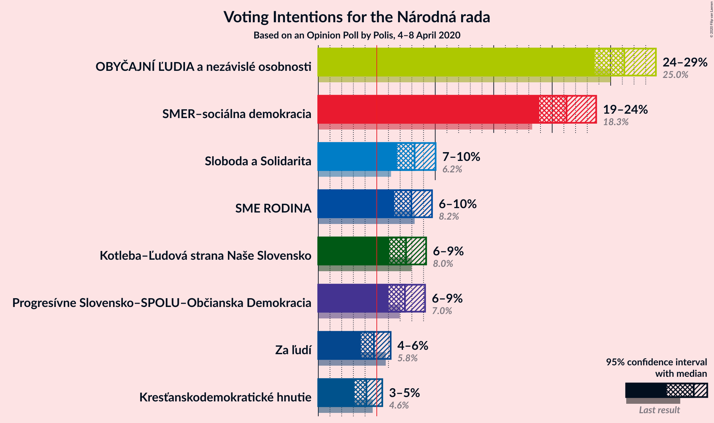

### Confidence Intervals

| Party | Last Result | Poll Result | 80% Confidence Interval | 90% Confidence Interval | 95% Confidence Interval | 99% Confidence Interval |
|:-----:|:-----------:|:-----------:|:-----------------------:|:-----------------------:|:-----------------------:|:-----------------------:|
| OBYČAJNÍ ĽUDIA a nezávislé osobnosti | 25.0% | 26.2% | 24.5–27.9% |24.0–28.4% |23.6–28.9% |22.9–29.7% |
| SMER–sociálna demokracia | 18.3% | 21.2% | 19.7–22.9% |19.3–23.4% |18.9–23.8% |18.2–24.6% |
| Sloboda a Solidarita | 6.2% | 8.2% | 7.3–9.4% |7.0–9.7% |6.7–10.0% |6.3–10.6% |
| SME RODINA | 8.2% | 8.0% | 7.0–9.1% |6.7–9.4% |6.5–9.7% |6.1–10.3% |
| Kotleba–Ľudová strana Naše Slovensko | 8.0% | 7.5% | 6.6–8.6% |6.3–8.9% |6.1–9.2% |5.7–9.8% |
| Progresívne Slovensko–SPOLU–Občianska Demokracia | 7.0% | 7.4% | 6.5–8.5% |6.2–8.8% |6.0–9.1% |5.6–9.7% |
| Za ľudí | 5.8% | 4.8% | 4.0–5.7% |3.8–6.0% |3.6–6.2% |3.3–6.7% |
| Kresťanskodemokratické hnutie | 4.6% | 4.1% | 3.4–5.0% |3.2–5.2% |3.1–5.5% |2.8–5.9% |

*Note:* The poll result column reflects the actual value used in the calculations. Published results may vary slightly, and in addition be rounded to fewer digits.

## Seats

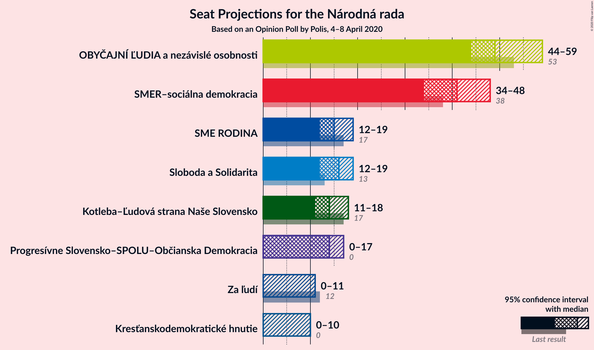

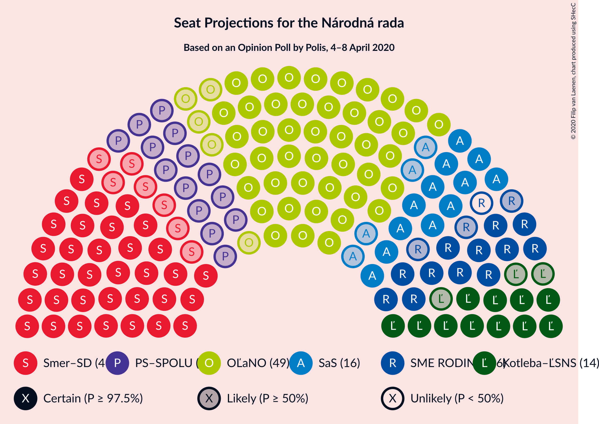

### Confidence Intervals

| Party | Last Result | Median | 80% Confidence Interval | 90% Confidence Interval | 95% Confidence Interval | 99% Confidence Interval |
|:-----:|:-----------:|:------:|:-----------------------:|:-----------------------:|:-----------------------:|:-----------------------:|
| <a href="#obyčajní-ľudia-a-nezávislé-osobnosti">OBYČAJNÍ ĽUDIA a nezávislé osobnosti</a> | 53 | 49 | 46–54 |44–58 |44–59 |41–59 |
| <a href="#smer–sociálna-demokracia">SMER–sociálna demokracia</a> | 38 | 41 | 37–46 |36–46 |34–48 |33–50 |
| <a href="#sloboda-a-solidarita">Sloboda a Solidarita</a> | 13 | 16 | 14–18 |13–18 |12–19 |11–20 |
| <a href="#sme-rodina">SME RODINA</a> | 17 | 15 | 13–17 |13–18 |12–19 |11–20 |
| <a href="#kotleba–ľudová-strana-naše-slovensko">Kotleba–Ľudová strana Naše Slovensko</a> | 17 | 14 | 12–16 |12–17 |11–18 |11–19 |
| <a href="#progresívne-slovensko–spolu–občianska-demokracia">Progresívne Slovensko–SPOLU–Občianska Demokracia</a> | 0 | 14 | 0–16 |0–16 |0–17 |0–18 |
| <a href="#za-ľudí">Za ľudí</a> | 12 | 0 | 0–10 |0–11 |0–11 |0–12 |
| <a href="#kresťanskodemokratické-hnutie">Kresťanskodemokratické hnutie</a> | 0 | 0 | 0 |0–10 |0–10 |0–11 |

### OBYČAJNÍ ĽUDIA a nezávislé osobnosti

*For a full overview of the results for this party, see the [OBYČAJNÍ ĽUDIA a nezávislé osobnosti](party-obyčajníľudiaanezávisléosobnosti.html) page.*

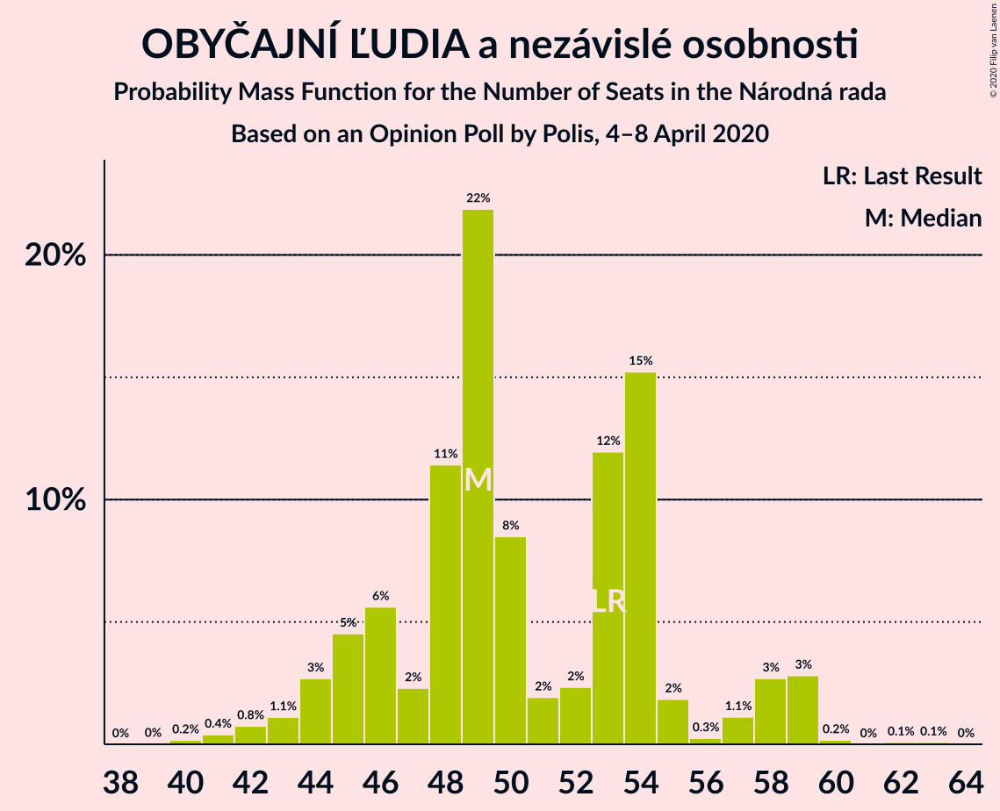

| Number of Seats | Probability | Accumulated | Special Marks |
|:---------------:|:-----------:|:-----------:|:-------------:|
| 40 | 0.2% | 100% |  |
| 41 | 0.4% | 99.8% |  |
| 42 | 0.8% | 99.4% |  |
| 43 | 1.1% | 98.6% |  |
| 44 | 3% | 98% |  |
| 45 | 5% | 95% |  |
| 46 | 6% | 90% |  |
| 47 | 2% | 85% |  |
| 48 | 11% | 82% |  |
| 49 | 22% | 71% | Median |
| 50 | 8% | 49% |  |
| 51 | 2% | 41% |  |
| 52 | 2% | 39% |  |
| 53 | 12% | 36% | Last Result |
| 54 | 15% | 24% |  |
| 55 | 2% | 9% |  |
| 56 | 0.3% | 7% |  |
| 57 | 1.1% | 7% |  |
| 58 | 3% | 6% |  |
| 59 | 3% | 3% |  |
| 60 | 0.2% | 0.4% |  |
| 61 | 0% | 0.2% |  |
| 62 | 0.1% | 0.2% |  |
| 63 | 0.1% | 0.1% |  |
| 64 | 0% | 0% |  |

### SMER–sociálna demokracia

*For a full overview of the results for this party, see the [SMER–sociálna demokracia](party-smer–sociálnademokracia.html) page.*

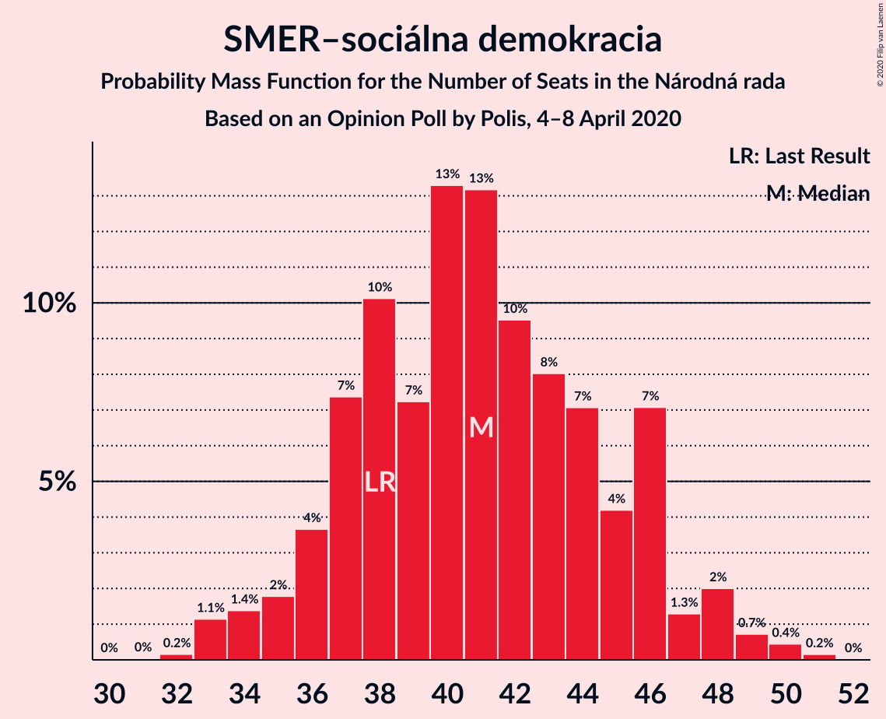

| Number of Seats | Probability | Accumulated | Special Marks |
|:---------------:|:-----------:|:-----------:|:-------------:|
| 31 | 0% | 100% |  |
| 32 | 0.2% | 99.9% |  |
| 33 | 1.1% | 99.8% |  |
| 34 | 1.4% | 98.6% |  |
| 35 | 2% | 97% |  |
| 36 | 4% | 95% |  |
| 37 | 7% | 92% |  |
| 38 | 10% | 84% | Last Result |
| 39 | 7% | 74% |  |
| 40 | 13% | 67% |  |
| 41 | 13% | 54% | Median |
| 42 | 10% | 41% |  |
| 43 | 8% | 31% |  |
| 44 | 7% | 23% |  |
| 45 | 4% | 16% |  |
| 46 | 7% | 12% |  |
| 47 | 1.3% | 5% |  |
| 48 | 2% | 3% |  |
| 49 | 0.7% | 1.4% |  |
| 50 | 0.4% | 0.6% |  |
| 51 | 0.2% | 0.2% |  |
| 52 | 0% | 0% |  |

### Sloboda a Solidarita

*For a full overview of the results for this party, see the [Sloboda a Solidarita](party-slobodaasolidarita.html) page.*

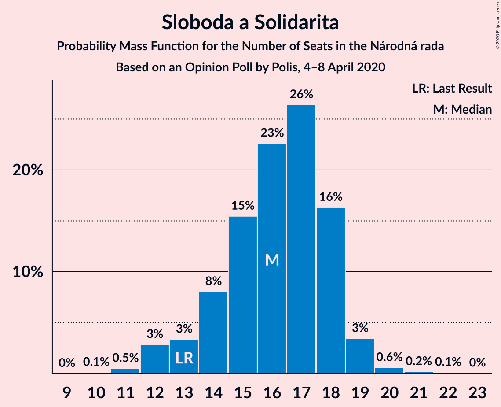

| Number of Seats | Probability | Accumulated | Special Marks |
|:---------------:|:-----------:|:-----------:|:-------------:|
| 10 | 0.1% | 100% |  |
| 11 | 0.5% | 99.9% |  |
| 12 | 3% | 99.4% |  |
| 13 | 3% | 97% | Last Result |
| 14 | 8% | 93% |  |
| 15 | 15% | 85% |  |
| 16 | 23% | 70% | Median |
| 17 | 26% | 47% |  |
| 18 | 16% | 21% |  |
| 19 | 3% | 4% |  |
| 20 | 0.6% | 0.9% |  |
| 21 | 0.2% | 0.3% |  |
| 22 | 0.1% | 0.2% |  |
| 23 | 0% | 0% |  |

### SME RODINA

*For a full overview of the results for this party, see the [SME RODINA](party-smerodina.html) page.*

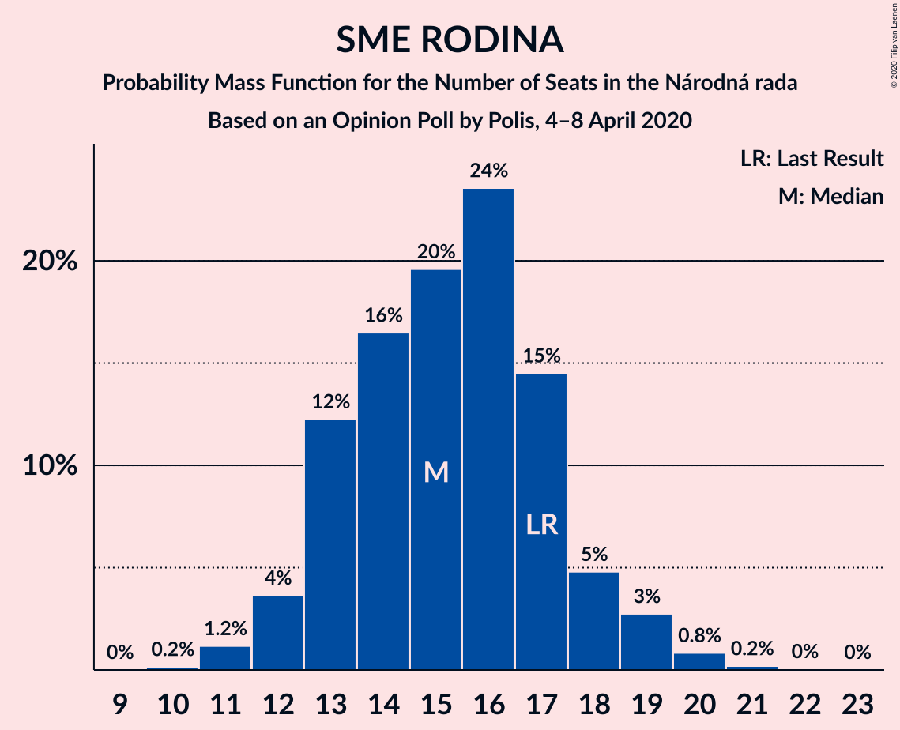

| Number of Seats | Probability | Accumulated | Special Marks |
|:---------------:|:-----------:|:-----------:|:-------------:|
| 10 | 0.2% | 100% |  |
| 11 | 1.2% | 99.8% |  |
| 12 | 4% | 98.7% |  |
| 13 | 12% | 95% |  |
| 14 | 16% | 83% |  |
| 15 | 20% | 66% | Median |
| 16 | 24% | 47% |  |
| 17 | 15% | 23% | Last Result |
| 18 | 5% | 9% |  |
| 19 | 3% | 4% |  |
| 20 | 0.8% | 1.1% |  |
| 21 | 0.2% | 0.3% |  |
| 22 | 0% | 0.1% |  |
| 23 | 0% | 0% |  |

### Kotleba–Ľudová strana Naše Slovensko

*For a full overview of the results for this party, see the [Kotleba–Ľudová strana Naše Slovensko](party-kotleba–ľudovástrananašeslovensko.html) page.*

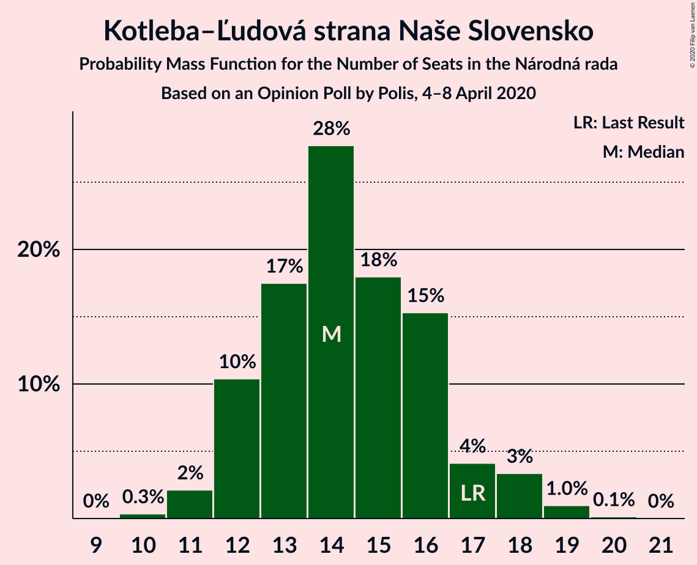

| Number of Seats | Probability | Accumulated | Special Marks |
|:---------------:|:-----------:|:-----------:|:-------------:|
| 10 | 0.3% | 100% |  |
| 11 | 2% | 99.6% |  |
| 12 | 10% | 97% |  |
| 13 | 17% | 87% |  |
| 14 | 28% | 70% | Median |
| 15 | 18% | 42% |  |
| 16 | 15% | 24% |  |
| 17 | 4% | 9% | Last Result |
| 18 | 3% | 4% |  |
| 19 | 1.0% | 1.1% |  |
| 20 | 0.1% | 0.2% |  |
| 21 | 0% | 0% |  |

### Progresívne Slovensko–SPOLU–Občianska Demokracia

*For a full overview of the results for this party, see the [Progresívne Slovensko–SPOLU–Občianska Demokracia](party-progresívneslovensko–spolu–občianskademokracia.html) page.*

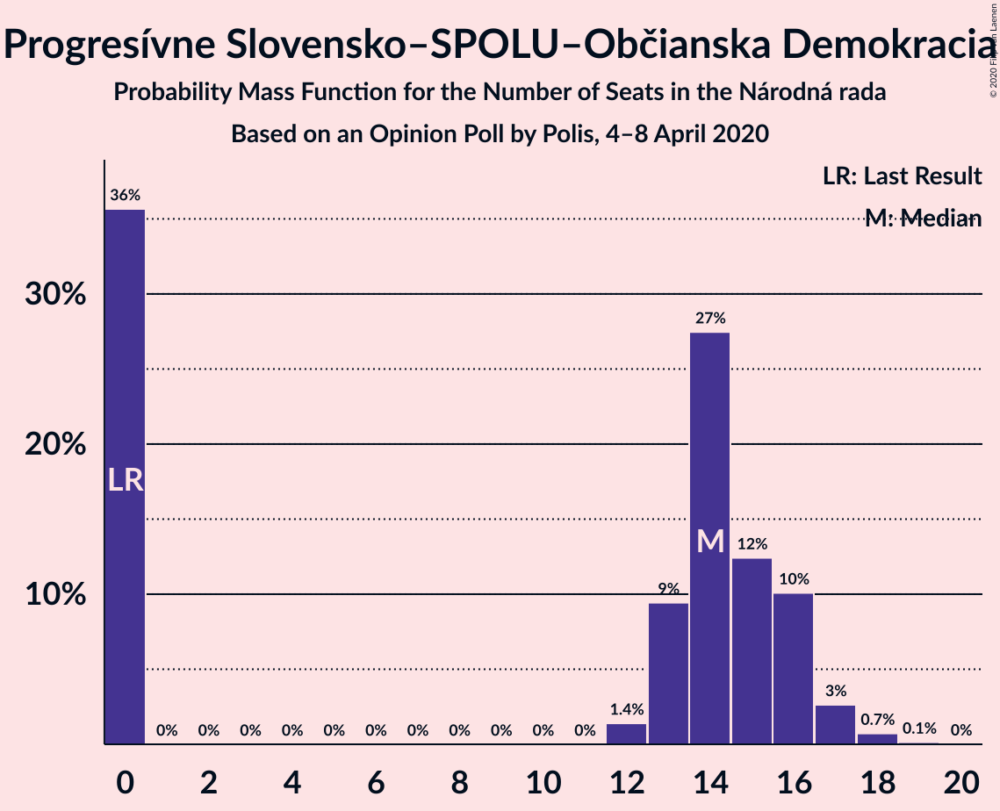

| Number of Seats | Probability | Accumulated | Special Marks |
|:---------------:|:-----------:|:-----------:|:-------------:|
| 0 | 36% | 100% | Last Result |
| 1 | 0% | 64% |  |
| 2 | 0% | 64% |  |
| 3 | 0% | 64% |  |
| 4 | 0% | 64% |  |
| 5 | 0% | 64% |  |
| 6 | 0% | 64% |  |
| 7 | 0% | 64% |  |
| 8 | 0% | 64% |  |
| 9 | 0% | 64% |  |
| 10 | 0% | 64% |  |
| 11 | 0% | 64% |  |
| 12 | 1.4% | 64% |  |
| 13 | 9% | 63% |  |
| 14 | 27% | 53% | Median |
| 15 | 12% | 26% |  |
| 16 | 10% | 14% |  |
| 17 | 3% | 4% |  |
| 18 | 0.7% | 0.9% |  |
| 19 | 0.1% | 0.2% |  |
| 20 | 0% | 0% |  |

### Za ľudí

*For a full overview of the results for this party, see the [Za ľudí](party-zaľudí.html) page.*

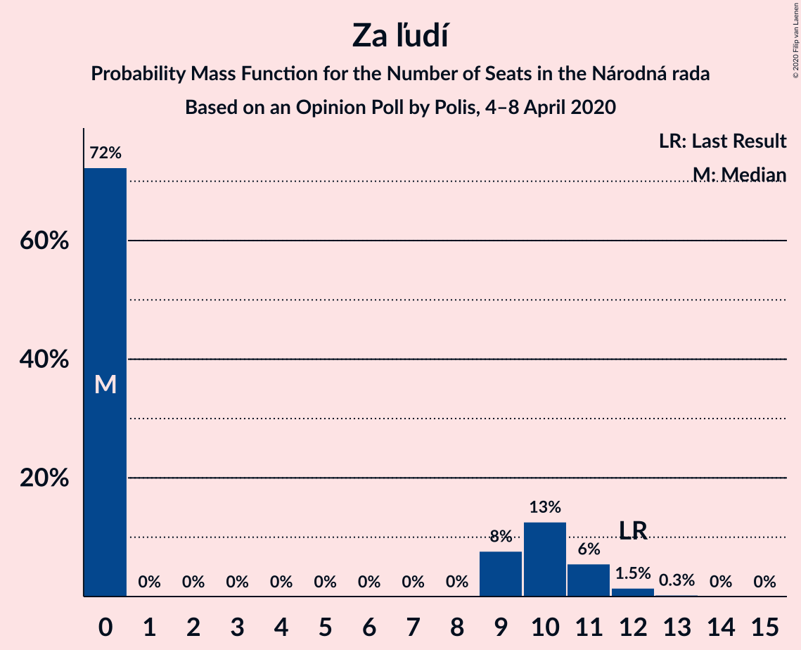

| Number of Seats | Probability | Accumulated | Special Marks |
|:---------------:|:-----------:|:-----------:|:-------------:|
| 0 | 72% | 100% | Median |
| 1 | 0% | 28% |  |
| 2 | 0% | 28% |  |
| 3 | 0% | 28% |  |
| 4 | 0% | 28% |  |
| 5 | 0% | 28% |  |
| 6 | 0% | 28% |  |
| 7 | 0% | 28% |  |
| 8 | 0% | 28% |  |
| 9 | 8% | 28% |  |
| 10 | 13% | 20% |  |
| 11 | 6% | 7% |  |
| 12 | 1.5% | 2% | Last Result |
| 13 | 0.3% | 0.3% |  |
| 14 | 0% | 0.1% |  |
| 15 | 0% | 0% |  |

### Kresťanskodemokratické hnutie

*For a full overview of the results for this party, see the [Kresťanskodemokratické hnutie](party-kresťanskodemokratickéhnutie.html) page.*

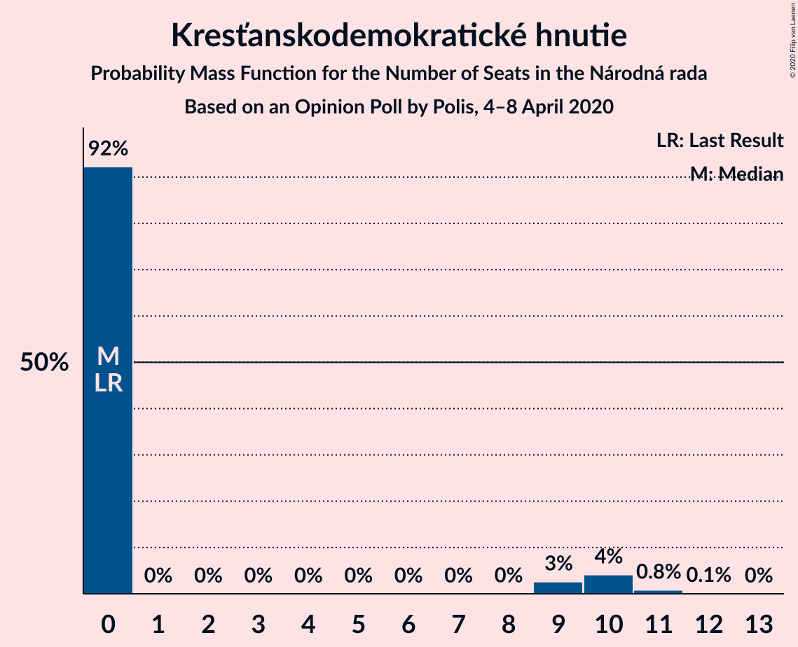

| Number of Seats | Probability | Accumulated | Special Marks |
|:---------------:|:-----------:|:-----------:|:-------------:|
| 0 | 92% | 100% | Last Result, Median |
| 1 | 0% | 8% |  |
| 2 | 0% | 8% |  |
| 3 | 0% | 8% |  |
| 4 | 0% | 8% |  |
| 5 | 0% | 8% |  |
| 6 | 0% | 8% |  |
| 7 | 0% | 8% |  |
| 8 | 0% | 8% |  |
| 9 | 3% | 8% |  |
| 10 | 4% | 5% |  |
| 11 | 0.8% | 1.0% |  |
| 12 | 0.1% | 0.1% |  |
| 13 | 0% | 0% |  |

## Coalitions

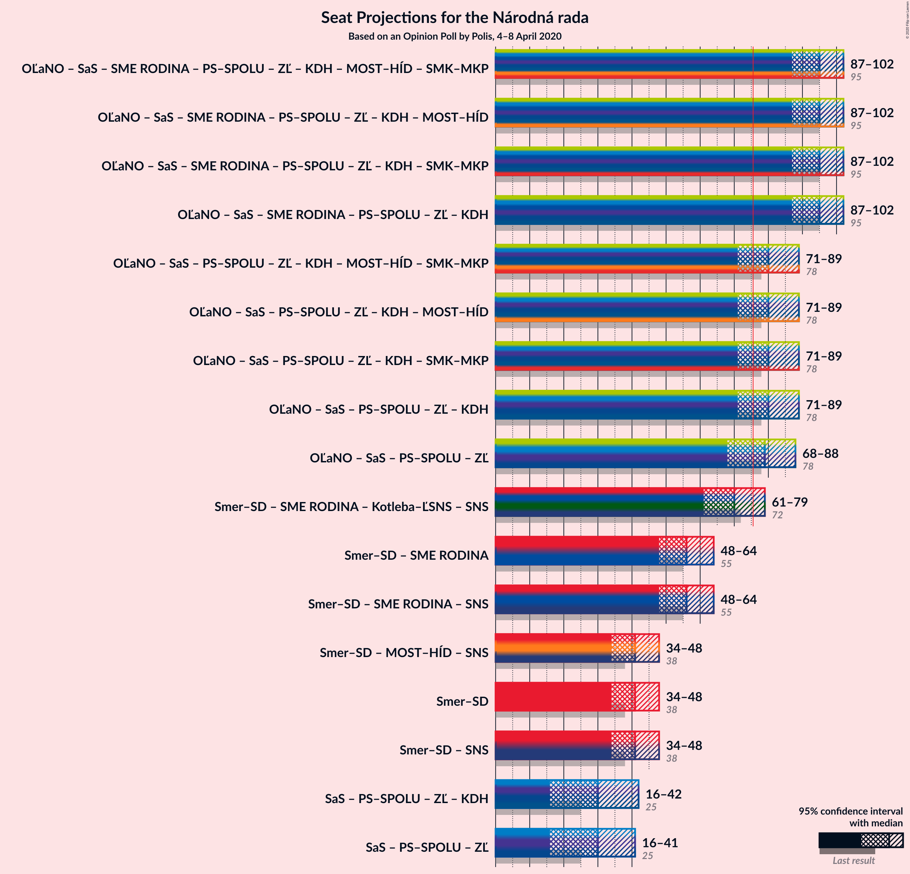

### Confidence Intervals

| Coalition | Last Result | Median | Majority? | 80% Confidence Interval | 90% Confidence Interval | 95% Confidence Interval | 99% Confidence Interval |
|:---------:|:-----------:|:------:|:---------:|:-----------------------:|:-----------------------:|:-----------------------:|:-----------------------:|
| OBYČAJNÍ ĽUDIA a nezávislé osobnosti – Sloboda a Solidarita – SME RODINA – Progresívne Slovensko–SPOLU–Občianska Demokracia – Za ľudí – Kresťanskodemokratické hnutie | 95 | 95 | 100% | 89–100 | 88–101 | 87–102 | 84–104 |
| OBYČAJNÍ ĽUDIA a nezávislé osobnosti – Sloboda a Solidarita – Progresívne Slovensko–SPOLU–Občianska Demokracia – Za ľudí – Kresťanskodemokratické hnutie | 78 | 80 | 80% | 72–85 | 71–87 | 71–89 | 68–90 |
| OBYČAJNÍ ĽUDIA a nezávislé osobnosti – Sloboda a Solidarita – Progresívne Slovensko–SPOLU–Občianska Demokracia – Za ľudí | 78 | 79 | 76% | 72–85 | 70–86 | 68–88 | 65–90 |
| SMER–sociálna demokracia – SME RODINA | 55 | 56 | 0% | 51–63 | 49–63 | 48–64 | 47–66 |
| SMER–sociálna demokracia | 38 | 41 | 0% | 37–46 | 36–46 | 34–48 | 33–50 |
| Sloboda a Solidarita – Progresívne Slovensko–SPOLU–Občianska Demokracia – Za ľudí – Kresťanskodemokratické hnutie | 25 | 30 | 0% | 18–39 | 17–41 | 16–42 | 15–45 |
| Sloboda a Solidarita – Progresívne Slovensko–SPOLU–Občianska Demokracia – Za ľudí | 25 | 30 | 0% | 17–38 | 16–39 | 16–41 | 15–43 |

### OBYČAJNÍ ĽUDIA a nezávislé osobnosti – Sloboda a Solidarita – SME RODINA – Progresívne Slovensko–SPOLU–Občianska Demokracia – Za ľudí – Kresťanskodemokratické hnutie

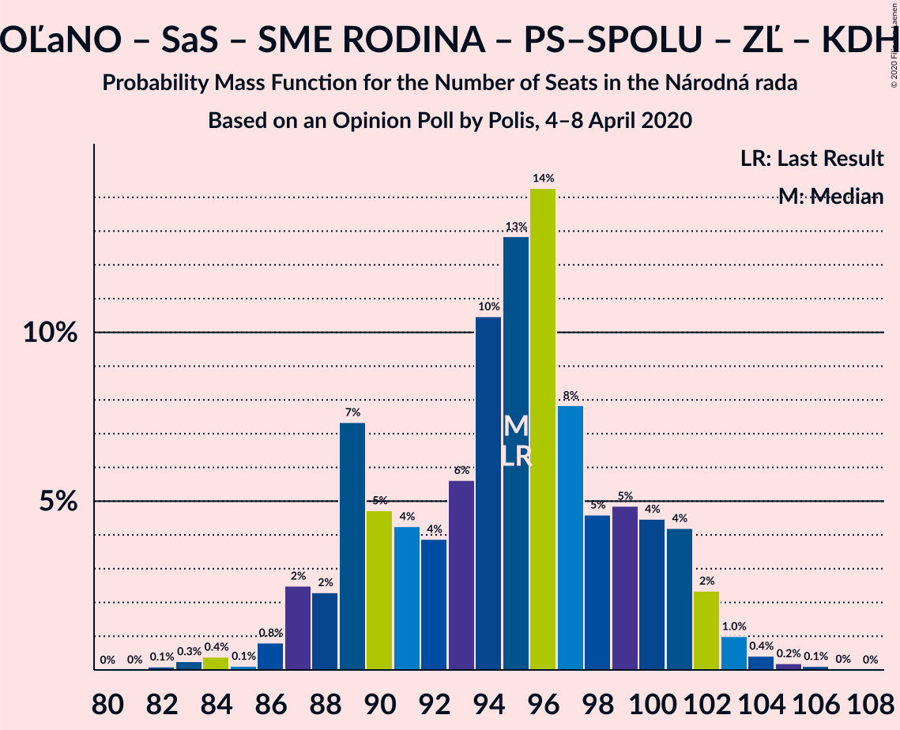

| Number of Seats | Probability | Accumulated | Special Marks |
|:---------------:|:-----------:|:-----------:|:-------------:|
| 82 | 0.1% | 100% |  |
| 83 | 0.3% | 99.9% |  |
| 84 | 0.4% | 99.6% |  |
| 85 | 0.1% | 99.2% |  |
| 86 | 0.8% | 99.1% |  |
| 87 | 2% | 98% |  |
| 88 | 2% | 96% |  |
| 89 | 7% | 94% |  |
| 90 | 5% | 86% |  |
| 91 | 4% | 81% |  |
| 92 | 4% | 77% |  |
| 93 | 6% | 73% |  |
| 94 | 10% | 68% | Median |
| 95 | 13% | 57% | Last Result |
| 96 | 14% | 44% |  |
| 97 | 8% | 30% |  |
| 98 | 5% | 22% |  |
| 99 | 5% | 18% |  |
| 100 | 4% | 13% |  |
| 101 | 4% | 8% |  |
| 102 | 2% | 4% |  |
| 103 | 1.0% | 2% |  |
| 104 | 0.4% | 0.8% |  |
| 105 | 0.2% | 0.4% |  |
| 106 | 0.1% | 0.2% |  |
| 107 | 0% | 0% |  |

### OBYČAJNÍ ĽUDIA a nezávislé osobnosti – Sloboda a Solidarita – Progresívne Slovensko–SPOLU–Občianska Demokracia – Za ľudí – Kresťanskodemokratické hnutie

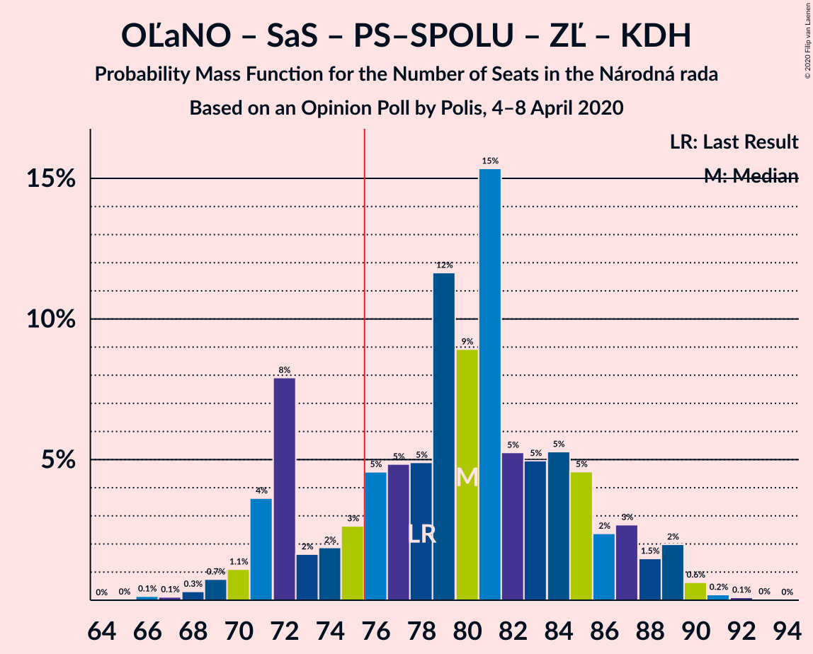

| Number of Seats | Probability | Accumulated | Special Marks |
|:---------------:|:-----------:|:-----------:|:-------------:|
| 66 | 0.1% | 100% |  |
| 67 | 0.1% | 99.8% |  |
| 68 | 0.3% | 99.7% |  |
| 69 | 0.7% | 99.4% |  |
| 70 | 1.1% | 98.6% |  |
| 71 | 4% | 98% |  |
| 72 | 8% | 94% |  |
| 73 | 2% | 86% |  |
| 74 | 2% | 84% |  |
| 75 | 3% | 82% |  |
| 76 | 5% | 80% | Majority |
| 77 | 5% | 75% |  |
| 78 | 5% | 70% | Last Result |
| 79 | 12% | 66% | Median |
| 80 | 9% | 54% |  |
| 81 | 15% | 45% |  |
| 82 | 5% | 30% |  |
| 83 | 5% | 24% |  |
| 84 | 5% | 19% |  |
| 85 | 5% | 14% |  |
| 86 | 2% | 10% |  |
| 87 | 3% | 7% |  |
| 88 | 1.5% | 4% |  |
| 89 | 2% | 3% |  |
| 90 | 0.6% | 1.0% |  |
| 91 | 0.2% | 0.4% |  |
| 92 | 0.1% | 0.2% |  |
| 93 | 0% | 0.1% |  |
| 94 | 0% | 0% |  |

### OBYČAJNÍ ĽUDIA a nezávislé osobnosti – Sloboda a Solidarita – Progresívne Slovensko–SPOLU–Občianska Demokracia – Za ľudí

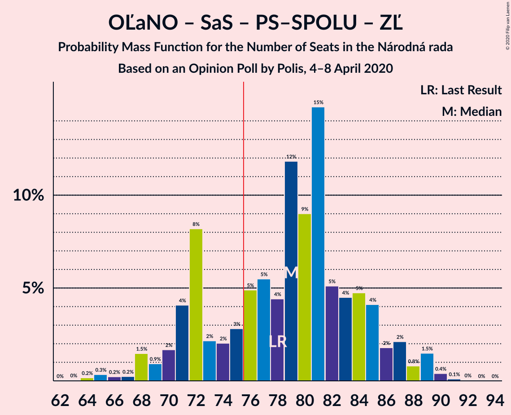

| Number of Seats | Probability | Accumulated | Special Marks |
|:---------------:|:-----------:|:-----------:|:-------------:|
| 63 | 0% | 100% |  |
| 64 | 0.2% | 99.9% |  |
| 65 | 0.3% | 99.8% |  |
| 66 | 0.2% | 99.4% |  |
| 67 | 0.2% | 99.2% |  |
| 68 | 1.5% | 99.0% |  |
| 69 | 0.9% | 97% |  |
| 70 | 2% | 97% |  |
| 71 | 4% | 95% |  |
| 72 | 8% | 91% |  |
| 73 | 2% | 83% |  |
| 74 | 2% | 80% |  |
| 75 | 3% | 78% |  |
| 76 | 5% | 76% | Majority |
| 77 | 5% | 71% |  |
| 78 | 4% | 65% | Last Result |
| 79 | 12% | 61% | Median |
| 80 | 9% | 49% |  |
| 81 | 15% | 40% |  |
| 82 | 5% | 25% |  |
| 83 | 4% | 20% |  |
| 84 | 5% | 16% |  |
| 85 | 4% | 11% |  |
| 86 | 2% | 7% |  |
| 87 | 2% | 5% |  |
| 88 | 0.8% | 3% |  |
| 89 | 1.5% | 2% |  |
| 90 | 0.4% | 0.6% |  |
| 91 | 0.1% | 0.2% |  |
| 92 | 0% | 0.1% |  |
| 93 | 0% | 0% |  |

### SMER–sociálna demokracia – SME RODINA

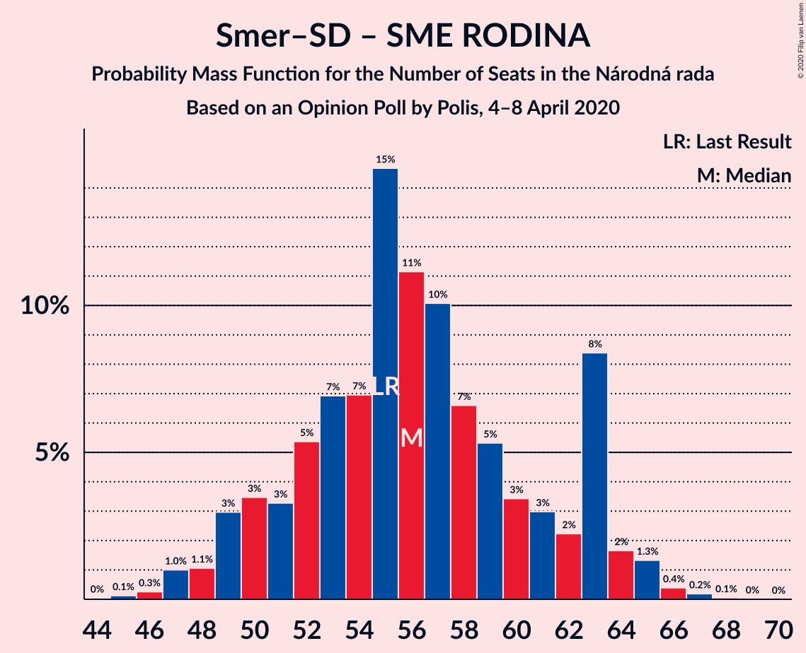

| Number of Seats | Probability | Accumulated | Special Marks |
|:---------------:|:-----------:|:-----------:|:-------------:|
| 44 | 0% | 100% |  |
| 45 | 0.1% | 99.9% |  |
| 46 | 0.3% | 99.8% |  |
| 47 | 1.0% | 99.6% |  |
| 48 | 1.1% | 98.6% |  |
| 49 | 3% | 97% |  |
| 50 | 3% | 95% |  |
| 51 | 3% | 91% |  |
| 52 | 5% | 88% |  |
| 53 | 7% | 82% |  |
| 54 | 7% | 75% |  |
| 55 | 15% | 69% | Last Result |
| 56 | 11% | 54% | Median |
| 57 | 10% | 43% |  |
| 58 | 7% | 33% |  |
| 59 | 5% | 26% |  |
| 60 | 3% | 21% |  |
| 61 | 3% | 17% |  |
| 62 | 2% | 14% |  |
| 63 | 8% | 12% |  |
| 64 | 2% | 4% |  |
| 65 | 1.3% | 2% |  |
| 66 | 0.4% | 0.7% |  |
| 67 | 0.2% | 0.3% |  |
| 68 | 0.1% | 0.1% |  |
| 69 | 0% | 0% |  |

### SMER–sociálna demokracia

| Number of Seats | Probability | Accumulated | Special Marks |
|:---------------:|:-----------:|:-----------:|:-------------:|
| 31 | 0% | 100% |  |
| 32 | 0.2% | 99.9% |  |
| 33 | 1.1% | 99.8% |  |
| 34 | 1.4% | 98.6% |  |
| 35 | 2% | 97% |  |
| 36 | 4% | 95% |  |
| 37 | 7% | 92% |  |
| 38 | 10% | 84% | Last Result |
| 39 | 7% | 74% |  |
| 40 | 13% | 67% |  |
| 41 | 13% | 54% | Median |
| 42 | 10% | 41% |  |
| 43 | 8% | 31% |  |
| 44 | 7% | 23% |  |
| 45 | 4% | 16% |  |
| 46 | 7% | 12% |  |
| 47 | 1.3% | 5% |  |
| 48 | 2% | 3% |  |
| 49 | 0.7% | 1.4% |  |
| 50 | 0.4% | 0.6% |  |
| 51 | 0.2% | 0.2% |  |
| 52 | 0% | 0% |  |

### Sloboda a Solidarita – Progresívne Slovensko–SPOLU–Občianska Demokracia – Za ľudí – Kresťanskodemokratické hnutie

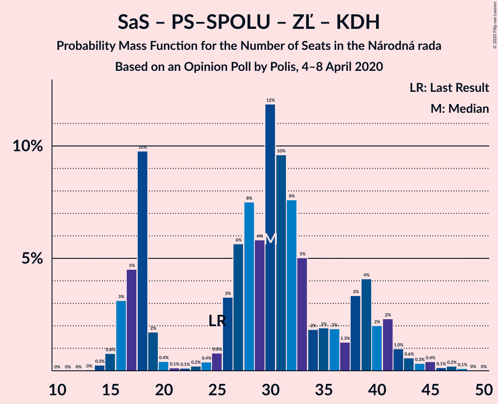

| Number of Seats | Probability | Accumulated | Special Marks |
|:---------------:|:-----------:|:-----------:|:-------------:|
| 14 | 0.3% | 100% |  |
| 15 | 0.8% | 99.7% |  |
| 16 | 3% | 98.9% |  |
| 17 | 5% | 96% |  |
| 18 | 10% | 91% |  |
| 19 | 2% | 82% |  |
| 20 | 0.4% | 80% |  |
| 21 | 0.1% | 79% |  |
| 22 | 0.1% | 79% |  |
| 23 | 0.2% | 79% |  |
| 24 | 0.4% | 79% |  |
| 25 | 0.8% | 79% | Last Result |
| 26 | 3% | 78% |  |
| 27 | 6% | 74% |  |
| 28 | 8% | 69% |  |
| 29 | 6% | 61% |  |
| 30 | 12% | 56% | Median |
| 31 | 10% | 44% |  |
| 32 | 8% | 34% |  |
| 33 | 5% | 26% |  |
| 34 | 2% | 21% |  |
| 35 | 2% | 20% |  |
| 36 | 2% | 18% |  |
| 37 | 1.3% | 16% |  |
| 38 | 3% | 15% |  |
| 39 | 4% | 11% |  |
| 40 | 2% | 7% |  |
| 41 | 2% | 5% |  |
| 42 | 1.0% | 3% |  |
| 43 | 0.6% | 2% |  |
| 44 | 0.3% | 1.2% |  |
| 45 | 0.4% | 0.9% |  |
| 46 | 0.1% | 0.5% |  |
| 47 | 0.2% | 0.3% |  |
| 48 | 0.1% | 0.1% |  |
| 49 | 0% | 0% |  |

### Sloboda a Solidarita – Progresívne Slovensko–SPOLU–Občianska Demokracia – Za ľudí

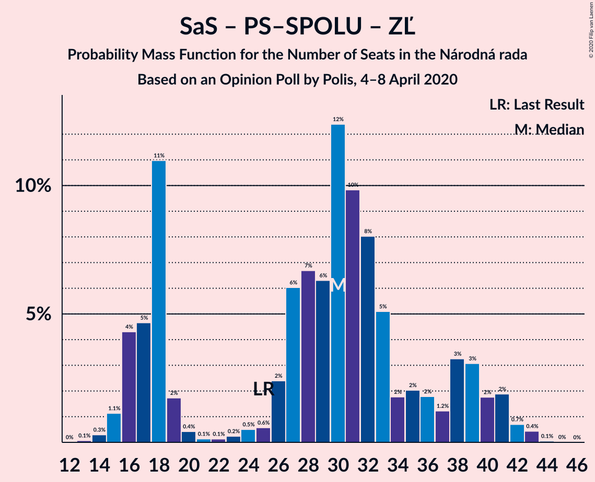

| Number of Seats | Probability | Accumulated | Special Marks |
|:---------------:|:-----------:|:-----------:|:-------------:|
| 13 | 0.1% | 100% |  |
| 14 | 0.3% | 99.9% |  |
| 15 | 1.1% | 99.6% |  |
| 16 | 4% | 98% |  |
| 17 | 5% | 94% |  |
| 18 | 11% | 90% |  |
| 19 | 2% | 79% |  |
| 20 | 0.4% | 77% |  |
| 21 | 0.1% | 76% |  |
| 22 | 0.1% | 76% |  |
| 23 | 0.2% | 76% |  |
| 24 | 0.5% | 76% |  |
| 25 | 0.6% | 75% | Last Result |
| 26 | 2% | 75% |  |
| 27 | 6% | 72% |  |
| 28 | 7% | 66% |  |
| 29 | 6% | 60% |  |
| 30 | 12% | 53% | Median |
| 31 | 10% | 41% |  |
| 32 | 8% | 31% |  |
| 33 | 5% | 23% |  |
| 34 | 2% | 18% |  |
| 35 | 2% | 16% |  |
| 36 | 2% | 14% |  |
| 37 | 1.2% | 12% |  |
| 38 | 3% | 11% |  |
| 39 | 3% | 8% |  |
| 40 | 2% | 5% |  |
| 41 | 2% | 3% |  |
| 42 | 0.7% | 1.2% |  |
| 43 | 0.4% | 0.5% |  |
| 44 | 0.1% | 0.1% |  |
| 45 | 0% | 0% |  |

## Technical Information

### Opinion Poll

+ **Polling firm:** Polis
+ **Commissioner(s):** —
+ **Fieldwork period:** 4–8 April 2020

### Calculations

+ **Sample size:** 1093
+ **Simulations done:** 1,048,576
+ **Error estimate:** 0.96%

