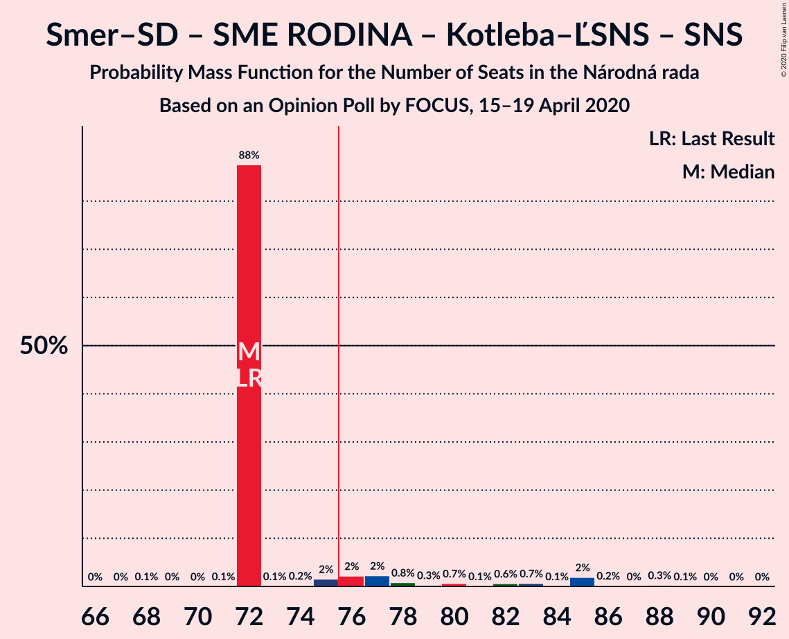

# Opinion Poll by FOCUS, 15–19 April 2020

<a href="#voting-intentions">Voting Intentions</a> | <a href="#seats">Seats</a> | <a href="#coalitions">Coalitions</a> | <a href="#technical-information">Technical Information</a>

## Voting Intentions

### Confidence Intervals

| Party | Last Result | Poll Result | 80% Confidence Interval | 90% Confidence Interval | 95% Confidence Interval | 99% Confidence Interval |
|:-----:|:-----------:|:-----------:|:-----------------------:|:-----------------------:|:-----------------------:|:-----------------------:|
| OBYČAJNÍ ĽUDIA a nezávislé osobnosti | 25.0% | 24.4% | 22.7–26.2% |22.3–26.7% |21.9–27.1% |21.1–28.0% |
| SMER–sociálna demokracia | 18.3% | 21.8% | 20.1–23.5% |19.7–24.0% |19.3–24.4% |18.6–25.2% |
| SME RODINA | 8.2% | 11.5% | 10.3–12.9% |10.0–13.3% |9.7–13.6% |9.1–14.3% |
| Kotleba–Ľudová strana Naše Slovensko | 8.0% | 9.2% | 8.1–10.4% |7.8–10.8% |7.5–11.1% |7.0–11.7% |
| Progresívne Slovensko–SPOLU–Občianska Demokracia | 7.0% | 7.6% | 6.6–8.7% |6.3–9.1% |6.1–9.4% |5.7–10.0% |
| Sloboda a Solidarita | 6.2% | 6.8% | 5.9–7.9% |5.6–8.2% |5.4–8.5% |5.0–9.1% |
| Kresťanskodemokratické hnutie | 4.6% | 4.5% | 3.8–5.5% |3.6–5.8% |3.4–6.0% |3.1–6.5% |
| Za ľudí | 5.8% | 3.2% | 2.6–4.1% |2.5–4.3% |2.3–4.5% |2.1–5.0% |
| Strana maďarskej koalície–Magyar Koalíció Pártja | 3.9% | 2.8% | 2.2–3.5% |2.0–3.8% |1.9–4.0% |1.7–4.4% |
| VLASŤ | 2.9% | 2.3% | 1.8–3.0% |1.6–3.2% |1.5–3.4% |1.3–3.8% |
| MOST–HÍD | 2.0% | 1.8% | 1.3–2.4% |1.2–2.6% |1.1–2.8% |0.9–3.1% |
| Slovenská národná strana | 3.2% | 1.6% | 1.2–2.2% |1.1–2.4% |1.0–2.5% |0.8–2.9% |
| Dobrá voľba | 3.1% | 1.1% | 0.8–1.6% |0.7–1.8% |0.6–1.9% |0.5–2.2% |

*Note:* The poll result column reflects the actual value used in the calculations. Published results may vary slightly, and in addition be rounded to fewer digits.

## Seats

### Confidence Intervals

| Party | Last Result | Median | 80% Confidence Interval | 90% Confidence Interval | 95% Confidence Interval | 99% Confidence Interval |
|:-----:|:-----------:|:------:|:-----------------------:|:-----------------------:|:-----------------------:|:-----------------------:|
| <a href="#obyčajní-ľudia-a-nezávislé-osobnosti">OBYČAJNÍ ĽUDIA a nezávislé osobnosti</a> | 53 | 43 | 43 |43–47 |42–49 |38–51 |
| <a href="#smer–sociálna-demokracia">SMER–sociálna demokracia</a> | 38 | 37 | 37–39 |37–41 |37–42 |35–45 |
| <a href="#sme-rodina">SME RODINA</a> | 17 | 20 | 20 |20–23 |19–24 |18–27 |
| <a href="#kotleba–ľudová-strana-naše-slovensko">Kotleba–Ľudová strana Naše Slovensko</a> | 17 | 15 | 15 |15–17 |14–18 |13–19 |
| <a href="#progresívne-slovensko–spolu–občianska-demokracia">Progresívne Slovensko–SPOLU–Občianska Demokracia</a> | 0 | 14 | 14 |13–14 |0–15 |0–17 |
| <a href="#sloboda-a-solidarita">Sloboda a Solidarita</a> | 13 | 12 | 12 |12–14 |12–15 |10–15 |
| <a href="#kresťanskodemokratické-hnutie">Kresťanskodemokratické hnutie</a> | 0 | 9 | 0–9 |0–9 |0–9 |0–11 |
| <a href="#za-ľudí">Za ľudí</a> | 12 | 0 | 0 |0 |0 |0 |
| <a href="#strana-maďarskej-koalície–magyar-koalíció-pártja">Strana maďarskej koalície–Magyar Koalíció Pártja</a> | 0 | 0 | 0 |0 |0 |0 |
| <a href="#vlasť">VLASŤ</a> | 0 | 0 | 0 |0 |0 |0 |
| <a href="#most–híd">MOST–HÍD</a> | 0 | 0 | 0 |0 |0 |0 |
| <a href="#slovenská-národná-strana">Slovenská národná strana</a> | 0 | 0 | 0 |0 |0 |0 |
| <a href="#dobrá-voľba">Dobrá voľba</a> | 0 | 0 | 0 |0 |0 |0 |

### OBYČAJNÍ ĽUDIA a nezávislé osobnosti

*For a full overview of the results for this party, see the [OBYČAJNÍ ĽUDIA a nezávislé osobnosti](party-obyčajníľudiaanezávisléosobnosti.html) page.*

| Number of Seats | Probability | Accumulated | Special Marks |
|:---------------:|:-----------:|:-----------:|:-------------:|
| 37 | 0.3% | 100% |  |
| 38 | 1.1% | 99.7% |  |
| 39 | 0.1% | 98.5% |  |
| 40 | 0.5% | 98% |  |
| 41 | 0.3% | 98% |  |
| 42 | 0.9% | 98% |  |
| 43 | 87% | 97% | Median |
| 44 | 0.8% | 10% |  |
| 45 | 1.3% | 9% |  |
| 46 | 1.1% | 8% |  |
| 47 | 2% | 7% |  |
| 48 | 0.1% | 4% |  |
| 49 | 2% | 4% |  |
| 50 | 2% | 2% |  |
| 51 | 0.1% | 0.6% |  |
| 52 | 0.4% | 0.4% |  |
| 53 | 0% | 0.1% | Last Result |
| 54 | 0% | 0% |  |

### SMER–sociálna demokracia

*For a full overview of the results for this party, see the [SMER–sociálna demokracia](party-smer–sociálnademokracia.html) page.*

| Number of Seats | Probability | Accumulated | Special Marks |
|:---------------:|:-----------:|:-----------:|:-------------:|
| 33 | 0% | 100% |  |
| 34 | 0% | 99.9% |  |
| 35 | 0.5% | 99.9% |  |
| 36 | 0.2% | 99.4% |  |
| 37 | 86% | 99.2% | Median |
| 38 | 2% | 13% | Last Result |
| 39 | 3% | 11% |  |
| 40 | 4% | 9% |  |
| 41 | 3% | 5% |  |
| 42 | 0.2% | 3% |  |
| 43 | 1.1% | 2% |  |
| 44 | 0.8% | 1.4% |  |
| 45 | 0.4% | 0.5% |  |
| 46 | 0.1% | 0.2% |  |
| 47 | 0% | 0.1% |  |
| 48 | 0.1% | 0.1% |  |
| 49 | 0% | 0% |  |

### SME RODINA

*For a full overview of the results for this party, see the [SME RODINA](party-smerodina.html) page.*

| Number of Seats | Probability | Accumulated | Special Marks |
|:---------------:|:-----------:|:-----------:|:-------------:|
| 16 | 0.2% | 100% |  |
| 17 | 0.1% | 99.8% | Last Result |
| 18 | 0.3% | 99.7% |  |
| 19 | 3% | 99.4% |  |
| 20 | 88% | 96% | Median |
| 21 | 2% | 8% |  |
| 22 | 1.4% | 7% |  |
| 23 | 2% | 5% |  |
| 24 | 1.0% | 3% |  |
| 25 | 0.1% | 2% |  |
| 26 | 0.5% | 2% |  |
| 27 | 2% | 2% |  |
| 28 | 0% | 0% |  |

### Kotleba–Ľudová strana Naše Slovensko

*For a full overview of the results for this party, see the [Kotleba–Ľudová strana Naše Slovensko](party-kotleba–ľudovástrananašeslovensko.html) page.*

| Number of Seats | Probability | Accumulated | Special Marks |
|:---------------:|:-----------:|:-----------:|:-------------:|
| 12 | 0% | 100% |  |
| 13 | 2% | 99.9% |  |
| 14 | 2% | 98% |  |
| 15 | 87% | 97% | Median |
| 16 | 2% | 9% |  |
| 17 | 3% | 8% | Last Result |
| 18 | 2% | 5% |  |
| 19 | 2% | 2% |  |
| 20 | 0.3% | 0.5% |  |
| 21 | 0.2% | 0.2% |  |
| 22 | 0.1% | 0.1% |  |
| 23 | 0% | 0% |  |

### Progresívne Slovensko–SPOLU–Občianska Demokracia

*For a full overview of the results for this party, see the [Progresívne Slovensko–SPOLU–Občianska Demokracia](party-progresívneslovensko–spolu–občianskademokracia.html) page.*

| Number of Seats | Probability | Accumulated | Special Marks |
|:---------------:|:-----------:|:-----------:|:-------------:|
| 0 | 3% | 100% | Last Result |
| 1 | 0% | 97% |  |
| 2 | 0% | 97% |  |
| 3 | 0% | 97% |  |
| 4 | 0% | 97% |  |
| 5 | 0% | 97% |  |
| 6 | 0% | 97% |  |
| 7 | 0% | 97% |  |
| 8 | 0% | 97% |  |
| 9 | 0% | 97% |  |
| 10 | 0% | 97% |  |
| 11 | 0% | 97% |  |
| 12 | 0% | 97% |  |
| 13 | 2% | 97% |  |
| 14 | 91% | 95% | Median |
| 15 | 1.3% | 4% |  |
| 16 | 0.9% | 2% |  |
| 17 | 1.1% | 1.4% |  |
| 18 | 0.3% | 0.3% |  |
| 19 | 0% | 0% |  |

### Sloboda a Solidarita

*For a full overview of the results for this party, see the [Sloboda a Solidarita](party-slobodaasolidarita.html) page.*

| Number of Seats | Probability | Accumulated | Special Marks |
|:---------------:|:-----------:|:-----------:|:-------------:|
| 0 | 0.3% | 100% |  |
| 1 | 0% | 99.7% |  |
| 2 | 0% | 99.7% |  |
| 3 | 0% | 99.7% |  |
| 4 | 0% | 99.7% |  |
| 5 | 0% | 99.7% |  |
| 6 | 0% | 99.7% |  |
| 7 | 0% | 99.7% |  |
| 8 | 0% | 99.7% |  |
| 9 | 0% | 99.7% |  |
| 10 | 0.7% | 99.7% |  |
| 11 | 0.7% | 99.0% |  |
| 12 | 89% | 98% | Median |
| 13 | 4% | 10% | Last Result |
| 14 | 2% | 6% |  |
| 15 | 4% | 4% |  |
| 16 | 0.1% | 0.3% |  |
| 17 | 0% | 0.2% |  |
| 18 | 0.1% | 0.2% |  |
| 19 | 0% | 0% |  |

### Kresťanskodemokratické hnutie

*For a full overview of the results for this party, see the [Kresťanskodemokratické hnutie](party-kresťanskodemokratickéhnutie.html) page.*

| Number of Seats | Probability | Accumulated | Special Marks |
|:---------------:|:-----------:|:-----------:|:-------------:|
| 0 | 12% | 100% | Last Result |
| 1 | 0% | 88% |  |
| 2 | 0% | 88% |  |
| 3 | 0% | 88% |  |
| 4 | 0% | 88% |  |
| 5 | 0% | 88% |  |
| 6 | 0% | 88% |  |
| 7 | 0% | 88% |  |
| 8 | 0% | 88% |  |
| 9 | 86% | 88% | Median |
| 10 | 1.5% | 2% |  |
| 11 | 0.1% | 0.6% |  |
| 12 | 0.1% | 0.5% |  |
| 13 | 0.3% | 0.3% |  |
| 14 | 0% | 0% |  |

### Za ľudí

*For a full overview of the results for this party, see the [Za ľudí](party-zaľudí.html) page.*

| Number of Seats | Probability | Accumulated | Special Marks |
|:---------------:|:-----------:|:-----------:|:-------------:|
| 0 | 99.6% | 100% | Median |
| 1 | 0% | 0.4% |  |
| 2 | 0% | 0.4% |  |
| 3 | 0% | 0.4% |  |
| 4 | 0% | 0.4% |  |
| 5 | 0% | 0.4% |  |
| 6 | 0% | 0.4% |  |
| 7 | 0% | 0.4% |  |
| 8 | 0% | 0.4% |  |
| 9 | 0.4% | 0.4% |  |
| 10 | 0% | 0% |  |
| 11 | 0% | 0% |  |
| 12 | 0% | 0% | Last Result |

### Strana maďarskej koalície–Magyar Koalíció Pártja

*For a full overview of the results for this party, see the [Strana maďarskej koalície–Magyar Koalíció Pártja](party-stranamaďarskejkoalície–magyarkoalíciópártja.html) page.*

| Number of Seats | Probability | Accumulated | Special Marks |
|:---------------:|:-----------:|:-----------:|:-------------:|
| 0 | 100% | 100% | Last Result, Median |

### VLASŤ

*For a full overview of the results for this party, see the [VLASŤ](party-vlasť.html) page.*

| Number of Seats | Probability | Accumulated | Special Marks |
|:---------------:|:-----------:|:-----------:|:-------------:|
| 0 | 100% | 100% | Last Result, Median |

### MOST–HÍD

*For a full overview of the results for this party, see the [MOST–HÍD](party-most–híd.html) page.*

| Number of Seats | Probability | Accumulated | Special Marks |
|:---------------:|:-----------:|:-----------:|:-------------:|
| 0 | 100% | 100% | Last Result, Median |

### Slovenská národná strana

*For a full overview of the results for this party, see the [Slovenská národná strana](party-slovenskánárodnástrana.html) page.*

| Number of Seats | Probability | Accumulated | Special Marks |
|:---------------:|:-----------:|:-----------:|:-------------:|
| 0 | 100% | 100% | Last Result, Median |

### Dobrá voľba

*For a full overview of the results for this party, see the [Dobrá voľba](party-dobrávoľba.html) page.*

| Number of Seats | Probability | Accumulated | Special Marks |
|:---------------:|:-----------:|:-----------:|:-------------:|
| 0 | 100% | 100% | Last Result, Median |

## Coalitions

### Confidence Intervals

| Coalition | Last Result | Median | Majority? | 80% Confidence Interval | 90% Confidence Interval | 95% Confidence Interval | 99% Confidence Interval |
|:---------:|:-----------:|:------:|:---------:|:-----------------------:|:-----------------------:|:-----------------------:|:-----------------------:|
| OBYČAJNÍ ĽUDIA a nezávislé osobnosti – SME RODINA – Progresívne Slovensko–SPOLU–Občianska Demokracia – Sloboda a Solidarita – Kresťanskodemokratické hnutie – Za ľudí – Strana maďarskej koalície–Magyar Koalíció Pártja – MOST–HÍD | 95 | 98 | 100% | 95–98 | 92–98 | 91–98 | 88–98 |
| OBYČAJNÍ ĽUDIA a nezávislé osobnosti – SME RODINA – Progresívne Slovensko–SPOLU–Občianska Demokracia – Sloboda a Solidarita – Kresťanskodemokratické hnutie – Za ľudí – MOST–HÍD | 95 | 98 | 100% | 95–98 | 92–98 | 91–98 | 88–98 |
| OBYČAJNÍ ĽUDIA a nezávislé osobnosti – SME RODINA – Progresívne Slovensko–SPOLU–Občianska Demokracia – Sloboda a Solidarita – Kresťanskodemokratické hnutie – Za ľudí – Strana maďarskej koalície–Magyar Koalíció Pártja | 95 | 98 | 100% | 95–98 | 92–98 | 91–98 | 88–98 |
| OBYČAJNÍ ĽUDIA a nezávislé osobnosti – SME RODINA – Progresívne Slovensko–SPOLU–Občianska Demokracia – Sloboda a Solidarita – Kresťanskodemokratické hnutie – Za ľudí | 95 | 98 | 100% | 95–98 | 92–98 | 91–98 | 88–98 |
| SMER–sociálna demokracia – SME RODINA – Kotleba–Ľudová strana Naše Slovensko – Slovenská národná strana | 72 | 72 | 10% | 72–76 | 72–79 | 72–85 | 72–86 |
| OBYČAJNÍ ĽUDIA a nezávislé osobnosti – Progresívne Slovensko–SPOLU–Občianska Demokracia – Sloboda a Solidarita – Kresťanskodemokratické hnutie – Za ľudí – Strana maďarskej koalície–Magyar Koalíció Pártja – MOST–HÍD | 78 | 78 | 88% | 74–78 | 71–78 | 65–78 | 64–78 |
| OBYČAJNÍ ĽUDIA a nezávislé osobnosti – Progresívne Slovensko–SPOLU–Občianska Demokracia – Sloboda a Solidarita – Kresťanskodemokratické hnutie – Za ľudí – MOST–HÍD | 78 | 78 | 88% | 74–78 | 71–78 | 65–78 | 64–78 |
| OBYČAJNÍ ĽUDIA a nezávislé osobnosti – Progresívne Slovensko–SPOLU–Občianska Demokracia – Sloboda a Solidarita – Kresťanskodemokratické hnutie – Za ľudí – Strana maďarskej koalície–Magyar Koalíció Pártja | 78 | 78 | 88% | 74–78 | 71–78 | 65–78 | 64–78 |
| OBYČAJNÍ ĽUDIA a nezávislé osobnosti – Progresívne Slovensko–SPOLU–Občianska Demokracia – Sloboda a Solidarita – Kresťanskodemokratické hnutie – Za ľudí | 78 | 78 | 88% | 74–78 | 71–78 | 65–78 | 64–78 |
| OBYČAJNÍ ĽUDIA a nezávislé osobnosti – Progresívne Slovensko–SPOLU–Občianska Demokracia – Sloboda a Solidarita – Za ľudí | 78 | 69 | 2% | 69 | 67–73 | 64–75 | 55–78 |
| SMER–sociálna demokracia – SME RODINA | 55 | 57 | 0% | 57–60 | 57–62 | 57–67 | 56–68 |
| SMER–sociálna demokracia – SME RODINA – Slovenská národná strana | 55 | 57 | 0% | 57–60 | 57–62 | 57–67 | 56–68 |
| SMER–sociálna demokracia – MOST–HÍD – Slovenská národná strana | 38 | 37 | 0% | 37–39 | 37–41 | 37–42 | 35–45 |
| SMER–sociálna demokracia | 38 | 37 | 0% | 37–39 | 37–41 | 37–42 | 35–45 |
| SMER–sociálna demokracia – Slovenská národná strana | 38 | 37 | 0% | 37–39 | 37–41 | 37–42 | 35–45 |
| Progresívne Slovensko–SPOLU–Občianska Demokracia – Sloboda a Solidarita – Kresťanskodemokratické hnutie – Za ľudí | 25 | 35 | 0% | 30–35 | 26–35 | 15–35 | 15–36 |
| Progresívne Slovensko–SPOLU–Občianska Demokracia – Sloboda a Solidarita – Za ľudí | 25 | 26 | 0% | 26 | 26–28 | 15–30 | 12–31 |

### OBYČAJNÍ ĽUDIA a nezávislé osobnosti – SME RODINA – Progresívne Slovensko–SPOLU–Občianska Demokracia – Sloboda a Solidarita – Kresťanskodemokratické hnutie – Za ľudí – Strana maďarskej koalície–Magyar Koalíció Pártja – MOST–HÍD

| Number of Seats | Probability | Accumulated | Special Marks |
|:---------------:|:-----------:|:-----------:|:-------------:|
| 83 | 0.1% | 100% |  |
| 84 | 0% | 99.9% |  |
| 85 | 0.1% | 99.9% |  |
| 86 | 0% | 99.7% |  |
| 87 | 0.1% | 99.7% |  |
| 88 | 1.3% | 99.6% |  |
| 89 | 0.1% | 98% |  |
| 90 | 0.4% | 98% |  |
| 91 | 0.6% | 98% |  |
| 92 | 4% | 97% |  |
| 93 | 0.9% | 93% |  |
| 94 | 0.9% | 93% |  |
| 95 | 2% | 92% | Last Result |
| 96 | 0.5% | 90% |  |
| 97 | 0.7% | 89% |  |
| 98 | 88% | 89% | Median |
| 99 | 0.1% | 0.2% |  |
| 100 | 0% | 0.1% |  |
| 101 | 0% | 0.1% |  |
| 102 | 0% | 0% |  |

### OBYČAJNÍ ĽUDIA a nezávislé osobnosti – SME RODINA – Progresívne Slovensko–SPOLU–Občianska Demokracia – Sloboda a Solidarita – Kresťanskodemokratické hnutie – Za ľudí – MOST–HÍD

| Number of Seats | Probability | Accumulated | Special Marks |
|:---------------:|:-----------:|:-----------:|:-------------:|
| 83 | 0.1% | 100% |  |
| 84 | 0% | 99.9% |  |
| 85 | 0.1% | 99.9% |  |
| 86 | 0% | 99.7% |  |
| 87 | 0.1% | 99.7% |  |
| 88 | 1.3% | 99.6% |  |
| 89 | 0.1% | 98% |  |
| 90 | 0.4% | 98% |  |
| 91 | 0.6% | 98% |  |
| 92 | 4% | 97% |  |
| 93 | 0.9% | 93% |  |
| 94 | 0.9% | 93% |  |
| 95 | 2% | 92% | Last Result |
| 96 | 0.5% | 90% |  |
| 97 | 0.7% | 89% |  |
| 98 | 88% | 89% | Median |
| 99 | 0.1% | 0.2% |  |
| 100 | 0% | 0.1% |  |
| 101 | 0% | 0.1% |  |
| 102 | 0% | 0% |  |

### OBYČAJNÍ ĽUDIA a nezávislé osobnosti – SME RODINA – Progresívne Slovensko–SPOLU–Občianska Demokracia – Sloboda a Solidarita – Kresťanskodemokratické hnutie – Za ľudí – Strana maďarskej koalície–Magyar Koalíció Pártja

| Number of Seats | Probability | Accumulated | Special Marks |
|:---------------:|:-----------:|:-----------:|:-------------:|
| 83 | 0.1% | 100% |  |
| 84 | 0% | 99.9% |  |
| 85 | 0.1% | 99.9% |  |
| 86 | 0% | 99.7% |  |
| 87 | 0.1% | 99.7% |  |
| 88 | 1.3% | 99.6% |  |
| 89 | 0.1% | 98% |  |
| 90 | 0.4% | 98% |  |
| 91 | 0.6% | 98% |  |
| 92 | 4% | 97% |  |
| 93 | 0.9% | 93% |  |
| 94 | 0.9% | 93% |  |
| 95 | 2% | 92% | Last Result |
| 96 | 0.5% | 90% |  |
| 97 | 0.7% | 89% |  |
| 98 | 88% | 89% | Median |
| 99 | 0.1% | 0.2% |  |
| 100 | 0% | 0.1% |  |
| 101 | 0% | 0.1% |  |
| 102 | 0% | 0% |  |

### OBYČAJNÍ ĽUDIA a nezávislé osobnosti – SME RODINA – Progresívne Slovensko–SPOLU–Občianska Demokracia – Sloboda a Solidarita – Kresťanskodemokratické hnutie – Za ľudí

| Number of Seats | Probability | Accumulated | Special Marks |
|:---------------:|:-----------:|:-----------:|:-------------:|
| 83 | 0.1% | 100% |  |
| 84 | 0% | 99.9% |  |
| 85 | 0.1% | 99.9% |  |
| 86 | 0% | 99.7% |  |
| 87 | 0.1% | 99.7% |  |
| 88 | 1.3% | 99.6% |  |
| 89 | 0.1% | 98% |  |
| 90 | 0.4% | 98% |  |
| 91 | 0.6% | 98% |  |
| 92 | 4% | 97% |  |
| 93 | 0.9% | 93% |  |
| 94 | 0.9% | 93% |  |
| 95 | 2% | 92% | Last Result |
| 96 | 0.5% | 90% |  |
| 97 | 0.7% | 89% |  |
| 98 | 88% | 89% | Median |
| 99 | 0.1% | 0.2% |  |
| 100 | 0% | 0.1% |  |
| 101 | 0% | 0.1% |  |
| 102 | 0% | 0% |  |

### SMER–sociálna demokracia – SME RODINA – Kotleba–Ľudová strana Naše Slovensko – Slovenská národná strana

| Number of Seats | Probability | Accumulated | Special Marks |
|:---------------:|:-----------:|:-----------:|:-------------:|
| 68 | 0.1% | 100% |  |
| 69 | 0% | 99.9% |  |
| 70 | 0% | 99.9% |  |
| 71 | 0.1% | 99.9% |  |
| 72 | 88% | 99.8% | Last Result, Median |
| 73 | 0.1% | 12% |  |
| 74 | 0.2% | 12% |  |
| 75 | 2% | 12% |  |
| 76 | 2% | 10% | Majority |
| 77 | 2% | 8% |  |
| 78 | 0.8% | 6% |  |
| 79 | 0.3% | 5% |  |
| 80 | 0.7% | 5% |  |
| 81 | 0.1% | 4% |  |
| 82 | 0.6% | 4% |  |
| 83 | 0.7% | 3% |  |
| 84 | 0.1% | 3% |  |
| 85 | 2% | 3% |  |
| 86 | 0.2% | 0.7% |  |
| 87 | 0% | 0.5% |  |
| 88 | 0.3% | 0.4% |  |
| 89 | 0.1% | 0.1% |  |
| 90 | 0% | 0.1% |  |
| 91 | 0% | 0% |  |

### OBYČAJNÍ ĽUDIA a nezávislé osobnosti – Progresívne Slovensko–SPOLU–Občianska Demokracia – Sloboda a Solidarita – Kresťanskodemokratické hnutie – Za ľudí – Strana maďarskej koalície–Magyar Koalíció Pártja – MOST–HÍD

| Number of Seats | Probability | Accumulated | Special Marks |
|:---------------:|:-----------:|:-----------:|:-------------:|
| 60 | 0% | 100% |  |
| 61 | 0.1% | 99.9% |  |
| 62 | 0.3% | 99.9% |  |
| 63 | 0% | 99.6% |  |
| 64 | 0.2% | 99.5% |  |
| 65 | 2% | 99.3% |  |
| 66 | 0.1% | 97% |  |
| 67 | 0.7% | 97% |  |
| 68 | 0.6% | 97% |  |
| 69 | 0.1% | 96% |  |
| 70 | 0.7% | 96% |  |
| 71 | 0.3% | 95% |  |
| 72 | 0.8% | 95% |  |
| 73 | 2% | 94% |  |
| 74 | 2% | 92% |  |
| 75 | 2% | 90% |  |
| 76 | 0.2% | 88% | Majority |
| 77 | 0.1% | 88% |  |
| 78 | 88% | 88% | Last Result, Median |
| 79 | 0.1% | 0.2% |  |
| 80 | 0% | 0.1% |  |
| 81 | 0% | 0.1% |  |
| 82 | 0.1% | 0.1% |  |
| 83 | 0% | 0% |  |

### OBYČAJNÍ ĽUDIA a nezávislé osobnosti – Progresívne Slovensko–SPOLU–Občianska Demokracia – Sloboda a Solidarita – Kresťanskodemokratické hnutie – Za ľudí – MOST–HÍD

| Number of Seats | Probability | Accumulated | Special Marks |
|:---------------:|:-----------:|:-----------:|:-------------:|
| 60 | 0% | 100% |  |
| 61 | 0.1% | 99.9% |  |
| 62 | 0.3% | 99.9% |  |
| 63 | 0% | 99.6% |  |
| 64 | 0.2% | 99.5% |  |
| 65 | 2% | 99.3% |  |
| 66 | 0.1% | 97% |  |
| 67 | 0.7% | 97% |  |
| 68 | 0.6% | 97% |  |
| 69 | 0.1% | 96% |  |
| 70 | 0.7% | 96% |  |
| 71 | 0.3% | 95% |  |
| 72 | 0.8% | 95% |  |
| 73 | 2% | 94% |  |
| 74 | 2% | 92% |  |
| 75 | 2% | 90% |  |
| 76 | 0.2% | 88% | Majority |
| 77 | 0.1% | 88% |  |
| 78 | 88% | 88% | Last Result, Median |
| 79 | 0.1% | 0.2% |  |
| 80 | 0% | 0.1% |  |
| 81 | 0% | 0.1% |  |
| 82 | 0.1% | 0.1% |  |
| 83 | 0% | 0% |  |

### OBYČAJNÍ ĽUDIA a nezávislé osobnosti – Progresívne Slovensko–SPOLU–Občianska Demokracia – Sloboda a Solidarita – Kresťanskodemokratické hnutie – Za ľudí – Strana maďarskej koalície–Magyar Koalíció Pártja

| Number of Seats | Probability | Accumulated | Special Marks |
|:---------------:|:-----------:|:-----------:|:-------------:|
| 60 | 0% | 100% |  |
| 61 | 0.1% | 99.9% |  |
| 62 | 0.3% | 99.9% |  |
| 63 | 0% | 99.6% |  |
| 64 | 0.2% | 99.5% |  |
| 65 | 2% | 99.3% |  |
| 66 | 0.1% | 97% |  |
| 67 | 0.7% | 97% |  |
| 68 | 0.6% | 97% |  |
| 69 | 0.1% | 96% |  |
| 70 | 0.7% | 96% |  |
| 71 | 0.3% | 95% |  |
| 72 | 0.8% | 95% |  |
| 73 | 2% | 94% |  |
| 74 | 2% | 92% |  |
| 75 | 2% | 90% |  |
| 76 | 0.2% | 88% | Majority |
| 77 | 0.1% | 88% |  |
| 78 | 88% | 88% | Last Result, Median |
| 79 | 0.1% | 0.2% |  |
| 80 | 0% | 0.1% |  |
| 81 | 0% | 0.1% |  |
| 82 | 0.1% | 0.1% |  |
| 83 | 0% | 0% |  |

### OBYČAJNÍ ĽUDIA a nezávislé osobnosti – Progresívne Slovensko–SPOLU–Občianska Demokracia – Sloboda a Solidarita – Kresťanskodemokratické hnutie – Za ľudí

| Number of Seats | Probability | Accumulated | Special Marks |
|:---------------:|:-----------:|:-----------:|:-------------:|
| 60 | 0% | 100% |  |
| 61 | 0.1% | 99.9% |  |
| 62 | 0.3% | 99.9% |  |
| 63 | 0% | 99.6% |  |
| 64 | 0.2% | 99.5% |  |
| 65 | 2% | 99.3% |  |
| 66 | 0.1% | 97% |  |
| 67 | 0.7% | 97% |  |
| 68 | 0.6% | 97% |  |
| 69 | 0.1% | 96% |  |
| 70 | 0.7% | 96% |  |
| 71 | 0.3% | 95% |  |
| 72 | 0.8% | 95% |  |
| 73 | 2% | 94% |  |
| 74 | 2% | 92% |  |
| 75 | 2% | 90% |  |
| 76 | 0.2% | 88% | Majority |
| 77 | 0.1% | 88% |  |
| 78 | 88% | 88% | Last Result, Median |
| 79 | 0.1% | 0.2% |  |
| 80 | 0% | 0.1% |  |
| 81 | 0% | 0.1% |  |
| 82 | 0.1% | 0.1% |  |
| 83 | 0% | 0% |  |

### OBYČAJNÍ ĽUDIA a nezávislé osobnosti – Progresívne Slovensko–SPOLU–Občianska Demokracia – Sloboda a Solidarita – Za ľudí

| Number of Seats | Probability | Accumulated | Special Marks |
|:---------------:|:-----------:|:-----------:|:-------------:|
| 55 | 0.6% | 100% |  |
| 56 | 0% | 99.4% |  |
| 57 | 0% | 99.4% |  |
| 58 | 0% | 99.4% |  |
| 59 | 0% | 99.3% |  |
| 60 | 0% | 99.3% |  |
| 61 | 0.2% | 99.2% |  |
| 62 | 0.3% | 99.1% |  |
| 63 | 0.3% | 98.8% |  |
| 64 | 1.2% | 98% |  |
| 65 | 2% | 97% |  |
| 66 | 0.1% | 95% |  |
| 67 | 0.9% | 95% |  |
| 68 | 0.3% | 94% |  |
| 69 | 86% | 94% | Median |
| 70 | 0.6% | 8% |  |
| 71 | 0.3% | 8% |  |
| 72 | 0.6% | 7% |  |
| 73 | 2% | 7% |  |
| 74 | 1.1% | 5% |  |
| 75 | 2% | 4% |  |
| 76 | 0% | 2% | Majority |
| 77 | 0% | 2% |  |
| 78 | 2% | 2% | Last Result |
| 79 | 0% | 0.1% |  |
| 80 | 0% | 0% |  |

### SMER–sociálna demokracia – SME RODINA

| Number of Seats | Probability | Accumulated | Special Marks |
|:---------------:|:-----------:|:-----------:|:-------------:|
| 52 | 0% | 100% |  |
| 53 | 0% | 99.9% |  |
| 54 | 0.1% | 99.9% |  |
| 55 | 0.1% | 99.8% | Last Result |
| 56 | 0.6% | 99.7% |  |
| 57 | 86% | 99.1% | Median |
| 58 | 0.4% | 13% |  |
| 59 | 2% | 13% |  |
| 60 | 2% | 10% |  |
| 61 | 3% | 8% |  |
| 62 | 0.5% | 5% |  |
| 63 | 0.8% | 5% |  |
| 64 | 0.9% | 4% |  |
| 65 | 0.2% | 3% |  |
| 66 | 0.4% | 3% |  |
| 67 | 2% | 3% |  |
| 68 | 0.2% | 0.6% |  |
| 69 | 0% | 0.4% |  |
| 70 | 0.3% | 0.4% |  |
| 71 | 0% | 0.1% |  |
| 72 | 0% | 0% |  |

### SMER–sociálna demokracia – SME RODINA – Slovenská národná strana

| Number of Seats | Probability | Accumulated | Special Marks |
|:---------------:|:-----------:|:-----------:|:-------------:|
| 52 | 0% | 100% |  |
| 53 | 0% | 99.9% |  |
| 54 | 0.1% | 99.9% |  |
| 55 | 0.1% | 99.8% | Last Result |
| 56 | 0.6% | 99.7% |  |
| 57 | 86% | 99.1% | Median |
| 58 | 0.4% | 13% |  |
| 59 | 2% | 13% |  |
| 60 | 2% | 10% |  |
| 61 | 3% | 8% |  |
| 62 | 0.5% | 5% |  |
| 63 | 0.8% | 5% |  |
| 64 | 0.9% | 4% |  |
| 65 | 0.2% | 3% |  |
| 66 | 0.4% | 3% |  |
| 67 | 2% | 3% |  |
| 68 | 0.2% | 0.6% |  |
| 69 | 0% | 0.4% |  |
| 70 | 0.3% | 0.4% |  |
| 71 | 0% | 0.1% |  |
| 72 | 0% | 0% |  |

### SMER–sociálna demokracia – MOST–HÍD – Slovenská národná strana

| Number of Seats | Probability | Accumulated | Special Marks |
|:---------------:|:-----------:|:-----------:|:-------------:|
| 33 | 0% | 100% |  |
| 34 | 0% | 99.9% |  |
| 35 | 0.5% | 99.9% |  |
| 36 | 0.2% | 99.4% |  |
| 37 | 86% | 99.2% | Median |
| 38 | 2% | 13% | Last Result |
| 39 | 3% | 11% |  |
| 40 | 4% | 9% |  |
| 41 | 3% | 5% |  |
| 42 | 0.2% | 3% |  |
| 43 | 1.1% | 2% |  |
| 44 | 0.8% | 1.4% |  |
| 45 | 0.4% | 0.5% |  |
| 46 | 0.1% | 0.2% |  |
| 47 | 0% | 0.1% |  |
| 48 | 0.1% | 0.1% |  |
| 49 | 0% | 0% |  |

### SMER–sociálna demokracia

| Number of Seats | Probability | Accumulated | Special Marks |
|:---------------:|:-----------:|:-----------:|:-------------:|
| 33 | 0% | 100% |  |
| 34 | 0% | 99.9% |  |
| 35 | 0.5% | 99.9% |  |
| 36 | 0.2% | 99.4% |  |
| 37 | 86% | 99.2% | Median |
| 38 | 2% | 13% | Last Result |
| 39 | 3% | 11% |  |
| 40 | 4% | 9% |  |
| 41 | 3% | 5% |  |
| 42 | 0.2% | 3% |  |
| 43 | 1.1% | 2% |  |
| 44 | 0.8% | 1.4% |  |
| 45 | 0.4% | 0.5% |  |
| 46 | 0.1% | 0.2% |  |
| 47 | 0% | 0.1% |  |
| 48 | 0.1% | 0.1% |  |
| 49 | 0% | 0% |  |

### SMER–sociálna demokracia – Slovenská národná strana

| Number of Seats | Probability | Accumulated | Special Marks |
|:---------------:|:-----------:|:-----------:|:-------------:|
| 33 | 0% | 100% |  |
| 34 | 0% | 99.9% |  |
| 35 | 0.5% | 99.9% |  |
| 36 | 0.2% | 99.4% |  |
| 37 | 86% | 99.2% | Median |
| 38 | 2% | 13% | Last Result |
| 39 | 3% | 11% |  |
| 40 | 4% | 9% |  |
| 41 | 3% | 5% |  |
| 42 | 0.2% | 3% |  |
| 43 | 1.1% | 2% |  |
| 44 | 0.8% | 1.4% |  |
| 45 | 0.4% | 0.5% |  |
| 46 | 0.1% | 0.2% |  |
| 47 | 0% | 0.1% |  |
| 48 | 0.1% | 0.1% |  |
| 49 | 0% | 0% |  |

### Progresívne Slovensko–SPOLU–Občianska Demokracia – Sloboda a Solidarita – Kresťanskodemokratické hnutie – Za ľudí

| Number of Seats | Probability | Accumulated | Special Marks |
|:---------------:|:-----------:|:-----------:|:-------------:|
| 12 | 0% | 100% |  |
| 13 | 0.4% | 99.9% |  |
| 14 | 0.1% | 99.6% |  |
| 15 | 2% | 99.5% |  |
| 16 | 0% | 97% |  |
| 17 | 0% | 97% |  |
| 18 | 0.1% | 97% |  |
| 19 | 0% | 97% |  |
| 20 | 0% | 97% |  |
| 21 | 0% | 97% |  |
| 22 | 0.3% | 97% |  |
| 23 | 0.1% | 97% |  |
| 24 | 0.5% | 97% |  |
| 25 | 0.4% | 96% | Last Result |
| 26 | 2% | 96% |  |
| 27 | 0.9% | 94% |  |
| 28 | 0.9% | 93% |  |
| 29 | 2% | 92% |  |
| 30 | 2% | 90% |  |
| 31 | 0.4% | 88% |  |
| 32 | 0% | 88% |  |
| 33 | 0% | 88% |  |
| 34 | 0% | 88% |  |
| 35 | 87% | 88% | Median |
| 36 | 1.2% | 1.4% |  |
| 37 | 0% | 0.2% |  |
| 38 | 0.1% | 0.2% |  |
| 39 | 0.1% | 0.1% |  |
| 40 | 0% | 0% |  |

### Progresívne Slovensko–SPOLU–Občianska Demokracia – Sloboda a Solidarita – Za ľudí

| Number of Seats | Probability | Accumulated | Special Marks |
|:---------------:|:-----------:|:-----------:|:-------------:|
| 12 | 0.5% | 100% |  |
| 13 | 0.6% | 99.5% |  |
| 14 | 0.1% | 98.9% |  |
| 15 | 2% | 98.7% |  |
| 16 | 0% | 97% |  |
| 17 | 0% | 97% |  |
| 18 | 0.2% | 97% |  |
| 19 | 0% | 96% |  |
| 20 | 0% | 96% |  |
| 21 | 0% | 96% |  |
| 22 | 0% | 96% |  |
| 23 | 0.2% | 96% |  |
| 24 | 0.5% | 96% |  |
| 25 | 0.1% | 96% | Last Result |
| 26 | 89% | 96% | Median |
| 27 | 0.9% | 6% |  |
| 28 | 0.9% | 5% |  |
| 29 | 2% | 4% |  |
| 30 | 2% | 3% |  |
| 31 | 0.4% | 0.9% |  |
| 32 | 0% | 0.4% |  |
| 33 | 0% | 0.4% |  |
| 34 | 0% | 0.4% |  |
| 35 | 0.4% | 0.4% |  |
| 36 | 0% | 0% |  |

## Technical Information

### Opinion Poll

+ **Polling firm:** FOCUS
+ **Commissioner(s):** —
+ **Fieldwork period:** 15–19 April 2020

### Calculations

+ **Sample size:** 1016
+ **Simulations done:** 1,048,576
+ **Error estimate:** 1.78%

