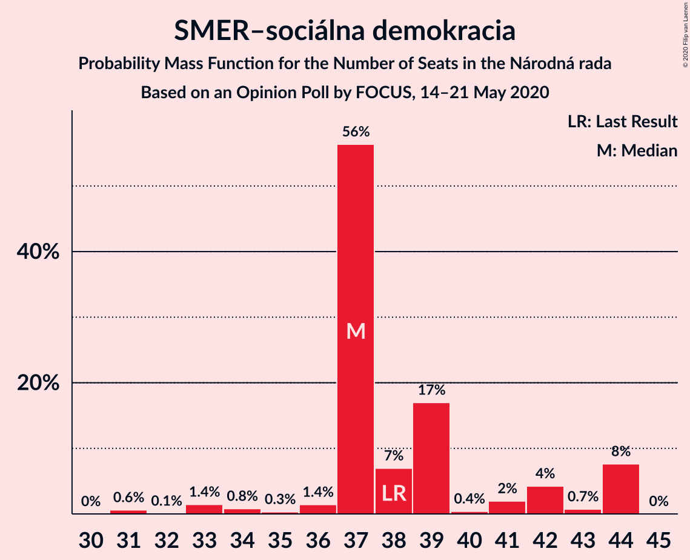
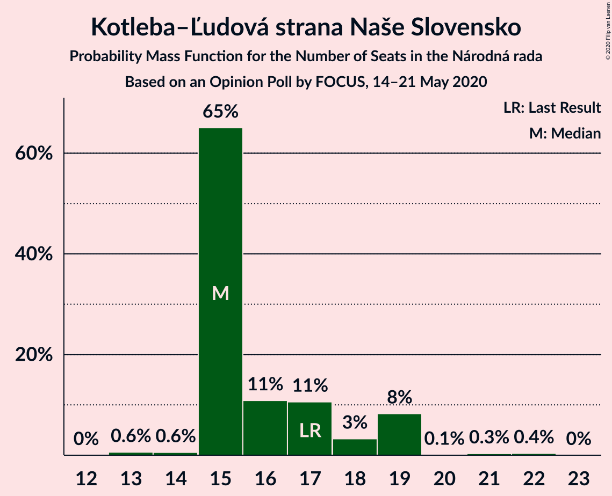
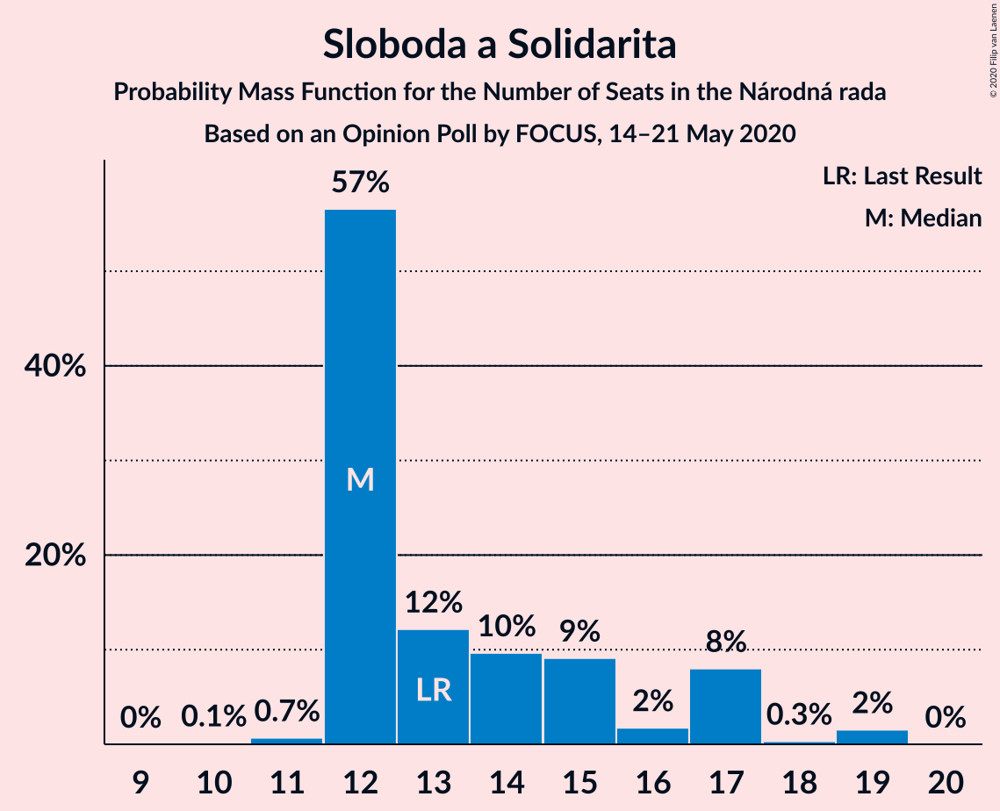
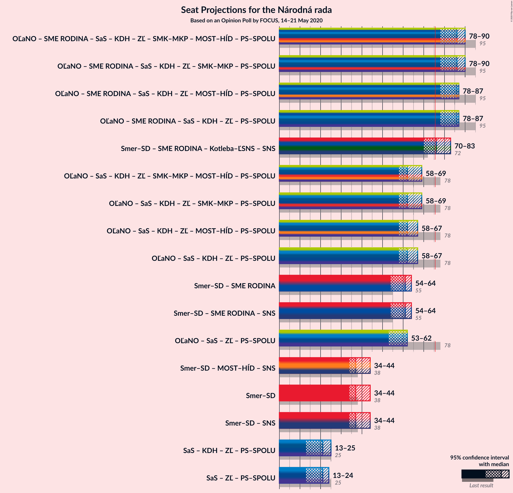
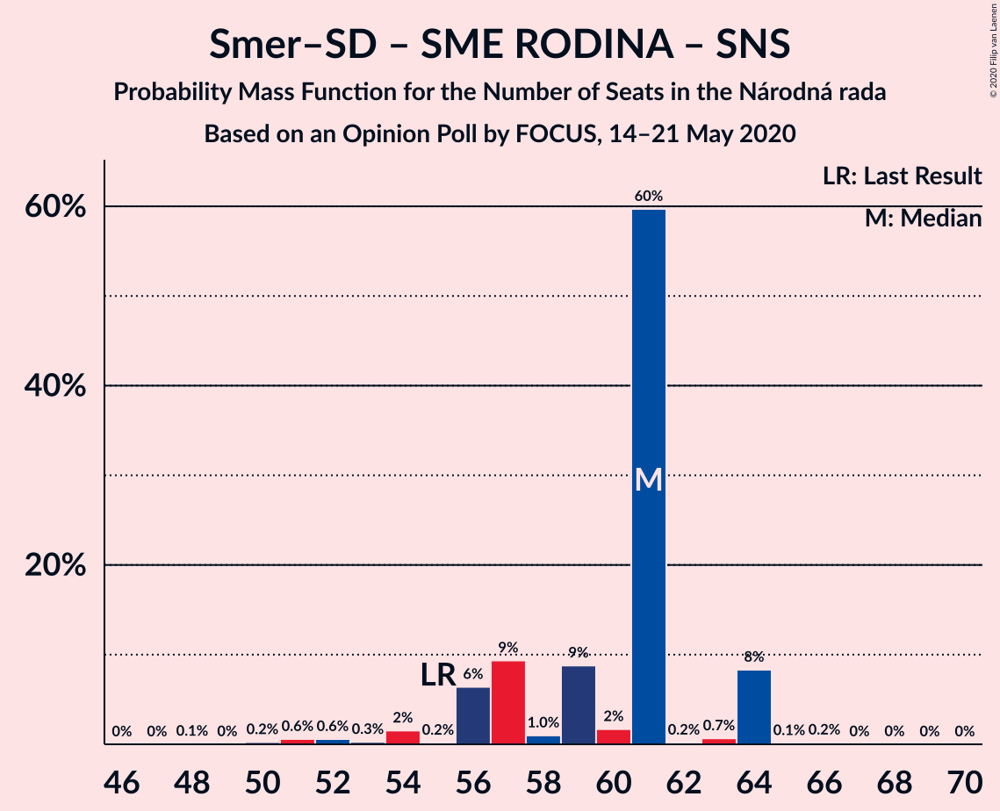

# Opinion Poll by FOCUS, 14–21 May 2020

<a href="#voting-intentions">Voting Intentions</a> | <a href="#seats">Seats</a> | <a href="#coalitions">Coalitions</a> | <a href="#technical-information">Technical Information</a>

## Voting Intentions

### Confidence Intervals

| Party | Last Result | Poll Result | 80% Confidence Interval | 90% Confidence Interval | 95% Confidence Interval | 99% Confidence Interval |
|:-----:|:-----------:|:-----------:|:-----------------------:|:-----------------------:|:-----------------------:|:-----------------------:|
| OBYČAJNÍ ĽUDIA a nezávislé osobnosti | 25.0% | 22.9% | 21.3–24.7% |20.9–25.2% |20.5–25.7% |19.7–26.5% |
| SMER–sociálna demokracia | 18.3% | 21.6% | 20.0–23.3% |19.5–23.8% |19.1–24.2% |18.4–25.1% |
| SME RODINA | 8.2% | 11.2% | 10.0–12.5% |9.7–12.9% |9.4–13.3% |8.8–14.0% |
| Kotleba–Ľudová strana Naše Slovensko | 8.0% | 9.7% | 8.6–11.0% |8.3–11.4% |8.0–11.7% |7.5–12.3% |
| Sloboda a Solidarita | 6.2% | 8.0% | 7.0–9.2% |6.7–9.6% |6.5–9.9% |6.0–10.5% |
| Progresívne Slovensko | 7.0% | 6.5% | 5.6–7.6% |5.4–8.0% |5.2–8.2% |4.8–8.8% |
| Kresťanskodemokratické hnutie | 4.6% | 4.8% | 4.1–5.8% |3.9–6.1% |3.7–6.4% |3.3–6.9% |
| Za ľudí | 5.8% | 4.3% | 3.5–5.2% |3.3–5.5% |3.2–5.7% |2.9–6.2% |
| Strana maďarskej koalície–Magyar Koalíció Pártja | 3.9% | 4.2% | 3.4–5.1% |3.2–5.3% |3.1–5.6% |2.8–6.1% |
| Dobrá voľba | 3.1% | 2.0% | 1.5–2.7% |1.4–2.9% |1.3–3.0% |1.1–3.4% |
| MOST–HÍD | 2.0% | 1.5% | 1.1–2.1% |1.0–2.3% |0.9–2.4% |0.7–2.8% |
| Slovenská národná strana | 3.2% | 1.4% | 1.0–2.0% |0.9–2.2% |0.8–2.3% |0.7–2.6% |
| VLASŤ | 2.9% | 1.3% | 0.9–1.9% |0.8–2.0% |0.7–2.2% |0.6–2.5% |
| SPOLU–Občianska Demokracia | 7.0% | 0.2% | 0.1–0.5% |0.1–0.6% |0.1–0.7% |0.0–0.9% |

*Note:* The poll result column reflects the actual value used in the calculations. Published results may vary slightly, and in addition be rounded to fewer digits.

## Seats

### Confidence Intervals

| Party | Last Result | Median | 80% Confidence Interval | 90% Confidence Interval | 95% Confidence Interval | 99% Confidence Interval |
|:-----:|:-----------:|:------:|:-----------------------:|:-----------------------:|:-----------------------:|:-----------------------:|
| <a href="#obyčajní-ľudia-a-nezávislé-osobnosti">OBYČAJNÍ ĽUDIA a nezávislé osobnosti</a> | 53 | 41 | 39–43 |38–44 |37–47 |33–47 |
| <a href="#smer–sociálna-demokracia">SMER–sociálna demokracia</a> | 38 | 37 | 37–42 |37–44 |34–44 |31–44 |
| <a href="#sme-rodina">SME RODINA</a> | 17 | 24 | 18–24 |18–24 |18–24 |17–24 |
| <a href="#kotleba–ľudová-strana-naše-slovensko">Kotleba–Ľudová strana Naše Slovensko</a> | 17 | 15 | 15–18 |15–19 |15–19 |13–21 |
| <a href="#sloboda-a-solidarita">Sloboda a Solidarita</a> | 13 | 12 | 12–16 |12–17 |12–17 |11–19 |
| <a href="#progresívne-slovensko">Progresívne Slovensko</a> | 0 | 12 | 11–14 |9–14 |9–14 |0–15 |
| <a href="#kresťanskodemokratické-hnutie">Kresťanskodemokratické hnutie</a> | 0 | 0 | 0–10 |0–11 |0–11 |0–11 |
| <a href="#za-ľudí">Za ľudí</a> | 12 | 9 | 0–9 |0–9 |0–10 |0–10 |
| <a href="#strana-maďarskej-koalície–magyar-koalíció-pártja">Strana maďarskej koalície–Magyar Koalíció Pártja</a> | 0 | 0 | 0 |0 |0 |0–9 |
| <a href="#dobrá-voľba">Dobrá voľba</a> | 0 | 0 | 0 |0 |0 |0 |
| <a href="#most–híd">MOST–HÍD</a> | 0 | 0 | 0 |0 |0 |0 |
| <a href="#slovenská-národná-strana">Slovenská národná strana</a> | 0 | 0 | 0 |0 |0 |0 |
| <a href="#vlasť">VLASŤ</a> | 0 | 0 | 0 |0 |0 |0 |
| <a href="#spolu–občianska-demokracia">SPOLU–Občianska Demokracia</a> | 0 | 0 | 0 |0 |0 |0 |

### OBYČAJNÍ ĽUDIA a nezávislé osobnosti

*For a full overview of the results for this party, see the [OBYČAJNÍ ĽUDIA a nezávislé osobnosti](party-obyčajníľudiaanezávisléosobnosti.html) page.*

| Number of Seats | Probability | Accumulated | Special Marks |
|:---------------:|:-----------:|:-----------:|:-------------:|
| 32 | 0% | 100% |  |
| 33 | 0.6% | 99.9% |  |
| 34 | 0.1% | 99.4% |  |
| 35 | 0.1% | 99.3% |  |
| 36 | 0.8% | 99.2% |  |
| 37 | 3% | 98% |  |
| 38 | 1.3% | 96% |  |
| 39 | 14% | 94% |  |
| 40 | 0.7% | 80% |  |
| 41 | 64% | 80% | Median |
| 42 | 3% | 15% |  |
| 43 | 7% | 13% |  |
| 44 | 1.3% | 6% |  |
| 45 | 0.3% | 4% |  |
| 46 | 0% | 4% |  |
| 47 | 4% | 4% |  |
| 48 | 0% | 0.2% |  |
| 49 | 0.2% | 0.2% |  |
| 50 | 0% | 0% |  |
| 51 | 0% | 0% |  |
| 52 | 0% | 0% |  |
| 53 | 0% | 0% | Last Result |

### SMER–sociálna demokracia

*For a full overview of the results for this party, see the [SMER–sociálna demokracia](party-smer–sociálnademokracia.html) page.*

| Number of Seats | Probability | Accumulated | Special Marks |
|:---------------:|:-----------:|:-----------:|:-------------:|
| 31 | 0.6% | 100% |  |
| 32 | 0.1% | 99.4% |  |
| 33 | 1.4% | 99.3% |  |
| 34 | 0.8% | 98% |  |
| 35 | 0.3% | 97% |  |
| 36 | 1.4% | 97% |  |
| 37 | 56% | 95% | Median |
| 38 | 7% | 39% | Last Result |
| 39 | 17% | 32% |  |
| 40 | 0.4% | 15% |  |
| 41 | 2% | 15% |  |
| 42 | 4% | 13% |  |
| 43 | 0.7% | 8% |  |
| 44 | 8% | 8% |  |
| 45 | 0% | 0% |  |

### SME RODINA

*For a full overview of the results for this party, see the [SME RODINA](party-smerodina.html) page.*

| Number of Seats | Probability | Accumulated | Special Marks |
|:---------------:|:-----------:|:-----------:|:-------------:|
| 14 | 0.2% | 100% |  |
| 15 | 0% | 99.8% |  |
| 16 | 0.2% | 99.8% |  |
| 17 | 0.9% | 99.6% | Last Result |
| 18 | 15% | 98.7% |  |
| 19 | 6% | 84% |  |
| 20 | 16% | 78% |  |
| 21 | 4% | 62% |  |
| 22 | 0.1% | 57% |  |
| 23 | 0.8% | 57% |  |
| 24 | 56% | 57% | Median |
| 25 | 0.1% | 0.1% |  |
| 26 | 0% | 0.1% |  |
| 27 | 0% | 0% |  |

### Kotleba–Ľudová strana Naše Slovensko

*For a full overview of the results for this party, see the [Kotleba–Ľudová strana Naše Slovensko](party-kotleba–ľudovástrananašeslovensko.html) page.*

| Number of Seats | Probability | Accumulated | Special Marks |
|:---------------:|:-----------:|:-----------:|:-------------:|
| 13 | 0.6% | 100% |  |
| 14 | 0.6% | 99.4% |  |
| 15 | 65% | 98.8% | Median |
| 16 | 11% | 34% |  |
| 17 | 11% | 23% | Last Result |
| 18 | 3% | 12% |  |
| 19 | 8% | 9% |  |
| 20 | 0.1% | 0.8% |  |
| 21 | 0.3% | 0.7% |  |
| 22 | 0.4% | 0.4% |  |
| 23 | 0% | 0% |  |

### Sloboda a Solidarita

*For a full overview of the results for this party, see the [Sloboda a Solidarita](party-slobodaasolidarita.html) page.*

| Number of Seats | Probability | Accumulated | Special Marks |
|:---------------:|:-----------:|:-----------:|:-------------:|
| 10 | 0.1% | 100% |  |
| 11 | 0.7% | 99.9% |  |
| 12 | 57% | 99.2% | Median |
| 13 | 12% | 43% | Last Result |
| 14 | 10% | 30% |  |
| 15 | 9% | 21% |  |
| 16 | 2% | 12% |  |
| 17 | 8% | 10% |  |
| 18 | 0.3% | 2% |  |
| 19 | 2% | 2% |  |
| 20 | 0% | 0% |  |

### Progresívne Slovensko

*For a full overview of the results for this party, see the [Progresívne Slovensko](party-progresívneslovensko.html) page.*

| Number of Seats | Probability | Accumulated | Special Marks |
|:---------------:|:-----------:|:-----------:|:-------------:|
| 0 | 0.5% | 100% | Last Result |
| 1 | 0% | 99.5% |  |
| 2 | 0% | 99.5% |  |
| 3 | 0% | 99.5% |  |
| 4 | 0% | 99.5% |  |
| 5 | 0% | 99.5% |  |
| 6 | 0% | 99.5% |  |
| 7 | 0% | 99.5% |  |
| 8 | 0% | 99.5% |  |
| 9 | 8% | 99.5% |  |
| 10 | 0.7% | 92% |  |
| 11 | 11% | 91% |  |
| 12 | 67% | 80% | Median |
| 13 | 1.0% | 13% |  |
| 14 | 12% | 12% |  |
| 15 | 0.5% | 0.5% |  |
| 16 | 0.1% | 0.1% |  |
| 17 | 0% | 0% |  |

### Kresťanskodemokratické hnutie

*For a full overview of the results for this party, see the [Kresťanskodemokratické hnutie](party-kresťanskodemokratickéhnutie.html) page.*

| Number of Seats | Probability | Accumulated | Special Marks |
|:---------------:|:-----------:|:-----------:|:-------------:|
| 0 | 75% | 100% | Last Result, Median |
| 1 | 0% | 25% |  |
| 2 | 0% | 25% |  |
| 3 | 0% | 25% |  |
| 4 | 0% | 25% |  |
| 5 | 0% | 25% |  |
| 6 | 0% | 25% |  |
| 7 | 0% | 25% |  |
| 8 | 0.8% | 25% |  |
| 9 | 8% | 24% |  |
| 10 | 10% | 16% |  |
| 11 | 7% | 7% |  |
| 12 | 0.2% | 0.3% |  |
| 13 | 0.1% | 0.1% |  |
| 14 | 0% | 0% |  |

### Za ľudí

*For a full overview of the results for this party, see the [Za ľudí](party-zaľudí.html) page.*

| Number of Seats | Probability | Accumulated | Special Marks |
|:---------------:|:-----------:|:-----------:|:-------------:|
| 0 | 39% | 100% |  |
| 1 | 0% | 61% |  |
| 2 | 0% | 61% |  |
| 3 | 0% | 61% |  |
| 4 | 0% | 61% |  |
| 5 | 0% | 61% |  |
| 6 | 0% | 61% |  |
| 7 | 0% | 61% |  |
| 8 | 0.3% | 61% |  |
| 9 | 58% | 61% | Median |
| 10 | 3% | 3% |  |
| 11 | 0.1% | 0.1% |  |
| 12 | 0% | 0% | Last Result |

### Strana maďarskej koalície–Magyar Koalíció Pártja

*For a full overview of the results for this party, see the [Strana maďarskej koalície–Magyar Koalíció Pártja](party-stranamaďarskejkoalície–magyarkoalíciópártja.html) page.*

| Number of Seats | Probability | Accumulated | Special Marks |
|:---------------:|:-----------:|:-----------:|:-------------:|
| 0 | 98% | 100% | Last Result, Median |
| 1 | 0% | 2% |  |
| 2 | 0% | 2% |  |
| 3 | 0% | 2% |  |
| 4 | 0% | 2% |  |
| 5 | 0% | 2% |  |
| 6 | 0% | 2% |  |
| 7 | 0% | 2% |  |
| 8 | 0.7% | 2% |  |
| 9 | 1.1% | 2% |  |
| 10 | 0.4% | 0.5% |  |
| 11 | 0% | 0% |  |

### Dobrá voľba

*For a full overview of the results for this party, see the [Dobrá voľba](party-dobrávoľba.html) page.*

| Number of Seats | Probability | Accumulated | Special Marks |
|:---------------:|:-----------:|:-----------:|:-------------:|
| 0 | 100% | 100% | Last Result, Median |

### MOST–HÍD

*For a full overview of the results for this party, see the [MOST–HÍD](party-most–híd.html) page.*

| Number of Seats | Probability | Accumulated | Special Marks |
|:---------------:|:-----------:|:-----------:|:-------------:|
| 0 | 100% | 100% | Last Result, Median |

### Slovenská národná strana

*For a full overview of the results for this party, see the [Slovenská národná strana](party-slovenskánárodnástrana.html) page.*

| Number of Seats | Probability | Accumulated | Special Marks |
|:---------------:|:-----------:|:-----------:|:-------------:|
| 0 | 100% | 100% | Last Result, Median |

### VLASŤ

*For a full overview of the results for this party, see the [VLASŤ](party-vlasť.html) page.*

| Number of Seats | Probability | Accumulated | Special Marks |
|:---------------:|:-----------:|:-----------:|:-------------:|
| 0 | 100% | 100% | Last Result, Median |

### SPOLU–Občianska Demokracia

*For a full overview of the results for this party, see the [SPOLU–Občianska Demokracia](party-spolu–občianskademokracia.html) page.*

| Number of Seats | Probability | Accumulated | Special Marks |
|:---------------:|:-----------:|:-----------:|:-------------:|
| 0 | 100% | 100% | Last Result, Median |

## Coalitions

### Confidence Intervals

| Coalition | Last Result | Median | Majority? | 80% Confidence Interval | 90% Confidence Interval | 95% Confidence Interval | 99% Confidence Interval |
|:---------:|:-----------:|:------:|:---------:|:-----------------------:|:-----------------------:|:-----------------------:|:-----------------------:|
| SMER–sociálna demokracia – SME RODINA – Kotleba–Ľudová strana Naše Slovensko – Slovenská národná strana | 72 | 76 | 77% | 72–78 | 72–83 | 70–83 | 65–84 |
| SMER–sociálna demokracia – SME RODINA | 55 | 61 | 0% | 57–61 | 56–64 | 54–64 | 51–64 |
| SMER–sociálna demokracia – SME RODINA – Slovenská národná strana | 55 | 61 | 0% | 57–61 | 56–64 | 54–64 | 51–64 |
| SMER–sociálna demokracia – MOST–HÍD – Slovenská národná strana | 38 | 37 | 0% | 37–42 | 37–44 | 34–44 | 31–44 |
| SMER–sociálna demokracia | 38 | 37 | 0% | 37–42 | 37–44 | 34–44 | 31–44 |
| SMER–sociálna demokracia – Slovenská národná strana | 38 | 37 | 0% | 37–42 | 37–44 | 34–44 | 31–44 |

### SMER–sociálna demokracia – SME RODINA – Kotleba–Ľudová strana Naše Slovensko – Slovenská národná strana

| Number of Seats | Probability | Accumulated | Special Marks |
|:---------------:|:-----------:|:-----------:|:-------------:|
| 64 | 0% | 100% |  |
| 65 | 0.8% | 99.9% |  |
| 66 | 0% | 99.2% |  |
| 67 | 0.1% | 99.1% |  |
| 68 | 0.1% | 99.1% |  |
| 69 | 0.8% | 99.0% |  |
| 70 | 1.5% | 98% |  |
| 71 | 0.2% | 97% |  |
| 72 | 14% | 97% | Last Result |
| 73 | 0.8% | 82% |  |
| 74 | 0.9% | 81% |  |
| 75 | 3% | 80% |  |
| 76 | 62% | 77% | Median, Majority |
| 77 | 0.3% | 16% |  |
| 78 | 5% | 15% |  |
| 79 | 0.1% | 10% |  |
| 80 | 0.8% | 10% |  |
| 81 | 0.2% | 9% |  |
| 82 | 0.1% | 9% |  |
| 83 | 8% | 9% |  |
| 84 | 0.5% | 0.6% |  |
| 85 | 0% | 0.1% |  |
| 86 | 0% | 0.1% |  |
| 87 | 0% | 0.1% |  |
| 88 | 0% | 0% |  |

### SMER–sociálna demokracia – SME RODINA

| Number of Seats | Probability | Accumulated | Special Marks |
|:---------------:|:-----------:|:-----------:|:-------------:|
| 48 | 0.1% | 100% |  |
| 49 | 0% | 99.9% |  |
| 50 | 0.2% | 99.9% |  |
| 51 | 0.6% | 99.7% |  |
| 52 | 0.6% | 99.1% |  |
| 53 | 0.3% | 98% |  |
| 54 | 2% | 98% |  |
| 55 | 0.2% | 97% | Last Result |
| 56 | 6% | 97% |  |
| 57 | 9% | 90% |  |
| 58 | 1.0% | 81% |  |
| 59 | 9% | 80% |  |
| 60 | 2% | 71% |  |
| 61 | 60% | 69% | Median |
| 62 | 0.2% | 10% |  |
| 63 | 0.7% | 9% |  |
| 64 | 8% | 9% |  |
| 65 | 0.1% | 0.4% |  |
| 66 | 0.2% | 0.3% |  |
| 67 | 0% | 0.1% |  |
| 68 | 0% | 0.1% |  |
| 69 | 0% | 0% |  |

### SMER–sociálna demokracia – SME RODINA – Slovenská národná strana

| Number of Seats | Probability | Accumulated | Special Marks |
|:---------------:|:-----------:|:-----------:|:-------------:|
| 48 | 0.1% | 100% |  |
| 49 | 0% | 99.9% |  |
| 50 | 0.2% | 99.9% |  |
| 51 | 0.6% | 99.7% |  |
| 52 | 0.6% | 99.1% |  |
| 53 | 0.3% | 98% |  |
| 54 | 2% | 98% |  |
| 55 | 0.2% | 97% | Last Result |
| 56 | 6% | 97% |  |
| 57 | 9% | 90% |  |
| 58 | 1.0% | 81% |  |
| 59 | 9% | 80% |  |
| 60 | 2% | 71% |  |
| 61 | 60% | 69% | Median |
| 62 | 0.2% | 10% |  |
| 63 | 0.7% | 9% |  |
| 64 | 8% | 9% |  |
| 65 | 0.1% | 0.4% |  |
| 66 | 0.2% | 0.3% |  |
| 67 | 0% | 0.1% |  |
| 68 | 0% | 0.1% |  |
| 69 | 0% | 0% |  |

### SMER–sociálna demokracia – MOST–HÍD – Slovenská národná strana

| Number of Seats | Probability | Accumulated | Special Marks |
|:---------------:|:-----------:|:-----------:|:-------------:|
| 31 | 0.6% | 100% |  |
| 32 | 0.1% | 99.4% |  |
| 33 | 1.4% | 99.3% |  |
| 34 | 0.8% | 98% |  |
| 35 | 0.3% | 97% |  |
| 36 | 1.4% | 97% |  |
| 37 | 56% | 95% | Median |
| 38 | 7% | 39% | Last Result |
| 39 | 17% | 32% |  |
| 40 | 0.4% | 15% |  |
| 41 | 2% | 15% |  |
| 42 | 4% | 13% |  |
| 43 | 0.7% | 8% |  |
| 44 | 8% | 8% |  |
| 45 | 0% | 0% |  |

### SMER–sociálna demokracia

| Number of Seats | Probability | Accumulated | Special Marks |
|:---------------:|:-----------:|:-----------:|:-------------:|
| 31 | 0.6% | 100% |  |
| 32 | 0.1% | 99.4% |  |
| 33 | 1.4% | 99.3% |  |
| 34 | 0.8% | 98% |  |
| 35 | 0.3% | 97% |  |
| 36 | 1.4% | 97% |  |
| 37 | 56% | 95% | Median |
| 38 | 7% | 39% | Last Result |
| 39 | 17% | 32% |  |
| 40 | 0.4% | 15% |  |
| 41 | 2% | 15% |  |
| 42 | 4% | 13% |  |
| 43 | 0.7% | 8% |  |
| 44 | 8% | 8% |  |
| 45 | 0% | 0% |  |

### SMER–sociálna demokracia – Slovenská národná strana

| Number of Seats | Probability | Accumulated | Special Marks |
|:---------------:|:-----------:|:-----------:|:-------------:|
| 31 | 0.6% | 100% |  |
| 32 | 0.1% | 99.4% |  |
| 33 | 1.4% | 99.3% |  |
| 34 | 0.8% | 98% |  |
| 35 | 0.3% | 97% |  |
| 36 | 1.4% | 97% |  |
| 37 | 56% | 95% | Median |
| 38 | 7% | 39% | Last Result |
| 39 | 17% | 32% |  |
| 40 | 0.4% | 15% |  |
| 41 | 2% | 15% |  |
| 42 | 4% | 13% |  |
| 43 | 0.7% | 8% |  |
| 44 | 8% | 8% |  |
| 45 | 0% | 0% |  |

## Technical Information

### Opinion Poll

+ **Polling firm:** FOCUS
+ **Commissioner(s):** —
+ **Fieldwork period:** 14–21 May 2020

### Calculations

+ **Sample size:** 1011
+ **Simulations done:** 1,048,576
+ **Error estimate:** 3.02%

