# Opinion Poll by Polis, 23–27 May 2020

<a href="#voting-intentions">Voting Intentions</a> | <a href="#seats">Seats</a> | <a href="#coalitions">Coalitions</a> | <a href="#technical-information">Technical Information</a>

## Voting Intentions

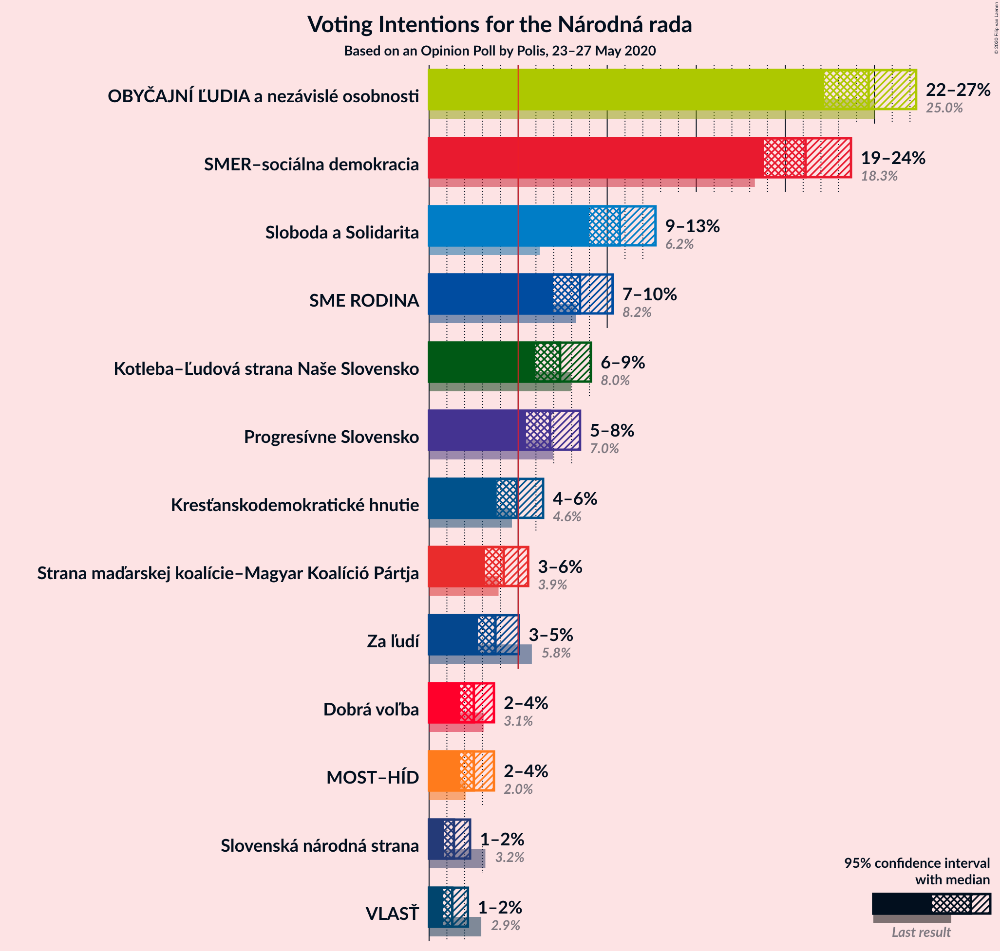

### Confidence Intervals

| Party | Last Result | Poll Result | 80% Confidence Interval | 90% Confidence Interval | 95% Confidence Interval | 99% Confidence Interval |
|:-----:|:-----------:|:-----------:|:-----------------------:|:-----------------------:|:-----------------------:|:-----------------------:|
| OBYČAJNÍ ĽUDIA a nezávislé osobnosti | 25.0% | 24.7% | 23.0–26.4% |22.6–26.9% |22.2–27.3% |21.4–28.2% |
| SMER–sociálna demokracia | 18.3% | 21.1% | 19.6–22.8% |19.2–23.3% |18.8–23.7% |18.1–24.5% |
| Sloboda a Solidarita | 6.2% | 10.7% | 9.6–12.0% |9.3–12.4% |9.0–12.7% |8.5–13.4% |
| SME RODINA | 8.2% | 8.5% | 7.5–9.7% |7.2–10.0% |7.0–10.3% |6.5–10.9% |
| Kotleba–Ľudová strana Naše Slovensko | 8.0% | 7.4% | 6.4–8.5% |6.2–8.8% |5.9–9.1% |5.5–9.6% |
| Progresívne Slovensko | 7.0% | 6.8% | 5.9–7.9% |5.7–8.2% |5.4–8.5% |5.0–9.0% |
| Kresťanskodemokratické hnutie | 4.6% | 4.9% | 4.2–5.9% |4.0–6.2% |3.8–6.4% |3.5–6.9% |
| Strana maďarskej koalície–Magyar Koalíció Pártja | 3.9% | 4.2% | 3.5–5.1% |3.3–5.3% |3.1–5.6% |2.8–6.0% |
| Za ľudí | 5.8% | 3.7% | 3.1–4.6% |2.9–4.8% |2.7–5.0% |2.5–5.5% |
| MOST–HÍD | 2.0% | 2.5% | 2.0–3.2% |1.8–3.5% |1.7–3.6% |1.5–4.0% |
| Dobrá voľba | 3.1% | 2.5% | 2.0–3.2% |1.8–3.5% |1.7–3.6% |1.5–4.0% |
| Slovenská národná strana | 3.2% | 1.4% | 1.0–2.0% |0.9–2.1% |0.8–2.3% |0.7–2.6% |
| VLASŤ | 2.9% | 1.3% | 0.9–1.9% |0.9–2.0% |0.8–2.2% |0.6–2.5% |

*Note:* The poll result column reflects the actual value used in the calculations. Published results may vary slightly, and in addition be rounded to fewer digits.

## Seats

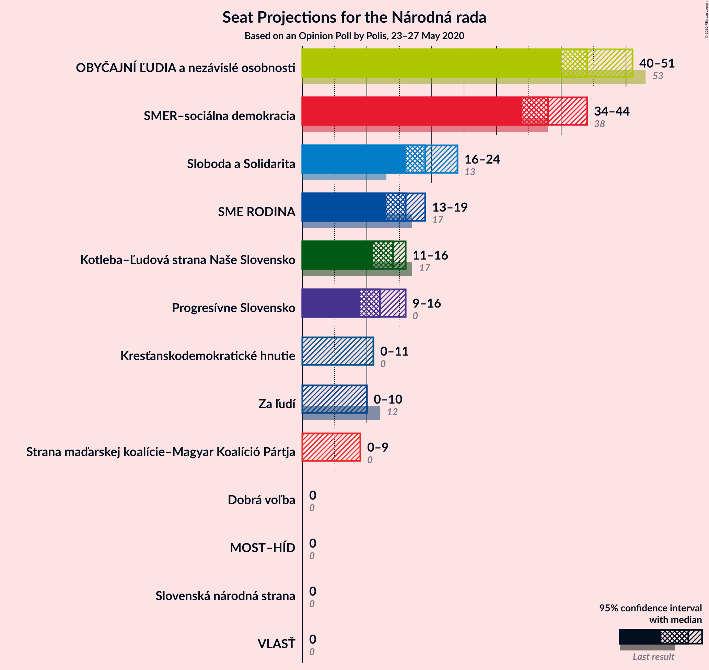

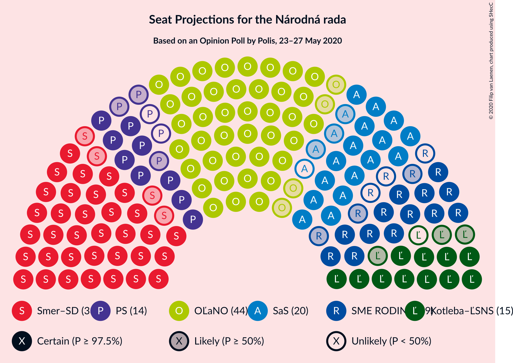

### Confidence Intervals

| Party | Last Result | Median | 80% Confidence Interval | 90% Confidence Interval | 95% Confidence Interval | 99% Confidence Interval |
|:-----:|:-----------:|:------:|:-----------------------:|:-----------------------:|:-----------------------:|:-----------------------:|
| <a href="#obyčajní-ľudia-a-nezávislé-osobnosti">OBYČAJNÍ ĽUDIA a nezávislé osobnosti</a> | 53 | 44 | 40–49 |40–49 |40–51 |38–52 |
| <a href="#smer–sociálna-demokracia">SMER–sociálna demokracia</a> | 38 | 38 | 34–41 |34–42 |34–44 |32–45 |
| <a href="#sloboda-a-solidarita">Sloboda a Solidarita</a> | 13 | 19 | 18–21 |17–23 |16–24 |15–24 |
| <a href="#sme-rodina">SME RODINA</a> | 17 | 16 | 14–19 |14–19 |13–19 |12–19 |
| <a href="#kotleba–ľudová-strana-naše-slovensko">Kotleba–Ľudová strana Naše Slovensko</a> | 17 | 14 | 11–15 |11–16 |11–16 |10–17 |
| <a href="#progresívne-slovensko">Progresívne Slovensko</a> | 0 | 12 | 9–14 |9–14 |9–16 |9–17 |
| <a href="#kresťanskodemokratické-hnutie">Kresťanskodemokratické hnutie</a> | 0 | 0 | 0–10 |0–10 |0–11 |0–11 |
| <a href="#strana-maďarskej-koalície–magyar-koalíció-pártja">Strana maďarskej koalície–Magyar Koalíció Pártja</a> | 0 | 0 | 0–9 |0–9 |0–9 |0–10 |
| <a href="#za-ľudí">Za ľudí</a> | 12 | 0 | 0 |0–9 |0–10 |0–10 |
| <a href="#most–híd">MOST–HÍD</a> | 0 | 0 | 0 |0 |0 |0 |
| <a href="#dobrá-voľba">Dobrá voľba</a> | 0 | 0 | 0 |0 |0 |0 |
| <a href="#slovenská-národná-strana">Slovenská národná strana</a> | 0 | 0 | 0 |0 |0 |0 |
| <a href="#vlasť">VLASŤ</a> | 0 | 0 | 0 |0 |0 |0 |

### OBYČAJNÍ ĽUDIA a nezávislé osobnosti

*For a full overview of the results for this party, see the [OBYČAJNÍ ĽUDIA a nezávislé osobnosti](party-obyčajníľudiaanezávisléosobnosti.html) page.*

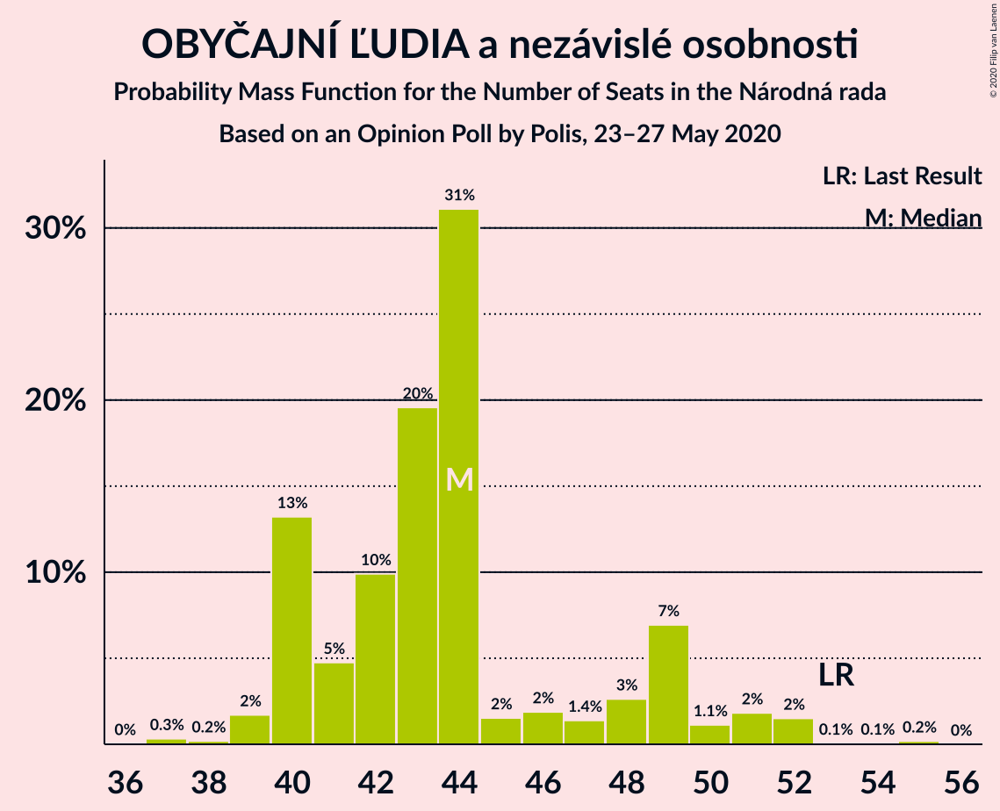

| Number of Seats | Probability | Accumulated | Special Marks |
|:---------------:|:-----------:|:-----------:|:-------------:|
| 36 | 0% | 100% |  |
| 37 | 0.3% | 99.9% |  |
| 38 | 0.2% | 99.6% |  |
| 39 | 2% | 99.4% |  |
| 40 | 13% | 98% |  |
| 41 | 5% | 84% |  |
| 42 | 10% | 80% |  |
| 43 | 20% | 70% |  |
| 44 | 31% | 50% | Median |
| 45 | 2% | 19% |  |
| 46 | 2% | 18% |  |
| 47 | 1.4% | 16% |  |
| 48 | 3% | 14% |  |
| 49 | 7% | 12% |  |
| 50 | 1.1% | 5% |  |
| 51 | 2% | 4% |  |
| 52 | 2% | 2% |  |
| 53 | 0.1% | 0.3% | Last Result |
| 54 | 0.1% | 0.2% |  |
| 55 | 0.2% | 0.2% |  |
| 56 | 0% | 0% |  |

### SMER–sociálna demokracia

*For a full overview of the results for this party, see the [SMER–sociálna demokracia](party-smer–sociálnademokracia.html) page.*

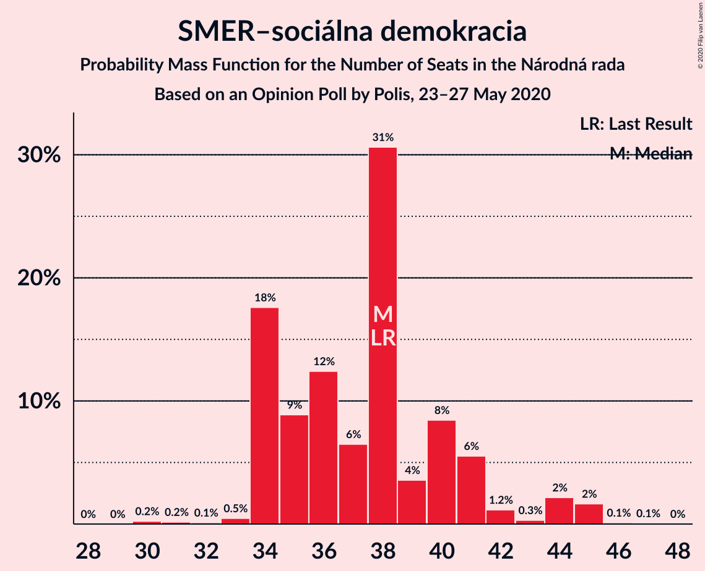

| Number of Seats | Probability | Accumulated | Special Marks |
|:---------------:|:-----------:|:-----------:|:-------------:|
| 30 | 0.2% | 100% |  |
| 31 | 0.2% | 99.8% |  |
| 32 | 0.1% | 99.6% |  |
| 33 | 0.5% | 99.5% |  |
| 34 | 18% | 99.0% |  |
| 35 | 9% | 81% |  |
| 36 | 12% | 73% |  |
| 37 | 6% | 60% |  |
| 38 | 31% | 54% | Last Result, Median |
| 39 | 4% | 23% |  |
| 40 | 8% | 19% |  |
| 41 | 6% | 11% |  |
| 42 | 1.2% | 5% |  |
| 43 | 0.3% | 4% |  |
| 44 | 2% | 4% |  |
| 45 | 2% | 2% |  |
| 46 | 0.1% | 0.2% |  |
| 47 | 0.1% | 0.1% |  |
| 48 | 0% | 0% |  |

### Sloboda a Solidarita

*For a full overview of the results for this party, see the [Sloboda a Solidarita](party-slobodaasolidarita.html) page.*

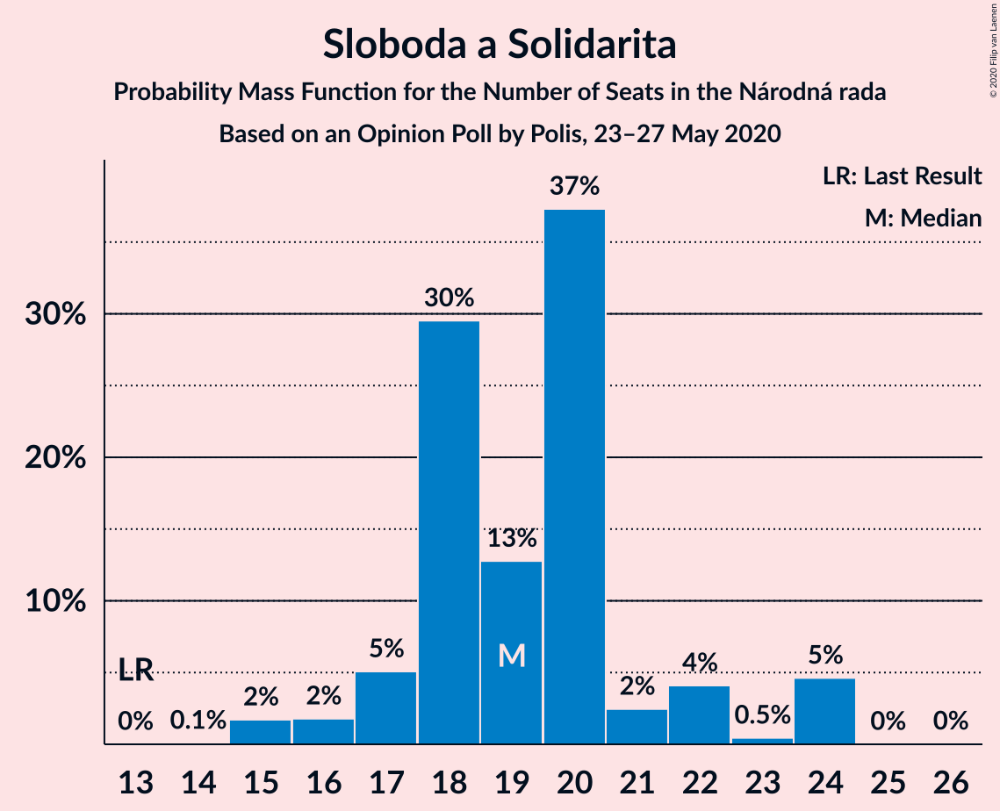

| Number of Seats | Probability | Accumulated | Special Marks |
|:---------------:|:-----------:|:-----------:|:-------------:|
| 13 | 0% | 100% | Last Result |
| 14 | 0.1% | 100% |  |
| 15 | 2% | 99.9% |  |
| 16 | 2% | 98% |  |
| 17 | 5% | 96% |  |
| 18 | 30% | 91% |  |
| 19 | 13% | 62% | Median |
| 20 | 37% | 49% |  |
| 21 | 2% | 12% |  |
| 22 | 4% | 9% |  |
| 23 | 0.5% | 5% |  |
| 24 | 5% | 5% |  |
| 25 | 0% | 0.1% |  |
| 26 | 0% | 0% |  |

### SME RODINA

*For a full overview of the results for this party, see the [SME RODINA](party-smerodina.html) page.*

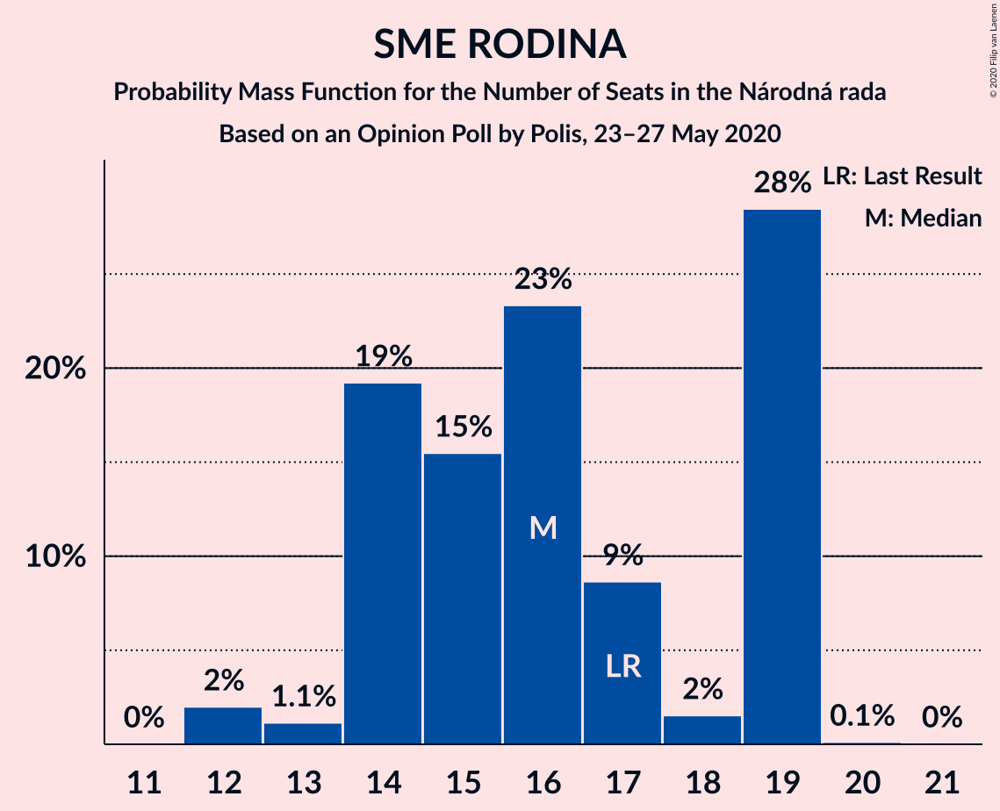

| Number of Seats | Probability | Accumulated | Special Marks |
|:---------------:|:-----------:|:-----------:|:-------------:|
| 12 | 2% | 100% |  |
| 13 | 1.1% | 98% |  |
| 14 | 19% | 97% |  |
| 15 | 15% | 78% |  |
| 16 | 23% | 62% | Median |
| 17 | 9% | 39% | Last Result |
| 18 | 2% | 30% |  |
| 19 | 28% | 29% |  |
| 20 | 0.1% | 0.2% |  |
| 21 | 0% | 0% |  |

### Kotleba–Ľudová strana Naše Slovensko

*For a full overview of the results for this party, see the [Kotleba–Ľudová strana Naše Slovensko](party-kotleba–ľudovástrananašeslovensko.html) page.*

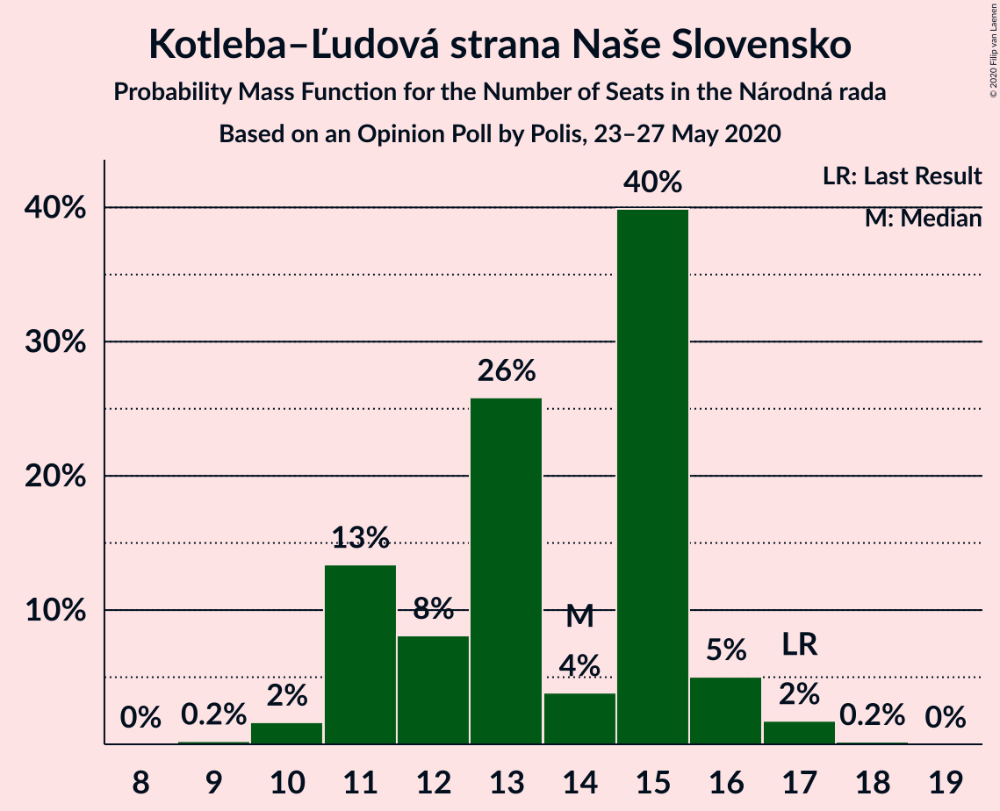

| Number of Seats | Probability | Accumulated | Special Marks |
|:---------------:|:-----------:|:-----------:|:-------------:|
| 9 | 0.2% | 100% |  |
| 10 | 2% | 99.7% |  |
| 11 | 13% | 98% |  |
| 12 | 8% | 85% |  |
| 13 | 26% | 77% |  |
| 14 | 4% | 51% | Median |
| 15 | 40% | 47% |  |
| 16 | 5% | 7% |  |
| 17 | 2% | 2% | Last Result |
| 18 | 0.2% | 0.2% |  |
| 19 | 0% | 0% |  |

### Progresívne Slovensko

*For a full overview of the results for this party, see the [Progresívne Slovensko](party-progresívneslovensko.html) page.*

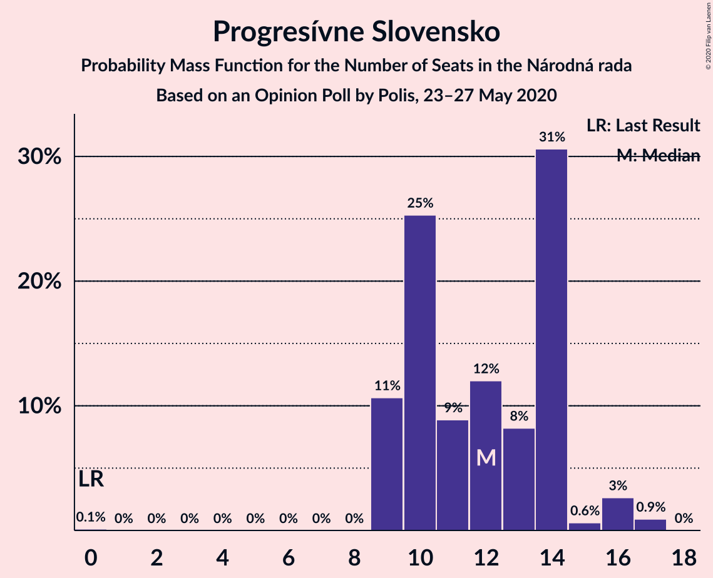

| Number of Seats | Probability | Accumulated | Special Marks |
|:---------------:|:-----------:|:-----------:|:-------------:|
| 0 | 0.1% | 100% | Last Result |
| 1 | 0% | 99.9% |  |
| 2 | 0% | 99.9% |  |
| 3 | 0% | 99.9% |  |
| 4 | 0% | 99.9% |  |
| 5 | 0% | 99.9% |  |
| 6 | 0% | 99.9% |  |
| 7 | 0% | 99.9% |  |
| 8 | 0% | 99.9% |  |
| 9 | 11% | 99.9% |  |
| 10 | 25% | 89% |  |
| 11 | 9% | 64% |  |
| 12 | 12% | 55% | Median |
| 13 | 8% | 43% |  |
| 14 | 31% | 35% |  |
| 15 | 0.6% | 4% |  |
| 16 | 3% | 4% |  |
| 17 | 0.9% | 0.9% |  |
| 18 | 0% | 0% |  |

### Kresťanskodemokratické hnutie

*For a full overview of the results for this party, see the [Kresťanskodemokratické hnutie](party-kresťanskodemokratickéhnutie.html) page.*

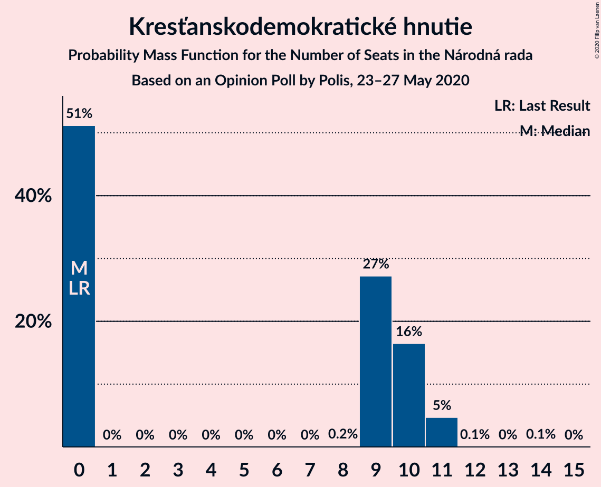

| Number of Seats | Probability | Accumulated | Special Marks |
|:---------------:|:-----------:|:-----------:|:-------------:|
| 0 | 51% | 100% | Last Result, Median |
| 1 | 0% | 49% |  |
| 2 | 0% | 49% |  |
| 3 | 0% | 49% |  |
| 4 | 0% | 49% |  |
| 5 | 0% | 49% |  |
| 6 | 0% | 49% |  |
| 7 | 0% | 49% |  |
| 8 | 0.2% | 49% |  |
| 9 | 27% | 49% |  |
| 10 | 16% | 21% |  |
| 11 | 5% | 5% |  |
| 12 | 0.1% | 0.2% |  |
| 13 | 0% | 0.2% |  |
| 14 | 0.1% | 0.1% |  |
| 15 | 0% | 0% |  |

### Strana maďarskej koalície–Magyar Koalíció Pártja

*For a full overview of the results for this party, see the [Strana maďarskej koalície–Magyar Koalíció Pártja](party-stranamaďarskejkoalície–magyarkoalíciópártja.html) page.*

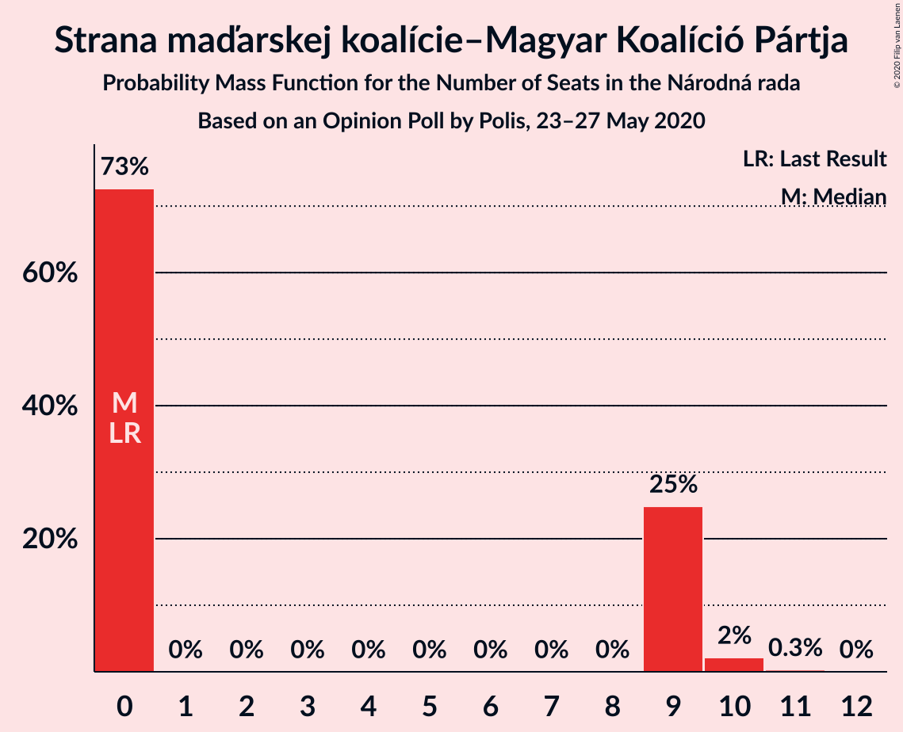

| Number of Seats | Probability | Accumulated | Special Marks |
|:---------------:|:-----------:|:-----------:|:-------------:|
| 0 | 73% | 100% | Last Result, Median |
| 1 | 0% | 27% |  |
| 2 | 0% | 27% |  |
| 3 | 0% | 27% |  |
| 4 | 0% | 27% |  |
| 5 | 0% | 27% |  |
| 6 | 0% | 27% |  |
| 7 | 0% | 27% |  |
| 8 | 0% | 27% |  |
| 9 | 25% | 27% |  |
| 10 | 2% | 2% |  |
| 11 | 0.3% | 0.3% |  |
| 12 | 0% | 0% |  |

### Za ľudí

*For a full overview of the results for this party, see the [Za ľudí](party-zaľudí.html) page.*

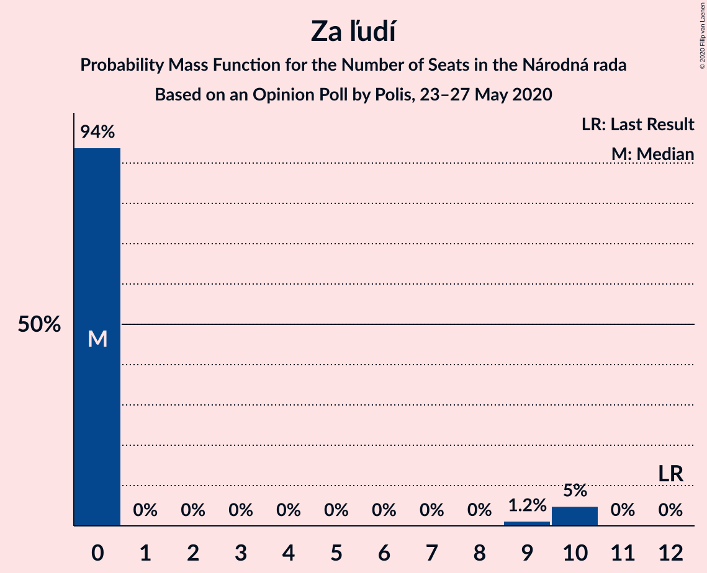

| Number of Seats | Probability | Accumulated | Special Marks |
|:---------------:|:-----------:|:-----------:|:-------------:|
| 0 | 94% | 100% | Median |
| 1 | 0% | 6% |  |
| 2 | 0% | 6% |  |
| 3 | 0% | 6% |  |
| 4 | 0% | 6% |  |
| 5 | 0% | 6% |  |
| 6 | 0% | 6% |  |
| 7 | 0% | 6% |  |
| 8 | 0% | 6% |  |
| 9 | 1.2% | 6% |  |
| 10 | 5% | 5% |  |
| 11 | 0% | 0% |  |
| 12 | 0% | 0% | Last Result |

### MOST–HÍD

*For a full overview of the results for this party, see the [MOST–HÍD](party-most–híd.html) page.*

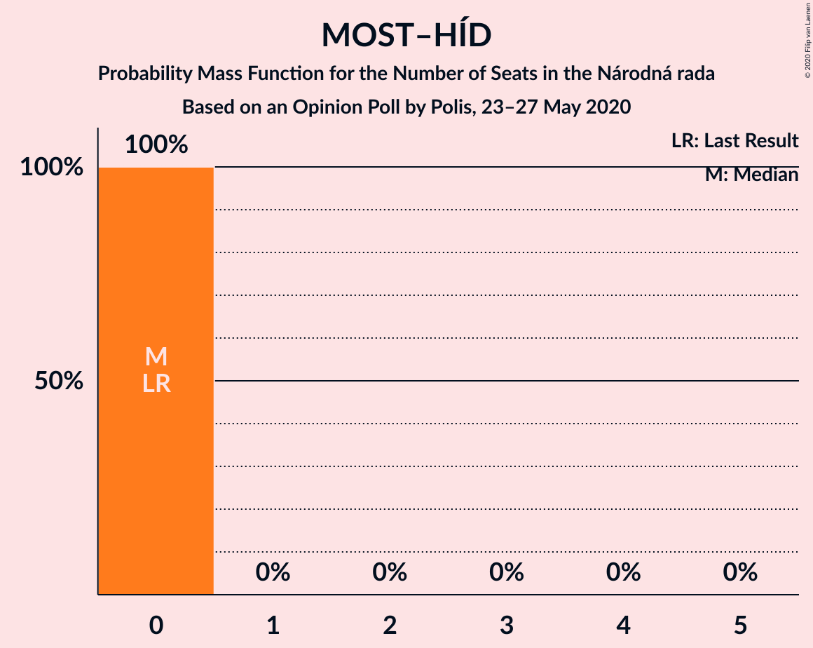

| Number of Seats | Probability | Accumulated | Special Marks |
|:---------------:|:-----------:|:-----------:|:-------------:|
| 0 | 100% | 100% | Last Result, Median |

### Dobrá voľba

*For a full overview of the results for this party, see the [Dobrá voľba](party-dobrávoľba.html) page.*

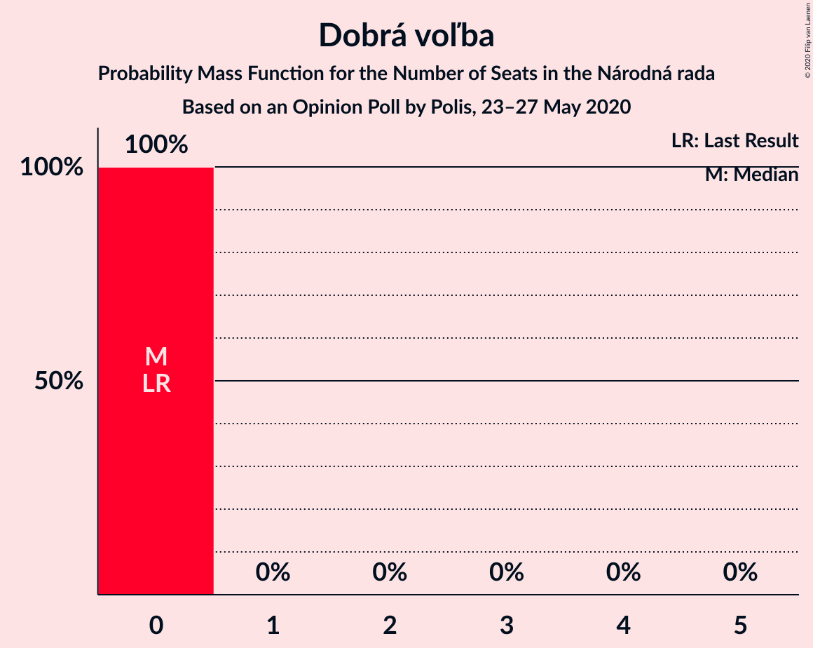

| Number of Seats | Probability | Accumulated | Special Marks |
|:---------------:|:-----------:|:-----------:|:-------------:|
| 0 | 100% | 100% | Last Result, Median |

### Slovenská národná strana

*For a full overview of the results for this party, see the [Slovenská národná strana](party-slovenskánárodnástrana.html) page.*

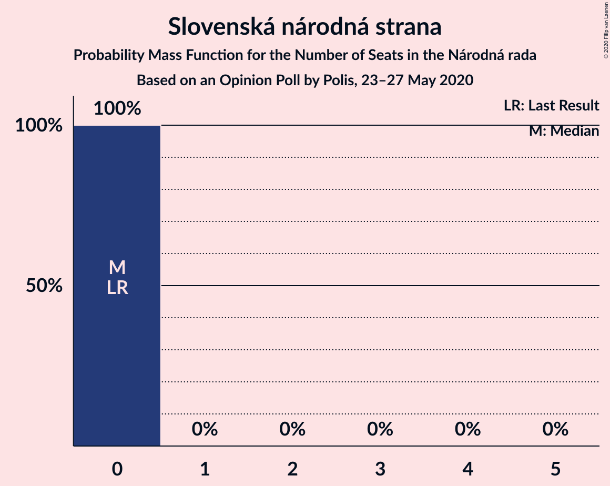

| Number of Seats | Probability | Accumulated | Special Marks |
|:---------------:|:-----------:|:-----------:|:-------------:|
| 0 | 100% | 100% | Last Result, Median |

### VLASŤ

*For a full overview of the results for this party, see the [VLASŤ](party-vlasť.html) page.*

| Number of Seats | Probability | Accumulated | Special Marks |
|:---------------:|:-----------:|:-----------:|:-------------:|
| 0 | 100% | 100% | Last Result, Median |

## Coalitions

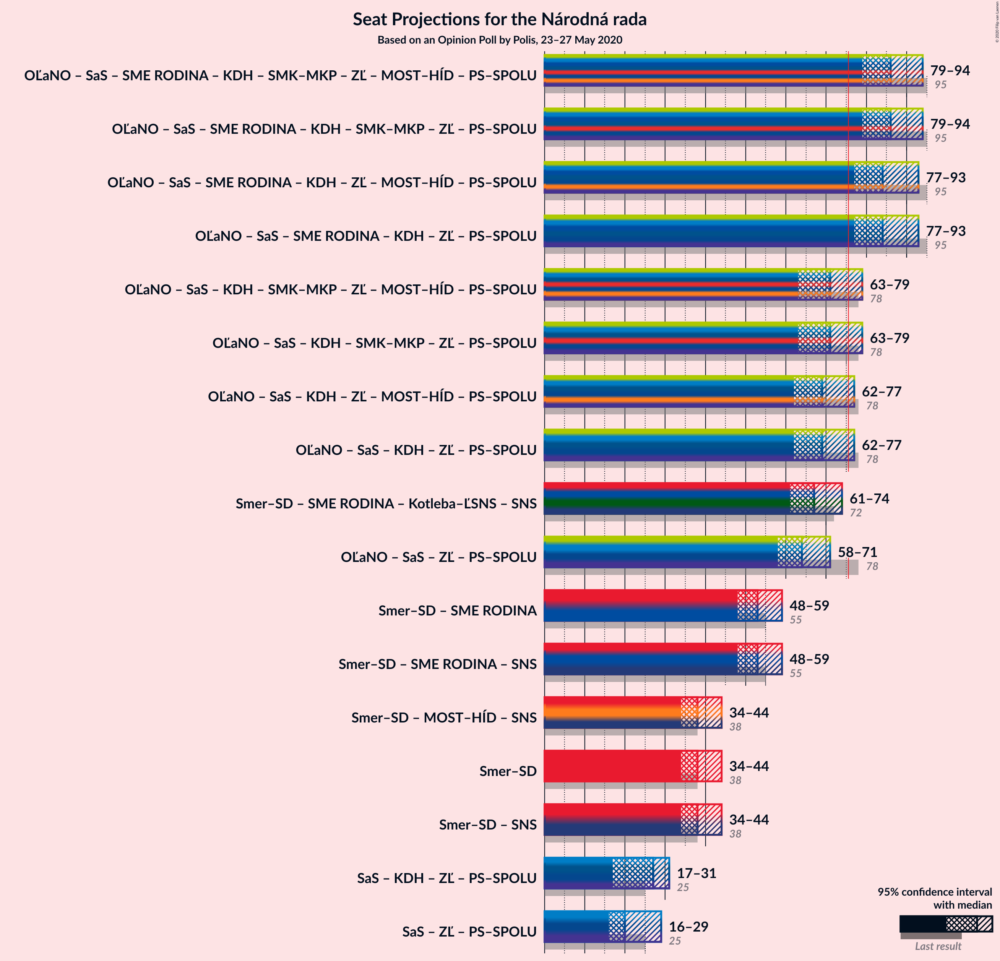

### Confidence Intervals

| Coalition | Last Result | Median | Majority? | 80% Confidence Interval | 90% Confidence Interval | 95% Confidence Interval | 99% Confidence Interval |
|:---------:|:-----------:|:------:|:---------:|:-----------------------:|:-----------------------:|:-----------------------:|:-----------------------:|
| SMER–sociálna demokracia – SME RODINA – Kotleba–Ľudová strana Naše Slovensko – Slovenská národná strana | 72 | 67 | 0.9% | 61–72 | 61–73 | 61–74 | 60–76 |
| SMER–sociálna demokracia – SME RODINA | 55 | 53 | 0% | 48–58 | 48–58 | 48–59 | 48–60 |
| SMER–sociálna demokracia – SME RODINA – Slovenská národná strana | 55 | 53 | 0% | 48–58 | 48–58 | 48–59 | 48–60 |
| SMER–sociálna demokracia – MOST–HÍD – Slovenská národná strana | 38 | 38 | 0% | 34–41 | 34–42 | 34–44 | 32–45 |
| SMER–sociálna demokracia | 38 | 38 | 0% | 34–41 | 34–42 | 34–44 | 32–45 |
| SMER–sociálna demokracia – Slovenská národná strana | 38 | 38 | 0% | 34–41 | 34–42 | 34–44 | 32–45 |

### SMER–sociálna demokracia – SME RODINA – Kotleba–Ľudová strana Naše Slovensko – Slovenská národná strana

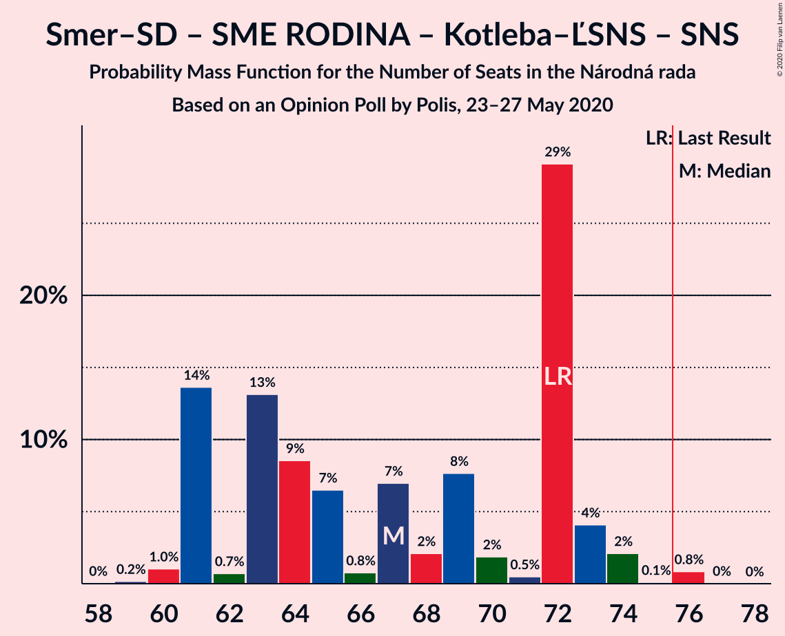

| Number of Seats | Probability | Accumulated | Special Marks |
|:---------------:|:-----------:|:-----------:|:-------------:|
| 59 | 0.2% | 100% |  |
| 60 | 1.0% | 99.8% |  |
| 61 | 14% | 98.7% |  |
| 62 | 0.7% | 85% |  |
| 63 | 13% | 84% |  |
| 64 | 9% | 71% |  |
| 65 | 7% | 63% |  |
| 66 | 0.8% | 56% |  |
| 67 | 7% | 55% |  |
| 68 | 2% | 48% | Median |
| 69 | 8% | 46% |  |
| 70 | 2% | 39% |  |
| 71 | 0.5% | 37% |  |
| 72 | 29% | 36% | Last Result |
| 73 | 4% | 7% |  |
| 74 | 2% | 3% |  |
| 75 | 0.1% | 1.0% |  |
| 76 | 0.8% | 0.9% | Majority |
| 77 | 0% | 0.1% |  |
| 78 | 0% | 0% |  |

### SMER–sociálna demokracia – SME RODINA

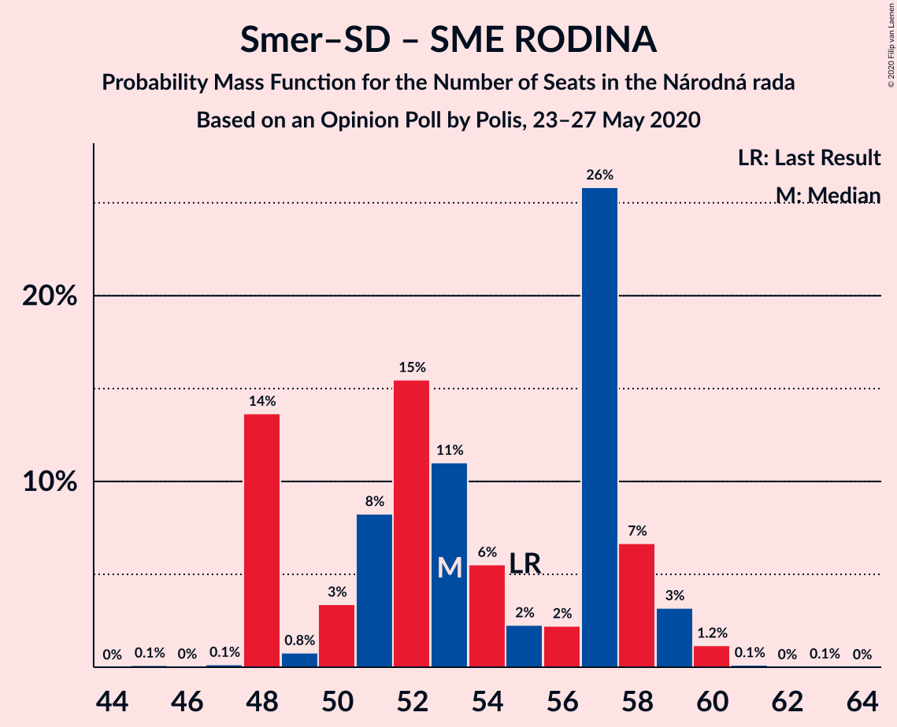

| Number of Seats | Probability | Accumulated | Special Marks |
|:---------------:|:-----------:|:-----------:|:-------------:|
| 45 | 0.1% | 100% |  |
| 46 | 0% | 99.9% |  |
| 47 | 0.1% | 99.8% |  |
| 48 | 14% | 99.7% |  |
| 49 | 0.8% | 86% |  |
| 50 | 3% | 85% |  |
| 51 | 8% | 82% |  |
| 52 | 15% | 74% |  |
| 53 | 11% | 58% |  |
| 54 | 6% | 47% | Median |
| 55 | 2% | 42% | Last Result |
| 56 | 2% | 39% |  |
| 57 | 26% | 37% |  |
| 58 | 7% | 11% |  |
| 59 | 3% | 5% |  |
| 60 | 1.2% | 1.4% |  |
| 61 | 0.1% | 0.2% |  |
| 62 | 0% | 0.1% |  |
| 63 | 0.1% | 0.1% |  |
| 64 | 0% | 0% |  |

### SMER–sociálna demokracia – SME RODINA – Slovenská národná strana

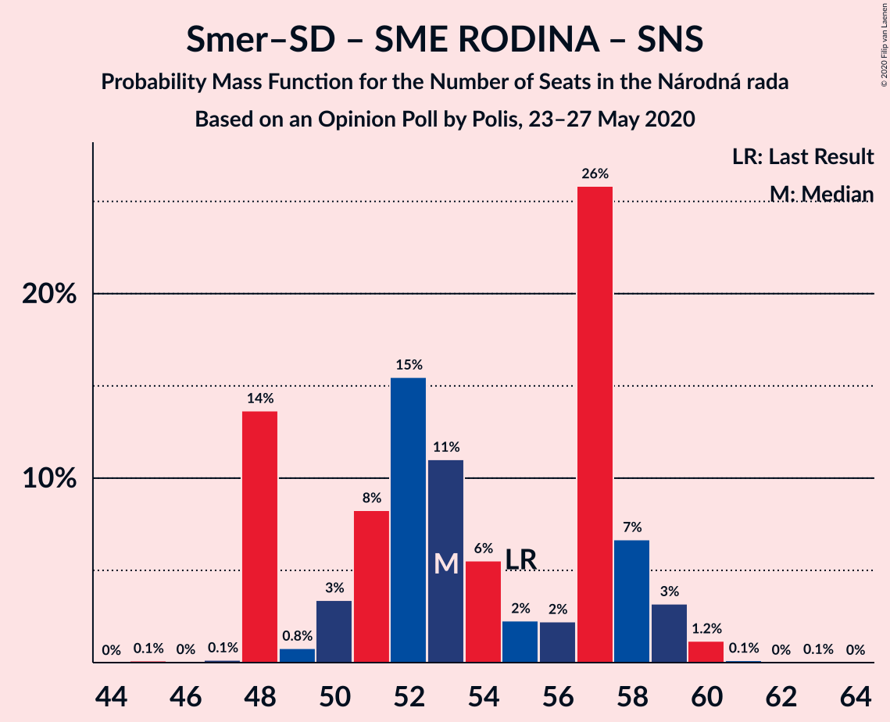

| Number of Seats | Probability | Accumulated | Special Marks |
|:---------------:|:-----------:|:-----------:|:-------------:|
| 45 | 0.1% | 100% |  |
| 46 | 0% | 99.9% |  |
| 47 | 0.1% | 99.8% |  |
| 48 | 14% | 99.7% |  |
| 49 | 0.8% | 86% |  |
| 50 | 3% | 85% |  |
| 51 | 8% | 82% |  |
| 52 | 15% | 74% |  |
| 53 | 11% | 58% |  |
| 54 | 6% | 47% | Median |
| 55 | 2% | 42% | Last Result |
| 56 | 2% | 39% |  |
| 57 | 26% | 37% |  |
| 58 | 7% | 11% |  |
| 59 | 3% | 5% |  |
| 60 | 1.2% | 1.4% |  |
| 61 | 0.1% | 0.2% |  |
| 62 | 0% | 0.1% |  |
| 63 | 0.1% | 0.1% |  |
| 64 | 0% | 0% |  |

### SMER–sociálna demokracia – MOST–HÍD – Slovenská národná strana

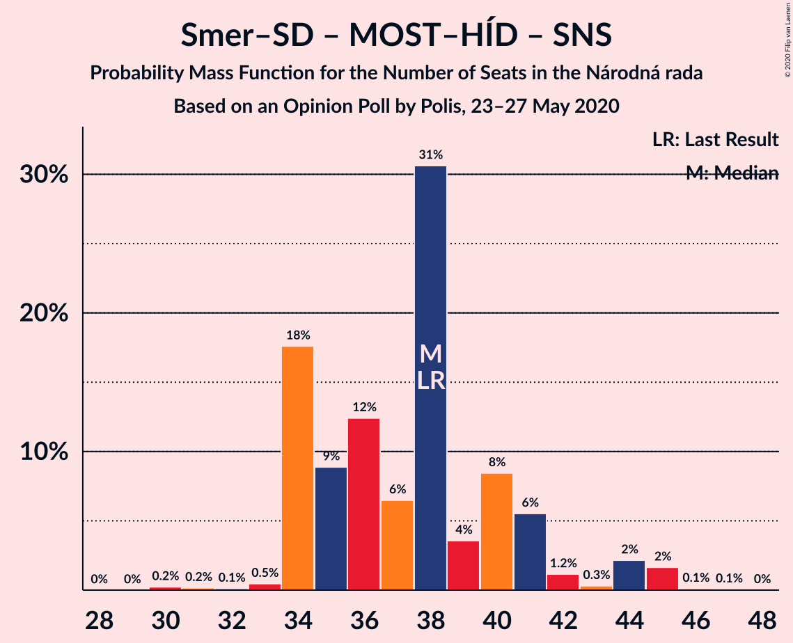

| Number of Seats | Probability | Accumulated | Special Marks |
|:---------------:|:-----------:|:-----------:|:-------------:|
| 30 | 0.2% | 100% |  |
| 31 | 0.2% | 99.8% |  |
| 32 | 0.1% | 99.6% |  |
| 33 | 0.5% | 99.5% |  |
| 34 | 18% | 99.0% |  |
| 35 | 9% | 81% |  |
| 36 | 12% | 73% |  |
| 37 | 6% | 60% |  |
| 38 | 31% | 54% | Last Result, Median |
| 39 | 4% | 23% |  |
| 40 | 8% | 19% |  |
| 41 | 6% | 11% |  |
| 42 | 1.2% | 5% |  |
| 43 | 0.3% | 4% |  |
| 44 | 2% | 4% |  |
| 45 | 2% | 2% |  |
| 46 | 0.1% | 0.2% |  |
| 47 | 0.1% | 0.1% |  |
| 48 | 0% | 0% |  |

### SMER–sociálna demokracia

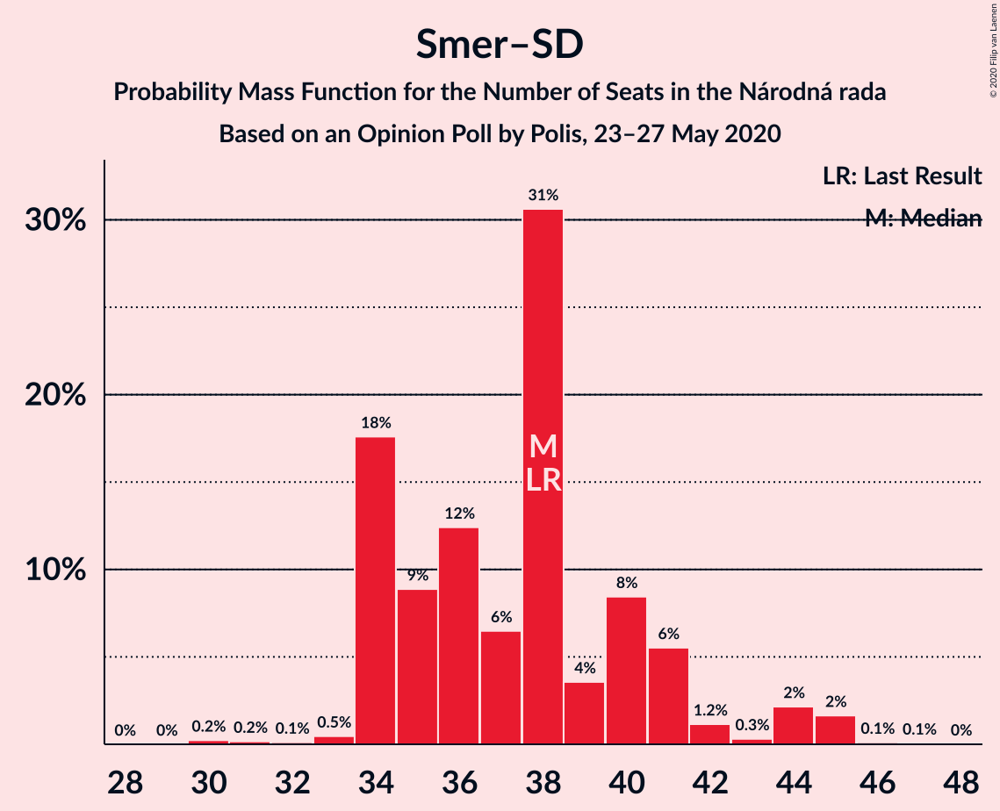

| Number of Seats | Probability | Accumulated | Special Marks |
|:---------------:|:-----------:|:-----------:|:-------------:|
| 30 | 0.2% | 100% |  |
| 31 | 0.2% | 99.8% |  |
| 32 | 0.1% | 99.6% |  |
| 33 | 0.5% | 99.5% |  |
| 34 | 18% | 99.0% |  |
| 35 | 9% | 81% |  |
| 36 | 12% | 73% |  |
| 37 | 6% | 60% |  |
| 38 | 31% | 54% | Last Result, Median |
| 39 | 4% | 23% |  |
| 40 | 8% | 19% |  |
| 41 | 6% | 11% |  |
| 42 | 1.2% | 5% |  |
| 43 | 0.3% | 4% |  |
| 44 | 2% | 4% |  |
| 45 | 2% | 2% |  |
| 46 | 0.1% | 0.2% |  |
| 47 | 0.1% | 0.1% |  |
| 48 | 0% | 0% |  |

### SMER–sociálna demokracia – Slovenská národná strana

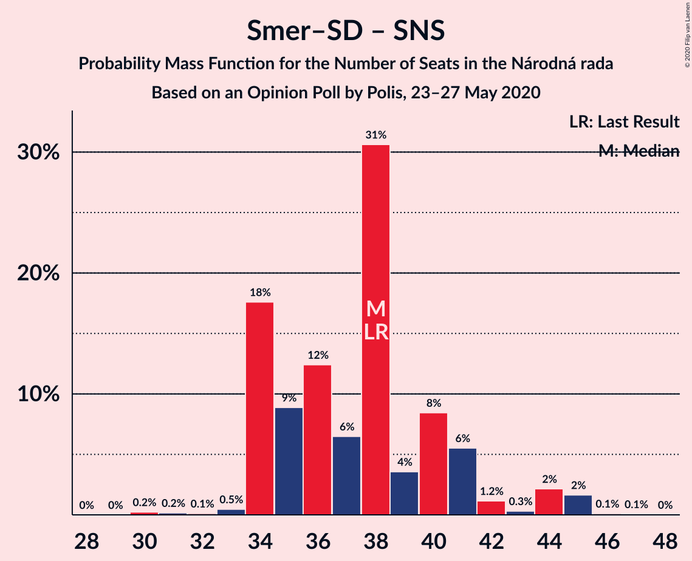

| Number of Seats | Probability | Accumulated | Special Marks |
|:---------------:|:-----------:|:-----------:|:-------------:|
| 30 | 0.2% | 100% |  |
| 31 | 0.2% | 99.8% |  |
| 32 | 0.1% | 99.6% |  |
| 33 | 0.5% | 99.5% |  |
| 34 | 18% | 99.0% |  |
| 35 | 9% | 81% |  |
| 36 | 12% | 73% |  |
| 37 | 6% | 60% |  |
| 38 | 31% | 54% | Last Result, Median |
| 39 | 4% | 23% |  |
| 40 | 8% | 19% |  |
| 41 | 6% | 11% |  |
| 42 | 1.2% | 5% |  |
| 43 | 0.3% | 4% |  |
| 44 | 2% | 4% |  |
| 45 | 2% | 2% |  |
| 46 | 0.1% | 0.2% |  |
| 47 | 0.1% | 0.1% |  |
| 48 | 0% | 0% |  |

## Technical Information

### Opinion Poll

+ **Polling firm:** Polis
+ **Commissioner(s):** —
+ **Fieldwork period:** 23–27 May 2020

### Calculations

+ **Sample size:** 1074
+ **Simulations done:** 1,048,576
+ **Error estimate:** 2.21%

