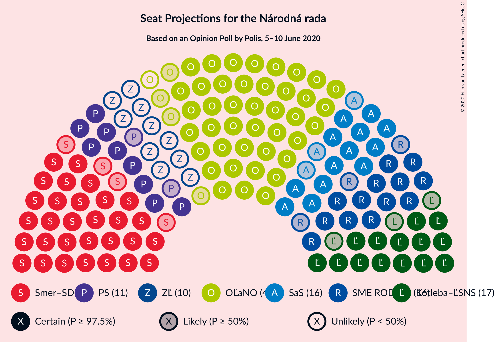
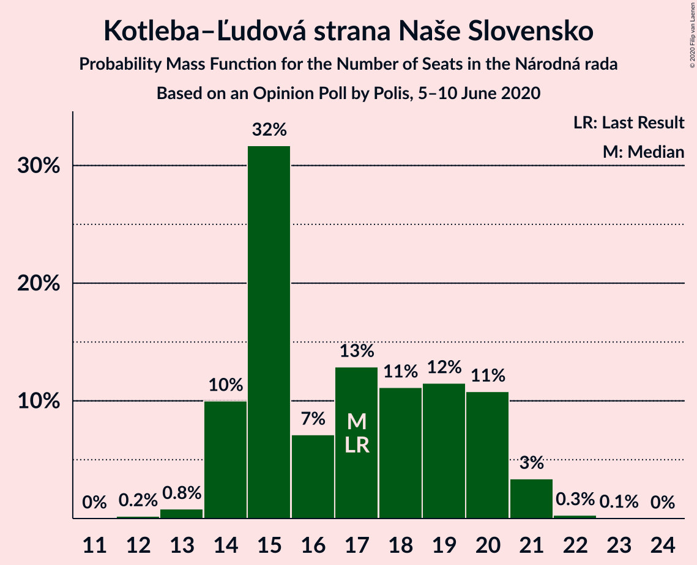

# Opinion Poll by Polis, 5–10 June 2020

<a href="#voting-intentions">Voting Intentions</a> | <a href="#seats">Seats</a> | <a href="#coalitions">Coalitions</a> | <a href="#technical-information">Technical Information</a>

## Voting Intentions

### Confidence Intervals

| Party | Last Result | Poll Result | 80% Confidence Interval | 90% Confidence Interval | 95% Confidence Interval | 99% Confidence Interval |
|:-----:|:-----------:|:-----------:|:-----------------------:|:-----------------------:|:-----------------------:|:-----------------------:|
| OBYČAJNÍ ĽUDIA a nezávislé osobnosti | 25.0% | 24.4% | 22.7–26.1% |22.2–26.6% |21.8–27.1% |21.1–27.9% |
| SMER–sociálna demokracia | 18.3% | 18.8% | 17.3–20.4% |16.9–20.9% |16.6–21.3% |15.9–22.1% |
| Kotleba–Ľudová strana Naše Slovensko | 8.0% | 9.0% | 7.9–10.2% |7.6–10.6% |7.4–10.9% |6.9–11.5% |
| Sloboda a Solidarita | 6.2% | 8.9% | 7.8–10.1% |7.5–10.5% |7.3–10.8% |6.8–11.4% |
| SME RODINA | 8.2% | 8.9% | 7.8–10.1% |7.5–10.5% |7.3–10.8% |6.8–11.4% |
| Progresívne Slovensko | 7.0% | 6.8% | 5.9–7.9% |5.6–8.2% |5.4–8.5% |5.0–9.0% |
| Za ľudí | 5.8% | 4.8% | 4.0–5.7% |3.8–6.0% |3.6–6.2% |3.3–6.7% |
| Strana maďarskej koalície–Magyar Koalíció Pártja | 3.9% | 4.5% | 3.8–5.4% |3.6–5.7% |3.4–5.9% |3.1–6.4% |
| Dobrá voľba | 3.1% | 3.6% | 3.0–4.5% |2.8–4.7% |2.7–5.0% |2.4–5.4% |
| Kresťanskodemokratické hnutie | 4.6% | 3.4% | 2.8–4.3% |2.6–4.5% |2.5–4.7% |2.2–5.2% |
| Slovenská národná strana | 3.2% | 3.2% | 2.6–4.1% |2.5–4.3% |2.3–4.5% |2.1–4.9% |
| MOST–HÍD | 2.0% | 2.7% | 2.1–3.4% |2.0–3.7% |1.9–3.8% |1.6–4.2% |

*Note:* The poll result column reflects the actual value used in the calculations. Published results may vary slightly, and in addition be rounded to fewer digits.

## Seats

### Confidence Intervals

| Party | Last Result | Median | 80% Confidence Interval | 90% Confidence Interval | 95% Confidence Interval | 99% Confidence Interval |
|:-----:|:-----------:|:------:|:-----------------------:|:-----------------------:|:-----------------------:|:-----------------------:|
| <a href="#obyčajní-ľudia-a-nezávislé-osobnosti">OBYČAJNÍ ĽUDIA a nezávislé osobnosti</a> | 53 | 45 | 42–49 |42–50 |41–50 |39–52 |
| <a href="#smer–sociálna-demokracia">SMER–sociálna demokracia</a> | 38 | 34 | 33–37 |31–39 |30–39 |29–41 |
| <a href="#kotleba–ľudová-strana-naše-slovensko">Kotleba–Ľudová strana Naše Slovensko</a> | 17 | 17 | 14–20 |14–20 |14–21 |13–21 |
| <a href="#sloboda-a-solidarita">Sloboda a Solidarita</a> | 13 | 16 | 15–19 |14–20 |13–21 |13–21 |
| <a href="#sme-rodina">SME RODINA</a> | 17 | 16 | 14–19 |14–20 |13–20 |12–21 |
| <a href="#progresívne-slovensko">Progresívne Slovensko</a> | 0 | 11 | 9–14 |9–15 |9–16 |0–16 |
| <a href="#za-ľudí">Za ľudí</a> | 12 | 0 | 0–11 |0–11 |0–11 |0–13 |
| <a href="#strana-maďarskej-koalície–magyar-koalíció-pártja">Strana maďarskej koalície–Magyar Koalíció Pártja</a> | 0 | 0 | 0–10 |0–10 |0–11 |0–12 |
| <a href="#dobrá-voľba">Dobrá voľba</a> | 0 | 0 | 0 |0 |0 |0–10 |
| <a href="#kresťanskodemokratické-hnutie">Kresťanskodemokratické hnutie</a> | 0 | 0 | 0 |0 |0 |0 |
| <a href="#slovenská-národná-strana">Slovenská národná strana</a> | 0 | 0 | 0 |0 |0 |0 |
| <a href="#most–híd">MOST–HÍD</a> | 0 | 0 | 0 |0 |0 |0 |

### OBYČAJNÍ ĽUDIA a nezávislé osobnosti

*For a full overview of the results for this party, see the [OBYČAJNÍ ĽUDIA a nezávislé osobnosti](party-obyčajníľudiaanezávisléosobnosti.html) page.*

| Number of Seats | Probability | Accumulated | Special Marks |
|:---------------:|:-----------:|:-----------:|:-------------:|
| 36 | 0% | 100% |  |
| 37 | 0.1% | 99.9% |  |
| 38 | 0.3% | 99.8% |  |
| 39 | 0.3% | 99.6% |  |
| 40 | 1.3% | 99.2% |  |
| 41 | 1.4% | 98% |  |
| 42 | 29% | 97% |  |
| 43 | 11% | 68% |  |
| 44 | 5% | 57% |  |
| 45 | 4% | 52% | Median |
| 46 | 9% | 47% |  |
| 47 | 15% | 38% |  |
| 48 | 10% | 23% |  |
| 49 | 3% | 13% |  |
| 50 | 8% | 10% |  |
| 51 | 0.3% | 1.3% |  |
| 52 | 0.5% | 1.0% |  |
| 53 | 0.2% | 0.4% | Last Result |
| 54 | 0% | 0.2% |  |
| 55 | 0.2% | 0.2% |  |
| 56 | 0% | 0% |  |

### SMER–sociálna demokracia

*For a full overview of the results for this party, see the [SMER–sociálna demokracia](party-smer–sociálnademokracia.html) page.*

| Number of Seats | Probability | Accumulated | Special Marks |
|:---------------:|:-----------:|:-----------:|:-------------:|
| 27 | 0.1% | 100% |  |
| 28 | 0.1% | 99.9% |  |
| 29 | 0.9% | 99.7% |  |
| 30 | 3% | 98.9% |  |
| 31 | 4% | 96% |  |
| 32 | 1.4% | 92% |  |
| 33 | 13% | 90% |  |
| 34 | 31% | 77% | Median |
| 35 | 20% | 46% |  |
| 36 | 14% | 26% |  |
| 37 | 5% | 13% |  |
| 38 | 2% | 8% | Last Result |
| 39 | 4% | 6% |  |
| 40 | 0.9% | 2% |  |
| 41 | 1.1% | 1.3% |  |
| 42 | 0% | 0.2% |  |
| 43 | 0% | 0.1% |  |
| 44 | 0% | 0.1% |  |
| 45 | 0.1% | 0.1% |  |
| 46 | 0% | 0% |  |

### Kotleba–Ľudová strana Naše Slovensko

*For a full overview of the results for this party, see the [Kotleba–Ľudová strana Naše Slovensko](party-kotleba–ľudovástrananašeslovensko.html) page.*

| Number of Seats | Probability | Accumulated | Special Marks |
|:---------------:|:-----------:|:-----------:|:-------------:|
| 12 | 0.2% | 100% |  |
| 13 | 0.8% | 99.8% |  |
| 14 | 10% | 98.9% |  |
| 15 | 32% | 89% |  |
| 16 | 7% | 57% |  |
| 17 | 13% | 50% | Last Result, Median |
| 18 | 11% | 37% |  |
| 19 | 12% | 26% |  |
| 20 | 11% | 15% |  |
| 21 | 3% | 4% |  |
| 22 | 0.3% | 0.4% |  |
| 23 | 0.1% | 0.1% |  |
| 24 | 0% | 0% |  |

### Sloboda a Solidarita

*For a full overview of the results for this party, see the [Sloboda a Solidarita](party-slobodaasolidarita.html) page.*

| Number of Seats | Probability | Accumulated | Special Marks |
|:---------------:|:-----------:|:-----------:|:-------------:|
| 12 | 0.3% | 100% |  |
| 13 | 2% | 99.7% | Last Result |
| 14 | 4% | 97% |  |
| 15 | 5% | 93% |  |
| 16 | 39% | 88% | Median |
| 17 | 14% | 49% |  |
| 18 | 14% | 35% |  |
| 19 | 13% | 21% |  |
| 20 | 5% | 8% |  |
| 21 | 3% | 3% |  |
| 22 | 0.2% | 0.5% |  |
| 23 | 0.1% | 0.3% |  |
| 24 | 0.2% | 0.2% |  |
| 25 | 0% | 0% |  |

### SME RODINA

*For a full overview of the results for this party, see the [SME RODINA](party-smerodina.html) page.*

| Number of Seats | Probability | Accumulated | Special Marks |
|:---------------:|:-----------:|:-----------:|:-------------:|
| 12 | 2% | 100% |  |
| 13 | 1.1% | 98% |  |
| 14 | 9% | 97% |  |
| 15 | 31% | 88% |  |
| 16 | 24% | 57% | Median |
| 17 | 10% | 33% | Last Result |
| 18 | 7% | 24% |  |
| 19 | 11% | 17% |  |
| 20 | 4% | 6% |  |
| 21 | 1.4% | 2% |  |
| 22 | 0.3% | 0.3% |  |
| 23 | 0% | 0.1% |  |
| 24 | 0% | 0% |  |

### Progresívne Slovensko

*For a full overview of the results for this party, see the [Progresívne Slovensko](party-progresívneslovensko.html) page.*

| Number of Seats | Probability | Accumulated | Special Marks |
|:---------------:|:-----------:|:-----------:|:-------------:|
| 0 | 0.8% | 100% | Last Result |
| 1 | 0% | 99.2% |  |
| 2 | 0% | 99.2% |  |
| 3 | 0% | 99.2% |  |
| 4 | 0% | 99.2% |  |
| 5 | 0% | 99.2% |  |
| 6 | 0% | 99.2% |  |
| 7 | 0% | 99.2% |  |
| 8 | 0% | 99.2% |  |
| 9 | 25% | 99.2% |  |
| 10 | 6% | 74% |  |
| 11 | 24% | 69% | Median |
| 12 | 14% | 44% |  |
| 13 | 20% | 30% |  |
| 14 | 5% | 11% |  |
| 15 | 3% | 6% |  |
| 16 | 3% | 3% |  |
| 17 | 0.1% | 0.2% |  |
| 18 | 0% | 0.1% |  |
| 19 | 0% | 0% |  |

### Za ľudí

*For a full overview of the results for this party, see the [Za ľudí](party-zaľudí.html) page.*

| Number of Seats | Probability | Accumulated | Special Marks |
|:---------------:|:-----------:|:-----------:|:-------------:|
| 0 | 50% | 100% | Median |
| 1 | 0% | 50% |  |
| 2 | 0% | 50% |  |
| 3 | 0% | 50% |  |
| 4 | 0% | 50% |  |
| 5 | 0% | 50% |  |
| 6 | 0% | 50% |  |
| 7 | 0% | 50% |  |
| 8 | 0% | 50% |  |
| 9 | 3% | 50% |  |
| 10 | 35% | 47% |  |
| 11 | 11% | 12% |  |
| 12 | 1.1% | 2% | Last Result |
| 13 | 0.6% | 0.6% |  |
| 14 | 0% | 0% |  |

### Strana maďarskej koalície–Magyar Koalíció Pártja

*For a full overview of the results for this party, see the [Strana maďarskej koalície–Magyar Koalíció Pártja](party-stranamaďarskejkoalície–magyarkoalíciópártja.html) page.*

| Number of Seats | Probability | Accumulated | Special Marks |
|:---------------:|:-----------:|:-----------:|:-------------:|
| 0 | 58% | 100% | Last Result, Median |
| 1 | 0% | 42% |  |
| 2 | 0% | 42% |  |
| 3 | 0% | 42% |  |
| 4 | 0% | 42% |  |
| 5 | 0% | 42% |  |
| 6 | 0% | 42% |  |
| 7 | 0% | 42% |  |
| 8 | 0% | 42% |  |
| 9 | 29% | 42% |  |
| 10 | 11% | 13% |  |
| 11 | 2% | 3% |  |
| 12 | 0.8% | 0.9% |  |
| 13 | 0.1% | 0.1% |  |
| 14 | 0% | 0% |  |

### Dobrá voľba

*For a full overview of the results for this party, see the [Dobrá voľba](party-dobrávoľba.html) page.*

| Number of Seats | Probability | Accumulated | Special Marks |
|:---------------:|:-----------:|:-----------:|:-------------:|
| 0 | 98.9% | 100% | Last Result, Median |
| 1 | 0% | 1.1% |  |
| 2 | 0% | 1.1% |  |
| 3 | 0% | 1.1% |  |
| 4 | 0% | 1.1% |  |
| 5 | 0% | 1.1% |  |
| 6 | 0% | 1.1% |  |
| 7 | 0% | 1.1% |  |
| 8 | 0% | 1.1% |  |
| 9 | 0.6% | 1.1% |  |
| 10 | 0.5% | 0.5% |  |
| 11 | 0% | 0% |  |

### Kresťanskodemokratické hnutie

*For a full overview of the results for this party, see the [Kresťanskodemokratické hnutie](party-kresťanskodemokratickéhnutie.html) page.*

| Number of Seats | Probability | Accumulated | Special Marks |
|:---------------:|:-----------:|:-----------:|:-------------:|
| 0 | 99.8% | 100% | Last Result, Median |
| 1 | 0% | 0.2% |  |
| 2 | 0% | 0.2% |  |
| 3 | 0% | 0.2% |  |
| 4 | 0% | 0.2% |  |
| 5 | 0% | 0.2% |  |
| 6 | 0% | 0.2% |  |
| 7 | 0% | 0.2% |  |
| 8 | 0% | 0.2% |  |
| 9 | 0.1% | 0.2% |  |
| 10 | 0.1% | 0.1% |  |
| 11 | 0% | 0% |  |

### Slovenská národná strana

*For a full overview of the results for this party, see the [Slovenská národná strana](party-slovenskánárodnástrana.html) page.*

| Number of Seats | Probability | Accumulated | Special Marks |
|:---------------:|:-----------:|:-----------:|:-------------:|
| 0 | 99.9% | 100% | Last Result, Median |
| 1 | 0% | 0.1% |  |
| 2 | 0% | 0.1% |  |
| 3 | 0% | 0.1% |  |
| 4 | 0% | 0.1% |  |
| 5 | 0% | 0.1% |  |
| 6 | 0% | 0.1% |  |
| 7 | 0% | 0.1% |  |
| 8 | 0% | 0.1% |  |
| 9 | 0.1% | 0.1% |  |
| 10 | 0% | 0% |  |

### MOST–HÍD

*For a full overview of the results for this party, see the [MOST–HÍD](party-most–híd.html) page.*

| Number of Seats | Probability | Accumulated | Special Marks |
|:---------------:|:-----------:|:-----------:|:-------------:|
| 0 | 100% | 100% | Last Result, Median |

## Coalitions

### Confidence Intervals

| Coalition | Last Result | Median | Majority? | 80% Confidence Interval | 90% Confidence Interval | 95% Confidence Interval | 99% Confidence Interval |
|:---------:|:-----------:|:------:|:---------:|:-----------------------:|:-----------------------:|:-----------------------:|:-----------------------:|
| SMER–sociálna demokracia – Kotleba–Ľudová strana Naše Slovensko – SME RODINA – Slovenská národná strana | 72 | 67 | 2% | 63–73 | 63–74 | 62–75 | 58–77 |
| SMER–sociálna demokracia – SME RODINA | 55 | 50 | 0% | 48–55 | 48–56 | 46–57 | 44–59 |
| SMER–sociálna demokracia – SME RODINA – Slovenská národná strana | 55 | 50 | 0% | 48–55 | 48–57 | 46–57 | 44–59 |
| SMER–sociálna demokracia – Slovenská národná strana – MOST–HÍD | 38 | 34 | 0% | 33–37 | 31–39 | 30–39 | 29–41 |
| SMER–sociálna demokracia | 38 | 34 | 0% | 33–37 | 31–39 | 30–39 | 29–41 |
| SMER–sociálna demokracia – Slovenská národná strana | 38 | 34 | 0% | 33–37 | 31–39 | 30–39 | 29–41 |

### SMER–sociálna demokracia – Kotleba–Ľudová strana Naše Slovensko – SME RODINA – Slovenská národná strana

| Number of Seats | Probability | Accumulated | Special Marks |
|:---------------:|:-----------:|:-----------:|:-------------:|
| 56 | 0.1% | 100% |  |
| 57 | 0.3% | 99.9% |  |
| 58 | 0.1% | 99.6% |  |
| 59 | 0.2% | 99.5% |  |
| 60 | 0.5% | 99.3% |  |
| 61 | 0.7% | 98.8% |  |
| 62 | 0.9% | 98% |  |
| 63 | 10% | 97% |  |
| 64 | 26% | 87% |  |
| 65 | 3% | 61% |  |
| 66 | 6% | 58% |  |
| 67 | 2% | 52% | Median |
| 68 | 10% | 50% |  |
| 69 | 5% | 40% |  |
| 70 | 9% | 35% |  |
| 71 | 4% | 26% |  |
| 72 | 4% | 22% | Last Result |
| 73 | 11% | 18% |  |
| 74 | 2% | 7% |  |
| 75 | 3% | 5% |  |
| 76 | 0.7% | 2% | Majority |
| 77 | 0.7% | 1.1% |  |
| 78 | 0.2% | 0.4% |  |
| 79 | 0.1% | 0.1% |  |
| 80 | 0% | 0% |  |

### SMER–sociálna demokracia – SME RODINA

| Number of Seats | Probability | Accumulated | Special Marks |
|:---------------:|:-----------:|:-----------:|:-------------:|
| 40 | 0.1% | 100% |  |
| 41 | 0% | 99.9% |  |
| 42 | 0.1% | 99.9% |  |
| 43 | 0.1% | 99.8% |  |
| 44 | 0.8% | 99.7% |  |
| 45 | 0.4% | 99.0% |  |
| 46 | 2% | 98.6% |  |
| 47 | 0.9% | 97% |  |
| 48 | 7% | 96% |  |
| 49 | 37% | 89% |  |
| 50 | 10% | 52% | Median |
| 51 | 10% | 42% |  |
| 52 | 6% | 32% |  |
| 53 | 6% | 27% |  |
| 54 | 9% | 20% |  |
| 55 | 5% | 12% | Last Result |
| 56 | 2% | 7% |  |
| 57 | 3% | 5% |  |
| 58 | 0.6% | 2% |  |
| 59 | 0.6% | 1.0% |  |
| 60 | 0.3% | 0.4% |  |
| 61 | 0% | 0.1% |  |
| 62 | 0% | 0.1% |  |
| 63 | 0.1% | 0.1% |  |
| 64 | 0% | 0% |  |

### SMER–sociálna demokracia – SME RODINA – Slovenská národná strana

| Number of Seats | Probability | Accumulated | Special Marks |
|:---------------:|:-----------:|:-----------:|:-------------:|
| 40 | 0.1% | 100% |  |
| 41 | 0% | 99.9% |  |
| 42 | 0.1% | 99.9% |  |
| 43 | 0.1% | 99.8% |  |
| 44 | 0.8% | 99.8% |  |
| 45 | 0.4% | 99.0% |  |
| 46 | 2% | 98.6% |  |
| 47 | 0.9% | 97% |  |
| 48 | 7% | 96% |  |
| 49 | 37% | 89% |  |
| 50 | 10% | 52% | Median |
| 51 | 10% | 42% |  |
| 52 | 6% | 32% |  |
| 53 | 6% | 27% |  |
| 54 | 9% | 21% |  |
| 55 | 5% | 12% | Last Result |
| 56 | 2% | 7% |  |
| 57 | 3% | 5% |  |
| 58 | 0.6% | 2% |  |
| 59 | 0.6% | 1.0% |  |
| 60 | 0.3% | 0.4% |  |
| 61 | 0% | 0.1% |  |
| 62 | 0% | 0.1% |  |
| 63 | 0.1% | 0.1% |  |
| 64 | 0% | 0% |  |

### SMER–sociálna demokracia – Slovenská národná strana – MOST–HÍD

| Number of Seats | Probability | Accumulated | Special Marks |
|:---------------:|:-----------:|:-----------:|:-------------:|
| 27 | 0.1% | 100% |  |
| 28 | 0.1% | 99.9% |  |
| 29 | 0.9% | 99.7% |  |
| 30 | 3% | 98.9% |  |
| 31 | 4% | 96% |  |
| 32 | 1.4% | 92% |  |
| 33 | 13% | 90% |  |
| 34 | 31% | 77% | Median |
| 35 | 20% | 46% |  |
| 36 | 14% | 26% |  |
| 37 | 4% | 13% |  |
| 38 | 2% | 8% | Last Result |
| 39 | 4% | 7% |  |
| 40 | 0.9% | 2% |  |
| 41 | 1.1% | 1.4% |  |
| 42 | 0.1% | 0.2% |  |
| 43 | 0.1% | 0.2% |  |
| 44 | 0% | 0.1% |  |
| 45 | 0.1% | 0.1% |  |
| 46 | 0% | 0% |  |

### SMER–sociálna demokracia

| Number of Seats | Probability | Accumulated | Special Marks |
|:---------------:|:-----------:|:-----------:|:-------------:|
| 27 | 0.1% | 100% |  |
| 28 | 0.1% | 99.9% |  |
| 29 | 0.9% | 99.7% |  |
| 30 | 3% | 98.9% |  |
| 31 | 4% | 96% |  |
| 32 | 1.4% | 92% |  |
| 33 | 13% | 90% |  |
| 34 | 31% | 77% | Median |
| 35 | 20% | 46% |  |
| 36 | 14% | 26% |  |
| 37 | 5% | 13% |  |
| 38 | 2% | 8% | Last Result |
| 39 | 4% | 6% |  |
| 40 | 0.9% | 2% |  |
| 41 | 1.1% | 1.3% |  |
| 42 | 0% | 0.2% |  |
| 43 | 0% | 0.1% |  |
| 44 | 0% | 0.1% |  |
| 45 | 0.1% | 0.1% |  |
| 46 | 0% | 0% |  |

### SMER–sociálna demokracia – Slovenská národná strana

| Number of Seats | Probability | Accumulated | Special Marks |
|:---------------:|:-----------:|:-----------:|:-------------:|
| 27 | 0.1% | 100% |  |
| 28 | 0.1% | 99.9% |  |
| 29 | 0.9% | 99.7% |  |
| 30 | 3% | 98.9% |  |
| 31 | 4% | 96% |  |
| 32 | 1.4% | 92% |  |
| 33 | 13% | 90% |  |
| 34 | 31% | 77% | Median |
| 35 | 20% | 46% |  |
| 36 | 14% | 26% |  |
| 37 | 4% | 13% |  |
| 38 | 2% | 8% | Last Result |
| 39 | 4% | 6% |  |
| 40 | 0.9% | 2% |  |
| 41 | 1.1% | 1.4% |  |
| 42 | 0.1% | 0.2% |  |
| 43 | 0.1% | 0.2% |  |
| 44 | 0% | 0.1% |  |
| 45 | 0.1% | 0.1% |  |
| 46 | 0% | 0% |  |

## Technical Information

### Opinion Poll

+ **Polling firm:** Polis
+ **Commissioner(s):** —
+ **Fieldwork period:** 5–10 June 2020

### Calculations

+ **Sample size:** 1047
+ **Simulations done:** 1,048,576
+ **Error estimate:** 2.27%

