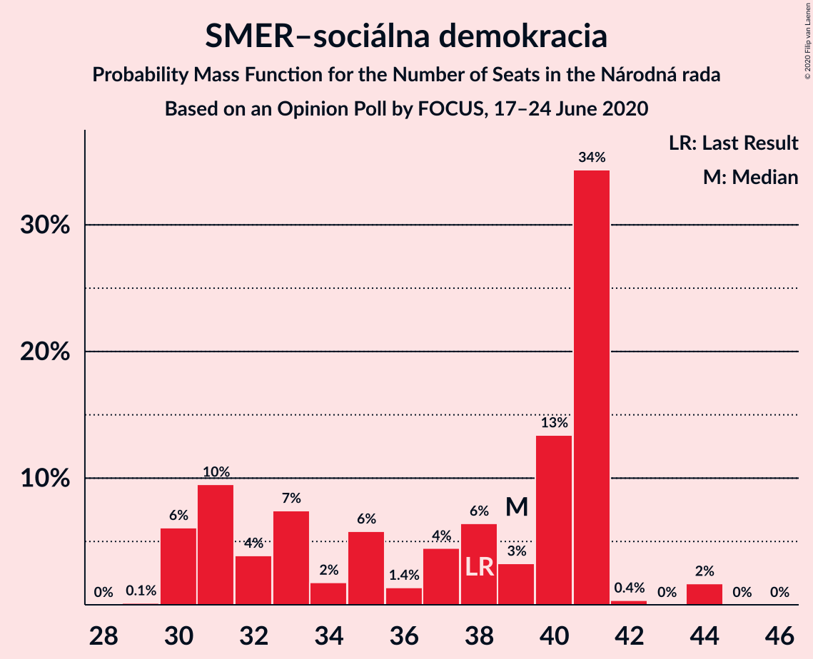
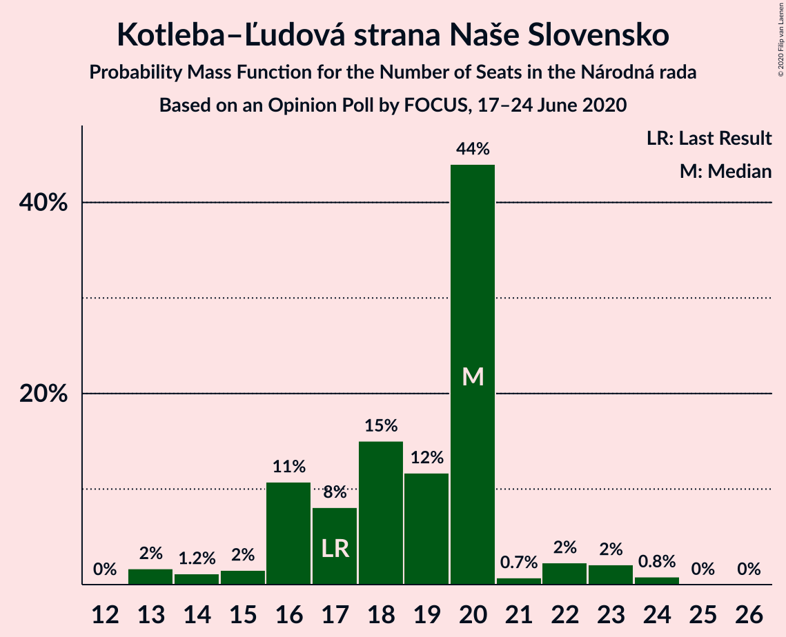
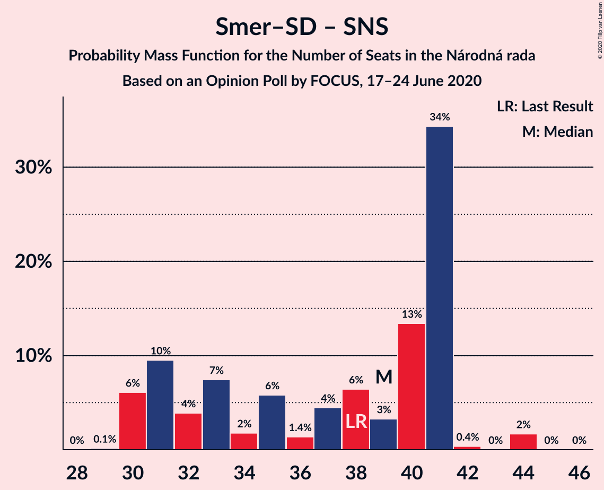

# Opinion Poll by FOCUS, 17–24 June 2020

<a href="#voting-intentions">Voting Intentions</a> | <a href="#seats">Seats</a> | <a href="#coalitions">Coalitions</a> | <a href="#technical-information">Technical Information</a>

## Voting Intentions

### Confidence Intervals

| Party | Last Result | Poll Result | 80% Confidence Interval | 90% Confidence Interval | 95% Confidence Interval | 99% Confidence Interval |
|:-----:|:-----------:|:-----------:|:-----------------------:|:-----------------------:|:-----------------------:|:-----------------------:|
| OBYČAJNÍ ĽUDIA a nezávislé osobnosti | 25.0% | 21.2% | 19.6–22.9% |19.2–23.4% |18.8–23.9% |18.1–24.7% |
| SMER–sociálna demokracia | 18.3% | 19.0% | 17.5–20.7% |17.1–21.2% |16.7–21.6% |16.0–22.4% |
| SME RODINA | 8.2% | 12.8% | 11.5–14.2% |11.2–14.6% |10.9–15.0% |10.3–15.7% |
| Kotleba–Ľudová strana Naše Slovensko | 8.0% | 9.6% | 8.5–10.9% |8.2–11.3% |7.9–11.6% |7.4–12.2% |
| Sloboda a Solidarita | 6.2% | 9.2% | 8.1–10.5% |7.8–10.9% |7.6–11.2% |7.1–11.8% |
| Progresívne Slovensko | 7.0% | 6.2% | 5.4–7.3% |5.1–7.7% |4.9–7.9% |4.5–8.5% |
| Kresťanskodemokratické hnutie | 4.6% | 4.6% | 3.8–5.5% |3.6–5.8% |3.4–6.0% |3.1–6.5% |
| Strana maďarskej koalície–Magyar Koalíció Pártja | 3.9% | 3.7% | 3.0–4.5% |2.8–4.8% |2.7–5.0% |2.4–5.5% |
| Za ľudí | 5.8% | 3.6% | 2.9–4.4% |2.7–4.7% |2.6–4.9% |2.3–5.3% |
| Dobrá voľba | 3.1% | 2.4% | 1.9–3.1% |1.7–3.3% |1.6–3.5% |1.4–3.9% |
| VLASŤ | 2.9% | 2.2% | 1.7–2.9% |1.6–3.1% |1.4–3.3% |1.2–3.7% |
| Slovenská národná strana | 3.2% | 2.1% | 1.6–2.8% |1.5–3.0% |1.4–3.2% |1.2–3.5% |
| MOST–HÍD | 2.0% | 1.5% | 1.1–2.1% |1.0–2.3% |0.9–2.4% |0.7–2.8% |
| SPOLU–Občianska Demokracia | 7.0% | 0.8% | 0.5–1.3% |0.5–1.4% |0.4–1.6% |0.3–1.8% |

*Note:* The poll result column reflects the actual value used in the calculations. Published results may vary slightly, and in addition be rounded to fewer digits.

## Seats

### Confidence Intervals

| Party | Last Result | Median | 80% Confidence Interval | 90% Confidence Interval | 95% Confidence Interval | 99% Confidence Interval |
|:-----:|:-----------:|:------:|:-----------------------:|:-----------------------:|:-----------------------:|:-----------------------:|
| <a href="#obyčajní-ľudia-a-nezávislé-osobnosti">OBYČAJNÍ ĽUDIA a nezávislé osobnosti</a> | 53 | 39 | 38–43 |37–43 |35–43 |33–44 |
| <a href="#smer–sociálna-demokracia">SMER–sociálna demokracia</a> | 38 | 39 | 31–41 |30–41 |30–41 |30–44 |
| <a href="#sme-rodina">SME RODINA</a> | 17 | 25 | 21–26 |21–28 |20–28 |18–29 |
| <a href="#kotleba–ľudová-strana-naše-slovensko">Kotleba–Ľudová strana Naše Slovensko</a> | 17 | 20 | 16–20 |16–22 |14–23 |13–24 |
| <a href="#sloboda-a-solidarita">Sloboda a Solidarita</a> | 13 | 16 | 16–19 |14–19 |14–20 |14–22 |
| <a href="#progresívne-slovensko">Progresívne Slovensko</a> | 0 | 11 | 10–14 |0–14 |0–15 |0–16 |
| <a href="#kresťanskodemokratické-hnutie">Kresťanskodemokratické hnutie</a> | 0 | 0 | 0–10 |0–12 |0–12 |0–12 |
| <a href="#strana-maďarskej-koalície–magyar-koalíció-pártja">Strana maďarskej koalície–Magyar Koalíció Pártja</a> | 0 | 0 | 0 |0 |0 |0–9 |
| <a href="#za-ľudí">Za ľudí</a> | 12 | 0 | 0 |0 |0 |0–10 |
| <a href="#dobrá-voľba">Dobrá voľba</a> | 0 | 0 | 0 |0 |0 |0 |
| <a href="#vlasť">VLASŤ</a> | 0 | 0 | 0 |0 |0 |0 |
| <a href="#slovenská-národná-strana">Slovenská národná strana</a> | 0 | 0 | 0 |0 |0 |0 |
| <a href="#most–híd">MOST–HÍD</a> | 0 | 0 | 0 |0 |0 |0 |
| <a href="#spolu–občianska-demokracia">SPOLU–Občianska Demokracia</a> | 0 | 0 | 0 |0 |0 |0 |

### OBYČAJNÍ ĽUDIA a nezávislé osobnosti

*For a full overview of the results for this party, see the [OBYČAJNÍ ĽUDIA a nezávislé osobnosti](party-obyčajníľudiaanezávisléosobnosti.html) page.*

| Number of Seats | Probability | Accumulated | Special Marks |
|:---------------:|:-----------:|:-----------:|:-------------:|
| 32 | 0.1% | 100% |  |
| 33 | 0.9% | 99.9% |  |
| 34 | 0.9% | 99.0% |  |
| 35 | 0.8% | 98% |  |
| 36 | 0.6% | 97% |  |
| 37 | 3% | 97% |  |
| 38 | 43% | 94% |  |
| 39 | 5% | 51% | Median |
| 40 | 1.2% | 46% |  |
| 41 | 27% | 45% |  |
| 42 | 1.1% | 18% |  |
| 43 | 14% | 17% |  |
| 44 | 2% | 2% |  |
| 45 | 0.1% | 0.5% |  |
| 46 | 0.1% | 0.3% |  |
| 47 | 0.2% | 0.2% |  |
| 48 | 0% | 0.1% |  |
| 49 | 0% | 0% |  |
| 50 | 0% | 0% |  |
| 51 | 0% | 0% |  |
| 52 | 0% | 0% |  |
| 53 | 0% | 0% | Last Result |

### SMER–sociálna demokracia

*For a full overview of the results for this party, see the [SMER–sociálna demokracia](party-smer–sociálnademokracia.html) page.*

| Number of Seats | Probability | Accumulated | Special Marks |
|:---------------:|:-----------:|:-----------:|:-------------:|
| 29 | 0.1% | 100% |  |
| 30 | 6% | 99.8% |  |
| 31 | 10% | 94% |  |
| 32 | 4% | 84% |  |
| 33 | 7% | 80% |  |
| 34 | 2% | 73% |  |
| 35 | 6% | 71% |  |
| 36 | 1.4% | 65% |  |
| 37 | 4% | 64% |  |
| 38 | 6% | 60% | Last Result |
| 39 | 3% | 53% | Median |
| 40 | 13% | 50% |  |
| 41 | 34% | 36% |  |
| 42 | 0.4% | 2% |  |
| 43 | 0% | 2% |  |
| 44 | 2% | 2% |  |
| 45 | 0% | 0% |  |

### SME RODINA

*For a full overview of the results for this party, see the [SME RODINA](party-smerodina.html) page.*

| Number of Seats | Probability | Accumulated | Special Marks |
|:---------------:|:-----------:|:-----------:|:-------------:|
| 17 | 0% | 100% | Last Result |
| 18 | 0.9% | 99.9% |  |
| 19 | 0.9% | 99.0% |  |
| 20 | 2% | 98% |  |
| 21 | 10% | 96% |  |
| 22 | 19% | 86% |  |
| 23 | 3% | 67% |  |
| 24 | 8% | 64% |  |
| 25 | 37% | 56% | Median |
| 26 | 13% | 20% |  |
| 27 | 0.3% | 7% |  |
| 28 | 4% | 6% |  |
| 29 | 1.5% | 2% |  |
| 30 | 0.3% | 0.4% |  |
| 31 | 0.1% | 0.1% |  |
| 32 | 0% | 0% |  |

### Kotleba–Ľudová strana Naše Slovensko

*For a full overview of the results for this party, see the [Kotleba–Ľudová strana Naše Slovensko](party-kotleba–ľudovástrananašeslovensko.html) page.*

| Number of Seats | Probability | Accumulated | Special Marks |
|:---------------:|:-----------:|:-----------:|:-------------:|
| 13 | 2% | 100% |  |
| 14 | 1.2% | 98% |  |
| 15 | 2% | 97% |  |
| 16 | 11% | 96% |  |
| 17 | 8% | 85% | Last Result |
| 18 | 15% | 77% |  |
| 19 | 12% | 62% |  |
| 20 | 44% | 50% | Median |
| 21 | 0.7% | 6% |  |
| 22 | 2% | 5% |  |
| 23 | 2% | 3% |  |
| 24 | 0.8% | 0.9% |  |
| 25 | 0% | 0.1% |  |
| 26 | 0% | 0% |  |

### Sloboda a Solidarita

*For a full overview of the results for this party, see the [Sloboda a Solidarita](party-slobodaasolidarita.html) page.*

| Number of Seats | Probability | Accumulated | Special Marks |
|:---------------:|:-----------:|:-----------:|:-------------:|
| 12 | 0.1% | 100% |  |
| 13 | 0.2% | 99.9% | Last Result |
| 14 | 6% | 99.7% |  |
| 15 | 2% | 94% |  |
| 16 | 46% | 92% | Median |
| 17 | 26% | 45% |  |
| 18 | 9% | 20% |  |
| 19 | 8% | 11% |  |
| 20 | 2% | 3% |  |
| 21 | 0.8% | 2% |  |
| 22 | 0.2% | 0.7% |  |
| 23 | 0.3% | 0.5% |  |
| 24 | 0.1% | 0.1% |  |
| 25 | 0% | 0% |  |

### Progresívne Slovensko

*For a full overview of the results for this party, see the [Progresívne Slovensko](party-progresívneslovensko.html) page.*

| Number of Seats | Probability | Accumulated | Special Marks |
|:---------------:|:-----------:|:-----------:|:-------------:|
| 0 | 7% | 100% | Last Result |
| 1 | 0% | 93% |  |
| 2 | 0% | 93% |  |
| 3 | 0% | 93% |  |
| 4 | 0% | 93% |  |
| 5 | 0% | 93% |  |
| 6 | 0% | 93% |  |
| 7 | 0% | 93% |  |
| 8 | 0% | 93% |  |
| 9 | 0.3% | 93% |  |
| 10 | 41% | 93% |  |
| 11 | 3% | 52% | Median |
| 12 | 24% | 48% |  |
| 13 | 6% | 24% |  |
| 14 | 16% | 19% |  |
| 15 | 0.8% | 3% |  |
| 16 | 2% | 2% |  |
| 17 | 0% | 0% |  |

### Kresťanskodemokratické hnutie

*For a full overview of the results for this party, see the [Kresťanskodemokratické hnutie](party-kresťanskodemokratickéhnutie.html) page.*

| Number of Seats | Probability | Accumulated | Special Marks |
|:---------------:|:-----------:|:-----------:|:-------------:|
| 0 | 75% | 100% | Last Result, Median |
| 1 | 0% | 25% |  |
| 2 | 0% | 25% |  |
| 3 | 0% | 25% |  |
| 4 | 0% | 25% |  |
| 5 | 0% | 25% |  |
| 6 | 0% | 25% |  |
| 7 | 0% | 25% |  |
| 8 | 0% | 25% |  |
| 9 | 6% | 25% |  |
| 10 | 11% | 19% |  |
| 11 | 2% | 7% |  |
| 12 | 6% | 6% |  |
| 13 | 0.1% | 0.1% |  |
| 14 | 0% | 0% |  |

### Strana maďarskej koalície–Magyar Koalíció Pártja

*For a full overview of the results for this party, see the [Strana maďarskej koalície–Magyar Koalíció Pártja](party-stranamaďarskejkoalície–magyarkoalíciópártja.html) page.*

| Number of Seats | Probability | Accumulated | Special Marks |
|:---------------:|:-----------:|:-----------:|:-------------:|
| 0 | 99.1% | 100% | Last Result, Median |
| 1 | 0% | 0.9% |  |
| 2 | 0% | 0.9% |  |
| 3 | 0% | 0.9% |  |
| 4 | 0% | 0.9% |  |
| 5 | 0% | 0.9% |  |
| 6 | 0% | 0.9% |  |
| 7 | 0% | 0.9% |  |
| 8 | 0% | 0.9% |  |
| 9 | 0.6% | 0.9% |  |
| 10 | 0.2% | 0.3% |  |
| 11 | 0.1% | 0.1% |  |
| 12 | 0% | 0% |  |

### Za ľudí

*For a full overview of the results for this party, see the [Za ľudí](party-zaľudí.html) page.*

| Number of Seats | Probability | Accumulated | Special Marks |
|:---------------:|:-----------:|:-----------:|:-------------:|
| 0 | 98.8% | 100% | Median |
| 1 | 0% | 1.2% |  |
| 2 | 0% | 1.2% |  |
| 3 | 0% | 1.2% |  |
| 4 | 0% | 1.2% |  |
| 5 | 0% | 1.2% |  |
| 6 | 0% | 1.2% |  |
| 7 | 0% | 1.2% |  |
| 8 | 0% | 1.2% |  |
| 9 | 0.1% | 1.2% |  |
| 10 | 1.0% | 1.0% |  |
| 11 | 0% | 0% |  |
| 12 | 0% | 0% | Last Result |

### Dobrá voľba

*For a full overview of the results for this party, see the [Dobrá voľba](party-dobrávoľba.html) page.*

| Number of Seats | Probability | Accumulated | Special Marks |
|:---------------:|:-----------:|:-----------:|:-------------:|
| 0 | 100% | 100% | Last Result, Median |

### VLASŤ

*For a full overview of the results for this party, see the [VLASŤ](party-vlasť.html) page.*

| Number of Seats | Probability | Accumulated | Special Marks |
|:---------------:|:-----------:|:-----------:|:-------------:|
| 0 | 100% | 100% | Last Result, Median |

### Slovenská národná strana

*For a full overview of the results for this party, see the [Slovenská národná strana](party-slovenskánárodnástrana.html) page.*

| Number of Seats | Probability | Accumulated | Special Marks |
|:---------------:|:-----------:|:-----------:|:-------------:|
| 0 | 100% | 100% | Last Result, Median |

### MOST–HÍD

*For a full overview of the results for this party, see the [MOST–HÍD](party-most–híd.html) page.*

| Number of Seats | Probability | Accumulated | Special Marks |
|:---------------:|:-----------:|:-----------:|:-------------:|
| 0 | 100% | 100% | Last Result, Median |

### SPOLU–Občianska Demokracia

*For a full overview of the results for this party, see the [SPOLU–Občianska Demokracia](party-spolu–občianskademokracia.html) page.*

| Number of Seats | Probability | Accumulated | Special Marks |
|:---------------:|:-----------:|:-----------:|:-------------:|
| 0 | 100% | 100% | Last Result, Median |

## Coalitions

### Confidence Intervals

| Coalition | Last Result | Median | Majority? | 80% Confidence Interval | 90% Confidence Interval | 95% Confidence Interval | 99% Confidence Interval |
|:---------:|:-----------:|:------:|:---------:|:-----------------------:|:-----------------------:|:-----------------------:|:-----------------------:|
| SMER–sociálna demokracia – SME RODINA – Kotleba–Ľudová strana Naše Slovensko – Slovenská národná strana | 72 | 81 | 72% | 72–86 | 68–86 | 68–86 | 68–87 |
| SMER–sociálna demokracia – SME RODINA | 55 | 62 | 0% | 54–66 | 52–66 | 52–66 | 52–69 |
| SMER–sociálna demokracia – SME RODINA – Slovenská národná strana | 55 | 62 | 0% | 54–66 | 52–66 | 52–66 | 52–69 |
| SMER–sociálna demokracia – Slovenská národná strana – MOST–HÍD | 38 | 39 | 0% | 31–41 | 30–41 | 30–41 | 30–44 |
| SMER–sociálna demokracia | 38 | 39 | 0% | 31–41 | 30–41 | 30–41 | 30–44 |
| SMER–sociálna demokracia – Slovenská národná strana | 38 | 39 | 0% | 31–41 | 30–41 | 30–41 | 30–44 |

### SMER–sociálna demokracia – SME RODINA – Kotleba–Ľudová strana Naše Slovensko – Slovenská národná strana

| Number of Seats | Probability | Accumulated | Special Marks |
|:---------------:|:-----------:|:-----------:|:-------------:|
| 67 | 0% | 100% |  |
| 68 | 9% | 99.9% |  |
| 69 | 0.1% | 91% |  |
| 70 | 0.3% | 91% |  |
| 71 | 0.1% | 91% |  |
| 72 | 7% | 91% | Last Result |
| 73 | 1.1% | 84% |  |
| 74 | 3% | 83% |  |
| 75 | 8% | 80% |  |
| 76 | 1.1% | 72% | Majority |
| 77 | 3% | 71% |  |
| 78 | 0.9% | 68% |  |
| 79 | 0.5% | 67% |  |
| 80 | 16% | 67% |  |
| 81 | 0.9% | 50% |  |
| 82 | 3% | 50% |  |
| 83 | 3% | 46% |  |
| 84 | 7% | 44% | Median |
| 85 | 0.8% | 36% |  |
| 86 | 34% | 35% |  |
| 87 | 0.8% | 1.1% |  |
| 88 | 0.1% | 0.3% |  |
| 89 | 0.1% | 0.3% |  |
| 90 | 0.1% | 0.1% |  |
| 91 | 0% | 0% |  |

### SMER–sociálna demokracia – SME RODINA

| Number of Seats | Probability | Accumulated | Special Marks |
|:---------------:|:-----------:|:-----------:|:-------------:|
| 51 | 0.1% | 100% |  |
| 52 | 9% | 99.9% |  |
| 53 | 0.5% | 91% |  |
| 54 | 1.0% | 91% |  |
| 55 | 9% | 90% | Last Result |
| 56 | 8% | 81% |  |
| 57 | 0.5% | 73% |  |
| 58 | 1.3% | 73% |  |
| 59 | 1.2% | 72% |  |
| 60 | 7% | 70% |  |
| 61 | 2% | 63% |  |
| 62 | 13% | 61% |  |
| 63 | 4% | 48% |  |
| 64 | 6% | 44% | Median |
| 65 | 0.9% | 38% |  |
| 66 | 35% | 37% |  |
| 67 | 0.3% | 2% |  |
| 68 | 1.1% | 2% |  |
| 69 | 1.0% | 1.1% |  |
| 70 | 0% | 0.1% |  |
| 71 | 0% | 0.1% |  |
| 72 | 0% | 0% |  |

### SMER–sociálna demokracia – SME RODINA – Slovenská národná strana

| Number of Seats | Probability | Accumulated | Special Marks |
|:---------------:|:-----------:|:-----------:|:-------------:|
| 51 | 0.1% | 100% |  |
| 52 | 9% | 99.9% |  |
| 53 | 0.5% | 91% |  |
| 54 | 1.0% | 91% |  |
| 55 | 9% | 90% | Last Result |
| 56 | 8% | 81% |  |
| 57 | 0.5% | 73% |  |
| 58 | 1.3% | 73% |  |
| 59 | 1.2% | 72% |  |
| 60 | 7% | 70% |  |
| 61 | 2% | 63% |  |
| 62 | 13% | 61% |  |
| 63 | 4% | 48% |  |
| 64 | 6% | 44% | Median |
| 65 | 0.9% | 38% |  |
| 66 | 35% | 37% |  |
| 67 | 0.3% | 2% |  |
| 68 | 1.1% | 2% |  |
| 69 | 1.0% | 1.1% |  |
| 70 | 0% | 0.1% |  |
| 71 | 0% | 0.1% |  |
| 72 | 0% | 0% |  |

### SMER–sociálna demokracia – Slovenská národná strana – MOST–HÍD

| Number of Seats | Probability | Accumulated | Special Marks |
|:---------------:|:-----------:|:-----------:|:-------------:|
| 29 | 0.1% | 100% |  |
| 30 | 6% | 99.8% |  |
| 31 | 10% | 94% |  |
| 32 | 4% | 84% |  |
| 33 | 7% | 80% |  |
| 34 | 2% | 73% |  |
| 35 | 6% | 71% |  |
| 36 | 1.4% | 65% |  |
| 37 | 4% | 64% |  |
| 38 | 6% | 60% | Last Result |
| 39 | 3% | 53% | Median |
| 40 | 13% | 50% |  |
| 41 | 34% | 36% |  |
| 42 | 0.4% | 2% |  |
| 43 | 0% | 2% |  |
| 44 | 2% | 2% |  |
| 45 | 0% | 0% |  |

### SMER–sociálna demokracia

| Number of Seats | Probability | Accumulated | Special Marks |
|:---------------:|:-----------:|:-----------:|:-------------:|
| 29 | 0.1% | 100% |  |
| 30 | 6% | 99.8% |  |
| 31 | 10% | 94% |  |
| 32 | 4% | 84% |  |
| 33 | 7% | 80% |  |
| 34 | 2% | 73% |  |
| 35 | 6% | 71% |  |
| 36 | 1.4% | 65% |  |
| 37 | 4% | 64% |  |
| 38 | 6% | 60% | Last Result |
| 39 | 3% | 53% | Median |
| 40 | 13% | 50% |  |
| 41 | 34% | 36% |  |
| 42 | 0.4% | 2% |  |
| 43 | 0% | 2% |  |
| 44 | 2% | 2% |  |
| 45 | 0% | 0% |  |

### SMER–sociálna demokracia – Slovenská národná strana

| Number of Seats | Probability | Accumulated | Special Marks |
|:---------------:|:-----------:|:-----------:|:-------------:|
| 29 | 0.1% | 100% |  |
| 30 | 6% | 99.8% |  |
| 31 | 10% | 94% |  |
| 32 | 4% | 84% |  |
| 33 | 7% | 80% |  |
| 34 | 2% | 73% |  |
| 35 | 6% | 71% |  |
| 36 | 1.4% | 65% |  |
| 37 | 4% | 64% |  |
| 38 | 6% | 60% | Last Result |
| 39 | 3% | 53% | Median |
| 40 | 13% | 50% |  |
| 41 | 34% | 36% |  |
| 42 | 0.4% | 2% |  |
| 43 | 0% | 2% |  |
| 44 | 2% | 2% |  |
| 45 | 0% | 0% |  |

## Technical Information

### Opinion Poll

+ **Polling firm:** FOCUS
+ **Commissioner(s):** —
+ **Fieldwork period:** 17–24 June 2020

### Calculations

+ **Sample size:** 1009
+ **Simulations done:** 1,048,576
+ **Error estimate:** 4.92%

