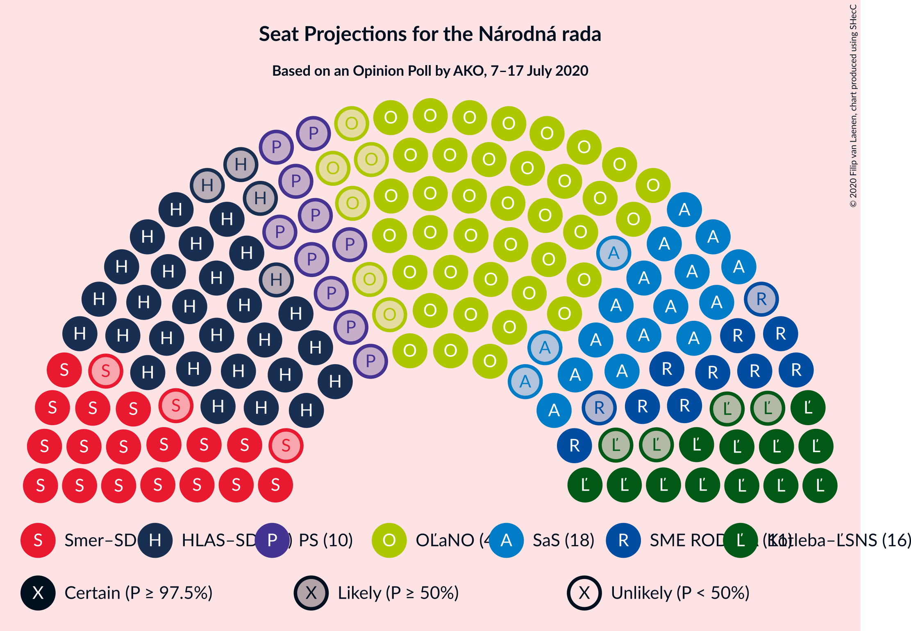
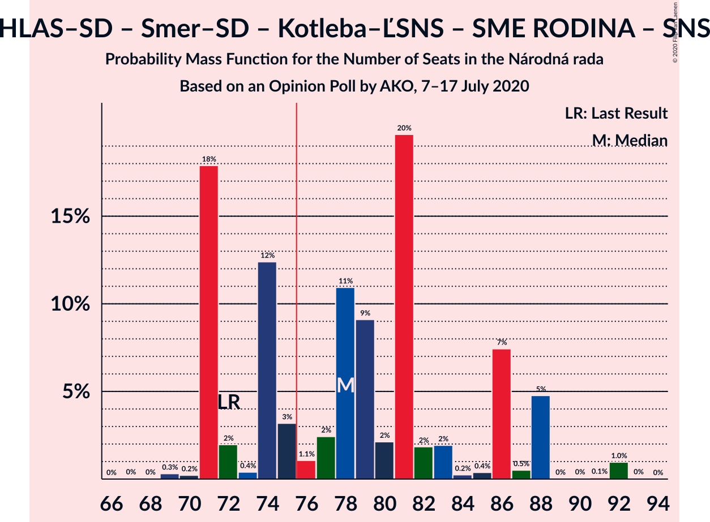
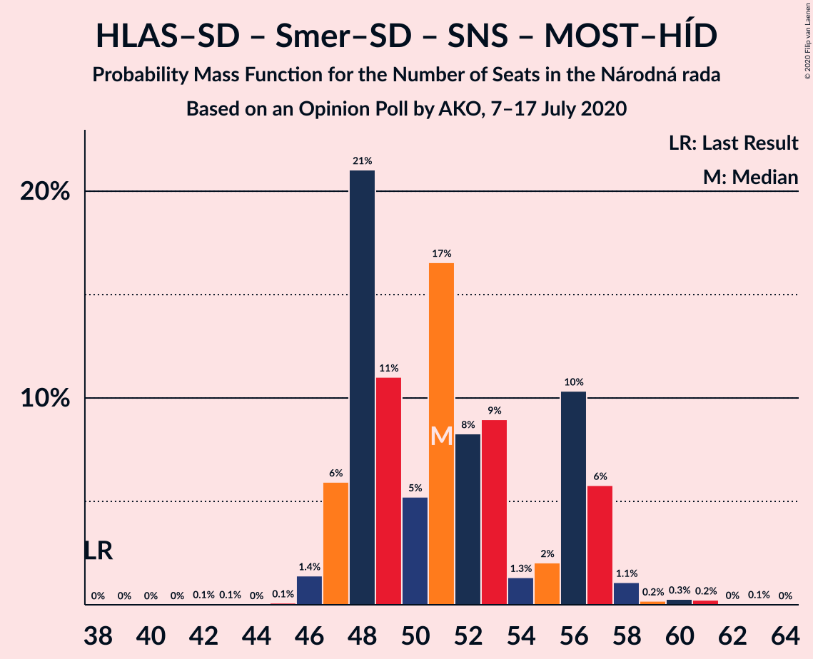
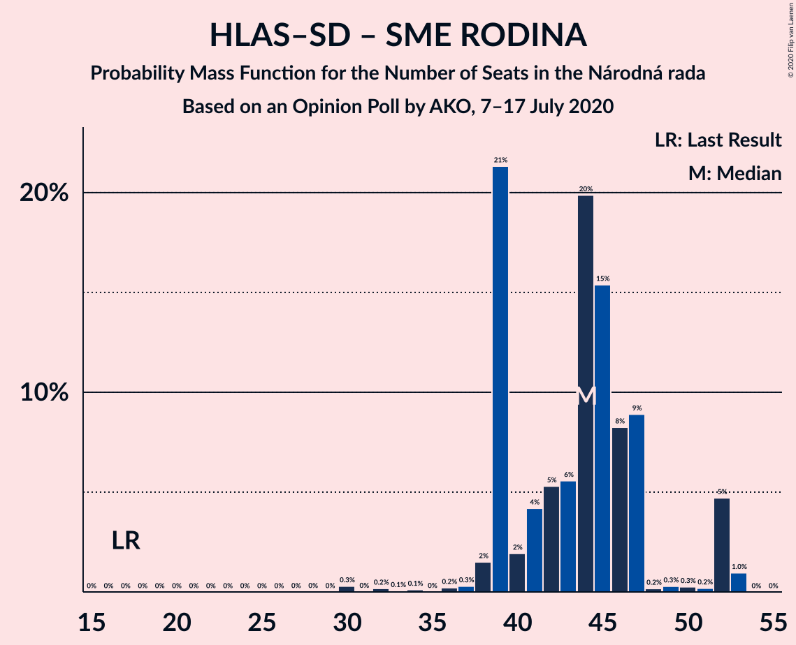

# Opinion Poll by AKO, 7–17 July 2020

<a href="#voting-intentions">Voting Intentions</a> | <a href="#seats">Seats</a> | <a href="#coalitions">Coalitions</a> | <a href="#technical-information">Technical Information</a>

## Voting Intentions

### Confidence Intervals

| Party | Last Result | Poll Result | 80% Confidence Interval | 90% Confidence Interval | 95% Confidence Interval | 99% Confidence Interval |
|:-----:|:-----------:|:-----------:|:-----------------------:|:-----------------------:|:-----------------------:|:-----------------------:|
| OBYČAJNÍ ĽUDIA a nezávislé osobnosti | 25.0% | 23.5% | 21.8–25.3% |21.4–25.8% |21.0–26.2% |20.2–27.1% |
| HLAS–sociálna demokracia | 0.0% | 16.7% | 15.3–18.3% |14.9–18.7% |14.5–19.1% |13.9–19.9% |
| SMER–sociálna demokracia | 18.3% | 10.7% | 9.5–12.1% |9.2–12.4% |8.9–12.8% |8.4–13.5% |
| Sloboda a Solidarita | 6.2% | 9.4% | 8.3–10.7% |8.0–11.1% |7.7–11.4% |7.2–12.0% |
| Kotleba–Ľudová strana Naše Slovensko | 8.0% | 7.9% | 6.9–9.1% |6.6–9.4% |6.4–9.7% |5.9–10.3% |
| SME RODINA | 8.2% | 6.4% | 5.5–7.5% |5.3–7.8% |5.0–8.1% |4.6–8.7% |
| Progresívne Slovensko | 7.0% | 5.2% | 4.4–6.2% |4.2–6.5% |4.0–6.8% |3.6–7.3% |
| Za ľudí | 5.8% | 4.0% | 3.3–4.9% |3.1–5.2% |2.9–5.4% |2.7–5.9% |
| Kresťanskodemokratické hnutie | 4.6% | 3.0% | 2.4–3.8% |2.2–4.1% |2.1–4.3% |1.9–4.7% |
| VLASŤ | 2.9% | 2.7% | 2.1–3.5% |2.0–3.7% |1.9–3.9% |1.6–4.3% |
| Dobrá voľba | 3.1% | 2.6% | 2.1–3.4% |1.9–3.6% |1.8–3.8% |1.6–4.2% |
| Strana maďarskej koalície–Magyar Koalíció Pártja | 3.9% | 2.5% | 2.0–3.3% |1.8–3.5% |1.7–3.7% |1.5–4.1% |
| SPOLU–Občianska Demokracia | 7.0% | 2.2% | 1.7–2.9% |1.6–3.1% |1.4–3.3% |1.2–3.7% |
| Slovenská národná strana | 3.2% | 1.4% | 1.0–2.0% |0.9–2.2% |0.8–2.3% |0.7–2.7% |
| MOST–HÍD | 2.0% | 1.0% | 0.7–1.5% |0.6–1.7% |0.5–1.8% |0.4–2.1% |

*Note:* The poll result column reflects the actual value used in the calculations. Published results may vary slightly, and in addition be rounded to fewer digits.

## Seats

### Confidence Intervals

| Party | Last Result | Median | 80% Confidence Interval | 90% Confidence Interval | 95% Confidence Interval | 99% Confidence Interval |
|:-----:|:-----------:|:------:|:-----------------------:|:-----------------------:|:-----------------------:|:-----------------------:|
| <a href="#obyčajní-ľudia-a-nezávislé-osobnosti">OBYČAJNÍ ĽUDIA a nezávislé osobnosti</a> | 53 | 42 | 42–46 |41–47 |38–52 |37–54 |
| <a href="#hlas–sociálna-demokracia">HLAS–sociálna demokracia</a> | 0 | 37 | 32–37 |31–37 |29–37 |28–39 |
| <a href="#smer–sociálna-demokracia">SMER–sociálna demokracia</a> | 38 | 20 | 17–20 |17–22 |17–23 |15–25 |
| <a href="#sloboda-a-solidarita">Sloboda a Solidarita</a> | 13 | 20 | 18–20 |16–20 |15–20 |12–22 |
| <a href="#kotleba–ľudová-strana-naše-slovensko">Kotleba–Ľudová strana Naše Slovensko</a> | 17 | 16 | 13–16 |13–16 |13–18 |13–19 |
| <a href="#sme-rodina">SME RODINA</a> | 17 | 15 | 10–15 |10–15 |10–15 |0–17 |
| <a href="#progresívne-slovensko">Progresívne Slovensko</a> | 0 | 0 | 0–13 |0–13 |0–13 |0–14 |
| <a href="#za-ľudí">Za ľudí</a> | 12 | 0 | 0 |0 |0 |0–11 |
| <a href="#kresťanskodemokratické-hnutie">Kresťanskodemokratické hnutie</a> | 0 | 0 | 0 |0 |0 |0 |
| <a href="#vlasť">VLASŤ</a> | 0 | 0 | 0 |0 |0 |0 |
| <a href="#dobrá-voľba">Dobrá voľba</a> | 0 | 0 | 0 |0 |0 |0 |
| <a href="#strana-maďarskej-koalície–magyar-koalíció-pártja">Strana maďarskej koalície–Magyar Koalíció Pártja</a> | 0 | 0 | 0 |0 |0 |0 |
| <a href="#spolu–občianska-demokracia">SPOLU–Občianska Demokracia</a> | 0 | 0 | 0 |0 |0 |0 |
| <a href="#slovenská-národná-strana">Slovenská národná strana</a> | 0 | 0 | 0 |0 |0 |0 |
| <a href="#most–híd">MOST–HÍD</a> | 0 | 0 | 0 |0 |0 |0 |

### OBYČAJNÍ ĽUDIA a nezávislé osobnosti

*For a full overview of the results for this party, see the [OBYČAJNÍ ĽUDIA a nezávislé osobnosti](party-obyčajníľudiaanezávisléosobnosti.html) page.*

| Number of Seats | Probability | Accumulated | Special Marks |
|:---------------:|:-----------:|:-----------:|:-------------:|
| 36 | 0.4% | 100% |  |
| 37 | 0.3% | 99.6% |  |
| 38 | 3% | 99.3% |  |
| 39 | 0.6% | 96% |  |
| 40 | 0.2% | 95% |  |
| 41 | 0.7% | 95% |  |
| 42 | 68% | 95% | Median |
| 43 | 0.2% | 27% |  |
| 44 | 1.0% | 27% |  |
| 45 | 0.1% | 26% |  |
| 46 | 20% | 26% |  |
| 47 | 2% | 5% |  |
| 48 | 0% | 4% |  |
| 49 | 0.2% | 4% |  |
| 50 | 0.6% | 3% |  |
| 51 | 0% | 3% |  |
| 52 | 1.3% | 3% |  |
| 53 | 0% | 2% | Last Result |
| 54 | 1.2% | 2% |  |
| 55 | 0% | 0.3% |  |
| 56 | 0% | 0.3% |  |
| 57 | 0.3% | 0.3% |  |
| 58 | 0% | 0% |  |

### HLAS–sociálna demokracia

*For a full overview of the results for this party, see the [HLAS–sociálna demokracia](party-hlas–sociálnademokracia.html) page.*

| Number of Seats | Probability | Accumulated | Special Marks |
|:---------------:|:-----------:|:-----------:|:-------------:|
| 0 | 0% | 100% | Last Result |
| 1 | 0% | 100% |  |
| 2 | 0% | 100% |  |
| 3 | 0% | 100% |  |
| 4 | 0% | 100% |  |
| 5 | 0% | 100% |  |
| 6 | 0% | 100% |  |
| 7 | 0% | 100% |  |
| 8 | 0% | 100% |  |
| 9 | 0% | 100% |  |
| 10 | 0% | 100% |  |
| 11 | 0% | 100% |  |
| 12 | 0% | 100% |  |
| 13 | 0% | 100% |  |
| 14 | 0% | 100% |  |
| 15 | 0% | 100% |  |
| 16 | 0% | 100% |  |
| 17 | 0% | 100% |  |
| 18 | 0% | 100% |  |
| 19 | 0% | 100% |  |
| 20 | 0% | 100% |  |
| 21 | 0% | 100% |  |
| 22 | 0% | 100% |  |
| 23 | 0% | 100% |  |
| 24 | 0% | 100% |  |
| 25 | 0.3% | 100% |  |
| 26 | 0% | 99.7% |  |
| 27 | 0.1% | 99.7% |  |
| 28 | 0.3% | 99.6% |  |
| 29 | 2% | 99.3% |  |
| 30 | 2% | 97% |  |
| 31 | 4% | 96% |  |
| 32 | 20% | 92% |  |
| 33 | 0.8% | 72% |  |
| 34 | 0.6% | 71% |  |
| 35 | 1.2% | 70% |  |
| 36 | 0.2% | 69% |  |
| 37 | 68% | 69% | Median |
| 38 | 0.3% | 0.9% |  |
| 39 | 0.1% | 0.5% |  |
| 40 | 0.5% | 0.5% |  |
| 41 | 0% | 0% |  |

### SMER–sociálna demokracia

*For a full overview of the results for this party, see the [SMER–sociálna demokracia](party-smer–sociálnademokracia.html) page.*

| Number of Seats | Probability | Accumulated | Special Marks |
|:---------------:|:-----------:|:-----------:|:-------------:|
| 13 | 0.1% | 100% |  |
| 14 | 0% | 99.9% |  |
| 15 | 1.0% | 99.9% |  |
| 16 | 0% | 98.9% |  |
| 17 | 21% | 98.9% |  |
| 18 | 0.5% | 78% |  |
| 19 | 1.1% | 78% |  |
| 20 | 70% | 76% | Median |
| 21 | 0.6% | 7% |  |
| 22 | 2% | 6% |  |
| 23 | 3% | 4% |  |
| 24 | 0.3% | 0.9% |  |
| 25 | 0.3% | 0.6% |  |
| 26 | 0.2% | 0.3% |  |
| 27 | 0% | 0.1% |  |
| 28 | 0% | 0.1% |  |
| 29 | 0% | 0.1% |  |
| 30 | 0% | 0.1% |  |
| 31 | 0.1% | 0.1% |  |
| 32 | 0% | 0% |  |
| 33 | 0% | 0% |  |
| 34 | 0% | 0% |  |
| 35 | 0% | 0% |  |
| 36 | 0% | 0% |  |
| 37 | 0% | 0% |  |
| 38 | 0% | 0% | Last Result |

### Sloboda a Solidarita

*For a full overview of the results for this party, see the [Sloboda a Solidarita](party-slobodaasolidarita.html) page.*

| Number of Seats | Probability | Accumulated | Special Marks |
|:---------------:|:-----------:|:-----------:|:-------------:|
| 12 | 0.6% | 100% |  |
| 13 | 2% | 99.4% | Last Result |
| 14 | 0.2% | 98% |  |
| 15 | 1.2% | 98% |  |
| 16 | 2% | 96% |  |
| 17 | 2% | 94% |  |
| 18 | 4% | 93% |  |
| 19 | 20% | 89% |  |
| 20 | 68% | 69% | Median |
| 21 | 0.5% | 1.2% |  |
| 22 | 0.3% | 0.7% |  |
| 23 | 0.2% | 0.4% |  |
| 24 | 0.2% | 0.2% |  |
| 25 | 0% | 0% |  |

### Kotleba–Ľudová strana Naše Slovensko

*For a full overview of the results for this party, see the [Kotleba–Ľudová strana Naše Slovensko](party-kotleba–ľudovástrananašeslovensko.html) page.*

| Number of Seats | Probability | Accumulated | Special Marks |
|:---------------:|:-----------:|:-----------:|:-------------:|
| 10 | 0% | 100% |  |
| 11 | 0.1% | 99.9% |  |
| 12 | 0.4% | 99.9% |  |
| 13 | 21% | 99.5% |  |
| 14 | 2% | 78% |  |
| 15 | 0.3% | 76% |  |
| 16 | 71% | 76% | Median |
| 17 | 1.5% | 5% | Last Result |
| 18 | 3% | 3% |  |
| 19 | 0.1% | 0.5% |  |
| 20 | 0.3% | 0.4% |  |
| 21 | 0% | 0.1% |  |
| 22 | 0.1% | 0.1% |  |
| 23 | 0% | 0% |  |

### SME RODINA

*For a full overview of the results for this party, see the [SME RODINA](party-smerodina.html) page.*

| Number of Seats | Probability | Accumulated | Special Marks |
|:---------------:|:-----------:|:-----------:|:-------------:|
| 0 | 2% | 100% |  |
| 1 | 0% | 98% |  |
| 2 | 0% | 98% |  |
| 3 | 0% | 98% |  |
| 4 | 0% | 98% |  |
| 5 | 0% | 98% |  |
| 6 | 0% | 98% |  |
| 7 | 0% | 98% |  |
| 8 | 0% | 98% |  |
| 9 | 0% | 98% |  |
| 10 | 21% | 98% |  |
| 11 | 2% | 77% |  |
| 12 | 6% | 75% |  |
| 13 | 0.8% | 69% |  |
| 14 | 0.3% | 69% |  |
| 15 | 68% | 68% | Median |
| 16 | 0.1% | 0.6% |  |
| 17 | 0% | 0.5% | Last Result |
| 18 | 0.5% | 0.5% |  |
| 19 | 0% | 0% |  |

### Progresívne Slovensko

*For a full overview of the results for this party, see the [Progresívne Slovensko](party-progresívneslovensko.html) page.*

| Number of Seats | Probability | Accumulated | Special Marks |
|:---------------:|:-----------:|:-----------:|:-------------:|
| 0 | 71% | 100% | Last Result, Median |
| 1 | 0% | 29% |  |
| 2 | 0% | 29% |  |
| 3 | 0% | 29% |  |
| 4 | 0% | 29% |  |
| 5 | 0% | 29% |  |
| 6 | 0% | 29% |  |
| 7 | 0% | 29% |  |
| 8 | 0% | 29% |  |
| 9 | 0.6% | 29% |  |
| 10 | 2% | 28% |  |
| 11 | 2% | 26% |  |
| 12 | 3% | 25% |  |
| 13 | 20% | 21% |  |
| 14 | 0.6% | 0.8% |  |
| 15 | 0% | 0.1% |  |
| 16 | 0.1% | 0.1% |  |
| 17 | 0% | 0% |  |

### Za ľudí

*For a full overview of the results for this party, see the [Za ľudí](party-zaľudí.html) page.*

| Number of Seats | Probability | Accumulated | Special Marks |
|:---------------:|:-----------:|:-----------:|:-------------:|
| 0 | 98% | 100% | Median |
| 1 | 0% | 2% |  |
| 2 | 0% | 2% |  |
| 3 | 0% | 2% |  |
| 4 | 0% | 2% |  |
| 5 | 0% | 2% |  |
| 6 | 0% | 2% |  |
| 7 | 0% | 2% |  |
| 8 | 0% | 2% |  |
| 9 | 0.3% | 2% |  |
| 10 | 0.9% | 1.4% |  |
| 11 | 0.4% | 0.5% |  |
| 12 | 0.1% | 0.1% | Last Result |
| 13 | 0% | 0% |  |

### Kresťanskodemokratické hnutie

*For a full overview of the results for this party, see the [Kresťanskodemokratické hnutie](party-kresťanskodemokratickéhnutie.html) page.*

| Number of Seats | Probability | Accumulated | Special Marks |
|:---------------:|:-----------:|:-----------:|:-------------:|
| 0 | 99.9% | 100% | Last Result, Median |
| 1 | 0% | 0.1% |  |
| 2 | 0% | 0.1% |  |
| 3 | 0% | 0.1% |  |
| 4 | 0% | 0.1% |  |
| 5 | 0% | 0.1% |  |
| 6 | 0% | 0.1% |  |
| 7 | 0% | 0.1% |  |
| 8 | 0% | 0.1% |  |
| 9 | 0.1% | 0.1% |  |
| 10 | 0% | 0% |  |

### VLASŤ

*For a full overview of the results for this party, see the [VLASŤ](party-vlasť.html) page.*

| Number of Seats | Probability | Accumulated | Special Marks |
|:---------------:|:-----------:|:-----------:|:-------------:|
| 0 | 100% | 100% | Last Result, Median |

### Dobrá voľba

*For a full overview of the results for this party, see the [Dobrá voľba](party-dobrávoľba.html) page.*

| Number of Seats | Probability | Accumulated | Special Marks |
|:---------------:|:-----------:|:-----------:|:-------------:|
| 0 | 100% | 100% | Last Result, Median |

### Strana maďarskej koalície–Magyar Koalíció Pártja

*For a full overview of the results for this party, see the [Strana maďarskej koalície–Magyar Koalíció Pártja](party-stranamaďarskejkoalície–magyarkoalíciópártja.html) page.*

| Number of Seats | Probability | Accumulated | Special Marks |
|:---------------:|:-----------:|:-----------:|:-------------:|
| 0 | 100% | 100% | Last Result, Median |

### SPOLU–Občianska Demokracia

*For a full overview of the results for this party, see the [SPOLU–Občianska Demokracia](party-spolu–občianskademokracia.html) page.*

| Number of Seats | Probability | Accumulated | Special Marks |
|:---------------:|:-----------:|:-----------:|:-------------:|
| 0 | 100% | 100% | Last Result, Median |

### Slovenská národná strana

*For a full overview of the results for this party, see the [Slovenská národná strana](party-slovenskánárodnástrana.html) page.*

| Number of Seats | Probability | Accumulated | Special Marks |
|:---------------:|:-----------:|:-----------:|:-------------:|
| 0 | 100% | 100% | Last Result, Median |

### MOST–HÍD

*For a full overview of the results for this party, see the [MOST–HÍD](party-most–híd.html) page.*

| Number of Seats | Probability | Accumulated | Special Marks |
|:---------------:|:-----------:|:-----------:|:-------------:|
| 0 | 100% | 100% | Last Result, Median |

## Coalitions

### Confidence Intervals

| Coalition | Last Result | Median | Majority? | 80% Confidence Interval | 90% Confidence Interval | 95% Confidence Interval | 99% Confidence Interval |
|:---------:|:-----------:|:------:|:---------:|:-----------------------:|:-----------------------:|:-----------------------:|:-----------------------:|
| HLAS–sociálna demokracia – SMER–sociálna demokracia – Kotleba–Ľudová strana Naše Slovensko – SME RODINA – Slovenská národná strana | 72 | 88 | 76% | 72–88 | 72–88 | 72–88 | 71–88 |
| HLAS–sociálna demokracia – SMER–sociálna demokracia – SME RODINA | 55 | 72 | 0% | 59–72 | 59–72 | 59–72 | 57–72 |
| HLAS–sociálna demokracia – SMER–sociálna demokracia – SME RODINA – Slovenská národná strana | 55 | 72 | 0% | 59–72 | 59–72 | 59–72 | 57–72 |
| HLAS–sociálna demokracia – Kotleba–Ľudová strana Naše Slovensko – SME RODINA – Slovenská národná strana | 34 | 68 | 0% | 55–68 | 55–68 | 54–68 | 51–68 |
| HLAS–sociálna demokracia – SMER–sociálna demokracia – Slovenská národná strana – MOST–HÍD | 38 | 57 | 0% | 49–57 | 49–57 | 49–57 | 48–60 |
| HLAS–sociálna demokracia – SMER–sociálna demokracia – Slovenská národná strana | 38 | 57 | 0% | 49–57 | 49–57 | 49–57 | 48–60 |
| HLAS–sociálna demokracia – SME RODINA | 17 | 52 | 0% | 42–52 | 41–52 | 40–52 | 37–52 |
| HLAS–sociálna demokracia – SME RODINA – Slovenská národná strana | 17 | 52 | 0% | 42–52 | 41–52 | 40–52 | 37–52 |
| SMER–sociálna demokracia – Kotleba–Ľudová strana Naše Slovensko – SME RODINA – Slovenská národná strana | 72 | 51 | 0% | 40–51 | 40–51 | 40–51 | 34–53 |
| HLAS–sociálna demokracia – Slovenská národná strana – MOST–HÍD | 0 | 37 | 0% | 32–37 | 31–37 | 29–37 | 28–39 |
| HLAS–sociálna demokracia – Slovenská národná strana | 0 | 37 | 0% | 32–37 | 31–37 | 29–37 | 28–39 |
| SMER–sociálna demokracia – SME RODINA | 55 | 35 | 0% | 27–35 | 27–35 | 27–35 | 20–38 |
| SMER–sociálna demokracia – SME RODINA – Slovenská národná strana | 55 | 35 | 0% | 27–35 | 27–35 | 27–35 | 20–38 |
| SMER–sociálna demokracia – Slovenská národná strana – MOST–HÍD | 38 | 20 | 0% | 17–20 | 17–22 | 17–23 | 15–25 |
| SMER–sociálna demokracia | 38 | 20 | 0% | 17–20 | 17–22 | 17–23 | 15–25 |
| SMER–sociálna demokracia – Slovenská národná strana | 38 | 20 | 0% | 17–20 | 17–22 | 17–23 | 15–25 |

### HLAS–sociálna demokracia – SMER–sociálna demokracia – Kotleba–Ľudová strana Naše Slovensko – SME RODINA – Slovenská národná strana

| Number of Seats | Probability | Accumulated | Special Marks |
|:---------------:|:-----------:|:-----------:|:-------------:|
| 71 | 0.6% | 100% |  |
| 72 | 20% | 99.4% | Last Result |
| 73 | 0.6% | 79% |  |
| 74 | 0.4% | 78% |  |
| 75 | 2% | 78% |  |
| 76 | 0.1% | 76% | Majority |
| 77 | 0.3% | 76% |  |
| 78 | 0.1% | 76% |  |
| 79 | 0% | 76% |  |
| 80 | 3% | 76% |  |
| 81 | 0.4% | 72% |  |
| 82 | 3% | 72% |  |
| 83 | 0% | 69% |  |
| 84 | 0.4% | 69% |  |
| 85 | 0.7% | 68% |  |
| 86 | 0% | 68% |  |
| 87 | 0.2% | 68% |  |
| 88 | 67% | 67% | Median |
| 89 | 0% | 0.1% |  |
| 90 | 0.1% | 0.1% |  |
| 91 | 0% | 0% |  |

### HLAS–sociálna demokracia – SMER–sociálna demokracia – SME RODINA

| Number of Seats | Probability | Accumulated | Special Marks |
|:---------------:|:-----------:|:-----------:|:-------------:|
| 54 | 0.3% | 100% |  |
| 55 | 0.1% | 99.7% | Last Result |
| 56 | 0% | 99.6% |  |
| 57 | 0.9% | 99.5% |  |
| 58 | 0.5% | 98.7% |  |
| 59 | 21% | 98% |  |
| 60 | 0.3% | 78% |  |
| 61 | 1.3% | 77% |  |
| 62 | 2% | 76% |  |
| 63 | 0.4% | 74% |  |
| 64 | 0.3% | 73% |  |
| 65 | 0.1% | 73% |  |
| 66 | 4% | 73% |  |
| 67 | 0.5% | 69% |  |
| 68 | 0.6% | 69% |  |
| 69 | 0.4% | 68% |  |
| 70 | 0.1% | 68% |  |
| 71 | 0.1% | 68% |  |
| 72 | 67% | 68% | Median |
| 73 | 0% | 0.1% |  |
| 74 | 0% | 0.1% |  |
| 75 | 0.1% | 0.1% |  |
| 76 | 0% | 0% | Majority |

### HLAS–sociálna demokracia – SMER–sociálna demokracia – SME RODINA – Slovenská národná strana

| Number of Seats | Probability | Accumulated | Special Marks |
|:---------------:|:-----------:|:-----------:|:-------------:|
| 54 | 0.3% | 100% |  |
| 55 | 0.1% | 99.7% | Last Result |
| 56 | 0% | 99.6% |  |
| 57 | 0.9% | 99.5% |  |
| 58 | 0.5% | 98.7% |  |
| 59 | 21% | 98% |  |
| 60 | 0.3% | 78% |  |
| 61 | 1.3% | 77% |  |
| 62 | 2% | 76% |  |
| 63 | 0.4% | 74% |  |
| 64 | 0.3% | 73% |  |
| 65 | 0.1% | 73% |  |
| 66 | 4% | 73% |  |
| 67 | 0.5% | 69% |  |
| 68 | 0.6% | 69% |  |
| 69 | 0.4% | 68% |  |
| 70 | 0.1% | 68% |  |
| 71 | 0.1% | 68% |  |
| 72 | 67% | 68% | Median |
| 73 | 0% | 0.1% |  |
| 74 | 0% | 0.1% |  |
| 75 | 0.1% | 0.1% |  |
| 76 | 0% | 0% | Majority |

### HLAS–sociálna demokracia – Kotleba–Ľudová strana Naše Slovensko – SME RODINA – Slovenská národná strana

| Number of Seats | Probability | Accumulated | Special Marks |
|:---------------:|:-----------:|:-----------:|:-------------:|
| 34 | 0% | 100% | Last Result |
| 35 | 0% | 100% |  |
| 36 | 0% | 100% |  |
| 37 | 0% | 100% |  |
| 38 | 0% | 100% |  |
| 39 | 0% | 100% |  |
| 40 | 0% | 100% |  |
| 41 | 0% | 100% |  |
| 42 | 0% | 100% |  |
| 43 | 0% | 100% |  |
| 44 | 0% | 100% |  |
| 45 | 0% | 100% |  |
| 46 | 0% | 100% |  |
| 47 | 0% | 100% |  |
| 48 | 0% | 100% |  |
| 49 | 0% | 100% |  |
| 50 | 0% | 100% |  |
| 51 | 0.8% | 100% |  |
| 52 | 0% | 99.2% |  |
| 53 | 2% | 99.2% |  |
| 54 | 0.7% | 98% |  |
| 55 | 19% | 97% |  |
| 56 | 0.2% | 77% |  |
| 57 | 0.5% | 77% |  |
| 58 | 3% | 77% |  |
| 59 | 3% | 74% |  |
| 60 | 0.7% | 71% |  |
| 61 | 0% | 70% |  |
| 62 | 0.5% | 70% |  |
| 63 | 0.1% | 69% |  |
| 64 | 0.4% | 69% |  |
| 65 | 1.1% | 69% |  |
| 66 | 0% | 68% |  |
| 67 | 0.1% | 68% |  |
| 68 | 68% | 68% | Median |
| 69 | 0% | 0.1% |  |
| 70 | 0% | 0.1% |  |
| 71 | 0% | 0.1% |  |
| 72 | 0% | 0.1% |  |
| 73 | 0.1% | 0.1% |  |
| 74 | 0% | 0% |  |

### HLAS–sociálna demokracia – SMER–sociálna demokracia – Slovenská národná strana – MOST–HÍD

| Number of Seats | Probability | Accumulated | Special Marks |
|:---------------:|:-----------:|:-----------:|:-------------:|
| 38 | 0% | 100% | Last Result |
| 39 | 0% | 100% |  |
| 40 | 0% | 100% |  |
| 41 | 0% | 100% |  |
| 42 | 0% | 100% |  |
| 43 | 0% | 100% |  |
| 44 | 0% | 100% |  |
| 45 | 0.3% | 100% |  |
| 46 | 0% | 99.7% |  |
| 47 | 0.1% | 99.6% |  |
| 48 | 0.5% | 99.6% |  |
| 49 | 21% | 99.1% |  |
| 50 | 2% | 78% |  |
| 51 | 2% | 76% |  |
| 52 | 0% | 74% |  |
| 53 | 0.9% | 74% |  |
| 54 | 4% | 73% |  |
| 55 | 0.4% | 70% |  |
| 56 | 0.6% | 69% |  |
| 57 | 68% | 69% | Median |
| 58 | 0.1% | 0.8% |  |
| 59 | 0% | 0.7% |  |
| 60 | 0.2% | 0.6% |  |
| 61 | 0.3% | 0.4% |  |
| 62 | 0% | 0.1% |  |
| 63 | 0% | 0.1% |  |
| 64 | 0% | 0.1% |  |
| 65 | 0% | 0.1% |  |
| 66 | 0% | 0.1% |  |
| 67 | 0% | 0.1% |  |
| 68 | 0% | 0.1% |  |
| 69 | 0% | 0.1% |  |
| 70 | 0.1% | 0.1% |  |
| 71 | 0% | 0% |  |

### HLAS–sociálna demokracia – SMER–sociálna demokracia – Slovenská národná strana

| Number of Seats | Probability | Accumulated | Special Marks |
|:---------------:|:-----------:|:-----------:|:-------------:|
| 38 | 0% | 100% | Last Result |
| 39 | 0% | 100% |  |
| 40 | 0% | 100% |  |
| 41 | 0% | 100% |  |
| 42 | 0% | 100% |  |
| 43 | 0% | 100% |  |
| 44 | 0% | 100% |  |
| 45 | 0.3% | 100% |  |
| 46 | 0% | 99.7% |  |
| 47 | 0.1% | 99.6% |  |
| 48 | 0.5% | 99.6% |  |
| 49 | 21% | 99.1% |  |
| 50 | 2% | 78% |  |
| 51 | 2% | 76% |  |
| 52 | 0% | 74% |  |
| 53 | 0.9% | 74% |  |
| 54 | 4% | 73% |  |
| 55 | 0.4% | 70% |  |
| 56 | 0.6% | 69% |  |
| 57 | 68% | 69% | Median |
| 58 | 0.1% | 0.8% |  |
| 59 | 0% | 0.7% |  |
| 60 | 0.2% | 0.6% |  |
| 61 | 0.3% | 0.4% |  |
| 62 | 0% | 0.1% |  |
| 63 | 0% | 0.1% |  |
| 64 | 0% | 0.1% |  |
| 65 | 0% | 0.1% |  |
| 66 | 0% | 0.1% |  |
| 67 | 0% | 0.1% |  |
| 68 | 0% | 0.1% |  |
| 69 | 0% | 0.1% |  |
| 70 | 0.1% | 0.1% |  |
| 71 | 0% | 0% |  |

### HLAS–sociálna demokracia – SME RODINA

| Number of Seats | Probability | Accumulated | Special Marks |
|:---------------:|:-----------:|:-----------:|:-------------:|
| 17 | 0% | 100% | Last Result |
| 18 | 0% | 100% |  |
| 19 | 0% | 100% |  |
| 20 | 0% | 100% |  |
| 21 | 0% | 100% |  |
| 22 | 0% | 100% |  |
| 23 | 0% | 100% |  |
| 24 | 0% | 100% |  |
| 25 | 0% | 100% |  |
| 26 | 0% | 100% |  |
| 27 | 0% | 100% |  |
| 28 | 0% | 100% |  |
| 29 | 0% | 100% |  |
| 30 | 0% | 100% |  |
| 31 | 0% | 100% |  |
| 32 | 0% | 100% |  |
| 33 | 0% | 100% |  |
| 34 | 0.4% | 100% |  |
| 35 | 0% | 99.6% |  |
| 36 | 0.1% | 99.6% |  |
| 37 | 0.9% | 99.5% |  |
| 38 | 0.1% | 98.6% |  |
| 39 | 0.1% | 98.5% |  |
| 40 | 3% | 98% |  |
| 41 | 0.6% | 95% |  |
| 42 | 19% | 95% |  |
| 43 | 4% | 75% |  |
| 44 | 0.6% | 71% |  |
| 45 | 0.5% | 71% |  |
| 46 | 0.8% | 70% |  |
| 47 | 1.4% | 69% |  |
| 48 | 0.1% | 68% |  |
| 49 | 0% | 68% |  |
| 50 | 0.2% | 68% |  |
| 51 | 0% | 68% |  |
| 52 | 67% | 68% | Median |
| 53 | 0% | 0.1% |  |
| 54 | 0% | 0.1% |  |
| 55 | 0% | 0.1% |  |
| 56 | 0% | 0.1% |  |
| 57 | 0% | 0.1% |  |
| 58 | 0.1% | 0.1% |  |
| 59 | 0% | 0% |  |

### HLAS–sociálna demokracia – SME RODINA – Slovenská národná strana

| Number of Seats | Probability | Accumulated | Special Marks |
|:---------------:|:-----------:|:-----------:|:-------------:|
| 17 | 0% | 100% | Last Result |
| 18 | 0% | 100% |  |
| 19 | 0% | 100% |  |
| 20 | 0% | 100% |  |
| 21 | 0% | 100% |  |
| 22 | 0% | 100% |  |
| 23 | 0% | 100% |  |
| 24 | 0% | 100% |  |
| 25 | 0% | 100% |  |
| 26 | 0% | 100% |  |
| 27 | 0% | 100% |  |
| 28 | 0% | 100% |  |
| 29 | 0% | 100% |  |
| 30 | 0% | 100% |  |
| 31 | 0% | 100% |  |
| 32 | 0% | 100% |  |
| 33 | 0% | 100% |  |
| 34 | 0.4% | 100% |  |
| 35 | 0% | 99.6% |  |
| 36 | 0.1% | 99.6% |  |
| 37 | 0.9% | 99.5% |  |
| 38 | 0.1% | 98.6% |  |
| 39 | 0.1% | 98.5% |  |
| 40 | 3% | 98% |  |
| 41 | 0.6% | 95% |  |
| 42 | 19% | 95% |  |
| 43 | 4% | 75% |  |
| 44 | 0.6% | 71% |  |
| 45 | 0.5% | 71% |  |
| 46 | 0.8% | 70% |  |
| 47 | 1.4% | 69% |  |
| 48 | 0.1% | 68% |  |
| 49 | 0% | 68% |  |
| 50 | 0.2% | 68% |  |
| 51 | 0% | 68% |  |
| 52 | 67% | 68% | Median |
| 53 | 0% | 0.1% |  |
| 54 | 0% | 0.1% |  |
| 55 | 0% | 0.1% |  |
| 56 | 0% | 0.1% |  |
| 57 | 0% | 0.1% |  |
| 58 | 0.1% | 0.1% |  |
| 59 | 0% | 0% |  |

### SMER–sociálna demokracia – Kotleba–Ľudová strana Naše Slovensko – SME RODINA – Slovenská národná strana

| Number of Seats | Probability | Accumulated | Special Marks |
|:---------------:|:-----------:|:-----------:|:-------------:|
| 34 | 0.6% | 100% |  |
| 35 | 0.3% | 99.4% |  |
| 36 | 0.1% | 99.1% |  |
| 37 | 0% | 99.0% |  |
| 38 | 0% | 99.0% |  |
| 39 | 0.1% | 99.0% |  |
| 40 | 20% | 98.9% |  |
| 41 | 0.1% | 79% |  |
| 42 | 1.0% | 79% |  |
| 43 | 0.9% | 78% |  |
| 44 | 0.6% | 77% |  |
| 45 | 1.2% | 76% |  |
| 46 | 0.1% | 75% |  |
| 47 | 0.5% | 75% |  |
| 48 | 0.9% | 75% |  |
| 49 | 0.2% | 74% |  |
| 50 | 0.1% | 74% |  |
| 51 | 73% | 73% | Median |
| 52 | 0% | 0.6% |  |
| 53 | 0.1% | 0.6% |  |
| 54 | 0% | 0.5% |  |
| 55 | 0% | 0.4% |  |
| 56 | 0.1% | 0.4% |  |
| 57 | 0.3% | 0.3% |  |
| 58 | 0% | 0% |  |
| 59 | 0% | 0% |  |
| 60 | 0% | 0% |  |
| 61 | 0% | 0% |  |
| 62 | 0% | 0% |  |
| 63 | 0% | 0% |  |
| 64 | 0% | 0% |  |
| 65 | 0% | 0% |  |
| 66 | 0% | 0% |  |
| 67 | 0% | 0% |  |
| 68 | 0% | 0% |  |
| 69 | 0% | 0% |  |
| 70 | 0% | 0% |  |
| 71 | 0% | 0% |  |
| 72 | 0% | 0% | Last Result |

### HLAS–sociálna demokracia – Slovenská národná strana – MOST–HÍD

| Number of Seats | Probability | Accumulated | Special Marks |
|:---------------:|:-----------:|:-----------:|:-------------:|
| 0 | 0% | 100% | Last Result |
| 1 | 0% | 100% |  |
| 2 | 0% | 100% |  |
| 3 | 0% | 100% |  |
| 4 | 0% | 100% |  |
| 5 | 0% | 100% |  |
| 6 | 0% | 100% |  |
| 7 | 0% | 100% |  |
| 8 | 0% | 100% |  |
| 9 | 0% | 100% |  |
| 10 | 0% | 100% |  |
| 11 | 0% | 100% |  |
| 12 | 0% | 100% |  |
| 13 | 0% | 100% |  |
| 14 | 0% | 100% |  |
| 15 | 0% | 100% |  |
| 16 | 0% | 100% |  |
| 17 | 0% | 100% |  |
| 18 | 0% | 100% |  |
| 19 | 0% | 100% |  |
| 20 | 0% | 100% |  |
| 21 | 0% | 100% |  |
| 22 | 0% | 100% |  |
| 23 | 0% | 100% |  |
| 24 | 0% | 100% |  |
| 25 | 0.3% | 100% |  |
| 26 | 0% | 99.7% |  |
| 27 | 0.1% | 99.7% |  |
| 28 | 0.3% | 99.6% |  |
| 29 | 2% | 99.3% |  |
| 30 | 2% | 97% |  |
| 31 | 4% | 96% |  |
| 32 | 20% | 92% |  |
| 33 | 0.8% | 72% |  |
| 34 | 0.6% | 71% |  |
| 35 | 1.2% | 70% |  |
| 36 | 0.2% | 69% |  |
| 37 | 68% | 69% | Median |
| 38 | 0.3% | 0.9% |  |
| 39 | 0.1% | 0.5% |  |
| 40 | 0.5% | 0.5% |  |
| 41 | 0% | 0% |  |

### HLAS–sociálna demokracia – Slovenská národná strana

| Number of Seats | Probability | Accumulated | Special Marks |
|:---------------:|:-----------:|:-----------:|:-------------:|
| 0 | 0% | 100% | Last Result |
| 1 | 0% | 100% |  |
| 2 | 0% | 100% |  |
| 3 | 0% | 100% |  |
| 4 | 0% | 100% |  |
| 5 | 0% | 100% |  |
| 6 | 0% | 100% |  |
| 7 | 0% | 100% |  |
| 8 | 0% | 100% |  |
| 9 | 0% | 100% |  |
| 10 | 0% | 100% |  |
| 11 | 0% | 100% |  |
| 12 | 0% | 100% |  |
| 13 | 0% | 100% |  |
| 14 | 0% | 100% |  |
| 15 | 0% | 100% |  |
| 16 | 0% | 100% |  |
| 17 | 0% | 100% |  |
| 18 | 0% | 100% |  |
| 19 | 0% | 100% |  |
| 20 | 0% | 100% |  |
| 21 | 0% | 100% |  |
| 22 | 0% | 100% |  |
| 23 | 0% | 100% |  |
| 24 | 0% | 100% |  |
| 25 | 0.3% | 100% |  |
| 26 | 0% | 99.7% |  |
| 27 | 0.1% | 99.7% |  |
| 28 | 0.3% | 99.6% |  |
| 29 | 2% | 99.3% |  |
| 30 | 2% | 97% |  |
| 31 | 4% | 96% |  |
| 32 | 20% | 92% |  |
| 33 | 0.8% | 72% |  |
| 34 | 0.6% | 71% |  |
| 35 | 1.2% | 70% |  |
| 36 | 0.2% | 69% |  |
| 37 | 68% | 69% | Median |
| 38 | 0.3% | 0.9% |  |
| 39 | 0.1% | 0.5% |  |
| 40 | 0.5% | 0.5% |  |
| 41 | 0% | 0% |  |

### SMER–sociálna demokracia – SME RODINA

| Number of Seats | Probability | Accumulated | Special Marks |
|:---------------:|:-----------:|:-----------:|:-------------:|
| 17 | 0.1% | 100% |  |
| 18 | 0% | 99.9% |  |
| 19 | 0.1% | 99.9% |  |
| 20 | 0.9% | 99.8% |  |
| 21 | 0.3% | 99.0% |  |
| 22 | 0% | 98.6% |  |
| 23 | 0% | 98.6% |  |
| 24 | 0.2% | 98.6% |  |
| 25 | 0% | 98% |  |
| 26 | 0% | 98% |  |
| 27 | 21% | 98% |  |
| 28 | 0.2% | 78% |  |
| 29 | 2% | 78% |  |
| 30 | 0.4% | 76% |  |
| 31 | 0.9% | 75% |  |
| 32 | 0.3% | 75% |  |
| 33 | 2% | 74% |  |
| 34 | 0.3% | 72% |  |
| 35 | 71% | 72% | Median |
| 36 | 0.1% | 1.1% |  |
| 37 | 0% | 1.0% |  |
| 38 | 0.6% | 1.0% |  |
| 39 | 0% | 0.3% |  |
| 40 | 0.3% | 0.3% |  |
| 41 | 0% | 0% |  |
| 42 | 0% | 0% |  |
| 43 | 0% | 0% |  |
| 44 | 0% | 0% |  |
| 45 | 0% | 0% |  |
| 46 | 0% | 0% |  |
| 47 | 0% | 0% |  |
| 48 | 0% | 0% |  |
| 49 | 0% | 0% |  |
| 50 | 0% | 0% |  |
| 51 | 0% | 0% |  |
| 52 | 0% | 0% |  |
| 53 | 0% | 0% |  |
| 54 | 0% | 0% |  |
| 55 | 0% | 0% | Last Result |

### SMER–sociálna demokracia – SME RODINA – Slovenská národná strana

| Number of Seats | Probability | Accumulated | Special Marks |
|:---------------:|:-----------:|:-----------:|:-------------:|
| 17 | 0.1% | 100% |  |
| 18 | 0% | 99.9% |  |
| 19 | 0.1% | 99.9% |  |
| 20 | 0.9% | 99.8% |  |
| 21 | 0.3% | 99.0% |  |
| 22 | 0% | 98.6% |  |
| 23 | 0% | 98.6% |  |
| 24 | 0.2% | 98.6% |  |
| 25 | 0% | 98% |  |
| 26 | 0% | 98% |  |
| 27 | 21% | 98% |  |
| 28 | 0.2% | 78% |  |
| 29 | 2% | 78% |  |
| 30 | 0.4% | 76% |  |
| 31 | 0.9% | 75% |  |
| 32 | 0.3% | 75% |  |
| 33 | 2% | 74% |  |
| 34 | 0.3% | 72% |  |
| 35 | 71% | 72% | Median |
| 36 | 0.1% | 1.1% |  |
| 37 | 0% | 1.0% |  |
| 38 | 0.6% | 1.0% |  |
| 39 | 0% | 0.3% |  |
| 40 | 0.3% | 0.3% |  |
| 41 | 0% | 0% |  |
| 42 | 0% | 0% |  |
| 43 | 0% | 0% |  |
| 44 | 0% | 0% |  |
| 45 | 0% | 0% |  |
| 46 | 0% | 0% |  |
| 47 | 0% | 0% |  |
| 48 | 0% | 0% |  |
| 49 | 0% | 0% |  |
| 50 | 0% | 0% |  |
| 51 | 0% | 0% |  |
| 52 | 0% | 0% |  |
| 53 | 0% | 0% |  |
| 54 | 0% | 0% |  |
| 55 | 0% | 0% | Last Result |

### SMER–sociálna demokracia – Slovenská národná strana – MOST–HÍD

| Number of Seats | Probability | Accumulated | Special Marks |
|:---------------:|:-----------:|:-----------:|:-------------:|
| 13 | 0.1% | 100% |  |
| 14 | 0% | 99.9% |  |
| 15 | 1.0% | 99.9% |  |
| 16 | 0% | 98.9% |  |
| 17 | 21% | 98.9% |  |
| 18 | 0.5% | 78% |  |
| 19 | 1.1% | 78% |  |
| 20 | 70% | 76% | Median |
| 21 | 0.6% | 7% |  |
| 22 | 2% | 6% |  |
| 23 | 3% | 4% |  |
| 24 | 0.3% | 0.9% |  |
| 25 | 0.3% | 0.6% |  |
| 26 | 0.2% | 0.3% |  |
| 27 | 0% | 0.1% |  |
| 28 | 0% | 0.1% |  |
| 29 | 0% | 0.1% |  |
| 30 | 0% | 0.1% |  |
| 31 | 0.1% | 0.1% |  |
| 32 | 0% | 0% |  |
| 33 | 0% | 0% |  |
| 34 | 0% | 0% |  |
| 35 | 0% | 0% |  |
| 36 | 0% | 0% |  |
| 37 | 0% | 0% |  |
| 38 | 0% | 0% | Last Result |

### SMER–sociálna demokracia

| Number of Seats | Probability | Accumulated | Special Marks |
|:---------------:|:-----------:|:-----------:|:-------------:|
| 13 | 0.1% | 100% |  |
| 14 | 0% | 99.9% |  |
| 15 | 1.0% | 99.9% |  |
| 16 | 0% | 98.9% |  |
| 17 | 21% | 98.9% |  |
| 18 | 0.5% | 78% |  |
| 19 | 1.1% | 78% |  |
| 20 | 70% | 76% | Median |
| 21 | 0.6% | 7% |  |
| 22 | 2% | 6% |  |
| 23 | 3% | 4% |  |
| 24 | 0.3% | 0.9% |  |
| 25 | 0.3% | 0.6% |  |
| 26 | 0.2% | 0.3% |  |
| 27 | 0% | 0.1% |  |
| 28 | 0% | 0.1% |  |
| 29 | 0% | 0.1% |  |
| 30 | 0% | 0.1% |  |
| 31 | 0.1% | 0.1% |  |
| 32 | 0% | 0% |  |
| 33 | 0% | 0% |  |
| 34 | 0% | 0% |  |
| 35 | 0% | 0% |  |
| 36 | 0% | 0% |  |
| 37 | 0% | 0% |  |
| 38 | 0% | 0% | Last Result |

### SMER–sociálna demokracia – Slovenská národná strana

| Number of Seats | Probability | Accumulated | Special Marks |
|:---------------:|:-----------:|:-----------:|:-------------:|
| 13 | 0.1% | 100% |  |
| 14 | 0% | 99.9% |  |
| 15 | 1.0% | 99.9% |  |
| 16 | 0% | 98.9% |  |
| 17 | 21% | 98.9% |  |
| 18 | 0.5% | 78% |  |
| 19 | 1.1% | 78% |  |
| 20 | 70% | 76% | Median |
| 21 | 0.6% | 7% |  |
| 22 | 2% | 6% |  |
| 23 | 3% | 4% |  |
| 24 | 0.3% | 0.9% |  |
| 25 | 0.3% | 0.6% |  |
| 26 | 0.2% | 0.3% |  |
| 27 | 0% | 0.1% |  |
| 28 | 0% | 0.1% |  |
| 29 | 0% | 0.1% |  |
| 30 | 0% | 0.1% |  |
| 31 | 0.1% | 0.1% |  |
| 32 | 0% | 0% |  |
| 33 | 0% | 0% |  |
| 34 | 0% | 0% |  |
| 35 | 0% | 0% |  |
| 36 | 0% | 0% |  |
| 37 | 0% | 0% |  |
| 38 | 0% | 0% | Last Result |

## Technical Information

### Opinion Poll

+ **Polling firm:** AKO
+ **Commissioner(s):** —
+ **Fieldwork period:** 7–17 July 2020

### Calculations

+ **Sample size:** 1000
+ **Simulations done:** 131,072
+ **Error estimate:** 3.87%

