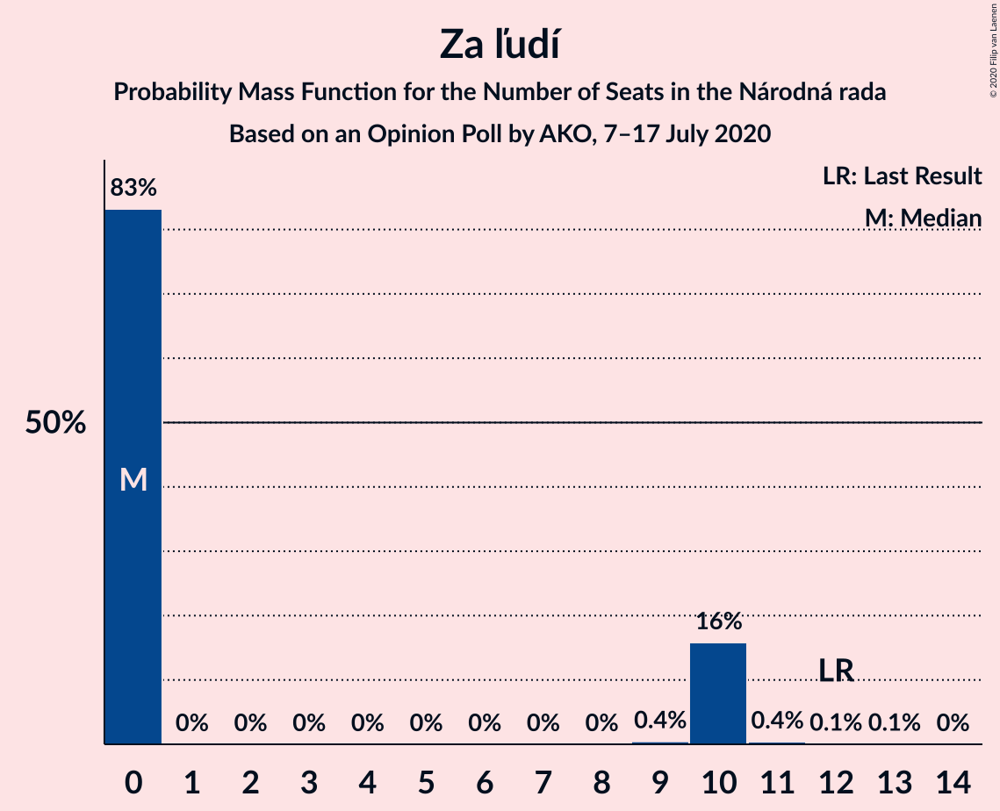
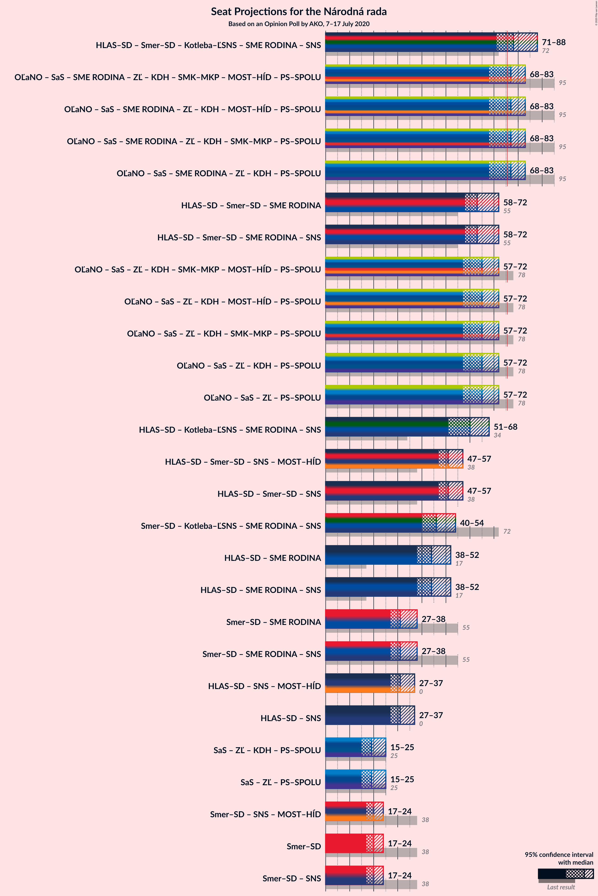
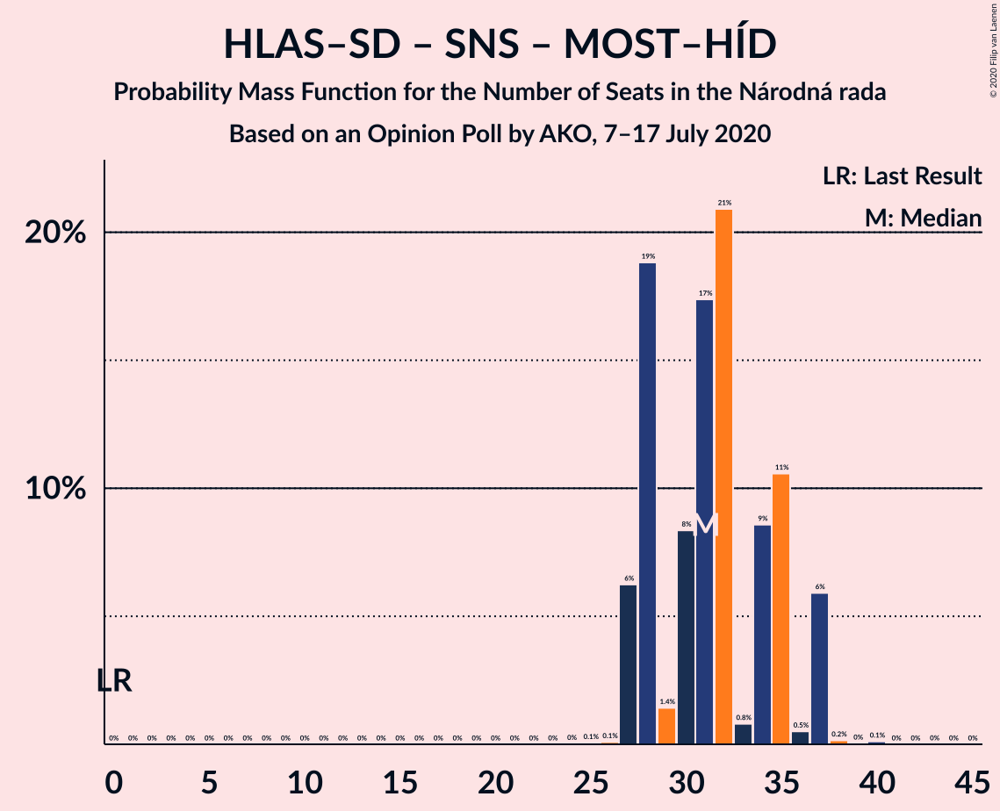
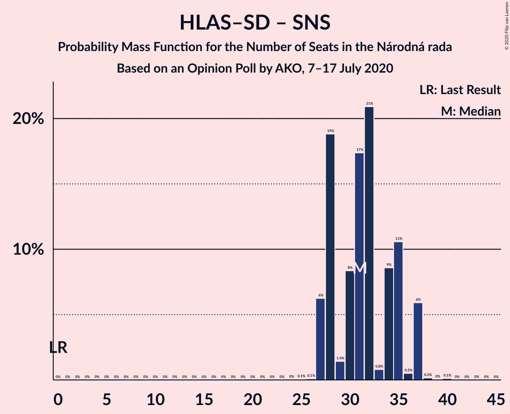

# Opinion Poll by AKO, 7–17 July 2020

<a href="#voting-intentions">Voting Intentions</a> | <a href="#seats">Seats</a> | <a href="#coalitions">Coalitions</a> | <a href="#technical-information">Technical Information</a>

## Voting Intentions

### Confidence Intervals

| Party | Last Result | Poll Result | 80% Confidence Interval | 90% Confidence Interval | 95% Confidence Interval | 99% Confidence Interval |
|:-----:|:-----------:|:-----------:|:-----------------------:|:-----------------------:|:-----------------------:|:-----------------------:|
| OBYČAJNÍ ĽUDIA a nezávislé osobnosti | 25.0% | 23.5% | 21.8–25.3% |21.4–25.8% |21.0–26.2% |20.2–27.1% |
| HLAS–sociálna demokracia | 0.0% | 16.7% | 15.3–18.3% |14.9–18.7% |14.5–19.1% |13.9–19.9% |
| SMER–sociálna demokracia | 18.3% | 10.7% | 9.5–12.1% |9.2–12.4% |8.9–12.8% |8.4–13.5% |
| Sloboda a Solidarita | 6.2% | 9.4% | 8.3–10.7% |8.0–11.1% |7.7–11.4% |7.2–12.0% |
| Kotleba–Ľudová strana Naše Slovensko | 8.0% | 7.9% | 6.9–9.1% |6.6–9.4% |6.4–9.7% |5.9–10.3% |
| SME RODINA | 8.2% | 6.4% | 5.5–7.5% |5.3–7.8% |5.0–8.1% |4.6–8.7% |
| Progresívne Slovensko | 7.0% | 5.2% | 4.4–6.2% |4.2–6.5% |4.0–6.8% |3.6–7.3% |
| Za ľudí | 5.8% | 4.0% | 3.3–4.9% |3.1–5.2% |2.9–5.4% |2.7–5.9% |
| Kresťanskodemokratické hnutie | 4.6% | 3.0% | 2.4–3.8% |2.2–4.1% |2.1–4.3% |1.9–4.7% |
| VLASŤ | 2.9% | 2.7% | 2.1–3.5% |2.0–3.7% |1.9–3.9% |1.6–4.3% |
| Dobrá voľba | 3.1% | 2.6% | 2.1–3.4% |1.9–3.6% |1.8–3.8% |1.6–4.2% |
| Strana maďarskej koalície–Magyar Koalíció Pártja | 3.9% | 2.5% | 2.0–3.3% |1.8–3.5% |1.7–3.7% |1.5–4.1% |
| SPOLU–Občianska Demokracia | 7.0% | 2.2% | 1.7–2.9% |1.6–3.1% |1.4–3.3% |1.2–3.7% |
| Slovenská národná strana | 3.2% | 1.4% | 1.0–2.0% |0.9–2.2% |0.8–2.3% |0.7–2.7% |
| MOST–HÍD | 2.0% | 1.0% | 0.7–1.5% |0.6–1.7% |0.5–1.8% |0.4–2.1% |

*Note:* The poll result column reflects the actual value used in the calculations. Published results may vary slightly, and in addition be rounded to fewer digits.

## Seats

### Confidence Intervals

| Party | Last Result | Median | 80% Confidence Interval | 90% Confidence Interval | 95% Confidence Interval | 99% Confidence Interval |
|:-----:|:-----------:|:------:|:-----------------------:|:-----------------------:|:-----------------------:|:-----------------------:|
| <a href="#obyčajní-ľudia-a-nezávislé-osobnosti">OBYČAJNÍ ĽUDIA a nezávislé osobnosti</a> | 53 | 45 | 41–49 |40–50 |38–50 |37–52 |
| <a href="#hlas–sociálna-demokracia">HLAS–sociálna demokracia</a> | 0 | 31 | 28–35 |27–37 |27–37 |27–37 |
| <a href="#smer–sociálna-demokracia">SMER–sociálna demokracia</a> | 38 | 20 | 17–23 |17–24 |17–24 |16–25 |
| <a href="#sloboda-a-solidarita">Sloboda a Solidarita</a> | 13 | 18 | 15–21 |15–25 |15–25 |14–25 |
| <a href="#kotleba–ľudová-strana-naše-slovensko">Kotleba–Ľudová strana Naše Slovensko</a> | 17 | 16 | 12–17 |12–18 |12–19 |12–19 |
| <a href="#sme-rodina">SME RODINA</a> | 17 | 12 | 11–14 |10–15 |9–15 |0–16 |
| <a href="#progresívne-slovensko">Progresívne Slovensko</a> | 0 | 10 | 0–14 |0–14 |0–14 |0–14 |
| <a href="#za-ľudí">Za ľudí</a> | 12 | 0 | 0–10 |0–10 |0–10 |0–11 |
| <a href="#kresťanskodemokratické-hnutie">Kresťanskodemokratické hnutie</a> | 0 | 0 | 0 |0 |0 |0 |
| <a href="#vlasť">VLASŤ</a> | 0 | 0 | 0 |0 |0 |0 |
| <a href="#dobrá-voľba">Dobrá voľba</a> | 0 | 0 | 0 |0 |0 |0 |
| <a href="#strana-maďarskej-koalície–magyar-koalíció-pártja">Strana maďarskej koalície–Magyar Koalíció Pártja</a> | 0 | 0 | 0 |0 |0 |0 |
| <a href="#spolu–občianska-demokracia">SPOLU–Občianska Demokracia</a> | 0 | 0 | 0 |0 |0 |0 |
| <a href="#slovenská-národná-strana">Slovenská národná strana</a> | 0 | 0 | 0 |0 |0 |0 |
| <a href="#most–híd">MOST–HÍD</a> | 0 | 0 | 0 |0 |0 |0 |

### OBYČAJNÍ ĽUDIA a nezávislé osobnosti

*For a full overview of the results for this party, see the [OBYČAJNÍ ĽUDIA a nezávislé osobnosti](party-obyčajníľudiaanezávisléosobnosti.html) page.*

| Number of Seats | Probability | Accumulated | Special Marks |
|:---------------:|:-----------:|:-----------:|:-------------:|
| 36 | 0.4% | 100% |  |
| 37 | 1.1% | 99.6% |  |
| 38 | 2% | 98% |  |
| 39 | 0.9% | 97% |  |
| 40 | 1.1% | 96% |  |
| 41 | 5% | 95% |  |
| 42 | 10% | 90% |  |
| 43 | 3% | 80% |  |
| 44 | 26% | 77% |  |
| 45 | 8% | 51% | Median |
| 46 | 3% | 43% |  |
| 47 | 3% | 41% |  |
| 48 | 26% | 37% |  |
| 49 | 2% | 12% |  |
| 50 | 8% | 10% |  |
| 51 | 0.9% | 1.4% |  |
| 52 | 0.2% | 0.5% |  |
| 53 | 0.1% | 0.4% | Last Result |
| 54 | 0.2% | 0.3% |  |
| 55 | 0.1% | 0.1% |  |
| 56 | 0% | 0% |  |

### HLAS–sociálna demokracia

*For a full overview of the results for this party, see the [HLAS–sociálna demokracia](party-hlas–sociálnademokracia.html) page.*

| Number of Seats | Probability | Accumulated | Special Marks |
|:---------------:|:-----------:|:-----------:|:-------------:|
| 0 | 0% | 100% | Last Result |
| 1 | 0% | 100% |  |
| 2 | 0% | 100% |  |
| 3 | 0% | 100% |  |
| 4 | 0% | 100% |  |
| 5 | 0% | 100% |  |
| 6 | 0% | 100% |  |
| 7 | 0% | 100% |  |
| 8 | 0% | 100% |  |
| 9 | 0% | 100% |  |
| 10 | 0% | 100% |  |
| 11 | 0% | 100% |  |
| 12 | 0% | 100% |  |
| 13 | 0% | 100% |  |
| 14 | 0% | 100% |  |
| 15 | 0% | 100% |  |
| 16 | 0% | 100% |  |
| 17 | 0% | 100% |  |
| 18 | 0% | 100% |  |
| 19 | 0% | 100% |  |
| 20 | 0% | 100% |  |
| 21 | 0% | 100% |  |
| 22 | 0% | 100% |  |
| 23 | 0% | 100% |  |
| 24 | 0% | 100% |  |
| 25 | 0.1% | 100% |  |
| 26 | 0.1% | 99.9% |  |
| 27 | 6% | 99.8% |  |
| 28 | 19% | 94% |  |
| 29 | 1.4% | 75% |  |
| 30 | 8% | 73% |  |
| 31 | 17% | 65% | Median |
| 32 | 21% | 48% |  |
| 33 | 0.8% | 27% |  |
| 34 | 9% | 26% |  |
| 35 | 11% | 17% |  |
| 36 | 0.5% | 7% |  |
| 37 | 6% | 6% |  |
| 38 | 0.2% | 0.3% |  |
| 39 | 0% | 0.2% |  |
| 40 | 0.1% | 0.1% |  |
| 41 | 0% | 0% |  |

### SMER–sociálna demokracia

*For a full overview of the results for this party, see the [SMER–sociálna demokracia](party-smer–sociálnademokracia.html) page.*

| Number of Seats | Probability | Accumulated | Special Marks |
|:---------------:|:-----------:|:-----------:|:-------------:|
| 14 | 0% | 100% |  |
| 15 | 0.3% | 99.9% |  |
| 16 | 0.9% | 99.6% |  |
| 17 | 11% | 98.7% |  |
| 18 | 17% | 87% |  |
| 19 | 3% | 70% |  |
| 20 | 48% | 67% | Median |
| 21 | 5% | 19% |  |
| 22 | 2% | 14% |  |
| 23 | 2% | 12% |  |
| 24 | 8% | 10% |  |
| 25 | 1.4% | 2% |  |
| 26 | 0% | 0.2% |  |
| 27 | 0% | 0.2% |  |
| 28 | 0.1% | 0.2% |  |
| 29 | 0% | 0% |  |
| 30 | 0% | 0% |  |
| 31 | 0% | 0% |  |
| 32 | 0% | 0% |  |
| 33 | 0% | 0% |  |
| 34 | 0% | 0% |  |
| 35 | 0% | 0% |  |
| 36 | 0% | 0% |  |
| 37 | 0% | 0% |  |
| 38 | 0% | 0% | Last Result |

### Sloboda a Solidarita

*For a full overview of the results for this party, see the [Sloboda a Solidarita](party-slobodaasolidarita.html) page.*

| Number of Seats | Probability | Accumulated | Special Marks |
|:---------------:|:-----------:|:-----------:|:-------------:|
| 12 | 0.2% | 100% |  |
| 13 | 0.2% | 99.8% | Last Result |
| 14 | 0.8% | 99.5% |  |
| 15 | 20% | 98.8% |  |
| 16 | 7% | 79% |  |
| 17 | 21% | 71% |  |
| 18 | 13% | 51% | Median |
| 19 | 5% | 37% |  |
| 20 | 8% | 32% |  |
| 21 | 15% | 24% |  |
| 22 | 1.4% | 9% |  |
| 23 | 0.1% | 7% |  |
| 24 | 0.1% | 7% |  |
| 25 | 7% | 7% |  |
| 26 | 0% | 0% |  |

### Kotleba–Ľudová strana Naše Slovensko

*For a full overview of the results for this party, see the [Kotleba–Ľudová strana Naše Slovensko](party-kotleba–ľudovástrananašeslovensko.html) page.*

| Number of Seats | Probability | Accumulated | Special Marks |
|:---------------:|:-----------:|:-----------:|:-------------:|
| 10 | 0% | 100% |  |
| 11 | 0.2% | 99.9% |  |
| 12 | 24% | 99.8% |  |
| 13 | 10% | 76% |  |
| 14 | 4% | 66% |  |
| 15 | 11% | 61% |  |
| 16 | 24% | 50% | Median |
| 17 | 21% | 26% | Last Result |
| 18 | 3% | 6% |  |
| 19 | 3% | 3% |  |
| 20 | 0.3% | 0.3% |  |
| 21 | 0% | 0% |  |

### SME RODINA

*For a full overview of the results for this party, see the [SME RODINA](party-smerodina.html) page.*

| Number of Seats | Probability | Accumulated | Special Marks |
|:---------------:|:-----------:|:-----------:|:-------------:|
| 0 | 1.1% | 100% |  |
| 1 | 0% | 98.9% |  |
| 2 | 0% | 98.9% |  |
| 3 | 0% | 98.9% |  |
| 4 | 0% | 98.9% |  |
| 5 | 0% | 98.9% |  |
| 6 | 0% | 98.9% |  |
| 7 | 0% | 98.9% |  |
| 8 | 0% | 98.9% |  |
| 9 | 2% | 98.9% |  |
| 10 | 4% | 97% |  |
| 11 | 33% | 93% |  |
| 12 | 16% | 59% | Median |
| 13 | 26% | 43% |  |
| 14 | 10% | 17% |  |
| 15 | 6% | 7% |  |
| 16 | 2% | 2% |  |
| 17 | 0.1% | 0.2% | Last Result |
| 18 | 0.2% | 0.2% |  |
| 19 | 0% | 0% |  |

### Progresívne Slovensko

*For a full overview of the results for this party, see the [Progresívne Slovensko](party-progresívneslovensko.html) page.*

| Number of Seats | Probability | Accumulated | Special Marks |
|:---------------:|:-----------:|:-----------:|:-------------:|
| 0 | 44% | 100% | Last Result |
| 1 | 0% | 56% |  |
| 2 | 0% | 56% |  |
| 3 | 0% | 56% |  |
| 4 | 0% | 56% |  |
| 5 | 0% | 56% |  |
| 6 | 0% | 56% |  |
| 7 | 0% | 56% |  |
| 8 | 0% | 56% |  |
| 9 | 0.9% | 56% |  |
| 10 | 25% | 56% | Median |
| 11 | 4% | 31% |  |
| 12 | 2% | 26% |  |
| 13 | 5% | 24% |  |
| 14 | 19% | 20% |  |
| 15 | 0.1% | 0.1% |  |
| 16 | 0% | 0% |  |

### Za ľudí

*For a full overview of the results for this party, see the [Za ľudí](party-zaľudí.html) page.*

| Number of Seats | Probability | Accumulated | Special Marks |
|:---------------:|:-----------:|:-----------:|:-------------:|
| 0 | 83% | 100% | Median |
| 1 | 0% | 17% |  |
| 2 | 0% | 17% |  |
| 3 | 0% | 17% |  |
| 4 | 0% | 17% |  |
| 5 | 0% | 17% |  |
| 6 | 0% | 17% |  |
| 7 | 0% | 17% |  |
| 8 | 0% | 17% |  |
| 9 | 0.4% | 17% |  |
| 10 | 16% | 16% |  |
| 11 | 0.4% | 0.5% |  |
| 12 | 0.1% | 0.1% | Last Result |
| 13 | 0.1% | 0.1% |  |
| 14 | 0% | 0% |  |

### Kresťanskodemokratické hnutie

*For a full overview of the results for this party, see the [Kresťanskodemokratické hnutie](party-kresťanskodemokratickéhnutie.html) page.*

| Number of Seats | Probability | Accumulated | Special Marks |
|:---------------:|:-----------:|:-----------:|:-------------:|
| 0 | 99.8% | 100% | Last Result, Median |
| 1 | 0% | 0.2% |  |
| 2 | 0% | 0.2% |  |
| 3 | 0% | 0.2% |  |
| 4 | 0% | 0.2% |  |
| 5 | 0% | 0.2% |  |
| 6 | 0% | 0.2% |  |
| 7 | 0% | 0.2% |  |
| 8 | 0% | 0.2% |  |
| 9 | 0% | 0.2% |  |
| 10 | 0.2% | 0.2% |  |
| 11 | 0% | 0% |  |

### VLASŤ

*For a full overview of the results for this party, see the [VLASŤ](party-vlasť.html) page.*

| Number of Seats | Probability | Accumulated | Special Marks |
|:---------------:|:-----------:|:-----------:|:-------------:|
| 0 | 100% | 100% | Last Result, Median |

### Dobrá voľba

*For a full overview of the results for this party, see the [Dobrá voľba](party-dobrávoľba.html) page.*

| Number of Seats | Probability | Accumulated | Special Marks |
|:---------------:|:-----------:|:-----------:|:-------------:|
| 0 | 100% | 100% | Last Result, Median |

### Strana maďarskej koalície–Magyar Koalíció Pártja

*For a full overview of the results for this party, see the [Strana maďarskej koalície–Magyar Koalíció Pártja](party-stranamaďarskejkoalície–magyarkoalíciópártja.html) page.*

| Number of Seats | Probability | Accumulated | Special Marks |
|:---------------:|:-----------:|:-----------:|:-------------:|
| 0 | 100% | 100% | Last Result, Median |

### SPOLU–Občianska Demokracia

*For a full overview of the results for this party, see the [SPOLU–Občianska Demokracia](party-spolu–občianskademokracia.html) page.*

| Number of Seats | Probability | Accumulated | Special Marks |
|:---------------:|:-----------:|:-----------:|:-------------:|
| 0 | 100% | 100% | Last Result, Median |

### Slovenská národná strana

*For a full overview of the results for this party, see the [Slovenská národná strana](party-slovenskánárodnástrana.html) page.*

| Number of Seats | Probability | Accumulated | Special Marks |
|:---------------:|:-----------:|:-----------:|:-------------:|
| 0 | 100% | 100% | Last Result, Median |

### MOST–HÍD

*For a full overview of the results for this party, see the [MOST–HÍD](party-most–híd.html) page.*

| Number of Seats | Probability | Accumulated | Special Marks |
|:---------------:|:-----------:|:-----------:|:-------------:|
| 0 | 100% | 100% | Last Result, Median |

## Coalitions

### Confidence Intervals

| Coalition | Last Result | Median | Majority? | 80% Confidence Interval | 90% Confidence Interval | 95% Confidence Interval | 99% Confidence Interval |
|:---------:|:-----------:|:------:|:---------:|:-----------------------:|:-----------------------:|:-----------------------:|:-----------------------:|
| HLAS–sociálna demokracia – SMER–sociálna demokracia – Kotleba–Ľudová strana Naše Slovensko – SME RODINA – Slovenská národná strana | 72 | 78 | 64% | 71–86 | 71–88 | 71–88 | 70–92 |
| HLAS–sociálna demokracia – SMER–sociálna demokracia – SME RODINA | 55 | 63 | 0.1% | 59–70 | 59–72 | 58–72 | 54–73 |
| HLAS–sociálna demokracia – SMER–sociálna demokracia – SME RODINA – Slovenská národná strana | 55 | 63 | 0.1% | 59–70 | 59–72 | 58–72 | 54–73 |
| HLAS–sociálna demokracia – Kotleba–Ľudová strana Naše Slovensko – SME RODINA – Slovenská národná strana | 34 | 60 | 0% | 51–62 | 51–68 | 51–68 | 50–72 |
| HLAS–sociálna demokracia – SMER–sociálna demokracia – Slovenská národná strana – MOST–HÍD | 38 | 51 | 0% | 48–56 | 47–57 | 47–57 | 46–60 |
| HLAS–sociálna demokracia – SMER–sociálna demokracia – Slovenská národná strana | 38 | 51 | 0% | 48–56 | 47–57 | 47–57 | 46–60 |
| SMER–sociálna demokracia – Kotleba–Ľudová strana Naše Slovensko – SME RODINA – Slovenská národná strana | 72 | 46 | 0% | 42–51 | 42–54 | 40–54 | 39–56 |
| HLAS–sociálna demokracia – SME RODINA | 17 | 44 | 0% | 39–47 | 39–52 | 38–52 | 32–53 |
| HLAS–sociálna demokracia – SME RODINA – Slovenská národná strana | 17 | 44 | 0% | 39–47 | 39–52 | 38–52 | 32–53 |
| SMER–sociálna demokracia – SME RODINA | 55 | 31 | 0% | 29–36 | 28–38 | 27–38 | 23–39 |
| SMER–sociálna demokracia – SME RODINA – Slovenská národná strana | 55 | 31 | 0% | 29–36 | 28–38 | 27–38 | 23–39 |
| HLAS–sociálna demokracia – Slovenská národná strana – MOST–HÍD | 0 | 31 | 0% | 28–35 | 27–37 | 27–37 | 27–37 |
| HLAS–sociálna demokracia – Slovenská národná strana | 0 | 31 | 0% | 28–35 | 27–37 | 27–37 | 27–37 |
| SMER–sociálna demokracia – Slovenská národná strana – MOST–HÍD | 38 | 20 | 0% | 17–23 | 17–24 | 17–24 | 16–25 |
| SMER–sociálna demokracia | 38 | 20 | 0% | 17–23 | 17–24 | 17–24 | 16–25 |
| SMER–sociálna demokracia – Slovenská národná strana | 38 | 20 | 0% | 17–23 | 17–24 | 17–24 | 16–25 |

### HLAS–sociálna demokracia – SMER–sociálna demokracia – Kotleba–Ľudová strana Naše Slovensko – SME RODINA – Slovenská národná strana

| Number of Seats | Probability | Accumulated | Special Marks |
|:---------------:|:-----------:|:-----------:|:-------------:|
| 67 | 0% | 100% |  |
| 68 | 0% | 99.9% |  |
| 69 | 0.3% | 99.9% |  |
| 70 | 0.2% | 99.6% |  |
| 71 | 18% | 99.4% |  |
| 72 | 2% | 81% | Last Result |
| 73 | 0.4% | 80% |  |
| 74 | 12% | 79% |  |
| 75 | 3% | 67% |  |
| 76 | 1.1% | 64% | Majority |
| 77 | 2% | 62% |  |
| 78 | 11% | 60% |  |
| 79 | 9% | 49% | Median |
| 80 | 2% | 40% |  |
| 81 | 20% | 38% |  |
| 82 | 2% | 18% |  |
| 83 | 2% | 16% |  |
| 84 | 0.2% | 14% |  |
| 85 | 0.4% | 14% |  |
| 86 | 7% | 14% |  |
| 87 | 0.5% | 6% |  |
| 88 | 5% | 6% |  |
| 89 | 0% | 1.1% |  |
| 90 | 0% | 1.1% |  |
| 91 | 0.1% | 1.1% |  |
| 92 | 1.0% | 1.0% |  |
| 93 | 0% | 0% |  |

### HLAS–sociálna demokracia – SMER–sociálna demokracia – SME RODINA

| Number of Seats | Probability | Accumulated | Special Marks |
|:---------------:|:-----------:|:-----------:|:-------------:|
| 51 | 0.1% | 100% |  |
| 52 | 0% | 99.9% |  |
| 53 | 0.2% | 99.8% |  |
| 54 | 0.3% | 99.6% |  |
| 55 | 0% | 99.4% | Last Result |
| 56 | 0% | 99.3% |  |
| 57 | 2% | 99.3% |  |
| 58 | 2% | 98% |  |
| 59 | 23% | 96% |  |
| 60 | 3% | 72% |  |
| 61 | 3% | 69% |  |
| 62 | 10% | 66% |  |
| 63 | 9% | 55% | Median |
| 64 | 17% | 46% |  |
| 65 | 10% | 29% |  |
| 66 | 2% | 19% |  |
| 67 | 2% | 18% |  |
| 68 | 0.3% | 16% |  |
| 69 | 2% | 16% |  |
| 70 | 7% | 14% |  |
| 71 | 0.1% | 6% |  |
| 72 | 5% | 6% |  |
| 73 | 1.1% | 1.3% |  |
| 74 | 0% | 0.2% |  |
| 75 | 0.1% | 0.2% |  |
| 76 | 0.1% | 0.1% | Majority |
| 77 | 0% | 0% |  |

### HLAS–sociálna demokracia – SMER–sociálna demokracia – SME RODINA – Slovenská národná strana

| Number of Seats | Probability | Accumulated | Special Marks |
|:---------------:|:-----------:|:-----------:|:-------------:|
| 51 | 0.1% | 100% |  |
| 52 | 0% | 99.9% |  |
| 53 | 0.2% | 99.8% |  |
| 54 | 0.3% | 99.6% |  |
| 55 | 0% | 99.4% | Last Result |
| 56 | 0% | 99.3% |  |
| 57 | 2% | 99.3% |  |
| 58 | 2% | 98% |  |
| 59 | 23% | 96% |  |
| 60 | 3% | 72% |  |
| 61 | 3% | 69% |  |
| 62 | 10% | 66% |  |
| 63 | 9% | 55% | Median |
| 64 | 17% | 46% |  |
| 65 | 10% | 29% |  |
| 66 | 2% | 19% |  |
| 67 | 2% | 18% |  |
| 68 | 0.3% | 16% |  |
| 69 | 2% | 16% |  |
| 70 | 7% | 14% |  |
| 71 | 0.1% | 6% |  |
| 72 | 5% | 6% |  |
| 73 | 1.1% | 1.3% |  |
| 74 | 0% | 0.2% |  |
| 75 | 0.1% | 0.2% |  |
| 76 | 0.1% | 0.1% | Majority |
| 77 | 0% | 0% |  |

### HLAS–sociálna demokracia – Kotleba–Ľudová strana Naše Slovensko – SME RODINA – Slovenská národná strana

| Number of Seats | Probability | Accumulated | Special Marks |
|:---------------:|:-----------:|:-----------:|:-------------:|
| 34 | 0% | 100% | Last Result |
| 35 | 0% | 100% |  |
| 36 | 0% | 100% |  |
| 37 | 0% | 100% |  |
| 38 | 0% | 100% |  |
| 39 | 0% | 100% |  |
| 40 | 0% | 100% |  |
| 41 | 0% | 100% |  |
| 42 | 0% | 100% |  |
| 43 | 0% | 100% |  |
| 44 | 0% | 100% |  |
| 45 | 0% | 100% |  |
| 46 | 0.3% | 100% |  |
| 47 | 0% | 99.7% |  |
| 48 | 0% | 99.6% |  |
| 49 | 0% | 99.6% |  |
| 50 | 0.2% | 99.6% |  |
| 51 | 17% | 99.4% |  |
| 52 | 2% | 83% |  |
| 53 | 0.2% | 81% |  |
| 54 | 5% | 81% |  |
| 55 | 2% | 76% |  |
| 56 | 2% | 74% |  |
| 57 | 9% | 73% |  |
| 58 | 8% | 64% |  |
| 59 | 4% | 56% | Median |
| 60 | 13% | 52% |  |
| 61 | 24% | 39% |  |
| 62 | 7% | 15% |  |
| 63 | 1.1% | 8% |  |
| 64 | 0.3% | 7% |  |
| 65 | 0.7% | 7% |  |
| 66 | 0.1% | 6% |  |
| 67 | 0% | 6% |  |
| 68 | 5% | 6% |  |
| 69 | 0.1% | 1.0% |  |
| 70 | 0% | 1.0% |  |
| 71 | 0% | 1.0% |  |
| 72 | 1.0% | 1.0% |  |
| 73 | 0% | 0% |  |

### HLAS–sociálna demokracia – SMER–sociálna demokracia – Slovenská národná strana – MOST–HÍD

| Number of Seats | Probability | Accumulated | Special Marks |
|:---------------:|:-----------:|:-----------:|:-------------:|
| 38 | 0% | 100% | Last Result |
| 39 | 0% | 100% |  |
| 40 | 0% | 100% |  |
| 41 | 0% | 100% |  |
| 42 | 0.1% | 100% |  |
| 43 | 0.1% | 99.9% |  |
| 44 | 0% | 99.9% |  |
| 45 | 0.1% | 99.9% |  |
| 46 | 1.4% | 99.8% |  |
| 47 | 6% | 98% |  |
| 48 | 21% | 92% |  |
| 49 | 11% | 71% |  |
| 50 | 5% | 60% |  |
| 51 | 17% | 55% | Median |
| 52 | 8% | 39% |  |
| 53 | 9% | 30% |  |
| 54 | 1.3% | 21% |  |
| 55 | 2% | 20% |  |
| 56 | 10% | 18% |  |
| 57 | 6% | 8% |  |
| 58 | 1.1% | 2% |  |
| 59 | 0.2% | 0.8% |  |
| 60 | 0.3% | 0.6% |  |
| 61 | 0.2% | 0.3% |  |
| 62 | 0% | 0.1% |  |
| 63 | 0.1% | 0.1% |  |
| 64 | 0% | 0% |  |

### HLAS–sociálna demokracia – SMER–sociálna demokracia – Slovenská národná strana

| Number of Seats | Probability | Accumulated | Special Marks |
|:---------------:|:-----------:|:-----------:|:-------------:|
| 38 | 0% | 100% | Last Result |
| 39 | 0% | 100% |  |
| 40 | 0% | 100% |  |
| 41 | 0% | 100% |  |
| 42 | 0.1% | 100% |  |
| 43 | 0.1% | 99.9% |  |
| 44 | 0% | 99.9% |  |
| 45 | 0.1% | 99.9% |  |
| 46 | 1.4% | 99.8% |  |
| 47 | 6% | 98% |  |
| 48 | 21% | 92% |  |
| 49 | 11% | 71% |  |
| 50 | 5% | 60% |  |
| 51 | 17% | 55% | Median |
| 52 | 8% | 39% |  |
| 53 | 9% | 30% |  |
| 54 | 1.3% | 21% |  |
| 55 | 2% | 20% |  |
| 56 | 10% | 18% |  |
| 57 | 6% | 8% |  |
| 58 | 1.1% | 2% |  |
| 59 | 0.2% | 0.8% |  |
| 60 | 0.3% | 0.6% |  |
| 61 | 0.2% | 0.3% |  |
| 62 | 0% | 0.1% |  |
| 63 | 0.1% | 0.1% |  |
| 64 | 0% | 0% |  |

### SMER–sociálna demokracia – Kotleba–Ľudová strana Naše Slovensko – SME RODINA – Slovenská národná strana

| Number of Seats | Probability | Accumulated | Special Marks |
|:---------------:|:-----------:|:-----------:|:-------------:|
| 34 | 0% | 100% |  |
| 35 | 0.1% | 99.9% |  |
| 36 | 0% | 99.9% |  |
| 37 | 0.2% | 99.9% |  |
| 38 | 0% | 99.7% |  |
| 39 | 0.3% | 99.7% |  |
| 40 | 2% | 99.4% |  |
| 41 | 0.1% | 97% |  |
| 42 | 8% | 97% |  |
| 43 | 27% | 90% |  |
| 44 | 2% | 63% |  |
| 45 | 8% | 61% |  |
| 46 | 3% | 53% |  |
| 47 | 8% | 50% |  |
| 48 | 3% | 42% | Median |
| 49 | 3% | 39% |  |
| 50 | 18% | 36% |  |
| 51 | 8% | 18% |  |
| 52 | 0.3% | 10% |  |
| 53 | 1.1% | 10% |  |
| 54 | 7% | 8% |  |
| 55 | 1.2% | 2% |  |
| 56 | 0.4% | 0.6% |  |
| 57 | 0.2% | 0.2% |  |
| 58 | 0% | 0% |  |
| 59 | 0% | 0% |  |
| 60 | 0% | 0% |  |
| 61 | 0% | 0% |  |
| 62 | 0% | 0% |  |
| 63 | 0% | 0% |  |
| 64 | 0% | 0% |  |
| 65 | 0% | 0% |  |
| 66 | 0% | 0% |  |
| 67 | 0% | 0% |  |
| 68 | 0% | 0% |  |
| 69 | 0% | 0% |  |
| 70 | 0% | 0% |  |
| 71 | 0% | 0% |  |
| 72 | 0% | 0% | Last Result |

### HLAS–sociálna demokracia – SME RODINA

| Number of Seats | Probability | Accumulated | Special Marks |
|:---------------:|:-----------:|:-----------:|:-------------:|
| 17 | 0% | 100% | Last Result |
| 18 | 0% | 100% |  |
| 19 | 0% | 100% |  |
| 20 | 0% | 100% |  |
| 21 | 0% | 100% |  |
| 22 | 0% | 100% |  |
| 23 | 0% | 100% |  |
| 24 | 0% | 100% |  |
| 25 | 0% | 100% |  |
| 26 | 0% | 100% |  |
| 27 | 0% | 100% |  |
| 28 | 0% | 100% |  |
| 29 | 0% | 100% |  |
| 30 | 0.3% | 100% |  |
| 31 | 0% | 99.7% |  |
| 32 | 0.2% | 99.7% |  |
| 33 | 0.1% | 99.5% |  |
| 34 | 0.1% | 99.4% |  |
| 35 | 0% | 99.3% |  |
| 36 | 0.2% | 99.3% |  |
| 37 | 0.3% | 99.1% |  |
| 38 | 2% | 98.8% |  |
| 39 | 21% | 97% |  |
| 40 | 2% | 76% |  |
| 41 | 4% | 74% |  |
| 42 | 5% | 70% |  |
| 43 | 6% | 65% | Median |
| 44 | 20% | 59% |  |
| 45 | 15% | 39% |  |
| 46 | 8% | 24% |  |
| 47 | 9% | 15% |  |
| 48 | 0.2% | 7% |  |
| 49 | 0.3% | 6% |  |
| 50 | 0.3% | 6% |  |
| 51 | 0.2% | 6% |  |
| 52 | 5% | 6% |  |
| 53 | 1.0% | 1.0% |  |
| 54 | 0% | 0% |  |

### HLAS–sociálna demokracia – SME RODINA – Slovenská národná strana

| Number of Seats | Probability | Accumulated | Special Marks |
|:---------------:|:-----------:|:-----------:|:-------------:|
| 17 | 0% | 100% | Last Result |
| 18 | 0% | 100% |  |
| 19 | 0% | 100% |  |
| 20 | 0% | 100% |  |
| 21 | 0% | 100% |  |
| 22 | 0% | 100% |  |
| 23 | 0% | 100% |  |
| 24 | 0% | 100% |  |
| 25 | 0% | 100% |  |
| 26 | 0% | 100% |  |
| 27 | 0% | 100% |  |
| 28 | 0% | 100% |  |
| 29 | 0% | 100% |  |
| 30 | 0.3% | 100% |  |
| 31 | 0% | 99.7% |  |
| 32 | 0.2% | 99.7% |  |
| 33 | 0.1% | 99.5% |  |
| 34 | 0.1% | 99.4% |  |
| 35 | 0% | 99.3% |  |
| 36 | 0.2% | 99.3% |  |
| 37 | 0.3% | 99.1% |  |
| 38 | 2% | 98.8% |  |
| 39 | 21% | 97% |  |
| 40 | 2% | 76% |  |
| 41 | 4% | 74% |  |
| 42 | 5% | 70% |  |
| 43 | 6% | 65% | Median |
| 44 | 20% | 59% |  |
| 45 | 15% | 39% |  |
| 46 | 8% | 24% |  |
| 47 | 9% | 15% |  |
| 48 | 0.2% | 7% |  |
| 49 | 0.3% | 6% |  |
| 50 | 0.3% | 6% |  |
| 51 | 0.2% | 6% |  |
| 52 | 5% | 6% |  |
| 53 | 1.0% | 1.0% |  |
| 54 | 0% | 0% |  |

### SMER–sociálna demokracia – SME RODINA

| Number of Seats | Probability | Accumulated | Special Marks |
|:---------------:|:-----------:|:-----------:|:-------------:|
| 19 | 0.1% | 100% |  |
| 20 | 0.2% | 99.9% |  |
| 21 | 0% | 99.7% |  |
| 22 | 0% | 99.7% |  |
| 23 | 0.3% | 99.6% |  |
| 24 | 0.2% | 99.3% |  |
| 25 | 0.2% | 99.1% |  |
| 26 | 0.1% | 98.9% |  |
| 27 | 2% | 98.9% |  |
| 28 | 4% | 96% |  |
| 29 | 8% | 92% |  |
| 30 | 19% | 84% |  |
| 31 | 19% | 66% |  |
| 32 | 8% | 46% | Median |
| 33 | 17% | 38% |  |
| 34 | 3% | 21% |  |
| 35 | 7% | 18% |  |
| 36 | 1.4% | 11% |  |
| 37 | 0.7% | 9% |  |
| 38 | 7% | 9% |  |
| 39 | 1.1% | 1.4% |  |
| 40 | 0.1% | 0.2% |  |
| 41 | 0% | 0.1% |  |
| 42 | 0.1% | 0.1% |  |
| 43 | 0% | 0% |  |
| 44 | 0% | 0% |  |
| 45 | 0% | 0% |  |
| 46 | 0% | 0% |  |
| 47 | 0% | 0% |  |
| 48 | 0% | 0% |  |
| 49 | 0% | 0% |  |
| 50 | 0% | 0% |  |
| 51 | 0% | 0% |  |
| 52 | 0% | 0% |  |
| 53 | 0% | 0% |  |
| 54 | 0% | 0% |  |
| 55 | 0% | 0% | Last Result |

### SMER–sociálna demokracia – SME RODINA – Slovenská národná strana

| Number of Seats | Probability | Accumulated | Special Marks |
|:---------------:|:-----------:|:-----------:|:-------------:|
| 19 | 0.1% | 100% |  |
| 20 | 0.2% | 99.9% |  |
| 21 | 0% | 99.7% |  |
| 22 | 0% | 99.7% |  |
| 23 | 0.3% | 99.6% |  |
| 24 | 0.2% | 99.3% |  |
| 25 | 0.2% | 99.1% |  |
| 26 | 0.1% | 98.9% |  |
| 27 | 2% | 98.9% |  |
| 28 | 4% | 96% |  |
| 29 | 8% | 92% |  |
| 30 | 19% | 84% |  |
| 31 | 19% | 66% |  |
| 32 | 8% | 46% | Median |
| 33 | 17% | 38% |  |
| 34 | 3% | 21% |  |
| 35 | 7% | 18% |  |
| 36 | 1.4% | 11% |  |
| 37 | 0.7% | 9% |  |
| 38 | 7% | 9% |  |
| 39 | 1.1% | 1.4% |  |
| 40 | 0.1% | 0.2% |  |
| 41 | 0% | 0.1% |  |
| 42 | 0.1% | 0.1% |  |
| 43 | 0% | 0% |  |
| 44 | 0% | 0% |  |
| 45 | 0% | 0% |  |
| 46 | 0% | 0% |  |
| 47 | 0% | 0% |  |
| 48 | 0% | 0% |  |
| 49 | 0% | 0% |  |
| 50 | 0% | 0% |  |
| 51 | 0% | 0% |  |
| 52 | 0% | 0% |  |
| 53 | 0% | 0% |  |
| 54 | 0% | 0% |  |
| 55 | 0% | 0% | Last Result |

### HLAS–sociálna demokracia – Slovenská národná strana – MOST–HÍD

| Number of Seats | Probability | Accumulated | Special Marks |
|:---------------:|:-----------:|:-----------:|:-------------:|
| 0 | 0% | 100% | Last Result |
| 1 | 0% | 100% |  |
| 2 | 0% | 100% |  |
| 3 | 0% | 100% |  |
| 4 | 0% | 100% |  |
| 5 | 0% | 100% |  |
| 6 | 0% | 100% |  |
| 7 | 0% | 100% |  |
| 8 | 0% | 100% |  |
| 9 | 0% | 100% |  |
| 10 | 0% | 100% |  |
| 11 | 0% | 100% |  |
| 12 | 0% | 100% |  |
| 13 | 0% | 100% |  |
| 14 | 0% | 100% |  |
| 15 | 0% | 100% |  |
| 16 | 0% | 100% |  |
| 17 | 0% | 100% |  |
| 18 | 0% | 100% |  |
| 19 | 0% | 100% |  |
| 20 | 0% | 100% |  |
| 21 | 0% | 100% |  |
| 22 | 0% | 100% |  |
| 23 | 0% | 100% |  |
| 24 | 0% | 100% |  |
| 25 | 0.1% | 100% |  |
| 26 | 0.1% | 99.9% |  |
| 27 | 6% | 99.8% |  |
| 28 | 19% | 94% |  |
| 29 | 1.4% | 75% |  |
| 30 | 8% | 73% |  |
| 31 | 17% | 65% | Median |
| 32 | 21% | 48% |  |
| 33 | 0.8% | 27% |  |
| 34 | 9% | 26% |  |
| 35 | 11% | 17% |  |
| 36 | 0.5% | 7% |  |
| 37 | 6% | 6% |  |
| 38 | 0.2% | 0.3% |  |
| 39 | 0% | 0.2% |  |
| 40 | 0.1% | 0.1% |  |
| 41 | 0% | 0% |  |

### HLAS–sociálna demokracia – Slovenská národná strana

| Number of Seats | Probability | Accumulated | Special Marks |
|:---------------:|:-----------:|:-----------:|:-------------:|
| 0 | 0% | 100% | Last Result |
| 1 | 0% | 100% |  |
| 2 | 0% | 100% |  |
| 3 | 0% | 100% |  |
| 4 | 0% | 100% |  |
| 5 | 0% | 100% |  |
| 6 | 0% | 100% |  |
| 7 | 0% | 100% |  |
| 8 | 0% | 100% |  |
| 9 | 0% | 100% |  |
| 10 | 0% | 100% |  |
| 11 | 0% | 100% |  |
| 12 | 0% | 100% |  |
| 13 | 0% | 100% |  |
| 14 | 0% | 100% |  |
| 15 | 0% | 100% |  |
| 16 | 0% | 100% |  |
| 17 | 0% | 100% |  |
| 18 | 0% | 100% |  |
| 19 | 0% | 100% |  |
| 20 | 0% | 100% |  |
| 21 | 0% | 100% |  |
| 22 | 0% | 100% |  |
| 23 | 0% | 100% |  |
| 24 | 0% | 100% |  |
| 25 | 0.1% | 100% |  |
| 26 | 0.1% | 99.9% |  |
| 27 | 6% | 99.8% |  |
| 28 | 19% | 94% |  |
| 29 | 1.4% | 75% |  |
| 30 | 8% | 73% |  |
| 31 | 17% | 65% | Median |
| 32 | 21% | 48% |  |
| 33 | 0.8% | 27% |  |
| 34 | 9% | 26% |  |
| 35 | 11% | 17% |  |
| 36 | 0.5% | 7% |  |
| 37 | 6% | 6% |  |
| 38 | 0.2% | 0.3% |  |
| 39 | 0% | 0.2% |  |
| 40 | 0.1% | 0.1% |  |
| 41 | 0% | 0% |  |

### SMER–sociálna demokracia – Slovenská národná strana – MOST–HÍD

| Number of Seats | Probability | Accumulated | Special Marks |
|:---------------:|:-----------:|:-----------:|:-------------:|
| 14 | 0% | 100% |  |
| 15 | 0.3% | 99.9% |  |
| 16 | 0.9% | 99.6% |  |
| 17 | 11% | 98.7% |  |
| 18 | 17% | 87% |  |
| 19 | 3% | 70% |  |
| 20 | 48% | 67% | Median |
| 21 | 5% | 19% |  |
| 22 | 2% | 14% |  |
| 23 | 2% | 12% |  |
| 24 | 8% | 10% |  |
| 25 | 1.4% | 2% |  |
| 26 | 0% | 0.2% |  |
| 27 | 0% | 0.2% |  |
| 28 | 0.1% | 0.2% |  |
| 29 | 0% | 0% |  |
| 30 | 0% | 0% |  |
| 31 | 0% | 0% |  |
| 32 | 0% | 0% |  |
| 33 | 0% | 0% |  |
| 34 | 0% | 0% |  |
| 35 | 0% | 0% |  |
| 36 | 0% | 0% |  |
| 37 | 0% | 0% |  |
| 38 | 0% | 0% | Last Result |

### SMER–sociálna demokracia

| Number of Seats | Probability | Accumulated | Special Marks |
|:---------------:|:-----------:|:-----------:|:-------------:|
| 14 | 0% | 100% |  |
| 15 | 0.3% | 99.9% |  |
| 16 | 0.9% | 99.6% |  |
| 17 | 11% | 98.7% |  |
| 18 | 17% | 87% |  |
| 19 | 3% | 70% |  |
| 20 | 48% | 67% | Median |
| 21 | 5% | 19% |  |
| 22 | 2% | 14% |  |
| 23 | 2% | 12% |  |
| 24 | 8% | 10% |  |
| 25 | 1.4% | 2% |  |
| 26 | 0% | 0.2% |  |
| 27 | 0% | 0.2% |  |
| 28 | 0.1% | 0.2% |  |
| 29 | 0% | 0% |  |
| 30 | 0% | 0% |  |
| 31 | 0% | 0% |  |
| 32 | 0% | 0% |  |
| 33 | 0% | 0% |  |
| 34 | 0% | 0% |  |
| 35 | 0% | 0% |  |
| 36 | 0% | 0% |  |
| 37 | 0% | 0% |  |
| 38 | 0% | 0% | Last Result |

### SMER–sociálna demokracia – Slovenská národná strana

| Number of Seats | Probability | Accumulated | Special Marks |
|:---------------:|:-----------:|:-----------:|:-------------:|
| 14 | 0% | 100% |  |
| 15 | 0.3% | 99.9% |  |
| 16 | 0.9% | 99.6% |  |
| 17 | 11% | 98.7% |  |
| 18 | 17% | 87% |  |
| 19 | 3% | 70% |  |
| 20 | 48% | 67% | Median |
| 21 | 5% | 19% |  |
| 22 | 2% | 14% |  |
| 23 | 2% | 12% |  |
| 24 | 8% | 10% |  |
| 25 | 1.4% | 2% |  |
| 26 | 0% | 0.2% |  |
| 27 | 0% | 0.2% |  |
| 28 | 0.1% | 0.2% |  |
| 29 | 0% | 0% |  |
| 30 | 0% | 0% |  |
| 31 | 0% | 0% |  |
| 32 | 0% | 0% |  |
| 33 | 0% | 0% |  |
| 34 | 0% | 0% |  |
| 35 | 0% | 0% |  |
| 36 | 0% | 0% |  |
| 37 | 0% | 0% |  |
| 38 | 0% | 0% | Last Result |

## Technical Information

### Opinion Poll

+ **Polling firm:** AKO
+ **Commissioner(s):** —
+ **Fieldwork period:** 7–17 July 2020

### Calculations

+ **Sample size:** 1000
+ **Simulations done:** 1,048,576
+ **Error estimate:** 3.34%

