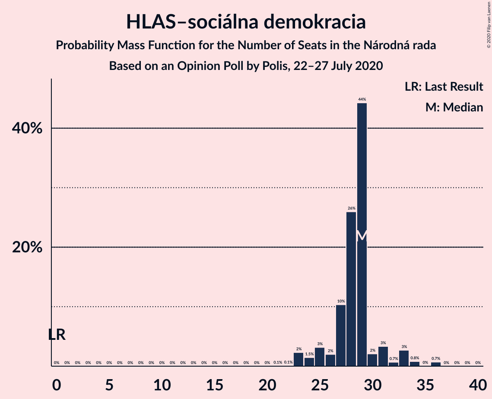
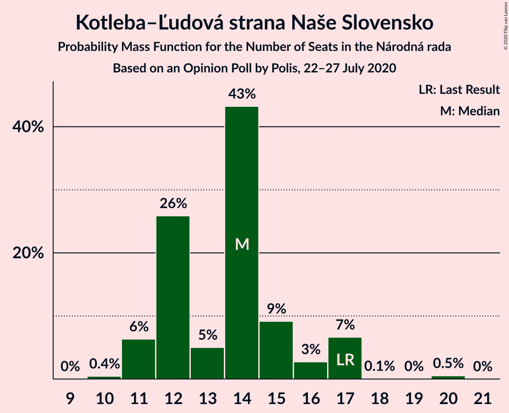
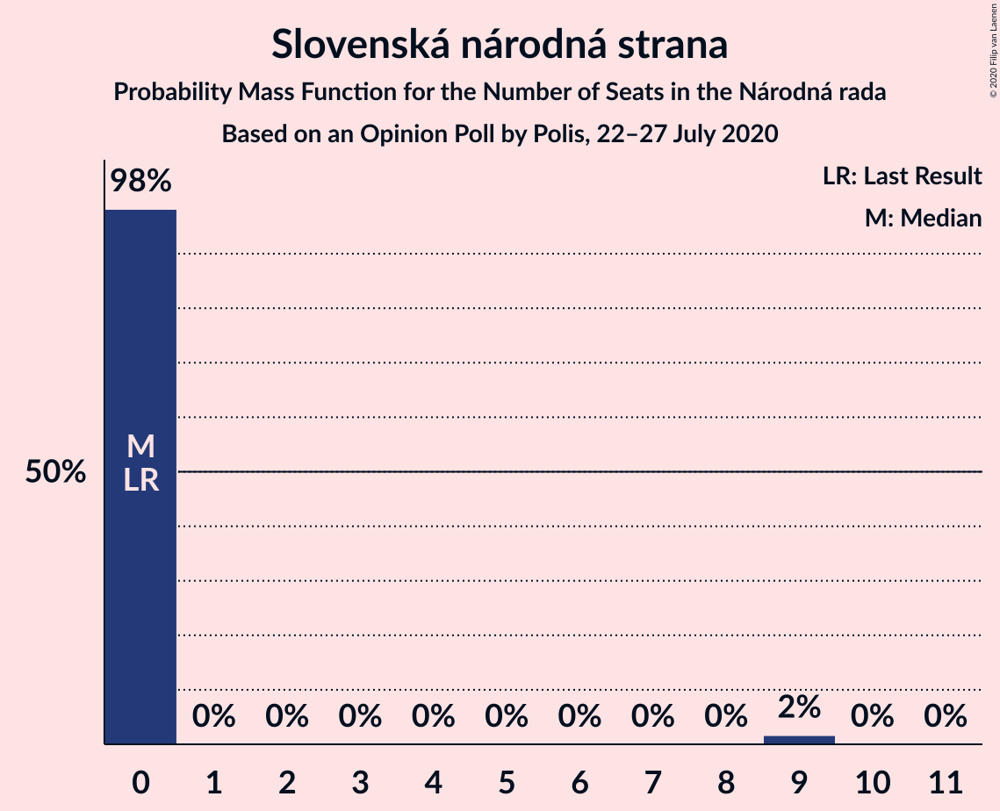
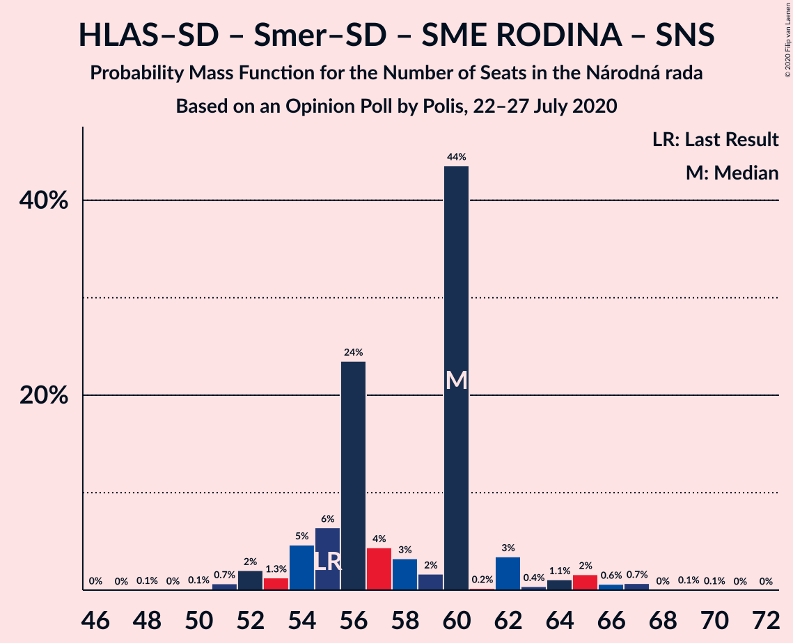
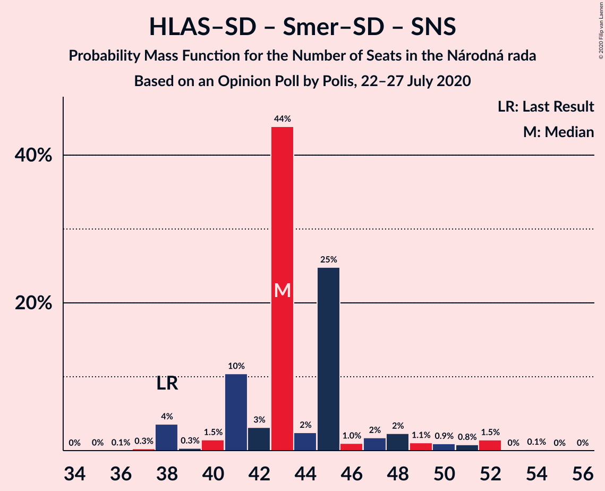
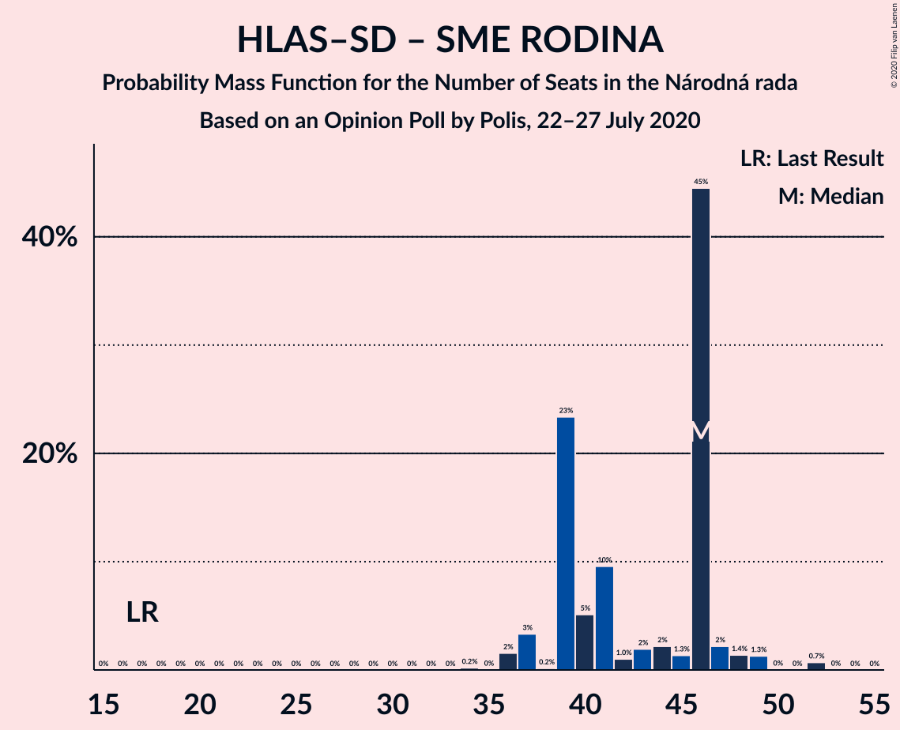

# Opinion Poll by Polis, 22–27 July 2020

<a href="#voting-intentions">Voting Intentions</a> | <a href="#seats">Seats</a> | <a href="#coalitions">Coalitions</a> | <a href="#technical-information">Technical Information</a>

## Voting Intentions

### Confidence Intervals

| Party | Last Result | Poll Result | 80% Confidence Interval | 90% Confidence Interval | 95% Confidence Interval | 99% Confidence Interval |
|:-----:|:-----------:|:-----------:|:-----------------------:|:-----------------------:|:-----------------------:|:-----------------------:|
| OBYČAJNÍ ĽUDIA a nezávislé osobnosti | 25.0% | 21.9% | 20.3–23.6% |19.8–24.1% |19.5–24.5% |18.7–25.3% |
| HLAS–sociálna demokracia | 0.0% | 16.0% | 14.6–17.5% |14.2–18.0% |13.9–18.3% |13.2–19.1% |
| Sloboda a Solidarita | 6.2% | 9.2% | 8.1–10.5% |7.8–10.8% |7.6–11.1% |7.1–11.8% |
| SMER–sociálna demokracia | 18.3% | 8.8% | 7.8–10.0% |7.5–10.4% |7.2–10.7% |6.8–11.3% |
| SME RODINA | 8.2% | 8.2% | 7.2–9.4% |6.9–9.8% |6.7–10.1% |6.2–10.7% |
| Kotleba–Ľudová strana Naše Slovensko | 8.0% | 8.0% | 7.0–9.2% |6.8–9.6% |6.5–9.9% |6.1–10.5% |
| Progresívne Slovensko | 7.0% | 6.8% | 5.9–7.9% |5.6–8.2% |5.4–8.5% |5.0–9.0% |
| Strana maďarskej koalície–Magyar Koalíció Pártja | 3.9% | 5.5% | 4.7–6.5% |4.5–6.8% |4.3–7.1% |3.9–7.6% |
| Za ľudí | 5.8% | 4.6% | 3.9–5.6% |3.7–5.9% |3.5–6.1% |3.2–6.6% |
| Kresťanskodemokratické hnutie | 4.6% | 3.9% | 3.2–4.8% |3.0–5.0% |2.9–5.2% |2.6–5.7% |
| Slovenská národná strana | 3.2% | 3.8% | 3.1–4.7% |2.9–4.9% |2.8–5.1% |2.5–5.6% |
| Dobrá voľba | 3.1% | 1.3% | 0.9–1.8% |0.8–2.0% |0.7–2.1% |0.6–2.5% |
| MOST–HÍD | 2.0% | 1.1% | 0.7–1.6% |0.7–1.8% |0.6–1.9% |0.5–2.2% |
| VLASŤ | 2.9% | 0.9% | 0.6–1.4% |0.5–1.5% |0.5–1.6% |0.4–1.9% |

*Note:* The poll result column reflects the actual value used in the calculations. Published results may vary slightly, and in addition be rounded to fewer digits.

## Seats

### Confidence Intervals

| Party | Last Result | Median | 80% Confidence Interval | 90% Confidence Interval | 95% Confidence Interval | 99% Confidence Interval |
|:-----:|:-----------:|:------:|:-----------------------:|:-----------------------:|:-----------------------:|:-----------------------:|
| <a href="#obyčajní-ľudia-a-nezávislé-osobnosti">OBYČAJNÍ ĽUDIA a nezávislé osobnosti</a> | 53 | 38 | 33–42 |33–42 |33–42 |31–43 |
| <a href="#hlas–sociálna-demokracia">HLAS–sociálna demokracia</a> | 0 | 28 | 24–33 |24–33 |24–33 |24–33 |
| <a href="#sloboda-a-solidarita">Sloboda a Solidarita</a> | 13 | 15 | 13–16 |13–17 |13–17 |12–20 |
| <a href="#smer–sociálna-demokracia">SMER–sociálna demokracia</a> | 38 | 14 | 14–17 |14–17 |14–17 |13–21 |
| <a href="#sme-rodina">SME RODINA</a> | 17 | 17 | 16–18 |13–18 |10–18 |10–18 |
| <a href="#kotleba–ľudová-strana-naše-slovensko">Kotleba–Ľudová strana Naše Slovensko</a> | 17 | 12 | 11–16 |11–16 |10–16 |10–18 |
| <a href="#progresívne-slovensko">Progresívne Slovensko</a> | 0 | 14 | 13–14 |12–14 |10–15 |0–15 |
| <a href="#strana-maďarskej-koalície–magyar-koalíció-pártja">Strana maďarskej koalície–Magyar Koalíció Pártja</a> | 0 | 11 | 10–11 |10–11 |9–11 |0–12 |
| <a href="#za-ľudí">Za ľudí</a> | 12 | 0 | 0 |0–10 |0–11 |0–11 |
| <a href="#kresťanskodemokratické-hnutie">Kresťanskodemokratické hnutie</a> | 0 | 0 | 0 |0 |0 |0–9 |
| <a href="#slovenská-národná-strana">Slovenská národná strana</a> | 0 | 0 | 0 |0 |0 |0 |
| <a href="#dobrá-voľba">Dobrá voľba</a> | 0 | 0 | 0 |0 |0 |0 |
| <a href="#most–híd">MOST–HÍD</a> | 0 | 0 | 0 |0 |0 |0 |
| <a href="#vlasť">VLASŤ</a> | 0 | 0 | 0 |0 |0 |0 |

### OBYČAJNÍ ĽUDIA a nezávislé osobnosti

*For a full overview of the results for this party, see the [OBYČAJNÍ ĽUDIA a nezávislé osobnosti](party-obyčajníľudiaanezávisléosobnosti.html) page.*

| Number of Seats | Probability | Accumulated | Special Marks |
|:---------------:|:-----------:|:-----------:|:-------------:|
| 30 | 0% | 100% |  |
| 31 | 0.6% | 99.9% |  |
| 32 | 0% | 99.3% |  |
| 33 | 16% | 99.3% |  |
| 34 | 0% | 84% |  |
| 35 | 2% | 84% |  |
| 36 | 7% | 82% |  |
| 37 | 0.9% | 75% |  |
| 38 | 31% | 74% | Median |
| 39 | 0.1% | 43% |  |
| 40 | 0.3% | 43% |  |
| 41 | 0.1% | 43% |  |
| 42 | 42% | 42% |  |
| 43 | 0% | 0.5% |  |
| 44 | 0% | 0.5% |  |
| 45 | 0% | 0.4% |  |
| 46 | 0% | 0.4% |  |
| 47 | 0.4% | 0.4% |  |
| 48 | 0% | 0% |  |
| 49 | 0% | 0% |  |
| 50 | 0% | 0% |  |
| 51 | 0% | 0% |  |
| 52 | 0% | 0% |  |
| 53 | 0% | 0% | Last Result |

### HLAS–sociálna demokracia

*For a full overview of the results for this party, see the [HLAS–sociálna demokracia](party-hlas–sociálnademokracia.html) page.*

| Number of Seats | Probability | Accumulated | Special Marks |
|:---------------:|:-----------:|:-----------:|:-------------:|
| 0 | 0% | 100% | Last Result |
| 1 | 0% | 100% |  |
| 2 | 0% | 100% |  |
| 3 | 0% | 100% |  |
| 4 | 0% | 100% |  |
| 5 | 0% | 100% |  |
| 6 | 0% | 100% |  |
| 7 | 0% | 100% |  |
| 8 | 0% | 100% |  |
| 9 | 0% | 100% |  |
| 10 | 0% | 100% |  |
| 11 | 0% | 100% |  |
| 12 | 0% | 100% |  |
| 13 | 0% | 100% |  |
| 14 | 0% | 100% |  |
| 15 | 0% | 100% |  |
| 16 | 0% | 100% |  |
| 17 | 0% | 100% |  |
| 18 | 0% | 100% |  |
| 19 | 0% | 100% |  |
| 20 | 0% | 100% |  |
| 21 | 0% | 100% |  |
| 22 | 0% | 100% |  |
| 23 | 0.1% | 100% |  |
| 24 | 35% | 99.9% |  |
| 25 | 0.2% | 65% |  |
| 26 | 2% | 65% |  |
| 27 | 0.3% | 63% |  |
| 28 | 40% | 63% | Median |
| 29 | 3% | 23% |  |
| 30 | 0.6% | 19% |  |
| 31 | 0.9% | 19% |  |
| 32 | 2% | 18% |  |
| 33 | 16% | 16% |  |
| 34 | 0% | 0% |  |

### Sloboda a Solidarita

*For a full overview of the results for this party, see the [Sloboda a Solidarita](party-slobodaasolidarita.html) page.*

| Number of Seats | Probability | Accumulated | Special Marks |
|:---------------:|:-----------:|:-----------:|:-------------:|
| 11 | 0.3% | 100% |  |
| 12 | 0.2% | 99.7% |  |
| 13 | 40% | 99.5% | Last Result |
| 14 | 0.3% | 59% |  |
| 15 | 17% | 59% | Median |
| 16 | 37% | 42% |  |
| 17 | 3% | 6% |  |
| 18 | 0.2% | 2% |  |
| 19 | 0.5% | 2% |  |
| 20 | 2% | 2% |  |
| 21 | 0% | 0% |  |

### SMER–sociálna demokracia

*For a full overview of the results for this party, see the [SMER–sociálna demokracia](party-smer–sociálnademokracia.html) page.*

| Number of Seats | Probability | Accumulated | Special Marks |
|:---------------:|:-----------:|:-----------:|:-------------:|
| 10 | 0.1% | 100% |  |
| 11 | 0.1% | 99.9% |  |
| 12 | 0.1% | 99.7% |  |
| 13 | 0.6% | 99.6% |  |
| 14 | 71% | 99.0% | Median |
| 15 | 2% | 28% |  |
| 16 | 7% | 26% |  |
| 17 | 18% | 19% |  |
| 18 | 0.1% | 0.6% |  |
| 19 | 0% | 0.6% |  |
| 20 | 0% | 0.5% |  |
| 21 | 0.5% | 0.5% |  |
| 22 | 0% | 0% |  |
| 23 | 0% | 0% |  |
| 24 | 0% | 0% |  |
| 25 | 0% | 0% |  |
| 26 | 0% | 0% |  |
| 27 | 0% | 0% |  |
| 28 | 0% | 0% |  |
| 29 | 0% | 0% |  |
| 30 | 0% | 0% |  |
| 31 | 0% | 0% |  |
| 32 | 0% | 0% |  |
| 33 | 0% | 0% |  |
| 34 | 0% | 0% |  |
| 35 | 0% | 0% |  |
| 36 | 0% | 0% |  |
| 37 | 0% | 0% |  |
| 38 | 0% | 0% | Last Result |

### SME RODINA

*For a full overview of the results for this party, see the [SME RODINA](party-smerodina.html) page.*

| Number of Seats | Probability | Accumulated | Special Marks |
|:---------------:|:-----------:|:-----------:|:-------------:|
| 10 | 4% | 100% |  |
| 11 | 0.1% | 96% |  |
| 12 | 0.1% | 96% |  |
| 13 | 1.3% | 96% |  |
| 14 | 1.4% | 95% |  |
| 15 | 0.6% | 94% |  |
| 16 | 17% | 93% |  |
| 17 | 36% | 76% | Last Result, Median |
| 18 | 40% | 40% |  |
| 19 | 0% | 0% |  |

### Kotleba–Ľudová strana Naše Slovensko

*For a full overview of the results for this party, see the [Kotleba–Ľudová strana Naše Slovensko](party-kotleba–ľudovástrananašeslovensko.html) page.*

| Number of Seats | Probability | Accumulated | Special Marks |
|:---------------:|:-----------:|:-----------:|:-------------:|
| 9 | 0.1% | 100% |  |
| 10 | 2% | 99.9% |  |
| 11 | 20% | 97% |  |
| 12 | 40% | 78% | Median |
| 13 | 0.3% | 38% |  |
| 14 | 2% | 38% |  |
| 15 | 3% | 36% |  |
| 16 | 32% | 33% |  |
| 17 | 0% | 1.3% | Last Result |
| 18 | 1.2% | 1.2% |  |
| 19 | 0% | 0% |  |

### Progresívne Slovensko

*For a full overview of the results for this party, see the [Progresívne Slovensko](party-progresívneslovensko.html) page.*

| Number of Seats | Probability | Accumulated | Special Marks |
|:---------------:|:-----------:|:-----------:|:-------------:|
| 0 | 2% | 100% | Last Result |
| 1 | 0% | 98% |  |
| 2 | 0% | 98% |  |
| 3 | 0% | 98% |  |
| 4 | 0% | 98% |  |
| 5 | 0% | 98% |  |
| 6 | 0% | 98% |  |
| 7 | 0% | 98% |  |
| 8 | 0% | 98% |  |
| 9 | 0.1% | 98% |  |
| 10 | 0.7% | 98% |  |
| 11 | 1.1% | 97% |  |
| 12 | 4% | 96% |  |
| 13 | 41% | 92% |  |
| 14 | 47% | 51% | Median |
| 15 | 4% | 5% |  |
| 16 | 0.5% | 0.5% |  |
| 17 | 0% | 0% |  |

### Strana maďarskej koalície–Magyar Koalíció Pártja

*For a full overview of the results for this party, see the [Strana maďarskej koalície–Magyar Koalíció Pártja](party-stranamaďarskejkoalície–magyarkoalíciópártja.html) page.*

| Number of Seats | Probability | Accumulated | Special Marks |
|:---------------:|:-----------:|:-----------:|:-------------:|
| 0 | 2% | 100% | Last Result |
| 1 | 0% | 98% |  |
| 2 | 0% | 98% |  |
| 3 | 0% | 98% |  |
| 4 | 0% | 98% |  |
| 5 | 0% | 98% |  |
| 6 | 0% | 98% |  |
| 7 | 0% | 98% |  |
| 8 | 0% | 98% |  |
| 9 | 2% | 98% |  |
| 10 | 41% | 96% |  |
| 11 | 53% | 55% | Median |
| 12 | 2% | 2% |  |
| 13 | 0.2% | 0.2% |  |
| 14 | 0% | 0% |  |

### Za ľudí

*For a full overview of the results for this party, see the [Za ľudí](party-zaľudí.html) page.*

| Number of Seats | Probability | Accumulated | Special Marks |
|:---------------:|:-----------:|:-----------:|:-------------:|
| 0 | 94% | 100% | Median |
| 1 | 0% | 6% |  |
| 2 | 0% | 6% |  |
| 3 | 0% | 6% |  |
| 4 | 0% | 6% |  |
| 5 | 0% | 6% |  |
| 6 | 0% | 6% |  |
| 7 | 0% | 6% |  |
| 8 | 0% | 6% |  |
| 9 | 0.8% | 6% |  |
| 10 | 0.5% | 5% |  |
| 11 | 5% | 5% |  |
| 12 | 0.1% | 0.1% | Last Result |
| 13 | 0% | 0% |  |

### Kresťanskodemokratické hnutie

*For a full overview of the results for this party, see the [Kresťanskodemokratické hnutie](party-kresťanskodemokratickéhnutie.html) page.*

| Number of Seats | Probability | Accumulated | Special Marks |
|:---------------:|:-----------:|:-----------:|:-------------:|
| 0 | 99.4% | 100% | Last Result, Median |
| 1 | 0% | 0.6% |  |
| 2 | 0% | 0.6% |  |
| 3 | 0% | 0.6% |  |
| 4 | 0% | 0.6% |  |
| 5 | 0% | 0.6% |  |
| 6 | 0% | 0.6% |  |
| 7 | 0% | 0.6% |  |
| 8 | 0% | 0.6% |  |
| 9 | 0.1% | 0.6% |  |
| 10 | 0.3% | 0.5% |  |
| 11 | 0.2% | 0.2% |  |
| 12 | 0% | 0% |  |

### Slovenská národná strana

*For a full overview of the results for this party, see the [Slovenská národná strana](party-slovenskánárodnástrana.html) page.*

| Number of Seats | Probability | Accumulated | Special Marks |
|:---------------:|:-----------:|:-----------:|:-------------:|
| 0 | 99.8% | 100% | Last Result, Median |
| 1 | 0% | 0.2% |  |
| 2 | 0% | 0.2% |  |
| 3 | 0% | 0.2% |  |
| 4 | 0% | 0.2% |  |
| 5 | 0% | 0.2% |  |
| 6 | 0% | 0.2% |  |
| 7 | 0% | 0.2% |  |
| 8 | 0% | 0.2% |  |
| 9 | 0.1% | 0.1% |  |
| 10 | 0% | 0.1% |  |
| 11 | 0% | 0% |  |

### Dobrá voľba

*For a full overview of the results for this party, see the [Dobrá voľba](party-dobrávoľba.html) page.*

| Number of Seats | Probability | Accumulated | Special Marks |
|:---------------:|:-----------:|:-----------:|:-------------:|
| 0 | 100% | 100% | Last Result, Median |

### MOST–HÍD

*For a full overview of the results for this party, see the [MOST–HÍD](party-most–híd.html) page.*

| Number of Seats | Probability | Accumulated | Special Marks |
|:---------------:|:-----------:|:-----------:|:-------------:|
| 0 | 100% | 100% | Last Result, Median |

### VLASŤ

*For a full overview of the results for this party, see the [VLASŤ](party-vlasť.html) page.*

| Number of Seats | Probability | Accumulated | Special Marks |
|:---------------:|:-----------:|:-----------:|:-------------:|
| 0 | 100% | 100% | Last Result, Median |

## Coalitions

### Confidence Intervals

| Coalition | Last Result | Median | Majority? | 80% Confidence Interval | 90% Confidence Interval | 95% Confidence Interval | 99% Confidence Interval |
|:---------:|:-----------:|:------:|:---------:|:-----------------------:|:-----------------------:|:-----------------------:|:-----------------------:|
| HLAS–sociálna demokracia – SMER–sociálna demokracia – SME RODINA – Kotleba–Ľudová strana Naše Slovensko – Slovenská národná strana | 72 | 72 | 20% | 71–77 | 66–77 | 61–80 | 61–83 |
| HLAS–sociálna demokracia – SMER–sociálna demokracia – SME RODINA | 55 | 60 | 0% | 55–66 | 55–66 | 50–66 | 50–66 |
| HLAS–sociálna demokracia – SMER–sociálna demokracia – SME RODINA – Slovenská národná strana | 55 | 60 | 0% | 55–66 | 55–66 | 50–66 | 50–66 |
| HLAS–sociálna demokracia – SME RODINA – Kotleba–Ľudová strana Naše Slovensko – Slovenská národná strana | 34 | 58 | 0% | 57–60 | 54–60 | 45–64 | 45–66 |
| HLAS–sociálna demokracia – SMER–sociálna demokracia – Slovenská národná strana – MOST–HÍD | 38 | 42 | 0% | 38–50 | 38–50 | 38–50 | 38–50 |
| HLAS–sociálna demokracia – SMER–sociálna demokracia – Slovenská národná strana | 38 | 42 | 0% | 38–50 | 38–50 | 38–50 | 38–50 |
| HLAS–sociálna demokracia – SME RODINA | 17 | 46 | 0% | 41–49 | 40–49 | 34–49 | 34–49 |
| HLAS–sociálna demokracia – SME RODINA – Slovenská národná strana | 17 | 46 | 0% | 41–49 | 40–49 | 34–49 | 34–49 |
| SMER–sociálna demokracia – SME RODINA – Kotleba–Ľudová strana Naše Slovensko – Slovenská národná strana | 72 | 44 | 0% | 44–47 | 40–47 | 37–48 | 37–54 |
| SMER–sociálna demokracia – SME RODINA | 55 | 32 | 0% | 31–33 | 30–33 | 26–34 | 26–36 |
| SMER–sociálna demokracia – SME RODINA – Slovenská národná strana | 55 | 32 | 0% | 31–33 | 30–33 | 26–34 | 26–36 |
| HLAS–sociálna demokracia – Slovenská národná strana – MOST–HÍD | 0 | 28 | 0% | 24–33 | 24–33 | 24–33 | 24–33 |
| HLAS–sociálna demokracia – Slovenská národná strana | 0 | 28 | 0% | 24–33 | 24–33 | 24–33 | 24–33 |
| SMER–sociálna demokracia – Slovenská národná strana – MOST–HÍD | 38 | 14 | 0% | 14–17 | 14–17 | 14–17 | 13–21 |
| SMER–sociálna demokracia | 38 | 14 | 0% | 14–17 | 14–17 | 14–17 | 13–21 |
| SMER–sociálna demokracia – Slovenská národná strana | 38 | 14 | 0% | 14–17 | 14–17 | 14–17 | 13–21 |

### HLAS–sociálna demokracia – SMER–sociálna demokracia – SME RODINA – Kotleba–Ľudová strana Naše Slovensko – Slovenská národná strana

| Number of Seats | Probability | Accumulated | Special Marks |
|:---------------:|:-----------:|:-----------:|:-------------:|
| 61 | 4% | 100% |  |
| 62 | 0% | 96% |  |
| 63 | 0% | 96% |  |
| 64 | 0% | 96% |  |
| 65 | 0.1% | 96% |  |
| 66 | 1.2% | 96% |  |
| 67 | 0% | 95% |  |
| 68 | 0% | 95% |  |
| 69 | 0.1% | 95% |  |
| 70 | 0.3% | 95% |  |
| 71 | 31% | 94% | Median |
| 72 | 40% | 63% | Last Result |
| 73 | 1.4% | 23% |  |
| 74 | 2% | 21% |  |
| 75 | 0% | 20% |  |
| 76 | 0.6% | 20% | Majority |
| 77 | 16% | 19% |  |
| 78 | 0.1% | 3% |  |
| 79 | 0.1% | 3% |  |
| 80 | 2% | 3% |  |
| 81 | 0% | 1.1% |  |
| 82 | 0.5% | 1.1% |  |
| 83 | 0.5% | 0.5% |  |
| 84 | 0% | 0% |  |

### HLAS–sociálna demokracia – SMER–sociálna demokracia – SME RODINA

| Number of Seats | Probability | Accumulated | Special Marks |
|:---------------:|:-----------:|:-----------:|:-------------:|
| 50 | 4% | 100% |  |
| 51 | 0.1% | 96% |  |
| 52 | 0.1% | 96% |  |
| 53 | 0% | 96% |  |
| 54 | 0.2% | 96% |  |
| 55 | 31% | 96% | Last Result |
| 56 | 1.1% | 64% |  |
| 57 | 0.4% | 63% |  |
| 58 | 0.1% | 63% |  |
| 59 | 0.4% | 63% | Median |
| 60 | 42% | 62% |  |
| 61 | 0.4% | 21% |  |
| 62 | 0% | 20% |  |
| 63 | 1.4% | 20% |  |
| 64 | 0.5% | 19% |  |
| 65 | 3% | 18% |  |
| 66 | 16% | 16% |  |
| 67 | 0% | 0% |  |

### HLAS–sociálna demokracia – SMER–sociálna demokracia – SME RODINA – Slovenská národná strana

| Number of Seats | Probability | Accumulated | Special Marks |
|:---------------:|:-----------:|:-----------:|:-------------:|
| 50 | 4% | 100% |  |
| 51 | 0.1% | 96% |  |
| 52 | 0.1% | 96% |  |
| 53 | 0% | 96% |  |
| 54 | 0.2% | 96% |  |
| 55 | 31% | 96% | Last Result |
| 56 | 1.1% | 64% |  |
| 57 | 0.4% | 63% |  |
| 58 | 0.1% | 63% |  |
| 59 | 0.4% | 63% | Median |
| 60 | 42% | 62% |  |
| 61 | 0.5% | 21% |  |
| 62 | 0% | 20% |  |
| 63 | 1.4% | 20% |  |
| 64 | 0.5% | 19% |  |
| 65 | 3% | 18% |  |
| 66 | 16% | 16% |  |
| 67 | 0% | 0.1% |  |
| 68 | 0% | 0.1% |  |
| 69 | 0% | 0% |  |

### HLAS–sociálna demokracia – SME RODINA – Kotleba–Ľudová strana Naše Slovensko – Slovenská národná strana

| Number of Seats | Probability | Accumulated | Special Marks |
|:---------------:|:-----------:|:-----------:|:-------------:|
| 34 | 0% | 100% | Last Result |
| 35 | 0% | 100% |  |
| 36 | 0% | 100% |  |
| 37 | 0% | 100% |  |
| 38 | 0% | 100% |  |
| 39 | 0% | 100% |  |
| 40 | 0% | 100% |  |
| 41 | 0% | 100% |  |
| 42 | 0% | 100% |  |
| 43 | 0% | 100% |  |
| 44 | 0% | 100% |  |
| 45 | 4% | 100% |  |
| 46 | 0% | 96% |  |
| 47 | 0.1% | 96% |  |
| 48 | 0% | 96% |  |
| 49 | 0% | 96% |  |
| 50 | 1.1% | 96% |  |
| 51 | 0% | 95% |  |
| 52 | 0% | 95% |  |
| 53 | 0.1% | 95% |  |
| 54 | 0.2% | 95% |  |
| 55 | 0.7% | 95% |  |
| 56 | 2% | 94% |  |
| 57 | 32% | 93% | Median |
| 58 | 40% | 61% |  |
| 59 | 1.4% | 21% |  |
| 60 | 16% | 20% |  |
| 61 | 0.6% | 4% |  |
| 62 | 0.1% | 3% |  |
| 63 | 0.5% | 3% |  |
| 64 | 2% | 3% |  |
| 65 | 0% | 0.6% |  |
| 66 | 0.5% | 0.6% |  |
| 67 | 0% | 0% |  |

### HLAS–sociálna demokracia – SMER–sociálna demokracia – Slovenská národná strana – MOST–HÍD

| Number of Seats | Probability | Accumulated | Special Marks |
|:---------------:|:-----------:|:-----------:|:-------------:|
| 36 | 0.1% | 100% |  |
| 37 | 0.2% | 99.8% |  |
| 38 | 31% | 99.6% | Last Result |
| 39 | 0.1% | 68% |  |
| 40 | 4% | 68% |  |
| 41 | 0.4% | 65% |  |
| 42 | 41% | 64% | Median |
| 43 | 0.8% | 23% |  |
| 44 | 1.3% | 23% |  |
| 45 | 0.1% | 21% |  |
| 46 | 2% | 21% |  |
| 47 | 0% | 19% |  |
| 48 | 3% | 19% |  |
| 49 | 0.5% | 16% |  |
| 50 | 16% | 16% |  |
| 51 | 0.1% | 0.1% |  |
| 52 | 0% | 0.1% |  |
| 53 | 0% | 0.1% |  |
| 54 | 0% | 0% |  |

### HLAS–sociálna demokracia – SMER–sociálna demokracia – Slovenská národná strana

| Number of Seats | Probability | Accumulated | Special Marks |
|:---------------:|:-----------:|:-----------:|:-------------:|
| 36 | 0.1% | 100% |  |
| 37 | 0.2% | 99.8% |  |
| 38 | 31% | 99.6% | Last Result |
| 39 | 0.1% | 68% |  |
| 40 | 4% | 68% |  |
| 41 | 0.4% | 65% |  |
| 42 | 41% | 64% | Median |
| 43 | 0.8% | 23% |  |
| 44 | 1.3% | 23% |  |
| 45 | 0.1% | 21% |  |
| 46 | 2% | 21% |  |
| 47 | 0% | 19% |  |
| 48 | 3% | 19% |  |
| 49 | 0.5% | 16% |  |
| 50 | 16% | 16% |  |
| 51 | 0.1% | 0.1% |  |
| 52 | 0% | 0.1% |  |
| 53 | 0% | 0.1% |  |
| 54 | 0% | 0% |  |

### HLAS–sociálna demokracia – SME RODINA

| Number of Seats | Probability | Accumulated | Special Marks |
|:---------------:|:-----------:|:-----------:|:-------------:|
| 17 | 0% | 100% | Last Result |
| 18 | 0% | 100% |  |
| 19 | 0% | 100% |  |
| 20 | 0% | 100% |  |
| 21 | 0% | 100% |  |
| 22 | 0% | 100% |  |
| 23 | 0% | 100% |  |
| 24 | 0% | 100% |  |
| 25 | 0% | 100% |  |
| 26 | 0% | 100% |  |
| 27 | 0% | 100% |  |
| 28 | 0% | 100% |  |
| 29 | 0% | 100% |  |
| 30 | 0% | 100% |  |
| 31 | 0% | 100% |  |
| 32 | 0% | 100% |  |
| 33 | 0% | 100% |  |
| 34 | 4% | 100% |  |
| 35 | 0% | 96% |  |
| 36 | 0% | 96% |  |
| 37 | 0.1% | 96% |  |
| 38 | 0.2% | 96% |  |
| 39 | 0.1% | 96% |  |
| 40 | 1.4% | 96% |  |
| 41 | 31% | 95% |  |
| 42 | 0.7% | 63% |  |
| 43 | 0.7% | 63% |  |
| 44 | 0.6% | 62% |  |
| 45 | 1.3% | 61% | Median |
| 46 | 41% | 60% |  |
| 47 | 0.5% | 19% |  |
| 48 | 0.5% | 18% |  |
| 49 | 18% | 18% |  |
| 50 | 0% | 0% |  |

### HLAS–sociálna demokracia – SME RODINA – Slovenská národná strana

| Number of Seats | Probability | Accumulated | Special Marks |
|:---------------:|:-----------:|:-----------:|:-------------:|
| 17 | 0% | 100% | Last Result |
| 18 | 0% | 100% |  |
| 19 | 0% | 100% |  |
| 20 | 0% | 100% |  |
| 21 | 0% | 100% |  |
| 22 | 0% | 100% |  |
| 23 | 0% | 100% |  |
| 24 | 0% | 100% |  |
| 25 | 0% | 100% |  |
| 26 | 0% | 100% |  |
| 27 | 0% | 100% |  |
| 28 | 0% | 100% |  |
| 29 | 0% | 100% |  |
| 30 | 0% | 100% |  |
| 31 | 0% | 100% |  |
| 32 | 0% | 100% |  |
| 33 | 0% | 100% |  |
| 34 | 4% | 100% |  |
| 35 | 0% | 96% |  |
| 36 | 0% | 96% |  |
| 37 | 0.1% | 96% |  |
| 38 | 0.1% | 96% |  |
| 39 | 0.1% | 96% |  |
| 40 | 1.3% | 96% |  |
| 41 | 31% | 95% |  |
| 42 | 0.7% | 63% |  |
| 43 | 0.7% | 63% |  |
| 44 | 0.6% | 62% |  |
| 45 | 1.3% | 61% | Median |
| 46 | 41% | 60% |  |
| 47 | 0.5% | 19% |  |
| 48 | 0.5% | 18% |  |
| 49 | 18% | 18% |  |
| 50 | 0% | 0.1% |  |
| 51 | 0% | 0.1% |  |
| 52 | 0% | 0% |  |

### SMER–sociálna demokracia – SME RODINA – Kotleba–Ľudová strana Naše Slovensko – Slovenská národná strana

| Number of Seats | Probability | Accumulated | Special Marks |
|:---------------:|:-----------:|:-----------:|:-------------:|
| 37 | 4% | 100% |  |
| 38 | 0.1% | 96% |  |
| 39 | 0.1% | 96% |  |
| 40 | 1.2% | 96% |  |
| 41 | 0.4% | 95% |  |
| 42 | 0.2% | 94% |  |
| 43 | 0.2% | 94% | Median |
| 44 | 57% | 94% |  |
| 45 | 2% | 37% |  |
| 46 | 0.6% | 35% |  |
| 47 | 31% | 35% |  |
| 48 | 2% | 3% |  |
| 49 | 0.1% | 1.3% |  |
| 50 | 0% | 1.2% |  |
| 51 | 0.1% | 1.2% |  |
| 52 | 0.5% | 1.1% |  |
| 53 | 0% | 0.6% |  |
| 54 | 0.5% | 0.6% |  |
| 55 | 0% | 0% |  |
| 56 | 0% | 0% |  |
| 57 | 0% | 0% |  |
| 58 | 0% | 0% |  |
| 59 | 0% | 0% |  |
| 60 | 0% | 0% |  |
| 61 | 0% | 0% |  |
| 62 | 0% | 0% |  |
| 63 | 0% | 0% |  |
| 64 | 0% | 0% |  |
| 65 | 0% | 0% |  |
| 66 | 0% | 0% |  |
| 67 | 0% | 0% |  |
| 68 | 0% | 0% |  |
| 69 | 0% | 0% |  |
| 70 | 0% | 0% |  |
| 71 | 0% | 0% |  |
| 72 | 0% | 0% | Last Result |

### SMER–sociálna demokracia – SME RODINA

| Number of Seats | Probability | Accumulated | Special Marks |
|:---------------:|:-----------:|:-----------:|:-------------:|
| 24 | 0.3% | 100% |  |
| 25 | 0.1% | 99.7% |  |
| 26 | 4% | 99.7% |  |
| 27 | 0.2% | 96% |  |
| 28 | 0.4% | 96% |  |
| 29 | 0.1% | 95% |  |
| 30 | 2% | 95% |  |
| 31 | 33% | 93% | Median |
| 32 | 40% | 60% |  |
| 33 | 18% | 20% |  |
| 34 | 2% | 3% |  |
| 35 | 0.1% | 0.6% |  |
| 36 | 0.5% | 0.5% |  |
| 37 | 0% | 0% |  |
| 38 | 0% | 0% |  |
| 39 | 0% | 0% |  |
| 40 | 0% | 0% |  |
| 41 | 0% | 0% |  |
| 42 | 0% | 0% |  |
| 43 | 0% | 0% |  |
| 44 | 0% | 0% |  |
| 45 | 0% | 0% |  |
| 46 | 0% | 0% |  |
| 47 | 0% | 0% |  |
| 48 | 0% | 0% |  |
| 49 | 0% | 0% |  |
| 50 | 0% | 0% |  |
| 51 | 0% | 0% |  |
| 52 | 0% | 0% |  |
| 53 | 0% | 0% |  |
| 54 | 0% | 0% |  |
| 55 | 0% | 0% | Last Result |

### SMER–sociálna demokracia – SME RODINA – Slovenská národná strana

| Number of Seats | Probability | Accumulated | Special Marks |
|:---------------:|:-----------:|:-----------:|:-------------:|
| 24 | 0.3% | 100% |  |
| 25 | 0.1% | 99.7% |  |
| 26 | 4% | 99.7% |  |
| 27 | 0.2% | 96% |  |
| 28 | 0.4% | 96% |  |
| 29 | 0.1% | 95% |  |
| 30 | 2% | 95% |  |
| 31 | 33% | 93% | Median |
| 32 | 40% | 60% |  |
| 33 | 18% | 20% |  |
| 34 | 2% | 3% |  |
| 35 | 0.1% | 0.7% |  |
| 36 | 0.5% | 0.7% |  |
| 37 | 0% | 0.1% |  |
| 38 | 0% | 0.1% |  |
| 39 | 0% | 0.1% |  |
| 40 | 0% | 0.1% |  |
| 41 | 0% | 0.1% |  |
| 42 | 0% | 0% |  |
| 43 | 0% | 0% |  |
| 44 | 0% | 0% |  |
| 45 | 0% | 0% |  |
| 46 | 0% | 0% |  |
| 47 | 0% | 0% |  |
| 48 | 0% | 0% |  |
| 49 | 0% | 0% |  |
| 50 | 0% | 0% |  |
| 51 | 0% | 0% |  |
| 52 | 0% | 0% |  |
| 53 | 0% | 0% |  |
| 54 | 0% | 0% |  |
| 55 | 0% | 0% | Last Result |

### HLAS–sociálna demokracia – Slovenská národná strana – MOST–HÍD

| Number of Seats | Probability | Accumulated | Special Marks |
|:---------------:|:-----------:|:-----------:|:-------------:|
| 0 | 0% | 100% | Last Result |
| 1 | 0% | 100% |  |
| 2 | 0% | 100% |  |
| 3 | 0% | 100% |  |
| 4 | 0% | 100% |  |
| 5 | 0% | 100% |  |
| 6 | 0% | 100% |  |
| 7 | 0% | 100% |  |
| 8 | 0% | 100% |  |
| 9 | 0% | 100% |  |
| 10 | 0% | 100% |  |
| 11 | 0% | 100% |  |
| 12 | 0% | 100% |  |
| 13 | 0% | 100% |  |
| 14 | 0% | 100% |  |
| 15 | 0% | 100% |  |
| 16 | 0% | 100% |  |
| 17 | 0% | 100% |  |
| 18 | 0% | 100% |  |
| 19 | 0% | 100% |  |
| 20 | 0% | 100% |  |
| 21 | 0% | 100% |  |
| 22 | 0% | 100% |  |
| 23 | 0.1% | 100% |  |
| 24 | 35% | 99.9% |  |
| 25 | 0.1% | 65% |  |
| 26 | 2% | 65% |  |
| 27 | 0.2% | 63% |  |
| 28 | 40% | 63% | Median |
| 29 | 3% | 23% |  |
| 30 | 0.6% | 20% |  |
| 31 | 0.9% | 19% |  |
| 32 | 2% | 18% |  |
| 33 | 16% | 16% |  |
| 34 | 0% | 0.1% |  |
| 35 | 0% | 0.1% |  |
| 36 | 0% | 0.1% |  |
| 37 | 0% | 0.1% |  |
| 38 | 0% | 0% |  |

### HLAS–sociálna demokracia – Slovenská národná strana

| Number of Seats | Probability | Accumulated | Special Marks |
|:---------------:|:-----------:|:-----------:|:-------------:|
| 0 | 0% | 100% | Last Result |
| 1 | 0% | 100% |  |
| 2 | 0% | 100% |  |
| 3 | 0% | 100% |  |
| 4 | 0% | 100% |  |
| 5 | 0% | 100% |  |
| 6 | 0% | 100% |  |
| 7 | 0% | 100% |  |
| 8 | 0% | 100% |  |
| 9 | 0% | 100% |  |
| 10 | 0% | 100% |  |
| 11 | 0% | 100% |  |
| 12 | 0% | 100% |  |
| 13 | 0% | 100% |  |
| 14 | 0% | 100% |  |
| 15 | 0% | 100% |  |
| 16 | 0% | 100% |  |
| 17 | 0% | 100% |  |
| 18 | 0% | 100% |  |
| 19 | 0% | 100% |  |
| 20 | 0% | 100% |  |
| 21 | 0% | 100% |  |
| 22 | 0% | 100% |  |
| 23 | 0.1% | 100% |  |
| 24 | 35% | 99.9% |  |
| 25 | 0.1% | 65% |  |
| 26 | 2% | 65% |  |
| 27 | 0.2% | 63% |  |
| 28 | 40% | 63% | Median |
| 29 | 3% | 23% |  |
| 30 | 0.6% | 20% |  |
| 31 | 0.9% | 19% |  |
| 32 | 2% | 18% |  |
| 33 | 16% | 16% |  |
| 34 | 0% | 0.1% |  |
| 35 | 0% | 0.1% |  |
| 36 | 0% | 0.1% |  |
| 37 | 0% | 0.1% |  |
| 38 | 0% | 0% |  |

### SMER–sociálna demokracia – Slovenská národná strana – MOST–HÍD

| Number of Seats | Probability | Accumulated | Special Marks |
|:---------------:|:-----------:|:-----------:|:-------------:|
| 10 | 0.1% | 100% |  |
| 11 | 0.1% | 99.9% |  |
| 12 | 0.1% | 99.7% |  |
| 13 | 0.6% | 99.6% |  |
| 14 | 71% | 99.0% | Median |
| 15 | 2% | 28% |  |
| 16 | 7% | 26% |  |
| 17 | 18% | 19% |  |
| 18 | 0% | 0.8% |  |
| 19 | 0% | 0.7% |  |
| 20 | 0% | 0.7% |  |
| 21 | 0.5% | 0.7% |  |
| 22 | 0% | 0.2% |  |
| 23 | 0% | 0.1% |  |
| 24 | 0% | 0.1% |  |
| 25 | 0.1% | 0.1% |  |
| 26 | 0% | 0.1% |  |
| 27 | 0% | 0% |  |
| 28 | 0% | 0% |  |
| 29 | 0% | 0% |  |
| 30 | 0% | 0% |  |
| 31 | 0% | 0% |  |
| 32 | 0% | 0% |  |
| 33 | 0% | 0% |  |
| 34 | 0% | 0% |  |
| 35 | 0% | 0% |  |
| 36 | 0% | 0% |  |
| 37 | 0% | 0% |  |
| 38 | 0% | 0% | Last Result |

### SMER–sociálna demokracia

| Number of Seats | Probability | Accumulated | Special Marks |
|:---------------:|:-----------:|:-----------:|:-------------:|
| 10 | 0.1% | 100% |  |
| 11 | 0.1% | 99.9% |  |
| 12 | 0.1% | 99.7% |  |
| 13 | 0.6% | 99.6% |  |
| 14 | 71% | 99.0% | Median |
| 15 | 2% | 28% |  |
| 16 | 7% | 26% |  |
| 17 | 18% | 19% |  |
| 18 | 0.1% | 0.6% |  |
| 19 | 0% | 0.6% |  |
| 20 | 0% | 0.5% |  |
| 21 | 0.5% | 0.5% |  |
| 22 | 0% | 0% |  |
| 23 | 0% | 0% |  |
| 24 | 0% | 0% |  |
| 25 | 0% | 0% |  |
| 26 | 0% | 0% |  |
| 27 | 0% | 0% |  |
| 28 | 0% | 0% |  |
| 29 | 0% | 0% |  |
| 30 | 0% | 0% |  |
| 31 | 0% | 0% |  |
| 32 | 0% | 0% |  |
| 33 | 0% | 0% |  |
| 34 | 0% | 0% |  |
| 35 | 0% | 0% |  |
| 36 | 0% | 0% |  |
| 37 | 0% | 0% |  |
| 38 | 0% | 0% | Last Result |

### SMER–sociálna demokracia – Slovenská národná strana

| Number of Seats | Probability | Accumulated | Special Marks |
|:---------------:|:-----------:|:-----------:|:-------------:|
| 10 | 0.1% | 100% |  |
| 11 | 0.1% | 99.9% |  |
| 12 | 0.1% | 99.7% |  |
| 13 | 0.6% | 99.6% |  |
| 14 | 71% | 99.0% | Median |
| 15 | 2% | 28% |  |
| 16 | 7% | 26% |  |
| 17 | 18% | 19% |  |
| 18 | 0% | 0.8% |  |
| 19 | 0% | 0.7% |  |
| 20 | 0% | 0.7% |  |
| 21 | 0.5% | 0.7% |  |
| 22 | 0% | 0.2% |  |
| 23 | 0% | 0.1% |  |
| 24 | 0% | 0.1% |  |
| 25 | 0.1% | 0.1% |  |
| 26 | 0% | 0.1% |  |
| 27 | 0% | 0% |  |
| 28 | 0% | 0% |  |
| 29 | 0% | 0% |  |
| 30 | 0% | 0% |  |
| 31 | 0% | 0% |  |
| 32 | 0% | 0% |  |
| 33 | 0% | 0% |  |
| 34 | 0% | 0% |  |
| 35 | 0% | 0% |  |
| 36 | 0% | 0% |  |
| 37 | 0% | 0% |  |
| 38 | 0% | 0% | Last Result |

## Technical Information

### Opinion Poll

+ **Polling firm:** Polis
+ **Commissioner(s):** —
+ **Fieldwork period:** 22–27 July 2020

### Calculations

+ **Sample size:** 1033
+ **Simulations done:** 131,072
+ **Error estimate:** 5.01%

